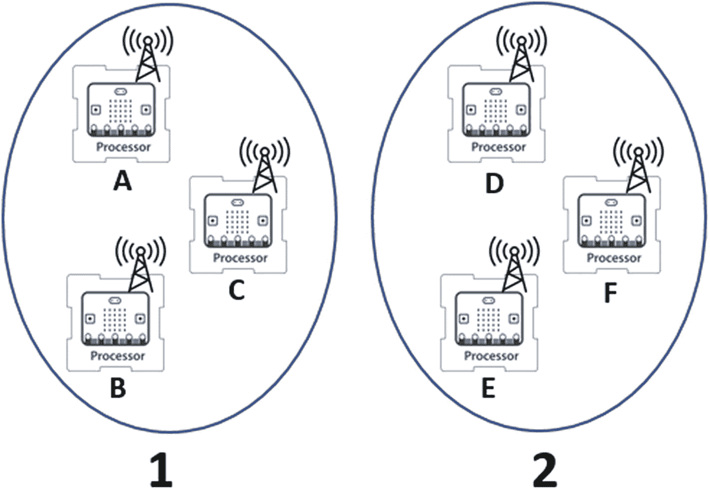
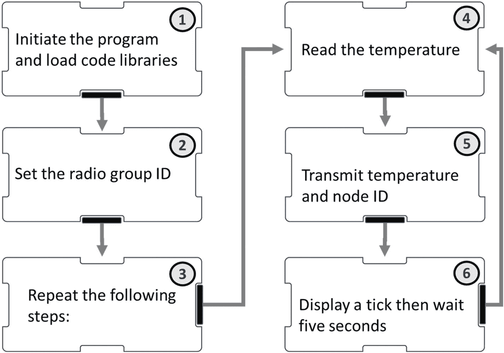
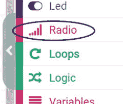
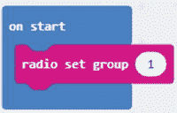
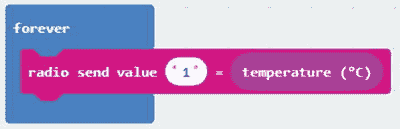
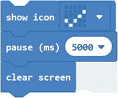
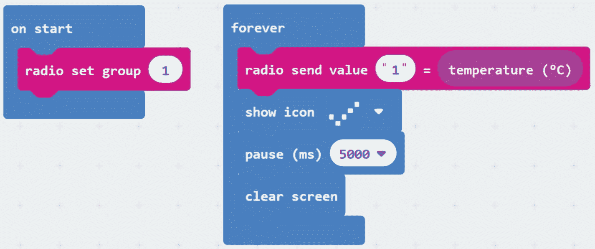
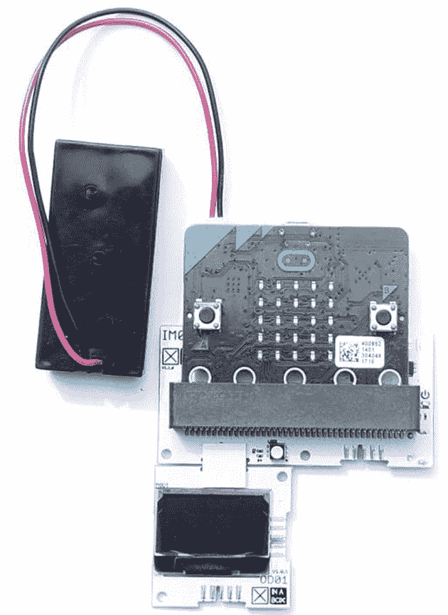
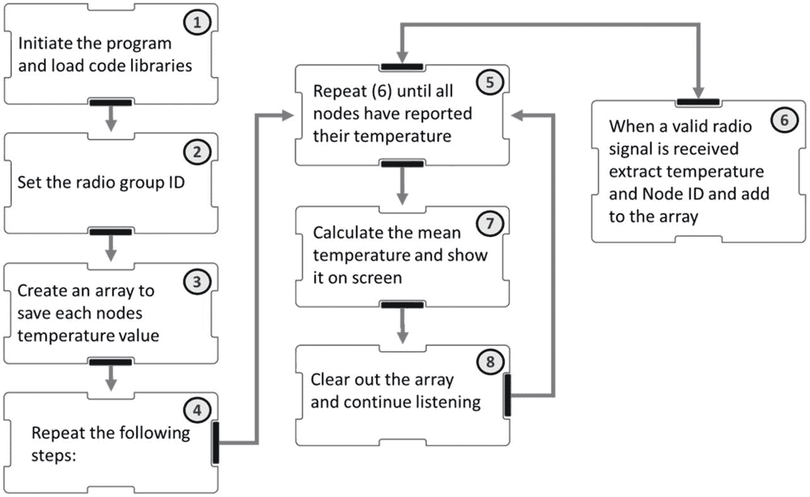
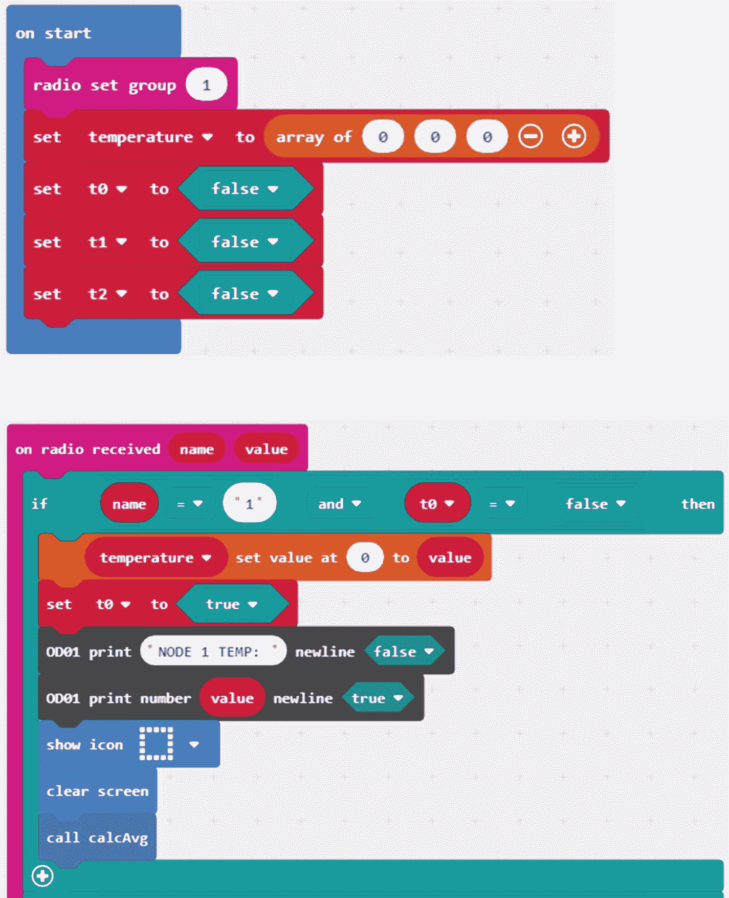

# 八、micro:bit 无线电的研究

在**章** [**7**](07.html) 中我们看到，BLE 神医在 micro:bit 上是由两个完全不同的组件组成的:

*   物理的机载无线电发射器/接收器(天线)

*   管理传输内容、传输方式和接收消息处理方式的 BLE 标准

BLE 充当管理者的角色:它管理天线的使用方式，但与天线完全分离。可以绕过 ble，直接接入无线电，自己管理天线。本章将探讨如何使用 micro:bit 无线电为我们的数据科学工具包带来价值。

## 8.1 标准很重要

BLE 做得很好的一件事是它允许 micro:bit 与其他(支持 BLE 的)设备通信。它可以与手机、平板电脑和笔记本电脑配对，但不能与其他 micro:bit 配对。

如果没有 BLE 标准来管理无线电通信，我们将面临同样的问题，我们可能会遇到听别人说我们不熟悉的语言:我们听到他们发出的声音，但我们无法从中提取意义。两台收音机可以发射和接收信号，直到奶牛回家:除非有一个共同的语言，发射机和接收机都同意使用，他们将无法理解对方。

某种交流标准是必要的:如果我们放弃 BLE，我们将不得不用别的东西来取代它。MakeCode 和 MicroPython 都提供了另一种更简单的使用车载无线电的方法。

## 8.2 使用无线电进行输入/输出

我们已经看到了如何将数据写入 micro:bit 的存储器，如何将数据打印到屏幕上，以及如何通过 BLE 连接传输数据。在所有这些情况下，我们所做的非常相似:我们输出数据。无线电只是我们可以输出数据的另一个地方:我们告诉微处理器从天线传输数据，而不是告诉它将数据发送到屏幕或文件。

MicroPython 和 MakeCode 都提供了将机载天线用作数据通信工具的工具。他们应用的标准是不同的；其主要后果是运行用 MicroPython 编写的代码的 micro:bit 不能通过无线电与用 MakeCode 编程的 micro:bit 通信。

MakeCode 和 MicroPython 都提供了使用天线所需的基本功能:它们允许将数据转换为无线电信号，无线传输，然后在接收时转换回数据。我们知道，如果我们将(例如)数字“4”或单词“hello”转换成要发送的无线电信号，那么在接收该信号的另一端的 micro:bit 将能够将该信号解释为“4”或“hello”的意思。但是正如我们将会看到的，在代码中仍然有我们要做的工作。

机载无线电的一个限制是它只能使 micro:bit 与其他 micro:bit 通信。我们可以用它来建立一个微型比特的封闭网络，它们可以互相交流。我们如何在数据科学工作中有意义地使用它？

## 8.3 使用无线电建立网络

在第**章** [1](01.html) 中，我们看到温度计记录环境温度，即传感器附近非常小的空间的温度。

为了测量一个房间/大面积区域的温度，以便我们可以对我们的结果充满信心，它有助于对几个不同的位置进行采样，并基于多个数据点得出答案。微型收音机是实现这一目标的最佳工具。

我们要做的是建立一个微小的网络:我们用四个，两个就够了，这个练习可以扩展到更多。我们的网络将按照描述运行:

*   我们将得到四个微型比特，它们通过无线电相互通信。

*   网络上的一个 micro:bit 将与其他 micro:bit 不同:我们将称这个 micro:bit 为我们的**服务器**或**收集器**，它将负责监听来自网络中其他 micro:bit 的无线电信号。

*   另外三个微:位是**节点**。他们是相同的，他们的工作是测量温度和传输结果。

*   服务器将从网络中的 micro:bit 监听温度数据。当它收到所有这些人的数据时，它会汇总这些数据并显示平均值。

**图** [**8-1**](#Fig1) 描绘了一个简单的基于无线电的 micro:bit 网络，具有三个节点和一个服务器。

图 8-1

我们的网络由四个独立的仪器组成

## 8.4 选择 MakeCode 或 MicroPython

MicroPython 和 MakeCode 处理无线电通信的方式有一些微妙的区别。其中最明显的是群组/频道:

*   在 MakeCode 中有 256 个组，范围从 0 到 255。要在 micro:bit 上使用无线电功能，必须将其分配给一个组。

*   在 MicroPython 中有 84 个(有些资料声称有 100 个)通道，编号为 0-83，您可以用它们来发送/接收。

对于本章的剩余部分，我们将使用 MakeCode:我们的目标是了解 micro:bit 上的 radio 可以为我们的数据科学实验增加什么价值，MakeCode 使用起来稍微简单一些。此外，避免考虑 MakeCode 和 MicroPython 如何实现 radio 的微妙但随意的差异将确保我们专注于核心信息。

## 8.5 使代码无线电组

当我们通过无线电发送数据时，比如说数字“4”，MakeCode 标准用其他数据填充它，比如**组 ID** 。因此，当您告诉 MakeCode 发送“4”时，实际传输的内容可能看起来更像“32_4”(这是简化的，但说明了问题)。所有数据被一起发送，并被称为一个**数据包**。

Micro:bit 在每个数据**包**内广播其**组 ID** 。此外，micro:bit 将只处理包含相同组 ID 的消息。**图** [**8-2**](#Fig2) 显示了六个微钻头部署成两组。

图 8-2

六个微钻头部署成两组

在组 1 micro 中:比特 A、B 和 C 在发送分组时都发送相同的组 ID，并且它们只处理它们接收的包括该组 ID 的分组。它们可以相互通信，但不能与第 2 组中的 micro:bit D、E 和 F 通信。组 2 中的 micro:位忽略来自组 1 的任何消息，反之亦然。

Micro:bit radio 不执行单向或双向通信。相反，它广播数据就像广播电台广播音乐和声音一样。任何一个 micro:bit 想要接收另一个 micro:bit 广播的数据，只需要在同一个组就可以了。

## 8.6 节点和收集器

为了构建我们的网络温度计，我们将设计一个简单的无线电网络，它由几个**节点**和一个**收集器**组成:

*   一个节点收集数据并将其传输到同一组中的其他 micro:bit。

*   收集器侦听来自节点的数据，并以某种预先确定的方式处理这些数据。

我们将使用的示例包括三个节点和一个收集器。您可以通过添加或删除节点来调整网络大小；如果是这样，您将需要修改代码。多达十个节点的 micro:bit 网络应该是相对稳定的。

**图** [**图 8-3**](#Fig3) 显示了我们将要建设的无线网络:

图 8-3

我们简单的无线电网络有三个节点和一个收集器

每个**节点**都有一个惟一的 ID，我们将在代码中定义它。它们各自测量**的环境温度**(使用内置的 micro:bit 温度计)，然后广播温度和它们的**节点 ID** 。其间会有 5 秒的时间延迟。

**收集器**将监控无线电传输。当它接收到具有正确的**节点 ID** 的消息时，它将从数据包中提取**温度**和**节点 ID** 。它将一直等到网络中的所有节点都报告了它们的温度；然后它会计算出平均温度，并显示出来。

## 8.7 构建节点

我们将**构建三个节点**。每个节点所需的硬件非常简单:只需要一个 micro:bit 和一个电源。我们将使用车载温度传感器、天线和 5x5 LED 矩阵来显示“**消息已发送**状态。**图** [**8-4**](#Fig4) 显示了我们的三个节点。

图 8-4

三个 micro:bit 温度传感器节点

我们需要写的代码在**图** [**8-5**](#Fig5) 用自然语言举例说明。

图 8-5

传感器节点的自然语言代码

**无代码选项**:你可以在我们的**资源网站**上找到本节使用的代码的预编译版本。转到 [`http://xib.one/XB`](http://xib.one/XB) ，搜索**第 8.7 节**。

**表** [**8-1**](#Tab1) 展示了如何将之前的自然语言代码转换成 **MakeCode** 块，这些块可以被编译并加载到你的**节点**中。

表 8-1

用 make 代码块开发传感器节点代码

  
| 

步骤

 | 

描述

 |
| --- | --- |
| one | 确保您的 MakeCode 项目具有 **Radio** 扩展名。如果没有，使用**扩展**选项将其添加到项目中。 |
| Two | 将**收音机组**模块添加到**启动**模块。使用默认的**组 ID** ，除非您需要不同的 ID(有效范围:0–255)。**注意**对所有节点使用相同的组 ID。 |
| three | 重复以下步骤。 |
| four | 将**无线电发送值**模块添加到**永久**模块。这将作为“名称-值对”发送数据:我们将发送我们的**节点 ID** 作为名称，发送温度作为值。 |
| five | 在**名称**框中输入**节点 ID** 。对其他节点使用 ***不同的*** **节点 id**。然后将**温度**块添加到**值**框中； |
| six | 在**无线电发送值**模块后添加以下模块:**显示图标**块用于在数据包发送后，在 micro:bit 5x5 LED 矩阵上显示一个**记号**。**暂停**模块用于每 5 秒发送一次数据。 |

**图** [**8-6**](#Fig6) 显示了微:位传感器**节点 1** 的 **MakeCode** 模块。

图 8-6

为传感器节点 1 生成代码块。它位于无线电组 1 中，其节点 ID 为 1

现在编译代码，并将其闪存到您的 micro:bit 上。将其标记为节点 1；然后为您的其他节点更改代码(只是**无线电发送值**块)并刷新它们。

## 8.8 构建服务器/收集器

我们的**服务器/收集器**也将使用一个 micro:bit 和电源，但我们将添加一个有机发光二极管显示器来查看数据(**图**[T5】8-7](#Fig7))。

图 8-7

服务器/收集器

代码需要工作的方式在**图** [**8-8**](#Fig8) 中用自然语言概述。

图 8-8

收集器的自然语言代码

**无代码选项**:我们的**资源网站**有 1、2、3 和 4 个节点的服务器/收集器代码版本。转到 [`http://xib.one/XB`](http://xib.one/XB) ，搜索**第 8.10 节**。

虽然自然语言代码相对简单，但对于一个没有经验的程序员来说，将其转换成 MakeCode 块(或 MicroPython)将是令人望而生畏的。我们正在有效地构建一个服务器，一个非常简单的服务器，但是这仍然是一个不平凡的编程任务。

完整的 MakeCode 块程序，共几页，如图**图** [**8-9**](#Fig9) 所示。如果您有兴趣了解自然语言代码的每一步是如何翻译成代码块的，请查看支持网站。

如果您对代码不太感兴趣，而对仪器支持的数据科学应用更感兴趣，那么可以问自己以下问题:

1.  您能否修改代码，使其适用于其他测量，例如湿度或 CO2 水平？

2.  你能修改代码来添加更多的节点吗？

3.  你能向程序员描述一下你需要什么，以便他们可以修改代码吗？

如果你对(3)的回答是肯定的，那么你会不会编程真的不重要。成为一名优秀的程序员是一名数据科学家必须具备的技能，但是没有它你也可以成为一名伟大的数据科学家。在后面的章节中，我们将连接到 Wi-Fi，构建一个物联网应用程序，并与人工智能通信。在这些情况下，我们使用的代码都不会像下面的代码那样复杂。非编码者:请坚持！

**图** [**8-9**](#Fig9) 显示了 micro:bit 采集器的 **MakeCode** 模块。

T3】

图 8-9

为微:位收集器生成代码块

将代码刷新到采集器上，然后加电。确保节点也已通电。

采集器将监听组 1 信道，当它接收到来自它被编程监听的节点之一的消息时，它将从该消息中提取温度数据并将其显示在屏幕上。当接收到来自所有节点的数据时，采集器将在有机发光二极管屏幕上显示平均温度(**图** [**8-10**](#Fig10) )。

图 8-10

有机发光二极管屏幕显示每个传感器节点的温度和计算出的平均温度

通过将节点放置在远程位置来测试您的网络:它们离收集器有多远，以及“视线”对范围有多重要？节点代码可以用来发送其他类型的数据，我们在前面的章节中已经看到了如何将传感器添加到 micro:bit 中。您可以在网络中添加哪些传感器来提供有用的数据？

## 8.9 总结

无线电功能可以用来创建能够相互通信的微型比特的封闭网络。我们之前建立的例子可以扩展:多达十个 micro:bit 应该在一个网络中一起工作。通过多个传感器的几个节点向服务器报告数据，您可以监视和控制办公室、教室、外来宠物栖息地、核反应堆或任何无线电覆盖的区域。

但是，只要这些网络是封闭的，我们就无法利用物联网的潜力，我们的范围将受到 micro:bit 能力的限制。无线电提供的功能可以在我们的数据科学工作中加以利用，但在我们能够连接到云并使用那里可用的服务之前，我们的工具包是不完整的。在**章** [9](09.html) 中我们将把 Wi-Fi 添加到 micro:bit 中，最终打开一个进入物联网的窗口。