# 九、使用 Wi-Fi 连接到互联网

在第**章** [**6**](06.html) 中，我们看到能够将我们的实验连接到互联网有可能极大地增强我们的数据科学工具包。在第**章** [**7**](07.html) 和**章** [**8**](08.html) 中，我们查看了 micro:bit 上的功能是否可以将我们连接到云，让我们访问那里可用的服务。尽管 BLE 和 micro:bit 无线电都提供了一些真正有用的无线功能，但我们仍然没有比几章前更接近于正确连接到物联网。是时候超越 micro:bit 的固有功能了。

如今，连接到物联网相对简单，最常见的是使用 Wi-Fi。 [1](#Fn1) 本章我们将为我们的 micro:bit 气象站添加 Wi-Fi，并将其连接到云端。

## 9.1 定义我们的物联网气象站

仅仅是在我们的 micro:bit 气象站中加入 Wi-Fi 就很好，但这实际上意味着什么:我们将要建造的是什么？我们需要更清楚地了解我们希望这个系统如何运作:

1.  我们的微型气象站不会有太大变化:我们将记录温度、湿度和压力数据。这次我们将通过 Wi-Fi 输出数据。

2.  我们将把 micro:bit 气象站连接到物联网平台。

3.  我们会将天气数据发送到物联网平台。

4.  当数据进入平台后，我们将可以使用许多工具/服务。我们将构建一个图表，实时显示数据并将其与历史数据进行比较。

正如我们在第**章** [**6**](06.html) 中看到的那样，一旦数据进入我们的物联网平台，我们将可以访问一系列工具，用于我们的数据科学事业。在**第 9.4 节**中，我们将建立我们的物联网平台，但首先我们将整理出我们需要的硬件。

## 9.2 建设我们的 Wi-Fi 气象站

除了我们在**章节** [**8**](08.html) 中使用的硬件，我们还需要引入一个提供 Wi-Fi 连接的模块。**图** [**9-1**](#Fig1) 显示了支持 Wi-Fi 的数字气象站仪器的框图。

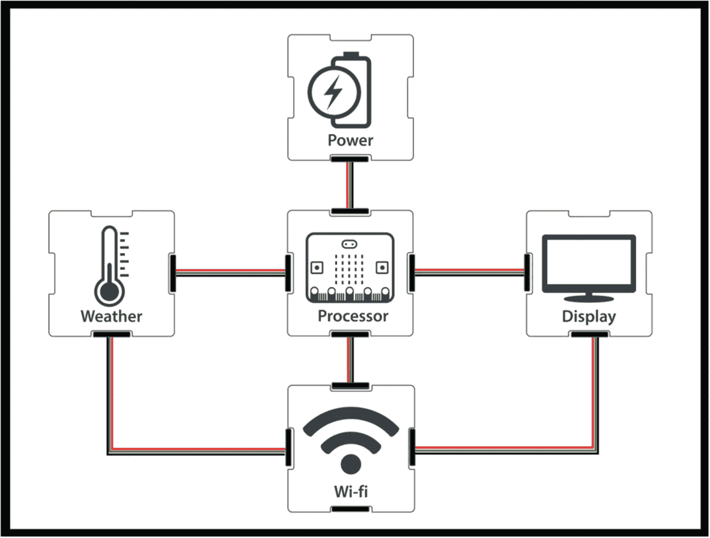

图 9-1

支持 Wi-Fi 的气象站工具所需的组件

**表** [**9-1**](#Tab1) 列出了我们用来构建 micro:bit 气象站边缘设备的具体硬件。

表 9-1

micro:bit 气象站边缘设备的硬件建议

    
| 

你需要什么

 | 

我们用什么

 | 

数量

 | 

可供选择的事物

 |
| --- | --- | --- | --- |
| 一个微处理器和闪存代码的方法 | 微型:带 micro-B USB 电缆的 bit | one | 树莓派赛车场 |
| 力量 | 通过 XinaBox IM01 的 USB 电源组 | one | XinaBox PB01–双 AA 电池电源组 |
| 读取天气数据的传感器 | XinaBox SW01 天气传感器 | one | SparkFun Weatherbit |
| Wi-Fi 核心 | 中国盒 CW01 无线局域网 | one | SparkFun ESP32 的东西 |
| 查看数据的屏幕 | 微型:5x5 位 LED 矩阵 | one | XinaBox OD01–64x 128 有机发光二极管显示器 |
| 将它们连接在一起的方法 | XinaBox IM01–微型:位桥 | one | 试验板、边缘连接器分线点、鳄鱼/鳄鱼线和连接线 |
| xBus 连接器 | Two |

**图** [**9-2**](#Fig2) 显示 micro:bit 气象站边缘设备组装后的样子。

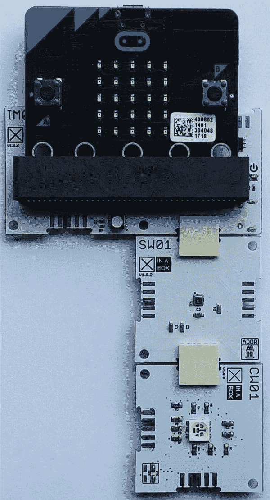

图 9-2

带 Wi-Fi 的微型比特气象站

## 9.3 更新固件

**固件**是作为其操作系统的微处理器上的计算机程序。我们编写的代码(在 MakeCode/MicroPython 中)和闪存到我们的 micro:bits 上的代码是固件解释的一组指令:我们的程序告诉固件做什么。

BBC micro:bit 大约在 5 年前首次发布，在那段时间里，它并没有真正改变。早期版本的 micro:bit 固件不支持 Wi-Fi:您可能需要更新您的固件，不仅是为了本章，也是为了第**章** [**11**](11.html) 中的示例。

这是一个很好的做法，以确保您的固件总是最新的，所以如果你最近没有更新它，我们建议你在继续之前这样做。这非常简单:只需将一个文件刷新到 micro:bit 上，就能确保所有最新版本和高级功能在您的 micro:bit 上正常工作。你可以在我们的资源网站上找到完整的说明，或者在 Micro:bit 基金会的网站上。

虽然我们只用它的 Wi-Fi 功能，但来自 XinaBox 的 CW01 也是一款微处理器；它也加载了固件。要将 CW01 与 micro:bit 配合使用，必须确保其运行正确的固件。尽管大多数阅读器不需要更新固件；这完全取决于您从哪里获得 CW01:

*   如果 CW01 是 XinaBox XK05 套件的一部分，则不需要更新。

*   如果您单独购买了 CW01，或者它附带了不同的套件(例如 XK01)，您将需要更新它。

我们的资源网站上提供了更新 CW01 固件的完整说明。

> 在继续之前，请确保 micro:bit 和 CW01 运行合适的固件。

## 9.4 选择物联网平台

建设物联网气象站，需要选择一个物联网平台来使用。有一系列的选择，有些比其他的更简单。

来自 XinaBox 的 CW01 Wi-Fi 模块的 MakeCode 扩展具有定制的块，可以轻松连接到 Ubidots、ATT 和 Azure。它还具有“通用”MQTT [2](#Fn2) 块，允许您连接到任何遵循 MQTT 标准的物联网平台。

出于以下原因，我们将使用 **IBM Cloud** 作为范例:

*   我们不得不选择一个，IBM 一直处于物联网的最前沿。

*   展示如何在 MakeCode 中使用 MQTT 块将使您能够更好地连接到任何物联网平台。定制的块更容易使用，但只能与定制的物联网平台一起使用。

*   您将可以访问广泛的 IBM 云服务(包括 IBM Watson AI 服务)。

*   他们提供 28 天免费服务，所以你可以免费测试。

要注册 IBM Cloud，你需要有一个 **IBMid** 。这允许您登录所有 IBM 产品和服务。如果您还没有电子邮件地址，以下步骤将解释如何使用您的电子邮件地址注册:

Warning

我们发现 outlook 电子邮件地址不能用于创建 IBM Cloud 帐户。Gmail 管用。

*   Go to the IBM Cloud login page ([`https://cloud.ibm.com/login`](https://cloud.ibm.com/login)), and click **Create an IBM Cloud account** (**Figure** [**9-3**](#Fig3)).

    

    图 9-3

    IBM Cloud 登录页面

*   输入您的**电子邮件地址**。

*   填写剩余字段，然后点击**创建账户**。

*   The next page will show you if your account has been created successfully (**Figure** [**9-4**](#Fig4)).

    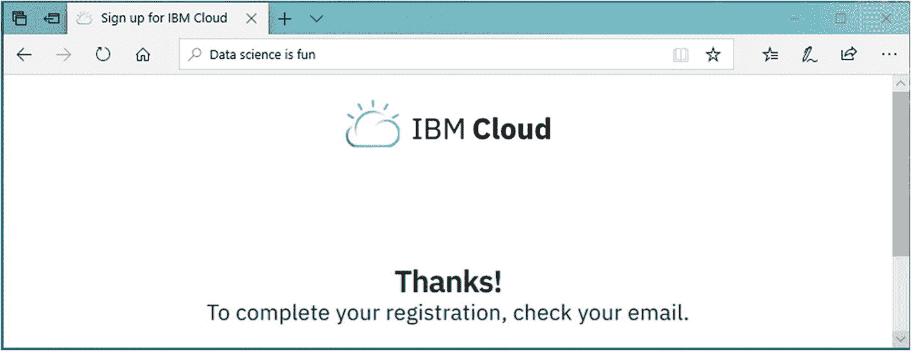

    图 9-4

    帐户创建成功消息

*   检查您的电子邮件，然后在发送给您的确认电子邮件中点击**确认帐户**来确认您的帐户。

*   您将被带到登录页面。点击**登录**继续。

*   您将被重定向到**关于您的 IBMid 帐户隐私**页面。在向下滚动页面找到**继续**按钮之前，确保您对隐私政策满意。

*   You will be automatically logged in to the **IBM Cloud Dashboard** (**Figure** [**9-5**](#Fig5)).

    

    图 9-5

    IBM 云仪表板

IBM Cloud Dashboard 是您可以访问所有 IBM 产品和服务的中心。

## 9.5 建立物联网平台

我们将连接 micro:bit 气象站的服务被恰当地命名为 **IBM 物联网平台**，它可以从 IBM Cloud Dashboard 访问，如下所述:

*   In the IBM Cloud Dashboard, click **Create resource** (**Figure** [**9-6**](#Fig6)).

    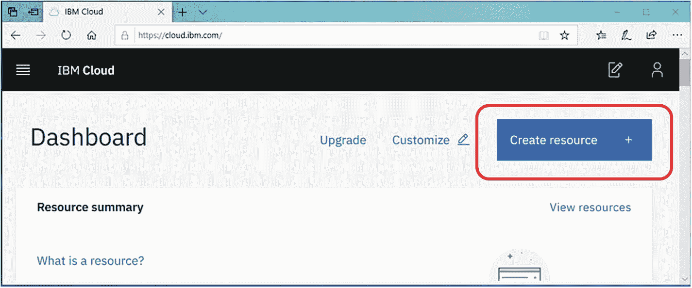

    图 9-6

    使用 IBM Cloud Dashboard 创建新资源

*   In the **Catalog** page, select **Internet of Things** from the Services list. Then select **Internet of Things Platform** from the filtered result (**Figure** [**9-7**](#Fig7)).

    

    图 9-7

    选择物联网平台服务

*   选择 **Lite 计划**。

*   Scroll down the page and rename the service name (e.g., **Weather Service**) (**Figure** [**9-8**](#Fig8)).

    

    图 9-8

    重命名默认服务名

*   点击**创建**。几秒钟后，服务将被创建。

*   Click **Launch** (**Figure** [**9-9**](#Fig9)).

    

    图 9-9

    我们天气服务的启动页面

*   这将把您重定向到 **IBM Watson 物联网平台**，我们将在下一节中设置它。

## 9.6 将我们的气象站添加到物联网平台

我们现在已经建立了一个物联网平台，我们将把我们的 micro:bit 气象站连接到该平台。我们仍然需要配置它，但是基本的基础设施已经就绪。

配置物联网平台的第一步是确定允许连接的设备。以下步骤将实现这一目标:

*   Click **Add Device** at the top right of the page (**Figure** [**9-10**](#Fig10)).

    

    图 9-10

    添加新设备

*   在**添加设备**窗口中，输入设备的名称和唯一 ID，然后点击**下一步** ( **图** [**9-11**](#Fig11) )。我们使用了下列详细信息:
    *   **设备类型** : *XinaBox*

    *   **Device ID**: *xb123456*

        

        图 9-11

        添加设备的第 1 步

*   在**设备信息**选项卡中，将所有设备信息留空，点击**下一步**。

*   在**安全**选项卡中，将**认证令牌**留空(让认证令牌自动生成)。点击**下一个**。

*   在**总结**页签中，点击**完成**。

*   下一页显示的是**设备凭证** ( **图**[T5】9-12](#Fig12))。

Warning

不清楚离开该页面后如何检索身份验证令牌。请记住拍摄该页面的屏幕截图或在纸上写下设备凭据。当您构建代码时，您将需要它们。

图 9-12

我们刚刚添加的设备的设备凭据

*   点击页面左上方的**后退**查看所有已添加的设备。您的设备将显示在设备列表中。

*   Click **Security** in the left navigation (**Figure** [**9-13**](#Fig13)).

    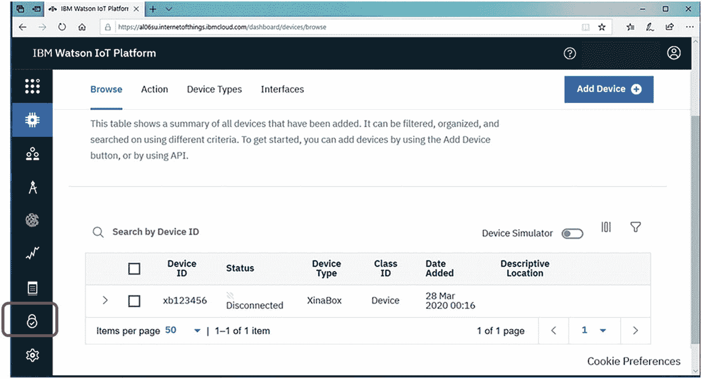

    图 9-13

    左侧菜单中有“安全”选项卡

*   In the **Policies** page, click **edit** to edit the **Connection Security** (**Figure** [**9-14**](#Fig14)).

    

    图 9-14

    策略页面

*   Choose **TLS Optional** from the **Security Level** drop-down list (**Figure** [**9-15**](#Fig15)). Then click **Save** at the top right.

    

    图 9-15

    为默认规则选择的安全级别适用于您的所有设备

在**第 9.5 节**中，我们设置了“物联网应用”的外壳，在这一节中，我们定义了与我们要连接的设备相关的关键参数。剩下的就是告诉我们的物联网应用程序如何处理我们将从该设备发送给它的数据。

## 9.7 在物联网平台中可视化数据

在本节中，我们将告诉我们的物联网平台如何处理数据以及如何输出/显示数据。我们将建立一个可视化:折线图。

IBM Watson 允许我们建立虚拟的“图钉板”,我们可以在上面添加各种不同的内容。稍后，当一切顺利运行时，我们将能够从浏览器中查看这些插针板(称为**板**)。

我们添加到板上的内容被称为**卡片**。卡片是预定义的项目(如折线图)，用于显示我们物联网平台中定义的设备的数据或相关数据。我们可以在一块板上添加多张卡。在本节中，我们将在沃森物联网仪表板中创建一个新的**板**，然后向其添加一个**卡**。

使用以下步骤添加新板:

图 9-17

新创建的板显示在您的板下

*   点击左侧导航栏中的**电路板**。

*   点击 **+创建新板**。

*   在**新建新板**窗口中，在**信息**页签中，提供以下配置详情(**图** [**9-16**](#Fig16) )。然后点击**下一个**按钮。
    *   **板名** : *天气*

    *   **Description**: *Displays sensor data from various weather sensors.*

        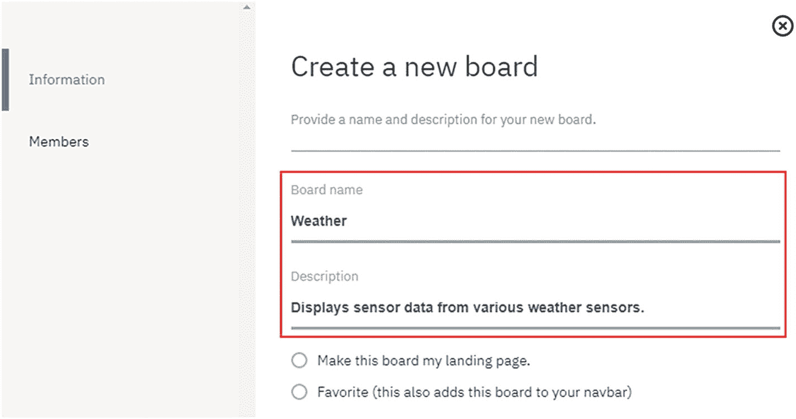

        图 9-16

        创建新仪表板:信息选项卡

*   在**成员**选项卡中不提供任何信息。点击**提交**即可。

*   将创建**板**并加载**你的板**页面(**图** [**9-17**](#Fig17) )。

我们现在有了一个空的插针板，可以在上面添加卡；我们将添加一个折线图卡来显示收到的天气数据。该折线图将显示温度和相对湿度数据(不是压力——这使图表混乱，因为用于压力的刻度是如此不同)。你会看到有一系列不同的卡，你可以添加到董事会。

*   点击**天气**板。

*   点击 **+添加新卡**。

*   In the **Create card** window, click the **Line chart** (**Figure** [**9-18**](#Fig18)).

    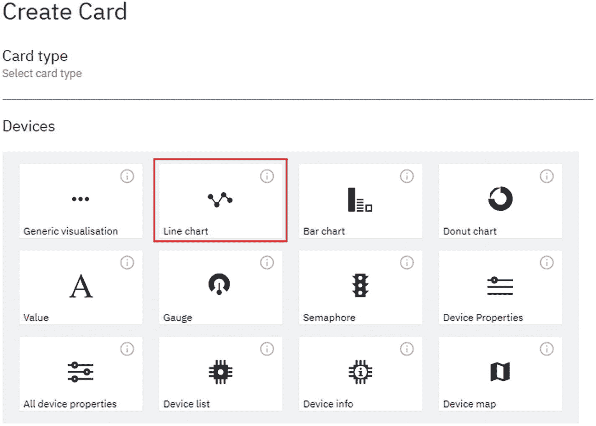

    图 9-18

    选择折线图数据可视化选项

*   In the **Create Line chart Card** window, in the **Card source data** tab, select the **device** you created earlier and click **Next** (**Figure** [**9-19**](#Fig19)).

    

    图 9-19

    选择设备

*   点击选择 **xb123456** 设备(rem——这是我们在**第 9-6 节**中指定的**设备 ID** ，然后点击**下一步**。

在这一步中，我们已经将 micro:bit edge 设备链接到折线图。我们现在需要告诉折线图使用哪些数据以及如何处理它。我们将添加两个数据集(温度和湿度)；我们需要用**表** [**9-2**](#Tab2) 中的细节添加这些**新数据集**。

表 9-2

用于设置折线图卡的参数

   
| 

您需要输入的数据点的名称

 | 

要输入的温度值

 | 

要输入的湿度值

 |
| --- | --- | --- |
| **事件** | 状态 1 | 状态 2 |
| **属性** | 温度 | 湿度 |
| **名称** | 温度 | 湿度 |
| **类型** | 数字 | 数字 |
| **单位** | C | % |
| **分钟** | -40 | Zero |
| **最大** | eighty-five | One hundred |

*   在**卡片预览**页签中，点击 **XL** 。然后点击**下一步**。

*   在**卡片信息**页签中，提供以下详细信息，点击**提交**。
    *   **标题** : *实时和历史天气数据*

    *   **配色**:选择任意颜色

卡已经添加到电路板上，电路板现在可以使用了:一旦我们设置了数据馈送，我们应该可以看到折线图随着温度和湿度数据实时更新。

其他卡片也可以用同样的方法添加到棋盘上。为什么不添加一张卡片来显示压力数据呢？

## 9.8 为我们的 Wi-Fi 气象站编码

在本节中，我们将编写使 micro:bit 像数字气象站一样工作所需的代码；我们首先设置物联网平台，因为我们需要在代码中包含它的细节。**图** [**图 9-20**](#Fig20) 用自然语言勾勒出程序流程。

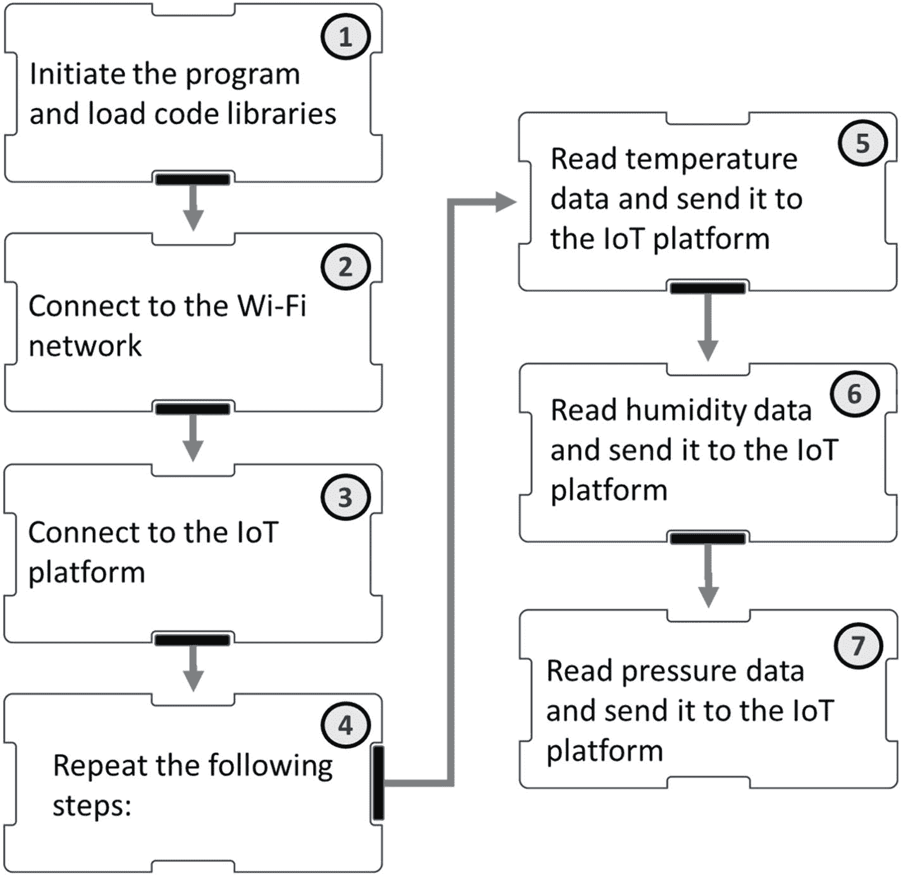

图 9-20

我们物联网气象站的自然语言代码

**图** [**9-20**](#Fig20) 包括两个我们之前没有遇到过的步骤:

*   **第二步**:连接 Wi-Fi 网络。要连接到 Wi-Fi 网络，你需要知道它的名字( **SSID** 和**密码**)。在你开始写代码之前，准备好这些。

*   **第三步**:连接物联网平台。这在**表** [**9-3**](#Tab3) 中有解释。

您需要在代码中输入物联网平台的许多细节。**表** [**9-3**](#Tab3) 解释了如何找到并构建 MakeCode 中使用的每个参数。

表 9-3

设置生成代码块的参数

  
| 

要在生成代码中设置的参数

 | 

在哪里找到/如何创建参数

 |
| --- | --- |
| 要连接物联网平台，需要设置**客户端 ID** 值。 | 客户端 ID 由 3 个参数组成，您需要以一种非常特殊的格式将它们连接在一起(" **concatenate** ")。您需要的参数是组织 ID 设备类型设备 ID 格式是***d:组织标识:设备类型:设备标识**T3】*当您正确地连接数据后，它应该看起来像这样:**d：奥普拉 53：中国包装：xb123456** |
| 要连接到物联网平台，需要在**Connect to MQTT broker**块中设置 3 个值。 | 为此，您需要在连接到 MQTT broker 块的**中输入 3 个参数:**1.**代理 URL** (或“连接地址”)*在字符串“. messaging . internetofthings . IBM cloud . com”*的前面加上 ***组织 ID*** **一个正确的* ***经纪人网址*** *看起来是这样的:*

奥普拉 53。messaging.internetofthings.ibmcloud.com

2.**用户名**

*此处输入固定字符串“use-token-auth”。*

3.**密码**

*密码是* ***设备凭证*** *部分中指定的* ***认证令牌*** *。**  |
| 要向物联网平台传递数据，你需要向特定的**主题发送一个**有效载荷**。** | 我们发送到物联网平台的内容被称为**有效载荷**，我们必须指定我们要将它发送到哪里:T2 主题。1.**有效载荷**我们必须连接 3 位来构建有效载荷。选择一个连接块并添加以下元素:{" *【变量名】*":"您想要发送的值• "}因此，如果您正在发送温度数据，连接块将如下所示: |
|   | 2.**话题**主题是一个字符串，它告诉物联网平台将数据传递到哪个卡，以及它是哪个数据点。题目的格式为 ***iot-2/evt/ <事件>/fmt/JSON**T3】。*一个有效的主题应该是这样的:**IOT-2/evt/status 1/fmt/JSON****<事件>** 是您建卡时输入的事件名称，在**编辑折线图卡>连接数据集:** |

**表** [**9-4**](#Tab4) 显示了如何使用**表** [**9-3**](#Tab3) 中列出的参数将**图** [**9-20**](#Fig20) 中的代码转换成 MakeCode 块。

表 9-4

使用 make 代码块开发代码

  
| 

步骤

 | 

描述

 |
| --- | --- |
| one | 开始一个新项目。添加 XinaBox **SW01** 和 **CW01** 扩展。 |
| Two | 将 **CW01 连接到 WiFi** 模块添加到启动模块的**中。**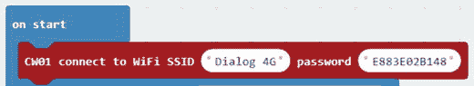这会将您的 CW01 连接到 Wi-Fi 网络。 |
| three | **连接物联网平台/设置客户端 ID:**将 **CW01 set MQTT client ID** 模块添加到 start 模块的**中:** |
| **连接物联网平台/设置 MQTT 代理:**在**设置 MQTT 客户端**程序块之后，将以下程序块添加到**启动**程序块中: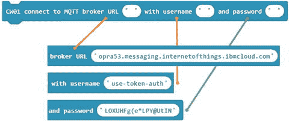这将把气象站连接到 MQTT 代理。**详见表** [**9-3**](img/#Tab3) **。** |
| four | 使用**永久**块。 |
| five | 将 **CW01 发送有效载荷**块添加到**永久**块中；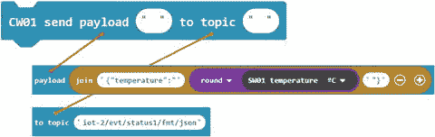**详见表** [**9-3**](img/#Tab3) **。** |
| six | 修改步骤 6 中所示的连接块，以发送湿度数据:CW01 发送有效载荷块的其余部分保持不变。 |
| seven | 我们还没有建立我们的物联网平台来处理压力数据，所以我们没有地方发送它。如果您已经设置了一个卡来显示压力数据，您应该尝试修改步骤 6 中的代码并将其添加到此处。 |
|   | 用暂停来完成程序，以控制数据传输的速率: |

**图** [**9-21**](#Fig21) 显示了完整的 **MakeCode** 程序块。

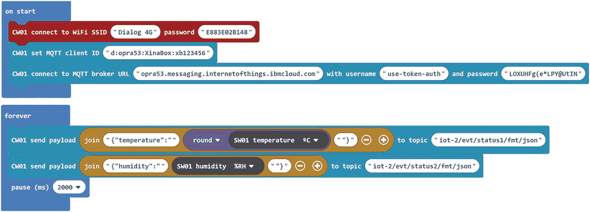

图 9-21

为 Wi-Fi 气象站制作代码块

完整的代码可以在我们的资源网站上找到。您将需要调整参数以与您的物联网平台配合工作，如**表** [**9-3**](#Tab3) 中所述。

## 9.9 气象站的供电和运行

编译代码并将其闪存到您的 micro:bit 上。完成闪烁后，从 micro:bit 上拔下 USB 电缆。我们需要以特定的方式给气象站加电，如下所述:

图 9-24

气象站正在向 IBM Watson 物联网平台发送数据

*   将 IM01、SW01 和 CW01 连接在一起。暂时不要连接 micro:bit。

*   Connect a USB power cable to the IM01 (**Figure** [**9-22**](#Fig22)). Wait until there is a strong blue light showing on the CW01\. It should take a few seconds at most.

    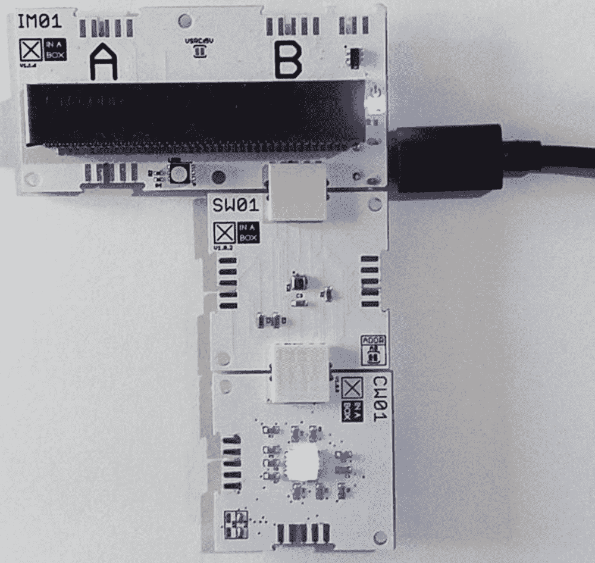

    图 9-22

    供电过程的第二步

*   Now you can connect your micro:bit to the IM01 (**Figure** [**9-23**](#Fig23)). On start the micro:bit should display the pattern shown. This indicates that the CW01 is trying to connect to the Wi-Fi network.

    

    图 9-23

    供电过程的第 3 步

*   一旦连接到 Wi-Fi 网络，字母 C 就会显示在 5X5 LED 矩阵上。

*   接下来气象站将尝试连接到 IBM Watson 物联网平台。LED 矩阵上的菱形图案表示气象站和 IBM Watson 物联网云之间的活动连接。

只要 micro:bit 通电且菱形图案显示，数据就会发送到物联网天气服务。下一节解释如何查看数据。

## 9.10 查看数据可视化

随着一切顺利运行，micro:bit 气象站应该会将数据传输到物联网平台。通过查看您在插接板上设置的可视化来确认这一点:

*   Click **Boards** in the left navigation and then click the **Weather** board created in **Section 9.7** (**Figure** [**9-25**](#Fig25)).

    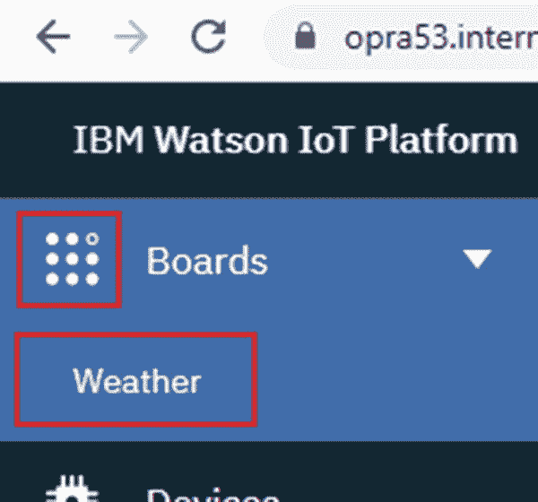

    图 9-25

    访问折线图以查看来自气象站的数据

*   折线图将显示您指定时间段内的温度和湿度数据(**图** [**9-26**](#Fig26) )。

Note

还可以选择发布公告板并公开发布。在**版块设置的**成员**标签下，**有一个选项**只读分享给所有人**。选中此框将通过您可以共享的 URL 提供对公告板的公共访问。

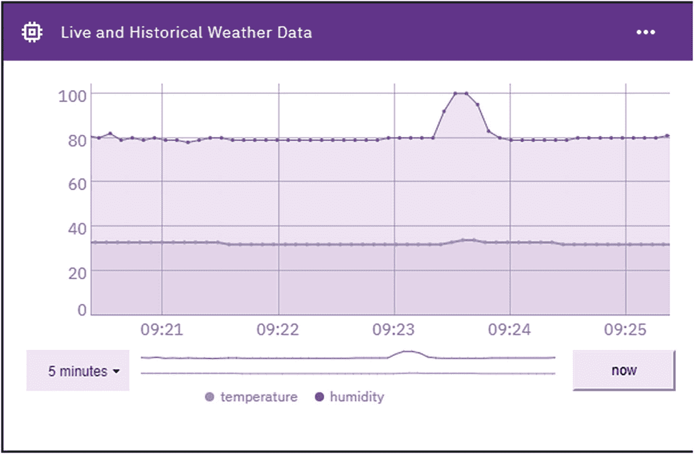

图 9-26

我们板上显示实时和历史天气数据的折线图卡

## 9.11 摘要

如果一切按计划进行，您的气象站将连接到物联网平台，您可以使用网络浏览器在板上查看实时数据。冒着显而易见的风险，你可以在世界上任何一个地方(可以连接互联网的地方)查看公告板。如果这看起来很平凡，请记住，20 年前这是非常困难的，甚至 10 年前，也许 5 年前，你需要一个广泛的专业技能来建立这样的东西。

所以花一点时间来感受一种成就感:你在这一章中所做的并不是微不足道的，只有极小一部分人类曾经成功地做到了这一点。更重要的是，我们建立的模型是一个我们将任何传感器数据发送到云服务的模型。切换不同的传感器相对来说比较简单，这大大扩展了该系统的潜力。此外，我们使用了一个提供丰富的可视化工具集的服务，但是连接到其他类型的服务，甚至可能是人工智能服务呢？这正是我们在**章** [**11**](11.html) 和**章** [**12**](12.html) 中要做的。

但是在我们渴望使用人工智能之前，我们需要对它有一点了解，我们将在第**章** [**第 10 章**](10.html) 中看到。

<aside aria-label="Footnotes" class="FootnoteSection" epub:type="footnotes">Footnotes [1](#Fn1_source)

大多数人认为缩写词 **Wi-Fi** 来源于短语“无线保真”。事实上，Wi-Fi 是 IEEE 802.11x(T3)的商标术语，IEEE 802.11 x 是无线通信的标准(当然，蓝牙也是)。它与蓝牙的不同之处在于它最适合的用途。蓝牙用于在较短的范围内将两个设备安全地连接在一起(例如，将耳机连接到移动电话)。Wi-Fi 覆盖范围更广，速度更快，功耗更低，旨在为互联网提供通信网络。

就我们的目的而言，我们可以将 Wi-Fi 理解为智能设备与互联网无线共享数据的方式。

  [2](#Fn2_source)

MQTT(消息队列遥测传输)是一种无线通信标准。它不是 Wi-Fi(或蓝牙)的竞争对手:它是一个适用于使用 Wi-Fi 发送信息的标准。对于我们的需求来说，知道大多数物联网平台将符合 MQTT 就足够了。如果您知道如何连接到一个 MQTT 物联网平台，那么您应该能够连接到其他平台。

 </aside>