# 二、数据操作

在本章中，我们将回顾 Wolfram 语言中数据创建和数据处理的基础知识。本章从列表的概念开始；我们定义了这个结构中可以包含的内容，以及列表、嵌套列表、数组、向量和矩阵的创建。我们将探讨如何对列表进行排序，如何分配新值，最后如何根据已建立的模式选择列表的元素。

## 列表

列表是 Wolfram 语言中数据构造的核心。列表可用于收集对象、构建数据结构、创建表格、存储值或变量、进行简单到复杂的计算，以及用于数据特征化。总的来说，列表可以代表 Wolfram 语言中的任何表达式(数字、文本、数据、图像、图形等)。)—即任意一组数据。

如果我们访问 list 的信息，我们可以在图 [2-1](#Fig1) 中看到如何形成 List 的常见结构。列表由大括号或 List 命令表示。在 Wolfram 语言中，几乎每个结果数据对象都是可列表的；换句话说，列表允许我们通过一起操作(使用相同的标识符)或单独操作每一个来对保持某种类型关系的数据进行分组，即使它们是不同的类型。

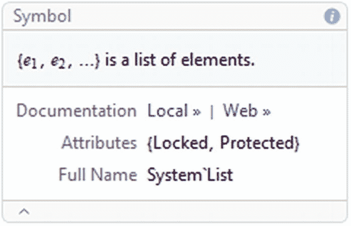

图 2-1

Wolfram 语言中的列表定义

```py
In[1]:= ??List
Out[1]=

```

从评估中可以看出，元素由逗号分隔，整个列表在花括号之间。同样，List 是一个受保护的变量；这意味着我们不能给名单赋值。

### 数字的类型

Wolfram 语言中的基本数字类型是由整数、有理数、实数和复数表示的类型。

首先，整数有一个精确的结果，因为它们是不能用小数点表示的数字。

```py
In[2]:= {10, InputForm[10]}
Out[2]= {10,10}

```

因此，Wolfram 语言对整数的处理具有无限的精度和无限的准确性。

```py
In[3]:= {10//Accuracy, InputForm[10]//Precision}
Out[3]= {∞, ∞}

```

第二，有理数是那些可以用两个整数的商来表示的数。

`In[4]:= {5/10,InputForm[10/12]}`

`Out[4]= {`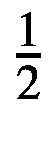T1】

Mathematica 将有理数完全视为整数，这就是为什么每当 Mathematica 处理有理数时，它都会返回表示该数的最小表达式。

```py
In[5]:= {5/10 //Accuracy,InputForm[10/12] //Precision}
Out[5]= {∞ ∞}

```

第三，有实数，俗称浮点数。在 Wolfram 语言中，任何包含小数点的数字都表示为实数。

```py
In[6]:= {2.72 //Precision, InputForm[2.72]}
Out[6]= {MachinePrecision,2.72}

```

因为实数是近似的，所以它们没有精确的精度，但是它们被认为是机器号，具有$MachinePrecision 变量的精度。需要注意的是，在 Wolfram 语言中，数字 1 和 1.0 的处理方式是不同的。尽管 Mathematica 承认它们是等价的表达式，但必须考虑到它们在 Wolfram 语言中不是同一个对象。

为了证实这一点，让我们看看下面的例子，我们使用 SameQ 来测试 1 和 1.0 的表达式是否相同。

```py
In[7]:= SameQ[Head[1],Head[1.0]]
Out[7]= False

```

我们看到表情的头部是不同的；这是因为一个是整数，另一个是实数。

```py
In[8]:= {Head[1],Head[1.0]}
Out[8]= {Integer, Real}

```

复数是那些包含实部和虚部的数字。复数的形式是 a + bi，其中 a 项属于实部，b 项属于虚部。数学中的符号“I”代表负数- 1 的平方根。

```py
In[9]:= 10+19I
Out[9]= 10+19I

```

这些数字的精度类型可以是精确的或近似的，因为这些数字可以从前面描述的数字中建立。

`In[10]:= {precision[I], precision`![$$ \left[\frac{1}{2}+0.3\mathrm{I}\right] $$](img/500903_1_En_2_Chapter_TeX_IEq2.png)T1】

`Out[10]= {` ∞ `Machineprecision, Complex[11, 1]}`

我们知道复数是原子表达式，但即便如此，这些数还可以细分成不同的表达式，比如我们提取每个数的实部和虚部时的情况。

```py
In[11]:= 1+I //AtomQ
Out[11]= True

In[12]:= {ReIm[1+3I],Re[1+0.3I],Im[Complex[1,0.2]]}
Out[12]= {{1,3},1.,0.2}

```

当我们处理圆周率和黄金分割率等超越数时，这些数字被视为符号，也就是说，Mathematica 保留了这些符号，因为它们是重要的数值常数，因此尽管它们是实数，但却具有精确的精度。

```py
In[13]:= {Accuracy[\[Pi]],Precision[E],Accuracy[I],Precision[GoldenRatio]}
//NumberQ
Out[13]= False

```

为了知道一个数字在 Wolfram 语言中是否被认为是一个数字，如果表达式是一个数字，NumberQ 命令给出一个结果 True，否则给出 False。

```py
In[14]:= {NumberQ[1/2],NumberQ[1],NumberQ[E]}
Out[14]= {True,True,False}

```

由此，我们可以看出有理数和整数是怎样的数，而数 e 不是。事实上，我们可以看出你是符号型的。

```py
In[15]:= {Head[E],FullForm[E]}
Out[15]= {Symbol,E}

```

一般来说，在 Wolfram 语言中组合不同类型的数字没有限制。我们可以在不同类型之间执行操作。

```py
In[16]:= {1+0.2+1/2+1+11+1I}
Out[16]= {13.7 +1\. I}

```

近似值与精确数之间的转换是通过合理化实现的。

```py
In[17]:= Rationalize[2.72]
Out[17]= 68/25

```

此外，还支持不同的数字记数法，如科学记数法；科学记数法是用 10 的幂来表示大数的非常有用的工具。

`In[18]:= ScientificForm` 

`Out[18]//ScientificForm= 2.71828x10`<sup>`-5`T3】</sup>

我们知道函数 N 是用来计算近似值的。它将精确的表达式转换为近似的表达式，记住期望的精度也可以包括在内。

还有不同的形式，通常可以推广到 Wolfram 语言的所有内置函数符号。

1.  将函数 N [ ]直接应用于表达式。

    ```py
    In[19]:= N[13/7]
    Out[19]= 1.85714

    ```

2.  利用中缀符号，~N~。

    ```py
    In[20]:= ⅇ~N~ⅇ
    Out[20]= 2.72

    ```

3.  通过后缀符号，// N.

    ```py
    In[21]:= ⅇ//N
    Out[21]= 2.71828

    ```

4.  通过前缀符号 N@。

    ```py
    In[22]:= N@ⅇ
    Out[22]= 2.71828

    ```

当没有定义精度时，Mathematica 使用$MachinePrecision 的值来确定近似值的标准精度。$MachinePrecision 的值是可变的，因为它是 Mathematica 根据每台计算机的特征建立的浮点数。

```py
In[23]:= $MachinePrecision
Out[23]= 15.9546

```

用设定精度设置任意精度:

```py
In[24]:= SetPrecision[ⅇ,17]
Out[24]= 2.7182818284590452

```

使用机器精度:

```py
In[25]:= SetPrecision[ⅇ,MachinePrecision]
Out[25]= 2.71828

```

如果没有引入精度，Mathematica 将使用机器精度数。

```py
In[26]:= SetPrecision[ⅇ,MachinePrecision] =N@ⅇ
Out[26]= True

```

另一种精确输入近似值的方法是在实数后输入重音符(` ),后跟精度。这里我们用它来表示六位数的精度。

```py
In[27]:= 77/3`6
Out[27]= 25.6667

```

### 使用数字

若要提取组成精确数字的数字，请使用 IntegerDigits 函数。

```py
In[27]:= IntegerDigits[234544553]
Out[27]= {2,3,4,5,4,4,5,5,3}

```

近似数字的实数:

```py
In[28]:= {RealDigits[321.4546554], RealDigits[N@ⅇ]
Out[28]= {{{3,2,1,4,5,4,6,5,5,4,0,0,0,0,0,0},3},{{2,7,1,8,2,8,1,8,2,8,4,5,9,0,4,5},1}}

```

在复数的情况下，它包括提取它的实部和虚部，然后根据具体情况提取每个部分的数字。

```py
In[29]:= RealDigits[ReIm[113+2.7213I]]
Out[29]= {{{1,1,3,0,0,0,0,0,0,0,0,0,0,0,0,0},3},{{2,7,2,1,3,0,0,0,0,0,0,0,0,0,0,0},1}}

```

默认情况下，前面两个函数给出十进制的结果。要定义基数，只需输入你想要的基数作为函数的第二个参数。

```py
In[30]:= RealDigits[321.4546,2]
Out[30]= {{1,0,1,0,0,0,0,0,1,0,1,1,1,0,1,0,0,0,1,1,0,0,0,0,0,1,0,1,0,1,0,1,0,0,1,1,0,0,1,0,0,1,1,0,0,0,0,1,1,0,0,0,0},9}

```

在后一个示例中，我们提取以 2 为基数的数字的位数。

以 10 为基数的数字 e 显示 3 位数的规范。

```py
In[31]:= RealDigits[N@ⅇ, 10, 3]
Out[31]= {{2,7,1},1}

```

用 FromDigits 函数可以从整数的表示中重建一个数。

```py
In[32]:= FromDigits[{2,7,1,1}]
Out[32]= 2711

```

此外，有可能形成一个浮点数，

```py
In[33]:= N@FromDigits[{{2,7,1,1},1}]
Out[33]= 2.711

```

并测量整数的长度。

```py
In[34]:= IntegerLength[2711]
Out[34]= 4

```

### 一些数学函数

Wolfram 语言拥有从最基本到最专业的大量数学函数。这些函数可以用数字或符号来处理，这样就可以进行纯粹的分析操作。

三角函数有弧度和度数两种形式。仅键入一个数字将计算并返回弧度值。

```py
In[35]:= Cos[Pi]
Out[35]= -1

```

输入后跟单位度数或度数符号的数字( )将计算并返回度数值。

```py
In[36]:= Sin[90 Degree]==Sin[90\[Degree]]
Out[36]= True

In[37]:= Sin[90\[Degree]]
Out[37]= 1

```

这同样适用于双曲三角函数和反三角函数。

```py
In[38]:= N[Cosh[Pi]]
N[Tanh[45 Degree]]
Out[38]= 11.592
Out[39]= 0.655794

In[40]:= N[ArcTan[Pi]]
N[ArcSinh[45 Degree]]
Out[40]= 1.26263
Out[41]= 0.721225

```

对数函数和指数函数像普通数学符号一样书写。只有一个数字的对数将计算自然对数。

```py
In[42]:= Log[E]
Out[42]= 1

```

若要指定基数，请键入数字作为第一个参数，键入基数作为第二个参数。

```py
In[43]:= Log[10,10]
Out[43]= 1

```

指数可以用 Exp 或常数 e 来表示。

```py
In[44]:= Exp[2]==E^2
Out[44]= True

```

阶乘是通过在数字后键入感叹号或使用阶乘来表示的。

```py
In[45]:= 12!
Out[45]= 479001600

In[46]:= Factorial[12]
Out[46]= 479001600

```

### 数字函数

在 Wolfram 语言中，有一些提供数字数据操作的函数。这些函数可以处理任何类型的数字(实数、整数、有理数、复数)。精度可以完全处理，即最精确形式的数字或具有浮点精度的数字。

若要截断最接近 z 的数字 z，请使用不带参数的 Round。添加第二个参数会将数字 z 舍入到第二个数字的最近倍数。

```py
In[47]:=Round[8.9](*Rounds to 9 because it is the closest number*)
Out[47]= 9

In[48]:=Round[8.9,2](*Rounds to 8 because it is the closest multiple of 2, 2^3*)
Out[48]= 8

```

给定一个数字 z，可以截断数字的其他类似函数是 Floor 和 Ceiling。第一个舍入到小于或等于所键入数字的最大整数，第二个舍入到大于或等于所键入数字的最小整数。

```py
In[49]:= Floor[Pi]
Out[49]= 3

In[50]:= Ceiling[Pi]
Out[50]= 4

```

地板和天花板函数可以用它们的数学符号来写，⌊z⌋代表地板，⌈z⌉代表天花板，键入 ESC lf ESC 代表左地板，ESC rf ESC 代表右地板。天花板也是如此——只需将 lc(左天花板)和 rc(右天花板)的 lf 更改即可。

```py
In[51]:= ⌊Pi⌋
Out[51]= 3

In[52]:= ⌈Pi⌉
Out[52]= 4

```

将浮点数转换成有理近似值可以通过合理化来完成。但是添加数字 0 作为第二个参数可以强制计算找到浮点数的最精确形式。例如，对数字 e 的有理逼近。

```py
In[53]:= Rationalize[N[E],0]
Out[53]= 325368125/119696244

```

函数 Max 和 Min 返回一组数字的最大值和最小值。

```py
In[54]:= Max[9,8,7,0,3,12]
Out[54]= 12

In[55]:= Min[0987,32,9871]
Out[55]= 32

```

## 对象列表

在这一节中，我们将把 Wolfram 语言中的列表概念扩展到创建列表的技术，通过专门的函数创建嵌套列表，以及如何在变量中有效地存储数据。该主题是从如何创建数据集以及它们如何来自各种函数发展而来的，因为列表的创建可以有各种各样的内容，这些内容可以是数字、文本字符串、等式、算术运算或 Mathematica 中的任何表达式的集合。尽管如此，我们还是会看到数组、稀疏数组等概念，以及它们各自的对象类型。我们还将讨论嵌套列表的主题，以及如何以多种方式在嵌套表单中创建数据。

### 列表表示

花括号表示一般对象的列表；列表的成员由逗号分隔。创建列表最简单的方式是用花括号将数据括起来，或者使用函数列表。以下示例显示了如何将列表分配给变量，以及如何将对象收集到一个列表中。

```py
In[56]:= {x2+1, "Dog", π}
List[1,P,Power[3,2]] (* Power[3,2] represents 3 raised to the power of 2 *)
Out[56]= {x2+1, "Dog", π}
Out[57]= {1,P,9}

```

列表标识符或符号是创建结构的可选名称。

```py
In[58]:= List["23.22","Dog", π,2,4,6,456.,56,2==3 && 3==2]
Out[58] = {23.22,Dog, π,2,4,6,456.,56,False}

```

在列表中，在大括号之间，我们可以定义我们认为适合列出的所有元素。

```py
In[59]:= {1+I, π + π,"number 4",Sin[23 Degree],425+I-413-3I,24,4456.,"dog"+"cat"}
Out[59]= {1+I, 2π,number 4,Sin[23 °] 12-2 I,24,4456.,cat+dog}

```

在 Mathematica 中，有不同类型的对象。为了识别对象类型，我们必须使用 Head 函数。返回值是表达式的头，称为数据类型。如果我们将 Head 应用于一个列表，我们将得到表达式的头是一个列表。

```py
In[60]:= % //Head
Out[60]= List

```

这意味着我们创建的对象是一个列表对象。

### 生成列表

列表可以用服装值来创建，但是 Mathematica 有各种各样的函数来创建自动列表，比如 Range 和 Table。Range 和 Table 函数创建一个等距的数字列表。但是 Table 生成一个指定间隔的列表；表格的区间指定“I”从 1 到 10。Wolfram 语言还允许我们在列表中包含内置函数。

```py
In[60]:= Range[10]
Table[i,{i,1,10}]
Table["Soccer",{i,1,15}]

Out[60]= {1,2,3,4,5,6,7,8,9,10}
Out[61]= {1,2,3,4,5,6,7,8,9,10}
Out[62]= {Soccer,Soccer,Soccer,Soccer,Soccer,Soccer,Soccer,Soccer,Soccer,Soccer,Soccer,Soccer,Soccer,Soccer,Soccer}

```

表也可以用来创建索引列表。每个间隔都在花括号{ }中指定。显示了多个示例。

```py
In[63]:= Table["Red and Blue", 5]
Range[-5,5]

Out[63]= {Red and Blue,Red and Blue,Red and Blue,Red and Blue,Red and Blue}
Out[64]= {-5,-4,-3,-2,-1,0,1,2,3,4,5}

```

Table 可以使用或不使用内部迭代器，但是为了创建结构化列表，我们建议使用迭代器。

```py
In[65]:= Table[ii,{i,1,5}]
Out[65]= {1,4,27,256,3125}

```

这显示了没有迭代器的函数。

```py
In[66]:= Table[10^3,{5}]
Out[66]= {1000,1000,1000,1000,1000}

```

Note

使用迭代器时，确保正确地编写表达式以避免错误。当 Table 识别迭代器时，它会改变颜色，因为使用的字母不再是符号。

我们可以创建一个列表列表。稍后我们将看到这种类型的结构被认为是嵌套列表。

```py
In[67]:= {Range[5],Table[h,{h,-6,2}]}
Out[67]= {{1,2,3,4,5},{-6,-5,-4,-3,-2,-1,0,1,2}}

```

迭代器也可以是字母数字变量。

```py
In[68]:= Table[data2,{data2,0,6}]
Out[68]= {0,1,2,3,4,5,6}

```

也可以创建相同数据的数组结构，例如 2×2 的数组。

```py
In[69]:= Table[11,{2},{2}]
Out[69]= {{11,11},{11,11}}

```

表支持更多的多重迭代器。这在尝试构建表格数据时非常有用。

```py
In[70]:= Table[i+j+k,{i,1,4},{j,1,4},{k,1,4}]
Out[70]= {{{3,4,5,6},{4,5,6,7},{5,6,7,8},{6,7,8,9}},{{4,5,6,7},{5,6,7,8},{6,7,8,9},{7,8,9,10}},{{5,6,7,8},{6,7,8,9},{7,8,9,10},{8,9,10,11}},{{6,7,8,9},{7,8,9,10},{8,9,10,11},{9,10,11,12}}}

```

使用命令网格以更结构化的方式显示列表:

`In[71]:= Table[i-j,{i,1,2},{j,1,2}]//Grid`

`Out[71]=` 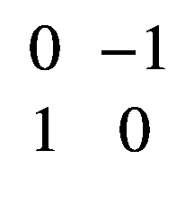

表格形式是网格的一种替代形式。使用 TableForm，我们可以将创建的列表显示为表格。稍后，我们将更深入地了解如何使用命令 TableForm。

```py
In[72]:= Table[i+j,{i,1,2},{j,4,6}] //TableForm
Out[72]//TableForm=
5  6  7
6  7  8

```

迭代器的间隔没有限制。我们可以选择“I”从 0 到 3，j 从“I”到 3，用 TableForm 查看。

```py
In[73]:= Table[{i, j}, {i, 3}, {j, i, 3}] // TableForm
Out[73]//TableForm=
 1  1   1
 1  2   3
 2  2
 2  3
 3
 3

```

我们甚至可以在区间迭代器中使用其他语法符号，如增量(++)或减量(-)。

```py
In[74]:= Table[{i, j},{i,2},{j,i++,2}]
Out[74]= {{{2,1},{2,2}},{{3,2}}}

```

增量(++)和减量(-)运算符也可用于赋值变量；这个运算符也可以有优先性或后验性。当写在变量之前时，它们分别被称为前增量或前增量。

```py
In[75]:= x=0;x++;x (*applied on the current value and shown next time x is called*)
Out[75]= 1
In[76]:= Clear[x];x=0;--x (*applied on the current value and shown when x is called*)
Out[76]= -1

```

作为另一种选择，我们用符号(/)执行替换规则。).例如，我们从 0 或 1 生成一个随机整数列表，然后每当 1 出现时就用 2 替换它们。确保在条件表达式之间添加一个空格，以避免输入错误。

```py
In[77]:= Table[RandomInteger[],{i,1,10}]/. 1 → 2
Out[77]= {2,0,2,2,2,0,0,0,2,2}

```

### 数据数组

创建数组有不同的形式。最常用的形式是列表，就像我们在上一节中看到的那样。但是作为命令表或范围的替代方法，可以使用命令 Array 创建数组。Array 生成的是一个列表，其中的特定函数应用于所创建的元素。

除了已经提到的函数，其他函数也可以用来构建列表，比如 Array、ConstantArray 和 SparseArray。这些函数的形式与前面的类似。

```py
In[78]:= Array[Cos[90 Degree],{3,3}]//Grid
Out[78]=     0[1,1] 0[1,2] 0[1,3]
             0[2,1] 0[2,2] 0[2,3]
             0[3,1] 0[3,2] 0[3,3]

```

Array 的作用是从一个函数构造一个数组。在前面的示例中，我们从 90 度余弦的数值生成了一个数组，后跟数组的结构，即 3 x 3。出现在数组值右侧的索引是数组中每个元素的位置。

如果我们推广到任何函数，我们可以更好地了解数组是如何工作的。

```py
In[79]:= Array[F,{2,2}] //Grid
Out[79]=     F[1,1] F[1,2]
             F[2,1] F[2,2]

```

正如我们可以观察到的，函数 F 是适用的，并且与排列的每个元素相关。使用 ConstantArray 函数创建一个常量值数组。为了编写函数，我们首先写下我们想要重复的值，然后是我们想要它重复的次数。

```py
In[80] := ConstantArray[π,5]
Out[80] = {π, π, π, π, π]}

```

我们还可以创建具有定义维度的排列。

```py
In[81]: = ConstantArray[π,{4,4}]
Out[81] = { { π, π, π, π },{ π, π, π, π },{ π, π, π, π },{ π, π, π, π } }

```

为了显示数据数组，有一个 MatrixForm 命令，顾名思义，它以矩阵形式显示数组。

```py
In[82]: = ConstantArray[π,{4,4}] //MatrixForm
Out[82]//MatrixForm=

```

T2】

稀疏排列是一种元素通常具有相同值的排列。使用 SparseArray，我们可以定义数组位置的值。按照标准，如果没有定义任何位置，该值将为 0。

```py
In[83]:= SparseArray[{{1,1},{2,2}} → {1,2}]
Out[83]=

```

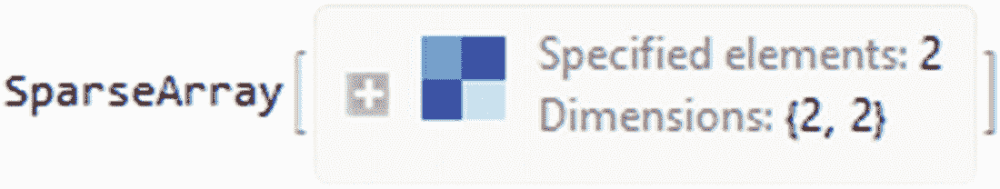

图 2-2

稀疏数组对象

SparseArray 的结果生成一个 SparseArray 类型的对象，如图 [2-2](#Fig2) 所示，带有命令的名称和一个出现的灰色框。如果你点击+图标，你会看到数组的特征以及它的规则；如图 [2-3](#Fig3) 所示。

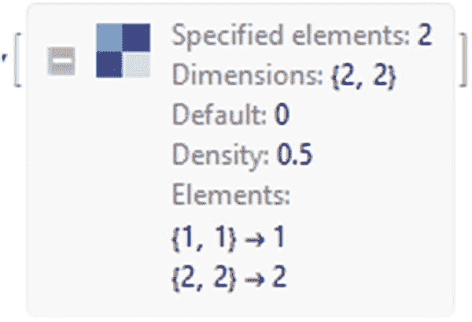

图 2-3

阵列的规格

在 Wolfram 语言中，对稀疏数组的内容没有限制。此外，我们可以创建一个对角线上有相同值的数组。

```py
In[84]: = SpArray = SparseArray[{{1,1} → "A",{2,2} → "A",{3,3} → "A",{4,4}→ "A" },{4,4}]
Out[84]=

```

正如你在图 [2-4](#Fig4) 中可能注意到的，数组中相同值的元素以一种颜色出现，而不同值的元素以另一种颜色出现。

借助于矩阵的形式，我们可以把排列想象成一个矩阵。

```py
In[85]:= MatrixForm[%]
Out[85]//MatrixForm=

```

T2】

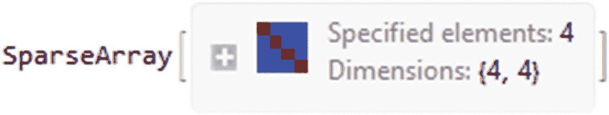

图 2-4

具有更多元素的稀疏阵列

要将稀疏数组对象转换为列表对象，请使用 Normal 将其规范化为表达式形式。

```py
In[86]:= Normal[SpArray]
Out[86]= {{A,0,0,0},{0,A,0,0},{0,0,A,0},{0,0,0,A}}

```

现在我们处理一个列表。

```py
In[87]:= Head[%]
Out[87]= List

```

### 嵌套列表

嵌套列表是列表的列表，其中列表的元素对应于另一个列表，依此类推。嵌套列表可用于有序或无序的数据结构。要创建一个嵌套列表，我们可以在花括号或内置函数中使用花括号。

```py
In[88]:= {{"This","is","A"},{"Nested","List","."}}
Out[88]= {{This,is,A},{Nested,List,.}}

```

我们也可以使用函数表。

```py
In[89]:= Table[Prime[i]+Prime[j],{i,1,3},{j,2,4}]
Out[89]= {{5,7,9},{6,8,10},{8,10,12}}

```

要测量一个列表，我们必须使用长度命令。

```py
In[90]:= NestL=Table[Prime[i]+RandomReal[j],{i,1,3},{j,1,3}];
Length[NestL]
Out[90]= 3

```

您可能会注意到，列表的长度是 3，因为 length 适合用于扁平列表。要正确测量嵌套列表的深度，Dimensions 更适合这项任务。

```py
In[91]:= Dimensions[NestL]
Out[91]= {3,3}

```

有了维度，我们可以得到嵌套列表的维度的一般情况，即生成的输出，这意味着我们的列表由三个子列表组成，每个子列表都有三个元素。我们可以看到，Mathematica 构造了一个有三个元素的列表，其中那三个元素也是一个列表，那些列表有三个元素，每个元素对应一个特定的值。

Note

您可能想使用 TreeForm，在那里您可以探索 Mathematica 如何处理嵌套的列表表达式。试试这段代码，比如`(*TreeForm[NestL]*)`。

测量嵌套列表或数组深度的一个有用命令是 ArrayDepth。

```py
In[92]:= ArrayDepth[NestL]
Out[92]= 2

```

现在我们通过编程知道 NestL 的深度为 2。

### 向量

Mathematica 将像处理列表一样处理向量。线性代数的通常计算可以是符号的或数字的。

```py
In[93]:= V={6,3,2}
Out[93]= {6,3,2}

```

向量总是显示为列表。要用常规符号表示向量，可以使用 MatrixForm 命令。

```py
In[94]:= MatrixForm[V]
Out[94]//MatrixForm=

```

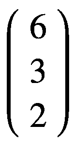T2】

命令 VectorQ 可以告诉我们正在处理的列表是否是一个向量。

```py
In[95]:= VectorQ[V]
Out[95]= True

```

若要查看向量的秩，请使用 ArrayDepth 或 TensorRank。

```py
In[96]:= {TensorRank[V],ArrayDepth[V]}
Out[96]= {1,1}

```

创建向量的命令与创建列表、表格、数组、范围、花括号、SparseArray、ConstantArray 等的命令相同。向量的常见操作也像普通列表一样执行。

```py
In[97]:=
Print["Addition: "<>ToString[V+V]]
Print["Substraction: "<>ToString[V-V]]
Print["Scalar product: "<>ToString[2*V]]
Print["Cross product: "<> ToString[Cross[V,{1,3,2}]]]
Print["Norm: "<> ToString[Norm[V]]]
Ou[97]=
Addition: {12, 6, 4}
Substraction: {0, 0, 0}
Scalar product: {12, 6, 4}
Cross product: {0, -10, 15}
Norm: 7

```

### 矩阵

矩阵是一个正方形列表或列表列表，排列成 n 行 m 列，其中 n 和 m 是矩阵的维数。

T2】

最简单的形式是创建一个列表列表。

```py
In[98]:= {{3,3,1},{7,8,7}}//MatrixForm
Out[98]//MatrixForm=

```

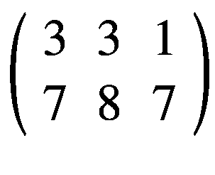T2】

另一种方法是去插入➤表/矩阵➤新。将出现一个弹出菜单；在此菜单中，选择矩阵并指定行和列。使用此选项，您还可以指定填充内容和对角线，以及添加网格或框架，如下一个在列之间绘制线条的示例。

`In[99]:=` 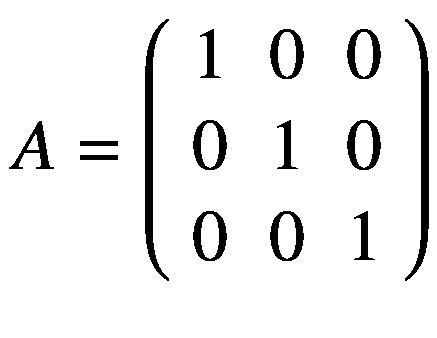

`Out[99]= {{1,0,0},{0,1,0},{0,0,1}}`

要测试列表的列表是否是矩阵，请使用 MatrixQ。

```py
In[100]:= MatrixQ[A]
Out[100]= True

```

Transpose 返回矩阵的转置，即逐列改变矩阵的行。对于一个矩阵 **A，**转置用**A**<sup>T5】T</sup>表示。

```py
In[101]:=Transpose[{{0,1,0},{0,1,0},{0,1,0}}]//MatrixForm
Out[101]//MatrixForm=

```

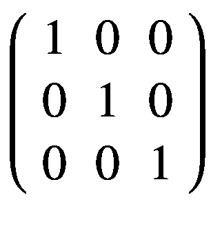T2】

### 矩阵运算

矩阵之间的常见运算由线性代数的规则执行:加法、减法和乘法。记住，当两个矩阵 **A** 和**B**相乘时， **A** 中的列数必须与 **B** 中的行数相匹配。用数学术语来说:**A**<sub>*m*∫*n*×**B**<sub>*n*∫*l*</sub>=**C**<sub>*m*∫*l*</sub>。</sub>

```py
In[102]:=
B={{0,1,0},{0,1,0},{0,1,0}};
Print["Addition: "<>ToString[A+B]]
Print["Substraction: "<>ToString[A-B]]
Print["Product: "<>ToString[Dot[B,V]]]
Out[102]=
Addition: {{1, 1, 0}, {0, 2, 0}, {0, 1, 1}}
Substraction: {{1, -1, 0}, {0, 0, 0}, {0, -1, 1}}
Product: {3, 3, 3}

```

要计算行列式，请使用 Det。

```py
In[103]:= {Det[A],Det[B]}
Out[103]= {1,0}

```

要构造对角矩阵，使用 diagonal matrix 对于标识矩阵，请使用 IdentityMatrix。DiagonalMatrix 用于服装值，IdentityMatrix 返回具有相同元素的对角线的矩阵。

```py
In[104]:= DiagonalMatrix[{x,y,z}]//MatrixForm
IdentityMatrix[{2,2}]//MatrixForm(*Identity matrix of 2 by 2*)
Out[104]//MatrixForm=

```

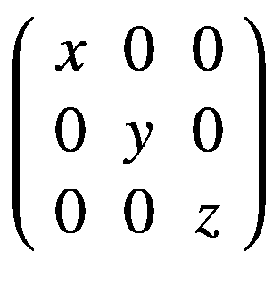

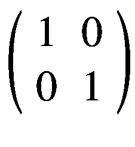T3】

```py
Out[105]//MatrixForm=

```

### 重构矩阵

矩阵重构是用同样的命令来完成的，比如用新值替换元素。

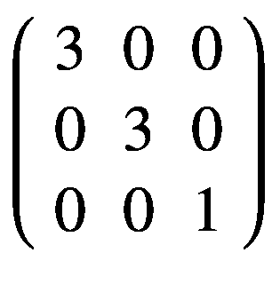T2】

```py
In[106]:= ReplacePart[A,{{1,1},{2,2}}-> 3]//MatrixForm
Out[106]//MatrixForm=

```

此外，也可以通过分配新值来实现。要访问矩阵的元素，请输入符号，然后用双括号符号([[ ]])输入感兴趣的元素的下标。稍后我们将看到这个简短符号的正确功能。在这种情况下，我们将改变矩阵中位置 1，1 的元素的值。

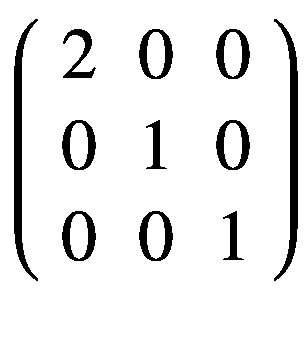T2】

```py
In[107]:= A[[1,1]] = 2;
MatrixForm[A]
Out[107]//MatrixForm=

```

`I` f 矩阵 A 再次被调用，新的值将被保存。要对方阵求逆，请使用逆矩阵。

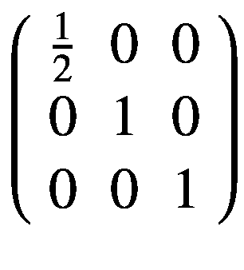

```py
In[108]:= Inverse[A]//MatrixForm
Out[108]//MatrixForm=

```

可以通过使用维度来测量矩阵的维度。

```py
In[109]:= Dimensions[A]
Out[109]= {3,3}

```

## 操纵列表

在上一节中，我们看到了创建列表的不同方式，通过数组、嵌套列表或表格。在这一节中，我们将详细介绍如何通过引用的名称、函数和紧凑的符号来操作这些列表。我们将学习如何根据你在列表中的位置来访问列表中的数据。我们将看到如何添加和删除列表元素，如何替换单个部分，以及如何更改特定元素的值。我们还将学习如何构建一个列表，我们将看到列表的排序以及如何根据列表的深度将嵌套列表转换成线性列表。此外，我们将看到如何通过模式查看列表中的数据。我们将学习 Wolfram 语言中的模式行为。

### 检索数据

有几个函数可以处理列表中的元素。功能部分[“列表”，i]允许您选择列表的索引部分，索引为 I。

例如，让我们定义一个名为 list1 的列表，并使用 Part 来访问列表中的元素。Part 函数通过定义我们想要的元素的位置来工作

```py
In[110]:= list1={1,2};
Part[{1,2},1]
Out[110]= 1

```

或者用索引符号，

```py
In[111]:= {1,2}[[1]]
Out[111]= 1

```

通过使用列表的指定名称，可以完全引用列表。可以使用双方括号[[ i ]]或双方括号中的特殊字符符号“〚 〛”来访问结构中的元素。

Tip

要引入双方括号字符，请键入`Esc [[ Esc and ESC ]] ESC`。

```py
In[112]:= list1[[1]] (* [[ i ]] gives you access to the element of the list in the postion i .*)
Out[112]= 1

```

Note

方括号([[ ]])是 Part 的缩写。

要通过指定位置来访问列表中的元素，我们可以使用 span 符号，它带有一个双分号(；；).

```py
In[113]:= list2=List[34,6,77,4,5,6];
Part[list2,1;;4] (* from items 1 to 4*)
Out[113]= {34,6,77,4}

```

我们也可以使用反向索引，从右向左开始计数，即从最后一个元素到第一个元素。现在让我们从位置-6 到-4 进行选择。

```py
In[114]:= list2[[-6;;-4]]
Out[114]= {34,6,77}

```

对于嵌套列表，应用相同的过程。这个概念可以扩展到更一般的方面。在下一个示例中，我们将创建一个三层嵌套列表，并选择一个唯一的元素。

```py
In[115]:= list3=List[23,2.72, {β, ex, {Total[1+2], "Plane"}}];
list3[[3,3,2]]
Out[115]= Plane

```

在前面的例子中，我们创建了一个深度为三的嵌套列表。接下来我们选择列表的第三个元素，也就是{8，2.72，{β，ex，{Total[1 + 2]，" Plane"}}，然后从那个列表中选择前面列表的三个元素，也就是{Total[1 + 2]，" Plane"}。最后，我们选择最后一个列表中第二个位置的元素，即“Plane”

如果我们正在处理一个嵌套列表，我们使用我们在 span 符号中看到的相同的概念。在下一个示例中，我们选择 list3 的第三个元素，然后从位置 1 到 2 显示。

```py
In[113]:=list3[[3,1;;2]]
Out[113]= {β, ex}

```

对更深入的列表也是如此；我们使用列表的第三个元素，然后从位置 3 显示到位置 3，并选择 part 1。

```py
In[114]:= list3[[3,3 ;; 3,1]]
Out[114]= {3}

```

可以根据我们感兴趣的数据部分来显示数据段。例如，函数 Rest 显示除第一个元素之外的数据元素。Most 显示除最后一个元素之外的整个列表，这取决于列表的类型。

```py
In[115]:= Rest[list3]
Out[115]= {2.72, {β, ex, {3, Plane}}}

In[116]:= Most[list3]
Out[116]= {8,2.72}

```

上述函数的替代方法是函数 Take。使用 Take，我们可以更广泛地选择列表中的数据。有三种可能的方法来实现这一点:

1.通过指定第一个 I 元素。

```py
In[117]:= Take[list3,2]
Out[117]= {8,2.72}

```

2.通过指定最后一个元素。

```py
In[118]:= Take[list3,-1]
Out[118]= {{β, ex, {3, Plane}}}

```

3.通过选择从 I 到 j 的元素。

```py
In[119]:= Take[list3,{1,3}]
Out[119]= {8, 2.72, {β, ex, {3, Plane}}}

```

### 分配或删除值

一旦建立了一个列表——也就是说，如果我们已经为它定义了一个名称——它就可以像任何其他类型一样使用。这意味着元素可以被其他元素替换。要更改一个或多个值，我们选择项目的位置，然后设置新值。

```py
In[120]:= list4={"Soccer","Basketball",0,9};
list4[[2]]=1 (*position 2 corresponds to the string Basketball and we change it for the number 1*)
Out[110]= 1

```

我们可以检查是否添加了新值。

```py
In[121]:= list4
Out[121]= {Soccer,1,0,9}

```

除了使用缩写符号，我们还可以使用函数 Replace part of specific values 来选择列表、新元素和位置

```py
In[122]:= ReplacePart[list4,Exp[x],4]
Out[122]= {Soccer,1,0, ⅇx}

```

为了添加新值，我们使用 PrependTo 和 AppendTo 第一个将值添加到列表的左侧，而第二个将值添加到列表的右侧。Append 和 Prepend 的工作原理相同，但是不将新值存储在原始变量中。

```py
In[123]:= PrependTo[list4,"Blue"]
Out[123]= {Blue,Soccer,1,0,9}

In[124]:= AppendTo[list4,4]
Out[125]= {Blue,Soccer,1,0,9,4}

In[126]:= list4(* we can check the addition of new values.*)
Out[126]= {Blue,Soccer,1,0,9,4}

```

要删除列表中的值，我们使用 Drop。Drop 可以与规格级别或要擦除的元素数量一起工作。

```py
In[127]:= Drop[list4,3];(* first 3 elements, Delete[list3.3]*)
Drop[list4,{5}](* or by position, position, number 5*)
Out[127]= {Blue,Soccer,1,0,4}

```

Delete 命令也可以通过定义列表中的特定位置来完成这项工作，例如，删除位置 1 和 5 中的内容。

```py
In[128]:= Delete[list4,{{1},{5}}]
Out[128]= {Soccer,1,0,4}

```

作为 Append 和 Prepend 的替代方法，有一个 Insert 函数，使用它我们可以添加元素来指示我们想要新数据的位置。插入表达式(列表 4)、新元素(2/43.23)、位置(列表的第 3 个位置)。现在数字 2/43.23 在列表的第三个位置。

```py
In[129]:= Insert[list4,2/43.23,3]
Out[129]= {Blue,Soccer,0.0462642,1,0,9,4}

```

插入允许同时使用几个位置。例如，在位置-6(第二个)和 7(最后一个位置)插入数字 0.023。

```py
In[130]:= Insert[list4,0.023,{{-6},{7}}]
Out[130]= {Blue,0.023,Soccer,1,0,9,4,0.023}

```

在特殊情况下，我们希望在列表或数组中添加或删除重复的项，我们可以使用 ArrayPad 函数。如果要添加的项未定义，则标准值为零。

```py
In[131]:= ArrayPad[list4,1](*number 1 means one zero each side*)
Out[131]= {0,Blue,Soccer,1,0,9,4,0}

```

在我们要添加片面条款的情况下，写如下。

```py
In[132]:= ArrayPad[list4,{1,2}](* 1 zero to the left and 2 zeros to the right*)
Out[132]= {0,Blue,Soccer,1,0,9,4,0,0}

```

要添加非零值，我们必须将该值写在该值重复次数的右边。

```py
In[133]:= ArrayPad[list4,{0,3},"z"](*Adding the letter z three times only the right side*)
Out[133]= {Blue,Soccer,1,0,9,4,z,z,z}

```

使用 ArrayPad，我们可以添加引用列表；例如，在左侧或右侧添加新的值列表。

```py
In[134]:= newVal={0,1,4,9}; (*Here we add them on the left side*)
ArrayPad[list4,{4,0},newVal]
Out[134]= {4,9,0,1,Blue,Soccer,1,0,9,4}

```

ArrayPad 还具有使用负索引对称地从列表中删除元素的功能。

```py
In[135]:= ArrayPad[list4,-1](*it deletes the first and last elemnts*)
Out[135]= {Soccer,1,0,9}

```

Note

对于 ArrayPad，添加和删除是对称的，除非另有说明。

### 结构化列表

当我们使用列表时，除了对其内容和内容移除器的不同访问形式之外，我们还可以呈现讨论列表被容纳、分段或限制的情况。接下来，我们将看到执行这些任务的几种方式。

要将列表按特定顺序排序，请使用 sort，然后使用 sorting 函数。

```py
In[136]:= Sort[{1,12,2,43,24,553,65,3},Greater]
Out[136]= {553,65,43,24,12,3,2,1}

```

默认情况下，排序按从小到大的顺序对数值(数字或文本)进行排序。

```py
In[137]:= Sort[{"b","c","zz","sa","t","p"}]
Out[137]= {b,c,p,sa,t,zz}

```

要反转列表，请使用 reverse 命令。

```py
In[138]:= Reverse[{1,12,2,43,24,553,65,3}]
Out[138]= {3,65,553,24,43,2,12,1}

```

除了前面看到的，要创建一个嵌套列表，您可以通过重新排列列表的元素来为平面列表生成分区。例如，我们将创建一个列表的分区，将列表细分成对。

```py
In[139]:= Partition[{1,12,2,43,24,553,65,3},2]
Out[139]= {{1,12},{2,43},{24,553},{65,3}}

```

我们可以选择包含连续元素的分区。

```py
In[140]:= Partition[{1,12,2,43,24,553},3,1]
Out[140]= {{1,12,2},{12,2,43},{2,43,24},{43,24,553}}

```

根据我们对嵌套列表的要求，我们可以向分区添加一个偏移量。例如，偏移量为 4 的一分为二的分区。

```py
In[141]:= Partition[{"b","c","zz","sa","t","p"},2,4]
Out[142]= {{b,c},{t,p}}

```

要返回平面列表，使用的函数是 Flatten。

```py
In[143]:= Flatten[{{1,12},{2,43},{24,553},{65,3}}]
Out[143]= {1,12,2,43,24,553,65,3}

```

根据列表的深度，我们可以决定展平的深度。

```py
In[144]:= Flatten[{{{{1},1},1},1},1] (* here we flatten a list with a level 1 depth.*)
Out[144]= {{{1},1},1,1}

```

当我们有一个列表或数组时，我们可以用 ArrayReshape 将数据整形为一个特定的矩形数组。例如，创建一个 3x 3 的数组。

```py
In[145]:= ArrayReshape[{1,12,2,43,24,553,65,3},{3,3}]
Out[145]= {{1,12,2},{43,24,553},{65,3,0}}

```

如果你注意的话，你可以看到组成数组的元素都是零。在下一个示例中，我们可以看到使用 ArrayShape 从列表中的一个元素创建一个 2 乘 2 的数组。

```py
In[146]:= ArrayReshape[{6},{2,2}]
Out[146]= {{6,0},{0,0}}

```

在处理嵌套列表的情况下，也使用 SortBy，但是不使用排序函数，而是使用内置函数。例如，根据近似值的结果对列表进行排序。

`In[147]:= SortBy[{1,4,553,12.52,4.3,24,7/11},N]`

`Out[147]= {`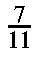T1】

### 标准选择

在某些条件下，可以选择列表中的特定值；可以使用 Select 命令将条件应用于列表。该函数选择符合所建立的标准的列表元素；用于标准的函数可以是订单函数。

```py
In[148]:= nmbrList=List[12,5,6,345,7,3,1,5];
Select[nmbrList,EvenQ] (* only the values that return True are selected, in this case values that are even *)
Out[148]= {12,6}

```

Pick 也是 Select 的替代方法。

```py
In[149]:= Pick[nmbrList,PrimeQ @ nmbrList]
Out[149]= {5,7,3,5}

```

在 Wolfram 语言中使用模式匹配来判断一个标准是否应该归属于一个表达式。在 Wolfram 语言中，有三种类型的模式。

1.下划线符号(_)代表 Wolfram 语言中的任何表达式。

2.双下划线符号(__)表示一个或多个表达式的序列。

3.三重下划线符号(___)表示零个或多个表达式的序列。

每个模式都有其内置的函数名。一个下划线是空白，两个下划线是 BlankSequence，三个下划线是 BlankNullSequence。

为了更好地理解通道中的以下示例，我们使用 Cases 函数，它允许我们选择与模式对应的数据。

我们有一个由数据对组成的列表，我们编写选择模式(_)。

```py
In[150]:= Cases[{{1,1},{1,2},{2,1},{2,2}},{_}]
Out[150]={}

```

正如我们所看到的，它没有选择任何元素，因为它没有列表模式的形式—例如，形式{a，b}。现在，如果我们改变这个形状，我们会看到它选择了所有与图案形状匹配的元素。

```py
In[151]:= Cases[{{1,1},{1,2},{2,1},{2,2}},{_,_}]
Out[151]= {{1,1},{1,2},{2,1},{2,2}}

```

如果我们使用双下划线，也可以得到同样的结果。

```py
In[152]:= Cases[{{1,1},{1,2},{2,1},{2,2}},{__}]
Out[152]= {{1,1},{1,2},{2,1},{2,2}}

```

在下面的例子中，我们将看到如何从包含数字和分类数据的列表中选择数据。我们使用 RandomChoice 函数，它给我们一个从列表中随机选择的选项。在这种情况下，它是在单词红色或蓝色之间的随机选择。在下一章，我们将看到这种类型的随机函数在 Wolfram 语言中是如何工作的。

```py
In[153]:= Tbl=Table[{i,j,k,RandomChoice[{"Red","Blue"}]},{i,1,3},{j,1,3},{k,1,3}]//TableForm
Out[153]//TableForm=
                 1 1 1  Red   1 2 1  Red   1 3 1 Blue
                 1 1 2  Red   1 2 2 Blue   1 3 2  Red
                 1 1 3 Blue   1 2 3 Blue   1 3 3 Blue
                 2 1 1 Blue   2 2 1  Red   2 3 1 Blue
                 2 1 2 Blue   2 2 2 Blue   2 3 2 Blue
                 2 1 3  Red   2 2 3  Red   2 3 3  Red
                 3 1 1 Blue   3 2 1 Blue   3 3 1  Red
                 3 1 2  Red   3 2 2  Red   3 3 2 Blue
                 3 1 3  Red   3 2 3 Blue   3 3 3 Blue

```

我们可以看到数字的右边是红色或蓝色。例如，我们可以使用事例来选择属于蓝色或红色类别的值。由于这是一个深度为 4 的嵌套列表，我们必须指定 Cases 应该在哪个级别上搜索模式。

```py
In[154]:= Cases[Tbl,{_,_,_,"Blue"},4]
Out[154]= {{1,1,3,Blue},{1,2,2,Blue},{1,2,3,Blue},{1,3,1,Blue},{1,3,3,Blue},{2,1,1,Blue},{2,1,2,Blue},{2,2,2,Blue},{2,3,1,Blue},{2,3,2,Blue},{3,1,1,Blue},{3,2,1,Blue},{3,2,3,Blue},{3,3,2,Blue},{3,3,3,Blue}}

```

此外，使用双下划线可以获得相同的结果。

```py
In[155]:= Cases[Tbl,{__,"Blue"},4]
Out[155]= {{1,1,3,Blue},{1,2,2,Blue},{1,2,3,Blue},{1,3,1,Blue},{1,3,3,Blue},{2,1,1,Blue},{2,1,2,Blue},{2,2,2,Blue},{2,3,1,Blue},{2,3,2,Blue},{3,1,1,Blue},{3,2,1,Blue},{3,2,3,Blue},{3,3,2,Blue},{3,3,3,Blue}}

```

我们甚至可以计算我们有多少蓝色类别。

```py
In[156]:= Count[Tbl,{__,"Blue"},4]
Out[156]= 15

```

Count 在下一个表单 Count[“list”，模式，等级规格]中工作。

现在我们知道了下划线符号是如何工作的，我们可以使用函数用例来检查条件和过滤值。若要附加条件，请使用下一种形式(/；“条件”)，当使用符号/；在一个规则或模式之后，我们告诉 Mathematica 下一个表达式是一个条件或模式。在下一个例子中，x_ 表示一个任意元素 x。在这个例子中，它表示列表中的元素，然后表示 x 大于 5 的条件。

```py
In[157]:= Cases[nmbrList,z_ /;z>5]
(*only the values greater than 5 are selected.*)
(*x can be replaced by any arbitrary symbol try using z_ and z > 5, the result should be the same *)
Out[157]= {12,6,345,7}

```

正如我们在前面的例子中看到的，当我们使用 _ 时，意味着表达式 x_ 必须应用于条件> 5，因为 _ 意味着任何表达式，这是列表。

案例也可以用来选择数据，在这些数据中，已建立的模式或规则集的条件为真。在下一个例子中，我们将选择整数数据。模式对象由下划线或表达式规则表示。举个例子，

```py
In[158]:=mixList={1.,1.2,"4",\[Pi],{"5.2","Dog"}, 3,66,{Orange,Red}};
Cases[mixList,_Integer](*We now select the number that are integers*)
Out[158]= {3,66}

```

您可能会注意到，下划线的使用可以应用于检查表达式头部的模式，头部是整数。Cases 比较每个元素，看它们是否是整数。

至于条件匹配，如果一个模式的空格伴随着一个问号(？)然后函数测试，输出是一个布尔值。

```py
In[159]:= MatchQ[mixList,_?ListQ](*we test if mixlist has a head of List*)
Out[159]= True

```

我们可以用案例来选择规范的级别。在下一个示例中，我们选择的案例是一个字符串；我们写两个作为一级规范，因为 mixList 是一个嵌套列表，有两个子列表。

```py
In[160]:= Cases[mixList,_?StringQ,2]
Out[160]= {4,5.2,Dog}

```

我们可以包括几种模式，并有替代方案。为了测试不同的选择，我们只需在模式之间放置一个(|)，因此它类似于“模式 1”|“模式 2”|“模式 3”|…

```py
In[161]:= Cases[mixList, _?NumberQ| _?String] (*We select the numbers and the strings*)
Out[161]= {1.,1.2,3,66}

```