# 四、导入和导出

在本章中，我们将回顾数据的导入和导出。在这里，我们将看到导入和导出数据的 Wolfram 语言命令。我们将回顾 Mathematica 支持的导入和导出格式类型。

实验数据可以来自不同的来源。处理这些外部数据的方法是通过 Wolfram 语言导入。外部计算或获得的数据可以传输到 Mathematica，也可以导出用于其他平台。然而，Mathematica 拥有处理不同类型数据(数字、文本、音频、图形和图像)的工具。我们将关注数字和分类数据，它们可能是分析中最常用的数据类型。

从多个来源将数据导入 Mathematica 允许将数据加载到笔记本中进行分析。Wolfram 语言支持多种导入格式；要查看支持哪些格式，请键入美元符号($)和命令 ImportFormats。目前 Mathematica 支持 226 种文件格式。

```py
In[1]:= Short[$ImportFormats,5]

Out[1]//Short= {3DS,ACO,Affymetrix,AgilentMicroarray,AIFF,ApacheLog,ArcGRID,AU,AVI,Base64,BDF,Binary,Bit,BMP,BSON,Byte,BYU,BZIP2,CDED,<<189>>,VTK,WARC,WAV,Wave64,WDX,WebP,WLNet,WMLF,WXF,XBM,XHTML,XHTMLMathML,XLS,XLSX,XML,XPORT,XYZ,ZIP}

```

我们可以在列表中看到很多格式:音频、图像、文本等。但是我们将把重点放在基于文本的格式和其他格式上。要导入任何类型的格式化文件，可以使用 import 命令。Import 接收两个参数，即文件的路径和选项。在 Mathematica 中，文件格式、元素和其他类型的对象(如 cloud、local 等)之间的选项会有所不同。要选择一个文件路径，前往工具栏，然后前往插入➤File 路径...应该会出现一个文件浏览器，然后搜索您想要导入的文件并选择它。路径将像字符串一样用撇号括起来。

您会注意到，在“插入”菜单中还有另一个名为“文件”的选项。与文件路径相反，文件将直接引入文件的内容，而不需要事先从 Mathematica 接收格式。文件更适合导入笔记本或其他 Wolfram 格式。

让我们看看如何传输一个简单的文本文件。

```py
In[2]:= Import["C:\\Users\\My-pc\\Desktop\\HelloWorld.txt"]
Out[2]= Hello World!

```

我们已经导入了第一个文件。Mathematica 会根据文件扩展名识别它，然后自动导入。如果我们导入一个没有文件扩展名的文件，但是我们知道文件中使用的格式类型，我们可以选择正确的格式作为选项。

```py
In[3]:= Import["C:\\Users\\My-pc\\Desktop\\HelloWorld.txt","Text"]
Out[3]= Hello World!

```

## 导入文件

### CSV 和 TSV 文件

在这一节中，我们将重点介绍如何将文件导入 Mathematica。在示例中，我们将使用逗号分隔值(CSV)文件、制表符分隔值(TSV)文件和 Excel 电子表格样式文件。CSV 和 TSV 文件是包含文本和数值的文件。在 CSV 文件中，字段由逗号分隔；每行是一行记录。而在 TSV 文件中，每条记录都用制表符分隔。

通过导入，我们可以导入 TSV 或 CSV 文件。tsv 或者。csv 文件扩展名。我们将首先通过引入文件路径来导入一个普通的 CSV 文件，然后是 CSV 选项。

```py
In[4]:=Import["C:\\Users\\My-pc\\Desktop\\Grocery_List.csv","CSV"]
Out[4]= {{id,grocery item,price,sold items,sales per day},{1,milk,4$,4,4 Jun 2019},{2,butter,3$,2,6 Jun 2019},{3,garlic,2$,1,7 Jun 2019},{4,apple,2$,4,1 Jun 2019},{5,orange,3$,5,8 Jun 2019},{6,orange juice,5$,2,8 Jun 2019},{7,cheese,5$,2,6 Jun 2019},{8,cookies,2$,5,9 Jun 2019},{9,grapes,4$,3,21 Jun 2019},{10,potatoe,2$,5,26 Jun 2019}}

```

既然文件的内容已经导入，根据内容的格式，数据是否会显示为嵌套列表。行表示为嵌套列表的元素，列表示为整个列表的元素。

导入数据时，可以导入部分数据，也就是说，如果我们只需要一行或一列。

```py
In[5]:=Import["C:\\Users\\My-pc\\Desktop\\Grocery_List.csv",{"Data",5;;10}]
Out[5]= {{4,apple,2$,4,1 Jun 2019},{5,orange,3$,5,8 Jun 2019},{6,orange juice,5$,2,8 Jun 2019},{7,cheese,5$,2,6 Jun 2019},{8,cookies,2$,5,9 Jun 2019},{9,grapes,4$,3,21 Jun 2019}}

```

在前面的例子中，我们将数据从第 5 行导入到第 10 行。

当我们只对单个值感兴趣时，我们可以使用下面的形式。

```py
In[6]:= Import["C:\\Users\\My-pc\\Desktop\\Grocery_List.csv",{"Data",6,2}]
Out[6]= orange

```

根据表达式的最大字节数，Mathematica 将截断导入的数据，并向您显示整个数据的简化版本的建议框。要查看最大字节大小，请转到，编辑➤高级选项卡，并在“截断前的最大输出大小”中，输入截断前的新字节数。这种偏好适用于 Mathematica 中的每个输出表达式。

要导入 TSV 文件，我们使用相同的方法。使用简短的命令，我们可以显示一部分数据，以防数据非常大。

```py
In[7]:= Short[Import[
"C:\\Users\\My-pc\\Desktop \\Color_table.tsv","TSV"]] (*Rest, to view the remain *)
Out[7]//Short= {{number,color},{1,red},<<7>>,{9,magenta},{10,brown}}

```

因此，我们看到在结果中，一个 7 出现在导入文件的元素中。这是因为它包含七个未显示的元素。现在我们知道了如何导入 CSV 和 TSV 文件，导入的数据可以用表格格式显示。

```py
In[8]:= Import[
"C:\\Users\\My-pc\\Desktop\\Grocery_List.csv","CSV"];
Grid[%]
Out[8]=
id    grocery    item  price sold items sales per day
1     milk          4$       4          4     Jun 2019
2     butter        3$       2          6     Jun 2019
3     garlic        2$       1          7     Jun 2019
4     apple         2$       4          1     Jun 2019
5     orange        3$       5          8     Jun 2019
6     orange juice  5$       2          8     Jun 2019
7     cheese        5$       2          6     Jun 2019
8     cookies       2$       5          9     Jun 2019
9     grapes        4$       3          21    Jun 2019
10    potatoe       2$       5          2     Jun 2019

```

现在，我们已经为导入的数据指定了一个名称，现在可以将内容视为一个列表。我们的部分数据是可以提取的，这一点我们将在后面的章节中看到。

### XLSX 文件

在下一个例子中，我们将展示如何导入数据和将数据显示为电子表格，以及如何将其转换为数据集。出于举例的目的，我们将使用 XLSX 杂货清单文件，而不是 CSV 文件。首先，我们需要首先导入我们的数据。

```py
In[9]:=
path="C:\\Users\\My-pc\\Desktop \\Grocery_List.xlsx";
Import[path,"Data"]
Out[9]=
{{{id,grocery item, price, sold items,sales per day},{1.,milk,4 $,4., 4-Jun-2019},{2.,butter,3$,2., 6-Jun-2019},{3.,garlic,2 $,1., 7-Jun-2019},{4.,apple,2 $,4., 1-Jun-2019},{5.,orange,3 $,5., 8-Jun-2019},{6.,orange juice,5 $,2., 8-Jun-2019},{7.,cheese,5 $,2., 6-Jun-2019},{8.,cookies,2 $,5., 9-Jun-2019},{9.,grapes,4 $,3., 21-Jun-2019},{10.,potatoe,2 $,5., 26-Jun-2019}}}

```

可以看到，导入的数据显示为嵌套列表；这是因为 Excel 文件可以在一个文件中包含多个工作表。对于这种情况，我们只有一个表。若要查看工作表的数量和名称，请分别使用 SheetCount 和 sheets。

```py
In[10]:= Import[path,#]&/@{"SheetCount","Sheets"}
Out[10]={1,{Grocery_List}}

```

为了将数据显示为电子表格，我们使用命令 TableView(图 [4-1](#Fig1) )。要选择一个工作表，使用下一个格式作为选项:{"Data "，# of sheet}。要选择字符编码，请使用 character encoding 选项。也可以导入服装行或列，保留格式:{"Data "，# of sheet，# row，# column}。

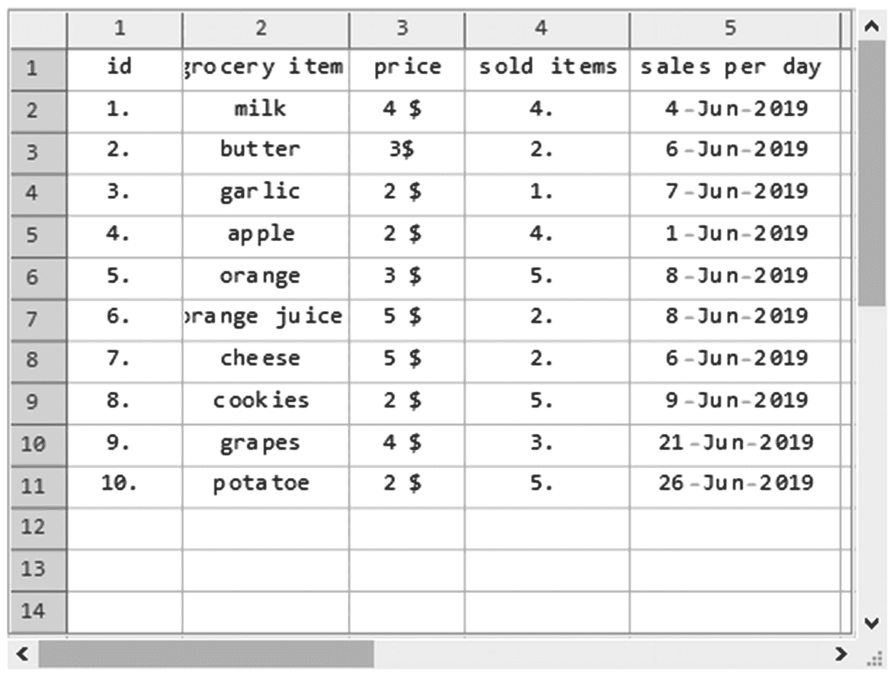

图 4-1

使用 TableView 命令的电子表格视图

```py
In[11]:= TableView[Import[path,{"Data",1},CharacterEncoding→"UTF-8"]]
Out[11]=

```

Note

使用“数据”，将数据作为嵌套列表导入。

您可能注意到了，我们现在可以用电子表格格式查看数据。现在，使用 TableView，我们可以像在电子表格软件中一样查看数据，使用选择工具、滚动条和内容的文本编辑。然而，缺点之一是使用 TableView 我们不能直接访问文件的内容；也不能执行任何计算。要实现后者，我们可以将其转换为数据集。

我们可以将数据转换成数据集，以便在 Mathematica 中更好地处理。通过键入选项“Dataset”而不是“Data”，导入的文件成为一个数据集，但没有标题(如图 [4-2](#Fig2) 所示)。要添加标题，请使用 HeaderLines 选项，并按行或列类型标题选择标题规范→ { # row，# column }。使用的文件是杂货清单 2.xlxs。

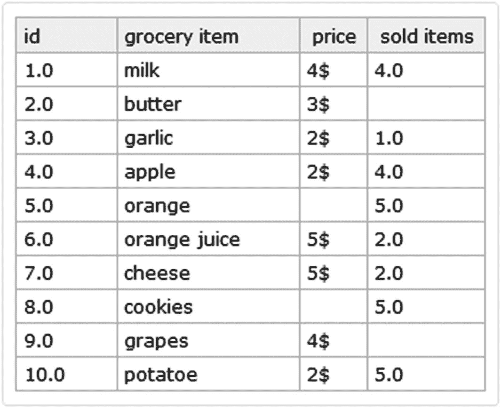

图 4-2

不完整的杂货清单数据集

```py
In[12]:= file=
"C:\\Users\\My-pc\\Desktop\\Grocery_List_2.xlsx";
Import[file,{"Dataset",1},HeaderLines→1]
Out[12]=

```

你可能注意到了，我们导入了不完整的数据。为了处理空白空间，EmptyFiled 被实现为一个变换规则。如果数据中有空格，并且没有表达任何规则，空格将被视为空字符串。图 [4-3](#Fig3) 显示了输出。

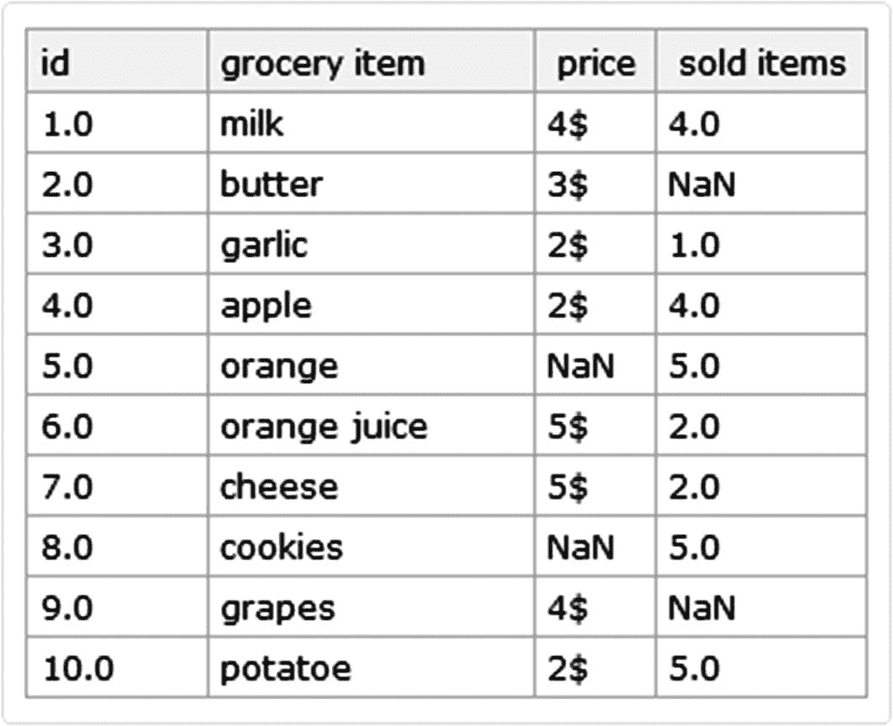

图 4-3

NaN 填充数据集

```py
In[13]:= Import[file,{"Dataset",1},"EmptyField"→ "NaN",HeaderLines→1]
Out[13]=

```

### JSON 文件

JavaScript 对象符号(JSON)文件扩展名是一个数据表示文件。JSON 文件用于将数据存储为有序的值列表，每个列表由一组值对组成。要导入一个 JSON 文件，我们可以指定两个选项“JSON”或“RawJSON”

```py
In[14]:= Json=Import[
"C:\\Users\\My-pc\\Desktop\\Sports_cars.json","JSON"]
Out[14]=
{{Model→Enzo Ferrari,Year→2002,Cylinders→12,Horsepower HP→660,Weight Kg→1255},{Model→Koenigsegg CCX,Year→2000,Cylinders→8,Horsepower HP→806,Weight Kg→1180},{Model→Pagani Zonda,Year→2002,Cylinders→12,Horsepower HP→558,Weight Kg→1250},{Model→McLaren Senna,Year→2019,Cylinders→8,Horsepower HP→800,Weight Kg→1309},{Model→McLaren 675 LT,Year→2015,Cylinders→8,Horsepower HP→675,Weight Kg→1230},{Model→Bugatti Veyron,Year→2006,Cylinders→16,Horsepower HP→1001,Weight Kg→1881},{Model→Audi R8 Spyder,Year→2010,Cylinders→10,Horsepower HP→525,Weight Kg→1795},{Model→Aston Martin Vantage,Year→2009,Cylinders→8,Horsepower HP→926,Weight Kg→1705},{Model→Maserati Gran Turismo,Year→2010,Cylinders→8,Horsepower HP→405,Weight Kg→1955},{Model→Lamborghini Aventador S,Year→2017,Cylinders→12,Horsepower HP→740,Weight Kg→1740}}

```

鉴于 JSON 文件结构的性质，在导入它们时，Mathematica 会识别每个结构并将每个键解释为其值。正如我们在前面的输出中看到的，键对应于型号、年份、气缸、马力和重量，每个键都有其值。到目前为止所说的一切解释了所有记录都包含在一个嵌套列表中。这使我们得出结论，如果我们想以数据集的形式呈现它，我们不能直接应用关联，而关联会抑制重复的键。我们必须为每个记录创建一个关联，因为它是一个嵌套列表，我们将使用 Map 来实现这一点，指定关联命令的深度级别。这显示在这里。

```py
In[15]:= Map[Association,Json,1]
Out[15]= {<|Model→Enzo Ferrari,Year→2002,Cylinders→12,Horsepower HP→660,Weight Kg→1255|>,<|Model→Koenigsegg CCX,Year→2000,Cylinders→8,Horsepower HP→806,Weight Kg→1180|>,<|Model→Pagani Zonda,Year→2002,Cylinders→12,Horsepower HP→558,Weight Kg→1250|>,<|Model→McLaren Senna,Year→2019,Cylinders→8,Horsepower HP→800,Weight Kg→1309|>,<|Model→McLaren 675 LT,Year→2015,Cylinders→8,Horsepower HP→675,Weight Kg→1230|>,<|Model→Bugatti Veyron,Year→2006,Cylinders→16,Horsepower HP→1001,Weight Kg→1881|>,<|Model→Audi R8 Spyder,Year→2010,Cylinders→10,Horsepower HP→525,Weight Kg→1795|>,<|Model→Aston Martin Vantage,Year→2009,Cylinders→8,Horsepower HP→926,Weight Kg→1705|>,<|Model→Maserati Gran Turismo,Year→2010,Cylinders→8,Horsepower HP→405,Weight Kg→1955|>,<|Model→Lamborghini Aventador S,Year→2017,Cylinders→12,Horsepower HP→740,Weight Kg→1740|>}

```

正如我们所看到的，我们已经将每条记录作为一个关联，现在我们可以将它转换成一个数据集，如图 [4-4](#Fig4) 所示。

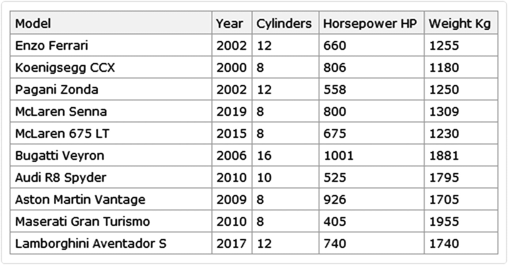

图 4-4

汽车数据集

```py
In[16]:= Dataset[%]
Out[16]:=

```

我们现在可以将 JSON 文件作为数据集来处理。但是，还有一种方法，不需要这么多计算。这是在导入文件时实现的。我们必须将其作为 RawJson 导入，因为使用 RawJson，Wolfram 语言将每个记录作为关联列表而不是唯一的嵌套列表进行识别和导入，如下所示。这是因为 JSON 文件扩展名的键和值的性质。

```py
In[17]:= Import["C:\\Users\\My-pc\\Desktop\\Sports_cars.json","RawJSON"]
Out[17]= {<|Model→Enzo Ferrari,Year→2002,Cylinders→12,Horsepower HP→660,Weight Kg→1255|>,<|Model→Koenigsegg CCX,Year→2000,Cylinders→8,Horsepower HP→806,Weight Kg→1180|>,<|Model→Pagani Zonda,Year→2002,Cylinders→12,Horsepower HP→558,Weight Kg→1250|>,<|Model→McLaren Senna,Year→2019,Cylinders→8,Horsepower HP→800,Weight Kg→1309|>,<|Model→McLaren 675 LT,Year→2015,Cylinders→8,Horsepower HP→675,Weight Kg→1230|>,<|Model→Bugatti Veyron,Year→2006,Cylinders→16,Horsepower HP→1001,Weight Kg→1881|>,<|Model→Audi R8 Spyder,Year→2010,Cylinders→10,Horsepower HP→525,Weight Kg→1795|>,<|Model→Aston Martin Vantage,Year→2009,Cylinders→8,Horsepower HP→926,Weight Kg→1705|>,<|Model→Maserati Gran Turismo,Year→2010,Cylinders→8,Horsepower HP→405,Weight Kg→1955|>,<|Model→Lamborghini Aventador S,Year→2017,Cylinders→12,Horsepower HP→740,Weight Kg→1740|>}

```

正如我们现在看到的，该文件作为每个记录中的关联导入，我们可以继续将其转换为数据集。

```py
In[18]:=Cars=Dataset[%];

```

作为补充，一旦导入了数据，我们就可以对数据集执行操作，比如按年份从低到高对模型进行排序。

```py
In[19]:=Cars[SortBy[#Year& ]];

```

Note

前面的示例也可以使用 query 命令。(查询[排序依据[#年&]][汽车])。

### Web 数据

另一方面，web 数据也支持导入。不是插入文件路径，而是将 URL 站点作为导入命令的参数插入。在下一个例子中，我们将从美国国家海洋和大气管理局(NOAA)导入一个简单的文本文件。文本文件将包含用于全球无线电探空仪综合档案(IGRA)的国家代码列表。文件所在的上级目录可以在 [`https://www1.ncdc.noaa.gov/pub/data/igra/`](https://www1.ncdc.noaa.gov/pub/data/igra/) 找到，但是我们只导入国家列表文件。你需要互联网连接才能工作。

```py
In[20]:= Short[Import["https://www1.ncdc.noaa.gov/pub/data/igra/igra2-country-list.txt","HTML"]]
Out[20]//Short=
 AC Antigua and Barbuda AE United Ara ... Yemen ZA Zambia ZI Zimbabwe ZZ Ocean

```

如您所见，该文件是一个纯文本文件，但是我们可以通过插入一个文件格式选项来更改数据的导入方式。例如，我们可以将其作为 CSV 文件导入。

```py
In[21]:= Short[Import["https://www1.ncdc.noaa.gov/pub/data/igra/igra2-country-list.txt","CSV"]]
Out[21]//Short=
{{AC Antigua and Barbuda},{AE United Arab Emirates},<<216>>,{ZZ Ocean}}

```

当我们试图用导入的数据进行计算时，这很有用。另外，我们可以使用 URL 命令来检查在线文件的状态，然后下载它。

若要检查联机文件的状态，请使用 URLRead。在文件在线的情况下，您应该得到一个 http 响应对象，如图 [4-5](#Fig5) 所示。这种方法甚至可以在导入数据之前完成；有了这个你就可以确定内容是在线的。


图 4-5

输入的 URL 的 HTTPResponse 对象

```py
In[22]:= URLRead["https://www1.ncdc.noaa.gov/pub/data/igra/igra2-country-list.txt"]

Out[22]=

```

现在我们知道了状态，我们可以继续用 URLDownload 下载我们的数据文件。

```py
In[23]:= URLDownload["https://www1.ncdc.noaa.gov/pub/data/igra/igra2-country-list.txt"]
Out[23]=

```


图 4-6

包含下载文件位置的文件对象

你应该得到一个带有文件位置(图 [4-6](#Fig6) )、名称和扩展名的文件对象；就我而言，它在我的临时文件夹中。要在外部查看器中打开文件，请单击双 v 形图标。

## 语义导入

到目前为止，我们已经看到了如何导入不同格式的文件，但是还有另一个名为 SemanticImport 的工具，它允许我们从语义上导入文件，并返回一个数据集作为结果。让我们看一个简单的 CSV 文件示例。

```py
In[24]:= SImprt=
SemanticImport["C:\\Users\\My-pc\\Desktop\\Grocery_List.csv"]
Out[24]=

```

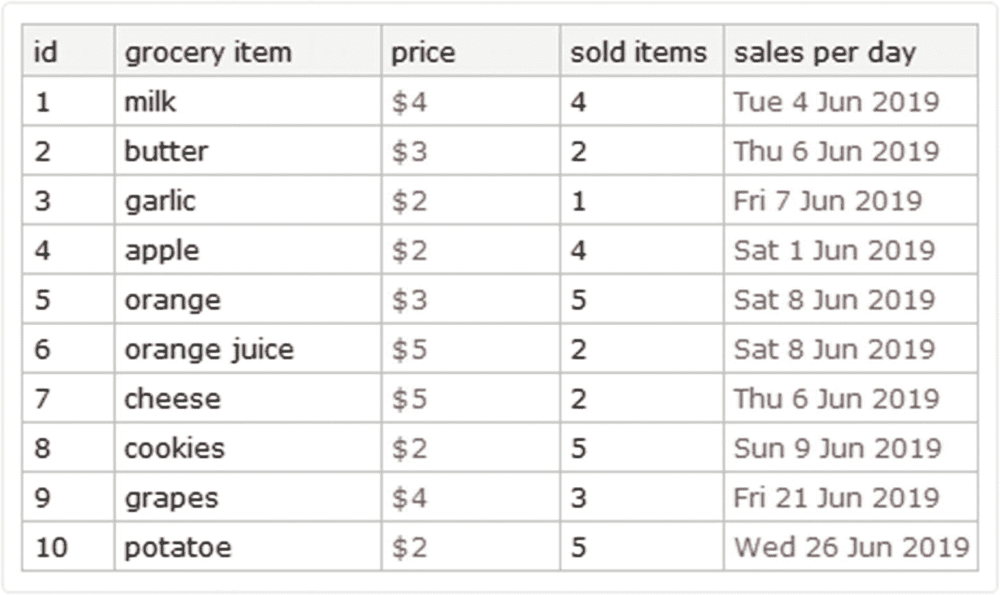

图 4-7

使用 SemanticImport 将文件作为数据集导入

正如我们在图 [4-7](#Fig7) 中看到的，当我们使用语义导入 Mathematica 时，它以数据集的形式导入数据，当它这样做时，它识别一些量。这些量对应于数量及其单位，例如价格和每天销售额列的元素。当处理数量时，元素的颜色会发生变化，正如我们在数据集中看到的，元素看起来与其他内容不同；这是因为它们现在由语义类型对象表示。语义对象包括数量、实体、日期和地理位置。换句话说，它们是由与 Wolfram Alpha 知识库相关的自由形式解释器做出的解释。

在导入数据的情况下，有两个日期类型对象，我们在第一章中已经看到，还有数量类型。应该明白，要和量打交道，就要明白量是从哪里来的。

### 数量

Quantity 命令将带有单位的量值转换为数量类型，从而将量值转换为它们各自的单位；首先输入幅度，然后是字符串类型的单位。当我们这样做时，Mathematica 将像在其他场合一样显示 autocomplete 菜单。下面的例子说明了这一点。

```py
In[25]:= Quantity[2,"USDollars"]
Out[25]= $ 2

```

从而转化为数量型。当我们将鼠标悬停在结果上时，会显示一个广告，标记一个结果已经是一个单元。在这种情况下，它是美元的单位。现在，如果我们检查表达式的头，它会给我们结果，它是类型数量。

Note

数量以浅棕色显示。

```py
In[26]:= Quantity[2,"USDollars"]//Head
Out[26]= Quantity

```

我们也可以使用内嵌自由格式输入，它在菜单栏中:插入➤内嵌自由格式输入。这种类型的输入是与搜索引擎 Wolfram Alpha 相关联的输入，因此内联自由形式输入将自然语言转换为 Wolfram 语言输入。

大小和数量写在盒子里。这种类型的输入的一个优点是可以使用自然语言。如下面的例子，我们将写 77 分钟的量，这意味着 77 分钟。图 [4-8](#Fig8) 显示了内嵌自由格式输入的输入单元。


图 4-8

免费在线自由输入 77 分钟

```py
In[27]:=

```

```py
Out[27]= 77min

```

运行代码，时钟输入，因为它给我们一个结果。出现一些选项卡，我们可以在其中单击子菜单或复选标记。如果我们点击勾号，那就是接受所作的解释。如果我们认为解释不同，我们可以单击另一个选项，即替代解释，它将显示一个小弹出窗口，其中列出了不同的解释，视情况而定。图 [4-9](#Fig9) 显示了示例的弹出窗口。

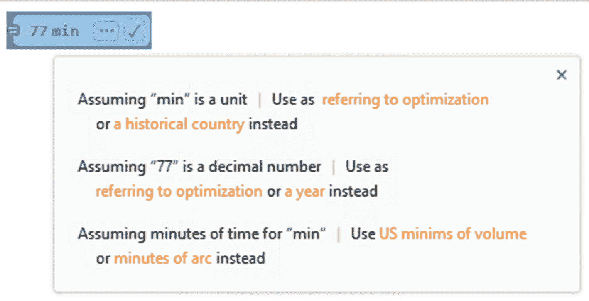

图 4-9

输入数量的选项

一旦解释被接受，结果改变颜色，它将是一个数量类型对象。它可以像任何其他数量类型的对象一样使用。

当我们有量的时候，我们无法进行数与数之间的运算，量已经是不同的类型了。对于这些，有两个选项将数据转换为数量或提取数量的大小。为了提取量值，使用 QuantityMagnitude 命令。

```py
In[28]:= {QuantityMagnitude[77min],Head[%]}
Out[28]= {77,String}

```

我们已经提取了量级，已经是整数了。在假设需要单元的情况下，QuantityUnit 命令提取单元。

```py
In[29]:= QuantityUnit[77min]
Out[29]= Minutes

```

### 带有数量的数据集

还有一个方面需要强调:进行运算，维持物理量之间如何进行算术运算的概念；否则操作将不可能，我们将得到一个单位不一致的错误。当我们在数量之间执行运算时，结果也是数量类型的，正如我们将在这里看到的。

```py
In[30]:=
{77min-77min,77min+77min,77min*77min,77min/77min,77min*3m}
Out[30]= {0min,154min,5929(min)^2,1,231m min}

```

在本例中，我们看到结果是如何属于数量类型的。除了除法，它已经是相同单位之间的商了。最后一个，结果是每分钟 231 米。

回到导入的数据，我们可以从 price 列中提取数据，如图 [4-10](#Fig10) 所示。

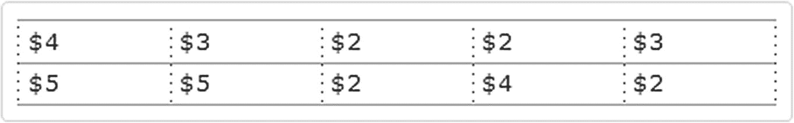

图 4-10

价格栏

```py
In[31]:= SImprt[[All,"price"]]
Out[31]=

```

如果我们想让它们出现在一个列表中，我们必须使用普通的命令。

```py
In[32]Normal[%]
Out[32]= {$ 4,$ 3,$ 2,$ 2,$ 3,$ 5,$ 5,$ 2,$ 4,$ 2}

```

正如我们所看到的，结果是数量型的列表。公平地说，我们可以用数量进行运算，但是如果重要的是数量，我们可以提取它们。让我们看看怎么做。

```py
In[33]:= QuantityMagnitude[#]&[%]
Out[33]= {4,3,2,2,3,5,5,2,4,2}

```

通过这种方式，我们现在只处理大小。

我们甚至可以处理日期和数量，正如我们将在图 [4-11](#Fig11) 中看到的，从显示产品的 ID 和销售日期开始。


图 4-11

ID 和每日销售额列

```py
In[34]:= SImprt[[All,{"id","sales per day"}]]
Out[34]=

```

完成这些后，我们可以提取值并直接处理日期对象类型。

```py
In[35]:= Normal[Values[%]]//InputForm
Out[35]//InputForm=
{{1, DateObject[{2019, 6, 4}, "Day", "Gregorian", -5.]},
 {2, DateObject[{2019, 6, 6}, "Day", "Gregorian", -5.]},
 {3, DateObject[{2019, 6, 7}, "Day", "Gregorian", -5.]},
 {4, DateObject[{2019, 6, 1}, "Day", "Gregorian", -5.]},
 {5, DateObject[{2019, 6, 8}, "Day", "Gregorian", -5.]},
 {6, DateObject[{2019, 6, 8}, "Day", "Gregorian", -5.]},
 {7, DateObject[{2019, 6, 6}, "Day", "Gregorian", -5.]},
 {8, DateObject[{2019, 6, 9}, "Day", "Gregorian", -5.]},
 {9, DateObject[{2019, 6, 21}, "Day", "Gregorian", -5.]},
 {10, DateObject[{2019, 6, 26}, "Day", "Gregorian", -5.]}}

```

Note

测试代码时应该获取 DateObject 而不是纯 word 这里，我们使用 InputForm 来避免图像冲突。

知道了这一点，我们就可以在每个产品的 ID 和销售时间之间建立关联，在嵌套列表中应用 Rule 命令，然后创建关联。

```py
In[36]:= Association[Apply[Rule,%,1]]//InputForm
Out[36]//InputForm=
<|1 → DateObject[{2019, 6, 4}, "Day", "Gregorian", -5.],
 2 → DateObject[{2019, 6, 6}, "Day", "Gregorian", -5.],
 3 → DateObject[{2019, 6, 7}, "Day", "Gregorian", -5.],
 4 → DateObject[{2019, 6, 1}, "Day", "Gregorian", -5.],
 5 → DateObject[{2019, 6, 8}, "Day", "Gregorian", -5.],
 6 → DateObject[{2019, 6, 8}, "Day", "Gregorian", -5.],
 7 → DateObject[{2019, 6, 6}, "Day", "Gregorian", -5.],
 8 → DateObject[{2019, 6, 9}, "Day", "Gregorian", -5.],
 9 → DateObject[{2019, 6, 21}, "Day", "Gregorian", -5.],
 10 → DateObject[{2019, 6, 26}, "Day", "Gregorian", -5.]|>

```

为了说明这一点，我们可以创建一个可视化的时间线(图 [4-12](#Fig12) )，标记销售的产品及其销售日期。

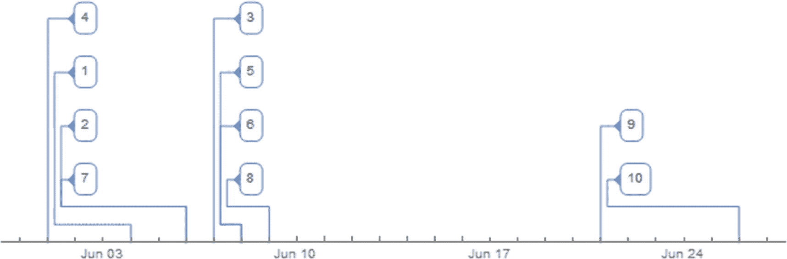

图 4-12

时间槽

```py
In[37]:= TimelinePlot[%]
Out[37]=

```

在这一点上，我们可以通过他们的 ID 看到每一个杂货的销售日期。当光标经过时间线中的数字时，会弹出一个工具提示，显示确切的日期。

这个想法是，当我们使用 SemanticImport 时，我们可以集成不同形式的 Wolfram 语言，以及如何在导入数据时利用这一点。通过语义导入，可以将数据与其他选定的数据进行比较。SemanticImport 为我们提供了工具，使我们可以在各种类型的语义对象之间工作。需要注意的是，我们可以导入货币类型、日期和几乎任何带有相应单位的数值，而不是导入普通文本，就像前面的例子一样。这允许数据与 Wolfram 语言中的不同命令相关联。

### 服装进口

关于语义导入已经说了这么多，我们可以导入数据并选择导入文件中的每一列应该如何解释。然而，基于我们前面看到的同样的想法，使用语义导入，我们也可以选择导入什么数据(例如，如果它只是一列或几列)。如图 [4-13](#Fig13) 所示。

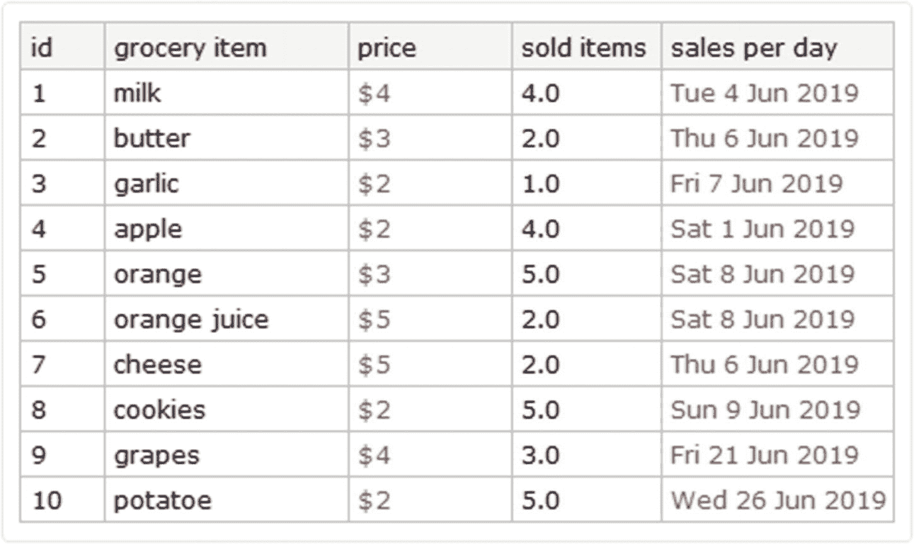

图 4-13

列内容具有指定数据类型的数据集

```py
In[38]:= SemanticImport["C:\\Users\\My-pc\\Desktop\\Grocery_List.csv", {"Integer","String","Currency","Real", "Date"}]
Out[38]=

```

根据这个结果，我们发现我们选择了第一列作为整数导入，第二列作为文本导入，第三列作为货币类型数量导入，第四列作为实数导入，最后一列作为日期对象导入。这样做了之后，我们就可以用同样的方式用电子表格文件以列表的形式导入特定类型的信息，可以是按列也可以是按行。在下面的例子中，我们将导入第 1 行到第 5 行。

```py
In[39]:=
SemanticImport["C:\\Users\\My-pc\\DesktopGrocery_List.csv",Automatic,"Rows"][[1;;5]]//InputForm
Out[39]//InputForm=
{{1, "milk", Quantity[4, "USDollars"], 4, DateObject[{2019, 6, 4}, "Day", "Gregorian", -5.]}, {2, "butter", Quantity[3, "USDollars"], 2, DateObject[{2019, 6, 6}, "Day", Gregorian", -5.]}, {3, "garlic", Quantity[2, "USDollars"], 1, DateObject[{2019, 6, 7}, "Day", "Gregorian", -5.]}, {4, "apple", Quantity[2, "USDollars"], 4, DateObject[{2019, 6, 1}, "Day", "Gregorian", -5.]}, {5, "orange", Quantity[3, USDollars"], 5, DateObject[{2019, 6, 8}, "Day", "Gregorian", -5.]}}

```

如上所述，也可以导入列，从列 1 导入到列 2。

```py
In[40]:= SemanticImport[
"C:\\Users\\My-pc\\Desktop\\Grocery_List.csv",Automatic,"Columns"][[1;;2]]
Out[40]= {{1,2,3,4,5,6,7,8,9,10},{milk,butter,garlic,apple,orange,orange juice,cheese,cookies,grapes,potatoe}}

```

需要强调的是，如果我们要排除数据，那么建议用 ExcludedLines 语句导入。例如，排除第 9 行和第 10 行，记住标题在第 1 行。如图 [4-14](#Fig14) 所示。

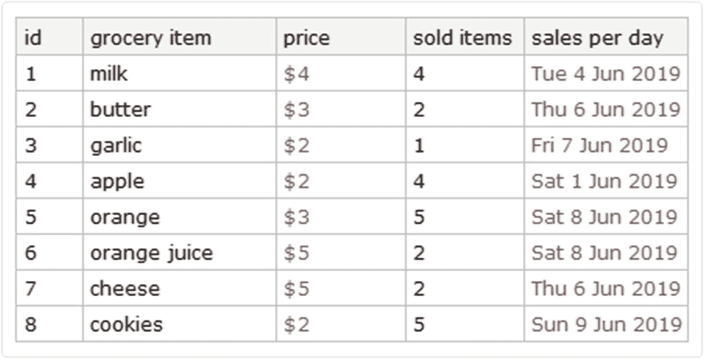

图 4-14

包含排除行的数据集

```py
In[41]:= SemanticImport[
"C:\\Users\\lb-pc\\Desktop\\Book Project\\Grocery_List.csv",ExcludedLines→{{10},{11}}]
Out[41]=

```

## 出口

就像导入一样，Mathematica 支持许多格式，要查看所有支持的格式，请键入$ExportFormat。

```py
In[42]:= Short[$ExportFormats,5]
Out[42]//Short= {3DS,ACO,AIFF,AU,AVI,Base64,Binary,Bit,BMP,BSON,Byte,BYU,BZIP2,C,CDF,CDXML,Character16,Character32,Character8,CML,<<148>>,VRML,VTK,WAV,Wave64,WDX,WebP,WLNet,WMF,WMLF,WXF,X3D,XBM,XHTML,XHTMLMathML,XLS,XLSX,XML,XYZ,ZIP,ZPR}

```

使用 Export 命令导出数据。Export 的格式为 Export["目录路径"，expr，"格式"]。

开始之前，我们需要设置一个工作目录。如果没有，文件将被导出到默认的 Mathematica 工作目录中。要查看工作默认目录，请使用 directory。

```py
In[43]:= Directory[]
Out[43]= C:\Users\My-pc\Desktop

```

在我的例子中，默认目录是我的桌面文件夹。

有两个关键命令:一个是 SetDirectory，它的参数是新工作目录的路径，另一个是 NotebookDirectory，它是文件的位置。

首先，让我们设置新的工作目录，将文件导出到我们的笔记本位置。通过使用笔记本目录作为 SetDirectory 上的参数，我们告诉 Mathematica 新的工作目录将是我们当前工作的笔记本的位置。

```py
In[44]:= SetDirectory[NotebookDirectory[]]
Out[44]= C:\Users\My-pc\Desktop

```

现在我们已经设置了一个新目录，我们可以导出在 Mathematica 中创建的数据。在下一个例子中，我们将从 1 到 10 的素数列表导出为文本文件和 CSV 文件中的表格。选项适用于导入，但如果添加了文件扩展名，则不必编写格式选项。

Note

对于是为数据列表指定名称还是直接在导出中创建数据，没有任何限制。

```py
In[45]:=
Mydata=Table[Prime[i],{i,1,10}];
{Export["New_File.txt",Mydata,"Table"],
Export["New_File.csv",Mydata]}
Out[45]= {New_File.txt,New_File.csv}

```

输出生成导出的新文件的名称。另一种方法是手动输入文件的所需位置，而不是设置新的工作目录；我将把我的桌面设置为新位置。

```py
In[46]:=
Export["C:\\Users\\My-pc\\Desktop\\New_File.TSV",Mydata,"TSV"]
Out[46]= C:\Users\My-pc\Desktop\New_File.TSV

```

现在我们已经将数据导出到一个新位置，输出的是新文件的完整路径。如果我们想从 Mathematica 中打开文件，我们可以使用 SystemOpen。此命令打开操作系统资源管理器。

```py
In[47]:=
SystemOpen["C:\\Users\\My-pc\\Desktop\\New_File.TSV"]

```

使用 SystemOpen，我们可以打开笔记本目录文件夹，以防我们想要打开笔记本目录中的其他文件。

```py
In[48]:=
SystemOpen[NotebookDirectory[]]

```

另一方面，当处理表格数据时，它可以导出为电子表格。在下一个例子中，我们将导出一个表格数据结构，然后将它们导出为电子表格格式。

为了创建表格数据，我们将使用命令表。

```py
In[49]:=
TabD1=Table[i,{i,4}];
TabD2=SetPrecision[Table[i/11,{i,4}],3];

```

现在我们有了一组坐标，我们可以通过在选项列表中键入数据的引用名称来将数据导出到不同的工作表中:{data_sheet 1，data_sheet 2，...}

```py
In[50]:= Export["Tabular_data.xls",{{TabD1},{TabD2}}]
Out[50]= Tabular_data.xls

```

通过用电子表格查看器打开该文件，您应该看到 TabD1 在工作表 1 中，TabD2 在工作表 2 中。

为了定制工作表的名称，我们需要用规则操作符(➤).)将名称作为规则列表输入

```py
In[51]:=
Export["Tabular_data_2.xls",{"Page number 1"→ TabD1,"Page number 2"→TabD2}]
Out[51]= Tabular_data_2.xls

```

如果您打开文件，现在您应该有两张带有我们设置的名称的表。

除此之外，还可以在单个电子表格中添加相同的数据。要做到这一点，你只需要用花括号把我们想要的数据括在同一个工作表中。

```py
In[52]:= Export["New_data.xls",Transpose[{TabD1,TabD2}]]
Out[52]= New_data.xls

```

当打开该文件时，您应该得到如下代码所示的内容。

```py
In[53]:= Grid[Transpose[{TabD1,TabD2}]]
Out[53]=
1     0.0909
2     0.182
3     0.273
4     0.364

```

您甚至可以导出表格。

```py
In[54]:= table1={{"Dog","Wolf"},{"Cat","Leopard"},{"Pigeon","Shark"}};
Export["Animal_table.xls",table1]
Out[54]= Animal_table.xls

```

### 其他格式

通过推进主题，可以将数据导出为简单的格式，如 TXT、DAT、CSV 和 CSV。要做到这一点，我们只需将文件的路径放在我们希望导出的位置，并附上新文件的名称，后跟所需文件的扩展名。第二个参数写入要导出的数据或包含该数据的变量。第三个参数是指定我们希望数据导入的格式类型。让我们看看下面的例子，我们将把新数据导出为文本和 DAT 格式。在我们的例子中，我们只写文件的名称，因为这表示我们希望将它们导出到我们之前建立的工作目录，该目录对应于笔记本的目录。

```py
In[55]:=
NewD=Table[{i+j,i*j},{i,1,5},{j,1,5}];
{Export["File_text.txt",NewD,"Text"],Export["File_dat.dat",NewD,"Table"]}

Out[55]= {File_text.txt,File_dat.dat}

```

这里最好暂停一下，就像我们在前面的代码中看到的那样；我们为 DAT 文件选择了表格格式。这是因为使用了 Table，这样导出的数据就变成了 Wolfram 语言的表达式。导出后，验证文件是否已导出。

同样，我们可以选择文件的格式。例如，我们将以 TSV 的格式导出，而不是键入文本。

```py
In[56]:= Export["File_text.txt",NewD,"TSV"]
Out[56]= File_text.txt

```

同样，我们可以导出为 CSV 和 TSV 文件。

```py
In[57]:=
{Export["File_csv.csv",NewD,"CSV"],Export["File_tsv.tsv",NewD,"TSV"] }
Out[57]= {File_csv.csv,File_tsv.tsv}

```

当导出 CSV 或 TSV 时，可以向数据的列添加标题。

```py
In[58]:=
Export["File_csv.csv",NewD,"CSV",TableHeadings→{"column 1","column 2","column 3","column 4","column 5" }]
Out[58]= File_csv.csv

```

考虑到这一点，还可以为列定义一个名称列表，如下所示。

```py
In[59]:= Labels={"Coordindates 1","Coordinates 2","Coordindates 3","Coordinates 4","Coordindates 5"};
Export["File_csv.csv",NewD,"CSV",TableHeadings→Labels]
Out[59]= File_csv.csv

```

同样，您可以将数据集导出为已知的格式。例如，我们将根据速度使用汽车制动距离统计。为此，我们用 ExampleData 命令加载数据。在这些里面我们搜索统计数据，在这个里面我们搜索停车距离。

```py
In[60]:= SpData=ExampleData[{"Statistics","CarStoppingDistances"}]
Out[60]= {{4,2},{4,10},{7,4},{7,22},{8,16},{9,10},{10,18},{10,26},{10,34},{11,17},{11,28},{12,14},{12,20},{12,24},{12,28},{13,26},{13,34},{13,34},{13,46},{14,26},{14,36},{14,60},{14,80},{15,20},{15,26},{15,54},{16,32},{16,40},{17,32},{17,40},{17,50},{18,42},{18,56},{18,76},{18,84},{19,36},{19,46},{19,68},{20,32},{20,48},{20,52},{20,56},{20,64},{22,66},{23,54},{24,70},{24,92},{24,93},{24,120},{25,85}}

```

为了获得列上数据集的详细信息和简短描述，我们添加了 description 和 ColumnDescriptions。

```py
In[61]:= ExampleData[{"Statistics","CarStoppingDistances"},#]&/@{"Description","ColumnDescriptions"}
Out[61]= {Car stopping distances as a function of speed.,{Speed in miles per hour.,Stopping distance in feet.}}

```

继续探索，我们看到第一个数字代表以英里每小时为单位的速度，第二个数字代表以英尺为单位的距离。

Note

有关详细信息，请将属性作为第二个参数添加到 ExampleData 中。

在本练习中，我们可以添加列标题。这将有助于我们在构建数据集时区分每种类型的数据(图 [4-15](#Fig15) )。

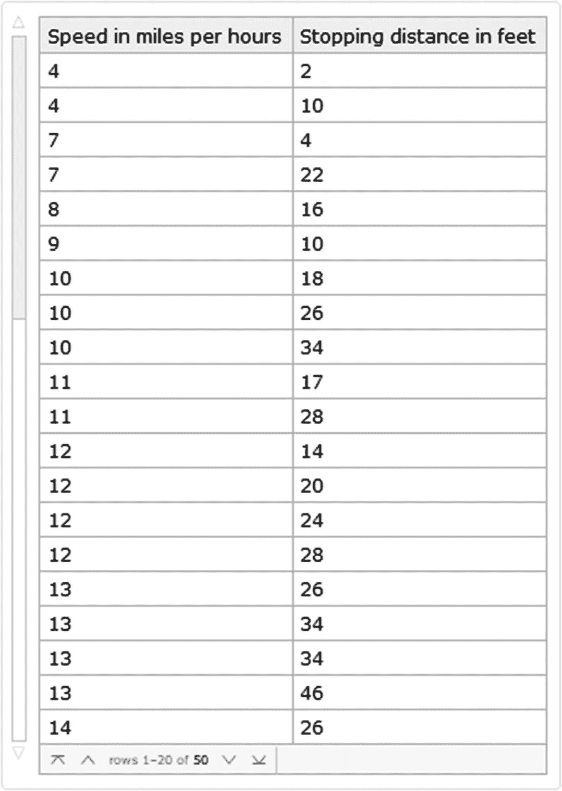

图 4-15

停车距离数据集

```py
In[62]:=
SpDataset=Dataset[SpData,Background→LightBlue][All,<|#1→1,#2→2|>]&["Speed in miles per hours","Stopping distance in feet"]
Out[62]=

```

至此，我们完成了数据集的创建。现在，这些数据及其各自的列标题可以导出为 CSV 格式。

```py
In[63]:= Export["Dataset_csv.csv",SpDataset,"CSV"]
Out[63]= Dataset_csv.csv

```

如果导出成功，那么您应该有一个正确格式的 CSV 文件。对于 TSV 文件，请参见下表。

```py
In[64]:= Export["Dataset_tsv.tsv",SpDataset,"TSV"]
Out[64]= Dataset_tsv.tsv

```

### XLS 和 XLSX 格式

值得注意的是，要将数据集导出为电子表格格式，如 XLS 或 XLSX，我们应该将数据集作为一个列表，因为试图直接导出数据集会导致导出单个单元格中的关联，我们对此不感兴趣。关于第二点，因为我们有了数据集，所以我们使用 Normal 命令来提取值，该命令将数据集转换成一个普通表达式，然后从带值的大括号中提取值。

```py
In[65]:= Values@Normal@SpDataset
Out[65]= {{4,2},{4,10},{7,4},{7,22},{8,16},{9,10},{10,18},{10,26},{10,34},{11,17},{11,28},{12,14},{12,20},{12,24},{12,28},{13,26},{13,34},{13,34},{13,46},{14,26},{14,36},{14,60},{14,80},{15,20},{15,26},{15,54},{16,32},{16,40},{17,32},{17,40},{17,50},{18,42},{18,56},{18,76},{18,84},{19,36},{19,46},{19,68},{20,32},{20,48},{20,52},{20,56},{20,64},{22,66},{23,54},{24,70},{24,92},{24,93},{24,120},{25,85}}

```

现在我们有了数据，我们可以继续添加列标题，然后从数据集中导出提取的数据。

```py
In[66]:=
ColTitles={"Speed in miles per hours","Stopping distance in feet"};

```

为了附加这两个列表，我们将使用 Prepend。我们将把名称 ExprtData 赋给新值。

```py
In[67]:= Short[ExprtData=Prepend[%%,ColTitles],1]
Out[67]//Short= {{Speed in miles per hours,Stopping distance in feet},{4,2},{4,10},{7,4},{7,22},{8,16},<<39>>,{23,54},{24,70},{24,92},{24,93},{24,120},{25,85}}

```

应该注意的是，我们没有定义变量来将数据列表和标题放在一起。我们使用百分比符号来简化代码。现在我们有了完整的数据，我们可以将它导出为 XLS 或 XLSX 格式。

```py
In[68]:= Export["Stopping_distance_Dataset.xlsx",ExprtData,"XLSX"]
Out[68]= Stopping_distance_Dataset.xlsx

```

如果我们验证该文件，我们应该得到类似前面创建的数据集。

### JSON 格式

抛开前面提到的，还可以将信息导出为 JSON 等格式。在下面的例子中，我们将从一个关联中创建一个 JSON 结构。

```py
In[69]:= Association@
{
"Name"→"Ellis",
"Date of birth"→"1990,01,04",
"Height"→"180 cm",
"Favorite color"→"Red",
"Hobbies"→"Soccer, Pc gaming, Board games",
"Social netwoks"→"Twitter, Facebook"
};
Export["File_json.json",%,"JSON"]
Out[69]= File_json.json

```

如果您打开新的 JSON 文件，您会看到它有一个对应于 JSON 文件的结构。对于我们有一个嵌套列表的情况，这是相同的过程，尽管您也可以在导出时使用“Rawjson”格式。这个想法是，我们可以将数据从关联导出到 JSON 格式，正如我们已经看到的；关联的大括号和值可以是任何表达式。这导致我们说，可以添加更多的关联，并且可以导出这些关联。需要注意的重要一点是，考虑到 JSON 格式成对包含大括号和值的特性，可以从关联中导出 JSON 格式的数据。当我们有一个数据集时，检查案例(图 [4-16](#Fig16) )，按此处注明的进行。


图 4-16

JSON 文件数据集

```py
In[70]:= Association@
{
"Name"→"Ellis",
"Date of birth"→DateObject[{1990,01,04}],
"Height"→Quantity[180,"Centimeters"],
"Favorite color"→"Red",
"Hobbies"→"Soccer, Pc gaming, Board games",
"Social netwoks"→"Twitter, Facebook"
};
User=Dataset[%]
Out[70]=

```

正如我们所见，数据集是构建的，但在某些情况下，数据集可能包含数量或其他语义对象，如本例中的日期和高度。因此，导出它们的方式和以前一样，但是使用 JSON 选项格式，而不是 Rawjson，因为这不允许导出 dataset 对象。如果我们想使用 Rawjson，我们必须将语义对象转换为字符串或数字。

```py
In[71]:= Export["Dataset_json.json",User,"JSON"]
Out[71]= Dataset_json.json

```

如果我们有一个重复键的数据集，我们可以将其导出为 JSON 格式(图 [4-17](#Fig17) )。

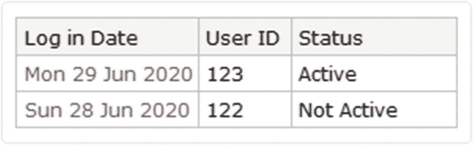

图 4-17

资料组

```py
In[72]:=
Assoc1=<|"Log in Date"→DateObject[{2020,06,29}],"User ID"→123,"Status"→"Active"|>;
Assoc2=<|"Log in Date"→DateObject[{2020,06,28}],"User ID"→122,"Status"→"Not Active"|>;
Dataset[{Assoc1,Assoc2}]
Export["Dataset2_json.json",%,"JSON"]
Out[72]=

```

```py
Out[72]= Dataset2_json.json

```

准确地说，您可以导出数据集包含复杂结构(如关联的关联)的形状。让我们看看下面的例子，我们首先构建一个数据集(图 [4-18](#Fig18) )。

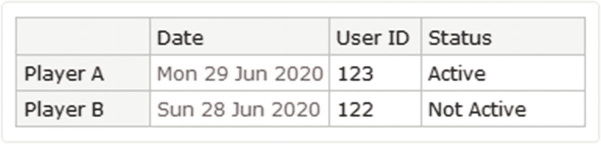

图 4-18

标记数据集

```py
In[73]:= Assoc3="Player A"→Association["Date"→DateObject[{2020,06,29}],"User ID"→123,"Status"→"Active"];Assoc4="Player B"→Association["Date"→DateObject[{2020,06,28}],"User ID"→122,"Status"→"Not Active"];
Dataset[{<|Assoc3,Assoc4|>}]
Out[73]=

```

随后，我们继续导出数据集。

```py
In[74]:= Export["Dataset3_json.json",%,"JSON"]
Out[74]= Dataset3_json.json

```

为了更好地理解如何以 JSON 格式导出。当我们导出诸如规则列表或单个关联之类的信息时，导出的 JSON 文件中的内容结构将通过大括号和值之间的对的集合来实现。相反，当我们拥有有序的结构时，比如列表的关联和关联的关联，JSON 文件中内容的结构将是一个有序的数组，位于大括号和值之间的关联对集合的数组中。然而，恰恰相反，当我们导出一个嵌套列表时，它已经是排序数组的形式了。为了澄清这一点，请读者观察规则列表是如何通过下面的代码导出的。

```py
In[75]:= Rules={"apple"→3,"car"→"3","2"→2};
Export["Rules.json",Rules,"JSON"]
Out[75]= Rules.json

```

此外，对于嵌套列表或列表列表。

```py
In[76]:= Arry=Array[{#1,#2}&,{4,4}]
Export["Array.json",Arry,"JSON"]
Out[76]= {{{1,1},{1,2},{1,3},{1,4}},{{2,1},{2,2},{2,3},{2,4}},{{3,1},{3,2},{3,3},{3,4}},{{4,1},{4,2},{4,3},{4,4}}}
Out[76]= Array.json

```

如果观察到创建的文件，它必须在 JSON 文件中包含数组的数组。

### 内容文件对象

应该得出结论，对于所有导出的文件，我们可以创建一个内容对象，向我们显示所创建文件的属性。这是通过 ContentObject 函数实现的，它为我们提供了文件中的内容。为此，让我们以创建 JSON 文件的关联为例。

```py
In[77]:=
Association@
{
"Name"→"Ellis",
"Date of birth"→DateObject[{1990,01,04}],
"Height"→Quantity[180,"Centimeters"],
"Favorite color"→"Red",
"Hobbies"→"Soccer, Pc gaming, Board games",
"Social netwoks"→"Twitter, Facebook"
};
User=Dataset[%];
JsonFile=Export["Dataset_json_2.json",User,"JSON"];

```

现在我们需要用 AbsoluteFileName 获取文件所在的路径。

```py
In[78]:= AbsoluteFileName[JsonFile]
Out[78]= C:\Users\My-pc\Desltop\Dataset_json_2.json

```

我们现在使用 File 来创建文件对象类型表示。

```py
In[79]:= File[%]//InputForm
Out[79]//InputForm=
File["C:\\Users\\My-pc\\Desktop\\Dataset_json_2.json"]

```

然后将 ContentObject 应用于文件对象。

```py
In[80]:= ContentObject[%]
Out[80]=

```

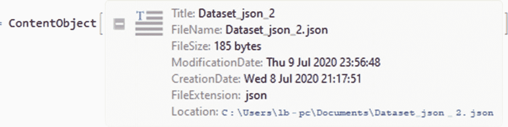

图 4-19

创建的 JSON 文件的 ContentObject

将出现一个内容类型对象(图 [4-19](#Fig19) )。如果我们按+图标，它将为我们提供导出文件的属性，如名称、大小、创建日期和文件本地化。您可以使用以下形式以编程方式访问这些属性。

```py
In[81]:= ContentObject[%%]["Properties"]
Out[81]= {Location,FileName,ModificationDate,CreationDate,FileByteCount,FileExtension,Title,Plaintext}

```

这可以应用于其他导出的文件。

## 用 Wolfram 语言搜索文件

使用 Wolfram 语言，我们可以查看文件的位置。

要查看笔记本目录的路径，可以使用命令 notebook directory。它将显示包含您当前工作的笔记本的完整目录。

```py
In[82]:= NotebookDirectory[]
Out[82]= C:\Users\My-pc\Desktop\

```

现在使用 SetDirectory 将一个工作目录设置为当前目录。您可以输入所需目录的路径，并将其建立为工作目录。但是，现在我们将把笔记本目录设置为新的工作目录。

```py
In[83]:= SetDirectory[NotebookDirectory[]]
Out[83]= C:\Users\My-pc\Desktop

```

有了这个新的目录集，我们现在可以继续在新目录(笔记本位置)中查找文件。命令 FileNames 让我们探索工作目录中的文件，在本例中是笔记本的目录，因为我们在前面的代码中设置了它。

```py
In[84]:= FileNames[]
Out[84]= {Color_table.txt,Grocery_List.csv,Hello_World,Hello_World.txt,import export.nb,weather.csv}

```

文件名将显示目录中所有类型的文件。如果我们在目录中有很多文件，我们可以通过使用 FindFile 并以字符串形式输入文件名来搜索特定的文件。并将显示文件的完整路径。

```py
In[85]:= FindFile["Color_table.txt"]
Out[85]= C:\Users\My-pc\Desktop\Color_table.txt

```

也可以搜索文件扩展名。

```py
In[86]:= FileNames["*.txt"]
Out[86]= {Color_table.txt,Hello_World.txt}

```

Note

存在其他类型的文件命令；要查找更多与名称文件相关联的命令，请输入？？文件*。

请记住，这是我们将工作目录设置为笔记本目录时的情况。如果我们以前没有设置一个目录，Mathematica 将搜索你的机器的默认目录，这些目录显示为输入$Path。