# 九、使用 Wolfram 语言编写的神经网络

本模块将从 Wolfram 语言中神经网络框架的基础开始。本章从层的概念、如何使用不同层的命令以及最常见的层开始。我们将学习如何通过网络端口将数据输入到层中，以及层的不同等效表达形式。其次是如何通过它们的符号来区分不同的层。通过查看 Wolfram 语言方案中的层的概念，比较具有不同用途和执行不同计算的不同层，我们将看到层可以有多个选项，从而使层具有各种规格。我们还将通过查看 Wolfram 语言支持的各种激活函数，检查每个函数的图形以及不同的语法形式来实现这一点。接下来，我们将查看编码器和解码器的概念，以及如何根据要完成的任务将这些工具用于构建神经网络模型。然后，我们学习如何使用这些编码器和解码器将不同的数据类型转换为数字数组，以及如何将数字数组转换回初始数据。我们介绍了容器的概念，以及它对创建的模型的意义和存在的类型。我们将看到如何用不同的命令处理和构建容器，以及如何图形化地可视化所创建的模型。我们展示了 Wolfram 神经网络框架如何支持 MXNet 相关操作，以及如何将网络导出为 MXNet 操作的格式。

## 层

要用 Wolfram 语言构建一个神经网络，有必要理解这些是从层构建的。层是一个术语，可以应用于在神经网络内的特定级别上一起操作的节点的集合。该层是用于构建神经网络的必要且简单的成员。

### 输入数据

这些层处理的数据是数字类型，而不是其他类型。输入变量可以是:向量，一维列表；矩阵，一个二维列表；和数组、列表列表或任何其他数值张量。这些输入变量可以是具有已知形状或多维形状的研究数据集的要素或属性。这些类型的输入属性与输入图层相关联，而输入图层的要素大小必须等于图层的输入大小，但并非每个图层都接收相同的输入并返回相同的输出；每个输入都因所用图层的类型而异。这个定义是神经网络中最基本的概念之一，因为它们是涉及术语神经网络的整个结构的重要组成部分。这里需要注意的是不要混淆输入和输入层，因为它们的意思不同。

### 线性层

线性层是神经网络中最常见和最广泛使用的层。要在 Wolfram 语言中构建最简单的层，请使用命令 LinearLayer。

```py
In[1]:= LinearLayer["Input"→ 1,"Output"→ 2]
Out[1]=

```

图 [9-1](#Fig1) 表示 Wolfram 语言中的 LinearLayer 对象。单击加号图标显示内部参数，包括关于层端口的输入和输出以及线性层的权重和偏差的数组等级的详细信息。如图 [9-2](#Fig2) 所示。

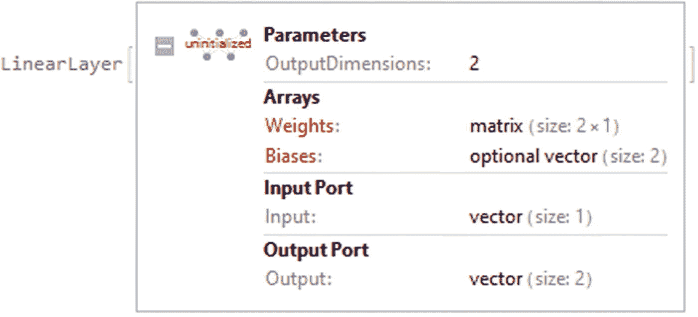

图 9-2

扩展的 LinearLayer 对象

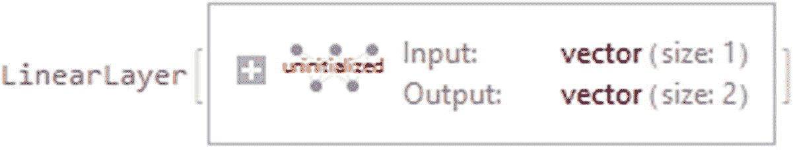

图 9-1

LinearLayer 对象

每层都有一个输入端口和一个输出端口。每个端口都有一个相关的大小，表示进入该层的内容和出去的内容。在后一种情况下，一个大小为 1 的向量进入，该层返回一个大小为 2 的向量。

### 权重和偏差

线性层的一般形式由点积 **w ⋅ x + b** 的以下表达式给出，其中 **x** 是数据的向量， **w** 表示权重的矩阵， **b** 是偏差的向量。线性图层还有其他相关的名称，如 MXnet 框架中的全连接图层。Wolfram 语言中各层的输入接收数值张量作为输入，也就是说，它们只作用于数值数组。

为了显式地输入输入和输出的大小，我们把输入端口和输出端口的形式写成后跟不同选项的形式:“输入”或“输出”→ {size，options。}.选项包括定义一个实数(real)，一个 n 形式的向量(single number n)，一个数组({n1 * n2 * n3}...)，或者一个 NetEncoder，我们后面会看到。下面是一些写层的等效方法，如图 [9-3](#Fig3) 所示。

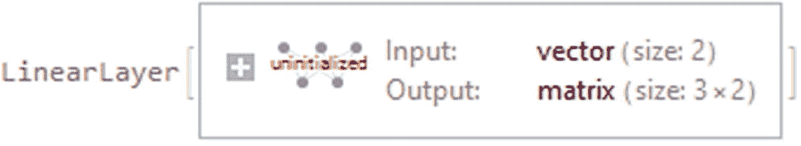

图 9-3

具有不同输入和输出秩阵列的线性层

```py
In[2]:= LinearLayer[“Input"->{2,"Real"},"Output"->{2,1}]
Out[2]=

```

正如我们在图 [9-3](#Fig3) 中看到的，该层接收一个大小为 2 的向量(长度为 2 的列表)，它由实数组成，输出是形状为 3 x 2 的矩阵。当在 Wolfram 神经网络框架内指定一个实数时，它以实数 32 的精度工作。当没有参数添加到图层时，将会推断出输入和输出的形状。

要手动分配权重和偏差，请填写“权重”→数字，“偏差”→数字；无也可用于无权重或偏差。如下例所示，权重和偏差设置为固定值 1 和 2(图 [9-4](#Fig4) )。

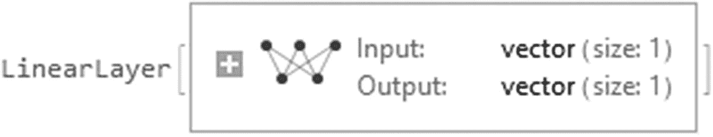

图 9-4

使用固定偏差和权重初始化线性图层

```py
In[3]:= LinearLayer["Input"→ 1,"Output"→ 1,"Weights"→ 1,"Biases"→ 2]
Out[3]=

```

### 初始化层

除了能够自己初始化层，还有另一个命令允许我们用随机值初始化层；这是 NetInitialize。因此，为了建立权重或偏差的保持值，我们也可以使用学习率乘数选项(图 [9-5](#Fig5) )。除此之外，LearningRateMultipliers 还标记了层在训练阶段的学习速率。

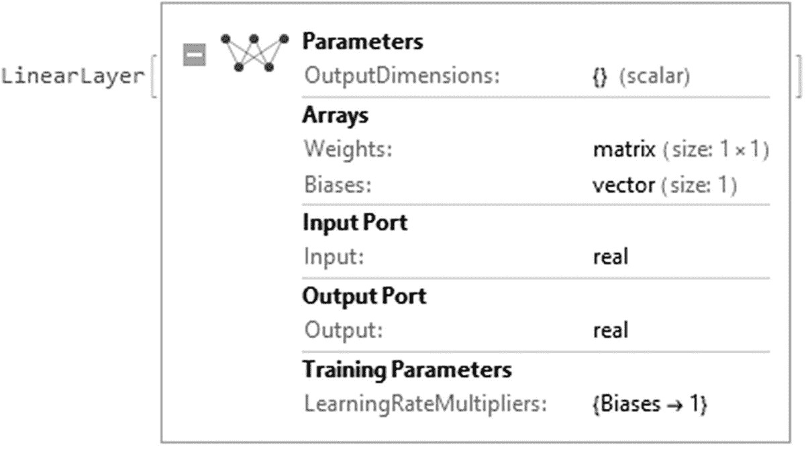

图 9-5

带训练参数的线性层

```py
In[4]:= NetInitialize[LinearLayer["Input"→ "Real","Output"→ "Real",LearningRateMultipliers→{"Biases"→1}]]
Out[4]=

```

初始化图层时，未初始化的文本会消失。如果我们观察新层的属性，在训练参数中会出现已经建立的固定偏差和学习速率。

NetInitialize 的选项有 Method 和 RandomSeeding。可用的方法有明凯、泽维尔、正交(正交权重)和随机(从分布中选择权重)。例如，我们可以使用正态分布的 Xavier 初始化采样，如图 [9-6](#Fig6) 所示。

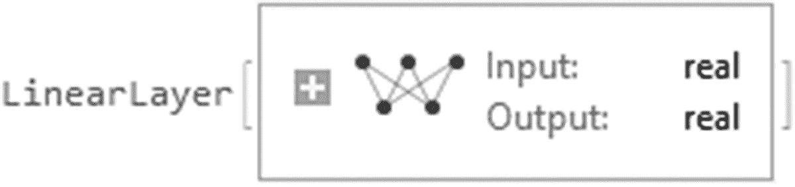

图 9-6

用 Xavier 方法初始化的 LinearLayer

```py
In[5]:= NetInitialize[LinearLayer["Input"→ "Real","Output"→ "Real",LearningRateMultipliers→{"Biases"→1}],Method→ {"Xavier","Distribution"→"Normal"},RandomSeeding→888]
Out[5]=

```

Note

要查看图层的选项集，建议使用 Option 命令。

尽管可以手动建立权重和偏差，但建议以随机值开始图层，以保持模型整体结构的一定程度的复杂性，因为相反，这会影响神经网络的创建，而神经网络无法对非线性行为进行准确预测。

### 检索数据

NetExtract 用于以 NetExtract [net，{level1，level2，...}.线性层的权重和偏差参数打包在 NumericArray 对象中(图 [9-7](#Fig7) )。该对象将具有层中值的值、尺寸和类型。NetExtract 还用于提取具有许多层的网络的层。在 Wolfram 语言中使用 NumericArrays 来减少内存消耗和计算时间。

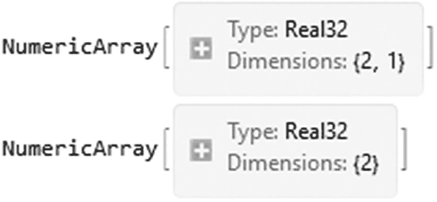

图 9-7

线性图层的权重和偏差。用 Normal 我们把它们转换成列表。

```py
In[6]:= LinearL=NetInitialize[LinearLayer[2, "Input"→ 1],RandomSeeding→888];
NetExtract[LinearL,#]&/@{"Weights","Biases"}//TableForm
Out[6]=

```

```py
In[7]:= TableForm[SetPrecision[{{Normal[NetExtract[LinearL,"Weights"]]},{Normal[NetExtract[LinearL,"Biases"]]}},3],TableHeadings→{{"Weights →","Biases →"},None}]
Out[7]//TableForm=

```

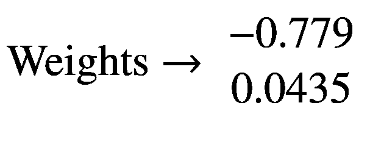

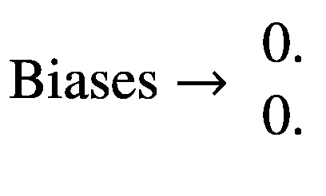

例如，一个层可以接收长度为 1 的向量，以产生大小为 2 的输出向量。

```py
In[8]:= LinearL[4]
Out[8]= {-3.11505,0.174007}

```

当输入不是以适当的形状引入时，将不会对图层进行评估。

```py
In[9]:= LinearL[{88,99}]
Out[9]= LinearLayer::invindata1: Data supplied to port "Input" was a length-2 vector of real numbers, but expected a length-1 vector of real numbers.
$Failed

```

权重和偏差是模型必须学习的参数，可以基于模型接收的输入数据进行调整，这就是为什么它被随机初始化的原因，因为如果我们试图提取这些值而不进行初始化，我们将无法提取，因为它们还没有被定义。

层具有可微的性质。这是通过 NetPortGradient 实现的，它可以表示网络输出相对于端口或参数的梯度。例如，对于某个输入值，给出输出相对于输入的导数。

```py
In[10]:= LinearL[2,NetPortGradient["Input"]]
Out[10]= {-0.735261}

```

### 均方层

到目前为止，我们已经看到了线性层，它具有各种属性。相比之下，带有相连菱形图标的层(图 [9-8](#Fig8) )不包含任何可学习的参数，如 MeanSquaredLossLayer、AppendLayer、SummationLayer、DotLayer、ContrastiveLossLayer 和 SoftmaxLayer 等。

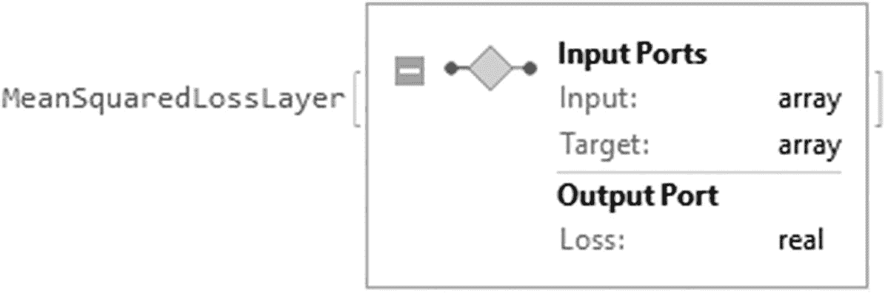

图 9-8

MeanSquaredLossLayer

```py
In[11]:= MeanSquaredLossLayer[]
Out[11]:=

```

meanvsquaredlosslayer[]，有多个输入。这是因为该层计算均方损失，这是下面的表达式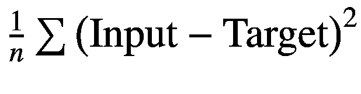，并且具有比较两个数值数组的属性。使用 MeanSquaredLossLayer，输入/输出端口的尺寸以与线性层相同的形式输入，输入和目标的值作为关联输入。

```py
In[12]:= MeanSquaredLossLayer["Input"→{3,2},"Target"→{3,2}][Association["Input"→{{1,2},{2,1},{3,2}},"Target"→{{2,2},{1,1},{1,3}}]]
Out[12]= 1.6667

```

后一个示例为三行两列的输入/输出维度计算 MeanSquaredLossLayer，或者通过首先定义该层，然后将该层应用于数据。

Note

使用命令 MatrixForm[{{1，2}，{2，1}，{3，2}}]来验证数据的矩阵形状。

```py
In[13]:= LossLayer= MeanSquaredLossLayer["Input"→{3,2},"Target"→{3,2} ];
LossLayer@
<|"Input"→{{1,2},{2,1},{3,2}},"Target"→{{2,2},{1,1},{1,3}}|>
Out[13]= 1.16667

```

要获得层的更多细节(图 [9-9](#Fig9) ，使用信息命令。

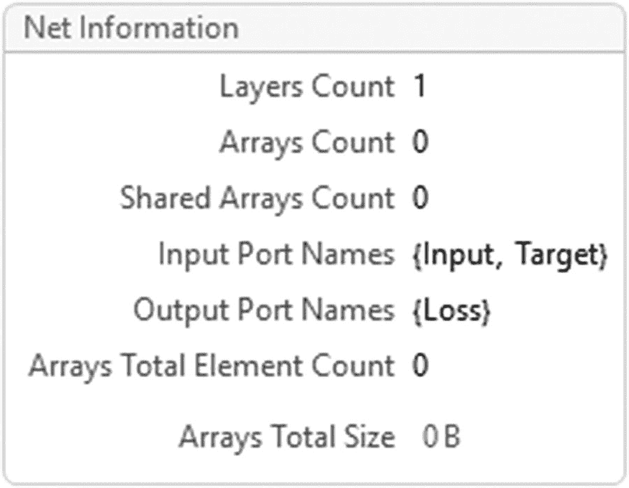

图 9-9

关于损失层的信息

```py
In[14]:= Information[LossLayer]
Out[14]=

```

要了解图层选项，请使用以下内容。

```py
In[15]:= MeanSquaredLossLayer["Input"→"Real","Target"→"Real"]//Options
Out[15]= {BatchSize→Automatic,NetEvaluationMode→Test,RandomSeeding→Automatic,TargetDevice→CPU,WorkingPrecision→Real32}

```

输入端口和目标端口选项类似于线性层的选项，但形式不同，输入→"实数"，n(向量 n 的形式)，{n1 x n2 x n3}...(n 维数组)、“变化的”(向量或变化的形式)或 NetEncoder，但输入和目标必须具有相同的维数。几种层的形式如图 [9-10](#Fig10) 所示。

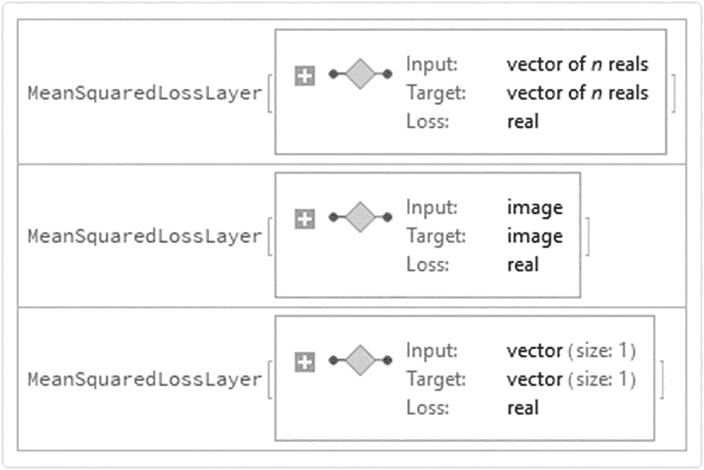

图 9-10

不同输入和目标形式的损失层

```py
In[16]:= {MeanSquaredLossLayer["Input"→"Varying","Target"→"Varying"],MeanSquaredLossLayer["Input"→ NetEncoder["Image"],"Target"→ NetEncoder["Image"]],MeanSquaredLossLayer["Input"→1,"Target"→1]}//Dataset
Out[16]=

```

### 激活功能

激活函数是构建神经网络的关键部分。激活函数的作用是在给定输入的情况下，从已建立的范围返回输出。在 Wolfram 语言中，激活函数被视为层。Wolfram 语言神经网络框架中广泛使用的层是 ElementwiseLayer。

通过此图层，我们可以表示可将一元函数应用于输入数据元素的图层，换句话说，就是只接收一个参数的函数。这些功能也称为激活功能。例如，最常用的函数之一是双曲正切(Tanh[x])，如图 [9-11](#Fig11) 所示。


图 9-11

Tanh[x]层

```py
In[17]:= ElementwiseLayer[Tanh[#]&](* Altnernate form ElementwiseLayer[Tanh]*)
Out[17]=

```

元素层没有可学习的参数。使用 pure 函数是因为图层不能接收符号。如果单击加号图标，将显示端口的详细信息以及相关功能的参数，在本例中是 Tanh。定义了 ElementWiseLayer 后，它可以像其他层一样接收值。

```py
In[18]:= In[52]:= ElementwiseLayer[Tanh[#]&];
Table[%[i],{i,-5,5}]
Out[18]= {-0.999909,-0.999329,-0.995055,-0.964028,-0.761594,0.,0.761594,0.964028,0.995055,0.999329,0.999909}

```

当没有给定输入或输出形状时，图层将推断它将接收或返回的数据类型。例如，通过仅指定输入为实数，Mathematica 将推断输出将为实数(图 [9-12](#Fig12) )。

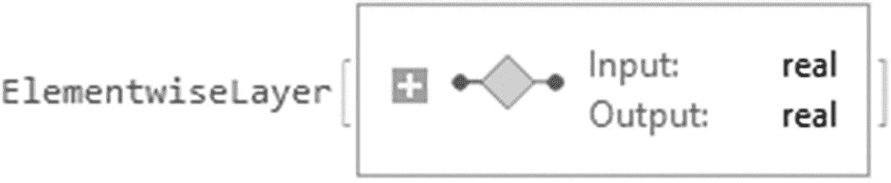

图 9-12

输出与输入相同的 elemontwiselayer

```py
In[19]:= TanhLayer=ElementwiseLayer[Tanh,"Input"→ "Real"]
Out[19]=

```

或者，这可以通过仅输入整流线性单元(ReLU)的输出来推断(图 [9-13](#Fig13) )。

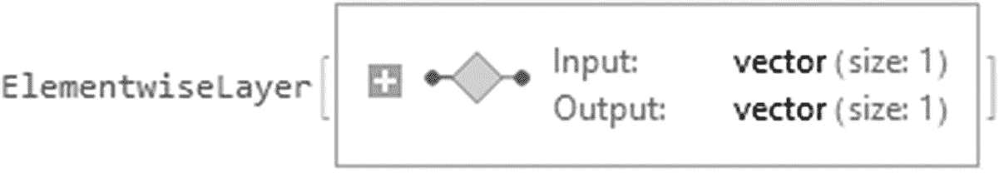

图 9-13

斜坡函数或 ReLU

```py
In[20]:= RampLayer=ElementwiseLayer[Ramp,"Output"→ {1}](*or ElementwiseLayer["ReLU","Output"\[Rule] "Varying"]*)
Out[20]=

```

Note

单击加号图标将显示 ElementWiseLayer 的已建立功能，以及层端口的详细信息。

通过指定 TargetDevice 选项，Wolfram 语言中的每一层都可以通过图形处理器单元(GPU)或中央处理器单元(CPU)运行。例如，让我们用 CPU 上的目标设备绘制之前创建的层(图 [9-14](#Fig14) )。

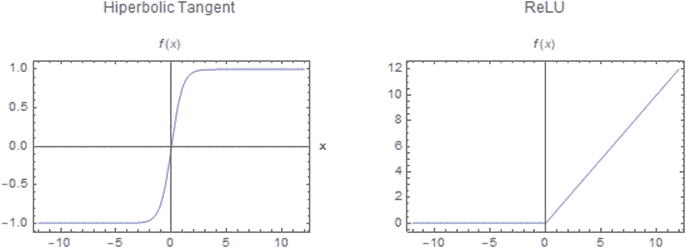

图 9-14

Tanh[x]和 Ramp[x]激活函数

```py
In[21]:= GraphicsRow@{Plot[TanhLayer[x,TargetDevice→ "CPU"],{x,-12,12},PlotLabel→"Hiperbolic Tangent",AxesLabel→{Style["x",Bold],Style["f(x)",Italic]},PlotStyle→ColorData[97,25],Frame→True],Plot[RampLayer[x,TargetDevice→ "CPU"],{x,-12,12},PlotLabel→"ReLU",AxesLabel→{Style["x",Bold],Style["f(x)",Italic]},PlotStyle→ColorData[97,25],Frame→True]}
Out[21]=

```

其他函数可以通过它们的名称或 Wolfram 语言语法来使用，例如 SoftPlus 函数。图 [9-15](#Fig15) 展示了这一点。

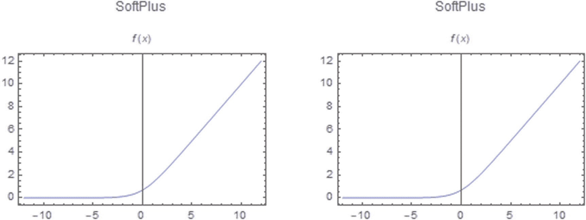

图 9-15

由关联名称和纯函数生成的 SoftPlus 函数

```py
In[22]:= GraphicsRow@{Plot[ElementwiseLayer["SoftPlus"][x,TargetDevice→ "CPU"],{x,-12,12},PlotLabel→#1,AxesLabel→#2,PlotStyle→#3,Frame→#4],Plot[ElementwiseLayer[Log[Exp[#]+1]&][x,TargetDevice→ "CPU"],{x,-12,12},PlotLabel→#1,AxesLabel→#2,PlotStyle→#3,Frame→#4]}&["SoftPlus",{Style["x",Bold],Style["f(x)",Italic]},ColorData[97,25],True]
Out[22]=

```

其他常见函数显示在接下来的图中，例如比例指数线性单位、sigmoid、硬 sigmoid 和硬双曲正切(图 [9-16](#Fig16) )。要查看支持的函数，请访问文档并在搜索框中键入 ElementwiseLayer。

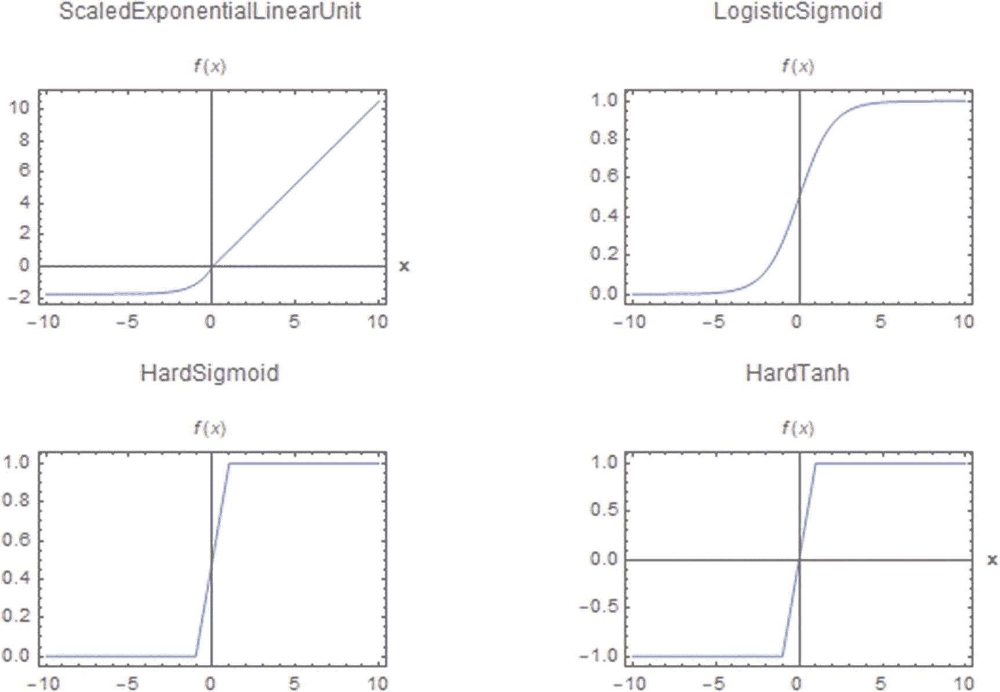

图 9-16

四种不同激活函数的曲线图

```py
In[23]:=
GraphicsGrid@{{Plot[ElementwiseLayer["ScaledExponentialLinearUnit"][i,TargetDevice→ #1],#2,AxesLabel→#3,PlotStyle→#4,Frame→#5,PlotLabel→"ScaledExponentialLinearUnit"],
Plot[ElementwiseLayer[LogisticSigmoid][i,TargetDevice→ #1],#2,AxesLabel→#3,PlotStyle→#4,Frame→#5,PlotLabel→"LogisticSigmoid"]},
{Plot[ElementwiseLayer["HardSigmoid"][i,TargetDevice→ #1],#2,AxesLabel→#3,PlotStyle→#4,Frame→#5,PlotLabel→"HardSigmoid"],
Plot[ElementwiseLayer["HardTanh"][i,TargetDevice→ #1],#2,AxesLabel→#3,PlotStyle→#4,Frame→#5,PlotLabel→"HardTanh"]}}&["CPU",{i,-10,10},{Style["x",Bold],Style["f(x)",Italic]},ColorData[97,25],True]
Out[23]=

```

### sofmaxlayer

SoftmaxLayer 是一个使用表达式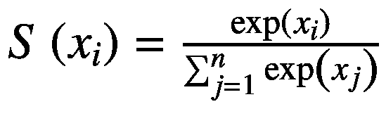的层，其中 x 表示一个矢量，x <sub>i</sub> 表示矢量的分量。这个表达式称为 Softmax 函数。这一层的功能包括将矢量转换成归一化矢量，归一化矢量由 0 到 1 范围内的值组成。这一层通常用于表示基于每个类的概率的类的划分，它用于涉及分类的任务。

SoftmaxLayer 中的输入和输出表单可以作为除“Real”形状之外的其他公共层输入。

```py
In[24]:= SFL=SoftmaxLayer["Input"→ 4,"Output"→ 4];

```

现在，图层可以应用于数据。

```py
In[25]:= SetAccuracy[SFL[{9,8,7,6}],3]
Out[25]= {0.64,0.24,0.09,0.03}

```

后者的总和等于 1。SoftmaxLayer 允许我们指定规范化的级别深度。这可以在图层的参数属性中看到。级别-1 表示展平列表的正常化。此外，SoftmaxLayer 可以接收多维数组，而不仅仅是扁平列表。

```py
In[26]:= SoftmaxLayer[1,"Input"→{3,2}];
SetPrecision[%[{{7,8},{8,7},{7,8}}],3]//MatrixForm
Out[26]//MatrixForm=

```

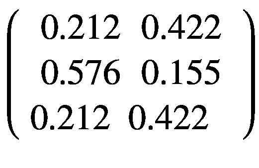

对第一列的元素求和得到第二列的元素。

另一个实用的层叫做 CrossEntropyLossLayer。该层广泛用作分类任务的损失函数。该损失层衡量分类模型的性能。输入字符串概率作为损失图层的参数，通过比较输入类概率和目标类概率来计算交叉熵损失。

```py
In[27]:= CrossEntropyLossLayer["Probabilities","Input"→3];

```

现在，目标形式被设置为类的概率；输入和目标的方式与 MeansSquaredLoss 相同。

```py
In[28]:= %[<|"Input"→{0.2,0.5,0.3},"Target"→{0.3,0.5,0.2}|>]
Out[28]= 1.0702

```

当概率构成二进制选项时，在层中设置二进制参数。

```py
In[29]:=CrossEntropyLossLayer["Binary","Input"→ 1];
%[<|"Input"→ 0.1,"Target"→ 0.9|>]
Out[29]= 2.08286

```

总结一下 Wolfram 语言中层的属性，层的输入和输出总是标量和数字矩阵。使用较低的数字精度来评估图层，例如单精度数字。层具有可微分的性质，这有助于模型执行有效的学习，因为一些学习方法进入凸优化问题。

在 Wolfram 语言中，有许多层，每层都有特定的功能。要显示 Mathematica 中的所有层，建议查看文档或编写？* Layer，这将为我们提供在末尾与单词 Layer 相关联的命令。每一层都有不同的行为、操作和参数，尽管有些可能类似于 Append 和 AppendLayer 等其他命令。了解不同的层以及它们能够做什么来最好地利用它是很重要的。

## 编码器和解码器

### 编码器

如果要使用音频、图像或其他类型的变量，这种类型的数据需要转换为数字数组，以便作为输入引入到层中。为了执行正确的构造，图层必须具有附加到输入的 NetEncoder。网络编码器将图像、音频等数据解释为数值，以便在网络模型中使用。不同的名称与编码类型相关联。最常见的有:Boolean(真或假，编码为 1 或 0)、Characters(字符串字符作为热点矢量编码)、Class(类标签作为整数编码)、Function(自定义函数编码)、Image (2D 图像编码为秩 3 数组)和 Image3D (3D 图像编码为秩 4 数组)。

编码器的自变量是名称或编码器的名称和对应的特性(图 [9-17](#Fig17) )。


图 9-17

布尔型网络编码器

```py
In[30]:= NetEncoder["Boolean"]
Out[30]=

```

为了测试编码器，我们使用下面的代码。

```py
In[31]:= Print["Booleans:",{%[True],%[False]}]
Booleans:{1,0}

```

NetEncoder 可以有不同索引标签的类。类似于 X 类和 Y 类的分类，这将对应于从 1 到 2 范围内的指数(图 [9-18](#Fig18) )。

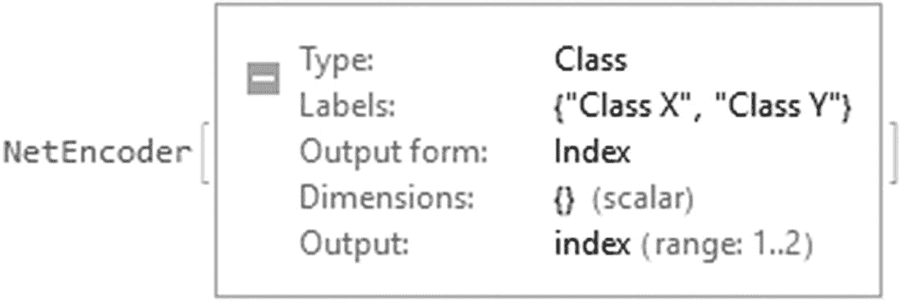

图 9-18

类别类型网络编码器

```py
In[32]:= NetEncoder[{"Class",{"Class X","Class Y"}}]
Out[32]=

```

```py
In[33]:= Print["Classes:",%[Table[RandomChoice[{"Class X","Class Y"}],{i,10}]]]
Classes:{2,1,2,2,1,1,2,1,1,1}

```

以下用于单位矢量。

```py
In[34]:= NetEncoder[{"Class",{"Class X","Class Y","Class Z"},"UnitVector"}];
Print["Unit Vector:",%[Table[RandomChoice[{"Class X","Class Y","Class Z"}],{i,5}]]]
Print["MatrixForm:",%%[Table[RandomChoice[{"Class X","Class Y","Class Z"}],{i,5}]]//MatrixForm[#]&]
Unit Vector:{{0,1,0},{0,0,1},{0,1,0},{1,0,0},{1,0,0}}

```

`MatrixForm:` 

根据 NetEncoder 中使用的名称，与编码器相关的属性可能会有所不同。这在创建的不同编码器对象中有所描述。为了将 NetEncoder 连接到层，编码器在输入端口输入——例如，对于 ElementwiseLayer(图 [9-19](#Fig19) )。在这种情况下，层的输入端口名为 Boolean 该层识别出这是布尔类型的 NetEncoder。单击名称 Boolean 将显示相关属性。

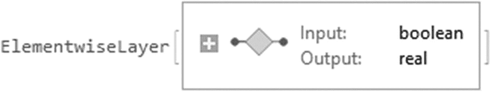

图 9-19

将编码器连接到输入端口的层

```py
In[35]:= ElementwiseLayer[Sin,"Input"→NetEncoder["Boolean"]]
Out[35]//Short=

```

对于 LinearLayer，使用以下形式。

```py
In[36]:= LinearLayer["Input"→NetEncoder[{"Class",{"Class X","Class Y"}}],"Output"→ "Scalar"]
Out[36]=

```

点击输入端口将显示编码器规格，如图 [9-20](#Fig20) 所示。

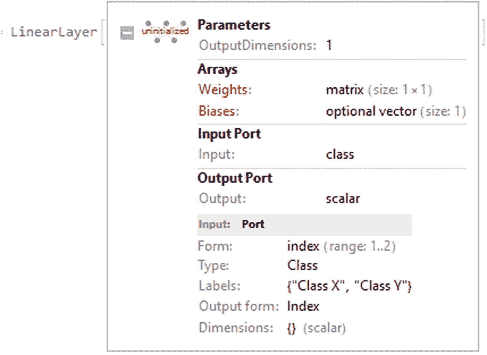

图 9-20

附加到线性图层的类编码器

NetEncoder 还用于将图像转换为数字矩阵或数组，方法是指定输出维度的类别、大小或宽度、高度以及颜色空间，颜色空间可以是灰度、RGB、CMYK 或 HSB(色调、饱和度和亮度)，例如，对图像进行编码，生成灰度的 1 x 28 x 28 数组或 RGB 比例的 3 x 28 x 28 数组(图 [9-21](#Fig21) ，而不管输入图像的大小。数组的第一行表示颜色通道，另外两行表示空间维度。

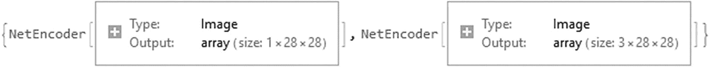

图 9-21

灰度和 RGB 比例图像的网络编码器

```py
In[37]:= Table[NetEncoder[{"Image",{28,28},"ColorSpace"→ Color}],{Color,{"Grayscale","RGB"}}]
Out[37]=

```

一旦建立了编码器，就可以将其应用于所需的图像，然后编码器会创建一个指定大小的数字矩阵。为图像创建 NetEncoder 将显示相关的属性，如类型、输入图像大小和颜色空间等。应用编码器将创建一个先前确定大小的矩阵。

`"CMYK"}];`→`"CMYK"}];`

`Print["Numeric Matrix:",%[ExampleData[{"TestImage","House"}]]//MatrixForm]`

`Numeric Matrix:` ![$$ \left(\begin{array}{l}\left(\begin{array}{l}0.255\\ {}0.168\\ {}0.255\end{array}\right)\kern0.5em \left(\begin{array}{l}0.145\\ {}0.00392\\ {}0.0235\end{array}\right)\kern0.5em \left(\begin{array}{l}0.0784\\ {}0.0118\\ {}0.0274\end{array}\right)\\ {}\begin{array}{ccc}\left(\begin{array}{l}0.153\\ {}0.196\\ {}0.129\end{array}\right)&amp; \left(\begin{array}{l}0.2\\ {}0.31\\ {}0.255\end{array}\right)&amp; \left(\begin{array}{l}0.259\\ {}0.349\\ {}0.306\end{array}\right)\end{array}\\ {}\begin{array}{ccc}\left(\begin{array}{l}0.047\\ {}0.102\\ {}0.00784\end{array}\right)&amp; \left(\begin{array}{l}0.164\\ {}0.321\\ {}0.164\end{array}\right)&amp; \left(\begin{array}{l}0.262\\ {}0.384\\ {}0.176\end{array}\right)\end{array}\\ {}\begin{array}{ccc}\left(\begin{array}{l}0.16\\ {}0.262\\ {}0.184\end{array}\right)&amp; \left(\begin{array}{l}0.255\\ {}0.408\\ {}0.478\end{array}\right)&amp; \left(\begin{array}{l}0.325\\ {}0.388\\ {}0.569\end{array}\right)\end{array}\end{array}\right) $$](img/500903_1_En_9_Chapter_TeX_IEq7.png)

生成的输出是一个数字矩阵，现在可以在网络模型中实施。如果输入图像形状在不同的颜色空间中，则编码器将对图像进行整形并将其转换到已建立的颜色空间中。此示例中使用的图像是从 ExampleData[{"TestImage "，" House"}]中获得的。

### 汇集层

通过为端口指定编码器，可以将编码器添加到单层或容器的端口中，例如，PoolingLayer。这些层大多用于卷积神经网络(图 [9-22](#Fig22) )。


图 9-22

带有网络编码器的池层

```py
In[39]:= PoolLayer=PoolingLayer[{3,3},{2,2},PaddingSize→0,"Function"→ Max,"Input"→ NetEncoder[{"Image",{3,3},"ColorSpace"→ "CMYK"}](*Or ImgEncoder*)]
Out[39]=

```

后一层有一个二维 PoolingLayer 的规范，内核大小为 3 x 3，步幅为 2 x 2，这是内核应用程序之间的步长。PaddingSize 在矩阵的开头和结尾添加元素。这样做是为了使矩阵和内核大小之间的除法是一个整数，以避免层间信息丢失。Function 表示池化操作函数，为 Max 这样，它可以计算每个滤镜的每个面片的最大值、滤镜平均值的平均值以及滤镜值总和的总和。有时它们可能被称为最大和平均池层。

```py
In[40]:= PoolLayer[ExampleData[{"TestImage","House"}]]//MatrixForm
Out[40]//MatrixForm=

```

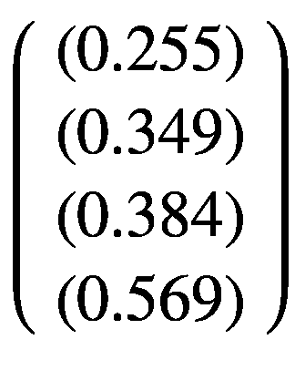

### 解码器

一旦网络的操作完成，它将返回数值表达式。另一方面，在一些任务中，我们不需要数字表达式，例如在分类任务中，类可以作为输出给出，模型能够判断某个对象属于 A 类，而另一个对象属于 B 类，因此向量或数字数组可以表示每个类的概率。为了将数字数组转换成其他形式的数据，使用了网络解码器(图 [9-23](#Fig23) )。

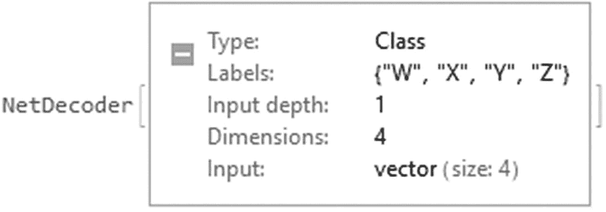

图 9-23

四种不同类别的网络解码器

```py
In[41]:= Decoder=NetDecoder[{"Class",CharacterRange["W","Z"]}]
Out[41]=

```

解码器的维数等于类结构。我们可以应用一个概率向量，解码器会解释它，并告诉我们它属于哪一类。它也将显示类的概率。

```py
In[42]:= Decoder@{0.3,0.2,0.1,0.4}(*This is the same as Decoder[{0.3,0.2,0.1,0,4},"Decision"] *)
Out[42]= Z

```

概率分布的最高决策、最高概率和不确定性显示如下。

```py
In[43]:= TableForm[{Decoder[{0.3,0.2,0.1,0.4},"TopDecisions"→ 4](* or {"TopDecisions", 4} the same is for TopProbabilities*),
Decoder[{0.3,0.2,0.1,0.4},"TopProbabilities"→ 4],
Decoder[{0.3,0.2,0.1,0.4},"Entropy"]},TableDirections→Column,TableHeadings→{{Style["TopDecisions",Italic],Style["TopProbabilities",Italic],Style["Entropy",Italic]},None}]
Out[45]//TableForm=
TopDecisions       Z        W        X        Y
TopProbabilities   Z→0.4   W→0.3   X→0.2   Y→0.1
Entropy            1.27985

```

添加输入深度是为了定义给定值列表的类的应用级别。

```py
In[44]:= NetDecoder[{"Class",CharacterRange["X","Z"],"InputDepth"→2}];

```

将解码器应用于嵌套的值列表将产生以下结果。

```py
In[45]:= TableForm[{%[{{0.1,0.3,0.6},{0.3,0.4,0.3}},"TopDecisions"→ 3](* or {"TopDecisions", 4} the same is for TopProbabilities*),
%[{{0.1,0.3,0.6},{0.3,0.4,0.3}},"TopProbabilities"→ 3],
%[{{0.1,0.3,0.6},{0.3,0.4,0.3}},"Entropy"]},TableDirections→Column,TableHeadings→{{Style["TopDecisions",Italic],Style["TopProbabilities",Italic],Style["Entropy",Italic]},None}]
Out[45]//TableForm=
                  Z        Y
TopDecisions      Y        X
                  X        Z

                  Z→0.6   Y→0.4
TopProbabilities  Y→0.3   X→0.3
                  X→0.1   Z→0.3
Entropy           0.897946    1.0889

```

解码器被添加到层、容器或网络模型的输出端口。

```py
In[46]:=SoftmaxLayer["Output"→NetDecoder[{"Class",{"X","Y","Z"}}]];

```

将图层应用于数据将生成每个类别的概率。

```py
In[47]:= {%@{1,3,5},%[{1,3,5},"Probabilities"],%[{1,3,5},"Decision"]}
Out[47]={Z,<|X→0.0158762,Y→0.11731,Z→0.866813|>,Z}

```

### 应用编码器和解码器

我们准备实现图 [9-24](#Fig24) 中编码和解码的整个过程。首先，图像的宽度将被调整 200 像素，以显示原始图像在编码前的样子。


图 9-24

房屋的示例图像

```py
In[48]:= Img=ImageResize[ExampleData[{"TestImage","House"}],200]
Out[48]=

```

然后定义编码器和解码器。

```py
In[49]:=
Encoder=NetEncoder[{"Image",{100,100},"ColorSpace"→ "RGB"}];
Decoder=NetDecoder[{"Image",ColorSpace→ "Grayscale"}];

```

然后编码器应用于图像，解码器应用于数值矩阵。检查解码图像的尺寸，看它们是否与编码器输出尺寸匹配。

```py
In[50]:=
Encoder[Img];
Decoder[%]

```

如图 [9-25](#Fig25) 所示，该图像已被转换为具有新尺寸的灰度图像。


图 9-25

房屋的示例图像

```py
In[51]:= ImageDimensions[%]
Out[51]= {100,100}

```

正如所见，图片已被调整大小。试着看看这个过程中的步骤，比如查看数字矩阵和对应于编码器和解码器的对象。编码器和解码器的使用涉及您正在使用的数据类型，因为每个网络模型接收不同的输入并生成不同的输出。

## 网络链和图形

### 容器

神经网络由不同的层组成，而不是单独的层。为了构造更复杂的多层结构，可以使用命令 NetChain 或 NetGraph。这些容器对于用 Wolfram 语言正确操作和构造神经网络是有价值的。在 Wolfram 语言中，容器是组装神经网络模型基础结构的结构。容器可以有多种形式。NetChain 可用于创建线性和非线性结构的网络。这有助于模型学习非线性模式。我们可以认为，网络中的每一层都有一个抽象层次，用于检测复杂的行为，如果我们只处理一层，就无法识别复杂的行为。因此，我们可以用一种通用的方式构建网络，从三层开始:输入层、隐藏层和输出层。当我们有两个以上的隐藏层时，我们谈论的是深度学习这个术语；更多参考请访问 Sandro Skansi 的*深度学习简介:从逻辑演算到人工智能*(2018:Springer)。

NetChain 可以加入两个操作。它们可以写成一个纯函数，而不仅仅是函数的名字(图 [9-26](#Fig26) )。

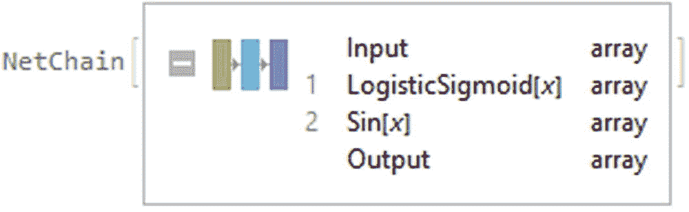

图 9-26

包含两个元素层的网络链

```py
In[52]:= NetChain[{ElementwiseLayer[LogisticSigmoid@#&],ElementwiseLayer[Sin@#&]}]
Out[52]=

```

返回的对象是一个网络链，出现三个彩色矩形的图标。这意味着创建(网络链)或引用的对象是一个网络链，并且包含层。如果检查链，它将显示输入、第一层(LogisticSigmoid)、第二层(Sin)和输出层。这些操作是按外观顺序进行的，所以先应用第一层，然后应用第二层。NetChain 支持其他层的输入和输出选项，例如单个实数(real)、整数(integer)、“n”长度向量和多维数组。

```py
In[53]:= NetInitialize@NetChain[{3,4,12,Tanh},"Input"→1]
Out[53]=

```

NetChain 识别 Wolfram 语言函数名，并将它们与相应的层相关联，如 3、4 和 12 层。它们代表输出大小为 3、4 和 12 的线性层(图 [9-27](#Fig27) )。函数 Tanh 表示元素层。

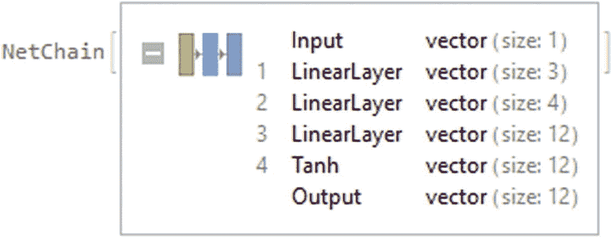

图 9-27

多层网络链

让我们将一个层添加到用 NetAppend(图 [9-28](#Fig28) )或 NetPrepend 创建的链中。如果你注意到，Wolfram 语言的许多原始命令都有相同的含义，例如，在一个链中删除应该是 NetDelete[net_name，#_of_layer]。

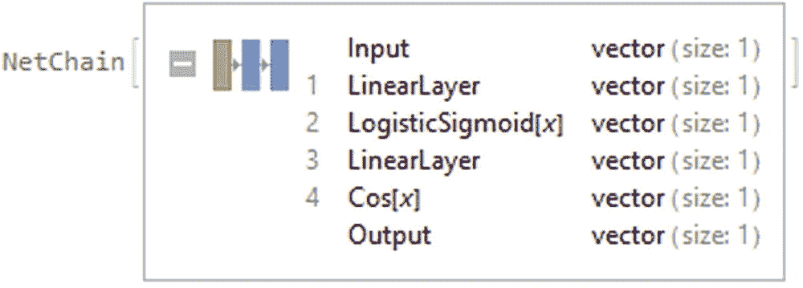

图 9-28

添加了层的网络链对象

```py
In[54]:= NetInitialize@NetChain[{1,ElementwiseLayer[LogisticSigmoid@#&]},"Input"→ 1];
NetCH2=NetInitialize@NetAppend[%,{1,ElementwiseLayer[Cos[#]&]}]
Out[54]=

```

将网络应用于数据时，有不同的选项可用，如网络评估模式(评估模式为训练或测试)、目标设备和工作精度(数值精度)。

```py
In[55]:= NetCH2[{{0},{2},{44}},NetEvaluationMode→ "Train",TargetDevice→"CPU",WorkingPrecision→ "Real64",RandomSeeding→ 8888](*use N@Cos[Sin[LogisticSigmoid[{0,2,44}]]] to check results*)
Out[55]= {{0.919044},{0.991062},{1.}}

```

另一种形式是输入链中各层的明确名称。这被归类为一个关联(图 [9-29](#Fig29) )。

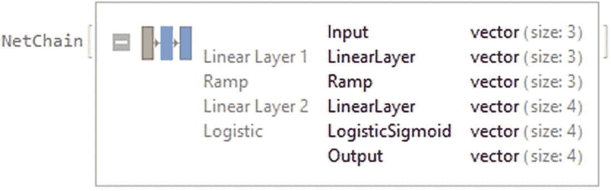

图 9-29

具有定制层名称的网络链对象

```py
In[56]:=NetInitialize@NetChain[<|"Linear Layer 1"→LinearLayer[3], "Ramp"→ Ramp,"Linear Layer 2"→LinearLayer[4],"Logistic"→ ElementwiseLayer[LogisticSigmoid]|>,"Input"→ 3]
Out[56]=

```

单击图层名称或图层后，应会显示检查图层内容。

如果要提取一个图层，则使用 NetExtract 和相应图层的名称。输出被抑制，但是如果分号被删除，层应该弹出。

```py
In[57]:=NetExtract[%,"Logistic"];

```

要在一行代码中提取所有层，Normal 将完成这项工作(图 [9-30](#Fig30) )。

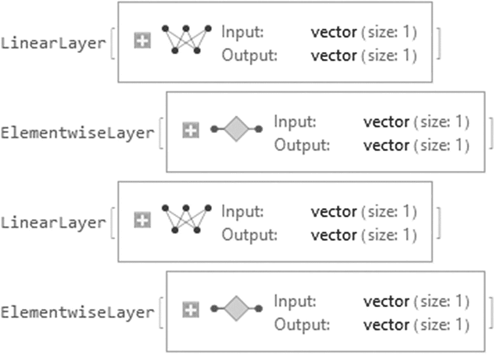

图 9-30

网络链的层次 NetCH2

```py
In[58]:= Normal[NetCH2]//Column
Out[58]=

```

### 多重链

链条可以连接在一起，就像嵌套链条一样(图 [9-31](#Fig31) )。

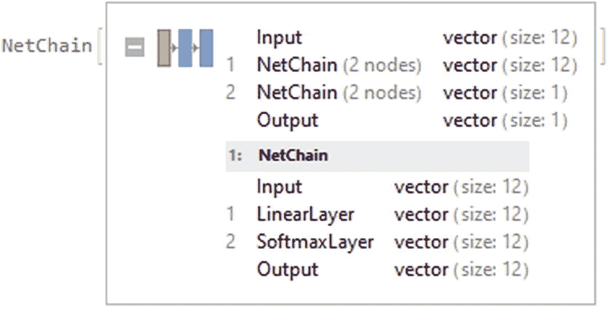

图 9-31

链 1 从两个可用的链中选择

```py
In[59]:=
chain1=NetChain[{12,SoftmaxLayer[]}];
chain2=NetChain[{1,ElementwiseLayer[Cos[#]&]}];
NestedChain=NetInitialize@NetChain[{chain1,chain2},"Input"→ 12]
Out[59]=

```

这个链分为两个网链，每个链代表一个链。在这种情况下，我们看到链 1 和链 2，每个链显示其相应的节点。要展平链条，使用 NetFlatten(图 [9-32](#Fig32) )。

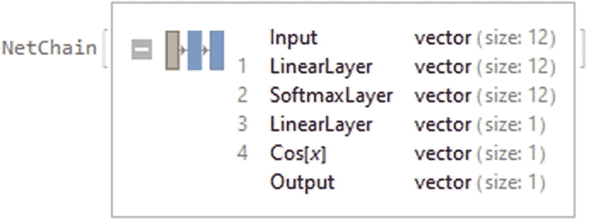

图 9-32

扁平链

```py
In[60]:= NetFlatten[NestedChain]
Out[60]=

```

### 网络图

命令 NetChain 仅连接其中一个层的输出连接到下一个层的输入的层。NetChain 无法将输入或输出连接到其他层；它只适用于一层。要解决这个问题，需要使用 NetGraph。除了允许更多的输入和层数，NetGraph 还用图形表示神经网络的结构和过程(图 [9-33](#Fig33) )。

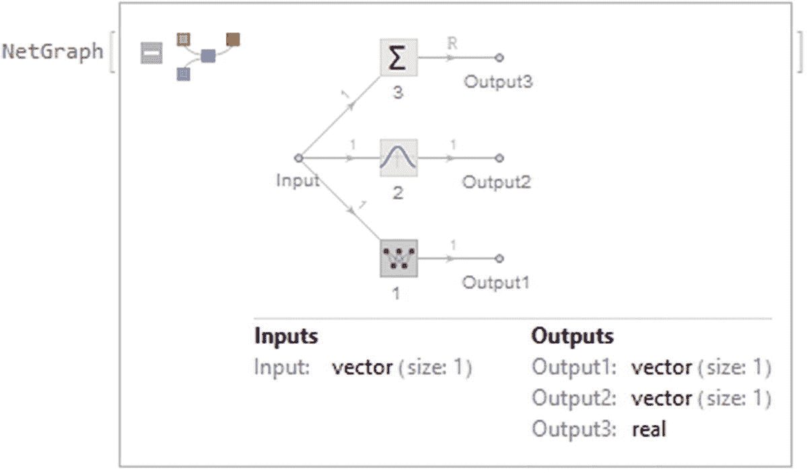

图 9-33

扩展网络图

```py
In[62]:= NetInitialize@NetGraph[{ LinearLayer["Output"→ 1,"Input"→ 1],Cos,SummationLayer[]},{}]
Out[61]=

```

制作的对象是一个网络图，它由连接正方形的图形表示。如图 [9-33](#Fig33) 所示。输入到三个不同的层，每一层都有输出。NetGraph 接受两个参数:第一个参数用于层或链，第二个参数用于定义网络的顶点或连通性。例如，在后面的代码中，网络有三个输出，因为没有指定顶点。SummationLayer 是对所有输入数据求和的层。

```py
In[62]:= Net1=NetInitialize@NetGraph[{ LinearLayer["Output"→ 2,"Input"→ 1],Cos,SummationLayer[]},{1→ 2→ 3}]
Out[62]=

```

顶点符号意味着一个层的输出给了另一个层，以此类推。换句话说，1 → 2 → 3 意味着线性层的输出传递到下一层，直到最后在最后一层用 SummationLayer 求和(图 [9-34](#Fig34) )。因此保留了层的外观顺序，但是我们可以改变每个顶点的顺序。

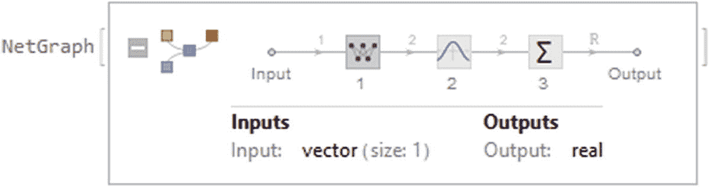

图 9-34

单向网络图

可以修改网络，以便输出可以到达网络的其他层，例如 1 到 3，然后到 2(图 [9-35](#Fig35) )。使用 NetGraph，层和链可以作为列表或关联输入。顶点以规则列表的形式键入。

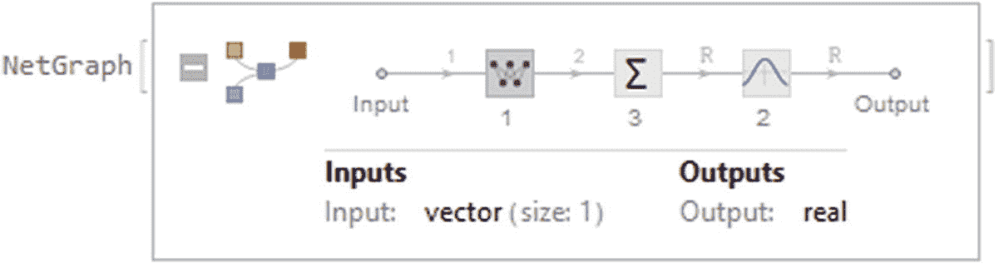

图 9-35

网络图结构

```py
In[63]:= Net2=NetInitialize@NetGraph[{ LinearLayer["Output"→ 2,"Input"→ 1],Cos,SummationLayer[]},{1→ 3→2}]
Out[63]=

```

每层的输入和输出都由工具提示标记，当光标经过图形线或顶点时会出现该工具提示。在没有指定输入和输出的意义上，NetGraph 将推断输入和输出端口中的数据类型；ElementwiseLayer 的输入和输出中的大写 R 就是这种情况，它代表 real。

使用 NetGraph，层可以作为列表或关联输入。连接以规则列表的形式输入(图 [9-36](#Fig36) )。

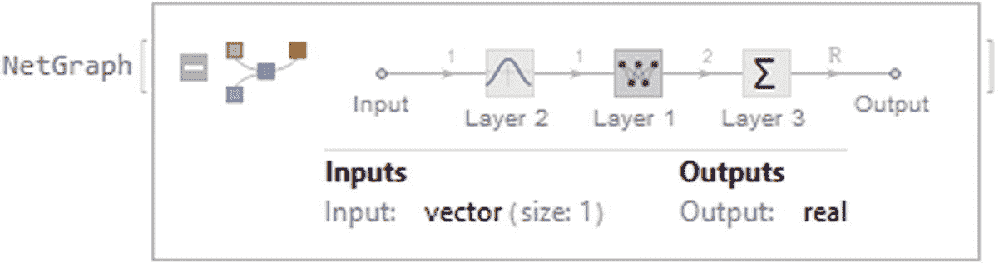

图 9-36

带命名层的网络图

```py
In[64]:= NetInitialize@NetGraph[<|"Layer 1"→ LinearLayer[2,"Input"→ 1],"Layer 2"→ Cos,"Layer 3"→ SummationLayer[]|>,{"Layer 2"→ "Layer 1"→ "Layer 3"}]
Out[64]=

```

现在，可以通过 NetPort 命令指定一个结构可以有多少输入和输出(图 [9-37](#Fig37) )。

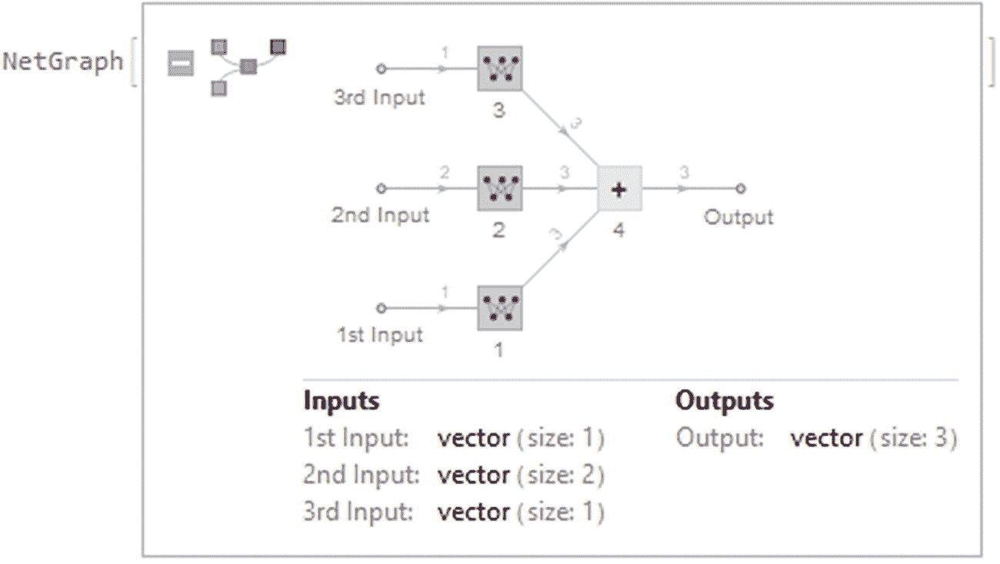

图 9-37

多输入网络图

```py
In[65]:= NetInitialize@NetGraph[{ LinearLayer[3,"Input"→ 1], LinearLayer[3,"Input"→ 2], LinearLayer[3,"Input"→ 1],TotalLayer[]},{NetPort["1st Input"]→ 1, NetPort["2nd Input"]→ 2,NetPort["3rd Input"]→ 3,{1,2,3}→ 4}](*Or NetInitialize@NetGraph[<|"L1"→ LinearLayer[3,"Input"→,"L2"→ LinearLayer[3,"Input"→1], "L3"\[Rule] LinearLayer[3,"Input"→ 1],"Tot L"→TotalLayer[]|>,{NetPort["1st Input"] → "L1", NetPort["2nd Input"] → "L2",NetPort["3rd Input"] → "L3",{"L1","L2","L3"} → "Tot L"}]*)
Ouy[65]=

```

如果我们有一个以上的输入，每个输入被输入到指定的端口。

```py
In[66]:= %[<|"1st Input"-> 32.32,"2nd Input"-> {2,\[Pi]},"3rd Input"-> 1|>]
Out[66]= {-41.7285,-11.2929,19.0044}

```

有多个输出时，显示每个不同输出的结果(图 [9-38](#Fig38) )。

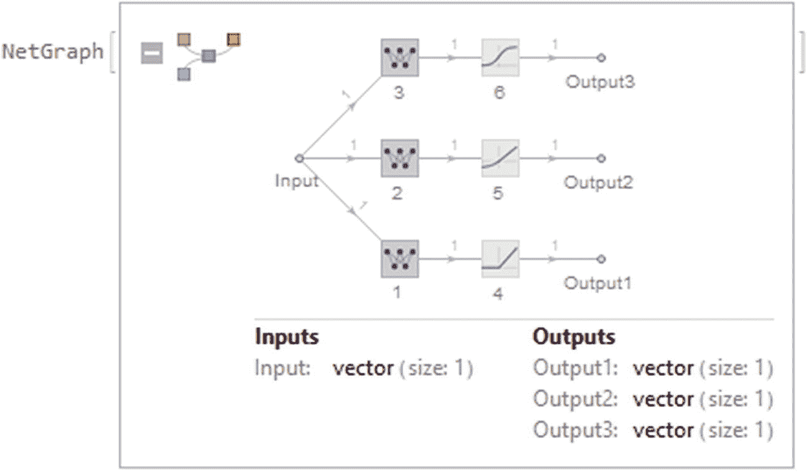

图 9-38

三输出网络图

```py
In[67]:= NetInitialize[NetGraph[{LinearLayer[1,"Input"→ 1],LinearLayer[1,"Input"→ 1],LinearLayer[1,"Input"→ 1],Ramp,ElementwiseLayer["ExponentialLinearUnit"],LogisticSigmoid},{1→4→ NetPort["Output1"],2→5→ NetPort["Output2"],3→ 6→ NetPort["Output3"]}],RandomSeeding→8888]
Out[67]=

```

```py
Out[68]= <|Output1→{0.},Output2→{2.17633},Output3→{0.372197}|>

```

网链容器可以用 NetGraph 作为层来处理(图 [9-39](#Fig39) )。有些层(如 CatenateLayer)接受零参数。

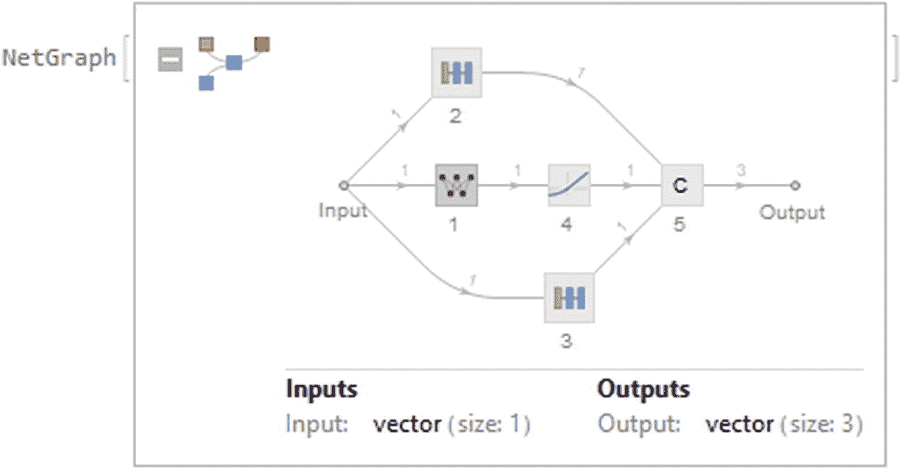

图 9-39

多容器网络图

```py
In[69]= NetInitialize@NetGraph[{
LinearLayer[1,"Input"→ 1],
NetChain[{LinearLayer[1,"Input"→ 1],ElementwiseLayer[LogisticSigmoid[#]&]}],
NetChain[{LinearLayer[1,"Input"→ 1],Ramp}],
ElementwiseLayer["ExponentialLinearUnit"],
CatenateLayer[]
},{1→4,2→5,3→ 5,4→ 5}]
Ou[69]=

```

单击链或层将显示相关信息，单击链内的层将显示所选链上包含的层的信息。

### 组合容器

使用网络图，网络链和网络图可以嵌套形成不同的结构，如下例所示(图 [9-40](#Fig40) )，其中网络链后面可以跟一个网络图，反之亦然。


图 9-40

嵌套网络图

```py
In[70]N1=NetGraph[{1,Ramp,2,LogisticSigmoid},{1→ 2,2→ 3,3→ 4}];
N2=NetChain[{3,SummationLayer[]}];
NetInitialize@NetGraph[{N2,N1},{2→ 1},"Input"→ 22]
Ouy[70]=

```

从图 [9-40](#Fig40) 中的图表可以清楚地看出，如果网络图连接到网络链，则输入连接到网络图，输出连接到网络链。尚未初始化的网络链或网络图将以红色显示。容器(NetChain，NetGraph)的一个基本特性是它们可以表现为一个层。考虑到这一点，我们可以创建仅包含网链、网图或两者的嵌套容器。

作为一个示范，可以使用网络图创建更复杂的结构，如图 [9-41](#Fig41) 所示。一旦创建了网络结构，就可以提取每一层或每一链的属性。例如，使用“SummaryGraphic”，您可以获得网络图的图形。

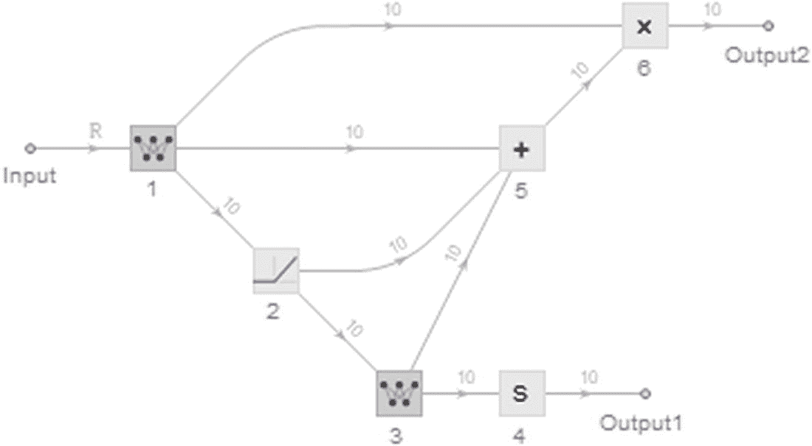

图 9-41

复合网状结构

```py
In[71]:=Net=NetInitialize@NetGraph[{LinearLayer[10],Ramp,10,SoftmaxLayer[],TotalLayer[],ThreadingLayer[Times]},{1→2→3→4,{1,2,3}→5,{1,5}→6},"Input"→"Real"];
Information[Net,"SummaryGraphic"]
Out[71]=

```

### 网络属性

与网络的数字数组相关的属性是 arrays(给出网络中的每个数组)、ArraysCount(网络中数组的数量)、ArraysDimensions(网络中每个数组的维数)和 ArraysPositionList(网络中每个数组的位置)。这如图 [9-42](#Fig42) 所示。

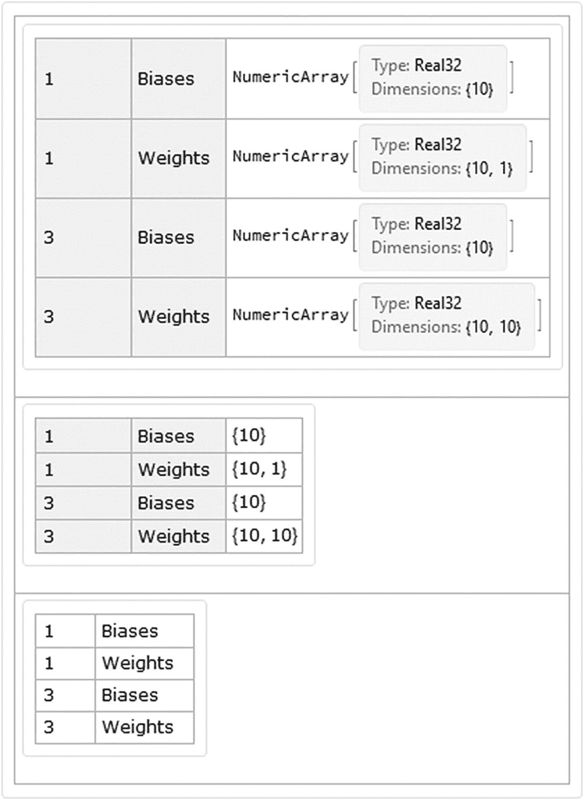

图 9-42

包含各种属性的数据集

```py
In[72]:= {Dataset@Information[Net,"Arrays"],Dataset@Information[Net,"ArraysDimensions"],Dataset@Information[Net,"ArraysPositionList"]}//Dataset
Out[72]=

```

与输入和输出端口中变量类型相关的信息与输入端口和输出端口一起显示。

```py
In[73]:= {Information[Net,"InputPorts"],Information[Net,"OutputPorts"]}
Out[73]= {<|Input→Real|>,<|Output1→10,Output2→10|>}

```

我们可以看到输入是一个实数，网络有两个大小为 10 的输出向量。与图层相关的最常用属性是 layers(返回网络的每个图层)、LayerTypeCounts(网络中图层的出现次数)、LayersCount(网络中图层的数量)、LayersList(网络中所有图层的列表)和 LayerTypeCounts(网络中图层的出现次数)。图 [9-43](#Fig43) 显示了图层和图层类型数。

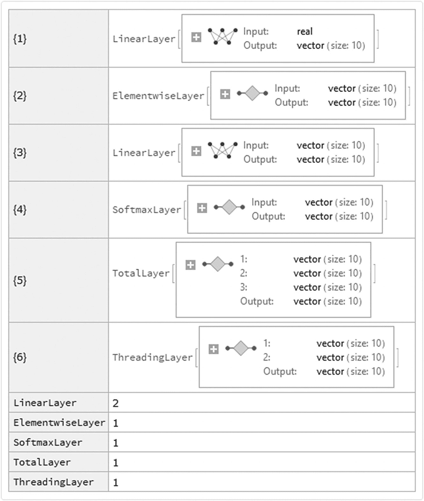

图 9-43

关于符号网中包含的图层的信息

```py
In[74]:= Dataset@{Information[Net,"Layers"],Information[Net,"LayerTypeCounts"]}
Out[74]=

```

网络结构的可视化(图 [9-44](#Fig44) )通过属性 LayerGraph(显示各层连接的图形)、SummaryGraphics(网络结构的图形)、MXNetNodeGraph (MXNeT 原始图形操作)和 MXNetNodeGraphPlot(MXNeT 操作的注释图形)实现。MXNet 是一个开源的深度学习框架，支持多种编程语言，其中一种就是 Wolfram 语言。此外，Wolfram 神经网络框架使用 MXNet 结构作为后端支持。

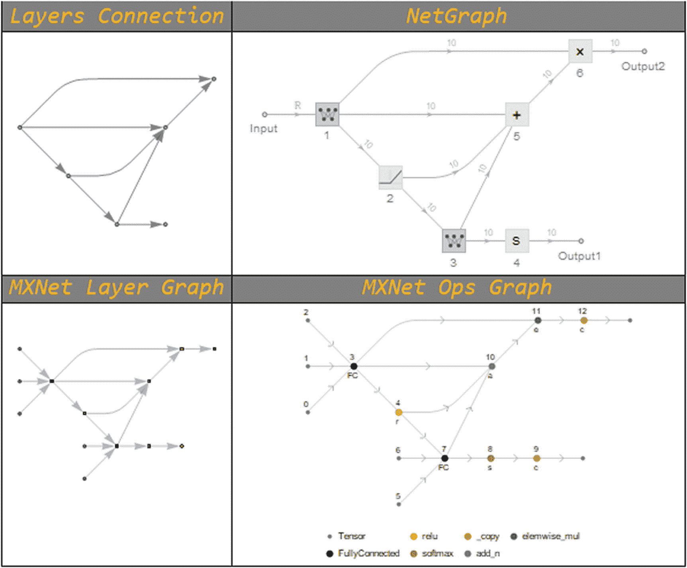

图 9-44

显示多个图形的网格

```py
In[75]:= Grid[{{Style["Layers Connection",Italic,20,ColorData[105,4]],Style["NetGraph",Italic,20,ColorData[105,4]]},{Information[Net,"LayersGraph"],Information[Net,"SummaryGraphic"]},
{Style["MXNet Layer Graph",Italic,20,ColorData[105,4]],Style["MXNet Ops Graph",Italic,20,ColorData[105,4]]},
{Information[Net,"MXNetNodeGraph"],Information[Net,"MXNetNodeGraphPlot"]}},Dividers→All,Background→{{{None,None}},{{Opacity[1,Gray],None}}}]
Normal@Keys@%
Out[75]=

```

将光标指针放在 MXNet 符号图中的图层或节点上，会显示一个工具提示，显示 MXNet 符号的属性，如 ID、名称、参数、属性和输入。

### 导出和导入模型

由于 Wolfram 语言和 MXNet 的互操作性，Wolfram 语言支持初始化或未初始化的神经网络的导入和导出。为此，我们在桌面上创建一个名为 MXNet 网络的文件夹。我们将导出在 Net 变量中找到的网络。

```py
In[76]:= FileDirectory="C:\\Users\\My-pc\\Desktop\\MXNet Nets\\";
Export[FileNameJoin[{FileDirectory,"MxNet.json"}],Net,"MXNet","ArrayPath"→ Automatic,"SaveArrays"→ True]
Out[76]= C:\Users\My-pc\Desktop\MXNet Nets\MxNet.json

```

将网络导出为 MXNet 格式会生成两个文件:一个存储神经网络拓扑的 JSON 文件和一个类型的文件。params 包含导出架构所需的参数(网络中使用的数字数组)数据，一旦架构初始化。当 ArrayPath 设置为 Automatic 时，params 文件保存在网络的同一文件夹中，否则它可以有不同的路径。SaveArrays 用于指示数字数组是导出(True)还是不导出(False)。让我们检查在 MXNets Nets 文件夹中创建的两个文件。

```py
In[77]:= FileNames[All,File@FileDirectory]
Out[77]=
{C:\Users\My-pc\Desktop\MXNet Nets\MxNet.json,
C:\Users\My-pc\Desktop\MXNet Nets\MxNet.params}

```

要导入 MXNet 网络，需要 JSON 文件和。建议将 params 放在同一个文件夹中，因为 Wolfram 语言会假设某个 JSON 文件将与。参数文件。导入网络有多种方式，包括 Import[file_name.json，" MXNet"]和 Import[file_name.json，{"MXNet "，element}](与同。参数文件)。

```py
In[78]:= Import[FileNameJoin[{FileDirectory,"MxNet.json"}],{"MXNet","Net"},"ArrayPath"→ Automatic];

```

后一个网络是用。params 文件自动。要导入不带参数的网络，请使用设置为 None 的 ArrayPath。可以使用以下选项导入网络参数:列表(ArrayList)、名称(ArrayNames)或关联(ArrayAssociation)。如图 [9-45](#Fig45) 所示。

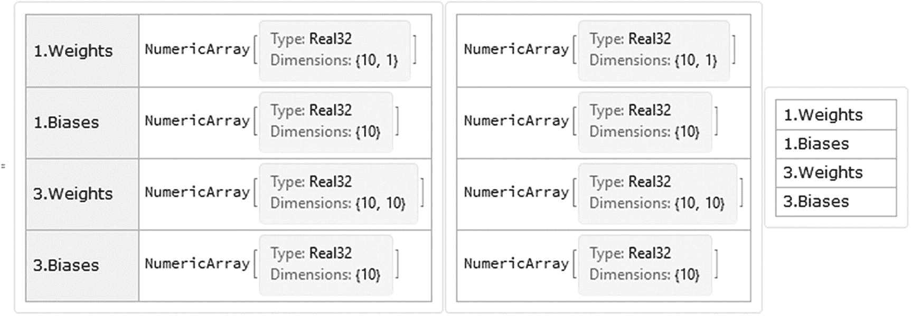

图 9-45

MXNet 格式的不同导入选项

```py
In[79]:=Row[Dataset[Import[FileNameJoin[{FileDirectory,"MxNet.json"}],{"MXNet",#}]]&/@{"ArrayAssociation","ArrayList","ArrayNames"}]
Out[79]=

```

要导入的网络元素有 InputNames、LayerAssociation、net(将网络作为网络图或网络链导入)、node dataset(MXNet 的节点数据集)、NodeGraphPlot 的节点图)、NodeGraphPlot(MXNet 的节点图)和 UninitializedNet(与 ArrayPath → None 相同)。下一个数据集显示了图 [9-46](#Fig46) 之前列出的几个选项。

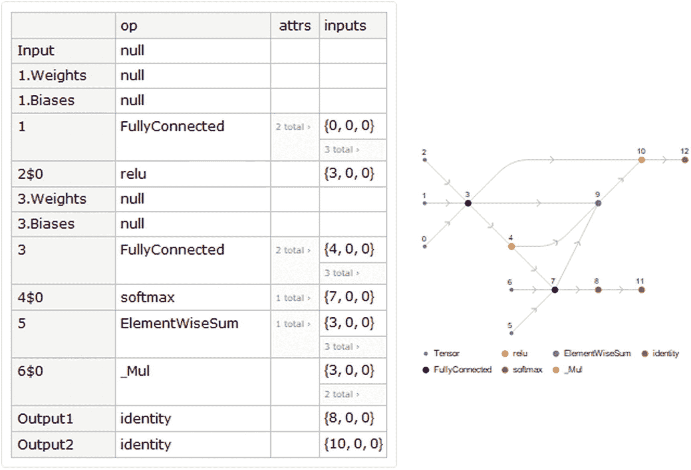

图 9-46

节点数据集和 MXNet 操作图

```py
In[80]= {Import[FileNameJoin[{FileDirectory,"MxNet.json"}],{"MXNet","NodeDataset"}],Import[FileNameJoin[{FileDirectory,"MxNet.json"}],{"MXNet","NodeGraphPlot"}]}//Row
Out[80]=

```

Wolfram 语言和 MXNet 之间的一些操作是不可逆的。如果您注意的话，导出到 MXNet 格式的网络输入被设置为一个实数，不像 MXNet 格式导入的网络输入，它标志着输入是一个没有指定维数的数组。

当构建神经网络时，对于一个网络可以有多少个网络链或网络图没有限制。例如，下一个例子是来自 Wolfram 神经网络库的神经网络，它具有更深层次的构造感(图 [9-47](#Fig47) )。这个网叫做 CapsNet，用来估计一个图像的深度图。要查阅该网络，请在文件网页上输入 net model[" CapsNet Trained on MNIST 数据"，" documentation link "]；对于 Wolfram Cloud 上的笔记本，输入 net model[" CapsNet Trained on MNIST 数据"，" ExampleNotebookObject"]或只输入桌面版本的 ExampleNotebook。

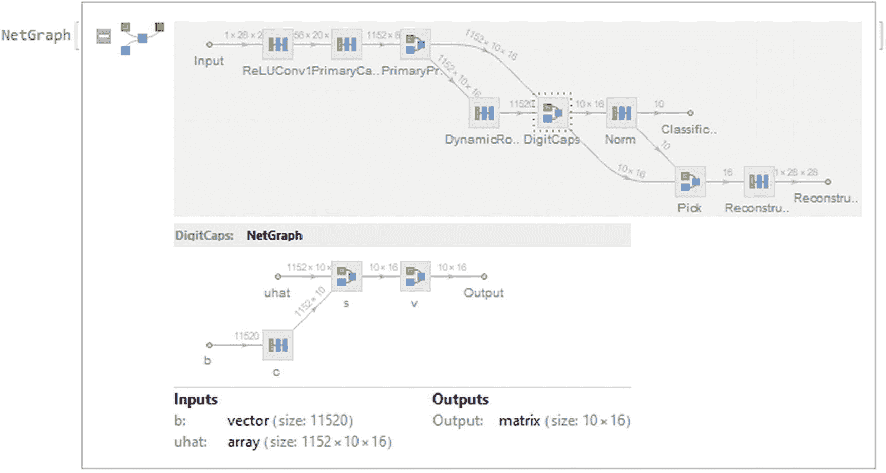

图 9-47

castnet 神经网络模型

```py
In[81]:= NetModel["CapsNet Trained on MNIST Data"]
Out[81]=

```