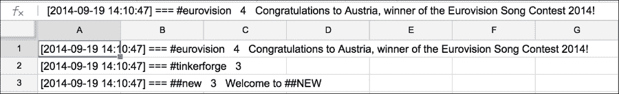
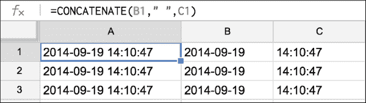
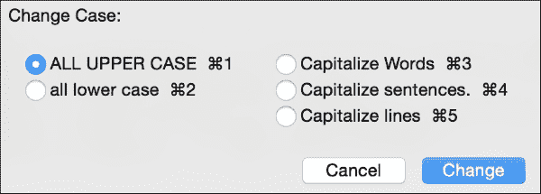
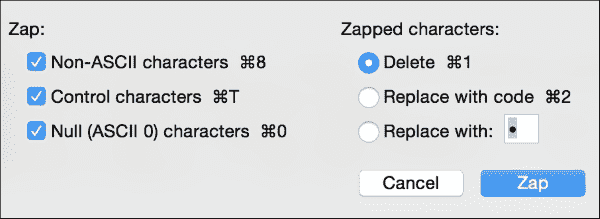
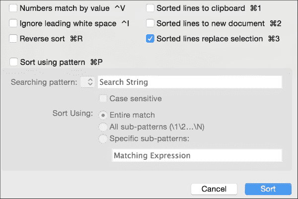
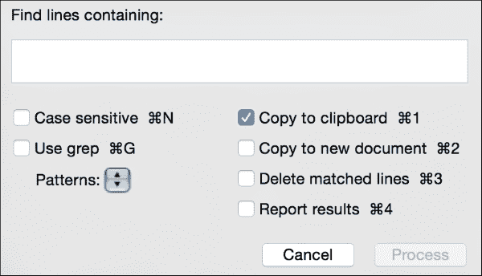
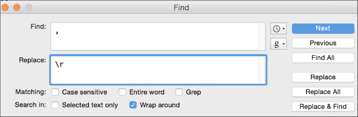

# 三、整洁数据的主力——电子表格和文本编辑器

当设计一个家庭厨房时，典型的布局调用了经典的工作三角形，其点是冰箱、水槽和炉子。在我们整洁的数据厨房里，我们也有一些不可或缺的设备。其中两个是不起眼的 **电子表格**和**文本编辑器**。虽然这些朴实无华的工具经常被忽视，但充分了解它们的功能可以使许多清洁任务变得更快更容易。在[第 2 章](ch02.html "Chapter 2. Fundamentals – Formats, Types, and Encodings")、*基础——格式、类型和编码*中，我们在学习数据类型和文件类型的背景下简要介绍了这两个工具，但在本章中，我们准备更深入地研究:

*   Excel 和 Google 电子表格中的有用函数，可以帮助我们操作数据，包括将文本转换为列、拆分和连接字符串、搜索和格式化以找到异常值、排序、将电子表格数据导入 MySQL，甚至使用电子表格生成 SQL
*   文本编辑器的典型功能，可以自动提取数据并将其转换为更有用的格式，包括搜索和替换正则表达式、改变行首和行尾以及基于列的编辑
*   在一个小项目中，我们使用这两种工具的功能来清理一些真实世界的数据

# 电子表格数据清理

用于数据清理的电子表格的实用性来自两件事:它将数据组织成列和行的能力以及它的一套内置函数。在本节中，我们将学习如何最大限度地使用电子表格来获取整洁的数据。

## 文本到 Excel 中的列

由于电子表格被设计成以列和行的形式保存数据，我们可能需要做的第一个清理工作就是相应地安排我们的数据。例如，如果你将大量数据粘贴到 Excel 或 Google 电子表格中，该软件将首先尝试寻找一个分隔符(如逗号或制表符),并以这种方式将数据分成列。(参见[第 2 章](ch02.html "Chapter 2. Fundamentals – Formats, Types, and Encodings")、*基础——格式、类型和编码*，查看分隔数据。)有时，电子表格软件会找不到分隔符，所以我们必须为它提供更多关于如何将数据分成列的指导。请考虑 Freenode 上数千个互联网中继聊天频道主题列表中的以下文本片段:

```sql
[2014-09-19 14:10:47] === #eurovision   4   Congratulations to Austria, winner of the Eurovision Song Contest 2014!
[2014-09-19 14:10:47] === #tinkerforge   3
[2014-09-19 14:10:47] === ##new   3   Welcome to ##NEW
```

### 注意

要在 IRC 聊天服务器中生成频道及其主题的列表，使用`alis`命令，根据服务器的设置，该命令可以作为`/query`或`/msg`的一部分发送。在 Freenode 上，`/msg alis *`命令将生成一个频道列表。更多关于 IRC 聊天的信息可以在这里找到:[https://freenode.net/services.shtml](https://freenode.net/services.shtml)

我们可以用肉眼看到，第一个数据块是一个时间戳，随后是`===`、`#`和一个频道名称、一个数字(列表构建时频道上的用户数)以及一个频道描述。然而，如果我们将这些行粘贴到 Excel 或 Google 电子表格中，它无法自动对应该是什么列做出相同的观察。电子表格可以正确地检测到行，但是对于自动检测的列来说，定界太不一致了。下图给出了数据粘贴到 Google 电子表格时的样子。通过突出显示单元格 A1，我们可以看到整行都显示在编辑栏中，表明整行都已粘贴到单元格 A1:



我们如何在电子表格中轻松地从这些数据中创建列？我们希望每个单独的数据项都在自己的列中。通过这样做，我们将能够，例如，获取频道上用户数量的平均值，或者按照频道名称对数据进行排序。现在，我们不能简单地对这些数据进行排序或使用公式，因为它们都在一个巨大的文本字符串中。

一个策略是使用 Excel 的文本到列向导将数据分成可识别的块；然后，我们可以重新组合它们，如果需要的话，去掉多余的字符。这显示在下面提到的步骤中:

1.  Highlight column `A`, and launch the text-to-columns wizard (located in the Data menu). In step 1, choose a fixed width, and in step 2, double-click on all the lines that have been drawn to delimit the description field. The following figure shows you how the data should look after delimiting the first few columns and removing all the extra lines:

    Excel 中的等宽拆分。

    结果数据如下图所示。前三列是好的，但是固定宽度的分隔符无法分隔 d 列中的用户计数和频道名称，这是因为频道名称的长度不像前面的列那样可预测。

    

    这是第一轮文本到列拆分后的结果。

2.  We will have to run text-to-columns again but just on column D this time, and we will use delimited instead of fixed-width procedure. First, note that there are two spaces between the channel name **#eurovision** and the number of users (**4**) and two spaces again between **4** and the channel description. Even though text-to-columns does not allow us to type two spaces as a delimiter (it allows single characters only), we can use the **Find-Replace** dialogue to replace all cases of two spaces with a symbol that is not used anywhere else in our text. (Perform a **Find** operation first to make sure.) I chose a `^` symbol.

    这个特殊的步骤似乎有点草率，所以如果你对另一种方法感兴趣，我一点也不怪你。在查找和替换不良文本的能力方面，Excel 比其他工具更受限制。我们将在本章后面的*文本编辑器数据清理*部分学习如何使用正则表达式。

    

    添加一个不常见的定界字符允许我们分开剩余的列。

3.  Now, use **Find-Replace** to remove the `[` and `]` characters from columns A and B, replacing them with nothing. (Highlight these columns before starting find-replace so that you do not accidentally remove symbols throughout the whole sheet.)

    不幸的是，Excel 在试图帮助我们的永恒追求中，将这些日期转换成了我们可能不喜欢的格式:9/19/2014。如果您想让它们恢复到原来的样子(2014-09-19)，请选择整列并使用自定义格式对话框将日期格式指定为 yyyy-mm-dd。

4.  The strings in column **F** still have extra space at the beginning. We can strip the extra spaces from the front of each string value using the `trim()` function. Insert a new column to the left of **F**, and apply the `trim()` function, shown as follows:

    这是应用`trim()`函数去除前导或尾随空格的结果。

5.  我们也可以将`clean()`函数应用到修剪后的文本。这将删除前 32 个 ASCII 字符中的任何一个:所有可能以某种方式进入这些通道描述的非打印控制字符。你可以像这样在`trim()`函数外应用`clean()`:`clean(trim(g1))`。
6.  向下拖动 F1 框的一角，将`clean(trim())`应用于列 **F** 中的其余单元格。
7.  选择 **F** 列，复制它，使用**只粘贴 **F** 列中的**特殊值，这样我们就可以删除 **G** 列。
8.  删除列 **G** 。瞧，现在你已经完美地清理了数据。

## 拆分字符串

一个轻量级的版本的 text to columns 特性是`split()`函数，它在 Google 电子表格中可用，但在 Excel 中不可用。这个函数只接受一个字符串值，并把它分成几个组成部分。请注意，您需要为新拆分的数据提供足够多的新列。在下面的示例中，我们使用了与上一个示例相同的数据，但是创建了三个新列来保存来自 **D** 的拆分值。


## 连接字符串

`concatenate()`函数接受许多字符串，或者作为单元格引用，或者作为引用的字符串，并将它们一起附加到一个新的单元格中。在下面的例子中，我们使用`concatenate()`函数将日期和时间字符串连接成一个字符串。该功能在 Excel 和 Google 电子表格中都有，如下图所示:



### 查找异常值的条件格式

Excel 和谷歌电子表格都有条件格式 T2 的特性。条件格式使用一组规则根据是否满足某些条件(条件)来更改一个或多个单元格的外观(格式)。我们可以用它来查找过高、过低、缺失或其他奇怪的数据。一旦我们确定了它，我们就可以清理它。

这里的是一个如何在 Google 电子表格中使用条件格式的示例，用于在我们的示例数据中查找频道名称中不包含`#`并且聊天参与者数量为空值的行:


下面是更改背景单元格颜色后的结果，以定位不是以`#`开头的 **D** 中的单元格和空的 **E** 中的单元格。现在，通过目视检查可以很容易地找到这些问题值。


### 排序以查找异常值

如果视觉检查的数据太多，那么我们可以尝试使用排序来找到有问题的数据。在谷歌电子表格或 Excel 中，选择你想要排序的列，可以是整张表，使用**数据**菜单中的**排序**选项。这对于大多数列来说相当容易，尤其是如果您正在寻找像单元格 D4 这样的数据。

但是，如果您尝试按列 **E** 进行排序以找到丢失的值，会发生什么呢？也许我们想把所有丢失的数据放在一起，这样我们就可以删除这些数据行。E4 的值为空。请记住[第 2 章](ch02.html "Chapter 2. Fundamentals – Formats, Types, and Encodings")、*基础——格式、类型和编码*中的内容，NULL(谷歌电子表格中的空值)不能与任何其他值进行比较，因此不管是将列 **E** 中的值从低到高还是从高到低进行排序，它都位于排序列表的底部。

### 将电子表格数据导入 MySQL

现在你有了一个充满整洁数据的可爱的电子表格，你可能希望将它长期存储在数据库中。

#### 从电子表格创建 CSV

许多数据库系统将通过围绕 CSV 文件构建的导入例程接受数据。如果你正在使用 MySQL，有一个`LOAD DATA IN FILE`命令可以将数据从一个带分隔符的文件中直接读入数据库，你甚至可以设置自己的分隔符。首先，我们来看一个命令的例子，然后我们可以根据我们想要的参数在 Excel 中创建文件。

从 MySQL 命令行，我们可以运行:

```sql
load data local infile 'myFile.csv' 
 into table freenode_topics
 fields terminated by ','
 (dateOfTopic, channel, numUsers, message);

```

当然，这是假设已经创建了一个表。在本例中，它被称为`freenode_topics`，它有四列，出现在这个 SQL 查询的最后一行。

因此，该查询中引用的 CSV 文件`myFile.csv`需要以逗号分隔的顺序排列各列。

在 Excel 中，通过导航到**文件** | **另存为**，然后从格式选项列表中选择 **CSV (MS-DOS)** ，可以从工作簿的当前工作表创建 CSV。在谷歌电子表格中，你可以通过导航到**文件** | **下载** | **CSV** 来完成同样的事情。在这两种情况下，将文件保存到您的本地系统，然后启动 MySQL 客户端，并通过前面显示的命令行继续操作。

### Tip

如果您不喜欢使用 MySQL 命令行客户端，也可以使用 MySQL 自己的 Workbench 图形客户端或使用 PhpMyAdmin 之类的工具将 CSV 文件上传到服务器。PhpMyAdmin 对上传文件的大小有限制(目前是 2 MB)。

#### 使用电子表格生成 SQL

另一种将数据放入数据库的方法乍一看似乎很奇怪，但是如果您无法通过前面讨论的 CSV 加载数据——不管是什么原因，可能是因为错误的权限或文件大小限制——它可以节省大量时间。在这种方法中，我们将在电子表格内部构建`INSERT`语句，然后在数据库中运行这些命令。

如果电子表格中的每一列都代表数据库中的一列，那么我们可以简单地在电子表格中的列周围添加 SQL `INSERT`命令的结构组件(带引号的字符串、括号、命令和行尾分号),并将结果连接成一个巨大的`INSERT`命令字符串。


在使用`concatenate(A1:I1)`函数附加了 A:I 列中的所有字符串之后，我们最终得到了如下的`INSERT`语句:

```sql
INSERT INTO freenode_topics (dateOfTopic, channel, num_users, message) VALUES('2014-09-19 14:10:47', '#eurovision',4, 'Congratulations to Austria, winner of the Eurovision Song Contest 2014!');

```

这些可以粘贴到用户友好的前端，如 PhpMyAdmin 或 MySQL Workbench。或者，您可以将它保存为文本文件(使用您的文本编辑器)，一个`INSERT`语句接一个语句。我把我的文件叫做`inserts.sql`。现在可以使用命令行和 MySQL 客户端将该文件导入到数据库中，如下所示:

```sql
$mysql -uusername -p -hhostname databasename < inserts.sql

```

或者，可以使用 MySQL 命令行客户端中的`source`命令导入它，如下所示:

```sql
$mysql -uusername -p -hhostname
[enter your password]
> use databasename;
> source inserts.sql

```

这两种方法都可以将数据导入 MySQL。如果脚本足够小，还可以使用一个图形客户端，比如 MySQL Workbench。但是，在将非常大的脚本加载到图形客户端时要小心，因为客户端机器上的内存量可能不足以加载数百 GB 的 SQL。我更喜欢第二种方法(`source`)，因为它在每次成功插入后打印出一条成功消息，所以我知道我的命令是好的。

如果您不太清楚如何创建一个名为`inserts.sql`的文本文件，那么下一节就是为您准备的。关于文本编辑器，我们将涵盖比你想象的更多的内容。


# 文本编辑数据清理

我们在[第 2 章](ch02.html "Chapter 2. Fundamentals – Formats, Types, and Encodings")、*基础——格式、类型和编码*中了解到，文本编辑器是阅读和创建文本文件的首选方式。这听起来很合理，非常有意义。我们当时没有真正解释的是，文本编辑器有时也被称为程序员的编辑器，因为它有许多很酷的功能，可以帮助那些整天必须处理文本文件的程序员和数据清洁工。我们现在将浏览一些最有用的功能。

### Tip

每种操作系统都有几十种文本编辑器。有些是要花钱的，但很多是免费的。对于这一章，我将使用 Text Wrangler，这是一个适用于 OSX 的免费编辑器(这里有:[http://www.barebones.com/products/textwrangler](http://www.barebones.com/products/textwrangler))。本章中显示的功能在大多数其他编辑器中都可以广泛使用，例如 Sublime Editor，但是如果某个特定功能或工具的位置不明显，您应该查看所选编辑器的文档。

## 文本调整

我们选择的文本编辑器内置了许多用于文本操作的有用函数。这里列出的是一些最常用的数据清理任务。请记住，在清理一个文本文件的过程中，你可能会运行几十个清理例程，所以我们在[第一章](ch01.html "Chapter 1. Why Do You Need Clean Data?")、*中给出的提示是，你为什么需要整洁的数据？*，对于如何清晰地传达你所做的改变，在这里真的会派上用场。

**改变大小写**是在数据清理中很常见的要求。很多时候，我们会继承全小写或全大写的数据。下图显示了 Text Wrangler 中对选定文本执行大小写更改的对话框。键盘快捷键显示在每个选项的右侧。



用于大小写改变的选项包括大写和小写作为，以及大写每个单词、行或句子中第一个单词的第一个字母。

添加或删除选择中每行的前缀或后缀是另一项常见任务。前几天在构建文本分类器时，我需要对大量的文本行进行这样的处理。我需要在每一行后面加上一个逗号和该行所代表的类的名称(正的或负的)。下面是文本牧马人里的前缀后缀对话。请注意如何在同一个操作中插入或移除，但不能同时插入和移除。如果您需要执行这两项任务，请执行其中一项，然后执行另一项。


**消灭小妖精**是你的文本编辑器的另一个出色的任务。TextWrangler 和 Sublime Editor for Windows 都有这个功能。在切换小精灵时，编辑器可以查找任何不在您想要的字符集之内的字符，例如，控制字符、空字符和非 ASCII 字符。它既可以删除它们，也可以用它们的字符代码替换它们。它也可以用你指定的任何字符替换小精灵。这使得他们以后更容易找到。



## 列模式

当文本编辑器处于**列模式**时，这意味着你可以选择列中的文本，而不仅仅是行中的文本。以下是正常(非列)模式下的选择示例:


以下是在列模式下选择的示例。按住**选项**键，选择分栏文本。一旦选择了文本，您可以像对待任何选定的文本一样对待它:您可以删除它、剪切它或将其复制到剪贴板上，或者使用我们在上一节中讨论的任何文本调整，只要它们对选择有效。


此功能的一些限制包括:

*   每个字符是一列，所以字符应该以非比例的打字机字体显示。
*   在 Text Wrangler 中，列模式仅在换行关闭时有效。关闭软换行意味着您的线条将向右延伸而不换行。
*   在 Text Wrangler 中，您正在绘制的列的垂直高度必须能够由您手动绘制，因此这是一种针对少量数据(数百或数千行，但可能不是数百*的*数千行)的技术。

## 重型查找和更换

编辑们确实擅长处理文本。在列模式下使用文本编辑器可能会感觉奇怪，因为这看起来更像是电子表格的自然任务。类似地，在您看到文本编辑器可以做什么之后，使用电子表格进行**查找-替换**可能会显得有些笨拙。

Text Wrangler 中 **Find** 对话框的主要部分如下所示。所提供的功能包括区分大小写的搜索、回绕、在部分文本中搜索以及在单词或单词的一部分中查找给定的文本模式。您还可以将特殊字符、空白(包括制表符和行终止符)、表情符号等粘贴到文本框中。在**查找**框右边的小下拉框提供了额外的功能。上面有时钟图标的那个包含了最近搜索和替换的列表。底部有字母 **g** 的那一个有可能有用的内置搜索模式列表，在这个菜单的底部有一个选项可以将你自己的模式添加到列表中。


最强大的查找-替换特性之一是通过 **Grep** 复选框实现的。选中此框允许我们使用正则表达式模式进行搜索。简而言之，**正则表达式** ( **regex** )是一种用特殊语言编写的模式，由符号组成，用于匹配一些字符串文本。对正则表达式的全面讨论超出了本书的范围，但可以说它们非常有用，当我们需要它们来清理数据时，我们会定期访问它们。

### Tip

Text Wrangler 界面中的复选框显示 Grep——而不是 RegEx 或 Match——是因为正则表达式模式匹配语言有一些细微的变化。Text Wrangler 向我们发出信号，它使用的是 Grep 程序，这是一个最初为 Unix 编写的程序，也是最常见的变体。

这里，我们将概述一些不可或缺的正则表达式符号，我们将反复使用它们来清理数据。对于更复杂的模式，值得参考一本专门的书或无数的网页，其中展示了各种奇异的正则表达式语法:

| 

标志

 | 

它的作用

 |
| --- | --- |
| `$` | 匹配行尾 |
| `^` | 匹配行首 |
| `+` | 匹配一个或多个指定的字符 |
| `*` | 匹配 0 个或更多指定字符 |
| `\w` | 匹配任何单词字符(0-9，A-z)。要匹配非单词字符，请使用`\W` |
| `\s` | 匹配任何空白字符(制表符、换行符或回车)。要匹配非空白字符，请使用`\S` |
| `\t` | 匹配一个制表符 |
| `\r` | 匹配一个回车符。使用`\n`换行。 |
| `\` | 这是转义字符。它匹配后面的精确字符，而不是正则表达式模式字符。 |

这里有几个查找-替换组合的例子，这样我们可以了解 Text Wrangler 如何处理正则表达式。确保选中 Grep 框。如果替换列中没有显示任何内容，这意味着替换字段应该留空。

| 

发现

 | 

替换

 | 

它的作用

 |
| --- | --- | --- |
| `\r` |   | 找到一个换行符(行结束符)并用 nothing 替换它。另一种说法是“将多行组合成一行”。 |
| `^\w+` | `-` | 匹配行首，后跟至少一个单词的字符。在行首添加一个`-`字符。 |
| `\\r$` | `\[end\]` | 查找所有以实际的`\r`字符结尾的行(反斜杠后跟 r)并用实际的字符`[end]`替换。请注意，[和]也是特殊的正则表达式字符，因此需要对它们进行转义，以便将它们用作实际字符。 |

如果正则表达式让人望而生畏，鼓起勇气。首先，回想一下本章前面的*文本调整*一节，大多数文本编辑器，包括 Text Wrangler，都有许多内置的搜索和替换功能，这些功能基于最常见的正则表达式。因此，您可能会发现您并不真的需要经常编写许多正则表达式。第二，由于正则表达式如此强大和有用，如果需要的话，你可以参考很多在线资源来学习如何构建一个复杂的正则表达式。

我最喜欢的两个 regex 资源是 Stack Overflow([http://stackoverflow.com](http://stackoverflow.com))和 regular-expressions . info([http://regular-expressions . info](http://regular-expressions.info))。也有许多正则表达式测试网站可以通过快速网络搜索获得。这些站点允许您在一个样本文本上编写和测试正则表达式。

### 一句提醒的话

然而，在使用在线正则表达式测试器时要小心，因为它们通常被设计成教授特定风格的正则表达式，比如 JavaScript、PHP 或 Python 中的正则表达式解析器。您想做的一些事情在您的文本编辑器中可能与在这些语言中有相同的正则表达式语法，也可能没有。根据您要做的事情的复杂性，创建文本数据的备份副本(或者将有问题的文本的一个小样本提取到一个新文件中)并在您自己的文本编辑器中使用它的正则表达式语法进行实验可能是一个更好的主意。

## 文本排序和处理重复项

一旦我们对正则表达式做了一点点实验，我们会注意到我们的文本编辑器偶尔会在其他菜单选项中提供这些模式匹配技术，例如，在排序和重复处理中。考虑下面的排序对话，看看如何应用正则表达式对多行进行排序:



在这种情况下，我们可以使用 **Sort using pattern** 复选框输入一个正则表达式模式进行排序。重复处理的对话也类似。你可以告诉编辑是保留原来的行还是删除它。有趣的是，如果您需要将副本用于其他用途，例如记录删除的行，您也可以将副本删除到另一个文件或剪贴板中。

### Tip

在数据清理中，至少考虑将删除的行保存到它们自己的文件中是一个好主意，以防您再次需要它们。


## 生产线包含

Text Wrangler 中的一个便利功能叫做包含的**流程线。它将搜索(包括使用正则表达式的可能性)与逐行处理混合在一起，比如将受影响的行移到另一个文件或剪贴板，或者删除匹配的行。**



# 一个示例项目

在这个示例项目中，我们将下载一个电子表格，使用 Excel 或文本编辑器清理它，然后对它进行一些简单的分析。

## 第一步——陈述问题

这个项目的灵感来自高等教育编年史的一些数据，这是一本关于学院和大学新闻和事件的出版物。2012 年，他们创建了一个互动功能，名为“你的大学认为它的同龄人是谁？”。在这个功能中，用户可以在表单中输入任何美国学院或大学的名称，并看到一个交互式可视化显示，哪些其他大学将该目标学校称为**同行**。(同行是在某些方面相似的大学。)原始数据来自美国政府的报告，但《编年史》将这一可视化背后的数据免费提供给任何人使用。

对于这个例子，我们感兴趣的是一个补充问题:当大学 X 出现在一个列表中时，还有哪些大学在这些列表中？要回答这个问题，我们需要找到与大学 X 一起列出的所有其他大学，然后我们必须计算它们的每个名称出现的次数。

## 第二步——数据收集

在这一步中，我们将看到收集数据然后逐步清理数据的过程。接下来的章节将讨论我们需要采取的行动，以便为我们的项目收集适当的数据。

### 下载数据

该项目的数据可以从位于[http://chronicle . com/article/Who-do-Your-College-Think/134222/](http://chronicle.com/article/Who-Does-Your-College-Think/134222/)的原始文章中下载，或者从位于[https://s3.amazonaws.com/03peers/selected_peers.csv.zip](https://s3.amazonaws.com/03peers/selected_peers.csv.zip)的电子表格的直接链接中下载

文件是压缩的，所以使用您选择的解压缩程序来解压缩文件。

### 熟悉数据

ZIP 文件夹中的文件有一个`.csv`扩展名，它确实是一个 CSV 格式的文件，有 1686 行，包括一个标题行。逗号分隔两列:第一列是有问题的大学的名称，第二列是最初的大学列为同行的所有大学的列表。这些对等体本身由竖线(`|`)字符分隔。下面是一个示例行:

```sql
Harvard University,Yale University|Princeton University|Stanford University
```

在这种情况下，第一列表示哈佛大学是目标大学，第二列显示耶鲁、普林斯顿和斯坦福已被哈佛列为其同行。

## 第三步——数据清理

因为这个例子的目标是查看一所特定的大学，并且它总是被列为其他大学的同行，我们的第一个目标是清除任何不包含目标大学的行。然后，我们将把这个文件转换成一个长长的单个大学列表。此时，我们的数据将是整洁的，我们将准备好进入分析和可视化步骤。

### 提取相关线条

让我们比较两种提取相关行的方法:一种使用电子表格，另一种使用文本编辑器，使用本章概述的技术。

#### 使用电子表格

在电子表格程序中打开文件，使用条件格式突出显示任何写有 **Harvard** (或你选择的目标大学)的行，并删除其余的行。

#### 使用文本编辑器

在文本编辑器中打开文件，使用包含的**处理行找到所有包含**哈佛大学**短语(或任何你选择的大学)的行，然后将它们复制到一个新文件中。**


无论选择哪一种，这个过程的结果都是一个包含 26 行的新文件，所有的行中都包含了哈佛大学。

### 变换线条

现在我们有一个 26 行的文件，每行有多所大学(宽数据)。我们预计，我们可能会在某个时候将文件读入 Python，以执行简单的大学频率统计。因此，我们决定将它改为长数据，每行一所大学。

为了转换文件以便每行有一所大学，我们将使用一个文本编辑器和三个查找和替换实例。首先我们会找到逗号，用`/r`(回车)代替。



接下来，找到管道字符(`|`)的实例，并用`\r`替换它。此时，文本文件有 749 行。

最后，我们需要删除哈佛大学的所有实例。(请记住，我们只对与哈佛一起被提及的同行感兴趣，所以我们不需要哈佛本身。)在 Text Wrangler 中，我们可以将**哈佛大学\r** 放在**查找**框中，并将**替换**框留空。这导致文件中删除了 26 行，总共 723 行。

## 第四步——数据分析

由于我们的主要焦点是数据清理，我们不会在分析或可视化上花费太多时间，但这里有一个快速的 Python 脚本来统计这些同行与哈佛一起在某所大学的名单上被提及的次数:

```sql
from collections import Counter
with open('universities.txt') as infile:
    counted = Counter(filter(None,[line.strip() for line in infile]))
    sorted = counted.most_common()
    for key,value in sorted:
      print key, ",", value
```

结果显示了 232 所独特的大学，以及该大学被提及的次数。这是最初的几个结果。我们可以将这些结果解释如下:

当提到哈佛时，耶鲁也被提到了 26 次:

```sql
Yale University , 26
Princeton University , 25
Cornell University , 24
Stanford University , 23
Columbia University in the City of New York , 22
Brown University , 21
University of Pennsylvania , 21

```

在这一点上，你可以把这个列表(或者更长列表的某个部分)放入一个条形图或者一个单词云或者任何你认为有说服力或者有趣的可视化形式。由于数据是以逗号分隔的，您甚至可以轻松地将其粘贴到电子表格程序中，以供进一步分析。但在这一点上，我们已经回答了我们最初的问题，即给定一所目标大学，哪些同龄人被提及最多。


# 总结

在这一章中，我们学习了一些非常实用的数据清理技巧，使用了两个容易使用的工具:文本编辑器和电子表格。我们概述了可用于拆分数据、移动数据、查找和替换部件、格式化数据，然后将数据重新组合在一起的电子表格功能。然后，我们学习了如何充分利用简单的文本编辑器，包括一些内置函数，以及如何最有效地使用查找和替换以及正则表达式。

在下一章中，我们将把迄今为止学到的各种技术放在一起，执行一些重要的文件转换。我们将使用的许多技术将基于我们在过去两章中学到的关于文本编辑、正则表达式、数据类型和文件格式的知识，所以准备好解决一些现实世界中的数据清理问题。