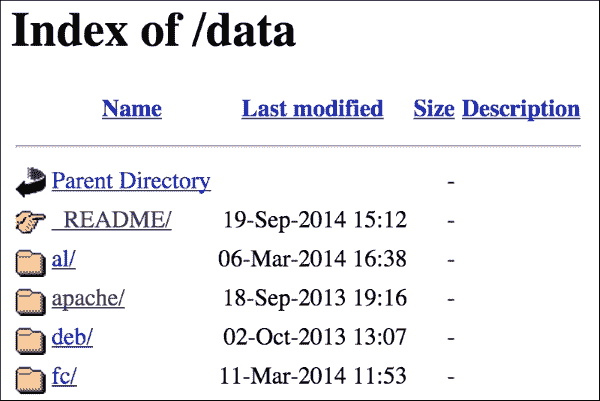

# 八、共享整洁数据的最佳实践

到目前为止，在本书中，我们已经学习了许多不同的方法来清理和组织我们的数据集。也许现在是时候考虑让其他人使用我们清理过的数据了。本章的目标是介绍一些邀请朋友到您的数据科学厨房的最佳实践。分享你的数据可能意味着把它提供给其他人、其他团队，甚至只是你自己的未来版本。将您的数据打包供他人使用的最佳方式是什么？您应该如何向人们介绍您所拥有的经过清理的数据？你怎么能保证你所有的努力都归功于你？

在本章中，我们将学习:

*   如何呈现和打包清理后的数据
*   如何为数据中包含的内容提供清晰的文档
*   如何通过许可您清理的数据来保护和扩展您的辛勤工作
*   如何查找和评估公布已清理数据的选项

在我们开始这一章之前，我们应该明确声明的一件事是，我们应该只清理和共享我们有权共享的数据。也许这似乎是显而易见的，但它值得重复。这一整章都假设您只是在清理并随后共享您实际上有权以这种方式使用的数据。如果您对此有疑问，请阅读本章的*为您的数据设置条款和许可*部分，并确保您遵循了您要求您的用户遵循的相同准则。

# 准备整洁的数据包

在本节中，我们将深入探讨在你发布一个面向大众的数据包之前需要回答的许多重要问题。

你希望人们如何访问你的数据？如果它在数据库中，您是否希望用户能够登录并在其上运行 SQL 命令？还是希望创建可下载的平面文本文件供他们使用？您需要为数据创建 API 吗？您到底有多少数据，您是否希望对数据的不同部分进行不同级别的访问？

如何分享你的整洁数据的技术方面非常重要。总的来说，从简单的事情开始，然后在需要的时候转向更复杂的分配计划，这可能是一个好主意。下面的是一些分发数据的选项，按照从最简单到最复杂的顺序排列。当然，越复杂带来的好处也越多:

*   **压缩纯文本**——这是一种非常低赌注的分发方式。正如我们在[第二章](ch02.html "Chapter 2. Fundamentals – Formats, Types, and Encodings")、*基础——格式、类型和编码*中所了解的，纯文本可以被压缩成非常小的文件大小。一个简单的 CSV 或 JSON 文件是普遍有用的，可以很容易地转换成许多其他格式。一些考虑包括:

    *   你将如何让用户下载文件？网页上的打开链接非常容易和方便，但是它不允许您要求用户名和密码等凭证来访问文件。如果这对您很重要，那么您将不得不考虑其他方法来分发文件；例如，使用带有用户名和密码的 FTP 服务器，或者使用 web 服务器上的访问控制。
    *   你的文件有多大？你预计会有多少流量？在他们开始收取额外费用之前，你的主机提供商允许多少流量？

*   **压缩 SQL 文件**–分发 SQL 文件允许您的用户在他们自己的系统上重建您的数据库结构和数据。一些考虑因素包括:

    *   您的用户可能正在运行与您不同的数据库系统，因此他们无论如何都必须清理数据。给他们纯文本可能更有效。您的数据库系统可能与他们的数据库系统有不同的服务器设置，因此您必须提前澄清这些自定义设置。
    *   您还需要提前计划您的数据集是否设计为随时间增长，例如，通过决定您是否将只提供`UPDATE`语句，或者您是否将总是提供足够的`CREATE`和`INSERT`语句来重新创建整个数据库。

*   **实时数据库访问**——让您的用户直接访问您的数据库是让他们与您的数据进行底层交互的一种非常好的方式。一些注意事项包括:

    *   提供实时访问确实需要您为每个用户设置单独的用户名和密码，这意味着要跟踪用户。
    *   因为您有可识别的用户，所以您需要提供一种方式与他们就支持问题进行通信，包括丢失凭据和如何使用系统。

    `OUTER JOIN`

    *   您是否希望您的用户能够构建访问您的数据的程序，例如，通过 ODBC 或 JDBC 中间件层？如果是这样，在规划访问权限和配置服务器时，您需要考虑这一点。

*   **API** —为您的数据设计和**应用编程接口** ( **API** )将允许您的最终用户编写他们自己的程序，这些程序可以访问您的数据并以可预测的方式接收结果集。API 的优点是，它将通过互联网以一种已知的、有限的方式提供对您的数据的访问，并且您的用户不必解析数据文件或将数据从一种格式转换为另一种格式。一些考虑因素包括:

    *   构建一个好的 API 比这里列出的其他选择更昂贵；然而，如果你有很多需要的用户，而支持人员非常有限，那么从长远来看，构建一个 API 实际上可能会为你省钱。与列出的其他一些方法相比，使用 API 对用户来说需要更多的技术知识。你应该准备好大量的文档和例子。
    *   你需要一个适当的认证和安全计划来跟踪谁被允许访问你的数据以及他们可以用这些数据做什么。例如，如果您正在计划多种级别的访问，以将不同的数据层货币化，那么像用户从一个层转换到另一个层这样的事情需要提前明确地计划好。
    *   就像常规的数据库访问一样，用户总是有可能过度使用或误用 API。您将需要提前计划并采取预防措施来发现和删除恶意或粗心的用户，他们可能会通过有意或无意的误用使每个人都无法访问该服务。

选择一种分发方式将与你的预算有很大关系，包括金钱和时间，以及你的用户的期望。我能给你的最好的建议是，我很幸运地遵循了开源软件的座右铭，*尽早发布并且经常发布*。这对我很有用，因为我有一个小的用户群体，有限的预算，而且没有很多空闲周期来投入到可能有效也可能无效的异国情调的包装计划中。

## 提醒一句——使用 GitHub 分发数据

GitHub 是一个基于云的文件存储库，旨在让软件开发人员在软件上合作，并托管他们的代码供他人下载。它越来越受欢迎，目前拥有超过 1600 万个项目存储库。出于这个原因，我与之交谈的许多数据科学家立即建议将他们的数据存储在 GitHub 上。

不幸的是，GitHub 在存储非代码数据的能力方面有一些限制，尽管它在技术人员中无处不在并且易于使用，但您应该知道它有一些可能影响您的数据的策略。这些政策包含在帮助指南中，可从[https://help.github.com/articles/what-is-my-disk-quota](https://help.github.com/articles/what-is-my-disk-quota)获得，但我们在此总结了重要的政策:

*   首先，GitHub 是源代码控制系统 Git 的包装器，该系统不是为存储 SQL 而设计的。帮助指南说，“大的 SQL 文件不适合 Git 这样的版本控制系统。”我不确定“玩得好”是什么意思，但是我可以肯定的是，当我的用户的幸福受到威胁时，我想避免了解这一点。
*   其次，GitHub 有一些严重的文件大小限制。它列出了每个项目(存储库)1GB 的限制和每个文件 100MB 的限制。作为个人，我发布的大多数数据文件都小于这个限制，但是因为我每年多次发布许多时间序列文件，所以我必须为它们创建多个存储库。在这个计划下，每次我发布新文件时，我都必须评估我是否碰到了文件大小的限制。这很快就变成了一个大问题。

简而言之，GitHub 自己推荐一个 web 托管解决方案来分发文件，特别是如果它们很大或者是面向数据库的。如果你决定在 GitHub 上托管，在发布包含用户凭证的文件时要非常小心。这包括公布你的数据库系统的用户名和密码，你在 Twitter 上的认证密钥和密码，或者任何其他个人信息。由于 GitHub 本质上是一个 Git 存储库，所以错误永远存在，除非存储库本身被删除。如果你发现你确实犯了一个错误，并把个人信息发布到 GitHub 上，你必须立即取消所有当前账户的认证，并重新创建所有密钥和密码。


# 记录您的数据

一旦人们获得了数据，最好是事先获得，他们就需要知道他们得到的是什么。对你来说，记录数据可能是事后的想法，但是对你的用户来说，这是非常重要的，因为他们不熟悉数据或者你对数据做的所有事情。在这一节中，我们将回顾一些可以添加到数据包中的内容，以便于理解。

## 自述文件

简单的`README`文件在计算中有很长的历史。它只是一个与软件包一起分发的文本文件,或者位于包含其他文件的目录中，其思想是用户应该首先阅读`README`文件，然后开始阅读软件包或文件的其余部分。`README`文件将告诉用户关于这个包的重要信息，比如谁写的以及为什么写，安装说明，已知的错误，以及其他使用这个文件的基本说明。

如果您正在构建数据包，例如，充满文本或 SQL 文件的压缩文件，在压缩文件之前向文件包中添加一个`README`文件是快速而简单的。如果你正在为你的文件制作一个网站或在线目录，在显眼的地方添加一个`README`文件会非常有帮助。下面的截屏显示了我使用的一个网络目录，这个目录是我为一个名为 **FLOSSmole** 的项目分发文件的。我已经添加了一个`README`目录来包含我希望用户先阅读的所有文件。我在这个目录名的前面加了一个下划线，这样它将总是显示在列表的顶部，按字母顺序排列:



网站上的文件目录，顶部显示自述文件。

在的`README.txt`文件中，我给用户关于文件的一般和具体的指示。下面是我为这个目录中的数据给出的`README`文件的一个例子:

```
README for http://flossdata.syr.edu/data directory 

What is this place?
This is a repository of flat files or data "dumps", from the FLOSSmole project.

What is FLOSSmole? 
Since 2004, FLOSSmole aims to:
    --freely provide data about free, libre, and open source software (FLOSS) projects in multiple formats for anyone to download;
    --integrate donated data & scripts from other research teams;
    --provide a community for researchers to discuss public data about FLOSS development.

FLOSSmole contains: Several terabytes (TB) of data covering the period 2004-now, and growing with data sets from nearly 10,000 web-based collection operations, and growing each month. This includes data for millions of open source projects and their developers.

If you use FLOSSmole data, please cite it accordingly:
Howison, J., Conklin, M., & Crowston, K. (2006). FLOSSmole: A collaborative repository for FLOSS research data and analyses. International Journal of Information Technology and Web Engineering, 1(3), 17–26.

What is included on this site? 
Flat files, date and time-stamped, from various software forges & projects. We have a lot of other data in our database that is not available here in flat files. For example, IRC logs and email from various projects. For those, see the following:

1\. Direct database access. Please use this link for direct access to our MySQL database: http://flossmole.org/content/direct-db-access-flossmole-collection-available

2\. FLOSSmole web site. Includes updates, visualizations, and examples. http://flossmole.org/
```

这个示例`README`文件用于整个目录的文件，但是你可以为每个文件或者不同的目录拥有一个`README`文件。由你来决定。

## 文件头

另一个向用户传达信息的有效方法是在每个文件的顶部放置一个标题，解释其格式和用法，尤其是在你创建文本或 SQL 命令的平面文件时。一种常见的做法是在标题的每一行前面加上某种类似注释的字符，比如`#`或`//`。

文件头中通常包含的一些项目包括:

*   文件的名称以及在其中找到该文件的包的名称
*   参与创建的人员的姓名，以及他们的组织和位置
*   它发行的日期
*   它的版本号，或者在哪里可以找到文件的早期版本
*   文件的目的
*   数据最初的来源，以及从现在到那时对数据所做的任何更改
*   文件的格式及其组织方式，例如，列出字段及其含义
*   文件的使用条款或许可证

以下示例显示了为我的一个数据项目分发的 TSV 文件的示例头。在这篇文章中，我解释了数据是什么以及如何解释文件中的每一列。我还解释了如何引用数据以及共享数据的政策。我们将在本章后面讨论许可和共享的选项:

```
# Author: Squire, M. & Gazda, R.
# License: Open Database License 1.0
# This data 2012LTinsultsLKML.tsv.txt is made available under the 
# Open Database License: http://opendatacommons.org/licenses/ 
# odbl/1.0/. 
#
# filename: 2012LTinsultsLKML.tsv.txt
# explanation: This data set is part of a larger group of data 
# sets described in the paper below, and hosted on the 
# FLOSSmole.org site. Contains insults gleaned from messages sent 
# to the LKML mailing list by Linus Torvalds during the year 2012
#
# explanation of fields:
# date: this is the date the original email was sent
# markmail permalink: this is a permalink to the email on markmail 
# (for easy reading)
# type: this is our code for what type of insult this is
# mail excerpt: this is the fragment of the email containing the 
# insult(s). Ellipses (...) have been added where necessary.
#
# Please cite the paper and FLOSSmole as follows:
#
# Squire, M. & Gazda, R. (2015). FLOSS as a source for profanity 
# and insults: Collecting the data. In Proceedings of 48th 
# Hawai'i International Conference on System Sciences (HICSS-48).
# IEEE. Hawaii, USA. 5290-5298
#
# Howison, J., Conklin, M., & Crowston, K. (2006). FLOSSmole: A 
# collaborative repository for FLOSS research data and analyses. 
# International Journal of Information Technology and Web 
# Engineering, 1(3), 17–26.
```

如果你预计你的用户会定期收集你的数据文件，你应该在标题中使用一致的注释字符。在前面的例子中，我使用了`#`字符。这样做的原因是，您的用户可能会编写一个程序来自动下载和解析您的数据，可能会将其加载到数据库中或在程序中使用。您对注释字符的一致使用将允许用户跳过标题而不处理它们。

## 数据模型和图表

如果你正在分发 SQL 文件来构建一个数据库，或者如果你正在提供对数据库的实时访问来进行查询，你可能会发现一个可视化的图，比如**实体关系图** ( **ERD** )，会真正帮助你的用户。

在我自己的一些项目中，我喜欢提供表格的文本描述，例如前面描述的标题和 README 文件，还提供表格和表格之间关系的可视化图表。因为我分发的数据库非常大，所以我还对我的图进行了着色，并且我对图的每个部分进行了注释，以指示数据库的那个部分中有什么。

下面的截图显示了我的一个大图的高层次概述。它被缩小以显示 ERD 的大小:


因为这个 ERD 有点难以理解，甚至在大显示器上也难以阅读，所以我给数据库的每个独立部分都涂上了颜色，并在需要的地方提供了注释。以下是从大图的左上方更近地看到橙色部分的截图:


其中一个数据库部分的特写视图，包括描述表格用途的注释。

通过阅读这个图表，用户可以很好地了解数据库的不同部分是如何组合在一起的。重要的是，高层次的注释直接显示在图表上，当用户需要关于特定字段的更详细信息时，他们可以参考自述文件或该特定文件中的标题。

要创建 ERD，您可以使用任意数量的 RDBMS 工具，包括 MySQL Workbench(这是我用来创建您在这里看到的彩色版本的工具)。其他流行的工具包括 Microsoft Visio、Sparx Enterprise Architect 和 draw.io。其中许多工具将允许您连接到您的 RDBMS 并从现有数据库逆向工程图表，或从绘图正向工程 SQL 语句。无论是哪种情况，ERD 肯定会帮助您的用户更好地理解数据模型。

## 文档维基或 CMS

保持一个项目的所有文档有组织的另一种方法是将其发布到一个 wiki 或者一个**内容管理系统** ( **CMS** )。有数百个 CMS 和 wiki 软件包可用于此目的，但流行的选项包括 MediaWiki、WordPress、Joomla！，还有 Drupal。GitHub 也为托管在 T4 的项目提供维基服务，其他一些软件托管服务也是如此，比如 Sourceforge 和 Bitbucket。

您可以使用 CMS 或 wiki 来提供文件本身的下载链接，并且可以使用 CMS 来发布文档和解释。在我自己的工作中，我还使用了一个 CMS 来托管一个更新博客、显示示例图的可视化工具、用数据构建的图表，以及一个脚本库，我的用户可能会发现这些脚本对处理我的数据有帮助。

以下是大多数面向数据的项目都包含在文档 CMS 或 wiki 中的一些常见部分:

*   **关于项目** —这告诉用户数据项目的目的是什么以及如何联系项目负责人。这一部分还可能包括如何参与、如何加入邮件列表或讨论区，或者如何联系项目负责人的想法。
*   **获取数据** —这解释了访问数据的不同机制。常见的选择包括直接数据库访问、文件下载或 API。本节还解释了任何特殊的注册或登录过程。
*   **使用数据** —这包括初始查询、使用示例、使用数据构建的图形以及图表和实体关系图。它提供了其他人对数据所做的事情的链接。这一部分也解释了，如果必要的话，你对数据引用和任何许可政策的期望。

在本节中，我们讨论了记录数据的各种方法，包括 READMEs、文件头、erd 和基于 web 的解决方案。在整个讨论中，我们提到了数据许可的概念，并解释了您引用和共享数据的期望。在下一节中，我们将深入探讨数据集许可的细节。


# 为您的数据设置条款和许可

任何数据分发计划的一个重要部分是决定你对你的用户将如何引用、分享或混合你的数据的期望。你希望用户如何使用你的数据的期望列表被称为数据的**使用条款** ( **头**)。ToU 也可以给予用户特定的权利，例如改变或重新分发数据的能力。您授予用户的这个权利集合被称为**数据许可**。用户可以根据他们是否同意遵守其 ToU 来选择使用或不使用您的数据集。他们还可以根据其许可证是否允许他们使用数据来决定使用数据。

在这一节中，我们将概述您可以做出的一些选择，以确定用户应该如何与您的数据进行交互。我们还将回顾一些您可能希望包含在 ToU 中的最常见项目，以及一些可应用于您的数据集的更常见的预制许可证。

## 常见使用条款

并非每个人在分享他们的数据方面都有相同的目标，例如，我是一个项目的一部分，该项目的具体目标是为科学界收集、清理和重新分发数据。因为我是一名大学教授，所以我的部分工作职责是发表对他人有用的学术研究论文、软件和数据集。因此，人们在使用我的论文和发表的数据集时引用它们对我来说很重要。然而，我的另一个朋友，他不是学者，经常完全匿名地发布数据集，当数据被使用时，不期待引用或通知。

以下是设定数据使用预期时的常见注意事项列表:

*   **引用**——你希望那些根据你的数据发表文章的人明确声明他们是从你那里得到这些数据的吗？如果是，他们应该使用什么 URL 或引用？
*   **隐私**—你们有保护用户隐私或信息的规定吗？你希望你的用户遵守任何特定的隐私准则或研究准则吗？例如，有些人要求用户遵循与他们自己的**机构研究委员会** ( **IRB** )或其他研究伦理团体(例如**互联网研究人员协会** ( **AOIR** )遵循的类似的程序。
*   **数据的适当用途**–您是否怀疑您的数据集可能会以某种方式被滥用？数据会被断章取义吗？它的内容会以有害的方式与其他数据集结合吗？对于一些项目来说，为你的用户设定他们如何使用你提供的数据的期望值是一个非常好的主意。
*   **联系**—你是否有一种特别的方式让数据用户在使用数据时通知你？他们需要通知你吗？如果您预计用户会对数据有疑问或担心，那么关于如何以及为什么联系您(数据集提供者)的指南会很有帮助。

正如我们在本章前面的*记录您的数据*部分所讨论的，数据集的 ToU 可以在自述文件、文件头或网站中提供给潜在用户。如果您提供实时数据库访问，您也可以通知您的潜在用户，通过接受数据库系统的用户名和密码，他们同意遵守您的条款。类似的结构也可以用于 API 访问，主动使用身份验证令牌或访问凭证表明用户同意您的 ToU。

当然，所有这些最佳实践都受各个国际国家和组织的法律和政策的约束。在没有一点帮助的情况下，试图把所有这些都做好是非常复杂的。为了帮助数据提供者设定他们用户的期望，随着时间的推移出现了一些通用的许可方案。我们现在将讨论其中的两个:

### 知识共享

知识共享协议(Creative Commons)(**CC**)许可证是预先打包的通用规则集，拥有版权的材料的提供者可以将这些规则应用到他们的作品中。这些许可证规定了作品的用户可以做什么。通过预先声明许可，作品的所有者可以避免向每个想要改变或重新发布特定作品的人授予单独的许可。

CC 的问题是——这可能对你来说根本不是问题，这取决于你用它做什么——CC 许可旨在应用于可版权保护的作品。你的数据库或数据集有版权吗？您对数据库的内容还是数据库本身的许可感兴趣？为了帮助你回答这个问题，我们将带你去知识共享维基，它比我们希望在这里做的更详细地解决了这个问题的所有考虑。这个页面甚至有一个专门关于数据和数据库的常见问题部分:[https://wiki.creativecommons.org/Data](https://wiki.creativecommons.org/Data)。

### ODbL 和开放数据共享

另一个到许可数据的好选择是**开放数据库许可** ( **ODbL** )。这是一个通常为数据库设计的许可证。**开放知识基金会** ( **OKF** )已经创建了一个两分钟的指南来决定如何打开你的数据，你可以在这里找到:http://OpenDataCommons.org/guide/。

如果你想要更多的选择，同样隶属于 OKF 的[http://OpenDefinition.org](http://OpenDefinition.org)网站提供了更多预打包的许可证供你选择，你可以将它们应用于你的数据集。这些许可从非常开放的公共领域风格的许可，一直到需要衍生作品的归属和共享的许可。此外，他们还提供了一本开放的数据手册，帮助您思考数据库或数据集中的知识产权，以及您想用它做什么。你可以在这里下载《开放数据手册》或者在线浏览:[http://OpenDataHandbook.org](http://OpenDataHandbook.org)。


# 公开您的数据

一旦你有了一个完整的数据包，是时候告诉全世界了。公开您的数据将确保尽可能多的人使用它。如果您已经为您的数据准备了一个用户社区，那么发布它可能就像在邮件列表上发送一个 URL 或发送给一个特定的研究小组一样简单。不过，有时我们会创建一个数据集，我们认为这个数据集可能会让一个更大、更不固定的群体感兴趣。

## 数据集列表

网上有许多数据收集列表，其中大部分都是围绕某种主题组织的。这些类型的元集合(集合的集合)的出版者通常非常乐意列出适合他们利基的新数据来源。元集合主题可以包括:

*   与同一主题相关的数据集，例如，音乐数据、生物数据或关于新闻故事的文章集
*   与解决相同类型问题相关的数据集，例如，可用于开发推荐系统的数据集或用于训练机器学习分类器的数据集
*   与特定技术问题相关的数据集，例如，旨在对特定软件或硬件设计进行基准测试或测试的数据集
*   为在特定系统中使用而设计的数据集，例如，为学习编程语言(如 R)、数据可视化服务(如 Tableau)或基于云的平台(如 Amazon Web Services)而优化的数据集
*   数据集都具有相同类型的许可，例如，只列出公共领域数据集或只列出学术研究许可的数据

如果您发现您的数据集在这些列表中没有得到很好的代表，或者不符合现有元集合的要求，另一个选择是启动您自己的数据存储库。

## 开放栈交换数据

栈交换上的开放数据区，位于 http://opendata.stackexchange.com[的](http://opendata.stackexchange.com)，是与开放数据集相关的问答集。在很多情况下，我在这里发现了有趣的数据集，其他时候，我能够向其他人展示如何使用我自己的数据集回答问题。这个网站也是了解人们有什么样的问题，以及他们喜欢什么样的数据格式的好方法。

在将您的数据作为解决某人在 Stack Exchange 上的问题的解决方案进行宣传之前，请确保您的访问方法、文档和许可证符合本章前面讨论的准则。这在 Stack Exchange 上尤其重要，因为问题和答案都可能被用户否决。您最不想做的事情就是试图用一堆断开的链接和混乱的文档来宣传您的数据。

## 黑客马拉松

另一个有趣的让人们参与到你的数据中来的方法是宣传你的数据作为黑客马拉松的可用数据集。数据黑客马拉松通常是为期一天或多天的活动，程序员和数据科学家聚在一起练习不同的数据集技术，或使用数据解决特定类别的问题。

一个简单的搜索引擎对数据黑客马拉松的查询会告诉你当前黑客马拉松的焦点是什么。有些是公司赞助的，有些是为了应对社会问题。他们中的大多数都有一个 wiki 或其他方法来将您的 URL 和数据的简要描述添加到数据集列表中，以便在黑客马拉松当天使用。我不太愿意推荐一个特定的，因为黑客马拉松的本质是发生一次，然后变形并变成别的东西。它们也往往不定期举行，由特设小组组织。

如果你的数据集是为了学术目的而设计的，例如，如果它是一个研究数据集，你可以考虑在学术会议的研讨会或海报会议期间举办你自己的黑客马拉松。这是一个让人们参与处理你的数据的极好方法，至少，你可以从会议上的人那里得到一些好的反馈，以改进你的数据，或者他们认为你下一步应该建立什么数据集。


# 总结

在这一章中，我们探讨了共享清理数据的各种可能性。我们讨论了打包和分发数据的不同方式的各种解决方案和权衡。我们还回顾了提供文档的基础，包括用户需要知道的最重要的事情，以及如何在文档文件中传达这些内容。我们注意到许可和使用条款几乎总是出现在文档中，但是它们是什么意思，您应该如何为您的数据选择一个呢？我们回顾了数据项目的一些常见使用条款，以及最常见的许可方案:Creative Commons 和 ODbL。最后，我们集思广益，为您公布您的数据提供了一些方法，包括数据元集合、开放数据栈交换网站和以数据为中心的黑客马拉松。

在本书的这一部分，您已经看到了数据清理的完整的从头到尾的概述。接下来的两章由更长、更详细的项目组成，这些项目将让您更实际地接触到使用我们在本书前面学到的技能的数据清理任务。