# 二、推断

|   | “我什么也看不见，”我说着，把它交还给我的朋友。*“恰恰相反，华生，你能看到一切。然而，你不能根据你所看到的进行推理。你在做出你的推论时太胆小了。”* |   |
|   | ——*阿瑟·柯南·道尔爵士，蓝色红玉的冒险* |

在前一章中，我们介绍了各种数字和视觉方法来理解正态分布。我们讨论了描述性统计，如均值和标准差，以及如何使用它们简洁地总结大量数据。

一个数据集通常是某个较大群体的样本。有时，这个群体太大了，无法完全衡量。有时，它本质上是不可测量的，要么是因为它的大小是无限的，要么是因为它不能被直接访问。无论是哪种情况，我们都被迫从现有的数据中进行归纳。

在这一章中，我们考虑统计推断:我们如何能够超越简单地描述数据样本，而是描述样本总体。我们将详细研究我们对从数据样本中得出的推论有多大的信心。我们将讨论假设检验:一种将科学置于数据科学中的健壮的数据分析方法。我们还将使用 ClojureScript 实现一个交互式 web 页面，以模拟样本和从中抽取样本的人群之间的关系。

为了帮助说明这些原则，我们将虚构一家公司 AcmeContent，该公司最近聘请我们作为数据科学家。

# 介绍 AcmeContent

为了帮助说明本章中的概念，让我们假设我们最近被任命为 AcmeContent 的数据科学家。该公司运营着一个网站，让访问者分享他们在网上欣赏的视频剪辑。

AcmeContent 通过其网络分析跟踪的指标之一是**停留时间**。这是一个衡量访问者在网站上停留多长时间的指标。很明显，在网站上呆了很长时间的访问者都很开心，AcmeContent 希望它的访问者呆得越久越好。如果平均停留时间增加，我们的 CEO 会非常高兴。

### 注意

停留时间是访问者第一次到达一个网站和他们最后一次请求你的站点之间的时间长度。

一个**反弹**是一个访客，他只提出一个请求——他们的停留时间为零。

作为该公司的新数据科学家，分析网站分析报告的停留时间以及衡量 AcmeContent 网站成功与否的任务落到了我们身上。


# 下载示例代码

这一章的代码可以在 https://github.com/clojuredatascience/ch2-inference(T2)或帕克特出版社的网站上找到。

示例数据是专门为本章生成的。它足够小，已经包含在本书的示例代码中的数据目录中。在 http://wiki.clojuredatascience.com 查阅这本书的维基，获得进一步阅读停留时间分析的链接。


# 加载并检查数据

在前一章中，我们使用 Incanter 通过`incanter.excel/load-xls`函数加载 Excel 电子表格。在本章中，我们将从一个制表符分隔的文本文件中加载一个数据集。为此，我们将利用期望接收 URL 对象或表示为字符串的文件路径的`incanter.io/read-dataset`。

AcmeContent 的 web 团队对该文件进行了有益的重新格式化，只包含两列——请求的日期和以秒为单位的停留时间。第一行中有列标题，所以我们将`:header true`传递给`read-dataset`:

```
(defn load-data [file]

  (-> (io/resource file)

      (iio/read-dataset :header true :delim \tab)))

(defn ex-2-1 []

  (-> (load-data "dwell-times.tsv")

      (i/view)))
```

如果您运行这个代码(无论是在 REPL 中还是在带有`lein run –e 2.1`的命令行上)，您应该会看到类似如下的输出:


让我们看看驻留时间的直方图。


# 可视化停留时间

我们可以通过简单地用`i/$`提取`:dwell-time`列来绘制停留时间的直方图:

```
(defn ex-2-2 []

  (-> (i/$ :dwell-time (load-data "dwell-times.tsv"))

      (c/histogram :x-label "Dwell time (s)"

                   :nbins 50)

      (i/view)))
```

前面的代码生成以下直方图:

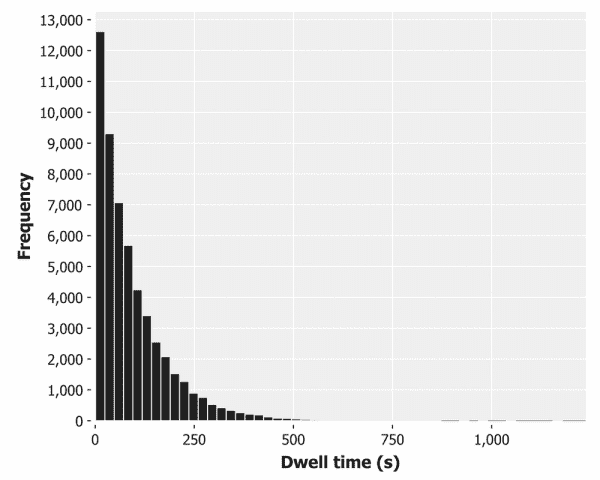

这显然不是一个正态分布的数据，甚至也不是一个非常偏斜的正态分布。峰的左边没有尾巴(一个访问者显然不可能在我们的网站上停留少于零秒)。虽然数据一开始向右急剧变小，但它沿着 *x* 轴延伸的距离比我们从正态分布数据中预期的要远得多。

当面对这样的分布时，其中的值大多很小，但偶尔会很极端，将 *y* 轴绘制成**对数标度**会很有用。对数标度用于表示覆盖非常大范围的事件。图表坐标轴通常是线性的，它们将一个范围划分成大小相等的步长，就像我们在学校学的“数轴”一样。对数标度将范围划分为多个步长，随着远离原点，步长越来越大。

一些覆盖范围很大的自然现象的测量系统是用对数标度来表示的。例如，地震的里氏震级是以 10 为底的对数标度，这意味着里氏 5 级的地震是里氏 4 级地震的 10 倍。分贝标度也是一种对数标度，其基数不同——30 分贝的声波的幅度是 20 分贝的声波的 10 倍。在每种情况下，原理都是相同的——对数标度的使用允许将非常大的值范围压缩到小得多的范围内。

在`log-axis`上绘制我们的 *y* 轴很简单，只需用`c/set-axis`念咒语:

```
(defn ex-2-3 []

  (-> (i/$ :dwell-time (load-data "dwell-times.tsv"))

      (c/histogram :x-label "Dwell time (s)"

                   :nbins 20)

      (c/set-axis :y (c/log-axis :label "Log Frequency"))

      (i/view)))
```

默认情况下，Incanter 将使用基数为 10 的对数刻度，这意味着轴上的每个刻度代表的范围是前一步的 10 倍。像这样的图表——其中只有一个轴显示在对数刻度上——被称为**对数线性**。毫不奇怪，显示两个对数轴的图表被称为**双对数图表**。

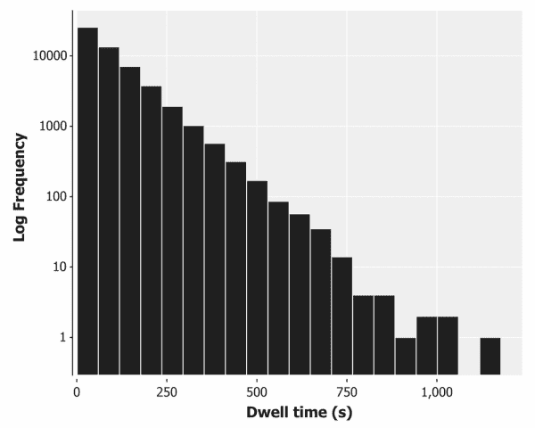

在对数线性图上绘制停留时间显示了数据中隐藏的一致性——停留时间和频率的对数之间存在线性关系。这种关系的清晰性在图的右边分解了，那里只有不到 10 个访问者，但是，除此之外，这种关系是非常一致的。

对数线性图上的直线是指数分布的明显标志。


# 指数分布

当考虑到有许多小的正数量和少得多的大数量的情况时，指数分布经常出现。鉴于我们对里氏震级的了解，得知地震的震级遵循指数分布就不足为奇了。

这种分布也经常出现在等待时间中——距离下一次任何震级的地震的时间也大致遵循指数分布。该分布通常用于模拟故障率，即机器发生故障前的等待时间。我们的指数分布模拟了一个类似于失败的过程——访问者感到厌烦并离开我们网站之前的等待时间。

指数分布有许多有趣的性质。一个与平均值和标准偏差有关:

```
(defn ex-2-4 []

  (let [dwell-times (->> (load-data "dwell-times.tsv")

                         (i/$ :dwell-time))]

    (println "Mean:  " (s/mean dwell-times))

    (println "Median:" (s/median dwell-times))

    (println "SD:    " (s/sd dwell-times))))

Mean:   93.2014074074074

Median: 64.0

SD:     93.96972402519796
```

均值和标准差非常相似。事实上，对于一个理想的指数分布，它们是完全一样的。这一特性适用于所有的指数分布，随着平均值的增加，标准差也会增加。

### 注意

对于指数分布，均值和标准差是相等的。

指数分布的第二个特性是**无记忆**。这是一个违反直觉的特性，最好用一个例子来说明。我们预计，随着访问者继续浏览我们的网站，他们厌倦并离开的可能性会增加。由于平均停留时间是 93 秒，超过 93 秒，他们继续浏览的可能性会越来越小。

指数分布的无记忆特性告诉我们，访问者在我们的网站上停留另外 93 秒的概率是完全相同的，无论他们已经浏览了网站 93 秒、5 分钟、1 小时，还是他们刚刚到达。

### 注意

对于无记忆分布，继续额外的 *x* 分钟的概率不受已经过去的时间的影响。

指数分布的无记忆特性在一定程度上解释了为什么预测下一次地震何时发生如此困难。我们必须依靠其他证据(如地磁干扰)而不是经过的时间。

由于平均停留时间是 64 秒，大约一半的访问者只在网站上停留了大约一分钟。93 秒的平均值表明一些访问者停留的时间要比这个时间长得多。这些统计数据是对过去 6 个月的所有访问者进行统计的。看看这些统计数据每天是如何变化的可能会很有趣。现在来算一下这个。

## 日均值的分布

web 团队提供的文件包含了访问的时间戳。为了按天聚合，有必要从日期中删除时间部分。虽然我们可以通过字符串操作来实现这一点，但更灵活的方法是使用日期和时间库，比如`clj-time`(【https://github.com/clj-time/clj-time】)来解析字符串。这将使我们不仅可以删除时间，还可以执行任意复杂的过滤(比如过滤一周中的特定日子，或者一个月的第一天或最后一天)。

`clj-time.predicates`名称空间包含各种有用的谓词，`clj-time.format`名称空间包含解析函数，这些函数将尝试使用预定义的标准格式将字符串转换为日期-时间对象。如果我们的时间戳还没有标准格式，我们可以使用相同的名称空间来构建自定义格式化程序。查阅`clj-time`文档以获得更多信息和许多用法示例:

```
(defn with-parsed-date [data]

  (i/transform-col data :date (comp tc/to-local-date f/parse)))

(defn filter-weekdays [data]

  (i/$where {:date {:$fn p/weekday?}} data))

(defn mean-dwell-times-by-date [data]

  (i/$rollup :mean :dwell-time :date data))

(defn daily-mean-dwell-times [data]

  (->> (with-parsed-date data)

       (filter-weekdays)

       (mean-dwell-times-by-date)))
```

结合前面的函数，我们可以计算日平均停留时间的平均值、中值和标准偏差:

```
(defn ex-2-5 []

  (let [means (->> (load-data "dwell-times.tsv")

                   (daily-mean-dwell-times)

                   (i/$ :dwell-time))]

    (println "Mean:   " (s/mean means))

    (println "Median: " (s/median means))

    (println "SD:     " (s/sd means))))

;; Mean:    90.210428650562

;; Median:  90.13661202185791

;; SD:      3.722342905320035
```

我们每天的平均值是 90.2 秒。这接近于我们之前计算的整个数据集(包括周末)的平均值。不过标准偏差要低得多，只有 3.7 秒。换句话说，日均值的分布具有比整个数据集低得多的标准差。让我们在图表上绘制每日平均停留时间:

```
(defn ex-2-6 []

  (let [means (->> (load-data "dwell-times.tsv")

                   (daily-mean-dwell-times)

                   (i/$ :dwell-time))]

    (-> (c/histogram means

                     :x-label "Daily mean dwell time (s)"

                     :nbins 20)

        (i/view))))
```

此代码生成以下直方图:


样本平均值的分布围绕 90 秒的总体大平均值对称分布，标准差为 3.7 秒。与对这些平均值进行采样的分布(指数分布)不同，样本平均值的分布是正态分布。


# 中心极限定理

我们在上一章中遇到了中心极限定理，当时我们从一个均匀分布中抽取样本并对它们进行平均。事实上，中心极限定理适用于任何值的分布，只要该分布具有有限的标准偏差。

### 注意

中心极限定理指出，样本均值的分布将是正态分布，而不管它们是从哪个分布计算出来的。

基础分布是指数分布并不重要，中心极限定理表明，从任何分布中抽取的随机样本的平均值都非常接近正态分布。让我们在直方图上画一条正态曲线，看看它有多接近。

为了在直方图上绘制一条正态曲线，我们必须将直方图绘制成密度直方图。这个绘制了已经放入每个桶中的所有点的比例，而不是频率。然后，我们可以用相同的平均值和标准差覆盖正态概率密度:

```
(defn ex-2-7 []

  (let [means (->> (load-data "dwell-times.tsv")

                   (daily-mean-dwell-times)

                   (i/$ :dwell-time))

        mean (s/mean means)

        sd   (s/sd means)

        pdf  (fn [x]

               (s/pdf-normal x :mean mean :sd sd))]

    (-> (c/histogram means

                     :x-label "Daily mean dwell time (s)"

                     :nbins 20

                     :density true)

        (c/add-function pdf 80 100)

        (i/view))))
```

此代码生成以下图表:


绘制在直方图上的正常曲线具有大约 3.7 秒的标准偏差。换句话说，这量化了每个日均值相对于 90 秒的大均值的变化。我们可以把每天的平均值看作是总体样本，前面的曲线代表样本平均值的分布。因为 3.7 秒是样本的平均值与大平均值的差值，它被称为**标准误差**。


# 标准误差

虽然标准差衡量的是样本内的变异量，但标准误差衡量的是取自同一总体的样本均值之间的变异量。

### 注意

标准误差是样本平均值分布的标准偏差。

我们通过查看前 6 个月的数据，根据经验计算了停留时间的标准误差。但是有一个等式允许我们只从一个样本中计算它:

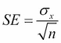

这里，*σ[x]为标准差， *n* 为样本量。这与我们在前一章学习的描述性统计不同。虽然他们描述了单个样本，但标准误差试图描述样本的一般属性，即样本中的变化量意味着给定大小的样本可能会有变化:*

```
(defn standard-deviation [xs]

  (Math/sqrt (variance xs)))

(defn standard-error [xs]

  (/ (standard-deviation xs)

     (Math/sqrt (count xs))))
```

因此，平均值的标准误差与两个因素有关:

*   样本的大小
*   人口标准偏差

样本的大小对标准误差的影响最大。因为我们取样本大小的平方根，所以我们必须将样本大小增加 4 倍，以将标准误差的大小减半。

似乎很奇怪的是，抽样人口的比例对标准误差的大小没有影响。这也无妨，因为有些种群的规模可能是无限的。


# 样本和群体

“样本”和“总体”这两个词对统计学家来说有着特殊的含义。群体是研究人员希望了解或得出结论的整个实体的集合。例如，在 19 世纪下半叶，遗传学的创始人乔治·约翰·孟德尔记录了对豌豆植物的观察。尽管他在实验室研究特定的植物，但他的目标是了解所有可能的豌豆植物遗传背后的潜在机制。

### 注意

统计学家指的是从中抽取样本作为总体的一组实体，不管被研究的对象是否是人。

由于群体可能很大——或者在孟德尔的豌豆植株的情况下，是无限的——我们必须研究有代表性的样本，并从中推断出群体的情况。为了区分样本的可测量属性和总体的不可测量属性，我们使用单词 *statistics* 来指代*样本*属性，使用参数来指代总体属性。

### 注意

统计数据是我们可以从样本中测量的属性。参数是我们试图推断的总体的属性。

事实上，统计数据和参数是通过在数学公式中使用不同的符号来区分的:

| 

措施

 | 

样本统计量

 | 

总数

 |
| --- | --- | --- |
| 项目数量 | *n* | *N* |
| 平均 |  | *[x]* |
| 标准偏差 | *S[x]* | *σ[x]* |
| 标准误差 |  |   |

这里，读作“x-bar”， *[ x ]* 读作“mu x”， *σ [ x ]* 读作“sigma x”

如果你回头参考标准差的等式，你会注意到它是从总体标准差*σ[x]计算出来的，而不是样本标准差*S[x]。这给我们提出了一个悖论——当总体参数正是我们试图推断的值时，我们不能使用总体参数来计算样本统计量。然而，在实践中，样本和总体标准偏差被假定为在大约 30 的样本量以上是相同的。**

让我们根据某一天的平均值来计算标准误差。例如，让我们以某一天为例，比如说 5 月 1 日:

```
(defn ex-2-8 []

  (let [may-1 (f/parse-local-date "2015-05-01")]

    (->> (load-data "dwell-times.tsv")

         (with-parsed-date)

         (filtered-times {:date {:$eq may-1}})

         (standard-error))))

;; 3.627
```

虽然我们只从一天中选取了一个样本，但我们计算的标准误差非常接近所有样本平均值的标准偏差——3.6 比 3.7。这就好像，就像一个包含 DNA 的细胞一样，每个样本都编码了其中整个群体的信息。


# 置信区间

由于样本的标准误差衡量的是我们期望样本均值与总体均值的匹配程度，我们也可以反过来考虑——标准误差衡量的是我们期望总体均值与测量样本均值的匹配程度。换句话说，基于我们的标准误差，我们可以推断总体均值在样本均值的某个预期范围内，并且有一定的置信度。

总之，“置信度”和“预期范围”定义了一个**置信区间**。在陈述置信区间时，陈述 95%的区间是相当标准的——我们 95%确信总体参数位于该区间内。当然，仍有 5%的可能性不会。

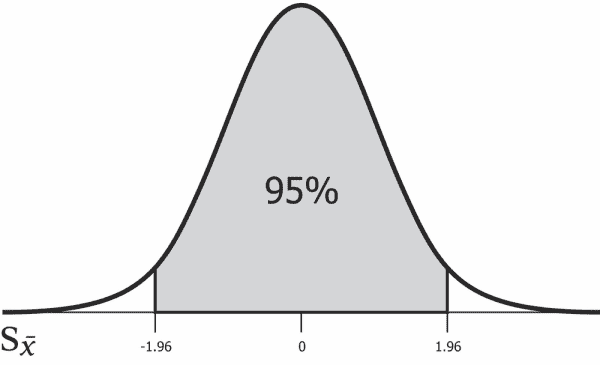

无论标准误差如何，95%的总体平均值将位于样本平均值的-1.96 到 1.96 标准偏差之间。因此，1.96 是 95%置信区间的临界 z 值。

### 注意

名称*z*-值来源于正态分布也被称为*z*-分布。

数字 1.96 是如此常用，以至于它是一个值得记住的数字，但是我们也可以使用`s/quantile-normal`函数来计算临界值。我们下面的`confidence-interval`函数期望`p`的值在零和一之间。对于我们 95%的置信区间，这将是 0.95。我们需要从 1 中减去它，然后除以 2 来计算两个尾部的位置(95%置信区间为 2.5%):

```
(defn confidence-interval [p xs]

  (let [x-bar  (s/mean xs)

        se     (standard-error xs)

        z-crit (s/quantile-normal (- 1 (/ (- 1 p) 2)))]

    [(- x-bar (* se z-crit))

     (+ x-bar (* se z-crit))]))

(defn ex-2-9 []

  (let [may-1 (f/parse-local-date "2015-05-01")]

    (->> (load-data "dwell-times.tsv")

         (with-parsed-date)

         (filtered-times {:date {:$eq may-1}})

         (confidence-interval 0.95))))

;; [83.53415272762004 97.75306531749274]
```

结果告诉我们,我们可以 95%的确信总体均值位于 83.53 和 97.75 秒之间。事实上，我们之前计算的人口平均值就在这个范围内。

## 样本对比

在一场病毒式的营销活动之后，AcmeContent 的网络团队抽取了一天的停留时间样本供我们分析。他们想知道他们最近的活动是否给网站带来了更多的积极的访问者。置信区间为我们提供了比较两个样本的直观方法。

我们像之前一样从活动中加载停留时间，并以同样的方式进行总结:

```
(defn ex-2-10 []

  (let [times (->> (load-data "campaign-sample.tsv")

                   (i/$ :dwell-time))]

    (println "n:      " (count times))

    (println "Mean:   " (s/mean times))

    (println "Median: " (s/median times))

    (println "SD:     " (s/sd times))

    (println "SE:     " (standard-error times))))

;; n:       300

;; Mean:    130.22

;; Median:  84.0

;; SD:      136.13370714388046

;; SE:      7.846572839994115
```

平均值似乎比我们之前看到的平均值大得多——130 秒对 90 秒。这里可能存在一些显著的差异，尽管由于样本量较小和标准差较大，标准误差是前一天样本量的两倍以上。我们可以使用与之前相同的`confidence-interval`函数，根据该数据计算总体平均值的 95%置信区间:

```
(defn ex-2-11 []

  (->> (load-data "campaign-sample.tsv")

       (i/$ :dwell-time)

       (confidence-interval 0.95)))

;; [114.84099983154137 145.59900016845864]
```

总体平均值的 95%置信区间为 114.8 秒至 145.6 秒。这与我们之前计算的 90 年代总体平均值完全不重叠。似乎存在很大的潜在人群差异，这不太可能仅仅通过抽样误差而发生。我们现在的任务是找出原因。

## 偏差

样本应该能够代表被抽取的人群。换句话说，它应该避免导致某些种类的人口成员被系统地排除(或包括)于其他人的偏差。

样本偏差的一个著名例子是 1936 年美国总统选举的文学文摘民意调查。这是有史以来最大和最昂贵的民意调查之一，有 240 万人通过邮件接受了调查。结果是决定性的——堪萨斯州共和党州长艾尔弗·兰登将击败富兰克林·罗斯福，获得 57%的选票。结果，罗斯福以 62%的选票赢得了选举。

该杂志巨大抽样误差的主要原因是样本选择偏差。为了收集尽可能多的选民地址，《文学文摘》翻遍了电话簿、杂志订阅列表和俱乐部会员名单。在电话更多是奢侈品的时代，这一过程肯定会偏向上层和中产阶级选民，并不能代表全体选民。偏差的第二个原因是**无回应偏差**——不到四分之一的受访者实际上回应了调查。这是一种选择偏差，只对那些真正希望参与的受访者有利。

避免样本选择偏差的一个常见方法是确保抽样在某种程度上是随机的。在这个过程中引入偶然性使得实验因素不太可能不公平地影响样品的质量。《文学文摘》的投票集中在尽可能获取最大的样本，但是一个没有偏差的小样本比一个选择不当的大样本更有用。

如果我们打开`campaign-sample.tsv`文件，我们会发现我们的样本仅来自 2015 年 6 月 6 日。这是一个周末，我们可以用`clj-time`轻松证实这一事实:

```
(p/weekend? (t/date-time 2015 6 6))

;; true
```

到目前为止，我们的汇总统计数据都是基于我们过滤的数据，只包括工作日。这是我们样本中的一个偏差,如果周末游客的行为与工作日的行为不同——这是一种非常可能的情况——那么我们可以说这些样本代表了两个不同的人群。


# 可视化不同人群

让我们移除工作日的过滤器，并绘制工作日和周末的每日平均停留时间:

```
(defn ex-2-12 []

  (let [means (->> (load-data "dwell-times.tsv")

                   (with-parsed-date)

                   (mean-dwell-times-by-date)

                   (i/$ :dwell-time))]

    (-> (c/histogram means

                     :x-label "Daily mean dwell time unfiltered (s)"

                     :nbins 20)

        (i/view))))
```

该代码生成以下直方图:


分布不再是正态分布。事实上，这种分布是双峰式的(T2)，有两个峰值。第二个较小的峰值对应于新添加的周末数据，该峰值较低，因为周末天数没有工作日多，也因为分布具有较大的标准误差。

### 注意

一般来说，具有一个以上峰值的分布称为**多峰**。它们可以是一个指标，表明两个或多个正态分布已经合并，因此，两个或多个总体可能已经合并。双峰的一个经典例子是人的身高分布，因为男性的峰高大于女性。

周末数据与工作日数据具有不同的特征。我们应该确保我们是在进行同类比较。让我们将原始数据集过滤到周末:

```
(defn ex-2-13 []

  (let [weekend-times (->> (load-data "dwell-times.tsv")

                           (with-parsed-date)

                           (i/$where {:date {:$fn p/weekend?}})

                           (i/$ :dwell-time))]

    (println "n:      " (count weekend-times))

    (println "Mean:   " (s/mean weekend-times))

    (println "Median: " (s/median weekend-times))

    (println "SD:     " (s/sd weekend-times))

    (println "SE:     " (standard-error weekend-times))))

;; n:       5860

;; Mean:    117.78686006825939

;; Median:  81.0

;; SD:      120.65234077179436

;; SE:      1.5759770362547665
```

周末的总体平均值(基于 6 个月的数据)为 117.8 秒，处于营销样本的 95%置信区间内。换句话说，虽然 130 秒是一个很高的平均停留时间，即使对于一个周末来说，差异也不是很大，不能简单地归因于样本内的随机变化。

我们刚刚采取的方法来建立一个真正的人口差异(在周末访问我们网站的访问者与在一周内访问我们网站的访问者之间的差异),并不是统计测试的常规方法。更常见的方法是从理论开始，然后用数据来检验理论。统计方法为此定义了一个严格的方法，称为**假设检验**。


# 假设检验

假设检验对于统计学家和数据科学家来说是一个正式的过程。假设检验的标准方法是定义一个研究领域，决定哪些变量是衡量被研究对象所必需的，然后提出两个相互竞争的假设。为了避免只看证实我们偏差的数据，研究人员会提前清楚地陈述他们的假设。基于数据，统计学可以用来证实或反驳这个假设。

为了帮助留住我们的访问者，设计师们设计了一个我们主页的变体，它使用了所有最新的技术来吸引我们观众的注意力。我们希望确保我们的努力没有白费，因此我们将寻求增加在新网站的停留时间。

因此，我们的研究问题是“新网站是否导致访问者的停留时间增加”？我们决定参照平均停留时间对此进行测试。现在，我们需要提出我们的两个假设。按照惯例，数据被认为不包含研究者正在寻找的内容。保守的观点是，这些数据不会显示出任何异常。这被称为**零假设**并且通常被表示为*H[0]T7。*

### 注意

假设检验假设零假设是真的，直到证据的权重使这个命题不太可能。这种“从后向前”寻找证据的方式部分是由一个简单的心理事实驱动的，即当人们去寻找什么东西时，他们往往会找到它。

研究人员然后形成另一个假设，用*H[1]表示。这可能仅仅是因为总体平均值不同于基线。或者，总体平均值可能大于或小于基线，或者甚至大于或小于某个特定值。我们想测试新站点是否会增加停留时间，因此这些将是我们的无效假设和替代假设:*

*   *H [0]*
*   *H [1]*

我们保守的假设是，新站点对用户的停留时间没有影响。零假设不一定是零假设(即没有影响)，但在这种情况下，我们没有合理的理由去假设其他情况。如果样本数据不支持零假设(如果数据与其预测相差太大，而不是偶然)，那么我们将拒绝零假设，并提出替代假设作为最佳替代解释。

提出了无效假设和替代假设之后，我们必须设定一个显著性水平，在这个水平上我们要寻找一个效应。

## 意义

显著性检验最初是独立于假设检验而开发的，但是现在这两种方法经常一起使用。显著性检验的目的是设定一个阈值，超过该阈值，我们确定观察到的数据不再支持零假设。

因此，存在两种风险:

*   事实上，我们可以接受一个偶然出现的重大差异
*   我们可以把差异归因于偶然，而事实上，它表明了一个真正的人口差异

这两种可能性分别称为第一类和第二类错误:

|   | 

*H[0]假*

 | 

*H[0]真*

 |
| --- | --- | --- |
| **拒绝 H[0]** | 正确否定 | 第一类错误 |
| **接受***H[0]* | 第二类错误 | 正确肯定 |

我们越是降低犯第一类错误的风险，就越是增加犯第二类错误的风险。换句话说，我们越是希望在没有差异的情况下不宣称存在真正的差异，我们就越需要样本之间的差异来宣称有统计学意义。这增加了我们在遇到真正的差异时忽略它的可能性。

统计学家通常使用两个显著性阈值。这是 5%和 1%的水平。5%的差异通常被称为*显著*，1%的差异被称为*高度显著*。在公式中，阈值的选择通常由希腊字母 alpha、 *α* 表示。由于没有发现效果可能会被视为失败(无论是实验还是新站点)，我们可能会试图调整 *α* 直到我们发现效果。正因为如此，教科书上的显著性检验方法要求我们在查看数据之前设定一个显著性水平。通常选择 5%的水平，所以我们就这样吧。


# 测试新的网站设计

AcmeContent 的网络团队一直在努力工作，开发一个新的网站来鼓励访问者逗留更长的时间。他们使用了所有最新的技术，因此，我们非常有信心，该网站将在停留时间方面有显著的改善。

AcmeContent 并没有立即向所有用户推出该网站，而是想先在一小部分访问者中进行测试。我们对他们进行了关于样本偏差的教育，结果，网站团队在一天内将随机的 5%的网站流量转移到新网站。结果是作为包含一天所有流量的单个文本文件提供给我们。每一行都显示了访问者的停留时间，如果他们使用了原来的网站设计，那么这个值就是“0”，如果他们看到了新的(并且有希望得到改进的)网站，那么这个值就是“1”。

## 执行 z 测试

在之前用置信区间测试时，我们有一个单一的总体均值进行比较。

通过 *z* 测试，我们可以选择比较两个样本。看到新网站的人被随机分组，两组的数据都在同一天收集，以排除其他与时间相关的因素。

因为我们有两个样本，所以我们也有两个标准误差。根据合并的标准误差执行 *z* 测试，标准误差就是方差之和除以样本大小的平方根。这与我们将样本的标准误差合并后得到的结果相同:


这里，是样本 *a* 的方差，是样本 *b* 的方差。*n[a]和*n[b]分别是 *a* 和 *b* 的样本量。可以在 Clojure 中计算合并的标准误差，如下所示:**

```
(defn pooled-standard-error [a b]

  (i/sqrt (+ (/ (i/sq (standard-deviation a)) (count a))

             (/ (i/sq (standard-deviation b)) (count b)))))
```

为了确定我们看到的差异是否出乎意料地大，我们可以取平均值之间观察到的差异与合并标准误差的比率。这个量被赋予变量名 *z* :


使用我们的`pooled-standard-error`函数，*z*-统计量可以这样计算:

```
(defn z-stat [a b]

  (-> (- (mean a)

         (mean b))

      (/ (pooled-standard-error a b))))
```

比率 *z* 表示在给定标准误差的情况下，平均值相对于我们预期值的差异程度。因此，*z*-统计告诉我们平均值之间有多少标准差。由于标准误差具有正态概率分布，我们可以通过在正态 CDF 中查找*z*-统计量来将该差异与概率相关联:

```
(defn z-test [a b]

  (s/cdf-normal (z-stat a b)))
```

下面的例子使用了*z*-测试来比较两个站点的性能。我们通过按站点对行进行分组来做到这一点，返回一个将站点索引到站点的行集合的映射。我们用`(partial map :dwell-time)`调用`map-vals`,将行的集合转换成停留时间的集合。`map-vals`是在 Medley([https://github.com/weavejester/medley](https://github.com/weavejester/medley))中定义的函数，这是一个轻量级实用函数库:

```
(defn ex-2-14 []

    (let [data (->> (load-data "new-site.tsv")

                    (:rows)

                    (group-by :site)

                    (map-vals (partial map :dwell-time)))

          a (get data 0)

          b (get data 1)]

      (println "a n:" (count a))

      (println "b n:" (count b))

      (println "z-stat: " (z-stat a b))

      (println "p-value:" (z-test a b))))

;; a n: 284

;; b n: 16

;; z-stat:  -1.6467438180091214

;; p-value: 0.049805356789022426
```

设置 5%的显著性水平非常类似于设置 95%的置信区间。本质上，我们要看观察到的差异是否在 95%的置信区间之外。如果是这样的话，我们就可以宣称发现了一个在 5%水平上显著的结果。

### 注意

*p*-值是错误地拒绝零假设(如果事实上是真的)而导致 I 型错误的概率。 *p* 值越小，我们就越确定零假设是错误的，并且我们发现了一个真实的效应。

此代码返回值 0.0498，相当于 4.98%。因为它仅仅比我们的 5%的显著性阈值低，我们可以宣称发现了一些重要的东西。

让我们提醒自己无效假设和替代假设:

*   *H [0]*
*   *H [1]*

我们的另一个假设是新位置的停留时间更长。

我们准备声称统计显著性，并且新站点的停留时间比现有站点长，但是我们有一个问题——对于较小的样本，样本标准偏差与总体标准偏差匹配的不确定性增加。我们的新站点示例只有 16 个访问者，如前面示例的输出所示。如此小的样本使标准误差呈正态分布的假设无效。

幸运的是，有一个统计测试和一个相关的分布，它模拟了较小样本量的标准误差增加的不确定性。

## 学生的 t 分布

在爱尔兰吉尼斯啤酒厂工作的化学家威廉·西利·戈塞特使“t ”( T1)分布(T2)流行起来，他把这种分布结合到他对黑啤酒的分析中。

### 注意

威廉·戈塞特于 1908 年在《生物计量学》上发表了这项测试，但他的雇主强迫他使用笔名，因为他们认为使用统计学是商业秘密。他选择的笔名是“学生”。

正态分布完全由两个参数描述，即均值和标准差，而*分布仅由一个称为**自由度**的参数描述。自由度越大， *t* 分布越接近于均值为零、标准差为一的正态分布。随着自由度的减少，分布变得更宽，尾部比正态分布更粗。*

*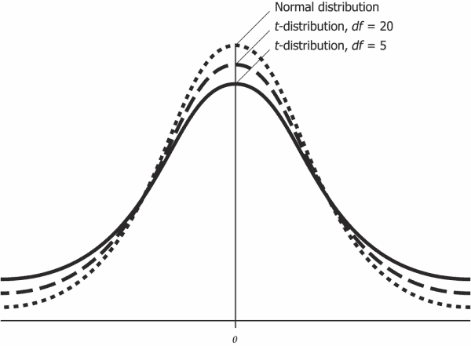*

*前面的图表显示了对于不同的自由度， *t* 分布相对于正态分布是如何变化的。样本量越小，尾部越厚，观察到偏离均值越大的机会就越大。*

## *自由度*

*自由度，通常缩写为 *df* ，与样本大小密切相关。这是一个有用的统计数据，也是系列的一个直观属性，可以简单地通过例子来演示。*

*如果你被告知两个值的平均值是 10，其中一个值是 8，你不需要任何额外的信息就能推断出另一个值是 12。换句话说，对于两个样本大小和给定的平均值，如果一个值是已知的，则另一个值是受约束的。*

*相反，如果你被告知三个值的平均值是 10，第一个值也是 10，你将无法推断出剩下的两个值是什么。由于从 10 开始的三个数字的集合有无限个，它们的平均值都是 10，所以在推断第三个数字的值之前，还必须指定第二个值。*

*对于任何三个数字的集合，约束很简单:您可以自由选择前两个数字，但是最后一个数字是受约束的。因此，自由度可以用以下方式概括:对于任何单个样本，自由度都比样本量小一。*

*当比较两个数据样本时，自由度比样本大小的总和少两个，这与它们各自自由度的总和相同。*

*

# t 统计量

在使用 *t* 分布时，我们查找 *t* 统计量。像*z*-统计一样，这个值量化了一个特定的观测偏差是多么不可能。对于双样本 *t* 测试，按照以下方式计算 *t* 统计量:


这里，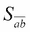是汇集的标准误差。我们可以用与前面相同的方法计算合并的标准误差:


然而，该方程假设了群体参数*σ[a]和*σ[b]的知识，这些知识只能从大样本中近似得到。测试是为小样本设计的，不需要我们对总体方差进行假设。**

因此，对于*t*-测试，我们将合并标准误差写为标准误差之和的平方根:

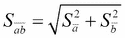

实际上，在给定相同的输入序列的情况下，前面两个合并标准误差方程产生相同的结果。符号上的差异只是为了说明在 *t* 测试中，我们只依赖样本统计数据作为输入。汇集的标准误差可以通过以下方式计算:

```
(defn pooled-standard-error [a b]

  (i/sqrt (+ (i/sq (standard-error a))

             (i/sq (standard-error b)))))
```

尽管它们在数学符号中表示不同，但在实践中，*t*-统计量的计算与*z*-统计量的计算是相同的:

```
(def t-stat z-stat)

(defn ex-2-15 []

    (let [data (->> (load-data "new-site.tsv")

                    (:rows)

                    (group-by :site)

                    (map-vals (partial map :dwell-time)))

          a (get data 0)

          b (get data 1)]

      (t-stat a b)))

;; -1.647
```

这两种统计的区别是概念上的，而不是算法上的——*z*统计仅在样本服从正态分布时适用于。


# 进行 t 检验

测试工作中方式 *t* 的不同源于概率分布，我们的 *p* 值就是从这个概率分布中计算出来的。计算完我们的*t*-统计量后，我们需要查找由我们数据的自由度参数化的 *t* 分布中的值:

```
(defn t-test [a b]

  (let [df (+ (count a) (count b) -2)]

    (- 1 (s/cdf-t (i/abs (t-stat a b)) :df df))))
```

自由度比样本总数少两个，我们的样本是 298 个。


回想一下，我们正在进行假设检验。所以，让我们陈述我们的无效假设和替代假设:

*   *H [0]*
*   *H [1]*

让我们运行这个例子:

```
(defn ex-2-16 []

  (let [data (->> (load-data "new-site.tsv")

                  (:rows)

                  (group-by :site)

                  (map-vals (partial map :dwell-time)))

        a (get data 0)

        b (get data 1)]

    (t-test a b)))

;; 0.0503
```

这返回一个超过 0.05 的*p*-值。由于这大于我们为假设检验设定的 5%的 *α* ，我们不能拒绝零假设。我们对平均值之间差异的测试使用了 *t* 测试，结果没有发现显著差异。因此，我们在*z*-测试中几乎没有显著的结果，部分原因是因为它的样本很少。

## 双尾检验

在我们的另一个假设中，有一个隐含的假设，即新的站点会比以前的站点表现得更好。假设检验的过程不遗余力地确保我们在寻找统计意义时不会对隐藏的假设进行编码。

我们只寻求数量显著增加或减少的检验被称为**单尾检验**，通常不被认可，除非不可能出现相反方向的变化。这个名字来源于这样一个事实，即单尾检验将所有的 *α* 分配给分布的单个尾部。通过不在另一个方向上进行检验，检验有更大的能力来拒绝特定方向上的无效假设，并且从本质上来说，降低了我们判断结果是否有意义的阈值。

### 注意

统计功效是正确接受替代假设的概率。这可以被认为是测试检测效果的能力，其中存在要检测的效果。

虽然更高的统计能力听起来是可取的，但这是以更大的犯 I 型错误的可能性为代价的。一个更正确的方法是考虑到新站点实际上比现有站点更差的可能性。这将我们的 *α* 平均分配到分布的两个尾部，并确保一个重要的结果不会因先前的改进假设而产生偏差。


事实上，Incanter 已经提供了使用`s/t-test`函数执行双样本 *t* 测试的功能。我们提供一个数据样本作为第一个参数，并提供一个样本与`:y`关键字参数进行比较。Incanter 将假设我们想要执行一个双尾测试，除非我们传递值为`:greater` 或`:lower`的`:alternative`关键字，在这种情况下将执行一个单尾测试。

```
(defn ex-2-17 []

  (let [data (->> (load-data "new-site.tsv")

                  (:rows)

                  (group-by :site)

                  (map-vals (partial map :dwell-time)))

        a (get data 0)

        b (get data 1)]

    (clojure.pprint/print (s/t-test a :y b))))

;; {:p-value 0.12756432502462456,

;;  :df 17.7613823496861,

;;  :n2 16,

;;  :x-mean 87.95070422535211,

;;  :y-mean 122.0,

;;  :x-var 10463.941024237305,

;;  :conf-int [-78.9894629402365 10.890871390940724],

;;  :y-var 6669.866666666667,

;;  :t-stat -1.5985205593851322,

;;  :n1 284}
```

Incanter 的*t*-测试返回了很多信息，包括*p*-值。*p*-值大约是我们为单尾测试计算的值的两倍。事实上，它不完全是 double 的唯一原因是因为 Incanter 实现了一个称为 **Welch 的 t-test** 的 *t* 测试的轻微变体，当两个样本具有不同的标准偏差时，它会稍微更加稳健。因为我们知道，对于指数分布，均值和方差是密切相关的，所以应用该检验稍微严格一些，并且返回更低的显著性。


# 单样本 t 检验

独立样本的 *t* 检验是最常见的一种统计分析，它提供了一种非常灵活和通用的方法来比较两个样本是否代表相同或不同的总体。然而，在总体均值已知的情况下，还有一个更简单的测试，用`s/simple-t-test`表示。

我们传递一个样本和一个总体均值，用关键字`:mu`进行测试。因此，如果我们只是想看看我们的新站点是否与以前的群体平均驻留时间 90 有显著不同，我们可以运行这样的测试:

```
(defn ex-2-18 []

  (let [data (->> (load-data "new-site.tsv")

                  (:rows)

                  (group-by :site)

                  (map-vals (partial map :dwell-time)))

        b (get data 1)]

    (clojure.pprint/pprint (s/t-test b :mu 90))))

;; {:p-value 0.13789520958229406,

;;  :df 15,

;;  :n2 nil,

;;  :x-mean 122.0,

;;  :y-mean nil,

;;  :x-var 6669.866666666667,

;;  :conf-int [78.48152745280898 165.51847254719104],

;;  :y-var nil,

;;  :t-stat 1.5672973291495713,

;;  :n1 16}
```

`simple-t-test`函数不仅返回测试的 *p* 值，还返回总体平均值的置信区间。它很宽，从 78.5 秒到 165.5 秒，肯定与我们测试的 90 秒重叠。这解释了为什么我们不能拒绝零假设。


# 重采样

为了开发一种关于如何通过 *t* 测试从如此少的数据中确认和计算这些统计数据的直觉，我们可以应用一种叫做**重采样**的方法。重采样基于这样一个前提，即每个样本只是总体中无限个可能样本中的一个。通过从现有样本中提取许多新样本，我们可以深入了解其他样本的性质，从而更好地了解潜在人群。

实际上有几种重采样技术，我们将讨论最简单的一种——自举。在 bootstrapping 中，我们通过重复从原始样本中取一个随机值并替换来生成一个新样本，直到我们生成一个与原始样本大小相同的样本。因为这些值在每次随机选择之间会被替换，所以相同的源值可能会在新样本中出现多次。这就好像我们重复地从一副扑克牌中随机抽取一张牌，但每次抽取后都要更换这张牌。偶尔，我们会选择一张我们之前选择的卡片。

利用 bootstrap 函数，我们可以很容易地在 Incanter 中引导我们的样本，以生成许多重样本。`bootstrap`函数接受两个参数—原始样本和要对引导样本计算的汇总统计数据，以及可选参数的数量— `:size`(要计算的引导样本的数量，每个样本是原始样本的大小)、`:smooth`(是否平滑离散统计数据的输出，如中值)、`:smooth-sd`和`:replacement`，默认为 true:

```
(defn ex-2-19 []

  (let [data (->> (load-data "new-site.tsv")

                  (i/$where {:site {:$eq 1}})

                  (i/$ :dwell-time ))]

    (-> (s/bootstrap data s/mean :size 10000)

        (c/histogram :nbins 20

                     :x-label "Bootstrapped mean dwell times (s)")

        (i/view))))
```

让我们以柱状图的形式来可视化输出:


直方图显示了平均值如何随着新位置停留时间的重复(重新)采样而变化。虽然输入只是 16 个访问者的单个样本，但自举样本已经非常清晰地模拟了我们原始样本的标准误差，并可视化了我们之前通过单个样本 *t* 测试计算的置信区间(78s 到 165s)。

通过自举，我们通过获取多个样本进行模拟，即使我们只有一个样本作为我们的输入。这是一种普遍有用的技术，用来估计我们无法或不知道如何分析计算的参数。


# 测试多个设计

令人失望的是发现用户在新网站设计上停留时间的增加并没有统计学意义。不过，在向全世界推广之前，我们最好在一小部分用户中发现这一点。

AcmeContent 的网络团队并不气馁，他们加班加点，设计了一套可供选择的网站设计。他们从其他设计中吸取最佳元素，设计了 19 种变体进行测试。加上我们的原始网站，它将作为一个控制，有 20 个不同的网站直接访问者。

## 计算样本意味着

网络团队将 19 个新网站设计与原网站一起部署。如前所述，每个网站随机接收 5%的访问者。我们让测试运行了 24 小时。

第二天，我们会收到一份文件，上面显示了访问者对每个网站设计的停留时间。每个都标有一个数字，位置`0`对应于最初未改变的设计，数字`1`到`19`代表其他设计:

```
(defn ex-2-20 []

  (->> (i/transform-col (load-data "multiple-sites.tsv")

                        :dwell-time float)

       (i/$rollup :mean :dwell-time :site)

       (i/$order :dwell-time :desc)

       (i/view)))
```

该代码生成下表:

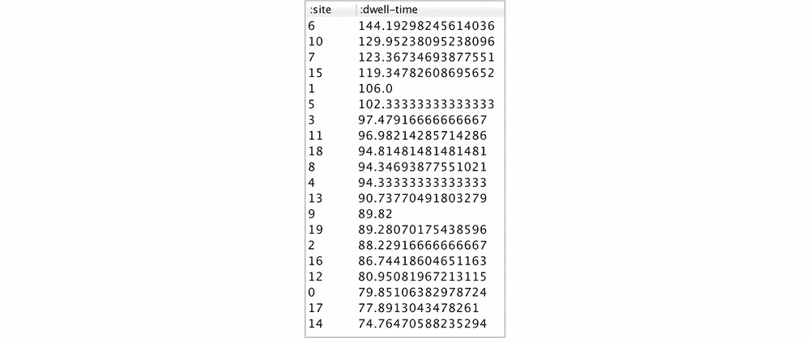

我们想测试出每个网站的设计，看看是否有任何产生统计意义上的结果。为了做到这一点，我们可以对这些网站进行如下比较:

```
(defn ex-2-21 []

  (let [data (->> (load-data "multiple-sites.tsv")

                  (:rows)

                  (group-by :site)

                  (map-vals (partial map :dwell-time)))

        alpha 0.05]

    (doseq [[site-a times-a] data

            [site-b times-b] data

            :when (> site-a site-b)

            :let [p-val (-> (s/t-test times-a :y times-b)

                            (:p-value))]]

      (when (< p-val alpha)

        (println site-b "and" site-a

                 "are significantly different:"

                 (format "%.3f" p-val))))))
```

然而，这将是一个坏主意。我们很可能会看到表现特别好的页面和表现特别差的页面之间的统计差异，即使这些差异是偶然的。如果您运行前面的示例，您将看到许多页面在统计上彼此不同。

或者，我们可以将每个站点与我们当前的基线进行比较——当前为我们站点测量的平均停留时间为 90 秒:

```
(defn ex-2-22 []

  (let [data (->> (load-data "multiple-sites.tsv")

                  (:rows)

                  (group-by :site)

                  (map-vals (partial map :dwell-time)))

        baseline (get data 0)

        alpha 0.05]

    (doseq [[site-a times-a] data

            :let [p-val (-> (s/t-test times-a :y baseline)

                            (:p-value))]]

      (when (< p-val alpha)

        (println site-a

                 "is significantly different from baseline:"

                 (format "%.3f" p-val))))))
```

该测试确定了两个与基线显著不同的位置:

```
;; 6 is significantly different from baseline: 0.007

;; 10 is significantly different from baseline: 0.006
```

小的*p*-值(小于 1 %)表示存在非常显著的统计学差异。这看起来很有希望，但我们有一个问题。我们已经对 20 个数据样本进行了 *t* 测试，其 *α* 为 0.05。 *α* 的定义是，它是错误拒绝零假设的概率。通过运行 20 次*t*-测试，我们很可能会错误地拒绝至少一页的零假设。

通过像这样一次比较多个页面，我们使 *t* 测试的结果无效。有多种替代技术可以解决在统计测试中进行多重比较的问题，我们将在后面的章节中介绍这些技术。


# 多重比较

随着的重复试验，我们发现显著效果的可能性增加，这一事实被称为多重比较问题。一般来说，问题的解决方案是在比较许多样本时要求更显著的效果。尽管这个问题没有直接的解决方案；即使 *α* 为 0.01，我们平均也会在 1%的时间里犯第一类错误。

为了发展我们对多重比较和统计显著性如何相互关联的直觉，让我们构建一个交互式网页来模拟获取多个样本的效果。使用像 Clojure 这样强大的通用编程语言进行数据分析的好处之一是，我们可以在各种环境中运行我们的数据处理代码。

到目前为止，我们为本章编写和运行的代码已经针对 Java 虚拟机进行了编译。但是从 2013 年开始，我们的编译代码有了一个替代的目标环境:网络浏览器。ClojureScript 将 Clojure 的应用范围进一步扩展到任何安装了支持 JavaScript 的 web 浏览器的计算机。

## 介绍模拟

为了帮助可视化与多重显著性测试相关的问题，我们将使用 ClojureScript 构建一个交互式模拟，寻找从两个指数分布中随机抽取的样本之间的统计显著差异。为了了解其他因素如何与我们的假设检验相关，我们的模拟将允许我们更改两个分布中每一个的潜在总体均值，以及设置样本大小和期望的置信水平。

如果您已经下载了本章的示例代码，您将在资源目录中看到一个`index.html`文件。如果您在 web 浏览器中打开这段代码，您应该会看到一条提示您编译 JavaScript 的消息。我们可以用名为`cljsbuild`的 Leiningen 插件来做到这一点。

## 编译模拟

`cljsbuild`是一个 Leiningen 插件，将 ClojureScript 编译成 JavaScript。要使用它，我们只需让编译器知道我们想要输出 JavaScript 文件的位置。Clojure 代码输出到一个`.jar`文件(Java Archive 的缩写)，ClojureScript 输出到一个单独的`.js`文件。我们指定输出文件的名称和编译器设置，以用于`project.clj`的`:cljsbuilds`部分。

该插件可以在命令行上以`lein cljsbuild`的名称访问。在项目目录的根目录中，运行以下命令:

```

lein cljsbuild once

```

这个命令将为我们编译一个 JavaScript 文件。另一个命令如下:

```

lein cljsbuild auto

```

前面的代码将编译代码，但将保持活动状态，监视对源文件的更改。如果这些文件中的任何一个被更新，输出将被重新编译。

现在在 web 浏览器中打开文件`resources/index.html`,查看 JavaScript 的效果。


# 浏览器模拟

示例项目的 resources 目录中提供了一个 HTML 页面。在任何现代浏览器中打开该页面，您应该会看到类似于下图的内容:


页面左侧显示了两个样本分布的双直方图，两个样本均取自指数分布。生成样本的总体均值由网页右上角标有**参数**的框中的滑块控制。直方图下方的图表显示了基于样本的总体均值的两种概率密度。这些是使用 *t* 分布计算的，由样本的自由度参数化。在这些滑块的下面，一个标有【T4 设置】的框中，是另一对滑块，用于设置测试的样本大小和置信区间。调整置信区间将裁剪 *t* 分布的尾部；在 95%的置信区间，只显示概率分布的中间 95%。最后，在标记为**统计数据**的框中，是显示两个样本平均值的滑块。这些是不能改变的；它们的值是从样本中测量的。标记为**新样本**的按钮可用于生成两个新的随机样本。观察样本均值如何随着每对新样本的生成而波动。继续生成样本，你会偶尔观察到样本均值之间的显著差异，即使基本总体均值是相同的。

当我们探索改变样本大小和不同总体均值的置信度的影响时，让我们看看如何用库`jStat`、`Reagent`和`B1`构建模拟。


# jStat

当 ClojureScript 编译成 JavaScript 时，我们不能利用那些有 Java 依赖的库。Incanter 严重依赖于几个底层 Java 库，因此我们必须为基于浏览器的统计分析找到 Incanter 的替代品。

### 注意

在构建 ClojureScript 应用程序时，我们不能利用依赖于 Java 库的库，因为它们在执行我们代码的 JavaScript 引擎中不可用。

`jStat`([https://github.com/jstat/jstat](https://github.com/jstat/jstat))是一个 JavaScript 统计库。它提供了根据特定分布生成序列的函数，包括指数分布和 T4 分布。

要使用它，我们必须确保它在我们的网页上可用。我们可以通过将它链接到一个远程的 **内容分发网络** ( **CDN** )或者自己托管文件来做到这一点。将其链接到 CDN 的好处是，之前为另一个网站下载了`jStat`的访问者可以使用他们的缓存版本。然而，因为我们的模拟是供本地使用的，所以我们包含了这个文件，这样即使浏览器离线，页面也能工作。

`jstat.min.js`文件已经下载到了`resources/js/vendor`目录下。该文件加载在带有标准 HTML 标签的`index.html`的主体中。

为了利用 jStat 的发行版生成函数，我们必须与 ClojureScript 中的 JavaScript 库进行交互。与 Java 互操作一样，Clojure 提供了实用的语法来与用宿主语言编写的库进行交互。

`jStat`提供了在[https://jstat.github.io/distributions.html](https://jstat.github.io/distributions.html)记录的各种发行版。为了从指数分布中生成样本，我们想要调用`jStat.exponential.sample(lambda)`函数。它的 JavaScript 互操作非常简单；我们用`js/`作为表达式的前缀，以确保我们访问 JavaScript 的名称空间并移动括号的位置:

```
(defn randexp [lambda]

  (js/jStat.exponential.sample lambda))
```

一旦我们能够从指数分布中生成样本，创建样本的惰性序列就像重复调用函数一样简单:

```
(defn exponential-distribution [lambda]

  (repeatedly #(randexp lambda)))
```

ClojureScript 公开了几乎所有的 Clojure，包括懒惰序列。参考该书在 http://wiki.clojuredatascience.com 的 wiki 获得 JavaScript interop 的链接。


# B1

既然我们可以在 ClojureScript 中生成数据样本，我们希望能够将它们绘制在直方图上。我们需要一个纯粹的 Clojure 替代 Incanter，以网络可访问的格式绘制直方图；B1 库([https://github.com/henrygarner/b1](https://github.com/henrygarner/b1))正好提供了这种功能。这个名字来源于这样一个事实，它改编并简化了 ClojureScript 库`C2`，而后者又简化了流行的 JavaScript 数据可视化框架`D3`。

我们将在`b1.charts`中使用 B1 的简单实用函数从 ClojureScript 中的数据构建直方图。B1 不要求特定的显示格式；我们可以用它在画布元素上绘图，甚至直接从 HTML 元素中构建图表。然而，B1 确实包含了在`b1.svg`中将图表转换成 SVG 的函数，这些函数可以在所有现代的网络浏览器中显示。

## 可缩放矢量图形

SVG 代表可缩放矢量图形，并定义了一组表示绘图指令的标签。SVG 的优势在于结果可以以任何尺寸呈现，而不会出现与按比例放大的光栅(基于像素)图形相关的模糊。一个额外的好处是，现代浏览器知道如何呈现 SVG 绘图指令，以便直接在网页中生成图像，并且可以使用 CSS 来设置图像的样式和动画。

虽然对 SVG 和 CSS 的详细讨论超出了本书的范围，但是 B1 确实提供了非常类似于 Incanter 的语法，可以使用 SVG 构建简单的图表。给定一个值序列，我们调用`c/histogram`函数将其转换成数据结构的内部表示。我们可以用`c/add-histogram`函数添加额外的直方图，并调用`svg/as-svg` 将图表呈现为 SVG 表示:

```
(defn sample-histograms [sample-a sample-b]

  (-> (c/histogram sample-a :x-axis [0 200] :bins 20)

      (c/add-histogram sample-b)

      (svg/as-svg :width 550 :height 400)))
```

与 Incanter 不同，当我们选择渲染直方图时，我们还必须指定图表所需的宽度和高度。


# 绘制概率密度

除了使用 jStat 从指数分布中生成样本，我们还将使用它来计算 *t* 分布的概率密度。我们可以构造一个简单的函数来包装`jStat.studentt.pdf(t, df)`函数，提供正确的 *t* 统计量和自由度来参数化分布:

```
(defn pdf-t [t & {:keys [df]}]

  (js/jStat.studentt.pdf t df))
```

使用 ClojureScript 的一个优点是我们已经编写了代码来计算样本的*t*-统计量。在 Clojure 中运行的代码可以编译成 ClojureScript，无需任何修改:

```
(defn t-statistic [test {:keys [mean n sd]}]

  (/ (- mean test)

     (/ sd (Math/sqrt n))))
```

为了渲染概率密度，我们可以使用 B1 的`c/function-area-plot`。这将从函数描述的直线生成面积图。所提供的函数只需接受一个 *x* 并返回相应的 *y* 。

稍微复杂的是，我们返回的 *y* 的值对于不同的样本是不同的。这是因为`t-pdf`在样本均值处最高(对应于统计值为零的 *t* )。因此，我们需要为要传递给`function-area-plot`的每个样本生成不同的函数。这是通过`probability-density`功能完成的，如下:

```
(defn probability-density [sample alpha]

  (let [mu (mean sample)

        sd (standard-deviation sample)

        n  (count sample)]

    (fn [x]

      (let [df     (dec (count sample))

            t-crit (threshold-t 2 df alpha)

            t-stat (t-statistic x {:mean mu

                                   :sd sd

                                   :n n})]

        (if (< (Math/abs t-stat) t-crit)

          (pdf-t t-stat :df df)

          0)))))
```

这里，我们定义了一个名为`probability-density`的高阶函数，它接受一个值`sample`。我们计算一些简单的汇总统计数据，然后返回一个匿名函数，计算分布中给定值的概率密度。

这个匿名函数将被传递给`function-area-plot`。它接受一个 *x* ，并从中计算出给定样本的一个*t*-统计量。返回的 *y* 值是与 *t* 统计相关的 *t* 分布的概率:

```
(defn sample-means [sample-a sample-b alpha]

  (-> (c/function-area-plot (probability-density sample-a alpha)

                            :x-axis [0 200])

      (c/add-function (probability-density sample-b alpha))

      (svg/as-svg :width 550 :height 250)))
```

与直方图一样，生成多个图就像用图表和我们想要添加的新函数调用`add-function` 一样简单。


# 状态和试剂

ClojureScript 中的状态管理方式与 Clojure 应用程序相同——通过使用原子、引用或代理。原子提供了对单一身份的不协调的同步访问，是存储应用程序状态的绝佳选择。使用 atom 可以确保应用程序总是看到单一、一致的数据视图。

Reagent 是一个 ClojureScript 库，它提供了一种更新网页内容的机制，以响应原子值的变化。标记和状态绑定在一起，因此每当应用程序状态更新时，都会重新生成标记。

Reagent 还提供了使用 Clojure 数据结构以惯用方式呈现 HTML 的语法。这意味着页面的内容和交互性都可以用一种语言来处理。

## 更新状态

对于保存在试剂原子中的数据，通过调用带有两个参数的`swap!`函数来更新状态——我们希望更新的原子和转换原子状态的函数。所提供的函数需要接受原子的当前状态并返回新状态。感叹号表示函数有副作用，在这种情况下，副作用是可取的；除了更新 atom，Reagent 还将确保我们的 HTML 页面的相关部分得到更新。

指数分布只有一个参数，即由λ、 *λ* 表示的比率。指数分布的比率是平均值的倒数，因此我们计算`(/ 1 mean-a)` 并将其作为参数传递给指数分布函数:

```
(defn update-sample [{:keys [mean-a mean-b sample-size]

                      :as state}]

  (let [sample-a (->> (float (/ 1 mean-a))

                      (exponential-distribution)

                      (take sample-size))

        sample-b (->> (float (/ 1 mean-b))

                      (exponential-distribution)

                      (take sample-size))]

    (-> state

        (assoc :sample-a sample-a)

        (assoc :sample-b sample-b)

        (assoc :sample-mean-a (int (mean sample-a)))

        (assoc :sample-mean-b (int (mean sample-b))))))

(defn update-sample! [state]

  (swap! state update-sample))
```

在前面的代码中，我们定义了一个`update-sample`函数，它接受一个包含`:sample-size`、`:mean-a`和`:mean-b`的映射，并返回一个包含相关新样本和样本均值的新映射。

`update-sample` 函数在没有副作用的意义上是纯粹的，这使得它更容易测试。`update-sample!`函数通过调用`swap!`来包装它。Reagent 确保当原子中的值改变时，依赖于该原子中包含的值的任何代码都将被执行。这导致我们的界面被重新渲染以响应新的样本。

## 绑定接口

为了将接口绑定到状态，试剂定义了一个`render-component`函数。这将一个特定的函数(在本例中是我们的`layout-interface`函数)与一个特定的 HTML 节点(页面上 ID 为`root`的元素)链接起来:

```
(defn layout-interface []

  (let [sample-a (get @state :sample-a)

        sample-b (get @state :sample-b)

        alpha (/ (get @state :alpha) 100)]

    [:div

     [:div.row

      [:div.large-12.columns

       [:h1 "Parameters & Statistics"]]]

     [:div.row

      [:div.large-5.large-push-7.columns

       [controllers state]]

      [:div.large-7.large-pull-5.columns {:role :content}

       [sample-histograms sample-a sample-b]

       [sample-means sample-a sample-b alpha]]]]))

(defn run []

  (r/render-component

   [layout-interface]

   (.getElementById js/document "root")))
```

我们的`layout-interface`函数包含一个 HTML 标记，表示为嵌套的 Clojure 数据结构。在对`:div`和`:h1`的调用中，元素是对我们的两个`sample-histograms`和`sample-means`函数的调用。它们将被替换为它们的返回值——直方图的 SVG 表示和平均值的概率密度。

为了简洁起见，我们省略了`controllers`函数的实现，该函数处理滑块和**新示例**按钮的渲染。参考示例代码中的`cljds.ch2.app`名称空间，了解这是如何实现的。


# 模拟多项测试

每次按下 **New** **Sample** 按钮，就会生成一对来自指数分布的新样本，其总体平均值取自滑块。样本绘制在直方图上，下面绘制了概率密度函数，显示样本的标准误差。随着置信区间的改变，观察标准误差的可接受偏差如何改变。

每次按下按钮，我们都可以将其视为一个显著性测试，将 alpha 设置为置信区间的补码。换句话说，如果样本均值的概率分布在 95%的置信区间重叠，我们不能在 5%的显著性水平上拒绝零假设。

观察即使总体均值相同，均值也会偶尔出现较大偏差。当样本差异超过我们的标准误差时，我们可以接受替代假设。在 95%的置信水平下，我们将在 20 次试验中发现一个显著的结果，即使分布的总体均值是相同的。当这种情况发生时，我们就犯了第一类错误，将抽样误差误认为是真实的总体差异。


尽管有相同的群体参数，但偶尔会观察到较大的样本差异。


# Bonferroni 校正

因此，我们需要一种替代方法，同时进行多项测试，以增加通过重复试验发现显著效果的可能性。Bonferroni 校正是一个非常简单的调整，确保我们不太可能犯 I 型错误。它通过为我们的测试调整 alpha 来做到这一点。

调整很简单 Bonferroni 校正简单地将我们想要的 alpha 除以我们正在执行的测试的数量。例如，如果我们有 *k* 个现场设计要测试，并且实验 alpha 值为 *0.05* ，那么 Bonferroni 校正值表示为:


这是一种安全的方法，可以减少在多次测试中出现 I 型错误的可能性。以下示例与`ex-2-22`相同，除了 alpha 值已除以组数:

```
(defn ex-2-23 []

  (let [data (->> (load-data "multiple-sites.tsv")

                  (:rows)

                  (group-by :site)

                  (map-vals (partial map :dwell-time)))

        alpha (/ 0.05 (count data))]

    (doseq [[site-a times-a] data

            [site-b times-b] data

            :when (> site-a site-b)

            :let [p-val (-> (s/t-test times-a :y times-b)

                            (:p-value))]]

      (when (< p-val alpha)

        (println site-b "and" site-a

                 "are significantly different:"

                 (format "%.3f" p-val))))))
```

如果您运行前面的示例，您会发现使用 Bonferroni 校正后，没有一个页面在统计上有意义。

显著性测试是一种平衡行为——我们犯第一类错误的几率越低，犯第二类错误的风险就越大。Bonferroni 修正非常保守，由于过于谨慎，我们可能错过了真正的差异。

在这一章的最后一部分，我们将研究另一种显著性测试的方法，这种方法在犯第一类和第二类错误之间取得了平衡，同时允许我们同时测试所有的 20 页。


# 方差分析

方差分析(Analysis of variance)，通常简称为 **ANOVA** ，是用来衡量组间差异的统计显著性的一系列统计方法。它是由极具天赋的统计学家罗纳德·费雪开发的，他还通过在生物测试方面的工作普及了显著性测试。

我们的测试使用了*z*-统计量和*t*-统计量，将样本均值作为区分两个样本的主要机制。在每一个案例中，我们寻找平均值的差异除以我们可以合理预期的差异水平，并用标准误差量化。

平均值并不是唯一可以表明样本间差异的统计数据。事实上，也可以用样本方差作为统计差异的指标。


为了说明这可能是如何工作的，考虑前面的图表。左边的三组中的每一组可以代表特定页面的停留时间的样本，具有其自己的平均值和标准偏差。如果将所有三组的停留时间合并为一组，则方差大于各组单独的平均方差。

ANOVA 测试的统计显著性来自两个方差的比率——利益群体之间的方差*和利益群体*内的方差*。如果各组之间存在显著差异，而这种差异并没有反映在组内，那么这些分组有助于解释各组之间的一些差异。相反，如果组内的方差与组间的方差相同，则这些组在统计上彼此没有差异。*


# f 分布

*F*-分布由两个自由度参数化——样本大小的自由度和组数的自由度。

第一个自由度是组数减 1，第二个自由度是样本大小减组数。如果 *k* 代表组数， *n* 代表样本量:

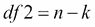

我们可以用一个咒语函数图来可视化不同的 *F* 分布:

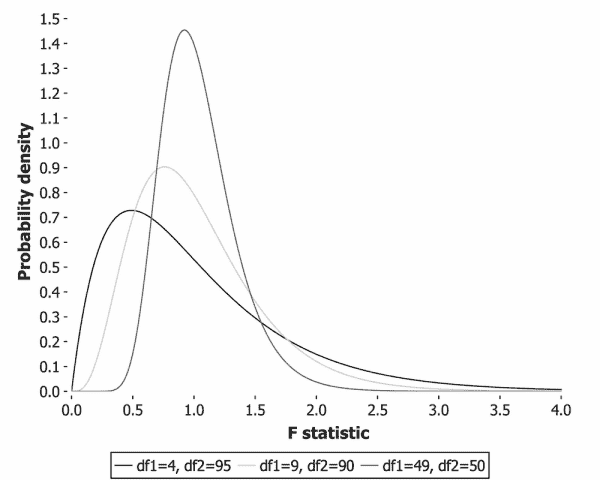

上图中的线条显示了 100 个样本点的各种 *F* 分布，这些样本点分为 5 组、10 组和 50 组。


# F 统计量

代表组内和组间方差之比的检验统计量称为 *F* 统计量。统计量越接近 1，两个方差就越相似。*F*-统计量的计算非常简单，如下所示:

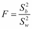

这里，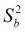是组间的*方差，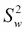是*组内的*方差。*

随着比率 *F* 变得越大，组之间的方差与组内的方差相比就越大。这意味着分组在总体上很好地解释了样本中观察到的差异。当这个比率超过一个临界阈值时，我们可以说这个差异在统计上是显著的。

### 注意

*F*-检验总是单尾检验，因为组间的任何方差都会使 *F* 变大。 *F* 不可能降到零以下。

*F* 测试的内的*方差计算为平均值的均方差。我们将其计算为平均值的偏差平方和除以第一自由度。例如，如果有 *k 个*组，每个组的平均值为，我们可以这样计算方差:*

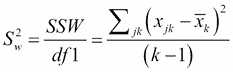

这里， *SSW* 表示内的*平方和， *x [jk]* 表示组 *k* 中 *j ^(th)* 元素的值。*

前面计算 *SSW* 的公式看起来很吓人。但是，事实上，Incanter 定义了一个有用的`s/sum-of-square-devs-from-mean`函数，它使得计算内的平方和变得像下面这样简单:

```
(defn ssw [groups]

  (->> (map s/sum-of-square-devs-from-mean groups)

       (reduce +)))
```

一个 *F* 测试的之间的*方差有一个类似的公式:*


这里， *SST* 是*总平方和*， *SSW* 是我们刚刚计算的值。总平方和是“大”平均值的平方差之和，可以这样计算:


因此， *SST* 就是没有任何分组的平方的总和。我们可以在 Clojure 中计算 SST 和 SSW，如下所示:

```
(defn sst [groups]

  (->> (apply concat groups)

       (s/sum-of-square-devs-from-mean)))

(defn ssb [groups]

  (- (sst groups)

     (ssw groups)))
```

*F*-统计量计算为组间方差与组内方差之比。结合我们之前定义的`ssb`和`ssw`函数以及两个自由度，我们可以如下计算 Clojure 中的*F*-统计量。

因此，我们可以从我们的组和我们的两个自由度计算出*F*-统计量如下:

```
(defn f-stat [groups df1 df2]

  (let [msb (/ (ssb groups) df1)

        msw (/ (ssw groups) df2)]

    (/ msbmsw)))
```

现在我们可以计算来自我们组的*F*-统计，我们准备在*F*-测试中使用它。


# f 检验

正如我们在本章中研究的所有假设检验一样，一旦我们有了统计数据和分布，我们只需要选择一个值 *α* ，看看我们的数据是否超过了检验的临界值。

Incanter 提供了一个`s/f-test`函数，但这只测量两组之间和两组内部的差异。为了在我们的 20 个不同的组上运行一个 *F* 测试，我们将需要实现我们自己的 *F* 测试函数。幸运的是，我们已经通过计算一个适当的*F*-统计量完成了前面几节中的艰苦工作。我们可以通过在用正确的自由度参数化的 *F* 分布中查找 *F* 统计来执行 *F* 测试。在下面的代码中，我们将编写一个`f-test`函数，使用它对任意数量的组执行测试:

```
(defn f-test [groups]

  (let [n (count (apply concat groups))

        m (count groups)

        df1 (- m 1)

        df2 (- n m)

        f-stat (f-stat groups df1 df2)]

    (s/cdf-f f-stat :df1 df1 :df2 df2 :lower-tail? false)))
```

在前面函数的最后一行，我们使用由正确自由度参数化的 Incanter 的`s/cdf-f`函数，将*F*-统计值转换为*p*-值。这个*p*-值是对整个模型的度量，不同的页面如何很好地解释总体停留时间的差异。我们剩下要做的就是选择一个显著性水平并进行测试。让我们坚持 5%的显著性水平:

```
(defn ex-2-24 []

  (let [grouped (->> (load-data "multiple-sites.tsv")

                     (:rows)

                     (group-by :site)

                     (vals)

                     (map (partial map :dwell-time)))]

    (f-test grouped)))

;; 0.014
```

测试返回 0.014 的*p*-值，这是一个重要的结果。不同的页面确实有不同的差异，这不能简单地用随机抽样误差来解释。

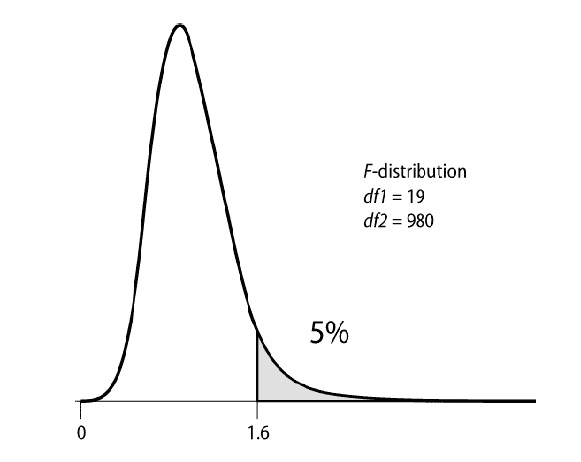

我们可以使用一个方框图，将每个站点的分布一起显示在一个图表中，以便并排比较它们:

```
(defn ex-2-25 []

  (let [grouped (->> (load-data "multiple-sites.tsv")

                     (:rows)

                     (group-by :site)

                     (sort-by first)

                     (map second)

                     (map (partial map :dwell-time)))

        box-plot (c/box-plot (first grouped)

                             :x-label "Site number"

                             :y-label "Dwell time (s)")

        add-box (fn [chart dwell-times]

                  (c/add-box-plot chart dwell-times))]

    (-> (reduce add-box box-plot (rest grouped))

        (i/view))))
```

在前面的代码中，我们减少了组，为每个组调用`c/add-box-plot`。在绘制之前，这些组是按照它们的站点 ID 排序的，所以我们的原始页面 0 在图表的最左边。

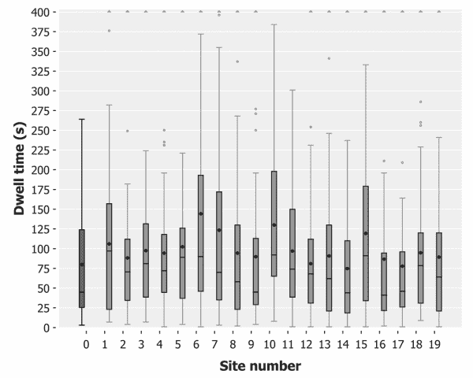

站点 ID `10`似乎具有最长的停留时间，因为它的四分位数范围在图上延伸得最远。但是，如果仔细观察，您会发现其平均值低于站点 6，平均停留时间超过 144 秒:

```
(defn ex-2-26 []

  (let [data (load-data "multiple-sites.tsv")

        site-0 (->> (i/$where {:site {:$eq 0}} data)

                    (i/$ :dwell-time))

        site-10 (->> (i/$where {:site {:$eq 10}} data)

                     (i/$ :dwell-time))]

    (s/t-test site-10 :y site-0)))

;; 0.0069
```

现在我们已经使用 *F* 测试确认了统计上的显著影响，我们有理由声称站点 ID `6`在统计上不同于基线:

```
(defn ex-2-27 []

  (let [data (load-data "multiple-sites.tsv")

        site-0 (->> (i/$where {:site {:$eq 0}} data)

                    (i/$ :dwell-time))

        site-6 (->> (i/$where {:site {:$eq 6}} data)

                    (i/$ :dwell-time))]

    (s/t-test site-6 :y site-0)))

;; 0.007
```

最后，我们有证据表明，页面 ID 6 是对当前站点的真正改进。作为我们分析的结果，AcmeContent 首席执行官授权推出一个新外观的网站。网络团队非常高兴！


# 效果大小

在这一章中，我们重点关注统计显著性——统计学家用来确保发现差异的方法，这种差异不能简单地解释为随机变化。我们必须永远记住，找到一个显著的效果并不等同于找到一个大的效果。对于非常大的样本，即使样本均值的微小差异也会被认为是显著的。为了更好地理解我们的发现是否有意义和重要，我们还应该说明影响的大小。

## 科恩的 d

Cohen 的 d 是一个调整，可以用来观察我们观察到的差异是否不仅在统计上显著，而且实际上很大。像 Bonferroni 校正一样，调整也很简单:

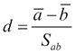

这里，*S[ab]是样本的合并标准差(不是合并标准差)。其计算方式类似于合并标准误差:*

```
(defn pooled-standard-deviation [a b]

  (i/sqrt (+ (i/sq (standard-deviation a))

             (i/sq (standard-deviation b)))))
```

因此，我们可以计算第 6 页的 Cohen d，如下所示:

```
(defn ex-2-28 []

  (let [data (load-data "multiple-sites.tsv")

        a (->> (i/$where {:site {:$eq 0}} data)

               (i/$ :dwell-time))

        b (->> (i/$where {:site {:$eq 6}} data)

               (i/$ :dwell-time))]

    (/ (- (s/mean b)

          (s/mean a))

       (pooled-standard-deviation a b))))

;; 0.389
```

与*p*-值相比，科恩的 d 值没有绝对的阈值。一个效应是否可以被认为是大的部分取决于环境，但它确实提供了一个有用的、标准化的效应大小的测量方法。高于 0.5 的值通常被认为很大，因此 0.38 是中等效果。这无疑意味着我们网站的停留时间有了有意义的增长，当然也值得为网站升级付出努力。


# 总结

在这一章中，我们已经了解了描述性统计和推断性统计之间的区别。我们再次看到了正态分布和中心极限定理的重要性，并学习了如何用*z*-检验、*t*-检验和*F*-检验来量化总体差异。

我们已经了解了推断统计技术如何分析样本本身，从而对被抽样的总体做出判断。我们已经看到了各种各样的技术——置信区间、自举和显著性检验——可以洞察潜在的总体参数。通过用 ClojureScript 模拟重复测试，我们还深入了解了多重比较的显著性测试的难度，并看到了 *F* 测试如何试图解决问题并在 I 型和 II 型错误之间取得平衡。

在下一章，我们将把我们学到的关于方差和 *F* 的经验应用到单个样本的测试中。我们将介绍回归分析技术，并用它来寻找奥林匹克运动员样本中变量之间的相关性。*