# 二、Comet 中的探索性数据分析

要成功开展数据科学项目，我们必须首先尝试理解数据，并问自己正确的问题。**探索性数据分析** ( **EDA** )恰恰是这个初级阶段，让你从数据中提取重要信息，了解数据能回答哪些问题，不能回答哪些问题。因此，数据科学项目应该始终包括 EDA 阶段。

实现 EDA 的工具有好几种，有些需要特定的编程技巧，比如 Python 和 JavaScript 提供的很多可视化库，有些则不需要，比如 Tableau 和 Weka。

正如在前一章中已经看到的，Comet 是一个实验平台，几乎可以在数据科学项目生命周期的所有阶段使用。在本章中，我们将看到如何使用 Comet 来执行 EDA。Comet 提供了我们可以用来执行 EDA 的不同特性，包括面板、报告和度量日志。我们还将通过提供一般概念和实际例子来描述这三个特性。

在本章中，我们将采用以下术语:

*   **数据集**或**数据**——我们想要分析的所有数据。我们将使用包含行和列的表格数据集。
*   **特征**–列的子集，通常用作机器学习模型的输入。
*   **Target**–列的子集，通常用作机器学习模型的输出。
*   **记录**–包含特征和目标的一行。
*   **变量**–一列。

在本章中，我们将关注以下主题:

*   EDA 简介
*   探索 EDA 技术
*   将 Comet 用于 EDA

您可以从本书的官方 GitHub 资源库下载本章中描述的示例的完整代码，可以从以下链接获得:[https://GitHub . com/packt publishing/Comet-for-Data-Science/tree/main/02](https://github.com/PacktPublishing/Comet-for-Data-Science/tree/main/02)。

在继续讨论如何使用 Comet for EDA 之前，让我们安装运行本章包含的代码和实验所需的所有 Python 包。

# 技术要求

我们将使用 Python 3.8 运行本章中的所有实验和代码。可以从官网下载:[https://www.python.org/downloads/](https://www.python.org/downloads/)——一定要选择 3.8 版本。

本章中描述的示例使用了以下 Python 包:

*   `comet-ml 3.23.0`
*   `matplotlib 3.4.3`
*   `numpy 1.19.5`
*   `pandas 1.3.4`
*   `scikit-learn 1.0`
*   `pandas-profiling 3.1.0`
*   `seaborn 0.11.2`
*   `sweetviz 2.1.3`

我们已经在 [*第一章*](B17530_01_ePub.xhtml#_idTextAnchor015)*Comet 概述*中描述了前五个包以及如何安装。因此，请参阅该章节，了解安装的更多详细信息。在本节中，我们描述最后两个包:`pandas-profiling`和`seaborn`。

## 熊猫简介

是一个 Python 包，可以生成关于熊猫数据帧的可视化和定量的报告。这个包的官方文档可以从下面的链接获得:[https://pandas-profiling.ydata.ai/docs/master/index.xhtml](https://pandas-profiling.ydata.ai/docs/master/index.xhtml)。您可以通过在终端中运行以下命令来安装 Pandas Profiling 软件包:

```
pip install pandas-profiling
```

## 海风

seaborn 是一个有用的数据可视化软件包。完全兼容`Matplotlib`。您可以通过在终端中运行以下命令来安装它:

```
pip install seaborn
```

更多细节，可以参考`seaborn`官方文档，可从以下链接获得:[https://seaborn.pydata.org/installing.xhtml](https://seaborn.pydata.org/installing.xhtml)。

## 甜菜根

sweetviz 是一个 Python 包，它从一个 Pandas 数据帧开始，为 EDA 生成自动报告。您可以通过运行以下命令来安装它:

```
pip istall sweetviz
```

更多细节，可以参考`sweetviz`官方文档，可从以下链接获得:[https://github.com/fbdesignpro/sweetviz](https://github.com/fbdesignpro/sweetviz)。

既然您已经安装了本章中需要的所有软件，让我们继续学习如何使用 Comet for EDA，从回顾 EDA 的一些基本概念开始。

# EDA 简介

**探索性数据分析** ( **EDA** )是数据科学项目生命周期中的预备步骤之一。它使我们能够理解我们的数据，以便从中提取有意义的信息。通过 EDA，我们可以了解数据中的底层结构。

我们可以将 EDA 阶段视为一个小型的数据科学项目，其中缺少真实的数据分析部分(模型定义和评估)。因此，典型的 EDA 过程由下图所示的步骤组成:

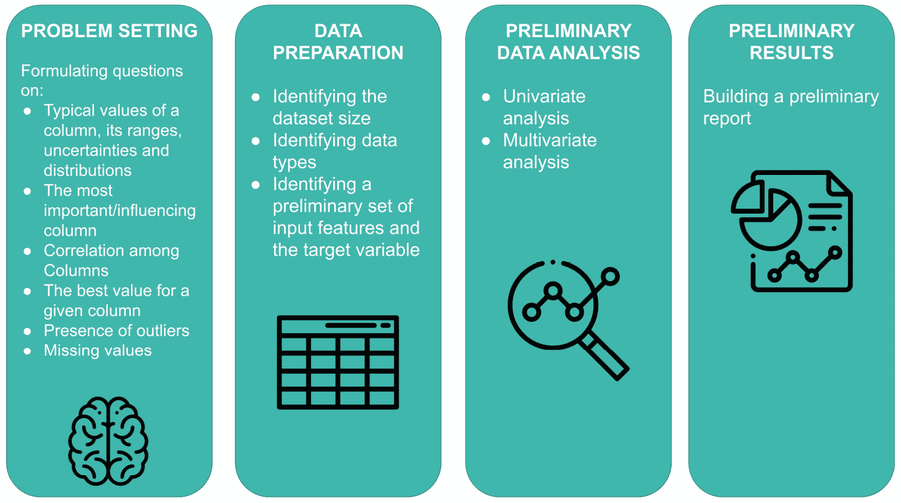

图 2.1–EDA 流程的主要步骤

上图显示 EDA 流程由以下步骤组成:

*   **问题设置**
*   **数据准备**
*   **初步数据分析**
*   **初步结果**

让我们从第一步——问题设置开始，分别研究每一步。

## 问题设置

问题设置是定义我们的数据集可以回答哪种问题的能力。问题设置阶段与数据科学项目生命周期的第一步(问题理解)密切相关，因为它允许我们了解我们的数据集是否能够回答与项目主要目标一致的问题。

一些典型问题包括但不限于以下内容:

*   一列的典型值、范围、不确定性和分布是什么？
*   哪些是最重要/最有影响力的栏目？
*   我们可以在列之间建立关联吗？
*   给定列的最佳值是什么？
*   特定列是否存在一个或多个异常值？
*   对于特定的列，是否有缺失值？

并非所有的问题都与给定的数据集相关，因此我们应该只选择那些符合特定情况的问题。当我们定义了目标问题后，我们应该按照重要性递减的顺序对它们进行排序，从而始终首先关注最重要的问题。

当我们制定了所有可能的问题，我们必须准备我们的数据进行进一步的分析。那么，我们进入下一步，就是数据准备。

## 数据准备

数据准备包括为下一步准备数据集的所有技术。在此阶段，我们定义相关的数据集并删除其他数据集，以及清理和转换选定的数据集。换句话说，在这个阶段，我们构建数据，以便在初步数据分析中使用。

该阶段包括以下步骤:

*   **确定数据集大小**–在这个阶段，我们应该确定记录的数量是否足以解决我们的问题。根据样本的数量，我们可以在接下来的步骤中采用不同的策略。例如，少量样本可能需要额外的数据收集，而如果我们有一个大数据集，我们可以考虑使用更复杂的平台进行进一步分析。
*   **识别数据类型**–有以下几种数据类型:
    *   **数值型**–可以量化的一列。数字列可以是离散的，也可以是连续的。离散列是可数的，而连续列是可测的。
    *   **分类**–只能采用有限数量的值的列。
    *   **序数**–可以排序的数字列。
*   **确定一组初步的输入特征和目标变量**(或目标变量)–根据要解决的问题，我们应该定义数据集的哪些列将用作特征，哪些列将用作目标。

一旦我们构建了数据(通常是表格形式)，我们就可以进入下一步，即初步数据分析。

## 初步数据分析

初步数据分析旨在剖析数据以发现隐藏的模式、数据和任何重复出现的趋势之间的关系、提取重要的变量、检测异常值和异常值，等等。通过我们的初步分析，我们可以为之前提出的问题提供一个初步的答案。

我们可以执行两种类型的初步数据分析:

*   **单变量分析**——当我们一次只关注单个变量时。通常，我们会计算关于每一列的统计数据，例如最小值、最大值和平均值，以及数据分布、最频繁出现的值等等。
*   **多变量分析**——当我们一次关注多个变量时。通常，我们计算变量之间的相关性。

在这两种情况下，我们都可以使用**假设检验**来验证数据是否满足某个假设。

我们可以通过视觉和非视觉的不同技术进行初步的数据分析。我们将在本章的下一节更详细地描述它们。

当我们完成了初步的数据分析阶段，我们可以进入最后一步:初步结果。

## 初步结果

在这个阶段，我们对数据得出第个结论，确定哪些数据项与我们的问题相关，并丢弃其余的。为了确认我们的决策，我们可以选择一些我们在前一阶段制作的图表或统计数据。如果有些地方不清楚，或者我们对所提供的答案仍有疑问，我们可以回到前面的步骤，尝试回答这些问题。

通常，这一阶段的输出是一个**初步报告**，它激励我们的选择，并包括一些统计数据和图表。

我们可能会试图将整个 EDA 过程与总结混淆起来。实际上，汇总是一种相当被动的操作，试图减少数字数据。另一方面，EDA 是一个主动的过程，它试图理解数据中包含的信息。

现在我们已经描述了 EDA 过程的概况，我们可以更详细地研究主要的 EDA 技术。

# 探索 EDA 技术

我们可以通过不同的技术实现 EDA。在这一章中，我们重点介绍两种技术:

*   **非可视化 EDA**–我们计算一些统计数据或指标，从数据中提取洞察力。
*   **可视化 EDA**–我们使用图从数据中提取洞察力。

通过 Python 中的一个实际例子，您将看到这两种技术背后的主要概念。

本节组织如下:

*   加载并准备数据集。
*   非可视化 EDA。
*   可视化 EDA。

让我们从第一步开始:加载和准备数据集。

## 加载和准备数据集

让我们考虑在 https://www.kaggle.com/jessemostipak/hotel-booking-demand?[可用的酒店预订数据集在 CC-BY 4.0 许可下选择=hotel_bookings.csv](https://www.kaggle.com/jessemostipak/hotel-booking-demand?select=hotel_bookings.csv) 。让我们按如下方式进行:

1.  首先，我们导入我们将在这个例子中使用的所有 Python 包:

    ```
    import pandas as pd
    import matplotlib.pyplot as plt
    import seaborn as sns
    from datetime import datetime
    ```

我们将使用`matplotlib`和`seaborn`进行可视化 EDA 和`datetime`对数据进行一些简单的转换。

1.  然后，我们加载数据集作为一个`pandas`数据帧:

    ```
    df = pd.read_csv('hotel_bookings.csv')
    ```

数据集包含 119，390 行和 32 列。下图显示了数据集的一个示例:


图 2.2–酒店预订数据集中的示例记录

上图显示有多个列用于表示日期。

现在，我们对数据集执行以下初步操作:

*   提取与每个记录相关联的月份号。
*   提取每条记录的日期。
*   提取每个记录的季节。

1.  我们希望提取与每条记录相关的月份号，因为`arrival_date_month`列是以字符串的形式提供的。我们构建了一个新的列，它通过定义下面的函数来提取与月份相关的数字:

    ```
    def get_month(x):
        month_name = datetime.strptime(x, "%B")
        return month_name.month
    ```

前面的函数只是使用了`datetime`包提供的`strptime()`函数，返回月份。

1.  我们将前面的函数应用于`arrival_date_month`列，以在数据集中构建一个新列:

    ```
    df['arrival_date_month_number'] = df['arrival_date_month'].apply(lambda x: get_month(x))
    ```

我们使用了 DataFrame 的`apply()`方法来操作该列的每个值。

1.  现在，我们构建一个包含完整日期的新列:

    ```
    df['arrival_date'] = df[['arrival_date_year','arrival_date_month_number','arrival_date_day_of_month']].apply(lambda x: '-'.join(x.dropna().astype(str)), axis=1)
    df['arrival_date'] = pd.to_datetime(df['arrival_date'])
    ```

我们选择了包含到达日期的所有列，并通过`join()`方法将它们合并。然后，我们通过`pandas`包提供的`to_datetime()`函数将构建日期转换成一个`datetime`对象。

1.  最后，我们从日期中提取出季节。我们定义了以下提取季节的函数:

    ```
    def get_season(date):
        md = date.month * 100 + date.day
        if ((md > 320) and (md < 621)):
            return 'spring'
        elif ((md > 620) and (md < 923)):
            return 'summer'
        elif ((md > 922) and (md < 1223)):
            return 'fall'
        else:
            return 'winter'
    ```

前面的函数将日期转换为数字，并计算该数字的范围。

1.  我们将前面的函数应用于到达日期列:

    ```
    df['arrival_season'] = df['arrival_date'].apply(lambda x: get_season(x))
    ```

与前面的案例类似，我们使用了`apply()`方法来提取每条记录的季节。

既然我们已经准备好了数据集，我们就可以执行 EDA 了。先说非可视化 EDA。

## 非可视化 EDA

非可视化 EDA 对给定数据计算一些统计，然后以数字或表格格式呈现输出。我们可以为单变量和多变量分析执行非可视化 EDA。在单变量分析的情况下，我们可以计算描述性统计(对于数值数据)、缺失值、负的和不同的值以及内存大小。在多元分析的情况下，通常我们计算列之间的相关性。

为了说明非可视化 EDA 的最常见技术，您可以使用不同的自动构建报告的包，比如`pandas_profiling`和`sweetviz`。为了在`pandas_profiling`中构建报告，我们可以运行下面的代码:

```
from pandas_profiling import ProfileReport
```

```
profile = ProfileReport(df, title="Hotel Booking EDA")
```

```
profile.to_file("hotel_bookings_eda.xhtml")
```

首先，我们通过传递熊猫数据帧作为输入创建了一个`ProfileReport()`对象。然后，我们将生成的报告保存为外部 HTML 文件。生成的报告分为以下几个部分:

*   概观
*   变量
*   相互作用
*   相关
*   缺少值
*   样品
*   重复行

**概述**部分包含数据集的摘要，如下图所示:

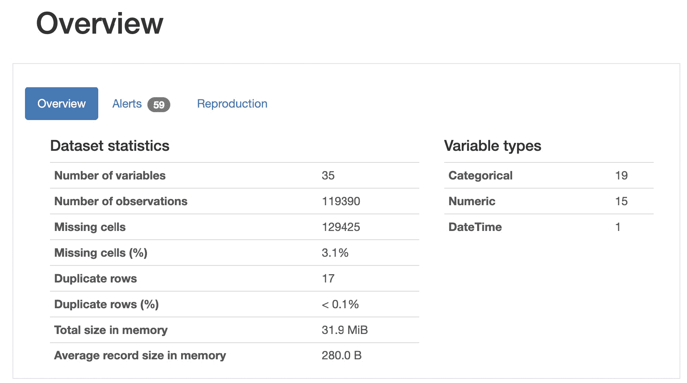

图 2.3-熊猫概况软件包生成的报告的第一部分

该报告包含整个数据集的信息，包括变量数量、观察值、缺失单元格、重复行、内存中的总大小以及变量类型。

此外，摘要还包含不同列之间的基数和相关性信息，如下图所示:


图 2.4-数据集中不同列之间的相关性总结

我们注意到一些列，比如`country`和`reservation_status_date`，有很高的基数。

关于**变量**部分，我们可以区分分类数据和数字数据。对于分类数据，报告提供了许多详细信息，如下图所示:


图 2.5-分类数据的信息

例如，报告显示了不同和缺失值的详细信息，如以及标签的最小、中间和最大长度。

对于数值变量，报告提供了附加信息，如下图所示:


图 2.6-为数字数据提供的信息

例如，报告显示数据的各种统计数据，包括最小值、最大值、百分位数、标准偏差、平均值、偏斜度等。与分类数据类似，报告也显示不同的和缺失的值。

报告的其他部分以图表的形式显示信息；因此，我们可以将它们视为可视化 EDA 的一部分。

作为`pandas-profiling`的替代，可以使用`sweetviz`。要在`sweetviz`中构建一个报告，您可以运行下面的代码:

```
import sweetviz as sv
```

```
report = sv.analyze(df)
```

```
report.show_html('report.xhtml')
```

我们使用由`sweetviz`库提供的`analyze()`函数，然后我们将生成的报告保存为一个 HTML 文件。

`sweetviz`库生成类似于那些已经为`pandas-profiling`描述的结果。

现在我们已经回顾了一些非可视化 EDA 的一般概念，我们可以进入下一步:可视化 EDA。

## 可视化 EDA

视觉技术利用人眼的能力，通过简单地观察数据的视觉表现来识别趋势、模式和相关性。我们可以使用不同类型的图表来绘制数据，如折线图、条形图、散点图、面积图、表格图、直方图、棒棒糖图、地图等等。我们可以使用可视化技术进行单变量和多变量分析。

所用的图表类型取决于我们想要回答的问题的性质。在 EDA 阶段，我们不关心图形的美观，因为我们只对回答我们提出的问题感兴趣。美学部分将在叙述性数据阶段进行研究。

让我们从单变量分析和多变量分析这两种情况出发，研究一下可视化 EDA 的主要技术。

### 单变量分析

单变量分析的目标是计算变量的行为，包括每个值的频率及其分布。如果变量是分类的，我们计算每个值的频率；如果变量是数字，我们计算它的分布和其他统计数据，如平均值、中位数等。

我们可以考虑两种类型的单变量分析，一种用于分类变量，另一种用于数值变量。关于分类变量，我们可以绘制以下图表:

*   **计数图**–该对变量的频率进行计数，并以条形图的形式显示。例如，我们可以通过下面的代码构建**到达日期月份**的计数图:

    ```
    colors = sns.color_palette('mako_r')
    sns.countplot(df['arrival_date_month'], palette=colors)
    plt.show()
    ```

在前面的例子中，我们首先通过`seaborn`提供的`color_palette()`函数将调色板设置为`mako_r`。我们注意到`seaborn`库提供了一个名为`countplot()`的函数，该函数自动构建作为输入传递的变量的计数图。下图显示了生成的图形:

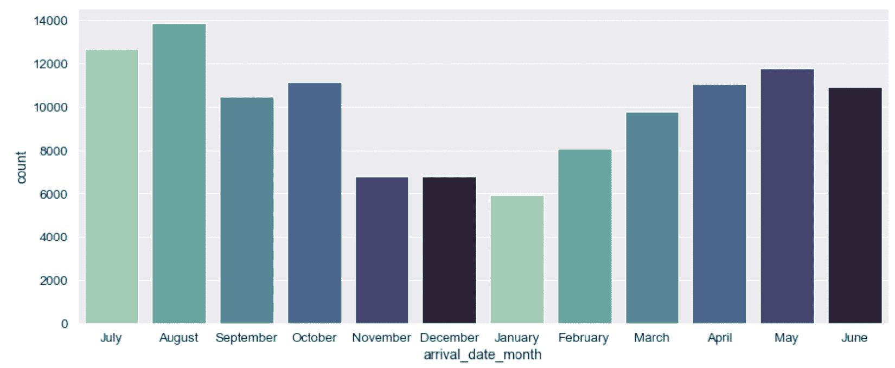

图 2.7–数据集的到达月份日期列的计数图

我们注意到八月是最常见的类别。

*   **饼状图**–这非常类似于计数图，但它也显示了每个类别的百分比。我们可以建立一个**到达月日期**列的饼图，如下:

    ```
    values = df['arrival_date_month'].value_counts()
    values.plot(kind='pie', colors = colors, fontsize=17, autopct='%.2f')
    plt.legend(labels=values.index, loc="best")
    plt.show()
    ```

注意我们用的是熊猫提供的`plot()`函数。下图显示了结果图:

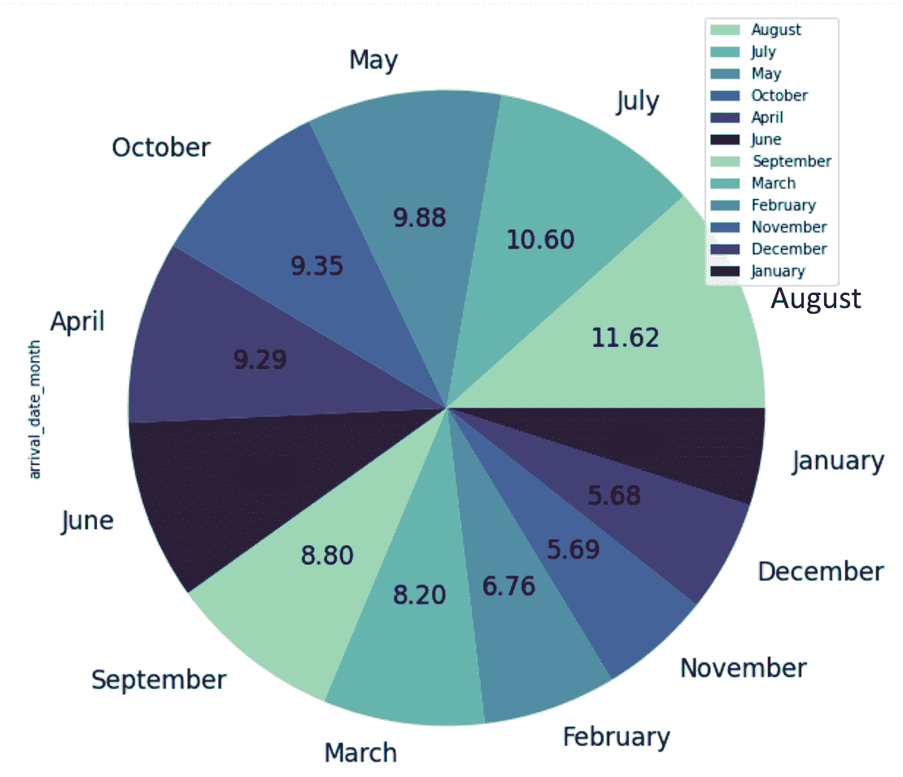

图 2.8–数据集的到达月份日期列的饼图

在上图中，我们还显示了百分比信息。

我们刚刚回顾了单变量分类分析的最常见图形。现在我们可以举例说明单变量数值分析最常见的图形。这种类型的图表包括以下内容:

*   **直方图**–分布图，通常用于表示连续变量。它将所有可能的值分成多个箱，并计算每个箱中有多少个值。我们可以如下构建`stays_in_week_nights`变量的直方图:

    ```
    plt.hist(df['stays_in_week_nights'], bins=50, color='#40B7AD')
    plt.show()
    ```

在前面的代码中，我们使用了`matplotlib`库的`hist()`函数，并将的箱数设置为`50`。下图显示了结果图:


图 2.9–数据集的住宿周夜列的直方图

上图显示几乎所有的值都集中在前 10 个 bin 中。

*   **距离图**——类似于直方图图，但是也显示了**内核密度估计值** ( **KDE** )。我们可以如下构建`stays_in_week_nights`变量的距离图:

    ```
    plt.figure(figsize=(15,6))
    sns.distplot(df['stays_in_week_nights'], color='#40B7AD')
    plt.show()
    ```

我们使用了`seaborn`库的`distplot()`函数。下图显示了结果图:


图 2.10–数据集的住宿周夜列的距离图

上图显示 KDE 是一条连续的线。

*   **箱线图**–显示连续变量的数据分布。箱形图允许您可视化数据的中心和分布。此外，它还可以用来识别可能的异常值。我们可以构建一个`stays_in_week_nights`列的方框图，如下所示:

    ```
    sns.boxplot(df['stays_in_week_nights'], color='#40B7AD')
    plt.show()
    ```

我们使用了由`seaborn`提供的`boxplot()`函数来构建盒子图。下图显示了结果图:

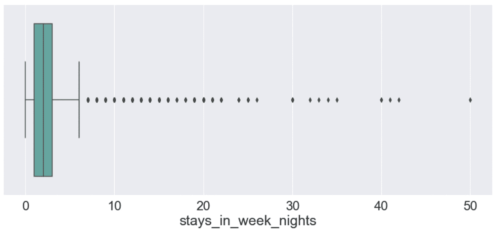

图 2.11–数据集的住宿周夜列的箱线图

上图显示了的平均值(彩色的)，以及其他信息，比如异常值的存在(接近值 50)。

*   **小提琴图**——类似于盒子图，但是它也显示了旋转的内核密度图。我们可以如下构建`stays_in_week_nights`列的小提琴图:

    ```
    sns.violinplot(df['stays_in_week_nights'], color='#40B7AD')
    plt.show()
    ```

我们使用了由`seaborn`库提供的`violinplot()`函数。下图显示了结果图:

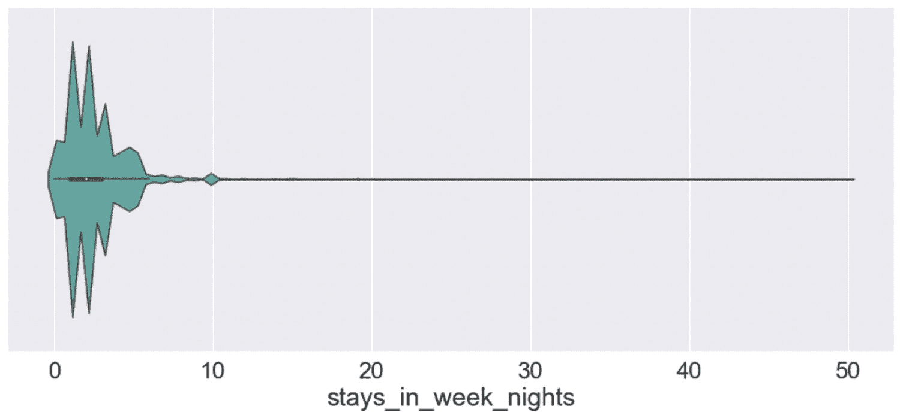

图 2.12-数据集的住宿周夜列的小提琴图

上图是箱线图和距离图的组合。

我们可以使用之前描述的所有图表进行单变量分析。现在让我们看看哪些类型的可视化可以用于多变量分析。

### 多变量分析

多变量分析一次考虑多个变量。在本章中，我们一次只关注两个变量(**双变量分析**)，但是我们也可以通过降维技术或使用图表提供的样式选项来计算更多变量的多变量分析。

双变量分析有三种类型:

*   **数值到数值**
*   **分类对分类**
*   **数值到分类**

让我们分别分析每种类型提供的图形，从第一种开始:数值到数值。

#### 数值对数值分析

在数值对数值的双变量分析中，我们可以绘制一个**散点图**来显示两个变量之间的关系。下面这段代码显示了如何在`seaborn`中构建散点图:

```
sns.scatterplot(df['adults'], df['stays_in_week_nights'],color='#40B7AD')
```

```
plt.show()
```

我们使用`scatterplot()`函数来用表示 *x* 轴上的**成年人**列和 *y* 轴上的**逗留 _ 周 _ 夜**。下图显示了结果图:

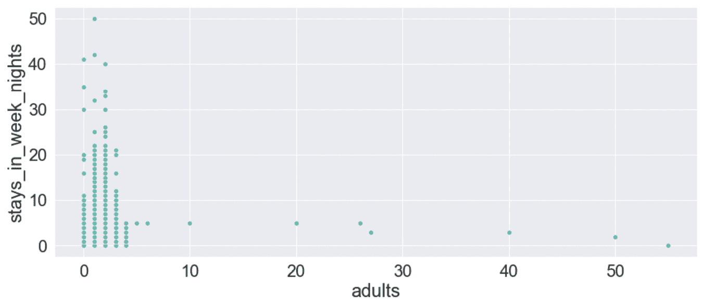

图 2.13–成人与周内住宿天数的散点图

上图显示了**停留 _ 周 _ 夜**和**成人**变量之间的相关性。

#### 类别间分析

在分类到分类的双变量分析中，最常见的图形是**热图**，它通过颜色绘制两个变量之间的相关性。我们可以绘制如下热图:

```
sns.heatmap(pd.crosstab(df['customer_type'], df['arrival_date_month']), cmap='mako_r')
```

```
plt.show()
```

前一段代码绘制了两个分类变量的热图，`customer_type`和`arrival_date_month`。此外，它使用`pandas`库提供的`crosstab()`函数来构建要绘制的矩阵。下图显示了结果图:

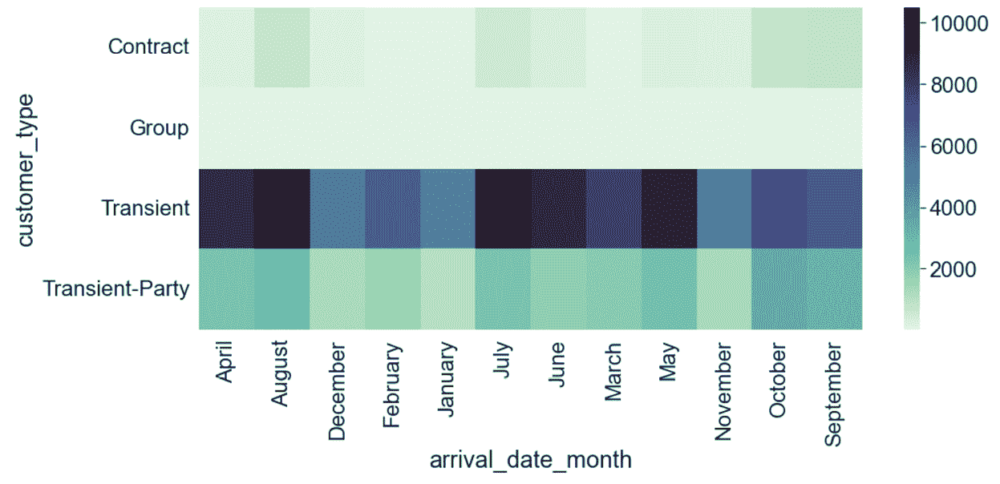

图 2.14–客户类型和到达日期月份的热图

上图显示了不同梯度的类别标签之间的关系。关系越牢固，颜色越深。

#### 数类分析

在数量-类别双变量分析中，最常见的图是**条形图**，它将类别变量绘制成矩形条，其长度与它们所比较的数值变量成比例。我们可以绘制如下柱状图:

```
sns.barplot(df['adults'], df['arrival_date_month'],color='#40B7AD')
```

```
plt.show()
```

在前面的例子中，我们使用了由`seaborn`提供的`barplot()`函数来绘制关于成年人数量的`arrival_date_month`列。下图显示了结果图:

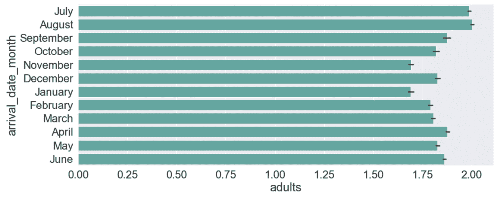

图 2.15-到达日期月份列与成人人数的条形图

我们可以在 EDA 中使用另外两种类型的图表，即地理图和趋势线。我们可以使用地理地图来研究一个变量在地图上的分布，我们可以使用趋势线来了解一个变量在一段时间内的行为。

到目前为止，我们已经回顾了 EDA 背后的一般概念。现在是将它们应用到 Comet 的时候了。那么，让我们进入下一部分:Comet for EDA。

# 使用 Comet 进行 EDA

Comet 提供了以下特性来处理 EDA:

*   **Log**——一种在 Comet 中存储资产、指标和对象的机制
*   **面板**–一个或多个记录对象的可视化表示
*   **报告**–面板的组合

从逻辑的角度来看，首先我们记录所有需要的对象，然后我们构建所有设计好的面板，最后，我们构建一个报告。我们可以在数据科学项目生命周期的所有阶段采用这种策略，例如 EDA 和模型评估。在这一章中，我们将重点介绍如何在 EDA 阶段采用这一策略。

在分别描述单个特性之前，这里有一个实用的技巧，允许您将 Comet 与笔记本文档集成。通常，我们使用笔记本文档(或简称为*笔记本*)来执行 EDA，因为我们可以使用它们来显示代码和文本，运行临时代码等等。Comet 还可以与 Jupyter 笔记本集成，只需在实验结束时添加一行代码:

```
experiment.end()
```

在`end()`方法之后，实验结束。

在调用`end()`方法之前，我们可以通过简单地调用下面的方法在当前笔记本中查看实验结果:

```
experiment.display()
```

我们可以使用`display()`方法直接访问笔记本中的 Comet 仪表板。

现在我们准备分别分析 Comet 提供的每个特性，从第一个特性开始:日志。

## Comet 日志

一个**Comet 日志**是一个在实验中存储东西的对象。在 Comet 中，我们可以记录度量、模型、数字、图像等等。Comet 定义了两种类型的日志:

*   **值**–这种类型的日志包括 Comet 仪表板下可用的指标和其他参数。为了记录一个或多个值，我们可以使用`Experiment`类的以下方法:
    *   `log_metrics()`–记录一个键值对的字典，这些键值对在概念上是度量标准，比如精度、召回率和准确性。我们可以在 Comet 仪表板的**指标**菜单中访问记录的值。
    *   `log_metric()`–记录单个键值对。与前面的方法类似，我们可以在 Comet 仪表板的**指标**菜单中访问记录的值。
    *   `log_parameters()`–记录概念上属于超参数的键值对的字典。我们可以在 Comet 仪表板的**超参数**菜单中访问记录的值。
    *   `log_parameter()`–类似于`log_parameters()`，但是它记录一个键值对。
    *   `log_others()`–记录键值对的字典。这些值可用于跟踪某些已用参数的。我们可以在 Comet 仪表板的**其他**菜单中访问记录的值。
    *   `log_other()`–类似于`log_others()`，但是它记录一个键值对。
    *   `log_html_url()`–记录一个 HTML URI，可以在 Comet 仪表板的 **HTML** 菜单中访问。
    *   `log_text()`–记录一个文本，可以在 Comet 仪表板的**文本**菜单中访问。
*   **文件**–这种类型的日志包括数据集、图形、模型和文件，它们通常可以在**资产&工件**菜单中找到。我们可以在 Comet 中记录不同类型的文件。仅参考 EDS，我们可以使用由`Experiment`类提供的以下方法:
    *   `log_dataframe_profile()`–记录由 pandas profiling 库生成的 pandas 数据帧的摘要
    *   `log_histogram_3d()`–记录三维直方图
    *   `log_html()`–记录一个 HTML 文件
    *   `log_image()`–记录图像
    *   `log_table()`–记录 CSV 文件或熊猫数据帧

在本节中，我们已经描述了由`Experiment`类为日志记录提供的最重要方法的概述。关于它们接收的输入参数的更多细节，你可以参考 Comet 官方文档，可以从这个链接获得:【https://www.comet.ml/docs/python-sdk/Experiment/。

我们已经在 [*第一章*](B17530_01_ePub.xhtml#_idTextAnchor015) 、*Comet 概述*中描述了如何在 Comet 中记录图像和度量。在本节中，我们将描述如何记录一个`pandas-profiling`报告以及相同指标的不同值。

我们将使用我们在上一节中描述的`hotel_booking.csv`数据集:

1.  首先，我们导入这个实验需要的所有包:

    ```
    import pandas as pd
    from comet_ml import Experiment
    ```

我们将使用两个包:`pandas`将原始数据集转换成数据帧，以及`comet_ml`构建 Comet 实验。确保从主仪表板创建一个新项目，如 [*第 1 章*](B17530_01_ePub.xhtml#_idTextAnchor015) *、Comet 概述*所示。

1.  然后，我们创建一个新的实验，如下:

    ```
    experiment = Experiment()
    ```

我们已经创建了`Experiment`对象。注意，要让前面的代码运行，我们应该配置`.comet.config`文件，如 [*第 1 章*](B17530_01_ePub.xhtml#_idTextAnchor015) *，Comet 概述*中所述。

1.  假设我们已经将`hotel_bookings.csv`文件加载为`pandas`数据帧，如前一节所述，并将其存储在名为`df`的变量中。我们可以在 Comet 中记录相关的`pandas`配置文件报告，如下所示:

    ```
    experiment.log_dataframe_profile(df, "hotel_bookings")
    ```

我们使用了`log_dataframe_profile()`方法，该方法生成包含所有所需统计数据的资产。记录过程可能需要一些时间。一些进度条(如下图所示)显示了日志记录过程完成的时间:


图 2.16–由 log_dataframe_profile()方法产生的进度条

上图显示有三个进度条:**汇总数据集**、**生成报表结构**、**渲染 HTML** 。当所有的条都完成时，结果就可以作为 Comet 资产使用了。

1.  现在，我们确保 Comet 已经记录了所有的输出。我们从 Comet 中的实验仪表板访问**资产&工件**菜单项。在**资产**选项卡中，有**数据帧**目录，其中包含我们的原始数据集和记录的概要文件摘要，如下图所示:

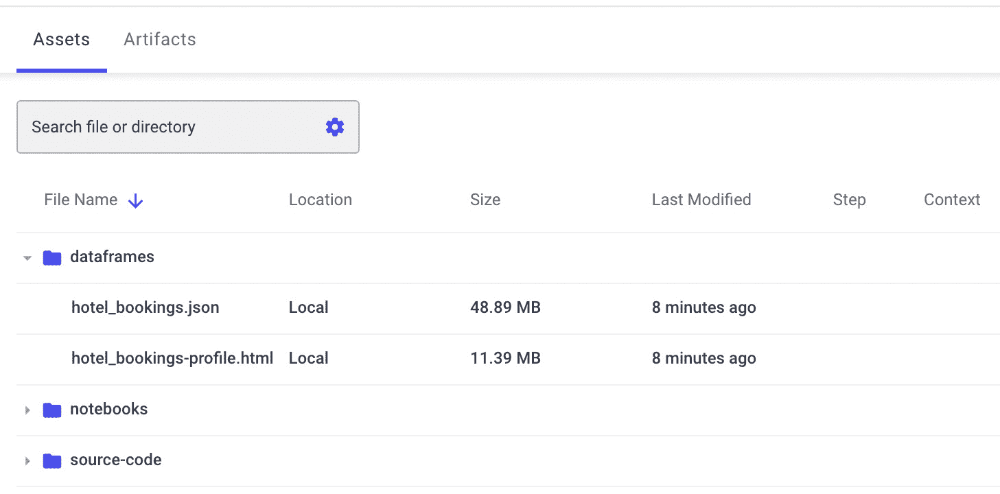

图 2.17–资产选项卡，重点是数据帧目录

原始数据集(`hotel_bookings.json`)作为 JSON 对象提供，而摘要是一个 HTML 文件。我们只需点击文件旁边的按钮，就可以下载或查看这两个文件。现在您已经记录了 pandas profiling 对象，您可以看到如何记录单个指标的多个值:

1.  让我们假设我们想要记录家庭在某些酒店登记入住的时间。为简单起见，我们将至少有两个成年人的记录视为一个家庭，如下:

    ```
    families = df[df['adults'] > 1]
    families.set_index('arrival_date', inplace=True)
    ```

我们假设数据帧`df`包含了`hotel_bookings`数据集。

1.  现在，我们按照`arrival_date`对所有家庭进行分组，并计算每个日期的家庭数量:

    ```
    ts_families = families['adults'].groupby('arrival_date').count()
    ```

我们使用`groupby()`方法按家族对数据集进行分组，使用`count()`方法计算每个组中的记录数。

1.  现在，我们可以通过`Experiment`类的`log_metric()`方法记录`ts_families`值，如下:

    ```
    import time
    import datetime
    for i in ts_families.index:
        index = time.mktime(i.timetuple())
        experiment.log_metric('ts_families', ts_families[i], step=index)
    ```

我们使用了`log_metric()`方法的 step 参数来记录相同指标的不同值。此外，我们将`arrival_date`转换为时间戳，因为`log_metric()`不支持日期。

1.  我们可以在 **Metrics** 菜单项下的 Comet 仪表板中看到记录的指标，如下图所示。

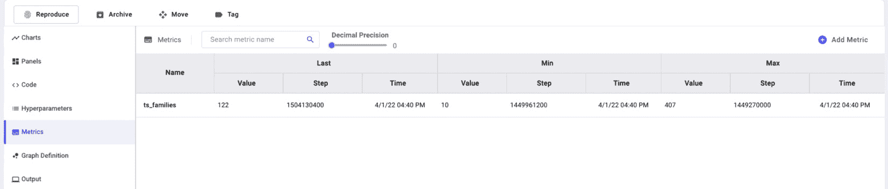

图 2.18–Comet 中记录的指标

Comet 仪表板显示了`ts_families`变量的最后、最小和最大值。

作为`pandas_profiling`库的替代，您可以使用`sweetviz`，它与 Comet 完全集成。要记录一个`sweetviz`报告，您可以简单地运行以下代码:

```
report.log_comet(experiment)
```

`log_comet()`函数接收一个`experiment`对象作为输入。因此，报告保存在 Comet 的 HTML 菜单项下，如下图所示:

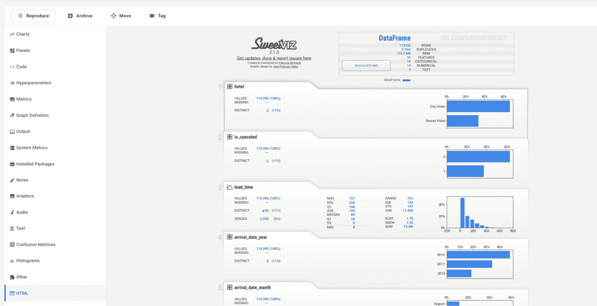

图 2.19–sweet viz 库提供的 log_comet()方法的输出

由`log_comet()`方法生成的 HTML 文件是交互式的，因此您可以浏览它来探索数据集的每一列。

现在您已经熟悉了 Comet 日志，我们可以转到 Comet 为 EDA 提供的下一个特性:面板。

## 面板

我们可以使用 Comet 面板来实现所有的 EDA 技术。我们在上一章介绍了面板的概念: [*第一章*](B17530_01_ePub.xhtml#_idTextAnchor015) ，*Comet 概述*。在这一节中，我们将描述如何在 Comet 中实现定制面板。

我们可以用 Python 或 JavaScript 在 Comet 中创建定制面板。尽管本书的重点主要是 Python 语言，但在本节的最后，我们还将提供一些用 JavaScript 构建定制面板的一般概念。Comet 提供了一个实用的 Python/JavaScript SDK 来直接从在线平台构建定制面板。目前，我们不能离线实现我们的定制面板。

构建自定义面板包括以下四个步骤:

*   访问 SDK
*   检索环境变量
*   构建面板内容
*   在 Comet 中显示面板

让我们分别研究所有的步骤，从第一步开始:环境设置。

### 访问 SDK

SDK 是我们编写代码来构建自定义面板的地方。要访问 Comet SDK，请执行以下操作:

1.  在主仪表盘上，点击**添加** → **新建面板** → **新建**。
2.  一个带有在线 SDK 的新窗口打开，如下图所示:


图 2.20–Comet 中用于构建定制面板的在线 SDK

在窗口的顶部，有一些选项允许我们配置面板名称、大小、首选语言(Python 或 JavaScript)和面板可见性(私有或公共)。窗口的主要部分分为两个部分:左边是编辑器，我们可以在这里编写代码来生成面板，而右边是面板的预览。要查看预览，我们应该单击 run 按钮(编辑器中的绿色三角形)。我们可以通过点击运行按钮旁边的按钮来保存面板。在窗口的底部，有两个按钮用于保存或取消更改。

窗口的编辑器部分由以下四个选项卡组成:

*   **代码**–主代码编辑器。
*   **选项**–选项是作为输入提供给面板的运行时间值。例如，我们可以构建可以在多个项目中使用的通用面板。对于每个项目，我们只需要改变当前的值，但是面板的类型保持不变。我们可以将选项定义为键值对，如下面这段代码所示:

```
{
"key 1" : "value 1",
"key 2" : "value 2",
...
"key N" : "value N"
} 
```

*   **描述**–面板的文本描述，包括名称和图像。
*   **Filters**–选择要包含在面板中的目标，例如仅某些实验或某些指标。

既然您已经学习了如何在 Comet 中设置环境来构建定制面板，那么让我们进入下一步——检索环境变量。

### 检索环境变量

Comet 为提供了`API`类，方便快捷地从 Comet SDK 中访问我们在 Comet 中记录的所有信息。例如，通过 Comet API，我们可以选择所有的实验或者只是一个子集，以及记录的度量、资产、工件、工作区和项目。

为了导入`API`类，我们可以编写以下代码:

```
from comet_ml import API
```

```
api = API()
```

`API`类允许您读取保存在工作区、项目和实验中的所有信息，但是不允许您记录新的值。当`api`对象被创建后，我们可以调用许多方法。其中，最重要的如下:

*   `get()`–返回与当前用户相关的所有工作空间、项目或实验。此方法返回的对象类型取决于作为输入参数传递的粒度级别。例如，`get(MY_WORKSPACE)`返回包含在`MY_WORKSPACE`工作空间中的所有项目，而`get(MY_WORKSPACE, MY_PROJECT)`返回包含在`MY_PROJECT`项目中的所有实验，该项目本身包含在`MY_WORKSPACE`工作空间中。
*   `get_experiment(MY_WORKSPACE, MY_PROJECT, MY_EXPERIMENT_KEY)`–返回特定的实验。实验作为`APIExperiment`类的对象返回，它不同于`Experiment`类，因为它是在 Comet 面板中使用的。有三种方法可以检索实验密钥:
    *   通过`get_Panel_experiment_keys()`方法
    *   通过在创建实验时手动设置实验键，如下:

        ```
        experiment = Experiment(experiment_key = MY_EXPERIMENT_KEY)
        ```

    *   复制运行实验时 Comet 输出返回的值，如下图所示:

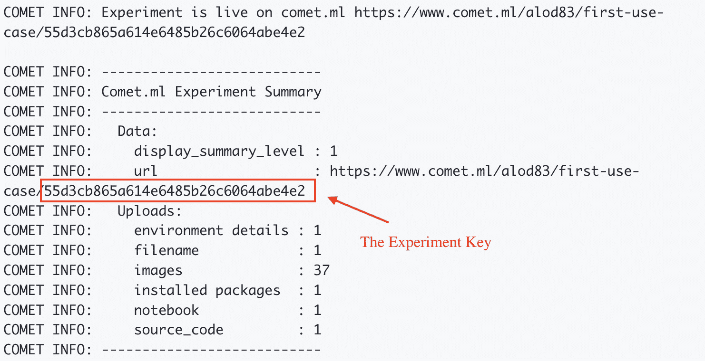

图 2.21–运行实验时返回的实验密钥

上图中，实验键是`55d3cb865a614e6485b26c6064abe4e2`。

*   `get_panel_options()`–返回在 SDK 的**选项**选项卡中作为输入提供的选项。这个方法以 Python 字典的形式返回选项。
*   `get_experiment_*()`–访问实验中记录的所有信息的方法集合。`*`必须替换为下列单词之一:`code`、`curves`、`graphs`、`HTML`、`metric`或`images`。例如，要访问实验图，我们可以使用`get_experiment_graphs()`方法，而要访问实验代码，我们可以调用`get_experiment_code()`方法。

要获得由`API`类提供的方法的完整列表，您可以参考 Comet 官方文档，可通过以下链接获得:[https://www.comet.ml/docs/user-interface/python-Panels/API/](https://www.comet.ml/docs/user-interface/python-Panels/API/)。

现在您已经学习了如何访问 Comet 面板中的所有环境变量，让我们分析如何构建面板的内容。

### 构建面板内容

我们可以使用所有的环境变量来构建我们的图表、表格以及其他任何东西。Comet 面板集成了`Matplotlib`和`Plotly`库，以及 Python 图像库。因此，我们可以像往常一样直接在 Comet SDK 中实现我们的图表。

我们将在本章的下一节描述一些实际的例子。

一旦我们实现了面板内容，我们就可以将其导出为定制的 Comet 面板。

### 在 Comet 中显示面板

Comet 定义了`ui`子包来构建 Python 中的定制面板。我们只能在 Comet SDK 中使用`ui`子包。首先，我们需要按如下方式导入它:

```
from comet_ml import ui
```

导入后，我们可以使用它的功能在面板中显示对象、图形和文本:

*   `display()`–显示通用对象
*   `display_figure()`–显示图形，例如用`matplotlib`库生成的图形
*   `display_image()`–显示 JPEG、GIF 或 PNG 图像，或者 PIL 图像
*   `display_text()`–显示一些文本
*   `display_markdown()`–显示一些用降价语法编写的文本
*   `dropdown()`–创建一个下拉菜单，将项目列表作为参数传递，返回选定的项目，并触发更改以运行代码
*   `add_css()`/`set_css()`–添加/设置要显示的附加 CSS 样式

我们可以使用和组合前面的函数来构建我们的自定义面板。

既然您已经学习了如何用 Python 构建自定义面板，我们将快速描述如何用 JavaScript 构建自定义面板。

### JavaScript 中的自定义面板

Comet SDK 还允许您用 JavaScript 构建自定义面板。要用 JavaScript 创建自定义面板，请在面板窗口中选择 JavaScript 作为语言。除了上一节中描述的选项卡，JavaScript 编辑器的选项卡菜单还包含以下附加选项卡:

*   **HTML**–用于 HTML 容器。
*   **CSS**–用于样式。
*   **资源**–导入新的库或 CSS 样式表。任何额外的资源都需要以 URL 的形式提供。

JavaScript SDK 将`Comet.Panel`类定义为构建面板的起点。`Comet.Panel`类定义了以下方法:

*   `draw()`/`drawOne()`–绘制一个或多个实验
*   `print()`–在面板中打印一些文本
*   `getOption()`–获得一个选项
*   `clear()`–清除所有打印对象
*   `select()`–创建一个 HTML 选择小部件

关于由`Comet.Panel`类定义的方法的更多细节，您可以参考 Comet 官方文档，可以通过以下链接获得:[https://www.comet.ml/docs/javascript-sdk/getting-started/](https://www.comet.ml/docs/javascript-sdk/getting-started/)。

`Comet.Panel`类还通过`this.api`变量定义了 Comet 工作区、项目和实验的接口，该变量是 JavaScript `API`类的接口。类似于 Python 中定义的`API`类，JavaScript `API`类提供了访问指标、图像、代码、图表等的方法。我们可以使用`experiment*()`方法，其中`*`必须替换为以下关键字之一:`Code`、`HTML`、`Images`、`Graph`或`Metric`。例如，要获得一个给定的指标，我们应该使用`experimentMetric()`方法。关于 JavaScript API 的更多细节，你可以参考官方的 Comet 文档，链接如下:[https://www.comet.ml/docs/javascript-sdk/api/](https://www.comet.ml/docs/javascript-sdk/api/)。

为了构建一个定制面板，我们需要扩展`Comet.Panel`类，如下所示:

```
class MyPanel extends Comet.Panel {
  ...
}
```

如果我们想访问在**选项**选项卡中定义的选项，我们可以使用`this.options`变量。通常，我们在`setup()`方法中定义这个变量的一些默认值，然后在运行时，JavaScript SDK 会用在**选项**选项卡中设置的实际值替换它们。

在 JavaScript 面板中，我们可以使用我们喜欢的所有 JavaScript 库，包括 Plotly、Highcharts、d3.js、Google Charts 等等。

既然已经学习了如何在 Comet 中构建定制面板，我们可以使用前面章节中的`hotel_bookings.csv`数据集和`ts_families`日志度量来构建一个实际的例子。

### 自定义面板的示例

`log_metric()`方法产生下面的默认图表:


图 2.22–由 log_metric()方法生成的默认图表

我们注意到， *x* 轴不对应日期，而是对应时间戳。因此，在本例中，我们构建了一个将时间戳转换为日期的自定义面板:

1.  首先，我们访问 Comet online SDK 并创建一个新面板。我们确保选择的语言是 Python。然后，在 SDK 编辑器中，我们开始编写代码。我们导入所有需要的库，如下:

    ```
    from comet_ml import API, ui
    import matplotlib.pyplot as plt
    from datetime import datetime
    ```

为了访问 Comet 对象，我们将使用 API，而为了在面板中显示对象，我们将使用`ui`包。

1.  现在，我们按如下方式检索记录的指标:

    ```
    api = API()
    experiment_keys = api.get_Panel_experiment_keys()
    metric = api.get_metrics_for_chart(experiment_keys, ['ts_families'])
    ```

我们使用 API 提供的`get_metrics_for_chart()`方法来检索特定的`ts_families`指标。

1.  之后，我们建立图表，如下:

    ```
    for experiment_key in metrics:
        for metric in metrics[experiment_key]["metrics"]:
            cdate = [datetime.fromtimestamp(x) for x in metric['steps']]
            plt.figure(figsize=(15,6))
            plt.grid()
            plt.xticks(rotation=45)
            plt.ylabel('Number of travelling families')
            plt.xlim(cdate[0], cdate[len(cdate)-1])
            plt.plot(cdate, metric['values'])
    ```

我们循环所有实验(在我们的例子中，只有一个实验)和所有可能的指标(在我们的例子中只有一个),在将包含在`metric['steps']`变量中的时间戳转换为日期后，我们通过调用`display()`函数来绘制图表:

```
ui.display(plt)
```

1.  我们单击 run 按钮，Comet SDK 会生成下图:


图 2.23–自定义面板的输出

我们现在已经将时间戳转换为日期。现在，我们只需点击**Add**|**New Panel**|**Workspace**|**Number of traveling Families**|**Add**，就可以将生成的定制面板添加到我们的项目中。

现在您已经熟悉了定制面板，我们可以继续讨论 Comet 为 EDA 提供的下一个特性:Comet Report。

## Comet 报告

Comet 报告是一个交互式的文档，可以包含文本、面板和实验。Comet 报告与单个项目相关联，我们只需在主仪表板上点击**添加** → **新报告**就可以在 Comet 中创建新报告。下图显示了新创建的空报告的示例:

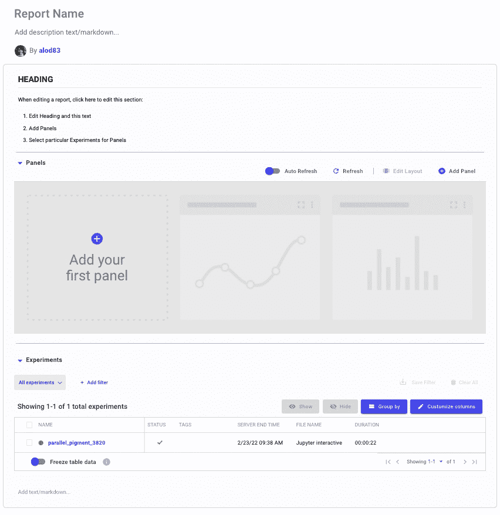

图 2.24–Comet 中的一个空报告

上图显示默认报表分为以下几个部分:

*   标题和描述
*   包含标题、面板和实验的部分

我们可以点击位于默认报告底部的 **Add section here** 按钮来添加其他部分。

一旦我们的报告准备好了，我们可以通过点击**保存**按钮来保存它。我们也可以通过点击**预览**按钮来查看报告的预览。我们可以通过复制主报告页面上的链接来共享报告。

现在，让我们看一个实际的例子来说明如何创建一个 Comet 报告。这个例子使用了由`pandas-profiling`包提供的特性来探索`hotel_bookings`数据集。假设我们已经记录了与`hotel_bookings`数据集相关的`pandas-profiling`包的输出。因此，我们可以继续构建报告。

在项目主控制面板中，我们执行以下步骤:

1.  点击**新建** → **新建报告**。
2.  点击**报告名称**定制名称——例如，我们可以将糖尿病数据集的报告命名为 EDA。或者，您也可以添加描述。
3.  点击**部分的**框突出显示标题，然后输入一些文本，或者也可以删除默认文本。
4.  点击名为**的区域，添加你的第一个面板**。面板窗口打开。
5.  在搜索框中，输入文本`HTML`，点击**添加**按钮，选择 **HTML 资产浏览器**，如下图所示:


图 2.25–如何在 Comet 面板窗口中选择 HTML 资产查看器

1.  Comet SDK 打开时带有 HTML 资产查看器的预览。我们点击**完成**按钮。面板被添加到报告中，但它很小。
2.  要放大面板，点击**编辑布局**并拖动面板覆盖整个屏幕宽度。然后，点击**完成编辑**按钮。
3.  报告准备好了。最后一步，我们通过点击位于仪表板右上角的**保存**按钮来保存它。

现在我们的报告已经准备好了所有的统计数据。我们可以从主仪表板的**报告**选项卡下访问它。

# 总结

我们刚刚完成了在 Comet 上表演 EDA 的旅程！

在本章中，我们描述了一些关于 EDA 的一般概念，以及主要的 EDA 技术，包括可视化和非可视化 EDA。我们还说明了 EDA 在数据科学项目中的重要性:EDA 允许我们理解我们的数据，正确地表述我们想要解决的问题，并发现隐藏的模式。

在本章的第三部分，我们学习了 Comet 提供了哪些特性来执行 EDA，以及我们如何通过一个实际的例子来使用它们。我们通过一个实例说明了日志、定制面板和报告的概念。

在本章中，您了解了使用 Comet 运行 EDA 是多么容易，因为 Comet 提供了非常直观的特性，可以将这些特性组合在一起为 EDA 构建精彩的报告。

现在，您已经学习了如何在 Comet 中执行 EDA，我们可以继续探索 Comet for data science 的旅程。

在下一章，我们将回顾一些与模型评估相关的概念，以及如何在 Comet 中执行它。

# 延伸阅读

*   Meier，M .，Baldwin，d .和 Strachnyi，K. (2021 年)。*掌握 Tableau 2021* 。帕克特出版有限公司
*   Mukhiya，S. K .和 Ahmed，U. (2020 年)。*用 Python 实践探索性数据分析:执行 EDA 技术来理解、总结和调查您的数据*。帕克特出版有限公司
*   Swamynathan，M. (2019)。*用 Python 六步掌握机器学习:使用 Python 预测性数据分析实用实施指南*。阿普瑞斯。