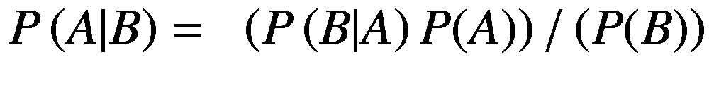
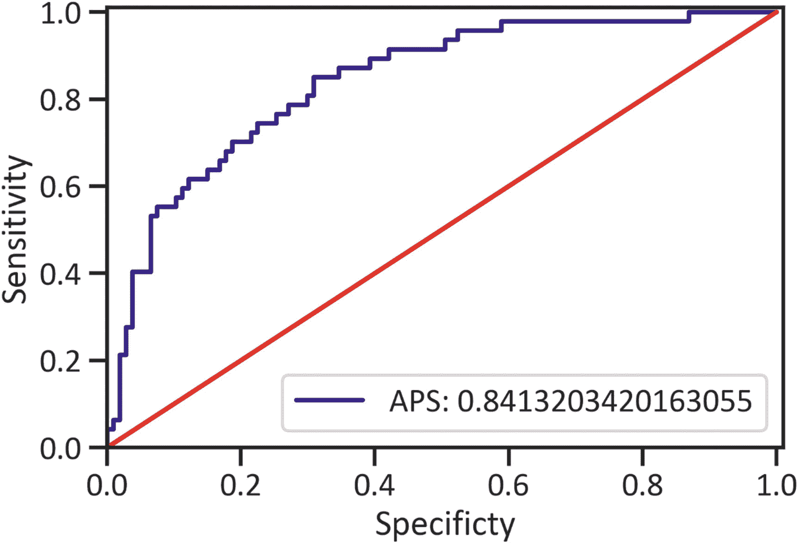
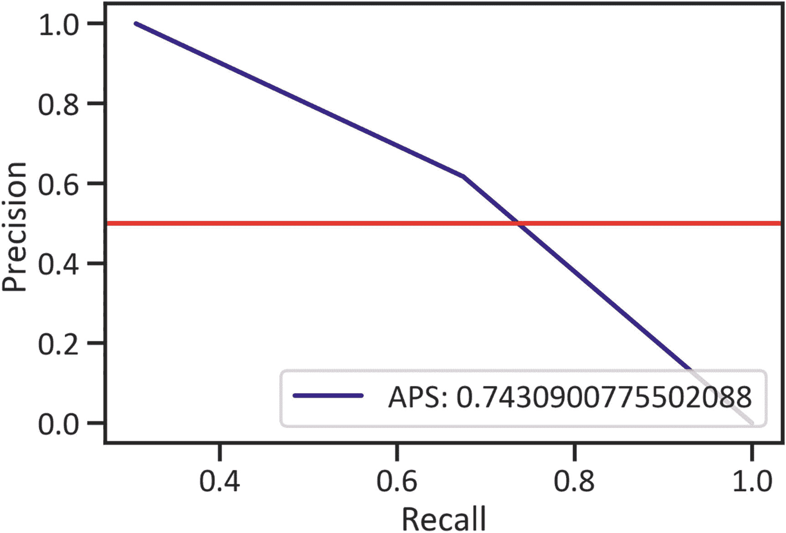
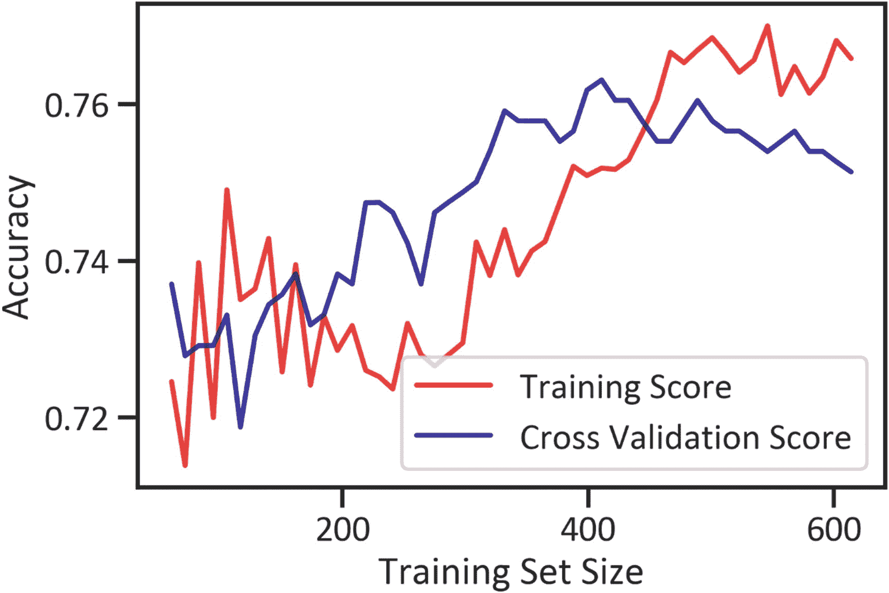

# 九、回归经典

我们现在将介绍一种最古老的分类方法；朴素贝叶斯是 18 世纪早期的模型。这是一个监督学习模型，解决二进制和多类分类问题。*天真*这个词来源于模型对数据的假设。我们认为它是天真的，因为它假设变量是相互独立的，这意味着不依赖于数据。这在现实世界中很少发生。我们可以把朴素贝叶斯定理简化为方程 9-1。



(Equation 9-1)

这里是在知道事件 B 已经发生的情况下，事件 A 发生的概率。

本章涵盖高斯朴素贝叶斯。它假设自变量是二进制的。然而，我们可以放宽假设，以适应遵循正态分布的连续变量。此外，它是内存高效和快速的，因为我们不执行超参数调整；它没有可调的超参数。贝叶斯模型是概率家族的一部分。要理解该模型，请熟悉朴素贝叶斯。

## 朴素贝叶斯定理

在处理连续自变量时，使用 GaussianNB 分类器。如果你有处理连续变量的背景，建模相对容易。关于高斯分布(也称为*正态分布*)的概述，请参考本书的第一章。我们提到过，当数据点接近实际平均值时，数据遵循正态分布。GaussianNB 分类器估计某个变量属于某个类别的概率；同时，它估计中心值，换句话说，平均值或标准偏差值。最适合高维特征。我们最多在训练集很小的时候使用这个分类器。分类器使用高斯概率密度函数来估计独立变量的新值的概率。

## 开发高斯朴素贝叶斯分类器

GaussianNB 分类器不需要超参数优化。同样，我们从 Kaggle 获得了数据。 <sup>[1](#Fn1)</sup> 列表 [9-1](#PC1) 完成高斯分类器。

```py
from sklearn.naive_bayes import GaussianNB
gnb = GaussianNB()
gnb.fit(x_train,y_train)

Listing 9-1Finalize the GaussianNB Classifier

```

清单 [9-2](#PC2) 返回一个突出显示实际类和预测类的表(参见表 [9-1](#Tab1) )。

表 9-1

实际值和预测值

<colgroup><col class="tcol1 align-left"> <col class="tcol2 align-left"> <col class="tcol3 align-left"></colgroup> 
|   | 

实际的

 | 

预测

 |
| --- | --- | --- |
| **661** | one | one |
| **122** | Zero | Zero |
| **113** | Zero | Zero |
| **14** | one | one |
| **529** | Zero | Zero |
| **...** | ... | ... |
| **第 476 章** | one | Zero |
| **第 482 章** | Zero | Zero |
| **230** | one | Zero |
| **527** | Zero | Zero |
| **380** | Zero | Zero |

```py
y_predgnb = gnb.predict(x_test)
pd.DataFrame({"Actual":y_test, "Predicted":y_predgnb})

Listing 9-2Actual Values and Predicted Values

```

### 评估高斯朴素贝叶斯分类器

为了理解 GaussianNB 分类器的性能，我们必须并排比较实际的类和预测的类。

### 混淆矩阵

列表 [9-3](#PC3) 和表格 [9-2](#Tab2) 生成了一个矩阵，该矩阵突出显示了我们用来估计 GaussianNB 分类器关键性能的值。

表 9-2

混淆矩阵

<colgroup><col class="tcol1 align-left"> <col class="tcol2 align-left"> <col class="tcol3 align-left"></colgroup> 
|   | 

预测:否

 | 

预测:是

 |
| --- | --- | --- |
| **实际:否** | Ninety-three | Fourteen |
| **实际:是** | Eighteen | Twenty-nine |

```py
cmatgnb = pd.DataFrame(metrics.confusion_matrix(y_test,y_predgnb), index=["Actual: No","Actual: Yes"],
                       columns=("Predicted: No","Predicted: Yes"))
cmatgnb

Listing 9-3Confusion Matrix

```

### 分类报告

列表 [9-4](#PC4) 和表格 [9-3](#Tab3) 强调了关键的分类评估指标，如准确度、精确度、召回率等。

表 9-3

分类报告

<colgroup><col class="tcol1 align-left"> <col class="tcol2 align-left"> <col class="tcol3 align-left"> <col class="tcol4 align-left"> <col class="tcol5 align-left"></colgroup> 
|   | 

精确

 | 

召回

 | 

f1-分数

 | 

支持

 |
| --- | --- | --- | --- | --- |
| **0** | 0.837838 | 0.869159 | 0.853211 | 107.000000 |
| **1** | 0.674419 | 0.617021 | 0.644444 | 47.000000 |
| **精度** | 0.792208 | 0.792208 | 0.792208 | 0.792208 |
| **宏平均值** | 0.756128 | 0.743090 | 0.748828 | 154.000000 |
| **加权平均值** | 0.787963 | 0.792208 | 0.789497 | 154.000000 |

```py
creportgnb = pd.DataFrame(metrics.classification_report(y_test,y_predgnb, output_dict=True)).transpose()
creportgnb

Listing 9-4Classification Report

```

表 [9-3](#Tab3) 显示类 0 具有最高的精度分数(0.84)和召回分数(0.87)。总体而言，该模型在 79%的情况下是准确的。

### 受试者工作特征曲线

列表 [9-5](#PC5) 和图 [9-1](#Fig1) 代表不同的阈值，使操作员能够权衡精确度和召回率。阈值介于 0 和 1 之间。



图 9-1

受试者工作特征曲线

```py
y_predgnb_proba = gnb.predict_proba(x_test)[::,1]
fprgnb, tprgnb, _ = metrics.roc_curve(y_test,y_predgnb_proba)
aucgnb = metrics.roc_auc_score(y_test, y_predgnb_proba)
plt.plot(fprgnb, tprgnb, label="auc: "+str(aucgnb), color="navy")
plt.plot([0,1],[0,1],color="red")
plt.xlim([0.00,1.01])
plt.ylim([0.00,1.01])
plt.xlabel("Specificty")
plt.ylabel("Sensitivity")
plt.legend(loc=4)
plt.show()

Listing 9-5ROC Curve

```

图 [9-1](#Fig1) 显示了当特异性在 0 和 0.1 之间时，接近右侧边界的曲线。然而，随着特异性的增加，曲线弯曲并慢慢接近 1。AUC 分数为 0.84。

### 精确召回曲线

分类报告告诉我们，类 0 有大量的数据点(数据是不平衡的)。我们必须更加关注精确度和召回率。列表 [9-6](#PC6) 产生精确召回曲线(见图 [9-2](#Fig2) )。



图 9-2

精确回忆曲线

```py
precisiongnb, recallgnb, thresholdgnb = metrics.precision_recall_curve(y_test,y_predgnb)
apsgnb = metrics.roc_auc_score(y_test,y_predgnb)
plt.plot(precisiongnb, recallgnb, label="aps: "+str(apsgnb),color="navy",alpha=0.8)
plt.axhline(y=0.5,color="red",alpha=0.8)
plt.xlabel("Precision")
plt.ylabel("Recall")
plt.legend(loc=4)
plt.show()

Listing 9-6Precision-Recall Curve

```

精确度分数的平均值为 74%。曲线没有接近最上面的边界。而是平稳减速到 0.8，然后动量下降。

### 学习曲线

列表 [9-7](#PC7) 生成了一条曲线，该曲线描绘了高斯神经网络分类器在学习训练数据时的精度进展(见图 [9-3](#Fig3) )。



图 9-3

学习曲线

```py
trainsizegnb, trainscoregnb, testscoregnb = learning_curve(gnb, x, y, cv=5, n_jobs=5, train_sizes=np.linspace(0.1,1.0,50))
trainscoregnb_mean = np.mean(trainscoregnb,axis=1)
testscoregnb_mean = np.mean(testscoregnb,axis=1)
plt.plot(trainsizegnb,trainscoregnb_mean,color="red", label="Training Score", alpha=0.8)
plt.plot(trainsizegnb,testscoregnb_mean,color="navy", label="Cross Validation Score", alpha=0.8)
plt.xlabel("Training Set Size")
plt.ylabel("Accuracy")
plt.legend(loc=4)
plt.show()

Listing 9-7Learning Curve

```

图 [9-3](#Fig3) 显示高斯神经网络分类器是一个快速学习器。这并不奇怪，因为这个模型没有可调的超参数。与我们在前几章中开发的分类器相比，高斯神经网络在训练过程的开始阶段过拟合较少。与其他学习曲线不同，训练准确度分数在最初的几个训练集中不会崩溃。虽然分类器是一个快速学习器，但它未能达到 80%的准确率。

## 结论

本章讲述了朴素贝叶斯分类器。请记住，还有其他的朴素分类器，如多项式朴素贝叶斯模型和伯努利朴素贝叶斯模型。 <sup>[2](#Fn2)</sup> 它们的用法取决于上下文。

<aside aria-label="Footnotes" class="FootnoteSection" epub:type="footnotes">Footnotes [1](#Fn1_source)

[T2`https://www.kaggle.com/uciml/pima-indians-diabetes-database`](https://www.kaggle.com/uciml/pima-indians-diabetes-database)

  [2](#Fn2_source)

[T2`https://scikit-learn.org/stable/modules/naive_bayes.html`](https://scikit-learn.org/stable/modules/naive_bayes.html)

 </aside>