# 十二、神经网络

本章介绍了机器学习的一个子领域，通常被认为是深度学习。首先，介绍了不同的人工神经网络。第二，我们讨论反向传播和正向传播。第三，呈现不同的激活功能。最后，它使用 SciKit-Learn 软件包构建并测试了一个受限的 Boltzmann 机器和一个多层感知器，然后使用 Keras 软件包构建了深度信念网络。要在 Python 环境中安装 Keras，使用`pip install Keras`，在 conda 环境中使用`conda install -c conda-forge keras`。

人工神经网络是一组相互连接的节点，它跨层使用不同的权重和偏差来检索和处理输入值，直到有一个输出值。一个神经网络由几层配置好的节点组成。隐藏层和输出层中的每个节点都包含自己的分类器。可见层中的节点检索输入值，然后激活。表 [12-1](#Tab1) 强调了几种类型的神经网络及其应用。

表 12-1

神经网络的类型及其应用

<colgroup><col class="tcol1 align-left"> <col class="tcol2 align-left"></colgroup> 
| 

神经网络

 | 

应用

 |
| --- | --- |
| **受限玻尔兹曼机或自动编码器** | 未标记数据、变量提取和模式识别 |
| **递归神经张量网络或递归神经网络** | 文本处理 <sup>[1](#Fn1)</sup> |
| **深度信念网或卷积神经网络** | 图像识别 |
| **递归神经网络** | 语音识别 |
| **多层感知器或深度信念网络** | 分类和时间序列分析 |

## 正向传播

前向传播包括可见层中的节点接收和处理输入值，并将它们传输到后续层中的节点，直到产生输出值。尽管每一层都检索相同的输入值，但它们并不传输相同的值。

## 反向传播

反向传播与正向传播相反。在反向传播中，网络反向估计梯度，并变换前一时期的误差率的权重。这个过程不是内存高效的，并且它还导致模型性能差。

## 价值函数

第[章 1](01.html) 介绍了残差分析，因此理解成本函数应该相对容易。成本函数估计实际值和预测值之间的差异。它调整权重和偏差，直到找到最低值。我们交替使用成本函数和损失函数。

## 梯度

梯度表示成本改变权重和偏差的速率。我们在训练时计算梯度。它已经习惯了。神经网络将前面层的梯度相乘，以找到后面层的梯度。为了优化梯度，我们使用梯度下降。有三种类型的梯度下降方法，即 1)批量梯度下降-估计成本函数对整个训练数据的参数的梯度，2)随机梯度下降-更新每个自变量和因变量的参数，3)小批量梯度下降-应用批量梯度下降和随机梯度下降来执行训练数据的小批量。

## 消失梯度

如果梯度大，我们训练网络就快，如果梯度小，训练就变得慢。最多第一层梯度小，后续层梯度大。传统的机器学习模型学习速度慢，在预测班级时会出现很多错误。人工神经网络通过缩放梯度来填补这一空白。

## 激活功能

激活函数增加了网络的非线性。激活功能可实现反向传播。排除激活函数会将神经网络简化为线性回归模型。下面，我们讨论这些激活函数。还有其他我们可以使用的功能 <sup>[2](#Fn2)</sup> 。

### Sigmoid 激活函数

第 [5](05.html) 章介绍了逻辑函数以及它如何估计值。我们也认识到逻辑功能为乙状结肠活化。它触发 0 和 1 之间的输出值。我们主要使用 sigmoid 激活函数来解决二元分类问题。我们将 sigmoid 函数表示为:

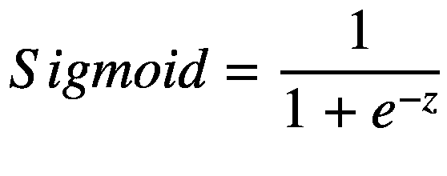

(Equation 12-1)

激活函数前馈仅需要正输出值的神经网络。

### 正切双曲激活函数

正切双曲线(tanh)激活函数扩展了 sigmoid 激活函数。它触发-1 和 1 之间的输出值，并使网络能够将平均值集中到 0。我们将该函数表示为:

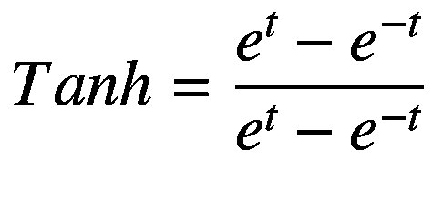

(Equation 12-2)

双曲正切激活将正切双曲线拟合到数据。图 [12-1](#Fig1) 描述了标准的双曲正切函数。

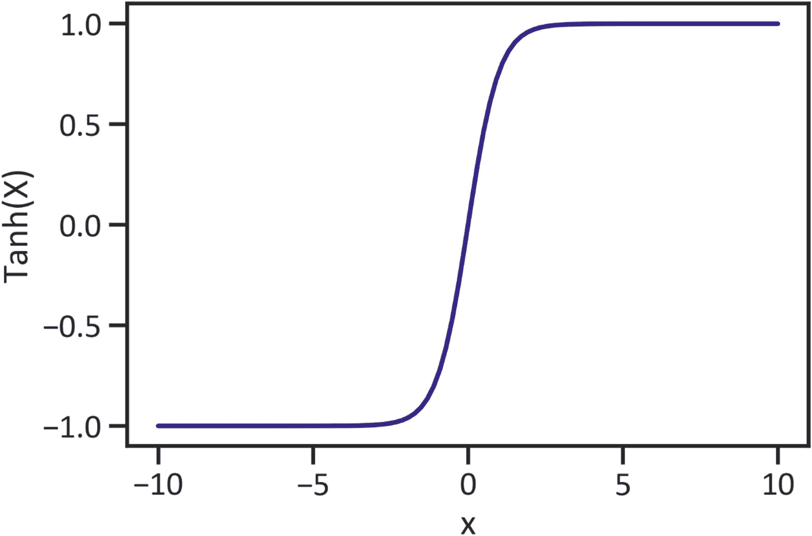

图 12-1

Tanh 函数

请注意，输出值介于-1 和 1 之间，平均值以 0 为中心。

### 整流器线性单元激活功能

ReLU 是 CNN 和多层感知器中默认的激活函数。ReLU 帮助模型学习更快，性能更好。与 sigmoid 和 tanh 激活功能不同，ReLu 激活不会使数据饱和至-1、0 或 1。相反，它会向前移动，直到检索到最佳值。它有助于解决渐变消失的问题。我们将该函数表示为:

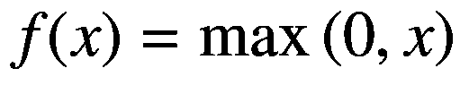

(Equation 12-3)

图 [12-2](#Fig2) 描绘了标准的 ReLu 功能。

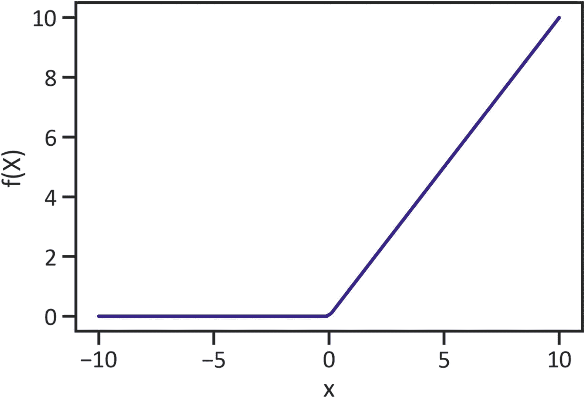

图 12-2

ReLu 函数

请注意，输出值不受特定范围的限制。

### 损失函数

损失是检验模型潜在性能的标准指标。神经网络应用损失函数来确定它是否应该改进每个时期的学习过程。亏损越来越多，说明模特是个有技巧的学习者。连续因变量最常见的损失函数包括均方误差(MSE)、平均绝对误差(MAE)、平均绝对百分比误差(MAPE)和均方对数误差(MSLE)。分类结果的损失函数包括二进制分类的二进制交叉熵和多类分类的分类交叉熵。

## 最优化

模型性能优化有很多方法，比如 SGD、RMSProp、ADAGRAD、Adadelta 和 Adam。本章应用 Adam 优化方法 <sup>[3](#Fn3)</sup> ，因为它在训练期间最小化成本函数方面工作得更好。Adam 代表自适应运动估计。它考虑了动量的先验梯度，降低了学习速率。

## 伯努利限制玻尔兹曼机

我们使用受限玻尔兹曼机(RBM)来解决消失梯度问题。RBM 是一种浅层神经网络，包括可见层和隐藏层。它将可见层中的每个节点连接到隐藏层中的每个节点。此外，它应用权重和偏差来理解变量之间的潜在关系。

图 [12-3](#Fig3) 显示了一个 RBM，在可见层有 3 个节点，在隐藏层有 4 个节点。

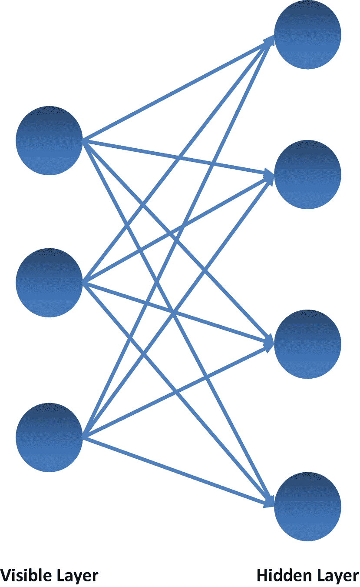

图 12-3

受限玻尔兹曼机

### 训练逻辑分类器

清单 [12-1](#PC1) 训练逻辑分类器。

```py
from sklearn.linear_model import LogisticRegression
logreg = LogisticRegression(dual= False,
                            fit_intercept= True,
                            max_iter= 10,
                            n_jobs= -5,
                            penalty= 'l2',
                            tol=0.0001,
                            warm_start= False)
logreg.fit(x_train, y_train)

Listing 12-1Finalize the Logistic Classifier

```

### 管道

清单 [12-2](#PC2) 为逻辑分类器和 RBM 分类器创建了一个管道。

```py
from sklearn.neural_network import BernoulliRBM
from sklearn.pipeline import Pipeline
rbm = BernoulliRBM()
classifier = Pipeline(steps=[("rbm", rbm), ("logreg", logreg)])
classifier.fit(x_train, y_train)

Listing 12-2Complete the Pipeline

```

表 [12-2](#Tab2) 强调了关键的分类评估指标，如准确度、精确度、召回率等。

表 12-2

分类报告

<colgroup><col class="tcol1 align-left"> <col class="tcol2 align-left"> <col class="tcol3 align-left"> <col class="tcol4 align-left"> <col class="tcol5 align-left"></colgroup> 
|   | 

精确

 | 

召回

 | 

f1-分数

 | 

支持

 |
| --- | --- | --- | --- | --- |
| **0** | 0.829787 | 0.728972 | 0.776119 | 107.000000 |
| **1** | 0.516667 | 0.659574 | 0.579439 | 47.000000 |
| **精度** | 0.707792 | 0.707792 | 0.707792 | 0.707792 |
| **宏平均值** | 0.673227 | 0.694273 | 0.677779 | 154.000000 |
| **加权平均值** | 0.734224 | 0.707792 | 0.716094 | 154.000000 |

```py
y_pred = classifier.predict(x_test)
creportbm = pd.DataFrame(metrics.classification_report(y_test, y_pred, output_dict=True)).transpose()
creportbm

Listing 12-3Classification Report

```

伯努利 RBM 分类器在预测类别时的准确率为 70.78%。准确度分数低于我们在前面章节中讨论的分类器的分数。分类器在预测类 0 时的准确率为 82.98%，在预测类 1 时的准确率为 51.67%。

## 使用 SciKit-Learn 的多层感知器

单个感知器模型最多只能捕获数据的底层结构，导致模型性能不佳。多层感知器(MLP)模型来解决这个问题。它对一组随机值进行训练、加权和阈值设定，然后使用激活函数来估计和控制变化。它包含多层；必须至少有三层，即可见层、隐藏层和输出层。

图 [12-4](#Fig4) 显示 MLP 在可见层有 3 个节点，在隐藏层有 4 个节点，输出层只有一个可能的结果。

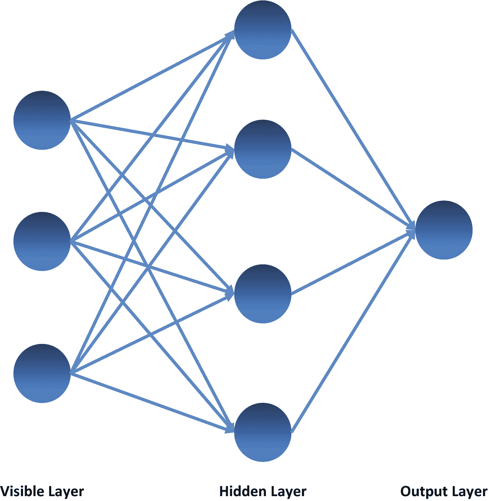

图 12-4

多层感知器

```py
from sklearn.neural_network import MLPClassifier
mlp = MLPClassifier()
mlp.fit(x_train, y_train)

Listing 12-4Finalize the MLP Classifier

```

表 [12-3](#Tab3) 提供了模型的准确度分数、精确度分数、召回率和其他关键评估指标

表 12-3

分类报告

<colgroup><col class="tcol1 align-left"> <col class="tcol2 align-left"> <col class="tcol3 align-left"> <col class="tcol4 align-left"> <col class="tcol5 align-left"></colgroup> 
|   | 

精确

 | 

召回

 | 

f1-分数

 | 

支持

 |
| --- | --- | --- | --- | --- |
| **0** | 0.848214 | 0.887850 | 0.867580 | 107.000000 |
| **1** | 0.714286 | 0.638298 | 0.674157 | 47.000000 |
| **精度** | 0.811688 | 0.811688 | 0.811688 | 0.811688 |
| **宏平均值** | 0.781250 | 0.763074 | 0.770869 | 154.000000 |
| **加权平均值** | 0.807340 | 0.811688 | 0.808548 | 154.000000 |

```py
y_predmlp = mlp.predict(x_test)
creportmlp = pd.DataFrame(metrics.classification_report(y_test, y_predmlp, output_dict=True)).transpose()
creportmlp

Listing 12-5Classification Report

```

与 RBM 分类器相比，MLP 分类器更加准确和精确。

### 比较伯努利 RBM 和 MLP 的 ROC 曲线

图 [12-5](#Fig5) 显示了分类器区分类别的熟练程度。

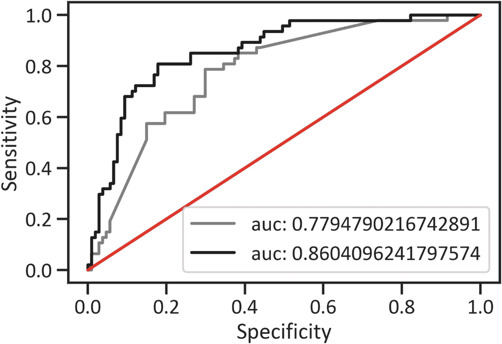

图 12-5

ROC 曲线

```py
y_pred_probarbm = classifier.predict_proba(x_test)[::, 1]
y_pred_probamlp = mlp.predict_proba(x_test)[::, 1]
aucrbm = metrics.roc_auc_score(y_test, y_pred_probarbm)
aucmlp = metrics.roc_auc_score(y_test, y_pred_probamlp)
fprrbm, tprrbm, _ = metrics.roc_curve(y_test, y_pred_probarbm)
fprmlp, tprmlp, _ = metrics.roc_curve(y_test, y_pred_probamlp)
plt.plot(fprrbm, tprrbm, label="auc: "+str(aucrbm), color="gray")
plt.plot(fprmlp, tprmlp, label="auc: "+str(aucmlp), color="black")
plt.plot([0, 1], [0, 1], color="red")
plt.xlabel("Specificity")
plt.ylabel("Sensitivity")
plt.legend(loc=4)
plt.show()

Listing 12-6ROC Curves

```

在图 [12-5](#Fig5) 中，MLP 分类器的曲线用黑色突出显示，伯努利 RBM 分类器的曲线用灰色突出显示。与 MLP 分类器相比，伯努利 RBM 曲线更接近 45 度线。没有一条曲线靠近边界的右侧。它们没有显示出完美的 ROC 曲线的特征。然而，MLP 分类器的 AUC 值为 0.86(大于章节中涵盖的大多数分类器)。同时，伯努利 RBM 分类器的 AUC 分数小于 0.80(小于前面章节中涵盖的所有分类器的分数)。

### 比较伯努利 RBM 和 MLP 精确召回曲线

图 [12-6](#Fig6) 分类器如何在不同阈值之间权衡精确度和召回率。

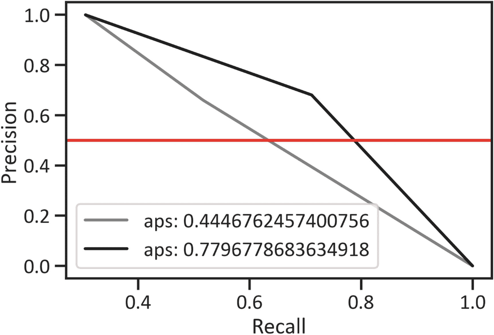

图 12-6

精确召回曲线

```py
precisionrbm, recallrbm, thresholdrbm = metrics.precision_recall_curve(y_test, y_predrbm)
precisionmlp, recallmlp, thresholdmlp = metrics.precision_recall_curve(y_test, y_predmlp)
apsrbm = metrics.average_precision_score(y_test, y_predrbm)
apsmlp = metrics.roc_auc_score(y_test, y_predmlp)
plt.plot(precisionrbm, recallrbm, label="aps: "+str(apsrbm), color="gray")
plt.plot(precisionmlp, recallmlp, label="aps: "+str(apsmlp), color="black")
plt.axhline(y=0.5, color="red")
plt.xlabel("Recall")
plt.ylabel("Precision")
plt.legend(loc=3)
plt.show()

Listing 12-7Precision-Recall Curves

```

所有曲线都不跟随上边框，也不接近右上边框。相反，它们很快达到 1.0 点。平均而言，MLP 分类器比伯努利 RBM 分类器更精确。

## 使用 Keras 的深度信念网络

深度信念网络是多个 RBM 的组合。网络是反向传播的替代方案。其结构类似于 MLP 网络。然而，他们在训练上是不同的；一个 RBM 的隐藏层是另一个 RBM 的可见层。

### 将数据分为训练数据、测试数据和验证数据

以前，我们将数据分为训练数据和测试数据，其中 80%的数据用于训练，20%的数据用于测试。从现在开始，我们分配一定比例的训练数据进行验证。首先，我们使用 80/20 的比例将数据分为训练数据和测试数据。最后，我们进一步分割训练数据，分配 10%的部分用于验证。图 [12-7](#Fig7) 显示了我们如何将数据分成三组。

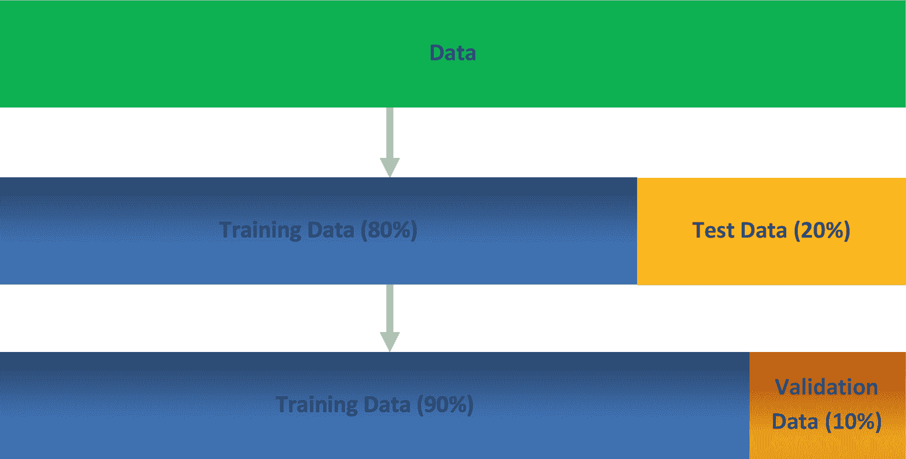

图 12-7

数据分割

我们使用`training_test_split()`方法将数据分成训练数据、测试数据和验证数据。

```py
x_train, x_test, y_train, y_test = train_test_split(x, y, test_size=0.2,random_state=0)
x_train, x_val, y_train, y_val = train_test_split(x_train, y_train,test_size=0.2, random_state=0)
x_train = scaler.fit_transform(x_train)
x_test = scaler.transform(x_test)

Listing 12-8Split the Data into Training Data, Test Data and Validation Data

```

之后，我们导入 Keras 包。

```py
import tensorflow as tf
from keras import Sequential, regularizers
from keras.layers import Dense, Dropout
from keras.wrappers.scikit_learn import KerasClassifier

Listing 12-9Import the Keras Package

```

第一网络包括具有 s 形激活功能的可见层。还有两个 8 神经元的隐藏层和 ReLu 激活函数。

```py
def create_dnn_model1(optimizer="adam"):
    model1 = Sequential()
    model1.add(Dense(8, input_dim=8, activation="sigmoid"))
    model1.add(Dense(8, activation="relu"))
    model1.add(Dense(1, activation="relu"))
    model1.compile(loss="binary_crossentropy", optimizer=optimizer, metrics=["accuracy"])
    return model1

Listing 12-10Build Model 1’s Architecture

```

我们使用`KerasClassifier()`方法包装网络架构。

```py
model1 = KerasClassifier(build_fn=create_dnn_model1)

Listing 12-11Wrap Model 1

```

### 超参数优化

清单 [12-12](#PC12) 找到训练中包含的最佳样本数以及完整的向前和向后传递的次数。

```py
batch_size = [15, 30, 60]
epochs = [16, 32, 64]
param_grid = {"batch_size":batch_size, "epochs": epochs}
grid_model = GridSearchCV(estimator=model1, param_grid=param_grid)
grid_model.fit(x_train, y_train, validation_data=(x_val, y_val))
print("Best scores: ", grid_model.best_score_, "Best parameters: ", grid_model.best_params_)

Listing 12-12Hyperparameter Optimization

```

最佳分数:0.7535971999168396 最佳参数:{'batch_size': 15，' epochs': 64}

我们使用上面的结果来完成模型。

### 最终确定模型

我们使用`fit()`方法来训练模型。

```py
history1 = model1.fit(x_train, y_train, validation_data=(x_val, y_val), batch_size=15, epochs=64)
history1

Listing 12-13Finalize Model 1

```

表 [12-4](#Tab4) 提供了模型的准确度分数、精确度分数、召回率和其他关键评估指标

表 12-4

分类报告

<colgroup><col class="tcol1 align-left"> <col class="tcol2 align-left"> <col class="tcol3 align-left"> <col class="tcol4 align-left"> <col class="tcol5 align-left"></colgroup> 
|   | 

精确

 | 

召回

 | 

f1-分数

 | 

支持

 |
| --- | --- | --- | --- | --- |
| **0** | 0.862069 | 0.934579 | 0.896861 | 107.000000 |
| **1** | 0.815789 | 0.659574 | 0.729412 | 47.000000 |
| **精度** | 0.850649 | 0.850649 | 0.850649 | 0.850649 |
| **宏平均值** | 0.838929 | 0.797077 | 0.813136 | 154.000000 |
| **加权平均值** | 0.847945 | 0.850649 | 0.845756 | 154.000000 |

```py
y_predmodel1 = model1.predict(x_test)
creportmodel1 = pd.DataFrame(metrics.classification_report(y_test,y_predmodel1, output_dict=True)).transpose()
creportmodel1

Listing 12-14Classification Report

```

第一个深度信念网络表现出优越的性能，它比所涉及的任何其他分类器都更准确。

## 正规化

在第二章中，我们介绍了偏差-方差权衡的概念。你可以回头查阅这一章。我们通过使用丢弃法或添加惩罚项来正则化深度信念网络。

### 拒绝传统社会的人

在训练过程中，我们使用 dropout 方法来删除每一层的神经元，以减少过度拟合。网络估计它将丢弃一个层中的神经元的概率。丢失率表示在一个层中丢失的变量的分数。列表 [12-15](#PC15) 第二个深度信念网络，以 0.2 的速率逐层丢弃神经元。

```py
def create_dnn_model2(optimizer="adam"):
    model2 = Sequential()
    model2.add(Dense(8, input_dim=8, activation="sigmoid"))
    model2.add(Dense(8, activation="relu"))
    model2.add(Dropout(0.2))
    model2.add(Dense(1, activation="relu"))
    model2.compile(loss="binary_crossentropy", optimizer=optimizer, metrics=["accuracy"])
    return model2

Listing 12-15Build Model 2’s Architecture

```

清单 [12-16](#PC16) 包装了分类器。

```py
model2 = KerasClassifier(build_fn=create_dnn_model2)

Listing 12-16Wrap Model 2

```

此后，我们完成分类器。

```py
history2 = model2.fit(x_train, y_train, validation_data=(x_val, y_val), batch_size=15, epochs=64)
history2

Listing 12-17Finalize Model 2

```

表 [12-5](#Tab5) 提供了模型的准确度分数、精确度分数、召回率和其他关键评估指标

表 12-5

分类报告

<colgroup><col class="tcol1 align-left"> <col class="tcol2 align-left"> <col class="tcol3 align-left"> <col class="tcol4 align-left"> <col class="tcol5 align-left"></colgroup> 
|   | 

精确

 | 

召回

 | 

f1-分数

 | 

支持

 |
| --- | --- | --- | --- | --- |
| **0** | 0.844828 | 0.915888 | 0.878924 | 107.000000 |
| **1** | 0.763158 | 0.617021 | 0.682353 | 47.000000 |
| **精度** | 0.824675 | 0.824675 | 0.824675 | 0.824675 |
| **宏平均值** | 0.803993 | 0.766455 | 0.780638 | 154.000000 |
| **加权平均值** | 0.819902 | 0.824675 | 0.818931 | 154.000000 |

```py
y_predmodel2 = model2.predict(x_test)
creportmodel2 = pd.DataFrame(metrics.classification_report(y_test,y_predmodel2, output_dict=True)).transpose()
creportmodel2

Listing 12-18Classification Report

```

dropout 方法不能以我们指定的速率提高分类器的性能。然而，该分类器优于前面章节中介绍的分类器。

### L1 正则化

我们使用 L1 正则化将数据集中到它的中心点。这种正则化技术使得弱变量产生等于零的系数。它有助于减少噪音变量，从而优化学习过程。清单 [12-19](#PC19) 第三种深度信念网络的架构。它用 sigmoid 激活函数和α为 0.01 的 L1 罚项来折衷可见层。还有两个带有 ReLu 激活功能的隐藏层。

```py
def create_dnn_model3(optimizer="adam"):
    model3 = Sequential()
    model3.add(Dense(8, input_dim=8, activation="sigmoid", kernel_regularizer=regularizers.l1(0.001), bias_regularizer=regularizers.l1(0.01)))
    model3.add(Dense(8, activation="relu"))
    model3.add(Dense(1, activation="relu"))
    model3.compile(loss="binary_crossentropy", optimizer=optimizer, metrics=["accuracy"])
    return model3

Listing 12-19Build Model 3’s Architecture

```

清单 [12-20](#PC20) 包装了分类器。

```py
model3 = KerasClassifier(build_fn=create_dnn_model3)

Listing 12-20Wrap Model 3

```

此后，我们完成分类器。

```py
history3 = model3.fit(x_train, y_train, validation_data=(x_val, y_val), batch_size=30, epochs=64)
history3

Listing 12-21Finalize Model 3

```

表 [12-6](#Tab6) 提供了模型的准确度分数、精确度分数、召回率和其他关键评估指标。

表 12-7

分类报告

<colgroup><col class="tcol1 align-left"> <col class="tcol2 align-left"> <col class="tcol3 align-left"> <col class="tcol4 align-left"> <col class="tcol5 align-left"></colgroup> 
|   | 

精确

 | 

召回

 | 

f1-分数

 | 

支持

 |
| --- | --- | --- | --- | --- |
| **0** | 0.850877 | 0.906542 | 0.877828 | 107.000000 |
| **1** | 0.750000 | 0.638298 | 0.689655 | 47.000000 |
| **精度** | 0.824675 | 0.824675 | 0.824675 | 0.824675 |
| **宏平均值** | 0.800439 | 0.772420 | 0.783742 | 154.000000 |
| **加权平均值** | 0.820090 | 0.824675 | 0.820399 | 154.000000 |

表 12-6

分类报告

<colgroup><col class="tcol1 align-left"> <col class="tcol2 align-left"> <col class="tcol3 align-left"> <col class="tcol4 align-left"> <col class="tcol5 align-left"></colgroup> 
|   | 

精确

 | 

召回

 | 

f1-分数

 | 

支持

 |
| --- | --- | --- | --- | --- |
| **0** | 0.859649 | 0.915888 | 0.886878 | 107.000000 |
| **1** | 0.775000 | 0.659574 | 0.712644 | 47.000000 |
| **精度** | 0.837662 | 0.837662 | 0.837662 | 0.837662 |
| **宏平均值** | 0.817325 | 0.787731 | 0.799761 | 154.000000 |
| **加权平均值** | 0.833815 | 0.837662 | 0.833702 | 154.000000 |

```py
y_predmodel3 = model3.predict(x_test)
creportmodel3 = pd.DataFrame(metrics.classification_report(y_test,y_predmodel3, output_dict=True)).transpose()
creportmodel3

Listing 12-22Classification Report

```

向分类器添加 L1 惩罚减少了不平衡。但是，这并不能提高准确率。当预测类别 1 时，该分类器比所有分类器更精确。

### L2 正则化

我们将 L2 正则化建立在这样一个前提上，即数据归一化后，系数很小，并且 *k* 的值增加，具有多重共线性的系数会改变它们的行为。这种正则化技术最适合于具有严重相关性的变量。清单 [12-23](#PC23) 构建第四个深度信念网络的架构。它用 sigmoid 激活函数和α为 0.01 的 L2 罚项来折衷可见层。还有两个带有 ReLu 激活功能的隐藏层。

```py
def create_dnn_model4(optimizer="adam"):
    model4 = Sequential()
    model4.add(Dense(8, input_dim=8, activation="sigmoid", kernel_regularizer=regularizers.l2(0.001), bias_regularizer=regularizers.l2(0.001)))
    model4.add(Dense(8, activation="relu"))
    model4.add(Dense(1, activation="relu"))
    model4.compile(loss="binary_crossentropy", optimizer=optimizer, metrics=["accuracy"])
    return model4

Listing 12-23Build Model 4’s Architecture

```

清单 [12-24](#PC24) 包装了分类器。

```py
model4 = KerasClassifier(build_fn=create_dnn_model4)

Listing 12-24Wrap Model 4

```

此后，我们完成分类器。

```py
history4 = model4.fit(x_train, y_train, validation_data=(x_val, y_val), batch_size=30, epochs=64)
history4

Listing 12-25Finalize Model 4

```

表 [12-6](#Tab6) 提供了模型的准确度分数、精确度分数、召回率和其他关键评估指标。

```py
y_predmodel4 = model4.predict(x_test)
creportmodel4 = pd.DataFrame(metrics.classification_report(y_test,y_predmodel4, output_dict=True)).transpose()
creportmodel4

Listing 12-26Classification Report

```

将 L2 惩罚项添加到深度信念网络不会提高准确度分数。当我们仔细比较受惩罚网络的分类报告时，我们注意到增加 L1 惩罚项以牺牲准确性为代价减少了数据的不平衡。

## 比较深度信念网络的 ROC 曲线

图 [12-8](#Fig8) 简明扼要地总结了不同概率阈值的特异性和敏感性之间的权衡(适用于所有模型)。曲线越靠近边界的左侧，空间的顶部边界越精确。

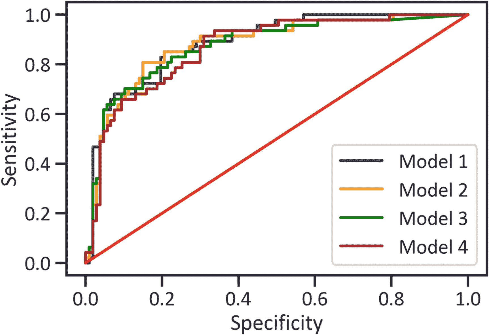

图 12-8

ROC 曲线

```py
y_pred_probamodel1 = model1.predict_proba(x_test)[::,1]
y_pred_probamodel2 =  model2.predict_proba(x_test)[::,1]
y_pred_probamodel3 = model3.predict_proba(x_test)[::,1]
y_pred_probamodel4 = model4.predict_proba(x_test)[::,1]
fprmodel1, tprmodel1, _ = metrics.roc_curve(y_test, y_pred_probamodel1)
fprmodel2, tprmodel2, _ = metrics.roc_curve(y_test, y_pred_probamodel2)
fprmodel3, tprmodel3, _ = metrics.roc_curve(y_test, y_pred_probamodel3)
fprmodel4, tprmodel4, _ = metrics.roc_curve(y_test, y_pred_probamodel4)
plt.plot(fprmodel1, tprmodel1, color="navy", label="Model 1")
plt.plot(fprmodel2, tprmodel2, color="orange", label="Model 2")
plt.plot(fprmodel3, tprmodel3, color="green", label="Model 3")
plt.plot(fprmodel4, tprmodel4, color="brown", label="Model 4")
plt.plot([0, 1], [0, 1], color="red")
plt.xlabel("Specificity")
plt.ylabel("Sensitivity")
plt.legend(loc=4)
plt.show()

Listing 12-27ROC Curves

```

图 [12-8](#Fig8) 显示所有曲线都表现出良好曲线的特征。它们不会沿着边界的左侧移动，也不会到达边界左侧的顶部。虽然曲线很难做到这一点，但它们逐渐接近 45 度线。

```py
aucmodel1 = metrics.roc_auc_score(y_test, y_predmodel1)
aucmodel2 = metrics.roc_auc_score(y_test, y_predmodel2)
aucmodel3 = metrics.roc_auc_score(y_test, y_predmodel3)
aucmodel4 = metrics.roc_auc_score(y_test, y_predmodel4)
aucfinal = [[aucmodel1, aucmodel2, aucmodel3, aucmodel3]]
aucfinaldata = pd.DataFrame(aucfinal, columns = ("Model 1",
                                                 "Model 2",
                                                 "Model 3",
                                                 "Model 4"),
                            index=["AUC Score"]).transpose()
aucfinaldata

Listing 12-28AUC Scores

```

当我们构建 ROC 曲线时，我们对找到 AUC 分数非常感兴趣。表 [12-8](#Tab8) 突出显示了所有网络的 AUC 分数。

表 12-9

APS 分数

<colgroup><col class="tcol1 align-left"> <col class="tcol2 align-left"></colgroup> 
|   | 

APS 分数

 |
| --- | --- |
| **模型 1** | 0.641970 |
| **模型 2** | 0.587768 |
| **模型 3** | 0.615066 |
| **模型 4** | 0.615066 |

表 12-8

深度信念网络的 AUC 分数

<colgroup><col class="tcol1 align-left"> <col class="tcol2 align-left"></colgroup> 
|   | 

AUC 分数

 |
| --- | --- |
| **模型 1** | 0.797077 |
| **模型 2** | 0.766455 |
| **模型 3** | 0.787731 |
| **模型 4** | 0.787731 |

未规范的网络具有最大的 AUC 分数，其次是使用 L1 和 L2 惩罚项规范的网络。神经元丢失的网络表现最差。

## 比较深度信念网络的精确回忆曲线

我们的网络在预测 0 类时比 1 类更精确。我们必须在精确度和召回率之间权衡的基础上得出网络性能的结论。清单 [12-29](#PC29) 绘制了所有网络的精确召回曲线(见图 [12-9](#Fig9) )。

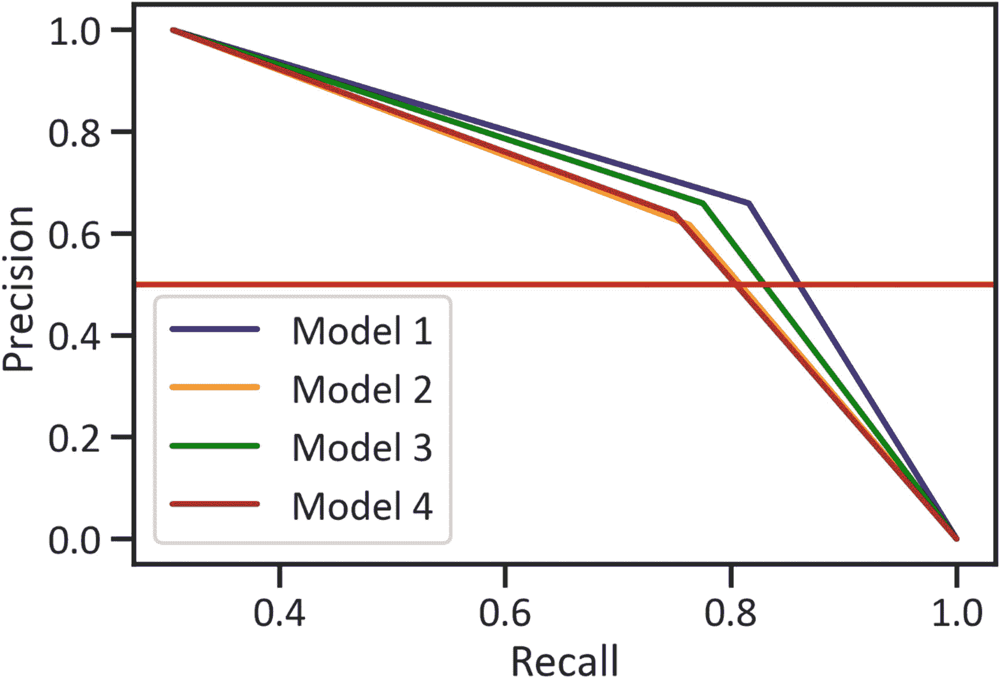

图 12-9

精确召回曲线

```py
precisionmodel1, recallmodel1, thresholdmodel1 = metrics.precision_recall_curve(y_test, y_predmodel1)
precisionmodel2, recallmodel2, thresholdmodel2 = metrics.precision_recall_curve(y_test, y_predmodel2)
precisionmodel3, recallmodel3, thresholdmodel3 = metrics.precision_recall_curve(y_test, y_predmodel3)
precisionmodel4, recallmodel4, thresholdmodel4 = metrics.precision_recall_curve(y_test, y_predmodel4)
plt.plot(precisionmodel1, recallmodel1, label="Model 1", color="navy")
plt.plot(precisionmodel2, recallmodel2, label="Model 2", color="orange")
plt.plot(precisionmodel3, recallmodel3, label="Model 3", color="green")
plt.plot(precisionmodel4, recallmodel4, label="Model 4", color="brown")
plt.axhline(y=0.5, color="red")
plt.xlabel("Recall")
plt.ylabel("Precision")
plt.legend(loc=3)
plt.show()

Listing 12-29Precision-Recall Curves

```

随着我们逐渐增加回忆，第四个网络的精确度比所有模型下降得更快。图 [12-9](#Fig9) 也显示了第一个网络优于其他网络。表 12-19 总结了使用 APS 分数的所有网络的精确度和召回率。

```py
apsmodel1 = metrics.average_precision_score(y_test, y_predmodel1)
apsmodel2 = metrics.average_precision_score(y_test, y_predmodel2)
apsmodel3 = metrics.average_precision_score(y_test, y_predmodel3)
apsmodel4 = metrics.average_precision_score(y_test, y_predmodel4)
apsfinal = [[apsmodel1, apsmodel2, apsmodel3, apsmodel3]]
apsfinaldata = pd.DataFrame(apsfinal, columns = ("Model 1",
                                                 "Model 2",
                                                 "Model 3",
                                                 "Model 4"),
                            index=["APS Score"]).transpose()
apsfinaldata

Listing 12-30APS Score

```

未正规化的网络具有最大的 APS 分数，其次是使用 L1 和 L2 惩罚项正规化的网络。神经元丢失的网络不太精确。

## 跨时代的培训和验证损失

图 [12-10](#Fig10) 展示了领先的深度信念网络如何学习比较实际类和预测类。

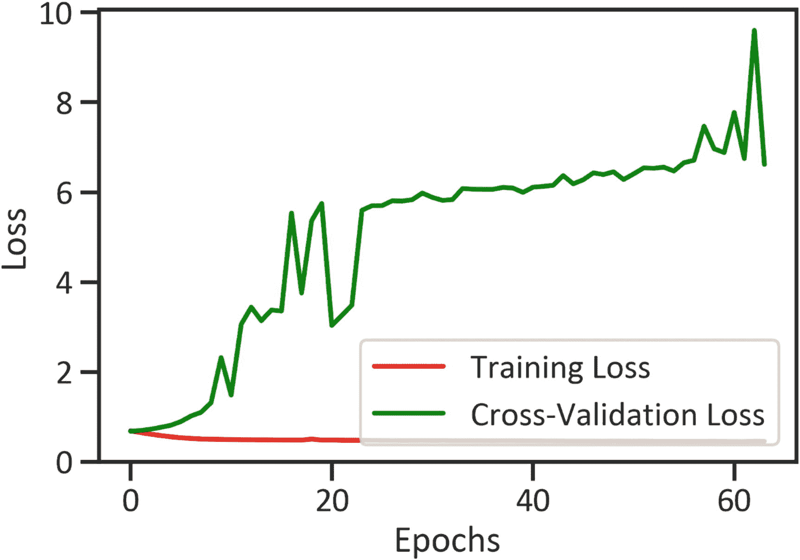

图 12-10

跨时代的培训和验证损失

```py
plt.plot(history1.history["loss"], color="red", label="Training Loss")
plt.plot(history1.history["val_loss"], color="green", label="Cross-Validation Loss")
plt.xlabel("Epochs")
plt.ylabel("Loss")
plt.legend(loc=4)
plt.show()

Listing 12-31Training and Validation Loss across Epochs

```

图 [12-10](#Fig10) 显示，在第一个历元中，交叉验证损失增加，直到在第 60 个历元达到峰值，然后开始下降。跨时代的训练损失始终为 0。

## 跨时代的培训和验证准确性

图 [12-11](#Fig11) 展示了领先的深度信念网络如何学习正确预测班级。

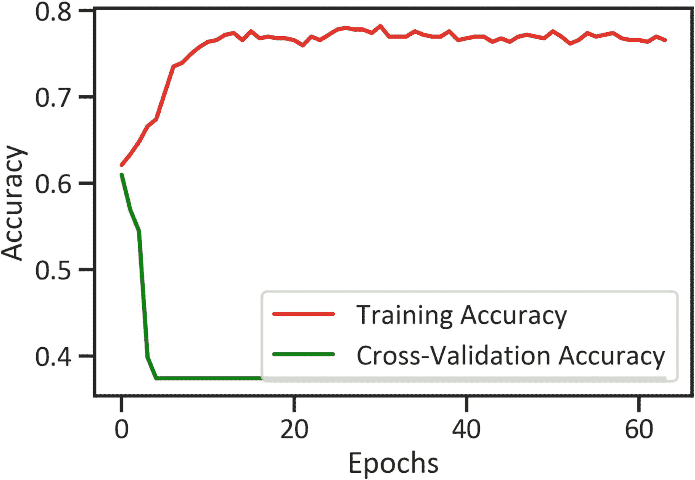

图 12-11

跨时代的培训和验证准确性

```py
plt.plot(history1.history["accuracy"], color="red", label="Training Accuracy")
plt.plot(history1.history["val_accuracy"], color="green", label="Cross-Validation Accuracy")
plt.xlabel("Epochs")
plt.ylabel("Accuracy")
plt.legend(loc=4)
plt.show()

Listing 12-32Training and Validation Accuracy across Epochs

```

图 [12-11](#Fig11) 突出显示了在第一个历元中，训练精度提高到大约 80%。同时，交叉验证的准确率下降，直到达到 0%，此后，它一直是 0%。

## 结论

本章描述了人工神经网络及其应用，然后解释了各种激活函数。它使用不同的人工神经网络(如伯努利 RBM 分类器、MLP 分类器和深度信念网络)解决了前面章节中涉及的相同分类问题。

在正确构建和完成它们的架构后，我们使用几个分类评估矩阵测试了它们的性能。我们发现伯努利 RBM 分类器很难区分类别。然而，MLP 分类器善于区分类别。所有正则化的深度信念网络都表现出行为良好的分类器的特征。此外，非规范化的深度信念网络优于其他网络。

<aside aria-label="Footnotes" class="FootnoteSection" epub:type="footnotes">Footnotes [1](#Fn1_source)

[T2`https://www.tensorflow.org/guide/keras/rnn`](https://www.tensorflow.org/guide/keras/rnn)

  [2](#Fn2_source)

[T2`https://keras.io/api/layers/activations/`](https://keras.io/api/layers/activations/)

  [3](#Fn3_source)

[T2`https://keras.io/api/optimizers/adam/`](https://keras.io/api/optimizers/adam/)

 </aside>