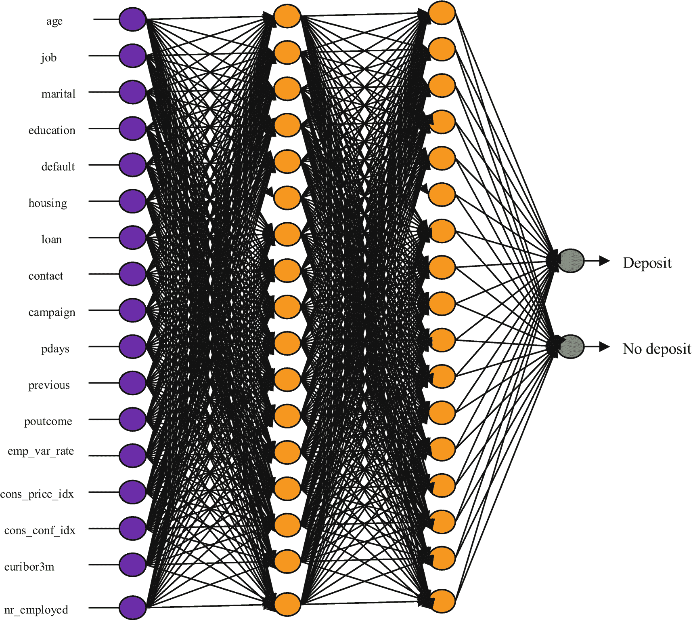
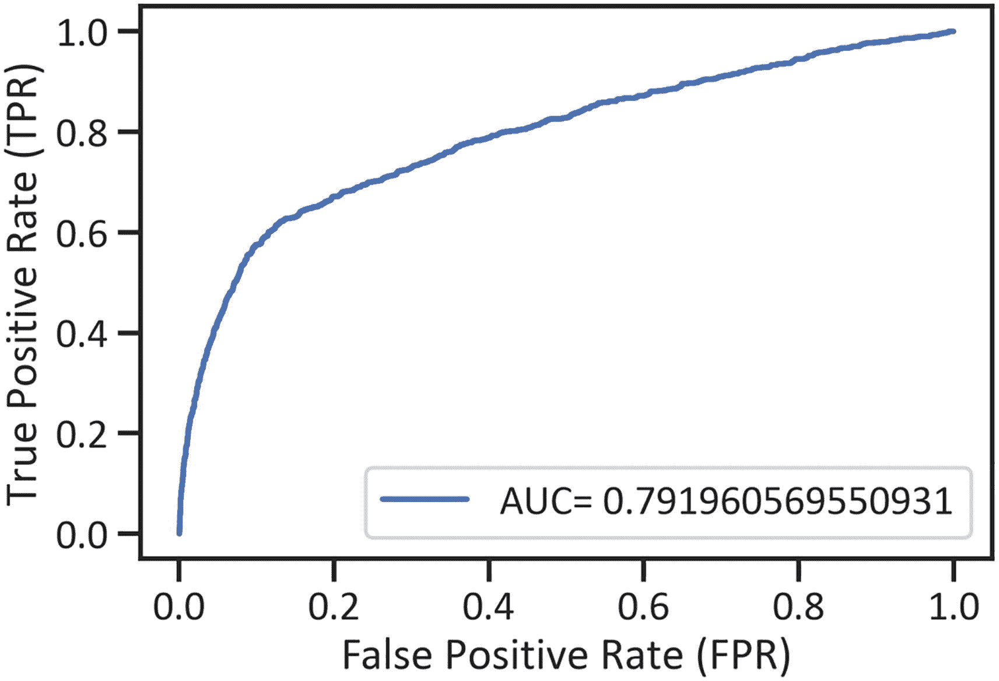
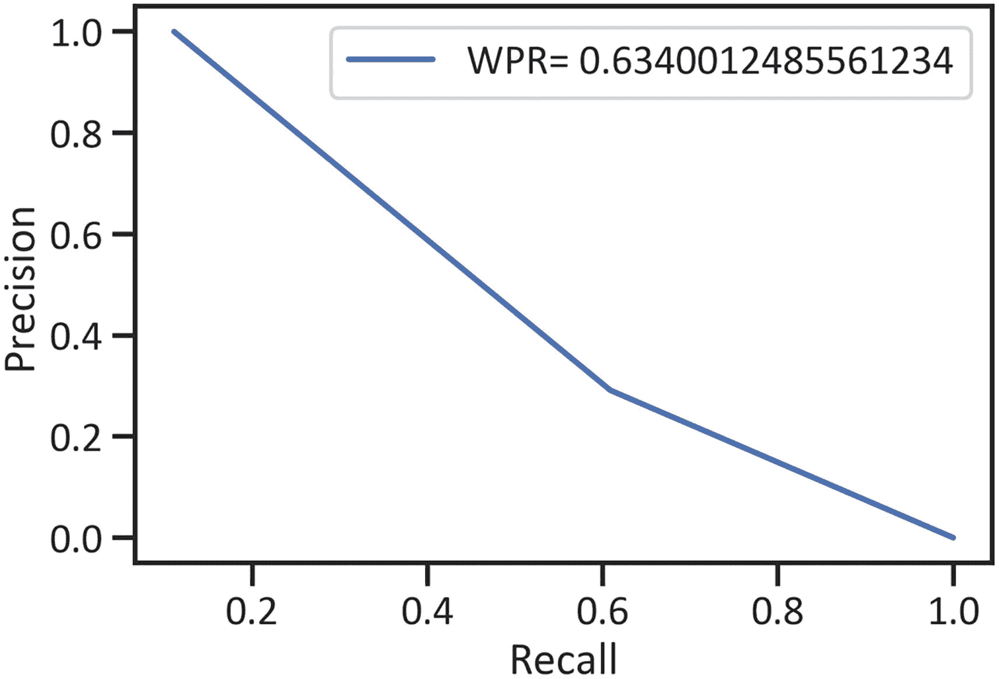
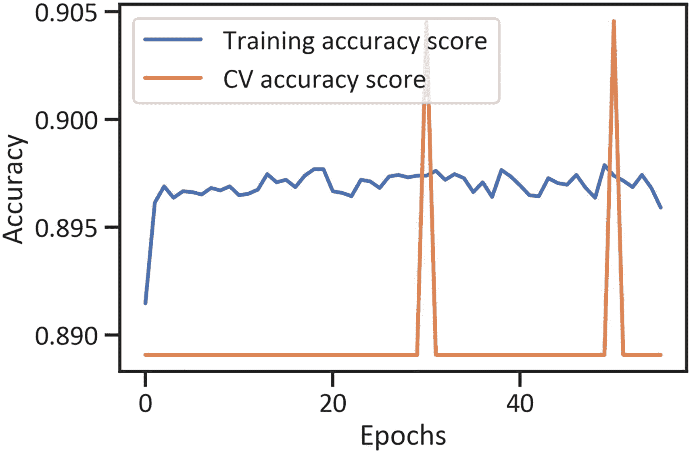

# 七、Scikit-Learn、Keras 和 H2O 神经网络

本章执行和评估非线性神经网络，以使用一组不同的综合 Python 框架(即 Scikit-Learn、Keras 和 H2O)来处理二元分类。

## 探索深度学习

深度学习方法超越了机器学习方法。它们通过包含大量隐藏层来处理模型和方法中的相当大的复杂性。机器学习方法通常类似于输入输出系统，其中目标函数接受输入值，并用目标函数转换它们以产生值。深度学习通过包括许多层来扩展处理活动，这些层包括重复和迭代处理数据的节点。深度学习的广泛认可与其可定制性有关；它使开发人员能够根据偏好定制方法。

## 多层感知器神经网络

顾名思义，多层感知器神经网络包含多个层。此外，基本结构保持不变；必须有一层用于接收输入值，一层用于生成输出值。对数据进行建模以分配不同权重和偏差的图层被视为隐藏图层。

图 [7-1](#Fig1) 显示了本章使用的多层感知器神经网络。



图 7-1

多层感知器神经网络

## 预处理特征

本章操作在第 [6](06.html) 章中获得的数据，因此不详细描述预处理任务。清单 [7-1](#PC1) 执行所有的预处理任务。

```py
import numpy as np
import pandas as pd
from sklearn.preprocessing import StandardScaler
from sklearn.model_selection import train_test_split
df = pd.read_csv(r"C:\Users\i5 lenov\Downloads\banking.csv")
drop_column_names = df.columns[[8, 9, 10]]
initial_data = df.drop(drop_column_names, axis="columns")
initial_data.iloc[::, 1] = pd.get_dummies(initial_data.iloc[::, 1])
initial_data.iloc[::, 2] = pd.get_dummies(initial_data.iloc[::, 2])
initial_data.iloc[::, 3] = pd.get_dummies(initial_data.iloc[::, 3])
initial_data.iloc[::, 4] = pd.get_dummies(initial_data.iloc[::, 4])
initial_data.iloc[::, 5] = pd.get_dummies(initial_data.iloc[::, 5])
initial_data.iloc[::, 6] = pd.get_dummies(initial_data.iloc[::, 6])
initial_data.iloc[::, 7] = pd.get_dummies(initial_data.iloc[::, 7])
initial_data.iloc[::, 11] = pd.get_dummies(initial_data.iloc[::, 11])
initial_data = initial_data.dropna()
x = np.array(initial_data.iloc[::,0:17])
y = np.array(initial_data.iloc[::,-1])
x_train, x_test, y_train, y_test = train_test_split(x, y, test_size=0.2, random_state=0)
sk_standard_scaler = StandardScaler()
sk_standard_scaled_x_train = sk_standard_scaler.fit_transform(x_train)
sk_standard_scaled_x_test = sk_standard_scaler.transform(x_test)

Listing 7-1Preprocess Features

```

## sci kit-在行动中学习

本节使用 Scikit-Learn 框架执行和评估多层感知器方法。清单 [7-2](#PC2) 执行 Scikit-Learn 多层感知器神经网络。

```py
from sklearn.neural_network import MLPClassifier
sk_multilayer_perceptron_net = MLPClassifier()
sk_multilayer_perceptron_net.fit(sk_standard_scaled_x_train, y_train)

Listing 7-2Execute the Scikit-Learn Multilayer Perceptron Neural Network

```

列表 [7-3](#PC3) 排列 Scikit-Learn 多层感知器神经网络的分类报告(见表 [7-1](#Tab1) )。

表 7-1

Scikit-Learn 多层感知器神经网络的分类报告

     
|   | 

精确

 | 

回忆

 | 

f1-分数

 | 

支持

 |
| --- | --- | --- | --- | --- |
| Zero | 0.917062 | 0.976655 | 0.945921 | 7325.000000 |
| one | 0.608696 | 0.291347 | 0.394074 | 913.000000 |
| 准确 | 0.900704 | 0.900704 | 0.900704 | 0.900704 |
| Avg 宏 | 0.762879 | 0.634001 | 0.669998 | 8238.000000 |
| 加权平均值 | 0.882886 | 0.900704 | 0.884761 | 8238.000000 |

```py
from sklearn import metrics
sk_yhat_multilayer_perceptron_net = sk_multilayer_perceptron_net.predict(sk_standard_scaled_x_test)
sk_multilayer_perceptron_net_assessment = pd.DataFrame(metrics.classification_report(y_test, sk_yhat_multilayer_perceptron_net,
                                             output_dict=True)).transpose()
print(sk_multilayer_perceptron_net_assessment)

Listing 7-3Arrange the Scikit-Learn Multilayer Perceptron Neural Network’s Classification Report

```

列表 [7-4](#PC4) 排列多层感知器神经网络的接收器工作特性曲线，浓缩了真阳性率和假阳性率的排列(见图 [7-2](#Fig2) )。



图 7-2

用 Scikit-Learn 框架执行的多层感知器网络的接收器操作特性曲线

```py
import matplotlib.pyplot as plt
%matplotlib inline
yhat_proba_sk_multilayer_perceptron_net = sk_multilayer_perceptron_net.predict_proba(sk_standard_scaled_x_test)[::,1]
fpr_sk_multilayer_perceptron_net, tprr_sk_multilayer_perceptron_net, _ = metrics.roc_curve(y_test, yhat_proba_sk_multilayer_perceptron_net)
area_under_curve_sk_multilayer_perceptron_net = metrics.roc_auc_score(y_test, yhat_proba_sk_multilayer_perceptron_net)
plt.plot(fpr_sk_multilayer_perceptron_net, tprr_sk_multilayer_perceptron_net, label="AUC= "+ str(area_under_curve_sk_multilayer_perceptron_net))
plt.xlabel("False Positive Rate (FPR)")
plt.ylabel("True Positive Rate (TPR)")
plt.legend(loc="best")
plt.show()

Listing 7-4Arrange a Receiver Operating Characteristics Curve for the Multilayer Perceptron Network (Executed with the Scikit-Learn Framework)

```

清单 [7-5](#PC5) 排列 Scikit-Learn 多层感知器神经网络的精度-召回曲线，以浓缩精度和召回的排列(见图 [7-3](#Fig3) )。



图 7-3

Scikit-Learn 多层感知器神经网络的精确召回曲线

```py
p_sk_multilayer_perceptron_net, r_sk_multilayer_perceptron_net, _ = metrics.precision_recall_curve(y_test, sk_yhat_multilayer_perceptron_net)
weighted_ps_sk_multilayer_perceptron_net = metrics.roc_auc_score(y_test, sk_yhat_multilayer_perceptron_net)
plt.plot(p_sk_multilayer_perceptron_net, r_sk_multilayer_perceptron_net,
         label="WPR= " +str(weighted_ps_sk_multilayer_perceptron_net))
plt.xlabel("Recall")
plt.ylabel("Precision")
plt.legend(loc="best")
plt.show()

Listing 7-5Precision-Recall Curve for the Scikit-Learn Multilayer Perceptron Neural Network

```

清单 [7-6](#PC6) 排列了 Scikit-Learn 多层感知器神经网络的学习曲线(见图 [7-4](#Fig4) )。

```py
from sklearn.model_selection import learning_curve
train_port_sk_multilayer_perceptron_net, trainscore_sk_multilayer_perceptron_net, testscore_sk_multilayer_perceptron_net = learning_curve(sk_multilayer_perceptron_net, x, y,
 cv=3, n_jobs=-5, train_sizes=np.linspace(0.1,1.0,50))
trainscoresk_multilayer_perceptron_net_mean = np.mean(trainscore_sk_multilayer_perceptron_net, axis=1)
testscoresk_multilayer_perceptron_net_mean = np.mean(testscore_sk_multilayer_perceptron_net, axis=1)
plt.plot(train_port_sk_multilayer_perceptron_net, trainscoresk_multilayer_perceptron_net_mean, label="Weighted training accuracy")
plt.plot(train_port_sk_multilayer_perceptron_net, testscoresk_multilayer_perceptron_net_mean, label="Weighted cv accuracy Score")
plt.xlabel("Training values")
plt.ylabel("Weighted accuracy score")
plt.legend(loc="best")
plt.show()

Listing 7-6Arrange a Learning Curve for the Multilayer Perceptron Network Executed with the Scikit-Learn Framework

```


图 7-4

用 Scikit-Learn 框架执行的多层感知器网络的学习曲线

### 硬在行动

本节使用 Keras 框架执行和评估深度信念神经网络。清单 [7-7](#PC7) 对特征进行预处理。

```py
x_train, x_test, y_train, y_test = train_test_split(x, y, test_size=0.2, random_state=0)
x_train, x_val, y_train, y_val = train_test_split(x_train,y_train,test_size=0.2,random_state=0)
sk_standard_scaler = StandardScaler()
sk_standard_scaled_x_train = sk_standard_scaler.fit_transform(x_train)
sk_standard_scaled_x_test = sk_standard_scaler.transform(x_test)

Listing 7-7Feature Preprocessing

```

清单 [7-8](#PC8) 使用`tensorflow`框架作为后端并安装 Keras 框架。

```py
import tensorflow as tf
from  tensorflow.keras import Sequential, regularizers
from  tensorflow.keras.layers import Dense
from  tensorflow.keras.wrappers.scikit_learn import KerasClassifier

Listing 7-8Employ the Tensorflow Framework as Backend and Install the Keras Framework

```

清单 [7-9](#PC9) 构建了一个多层感知器神经网络，有两个隐藏层，共有 17 个神经元。输入层包含一个比率为 0.001 的`"l1"`正则化器、`relu`激活函数以及`binary_crossentropy loss`和`accuracy`度量。

```py
def keras_multilayer_perceptron_net(optimizer="adam"):
    keras_multilayer_perceptron_net_model = Sequential()
    keras_multilayer_perceptron_net_model.add(Dense(17, input_dim=17, activation="sigmoid",kernel_regularizer=regularizers.l1(0.001), bias_regularizer=regularizers.l1(0.01)))
    keras_multilayer_perceptron_net_model.add(Dense(17, activation="relu"))
    keras_multilayer_perceptron_net_model.add(Dense(17, activation="relu"))
    keras_multilayer_perceptron_net_model.add(Dense(1, activation="relu"))
    keras_multilayer_perceptron_net_model.compile(loss="binary_crossentropy", optimizer=optimizer, metrics=["accuracy"])
    return keras_multilayer_perceptron_net_model

Listing 7-9Structure a Multilayer Perceptron with Keras

```

清单 [7-10](#PC10) 绑定多层感知器神经网络。

```py
keras_multilayer_perceptron_net_model = KerasClassifier(build_fn=keras_multilayer_perceptron_net)

Listing 7-10Bind the Multilayer Perceptron Neural Network

```

清单 [7-11](#PC11) 用 56 个时期和 14 的`batch_size`执行 Keras 多层感知器神经网络。

```py
keras_multilayer_perceptron_net_model_history = keras_multilayer_perceptron_net_model.fit(sk_standard_scaled_x_train, y_train, validation_data=(x_val, y_.val), batch_size=14, epochs=56)
print(keras_multilayer_perceptron_net_model_history)

Listing 7-11Execute the Multilayer Perceptron Neural Network with the Keras Framework

```

清单 [7-12](#PC12) 为用`Keras`框架执行的多层感知器网络安排了一个分类报告(见表 [7-2](#Tab2) )。

表 7-2

用 Keras 框架执行的多层感知器网络的分类报告

     
|   | 

精确

 | 

回忆

 | 

f1-分数

 | 

支持

 |
| --- | --- | --- | --- | --- |
| Zero | 0.908443 | 0.991536 | 0.948172 | 7325.000000 |
| one | 0.744856 | 0.198248 | 0.313149 | 913.000000 |
| 准确 | 0.903617 | 0.903617 | 0.903617 | 0.903617 |
| Avg 宏 | 0.826649 | 0.594892 | 0.630661 | 8238.000000 |
| 加权平均值 | 0.890313 | 0.903617 | 0.877794 | 8238.000000 |

```py
keras_multilayer_perceptron_net_model.predict(sk_standard_scaled_x_test)
keras_multilayer_perceptron_net_model = pd.DataFrame(metrics.classification_report(y_test, keras_yhat_multilayer_perceptron_net,
                                             output_dict=True)).transpose()
print(keras_multilayer_perceptron_net_model)

Listing 7-12Arrange a Classification Report for the Multilayer Perceptron Network Executed with the Keras Framework

```

清单 [7-13](#PC13) 安排了用 Keras 框架执行的多层感知器网络的训练和 CV 损失(见图 [7-5](#Fig5) )。


图 7-5

基于 Keras 框架的多层感知器网络的训练和 CV 损失

```py
plt.plot(keras_multilayer_perceptron_net_model_history.history["loss"], label="Training loss")
plt.plot(keras_multilayer_perceptron_net_model_history.history["val_loss"], label="CV loss")
plt.xlabel("Epochs")
plt.ylabel("Loss")
plt.legend(loc="best")
plt.show()

Listing 7-13Training and CV Loss for Multilayer Perceptron Network Executed by the Keras Framework

```

清单 [7-14](#PC14) 安排使用 Keras 框架执行的多层感知器网络的训练和 CV 精度(见图 [7-6](#Fig6) )。



图 7-6

用 Keras 框架执行的多层感知器网络的训练和 CV 精度

```py
plt.plot(keras_multilayer_perceptron_net_model_history.history["accuracy"], label="Training accuracy score")
plt.plot(keras_multilayer_perceptron_net_model_history.history["val_accuracy"], label="CV accuracy score")
plt.xlabel("Epochs")
plt.ylabel("Accuracy")
plt.legend(loc="best")
plt.show()

Listing 7-14Arrange the Training and CV Accuracy for Multilayer Perceptron Network Executed with the Keras Framework

```

### 深度信念网络

深度信念网络通过包含隐藏层超越了多层感知器神经网络。在生成输出值之前，网络必须重复对数据建模。

### H2O 在行动

这个部分使用 H2O 框架执行深度信念神经网络。

清单 [7-15](#PC15) 准备 H2O 框架。

```py
import h2o as initialize_h2o
initialize_h2o.init()

Listing 7-15Prepare the H2O Framework

```

清单 [7-16](#PC16) 将`pandas`数据帧更改为 H2O 数据帧。

```py
h2o_data = initialize_h2o.H2OFrame(initial_data)

Listing 7-16Change the Pandas Dataframe to the H2O Dataframe

```

清单 7-17 概述了这些特性。

```py
x_list = list(initial_data.iloc[::, 0:17].columns)
y_list = str(initial_data.columns[-1])
y = y_list
x = h2o_data.col_names
x.remove(y_list)

Listing 7-17Outline the Features

```

清单 [7-18](#PC18) 随机划分数据。

```py
h2o_training_data, h2o_validation_data, h2o_test_data = h2o_data.split_frame(ratios=[.8,.1])

Listing 7-18Randomly Divide the Dataframe

```

清单 [7-19](#PC19) 执行 H2O 深度信念神经网络。

```py
from h2o.estimators.deeplearning import H2ODeepLearningEstimator
h2o_deep_belief_net = H2ODeepLearningEstimator(hidden=[5], epochs=56)
h2o_deep_belief_net.train(x= x, y= y, training_frame = h2o_training_data, validation_frame = h2o_validation_data)h2o_training_data, validation_frame = h2o_validation_data)

Listing 7-19Execute the H2O Deep Belief Neural Network

```

## 结论

本章执行了三个关键的机器学习框架(Scikit-Learn、Keras 和 H2O)来对数据进行建模。它使用多层感知器和深度信念网络产生二进制结果。它还应用了`binary_crossentropy`损失函数(评估神经网络)和`adam`优化器(增强神经网络的性能)。