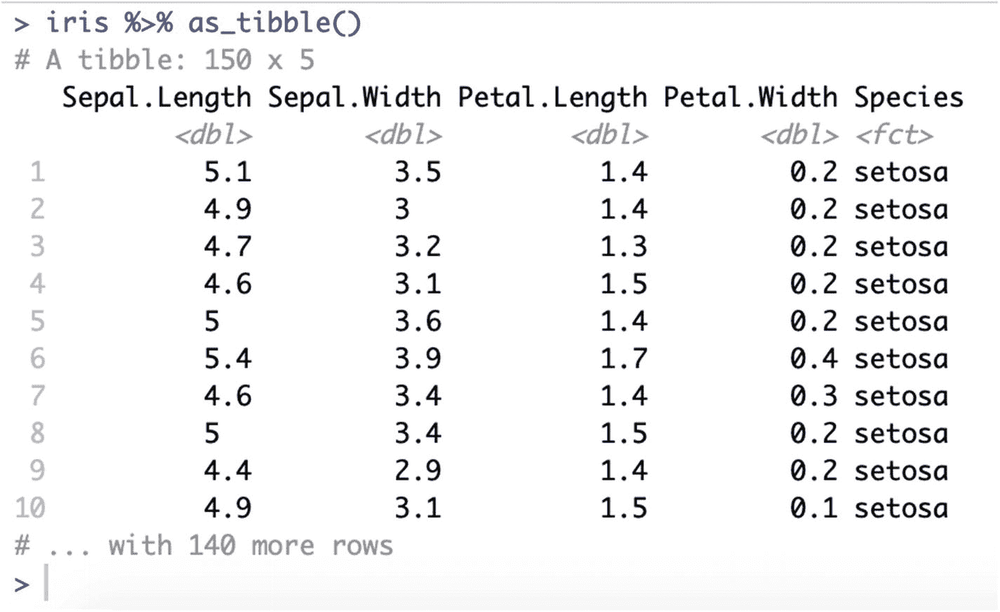
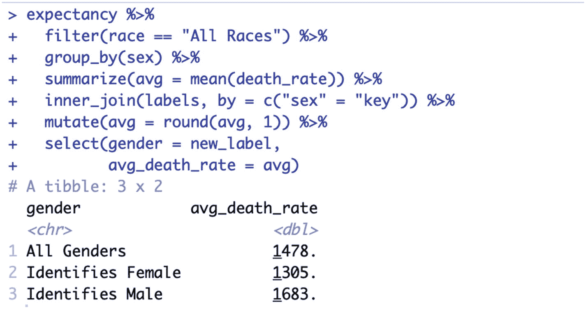

# 六、基本 R 包：Tidyverse

现在您已经有了基本的 RStudio 工作流程，我们准备开始强调一些将真正增强您的数据分析的工具。并非所有这些工具都是 RStudio 独有的，您可能会在其他 R 环境中看到它们，但它们确实非常适合 RStudio IDE。

这里的首要任务是向您介绍必备的软件包，它们将为您的 R 工具包提供基础。这些包中的许多将简化 R 中已经存在的功能，而其他的将向基本系统添加功能。RStudio 和这些包将 R 转变为数据从业者的专业工具。

## r 包

R 包是可以插入 RStudio 以扩展 R 内置的基本功能的东西。R 变得如此流行的原因之一是因为它拥有丰富的包生态系统，这真正使 R 成为数据科学的综合平台。

您可以使用 RStudio 来加载、浏览、安装和删除包，也可以使用 R 代码来管理 R 包。RStudio 的包支持将在第 [3](03.html) 章中详细讨论。

## Tidyverse

我们将要讨论的包实际上是名为“`tidyverse`”的包的集合。`Tidyverse`主要由 Hadley Wickham 开发，他也在 RStudio 上工作。在`tidyverse`网站上， [`https://www.tidyverse.org`](https://www.tidyverse.org) ，对这组包做了最好的描述，*“tidy verse 是一个固执己见的 R 包集合，专为数据科学而设计。所有的软件包都共享一个底层的设计理念、语法和数据结构。”*

请注意，作者将`tidyverse`描述为“固执己见”这意味着`tidyverse`不仅仅是一组函数；这也是从事数据科学的规定方式。有一种`tidyverse`的做事方式。这就是他们说`tidyverse`是“固执己见”的意思

`tidyverse`做得很好的事情之一是平滑 base R 的粗糙边缘。`tidyverse`为 base R 中已经存在的函数提供了一致的包装器，更易于使用和记忆。这些软件包也为 base R 增加了更多的功能。例如，`ggplot2`(一个`tidyverse`软件包)扩展了 base R 的绘图功能，但是增加了更多的绘图类型。让我们进入核心的`tidyverse`套餐。

为了遵循下面的例子，您必须安装`tidyverse`，然后将库导入到您的项目中。你可以使用第三章中关于软件包的说明来做到这一点，或者你也可以在你的 R 控制台中键入这个代码。

```r
install.packages("tidyverse")
library(tidyverse)

```

## 马格里特

`magrittr`包通过引入管道操作符`%<%`改变了 R 编码的流程。`%<%`运算符将左边的值转换成右边的表达式。这允许我们创建“管道”,在那里我们可以立即清楚地看到代码块正在做什么。

在像 R 这样非常依赖函数的编程语言中，你将开始以这样难以阅读的代码结束:

```r
round(mean(subset(expectancy, race == "All Races")$death_rate), 1)

```

这一行代码将返回我们在上一章中使用的预期数据框架中的平均死亡率。但是，它执行三项任务:过滤数据集、计算平均分数，然后对结果进行舍入。阅读这样的代码非常困难，随着问题变得更加复杂，这样的代码也变得更加困难。

`magrittr`包管道操作符`%>%`将通过消除嵌套函数调用的需要来帮助我们整理代码。下面是编写这段代码的另一种方法:

```r
expectancy %>%
  subset(race == "All Races") %>%
  .$death_rate %>%
  mean() %>%
  round(1)

```

这段代码稍微长了一点，但也更清晰了。你从上到下读它，每个`%>%`获取它上面的对象，并把它作为第一个参数发送给下一个函数。在顶部，我们使用`%>%`将期望数据帧作为它的右参数发送给子集。

现在，我们可以清楚地说，我们从数据帧开始，获取行的子集，选择`death_rate`，使用 mean 获得平均值，然后对值进行舍入。

### 注意

上面第三行代码中使用的句点`.`用于引用由 magrittr 传送的对象，因此它上面引用的是子集函数输出的数据帧。

`magrittr`包是一个核心包，在所有的`tidyverse`包中使用，并且有助于传达在`tidyverse`中使用的固执己见的分析风格。

## 迪布里

`tibble`包是另一个`tidyverse`基础包。一个`tibble`是基本 R 数据帧的反向版本。您不必直接使用这个包，但是`tidyverse`函数将返回`tibbles`而不是 dataframes。

实际上，这不会对你有太大影响，你可以把一个`tibble`当作一个数据帧。但是，`tibble`会有不同的表现。例如，如果我们在 R 控制台中键入单词 iris，我们将简单地得到 iris 数据帧中所有内容的列表。然而，如果您将 iris 数据帧转换成一个`tibble`，并检查如下输出:

```r
iris %>% as_tibble()

```

你将得到整洁的数据打印输出，如图 [6-1](#Fig1) 所示。



图 6-1

可观的产出

这仅显示一屏数据，但提供了更多有用的信息。我们可以看到数据本身的样本，并获得每一列的数据类型和数据集的维度。

## dplyr

`dplyr`是一个`tidyverse`包，您可以用它来进行数据操作。这个包使得过滤行、选择变量和改变内容变得更加容易。`dplyr`与`magrittr`携手合作，为数据操作提供“语法”。

在`dplyr`和`tidyverse`中，语法这个词通常指的是 r 中固执己见的工作方式。在`tidyverse`语法中，功能被称为动词。动词是以一种非常描述性的方式编写的，这样当你使用`tidyverse`语法时，你编写的代码以一种非常清晰的方式讲述了你的分析。

例如，您可以使用`dplyr`和`magrittr`对我们找到平均死亡率的最后一个示例进行编码，如下所示:

```r
expectancy %>%
  filter(race == "All Races") %>%
  summarize(avg = mean(death_rate)) %>%
  mutate(avg = round(avg, 1))

```

在上面的代码中，我们通过管道将预期数据帧连接到一组描述我们正在做什么的动词。我们在过滤，总结，变异。这描述了我们正在做的事情。这也使得对这个管道进行更改变得容易，因为我们可以简单地在管道中的任何地方更改或添加新的动词。

上面的代码将输出一个作为 tibble 返回的值。

```r
# A tibble: 1 x 1
    avg
  <dbl>
1 1489.

```

如果我们想做同样的分析，但也想了解按性别划分的平均死亡率，我们可以简单地在管道中添加一个`group_by`动词。

```r
expectancy %>%
  filter(race == "All Races") %>%
  group_by(sex) %>%
  summarize(avg = mean(death_rate)) %>%
  mutate(avg = round(avg, 1))

```

这次我们将得到三个值:一个是两性的，一个是男性的，一个是女性的。

```r
# A tibble: 3 x 2
  sex          avg
  <chr>      <dbl>
1 Both Sexes 1478.
2 Female     1305.
3 Male       1683.

```

### SQL Like 连接

使用`inner_join`、`left_join`和`right_join`动词将两个相关的数据集组合在一起。这些`dplyr`动词大致相当于名称相似的 SQL 语句 INNER JOIN、LEFT JOIN 和 RIGHT JOIN。

为了说明一个`dplyr`连接，让我们假设我们想要在我们的数据帧中添加新标签(对不起，`tibble`！)而且我们还有一个`tibble`，包含了我们更好的标签。您可以创建一个标签`tibble`，如下所示:

```r
labels <- tribble(
    ~key, ~new_label,
    "Both Sexes",   "All Genders",
    "Female",   "Identifies Female",
    "Male",   "Identifies Male"
  )

```

如果运行这段代码，一个名为“labels”的新表将出现在环境窗口的“Data”下。您可以像以前查看数据帧一样查看它，只需在视图中单击对象名称。

我们现在可以使用`inner_join` dplyr 动词轻松地将这些标签添加到我们的管道中。

```r
expectancy %>%
  filter(race == "All Races") %>%
  group_by(sex) %>%
  summarize(avg = mean(death_rate)) %>%
  inner_join(labels, by = c("sex" = "key")) %>%
  mutate(avg = round(avg, 1)) %>%
  select(gender = new_label,
         avg_death_rate = avg)

```

在上面的代码中，您还可以看到我们使用了一个`select dplyr`动词来以一种更令人愉快的方式排列和重命名标签。您可以在图 [6-2](#Fig2) 中看到结果。



图 6-2

适用于 tibble 的性别标签

当您运行上面的代码时，您将看到结果以`tibble`的形式返回。除了在控制台中显示结果之外，您还可以使用赋值操作符`<-`来存储结果，以便以后使用。

```r
avg_death_rates_by_gender <-
  expectancy %>%
  filter(race == "All Races") %>%
  group_by(sex) %>%
  summarize(avg = mean(death_rate)) %>%
  inner_join(labels, by = c("sex" = "key")) %>%
  mutate(avg = round(avg, 1)) %>%
  select(gender = new_label,
         avg_death_rate = avg)

```

## 线

我们将详细介绍的最后一个`tidyverse`包将帮助您处理字符串。处理字符串很棘手，因为这种数据类型可能比简单的数字更复杂。`stringr`包括帮助检测模式、分割字符串和连接字符串的功能。

你可以单独使用 stringr 函数，也可以和像`filter`和`mutate`这样的`dplyr`动词一起使用。例如，要过滤在 race 列中包含字符“All”模式的记录，可以在过滤动词中使用`str_detect`,如下所示:

```r
expectancy %>%
  filter(str_detect(race, "All"))

```

我们可以用`str_replace`来替换一种字符模式。要将种族列“所有种族”条目更改为“大多数种族”，您可以这样做:

```r
expectancy <-
  expectancy %>%
  mutate(race = str_replace(race, "All", "Most"))

```

有许多`stringr`函数可以帮助你处理字符串。许多只是使用基本 R 函数的包装器。`stringr`的价值主要在于它提供了一致的接口。每个函数都将输入字符串作为第一个参数，这样就可以使用`magrittr`管道操作符。

## 结论

在`tidyverse`集合中有更多的包，但是上面提到的那些将会给你能够使用任何`tidyverse`包的知识。这些也是您最有可能在日常基础上使用的包，并且需要扩展 base R 的概念，我们认为它们应该得到更详细的处理。但是，让我们也花一点时间来提一下其他的包，这样你就知道你还能得到什么了。

`ggplot2`是一个`tidyverse`包，它真正为 r 中的数据可视化设置了标准。这个包将在关于数据可视化的章节中得到详细的处理。`tidyr`帮助将数据转换成整洁的`tibble`数据集，易于添加到您的分析管道中。`readr`、`readxl,`和`haven`帮助您导入文本数据、Excel 数据和 SAS/Stata/SPSS 数据。`lubridate`帮助你处理棘手的日期和日期时间。