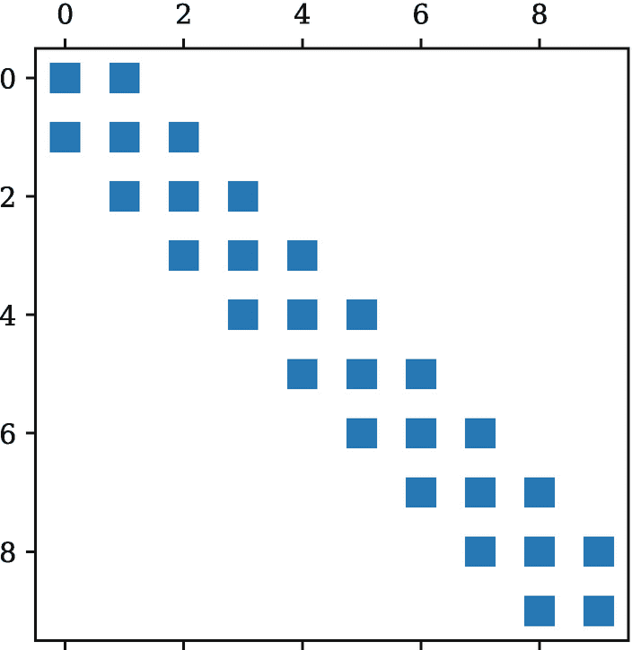
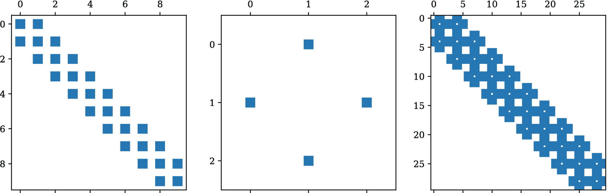
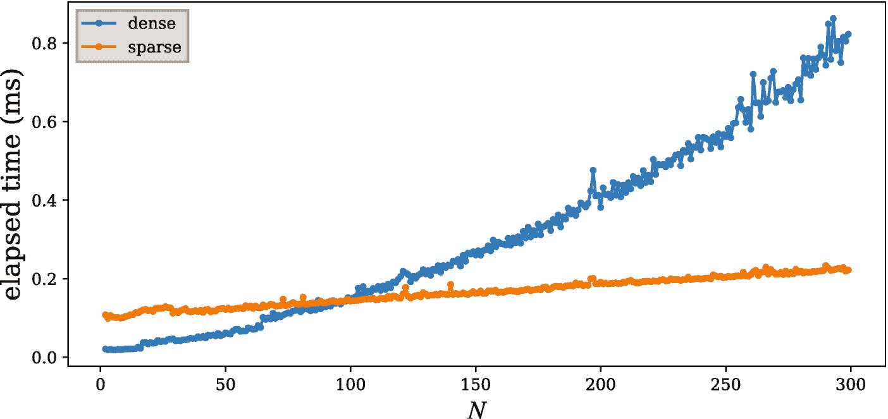
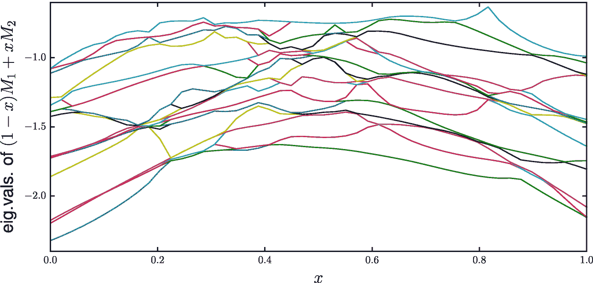
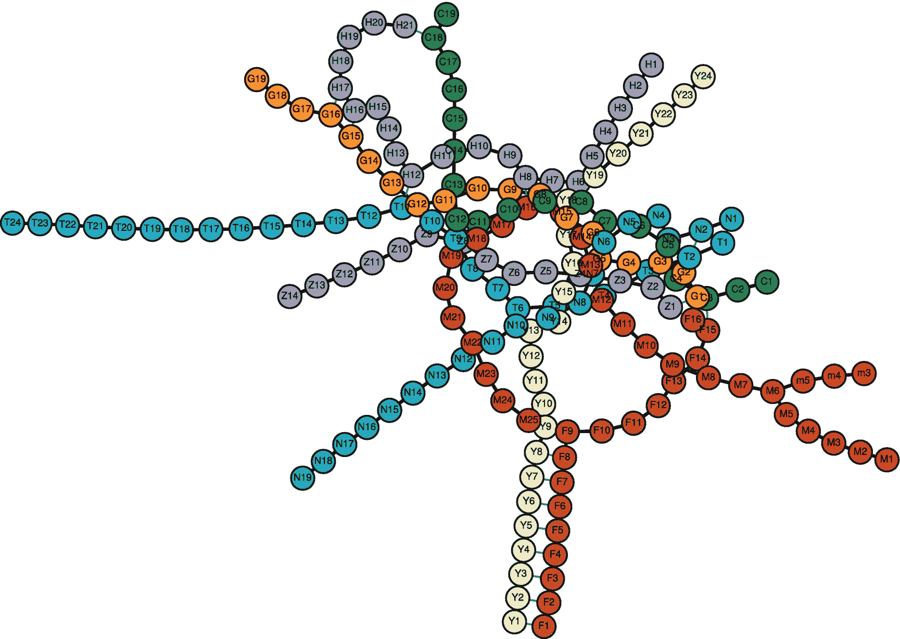
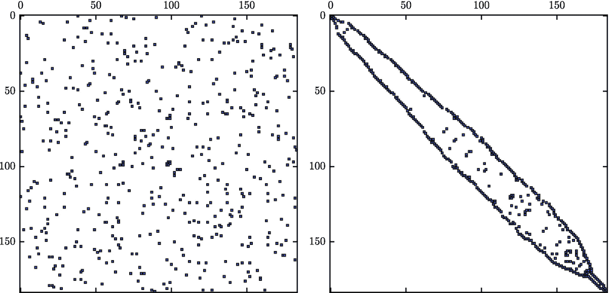

# 十、稀疏矩阵和图

我们已经看到了许多数组和矩阵的例子，它们是数值计算的许多方面的基本实体。到目前为止，我们已经用 NumPy `ndarray`数据结构表示了数组，这是一种存储它所表示的数组的所有元素的异构表示。在许多情况下，这是表示对象(如向量、矩阵或高维数组)的最有效方式。然而，值得注意的例外是大部分元素为零的矩阵。这种矩阵被称为*稀疏矩阵*，它们出现在许多应用中，例如，在连接网络(如电路)和大型代数方程系统中出现，例如，当求解偏微分方程时(参见第 [11 章](11.html)中的示例)。

对于以零元素为主的矩阵，在计算机内存中存储所有的零是低效的，只存储非零值和关于它们位置的附加信息更合适。对于称为*密集矩阵*的非稀疏矩阵，这种表示法不如将所有值连续存储在存储器中有效，但对于大型稀疏矩阵，这种表示法要优越得多。

在 Python 中使用稀疏矩阵有几种选择。这里我们主要关注 SciPy 中的稀疏矩阵模块，`scipy.sparse`，它提供了一个功能丰富且易于使用的接口，用于表示稀疏矩阵并对这类对象进行线性代数运算。另一个选项是 py sparse<sup>T3【1T5】，它提供了类似的功能。对于非常大规模的问题，PyTrilinos <sup>[2](#Fn2)</sup> 和 PETSc <sup>[3](#Fn3)</sup> 包有很多稀疏矩阵运算的强大并行实现。然而，使用这些包需要更多的编程，它们有更陡峭的学习曲线，并且更难安装和设置。对于大多数基本用例，SciPy 的`sparse`模块是最合适的选项，或者至少是一个合适的起点。</sup>

在本章的最后，我们还简要地探讨了使用 SciPy `sparse.csgraph`模块和 NetworkX 库来表示和处理图形。图可以表示为邻接矩阵，这在许多应用中是非常稀疏的。因此，图和稀疏矩阵是紧密联系的主题。

## 导入模块

本章中我们使用的主要模块是 SciPy 库中的`sparse`模块。我们假设这个模块包含在名称`sp`下，此外我们需要显式导入它的子模块`linalg`，以使这个模块可以通过`sp.linalg`访问。

```py
In [1]: import scipy.sparse as sp
In [2]: import scipy.sparse.linalg

```

我们还需要 NumPy 库，我们通常以名称`np`导入它，以及用于绘图的 Matplotlib 库:

```py
In [3]: import numpy as np
In [4]: import matplotlib.pyplot as plt

```

在本章的最后一部分，我们使用了`networkx`模块，我们以`nx`的名字导入它:

```py
In [5]: import networkx as nx

```

## SciPy 中的稀疏矩阵

稀疏矩阵表示的基本思想是避免在稀疏矩阵中存储过多的零。在密集矩阵表示中，数组的所有元素都是连续存储的，只需存储值本身就足够了，因为每个元素的行和列索引都是从数组中的位置隐式知道的。然而，如果我们只存储非零元素，我们显然还需要存储每个元素的行和列索引。有许多方法来组织非零元素及其相应的行和列索引的存储。这些方法具有不同的优点和缺点，例如，在创建矩阵的容易程度方面，以及可能更重要的是，在稀疏矩阵上的数学运算的实现中，它们的使用效率。表 [10-1](#Tab1) 对 SciPy `sparse`模块中可用的稀疏矩阵格式进行了总结和比较。

表 10-1

稀疏矩阵表示方法的总结与比较

<colgroup><col class="tcol1 align-left"> <col class="tcol2 align-left"> <col class="tcol3 align-left"> <col class="tcol4 align-left"></colgroup> 
| 

类型

 | 

描述

 | 

赞成的意见

 | 

骗局

 |
| --- | --- | --- | --- |
| 坐标列表(首席运营官，`sp.coo_matrix`) | 非零值与它们的行和列一起存储在一个列表中。 | 构造简单，添加新元素高效。 | 低效的元素访问。不适合数学运算，比如矩阵乘法。 |
| 列表列表（LIL， `sp.lil_matrix` ） | 存储每行非零元素的列索引列表和相应值的列表。 | 支持切片操作。 | 不适合数学运算。 |
| 钥匙字典（道克，`sp.dok_matrix` ） | 非零值存储在字典中，以(行，列)元组作为键。 | 构造简单，可快速添加、移除和访问元素。 | 不适合数学运算。 |
| 对角矩阵（迪亚， `sp.dia_matrix` ） | 存储矩阵的对角线列表。 | 对对角矩阵有效。 | 不适用于非对角矩阵。 |
| 压缩稀疏列(CSC，`sp.csc_matrix`)和压缩稀疏行(CSR，`sp.csr_matrix`) | 将值与具有列或行索引的数组一起存储。 | 构造起来相对复杂。 | 高效的矩阵向量乘法。 |
| 块稀疏矩阵(BSR，`cp.bsr_matrix` | 类似于 CSR，但适用于子矩阵密集的稀疏矩阵。 | 对于它们特定的预期目的是有效的。 | 不适合一般用途。 |

存储稀疏矩阵的一种简单而直观的方法是简单地存储带有列索引和行索引的列表以及非零值列表。这种格式被称为*坐标列表格式*，在 SciPy 中简称为首席运营官。类`sp.coo_matrix`用于以这种格式表示稀疏矩阵。这种格式特别容易初始化。例如，使用矩阵

![$$ A=\left[\begin{array}{cccc}0&amp; 1&amp; 0&amp; 0\\ {}0&amp; 0&amp; 0&amp; 2\\ {}0&amp; 0&amp; 3&amp; 0\\ {}4&amp; 0&amp; 0&amp; 0\end{array}\right], $$](img/332789_2_En_10_Chapter_TeX_Equa.png)

我们可以很容易地识别出非零值[ *A* <sub>01</sub> = 1， *A* <sub>13</sub> = 2， *A* <sub>22</sub> = 3， *A* <sub>30</sub> = 4]及其对应的行[0，1，2，3]和列[1，3，2，0](注意这里我们使用了 Python 的基于零的索引)。为了创建一个`sp.coo_matrix`对象，我们可以为值、行索引和列索引创建列表(或数组),并将它们传递给`sp.coo_matrix`。可选地，我们也可以使用`shape`参数指定数组的形状，这在非零元素不跨越整个矩阵时很有用(例如，如果有只包含零的列或行，因此不能从行和列数组中正确地推断出形状):

```py
In [6]: values = [1, 2, 3, 4]
In [7]: rows = [0, 1, 2, 3]
In [8]: cols = [1, 3, 2, 0]
In [9]: A = sp.coo_matrix((values, (rows, cols)), shape=[4, 4])
In [10]: A
Out[10]: <4x4 sparse matrix of type '<type 'numpy.int64'>'
              with 4 stored elements in Coordinate format>

```

结果是表示稀疏矩阵的数据结构。SciPy 的`sparse`模块中的所有稀疏矩阵表示共享几个公共属性，其中许多都是从 NumPy 的`ndarray`对象派生的。这种属性的例子有`size`、`shape`、`dtype`和`ndim`，所有稀疏矩阵表示的共同点是`nnz`(非零元素的数量)和`data`(非零值)属性:

```py
In [11]: A.shape, A.size, A.dtype, A.ndim
Out[11]: ((4, 4), 4, dtype('int64'), 2)
In [12]: A.nnz, A.data
Out[12]: (4, array([1, 2, 3, 4]))

```

除了共享属性之外，每种类型的稀疏矩阵表示还具有特定于其存储每个非零值位置的方式的属性。对于`sp.coo_matrix`对象，有`row`和`col`属性用于访问底层的行和列数组:

```py
In [13]: A.row
Out[13]: array([0, 1, 2, 3], dtype=int32)
In [14]: A.col
Out[14]: array([1, 3, 2, 0], dtype=int32)

```

也有大量方法可用于操作稀疏矩阵对象。这些方法中有许多是用于在矩阵上应用数学函数，例如，像`sin`、`cos`、`arcsin`等元素式数学方法。；聚合方式有`min`、`max`、`sum`等。；数学数组运算符如共轭(`conj`)和转置(`transpose`)等。；以及用于计算稀疏矩阵或稀疏矩阵和密集向量之间的点积的`dot`(`*`运算符也表示稀疏矩阵的矩阵乘法)。有关更多详细信息，请参见稀疏矩阵类的文档字符串(在表 [10-1](#Tab1) 中总结)。另一个重要的方法家族用于在不同格式之间转换稀疏矩阵:例如，`tocoo`、`tocsr`、`tolil`等。还有将稀疏矩阵转换为 NumPy `ndarray`和 NumPy `matrix`对象(即密集矩阵表示)的方法:分别为`toarray`和`todense`。

例如，要将稀疏矩阵`A`从首席运营官格式分别转换为 CSR 格式和 NumPy 数组，我们可以使用以下内容:

```py
In [15]: A.tocsr()
Out[15]: <4x4 sparse matrix of type '<type 'numpy.int64'>'
         with 4 stored elements in Compressed Sparse Row format>
In [16]: A.toarray()
Out[16]: array([[0, 1, 0, 0],
                [0, 0, 0, 2],
                [0, 0, 3, 0],
                [4, 0, 0, 0]])

```

访问矩阵中的元素的最明显的方法是使用索引语法，例如`A[1,2]`，以及切片语法，例如`A[1:3, 2]`，等等。我们也可以经常对稀疏矩阵使用这种语法，但并不是所有的表示都支持索引和切片，即使支持，也可能不是一种有效的操作。特别是，将值赋给零值元素可能是一个开销很大的操作，因为根据所使用的格式，可能需要重新安排底层数据结构。为了向稀疏矩阵递增地添加新元素，LIL ( `sp.lil_matrix`)格式是合适的选择，但是另一方面，这种格式不适合算术运算。

在处理稀疏矩阵时，经常会遇到这样的情况:不同的任务——比如构造、更新和算术运算——以不同的格式处理最为有效。在不同的稀疏格式之间进行转换是相对高效的，因此在应用程序的不同部分之间切换不同的格式是很有用的。因此，稀疏矩阵的有效使用需要理解不同的格式是如何实现的，以及它们适用于什么。表 [10-1](#Tab1) 简单总结了 SciPy 的`sparse`模块中可用的稀疏矩阵格式的优缺点，利用转换方法，很容易在不同格式之间切换。有关各种格式优点的更深入讨论，请参见 SciPy 参考手册中的“稀疏矩阵” <sup>[4](#Fn4)</sup> 部分。

对于计算，SciPy 的`sparse`模块中最重要的稀疏矩阵表示是 CSR(压缩稀疏行)和 CSC(压缩稀疏列)格式，因为它们非常适合高效的矩阵运算和线性代数应用。其他格式，如首席运营官、LIL 和 DOK，主要用于构建和更新稀疏矩阵，一旦稀疏矩阵准备好用于计算，最好将其转换为 CSR 或 CSC 格式，分别使用`tocsr`或`tocsc`方法。

在 CSR 格式中，非零值(`data`)与一个包含每个值的列索引的数组(`indices`)和另一个存储每行的列索引数组的偏移量的数组(`indptr`)一起存储。例如，考虑矩阵

![$$ A=\left[\begin{array}{cccc}1&amp; 2&amp; 0&amp; 0\\ {}0&amp; 3&amp; 4&amp; 0\\ {}0&amp; 0&amp; 5&amp; 6\\ {}7&amp; 0&amp; 8&amp; 9\end{array}\right], $$](img/332789_2_En_10_Chapter_TeX_Equb.png)

这里非零值为[1，2，3，4，5，6，7，8，9] ( `data`)，第一行非零值对应的*列索引*为[0，1]，第二行[1，2]，第三行[2，3]，第四行[0，2，3]。将所有这些列索引列表连接起来，得到了`indices`数组[0，1，1，2，2，3，0，2，3]。为了跟踪这个列索引数组中对应的行条目，我们可以将每一行的起始位置存储在第二个数组中。第一行的列索引是元素 0 到 1，第二行元素 2 到 3，第三行元素 4 到 5，最后是第四行元素 6 到 9。收集数组中的起始索引得到[0，2，4，6]。为了便于实现，我们还在这个数组的末尾添加了非零元素的总数，这就产生了`indptr`数组[0，2，4，6，9]。在下面的代码中，我们创建一个对应于矩阵 *A* 的密集 NumPy 数组，使用`sp.csr_matrix`将其转换为 CSR 矩阵，然后显示`data`、`indices`和`indptr`属性:

```py
In [17]: A = np.array([[1, 2, 0, 0], [0, 3, 4, 0], [0, 0, 5, 6], [7, 0, 8, 9]])
    ...: A
Out[17]: array([[1, 2, 0, 0],
                [0, 3, 4, 0],
                [0, 0, 5, 6],
                [7, 0, 8, 9]])
In [18]: A = sp.csr_matrix(A)
In [19]: A.data
Out[19]: array([1, 2, 3, 4, 5, 6, 7, 8, 9], dtype=int64)
In [20]: A.indices
Out[20]: array([0, 1, 1, 2, 2, 3, 0, 2, 3], dtype=int32)
In [21]: A.indptr
Out[21]: array([0, 2, 4, 6, 9], dtype=int32)

```

使用这种存储方案，索引为`i`的行中的非零元素存储在索引`indptr[i]`和`indptr[i+1]-1`之间的`data`数组中，这些元素的列索引存储在`indices`数组中的相同索引处。例如，索引为`i=2`的第三行中的元素从`indptr[2]=4`开始，到`indptr[3]-1=5`结束，这给出了元素值`data[4]=5`和`data[5]=6`以及列索引`indices[4]=2`和`indices[5]=3`。因此， *A* [2，2] = 5， *A* [2，3] = 6(以基于零索引的表示法):

```py
In [22]: i = 2
In [23]: A.indptr[i], A.indptr[i+1]-1
Out[23]: (4, 5)
In [24]: A.indices[A.indptr[i]:A.indptr[i+1]]
Out[24]: array([2, 3], dtype=int32)
In [25]: A.data[A.indptr[i]:A.indptr[i+1]]
Out[25]: array([5, 6], dtype=int64)
In [26]: A[2, 2], A[2,3]  # check
Out[26]: (5, 6)

```

虽然 CSR 存储方法不像首席运营官、LIL 或 DOK 那样直观，但它非常适合用于矩阵算术和线性代数运算的实现。与 CSC 格式一起，它因此是稀疏矩阵计算中使用的主要格式。CSC 格式基本上与 CSR 相同，只是使用了行索引和列指针，而不是列索引和行指针(即，列和行的角色颠倒了)。

### 创建稀疏矩阵的函数

正如我们在本章前面的例子中看到的，构造稀疏矩阵的一种方法是为特定的稀疏矩阵格式准备数据结构，并将它们传递给相应的稀疏矩阵类的构造函数。虽然这种方法有时是合适的，但从预定义的模板矩阵组成稀疏矩阵通常更方便。`sp.sparse`模块提供了多种用于生成这种矩阵的函数，例如，`sp.eye`用于创建对角线上的稀疏矩阵(可选地从主对角线偏移)，`sp.diags`用于创建沿对角线具有指定模式的对角矩阵，`sp.kron`用于计算两个稀疏矩阵的 Kronecker(张量)积，`bmat`、`vstack`和`hstack`用于从稀疏块矩阵构建稀疏矩阵，并分别通过垂直和水平堆叠稀疏矩阵。

例如，在许多应用中，稀疏矩阵具有对角线形式。要创建一个大小为 10 × 10 的稀疏矩阵，具有一条主对角线和一条上下对角线，我们可以使用三个对`sp.eye`的调用，使用`k`参数来指定相对于主对角线的偏移:

```py
In [27]: N = 10
In [28]: A = sp.eye(N, k=1) - 2 * sp.eye(N) + sp.eye(N, k=-1)
In [29]: A
Out[29]: <10x10 sparse matrix of type '<class 'numpy.float64'>'
                   with 28 stored elements in Compressed Sparse Row format>

```

默认情况下，结果对象是 CSR 格式的稀疏矩阵，但是使用`format`参数，我们可以指定任何其他稀疏矩阵格式。格式参数的值应该是一个字符串，如`'csr'`、`'csc'`、`'lil'`等。在`sp.sparse`中所有创建稀疏矩阵的函数都接受这个参数。例如，在前面的例子中，我们可以通过指定模式`[1, –2, 1]`(前面表达式中`sp.eye`函数的系数)和相对于主对角线的相应偏移`[1, 0, –1]`，使用`sp.diags`生成相同的矩阵。如果我们还想得到 CSC 格式的稀疏矩阵，我们可以设置`format='csc'`:

```py
In [30]: A = sp.diags([1, -2, 1], [1, 0, -1], shape=[N, N], format="csc")
In [31]: A
Out[31]: <10x10 sparse matrix of type '<class 'numpy.float64'>'
                   with 28 stored elements in Compressed Sparse Column format>

```

使用稀疏矩阵格式而不是密集矩阵的优势只有在处理大型矩阵时才能体现出来。稀疏矩阵本质上很大，因此很难通过例如在终端中打印其元素来可视化矩阵。Matplotlib 提供了函数`spy`，这是一个可视化稀疏矩阵结构的有用工具。它作为`pyplot`模块中的一个函数或者作为`Axes`实例的一个方法可用。当在先前定义的`A`矩阵上使用它时，我们得到如图 [10-1](#Fig1) 所示的结果。



图 10-1

只在最靠近主对角线的两条对角线上和主对角线本身上有非零元素的稀疏矩阵的结构

```py
In [32]: fig, ax = plt.subplots()
    ...: ax.spy(A)

```

稀疏矩阵也经常与张量积空间相关联。对于这种情况，我们可以使用`sp.kron`函数从它的更小的部分组成一个稀疏矩阵。例如，为 A 和矩阵之间的张量积创建一个稀疏矩阵

![$$ B=\left[\begin{array}{ccc}0&amp; 1&amp; 0\\ {}1&amp; 0&amp; 1\\ {}0&amp; 1&amp; 0\end{array}\right], $$](img/332789_2_En_10_Chapter_TeX_Equc.png)

我们可以用`sp.kron(A, B)`:

```py
In [33]: B = sp.diags([1, 1], [-1, 1], shape=[3,3])
In [34]: C = sp.kron(A, B)
In [35]: fig, (ax_A, ax_B, ax_C) = plt.subplots(1, 3, figsize=(12, 4))
    ...: ax_A.spy(A)
    ...: ax_B.spy(B)
    ...: ax_C.spy(C)

```

为了比较，我们还绘制了 *A* 、 *B* 、 *C* 的稀疏矩阵结构，结果如图 [10-2](#Fig2) 所示。有关使用`sp.sparse`模块构建稀疏矩阵的更多详细信息，请参见其文档字符串和 SciPy 参考手册中的“稀疏矩阵”一节。



图 10-2

两个矩阵 A(左)和 B(中)的稀疏矩阵结构及其张量积(右)

### 稀疏线性代数函数

稀疏矩阵的主要应用是在大型矩阵上执行线性代数运算，使用密集矩阵表示难以处理或效率低下。SciPy `sparse`模块包含一个实现许多线性代数例程的模块`linalg`。并非所有的线性代数运算都适用于稀疏矩阵，在某些情况下，与密集运算相比，稀疏矩阵运算的行为需要修改。因此，在稀疏线性代数模块`scipy.sparse.linalg`和密集线性代数模块`scipy.linalg`之间存在许多差异。例如，稠密问题的特征值求解器通常计算并返回所有的特征值和特征向量。对于稀疏矩阵来说，这是不可管理的，因为存储大小为 *N* × *N* 的稀疏矩阵 *A* 的所有特征向量通常等于存储大小为 *N* × *N* 的密集矩阵。相反，稀疏特征值求解器通常会给*几个*特征值和特征向量，例如，那些具有最小或最大特征值的特征值和特征向量。一般来说，为了使稀疏矩阵方法有效，它们必须保持计算中涉及的矩阵的稀疏性。稀疏度通常为*而非*的运算示例是矩阵求逆，因此应尽可能避免。

### 线性方程组

稀疏矩阵最重要的应用可以说是求解形式为 *Ax* = *b* 的线性方程组，其中 *A* 是稀疏矩阵， *x* 和 *b* 是密集向量。SciPy `sparse.linalg`模块具有针对此类问题的直接和迭代求解器(`sp.linalg.spsolve`)以及分解矩阵*和*的方法，例如，使用 *LU* 分解(`sp.linalg.splu`)和不完全 *LU* 分解(`sp.linalg.spilu`)。例如，考虑问题 *Ax* = *b* 其中 *A* 是前面文本中考虑的三对角矩阵，而 *b* 是充满负矩阵的稠密向量(参见第 [11](11.html) 章了解该方程的物理解释)。为了解决系统大小为 10 × 10 的问题，我们首先创建稀疏矩阵`A`和密集向量`b`:

```py
In [36]: N = 10
In [37]: A = sp.diags([1, -2, 1], [1, 0, -1], shape=[N, N], format="csc")
In [38]: b = -np.ones(N)

```

现在，要使用 SciPy 提供的直接求解器求解方程组，我们可以使用:

```py
In [39]: x = sp.linalg.spsolve(A, b)
In [40]: x
Out[40]: array([  5.,   9.,  12.,  14.,  15.,  15.,  14.,  12.,   9.,   5.])

```

解向量是一个密集的 NumPy 数组。作为比较，我们也可以使用 NumPy `np.linalg.solve`中的 dense direct solver 来解决这个问题(或者类似地，使用`scipy.linalg.solve`)。为了能够使用密集求解器，我们需要使用`A.todense()`将稀疏矩阵`A`转换为密集数组:

```py
In [41]: np.linalg.solve(A.todense(), b)
Out[41]: array([  5.,   9.,  12.,  14.,  15.,  15.,  14.,  12.,   9.,   5.])

```

正如预期的那样，结果与我们从稀疏解算器获得的结果一致。对于像这样的小问题，使用稀疏矩阵没有太多好处，但是对于增加系统规模，使用稀疏矩阵和稀疏解算器的优点变得明显。对于这个特殊的问题，使用稀疏方法优于密集方法的阈值系统大小约为 *N* = 100，如图 [10-3](#Fig3) 所示。虽然确切的阈值因问题而异，也因硬件和软件版本而异，但这种行为对于矩阵 *A* 足够稀疏 <sup>[5](#Fn5)</sup> 的问题来说是典型的。



图 10-3

解一维泊松问题的稀疏方法和密集方法的性能比较

`spsolve`接口的另一种选择是使用`sp.sparse.splu`或`sp.sparse.spilu`(不完全 LU 分解)显式计算 LU 分解。这些函数返回一个对象，该对象包含 *L* 和 *U* 因子，并且有一个方法可以求解给定向量 *b* 的 *LUx* = *b* 。这当然在需要为多个向量 *b* 求解 *Ax* = *b* 时特别有用。例如，之前使用的矩阵 *A* 的 LU 因式分解使用以下公式计算:

```py
In [42]: lu = sp.linalg.splu(A)
In [43]: lu.L
Out[43]: <10x10 sparse matrix of type '<class 'numpy.float64'>'
                    with 20 stored elements in Compressed Sparse Column format>
In [44]: lu.U
Out[44]: <10x10 sparse matrix of type '<class 'numpy.float64'>'
                    with 20 stored elements in Compressed Sparse Column format>

```

一旦 LU 因式分解可用，我们就可以使用针对`lu`对象的`solve`方法高效地求解方程 *LUx* = *b* :

```py
In [45]: x = lu.solve(b)
In [46]: x
Out[46]: array([  5.,   9.,  12.,  14.,  15.,  15.,  14.,  12.,   9.,   5.])

```

稀疏矩阵的一个重要考虑因素是，与矩阵 *A* 相比， *A* 的 LU 分解可能会在 *L* 和 *U* 中引入新的非零元素，从而使 *L* 和 *U* 的稀疏度降低。存在于 *L* 或 *U* 中，而不存在于 *A* 中的元素称为填充。如果填充的数量很大，使用稀疏矩阵的优势可能会丧失。虽然没有消除填充的完整解决方案，但通常可以通过置换 *A* 中的行和列来减少填充，因此 LU 因式分解采用的形式是*P*<sub>*r*</sub>*AP*<sub>*c*</sub>=*LU*，其中 *P* <sub>*r*</sub> 几种这样的置换方法是可用的。`spsolve`、`splu,`和`spilu`函数都带参数`permc_spec`，参数可以带值`NATURAL`、`MMD_ATA`、`MMD_AT_PLUS_A`或`COLAMD`，表示这些方法内置的不同排列方法。由`splu`和`spilu`返回的对象说明了这样的排列，排列向量通过`perm_c`和`perm_r`属性可用。由于这些排列，`lu.L`和`lu.U`的乘积不直接等于`A`，为了从`lu.L`和`lu.U,`重建`A`，我们还需要撤销行和列的排列:

```py
In [47]: def sp_permute(A, perm_r, perm_c):
    ...:     """ permute rows and columns of A """
    ...:     M, N = A.shape
    ...:     # row permutation matrix
    ...:     Pr = sp.coo_matrix((np.ones(M), (perm_r, np.arange(N)))).tocsr()
    ...:     # column permutation matrix
    ...:     Pc = sp.coo_matrix((np.ones(M), (np.arange(M), perm_c))).tocsr()
    ...:     return Pr.T * A * Pc.T
In [48]: lu.L * lu.U - # != 0
Out[48]: <10x10 sparse matrix of type '<class 'numpy.float64'>'
                   with 8 stored elements in Compressed Sparse Column format>
In [49]: sp_permute(lu.L * lu.U, lu.perm_r, lu.perm_c) - A  # == 0
Out[49]: <10x10 sparse matrix of type '<class 'numpy.float64'>'
                   with 0 stored elements in Compressed Sparse Column format>

```

默认情况下，SciPy 中的直接稀疏线性解算器使用 SuperLU <sup>[6](#Fn6)</sup> 包。也可以在 SciPy 中使用的另一个稀疏矩阵解算器是 UMFPACK <sup>[7](#Fn7)</sup> 包，尽管这个包是与 SciPy 捆绑在一起的*而不是*，并且需要安装`scikit-umfpack` Python 库。如果`scikit-umfpack`可用，并且如果`sp.linalg.spsolve`函数的`use_umfpack`参数是`True`，那么使用 UMFPACK 而不是 SuperLU。SuperLU 和 UMFPACK 是否能提供更好的性能因问题而异，因此对于任何给定的问题，安装和测试两者都是值得的。

`sp.spsolve`函数是直接解算器的接口，它在内部执行矩阵分解。另一种方法是使用源于优化的迭代方法。SciPy `sparse.linalg`模块包含几个用于稀疏线性问题迭代求解的函数:例如，`bicg`(双共轭梯度法)、`bicgstab`(双共轭梯度稳定法)、`cg`(共轭梯度法)、`gmres`(广义最小残差法)、`lgmres`(松散广义最小残差法)。通过调用以`A`和`b`为参数的函数，所有这些函数(以及其他一些函数)都可以用来解决问题 *Ax* = *b* ，它们都返回一个元组`(x, info)`，其中`x`是解，`info`包含关于解过程的附加信息(`info=0`表示成功，对于收敛误差为正，对于输入误差为负)。例如:

```py
In [50]: x, info = sp.linalg.bicgstab(A, b)
In [51]: x
Out[51]: array([  5.,   9.,  12.,  14.,  15.,  15.,  14.,  12.,   9.,   5.])
In [52]: x, info = sp.linalg.lgmres(A, b)
In [53]: x
Out[53]: array([  5.,   9.,  12.,  14.,  15.,  15.,  14.,  12.,   9.,   5.])

```

此外，每个迭代求解器都有自己的依赖于求解器的参数。有关详细信息，请参见每个函数的 docstring。对于非常大的问题，迭代求解器可能比直接求解器更有优势，因为直接求解器可能由于不期望的填充而需要过多的内存使用。相比之下，迭代求解器只需要评估稀疏矩阵向量乘法，因此不会遇到填充问题，但另一方面，对于许多问题，它们可能收敛缓慢，特别是如果没有适当的预处理。

#### 特征值问题

稀疏特征值和奇异值问题可以分别使用`sp.linalg.eigs`和`sp.linalg.svds`函数来解决。对于实对称或复埃尔米特矩阵，也可以使用`sp.linalg.eigsh`计算特征值(在这种情况下是实数)和特征向量。这些函数并不计算所有的特征值或奇异值，而是计算给定数量的特征值和向量(默认为六个)。使用关键字 argument `k`和这些函数，我们可以定义应该计算多少个特征值和向量。使用`which`关键字参数，我们可以指定要计算哪些`k`值。`eigs`的选项有最大幅度`LM`，最小幅度`SM`，最大实部`LR`，最小实部`SR`，最大虚部`LI`，最小虚部`SI`。对于`svds`只有`LM`和`SM`可用。

例如，要计算一维泊松问题(系统大小为 10x10)的稀疏矩阵的最低四个特征值，我们可以使用`sp.linalg.eigs(A, k=4, which="LM")`:

```py
In [54]: N = 10
In [55]: A = sp.diags([1, -2, 1], [1, 0, -1], shape=[N, N], format="csc")
In [56]: evals, evecs = sp.linalg.eigs(A, k=4, which="LM")
In [57]: evals
Out[57]: array([-3.91898595+0.j, -3.68250707+0.j, -3.30972147+0.j, -2.83083003+0.j])

```

`sp.linalg.eigs`(和`sp.linalg.eigsh`)的返回值是一个元组`(evals, evecs)`，其第一个元素是一个特征值数组(`evals`)，第二个元素是一个形状为 *N* × *k* 的数组(`evecs`，其列是`evals`中的 *k* 特征值对应的特征向量。因此，我们期望`A`和`evecs`中的一列之间的点积等于`evecs`中的同一列乘以`evals`中相应的特征值。我们可以直接确认事实确实如此:

```py
In [58]: np.allclose(A.dot(evecs[:,0]), evals[0] * evecs[:,0])
Out[58]: True

```

对于这个特定的例子，稀疏矩阵 A 是对称的，所以我们可以使用`sp.linalg.eigsh`代替`sp.linalg.eigs,`，这样我们就获得了一个具有实值元素的特征值阵列:

```py
In [59]: evals, evecs = sp.linalg.eigsh(A, k=4, which="LM")
In [60]: evals
Out[60]: array([-3.91898595, -3.68250707, -3.30972147, -2.83083003])

```

通过将自变量`which='LM'`(最大幅度)改为`which='SM'`(最小幅度)，我们获得一组不同的特征值和向量(具有最小幅度的那些)。

```py
In [61]: evals, evecs = sp.linalg.eigs(A, k=4, which="SM")
In [62]: evals
Out[62]: array([-0.08101405+0.j, -0.31749293+0.j, -0.69027853+0.j, -1.16916997+0.j])
In [63]: np.real(evals).argsort()
Out[63]: array([3, 2, 1, 0])

```

请注意，尽管我们在前面的示例中请求并获得了具有最小幅度的四个特征值，但是这些特征值和向量并不一定相互排序(尽管在这个特定的例子中它们是这样)。通常需要获得已排序的特征值，这可以通过一个小而方便的包装函数轻松实现，该包装函数使用 NumPy 的`argsort`方法对特征值进行排序。这里我们给出这样一个函数，`sp_eigs_sorted`，返回按特征值实部排序的特征值和特征向量。

```py
In [64]: def sp_eigs_sorted(A, k=6, which="SR"):
    ...:     """ compute and return eigenvalues sorted by the real part """
    ...:     evals, evecs = sp.linalg.eigs(A, k=k, which=which)
    ...:     idx = np.real(evals).argsort()
    ...:     return evals[idx], evecs[idx]
In [65]: evals, evecs = sp_eigs_sorted(A, k=4, which="SM")
In [66]: evals
Out[66]: array([-1.16916997+0.j, -0.69027853+0.j, -0.31749293+0.j, -0.08101405+0.j])

```

作为一个使用`sp.linalg.eigs`和包装函数`sp_eigs_sorted`的不太平凡的例子，考虑随机稀疏矩阵*M*T17】1*M*2 的线性组合(1*x*)*M*T9】1+*xM*T13】2 的最低特征值的谱。我们可以使用`sp.rand`函数生成两个随机稀疏矩阵，通过重复使用`sp_eigs_sorted`为 *x* 的不同值找到(1*x*)*M*<sub>1</sub>+*xM*<sub>2</sub>矩阵的最小 25 个特征值，我们就可以构建一个矩阵(`evals_mat`，它包含作为 *x* 的函数的特征值。下面我们使用区间[0，1]中的 *x* 的 50 个值:

```py
In [67]: N = 100
In [68]: x_vec = np.linspace(0, 1, 50)
In [69]: M1 = sp.rand(N, N, density=0.2)
In [70]: M2 = sp.rand(N, N, density=0.2)
In [71]: evals_mat = np.array([sp_eigs_sorted((1-x)*M1 + x*M2, k=25)[0] for x in x_vec])

```

一旦计算出作为 *x* 函数的特征值矩阵`evals_mat`，我们就可以绘制特征值谱。结果如图 [10-4](#Fig4) 所示，由于矩阵*M*T7】1 和*M*T11】2 的随机性，这是一个复杂的特征值谱。



图 10-4

稀疏矩阵的最低 25 个特征值的谱(1*x*)*M*<sub>1</sub>+*xM*<sub>2</sub>，作为 *x* 的函数，其中 *M* <sub>1</sub> 和 *M* <sub>2</sub> 是两个随机矩阵

```py
In [72]: fig, ax = plt.subplots(figsize=(8, 4))
    ...: for idx in range(evals_mat.shape[1]):
    ...:     ax.plot(x_vec, np.real(evals_mat[:,idx]), lw=0.5)
    ...: ax.set_xlabel(r"$x$", fontsize=16)
    ...: ax.set_ylabel(r"eig.vals. of $(1-x)M_1+xM_2$", fontsize=16)

```

### 图形和网络

将图表示为邻接矩阵是稀疏矩阵的另一个重要应用。在邻接矩阵中，元素描述了图中的哪些节点相互连接。因此，如果每个节点只连接到一小组其他节点，邻接矩阵是稀疏的。SciPy `sparse`模块中的`csgraph`模块提供用于处理这种图的功能，包括使用不同方法遍历图的方法(例如，广度优先和深度优先遍历)以及用于计算图中节点之间的最短路径的方法，等等。有关此模块的更多信息，请参考其 docstring: `help(sp.csgraph)`。

对于使用图形的更全面的框架，有 NetworkX Python 库。它提供了创建和操作无向图和有向图的工具，并且还实现了许多图算法，例如在图中寻找节点之间的最小路径。这里我们假设 Networkx 库是以名称`nx`导入的。使用这个库，我们可以通过初始化一个类`nx.Graph`的对象来创建一个无向图。任何可散列的 Python 对象都可以作为节点存储在一个`graph`对象中，这使得它成为一个非常灵活的数据结构。但是，在下面的例子中，我们只使用带有整数和字符串的图形对象作为节点标签。参见表 [10-2](#Tab2) 总结创建图形和添加节点和边到图形对象的功能。

表 10-2

使用 NetworkX 构建基本图形的对象和方法概述

<colgroup><col class="tcol1 align-left"> <col class="tcol2 align-left"></colgroup> 
| 

对象/方法

 | 

描述

 |
| --- | --- |
| `nx.Graph` | 表示无向图的类。 |
| `nx.DiGraph` | 表示有向图的类。 |
| `nx.MultiGraph` | 表示支持多条边的无向图的类。 |
| `nx.MultiDiGraph` | 用于表示支持多条边的有向图的类。 |
| `add_node` | 向图中添加一个节点。需要一个节点标签(例如，一个字符串，或一般的可散列对象)作为参数。 |
| `add_nodes_from` | 添加多个节点。需要一个节点标签列表(或 iterable)作为参数。 |
| `add_edge` | 添加边缘。需要两个节点参数作为参数，并在这两个节点之间创建一条边。 |
| `add_edges_from` | 添加多条边。需要节点标签的元组列表(或可迭代列表)。 |
| `add_weighted_edges_from` | 添加带有权重因子的多条边。需要元组列表(或可迭代列表),每个元组包含两个节点标签和权重因子。 |

例如，我们可以使用`nx.Graph()`和`add_node`方法或`add_nodes_from`创建一个简单的图，其中节点数据是整数，以便一次添加多个节点。`nodes`方法返回节点的迭代器对象，称为`NodeView`:

```py
In [73]: g = nx.Graph()
In [74]: g.add_node(1)
In [75]: g.nodes()
Out[75]: NodeView((1,))
In [76]: g.add_nodes_from([3, 4, 5])
In [77]: g.nodes()
Out[77]: NodeView((1, 3, 4, 5))

```

为了连接节点，我们可以使用`add_edge`添加边。我们将想要连接的两个节点的标签作为参数传递。要添加多条边，我们可以使用`add_edges_from`并向它传递要连接的节点元组列表。`edges`方法返回边的迭代器对象，称为`EdgeView`:

```py
In [78]: g.add_edge(1, 2)
In [79]: g.edges()
Out[79]: EdgeView([(1, 2)])
In [80]: g.add_edges_from([(3, 4), (5, 6)])
In [81]: g.edges()
Out[81]: EdgeView([(1, 2), (3, 4), (5, 6)])

```

为了表示节点之间的边，这些边具有与之相关联的权重(例如，距离)，我们可以使用`add_weighted_edges_from`，向其传递一个元组列表，除了两个节点之外，该列表还包含每个边的权重因子。当调用`edges`方法时，我们可以额外给出参数`data=True`来指示边缘数据也应该包含在结果视图中。

```py
In [82]: g.add_weighted_edges_from([(1, 3, 1.5), (3, 5, 2.5)])
In [83]: g.edges(data=True)
Out[83]: EdgeDataView([(1, 2, {}),
                       (1, 3, {'weight': 1.5}),
                       (3, 4, {}),
                       (3, 5, {'weight': 2.5}),
                       (5, 6, {})])

```

请注意，如果我们在图中尚不存在的节点之间添加边，它们会被无缝添加。例如，在下面的代码中，我们在节点 6 和 7 之间添加了一条加权边。节点 7 以前在图中不存在，但是当向它添加边时，它会自动创建并添加到图中:

```py
In [84]: g.add_weighted_edges_from([(6, 7, 1.5)])
In [85]: g.nodes()
Out[85]: NodeView((1, 3, 4, 5, 2, 6, 7))
In [86]: g.edges()
Out[86]: EdgeView([(1, 2), (1, 3), (3, 4), (3, 5), (5, 6), (6, 7)])

```

有了这些基本原理，我们已经准备好看一个更复杂的图形例子。下面我们将从存储在名为`tokyo-metro.json`(与代码清单一起提供)的 JSON 文件中的数据集构建一个图，我们使用 Python 标准库模块`json` <sup>[8](#Fn8)</sup> 加载它:

```py
In [87]: import json
In [88]: with open("tokyo-metro.json") as f:
    ...:      data = json.load(f)

```

加载 JSON 文件的结果是一个包含地铁线路描述的字典`data`。对于每条线路，都有一个车站之间的行程时间列表(`travel_times`)、一个到其他线路的可能换乘点列表(`transfer`)以及线路颜色:

```py
In [89]: data.keys()
Out[89]: dict_keys(['C', 'T', 'N', 'F', 'Z', 'M', 'G', 'Y', 'H'])
In [90]: data["C"]
Out[90]: {'color': '#149848',
          'transfers': [['C3', 'F15'], ['C4', 'Z2'], ...],
          'travel_times': [['C1', 'C2', 2], ['C2', 'C3', 2], ...]}

```

这里`travel_times`列表的格式是`[['C1', 'C2', 2], ['C2', 'C3', 2], ...]`，表示在 C1 和 C2 站之间旅行需要 2 分钟，在 C2 和 C3 之间旅行需要 2 分钟，等等。`transfers`列表格式为`[['C3', 'F15'], ...]`，表示在 C3 站到 F15 站可以从 C 线换乘 F 线。`travel_times`和`transfers`直接适合于馈送到`add_weighed_edges_from`和`add_edges_from`，因此我们可以通过迭代每个地铁线路字典并调用这些方法来轻松创建表示地铁网络的图:

```py
In [91]: g = nx.Graph()
​    ...: for line in data.values():
    ...:     g.add_weighted_edges_from(line["travel_times"])
    ...:     g.add_edges_from(line["transfers"])

```

线传递边没有边权重，因此我们首先通过向每条边添加一个新的布尔属性`transfer`来标记所有传递边:

```py
In [92]: for n1, n2 in g.edges():
    ...:     g[n1][n2]["transfer"] = "weight" not in g[n1][n2]

```

接下来，出于绘图目的，我们创建了包含转移边和列车上边的两个边列表，并且我们还创建了具有与网络中每个节点相对应的颜色的列表:

```py
In [93]: on_foot = [e for e in g.edges() if g.get_edge_data(*e)["transfer"]]
In [94]: on_train = [e for e in g.edges () if not g.get_edge_data(*e)["transfer"]]
In [95]: colors = [data[n[0].upper()]["color"] for n in g.nodes()]

```

为了可视化图形，我们可以使用 Networkx 库中基于 Matplotlib 的绘制例程:我们使用`nx.draw`来绘制每个节点，`nx.draw_networkx_labels`来绘制节点的标签，`nx.draw_network_edges`来绘制边。我们调用`nx.draw_network_edges`两次，使用转移(`on_foot`)和列车(`on_train`)连接的边缘列表，并使用`edge_color`参数将链接分别着色为蓝色和黑色。图形的布局由绘图函数的`pos`参数决定。这里我们使用了`networkx.drawing.nx_agraph`中的`graphviz_layout`函数来布置节点。所有绘图函数也通过`ax`参数接受 Matplotlib 轴实例。结果图如图 [10-5](#Fig5) 所示。



图 10-5

东京地铁站网络图

```py
In [96]: fig, ax = plt.subplots(1, 1, figsize=(14, 10))
    ...: pos = nx.drawing.nx_agraph.graphviz_layout(g, prog="neato")
    ...: nx.draw(g, pos, ax=ax, node_size=200, node_color=colors)
    ...: nx.draw_networkx_labels(g, pos=pos, ax=ax, font_size=6)
    ...: nx.draw_networkx_edges(g, pos=pos, ax=ax, edgelist=on_train, width=2)
    ...: nx.draw_networkx_edges(g, pos=pos, ax=ax, edgelist=on_foot, edge_color="blue")

```

一旦构建了网络，我们就可以使用 NetworkX 库提供的许多图形算法来分析网络。例如，为了计算每个节点的度数(即，到一个节点的连接数)，我们可以使用`degree`方法(这里输出在`...`处被截断以节省空间):

```py
In [97]: g.degree()
Out[97]: DegreeView({'Y8': 3,  'N18': 2,  'M24': 2,  'G15': 3,  'C18': 3,  'N13': 2, ... })

```

对于这个图，节点的度可以解释为与一个站点的连接数量:在一个站点连接的地铁线路越多，相应节点的度越高。通过使用`degree`方法和`max`函数寻找网络中的最高度，我们可以很容易地搜索网络中最高连通的站。接下来，我们迭代`degree`方法的结果，并选择出具有最大度的节点(在这个网络中是 6):

```py
In [98]: d_max = max(d for (n, d) in g.degree())
In [99]: [(n, d) for (n, d) in g.degree() if d == d_max]
Out[99]: [('N7', 6), ('G5', 6), ('Y16', 6), ('M13', 6), ('Z4', 6)]

```

结果告诉我们，连接度最高的站点是 N 线上的 7 号站点，G 线上的 5 号站点，依此类推。所有这些线路都在同一个车站(永田町站)相交。我们还可以使用`nx.shortest_path`计算网络中两点之间的最近路径。例如，在 Y24 和 C19 之间行驶的最佳行驶路线(假设没有等待时间和瞬时换乘)为

```py
In [100]: p = nx.shortest_path(g, "Y24", "C19")
In [101]: p
Out[101]: ['Y24', 'Y23', 'Y22', 'Y21', 'Y20', 'Y19', 'Y18', 'C9', 'C10', 'C11',
           'C12', 'C13', 'C14', 'C15', 'C16', 'C17', 'C18', 'C19']

```

给定此表单上的一条路径，我们还可以通过对路径中相邻节点的权重属性求和来直接评估行驶时间:

```py
In [102]: np.sum([g[p[n]][p[n+1]]["weight"]
     ...:         for n in range(len(p)-1) if "weight" in g[p[n]][p[n+1]]])
Out[102]: 35

```

结果表明从 Y24 到 C19 需要 35 分钟。由于换乘节点不具有与其相关联的权重，因此列车换乘被有效地假设为是瞬时的。假设火车换乘需要大约 5 分钟可能是合理的，并且为了在最短路径和行程时间计算中考虑到这一点，我们可以更新换乘节点并为每个节点添加权重 5。为了做到这一点，我们使用`copy`方法创建了一个图的副本，并遍历这些边，更新那些将`transfer`属性设置为`True`的边:

```py
In [103]: h = g.copy()
In [104]: for n1, n2 in h.edges():
     ...:     if h[n1][n2]["transfer"]:
     ...:         h[n1][n2]["weight"] = 5

```

使用新的图表重新计算路径和行驶时间可以更真实地估计行驶时间:

```py
In [105]: p = nx.shortest_path(h, "Y24", "C19")
In [106]: p
Out[106]: ['Y24', 'Y23', 'Y22', 'Y21', 'Y20', 'Y19', 'Y18', 'C9', 'C10', 'C11',
'C12', 'C13', 'C14', 'C15', 'C16', 'C17', 'C18', 'C19']
In [107]: np.sum([h[p[n]][p[n+1]]["weight"] for n in range(len(p)-1)])
Out[107]: 40

```

使用这种方法，我们当然可以计算网络中任意节点之间的最佳路径和旅行时间。作为另一个例子，我们还计算 Z1 和 H16 之间的最短路径和行驶时间(32 分钟):

```py
In [108]: p = nx.shortest_path(h, "Z1", "H16")
In [109]: np.sum([h[p[n]][p[n+1]]["weight"] for n in range(len(p)-1)])
Out[109]: 32

```

可以使用`nx.to_scipy_sparse_matrix`将图的 NetworkX 表示转换为 SciPy 稀疏矩阵形式的邻接矩阵，之后我们还可以使用`sp.csgraph`模块中的例程来分析图。作为一个例子，我们将东京地铁图转换为邻接矩阵，并计算其反向 Cuthill-McKee 排序(使用`sp.csgraph.reverse_cuthill_mckee`，这是一种减少矩阵元素与对角线的最大距离的重新排序)，并以此排序置换矩阵。我们使用 Matplotlib 的`spy`函数绘制两个矩阵的结果，结果如图 [10-6](#Fig6) 所示。



图 10-6

东京地铁图的邻接矩阵(左)和 RCM 排序后的邻接矩阵(右)

```py
In [110]: A = nx.to_scipy_sparse_matrix(g)
In [111]: A
Out[111]: <184x184 sparse matrix of type '<class 'numpy.int64'>'
                      with 486 stored elements in Compressed Sparse Row format>
In [112]: perm = sp.csgraph.reverse_cuthill_mckee(A)
In [113]: fig, (ax1, ax2) = plt.subplots(1, 2, figsize=(8, 4))
     ...: ax1.spy(A, markersize=2)
     ...: ax2.spy(sp_permute(A, perm, perm), markersize=2)

```

## 摘要

在本章中，我们简要介绍了存储稀疏矩阵的常用方法，并回顾了如何使用 SciPy `sparse`模块中的稀疏矩阵类来表示这些方法。我们还回顾了 SciPy `sparse`模块中可用的稀疏矩阵构造函数和`sparse.linalg`中可用的稀疏线性代数例程。为了补充 SciPy 内置的线性代数例程，我们还简要讨论了`scikit.umfpack`扩展包，它使 UMFPACK 解算器对 SciPy 可用。SciPy 中的稀疏矩阵库是通用的，使用起来非常方便，因为它对线性代数例程(SuperLU 或 UMFPACK)使用了高效的低级库，所以它也提供了良好的性能。对于需要并行化以将工作负载分配到多个内核甚至多个计算机的大规模问题，PETSc 和 Trilinos 框架(都具有 Python 接口)提供了在高性能应用程序中使用 Python 的稀疏矩阵和稀疏线性代数的方法。我们还简要介绍了使用 SciPy `sparse.csgraph`和 NetworkX 库的图形表示和处理。

## 进一步阅读

Davis (2006)对稀疏矩阵和稀疏线性方程系统的直接求解器进行了很好的介绍。W. H. Press (2007)也给出了稀疏矩阵和方法的相当详细的讨论。关于网络和图论的全面介绍，请参见 Newman (2010)。

## 参考

t .戴维斯(2006 年)。稀疏线性系统的直接方法。费城:暹罗。

纽曼博士(2010 年)。网络:简介。纽约:牛津。

W.h .出版社，S. A. (2007 年)。C 语言中的数字配方:科学计算的艺术。剑桥:剑桥大学出版社。

<aside class="FootnoteSection" epub:type="footnotes">Footnotes [1](#Fn1_source)

[T2`http://pysparse.sourceforge.net`](http://pysparse.sourceforge.net)

  [2](#Fn2_source)

[T2`http://trilinos.org/packages/pytrilinos`](http://trilinos.org/packages/pytrilinos)

  [3](#Fn3_source)

其 Python 绑定见[`http://www.mcs.anl.gov/petsc`](http://www.mcs.anl.gov/petsc)[`https://bitbucket.org/petsc/petsc4py`](https://code.google.com/p/petsc4py)。

  [4](#Fn4_source)

[T2`http://docs.scipy.org/doc/scipy/reference/sparse.html`](http://docs.scipy.org/doc/scipy/reference/sparse.html)

  [5](#Fn5_source)

关于优化 Python 代码的技术和方法的讨论，请参见第 21 章。

  [6](#Fn6_source)

[T2`http://crd-legacy.lbl.gov/~xiaoye/SuperLU/`](http://crd-legacy.lbl.gov/%257Exiaoye/SuperLU/)

  [7](#Fn7_source)

[T2`http://faculty.cse.tamu.edu/davis/suitesparse.html`](http://faculty.cse.tamu.edu/davis/suitesparse.html)

  [8](#Fn8_source)

有关 JSON 格式和`json`模块的更多信息，请参见第 [18 章](18.html)。

 </aside>