# 十四、统计建模

在前一章中，我们介绍了基本的统计概念和方法。在这一章中，我们在前一章的基础上，探索统计建模，这涉及到创建试图解释数据的模型。一个模型可以有一个或几个参数，我们可以使用拟合程序来找到最能解释观察到的数据的参数值。一旦模型与数据拟合，就可以用它来预测新观测值，只要给出模型的独立变量的值。我们还可以对数据和拟合的模型进行统计分析，并尝试回答一些问题，如模型是否准确地解释了数据，模型中的哪些因素比其他因素更相关(预测性)，以及是否存在对模型的预测能力没有显著贡献的参数。

在本章中，我们主要使用 statsmodels 库。它提供了一些类和函数，用于定义统计模型并使其适合观察到的数据，用于计算描述性统计数据，以及用于执行统计测试。statsmodels 库与我们在前一章中介绍的 SciPy `stats`模块有一些重叠，但它主要是 SciPy <sup>[1](#Fn1)</sup> 中可用内容的扩展。特别是，statsmodels 库的主要重点是将模型拟合到数据，而不是概率分布和随机变量，在许多情况下，它依赖于 SciPy `stats`。

### 统计模型

statsmodels 库提供了一组丰富的与统计测试和统计建模相关的功能，包括线性回归、逻辑回归和时序分析。有关项目及其文档的更多信息，请参见项目网页 [`http://statsmodels.sourceforge.net`](http://statsmodels.sourceforge.net) 。在撰写本文时，statsmodels 的最新版本是 0.9.0。

statsmodels 库与 Patsy 库紧密集成，它允许我们将统计模型写成简单的公式。Patsy 库是 statsmodels 库的依赖项之一，但也可以与其他统计库一起使用，例如 scikit-learn，这将在第 [15](15.html) 章中讨论。但是，这里我们将在与 statsmodels 库一起使用的上下文中介绍 Patsy 库。

### 容易受骗的人

patsy 库提供了使用简单公式语言定义统计模型的功能，该语言受 r 等统计软件的启发。patsy 库旨在成为 statsmodels 等统计建模包的配套库。有关该项目及其文档的更多信息，请参见位于 [`http://patsy.readthedocs.org`](http://patsy.readthedocs.org) 的网页。在撰写本文时，Patsy 的最新版本是 0.5.0。

## 导入模块

在本章中，我们将广泛使用 statsmodels 库。这个库鼓励一种导入约定，这与我们迄今为止使用的其他库略有不同:它提供了`api`模块，这些模块收集了库提供的可公开访问的符号。这里我们假设`statsmodels.api`以名称`sm`导入，`statsmodels.formula.api`以名称`smf`导入。我们还要求将`statsmodels.graphics.api`模块作为名称`smg`导入:

```py
In [1]: import statsmodels.api as sm
In [2]: import statsmodels.formula.api as smf
In [3]: import statsmodels.graphics.api as smg

```

因为 statsmodels 库在内部使用 Patsy 库，所以通常没有必要直接访问这个库的函数。然而，这里我们直接使用 Patsy 进行演示，因此我们需要显式导入库:

```py
In [4]: import patsy

```

像往常一样，我们还需要将 Matplotlib、NumPy 和 Pandas 库作为

```py
In [5]: import matplotlib.pyplot as plt
In [6]: import numpy as np
In [7]: import pandas as pd

```

并将 SciPy `stats`模块定义为

```py
In [8]: from scipy import stats

```

## 统计建模简介

在本章中，我们考虑以下类型的问题:对于一组响应(因变量)变量 *Y* 和解释(自变量)变量 *X* ，我们希望找到 *Y* 和 *X* 之间的数学关系(模型)。一般来说，我们可以把数学模型写成函数*Y*=*f*(*X*)。知道函数 *f* ( *X* )将允许我们计算任意值 *X* 的 *Y* 的值。如果我们不知道函数 *f* ( *X* )，但是我们可以访问用于观察的数据{*y*<sub>*I*</sub>，*X*<sub>*I*</sub>}，我们可以将函数 *f* ( *X* )参数化，并将参数值拟合到数据中。 *f* ( *X* )参数化的一个例子是线性模型*f*(*X*)=*β*T52】0+*β*<sub>1</sub>*X*，其中系数 *β* <sub>0</sub> 和*β*通常，我们拥有的数据点比模型中自由参数的数量多得多。在这种情况下，我们可以，例如，使用最小二乘法拟合来最小化残差的范数*r*=*Y*-*f*(*X*)，尽管也可以使用其他最小化目标函数 <sup>[2](#Fn2)</sup> ，例如，取决于残差 *r* 的统计特性。到目前为止，我们已经描述了一个*数学*模型。使模型*统计*的基本组成部分是数据{*y*<sub>*I*</sub>，*x*<sub>*I*</sub>}具有不确定性因素，例如，由于测量噪声或其他不受控制的情况。数据中的不确定性在模型中可以描述为随机变量:例如*Y*=*f*(*X*)+*ε*，其中 *ε* 为随机变量。这是一个统计模型，因为它包括随机变量。根据随机变量在模型中出现的方式以及随机变量遵循的分布，我们可以获得不同类型的统计模型，每种模型可能需要不同的方法来分析和求解。**

可以使用统计模型的典型情况是描述实验中的观察值 *y* <sub>*i*</sub> ，其中 *x* <sub>*i*</sub> 是一个带有控制旋钮的向量，与每个观察值一起记录。 *x* <sub>*i*</sub> 中的一个元素对于预测观察结果 *y* <sub>*i*</sub> 可能相关，也可能不相关，统计建模的一个重要方面就是确定哪些解释变量是相关的。当然也有可能存在解释变量集合 *x* <sub>*i*</sub> 中没有包含的相关因素，但是影响了观察结果 *y* <sub>*i*</sub> 。在这种情况下，可能无法用模型准确解释数据。确定模型是否准确地解释了数据是统计建模的另一个重要方面。

一个广泛使用的统计模型是*Y*=*β*<sub>0</sub>+*β*<sub>1</sub>*X*+*ε*，其中 *β* <sub>0</sub> 和 *β* <sub>1</sub> 为模型参数， *ε* 为均值和方差均为零的正态分布*如果 *X* 是标量，这个模型称为*简单线性回归*，如果 *X* 是矢量，称为*多元线性回归*，如果 *Y* 是矢量，称为*多元线性回归*。因为残差 *ε* 是正态分布的，对于所有这些情况，可以使用*普通最小二乘法* (OLS)对数据进行模型拟合。在多元线性回归的情况下，放宽 *Y* 中的元素必须独立且正态分布且方差相等的条件会产生模型的变化，这些变化可以用称为*广义最小二乘法* (GLS)和*加权最小二乘法* (WLS)的方法来解决。所有求解统计模型的方法通常都有一组假设，在应用模型时必须注意这些假设。对于标准线性回归，最重要的假设是残差是独立的，并且是正态分布的。*

*广义线性模型*是线性回归模型的扩展，允许响应变量中的误差具有非正态分布的分布。特别地，响应变量被假设为线性预测值的函数，其中响应变量的方差可以是变量值的函数。这提供了适用于许多情况的线性模型的广泛概括。例如，这使得能够对响应变量采用离散值的重要问题类型进行建模，例如计数值的二进制结果。这种模型的响应变量中的误差可以遵循不同的统计分布(例如，二项式和/或泊松分布)。这类模型的例子包括二元结果的*逻辑回归*和正整数结果的*泊松回归*。

在接下来的部分中，我们将探索如何使用 Patsy 和 statsmodels 库来定义和求解这些类型的统计模型。

## 用 Patsy 定义统计模型

所有统计建模的共同点是，我们需要对响应变量 *Y* 和解释变量 *X* 之间的数学关系做出假设。在绝大多数情况下，我们对线性模型感兴趣，例如 *Y* 可以写成响应变量 X 的线性组合，或者响应变量的函数，或者具有线性分量的模型。比如*Y*=*α*<sub>1</sub>*X*<sub>1</sub>+…+*α*<sub>*n*</sub>*X*<sub>*n*</sub>， *Y*=*α*<sub>1</sub>*X*+*α*X*<sup>2</sup>…+*α*<sub>*n*</sub>*X*<sup>*n*</sup>和 *Y* 注意，为了使模型是线性的，我们只需要该关系相对于未知系数 *α* 是线性的，而不一定是在已知解释变量 *X* 中。相反，非线性模型的一个例子是*Y*= exp(*β*<sub>0</sub>+*β*<sub>1</sub>*X*)，因为在这种情况下 *Y* 相对于 *β* <sub>0</sub> 和*β*不是线性函数然而，这个模型是*对数线性的*，取关系的对数产生线性模型: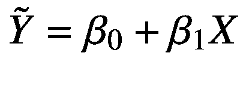用于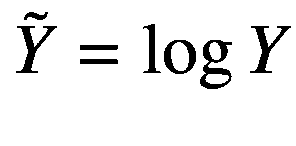。可以以这种方式转换成线性模型的问题是可以用广义线性模型处理的问题类型。*

一旦建立了模型的数学形式，下一步通常是构造所谓的设计矩阵 *y* 和 *X* ，使得回归问题可以以矩阵形式写成 *y* = *Xβ* + *ε* ，其中 *y* 是观测值的向量(或矩阵) *β* 是系数的向量，而 *ε* 设计矩阵*的元素*X*<sub>*ij*</sub>X*是对应于每个系数 *β* <sub>*j*</sub> 和观测值 *y* <sub>*i*</sub> 的解释变量(函数)的值。statsmodels 和其他统计建模库中的许多统计模型求解器可以将设计矩阵 *X* 和 *y* 作为输入。

例如，如果观测值为*y*=【1，2，3，4，5】带有两个自变量，对应值为*x*T5】1=【6，7，8，9，10】和*x*<sub>2</sub>=【11，12，13，14，15】， 而如果考虑的线性模型是*Y*=*β*<sub>0</sub>+*β*<sub>1</sub>*X*<sub>1</sub>+*β*<sub>2*X*<sub>2</sub>+*β*<sub>3</sub>*X *那么右边的设计矩阵就是 *X* = [ **1** ，*X<sub>1</sub>， *x* <sub>2</sub> ，*X*<sub>1</sub>*X*<sub>2</sub>。 我们可以使用 NumPy `vstack`函数构建这个设计矩阵:***</sub>

```py
In [9]: y = np.array([1, 2, 3, 4, 5])
In [10]: x1 = np.array([6, 7, 8, 9, 10])
In [11]: x2 = np.array([11, 12, 13, 14, 15])
In [12]: X = np.vstack([np.ones(5), x1, x2, x1*x2]).T
In [13]: X
Out[13]: array([[   1.,    6.,   11.,   66.],
                [   1.,    7.,   12.,   84.],
                [   1.,    8.,   13.,  104.],
                [   1.,    9.,   14.,  126.],
                [   1.,   10.,   15.,  150.]])

```

给定设计矩阵 *X* 和观测向量 *y* ，我们可以求解未知的系数向量 *β* ，例如，使用最小二乘法拟合(参见章节 [5](05.html) 和 [6](06.html) ):

```py
In [14]: beta, res, rank, sval = np.linalg.lstsq(X, y)
In [15]: beta
Out[15]: array([ -5.55555556e-01, 1.88888889e+00, -8.88888889e-01, -1.33226763e-15])

```

这些步骤是最简单形式的统计建模的本质。然而，对这种基本方法的变化和扩展使统计建模成为一个独立的领域，并需要计算框架，如用于系统分析的 statsmodels。例如，虽然在这个简单的例子中构建设计矩阵 *X* 很简单，但对于更复杂的模型，如果我们希望能够轻松地改变模型的定义方式，这可能会很乏味。这就是 Patsy 库出现的地方。它为定义模型和自动构建相关的设计矩阵提供了一种方便的(尽管不一定直观)公式语言。为了构建 Patsy 公式的设计矩阵，我们可以使用`patsy.dmatrices`函数。它将一个字符串形式的公式作为第一个参数，将一个类似字典的对象作为第二个参数，该对象包含用于响应和解释变量的数据数组。Patsy 公式的基本语法是`"y ~ x1 + x2 + ..."`，这意味着`y`是解释变量`x1`和`x2`(明确包括截距系数)的线性组合。关于 Patsy 公式语法的总结，见表 [14-1](#Tab1) 。

作为介绍性的例子，再次考虑线性模型*Y*=*β*<sub>0</sub>+*β*<sub>1</sub>*X<sub>1</sub>+*β*<sub>2</sub>*X*<sub>2</sub>+*β*<sub>3</sub>*X*【T30 为了用 Patsy 定义这个模型，我们可以使用公式`"y ~ 1 + x1 + x2 + x1*x2"`。注意，我们在模型公式中省略了系数，因为它隐含地假设公式中的每一项都有一个模型参数作为系数。除了指定公式，我们还需要创建一个字典`data`，将变量名映射到相应的数据数组:*

```py
In [16]: data = {"y": y, "x1": x1, "x2": x2}
In [17]: y, X = patsy.dmatrices("y ~ 1 + x1 + x2 + x1*x2", data)

```

结果是两个数组`y`和`X`，它们是给定数据数组和指定模型公式的设计矩阵:

```py
In [18]: y
Out[18]: DesignMatrix with shape (5, 1)
           y
           1
           2
           3
           4
           5
         Terms:
           'y' (column 0)
In [19]: X
Out[19]: DesignMatrix with shape (5, 4)
           Intercept  x1  x2  x1:x2
                   1   6  11     66
                   1   7  12     84
                   1   8  13    106
                   1   9  14    126
                   1  10  15    150
           Terms:
             'Intercept' (column 0)
             'x1' (column 1)
             'x2' (column 2)
             'x1:x2' (column 3)

```

这些数组的类型是`DesignMatrix`，它是 Patsy 提供的标准 NumPy 数组的子类，包含额外的元数据和修改过的打印表示。

```py
In [20]: type(X)
Out[20]: patsy.design_info.DesignMatrix

```

注意，`DesignMatrix`数组的数值等于我们之前使用`vstack`生成的显式构造的数组的数值。

作为 NumPy `ndarray`的子类，`DesignMatrix`类型的数组与期望 NumPy 数组作为输入的代码完全兼容。然而，我们也可以使用`np.array`函数将一个`DesignMatrix`实例显式地转换成一个`ndarray`对象，尽管这通常是不必要的。

```py
In [21]: np.array(X)
Out[21]: array([[   1.,    6.,   11.,   66.],
                [   1.,    7.,   12.,   84.],
                [   1.,    8.,   13.,  104.],
                [   1.,    9.,   14.,  126.],
                [   1.,   10.,   15.,  150.]])

```

或者，我们可以将`return_type`参数设置为`"dataframe"`，在这种情况下，`patsy.dmatrices`函数以 Pandas`DataFrame`对象的形式返回设计矩阵。还要注意，由于`DataFrame`对象的行为类似于字典对象，所以我们可以使用数据框来指定模型数据作为`patsy.dmatrices`函数的第二个参数。

<colgroup><col class="tcol1 align-left"> <col class="tcol2 align-left"> <col class="tcol3 align-left"> <col class="tcol4 align-left"> <col class="tcol5 align-left"></colgroup> 
|   | `Intercept` | `x1` | `x2` | `x1:x2` |
| `0` | `1` | `6` | `11` | `66` |
| `1` | `1` | `7` | `12` | `84` |
| `2` | `1` | `8` | `13` | `104` |
| `3` | `1` | `9` | `14` | `126` |
| `4` | `1` | `10` | `15` | `150` |

```py
In [22]: df_data = pd.DataFrame(data)
In [23]: y, X = patsy.dmatrices("y ~ 1 + x1 + x2 + x1:x2", df_data, return_type="dataframe")
In [24]: X
Out[24]:

```

在 Patsy 的帮助下，我们现在已经自动创建了求解统计模型所需的设计矩阵，例如，使用`np.linalg.lstsq`函数(正如我们前面看到的一个例子)，或者使用 statsmodels 库提供的许多统计模型求解器之一。例如，要执行普通的线性回归(OLS)，我们可以使用 statsmodels 库中的类`OLS`，而不是使用底层方法`np.linalg.lstsq`。statsmodels 中几乎所有统计模型的类都将设计矩阵`y`和`X`作为第一个和第二个参数，并返回一个表示模型的类实例。为了使模型符合设计矩阵中编码的数据，我们需要调用`fit`方法，该方法返回一个包含拟合参数(以及其他属性)的结果对象:

```py
In [25]: model = sm.OLS(y, X)
In [26]: result = model.fit()
In [27]: result.params
Out[27]: Intercept   -5.555556e-01
         x1           1.888889e+00
         x2          -8.888889e-01
         x1:x2       -8.881784e-16
         dtype: float64

```

请注意，结果相当于我们在本章前面计算的最小二乘拟合。使用 statsmodels 公式 API(我们作为`smf`导入的模块)，我们可以在创建模型实例时直接传递模型的 Patsy 公式，这完全消除了首先创建设计矩阵的需要。我们不是将`y`和`X`作为参数传递，而是传递 Patsy 公式和包含模型数据的类似字典的对象(例如，Pandas 数据框)。

```py
In [28]: model = smf.ols("y ~ 1 + x1 + x2 + x1:x2", df_data)
In [29]: result = model.fit()
In [30]: result.params
Out[30]: Intercept   -5.555556e-01
         x1           1.888889e+00
         x2          -8.888889e-01
         x1:x2       -8.881784e-16
         dtype: float64

```

使用 statsmodels 而不是显式构造 NumPy 数组并调用 NumPy 最小二乘模型的优点当然是，这个过程的大部分是在 statsmodels 中自动完成的，这使得在统计模型中添加和删除术语成为可能，而无需任何额外的工作。此外，当使用 statsmodels 时，我们可以使用大量的线性模型求解器和统计测试来分析模型与数据的拟合程度。Patsy 公式语言汇总见表 [14-1](#Tab1) 。

表 14-1

Patsy 公式语法的简化摘要。有关公式语法的完整说明，请参见位于 [`http://patsy.readthedocs.org/en/latest`](http://patsy.readthedocs.org/en/latest) 的 Patsy 文档

<colgroup><col class="tcol1 align-left"> <col class="tcol2 align-left"> <col class="tcol3 align-left"></colgroup> 
| 

句法

 | 

例子

 | 

描述

 |
| --- | --- | --- |
| `lhs ~ rhs` | `y ~ x``(Equivalent to y ~ 1 + x)` | ~字符用于分隔模型方程的左侧(包含因变量)和右侧(包含自变量)。 |
| `var * var` | `x1*x2``(Equivalent to x1+x2+x1*x2)` | 隐式包含其所有低阶相互作用项的相互作用项。 |
| `var + var + ...` | `x1 + x2 + ...``(Equivalent to y ~ 1 + x1 + x2)` | 加号用来表示项的联合。 |
| `var:var` | `x1:x2` | 冒号字符表示纯交互项(例如，*x*<sub>1</sub>∙*x*<sub>2</sub>)。 |
| `f(expr)` | `np.log(x), np.cos(x+y)` | 任意 Python 函数(通常是 NumPy 函数)可用于转换表达式中的术语。函数自变量的表达式被解释为算术表达式，而不是 Patsy 中使用的类似集合的公式运算。 |
| `I(expr)` | `I(x+y)` | `I`是 Patsy 提供的恒等函数，可用于对算术表达式进行转义，以便将其解释为算术运算。 |
| `C(var)` | `C(x), C(x, Poly)` | 将变量`x`视为分类变量，并将其值扩展为正交虚拟变量。 |

现在，我们已经了解了如何使用 Patsy 公式来构建设计矩阵，或者直接与 statsmodels 中的众多统计模型类之一一起使用，在我们继续并更详细地了解 statsmodels 库中可用的不同统计模型之前，我们简单地返回一下 Patsy 公式的语法和符号约定。如前文所述，并在表 [14-1](#Tab1) 中总结，模型公式的基本语法形式为“LHS ~ RHS”。~字符用于分隔模型方程的左侧(LHS)和右侧(RHS)。LHS 指定了构成响应变量的项，而 RHS 指定了构成解释变量的项。LHS 和 RHS 表达式中的术语由`+`或`–`符号分隔，但这些符号不应被解释为算术运算符，而是集合并和集合差运算符。例如，`a+b`表示 *a* 和 *b* 都包含在模型中，`-a`表示术语 *a* 是*而不是*包含在模型中。类型`a*b`的表达式自动扩展为`a + b + a:b`，其中`a:b`是纯交互项*a*∏*b*。

作为一个具体的例子，考虑下面的公式和由此产生的右侧术语(我们可以使用`term_names`属性从`design_info`属性中提取):

```py
In [31]: from collections import defaultdict
In [32]: data = defaultdict(lambda: np.array([]))
In [33]: patsy.dmatrices("y ~ a", data=data)[1].design_info.term_names
Out[33]: ['Intercept', 'a']

```

这里的两项是`Intercept`和`a`，它们对应于常数和对 *a* 的线性依赖。默认情况下，Patsy 总是包含截距常数，在 Patsy 公式中，也可以使用`y ~ 1 + a`显式地写出截距常数。在 Patsy 公式中包含`1`是可选的。

```py
In [34]: patsy.dmatrices("y ~ 1 + a + b", data=data)[1].design_info.term_names
Out[34]: ['Intercept', 'a', 'b']

```

在这种情况下，我们多了一个解释变量(a 和 b ),截距明确包含在公式中。如果我们不想在模型中包含截距，我们可以使用符号-1 来删除此项:

```py
In [35]: patsy.dmatrices("y ~ -1 + a + b", data=data)[1].design_info.term_names
Out[35]: ['a', 'b']

```

类型`a * b`的表达式被自动扩展以包括所有低阶交互项:

```py
In [36]: patsy.dmatrices("y ~ a * b", data=data)[1].design_info.term_names
Out[36]: ['Intercept', 'a', 'b', 'a:b']

```

高阶展开也适用:

```py
In [37]: patsy.dmatrices("y ~ a * b * c", data=data)[1].design_info.term_names
Out[37]: ['Intercept', 'a', 'b', 'a:b', 'c', 'a:c', 'b:c', 'a:b:c']

```

要从公式中删除一个特定的项，我们可以在该项前面加上减号运算符。例如，要从自动展开的`a*b*c`中移除纯三阶相互作用项`a:b:c`，我们可以使用

```py
In [38]: patsy.dmatrices("y ~ a * b * c - a:b:c", data=data)[1].design_info.term_names
Out[38]: ['Intercept', 'a', 'b', 'a:b', 'c', 'a:c', 'b:c']

```

在 Patsy 中,+和-操作符用于对术语集进行类似集合的操作；如果我们需要表示算术运算，我们需要将表达式包装在函数调用中。为了方便起见，Patsy 提供了一个名为`I`的身份函数，可用于此目的。为了说明这一点，考虑下面两个例子，它们显示了`y ~ a + b`和`y ~ I(a + b)`的结果项:

```py
In [39]: data = {k: np.array([]) for k in ["y", "a", "b", "c"]}
In [40]: patsy.dmatrices("y ~ a + b", data=data)[1].design_info.term_names
Out[40]: ['Intercept', 'a', 'b']
In [41]: patsy.dmatrices("y ~ I(a + b)", data=data)[1].design_info.term_names
Out[41]: ['Intercept', 'I(a + b)']

```

这里，设计矩阵中对应于名为`I(a+b)`的项的列是变量`a`和`b`的数组的算术和。如果我们想要包含表示为变量幂的项，必须使用相同的技巧:

```py
In [42]: patsy.dmatrices("y ~ a**2", data=data)[1].design_info.term_names
Out[42]: ['Intercept', 'a']
In [43]: patsy.dmatrices("y ~ I(a**2)", data=data)[1].design_info.term_names
Out[43]: ['Intercept', 'I(a ** 2)']

```

我们在这里使用的符号`I(...)`是一个函数调用符号的例子。我们可以在 Patsy 公式中应用输入数据的转换，方法是在公式中包含任意 Python 函数调用。特别是，我们可以使用 NumPy 中的函数来转换输入数据数组:

```py
In [44]: patsy.dmatrices("y ~ np.log(a) + b", data=data)[1].design_info.term_names
Out[44]: ['Intercept', 'np.log(a)', 'b']

```

或者我们甚至可以用任意的 Python 函数来转换变量:

```py
In [45]: z = lambda x1, x2: x1+x2
In [46]: patsy.dmatrices("y ~ z(a, b)", data=data)[1].design_info.term_names
Out[46]: ['Intercept', 'z(a, b)']

```

到目前为止，我们已经考虑了具有数字响应和解释变量的模型。统计建模还经常包括分类变量，分类变量可以采用一组离散的值，这些值没有有意义的数字顺序(例如，“女性”或“男性”)；键入“A”、“B”或“C”；等等。).当在线性模型中使用这样的变量时，我们通常需要通过引入二进制虚拟变量来重新编码它们。在 patsy 公式中，任何没有数字数据类型(`float`或`int`)的变量都将被解释为分类变量，并相应地自动编码。对于数值变量，我们可以使用`C(x)`符号来明确要求将变量`x`视为分类变量。

例如，比较以下两个显示公式`"y ~ - 1 + a"`和`"y ~ - 1 + C(a)"`的设计矩阵的示例，这两个示例分别对应于`a`是数字和分类解释变量的模型:

<colgroup><col class="tcol1 align-left"> <col class="tcol2 align-left"></colgroup> 
|   | `a` |
| `0` | `1` |
| `1` | `2` |
| `2` | `3` |

```py
In [48]: data = {"y": [1, 2, 3], "a": [1, 2, 3]}
In [48]: patsy.dmatrices("y ~ - 1 + a", data=data, return_type="dataframe")[1]
Out[48]:

```

对于数值变量，设计矩阵中的相应列简单地对应于数据向量，而对于分类变量`C(a)`,新的二进制值列(对原始变量的单个值进行类似掩码的编码)被添加到设计矩阵中:

<colgroup><col class="tcol1 align-left"> <col class="tcol2 align-left"> <col class="tcol3 align-left"> <col class="tcol4 align-left"></colgroup> 
|   | `C(a)[1]` | `C(a)[2]` | `C(a)[3]` |
| `0` | `1` | `0` | `0` |
| `1` | `0` | `1` | `0` |
| `2` | `0` | `0` | `1` |

```py
In [49]: patsy.dmatrices("y ~ - 1 + C(a)", data=data, return_type="dataframe")[1]
Out[49]:

```

具有非数值的变量被自动解释并被视为分类值:

<colgroup><col class="tcol1 align-left"> <col class="tcol2 align-left"> <col class="tcol3 align-left"> <col class="tcol4 align-left"></colgroup> 
|   | `a[type A]` | `a[type B]` | `a[type C]` |
| `0` | `1` | `0` | `0` |
| `1` | `0` | `1` | `0` |
| `2` | `0` | `0` | `1` |

```py
In [50]: data = {"y": [1, 2, 3], "a": ["type A", "type B", "type C"]}
In [51]: patsy.dmatrices("y ~ - 1 + a", data=data, return_type="dataframe")[1]
Out[51]:

```

用户可以更改和扩展将分类变量编码成二进制值处理字段的默认类型。例如，用正交多项式代替治疗指标对分类变量进行编码，我们可以使用`C(a, Poly)`:

<colgroup><col class="tcol1 align-left"> <col class="tcol2 align-left"> <col class="tcol3 align-left"> <col class="tcol4 align-left"></colgroup> 
|   | `C(a, Poly).Constant` | `C(a, Poly).Linear` | `C(a, Poly).Quadratic` |
| `0` | `1` | `-7.071068e-01` | `0.408248` |
| `1` | `1` | `-5.551115e-17` | `-0.816497` |
| `2` | `1` | `7.071068e-01` | `0.408248` |

```py
In [52]: patsy.dmatrices("y ~ - 1 + C(a, Poly)", data=data, return_type="dataframe")[1]
Out[52]:

```

Patsy 对分类变量的自动编码是 Patsy 公式的一个非常方便的方面，它允许用户轻松地添加和删除模型中的数字和分类变量。这可以说是使用 Patsy 库定义模型方程的主要优势之一。

## 线性回归

statsmodels 库支持多种类型的统计模型，这些模型适用于不同的情况，但几乎都遵循相同的使用模式，这使得在不同的模型之间切换变得很容易。statsmodels 中的统计模型由模型类表示。给定线性模型的响应和解释变量的设计矩阵，或给定 Patsy 公式和数据框(或另一个类似字典的对象)，可以启动这些。使用 statsmodels 设置和分析统计模型时的基本工作流程包括以下步骤:

1.  创建一个模型类的实例，例如，使用`model = sm.MODEL(y, X)`或`model = smf.model(formula, data`)，其中`MODEL`和`model`是一个特定模型的名称，如 OLS、GLS、Logit 等。这里的约定是，大写名称用于将设计矩阵作为参数的类，小写名称用于将 Patsy 公式和数据框作为参数的类。

2.  创建模型实例不执行任何计算。为了使模型适合数据，我们必须调用`fit`方法`result = model.fit()`，该方法执行拟合并返回一个结果对象，该对象具有用于进一步分析的方法和属性。

3.  打印由`fit`方法返回的结果对象的汇总统计数据。对于每个统计模型，result 对象的内容略有不同，但是大多数模型都实现了方法`summary`，该方法生成描述拟合结果的摘要文本，包括几种类型的统计数据，这些统计数据可用于判断统计模型是否成功地解释了数据。在分析拟合过程的结果时，查看`summary`方法的输出通常是一个很好的起点。

4.  后处理模型拟合结果:除了`summary`方法，结果对象还包含用于获得拟合参数(`params`)、模型和数据的残差(`resid`)、拟合值(`fittedvalues`)的方法和属性，以及用于预测新自变量的响应变量值的方法(`predict`)。

5.  最后，可视化拟合结果可能是有用的，例如，使用 Matplotlib 和 Seaborn 图形库，使用直接包含在 statsmodels 库中的许多图形例程中的一些(参见`statsmodels.graphics`模块)。

为了用一个简单的例子来演示这个工作流程，下面我们考虑拟合一个模型来生成其真实值为*y*= 1+2*x*<sub>1</sub>+3*x*<sub>2</sub>+4*x*<sub>1</sub>*x*<sub>2</sub>的数据。我们首先将数据存储在 Pandas 数据框对象中:

```py
In [53]: N = 100
In [54]: x1 = np.random.randn(N)
In [55]: x2 = np.random.randn(N)
In [56]: data = pd.DataFrame({"x1": x1, "x2": x2})
In [57]: def y_true(x1, x2):
    ...:     return 1  + 2 * x1 + 3 * x2 + 4 * x1 * x2
In [58]: data["y_true"] = y_true(x1, x2)

```

这里我们将 *y* 的真值存储在`DataFrame`对象`data`的`y_true`列中。我们通过向真实值添加正态分布噪声来模拟对 *y* 的噪声观察，并将结果存储在`y`列中:

```py
In [59]: e = 0.5 * np.random.randn(N)
In [60]: data["y"] = data["y_true"] + e

```

现在，从数据中我们知道，除了响应变量`y`，我们还有两个解释变量`x1`和`x2`。最简单的可能模型我们可以从线性模型*Y*=*β*<sub>0</sub>+*β*<sub>1</sub>*x*<sub>1</sub>+*β*<sub>2</sub>*x*<sub>2</sub>开始，我们可以用 Patsy 公式`"y ~ x1 + x2"`来定义。因为响应变量是连续的，所以使用普通的线性正方形来拟合模型和数据是一个很好的起点，为此我们可以使用`smf.ols`类。

```py
In [61]: model = smf.ols("y ~ x1 + x2", data)
In [62]: result = model.fit()

```

请记住，普通最小二乘回归假设拟合模型和数据的残差呈正态分布。然而，在分析数据之前，我们可能不知道这个条件是否满足。尽管如此，我们可以从将数据拟合到模型开始，并使用图形方法和统计测试来调查残差的分布(使用残差确实是正态分布的零假设)。使用`summary`方法可以显示许多有用的信息，包括几种类型的测试统计数据:

```py
In [63]: print(result.summary())
                            OLS Regression Results===========================================================================
Dep. Variable:                      y   R-squared:                    0.380
Model:                            OLS   Adj. R-squared:               0.367
Method:                 Least Squares   F-statistic:                  29.76
Date:                Wed, 22 Apr 2015   Prob (F-statistic):        8.36e-11
Time:                        22:40:33   Log-Likelihood:             -271.52
No. Observations:                 100   AIC:                          549.0
Df Residuals:                      97   BIC:                          556.9
Df Model:                           2
Covariance Type:            nonrobust===========================================================================
                 coef    std err          t      P>|t|      [95.0% Conf. Int.]
------------------------------------------------------------------------------
Intercept      0.9868      0.382      2.581      0.011         0.228     1.746
x1             1.0810      0.391      2.766      0.007         0.305     1.857
x2             3.0793      0.432      7.134      0.000         2.223     3.936  ===========================================================================
Omnibus:                       19.951   Durbin-Watson:                   1.682
Prob(Omnibus):                  0.000   Jarque-Bera (JB):               49.964
Skew:                          -0.660   Prob(JB):                     1.41e-11
Kurtosis:                       6.201   Cond. No.    1.32===========================================================================
Warnings: [1] Standard errors assume that the covariance matrix of the errors is correctly specified.

```

`summary`方法产生的输出相当冗长，对该方法提供的所有信息的详细描述超出了本文的讨论范围。相反，这里我们只关注几个关键指标。首先，`R-squared`值是一个统计量，它表明模型与数据的吻合程度。它可以取 0 到 1 之间的值，其中 R 平方统计值为 1 相当于完全符合。在前面的总结方法中报告的 0.380 的 R 平方值相当差，这表明我们需要改进我们的模型(这是预期的，因为我们忽略了相互作用项*x*T5】1∙*x*T9】2)。我们还可以使用`rsquared`属性从结果对象中显式访问 R 平方统计量。

```py
In [64]: result.rsquared
Out[64]: 0.38025383255132539

```

此外，表格中间的`coef`栏提供了拟合的模型参数。假设残差确实是正态分布的，`std err`列提供了模型系数的标准误差的估计值，`t`和`P>|t|`列是统计量 *t* 和相应的统计测试值 *p* ，假设相应的系数为零。因此，在记住该分析假设残差呈正态分布的同时，我们可以寻找具有小*p*-值的列，并判断哪些解释变量的系数很可能不为零(这意味着它们具有显著的预测能力)。

为了调查正态分布误差的假设是否合理，我们需要查看模型拟合数据的残差。残差可通过结果对象的`resid`属性访问:

```py
In [65]: result.resid.head()
Out[65]: 0    -3.370455
         1    -11.153477
         2    -11.721319
         3    -0.948410
         4    0.306215
         dtype: float64

```

使用这些残差，我们可以使用 SciPy `stats`模块中的`normaltest`函数来检查正态性:

```py
In [66]: z, p = stats.normaltest(result.fittedvalues.values)
In [67]: p
Out[67]: 4.6524990253009316e-05

```

对于这个例子，得到的 *p* 值确实非常小，这表明我们可以拒绝残差是正态分布的零假设(即，我们可以得出结论，正态分布残差的假设被违反)。检查样本正态性的图形方法是使用来自`statsmodels.graphics`模块的`qqplot`。如果采样值确实是正态分布的，比较样本分位数和理论分位数的 QQ 图应该接近直线。以下对`smg.qqplot`的函数调用产生了如图 [14-1](#Fig1) 所示的 QQ 图:

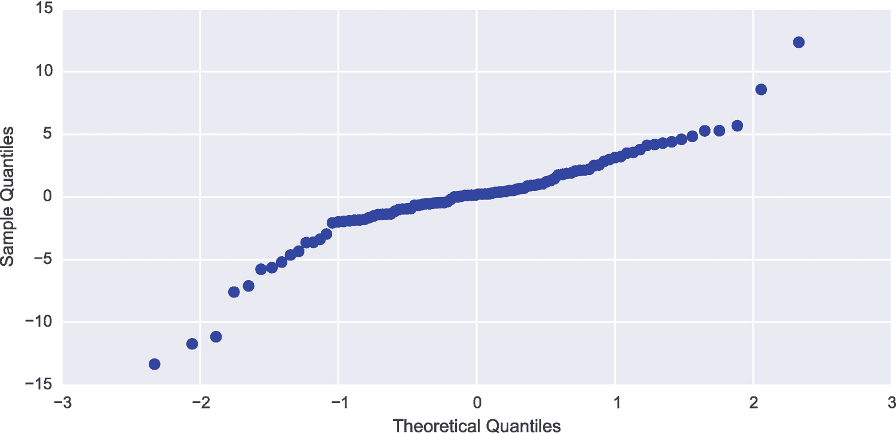

图 14-1

不含交互项的两个解释变量线性模型的 QQ 图

```py
In [68]: fig, ax = plt.subplots(figsize=(8, 4))
    ...: smg.qqplot(result.resid, ax=ax)

```

如图 [14-1](#Fig1) 所示，QQ 图中的点明显偏离线性关系，表明观察到的残差不太可能是正态分布随机变量的样本。总之，这些指标证明我们使用的模型是不充分的，我们可能需要改进模型。我们可以将缺失的相互作用项添加到 Patsy 公式中，并重复前面分析的步骤:

```py
In [69]: model = smf.ols("y ~ x1 + x2 + x1*x2", data)
In [70]: result = model.fit()
In [71]: print(result.summary())
                            OLS Regression Results===========================================================================
Dep. Variable:                      y   R-squared:                       0.963
Model:                            OLS   Adj. R-squared:                  0.961
Method:                 Least Squares   F-statistic:                     821.8
Date:                Tue, 21 Apr 2015   Prob (F-statistic):           2.69e-68
Time:                        23:52:12   Log-Likelihood:                -138.39
No. Observations:                 100   AIC:                             284.8
Df Residuals:                      96   BIC:                             295.2
Df Model:                           3
Covariance Type:            nonrobust ===========================================================================
                 coef    std err          t      P>|t|      [95.0% Conf. Int.]
------------------------------------------------------------------------------
Intercept      1.1023      0.100     10.996      0.000         0.903     1.301
x1             2.0102      0.110     18.262      0.000         1.792     2.229
x2             2.9085      0.095     30.565      0.000         2.720     3.097
x1:x2          4.1715      0.134     31.066      0.000         3.905     4.438==============================================================================
Omnibus:                        1.472   Durbin-Watson:                   1.912
Prob(Omnibus):                  0.479   Jarque-Bera (JB):                0.937
Skew:                           0.166   Prob(JB):                        0.626
Kurtosis:                       3.338   Cond. No.                         1.54==============================================================================
Warnings: [1] Standard errors assume that the covariance matrix of the errors is correctly specified.

```

在这种情况下，我们可以看到 R 平方统计值明显更高，为 0.963，表明模型和数据之间几乎完全一致。

```py
In [72]: result.rsquared
Out[72]: 0.96252198253140375

```

请注意，我们总是可以通过引入更多变量来增加 R 平方统计量，但我们希望确保不添加预测能力低的变量(系数小且对应的 p 值高)，因为这将使模型容易过度拟合，并且通常我们要求残差呈正态分布。用更新后的模型重复正态性检验和先前分析的 QQ 图，得到相对较高的*p*-值(0.081)和相对线性的 QQ 图(见图 [14-2](#Fig2) )。这表明，在这种情况下，残差很可能是正态分布的(在本例中，我们知道它们是通过设计得到的)。

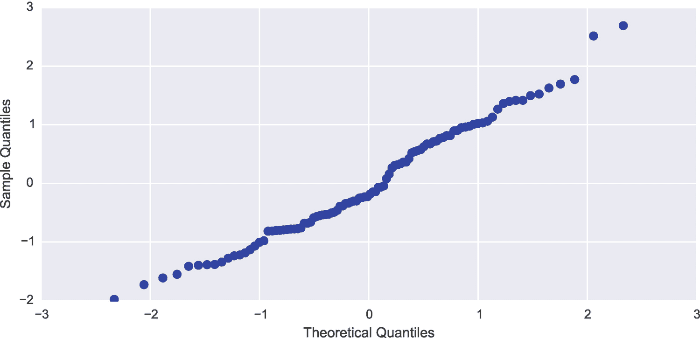

图 14-2

具有交互项的两个解释变量的线性模型的 QQ 图

```py
In [73]: z, p = stats.normaltest(result.fittedvalues.values)
In [74]: p
Out[74]: 0.081352587523644201
In [75]: fig, ax = plt.subplots(figsize=(8, 4))
    ...: smg.qqplot(result.resid, ax=ax)

```

一旦我们对模型的拟合度感到满意，我们就可以使用`params`属性从结果对象中提取模型系数。

```py
In [76]: result.params
Out[76]: Intercept    1.102297
         x1           2.010154
         x2           2.908453
         x1:x2        4.171501
         dtype: float64

```

此外，我们可以使用`predict`方法预测新观察值，该方法将一个 NumPy 数组或`DataFrame`对象作为自变量的值(在本例中为 *x* <sub>1</sub> 和*x*T8】2)。例如，由于当前问题只有两个独立变量，我们可以将模型的预测可视化为等值线图。为此，我们首先用 *x* <sub>1</sub> 和 *x* <sub>2</sub> 值构造一个 DataFrame 对象，我们希望使用拟合的模型预测其 *y* 值。

```py
In [77]: x = np.linspace(-1, 1, 50)
In [78]: X1, X2 = np.meshgrid(x, x)
In [79]: new_data = pd.DataFrame({"x1": X1.ravel(), "x2": X2.ravel()})

```

使用从模型拟合中获得的结果对象的`predict`方法，我们可以为响应变量的新值集计算预测的 y 值。

```py
In [80]: y_pred = result.predict(new_data)

```

结果是一个 NumPy 数组(vector ),其长度与数据向量`X1.ravel()`和`X2.ravel()`相同。为了能够使用 Matplotlib contour 函数绘制数据，我们首先将`y_pred`向量调整为一个正方形矩阵。

```py
In [81]: y_pred.shape
Out[81]: (2500,)
In [82]: y_pred = y_pred.values.reshape(50, 50)

```

真实模型和拟合模型的等高线图如图 [14-3](#Fig3) 所示，这表明拟合模型与 *y* 的 100 个噪声观测值的一致性足以相当精确地再现本例中的函数。

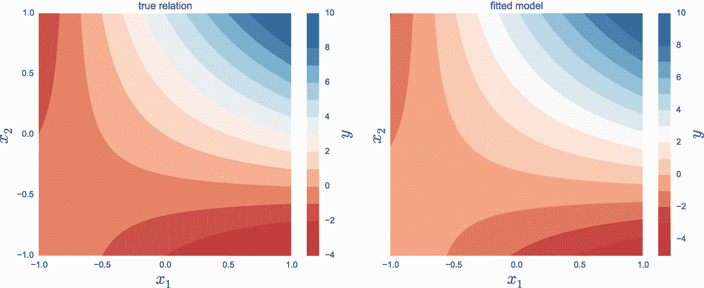

图 14-3

真实关系和正确模型对来自具有正态分布噪声的真实关系的 100 个样本的拟合

```py
In [83]: fig, axes = plt.subplots(1, 2, figsize=(12, 5), sharey=True)
    ...: def plot_y_contour(ax, Y, title):
    ...:     c = ax.contourf(X1, X2, Y, 15, cmap=plt.cm.RdBu)
    ...:     ax.set_xlabel(r"$x_1$", fontsize=20)
    ...:     ax.set_ylabel(r"$x_2$", fontsize=20)
    ...:     ax.set_title(title)
    ...:     cb = fig.colorbar(c, ax=ax)
    ...:     cb.set_label(r"$y$", fontsize=20)
    ...:
    ...: plot_y_contour(axes[0], y_true(X1, X2), "true relation")
    ...: plot_y_contour(axes[1], y_pred, "fitted model")

```

在我们这里看到的例子中，我们使用了普通的最小二乘法(`ols`)来拟合模型和数据。也有其他几种选择，如稳健线性模型(`rlm`)适用于观测值中存在显著异常值的情况，以及广义线性模型的变体适用于响应变量只能取离散值的情况。这是下一节的主题。在下一章中，我们还将看到正则化回归的例子，其中最小化目标被修改为不仅最小化残差的平方，而且，例如，惩罚模型中的大系数。

### 示例数据集

使用统计方法时，有示例数据集可供探索是很有帮助的。statsmodels 包提供了一个接口，用于从 R statistical 软件的一个庞大的数据集存储库 <sup>[3](#Fn3)</sup> 加载示例数据集。模块`sm.datasets`包含一个函数`get_rdataset`，可以用来加载 [`http://vincentarelbundock.github.io/Rdatasets/datasets.html`](http://vincentarelbundock.github.io/Rdatasets/datasets.html) 页面上列出的数据集。`get_rdataset`函数获取数据集的名称，也可以选择获取包的名称(数据集分组)。

例如，要从包`Ecdat`中加载名为`Icecream`的数据集，我们可以使用

```py
In [84]: dataset = sm.datasets.get_rdataset("Icecream", "Ecdat")

```

结果是具有数据集和描述数据集的元数据的数据结构。数据集的名称由`title`属性给出，`__doc__`属性包含描述数据集的说明性文本(太长，无法在此显示):

```py
In [85]: dataset.title
Out[85]: 'Ice Cream Consumption'

```

Pandas`DataFrame`对象形式的数据可通过`data`属性访问:

```py
In [86]: dataset.data.info()
<class 'pandas.core.frame.DataFrame'>
Int64Index: 30 entries, 0 to 29
Data columns (total 4 columns):
cons      30 non-null float64
income    30 non-null int64
price     30 non-null float64
temp      30 non-null int64
dtypes: float64(2), int64(2)
memory usage: 1.2 KB

```

从`DataFrame`方法`info`给出的输出中，我们可以看到`Icecream`数据集包含四个变量:`cons`(消费)`income``price,`和`temp`(温度)。一旦加载了数据集，我们就可以探索它，并按照通常的程序使其适合统计模型。例如，要将消费建模为价格和温度作为独立变量的线性模型，我们可以使用

```py
In [87]: model = smf.ols("cons ~ -1 + price + temp", data=dataset.data)
In [88]: result = model.fit()

```

可以使用描述性统计和统计测试来分析结果对象，例如，从打印来自`summary`方法的输出开始，就像我们之前看到的那样。我们也可以采用图形化的方法，绘制回归图，例如，使用`smg`模块中的`plot_fit`函数(参见`seaborn`库中的`regplot`函数):

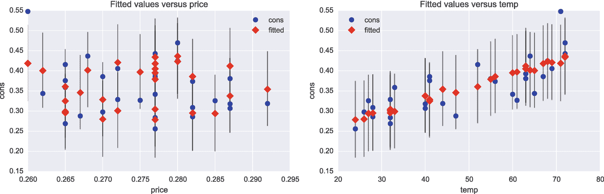

图 14-4

冰淇淋数据集中消费与价格和温度的拟合回归图

```py
In [89]: fig, (ax1, ax2) = plt.subplots(1, 2, figsize=(12, 4))
​    ...: smg.plot_fit(result, 0, ax=ax1)
    ...: smg.plot_fit(result, 1, ax=ax2)

```

从图 [14-4](#Fig4) 所示的回归图中，我们可以得出结论，在这个冰淇淋数据集中，消费量似乎与温度呈线性相关，但与价格没有明显的相关性(可能是因为价格范围相当小)。在开发统计模型时，`plot_fit`等图形工具可能是一个有用的工具。

## 离散回归

与我们目前所见的线性回归模型相比，离散因变量回归(如二元结果)需要不同的技术。原因是线性回归要求响应变量是正态分布的*连续*变量，不能直接用于只有少数离散可能结果的响应变量，如二元变量或取正整数值的变量。但是，使用适当的变换，可以将线性预测值映射到一个区间，该区间可以解释为不同离散结果的概率。例如，在二元结果的情况下，一种流行的转换是逻辑函数 log(*p*/(1*p*)=*β*<sub>0</sub>+*β*∙*x*，或者*p*=(1+exp(*β*<sub>0</sub>-*β*<sub>1 换句话说，连续或离散的特征向量 *x* 通过模型参数*β*T36】0</sub>和*β*T40】1 以及到概率 p 的逻辑变换来映射，如果*p*T52】0.5，则可以认为 *y* = 0，可以认为 *p* ≥ 0.5 这个过程被称为逻辑回归，是二元分类器的一个例子。我们将在关于机器学习的第 [15](15.html) 章中看到更多关于分类器的内容。

statsmodels 库提供了几种离散回归的方法，包括`Logit`类、 <sup>[4](#Fn4)</sup> 相关的概率单位类(使用正态分布的累积分布函数而不是逻辑函数将线性预测值转换为[0，1]区间)、多项式逻辑回归类`MNLogit`(用于两个以上的类别)，以及用于泊松分布计数变量(正整数)的泊松回归类`Poisson`。

### 逻辑回归

作为如何使用 statsmodels 执行逻辑回归的示例，我们首先使用`sm.datasets.get_rdataset`函数加载一个经典数据集，该数据集包含鸢尾花样本的萼片和花瓣长度和宽度，以及花的种类分类。这里，我们将选择对应于两个不同物种的数据集子集，并创建一个逻辑模型，用于根据花瓣长度和宽度的值预测物种的类型。`info`方法总结了数据集中包含的变量:

```py
In [90]: df = sm.datasets.get_rdataset("iris").data
In [91]: df.info()
<class 'pandas.core.frame.DataFrame'>
Int64Index: 150 entries, 0 to 149
Data columns (total 5 columns):
Sepal.Length    150 non-null float64
Sepal.Width     150 non-null float64
Petal.Length    150 non-null float64
Petal.Width     150 non-null float64
Species         150 non-null object
dtypes: float64(4), object(1)
memory usage: 7.0+ KB

```

要查看在`Species`列中有多少独特的物种类型，我们可以使用从数据框对象中提取列时返回的 Pandas 系列的`unique`方法:

```py
In [92]: df.Species.unique()
Out[92]: array(['setosa', 'versicolor', 'virginica'], dtype=object)

```

这个数据集包含三种不同类型的物种。为了获得可以在逻辑回归中用作响应变量的二元变量，这里我们只关注两个物种*云芝*和*海滨锦葵*的数据。为了方便起见，我们为对应于这些物种的数据集子集创建了一个新的数据框`df_subset`:

```py
In [93]: df_subset = df[df.Species.isin(["versicolor", "virginica"])].copy()

```

为了能够使用逻辑回归将其他变量作为独立变量来预测物种，我们首先需要创建一个对应于两个不同物种的二元变量。使用 Pandas 系列对象的`map`方法，我们可以将两个物种名称映射为二进制值 0 和 1。

```py
In [94]: df_subset.Species = df_subset.Species.map({"versicolor": 1, "virginica": 0})

```

我们还需要将名称中包含句点字符的列重命名为 Python 中有效的符号名称(例如，通过替换“.”带有“_”的字符，否则包含这些列名的 Patsy 公式将被错误地解释。要重命名`DataFrame`对象中的列，我们可以使用`rename`方法并传递一个带有名称翻译的字典作为`columns`参数:

```py
In [95]: df_subset.rename(columns={"Sepal.Length": "Sepal_Length",
    ...:                           "Sepal.Width": "Sepal_Width",
    ...:                           "Petal.Length": "Petal_Length",
    ...:                           "Petal.Width": "Petal_Width"}, inplace=True)

```

在这些转换之后，我们有了一个适合在逻辑回归分析中使用的`DataFrame`实例:

<colgroup><col class="tcol1 align-left"> <col class="tcol2 align-left"> <col class="tcol3 align-left"> <col class="tcol4 align-left"> <col class="tcol5 align-left"> <col class="tcol6 align-left"></colgroup> 
|   | `Sepal_Length` | `Sepal_Width` | `Petal_Length` | `Petal_Width` | `Species` |
| `50` | `7.0` | `3.2` | `4.7` | `1.4` | `1` |
| `51` | `6.4` | `3.2` | `4.5` | `1.5` | `1` |
| `52` | `6.9` | `3.1` | `4.9` | `1.5` | `1` |

```py
In [96]: df_subset.head(3)
Out[96]:

```

为了创建一个试图用`Petal_length`和`Petal_Width`作为独立变量来解释`Species`变量的值的逻辑模型，我们可以创建一个`smf.logit`类的实例并使用 Patsy 公式`"Species ~ Petal_Length + Petal_Width"`:

```py
In [97]: model = smf.logit("Species ~ Petal_Length + Petal_Width", data=df_subset)

```

像往常一样，我们需要调用结果模型实例的`fit`方法，以使模型符合所提供的数据。利用最大似然优化来执行拟合。

```py
In [98]: result = model.fit()
Optimization terminated successfully.
          Current function value: 0.102818
          Iterations 10

```

对于常规的线性回归，我们可以通过打印 result 对象的`summary`方法产生的输出来获得模型对数据的拟合的总结。特别是，我们可以看到拟合的模型参数及其 z 得分的估计值和相应的 p 值，这可以帮助我们判断解释变量在模型中是否显著。

```py
In [99]: print(result.summary())
                           Logit Regression Results===========================================================================
Dep. Variable:                Species   No. Observations:                  100
Model:                          Logit   Df Residuals:                       97
Method:                           MLE   Df Model:                            2
Date:                Sun, 26 Apr 2015   Pseudo R-squ.:                  0.8517
Time:                        01:41:04   Log-Likelihood:                -10.282
converged:                       True   LL-Null:                       -69.315LLR p-value:                 2.303e-26  ===========================================================================
                  coef    std err         z      P>|z|      [95.0% Conf. Int.]
------------------------------------------------------------------------------
Intercept      45.2723     13.612     3.326      0.001        18.594    71.951
Petal_Length   -5.7545      2.306     -2.496     0.013       -10.274    -1.235
Petal_Width   -10.4467      3.756     -2.782     0.005       -17.808    -3.086===========================================================================

```

逻辑回归的结果对象还提供了方法`get_margeff`，该方法返回一个对象，该对象还实现一个汇总方法，该方法输出关于模型中每个解释变量的边际效应的信息。

```py
In [100]: print(result.get_margeff().summary())
        Logit Marginal Effects
=====================================
Dep. Variable:                Species
Method:                          dydx
At:                           overall  ===========================================================================
                  dy/dx   std err         z      P>|z|      [95.0% Conf. Int.]
------------------------------------------------------------------------------
Petal_Length    -0.1736      0.052     -3.347     0.001       -0.275    -0.072
Petal_Width     -0.3151      0.068     -4.608     0.000       -0.449    -0.181===========================================================================

```

当我们对模型与数据的拟合感到满意时，例如，我们可以用它来预测解释变量的新值的响应变量的值。为此，我们可以在模型拟合产生的结果对象中使用`predict`方法，我们需要向它传递一个带有独立变量新值的数据框对象。

```py
In [101]: df_new = pd.DataFrame({"Petal_Length": np.random.randn(20)*0.5 + 5,
     ...:                    "Petal_Width": np.random.randn(20)*0.5 + 1.7})
In [102]: df_new["P-Species"] = result.predict(df_new)

```

结果是一个数组，其中每个观察值的概率对应于响应 *y* = 1，通过将该概率与阈值 0.5 进行比较，我们可以为响应变量的二进制值生成预测:

```py
In [103]: df_new["P-Species"].head(3)
Out[103]: 0    0.995472
          1    0.799899
          2    0.000033
          Name: P-Species, dtype: float64
In [104]: df_new["Species"] = (df_new["P-Species"] > 0.5).astype(int)

```

由坐标`Petal_Width`和`Petal_Length`跨越的平面中的线的截距和斜率可以从拟合的模型参数中计算，坐标`Petal_Width`和`Petal_Length`定义了分别被分类为 *y* = 0 和 *y* = 1 的点之间的边界。可以使用结果对象的`params`属性获得模型参数:

```py
In [105]: params = result.params
     ...: alpha0 = -params['Intercept']/params['Petal_Width']
     ...: alpha1 = -params['Petal_Length']/params['Petal_Width']

```

最后，为了访问模型及其对新数据点的预测，我们绘制了拟合(正方形)和预测(圆形)数据的散点图，其中对应于物种 *virginica* 的数据用蓝色(深色)编码，物种 *versicolor* 用绿色(浅色)编码。结果如图 [14-10](#Fig10) 所示。

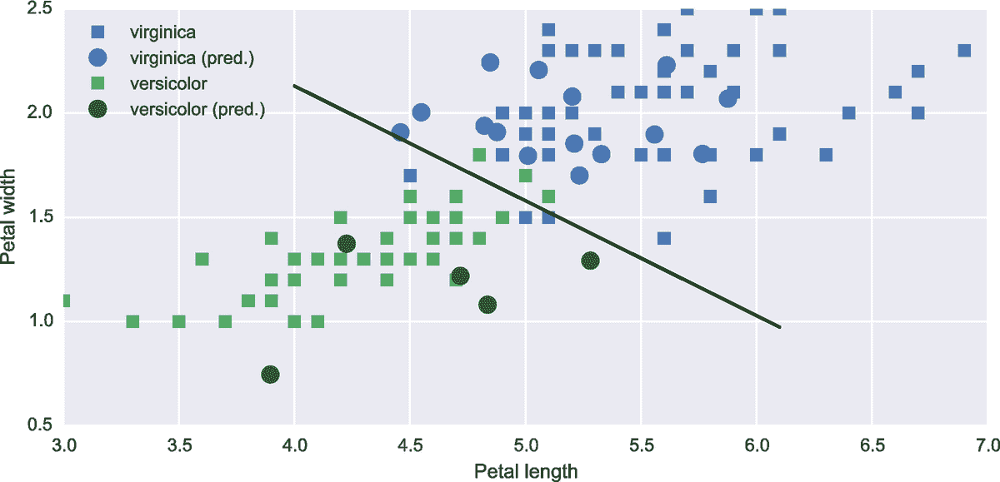

图 14-5

使用具有花瓣长度和宽度以及独立变量的 Logit 回归对鸢尾属物种进行分类的结果

```py
In [106]: fig, ax = plt.subplots(1, 1, figsize=(8, 4))
     ...:  # species virginica
     ...: ax.plot(df_subset[df_subset.Species == 0].Petal_Length.values,
     ...:         df_subset[df_subset.Species == 0].Petal_Width.values, 's', label="virginica")
​     ...: ax.plot(df_new[df_new.Species == 0].Petal_Length.values,
     ...:         df_new[df_new.Species == 0].Petal_Width.values,
     ...:         'o', markersize=10, color="steelblue", label='virginica (pred.)')
     ...:
     ...: # species versicolor
     ...: ax.plot(df_subset[df_subset.Species == 1].Petal_Length.values,
     ...:         df_subset[df_subset.Species == 1].Petal_Width.values, 's', label="versicolor")
     ...: ax.plot(df_new[df_new.Species == 1].Petal_Length.values,
     ...:         df_new[df_new.Species == 1].Petal_Width.values,
     ...:         'o', markersize=10, color="green", label='versicolor (pred.)')

     ...:
     ...: # boundary line
     ...: _x = np.array([4.0, 6.1])
     ...: ax.plot(_x, alpha0 + alpha1 * _x, 'k')
     ...: ax.set_xlabel('Petal length')
     ...: ax.set_ylabel('Petal width')
     ...: ax.legend()

```

### 泊松模型

离散回归的另一个例子是泊松模型，它可以描述一个过程，其中响应变量是多次尝试的成功计数，每次尝试的成功概率都很低。泊松模型也是可以用广义线性模型处理的模型的一个例子，使用自然对数作为连接函数。为了了解如何使用 statsmodels 库将数据拟合到泊松模型，我们将分析 R dataset 存储库中的另一个有趣的数据集:`discoveries`数据集包含 1860 年至 1959 年间重大发现的数量。由于数据的性质，有理由假设计数可能是泊松分布的。为了探究这个假设，我们从使用`sm.datasets.get_rdataset`函数加载数据集开始，并显示前几个值，以获得对数据格式的理解。

<colgroup><col class="tcol1 align-left"> <col class="tcol2 align-left"> <col class="tcol3 align-left"> <col class="tcol4 align-left"> <col class="tcol5 align-left"> <col class="tcol6 align-left"> <col class="tcol7 align-left"> <col class="tcol8 align-left"> <col class="tcol9 align-left"> <col class="tcol10 align-left"> <col class="tcol11 align-left"></colgroup> 
| `time` | `1860` | `1861` | `1862` | `1863` | `1864` | `1865` | `1866` | `1867` | `1868` | `1869` |
| `discoveries` | `5` | `3` | `0` | `2` | `0` | `3` | `2` | `3` | `6` | `1` |

```py
In [107]: dataset = sm.datasets.get_rdataset("discoveries")
In [108]: df = dataset.data.set_index("time").rename(columns={"values": "discoveries"})
In [109]: df.head(10).T
Out[109]:

```

这里我们可以看到数据集包含了`discoveries`系列中的整数计数，并且该系列的前几年平均有一些重大发现。为了查看这是否是整个系列的典型数据，我们可以绘制一个每年发现数量的条形图，如图 [14-6](#Fig6) 所示。

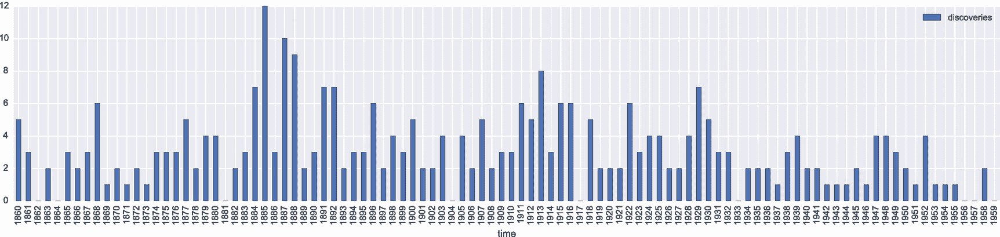

图 14-6

每年伟大发现的数量

```py
In [109]: fig, ax = plt.subplots(1, 1, figsize=(16, 4))
     ...: df.plot(kind='bar', ax=ax)

```

从图 [14-6](#Fig6) 来看，随着时间的推移，重大发现的数量似乎相对稳定，尽管可能会出现略微下降的趋势。尽管如此，最初关于发现数量可能服从泊松分布的假设看起来并不完全不合理。为了更系统地探索这一假设，我们可以将数据拟合到泊松过程，例如，使用`smf.poisson`类和 Patsy 公式`"discoveries ~ 1"`，这意味着我们仅使用截距系数(泊松分布参数)对`discoveries`变量进行建模。

```py
In [110]: model = smf.poisson("discoveries ~ 1", data=df)

```

像往常一样，我们必须调用`fit`方法来实际执行模型对所提供数据的拟合:

```py
In [111]: result = model.fit()
Optimization terminated successfully.
          Current function value: 2.168457
          Iterations 7

```

result 对象的`summary`方法显示模型拟合和几个拟合统计的摘要。

```py
In [112]: print(result.summary())
                          Poisson Regression Results==============================================================================
Dep. Variable:            discoveries   No. Observations:                  100
Model:                        Poisson   Df Residuals:                       99
Method:                           MLE   Df Model:                            0
Date:                Sun, 26 Apr 2015   Pseudo R-squ.:                   0.000
Time:                        14:51:41   Log-Likelihood:                -216.85
converged:                       True   LL-Null:                       -216.85LLR p-value:                       nan==============================================================================
                 coef    std err          z      P>|z|      [95.0% Conf. Int.]
------------------------------------------------------------------------------
Intercept      1.1314      0.057     19.920      0.000         1.020     1.243==============================================================================

```

可通过结果对象的`params`属性获得的模型参数通过指数函数(链接函数的反函数)与泊松分布的 *λ* 参数相关:

```py
In [113]: lmbda = np.exp(result.params)

```

一旦我们有了泊松分布的估计的 *λ* 参数，我们就可以，例如，将观察到的计数值的直方图与理论计数进行比较，这可以从 SciPy `stats`库中的泊松分布随机变量中获得。

```py
In [114]: X = stats.poisson(lmbda)

```

除了拟合参数，我们还可以使用`conf_int`方法获得参数的估计置信区间:

<colgroup><col class="tcol1 align-left"> <col class="tcol2 align-left"> <col class="tcol3 align-left"></colgroup> 
|   | `0` | `1` |
| `Intercept` | `1.020084` | `1.242721` |

```py
In [115]: result.conf_int()
Out[115]:

```

为了评估数据是否符合泊松分布，我们还为模型参数的置信区间的下限和上限创建了随机变量:

```py
In [116]: X_ci_l = stats.poisson(np.exp(result.conf_int().values)[0, 0])
In [117]: X_ci_u = stats.poisson(np.exp(result.conf_int().values)[0, 1])

```

最后，我们用与拟合的模型参数及其置信区间相对应的泊松分布的理论概率质量函数来绘制观察计数的直方图。结果如图 [14-7](#Fig7) 所示。

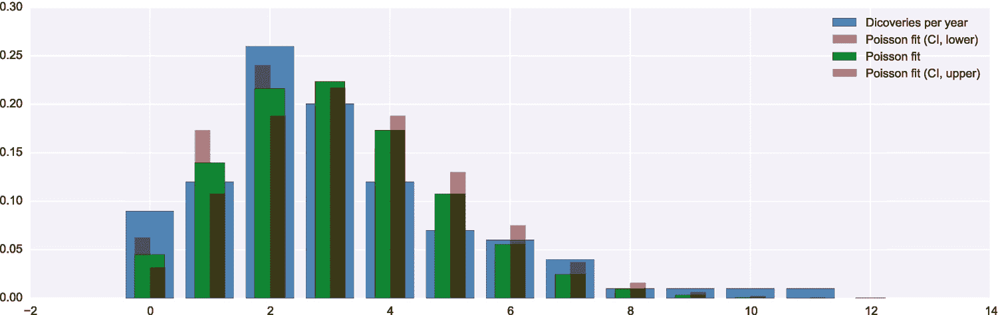

图 14-7

每年重大发现数量的直方图与拟合泊松模型的概率质量函数的比较

```py
In [118]: v, k = np.histogram(df.values, bins=12, range=(0, 12), normed=True)
In [119]: fig, ax = plt.subplots(1, 1, figsize=(12, 4))
     ...: ax.bar(k[:-1], v, color="steelblue",  align='center', label='Discoveries per year')
     ...: ax.bar(k-0.125, X_ci_l.pmf(k), color="red", alpha=0.5, align="center", width=0.25,
     ...:        label='Poisson fit (CI, lower)')
     ...: ax.bar(k, X.pmf(k), color="green",  align='center', width=0.5, label='Poisson fit')
     ...: ax.bar(k+0.125, X_ci_u.pmf(k), color="red",  alpha=0.5, align="center", width=0.25,
     ...:        label='Poisson fit (CI, upper)')
     ...: ax.legend()

```

图 [14-7](#Fig7) 所示的结果表明，重大发现的数据集不能很好地用泊松过程来描述，因为泊松概率质量函数和观察到的计数之间的一致性明显偏离。因此，每年重大发现的数量是一个泊松过程的假设必须被拒绝。给定数据集的模型拟合失败当然是统计建模过程的自然组成部分，尽管数据集结果不是泊松分布的(可能是因为具有大量和少量重大发现的年份往往聚集在一起)，但我们仍然通过对其建模的失败尝试获得了洞察力。由于任何给定年份的发现数量与其最近年份之间的相关性，时间序列分析可能是一种更好的方法，如下节所述。

## 时间序列

时间序列分析是统计建模中的一个重要领域，它处理对作为时间函数观察到的数据的未来值的分析和预测。时间序列建模在几个方面不同于我们到目前为止所看到的常规回归模型。也许最重要的是，一个时间序列的观察值通常不能被认为是一系列来自总体的独立随机样本。相反，在时间上彼此接近的观测值之间通常存在相当强的相关性。此外，时间序列模型中的独立变量是同一序列的过去观察值，而不是一组不同的因素。例如，虽然常规回归可以将对产品的需求描述为其价格的函数，但在时间序列模型中，通常会尝试从过去的观察值预测未来的值。当存在自相关时，例如所考虑的时间序列中的趋势(例如，每日或每周周期，或稳定增长的趋势，或其值变化的惯性)，这是一种合理的方法。时间序列的例子包括股票价格、天气和气候观测以及自然界和经济学中的许多其他时间过程。

一种时间序列统计模型的示例是自回归(AR)模型，其中未来值线性依赖于 *p* 先前值: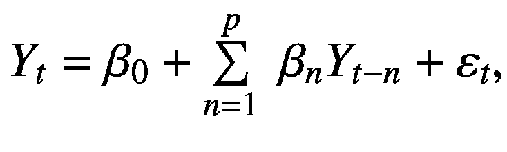其中*β*T5】0 是常数，而 *β* <sub>* n *</sub> ，1 ≤ * n * ≤ *N* 是定义 AR 模型的系数。误差 *ε* <sub>* t *</sub> 假设为无自相关的白噪声。因此，在该模型中，时间序列中的所有自相关应通过对 *p* 先前值的线性依赖来获取。仅线性依赖于一个先前值(在合适的时间单位内)的时间序列可以完全用 AR 过程建模，其中 *p* =1，表示为 AR(1)，而线性依赖于两个先前值的时间序列可以用 AR(2)过程建模，等等。AR 模型是 ARMA 模型的一个特例，ARMA 模型是一个更一般的模型，它还包括序列的 *q* 先前残差的移动平均值(MA)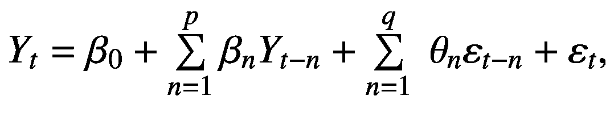其中模型参数 *θ* <sub>* n *</sub> 是移动平均值的权重因子。这个模型被称为 ARMA 模型，用 ARMA( *p* ， *q* )表示，其中 *p* 是自回归项的数量， *q* 是移动平均项的数量。还有许多其他的时间序列模型，但是 AR 和 ARMA 抓住了许多时间序列应用的基本思想。

statsmodels 库有一个专门用于时间序列分析的子模块:`sm.tsa`，它实现了几个用于时间序列分析的标准模型，以及用于探索时间序列数据属性的图形和统计分析工具。例如，让我们重温一下第 [12 章](12.html)中使用的室外温度测量的时间序列，并假设我们想要使用 AR 模型根据以前的观测结果预测未来几天的每小时温度。具体来说，我们将采用三月份测得的温度，并预测四月份前三天的每小时温度。我们首先将数据集加载到 Pandas `DataFrame`对象中:

```py
In [120]: df = pd.read_csv("temperature_outdoor_2014.tsv", header=None, delimiter="\t", names=["time", "temp"])
     ...: df.time = pd.to_datetime(df.time, unit="s")
     ...: df = df.set_index("time").resample("H").mean()

```

为了方便起见，我们提取了三月和四月的观察值，并分别存储在新的`DataFrame`对象、`df_march`和`df_april`中:

```py
In [121]: df_march = df[df.index.month == 3]
In [122]: df_april = df[df.index.month == 4]

```

这里，我们将尝试使用 AR 模型对温度观测值的时间序列进行建模，其适用性的一个重要条件是它适用于平稳过程，该过程除了模型中的项所解释的那些之外，不具有自相关或趋势。`smg.tsa`模型中的函数`plot_acf`是一个有用的图形工具，用于可视化时间序列中的自相关。它采用一系列时间序列观测值，并在 *x* 轴上绘制出时间延迟增加的自相关图。可选的`lags`参数可用于确定绘图中包含多少时间步，这对于长时间序列以及当我们只希望看到有限数量时间步的自相关时很有用。温度观测值及其一阶、二阶和三阶差的自相关函数使用以下代码中的`plot_acf`函数生成并绘制，结果图如图 [14-8](#Fig8) 所示。

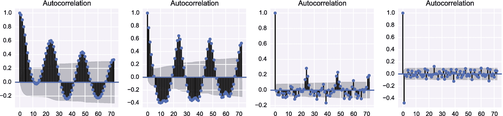

图 14-8

温度数据的自相关函数，从左到右按微分的递增顺序排列

```py
In [123]: fig, axes = plt.subplots(1, 4, figsize=(12, 3))
     ...: smg.tsa.plot_acf(df_march.temp, lags=72, ax=axes[0])
     ...: smg.tsa.plot_acf(df_march.temp.diff().dropna(), lags=72, ax=axes[1])
     ...: smg.tsa.plot_acf(df_march.temp.diff().diff().dropna(), lags=72, ax=axes[2])
     ...: smg.tsa.plot_acf(df_march.temp.diff().diff().diff().dropna(), lags=72, ax=axes[3])

```

我们可以在图 [14-8](#Fig8) 最左边的图中看到时间序列中连续值之间的明显相关性，但是对于递增的顺序，时间序列的差分显著降低了自相关性。这表明，虽然每个连续的温度观测值与其之前的值有很强的相关性，但对于连续观测值之间的高阶*变化*，这种相关性没有那么强。获取时间序列的差值通常是消除趋势和相关性的有效方法。取差减少结构自相关的事实表明，一个足够高阶的 AR 模型可能能够模拟时间序列。

要为考虑中的时间序列创建 AR 模型，我们可以使用`sm.tsa.AR`类。例如，它可以从由`DatetimeIndex`或`PeriodIndex`索引的 Pandas 系列开始(参见`AR`的 docstring，了解将时间序列数据传递给该类的替代方法):

```py
In [124]: model = sm.tsa.AR(df_march.temp)

```

当我们将模型拟合到时间序列数据时，我们需要提供 AR 模型的阶数。在这里，由于我们可以在图 [14-8](#Fig8) 中看到具有 24 个周期(24 小时)滞后的强自相关，我们必须*至少*在模型中包括 24 个先前项的项。为了安全起见，由于我们的目标是预测 3 天或 72 小时的温度，这里我们选择让 AR 模型的阶数也对应于 72 小时:

```py
In [125]: result = model.fit(72)

```

AR 过程适用的一个重要条件是序列的残差是平稳的(没有剩余自相关和趋势)。Durbin-Watson 统计检验可用于检验时间序列中的平稳性。它返回一个介于 0 和 4 之间的值，接近 2 的值对应于没有剩余自相关的时间序列。我们还可以使用`plot_acf`函数来绘制残差的自相关函数，并验证不存在显著的自相关。

```py
In [126]: sm.stats.durbin_watson(result.resid)
Out[126]: 1.9985623006352975

```

我们还可以使用`plot_acf`函数来绘制残差的自相关函数，并验证不存在显著的自相关。

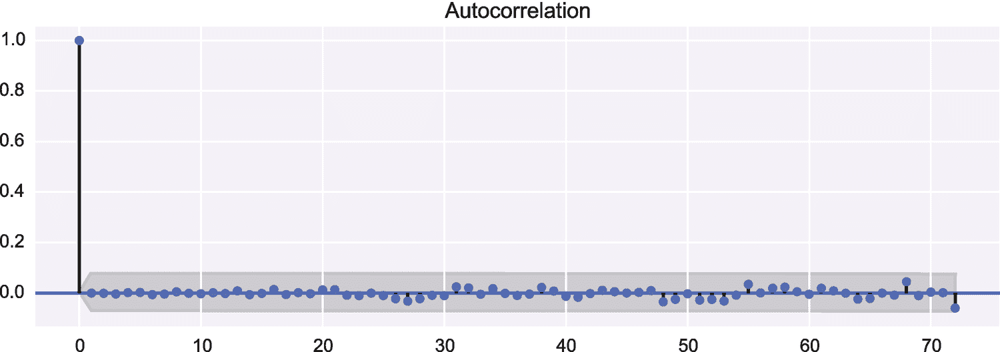

图 14-9

温度观测 AR(72)模型残差的自相关图

```py
In [127]: fig, ax = plt.subplots(1, 1, figsize=(8, 3))
     ...: smg.tsa.plot_acf(result.resid, lags=72, ax=ax)

```

图 [14-9](#Fig9) 中接近 2 的德宾-沃森统计量和不存在自相关表明当前模型成功解释了拟合数据。我们现在可以继续使用模型`fit`方法返回的结果对象中的`predict`方法来预测未来日期的温度:

```py
In [128]: temp_3d_forecast = result.predict("2014-04-01", "2014-04-4")

```

接下来，我们将预测(红色)与前 3 天的温度观测(蓝色)和实际结果(绿色)一起绘制成图表，结果如图 [14-10](#Fig10) 所示:

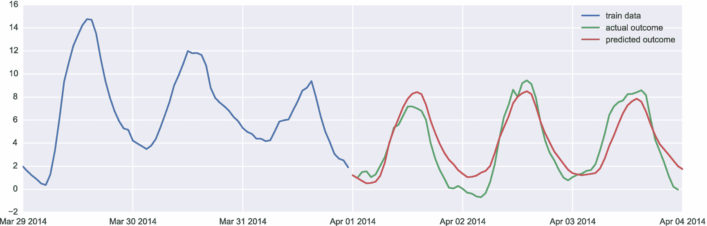

图 14-10

作为时间函数的观测和预测温度

```py
In [129]: fig, ax = plt.subplots(1, 1, figsize=(12, 4))
     ...: ax.plot(df_march.index.values[-72:], df_march.temp.values[-72:], label="train data")
     ...: ax.plot(df_april.index.values[:72], df_april.temp.values[:72], label="actual outcome")
     ...: ax.plot(pd.date_range("2014-04-01", "2014-04-4", freq="H").values, temp_3d_forecast, label="predicted outcome")
​     ...:
     ...: ax.legend()

```

图 [14-10](#Fig10) 所示的预测温度与实际结果吻合较好。然而，情况当然不会总是这样，因为温度不能仅仅根据以前的观测来预测。尽管如此，在稳定天气系统的一段时间内，考虑到每日变化和其他稳定趋势，一天的每小时温度可以用 AR 模型准确预测。

除了基本的 AR 模型，statsmodels 还提供了 ARMA(自回归移动平均)和 ARIMA(自回归综合移动平均)模型。这些模型的使用模式类似于我们在这里使用的 ar 模型，但是在细节上有一些不同。更多信息请参考`sm.tsa.ARMA`和`sm.tsa.ARIMA`类的文档字符串和官方 statsmodels 文档。

## 摘要

在本章中，我们简要介绍了统计建模，并介绍了 statsmodels 库的基本统计建模特性和使用 Patsy 公式的模型规范。统计建模是一个广阔的领域，在这一章中我们仅仅触及了 statsmodels 库的皮毛。我们首先介绍了如何使用 Patsy 公式语言来指定统计模型，我们在“线性回归”一节中使用了 Patsy 公式语言来描述连续(常规线性回归)和离散(逻辑回归和名义回归)响应变量。在介绍了线性回归之后，我们简要地看了一下时间序列分析，与线性回归相比，时间序列分析需要稍微不同的方法，因为时间序列中自然出现的连续观测值之间的相关性。在本简介中，我们没有涉及统计建模的许多方面，但是我们在这里介绍的线性回归和时间序列建模的基础知识应该为进一步的研究提供了背景。在第 [15](15.html) 章中，我们继续机器学习，这是一个在动机和方法上都与统计建模密切相关的主题。

## 进一步阅读

G. James (2013)和 M. Kuhn (2013)对统计建模进行了出色而全面的介绍，这些介绍也可以在 [`www-bcf.usc.edu/~gareth/ISL/index.html`](http://www-bcf.usc.edu/%257Egareth/ISL/index.html) 免费获得。R.J. Hyndman (2013)给出了对时间序列分析的简单介绍，该介绍也可在 [`www.otexts.org/fpp`](http://www.otexts.org/fpp) 免费在线获得。

## 参考

G.詹姆斯博士(2013 年)。*统计学习入门。*纽约:施普林格出版社。

米（meter 的缩写））Kuhn，K. J. (2013 年)。*应用预测建模。*纽约:施普林格。

R.J. Hyndman，G. A. (2013 年)。预测:原理与实践。OTexts。

<aside class="FootnoteSection" epub:type="footnotes">Footnotes [1](#Fn1_source)

statsmodels 库最初是作为 SciPy `stats`模块的一部分开始的，但是后来被转移到一个独立的项目中。SciPy `stats`库仍然是 statsmodels 的重要依赖项。

  [2](#Fn2_source)

当我们考虑正则化回归时，我们将在第 [15 章](15.html)中看到这样的例子。

  [3](#Fn3_source)

[`http://vincentarelbundock.github.io/Rdatasets`见](http://vincentarelbundock.github.io/Rdatasets)。

  [4](#Fn4_source)

Logistic 回归属于可以看作广义线性模型的一类模型，以 logistic 变换为连接函数，所以我们可以交替使用`sm.GLM`或`smf.glm`。

 </aside>