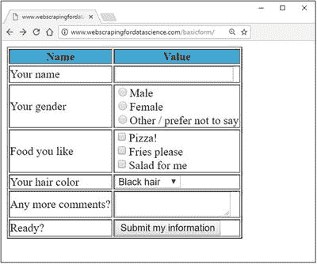
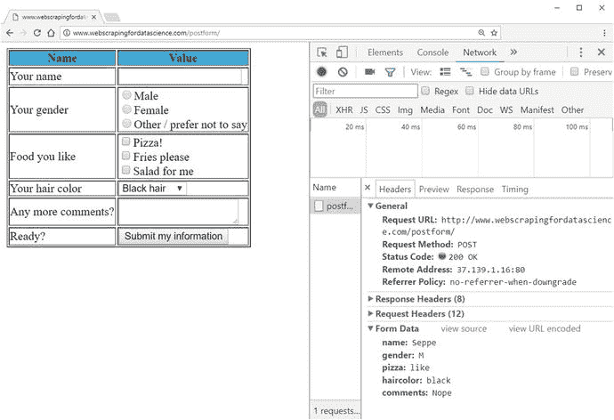

# 四、深入研究 HTTP

我们已经看到了构成现代网络的大多数核心构件:HTTP、HTML 和 CSS。然而，我们还没有完全完成 HTTP。到目前为止，我们只使用了 HTTP 的请求“动词”或“方法”之一:“GET”。本章将向您介绍 HTTP 提供的其他方法，从提交 web 表单常用的“POST”方法开始。接下来，本章将更深入地探讨 HTTP 请求和回复头，并展示如何使用请求库处理 cookies。本章最后讨论了除 HTML 格式页面之外的其他常见内容形式，以及如何在 web 抓取项目中处理它们。

## 4.1 使用表单和发布请求

我们已经看到了 web 浏览器(和您)如何将输入传递给 web 服务器的一种方法，即简单地将输入包含在请求的 URL 本身中，或者通过包含 URL 参数，或者简单地通过 URL 路径本身，如前所述。然而，人们很容易认为这种提供输入的方式对用户并不友好。想象一下，我们想买一些音乐会的门票，我们被要求通过将我们的姓名、电子邮件地址和其他信息作为一组 URL 参数发送到 web 服务器。这确实不是一个令人愉快的想法！此外，URL(根据定义)在长度方面是有限制的，所以如果我们想向 web 服务器发送大量信息，这种“解决方案”也是行不通的。

网站提供了一种更好的方式来提供输入并将输入发送到 web 服务器，您肯定已经遇到过这种方式:web 表单。无论是提供“时事通讯注册”表单、“购买门票”表单，还是简单的“登录”表单，web 表单都用于收集适当的数据。web 表单在 web 浏览器中的显示方式就是在 HTML 中包含适当的标签。也就是说，页面上的每个 web 表单对应于一个包含在“

<form>”标记中的 HTML 代码块:</form>

```py
<form>
[...]
</form>

```

其中有许多代表表单域本身的标签。其中大部分是通过一个“<input>”标记提供的，带有“type”属性，指定它应该表示哪种字段:

*   `<input type="text">`用于简单的文本字段；
*   `<input type="password">`为密码输入字段；
*   `<input type="button">`用于通用按钮；
*   `<input type="reset">`对于一个“重置”按钮(点击后，浏览器会将所有表单值重置为初始状态，但这几天很少遇到这个按钮)；
*   `<input type="submit">`一个“提交”按钮(稍后会有更多介绍)；
*   `<input type="checkbox">`为复选框；
*   `<input type="radio">`用于收音盒；
*   `<input type="hidden">`对于隐藏字段，不会向用户显示，但仍可包含一个值。

除此之外，您还会发现使用了成对的标签(“<input>”没有结束标签):

*   `<button>...</button>`作为定义按钮的另一种方式；
*   `<select>...</select>`为下拉列表。在这些选项中，每个选项都是使用`<option>...</option>`标签定义的；
*   `<textarea>...</textarea>`用于较大的文本输入字段。



图 4-1

A simple web form illustrating the different input fields

导航到 [`http://www.webscrapingfordatascience.com/basicform/`](http://www.webscrapingfordatascience.com/basicform/) 查看运行中的基本 web 表单(参见图 [4-1](#Fig1) )。

花一些时间使用您的 web 浏览器检查相应的 HTML 源代码。您会注意到一些 HTML 属性似乎在这里扮演了一个特殊的角色，即表单标记的“name”和“value”属性。事实证明，一旦 web 表单被“提交”，您的 web 浏览器就会使用这些属性。为此，请尝试在示例网页上按“提交我的信息”按钮(先随意填写一些虚拟信息)。你看到了什么？请注意，在提交表单时，您的浏览器会触发一个新的 HTTP 请求，并在其请求中包含输入的信息。在这个简单的表单中，使用了一个简单的 HTTP GET 请求，基本上将表单中的字段转换为键值 URL 参数。

Submitting Forms

“提交”按钮并不是提交表单信息的唯一方式。有时，表单只包含一个文本字段，当按 enter 键时就会提交。或者，一些额外的 JavaScript 也可以负责发送表单。即使“

<form>”块没有暴露任何提交自身的明显方式，人们仍然可以指示 web 浏览器提交表单，例如通过 Chrome 开发工具中的控制台。顺便说一下:在同一个网页中有多个“</form>

<form>”块是完全可以的(例如，一个用于“搜索”表单，一个用于“联系我们”表单)，尽管一旦用户采取了“提交”动作，通常只会提交一个表单(及其包含的信息)。</form>

这种提交表单的方式非常符合我们前几段的讨论:URL 参数是将输入发送到 web 服务器的一种方式。我们不必在 URL 中手动输入所有信息(想象一下那将是多么可怕的用户体验)，现在我们至少看到了 web 表单如何使这个过程对用户更友好。

然而，在我们必须提交大量信息的情况下(例如，尝试用大量文本填充示例页面上的“comments”表单字段)，由于 URL 的最大长度限制，URL 变得不可用于提交信息。即使 URL 在长度上没有限制，它们仍然不能满足提交信息的完全合适的机制。例如，如果您将这样一个 URL 复制粘贴到电子邮件中，其他人会点击它，从而将信息再次“发送”到服务器，会发生什么情况？或者万一不小心刷新了这样的网址会怎么样？在我们向 web 服务器发送信息的情况下，我们可以预期这个提交操作会对其进行永久性的更改(例如删除用户、更改您的配置文件信息、单击“接受”进行银行转帐等等)，简单地允许这样的请求作为 HTTP GET 请求进入可能不是一个好主意。

幸运的是，除了我们到目前为止一直在使用的 GET 方法之外，HTTP 协议还提供了许多不同的“方法”(或“动词”)。更具体地说，除了 GET 请求之外，如果您希望向 web 服务器提交一些信息，浏览器还会经常使用另一种类型的请求:POST 请求。要介绍它，请导航到位于 [`http://www.webscrapingfordatascience.com/postform/`](http://www.webscrapingfordatascience.com/postform/) 的页面。请注意，这个页面看起来与上面的页面完全相同，除了 HTML 源代码中的一个小差异:现在“<表单>标签有了一个额外的“方法”属性:

```py
<form method="post">
[...]
</form>

```

“method”属性的默认值是“get ”,基本上是指示您的浏览器应该通过 HTTP GET 请求提交这个特定表单的内容。但是，当设置为“post”时，您的浏览器将被指示通过 HTTP POST 请求发送信息。POST HTTP 请求将此输入作为 HTTP 请求主体的一部分，而不是将所有表单信息作为 URL 参数包含在内。尝试按下“提交我的信息”,同时确保 Chrome 的开发工具正在监控网络请求。如果您检查 HTTP 请求，您会注意到请求方法现在被设置为“that Chrome 包含了一条称为“表单数据”的额外信息，向您显示哪些信息被包含在 HTTP 请求正文中；见图 [4-2](#Fig2) 。注意，提交的信息现在没有嵌入到请求 URL 中。



图 4-2

Inspecting a POST HTTP request using Chrome Developer Tools

最后，尝试导航到 [`http://www.webscrapingfordatascience.com/postform2/`](http://www.webscrapingfordatascience.com/postform2/) 。该页面的工作方式与之前的页面完全相同，但有一个显著的区别:当您提交表单时，服务器不会发送回与之前相同的内容，而是提供刚刚提交的信息的概述。由于 web 服务器能够读取包含 HTTP 请求方法和 URL 的 HTTP 请求行，因此它可以根据收到的响应类型动态生成不同的响应，并执行不同的操作。例如，当 POST 请求进来时，web 服务器可能会决定在发送回复之前将提交的信息存储在数据库中。

A Word on Safety

注意，web 浏览器中显示的 URL 没有改变，因为相同的 URL 可以与 POST 或 GET 请求结合使用。这说明了 POST 请求在安全性方面也有好处:例如，即使在电子邮件中复制上面的 URL，打开该链接的新用户最终也会使用 GET 请求获取页面(因此不会向站点重新提交信息，而只会看到一个新的表单)。如果不知情的用户被诱骗点击一个 URL，这个 URL 将立即代表他们执行操作，这将是非常不安全的。这并不意味着使用 POST 请求可以完全保护您免受恶意行为者的攻击，例如，恶意行为者可以指示不知情的访问者的 web 浏览器使用一段 JavaScript 代码执行 POST 请求，但这至少有一点帮助。这并不是说所有的 web 表单都应该使用 POST。例如，带有搜索框的表单，比如 Google 上的那种，非常适合与 GET 请求结合使用。

最后，关于 web 表单，我们还需要提到一件事。在前面的所有示例中，提交给表单的数据通过构造一个 HTTP 请求发送到 web 服务器，该请求包含与表单所在页面相同的 URL，尽管情况不一定总是如此。为了指示“提交”动作应该产生对不同 URL 的请求，可以如下使用“动作”属性:

```py
<form action="search.html">
  <!-- E.g. a search form -->
  <input type="text" name="query">
  <input type="submit" value="Search!">
</form>

```

这个表单片段可以包含在具有相应 URL 的各种页面上，尽管提交这个表单会导致一个页面，例如“search.html？查询=测试”。

除了 GET 和 POST 之外，还有一些其他的 HTTP 方法可以讨论，尽管这些方法很少被使用，至少在通过 web 浏览器浏览 web 时是这样。我们稍后会看一看这些。让我们先总结一下目前为止我们所知道的两种 HTTP 方法:

*   GET:在地址栏中键入 URL 并按 enter 键、单击链接或提交 GET 表单时使用。这里的假设是，同一个请求可以执行多次，而不会“损害”用户的体验。例如，刷新 URL“search . html ”?query=Test”，但可能不是 URL“doMoneyTransfer？to=Bart&from=Seppe&amount=100 "。
*   POST:提交帖子表单时使用。这里，假设这个请求将导致一个不应该被多次执行的动作被执行。如果你试图刷新一个由 POST 请求产生的页面，大多数浏览器实际上会警告你(“你将再次重新提交相同的信息——你确定这是你想要做的吗？”).

在讨论其他 HTTP 请求方法之前，让我们看看如何使用 Python 执行 POST 请求。在 web 表单使用 GET 请求提交信息的情况下，我们已经看到了如何通过使用带有`params`参数的`requests.get`方法将信息作为 URL 参数嵌入来处理这个用例。对于 POST 请求，我们只需要使用一个新的方法(`requests.post`)和一个新的`data`参数:

```py
import requests

url = 'http://www.webscrapingfordatascience.com/postform2/'

# First perform a GET request
r = requests.get(url)

# Followed by a POST request
formdata = {
    'name': 'Seppe',
    'gender': 'M',
    'pizza': 'like',
    'haircolor': 'brown',
    'comments': ''
    }

r = requests.post(url, data=formdata)
print(r.text)

```

与`params`一样，`data`参数作为表示名称-值对的 Python 字典对象提供。花点时间在 web 浏览器中研究一下这个 URL，看看各种输入元素的数据实际上是如何提交的。特别要注意的是，对于单选按钮，它们都具有相同的“name”属性，表明它们属于同一个选择组，尽管值(“M”、“F”和“N”不同)。如果根本没有选择，该元素将不会包含在提交的表单数据中。对于复选框，请注意它们都有不同的名称，但是它们的值都是相同的(“like”)。如果未选中复选框，web 浏览器将不会在提交的表单数据中包含名称-值对。因此，一些 web 服务器甚至懒得检查这些字段的值来确定它们是否被选中，而只是检查名称是否出现在提交的数据中，尽管这可能因 web 服务器而异。

Duplicate Names

有些网站，比如用 PHP 语言构建的网站，也允许我们用相同的 name 属性值定义一系列复选框元素。对于用 PHP 构建的网站，您会看到这些名称以“[]”结尾，如“food[]”。这向 web 服务器表明，传入的值应该被视为一个数组。在 HTTP 方面，这意味着相同的字段名称将在请求体中出现多次。URL 参数也存在同样的复杂性:从技术上讲，没有什么可以阻止您用相同的名称和不同的值指定多个参数。处理它们的方式因服务器而异，尽管您可能想知道我们如何处理请求中的这种用例，因为`params`和`data`都是字典对象，不能两次包含相同的键。为了解决这个问题，`data`和`params`参数都允许传递一组“(name，value)”元组来处理这个问题。

对于“comments”字段，请注意，即使没有填写任何内容，它也包含在提交的表单数据中，在这种情况下，将提交一个空值。同样，在某些情况下，您也可以完全省略名称-值对，但是这取决于 web 服务器来决定它想要有多“挑剔”。

Pickiness

甚至提交按钮也可以被命名，在这种情况下，它们也将出现在提交的表单数据中(它们的值等于它们的“value”HTML 属性)。有时，web 服务器会使用这些信息来确定哪个按钮被单击了，以防在同一个表单中出现多个提交按钮，而在其他情况下，名称-值对最终会被忽略。正如 URL 参数的情况一样，web 服务器在解释请求时，在严格程度或灵活性方面会有很大的不同。当使用 requests 提交 POST 请求时，没有什么可以阻止您加入其他名称-值对，但是结果可能会因站点而异。尝试尽可能接近浏览器中发生的事情通常是一个很好的建议。

注意，在上面的例子中，我们仍然是“礼貌的”,在通过 POST 发送信息之前，我们首先执行一个普通的 GET 请求，尽管这并不是必需的。我们可以简单地注释掉`requests.get`行来提交我们的信息。然而，在某些情况下，网页会“聪明”到足以阻止你这样做。为了说明这一点，请尝试导航到 [`http://www.webscrapingfordatascience.com/postform3/`](http://www.webscrapingfordatascience.com/postform3/) ，填写并提交表单。现在再试一次，但是要等一两分钟再按“提交我的信息”网页将通知您“您等待提交此信息的时间过长。”让我们尝试使用请求提交此表单:

```py
import requests

url = 'http://www.webscrapingfordatascience.com/postform3/'

# No GET request needed?

formdata = {
    'name': 'Seppe',
    'gender': 'M',
    'pizza': 'like',
    'haircolor': 'brown',
    'comments': ''
    }

r = requests.post(url, data=formdata)

print(r.text)
# Will show: Are you trying to submit information from somewhere else?

```

这很奇怪:在这种情况下，web 服务器如何知道我们试图执行来自 Python 的 POST 请求？答案就在 HTML 源代码中增加的一个表单元素中(您的值可能会有所不同):

```py
<input type="hidden" name="protection" value="2c17abf5d5b4e326bea802600ff88405">

```

可以看到，这个表单合并了一个新的隐藏字段，它将与表单数据的其余部分一起提交，方便地命名为“protection”将它直接包含在我们的 Python 源代码中如何，如下所示:

```py
import requests

url = 'http://www.webscrapingfordatascience.com/postform3/'

formdata = {
    'name': 'Seppe',
    'gender': 'M',
    'pizza': 'like',
    'haircolor': 'brown',
    'comments': '',
    'protection': '2c17abf5d5b4e326bea802600ff88405'
    }
r = requests.post(url, data=formdata)

print(r.text)
# Will show: You waited too long to submit this information. Try <a href="./">again</a>.

```

假设您在运行这段代码之前等待了一分钟，web 服务器现在将回复一条消息，表明它不想处理这个请求。事实上，我们可以(使用我们的浏览器)确认，每次我们刷新页面时,“protection”字段似乎都会随机发生变化。为了解决这个问题，我们别无选择，只能首先使用 GET 请求获取表单的 HTML 源代码，获取“protection”字段的值，然后在后续的 POST 请求中使用该值。通过再次引入美味的汤，这很容易做到:

```py
import requests
from bs4 import BeautifulSoup

url = 'http://www.webscrapingfordatascience.com/postform3/'

# First perform a GET request

r = requests.get(url)

# Get out the value for protection
html_soup = BeautifulSoup(r.text, 'html.parser')
p_val = html_soup.find('input', attrs={'name': 'protection'}).get('value')

# Then use it in a POST request
formdata = {
    'name': 'Seppe',
    'gender': 'M',
    'pizza': 'like',
    'haircolor': 'brown',
    'comments': '',
    'protection': p_val
    }

r = requests.post(url, data=formdata)

print(r.text)

```

上面的例子说明了在现实生活中你会不时遇到的一种保护措施。网站管理员不一定包括这些额外的措施来阻止网页抓取(这让抓取者的生活变得更加艰难，但我们已经看到了如何解决它)，但主要是出于安全和改善用户体验的原因。例如，防止相同的信息被提交两次(例如，使用相同的“保护”值)，或者防止用户被诱骗访问某个网页的攻击，在该网页上，一段 JavaScript 代码将试图执行对另一个站点的 POST 请求，例如，发起资金转账或试图获取敏感信息。因此，安全网站通常会在其页面上包含此类附加检查。

View State

有一种网络服务器技术因使用这些领域而非常出名:微软的 ASP 和 ASP.NET。在大多数情况下，使用这种技术构建的网站将包括所有形式的隐藏输入元素，其名称设置为一个神秘的“__VIEWSTATE”，以及一个可能很长的加密值。当试图对使用该堆栈构建的站点执行 POST 请求时，不包含该表单元素将导致结果不符合您的预期，这通常是 web 抓取者在现实生活中遇到的第一个烦恼。解决方案很简单:只要在你的帖子请求中包含这些内容。请注意，在 HTTP 回复中发送的结果页面可能再次包含这样的“__VIEWSTATE”元素，因此您必须确保一次又一次地获取该值，以便将它包含在每个后续的 POST 请求中。

在我们结束这一部分之前，还有一些事情值得一提。首先，你肯定已经注意到我们现在可以使用一个`params`和`data`参数，它们看起来非常相似。如果 GET 请求使用 URL 参数，POST 请求将数据作为 HTTP 请求体的一部分发送，那么当我们已经可以通过使用`requests.get`或`request.post`方法来指示请求的类型时，为什么还需要分隔参数呢？答案在于这样一个事实，即 HTTP POST 请求既包括带有参数的请求 URL，也包括包含表单数据的请求主体，这是完全可以的。因此，如果您在页面源代码中遇到“<表单>”标签定义:

```py
<form action="submit.html?type=student" method="post">
[...]
</form>

```

您必须用 Python 编写以下内容:

```py
r = requests.post(url, params={'type': 'student'}, data=formdata)

```

您可能还想知道，如果我们试图在 URL 参数和表单数据中包含相同的信息，会发生什么情况:

```py
import requests

url = 'http://www.webscrapingfordatascience.com/postform2/'

paramdata = {'name': 'Totally Not Seppe'}
formdata = {'name': 'Seppe'}
r = requests.post(url, params=paramdata, data=formdata)

print(r.text)

```

这个特定的 web 页面将简单地忽略 URL 参数，而是考虑表单数据，但情况不一定总是如此。此外，尽管"

<form>"指定" POST "作为它的" method "参数，但在极少数情况下，您也可以将该信息作为 URL 参数提交，而不是使用简单的 GET 请求。这些情况很少见，但也有可能发生。尽管如此，最好的建议是尽可能贴近您正常使用页面时观察到的行为。</form>

最后，还有一种我们以前没有讨论过的表单元素。有时，您会遇到允许您将文件从本地计算机上传到 web 服务器的表单:

```py
<form action="upload.php" method="post" enctype="multipart/form-data">
  <input type="file" name="profile_picture">
  <input type="submit" value="Upload your profile picture">
</form>

```

注意这个源代码片段中的“file”输入元素，以及现在出现在“

<form>”标记中的“enctype”参数。为了理解这个参数的含义，我们需要稍微谈一下表单编码。简单地说，web 表单在嵌入 HTTP POST 请求体之前，将首先“编码”表单中包含的信息。目前，HTML 标准预见了这种编码的三种方式(最终将作为“Content-Type”请求头的值):

*   Application/x-www-form-urlen-coded (default): Here, the format of the request body is similar to the URL parameter we saw, so it is named "URL en-encoded", that is, the ampersand ("&") and the equal sign ("=") are used to separate the data field from the name-value part. Only in the URL, some characters should be encoded in a specific way, and these requests will be automatically completed for us.
*   Text/plain: introduced by HTML 5, it is generally only used for debugging purposes, so it is extremely rare in real life. Part/form-data: This encoding method is much more complicated, but it allows us to include the contents of the file in the request body, which may be in the form of binary and non-text data-so a separate encoding mechanism is needed.

</form>

例如，考虑一个包含一些请求数据的 HTTP POST 请求:

```py
POST /postform2/ HTTP/1.1
Host: www.webscrapingfordatascience.com
Content-Type: application/x-www-form-urlencoded
[... Other headers]

name=Seppe&gender=M&pizza=like

```

现在考虑一个 HTTP POST 请求，请求数据使用“多部分/格式数据”编码:

```py
POST /postform2/ HTTP/1.1
Host: www.webscrapingfordatascience.com
Content-Type: multipart/form-data; boundary=BOUNDARY
[... Other headers]

--BOUNDARY
Content-Disposition: form-data; name="name"

Seppe
--BOUNDARY
Content-Disposition: form-data; name="gender"

M
--BOUNDARY
Content-Disposition: form-data; name="pizza"

like
--BOUNDARY
Content-Disposition: form-data; name="profile_picture"; filename="me.jpg"
Content-Type: application/octet-stream

[... binary contents of me.jpg]

```

毫无疑问，这里的请求体看起来更复杂，尽管我们可以看到“多部分”名字的来源:请求数据使用“边界”字符串分成多个部分，这是由请求调用者确定的(在大多数情况下是随机的)。幸运的是，在使用请求时，我们不需要太在意这一点。要上传一个文件，我们只需使用另一个参数，名为`files`(可以和`data`参数一起使用):

```py
import requests

url = 'http://www.webscrapingfordatascience.com/postform2/'

formdata = {'name': 'Seppe'}
filedata = {'profile_picture': open('me.jpg', 'rb')}
r = requests.post(url, data=formdata, files=filedata)

```

该库将负责在 POST 请求中设置适当的头(包括选择边界)以及为您正确地编码请求体。

Multiple Files

对于可以上传多个文件的表单，你会发现它们使用了多个“<input>”标签，每个标签都有不同的名称。提交多个文件可以归结为在`files`参数字典中放入更多的键值对。HTML 标准还预见了一种方法，使用“multiple”HTML 参数，仅通过一个元素提供多个文件。要在请求中处理这一点，您可以将一个列表传递给 files 参数，每个元素是一个包含两个条目的元组:表单字段名称，它可以在整个列表中出现多次，以及文件信息——一个单独的元组，包含`open`调用和其他有关正在发送的文件的信息。关于这一点的更多信息可以在 requests 文档中的“POST Multiple Multipart-Encoded Files”下找到，尽管在实践中很少遇到这样的上传表单。

## 4.2 其他 HTTP 请求方法

既然我们已经看到了 HTTP GET 和 POST 请求是如何工作的，我们可以花一点时间来讨论标准中存在的其他 HTTP 方法:

*   GET:GET 方法请求指定 URL 的表示。使用 GET 的请求应该只检索数据，不应该有其他影响，比如保存或更改用户信息或执行其他操作。换句话说，GET 请求应该是“等幂的”，这意味着多次执行同一个请求应该是安全的。请记住，URL 参数可以包含在请求 URL 中(其他任何 HTTP 方法也是如此)，虽然 GET 请求也可以—从技术上讲—包含可选的请求体，但是 HTTP 标准不建议这样做。因此，当 web 浏览器执行 GET 请求时，它不会在请求体中包含任何内容，并且大多数(如果不是全部)API 也不会使用它们。
*   POST:POST 方法表示数据作为请求的一部分提交给特定的 URL，例如，论坛消息、文件上传、填写好的表单等等。与 GET 相反，POST 请求不应该是等幂的，这意味着提交 POST 请求会导致 web 服务器端的事情发生变化，比如更新您的个人资料、确认货币交易、购买等等。POST 请求将提交的数据编码为请求体的一部分。
*   HEAD:HEAD 方法像 GET 请求一样请求响应，但是它向 web 服务器表明它不需要发送响应正文。如果您只需要响应头，而不需要实际的响应内容，这将非常有用。标题请求不能有请求正文。
*   PUT:PUT 方法请求将提交的数据存储在所提供的请求 URL 下，从而在它不存在的情况下创建它。与 POST 一样，PUT 请求也有一个请求体。
*   DELETE:DELETE 方法请求删除请求 URL 下面列出的数据。删除请求没有请求正文。
*   CONNECT、OPTIONS、TRACE 和 PATCH:这些是一些不太常见的请求方法。CONNECT 通常用于请求 web 服务器在客户端和目的地之间建立直接的 TCP 网络连接(web 代理服务器将使用这种类型的请求)，TRACE 指示 web 服务器只将请求发送回客户端(用于调试以查看连接中的中间人是否在中间某处更改了您的请求)，OPTIONS 请求 web 服务器列出它为特定 URL 接受的 HTTP 方法(这似乎很有帮助，但很少使用)。PATCH 最终允许我们请求对特定资源进行部分修改。

基于以上所述，HTTP 方法的集合似乎很好地对应于 SQL(结构化查询语言)命令的基本集合，用于查询和更新关系数据库中的信息，也就是说，GET“选择”给定 URL 的资源，POST“更新”它，PUT“上插”它(“更新”或“插入”，如果它不存在)，DELETE“删除”它。也就是说，这不是网络浏览器的工作方式。我们在上面已经看到，大多数 web 浏览器只能使用 GET 和 POST 请求。这意味着，如果你在一个社交网站上创建一个新的个人资料，你的表单数据将通过 POST 请求提交，而不是 PUT。如果您稍后更改您的个人资料，将使用另一个发布请求。即使您想删除您的个人资料，也将通过发布请求来请求此操作。

然而，这并不意味着请求不支持这些方法。除了`requests.get`、`requests.post`之外，还可以使用`requests.head`、`requests.put`、`requests.delete`、`requests.patch,`、`requests.options`等方法。

A Word About APIs

尽管 web 浏览器可能只坚持 GET 和 POST 请求，但是有各种各样的网络协议将自己置于 HTTP 之上，并且也使用其他请求方法。此外，您会发现许多现代 API——如脸书、Twitter、LinkedIn 等提供的——也通过 HTTP 公开它们的功能，并且也可能使用其他 HTTP 请求方法，这种做法通常被称为 REST(表述性状态转移)。知道您也可以使用请求来访问它们是很有帮助的。因此，web 抓取和使用 API 之间的区别主要在于请求和回复的结构化程度。有了 API，您将获得结构化格式(如 XML 或 JSON)的内容，计算机程序可以很容易地解析这些内容。在“常规”网站上，内容主要以 HTML 格式的文本返回。在网页浏览器完成之后，这对于人类读者来说很好，但是对于计算机程序来说不太方便。因此，有一个像美丽的汤的东西的需求。但是，请注意，并不是所有的 API 都构建在 HTTP 之上——其中一些使用其他协议，比如 SOAP(简单对象访问协议),这也需要另一组库来访问它们。

## 4.3 关于标题的更多信息

现在我们已经完成了对 HTTP 请求方法的概述，是时候仔细看看 HTTP 的另一部分，以及它在 web 抓取站点时是如何发挥作用的:请求头。到目前为止，我们一直依赖请求来为我们构造和发送这些头。然而，在许多情况下，我们必须自己修改它们。

让我们从下面的例子开始:

```py
import requests

url = 'http://www.webscrapingfordatascience.com/usercheck/'

r = requests.get(url)

print(r.text)
# Shows: It seems you are using a scraper

print(r.request.headers)

```

请注意，该网站的回应是“看起来你正在使用刮刀。”它是怎么知道的？当我们在普通浏览器中打开同一个页面时，我们看到的是“欢迎，普通用户”。答案就在请求库发送的请求头中:

```py
{
 'User-Agent': 'python-requests/2.18.4',
 'Accept-Encoding': 'gzip, deflate',
 'Accept': '*/*',
 'Connection': 'keep-alive'
}

```

requests 库尽量保持礼貌，并包含一个“用户代理”头来声明自己。当然，想要阻止抓取者访问其内容的网站可以建立一个简单的检查来阻止特定的用户代理访问其内容。因此，可以说，我们必须修改我们的请求头来“融入”。在请求中，通过另一个参数可以很容易地发送定制头:`headers`:

```py
import requests

url = 'http://www.webscrapingfordatascience.com/usercheck/'

my_headers = {
  'User-Agent': 'Mozilla/5.0 (Windows NT 10.0; Win64; x64) AppleWebKit/537.36 ' + ' (KHTML, like Gecko) Chrome/61.0.3163.100
                Safari/537.36'
}

r = requests.get(url, headers=my_headers)

print(r.text)
print(r.request.headers)

```

这个管用。注意，`headers`参数并没有完全覆盖默认的头，而是更新了它，也保留了默认的条目。

除了“User-Agent”标题之外，还有另一个标题值得特别一提:“Referer”标题(最初是 Referer 的拼写错误，此后一直如此)。浏览器将包含此标题，以指示链接到所请求的 URL 的网页的 URL。一些网站会检查这一点，以防止“深层链接”的工作。为了测试这一点，在你的浏览器中导航到 [`http://www.webscrapingfordatascience.com/referercheck/`](http://www.webscrapingfordatascience.com/referercheck/) 并点击“秘密页面”链接。你将链接到另一个页面( [`http://www.webscrapingfordatascience.com/referercheck/secret.php`](http://www.webscrapingfordatascience.com/referercheck/secret.php) )，其中包含文本“这是一个完全保密的页面。”现在尝试在新的浏览器标签中直接打开这个 URL。您将看到一条消息“对不起，您似乎来自另一个网页”。请求中也会发生同样的情况:

```py
import requests

url = 'http://www.webscrapingfordatascience.com/referercheck/secret.php'

r = requests.get(url)

print(r.text)
# Shows: Sorry, you seem to come from another web page

```

尝试使用浏览器的开发工具检查您的浏览器发出的请求，看看您是否能发现正在发送的“Referer”标头。您会注意到，对于对秘密页面的 GET 请求，它写着“ [`http://www.webscrapingfordatascience.com/referercheck/`](http://www.webscrapingfordatascience.com/referercheck/) ”。当从另一个网站链接或在新标签中打开时，此推荐人字段将不同或不包括在请求标题中。特别是托管图片库的网站通常会采取这种策略来阻止图片直接包含在其他网页中(他们希望图片只在自己的网站上可见，并希望避免为使用这些图片的其他网页支付托管费用)。当在请求中遇到这样的检查时，我们也可以简单地伪造“Referer”头:

```py
import requests

url = 'http://www.webscrapingfordatascience.com/referercheck/secret.php'

my_headers = {
  'Referer': 'http://www.webscrapingfordatascience.com/referercheck/'
}

r = requests.get(url, headers=my_headers)

print(r.text)

```

正如我们以前在各种场合看到的那样，记住 web 服务器对发送的报头也很挑剔。一些罕见的情况，如标题的顺序、多个标题行具有相同的标题名称，或者请求中包含自定义标题，都可能在现实生活中发生。如果您发现 requests 没有返回您期望的结果，并且在您的浏览器中使用站点时观察到了这些结果，请通过开发人员工具检查标题，以了解到底发生了什么，并尽可能在 Python 中复制它。

Duplicate Request and Response Headers

就像`data`和`params`参数一样，`headers`可以接受一个`OrderedDict`对象，以防头文件的排序很重要。但是，这里不允许传递列表，因为 HTTP 标准不允许多个请求标题行具有相同的名称。允许为同一个头提供多个值，用逗号分隔它们，如行“Accept-Encoding: gzip，deflate”。在这种情况下，您可以像请求一样传递值。然而，这并不是说一些非常奇怪的网站或 API 可能仍然使用一种偏离标准的设置，并在请求的多行中检查相同的头。在这种情况下，您别无选择，只能实现一个黑客来扩展请求。请注意，响应标头可以包含多个同名的行。当你访问`r.headers`时，请求会自动用逗号将它们连接起来，并放在一个条目下。

最后，我们还应该仔细看看 HTTP 回复头，首先从不同的 HTTP 响应状态代码开始。在大多数情况下，状态代码是 200，这是成功请求的标准响应。完整的状态代码可分为以下几类:

*   1XX:信息状态代码，表示请求已被接收和理解，但服务器指示客户端应该等待额外的响应。这些在普通网站上很少遇到。
*   2XX:成功状态代码，表示请求已被接收和理解，并已成功处理。这里最常见的状态代码是 200(“OK”)，尽管有时也使用 204(“无内容”，表示服务器不会返回任何内容)和 206(“部分内容”，表示服务器只传送资源的一部分，如视频片段)。
*   3XX:重定向状态代码，表示客户端必须采取额外的操作来完成请求，通常是通过执行新的请求，在那里可以找到实际的内容。例如，301(“永久移动”)表示该请求和所有将来的请求应该被定向到给定的 URL 而不是所使用的 URL，302(“找到”)和 303(“查看其他”)表示可以在另一个 URL 下找到对请求的响应。304(“未修改”)用于指示自从 web 浏览器在其高速缓存相关的头部中指定版本以来，资源未被修改，并且浏览器可以仅重用其先前下载的副本。307(“临时重定向”)和 308(“永久重定向”)表示一个请求应该用另一个 URL 重复，可以是临时的，也可以是永久的。更多关于重定向和使用请求处理重定向的信息。
*   4XX:客户端错误状态代码，表示发生了由请求者引起的错误。这里最常见的状态代码是 404(“未找到”)，表示无法找到请求的资源，但以后可能会变得可用。410(“消失”)表示所请求的资源曾经可用，但将不再可用。400(“错误请求”)表示 HTTP 请求的格式不正确，401(“未授权”)用于表示请求的资源未经授权不可用，而 403(“禁止”)表示请求有效，包括身份验证，但用户没有访问该资源的正确凭据。应该使用 405(“不允许使用方法”)来表示使用了不正确的 HTTP 请求方法。标准中还定义了 402(“需要付款”)、429(“请求太多”)，甚至 451(“由于法律原因不可用”)，尽管这些不太常用。
*   5XX:服务器错误状态代码，表示请求似乎有效，但服务器未能处理它。500(“内部服务器错误”)是这个集合中最常见、最常见的状态代码，表示服务器代码中可能存在 bug 或其他错误。

Who Needs Standards?

尽管有许多状态代码可用于处理各种不同的结果和情况，但大多数 web 服务器在使用它们时不会太细粒度或太具体。因此，在 400、403 或 405 更合适的情况下，获得 500 状态代码并不罕见；或者得到一个 404 结果代码，即使该页面以前已经存在，410 可能更好。此外，不同的 3XX 状态代码有时可以互换使用。因此，最好不要过多考虑状态代码的定义，而只看特定的服务器在回复什么。

从上面的清单中，有两个主题值得仔细研究:重定向和身份验证。让我们先仔细看看重定向。在浏览器中打开 [`http://www.webscrapingfordatascience.com/redirect/`](http://www.webscrapingfordatascience.com/redirect/) 页面。您将看到您立即被转到另一个页面(“destination.php”)。现在，在浏览器的开发工具中检查网络请求时，再次执行相同的操作(在 Chrome 中，您应该启用“保留日志”选项，以防止 Chrome 在重定向发生后清除日志)。请注意您的浏览器是如何发出两个请求的:第一个是对原始 URL 的请求，它现在返回 302 状态代码。此状态代码指示您的浏览器对“destination . PHP”URL 执行第二次请求。浏览器怎么知道网址应该是什么？通过检查原始 URL 的响应，您会注意到现在有一个“Location”响应头，它包含要重定向到的 URL。请注意，我们还在 HTTP 响应中包含了另一个头:“SECRET-CODE”，我们将在稍后的 Python 示例中使用它。首先，让我们看看请求是如何处理重定向的:

```py
import requests

url = 'http://www.webscrapingfordatascience.com/redirect/'
r = requests.get(url)

print(r.text)
print(r.headers)

```

注意，我们得到了与最终目的地相对应的 HTTP 回复(“您已经从另一个页面被重定向到这里！”).在大多数情况下，这种默认行为非常有用:requests 足够智能，当它接收到 3XX 状态代码时，它会自己“跟随”重定向。但是如果这不是我们想要的呢？如果我们想获得原始页面的内容呢？这也不会显示在浏览器中，但是可能会显示相关的响应内容。如果我们想手动查看“Location”和“SECRET-CODE”标题的内容，该怎么办？为此，您可以通过`allow_redirects`参数简单地关闭以下重定向的请求默认行为:

```py
import requests

url = 'http://www.webscrapingfordatascience.com/redirect/'
r = requests.get(url, allow_redirects=False)

print(r.text)
print(r.headers)

```

现在将显示:

```py
You will be redirected... bye bye!
{'Date': 'Fri, 13 Oct 2017 13:00:12 GMT',
 'Server': 'Apache/2.4.18 (Ubuntu)',
 'SECRET-CODE': '1234',
 'Location': 'http://www.webscrapingfordatascience.com/redirect/destination.php',
 'Content-Length': '34',
 'Keep-Alive': 'timeout=5, max=100',
 'Connection': 'Keep-Alive',
 'Content-Type': 'text/html; charset=UTF-8'}

```

在大多数情况下，您都不需要关闭重定向跟踪，尽管在继续下一步之前，如果您首先希望在这里获取响应头(比如“SECRET-CODE”)，那么它可能是必要的。然后，您必须手动检索“位置”标题，以执行下一个`requests.get`调用。

Redirects

使用 3XX 状态代码的重定向经常被网站使用，例如，在数据被处理后，在 POST 请求之后的 HTTP 响应中，将浏览器发送到确认页面(然后可以使用 GET 请求)。这是防止用户连续两次提交相同帖子请求的另一项措施。请注意，3XX 状态代码并不是将浏览器发送到另一个位置的唯一方式。重定向指令也可以通过 HTML 文档中的“”标记来提供，它可以包括一个可选的超时(类似的网页通常会显示“5 秒钟后您将被重定向”)或通过一段 JavaScript 代码来提供，这段代码也可以发出导航指令。

最后，让我们仔细看看 401(“未授权”)状态代码，它似乎表明 HTTP 提供了某种身份验证机制。事实上，HTTP 标准包括许多认证机制，其中之一可以通过访问 URL [`http://www.webscrapingfordatascience.com/authentication/`](http://www.webscrapingfordatascience.com/authentication/) 来查看。你会注意到这个网站通过你的浏览器要求用户名和密码。如果您按下“取消”，您会注意到网站会回复 401(“未授权”)结果。尝试刷新页面并输入任意用户名和密码组合。现在，服务器将以正常的 200(“OK”)回复进行响应。实际情况是这样的:

*   您的浏览器对页面执行普通的 GET 请求，不包含任何身份验证信息。
*   该网站以 401 回复和“WWW-Authenticate”标题进行响应。
*   你的浏览器会借此机会要求输入用户名和密码。如果按下“取消”，此时将显示 401 响应。
*   如果用户提供用户名和密码，您的浏览器将执行一个额外的 GET 请求，其中包含“Authorization”头，并对用户名和密码进行编码(尽管不是真正通过非常强大的加密机制)。
*   web 服务器再次检查该请求，例如，验证发送的用户名和密码。如果一切正常，服务器会回复一个 200 页面。否则，将发送 403(“禁止”)(例如，如果密码不正确，或者用户无权访问该页面)。

在请求中，执行带有基本身份验证的请求就像包含一个“Authorization”头一样简单，所以我们仍然需要弄清楚如何加密用户名和密码。requests 提供了另一种方法来实现这一点，使用了`auth`参数:

```py
import requests

url = 'http://www.webscrapingfordatascience.com/authentication/'

r = requests.get(url, auth=('myusername', 'mypassword'))

print(r.text)
print(r.request.headers)

```

除了这种非常不安全的基本身份验证机制之外(应该只由与 HTTPS 结合使用的网站使用——否则您的信息将使用加密技术传输，这种加密技术很容易被逆转), HTTP 还支持其他“方案”,例如基于摘要的身份验证机制，这种机制也需要支持。尽管一些老网站有时仍然使用 HTTP 认证，但你不会再经常使用 HTTP 的这个组件了。大多数网站更喜欢使用 cookies 来处理他们的身份验证，我们将在下一节讨论这一点。

## 4.4 处理 Cookies

总的来说，HTTP 是一个相当简单的网络协议。它是基于文本的，并遵循简单的基于请求和答复的通信方案。在最简单的情况下，HTTP 中的每个请求-回复周期都涉及建立一个全新的底层网络连接，尽管 HTTP 标准的 1.1 版本允许我们建立“保持活动”连接，其中网络连接在一段时间内保持开放，以便多个请求-回复 HTTP 消息可以在同一连接上交换。

然而，这种简单的基于请求-回复的方法给网站带来了一些问题。从 web 服务器的角度来看，每个传入的请求都完全独立于之前的请求，可以独立处理。然而，这并不是用户对大多数网站的期望。例如，考虑一个可以将商品添加到购物车中的在线商店。当访问结帐页面时，我们希望 web 服务器“记住”我们之前选择和添加的商品。类似地，当在 web 表单中提供用户名和密码来访问受保护的页面时，web 服务器需要某种机制来记住我们，也就是说，确定传入的 HTTP 请求与之前传入的请求相关。

简而言之，在引入 HTTP 之后不久，就出现了在其上添加状态机制的需求，或者换句话说，增加 HTTP 服务器在用户“会话”期间“记住”信息的能力，在用户“会话”期间可以访问多个页面。

请注意，根据我们上面所看到的，我们已经可以想出一些方法来为网站添加这样的功能:

*   我们可以包含一个特殊的标识符作为 URL 参数，将多个访问“链接”到同一个用户，例如，“checkout.html？访问者=20495”。
*   对于 POST 请求，我们可以使用相同的 URL 参数，或者在隐藏的表单字段中包含“会话”标识符。

一些较老的网站确实使用了这种机制，尽管这有几个缺点:

*   如果不知情的用户复制链接并粘贴到电子邮件中，会发生什么情况？这意味着打开这个链接的另一方现在将被认为是同一个用户，并且能够查看他们的所有信息。
*   如果我们关闭并重新打开浏览器会发生什么？我们必须再次登录，并再次经历所有步骤，因为我们是从一个新的会话开始的。

Linking Requests

请注意，您可能还会想出其他方法来将请求链接在一起。对于一个访问用户，使用 IP 地址(可能与用户代理结合)怎么样？可悲的是，这些方法都有相似的安全问题和缺点。IP 地址可以更改，多台计算机可以共享同一个面向公众的 IP 地址，这意味着您办公室的所有计算机对 web 服务器来说都是同一个“用户”。

为了以更健壮的方式解决这个问题，在 HTTP 中标准化了两个头，以便设置和发送“cookies”，即小的文本信息。其工作方式相对简单。发送 HTTP 响应时，web 服务器可以包含如下“Set-Cookie”标头:

```py
HTTP/1.1 200 OK
Content-type: text/html
Set-Cookie: sessionToken=20495; Expires=Wed, 09 Jun 2021 10:10:10 GMT
Set-Cookie: siteTheme=dark
[...]

```

注意，服务器在这里发送了两个同名的头。或者，完整的标头也可以作为单行提供，其中每个 cookie 都用逗号分隔，如下所示:

```py
HTTP/1.1 200 OK
Content-type: text/html
Set-Cookie: sessionToken=20495; Expires=Wed, 09 Jun 2021 10:10:10 GMT, siteTheme=dark
[...]

```

Capitalize on It

一些 web 服务器也将使用全部小写的“set-cookie”来发送回 cookie 头。

“Set-Cookie”头的值遵循一个明确定义的标准:

*   提供了 cookie 名称和 cookie 值，用等号“=”分隔。例如，在上面的例子中,“session token”cookie 被设置为“20495 ”,并且可能是服务器将用来识别属于同一会话的后续页面访问的标识符。另一个名为“siteTheme”的 cookie 被设置为值“dark”，可能用于存储用户对站点颜色主题的偏好。
*   可以指定附加属性，用分号("；"分隔).在上面的例子中，为“sessionToken”设置了一个“Expires”属性，表示浏览器应该存储 cookie 直到提供的日期。或者，可以使用“最大年龄”属性来获得类似的结果。如果这些都没有指定，浏览器将被指示在浏览器窗口关闭后删除 cookies。

Manual Deletion

注意，设置“Expires”或“Max-Age”属性不应被视为严格的指令。例如，用户可以自由地手动删除 cookies，或者也可以简单地切换到另一个浏览器或设备。

*   还可以设置“域”和“路径”属性来定义 cookie 的范围。它们本质上是告诉浏览器 cookie 属于哪个网站，以及在什么情况下要在后续请求中包含 cookie 信息(稍后将详细介绍)。只能在当前资源的顶级域及其子域上设置 cookie，而不能为其他域及其子域设置 cookie，否则网站将能够控制其他域的 cookie。如果服务器没有指定“域”和“路径”属性，它们默认为所请求资源的域和路径。
*   最后，还有“Secure”和“HttpOnly”属性，它们没有关联的值。“安全”属性表示浏览器应将此 cookie 的通信限制为加密传输(HTTPS)。“HttpOnly”属性指示浏览器不要通过 HTTP(和 HTTPS)请求以外的渠道公开 cookies。这意味着不能通过例如 JavaScript 来访问 cookie。

Secure Sessions

请注意，在为与会话相关的 cookie(如上面的“sessionToken ”)定义值时需要小心。如果将它设置为一个容易猜测的值，比如用户 ID 或电子邮件地址，那么恶意参与者就很容易伪造这个值，我们将在后面看到这一点。因此，大多数会话标识符将以难以猜测的方式随机构造。网站经常让会话 cookie 过期或不时用新的会话标识符替换它们也是一个好的做法，以防止所谓的“cookie 劫持”:窃取另一个用户的 cookie 来假装你就是他们。

当浏览器收到“Set-Cookie”标头时，它会将其信息存储在其内存中，并将 Cookie 信息包含在所有后续的对网站的 HTTP 请求中(前提是“域”、“路径”、“安全”和“HttpOnly”检查通过)。为此，使用了另一个头，这次是在 HTTP 请求中，简单地命名为“Cookie”:

```py
GET /anotherpage.html HTTP/1.1
Host: www.example.com
Cookie: sessionToken=20495; siteTheme=dark
[...]

```

请注意，这里的 cookie 名称和值只是包含在一个标题行中，用分号(“；”分隔)，而不是像其他多值标头那样使用逗号。然后，web 服务器能够在自己的终端解析这些 cookies，并推断出这个请求与前一个请求属于同一个会话，或者利用提供的信息做其他事情(比如确定使用哪个颜色主题)。

Evil Cookies

Cookie 是现代网络工作的一个重要组成部分，但在过去几年中，它们的名声一直不好，特别是在欧盟 Cookie 指令通过后，新闻报道中提到 Cookie 是社交网络通过互联网跟踪你的一种方式。cookies 本身实际上是无害的，因为它们只能发送给设置它们的服务器或同一域中的服务器。然而，网页可能包含存储在其他域的服务器上的图像或其他组件，为了获取这些内容，浏览器将在请求中发送属于这些域的 cookies。也就是说，您可能正在访问“ [`www.example.com`](http://www.example.com/) ”上的一个页面，“只有属于该域的 cookies 才会被发送到该页面，但该站点可能会托管来自另一个网站的图像，如“ [`www.facebook.com/image.jpg`](http://www.facebook.com/image.jpg) ”为了获取这个图像，将发出一个新的请求，现在包括脸书的 cookies。这种 cookie 被称为“第三方 cookie”，经常被广告商和其他人用来跟踪互联网上的用户:如果脸书(或广告商)指示原始网站将图像 URL 设置为类似“ [`www.facebook.com/image.jpg?i_came_from=www-example-org`](http://www.facebook.com/image.jpg?i_came_from=www-example-org) ”的东西，“它将能够将提供的信息缝合在一起，并确定哪些用户正在访问哪些网站。许多隐私活动家警告不要使用这种 cookie，许多浏览器供应商已经内置了阻止发送这种 cookie 的方法。

Fingerprinting

由于对第三方 cookies 的抵触情绪日益增加，许多网络出版商一直在寻找其他方法来跟踪用户。JSON Web 令牌、IP 地址、ETag 头、Web 存储、Flash 和许多其他方法已经被开发出来，要么在浏览器中设置信息，以后可以检索，以便用户可以被记住；或“指纹”，设备和浏览器，以这种方式，指纹在整个访问者群体中是唯一的，也可以用作唯一的标识符。一些特别恼人的方法将使用各种技术的组合来设置“evercookies”，这种方法很难从设备上擦除。不足为奇的是，浏览器供应商继续实施措施来防止这种做法。

现在让我们来看一些例子，学习如何处理请求中的 cookies。我们要探讨的第一个例子可以在 [`http://www.webscrapingfordatascience.com/cookielogin/`](http://www.webscrapingfordatascience.com/cookielogin/) 找到。您将看到一个简单的登录页面。成功登录后(本例中您可以使用任何用户名和密码)，您将能够访问 [`http://www.webscrapingfordatascience.com/cookielogin/secret.php`](http://www.webscrapingfordatascience.com/cookielogin/secret.php) 网站的秘密页面。尝试关闭并重新打开你的浏览器(或者只是打开一个隐姓埋名或私人模式的浏览器标签)并直接访问秘密网址。您将看到服务器检测到您没有发送正确的 cookie 信息，并阻止您查看密码。当尝试使用请求直接访问此页面时，也可以观察到同样的情况:

```py
import requests

url = 'http://www.webscrapingfordatascience.com/cookielogin/secret.php'

r = requests.get(url)

print(r.text)
# Shows: Hmm... it seems you are not logged in

```

显然，我们需要设置并包含一个 cookie。为此，我们将使用一个名为`cookies`的新参数。注意，我们可以使用`headers`参数(我们以前见过)来包含一个“Cookie”头，但是我们会看到`cookies`更容易使用，因为请求会适当地处理头的格式。现在的问题是从哪里获取 cookie 信息。我们可以依靠浏览器的开发工具，从请求头中获取 cookie，并将其包含在内，如下所示:

```py
import requests

url = 'http://www.webscrapingfordatascience.com/cookielogin/secret.php'

my_cookies = {'PHPSESSID': 'ijfatbjege43lnsfn2b5c37706'}

r = requests.get(url, cookies=my_cookies)

print(r.text)
# Shows: This is a secret code: 1234

```

然而，如果我们以后想要使用这个 scraper，这个特定的会话标识符可能已经被刷新并变得无效。

PHPSESSID

我们使用 PHP 脚本语言来支持我们的示例，因此标识用户会话的 cookie 名称被命名为“PHPSESSID”。其他网站可能会使用“会话”、“会话标识”、“会话标识”或任何其他名称。但是，请注意，表示会话的值应该以难以猜测的方式随机构造。简单地设置一个 cookie“is _ logged _ in = true”或“logged_in_user=Seppe”当然很容易被猜测和欺骗。

因此，我们需要求助于一个更健壮的系统，如下所示:我们将首先执行一个模拟登录的 POST 请求，从 HTTP 响应中获取 cookie 值，并在我们的“会话”的剩余部分使用它。在请求中，我们可以这样做:

```py
import requests

url = 'http://www.webscrapingfordatascience.com/cookielogin/'

# First perform a POST request
r = requests.post(url, data={'username': 'dummy', 'password': '1234'})

# Get the cookie value, either from
# r.headers or r.cookies print(r.cookies)
my_cookies = r.cookies

# r.cookies is a RequestsCookieJar object which can also
# be accessed like a dictionary. The following also works:
my_cookies['PHPSESSID']

= r.cookies.get('PHPSESSID')

# Now perform a GET request to the secret page using the cookies
r = requests.get(url + 'secret.php', cookies=my_cookies)

print(r.text)
# Shows: This is a secret code: 1234

```

这是可行的，尽管在一些实际情况下，您必须处理更复杂的登录(和 cookie)流。在 [`http://www.webscrapingfordatascience.com/redirlogin/`](http://www.webscrapingfordatascience.com/redirlogin/) 处导航至下一个示例。您将再次看到相同的登录页面，但是请注意，成功登录后，您会立即被重定向到秘密页面。如果您使用与上面片段中相同的 Python 代码，您会注意到您无法正确登录，并且从 POST 请求返回的 cookies 是空的。这背后的原因与我们之前看到的情况有关:请求将自动跟随 HTTP 重定向状态代码，但是“Set-Cookie”响应头出现在 HTTP POST 请求之后的响应中，而不是重定向页面的响应中。因此，我们需要再次使用`allow_redirects`参数:

```py
import requests

url = 'http://www.webscrapingfordatascience.com/redirlogin/'

# First perform a POST request -- do not follow the redirect
r = requests.post(url, data={'username': 'dummy', 'password': '1234'},
                  allow_redirects=False)

# Get the cookie value, either from r.headers or r.cookies
print(r.cookies)

my_cookies = r.cookies

# Now perform a GET request manually to the secret page using the cookies
r = requests.get(url + 'secret.php', cookies=my_cookies)

print(r.text)
# Shows: This is a secret code: 1234

```

最后一个例子，导航到 [`http://www.webscrapingfordatascience.com/trickylogin/`](http://www.webscrapingfordatascience.com/trickylogin/) 。这个站点的工作方式或多或少是相同的(在你的浏览器中浏览)，尽管注意“<表单>标签现在包含了一个“动作”属性。因此，我们可能会将代码更改如下:

```py
import requests

url = 'http://www.webscrapingfordatascience.com/trickylogin/'

# First perform a POST request -- do not follow the redirect
# Note that the ?p=login parameter needs to be set
r = requests.post(url, params={'p': 'login'},
                  data={'username': 'dummy', 'password': '1234'},
                  allow_redirects=False)

# Set the cookies
my_cookies = r.cookies

# Now perform a GET request manually to the secret page using the cookies
r = requests.get(url, params={'p': 'protected'}, cookies=my_cookies)

print(r.text)
# Hmm... where is our secret code?

```

这似乎不适用于这个例子。这样做的原因是，这个特定的例子还检查我们是否实际访问了登录页面，因此不仅仅是试图直接提交登录信息。换句话说，我们需要首先添加另一个 GET 请求:

```py
import requests

url = 'http://www.webscrapingfordatascience.com/trickylogin/'

# First perform a normal GET request to get the form
r = requests.post(url)

# Then perform the POST request -- do not follow the redirect
r = requests.post(url, params={'p': 'login'},
                  data={'username': 'dummy', 'password': '1234'},
                  allow_redirects=False)

# Set the cookies
my_cookies = r.cookies

# Now perform a GET request manually to the secret page using the cookies
r = requests.get(url, params={'p': 'protected'}, cookies=my_cookies)

print(r.text)
# Hmm... still no secret code?

```

这似乎也行不通。让我们考虑一下这个问题...显然，服务器“记住”我们已经看到的登录屏幕的方式是通过设置一个 cookie，因此我们需要在第一个 GET 请求之后检索那个 cookie，以便在那时获得会话标识符:

```py
import requests

url = 'http://www.webscrapingfordatascience.com/trickylogin/'

# First perform a normal GET request to get the form
r = requests.post(url)

# Set the cookies already at this point!
my_cookies = r.cookies

# Then perform the POST request

-- do not follow the redirect
# We already need to use our fetched cookies for this request!
r = requests.post(url, params={'p': 'login'},
                  data={'username': 'dummy', 'password': '1234'},
                  allow_redirects=False,
                  cookies=my_cookies)

# Now perform a GET request manually to the secret page using the cookies
r = requests.get(url, params={'p': 'protected'}, cookies=my_cookies)

print(r.text)
# Still no secret?

```

这又一次失败了...出现这种情况的原因(您也可以在浏览器中验证这一点)是，作为一种额外的安全措施，该站点在登录后会更改会话标识符。

以下代码显示了发生的情况，并最终显示了我们的秘密代码:

```py
import requests

url = 'http://www.webscrapingfordatascience.com/trickylogin/'

# First perform a normal GET request to get the form
r = requests.post(url)

# Set the cookies
my_cookies = r.cookies
print(my_cookies)

# Then perform the POST request -- do not follow the redirect
# Use the cookies we got before
r = requests.post(url, params={'p': 'login'},
                  data={'username': 'dummy', 'password': '1234'},
                  allow_redirects=False,
                  cookies=my_cookies)

# We need to update our cookies again
# Note that the PHPSESSID value will have changed
my_cookies = r.cookies
print(my_cookies)

# Now perform a GET request manually to the secret page
# using the updated cookies
r = requests.get(url, params={'p': 'protected'}, cookies=my_cookies)

print(r.text)
# Shows: Here is your secret code: 3838.

```

上面的例子展示了一个处理 cookie 的简单事实，这听起来并不奇怪，因为我们现在知道它们是如何工作的:每次 HTTP 响应进来时，我们都应该相应地更新我们的客户端 cookie 信息。此外，我们在处理重定向时需要小心，因为“Set-Cookie”头可能“隐藏”在原始 HTTP 响应中，而不在重定向页面的响应中。这很麻烦，而且确实会很快导致代码混乱，不过不用担心，因为 requests 提供了另一种抽象，使这一切变得更加简单:会话。

## 4.5 使用带有请求的会话

让我们立即引入请求的会话机制。我们上面的“棘手登录”示例可以简单地改写如下:

```py
import requests

url = 'http://www.webscrapingfordatascience.com/trickylogin/'

my_session = requests.Session()

r = my_session.post(url)
r = my_session.post(url, params={'p': 'login'},
                    data={'username': 'dummy', 'password': '1234'})
r = my_session.get(url, params={'p': 'protected'})

print(r.text)
# Shows: Here is your secret code: 3838.

```

您会注意到这里发生了一些事情:首先，我们创建了一个`requests.Session`对象并用它来执行 HTTP 请求，使用了与上面相同的方法(`get`、`post`)。这个例子现在可以工作了，我们不必担心重定向或者手动处理 cookies。

这正是请求会话机制的目标:基本上，它指定各种请求属于同一个会话，因此请求应该在后台自动处理 cookies。就用户友好性而言，这是一个巨大的好处，并且与 Python 中的其他 HTTP 库相比，这使得请求大放异彩。注意，除了处理 cookies 之外，sessions 还提供了一个额外的好处:如果您需要设置全局头字段，比如“User-Agent”头，这可以简单地完成一次，而不是每次都使用`headers`参数来发出请求:

```py
import requests

url = 'http://www.webscrapingfordatascience.com/trickylogin/'

my_session = requests.Session()
my_session.headers.update({'User-Agent': 'Chrome!'})

# All requests in this session will now use this User-Agent header:

r = my_session.post(url)
print(r.request.headers)

r = my_session.post(url, params={'p': 'login'},
                    data={'username': 'dummy', 'password': '1234'})
print(r.request.headers)

r = my_session.get(url, params={'p': 'protected'})
print(r.request.headers)

```

即使你认为一个网站不会执行标题检查或使用 cookies，创建一个会话并使用它仍然是一个好主意。

Clearing Cookies

如果您需要通过清除 cookies 来“清理”会话，您可以设置一个新的会话，或者只需调用:

```py
my_session.cookies.clear()

```

这是可行的，因为`RequestsCookieJar`对象(代表请求中的 cookies 集合)的行为就像普通的 Python 字典一样。

## 4.6 二进制、JSON 和其他形式的内容

我们几乎完成了请求所能提供的所有内容。然而，我们需要讨论一些更复杂的问题。到目前为止，我们只使用请求来获取简单的文本或基于 HTML 的内容，但是请记住，为了呈现 web 页面，您的 web 浏览器通常会发出大量 HTTP 请求，包括获取图像的请求。此外，像 PDF 文件这样的文件也可以通过 HTTP 请求下载。

PDF Scraping

在接下来的内容中，我们将向您展示如何下载文件，尽管知道“PDF 抓取”本身是一个有趣的领域可能会很有趣。您也许能够使用下载 PDF 文件集合的请求来建立一个抓取解决方案，尽管从这样的文件中提取信息可能仍然具有挑战性。但是，已经开发了几个工具来帮助您完成这项任务，这超出了本文的范围。例如，看看“PDFMiner”和“slate”库，提取文本，或者“tabula-py”，提取表格。如果您愿意转向 Java，“PDF 小丑”也是一个处理 PDF 文件的优秀库。最后，对于那些包含扫描图像的恼人的 PDF 文件，OCR 软件如“Tesseract”也可以方便地自动化您的数据提取流程。

为了探索这在请求中是如何工作的，我们将使用一个包含一只可爱的小猫在 [`http://www.webscrapingfordatascience.com/files/kitten.jpg`](http://www.webscrapingfordatascience.com/files/kitten.jpg) 的图片。您可能倾向于使用以下方法:

```py
import requests

url = 'http://www.webscrapingfordatascience.com/files/kitten.jpg'
r = requests.get(url)

print(r.text)

```

但是，这不会起作用，并且会给您留下一个“UnicodeEncodeError”这并不太意外:我们现在正在下载二进制数据，它不能用 Unicode 文本表示。我们不需要使用`text`属性，而是需要使用`content`，它将 HTTP 响应主体的内容作为 Python `bytes`对象返回，然后您可以将它保存到一个文件中:

```py
import requests

url = 'http://www.webscrapingfordatascience.com/files/kitten.jpg'
r = requests.get(url)

with open('image.jpg', 'wb') as my_file:
    my_file.write(r.content)

```

Don’t Print

打印出`r.content`属性并不是一个好主意，因为大量的文本很容易使 Python 控制台窗口崩溃。

但是，请注意，在使用这种方法时，Python 会在将完整的文件内容写入文件之前将其存储在内存中。当处理大文件时，这很容易超过你的计算机的内存容量。为了解决这个问题，requests 还允许通过将`stream`参数设置为 True 来传入响应:

```py
import requests

url = 'http://www.webscrapingfordatascience.com/files/kitten.jpg'

r = requests.get(url, stream=True)
# You can now use r.raw
# r.iter_lines
# and r.iter_content

```

一旦您表示想要流回一个响应，您就可以使用以下属性和方法:

*   `r.raw`提供响应的类似文件的对象表示。这并不经常直接使用，而是包含在内用于高级目的。
*   `iter_lines`方法允许您逐行遍历内容体。这对于大量的文本响应非常方便。
*   `iter_content`方法对二进制数据做同样的事情。

让我们用`iter_content`来完成上面的例子:

```py
import requests

url = 'http://www.webscrapingfordatascience.com/files/kitten.jpg'

r = requests.get(url, stream=True)

with open('image.jpg', 'wb') as my_file:
    # Read by 4KB chunks
    for byte_chunk in r.iter_content(chunk_size=4096):
        my_file.write(byte_chunk)

```

在使用网站时，您会经常遇到另一种形式的内容:JSON (JavaScript Object Notation)，这是一种轻量级的文本数据交换格式，对于人类来说相对容易读写，对于机器来说也容易解析和生成。它基于 JavaScript 编程语言的一个子集，但是它的使用已经变得如此广泛，以至于几乎每种编程语言都能够读取和生成它。您将看到这种格式被各种 web APIs 大量使用，以结构化的方式提供内容消息。还有其他数据交换格式，比如 XML 和 YAML，尽管 JSON 是目前最流行的格式。

因此，了解如何处理基于 JSON 的请求和响应消息是很有趣的，不仅在计划使用请求来访问使用 JSON 的 web API 时，而且在各种 web 抓取情况下也是如此。要探究一个例子，请前往 [`http://www.webscrapingfordatascience.com/jsonajax/`](http://www.webscrapingfordatascience.com/jsonajax/) 。这个页面显示了一个简单的乐透号码生成器。打开浏览器的开发者工具，试着按几次“获取乐透号码”按钮...通过研究该页面的源代码，您会注意到一些事情:

*   尽管这个页面上有一个按钮，但它没有被一个“

    <form>”标签所包裹。</form>

*   当按下按钮时，页面的一部分被更新，而没有完全重新加载页面。
*   Chrome 中的“网络”标签会显示 HTTP POST 请求在按下按钮时发出。
*   您会注意到页面源代码中的一段代码被包装在“

这个页面使用 JavaScript(在“

*   正在向“results.php”发送帖子请求。
*   “Content-Type”头设置为“application/x-www-form-urlencoded”，就像前面一样。客户端 JavaScript 将确保将 JSON 字符串重新格式化为编码后的等价形式。
*   在 POST 请求正文中提交“api_code”。
*   HTTP 响应的“Content-Type”头设置为“application/json”，指示客户端将结果解释为 json 数据。

在请求中处理 JSON 格式的回复也很容易。我们可以像以前一样使用`text`,例如，手动将返回的结果转换为 Python 结构(Python 提供了一个`json`模块来完成这项工作),但是 requests 还提供了一个有用的`json`方法来一次性完成这项工作:

```py
import requests

url = 'http://www.webscrapingfordatascience.com/jsonajax/results.php'

r = requests.post(url, data={'api_code': 'C123456'})

print(r.json())
print(r.json().get('results'))

```

然而，这里有一点很重要。一些 API 和站点还会使用“应用程序/json”“内容类型”来格式化请求，从而以普通 json 的形式提交帖子数据。在这种情况下，使用 requests' `data`'参数将不起作用。相反，我们需要使用`json`参数，它将基本上指示请求将 POST 数据格式化为 JSON:

```py
import requests

url = 'http://www.webscrapingfordatascience.com/jsonajax/results2.php'

# Use the json argument to encode the data as JSON:
r = requests.post(url, json={'api_code': 'C123456'})

# Note the Content-Type header in the request:
print(r.request.headers)

print(r.json())

```

Internal APIs

即使您希望抓取的网站没有提供 API，也建议您留意浏览器的开发人员工具网络信息，看看是否能发现 JavaScript 驱动的对 URL 端点的请求，这些请求返回结构良好的 JSON 数据。即使一个 API 可能没有被记录，直接从这样的“内部 API”获取信息总是一个好主意，因为这将避免处理 HTML 汤。

我们对 HTTP 的深入讨论到此结束。在下一章，我们继续 JavaScript。通过我们现在所看到的，您有了一个强大的工具集来处理站点，即使它们使用 JavaScript 来执行异步 HTTP 请求，正如我们刚刚看到的。然而，JavaScript 可以做得更多，对于使用 JavaScript 来更改网站内容、设置和检查 cookies，或者检查是否有真正的浏览器在访问网站的网站，您仍然会遇到通过请求和漂亮的汤来复制所有这些行为变得太麻烦的情况。在这些情况下，我们别无选择，只能模拟一个完整的浏览器来抓取网站。