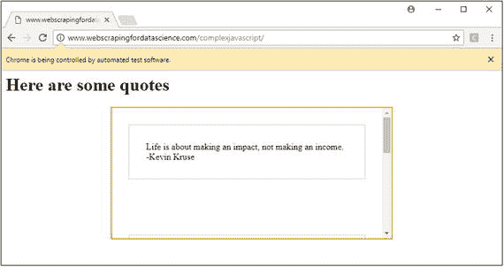

# 5.处理 JavaScript

与 HTML 和 CSS 一起，JavaScript 构成了现代网络的第三个也是最后一个核心构件。我们已经看到 JavaScript 在本书中偶尔出现，现在是我们仔细研究它的时候了。正如我们很快会在本章中看到的，我们坚固的请求加上漂亮的汤的组合不再是一个可行的方法来抓取大量的 JavaScript 页面。因此，本章将向您介绍另一个库 Selenium，它用于自动化和控制成熟的 web 浏览器。

## 5.1 什么是 JavaScript？

简而言之，JavaScript——就像 Python 一样——是一种高级编程语言。与许多其他编程语言相反，它的核心功能在于使网页更具交互性和动态性。许多网站使用它来这样做，并且所有现代 web 浏览器都通过内置的 JavaScript 引擎支持它。在早期，JavaScript 仅在客户端 web 浏览器中实现，并且只适合在该上下文中使用。然而，有趣的是，JavaScript 作为一种语言在最近几年引起了广泛的兴趣，现在也可以发现它在运行服务器端程序，甚至包括完整的 web 服务器，或者作为各种桌面应用程序背后的引擎。

Java and JavaScript

如今，这似乎成了一个有争议的问题，但仍然值得顺便提一下，尽管 JavaScript 和 Java 之间有一些相似之处，但这两种编程语言确实是截然不同的，差别很大。

JavaScript 代码可以在 HTML 文档中的“

```py
<script type="text/javascript">
// JavaScript code comes here
</script>

```

或者通过设置“src”属性来引用可以找到代码的位置:

```py
<script type="text/javascript" src="my_file.js"></script>

```

我们不打算在这里学习如何编写 JavaScript，但是我们需要弄清楚在试图抓取大量使用这种语言的网站时，如何处理这种语言。让我们从使用目前为止我们看到的工具尝试使用 JavaScript 开始。

## 5.2 抓取 JavaScript

导航到位于 [`http://www.webscrapingfordatascience.com/simplejavascript/`](http://www.webscrapingfordatascience.com/simplejavascript/) 的网址。这个简单的网页显示了三个随机的引用，但是它使用 JavaScript 来实现。检查页面的源代码，您会发现下面的 JavaScript 片段:

```py
<script>
  $(function() {
  document.cookie = "jsenabled=1";
    $.getJSON("quotes.php", function(data) {
      var items = [];
      $.each(data, function(key, val) {
        items.push("<li id='" + key + "'>" + val + "</li>");
      });
      $("<ul/>", {
        html: items.join("")
        }).appendTo("body");
      });
  });
</script>

```

Inspecting Elements versus View Source, Again

这是一个很好的机会来再次强调查看页面源代码和使用浏览器的开发工具检查元素之间的区别。“查看源代码”选项显示了 web 服务器返回的 HTML 代码，当使用请求时，它将包含与`r.text`相同的内容。另一方面，检查元素在 HTML 被 web 浏览器解析后提供了一个“清理过的”版本，并提供了一个动态的视图。这就是为什么您可以检查 quote 元素，但看不到它们出现在页面的源代码中，因为它们是在浏览器检索到页面内容后由 JavaScript 加载的。

这个 JavaScript 片段执行以下操作:

*   To 代码被包装在一个“$()”函数中。这不是标准 JavaScript 的一部分，而是 jQuery 提供的一种机制，jQuery 是一个流行的 JavaScript 库，使用另一个“
*   函数内部的代码从设置一个“js enabled”cookie 开始。事实上，JavaScript 也能够设置和检索 cookies。
*   接下来，使用一个“getJSON”函数执行另一个 HTTP 请求来获取引号，通过在“”中插入一个“

现在让我们看看如何使用请求和漂亮的汤来处理这个用例:

```py
import requests
from bs4 import BeautifulSoup

url = 'http://www.webscrapingfordatascience.com/simplejavascript/'

r = requests.get(url)

html_soup = BeautifulSoup(r.text, 'html.parser')

# No tag will be found here
ul_tag = html_soup.find('ul')
print(ul_tag)

# Show the JavaScript code
script_tag = html_soup.find('script', attrs={'src': None})

print(script_tag)

```

正如您将观察到的，页面的内容只是按原样返回，但是无论是请求还是漂亮的 Soup 都没有包含 JavaScript 引擎，这意味着不会执行 JavaScript，也不会在页面上找到“

在像这样的简单情况下，这不一定是个问题。我们知道浏览器正在向“quotes.php”页面发出请求，我们需要设置一个 cookie。我们仍然可以直接收集数据:

```py
import requests

url = 'http://www.webscrapingfordatascience.com/simplejavascript/quotes.php'

# Note that cookie values need to be provided as strings
r = requests.get(url, cookies={'jsenabled': '1'})

print(r.json())

```

这是可行的(试着在不设置 cookie 的情况下看看会发生什么)，尽管在更复杂的页面上，提出这样的方法可能会令人望而生畏。有些网站甚至会阻止你对 JavaScript 代码进行“逆向工程”。举个例子，把头伸向 [`http://www.webscrapingfordatascience.com/complexjavascript/`](http://www.webscrapingfordatascience.com/complexjavascript/) 。您会注意到，该页面通过滚动到列表底部来加载额外的报价。检查“<脚本>标签现在显示以下混乱:

```py
<script>
var _0x110b=["","\x6A\x6F\x69\x6E","\x25","\x73[...]\x6C"];
function sc(){
var _0xe9a7=["\x63\x6F\x6F\x6B\x69\x65","\x6E\x6F\x6E\x63\x65\x3D2545"];
document[_0xe9a7[0]]= _0xe9a7[1]
}$(function(){sc();
function _0x593ex2(_0x593ex3){
return decodeURIComponent([...],
function(_0x593ex4){
return _0x110b[2]+ [...]}
$(_0x110b[16])[_0x110b[15]]({
padding:20,
nextSelector:_0x110b[9],
contentSelector:_0x110b[0],
callback:function(){
$(_0x110b[14])[_0x110b[13]](function(_0x593ex5){
$(this)[_0x110b[10]](_0x593ex2($(this)[_0x110b[10]]()));
$(this)[_0x110b[12]](_0x110b[11])})}})})
</script>

```

要弄清楚这里发生了什么显然是不可行的。对于您的 web 浏览器来说，解释和运行这些代码可能很简单，但是对于我们人类来说，并不简单。幸运的是，在某种程度上，我们仍然可以尝试检查网络请求，以弄清楚这里发生了什么:

*   再次向带有用于分页的“p”URL 参数的“quotes.php”页面发出请求。
*   这里使用了两个 cookie:“nonce”和“PHPSESSID”后者我们以前遇到过，它简单地包含在主页的“Set-Cookie”响应头中。然而,“nonce”cookie 却不是，这表明它可能是通过 JavaScript 设置的，尽管我们并不真正知道在哪里(聪明的读者可能能够理解，但是为了这个例子，请继续关注我们)。

Untangling JavaScript

安全研究人员经常会试图解开混乱的 JavaScript 代码，比如这里看到的代码，以弄清楚某段特定的代码在做什么。显然，这是一项令人生畏和精疲力尽的任务。

我们至少可以尝试“窃取”nonce 的 cookie 值，看看我们是否可以使用请求获得任何东西(注意，您的“nonce”cookie 值可能不同):

```py
import requests

url = 'http://www.webscrapingfordatascience.com/complexjavascript/'

my_session = requests.Session()

# Get the main page first to obtain the PHPSESSID cookie
r = my_session.get(url)

# Manually set the nonce cookie
my_session.cookies.update({
    'nonce': '2315'
    })

r = my_session.get(url + 'quotes.php', params={'p': '0'})

print(r.text)
# Shows: No quotes for you!

```

可悲的是，这不起作用。找出原因需要一些创造性的思考，尽管我们可以猜测这里可能会出什么问题。我们通过访问主页来获得一个新的会话标识符，就好像我们来自一个新的浏览会话来提供“PHPSESSID”cookie。然而，我们正在重用浏览器使用的“nonce”cookie 值。网页可能会看到这个“nonce”值与“PHPSESSID”信息不匹配。因此，我们别无选择，只能重用“PHPSESSID”值。同样，您的可能不同(检查您的浏览器的网络请求，以查看它为您的会话发送了哪些值):

```py
import requests

url = 'http://www.webscrapingfordatascience.com/complexjavascript/'

my_cookies = {
    'nonce': '2315',
    'PHPSESSID': 'rtc4l3m3bgmjo2fqmi0og4nv24'
    }

r = requests.get(url + 'quotes.php', params={'p': '0'}, cookies=my_cookies)

print(r.text)

```

这至少给我们留下了不同的结果:

```py
<div class="quote decode">TGlmZ[...]EtydXNlCg==</div>
<div class="quote decode">CVdoY[...]iBIaWxsCg==</div>
<div class="quote decode">CVN0c[...]Wluc3RlaW4K</div>
<br><br><br><br>
<a class="jscroll-next" href="quotes.php?p=3">Load more quotes</a>

```

这看起来像 HTML 包含我们的报价，但请注意，每个报价似乎以某种方式编码。显然，在 JavaScript 端必须有另一部分编程逻辑来解码引用并在获取引用后显示它们，尽管同样，通过检查 JavaScript 源代码很难弄清楚这到底是如何完成的。

此外，我们通过从浏览器获取“nonce”和“PHPSESSID”cookie 来重用它们。一旦 web 服务器确定它已经有一段时间没有收到我们的消息，并且我们用相同的值重试运行我们的脚本，web 服务器将再次拒绝回答，因为我们使用的是过期的 cookies。然后，我们需要在浏览器中重新加载页面，并替换上面脚本中的 cookie 值。

Cracking the Code

诚然，您可能已经认识到了这里用来编码引号的编码方案:base64，因此也能够在 Python 中解码它们(这样做很容易)。当然，这很好，在现实生活中，这可能是一种值得考虑的方法，不过请注意，上面的例子只是想表明，在某个点上，试图对 JavaScript 进行逆向工程可能会变得相对困难。类似地，您可能已经发现“nonce”cookie 值隐藏在上面的 JavaScript 代码中的什么地方，并且能够使用 Python 中的一些正则表达式来获取它，尽管这也是我们在这里试图提出的论点之外的内容。

显然，这种方法带来了许多问题，遗憾的是，我们无法用目前所看到的来解决这些问题。这个问题的解决方案很容易描述:我们看到引号出现在我们的浏览器窗口中，它正在执行 JavaScript，所以我们不能把它们从那里取出来吗？事实上，对于大量使用 JavaScript 的网站，我们别无选择，只能模仿完整的浏览器堆栈，远离请求和漂亮的汤。这正是我们在下一节要做的，使用另一个 Python 库:Selenium。

Are You a Browser?

一些网络公司还会利用 JavaScript 来检查访问者，在显示页面内容之前，看看他们是否使用了真正的浏览器。例如，CloudFlare 称之为“浏览器完整性检查”。在这些情况下，当使用请求时，很难逆向工程它的工作来假装你是一个浏览器。

## 5.3 用硒刮擦

Selenium 是一个强大的 web 抓取工具，最初是为了自动化网站测试而开发的。Selenium 通过自动化浏览器来加载网站、检索内容和执行操作，就像用户使用浏览器一样。因此，它也是一个强大的网络抓取工具。Selenium 可以通过各种编程语言进行控制，比如 Java、C#、PHP，当然还有 Python。

需要注意的是，Selenium 本身没有自带网络浏览器。相反，它需要一个集成软件来与第三方交互，称为 WebDriver。大多数现代浏览器都有网络驱动，包括 Chrome、Firefox、Safari 和 Internet Explorer。使用这些工具时，您会看到一个浏览器窗口在您的屏幕上打开，并执行您在代码中指定的操作。

Headless Mode

在接下来的内容中，我们将安装并使用 Chrome WebDriver 和 Selenium，但是如果您愿意，也可以随意使用其他 WebDriver。有趣的是，虽然在创建 web scraper 时观察浏览器正在做什么是有帮助的，但这带来了额外的开销，并且在没有连接显示器的服务器上可能更难设置。不用担心，因为 Selenium 还为所谓的“无头”浏览器提供了 web 驱动程序，这些浏览器在不显示图形用户界面的情况下“不可见”地运行。如果您想了解更多，可以看看 PhantomJS WebDriver。PhantomJS 是用 JavaScript 编写的“无头”浏览器，通常单独用于网站测试和抓取(在 JavaScript 中)，但也可以通过其 WebDriver 用作 Selenium 和 Python 中的引擎。请注意，就像任何其他现代 web 浏览器一样，PhantomJS 将能够呈现 HTML，处理 cookies，并在后台执行 JavaScript。

就像请求和美丽的汤一样，安装 Selenium 本身很简单(如果您仍然需要设置 Python 3 和 pip，请参考第 1.2.1 节):

```py
pip install -U selenium

```

接下来，我们需要下载一个 web 驱动程序。前往[https://sites . Google . com/a/chromium . org/chrome driver/downloads](https://sites.google.com/a/chromium.org/chromedriver/downloads)，下载与您的平台(Windows、Mac 或 Linux)相匹配的最新发布文件。您下载的 ZIP 文件将包含一个名为“chromedriver.exe”的可执行文件(在 Windows 上),否则仅包含“chromedriver”。确保 Selenium 可以看到这个可执行文件的最简单的方法就是确保它与您的 Python 脚本位于同一个目录中，在这种情况下，下面的小示例应该马上就可以工作了:

```py
from selenium import webdriver

url = 'http://www.webscrapingfordatascience.com/complexjavascript/'

driver = webdriver.Chrome()
driver.get(url)

input('Press ENTER to close the automated browser')
driver.quit()

```

如果您喜欢将 WebDriver 可执行文件保存在其他地方，也可以在用 Python 构建 Selenium webdriver 对象时传递它的位置，如下所示(但是，为了使代码更短，我们将假设您将可执行文件保存在以下示例的同一目录中):

```py
driver_exe = 'C:/Users/Seppe/Desktop/chromedriver.exe'
# If you copy-paste the path with back-slashes, make sure to escape them
# E.g.: driver_exe = 'C:\\Users\\Seppe\\Desktop\\chromedriver.exe'
driver = webdriver.Chrome(driver_exe)

```

如果你运行第一个例子，你会注意到一个新的 Chrome 窗口出现，并警告这个窗口被自动化测试软件控制；见图 [5-1](#Fig1) 。Python 脚本会一直等待，直到您按下 enter 键，然后退出浏览器窗口。

一旦一个页面被加载，你将希望能够得到 HTML 元素，就像我们之前对 Beautiful Soup 做的那样。Selenium 的方法列表看起来略有不同，但是根据您目前所学的内容，应该不会太难:

*   `find_element_by_id`
*   `find_element_by_name`
*   `find_element_by_xpath`
*   `find_element_by_link_text`
*   `find_element_by_partial_link_text`
*   `find_element_by_tag_name`
*   `find_element_by_class_name`
*   `find_element_by_css_selector`

注意，所有这些都带有一个`find_elements_by_*`变量(注意“s”)，就像 Beautiful Soup 中的`find_all`方法一样，它返回一个元素列表(在 Selenium 中表示为`WebElement`对象)，而不是第一个匹配的元素。同样需要注意的是，如果找不到元素，上面的方法将引发一个`NoSuchElementException`异常。在这种情况下，Beautiful Soup 简单地返回 0。这种情况下的大多数方法将



图 5-1

A Chrome window being controlled by Selenium

不言自明，尽管有些需要进一步解释。

`find_element_by_link_text`方法通过匹配其内部文本来选择元素。`find_element_by_partial_link_text`方法做同样的事情，但是部分匹配内部文本。这些在很多情况下都很方便，例如，根据文本值查找链接。

`find_element_by_name`方法基于 HTML“name”属性选择元素，而`find_element_by_tag_name`使用实际的标签名称。

`find_element_by_css_selector`方法类似于 Beautiful Soup 的`select`方法，但是带有一个更健壮的 CSS 选择器规则解析器。

`find_element_by_xpath`方法做了一些类似的事情。XPath 是一种用于在 XML 文档中定位节点的语言。由于 HTML 可以被视为 XML 的实现(在这种情况下也称为 XHTML)，Selenium 可以使用 XPath 语言来选择元素。XPath 超越了通过 id 或名称属性定位的简单方法。下面给出了常见 XPath 表达式的快速概述:

*   `nodename`选择名称为“节点名”的所有节点；
*   `/`从根节点选择；
*   `//`可用于跳过多级节点，并在所有后代中搜索以执行选择；
*   `.`选择当前节点；
*   `..`选择当前节点的父节点；
*   `@`选择属性。

这些表达式可以链接在一起，形成强大的规则。一些示例 XPath 规则是:

*   `/html/body/form[1]`:获取""标记内""标记内的第一个表单元素。
*   `//form[1]`:获取文档内的第一个表单元素。
*   `//form[@id='my_form']`:获取“id”属性设置为“my_form”的表单元素。

Inspect Mode

如果你想在你的 scrapers 中使用 CSS 选择器或者 XPath 表达式，记住你可以在 Chrome 的开发者工具的 Elements 标签中右键点击 HTML 元素，然后选择“复制，复制选择器”和“复制 XPath”来给你一个合适的选择器或者表达式的轮廓。

让我们修改我们的脚本来展示这些方法，例如，获取引号的内容:

```py
from selenium import webdriver

url = 'http://www.webscrapingfordatascience.com/complexjavascript/'

# chromedriver should be in the same path as your Python script
driver = webdriver.Chrome()
driver.get(url)

for quote in driver.find_elements_by_class_name('quote'):
    print(quote.text)

input('Press ENTER to close the automated browser')
driver.quit()

```

让我们后退一步，看看发生了什么:导航到我们的页面后，我们使用`find_elements_by_class_name`方法来检索报价元素。对于每个这样的 quote 元素(一个`WebElement`对象)，我们使用它的`text`属性打印出它的文本。就像 Beautiful Soup 的`find`和`find_all`一样，如果您想“深入挖掘”，可以对检索到的元素调用`find_element_*`和`find_elements_*`方法

遗憾的是，运行这段代码似乎不起作用，因为根本没有显示引号。这样做的原因是因为我们的浏览器需要一些时间——即使只有半秒钟——来执行 JavaScript、获取报价并显示它们。与此同时，我们 Python 脚本已经在努力尝试寻找引用元素，而这些元素目前还不存在。我们可能只是在代码中插入一行`sleep`来等待几秒钟，但是 Selenium 提供了一种更健壮的方法:等待条件。

Selenium 提供了两种类型的等待:隐式和显式。隐式等待使 WebDriver 在每次尝试定位元素时轮询页面一定的时间。可以把隐式等待想象成一个“捕获全部”,当我们试图定位一个元素时，每次都要等待一段时间。默认情况下，隐式等待时间设置为零，这意味着 Selenium 根本不会等待。然而，这很容易改变。因此，以下代码有效:

```py
from selenium import webdriver

url = 'http://www.webscrapingfordatascience.com/complexjavascript/'

driver = webdriver.Chrome()

# Set an implicit wait
driver.implicitly_wait(10)

driver.get(url)

for quote in driver.find_elements_by_class_name('quote'):
    print(quote.text)

input('Press ENTER to close the automated browser')
driver.quit()

```

当您刚刚开始使用 Selenium 时，隐式等待很有帮助，但是显式等待提供了更细粒度的控制。显式等待使 WebDriver 在继续执行之前等待某个给定的条件返回一个非 False 值。这个条件将被反复尝试，直到它返回一些东西，或者直到一个给定的超时已经过去。为了使用显式等待，我们依赖于以下导入:

```py
from selenium.webdriver.common.by import By
from selenium.webdriver.support.ui import WebDriverWait
from selenium.webdriver.support import expected_conditions as EC

```

上面的`EC`对象自带了大量的内置条件，所以我们不需要自己编写这些代码。开箱即用，硒提供以下条件:

*   `alert_is_present`:检查是否出现警报。
*   `element_located_selection_state_to_be(locator, is_selected)`:检查一个元素的位置是否与一个`locator`匹配(见下面的解释)，以及它的选择状态是否与`is_selected`匹配(对或错)。
*   `element_located_to_be_selected(locator)`:检查一个元素(一个`WebElement`对象)是否与一个`locator`(见下面的解释)相匹配并被选中。
*   `element_selection_state_to_be(element, is_selected)`:检查`element`(一个 WebElement 对象)的选择状态是否与`is_selected`(真或假)匹配。
*   `element_to_be_selected(element)`:检查是否选择了`element`(一个`WebElement`对象)。
*   `element_to_be_clickable(locator)`:检查一个元素是否与一个`locator`相匹配(见下面的解释)并且可以被点击(即被激活)。
*   `frame_to_be_available_and_switch_to_it(locator)`:检查是否找到与`locator`(见下面的解释)匹配的帧，并且可以切换到该帧，一旦找到，条件切换到该帧。
*   `invisibility_of_element_located(locator)`:检查与`locator`(见下面的解释)匹配的元素在页面上是否不可见或不存在(可见性意味着该元素不仅仅被显示或具有大于 0 的高度和宽度)。
*   `new_window_is_opened(current_handles)`:检查是否有新窗口打开。
*   `number_of_windows_to_be(num_windows)`:检查是否打开了特定数量的窗口。
*   `presence_of_all_elements_located(locator)`:检查页面上是否存在至少一个与`locator`匹配的元素(见下面的解释)。如果找到，该条件将返回匹配元素的列表。
*   `presence_of_element_located(locator)`:检查页面上是否存在至少一个与`locator`匹配的元素(见下面的解释)。如果找到，该条件将返回第一个匹配的元素。
*   `staleness_of(element)`:检查一个`element`(一个`WebElement`对象)是否已经从页面中移除。
*   `text_to_be_present_in_element(locator, text_)`:检查一个给定的字符串是否出现在一个与`locator`匹配的元素中(见下面的解释)。
*   `text_to_be_present_in_element_value(locator, text_)`:检查给定的字符串是否出现在与`locator`匹配的元素的 value 属性中(参见下面的解释)。
*   `title_contains(title)`:检查页面标题是否包含给定的字符串。
*   `title_is(title)`:检查页面的标题是否等于给定的字符串。
*   `url_changes(url)`:检查 URL 是否与给定的不同。
*   `url_contains(url)`:检查 URL 是否包含给定的 URL。
*   `url_matches(pattern)`:检查 URL 是否匹配给定的正则表达式模式。
*   `url_to_be(url)`:检查 URL 是否与给定的匹配。
*   `visibility_of(element)`:检查当前`element`(一个`WebElement`对象)是否可见(可见性是指元素不仅被显示，而且高度和宽度都大于 0)。
*   `visibility_of_all_elements_located(locator)`:检查是否所有与`locator`(见下面的解释)匹配的元素都是可见的。如果是这种情况，则返回匹配元素的列表。
*   `visibility_of_any_elements_located(locator)`:检查是否有任何与`locator`(见下面的解释)匹配的元素可见。如果是这种情况，则返回第一个可见元素。
*   `visibility_of_element_located(locator)`:检查匹配 a `locator`(见下面的解释)的第一个元素是否也可见。如果是这种情况，返回元素。

通过修改我们的示例来使用显式等待，让我们看看它们是如何工作的:

```py
from selenium import webdriver
from selenium.webdriver.common.by import By
from selenium.webdriver.support.ui import WebDriverWait
from selenium.webdriver.support import expected_conditions as EC

url = 'http://www.webscrapingfordatascience.com/complexjavascript/'

driver = webdriver.Chrome()

driver.get(url)

quote_elements = WebDriverWait(driver, 10).until(
    EC.presence_of_all_elements_located(
        (By.CSS_SELECTOR, ".quote:not(.decode)")
    )
)

for quote in quote_elements:
    print(quote.text)

input('Press ENTER to close the automated browser')
driver.quit()

```

这个例子的工作原理如下。首先，我们使用我们的`WebDriver`创建一个`WebDriverWait`对象，并给定我们想要等待的秒数。然后我们调用这个对象上的`until`方法，我们需要向它提供一个条件对象，在我们的例子中是预定义的`presence_of_all_elements_located`。注意，这个条件需要一个`locator`参数，它只是一个包含两个元素的元组。第一个元素决定基于哪种方法选择一个元素(可能的选项有:`By.ID`、`By.XPATH`、`By.NAME`、`By.TAG_NAME`、`By.CLASS_NAME`、`By.CSS_SELECTOR`、`By.LINK_TEXT`、`By.PARTIAL_LINK_TEXT`)；第二个元素提供实际值。这里，我们的定位器声明我们希望通过给定的 CSS 选择器规则来查找元素，用“quote”CSS 类而不是“decode”CSS 类来指定所有元素，因为我们希望等到页面上的 JavaScript 代码完成对引号的解码。

这个条件会被反复检查，直到过了 10 秒，或者直到条件返回一个不为假的东西，也就是`presence_of_all_elements_located`情况下的匹配元素列表。然后我们可以直接遍历这个列表并检索报价的内容。

请注意，定位器元组也可以在条件之外使用。也就是说，除了使用上面讨论的细粒度的`find_element_by_*`和`find_elements_by_*`方法，您还可以使用通用的`find_element`和`find_elements`方法，并提供一个`By`参数和实际值，例如，在“driver.find_elements(By。XPATH，'//a ')"。这在普通代码中可读性稍差，但在您想要定义自己的自定义条件时会很方便，这是可能的，如下例所示:

```py
class at_least_n_elements_found(object):
    def __init__(self, locator, n):
        self.locator = locator
        self.n = n

    def __call__(self, driver):
        # Do something here and return False or something else
        # Depending on whether the condition holds
        elements = driver.find_elements(*self.locator)
        if len(elements) >= self.n:
            return elements
        else:
            return False

wait = WebDriverWait(driver, 10)
element = wait.until(
        at_least_n_elements_found((By.CLASS_NAME, 'my_class'), 3)
)

```

在这个例子中，定义了一个类似于`presence_of_all_elements_located`的新条件，但是要等到至少找到给定数量的匹配元素。

我们还有一件事需要解决。到目前为止，我们的例子只返回前三个引号。我们仍然需要想办法使用 Selenium 向下滚动报价列表，以便加载所有报价。为此，Selenium 提供了一系列可以由浏览器执行的“操作”，比如单击元素、单击并拖动、双击、右键单击等等，我们可以使用这些操作来向下移动滚动条。然而，由于我们正在与一个成熟的浏览器交互，我们也可以指示它执行 JavaScript 命令。因为也可以使用 JavaScript 滚动，所以我们可以使用`execute_script`方法向浏览器发送 JavaScript 命令。

下面的代码片段使用我们的自定义等待条件展示了这一点:

```py
from selenium import webdriver
from selenium.webdriver.common.by import By
from selenium.webdriver.support.ui import WebDriverWait
from selenium.webdriver.support import expected_conditions as EC
from selenium.common.exceptions import TimeoutException

class at_least_n_elements_found(object):
    def __init__(self, locator, n):
        self.locator = locator
        self.n = n

    def __call__(self, driver):
        elements = driver.find_elements(*self.locator)
        if len(elements) >= self.n:
            return elements
        else:
            return False

url = 'http://www.webscrapingfordatascience.com/complexjavascript/'

driver = webdriver.Chrome()
driver.get(url)

# Use an implicit wait for cases where we don't use an explicit one
driver.implicitly_wait(10)

div_element = driver.find_element_by_class_name('infinite-scroll')
quotes_locator = (By.CSS_SELECTOR, ".quote:not(.decode)")

nr_quotes = 0
while True:

    # Scroll down to the bottom
    driver.execute_script(
        'arguments[0].scrollTop = arguments[0].scrollHeight',
        div_element)
    # Try to fetch at least nr_quotes+1 quotes
    try:
        all_quotes = WebDriverWait(driver, 3).until(
            at_least_n_elements_found(quotes_locator, nr_quotes + 1)
        )
    except TimeoutException as ex:
        # No new quotes found within 3 seconds, assume this is all there is
        print("... done!")
        break

    # Otherwise, update the quote counter
    nr_quotes = len(all_quotes)
    print("... now seeing", nr_quotes, "quotes")

# all_quotes will contain all the quote elements
print(len(all_quotes), 'quotes found\n')
for quote in all_quotes:
    print(quote.text)

input('Press ENTER to close the automated browser')
driver.quit()

```

执行此代码，并跟踪浏览器中发生的情况以及您在 Python 控制台中获得的输出，它应该显示以下内容:

```py
... now seeing 3 quotes
... now seeing 6 quotes
... now seeing 9 quotes
... now seeing 12 quotes
... now seeing 15 quotes
... now seeing 18 quotes
... now seeing 21 quotes
... now seeing 24 quotes
... now seeing 27 quotes
... now seeing 30 quotes
... now seeing 33 quotes
... done!
33 quotes found

Life is about making an impact, not making an income. -Kevin Kruse
Whatever the mind of man can conceive and believe, it can achieve. –Napoleon Hill
Strive not to be a success, but rather to be of value. –Albert Einstein
Two roads diverged in a wood, and —II took the one less traveled by, And that has made all the difference. –Robert Frost
[...]

```

如果您想看看不使用 JavaScript 命令和动作是如何工作的，可以看看下面的片段(注意两个新的导入)。在下一节中，我们将更多地讨论通过动作与网页进行交互。

```py
from selenium import webdriver
from selenium.webdriver.common.by import By
from selenium.webdriver.support.ui import WebDriverWait
from selenium.webdriver.support import expected_conditions as EC
from selenium.common.exceptions import TimeoutException
from selenium.webdriver.common.action_chains import ActionChains
from selenium.webdriver.common.keys import Keys

class at_least_n_elements_found(object):
    def __init__(self, locator, n):
        self.locator = locator
        self.n = n

    def __call__(self, driver):
        elements = driver.find_elements(*self.locator)
        if len(elements) >= self.n:
            return elements
        else:
            return False

url = 'http://www.webscrapingfordatascience.com/complexjavascript/'

driver = webdriver.Chrome()
driver.get(url)

# Use an implicit wait for cases where we don't use an explicit one

driver.implicitly_wait(10)

div_element = driver.find_element_by_class_name('infinite-scroll')
quotes_locator = (By.CSS_SELECTOR, ".quote:not(.decode)")

nr_quotes = 0
while True:
    # Scroll down to the bottom, now using action (chains)
    action_chain = ActionChains(driver)
    # Move to our quotes block
    action_chain.move_to_element(div_element)
    # Click it to give it focus
    action_chain.click()
    # Press the page down key about 10 ten times
    action_chain.send_keys([Keys.PAGE_DOWN for i in range(10)])
    # Do these actions
    action_chain.perform()

    # Try to fetch at least nr_quotes+1 quotes
    try:
        all_quotes = WebDriverWait(driver, 3).until(
            at_least_n_elements_found(quotes_locator, nr_quotes + 1)
        )
    except TimeoutException as ex:
        # No new quotes found within 3 seconds, assume this is all there is

        print("... done!")
        break

    # Otherwise, update the quote counter
    nr_quotes = len(all_quotes)
    print("... now seeing", nr_quotes, "quotes")

# all_quotes will contain all the quote elements
print(len(all_quotes), 'quotes found\n')
for quote in all_quotes:
    print(quote.text)

input('Press ENTER to close the automated browser')
driver.quit()

```

## 5.4 关于硒的更多信息

现在，我们已经了解了如何在 Selenium 中查找元素、处理条件和等待，以及向浏览器发送 JavaScript 命令，是时候深入了解这个库了。为此，我们将切换回我们之前在 [`http://www.webscrapingfordatascience.com/postform2/`](http://www.webscrapingfordatascience.com/postform2/) 的一个例子——那边的表格将为我们提供一个探索 Selenium 功能的良好平台。

让我们从更多地谈论导航开始。我们已经看到了使用 Selenium 导航到 URL 的`get`方法。类似地，你也可以调用驱动程序的`forward`和`back`方法(这些方法没有参数)在浏览器的历史中前进和后退。关于 cookie，知道这一点很有帮助——因为 Selenium 使用真正的浏览器——我们自己不需要担心 cookie 管理。如果你想输出当前可用的 cookies，你可以在一个`WebDriver`对象上调用`get_cookies`方法。`add_cookie`方法允许您设置一个新的 cookie(它需要一个带有“name”和“value”键的字典作为它的参数)。

让我们从一个全新的 Selenium 程序开始，来处理我们的 web 表单。我们将在这里使用隐式等待使事情变得简单明了:

```py
from selenium import webdriver

url = 'http://www.webscrapingfordatascience.com/postform2/'

driver = webdriver.Chrome()
driver.implicitly_wait(10)

driver.get(url)

input('Press ENTER to close the automated browser')
driver.quit()

```

每次使用`find_element_by_*`和`find_elements_by_*`方法(或者通用的`find_element`和`find_elements`方法)检索元素时，Selenium 将返回`WebElement`对象。对于此类对象，您可以访问许多有趣的方法和属性:

*   首先，请记住，您可以对一个`WebElement`对象再次使用`find_element_by_*`和`find_elements_by_*`方法(或者通用的`find_element`和`find_elements`方法),从当前元素开始新的元素搜索，就像我们在 Beautiful Soup 中所做的那样。这有助于检索页面中的嵌套元素。
*   `click`方法点击元素。
*   如果元素是一个文本输入元素，那么`clear`方法会清除该元素的文本。
*   `get_attribute`方法获取元素的 HTML 属性或特性，或者不获取。比如`element.get_attribute('href')`。
*   `get_property`方法获取元素的一个属性。
*   `is_displayed`、`is_enabled`和`is_selected`方法分别返回一个布尔值，指示一个元素是对用户可见、被启用还是被选中。后者用于查看复选框或单选按钮是否被选中。
*   `send_keys`方法模拟输入元素。它接受字符串、列表或作为列表传递的一系列击键。
*   `submit`方法提交一个表单。
*   方法为给定的属性名返回元素的 CSS 属性值。
*   方法将当前元素的截图保存到一个给定的 PNG 文件名中。
*   属性`location`提供元素的位置，`size`返回元素的大小，`rect`返回包含大小和位置的字典。`parent`属性引用了发现该元素的`WebDriver`实例；`tag_name`包含元素的标记名；并且`text`属性返回元素的文本，我们之前已经使用过了。一个`WebElement`对象的`page_source`属性将返回整个页面的动态 HTML 源代码。

Getting HTML

一个`WebElement`对象的`page_source`属性将返回整个页面的动态 HTML 源代码。但是，如果您只想获得元素的 HTML 源代码，您需要使用`element.get_attribute('innerHTML')`访问“innerHTML”属性,“outerHTML”属性也做同样的事情，但是也包括元素的标记本身。例如，如果您仍然想使用 Beautiful Soup 来解析页面的某些组件，这些属性会很有用。

为了处理下拉列表("<select>"标签)，Selenium 允许您基于给定的WebElement对象构造一个Select对象(位于" Selenium . web driver . support . select "下)。一旦创建了这样一个对象，就可以调用下面的方法或者访问下面的属性: select_by_index(index): Select the option at the given index. select_by_value(value): Select all options whose values match the parameters. select_by_visible_text(text): Select all options to display the text matching the parameters. The above methods all have deselect_* variants, and you can also deselect options. deselect_all The method clears all selected entries (note that the select tab can support multiple selections). all_selected_options: Returns the list of all selection options belonging to this selection tab. first_selected_option: the first selected option in this selection tab (or the currently selected option in ordinary selection, only one option is allowed). options: Returns the list of all options belonging to this selection tab.</select>

让我们利用目前所看到的内容开始填写我们的表格:

```py
from selenium import webdriver
from selenium.webdriver.support.select import Select
from selenium.webdriver.common.keys import Keys

url = 'http://www.webscrapingfordatascience.com/postform2/'

driver = webdriver.Chrome()
driver.implicitly_wait(10)

driver.get(url)

driver.find_element_by_name('name').send_keys('Seppe')
driver.find_element_by_css_selector('input[name="gender"][value="M"]').click()
driver.find_element_by_name('pizza').click()
driver.find_element_by_name('salad').click()
Select(driver.find_element_by_name('haircolor')).select_by_value('brown')
driver.find_element_by_name('comments').send_keys(
    ['First line', Keys.ENTER, 'Second line'])

input('Press ENTER to submit the form')

driver.find_element_by_tag_name('form').submit()
# Or: driver.find_element_by_css_selector('input[type="submit"]').click()

input('Press ENTER to close the automated browser')
driver.quit()

```

花一些时间来运行这个例子并检查代码。请注意特殊的`Keys`辅助对象的使用，该对象可用于发送 ENTER、PAGE DOWN 等键。

与上面看到的直接处理动作不同，Selenium 还提供了一个`ActionChains`对象(位于“Selenium . web driver . common . action _ chains”下)来构建更细粒度的动作链。这对于做更复杂的动作很有用，比如悬停和拖放。它们通过提供一个驱动程序对象来构造，并公开以下方法:

*   `click(on_element=None)`:点击一个元素。如果没有给定，则使用当前鼠标位置。
*   `click_and_hold(on_element=None)`:在元素或当前鼠标位置按住鼠标左键。
*   `release(on_element=None)`:在一个元素或当前鼠标位置上释放一个按住的鼠标按钮。
*   `context_click(on_element=None)`:在元素或当前鼠标位置上执行上下文点击(右键)。
*   `double_click(on_element=None)`:双击一个元素或当前鼠标位置。
*   `move_by_offset(xoffset, yoffset)`:将鼠标从当前鼠标位置移动一个偏移量。
*   `move_to_element(to_element)`:将鼠标移动到元素的中间。
*   `move_to_element_with_offset(to_element, xoffset, yoffset)`:将鼠标移动指定元素的偏移量。偏移量相对于元素的左上角。
*   `drag_and_drop(source, target)`:在源元素上按住鼠标左键，然后移动到目标元素并释放鼠标按钮。
*   `drag_and_drop_by_offset(source, xoffset, yoffset)`:在源元素上按住鼠标左键，然后移动到目标偏移量并释放鼠标按钮。
*   `key_down(value, element=None)`:只发送按键，不释放。应仅与修饰键(即 Control、Alt 和 Shift)一起使用。
*   `key_up(value, element=None)`:释放修改键。
*   `send_keys(*keys_to_send)`:向当前聚焦的元素发送按键。
*   `send_keys_to_element(element, *keys_to_send)`:向一个元素发送键。
*   `pause(seconds)`:等待给定的秒数。
*   `perform()`:执行动作链上定义的所有存储动作。这通常是你给链的最后一个命令。
*   `reset_actions()`:清除已经存储在远端的动作。

以下示例在功能上与上述示例相同，但它使用操作链来填充大多数表单字段:

```py
from selenium import webdriver
from selenium.webdriver.support.select import Select
from selenium.webdriver.common.keys import Keys
from selenium.webdriver.common.action_chains import ActionChains

url = 'http://www.webscrapingfordatascience.com/postform2/'

driver = webdriver.Chrome()
driver.implicitly_wait(10)

driver.get(url)

chain = ActionChains(driver)
chain.send_keys_to_element(driver.find_element_by_name('name'), 'Seppe')
chain.click(driver.find_element_by_css_selector('input[name="gender"][value="M"]'))
chain.click(driver.find_element_by_name('pizza'))
chain.click(driver.find_element_by_name('salad'))
chain.click(driver.find_element_by_name('comments'))
chain.send_keys(['This is a first line', Keys.ENTER, 'And this a second'])
chain.perform()

Select(driver.find_element_by_name('haircolor')).select_by_value('brown')

input('Press ENTER to submit the form')

driver.find_element_by_tag_name('form').submit()
# Or: driver.find_element_by_css_selector('input[type="submit"]').click()

input('Press ENTER to close the automated browser')
driver.quit()

```

我们现在已经讨论了 Selenium 库最重要的部分。花些时间通读位于[http://selenium-python . read](http://selenium-python.readthedocs.io/)【thedocs.io/】T2 的库文档。注意，使用 Selenium 可能需要一些时间来适应。由于我们使用的是完整的浏览器堆栈，毫无疑问，您会注意到 Selenium 的动作与 UI 动作相对应，就好像它们是由人类用户执行的一样(例如，单击、拖动、选择)，而不是像我们以前那样直接使用 HTTP 和 HTML。最后一章还包括一些更大的、真实的 Selenium 项目。记住这一点是很好的，对于大多数项目来说，请求和漂亮的汤对于编写 web 抓取器来说是很好的。只有在处理复杂或高度交互的页面时，您才必须切换到 Selenium。也就是说，请记住，如果需要解析用 Selenium 检索的特定元素来获取信息，您仍然可以使用 Beautiful Soup with Selenium。