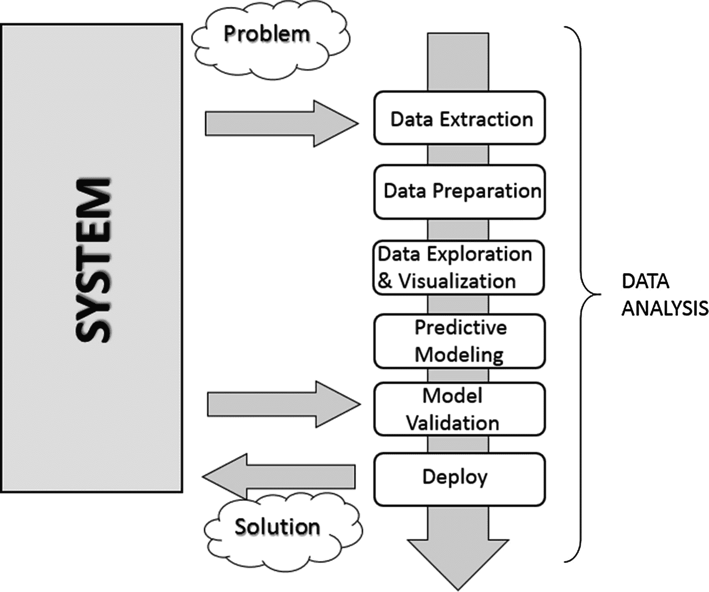
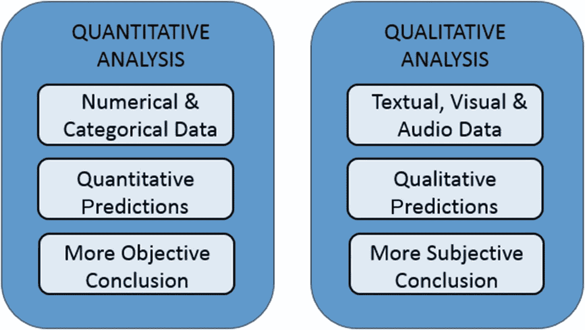
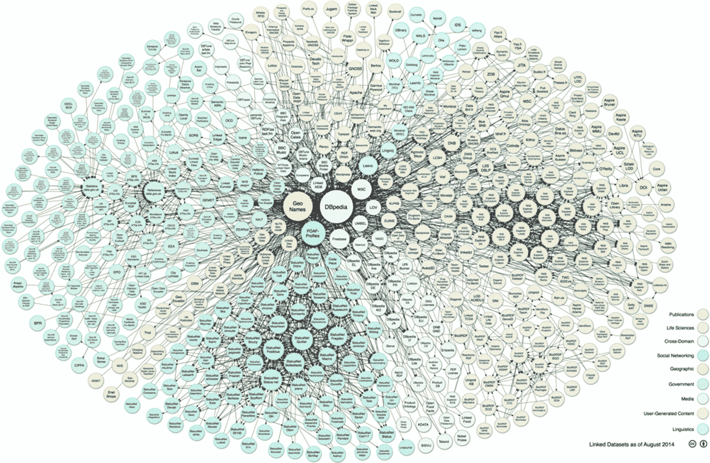

# 一、数据分析导论

在这一章中，你将开始在数据分析的世界中迈出第一步，详细了解构成这一学科的所有概念和过程。本章中讨论的概念是后续章节的有用背景，在后续章节中，这些概念和过程将通过使用几个库以 Python 代码的形式应用，这些库将在同样多的章节中讨论。

## 数据分析

在一个日益以信息技术为中心的世界里，每天都会产生和存储大量的数据。通常这些数据来自自动检测系统、传感器和科学仪器，或者你每天都在无意识地产生它们，每当你从银行提款或购物时，当你记录各种博客时，甚至当你在社交网络上发布时。

但是数据是什么呢？数据实际上不是信息，至少在形式上不是。在无形式的字节流中，如果不严格按照它们报告的数字、单词或时间，乍一看很难理解它们的本质。信息实际上是处理的结果，它考虑到某个数据集，提取出一些可以以各种方式使用的结论。这个从原始数据中提取信息的过程叫做*数据分析*。

数据分析的目的是提取不容易推断的信息，但当理解这些信息时，就有可能对产生这些信息的系统的机制进行研究，从而允许您预测这些系统可能的反应及其随时间的演变。

从数据保护的简单系统方法开始，数据分析已经成为一门真正的学科，导致生成*模型*的真正方法的发展。该模型实际上是被置于研究中的系统的数学形式的翻译。一旦有一种数学或逻辑形式可以描述不同精度水平下的系统响应，你就可以预测它的发展或对某些输入的响应。因此，数据分析的目的不是模型，而是它的*预测能力*的质量。

模型的预测能力不仅取决于建模技术的质量，还取决于选择良好数据集来构建整个数据分析过程的能力。因此，*寻找数据*，他们的*提取*、以及他们随后的*准备*、**、**虽然代表一项分析的初步活动，但也属于数据分析本身，因为它们对结果的成功至关重要。

到目前为止，我们已经谈到了数据、数据的处理以及通过计算过程对数据的处理。与数据分析处理的所有阶段并行，开发了各种*数据可视化*方法。事实上，要了解数据，无论是单个数据还是数据在整个数据集中所扮演的角色，没有比开发能够转换信息(有时隐含在数字中)的图形表示技术更好的系统，这有助于您更容易地理解它们的含义。多年来，针对不同的数据显示模式开发了许多显示模式:T2 图表 T3。

在数据分析过程的最后，你将有一个模型和一组图形显示，然后你将能够预测所研究的系统的响应；之后，您将进入测试阶段。将使用另一组您知道系统响应的数据来测试该模型。然而，这些数据不用于定义预测模型。根据模型复制真实观察到的响应的能力，您将有一个误差计算和模型的有效性及其操作限制的知识。

这些结果可以与任何其他模型进行比较，以了解新创建的模型是否比现有模型更有效。一旦完成评估，您就可以进入数据分析的最后阶段— *部署*。这包括实施分析产生的结果，即实施基于模型生成的预测和相关风险的决策。

数据分析非常适合许多专业活动。因此，了解它以及如何将它付诸实践是很重要的。它允许你测试假设，更深入地理解被分析的系统。

## 数据分析师的知识领域

数据分析基本上是一门适合于研究可能出现在几个应用领域中的问题的学科。此外，数据分析包括许多工具和方法，需要很好的计算、数学和统计概念的知识。

一名优秀的数据分析师必须能够在许多不同的学科领域中移动和行动。这些学科中的许多是数据分析方法的基础，精通它们几乎是必要的。根据您将要从事的特定数据分析项目的应用和研究领域，其他学科的知识是必要的，更一般地说，在这些领域的足够经验可以帮助您更好地理解问题和所需的数据类型。

通常，关于数据分析的主要问题，有必要有一个跨学科的专家团队，他们可以在各自的能力领域以最好的方式做出贡献。对于较小的问题，一个好的分析师必须能够识别数据分析过程中出现的问题，询问以确定解决这些问题需要哪些学科和技能，研究这些学科，甚至可能询问该领域最有知识的人。简而言之，分析员不仅要知道如何搜索数据，还要知道如何处理数据的信息。

### 计算机科学

计算机科学知识是任何数据分析师的基本要求。事实上，只有当你拥有计算机科学的知识和经验时，你才能有效地管理数据分析的必要工具。事实上，涉及数据分析的每一步都涉及到计算软件的使用(如 IDL、MATLAB 等。)和编程语言(比如 C ++、Java、Python)。

由于信息技术的发展，如今的大量数据需要特定的技能才能尽可能有效地管理。事实上，数据研究和提取需要了解这些不同的格式。数据以特定格式结构化并存储在文件或数据库表中。XML、JSON 或简单的 XLS 或 CSV 文件现在是存储和收集数据的常用格式，许多应用程序允许您读取和管理存储在这些文件上的数据。当涉及到提取数据库中包含的数据时，事情并不那么直接，但是您需要了解 SQL 查询语言或者使用专门为从给定的数据库中提取数据而开发的软件。

此外，对于某些特定类型的数据研究，数据不是以显式格式提供的，而是以文本文件(文档和日志文件)或网页的形式呈现，并显示为图表、度量、访问者数量或 HTML 表格。这需要专门的技术知识来解析和最终提取这些数据(称为 *web 抓取*)。

因此，信息技术知识对于了解如何使用当代计算机科学提供的各种工具是必要的，例如应用程序和编程语言。反过来，执行数据分析和数据可视化也需要这些工具。

这本书的目的是尽可能提供所有必要的知识，关于数据分析方法的发展。该书使用 Python 编程语言和专门的库，为构成数据分析的所有步骤的性能做出了决定性的贡献，从数据研究到数据挖掘，再到发布预测模型的结果。

### 数学和统计学

正如你将在整本书中看到的，数据分析在处理数据的过程中需要大量复杂的数学运算。你需要胜任所有这些，至少要明白你在做什么。熟悉一些主要的统计学概念也是必要的，因为所有用于数据分析和解释的方法都是基于这些概念的。正如你可以说计算机科学给了你数据分析的工具一样，你也可以说统计学提供了构成数据分析基础的概念。

这个学科为分析师提供了许多工具，而如何最好地使用它们的良好知识需要多年的经验。数据分析中最常用的统计技术有

*   贝叶斯方法

*   回归

*   使聚集

通过处理这些案例，你会发现数学和统计学是如何密切相关的。由于本书中涉及的特殊 Python 库，您将能够管理和处理它们。

### 机器学习和人工智能

数据分析阵营中最先进的工具之一是机器学习。事实上，尽管数据可视化和技术(如聚类和回归)可以帮助您找到有关数据集的信息，但在研究的这个阶段，您可能通常更喜欢使用在数据集中搜索模式时高度专业化的特殊过程。

机器学习是一门学科，它使用一系列程序和算法来分析数据，以识别模式、聚类或趋势，然后以自动化的方式提取有用的信息进行数据分析。

这个学科越来越成为数据分析的基本工具，因此，至少在一般情况下，它的知识对数据分析师来说是非常重要的。

### 专业应用领域

另一个非常重要的点是数据的权限范围(其来源——生物学、物理学、金融、材料测试、人口统计等)。).事实上，虽然分析员在统计领域有专门的准备，但他们也必须能够记录数据的来源，目的是感知和更好地理解产生数据的机制。事实上，数据不是简单的字符串或数字；它们是观察到的任何参数的表达式，或者更确切地说是度量。因此，更好地理解数据的来源可以改善他们的解释。然而，对于数据分析师来说，这通常成本太高，即使他们的意图是最好的，因此找到可以向其提出正确问题的顾问或关键人物是一种很好的做法。

## 了解数据的性质

数据分析的研究对象基本上是数据。然后，数据将成为所有数据分析过程中的关键角色。数据构成了待处理的原材料，并且由于对它们的处理和分析，有可能提取各种信息，以便增加所研究的系统的知识水平，即数据来自的系统。

### 当数据变成信息时

数据是世界上记录的事件。任何可以测量或分类的东西都可以转换成数据。一旦收集了这些数据，就可以对其进行研究和分析，不仅可以了解事件的性质，而且通常还可以进行预测，或者至少做出明智的决策。

### 当信息变成知识时

当信息被转换成一套规则，帮助你更好地理解某些机制，从而对一些事件的演变做出预测时，你就可以谈论知识了。

### 数据类型

数据可以分为两个不同的类别:

*   范畴(名词和序数)

*   数字(离散和连续)

*分类数据*是可以分组或分类的数值或观察值。分类值有两种类型:*名词性*和*序数*。一个名义变量没有在其类别中确定的内在顺序。序数变量有一个预先确定的顺序。

*数值数据*是来自测量的数值或观察值。数值有两种:*离散*和*连续*数字。离散值可以被计数，并且是不同的，彼此分离的。另一方面，连续值是由测量或观察产生的值，其假定在定义的范围内的任何值。

## 数据分析过程

数据分析可以描述为一个由几个步骤组成的过程，在这个过程中，原始数据被转换和处理，以产生数据可视化，并根据基于所收集数据的数学模型进行预测。那么，数据分析无非就是一系列的步骤，每一个步骤都对后面的步骤起到关键作用。因此，数据分析被概括为一个由以下阶段序列组成的流程链:

*   问题定义

*   数据析取

*   数据准备-数据清理

*   数据准备-数据转换

*   数据探索和可视化

*   预测建模

*   模型验证/测试

*   部署-结果的可视化和解释

*   部署-解决方案的部署

图 [1-1](#Fig1) 显示了数据分析中涉及的所有过程的示意图。

图 1-1

数据分析过程

### 问题定义

数据分析过程实际上早在收集原始数据之前就开始了。事实上，数据分析总是从一个需要解决的问题开始，这个问题需要定义。

只有在你聚焦了你要研究的系统之后，问题才被定义；这通常可以是一种机制、一种应用或一个过程。一般来说，这项研究是为了更好地了解其运作，但特别是这项研究将旨在了解其行为的原则，以便能够做出预测或选择(定义为知情选择)。

科学问题或业务的定义步骤和相应的文档(*可交付成果*)都非常重要，以便将整个分析严格集中在获得结果上。事实上，对系统的全面或详尽的研究有时是复杂的，而且你并不总是有足够的信息来开始。所以问题的定义，尤其是它的计划，可以决定整个项目要遵循的指导方针。

一旦定义并记录了问题，您就可以进入数据分析的*项目规划*阶段。需要进行规划，以了解哪些专业人员和资源是满足尽可能高效地实施项目的要求所必需的。所以你要考虑这个领域的问题，包括问题的解决。你将寻找各种感兴趣领域的专家，并安装进行数据分析所需的软件。

同样在计划阶段，你要选择一个有效的团队。一般来说，这些团队应该是跨学科的，以便通过从不同角度查看数据来解决问题。因此，建立一个好的团队无疑是数据分析成功的关键因素之一。

### 数据析取

一旦确定了问题，第一步是获取数据以便进行分析。数据的选择必须以建立预测模型为基本目的，因此数据选择对于分析的成功也是至关重要的。收集的样本数据必须尽可能地反映真实世界，即系统如何对来自真实世界的刺激做出反应。例如，如果你正在使用大量的原始数据，而这些数据没有被很好的收集，那么这些数据可能会描述错误或者不平衡的情况。

因此，糟糕的数据选择，甚至是对不能完美代表系统的数据集进行分析，都会导致模型远离正在研究的系统。

数据的搜索和检索通常需要一种超越单纯技术研究和数据提取的直觉。这一过程还需要仔细理解数据的性质和形式，这只有在问题的应用领域的良好经验和知识才能提供。

不管所需数据的质量和数量如何，另一个问题是使用最好的*数据源* *。*

如果工作室环境是一个实验室(技术或科学),并且生成的数据是实验性的，那么在这种情况下，数据源是很容易识别的。在这种情况下，问题将只涉及实验设置。

但是对于数据分析来说，要复制在每个应用领域都以严格的实验方式收集数据的系统是不可能的。许多领域需要从周围世界搜索数据，往往依赖于外部的实验数据，甚至更多时候是通过访谈或调查来收集数据。因此，在这些情况下，找到一个能够提供数据分析所需的所有信息的良好数据源可能会非常具有挑战性。通常有必要从多个数据源检索数据，以补充任何不足，识别任何差异，并使数据集尽可能通用。

当你想获得数据时，网络是一个很好的起点。但是网络上的大部分数据可能很难捕捉；事实上，并不是所有的数据都存在于文件或数据库中，但可能是 HTML 页面中许多不同格式的内容。为此，一种称为 *web scraping* 的方法允许通过识别网页中特定出现的 HTML 标签来收集数据。有专门为此设计的软件，一旦发现一个事件，它就提取所需的数据。一旦搜索完成，您将获得一个准备接受数据分析的数据列表。

### 数据准备

在数据分析涉及的所有步骤中，数据准备虽然看起来问题较少，但实际上需要更多的资源和更多的时间来完成。数据通常是从不同的数据源收集的，每个数据源都有不同表示和格式的数据。因此，所有这些数据都必须为数据分析过程做好准备。

数据的准备涉及获取、清理、规范化数据，并将数据转换为优化的数据集，也就是说，采用通常为表格形式的准备好的格式，并且适合于在设计阶段安排的分析方法。

可能会出现许多潜在的问题，包括无效、不明确或缺少值、重复的字段和超出范围的数据。

### 数据探索/可视化

探索数据本质上包括以图形或统计的方式搜索数据，以便找到模式、连接和关系。数据可视化是突出可能模式的最佳工具。

近年来，数据可视化已经发展到这样的程度，它本身已经成为一门真正的学科。事实上，许多技术被专门用于显示数据，并且许多显示类型被应用于从数据集中提取尽可能好的信息。

数据探索包括对数据的初步检查，这对于理解所收集的信息类型及其含义非常重要。结合在定义问题中获得的信息，这种分类将决定哪种数据分析方法最适合于得出模型定义。

一般而言，除了通过可视化数据对图表进行详细研究之外，该阶段还可能包括以下一项或多项活动:

*   汇总数据

*   分组数据

*   探索各种属性之间的关系

*   识别模式和趋势

*   构建回归模型

*   构建分类模型

一般来说，数据分析需要对要研究的数据进行总结。*摘要*是在不牺牲重要信息的情况下，将数据简化为解释的过程。

*聚类*是一种数据分析方法，用于发现由共同属性联合起来的群体(也称为*分组*)。

分析的另一个重要步骤集中在数据中关系、趋势和异常的*识别*。为了找到这类信息，您通常需要借助工具并执行另一轮数据分析，这次是对数据可视化本身。

其他数据挖掘方法，如决策树和关联规则，自动从数据中提取重要的事实或规则。这些方法可以与数据可视化并行使用，以揭示数据之间的关系。

### 预测建模

预测建模是在数据分析中使用的过程，用于创建或选择合适的统计模型来预测结果的概率。

浏览完数据后，您就拥有了开发对数据之间的关系进行编码的数学模型所需的所有信息。这些模型有助于理解所研究的系统，并且以特定的方式用于两个主要目的。第一是对系统产生的数据值进行预测；在这种情况下，您将处理*回归模型。*第二个目的是对新的数据产品进行分类，在这种情况下，您将使用*分类模型*或*聚类模型* ***。*** 事实上，可以根据模型产生的结果类型来划分模型:

*   *分类模型*:如果模型类型得到的结果是分类的。

*   *回归模型*:如果模型类型得到的结果是数值。

*   *聚类模型*:如果模型类型得到的结果是描述性的。

生成这些模型的简单方法包括线性回归、逻辑回归、分类和回归树以及 k-最近邻等技术。但是分析的方法是多种多样的，每种方法都有特定的特征，这使得它非常适合某些类型的数据和分析。这些方法中的每一种都会产生一个特定的模型，然后它们的选择与产品模型的性质相关。

这些模型中的一些将根据它们的结构提供对应于真实系统的值。他们将以简单明了的方式解释正在研究的系统的一些特征。其他模型将继续给出良好的预测，但它们的结构将只不过是一个“黑匣子”，解释系统特征的能力有限。

### 模型验证

模型的验证，即测试阶段，是一个重要的阶段，它允许您验证基于初始数据构建的模型。这一点很重要，因为它允许您通过直接与实际系统进行比较来评估模型产生的数据的有效性。但是这一次，你是从建立整个分析的一组原始数据中走出来的。

通常，当您使用这些数据来构建模型时，您会将它们称为*训练集*，当您使用它们来验证模型时，您会将它们称为*验证集*。

因此，通过将模型产生的数据与系统产生的数据进行比较，您将能够评估误差，并且使用不同的测试数据集，您可以估计生成的模型的有效性限制。事实上，正确预测的值可能仅在特定范围内有效，或者根据所考虑的值的范围具有不同的匹配级别。

这个过程不仅允许您从数字上评估模型的有效性，还允许您将其与任何其他现有模型进行比较。这方面有几种技术；最著名的是*交叉验证*。这种技术基于将训练集分成不同的部分。这些部分中的每一个都将依次被用作验证集，而任何其他部分都将被用作训练集。通过这种迭代的方式，您将拥有一个日益完善的模型。

### 部署

这是分析过程的最后一步，旨在呈现结果，即分析的结论。在业务环境的部署过程中，分析被转化为委托它的客户的利益。在技术或科学环境中，它被转化为设计解决方案或科学出版物。也就是说，部署基本上包括将从数据分析中获得的结果付诸实践。

有几种方法可以部署数据分析或数据挖掘的结果。通常，数据分析师的部署包括为管理层或请求分析的客户编写报告。本文件将从概念上描述从数据分析中获得的结果。这份报告应该交给经理们，然后他们才能做出决定。然后，他们将把分析的结论付诸实践。

在分析师提供的文档中，将详细讨论这四个主题:

*   分析结果

*   决策部署

*   风险分析

*   衡量业务影响

当项目的结果包括生成预测模型时，这些模型可以作为独立的应用程序部署，也可以集成到其他软件中。

## 定量和定性数据分析

数据分析完全以数据为中心。根据数据的性质，可以进行一些区分。

当分析的数据具有严格的数字或分类结构时，那么你就在谈论*定量分析*，但是当你在处理通过自然语言描述表达的值时，那么你就在谈论*定性分析*。

正是由于这两种类型的分析所处理的数据的不同性质，您可以观察到它们之间的一些差异。

定量分析与具有逻辑顺序的数据或可以以某种方式分类的数据有关。这导致数据中结构的形成。顺序、分类和结构反过来提供了更多的信息，并允许以更数学化的方式进一步处理数据。这导致了提供*定量预测、*的模型的生成，从而允许数据分析师得出更客观的结论。

相反，定性分析与通常没有结构的数据有关，至少没有明显的结构，并且它们的性质既不是数字的也不是分类的。例如，定性研究中的数据可能包括书面文本、视觉或听觉数据。因此，这种类型的分析必须基于方法论，通常是*特别的，*提取信息，这些信息通常会导致能够提供****，*** 的定性预测的模型，结果是数据分析师可以得出的结论可能还包括*主观解释*。另一方面，定性分析可以探索更复杂的系统，并得出用严格的数学方法不可能得出的结论。通常，这种类型的分析包括对系统的研究，如不容易测量的社会现象或复杂结构。*

 *图 [1-2](#Fig2) 显示了两种分析之间的差异。

图 1-2

定量和定性分析

## 开放数据

为了支持日益增长的数据需求，现在在互联网上可以获得大量的数据源。这些数据源免费向任何需要的人提供信息，它们被称为*开放数据*。

以下是一些网上公开数据的列表。您可以在附录 b 中找到在线开放数据的更完整列表和详细信息。

*   数据中心 （ [`http://datahub.io/dataset`](http://datahub.io/dataset) ）

*   世界卫生组织( [`http://www.who.int/research/en/`](http://www.who.int/research/en/)

*   Data.gov([`http://data.gov`【T2”)](http://data.gov)

*   欧盟开放数据门户( [`http://open-data.europa.eu/en/data/`](http://open-data.europa.eu/en/data/) )

*   亚马逊网络服务公共数据集( [`http://aws.amazon.com/datasets`](http://aws.amazon.com/datasets) )

*   脸书图( [`http://developers.facebook.com/docs/graph-api`](http://developers.facebook.com/docs/graph-api) )

*   Healthdata.gov([`http://www.healthdata.gov`【T2”)](http://www.healthdata.gov)

*   谷歌趋势( [`http://www.google.com/trends/explore`](http://www.google.com/trends/explore) )

*   谷歌财经( [`https://www.google.com/finance`](https://www.google.com/finance) )

*   谷歌图书 Ngrams ( [`http://storage.googleapis.com/books/ngrams/books/datasetsv2.html`](http://storage.googleapis.com/books/ngrams/books/datasetsv2.html) )

*   机器学习知识库( [`http://archive.ics.uci.edu/ml/`](http://archive.ics.uci.edu/ml/) )

作为网上可用的开放数据源的概念，你可以看看 *LOD 云图* ( [`http://lod-cloud.net`](http://lod-cloud.net) )，它显示了网络上当前可用的几个开放数据源之间的数据链路的连接(见图 [1-3](#Fig3) )。

图 1-3

链接开放数据云图表 2014，作者:Max Schmachtenberg、Christian Bizer、Anja Jentzsch 和 Richard Cyganiak。[`http://lod-cloud.net/`](http://lod-cloud.net/)【CC-BY-SA 许可】

## Python 和数据分析

这本书的主要论点是通过用 Python 来处理数据分析的所有概念。Python 编程语言在科学界被广泛使用，因为它的大量库提供了一整套用于分析和数据操作的工具。

与通常用于数据分析的其他编程语言(如 R 和 MATLAB)相比，Python 不仅提供了一个处理数据的平台，还具有一些使其与其他语言和专门应用程序相比独一无二的特性。越来越多的支持库的开发，更多创新方法的算法的实现，以及与其他编程语言(C 和 Fortran)接口的能力都使 Python 在同类中独树一帜。

此外，Python 不仅专门用于数据分析，而且还有许多其他应用，如泛型编程、脚本编写、数据库接口，以及最近的 web 开发，这要归功于像 Django 这样的 web 框架。因此，有可能开发与 web 服务器兼容的数据分析项目，并有可能将其集成到 Web 上。

因此，对于那些想要执行数据分析的人来说，Python 及其所有的包被认为是可预见的未来的最佳选择。

## 结论

在本章中，您学习了什么是数据分析，更具体地说，是组成数据分析的各种过程。此外，您已经开始了解数据在构建预测模型中所扮演的角色，以及它们的精心选择是如何建立在仔细准确的数据分析基础上的。

在下一章中，您将带着 Python 的这种观点和它提供的工具来执行数据分析。*