# 九、TensorFlow 深度学习

2017 年对于*深度学习*来说是特殊的一年。除了由于开发的算法而获得的巨大实验结果，深度学习还在许多框架的发布中看到了它的荣耀，利用这些框架开发了许多项目。你们中的一些人肯定已经知道机器学习的这个分支，其他人肯定听过有人提到它。鉴于深度学习在数据处理和分析技术中的重要性，我发现在本书的第二版中添加这一新章节很重要。

在这一章中，你可以对深度学习的世界以及其技术所基于的人工神经网络有一个介绍性的概述。此外，在深度学习的新 Python 框架中，您将使用 *TensorFlow，*这被证明是研究和开发深度学习分析技术的优秀工具。通过这个库，你将看到如何开发不同的神经网络模型，这些模型是深度学习的基础。

## 人工智能、机器学习和深度学习

对于任何与数据分析打交道的人来说，这三个术语最终会在网络上、文本中和与该主题相关的研讨会上非常常见。但是它们之间有什么关系呢？它们到底由什么组成？

在本节中，您将看到这三个术语的详细定义。你会发现，近几十年来，创建越来越复杂的算法的需求，以及越来越有效地进行预测和数据分类的需求，导致了机器学习的产生。然后你会发现，由于新的技术创新，特别是 GPU 实现的计算能力，深度学习技术是如何基于神经网络开发的。

### 人工智能

人工智能这个词是约翰·麦卡锡在 1956 年首次使用的，当时人们对技术世界充满了巨大的希望和热情。他们处于电子和计算机时代的开端，像整个房间一样大，可以做一些简单的计算，但与人类相比，他们做得如此高效和快速，以至于他们已经瞥见了电子智能未来可能的发展。

但不用进入科幻世界，当前最适合人工智能(通常被称为 AI)的定义可以用下面一句话来简要总结:

> 计算机上的自动处理，能够执行似乎只与人类智能相关的操作。

因此，人工智能的概念是一个可变的概念，随着机器本身的进步和“人类专属相关性”的概念而变化。在 20 世纪 60 年代和 70 年代，我们将人工智能视为计算机执行计算并找到复杂问题的数学解决方案的能力，而“伟大科学家的专属相关性”，在 80 年代和 90 年代，它在评估风险、资源和做出决策的能力方面已经成熟。在 2000 年，随着计算机计算潜力的不断增长，这些系统用机器学习进行学习的可能性被添加到了定义中。

最后，在过去的几年里，人工智能的概念一直集中在视觉和听觉识别操作上，直到最近还被认为是“人类独有的相关性”。

这些操作包括:

*   图像识别

*   目标检测

*   对象分割

*   语言翻译

*   自然语言理解

*   语音识别

由于深度学习技术，这些问题仍在研究中。

### 机器学习是人工智能的一个分支

在前一章中，你已经看到了机器学习的细节，以及许多不同的数据分类或预测技术的例子。

*机器学习* *(ML)，*及其所有的技术和算法，是人工智能的一个大分支。事实上，当你使用能够学习的系统(学习系统)来解决不久前还“被认为是人类专有的”各种问题时，你指的是它，而仍然在人工智能的范围内。

### 深度学习是机器学习的一个分支

在机器学习技术中，可以定义进一步的子类，称为*深度学习*。你在第 [8](08.html) 章中看到，机器学习使用可以学习的系统，这可以通过系统内部的功能(通常是固定模型的参数)来完成，这些功能可以根据用于学习的输入数据(训练集)进行修改。

深度学习技术向前迈进了一步。事实上，深度学习系统的结构是为了在模型中不具有这些内在特征，但这些特征是作为学习本身的结果由系统自动提取和检测的。在这些可以做到这一点的系统中，我们特别提到*人工神经网络*。

### 人工智能、机器学习和深度学习之间的关系

综上所述，在这一节你已经看到了机器学习和深度学习其实都是人工智能的子类。图 9-1 显示了这种关系中类的模式化。

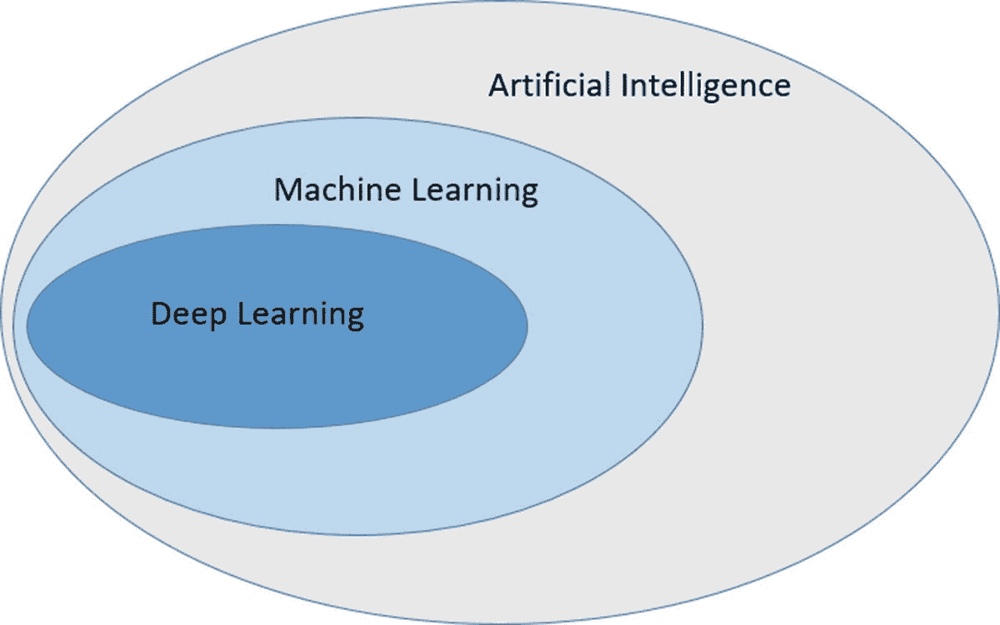

图 9-1

人工智能、机器学习和深度学习之间关系的模式化

## 深度学习

在本节中，您将了解导致深度学习发展的一些重要因素，并阅读为什么只是在最近几年才有如此多的进步。

### 神经网络和图形处理器

在前面的章节中，你了解到在人工智能领域，深度学习只是在最近几年才开始流行，正是为了解决视觉和听觉识别的问题。

在深度学习的背景下，近年来开发了大量的计算技术和算法，充分发挥了 Python 语言的潜力。但是深度学习背后的理论实际上可以追溯到很多年前。事实上，神经网络的概念是在 1943 年提出的，人工神经网络及其应用的第一次理论研究是在 60 年代发展起来的。

事实是，只有在最近几年，神经网络以及使用它们的相关深度学习技术才被证明对解决人工智能的许多问题有用。这是因为，直到现在，才出现了可以用有效的方式实现的技术。

事实上，在应用层面，深度学习需要非常复杂的数学运算，需要数百万甚至数十亿个参数。90 年代的 CPU 即使功能强大，也无法在高效的时间内执行这些类型的操作。即使在今天，CPU 的计算虽然有了很大的改进，但仍然需要很长的处理时间。这种低效率是由于 CPU 的特殊架构，其设计是为了有效地执行神经网络不需要的数学运算。

但近几十年来，由于视频游戏市场巨大的商业驱动，一种新的硬件已经发展起来，即*图形处理单元(GPU)**。事实上，这种类型的处理器旨在管理越来越高效的矢量计算，例如矩阵之间的乘法，这是 3D 现实模拟和渲染所必需的。*

 *由于这种技术创新，许多深度学习技术得以实现。事实上，为了实现神经网络及其学习，使用张量(多维矩阵)来执行许多数学运算。正是这种工作，GPU 能够做得更有效率。由于他们的贡献，深度学习的处理速度提高了几个数量级(几天而不是几个月)。

### 数据可用性:开放数据源、物联网和大数据

影响深度学习发展的另一个非常重要的因素是可以访问的海量数据。事实上，对于学习阶段和验证阶段，数据都是神经网络运行的基本要素。

由于互联网在全世界的普及，现在每个人都可以访问和产生数据。虽然几年前只有少数组织提供数据进行分析，但今天，由于物联网，许多传感器和设备都可以获取数据并在网络上提供数据。不仅如此，甚至社交网络和搜索引擎(如脸书、谷歌等)也可以收集海量数据，实时分析连接到其服务的数百万用户(称为*大数据*)。

所以今天，许多与我们想要用深度学习技术解决的问题相关的数据，不仅可以免费获得，还可以免费获得(开放数据源)。

### 计算机编程语言

深度学习技术取得巨大成功和传播的另一个因素是 Python 编程语言。

在过去，规划神经网络系统是非常复杂的。唯一能够完成这项任务的语言是 C ++，这是一种非常复杂的语言，难以使用，只有少数专家知道。此外，为了使用 GPU(这种类型的计算所必需的)，有必要了解 CUDA(计算统一设备架构)，即 NVIDIA 显卡的硬件开发架构及其所有技术规范。

今天，由于 Python，神经网络和深度学习技术的编程已经变得很高。事实上，程序员不再需要考虑显卡(GPU)的架构和技术规格，而是可以专注于与深度学习相关的部分。此外，Python 语言的特性使程序员能够开发简单直观的代码。上一章你已经用机器学习尝试过了，同样适用于深度学习。

### 深度学习 Python 框架

在过去的两年中，许多开发人员组织和社区一直在开发 Python 框架，这些框架极大地简化了深度学习技术的计算和应用。这非常令人兴奋，其中许多库几乎竞争激烈地执行相同的操作，但它们都基于不同的内部机制。我们将会看到在未来的几年里哪个会更成功或者不会。

在今天免费提供的这些框架中，值得一提的是一些正在取得一些成功的框架。

*   TensorFlow 是一个用于数值计算的开源库，它的使用基于数据流图。这些图中的节点代表数学运算，边代表张量(多维数据数组)。它的架构非常灵活，可以将计算分布在多个 CPU 和多个 GPU 上。

*   Caffe2 是一个框架，旨在提供一种简单易行的方法来进行深度学习。它允许您使用云中 GPU 的能力来测试模型和算法计算。

*   *PyTorch* 是一个完全基于使用 GPU 的科学框架。它以非常高效的方式工作，并且是最近开发的，仍然没有很好地整合。它仍然是科学研究的有力工具。

*   *Theano* 是科学领域中最常用的 Python 库，用于数学表达式和物理模型的开发、定义和评估。不幸的是，开发团队宣布不再发布新版本。然而，它仍然是一个参考框架，这要归功于用这个库开发的大量程序，无论是在文献中还是在网络上。

## 人工神经网络

*人工神经网络*是深度学习的基本元素，它们的使用是许多(如果不是几乎所有)深度学习技术的基础。事实上，这些系统能够学习，这要归功于它们涉及生物神经回路的特殊结构。

在本节中，您将更详细地了解什么是人工神经网络以及它们是如何构造的。

### 人工神经网络是如何构建的

人工神经网络是通过连接在结构内重复的简单基本组件而创建的复杂结构。根据这些基本组件的数量和连接的类型，将形成越来越复杂的网络，具有不同的架构，其中每一个都将呈现关于学习和解决深度学习的不同问题的能力的独特特征。

图 [9-2](#Fig2) 显示了一个普通人工神经网络如何构建的例子。

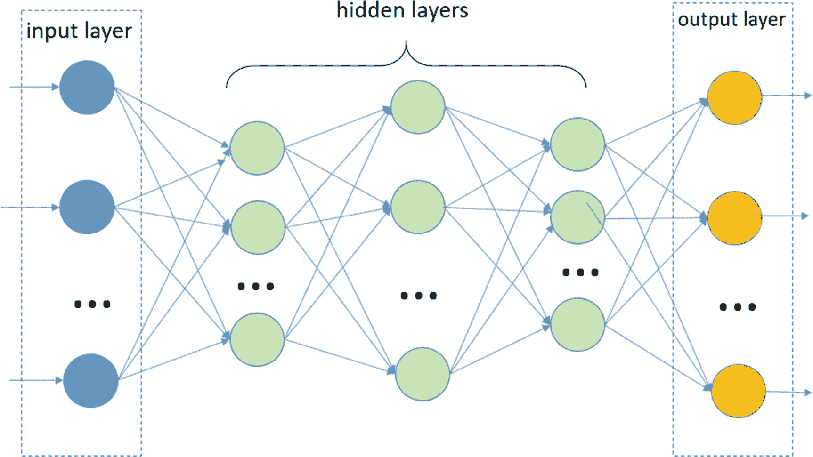

图 9-2

一般人工神经网络如何构造的示意图

基本单元被称为*节点*(图 [9-2](#Fig2) 中显示的彩色圆圈)，在生物模型中模拟神经网络中神经元的功能。这些人工神经元执行非常简单的操作，类似于生物神经元。当它们接收的输入信号的总和超过激活阈值时，它们被激活。

这些节点可以通过称为*边缘*的连接在它们之间传输信号，这些连接模拟了生物突触的功能(图 [9-2](#Fig2) 中的蓝色箭头)。通过这些边缘，一个神经元发出的信号传递到下一个神经元，起到过滤器的作用。也就是说，根据预先建立的规则(不同的*权重*通常应用于每个边缘)，边缘将来自神经元的输出信息转换为抑制性或兴奋性信号，降低或增加其强度。

神经网络有一定数量的节点用于接收来自外部的输入信号(见图 [9-2](#Fig2) )。第一组节点通常在神经网络架构最左端的列中表示。这组节点代表神经网络的第一层(*输入层*)。根据接收到的输入信号，这些神经元中的一些(或全部)将通过处理接收到的信号并将结果作为输出通过 edges 传输到另一组神经元而被激活。

这第二组在神经网络中处于中间位置，被称为*隐藏层*。这是因为这一组的神经元在输入和输出上都不与外界交流，因此是隐藏的。正如你在图 [9-2](#Fig2) 中看到的，这些神经元中的每一个都有很多传入的边，通常都是前一层的所有神经元。无论总的输入信号是否超过某个阈值，这些隐藏的神经元都会被激活。如果是肯定的，它们将处理信号并将其传输到另一组神经元(图 [9-2](#Fig2) 所示方案的正确方向)。该组可以是另一个隐藏层或*输出层* *，*即最后一个将结果直接发送到外部的层。

因此，一般来说，我们将有一个数据流进入神经网络(从左到右)，并根据结构以或多或少复杂的方式进行处理，然后产生一个输出结果。

神经网络的行为、能力和效率将完全取决于节点的连接方式以及分配给每个节点的层和神经元的总数。所有这些因素定义了*神经网络架构。*

### 单层感知器(SLP)

单层感知器(SLP) 是最简单的神经网络模型，由 Frank Rosenblatt 于 1958 年设计。其架构如图 [9-3](#Fig3) 所示。

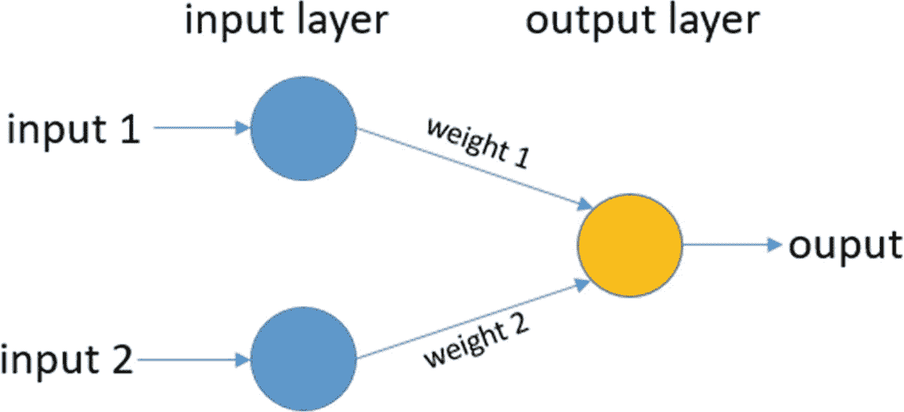

图 9-3

单层感知器(SLP)架构

单层感知器(SLP)结构非常简单；它是一个两层的神经网络，没有隐藏层，其中许多输入神经元通过不同的连接向输出神经元发送信号，每个连接都有自己的权重。图 [9-4](#Fig4) 更详细地显示了这种类型的神经网络的内部工作原理。

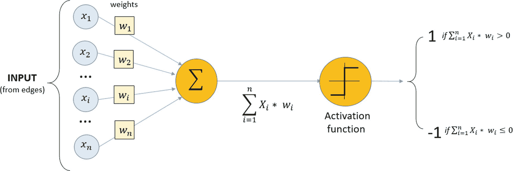

图 9-4

更详细的单层感知器(SLP)表示，内部操作以数学方式表示

该结构的边缘在该数学模型中通过由神经元的局部记忆组成的权重向量来表示。

W = (w1、w2)的缩写形式，-我不知道，WNN)

输出神经元接收输入矢量信号`xi`，每个信号来自不同的神经元。

X =(x1，x2)，...我...。，xn)

然后，它通过加权求和处理输入信号。

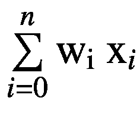= w<sub>1</sub>x<sub>1</sub>+w<sub>2</sub>x<sub>2</sub>+…+w<sub>n</sub>x<sub>n</sub>= s

总信号`s`是由输出神经元感知的信号。如果信号超过神经元的激活阈值，它将激活，发送 1 作为值，否则它将保持不活动，发送-1。

输出= 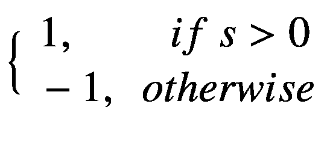

这是最简单的*激活功能*(见图 [9-5](#Fig5) 所示的功能 A)，但也可以使用其他更复杂的，比如乙状结肠(见图 [9-5](#Fig5) 所示的功能 D)。

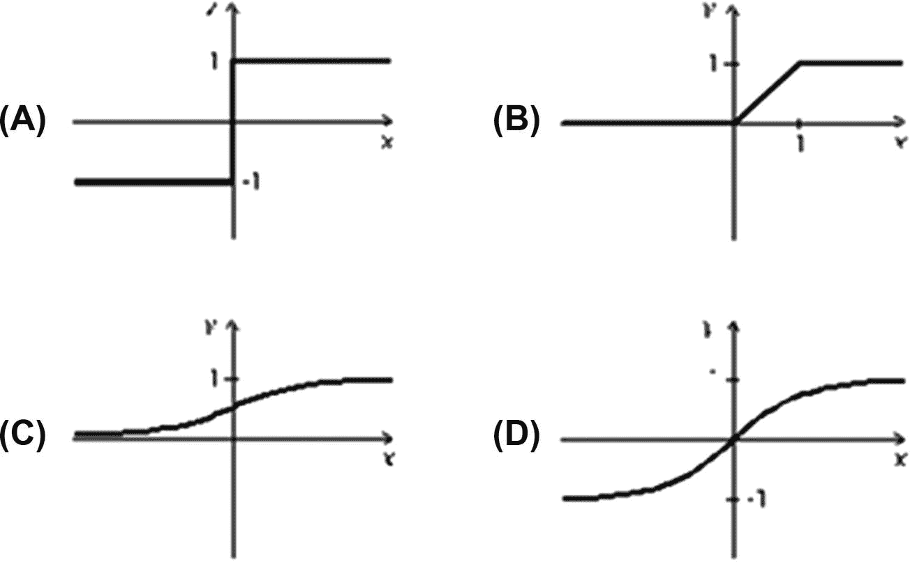

图 9-5

激活函数的一些例子

既然你已经看到了 SLP 神经网络的结构，你可以转而看看它们是如何学习的。

神经网络的学习过程称为*学习阶段**迭代工作。也就是说，执行神经网络操作的预定数量的循环，在每个循环中，`wi`突触的权重被稍微修改。每个学习周期被称为一个*时期*。为了进行学习，您必须使用适当的输入数据，称为*训练集*(您已经在章节 [8](08.html) 中深入使用了它们)。*

 *在训练集中，对于每个输入值，获得期望的输出值。通过将神经网络产生的输出值与预期值进行比较，您可以分析差异并修改权重值，还可以减少它们。在实践中，这是通过最小化深度学习问题特有的*成本函数(损失)*来完成的。事实上，不同连接的权重将针对每个时期进行修改，以便最小化成本(*损失*)。

总之，监督学习应用于神经网络。

在学习阶段结束时，您将进入*评估阶段*，在该阶段中，已学习的 SLP 感知机必须分析另一组输入(测试集)，其结果在这里也是已知的。通过评估获得的值与预期值之间的差异，就可以知道神经网络解决深度学习问题的能力程度。通常用猜错案例的百分比来表示这个值，它被称为*准确率*。

### 多层感知器(MLP)

更复杂和有效的架构是*多层感知器(MLP)* 。在这种结构中，在输入层和输出层之间插入了一个或多个隐藏层。该架构如图 [9-6](#Fig6) 所示。

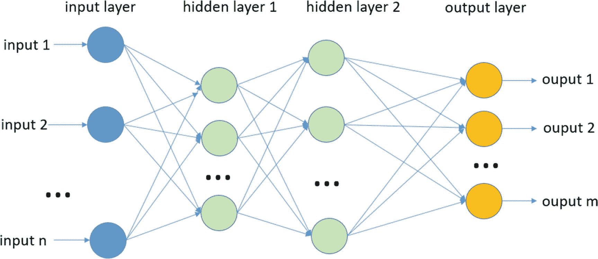

图 9-6

多层感知器(MLP)架构

在学习阶段结束时，您将进入*评估阶段，*，在该阶段中，已学习的 SLP 感知机必须分析另一组输入(测试集)，其结果在这里也是已知的。通过评估获得的值与预期值之间的差异，就可以知道神经网络解决深度学习问题的能力程度。通常，猜错案例的百分比被用来表示这个值，它被称为准确性。

尽管更复杂，MLP 神经网络模型主要基于与 SLP 神经网络模型相同的概念。即使在 MLP 中，权重也被分配给每个连接。这些权重必须基于对训练集的评估而最小化，非常类似于 SLP。这里，每个节点也必须通过激活功能处理所有传入的信号，即使这次存在几个隐藏层，也将使神经网络能够学习更多内容，*更有效地适应*深度学习试图解决的问题类型。

另一方面，从实践的角度来看，该系统的更大的复杂性需要用于学习阶段和评估阶段的更复杂的算法。其中之一是*反向传播算法*，用于有效修改各种连接的权重，以最小化成本函数，从而快速渐进地将输出值收敛到预期值。

其他算法专门用于成本(或误差)函数的最小化阶段，通常称为*梯度下降*技术。

对这些算法的研究和详细分析超出了本文的范围，本文仅具有介绍性的论证功能，其目标是试图使深度学习的主题尽可能简单明了。如果你有这样的倾向，我建议你在各种书籍和互联网上更深入地研究这个主题。

### 人工神经网络与生物神经网络的对应

到目前为止，您已经看到了深度学习如何使用称为人工神经网络的基本结构来模拟人脑的功能，特别是它处理信息的方式。

在最高阅读水平上，这两个系统之间也有真正的对应关系。事实上，你已经看到神经网络是基于神经元层的结构。第一层处理输入的信号，然后将它传递给下一层，下一层再处理它，以此类推，直到得到最终结果。对于每一层神经元，传入的信息以某种方式进行处理，产生相同信息的*不同层次的表示*。

事实上，人工神经网络的整个运作只不过是将信息转换到更抽象的层次。

这种功能与大脑皮层中发生的情况相同。例如，当眼睛接收图像时，图像信号经过各种处理阶段(例如神经网络的层)，其中例如首先检测图形的轮廓(边缘检测)，然后是几何形状(形状感知)，然后是识别具有其名称的物体的性质。因此，传入的信息在不同的概念层次上发生了变化，从图像到线条，再到几何图形，最后形成一个词。

## TensorFlow

在本章的前一节中，你看到 Python 中有几个框架允许你开发深度学习的项目。其中之一就是*张量流*。在本节中，您将详细了解这个框架，包括它如何工作以及它如何用于实现深度学习的神经网络。

### TensorFlow:谷歌的框架

TensorFlow (

这个库的目的是在机器学习和深度学习的研究领域拥有一个优秀的工具。

TensorFlow 的第一个版本是由 Google 在 2017 年 2 月发布的，在一年半的时间里，已经发布了许多更新版本，其中这个库的潜力、稳定性和可用性都大大增加。这主要得益于专业人士和研究人员中的大量用户在充分使用这个框架。目前，TensorFlow 已经是一个整合的深度学习框架，在互联网上提供了丰富的文档、教程和项目。

除了主包之外，随着时间的推移，还发布了许多其他的库，包括:

*   *TensorBoard—* 一个套件，允许将内部图形可视化到 TensorFlow ( [`https://github.com/tensorflow/tensorboard`](https://github.com/tensorflow/tensorboard) )。

*   *tensor flow Fold*—制作精美的动态计算图表( [`https://github.com/tensorflow/fold`](https://github.com/tensorflow/fold) )

*   *张量流变换*—创建并管理输入数据管道( [`https://github.com/tensorflow/transform`](https://github.com/tensorflow/transform) )

### 张量流:数据流图

TensorFlow (

TensorFlow 完全基于图形的结构和使用，以及通过图形的数据流，利用它们进行数学计算。

TensorFlow 运行时系统内部创建的图形称为*数据流图*，它在运行时根据数学模型构建，该模型是您要执行的计算的基础。事实上，张量流允许你通过代码中实现的一系列指令来定义任何数学模型。TensorFlow 将负责在内部将该模型转换为数据流图。

所以当你去建模你的深度学习神经网络时，它会被翻译成数据流图。鉴于神经网络的结构和图形的数学表示之间的巨大相似性，很容易理解为什么这个库非常适合开发深度学习项目。

但是 TensorFlow 并不局限于深度学习，可以用来表示人工神经网络。由于任何物理系统都可以用数学模型来表示，因此可以用这个库实现许多其他的计算和分析方法。事实上，这个库还可以用于实现其他机器学习技术，以及通过计算偏微分等来研究复杂的物理系统。

数据流图的节点代表数学运算，而图的边代表张量(多维数据数组)。TensorFlow 这个名称来源于这样一个事实，即这些张量通过图形表示数据流，可用于模拟人工神经网络。

## 使用 TensorFlow 开始编程

现在您已经大致了解了 TensorFlow 框架的组成，您可以开始使用这个库了。在本节中，您将看到如何安装这个框架，如何在模型中定义和使用张量，以及如何通过会话访问内部数据流图。

### 安装 TensorFlow

在开始工作之前，你需要在你的计算机上安装这个库。

在 Ubuntu Linux(版本 16 或更高版本)系统上，您可以使用 pip 来安装该软件包:

```py
pip3 install tensorflow

```

在 Windows 系统上，您可以使用 Anaconda 来安装该软件包:

```py
conda install tensorflow

```

TensorFlow 是一个相当新的框架，不幸的是，它在一些 Linux 发行版和几年前的版本中并不存在。因此，在这些情况下，TensorFlow 的安装必须手动完成，遵循 TensorFlow 官方网站( [`https://www.tensorflow.org/install/install_linux`](https://www.tensorflow.org/install/install_linux) )上建议的指示。

对于那些在电脑上有 Anaconda(包括 Linux 和 OS)作为分发 Python 包的系统的人来说，TensorFlow 安装要简单得多。

### 使用 IPython QtConsole 编程

一旦安装了 TensorFlow，就可以用这个库开始编程了。在本章的例子中，我们使用 IPython，但是你可以通过打开一个普通的 Python 会话(或者如果你喜欢，通过使用 Jupyter Notebook)来做同样的事情。通过终端，输入以下命令行打开 IPython 会话。

```py
jupyter qtconsole

```

打开 IPython 会话后，导入库:

```py
In [ ]: import tensorflow as tf

```

### 注意

请记住，要在不同的行上输入多个命令，必须使用 Ctrl+Enter。要执行命令，只需按 Enter 键。

### TensorFlow 中的模型和会话

在开始编程之前，理解 TensorFlow 的内部操作是很重要的，包括它如何解释 Python 中的命令以及它如何在内部执行。TensorFlow 通过*模型*和*会话*的概念工作，它们用特定的命令序列定义了程序的结构。

在任何 TensorFlow 项目的基础上，都有一个模型，该模型包括要考虑的一系列变量，并将定义系统。变量可以直接定义，也可以通过常数的数学表达式参数化。

```py
In [ ]: c = tf.constant(2,name='c')
   ...: x = tf.Variable(3,name='x')
   ...: y = tf.Variable(c*x,name='y')
   ...:

```

但是现在如果你试图用`print()`函数查看`y`的内部值(你期望值为 6)，你会看到它给你的是对象而不是值。

```py
In [3]: print(x)
   ...: print(y)
   ...:
<tf.Variable 'x:0' shape=() dtype=int32_ref>
<tf.Variable 'y:0' shape=() dtype=int32_ref>

```

事实上，您已经定义了属于 TensorFlow 数据流图的变量，这是一个具有表示您的数学模型的节点和连接的图。稍后您将看到如何通过会话访问这些值。

就直接参与深度学习方法计算的变量而言，使用*占位符*，即直接参与数据流和每个单个神经元处理的那些张量。

占位符允许您构建与神经网络相对应的图形，并在绝对不知道要计算的数据的情况下在内部创建操作。事实上，您可以构建图形的结构(以及神经网络)。

在实际情况下，给定一个由要分析的值`x`(一个张量)和期望值`y`(一个张量)组成的训练集，您将定义两个占位符`xey`，即两个张量，它们将包含整个神经网络的数据所处理的值。

例如，用`tf.placeholder()`函数定义两个包含整数的占位符。

```py
In [ ]: X = tf.placeholder("int32")
   ...: X = tf.placeholder("int32")
   ...:

```

一旦您定义了所有相关变量，即您定义了系统基础的数学模型，您需要执行适当的处理并用`tf.global_variables_initializer()`函数初始化整个模型。

```py
In [ ]: model = tf.global_variables_initializer()

```

既然您已经将模型初始化并加载到内存中，那么您需要开始进行计算，但是要这样做，您需要与 TensorFlow 运行时系统进行通信。为此，创建了 TensorFlow 会话，在此期间，您可以启动一系列命令来与对应于您已创建的模型的底层图形进行交互。

您可以使用`tf.Session()`构造函数创建一个新的会话。

在会话中，您可以执行计算并接收作为结果获得的变量值，即，您可以在处理过程中检查图形的状态。

您已经看到 TensorFlow 的操作是基于内部图结构的创建，其中节点能够对遵循图的连接的 tensors 内部的数据流进行处理。

因此，当您启动一个会话时，实际上您只需实例化这个图。

会话有两种主要方法:

*   `session.extend()`允许您在计算过程中对图表进行更改，例如添加新的节点或连接。

*   `session.run()`启动图形的执行，并允许您在输出中获得结果。

因为几个操作在同一个会话中执行，所以最好使用构造`with`:以及对其固有方法的所有调用。

在这个简单的例子中，您只想看到模型中定义的变量的值，并在终端上打印出来。

```py
In [ ]: with tf.Session() as session:
   ...: session.run(model)
   ...: print(session.run(y))
   ...:
6

```

正如您在会话中看到的，您可以访问数据流图的值，包括您之前定义的`y`变量。

### 张量

TensorFlow 库的基本元素是*张量*。事实上，在数据流图中跟随流动的数据是张量(见图 [9-7](#Fig7) )。

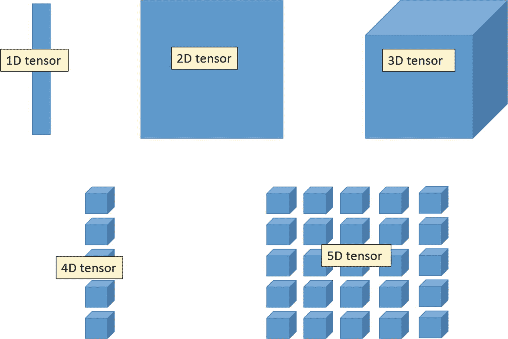

图 9-7

张量在不同维度下的一些表示

张量由三个参数标识:

*   `rank`—张量的维数(矩阵的秩为 2，向量的秩为 1)

*   **形状**—行数和列数(例如，(3.3)是一个 3×3 的矩阵)

*   **类型**—张量元素的类型。

```py
type of tensor elements and columns (eg (3.3) is a 3x3 matrix)has rank 2, a vector has rank 1)s ic

```

张量无非是多维数组。在前几章中，您看到了由于 NumPy 库，获得它们是多么容易。所以你可以从用这个库定义一个开始。

```py
In [ ]: import numpy as np
   ...: t = np.arange(9).reshape((3,3))
   ...: print(t)
   ...:
[[0 1 2]
[3 4 5]
[6 7 8]]

```

现在您可以非常容易地将这个多维数组转换成 TensorFlow 张量，这要感谢`tf.convert_to_tensor()`函数，它有两个参数。第一个参数是要转换的数组`t`，第二个参数是要转换的数据类型，在本例中是`int32`。

```py
In [ ]: tensor = tf.convert_to_tensor(t, dtype=tf.int32)

```

如果您现在想查看传感器的内容，您必须创建一个 TensorFlow 会话并运行它，通过`print()`函数在终端上打印结果。

```py
In [ ]: with tf.Session() as sess:
   ...: print(sess.run(tensor))
   ...:
[[0 1 2]
[3 4 5]
[6 7 8]]

```

如您所见，您有一个张量，它包含与用 NumPy 定义的多维数组相同的值和相同的维数。这种方法对于计算深度学习非常有用，因为许多输入值都是 NumPy 数组的形式。

但是张量可以直接从 TensorFlow 构建，不需要使用 NumPy 库。有许多函数可以快速方便地增强张量。

例如，如果你想初始化一个所有值都为零的张量，你可以使用`tf.zeros()`方法。

```py
In [10]: t0 = tf.zeros((3,3),'float64')

In [11]: with tf.Session() as session:
    ...: print(session.run(t0))
    ...:
[[ 0\. 0\. 0.]
[ 0\. 0\. 0.]
[ 0\. 0\. 0.]]

```

同样，如果您想要一个所有值都为 1 的张量，您可以使用`tf.ones()`方法。

```py
In [12]: t1 = tf.ones((3,3),'float64')

In [13]: with tf.Session() as session:
    ...: print(session.run(t1))
    ...:
[[ 1\. 1\. 1.]
[ 1\. 1\. 1.]
[ 1\. 1\. 1.]]

```

最后，由于使用了`tf.random_uniform()`函数，还可以创建一个包含随机值的张量，这些随机值遵循均匀分布(一个范围内的所有值都有可能存在)。

例如，如果您想要一个浮点值介于 0 和 1 之间的 3x3 张量，您可以写:

```py
In [ ]: tensorrand = tf.random_uniform((3, 3), minval=0, maxval=1, dtype=tf.float32)

In [ ]: with tf.Session() as session:
    ...: print(session.run(tensorrand))
    ...:
[[ 0.63391674     0.38456023 0.13723993]
[ 0.7398864       0.44730318 0.95689237]
[ 0.48043406      0.96536028 0.40439832]]

```

但是，创建一个包含遵循正态分布的值的张量，并选择平均值和标准偏差，通常会很有用。您可以使用`tf.random_normal()`功能来完成此操作。

例如，如果您想创建一个 3x3 大小的张量，其均值为 0，标准差为 3，您将编写:

```py
In [ ]: norm = tf.random_normal((3, 3), mean=0, stddev=3)

In [ ]: with tf.Session() as session:
    ...: print(session.run(norm))
    ...:
[[-1.51012492      2.52284908    1.10865617]
[-5.08502769       1.92598009   -4.25456524]
[ 4.85962772      -6.69154644    5.32387066]]

```

### 张量运算

一旦定义了张量，就有必要对它们进行运算。大多数关于张量的数学计算都是基于张量之间的和与乘。

定义两个张量，`t1`和`t2`，您将使用它们来执行张量之间的运算。

```py
In [ ]: t1 = tf.random_uniform((3, 3), minval=0, maxval=1, dtype=tf.float32)
    ...: t2 = tf.random_uniform((3, 3), minval=0, maxval=1, dtype=tf.float32)
    ...:

In [ ]: with tf.Session() as sess:
    ...: print('t1 = ',sess.run(t1))
    ...: print('t2 = ',sess.run(t2))
    ...:
t1 = [[ 0.22056699  0.15718663   0.11314452]
[ 0.43978345        0.27561605   0.41013181]
[ 0.58318019        0.3019532    0.04094303]]
t2 = [[ 0.16032183  0.32963789   0.30250323]
[ 0.02322233        0.79547286   0.01091838]
[ 0.63182664        0.64371264   0.06646919]]

```

现在要对这两个张量求和，可以使用`tf.add()`函数。要执行乘法，您需要使用`tf.matmul()`函数。

```py
In [ ]: sum = tf.add(t1,t2)
    ...: mul = tf.matmul(t1,t2)
    ...:

In [ ]: with tf.Session() as sess:
    ...: print('sum =', sess.run(sum))
    ...: print('mul =', sess.run(mul))
    ...:
sum = [[ 0.78942883       0.73469722    1.0990597 ]
[ 0.42483664        0.62457812   0.98524892]
[ 1.30883813        0.75967956   0.19211888]]
mul = [[ 0.26865649       0.43188229    0.98241472]
[ 0.13723138        0.25498611   0.49761111]
[ 0.32352239        0.48217845   0.80896515]]

```

张量的另一个非常常见的运算是行列式的计算。TensorFlow 为此提供了`tf.matrix_determinant()`方法:

```py
In [ ]: det = tf.matrix_determinant(t1)
    ...: with tf.Session() as sess:
    ...: print('det =', sess.run(det))
    ...:
det = 0.101594

```

通过这些基本操作，你可以实现许多使用张量的数学表达式。

## 具有张量流的单层感知器

为了更好地理解如何用 TensorFlow 开发神经网络，您将开始实现一个尽可能简单的单层感知器(SLP)神经网络。您将使用 TensorFlow 库中可用的工具，并使用您在本章中学到的概念，逐步引入新的概念。

在本节的课程中，您将看到构建神经网络的一般实践。由于一步一步的过程，您可以熟悉所使用的不同命令。然后，在下一节中，您将使用它们来创建一个感知器多层神经网络。

在这两种情况下，您将使用每个部分的简单但完整的示例，以便不添加太多技术和复杂的细节，而是专注于涉及使用 TensorFlow 实现神经网络的核心部分。

### 开始前

在开始之前，通过启动一个新的内核来重新打开一个与 IPython 的会话。会话打开后，它会导入所有必需的模块:

```py
In [ ]: import numpy as np
   ...: import matplotlib.pyplot as plt
   ...: import tensorflow as tf
   ...:

```

### 要分析的数据

对于您将在本章中考虑的示例，您将使用在机器学习一章中使用的一系列数据，尤其是在关于支持向量机(SVMs)技术的部分。

您将研究的数据集是一组分布在笛卡尔轴上的 11 个点，分为两类成员。前六个属于第一类，其余五个属于第二类。点的坐标(x，y)包含在一个 numpy `inputX`数组中，而它们所属的类在`inputY`中指明。这是一个由两个元素组成的数组列表，每个元素对应一个类。第一个或第二个元素中的值 1 表示它所属的类。

如果元素的值为[1.0]，它将属于第一类。如果它的值为[0，1]，则属于第二类。之所以是浮点值，是因为深度学习的优化计算。稍后您将看到，神经网络的测试结果将是浮点数，表示某个元素属于第一类或第二类的概率。

例如，假设类神经网络将为您提供具有以下值的元素的结果:

```py
[0.910, 0.090]

```

这个结果将意味着神经网络认为被分析的元素 91%属于第一类，9%属于第二类。在本节的最后，您将在实践中看到这一点，但是解释这个概念以更好地理解某些值的用途是很重要的。

因此，基于从机器学习一章中的支持向量机示例中获取的值，您可以定义以下值。

```py
In [2]: #Training set
   ...: inputX = np.array([[1.,3.],[1.,2.],[1.,1.5],[1.5,2.],[2.,3.],[2.5,1.5]
,[2.,1.],[3.,1.],[3.,2.],[3.5,1.],[3.5,3.]])
   ...: inputY = [[1.,0.]]*6+ [[0.,1.]]*5
   ...: print(inputX)
   ...: print(inputY)
   ...:
[[ 1\. 3\. ]
[ 1\. 2\. ]
[ 1\. 1.5]
[ 1.5 2\. ]
[ 2\. 3\. ]
[ 2.5 1.5]
[ 2\. 1\. ]
[ 3\. 1\. ]
[ 3\. 2\. ]
[ 3.5 1\. ]
[ 3.5 3\. ]]
[[1.0, 0.0], [1.0, 0.0], [1.0, 0.0], [1.0, 0.0], [1.0, 0.0],
 [1.0, 0.0], [0.0, 1.0], [0.0, 1.0], [0.0, 1.0], [0.0, 1.0], [0.0, 1.0]]

```

为了更好地了解这些点在空间上是如何排列的以及它们属于哪个类，没有比用 matplotlib 绘制所有内容更好的方法了。

```py
In [3]: yc = [0]*6 + [1]*5
   ...: print(yc)
...: import matplotlib.pyplot as plt
   ...: %matplotlib inline
   ...: plt.scatter(inputX[:,0],inputX[:,1],c=yc, s=50, alpha=0.9)
   ...: plt.show()
   ...:
[0, 0, 0, 0, 0, 0, 1, 1, 1, 1, 1]

```

结果你会得到图 [9-8](#Fig8) 中的图表。

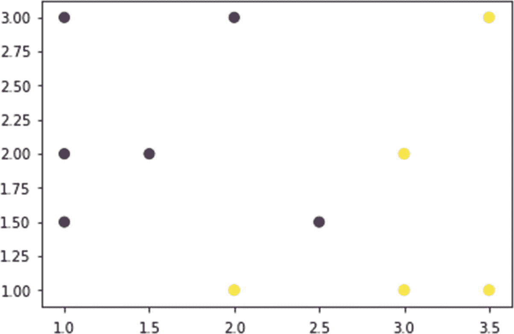

图 9-8

训练集是一组笛卡尔点，分为两类成员(黄色和深蓝色)

为了有助于颜色分配的图形表示(如图 [9-8](#Fig8) )，数组`inputY`被替换为`yc`数组。

正如你所看到的，这两个类在两个相反的区域很容易识别。第一区域覆盖左上部分，第二区域覆盖右下部分。所有这些似乎都可以简单地用一条假想的对角线来细分，但是为了使系统更加复杂，有一个例外，那就是位于其他点内部的点 6。

看看我们实现的神经网络如何以及是否能够正确地将类分配给这种类型的点，这将是有趣的。

### SLP 模型定义

对于您将在本章中考虑的示例，您将使用在机器学习章节中已经使用过的一系列数据，尤其是在关于支持向量机(SVMs)技术的章节中。

如果要做深度学习分析，首先要做的是定义要实现的神经网络模型。因此，您已经记住了要实现的结构、有多少个神经元、层和化合物(在本例中只有一个)、连接的权重以及要应用的成本函数。

遵循 TensorFlow 练习，您可以从定义一系列必要的参数开始，以在学习阶段表征计算的执行。*学习速率*是调节每个神经元学习速度的参数。这个参数非常重要，在学习阶段对调节神经网络的效率起着非常重要的作用。建立学习率的最佳先验值是不可能的，因为它在很大程度上取决于神经网络的结构和待分析数据的特定类型。因此，有必要通过不同的学习测试来调整该值，选择保证最佳准确度的值。

您可以从通用值 0.01 开始，将该值赋给`learning_rate`参数。

```py
In [ ]: learning_rate = 0.01

```

另一个需要定义的参数是`training_epochs`。这定义了在学习阶段将有多少个时期(学习周期)应用于神经网络。

```py
In [ ]: training_epochs = 2000

```

在程序执行期间，有必要以某种方式监控学习进度，这可以通过在终端上打印值来实现。您可以决定显示打印结果的次数，并将它们插入到`display_step`参数中。合理的值是每 50 或 100 步。

```py
In [ ]: display_step = 50

```

为了使实现的代码可重用，有必要添加参数来指定组成训练集的元素数量，以及必须划分多少批。在这种情况下，您有一个只有 11 个项目的小训练集。所以你可以一次全部用上。

```py
In [ ]: n_samples = 11
   ...: batch_size = 11
   ...: total_batch = int(n_samples/batch_size)
   ...:

```

最后，您可以添加另外两个参数来描述传入数据所属的类的大小和数量。

```py
In [ ]: n_input = 2 # size data input (# size of each element of x)
   ...: n_classes = 2 # n of classes
   ...:

```

现在您已经定义了方法的参数，让我们继续构建神经网络。首先，通过使用*占位符*定义神经网络的输入和输出。

```py
In [ ]: # tf Graph input
   ...: x = tf.placeholder("float", [None, n_input])
   ...: y = tf.placeholder("float", [None, n_classes])
   ...:

```

然后你刚刚*隐式*定义了一个 SLP 神经网络，在输入层有两个神经元，在输出层有两个神经元(见图 [9-9](#Fig9) )，定义了一个有两个值的输入占位符`x`和一个有两个值的输出占位符`y`。*显式地*，你已经定义了两个张量，一个张量`x`将包含输入坐标的值，一个张量`y`将包含属于每个元素的两个类的概率。

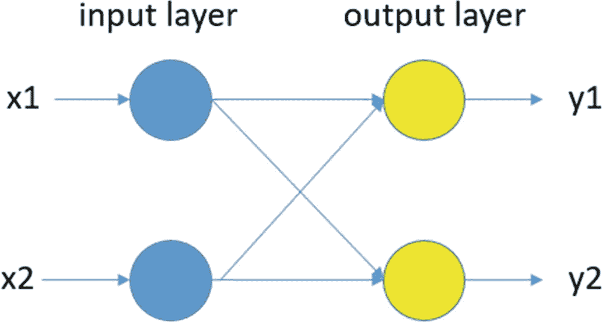

图 9-9

在这个例子中使用的单层感知器模型

但是在下面的例子中，当处理 MLP 神经网络时，这将更加明显。现在，您已经定义了占位符，占位符被权重和偏差占据，正如您所看到的，这些占位符用于定义神经网络的连接。这些张量`W`和`b`被构造函数`Variable()`定义为变量，并用`tf.zeros()`初始化为全零值。

```py
In [ ]: # Set model weights
    ...: W = tf.Variable(tf.zeros([n_input, n_classes]))
    ...: b = tf.Variable(tf.zeros([n_classes]))
    ...:

```

您刚刚定义的变量权重和偏差将用于定义证据 x * W + b，它以数学形式表征神经网络。`tf.matmul()`函数执行张量 x * W 之间的乘法运算，而`tf.add()`函数将偏差`b`的值添加到结果中。

```py
In [ ]: evidence = tf.add(tf.matmul(x, W), b)

```

根据证据的值，您可以使用`tf.nn.softmax()`函数直接计算输出值的概率。

```py
In [ ]: y_ = tf.nn.softmax(evidence)

```

`tf.nn.softmax()`功能执行两个步骤:

*   它计算某个笛卡尔入口点`xi`属于特定类的证据。

*   它将证据转换为属于两个可能类别的概率，并将其作为`y_`返回。

继续构建模型，现在您必须考虑建立最小化这些参数的规则，并通过定义成本(或损失)来实现。在这个阶段，你可以选择许多功能；其中最常见的是均方误差损失。

```py
In [ ]: cost = tf.reduce_sum(tf.pow(y-y_,2))/ (2 * n_samples)

```

但是你可以使用任何你认为更方便的功能。一旦定义了成本(或损失)函数，就必须建立一个算法来在每个学习周期执行最小化(优化)。您可以使用`tf.train.GradientDescentOptimizer()`函数作为优化器，它的操作基于梯度下降算法。

```py
In [ ]: optimizer =tf.train.GradientDescentOptimizer(learning_rate=learning_rate).minimize(cost)

```

有了成本优化方法(最小化)的定义，你就完成了神经网络模型的定义。现在，您已经准备好开始实施它的学习阶段。

### 学习阶段

在开始之前，定义两个列表，作为学习阶段获得的结果的容器。在`avg_set`中，您将输入每个时期(学习周期)的所有成本值，而在`epoch_set`中，您将输入相对时期编号。这些数据最终将有助于在神经网络的学习阶段可视化成本趋势，这对于理解为神经网络选择的学习方法的效率非常有用。

```py
In [ ]: avg_set = []
    ...: epoch_set=[]
    ...:

```

然后在开始会话之前，您需要用之前见过的函数`tf.global_variables_initializer()`初始化所有变量。

```py
In [ ]: init = tf.global_variables_initializer()

```

现在，您可以开始会话了(不要在结束时按 Enter 键；您必须在会话中输入其他命令)。

```py
In [ ]: with tf.Session() as sess:
    ...:     sess.run(init)
    ...:

```

你已经看到，每一个学习步骤都被称为一个时代。得益于扫描所有`training_epochs`值的`for`循环，可以在每个时期内进行干预。

在每个时期的这个周期内，您将使用`sess.run` (optimizer)命令进行优化。此外，每 50 个时期，条件`if% display_step == 0`将被满足。然后，您将通过`sess.run(cost)`提取成本值，并使用`append()`函数将其插入到`c`变量中，您将使用该变量在终端上进行打印，作为存储`avg_set`列表的`print()`参数。最后，当`for`循环完成时，您将在终端上打印一条消息，通知您学习阶段结束。(不要按 Enter 键，因为您仍然需要添加其他命令...)

```py
In [ ]: with tf.Session() as sess:
    ...:     sess.run(init)
    ...:
    ...:     for i in range(training_epochs):
    ...:         sess.run(optimizer, feed_dict = {x: inputX, y: inputY})
    ...:         if i % display_step == 0:
    ...:              c = sess.run(cost, feed_dict = {x: inputX, y: inputY})
    ...:              print("Epoch:", '%04d' % (i), "cost=", "{:.9f}".format(c))
    ...:              avg_set.append(c)
    ...:              epoch_set.append(i + 1)
    ...:
    ...:     print("Training phase finished")

```

既然学习阶段已经结束，那么在终端上打印一个汇总表是很有用的，它可以向您显示学习期间的成本趋势。您可以这样做，这要归功于您在学习过程中填写的`avg_set`和`epoch_set`列表中包含的值。

始终在会话中添加这些最后的代码行，在代码行的末尾，您可以最后按 Enter 键，通过执行学习阶段来启动会话。

```py
In [ ]: with tf.Session() as sess:
    ...:     sess.run(init)
    ...:
    ...:     for i in range(training_epochs):
    ...:         sess.run(optimizer, feed_dict = {x: inputX, y: inputY})
    ...:         if i % display_step == 0:
    ...:              c = sess.run(cost, feed_dict = {x: inputX, y: inputY})
    ...:              print("Epoch:", '%04d' % (i), "cost=", "{:.9f}".format(c))
    ...:              avg_set.append(c)
    ...:              epoch_set.append(i + 1)
    ...:
    ...:     print("Training phase finished")
    ...:
    ...:     training_cost = sess.run(cost, feed_dict = {x: inputX, y: inputY})
    ...:     print("Training cost =", training_cost, "\nW=", sess.run(W), "\nb=", sess.run(b))
    ...:     last_result = sess.run(y_, feed_dict = {x:inputX})
    ...:     print("Last result =",last_result)
    ...:

```

当神经网络学习阶段的会话结束时，您将获得以下结果。

```py
Epoch: 0000 cost= 0.249360308
Epoch: 0050 cost= 0.221041128
Epoch: 0100 cost= 0.198898271
Epoch: 0150 cost= 0.181669712
Epoch: 0200 cost= 0.168204829
Epoch: 0250 cost= 0.157555178
Epoch: 0300 cost= 0.149002746
Epoch: 0350 cost= 0.142023861
Epoch: 0400 cost= 0.136240512
Epoch: 0450 cost= 0.131378993
Epoch: 0500 cost= 0.127239138
Epoch: 0550 cost= 0.123672642
Epoch: 0600 cost= 0.120568059
Epoch: 0650 cost= 0.117840447
Epoch: 0700 cost= 0.115424201
Epoch: 0750 cost= 0.113267884
Epoch: 0800 cost= 0.111330733
Epoch: 0850 cost= 0.109580085
Epoch: 0900 cost= 0.107989430
Epoch: 0950 cost= 0.106537104
Epoch: 1000 cost= 0.105205171
Epoch: 1050 cost= 0.103978693
Epoch: 1100 cost= 0.102845162
Epoch: 1150 cost= 0.101793952
Epoch: 1200 cost= 0.100816071
Epoch: 1250 cost= 0.099903718
Epoch: 1300 cost= 0.099050261
Epoch: 1350 cost= 0.098249927
Epoch: 1400 cost= 0.097497642
Epoch: 1450 cost= 0.096789025
Epoch: 1500 cost= 0.096120209
Epoch: 1550 cost= 0.095487759
Epoch: 1600 cost= 0.094888613
Epoch: 1650 cost= 0.094320126
Epoch: 1700 cost= 0.093779817
Epoch: 1750 cost= 0.093265578
Epoch: 1800 cost= 0.092775457
Epoch: 1850 cost= 0.092307687
Epoch: 1900 cost= 0.091860712
Epoch: 1950 cost= 0.091433071
Training phase finished
Training cost = 0.0910315
W= [[-0.70927787 0.70927781]
[ 0.62999243 -0.62999237]]
b= [ 0.34513065 -0.34513068]
Last result = [[ 0.95485419 0.04514586]
[ 0.85713255 0.14286745]
[ 0.76163834 0.23836163]
[ 0.74694741 0.25305259]
[ 0.83659446 0.16340555]
[ 0.27564839 0.72435158]
[ 0.29175714 0.70824283]
[ 0.090675 0.909325 ]
[ 0.26010245 0.73989749]
[ 0.04676624 0.95323378]
[ 0.37878013 0.62121987]]

```

正如你所看到的，成本在这个时期逐渐提高，达到 0.168。然后有趣的是看到 W 权重的值和神经网络的偏差。这些值代表模型的参数，即被指示分析这种类型的数据并执行这种类型的分类的神经网络。

这些参数非常重要，因为一旦获得了这些参数并知道了所使用的神经网络的结构，就有可能在任何地方重复使用它们，而无需重复学习阶段。不要考虑这个只需要一分钟就能完成计算的例子；在实际情况下，这可能需要几天时间来完成，而且在开发一个在类别识别或执行任何其他任务方面非常准确的有效神经网络之前，您通常必须进行多次尝试，并调整和校准不同的参数。

如果从图形化的角度看结果，可能会更容易更快理解。您可以使用 matplotlib 来完成这项工作。

```py
In [ ]: plt.plot(epoch_set,avg_set,'o',label = 'SLP Training phase')
    ...: plt.ylabel('cost')
    ...: plt.xlabel('epochs')
    ...: plt.legend()
    ...: plt.show()
    ...:

```

可以通过跟随成本值的趋势来分析神经网络的学习阶段，如图 [9-10](#Fig10) 。

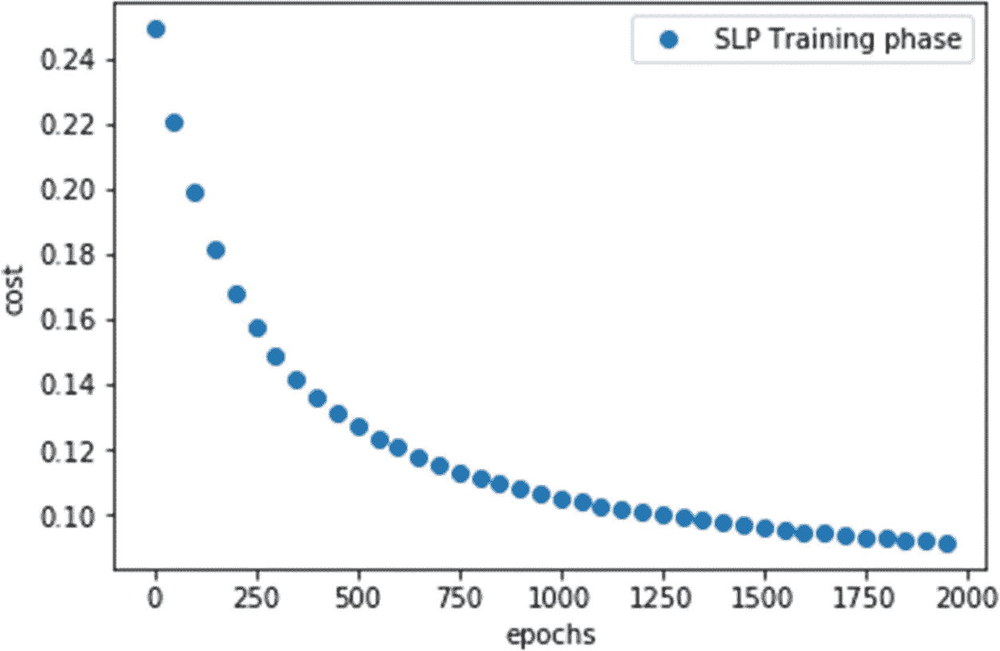

图 9-10

成本值在学习阶段降低(成本优化)

现在，您可以在学习阶段的最后一步继续查看分类的结果。

```py
In [ ]: yc = last_result[:,1]
    ...: plt.scatter(inputX[:,0],inputX[:,1],c=yc, s=50, alpha=1)
    ...: plt.show()
    ...:

```

你将得到笛卡尔平面中的点的表示，如图 [9-11](#Fig11) 所示。

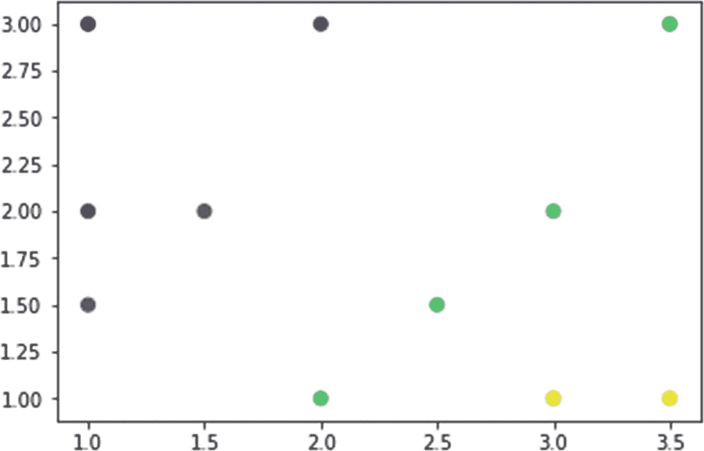

图 9-11

在学习阶段的最后一个时期点所属的类的估计

图形表示笛卡尔平面中的点(见图 [9-11](#Fig11) )，颜色范围从蓝色(属于第一组的 100%)到黄色(属于第二组的 100%)。如您所见，训练集的点在两个类别中的划分非常理想，中心对角线(绿色)上的四个点具有不确定性。

这个图表以某种方式显示了所使用的神经网络的学习能力。如您所见，尽管使用了训练集的学习时期，但神经网络未能学习到点 6 (x = 2.5，y = 1.5)属于第一类。这是一个你可以预料到的结果，因为它代表了一个例外，并给第二类中的其他点(绿点)增加了不确定性的影响。

### 测试阶段和精度计算

现在你有了一个训练有素的神经网络，你可以创建评估并计算准确性。

首先，定义一个包含不同于训练集的元素的测试集。为了方便起见，这些例子总是使用 11 个元素。

```py
In [ ]: #Testing set
    ...: testX = np.array([[1.,2.25],[1.25,3.],[2,2.5],[2.25,2.75],[2.5,3.],
[2.,0.9],[2.5,1.2],[3.,1.25],[3.,1.5],[3.5,2.],[3.5,2.5]])
    ...: testY = [[1.,0.]]*5 + [[0.,1.]]*6
    ...: print(testX)
    ...: print(testY)
    ...:
[[ 1\. 2.25]
[ 1.25 3\. ]
[ 2\. 2.5 ]
[ 2.25 2.75]
[ 2.5 3\. ]
[ 2\. 0.9 ]
[ 2.5 1.2 ]
[ 3\. 1.25]
[ 3\. 1.5 ]
[ 3.5 2\. ]
[ 3.5 2.5 ]]
[[1.0, 0.0], [1.0, 0.0], [1.0, 0.0], [1.0, 0.0], [1.0, 0.0],
[0.0, 1.0], [0.0, 1.0], [0.0, 1.0], [0.0, 1.0], [0.0, 1.0], [0.0, 1.0]]

```

为了更好地理解测试集数据及其成员类，使用 matplotlib 在图表上显示这些点。

```py
In [ ]: yc = [0]*5 + [1]*6
    ...: print(yc)
    ...: plt.scatter(testX[:,0],testX[:,1],c=yc, s=50, alpha=0.9)
    ...: plt.show()
    ...:
[0, 0, 0, 0, 0, 1, 1, 1, 1, 1, 1]

```

你将得到笛卡尔平面中的点的表示，如图 [9-12](#Fig12) 所示。

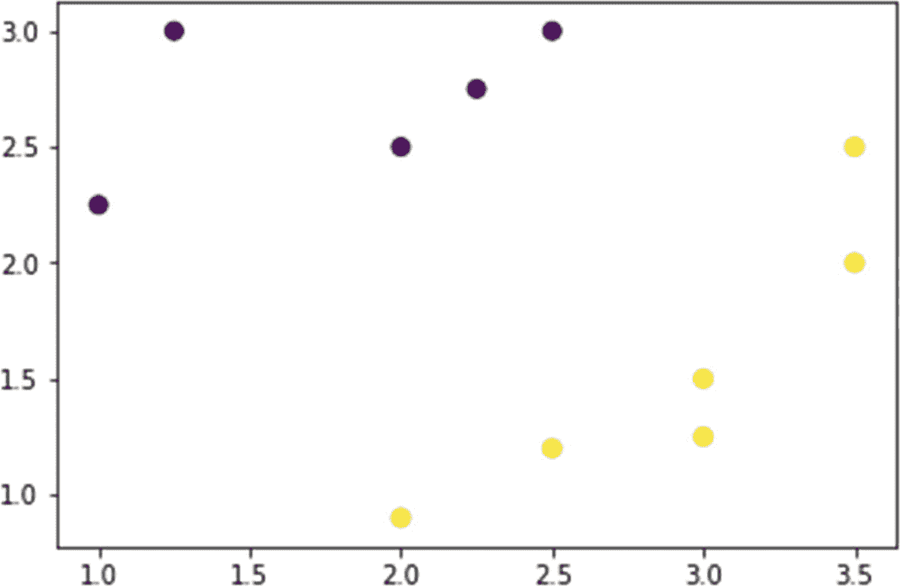

图 9-12

测试装置

现在，您将使用此测试集来评估 SLP 神经网络并计算准确性。

```py
In [ ]: init = tf.global_variables_initializer()
    ...: with tf.Session() as sess:
    ...:     sess.run(init)
    ...:
    ...:     for i in range(training_epochs):
    ...:            sess.run(optimizer, feed_dict = {x: inputX, y: inputY})
    ...:
    ...:     pred = tf.nn.softmax(evidence)
    ...:     result = sess.run(pred, feed_dict = {x: testX})
    ...:     correct_prediction = tf.equal(tf.argmax(pred, 1), tf.argmax(testY, 1))
    ...:
    ...:     # Calculate accuracy
    ...:     accuracy = tf.reduce_mean(tf.cast(correct_prediction, "float"))
    ...:     print("Accuracy:", accuracy.eval({x: testX, y: testY}))
    ...:
Accuracy: 1.0

```

显然，神经网络能够正确分类所有 11 个过去的冠军。它用从深蓝色到黄色的相同色阶系统显示笛卡尔平面上的点。

```py
In [ ]: yc = result[:,1]
    ...: plt.scatter(testX[:,0],testX[:,1],c=yc, s=50, alpha=1)
    ...: plt.show()

```

你将得到笛卡尔平面中的点的表示，如图 [9-13](#Fig13) 所示。

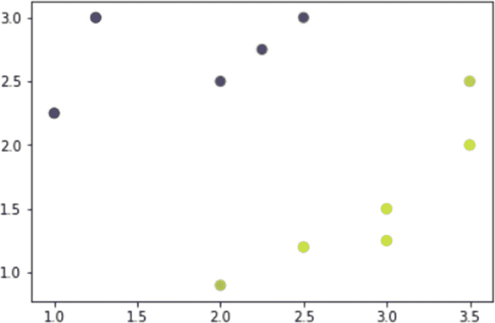

图 9-13

测试集点所属类别的估计值

考虑到所用模型的简单性和训练集中使用的少量数据，可以认为结果是最佳的。现在你将面临同样的问题，一个更复杂的神经网络，多层感知器。

## 带张量流的多层感知器(带一个隐藏层)

在本节中，您将处理与上一节相同的问题，但是使用 MLP(多层感知器)神经网络。

启动一个新的 IPython 会话，重置内核。至于代码的第一部分，它仍然与前面的例子一样。

```py
In [1]: import tensorflow as tf
   ...: import numpy as np
   ...: import matplotlib.pyplot as plt
   ...:
   ...: #Training set
   ...: inputX = np.array([[1.,3.],[1.,2.],[1.,1.5],[1.5,2.],[2.,3.],[2.5,1.5],
[2.,1.],[3.,1.],[3.,2.],[3.5,1.],[3.5,3.]])
   ...: inputY = [[1.,0.]]*6+ [[0.,1.]]*5
   ...:
   ...: learning_rate = 0.001
   ...: training_epochs = 2000
   ...: display_step = 50
   ...: n_samples = 11
   ...: batch_size = 11
   ...: total_batch = int(n_samples/batch_size)

```

### MLP 模型定义

正如您在本章前面所看到的，神经网络 MLP 不同于 SLP 神经网络，它可以有一个或多个隐藏层。

因此，您将编写参数化代码，使您能够以最通用的方式工作，在定义时确定神经网络中存在的隐藏层数以及它们由多少个神经元组成。

定义两个新参数，定义每个隐藏层的神经元数量。`n_hidden_1`参数将指示第一隐藏层中存在多少神经元，而`n_hidden_2`将指示第二隐藏层中存在多少神经元。

从一个简单的例子开始，你将从一个 MLP 神经网络开始，它只有一个由两个神经元组成的隐藏层。下面我们来评论一下与第二个隐藏层相关的部分。

至于`n_input`和`n_classes`参数，它们将具有与之前的 SLP 神经网络示例相同的值。

```py
In [2]: # Network Parameters
   ...: n_hidden_1 = 2 # 1st layer number of neurons
   ...: #n_hidden_2 = 0 # 2nd layer number of neurons
   ...: n_input = 2 # size data input
   ...: n_classes = 2 # classes
   ...:

```

占位符的定义也与前面的例子相同。

```py
In [3]: # tf Graph input
   ...: X = tf.placeholder("float", [None, n_input])
   ...: Y = tf.placeholder("float", [None, n_classes])
   ...:

```

现在，您必须处理不同连接的各种 W 和 bias b 权重的定义。神经网络现在要复杂得多，要考虑几层。参数化它们的有效方法是如下定义它们，注释掉第二个隐藏层的权重和偏差参数(仅用于具有一个隐藏层的 MLP，如本例所示)。

```py
In [4]: # Store layers weight & bias
   ...: weights = {
   ...:     'h1': tf.Variable(tf.random_normal([n_input, n_hidden_1])),
   ...:     #'h2': tf.Variable(tf.random_normal([n_hidden_1, n_hidden_2])),
   ...:     'out': tf.Variable(tf.random_normal([n_hidden_1, n_classes]))
   ...: }
   ...: biases = {
   ...:     'b1': tf.Variable(tf.random_normal([n_hidden_1])),
   ...:     #'b2': tf.Variable(tf.random_normal([n_hidden_2])),
   ...:     'out': tf.Variable(tf.random_normal([n_classes]))
   ...: }
   ...:

```

为了创建一个考虑所有动态指定参数的神经网络模型，您需要定义一个方便的函数，您将称之为`multilayer_perceptron()`。

```py
In [5]: # Create model
   ...: def multilayer_perceptron(x):
   ...:     layer_1 = tf.add(tf.matmul(x, weights['h1']), biases['b1'])
   ...:     #layer_2 = tf.add(tf.matmul(layer_1, weights['h2']), biases['b2'])
   ...:     # Output fully connected layer with a neuron for each class
   ...:     out_layer = tf.matmul(layer_1, weights['out']) + biases['out']
   ...:     return out_layer
   ...:

```

现在，您可以通过调用刚刚定义的函数来构建模型。

```py
In [6]: # Construct model
   ...: evidence = multilayer_perceptron(X)
   ...: y_ = tf.nn.softmax(evidence)
   ...:

```

下一步是定义`cost`函数并选择一种优化方法。对于 MLP 神经网络，一个很好的选择是用`tf.train.AdamOptimizer()`作为优化方法。

```py
In [7]: # Define cost and optimizer
   ...: cost = tf.reduce_sum(tf.pow(Y-y_,2))/ (2 * n_samples)
   ...: optimizer = tf.train.AdamOptimizer(learning_rate=learning_rate).minimize(cost)
   ...:

```

有了这最后两行，你就完成了 MLP 神经网络模型的定义。现在，您可以继续创建一个会话来实施学习阶段。

### 学习阶段

与上一个示例一样，现在您将定义两个列表，其中包含历元数和每个历元的测量成本值。您还将在启动会话之前初始化所有变量。

```py
In [8]: avg_set = []
   ...: epoch_set = []
   ...: init = tf.global_variables_initializer()
   ...:

```

现在，您可以开始实施学习课程了。按照以下说明打开会话(记住不要按 Enter，而是按+Ctrl 以便稍后插入其他命令):

```py
In [9]: with tf.Session() as sess:
    ...:     sess.run(init)
    ...:

```

现在，它实现了为每个时期执行的代码，并在其中扫描了属于训练集的每个批次。在这种情况下，您有一个由单个批次组成的训练集，因此您将只有一次迭代，您将直接将`inputX`和`inputY`分配给`batch_x`和`batch_y`。在其他情况下，您将需要实现一个函数，例如`next_batch(batch_size)`，它将整个训练集(例如`inputdata`)细分为不同的批次，逐步将它们作为返回值返回。

在每个批处理周期，`cost`功能将通过`sess.run([optimizer, cost])`最小化，这将对应于部分成本。所有批次都将有助于计算所有`avg_cost`批次的平均成本。但是，在这种情况下，由于您只有一个批次，因此`avg_cost`相当于整个训练集的成本。

```py
In [9]: with tf.Session() as sess:
    ...:      sess.run(init)
    ...:
    ...:     for epoch in range(training_epochs):
    ...:         avg_cost = 0.
    ...:         # Loop over all batches
    ...:         for i in range(total_batch):
    ...:              #batch_x, batch_y = inputdata.next_batch(batch_size) TO BE IMPLEMENTED
    ...:              batch_x = inputX
    ...:              batch_y = inputY
    ...:              _, c = sess.run([optimizer, cost], feed_dict={X: batch_x, Y: batch_y})
    ...:              # Compute average loss
    ...:              avg_cost += c / total_batch

```

每隔一定数量的时期，您肯定会希望在终端上显示当前成本的值，并将这些值添加到`avg_set`和`epoch_set`列表中，就像前面 SLP 的例子一样。

```py
In [9]: with tf.Session() as sess:
    ...:      sess.run(init)
    ...:
    ...:     for epoch in range(training_epochs):
    ...:         avg_cost = 0.
    ...:         # Loop over all batches
    ...:         for i in range(total_batch):
    ...:              #batch_x, batch_y = inputdata.next_batch(batch_size) TO BE IMPLEMENTED
    ...:              batch_x = inputX
    ...:              batch_y = inputY
    ...:              _, c = sess.run([optimizer, cost], feed_dict={X: batch_x, Y: batch_y})
    ...:              # Compute average loss
    ...:              avg_cost += c / total_batch
    ...:         if epoch % display_step == 0:
    ...:             print("Epoch:", '%04d' % (epoch+1), "cost={:.9f}".format(avg_cost))
    ...:             avg_set.append(avg_cost)
    ...:             epoch_set.append(epoch + 1)
    ...:
    ...:     print("Training phase finished")

```

在运行会话之前，添加几行说明以查看学习阶段的结果。

```py
In [9]: with tf.Session() as sess:
    ...:      sess.run(init)
    ...:
    ...:     for epoch in range(training_epochs):
    ...:         avg_cost = 0.
    ...:         # Loop over all batches
    ...:         for i in range(total_batch):
    ...:              #batch_x, batch_y = inputdata.next
                      _batch(batch_size) TO BE IMPLEMENTED
    ...:              batch_x = inputX
    ...:              batch_y = inputY
    ...:              _, c = sess.run([optimizer, cost], feed
                      _dict={X: batch_x, Y: batch_y})
    ...:              # Compute average loss
    ...:              avg_cost += c / total_batch
    ...:         if epoch % display_step == 0:
    ...:             print("Epoch:", '%04d' % (epoch+1), "cost={:.9f}".format(avg_cost))
    ...:             avg_set.append(avg_cost)
    ...:             epoch_set.append(epoch + 1)
    ...:
    ...:     print("Training phase finished")
   ...:      last_result = sess.run(y_, feed_dict = {X: inputX})
   ...:      training_cost = sess.run(cost, feed_dict = {X:

             inputX, Y: inputY})

   ...:      print("Training cost =", training_cost)
   ...:      print("Last result =", last_result)
   ...:

```

最后，您可以执行会话并获得学习阶段的以下结果。

```py
Epoch: 0001 cost=0.454545379
Epoch: 0051 cost=0.454544961
Epoch: 0101 cost=0.454536706
Epoch: 0151 cost=0.454053283
Epoch: 0201 cost=0.391623020
Epoch: 0251 cost=0.197094142
Epoch: 0301 cost=0.145846367
Epoch: 0351 cost=0.121205062
Epoch: 0401 cost=0.106998600
Epoch: 0451 cost=0.097896501
Epoch: 0501 cost=0.091660112
Epoch: 0551 cost=0.087186322
Epoch: 0601 cost=0.083868250
Epoch: 0651 cost=0.081344165
Epoch: 0701 cost=0.079385243
Epoch: 0751 cost=0.077839941
Epoch: 0801 cost=0.076604150
Epoch: 0851 cost=0.075604357
Epoch: 0901 cost=0.074787453
Epoch: 0951 cost=0.074113965
Epoch: 1001 cost=0.073554687
Epoch: 1051 cost=0.073086999
Epoch: 1101 cost=0.072693743
Epoch: 1151 cost=0.072361387
Epoch: 1201 cost=0.072079219
Epoch: 1251 cost=0.071838818
Epoch: 1301 cost=0.071633331
Epoch: 1351 cost=0.071457185
Epoch: 1401 cost=0.071305975
Epoch: 1451 cost=0.071175829
Epoch: 1501 cost=0.071063705
Epoch: 1551 cost=0.070967078
Epoch: 1601 cost=0.070883729
Epoch: 1651 cost=0.070811756
Epoch: 1701 cost=0.070749618
Epoch: 1751 cost=0.070696011
Epoch: 1801 cost=0.070649780
Epoch: 1851 cost=0.070609920
Epoch: 1901 cost=0.070575655
Epoch: 1951 cost=0.070546091
Training phase finished
Training cost = 0.0705207
Last result = [[ 0.994959 0.00504093]
[ 0.97760069 0.02239927]
[ 0.95353836 0.04646158]
[ 0.91986829 0.0801317 ]
[ 0.93176246 0.06823757]
[ 0.27190316 0.7280969 ]
[ 0.40035316 0.59964687]
[ 0.04414944 0.9558506 ]
[ 0.17278962 0.82721037]
[ 0.01200284 0.98799717]
[ 0.19901533 0.80098462]]

```

现在，您可以查看在`avg_set`和`epoch_set`列表中收集的数据，以分析学习阶段的进度。

```py
In [10]: plt.plot(epoch_set,avg_set,'o',label = 'MLP Training phase')
    ...: plt.ylabel('cost')
    ...: plt.xlabel('epochs')
    ...: plt.legend()
    ...: plt.show()
    ...:

```

可以通过跟随成本值的趋势来分析神经网络的学习阶段，如图 [9-14](#Fig14) 。


图 9-14

成本值在学习阶段降低(成本优化)

在图 [9-14](#Fig14) 中，您可以看到，在学习时期，就成本优化而言，最初有一个巨大的改进，然后在最后一部分，时期改进变小，然后收敛到零。

然而，从图的分析中，可以确定神经网络的学习周期已经在指定的历元周期中完成。所以你可以认为神经网络已经学会了。现在，您可以进入评估阶段。

### 测试阶段和精度计算

现在你有了一个受过教育的神经网络，你可以制作评估文本，并计算准确度。

现在，您已经有了一个被指示执行该任务的神经网络，您可以进入评估阶段了。然后你会计算你生成的模型的精度。

若要测试此 MLP 神经网络模型，您将使用在 SLP 神经网络示例中使用的相同测试集。

```py
In [11]: #Testing set
    ...: testX = np.array([[1.,2.25],[1.25,3.],[2,2.5],[2.25,2.75],[2.5,3.],
[2.,0.9],[2.5,1.2],[3.,1.25],[3.,1.5],[3.5,2.],[3.5,2.5]])
    ...: testY = [[1.,0.]]*5 + [[0.,1.]]*6
    ...:

```

现在没有必要查看这个测试集，因为您已经在前面的部分中查看过了(如果需要，您可以检查它)。

启动包含培训测试的会话，并评估通过计算准确度获得的结果的正确性。

```py
In [12]: with tf.Session() as sess:
    ...:     sess.run(init)
    ...:
    ...:     for epoch in range(training_epochs):
    ...:         for i in range(total_batch):
    ...:              batch_x = inputX
    ...:              batch_y = inputY
    ...:              _, c = sess.run([optimizer, cost],
                      feed_dict={X: batch_x, Y: batch_y})
    ...:
    ...:     # Test model
    ...:     pred = tf.nn.softmax(evidence)
    ...:     result = sess.run(pred, feed_dict = {X: testX})
    ...:     correct_prediction = tf.equal(tf.argmax(pred, 1),
             tf.argmax(Y, 1))
    ...:
    ...:     # Calculate accuracy
    ...:     accuracy = tf.reduce_mean(tf.cast(correct_prediction, "float"))
    ...:     print("Accuracy:", accuracy.eval({X: testX, Y: testY}))
    ...:     print(result)

```

通过运行整个会话，您将获得以下结果。

```py
Accuracy: 1.0
Result = [[ 0.98507893 0.0149211 ]
[ 0.99064976 0.00935023]
[ 0.86788082 0.13211915]
[ 0.83086801 0.16913196]
[ 0.78604239 0.21395761]
[ 0.36329603 0.63670397]
[ 0.19036612 0.80963391]
[ 0.06203776 0.93796223]
[ 0.0883315 0.91166848]
[ 0.05140254 0.94859749]
[ 0.10417036 0.89582968]]

```

同样，在 MLP 神经网络的例子中，你获得了 100%的准确率(在总共 11 分中，11 分被正确分类)。现在显示通过在笛卡尔平面上画点获得的分类。

```py
In [13]: yc = result[:,1]
    ...: print(yc)
    ...: plt.scatter(testX[:,0],testX[:,1],c=yc, s=50, alpha=1)
    ...: plt.show()
    ...:
[ 0.0149211 0.00935023 0.13211915 0.16913196 0.21395761 0.63670397
0.80963391 0.93796223 0.91166848 0.94859749 0.89582968]

```

你将得到一个分布在笛卡尔平面上的点的图表(见图 [9-15](#Fig15) ),颜色从蓝色到黄色，表明属于两类中的一类的概率。

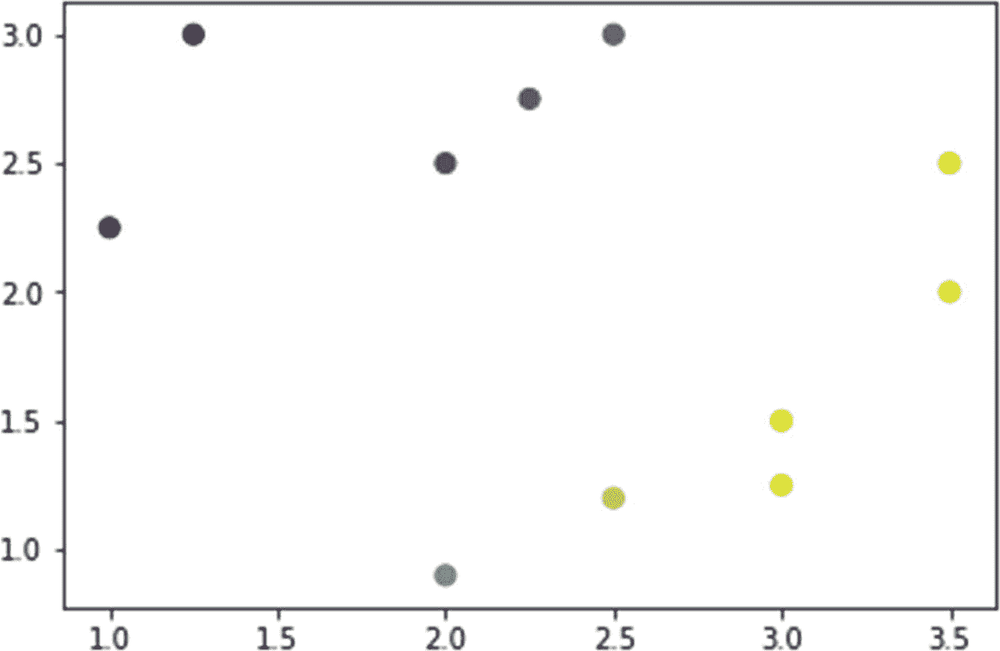

图 9-15

测试集点所属类别的估计值

## 具有张量流的多层感知器(具有两个隐藏层)

在本节中，您将通过向第一个隐藏层添加两个神经元并向第二个隐藏层添加两个神经元来扩展前面的结构。

启动一个新的 IPython 会话，重写前一个示例的代码，除了一些参数(您可以在代码文本中看到它们)之外，代码保持不变。

由于您使用的代码的参数化，扩展和修改 MLP 神经网络的结构非常容易。在这种情况下，您只需更改以下参数，然后重新运行一遍。

```py
In [1]: import tensorflow as tf
   ...: import numpy as np
   ...: import matplotlib.pyplot as plt
   ...:
   ...: #Training set
   ...: inputX = np.array([[1.,3.],[1.,2.],[1.,1.5],[1.5,2.],[2.,3.],[2.5,1.5],
[2.,1.],[3.,1.],[3.,2.],[3.5,1.],[3.5,3.]])
   ...: inputY = [[1.,0.]]*6+ [[0.,1.]]*5
   ...:
   ...: learning_rate = 0.001
   ...: training_epochs = 2000
   ...: display_step = 50
   ...: n_samples = 11
   ...: batch_size = 11
   ...: total_batch = int(n_samples/batch_size)
   ...:
   ...: # Network Parameters
   ...: n_hidden_1 = 4 # 1st layer number of neurons
   ...: n_hidden_2 = 2 # 2nd layer number of neurons
   ...: n_input = 2 # size data input
   ...: n_classes = 2 # classes
   ...:
   ...: # tf Graph input
   ...: X = tf.placeholder("float", [None, n_input])
   ...: Y = tf.placeholder("float", [None, n_classes])
   ...:
   ...: # Store layers weight & bias
   ...: weights = {
   ...:     'h1': tf.Variable(tf.random_normal([n_input, n_hidden_1])),
   ...:     'h2': tf.Variable(tf.random_normal([n_hidden_1, n_hidden_2])),
   ...:     'out': tf.Variable(tf.random_normal([n_hidden_2, n_classes]))
   ...: }
   ...: biases = {
   ...:     'b1': tf.Variable(tf.random_normal([n_hidden_1])),
   ...:     'b2': tf.Variable(tf.random_normal([n_hidden_2])),
   ...:     'out': tf.Variable(tf.random_normal([n_classes]))
   ...: }
   ...:
   ...: # Create model
   ...: def multilayer_perceptron(x):
   ...:     layer_1 = tf.add(tf.matmul(x, weights['h1']), biases['b1'])
   ...:     layer_2 = tf.add(tf.matmul(layer_1, weights['h2']), biases['b2'])
   ...:     # Output fully connected layer with a neuron for each class
   ...:     out_layer = tf.add(tf.matmul(layer_2, weights['out']), biases['out'])
   ...:     return out_layer
   ...:
   ...: # Construct model
   ...: evidence = multilayer_perceptron(X)
   ...: y_ = tf.nn.softmax(evidence)
   ...:
   ...: # Define cost and optimizer
   ...: cost = tf.reduce_sum(tf.pow(Y-y_,2))/ (2 * n_samples)
   ...: optimizer = tf.train.AdamOptimizer(learning_rate=learning_rate).minimize(cost)
   ...:
   ...: avg_set = []
   ...: epoch_set = []
   ...: init = tf.global_variables_initializer()
   ...:
   ...: with tf.Session() as sess:
   ...:     sess.run(init)
   ...:
   ...:     for epoch in range(training_epochs):
   ...:          avg_cost = 0.
   ...:          # Loop over all batches
   ...:          for i in range(total_batch):
   ...:              #batch_x, batch_y = inputdata.next_batch(batch_size) TO BE IMPLEMENTED
   ...:              batch_x = inputX
   ...:              batch_y = inputY
   ...:              _, c = sess.run([optimizer, cost],
                     feed_dict={X: batch_x, Y: batch_y})
   ...:              # Compute average loss
   ...:              avg_cost += c / total_batch
   ...:          if epoch % display_step == 0:
   ...:              print("Epoch:", '%04d' % (epoch+1), "cost={:.9f}".format(avg_cost))
   ...:              avg_set.append(avg_cost)
   ...:              epoch_set.append(epoch + 1)
   ...:
   ...:     print("Training phase finished")
   ...:     last_result = sess.run(y_, feed_dict = {X: inputX})
   ...:     training_cost = sess.run(cost, feed_dict = {X: inputX, Y: inputY})
   ...:     print("Training cost =", training_cost)
   ...:     print("Last result =", last_result)
   ...:

```

通过运行进程，可以获得以下结果。

```py
Epoch: 0001 cost=0.545502067
Epoch: 0051 cost=0.545424163
Epoch: 0101 cost=0.545238674
Epoch: 0151 cost=0.540347397
Epoch: 0201 cost=0.439834774
Epoch: 0251 cost=0.137688771
Epoch: 0301 cost=0.093460977
Epoch: 0351 cost=0.082653232
Epoch: 0401 cost=0.077882372
Epoch: 0451 cost=0.075265951
Epoch: 0501 cost=0.073665120
Epoch: 0551 cost=0.072624505
Epoch: 0601 cost=0.071925417
Epoch: 0651 cost=0.071447782
Epoch: 0701 cost=0.071118690
Epoch: 0751 cost=0.070890851
Epoch: 0801 cost=0.070732787
Epoch: 0851 cost=0.070622921
Epoch: 0901 cost=0.070546582
Epoch: 0951 cost=0.070493549
Epoch: 1001 cost=0.070456795
Epoch: 1051 cost=0.070431381
Epoch: 1101 cost=0.070413873
Epoch: 1151 cost=0.070401885
Epoch: 1201 cost=0.070393734
Epoch: 1251 cost=0.070388250
Epoch: 1301 cost=0.070384577
Epoch: 1351 cost=0.070382126
Epoch: 1401 cost=0.070380524
Epoch: 1451 cost=0.070379473
Epoch: 1501 cost=0.070378840
Epoch: 1551 cost=0.070378408
Epoch: 1601 cost=0.070378155
Epoch: 1651 cost=0.070378013
Epoch: 1701 cost=0.070377886
Epoch: 1751 cost=0.070377827
Epoch: 1801 cost=0.070377797
Epoch: 1851 cost=0.070377767
Epoch: 1901 cost=0.070377775
Epoch: 1951 cost=0.070377789
Training phase finished
Training cost = 0.0703778
Last result = [[ 0.99683338 0.00316658]
[ 0.98408335 0.01591668]
[ 0.96478891 0.0352111 ]
[ 0.93620235 0.06379762]
[ 0.94662082 0.05337923]
[ 0.26812935 0.73187065]
[ 0.40619871 0.59380126]
[ 0.03710628 0.96289372]
[ 0.16402677 0.83597326]
[ 0.0090636 0.99093646]
[ 0.19166829 0.80833173]]

```

以通常的方式查看学习阶段的进度。

```py
In [2]: plt.plot(epoch_set,avg_set,'o',label = 'MLP Training phase')
   ...: plt.ylabel('cost')
   ...: plt.xlabel('epochs')
   ...: plt.legend()
   ...: plt.show()
   ...:

```

可以通过跟随代价值的趋势来分析神经网络的学习阶段，如图 [9-16](#Fig16) 。

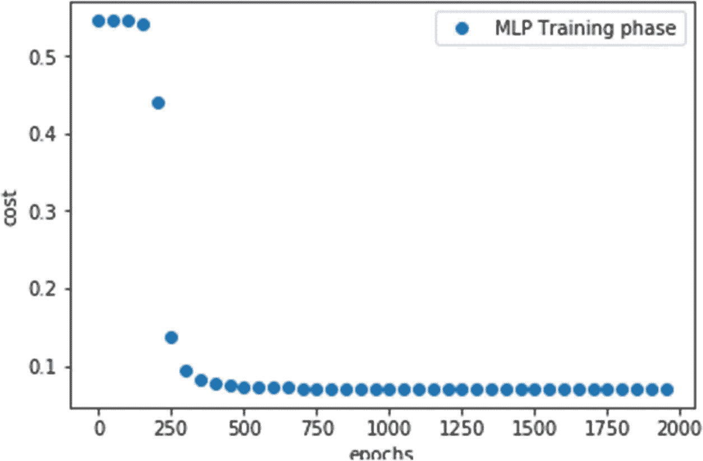

图 9-16

具有两个隐藏层的 MLP 在学习阶段的成本趋势

从图 [9-16](#Fig16) 中可以看到，这种情况下的学习比前一种情况快得多(1000 个历元，你就没事了)。优化的成本几乎与之前的神经网络相同(0.0703778 对之前情况下的 0.0705207)。

### 测试阶段和精度计算

在这里，您还将使用相同的测试集来评估 MLP 神经网络对分析中的样本进行分类的准确性。

```py
In [3]: #Testing set
   ...: testX = np.array([[1.,2.25],[1.25,3.],[2,2.5],[2.25,2.75],[2.5,3.],
[2.,0.9],[2.5,1.2],[3.,1.25],[3.,1.5],[3.5,2.],[3.5,2.5]])
   ...: testY = [[1.,0.]]*5 + [[0.,1.]]*6
   ...:

In [4]: with tf.Session() as sess:
   ...:     sess.run(init)
   ...:
   ...:     for epoch in range(training_epochs):
   ...:         for i in range(total_batch):
   ...:             batch_x = inputX
   ...:             batch_y = inputY
   ...:             _, c = sess.run([optimizer, cost],
                    feed_dict={X: batch_x, Y: batch_y})
   ...:
   ...:    # Test model
   ...:    pred = tf.nn.softmax(evidence) # Apply softmax to logits
   ...:    result = sess.run(pred, feed_dict = {X: testX})
   ...:    correct_prediction = tf.equal(tf.argmax(pred, 1), tf.argmax(Y, 1))

   ...:    # Calculate accuracy
   ...:    accuracy = tf.reduce_mean(tf.cast(correct_prediction, "float"))
   ...:    print("Accuracy:", accuracy.eval({X: testX, Y: testY}))
   ...:    print("Result = ", result)

```

通过执行会话，您将获得以下结果。

```py
Accuracy: 1.0
Result = [[ 0.98924851 0.01075149]
[ 0.99344641 0.00655352]
[ 0.88655776 0.11344216]
[ 0.85117978 0.14882027]
[ 0.8071683 0.19283174]
[ 0.36805421 0.63194579]
[ 0.18399802 0.81600195]
[ 0.05498539 0.9450146 ]
[ 0.08029026 0.91970974]
[ 0.04467025 0.95532972]
[ 0.09523712 0.90476292]]

```

在这里，你也有 100%的准确性，并且使用 matplotlib 显示笛卡尔平面上的测试设置点和通常的颜色渐变系统，你将得到与前面的例子非常相似的结果(见图 [9-17](#Fig17) )。

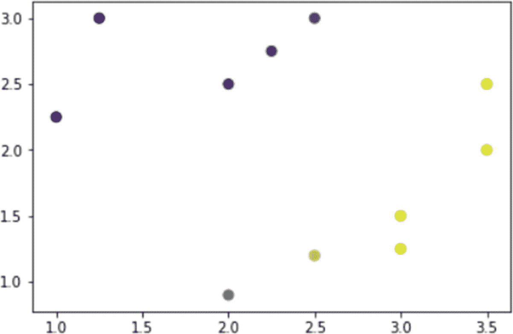

图 9-17

测试集点所属类别的估计值

```py
In [5]: yc = result[:,1]
   ...: plt.scatter(testX[:,0],testX[:,1],c=yc, s=50, alpha=1)
   ...: plt.show()
   ...:

```

### 实验数据的评估

现在你要做一些你至今没有做过的事情。到目前为止，您已经创建了新的神经网络模型，并处理了学习阶段，因此您可以学习如何对您选择的特定类型的数据进行分类。

对于用于训练集和测试集的数据，您完全知道期望值(包含在 y 中)。在这种情况下，该值对应于它所属的类。所以你应用了*监督学习*。

最后，通过测试阶段和准确度的计算，评价了神经网络模型的有效性。

现在让我们继续进行适当的分类，将大量数据(笛卡尔平面上的点)传递给神经网络，而不知道它们属于哪一类。事实上，这是神经网络通知你可能的类别的时刻。

为此，该程序模拟实验数据，在笛卡尔平面上创建完全随机的点。例如，生成包含 1，000 个随机点的数组。

```py
In [ ]: test = 3*np.random.random((1000,2))

```

然后将这些点提交给神经网络，以确定隶属度的类别。

```py
In [7]: with tf.Session() as sess:
   ...:     sess.run(init)
   ...:
   ...:     for epoch in range(training_epochs):
   ...:         for i in range(total_batch):
   ...:             batch_x = inputX
   ...:             batch_y = inputY
   ...:             _, c = sess.run([optimizer, cost],
                    feed_dict={X: batch_x, Y: batch_y})
   ...:
   ...: # Test model
   ...: pred = tf.nn.softmax(evidence)
   ...: result = sess.run(pred, feed_dict = {X: test})
   ...:

```

最后，您可以根据神经网络评估的分类概率来可视化实验数据。

```py
In [8]: yc = result[:,1]
   ...: plt.scatter(test[:,0],test[:,1],c=yc, s=50, alpha=1)
   ...: plt.show()
   ...:

```

你会得到一个图表，如图 [9-18](#Fig18) 所示。

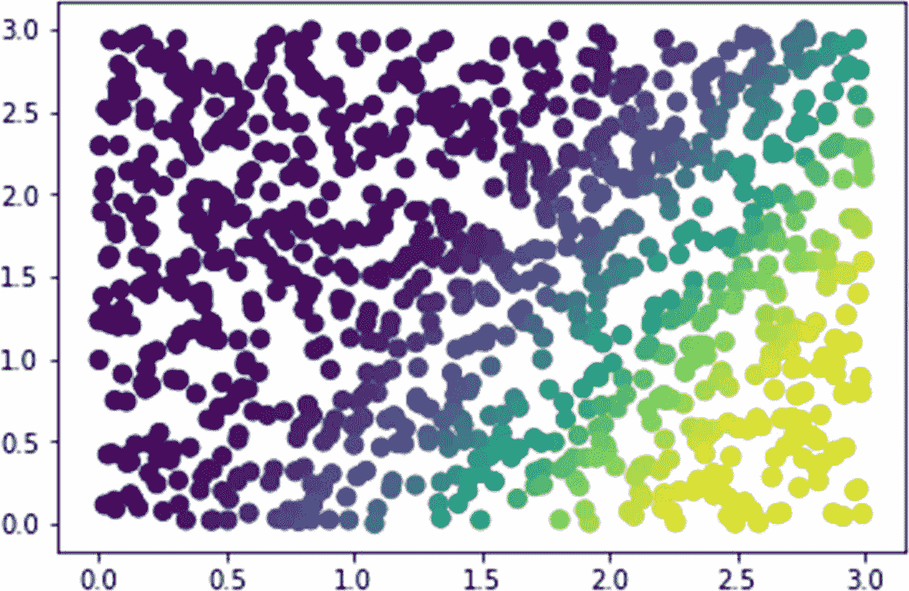

图 9-18

一张有所有实验点和它们所属类别的估计值的图表

如你所见，根据阴影，飞机上划分了两个分类区域，绿色周围的部分表示不确定区域。

通过决定基于概率来建立点是否属于一个或另一个类，分类结果可以变得更容易理解和更清楚。如果一个点属于一个类的概率大于 0.5，那么它将属于这个类。

```py
In [9]: yc = np.round(result[:,1])
    ...: plt.scatter(test[:,0],test[:,1],c=yc, s=50, alpha=1)
    ...: plt.show()
    ...:

```

你会得到一个图表，如图 [9-19](#Fig19) 所示。

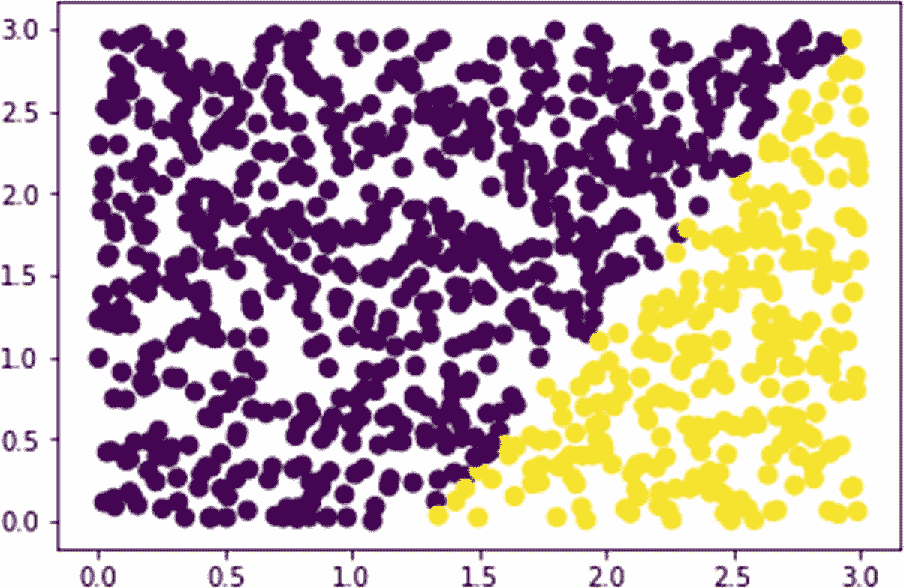

图 9-19

这些点界定了对应于两个所属类别的两个区域

在图 [9-19](#Fig19) 所示的图表中，你可以清楚地看到笛卡尔平面的两个区域，它们表征了两类归属。

## 结论

在本章中，您学习了机器学习的一个分支，它使用神经网络作为计算结构，称为深度学习。你阅读了深度学习基本概念的概述，它涉及神经网络及其结构。最后，感谢 TensorFlow 库，您实现了不同类型的神经网络，如单层感知器和多层感知器。

深度学习及其所有技术和算法是一个非常复杂的主题，实际上不可能在一章中正确地处理它。然而，你现在已经熟悉了深度学习，可以开始实现更复杂的神经网络。**