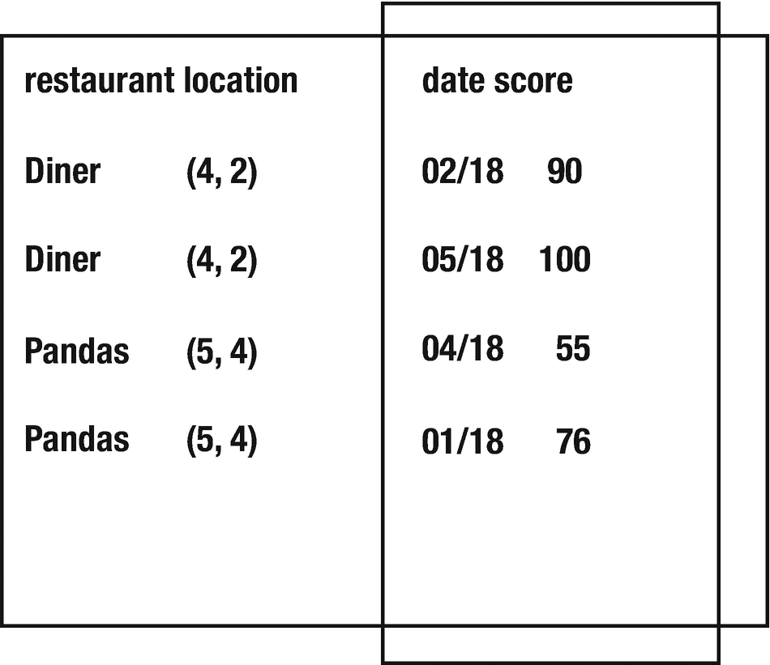

# 一、简介

我们生活在一个充满数据的世界。事实上，有如此多的数据，几乎不可能完全理解。我们比以往任何时候都更加依赖计算机来帮助我们理解这些海量信息。无论是通过搜索引擎的数据发现，通过图形用户界面的呈现，还是通过算法的聚合，我们都使用软件以对我们有意义的方式处理、提取和呈现数据。pandas 已经成为越来越受欢迎的处理大数据集的软件包。无论是分析大量数据，呈现数据，还是将其规范化并重新存储数据，pandas 都具有支持大数据需求的广泛功能。虽然 pandas 不是可用的最具性能的选项，但它是用 Python 编写的，因此对于初学者来说很容易学习，编写起来很快，并且具有丰富的 API。

## 关于 Pandas

pandas 是使用 Python 处理大数据集的首选包。它是为处理一般小于或大约 1 GB 的数据集而设计的，但实际上这个限制会根据运行它的设备的内存限制而变化。一个好的经验法则是，设备上的内存至少是数据集的五到十倍。一旦数据集开始超过一位数的千兆字节范围，通常建议使用不同的库，如 Vaex。

Pandas 这个名字来自于面板数据这个术语，指的是表格数据。这个想法是你可以用一个更大的数据面板来制作面板，如图 [1-1](#Fig1) 所示。

图 1-1

固定样本数据

当 pandas 第一次实现时，它与 NumPy 紧密耦合，NumPy 是一个流行的用于科学计算的 Python 包，提供了一个 n 维数组对象来执行高效的矩阵数学运算。今天使用 pandas 的现代实现，您仍然可以在非数字(NaN)类型及其 API(如 dtype 参数)的阐述中看到其紧密耦合的证据。

pandas 从一开始就是一个真正的开源项目。Python 播客中的原作者 Wes McKinney。__init__ 承认，为了培养一个开源社区并鼓励贡献，pandas 可能与 NumPy Python 包联系得有点太紧密了，但回过头来看，他不会做任何不同的事情。NumPy 过去是，现在仍然是一个非常流行和强大的 Python 库，用于高效的数学运算。在 pandas 开始的时候，NumPy 是科学界的主要数据计算包，为了以现有用户和贡献者所熟悉的方式快速简单地实现 pandas，NumPy 包成为 pandas 数据框架的底层数据结构。NumPy 是建立在 C 扩展之上的，虽然它提供了一个 Python API，但是主要的计算几乎完全在 C 中进行，这就是它如此高效的原因。c 比 Python 快得多，因为它是一种低级语言，因此不像 Python 那样消耗内存和 CPU 开销来提供所有高级细节，如内存管理。即使在今天，开发人员仍然严重依赖 NumPy，并且经常在他们的 pandas 程序中专门执行基于 NumPy 的操作。

对于普通开发人员来说，Python 和 C 之间的性能差异通常并不显著。在大多数情况下，Python 通常足够快，Python 的高级语言品质(内置内存管理和类似语法的伪代码，仅举几个例子)通常比自己管理内存的麻烦更重要。然而，当操作具有数千行的大型数据集时，这些细微的性能差异会合成一个更显著的差异。对于普通开发人员来说，这看起来绝对不可思议，但对于科学研究社区来说，花几天时间等待大数据计算运行并不罕见。有时计算确实需要这么长时间；然而，其他时候程序只是以低效的方式编写。在 pandas 中有许多不同的方法来做同样的事情，这使它变得灵活和强大，但也意味着它会导致开发人员走上效率较低的实现道路，从而导致非常慢的数据处理。

作为开发人员，我们生活在一个计算资源被视为廉价的时代。如果一个程序是 CPU 密集型的，那么对我们来说，简单地将我们的 AWS 实例升级到一个更大的机器上并支付额外的几块钱比投入我们的时间来从根本上解决我们的程序和解决 CPU 的超负荷更容易。虽然拥有如此现成的计算资源是件好事，但这也让我们成为懒惰的开发人员。我们经常忘记，50 年前，计算机占据了整个房间，只需几秒钟就能将两个数字相加。许多程序只是足够快，并且仍然满足性能要求，即使它们不是以最佳方式编写的。与简单的 web 服务相比，用于大数据处理的计算资源占用了大量能源；它们需要大量的内存和 CPU，通常需要大型机器在资源限制下运行数小时。这些程序加重了硬件的负担，可能会导致更快的老化，并且需要大量的能量来保持机器的冷却和计算的运行。作为开发人员，我们有责任编写高效的程序，不仅因为它们更快、成本更低，还因为它们将减少计算资源，这意味着更少的电力、更少的硬件，以及总体上更高的可持续性。

这本书在接下来的章节中的目标是帮助开发者实现高性能的 Pandas 程序，并帮助他们发展选择有效的数据处理技术的直觉。在我们深入研究 pandas 所基于的底层数据结构之前，让我们看看一些现有的有影响力的项目是如何利用 pandas 的。

## Pandas 如何帮助建立黑洞的图像

pandas 用于标准化从几个大型望远镜收集的所有数据，以构建黑洞的第一张图像。由于黑洞如此遥远，它需要一个像地球一样大的望远镜来直接捕捉黑洞的图像，因此，科学家们想出了一种方法，使用我们今天拥有的最大的望远镜来拼凑一个黑洞。在这项国际合作中，地球上最大的望远镜被用作捕捉黑洞图像所需的更大理论望远镜的代表性单镜。由于地球在转动，每个望远镜可以充当不止一面镜子，占据理论上更大的望远镜图像的很大一部分。图 [1-2](#Fig2) 展示了这种技术。这些更大的理论图像片段然后通过几个不同的图像预测算法，这些算法被训练来识别不同类型的图像。想法是，如果这些不同的图像再现技术中的每一种都输出相同的图像，那么他们可以确信黑洞的图像是真实的图像(或者相当接近)。

图 1-2

用地球上的望远镜来代表一个更大的理论望远镜

该库是开源的，发布在 GitHub 上。射电望远镜拍摄的图像被保存在硬盘上，并穿越世界传到麻省理工学院的一个实验室，在那里它们被装入 Pandas 体内。然后对数据进行归一化处理，及时同步望远镜捕捉到的数据，消除来自地球大气层的干扰等因素，并计算单个望远镜随时间推移的绝对相位。这些数据随后被发送到不同的图像预测算法中，最终第一张黑洞图像诞生了。2[2](#Fn2)T7】

## Pandas 如何帮助金融机构对未来市场做出更明智的预测

财务顾问总是在寻找竞争优势。许多金融机构使用 Pandas 和机器学习库来确定新的数据点是否有助于金融顾问做出更好的投资决策。新的数据集通常被加载到 pandas 中，进行标准化，然后根据历史市场数据进行评估，以查看数据是否与市场趋势相关。如果是这样的话，这些数据就会被传递给顾问，用于做出金融投资决策。它也可以传递给他们的客户，这样他们也可以做出更明智的决定。

金融机构也用 Pandas 来监控他们的系统。他们寻找可能影响其交易业绩的服务器停机或运行缓慢的情况。

## Pandas 如何帮助提高内容的可发现性

公司每天收集大量用户数据。对于广播公司的观众来说，数据对于显示相关广告和将正确的内容呈现给感兴趣的用户来说尤其重要。通常情况下，收集到的用户数据会被加载到 pandas 中，并对他们观看的内容进行收视模式分析。他们可能会寻找一些模式，如他们何时观看某些内容，他们观看什么内容，以及他们何时结束观看某些内容并寻找新的内容。然后，基于这些模式推荐新的内容或相关产品广告。最近有很多工作也在改进商业模式，以便用户不会陷入泡沫(即，推荐的内容不仅仅是他们之前一直在观看的相同类型的内容或呈现相同的观点)。这通常是通过避免业务方面的内容孤岛来实现的。

现在我们已经看了 pandas 的一些有趣的用例，在第 [2](2.html) 章中，我们将看看如何使用 pandas 来访问和合并数据。

<aside aria-label="Footnotes" class="FootnoteSection" epub:type="footnotes">Footnotes [1](#Fn1_source)

[T2`https://github.com/achael/eht-imaging`](https://github.com/achael/eht-imaging)

  [2](#Fn2_source)

[https:// solarsystem。美国宇航局。gov/ resources/ 2319/第一张黑洞图像/](https://solarsystem.nasa.gov/resources/2319/first-image-of-a-black-hole/)

 </aside>