# 二、PySpark 基础

本章将帮助你理解 PySpark 的基本操作。建议您设置 PySpark 环境，并在您选择的任何数据集上尝试以下操作，以增强理解。由于 Spark 本身是一个非常大的主题，我们将为您提供足够的内容，让您在进入数据争论活动之前开始了解 PySpark 基础知识和概念。本章将展示您在日常工作中可能会遇到的 PySpark 中最常见的数据操作。

在本章中，我们将讨论以下主题:

*   PySpark 的背景

*   PySpark 弹性分布式数据集(RDD)和数据框架

*   数据操作

## PySpark 背景

在跳到 PySpark 之前，我们先来了解一下什么是 Spark，它的优点是什么。Spark 是处理大量数据的引擎。它是用 Scala 编写的，运行在 Java 虚拟机上。图 [2-1](#Fig1) 详细展示了 Apache Spark 生态系统。

Spark 内核是该平台的底层通用执行引擎。Spark 内置了 SQL、流、机器学习和 GraphX(图形处理)的组件。

*   Spark SQL 最适合处理结构化数据。它使您能够用现有数据以高达 100 倍的速度运行 hive 查询。

*   **流**支持非传统的实时数据集。它支持对流数据的交互和分析操作，并与流行的数据源很好地集成，包括 HDFS、Flume、Kafka 和 Twitter。

*   **机器学习**是一个基于 spark 构建的可扩展库，支持针对特定用例运行不同的算法。它拥有大多数广泛使用的现成算法。

*   **GraphX** 是一个构建在 Spark 之上的图形计算引擎，使您能够交互式地构建、转换和推理大规模的图形结构数据。

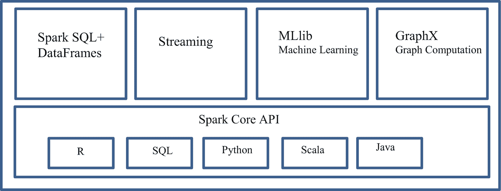

图 2-1

Spark 生态系统概述

速度是火花的同义词，也是其最近受欢迎的关键驱动因素之一。Spark 的核心通过并行处理和内存计算来实现这一点。Spark 是如何实现这种并行处理的？嗯，答案是 Scala，Spark 的母语。Scala 是基于函数的，非常适合并行处理。对于大型数据集的数据转换，它的易用性使其成为首选工具。Spark 还拥有丰富的库，包括对机器学习、SQL 和流的支持，使其成为在统一环境中驯服大数据的最通用工具之一。

现在，让我们后退一步，看看 Spark 是如何在集群上运行来实现并行处理的。Spark 的基础来自 MapReduce。MapReduce 是处理大型数据集的流行框架。它包括两个主要阶段。映射阶段是将所有任务分配给不同计算机的阶段。Reduce 阶段是对所有键进行逻辑混洗并进一步简化以计算有意义的聚合或进行数据转换的阶段。图 [2-2](#Fig2) 说明了 Spark 在集群模式下的工作。

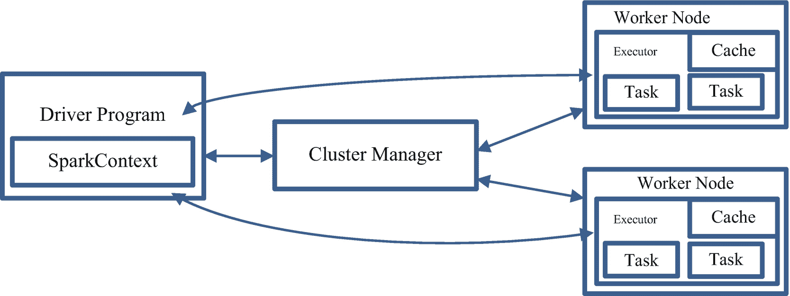

图 2-2

火花簇模式概述

当 Spark 被启动时，一个独立的流程被启动，并由 SparkContext 或 Spark Session 进行协调，如图的左侧所示。集群管理器将工作分配给工人。两个工人如图 [2-2](#Fig2) 所示。实际上，可能有 *n* 个工人。该任务对数据集执行一个工作单元，并输出新的分区数据集。当对数据执行多个操作时，它们受益于内存中的计算，这种计算是通过跨这些操作缓存数据来实现的。根据操作的类型，聚合结果要么被发送回驱动程序，要么可以保存到磁盘上。

有向无环图(DAG)是我们向 Spark 控制台提交任何代码时生成的操作符图。当动作被触发(聚合或数据保存)时，Spark 将图形提交给 DAG 调度器。然后，调度程序将操作符图分成几个阶段。每个步骤可以包含几个数据分区，DAG 调度器将所有这些单独的操作符图捆绑在一起。工人的任务就是在执行器上执行这些任务。

在跳到 rdd 和数据帧之前，让我们回顾一下 Spark 的一些概念和属性。你可能会在书中的不同章节碰到这些术语。

*   **不可变:**顾名思义，不可变的东西，可以认为是一个数据单元，经过一次变换后，就不能被逆转。这对于实现计算的一致性非常重要，尤其是在并行计算环境中。

*   **容错:**在数据转换过程中，如果工作者失败，可以通过在沿袭中的分区上重放转换来恢复数据，以实现相同的计算。这消除了跨多个节点的数据复制。

*   **惰性评估:**Spark 中的所有转换都是惰性的，这意味着计算不会马上完成。相反，Spark 会记住所有的转换逻辑，只有在调用一个动作时才会进行计算。操作可以是向驱动程序返回结果，也可以是保存数据集。

*   类型安全:这表明编译器知道预期的列及其数据类型。

*   **数据序列化:**这是一种将数据结构翻译成特定格式的方法，以有效地管理源和目的地。默认情况下，Apache Spark 使用 Java 序列化。

*   **数据局部性** **:** 通过将执行代码放在被处理数据附近来优化处理任务。

*   **谓词下推:**这种技术允许 Spark 只处理使用过滤条件所需的数据。只访问所需的文件和分区，从而减少了磁盘 I/O。

*   **累加器:**这些是分配给执行者的全局变量，可以通过关联和交换属性添加。

*   **Catalyst Optimizer:** 这是一个用于实现 Spark SQL 的可扩展优化器，支持基于规则和基于成本的优化。

所以现在你可能想知道 PySpark 在这个生态系统中的位置。PySpark 可以被视为 Scala API 之上的一个基于 Python 的包装器。PySpark 通过 Py4J 库与 Spark 基于 Scala 的 API 通信。这个库允许 Python 与 Java 虚拟机代码进行交互。在下一节中，我们将通过 rdd 和 DataFrames 来研究在 PySpark 中与数据交互的方法。我们将更多地关注数据框架，在下一节中，您将更深入地了解我们为什么做出这样的决定。

## PySpark 弹性分布式数据集(rdd)和数据帧

一个 *RDD* 是一个不可变的分布式数据元素集合。它跨集群中的节点进行分区，集群可以通过并行处理与低级 API 进行交互。rdd 在处理结构化、半结构化和非结构化数据方面非常灵活。它们最适合半结构化和非结构化数据。它们可以用来轻松地访问这些数据元素，并控制任何低级转换。rdd 是 Spark 核心库的一部分，它们的任何操作都只需要 Spark 上下文。

rdd 确实带来了相当大的挑战。对于 rdd 来说，数据帧没有优化和性能提升。如果您正在处理结构化数据，那么应该始终使用数据帧。只要可以定义模式，就可以随时将 RDD 更改为数据框架。

数据集是一个分布式的数据集合。它既有 RDDs(强类型、使用强大 lambda 函数的能力)的优点，又有 Spark SQL 的优化执行引擎的优点。数据集可以由 JVM 对象构建，然后使用函数转换(map、flatMap、filter 等)进行操作。).数据集 API 只在 Scala 和 Java 中可用。Python 不支持数据集 API。但是由于 Python 的动态特性，Dataset API 的许多好处已经可以利用了(也就是说，您可以通过名称自然地访问行的字段:`row.columnName`)。R 的情况类似。

*数据帧*是按列排序的数据集。它以列和行的格式保存数据，就像表格一样。您可以将列视为变量，将行视为关联的数据点。它在概念上相当于关系数据库中的一个表或 R/Python 中的一个数据框，但是在底层有更丰富的优化。数据帧可以从各种来源构建，例如结构化数据文件、Hive 中的表、外部数据库或现有的 rdd。DataFrame API 有 Scala、Java、Python 和 r 四种版本，编程 DataFrame 需要 SQLContext，因为它们位于 Spark 生态系统的 SparkSQL 区域。如果需要，您可以随时将数据帧转换为 RDD。

表 [2-1](#Tab1) 概括了 rdd、数据帧和数据集之间的区别。记住:我们将使用数据框架作为与书中数据交互的主要方式。

表 2-1

Spark 中 RDD、数据框和数据集的要素

<colgroup><col class="tcol1 align-left"> <col class="tcol2 align-left"> <col class="tcol3 align-left"> <col class="tcol4 align-left"></colgroup> 
| 

特征

 | 

放射性散布装置

 | 

数据帧

 | 

资料组

 |
| --- | --- | --- | --- |
| 不变的 | 是 | 是 | 是 |
| 容错 | 是 | 是 | 是 |
| 类型安全 | 是 | 不 | 是 |
| 计划 | 不 | 是 | 是 |
| 优化引擎 | 钠 | 催化剂 | 催化剂 |
| 执行优化 | 不 | 是 | 是 |
| API 级别操作 | 低能级 | 高电平 | 高电平 |
| 语言支持 | Java，Scala，Python，R | Java，Scala，Python，R | Java，Scala |

Spark SQL `DataType`类是所有数据类型的基类，它们主要用于所有数据帧(表 [2-2](#Tab2) )。

表 2-2

数据类型

<colgroup><col class="tcol1 align-left"> <col class="tcol2 align-left"></colgroup> 
| 

数据类型

 | 

粗分类法

 |
| --- | --- |
| 布尔类型 | 原子类型:它是一种内部类型，用于表示非空的一切，数组、结构和映射 |
| 二元类型 |
| datatype(日期类型) |
| StringType |
| TimestampType |
| ArrayType | 非原子类型 |
| 字体渲染 |
| 结构类型 |
| CalendarIntervalType |
| 数字类型 |
| 排序方式 |
| 整合类型 |
| LongType(长型) |
| 浮动型 |
| DoubleType(双精度型) |
| 十进制 |
| 字节类型 |
| HiveStringType |
| 对象类型 |
| NullType |

在前一章中，我们介绍了安装和使用 Spark 的不同方法。现在，让我们进入有趣的部分，看看如何执行数据操作。出于本书的目的，我们将使用在单台机器上运行的 PySpark 的 Docker 版本。如果您在分布式系统上安装了 PySpark 版本，我们鼓励您使用它来释放并行计算的力量。在单机上运行操作和在集群上运行操作在编程或命令上没有任何区别。请记住，如果您使用单台机器，您将会在处理速度上有所损失。

为了演示数据操作，我们将使用来自视频数据库(TMDB: [`https://www.themoviedb.org/`](https://www.themoviedb.org/) )的数据集。TMDB 是一个社区建立的电影和电视数据库。我们使用 API 提取他们的数据样本。该数据包含了在国际上发行的 44，000 部电影的信息。我们在数据集中有来自表 [2-3](#Tab3) 的信息。该数据集采用 csv 格式，由流水线分隔。该数据集将在本章的 GitHub 页面中共享。

表 2-3

[计]元数据

<colgroup><col class="tcol1 align-left"> <col class="tcol2 align-left"></colgroup> 
| 

可变的

 | 

描述

 |
| --- | --- |
| 属于集合 | 指示电影是否属于集合；如果存在，则指定集合 |
| 预算 | 电影的预算 |
| 编号 | 电影的唯一标识符 |
| 原创 _ 语言 | 电影制作的原始语言 |
| 原创 _ 标题 | 电影名称 |
| 概观 | 电影概要 |
| 流行 | 电影的流行指数 |
| 生产公司 | 制作这部电影的公司名单 |
| 生产 _ 国家 | 电影制作的国家 |
| 发布日期 | 电影上映日期 |
| 税收 | 电影收藏，缺失由 0 表示 |
| 运行时间 | 电影运行时间(分钟) |
| 状态 | 指示电影是否已发行 |
| 品牌理念;标签行 | 电影标语 |
| 标题 | 电影别名英文片名 |
| 投票 _ 平均 | 观众的平均投票率 |

## 数据操作

我们将在本章末尾演示数据操作时使用这些数据。

使用上一章中演示的任何方法建立到 Spark 的连接后，启动 PySpark 会话，这可以使用以下代码完成:

```py
from pyspark.sql import SparkSession
spark=SparkSession.builder.appName("Data_Wrangling").getOrCreate()

```

Note

前面的步骤对于任何 PySpark 程序都是通用的。

正如我们从图 [2-1](#Fig1) 中回忆的那样，`SparkSession`是入口点，将您的 PySpark 代码连接到 Spark 集群。默认情况下，所有用于执行代码的已配置节点都处于集群模式设置中。

现在，让我们来读第一个数据集。我们正在使用一个数据集，该数据集位于我们暴露给`Docker`会话的路径中的本地机器上。出于演示目的，我们使用 Docker 方法。Spark 运行在 Java 8/11、Scala 2.12、Python 2.7+/3.4+和 R 3.1+上。在 8u92 版之前的 Java 8 中，从 Spark 3.0.0 开始不再支持该功能。对于 3.6 版之前的 Python 2 和 Python 3，从 Spark 3.0.0 开始，不再支持该功能。对于 3.4 版之前的 R，从 Spark 3.0.0 开始不再支持。如果您使用本地版本，请确保您拥有 Spark 兼容性的正确 Java 版本。与 Python 一样，所有 PySpark 数据帧变量都区分大小写。

### 从文件中读取数据

```py
# This is the location where the data file resides

file_location = "movie_data_part1.csv"

# Type of file, PySpark also can read other formats such as json, parquet, orc
file_type = "csv"

# As the name suggests, it can read the underlying existing schema if exists
infer_schema = "False"

#You can toggle this option to True or False depending on whether you have header in your file or not
first_row_is_header = "True"

# This is the delimiter that is in your data file
delimiter = "|"

# Bringing all the options together to read the csv file

df = spark.read.format(file_type) \
.option("inferSchema", infer_schema) \
.option("header", first_row_is_header) \
.option("sep", delimiter) \
.load(file_location)

```

如果您的数据集不是平面文件格式，而是以 hive 表的形式存在，您可以通过如下所示的一个命令轻松地读取它。

### 从配置单元表中读取数据

使用以下代码从配置单元表中读取数据:

```py
df = spark.sql("select * from database.table_name")

```

Note

Spark 只在读取数据源时映射关系，不会将任何数据带入内存。

执行前面的命令将使 Spark 能够访问您的数据，您将体验到 PySpark 的魔力。

一旦我们成功地从源中读取了数据，第一个问题就是，我如何知道元数据信息？读取元数据的一种简便方法是通过一个简单的命令。

### 读取元数据

输出如图 [2-3](#Fig3) 所示。我们可以使用此函数快速识别变量及其数据类型:

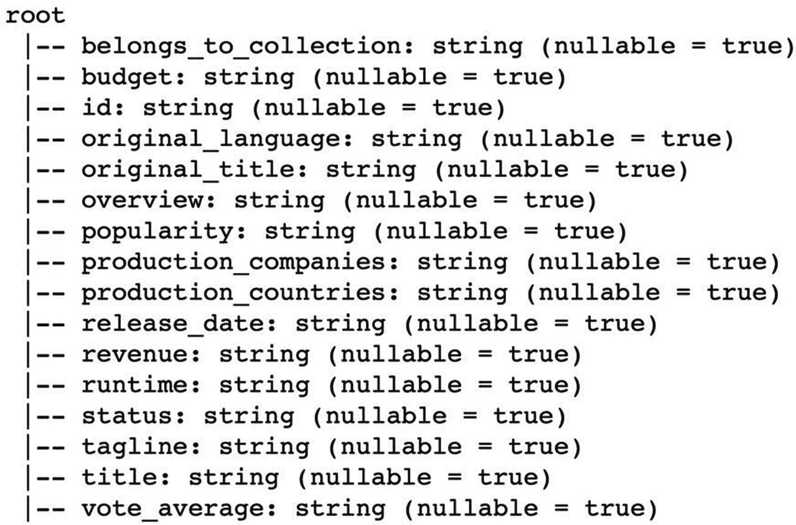

图 2-3

printschema 的输出

```py
df.printSchema()

```

有多种方法可以实现上述输出。也可以通过使用 Python 列表格式的以下命令提取相同的信息，这对于进一步的数据操作更为理想:

```py
df.dtypes

```

您还可以使用`df.columns`来列出没有数据类型信息的列。

### 清点记录

可以对数据集执行的另一个快速检查是观察记录总数。这可以通过以下命令完成:

```py
df.count()

Output:
43998

```

您可以将其封装在 Python 中的`print`函数中，以获得更具描述性的输出，如下所示:

```py
print('The total number of records in the movie dataset is '+str(df.count()))

Output:
The total number of records in the movie dataset is 43998

```

我们从这个数据集以前的经验中知道，一些列是字典，它们的原始形式没有用，一些变量包含描述性信息。让我们选择一些我们选择的随机变量，看看它们看起来怎么样。

### 子集列和查看数据的一瞥

同样，有多种方法可以实现相同的输出(图 [2-4](#Fig4) ):

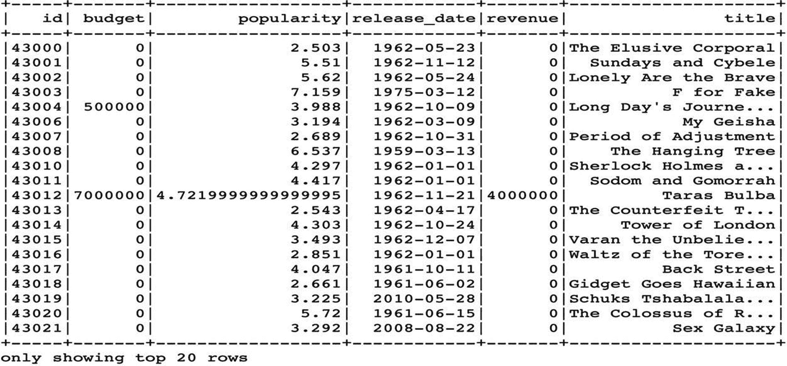

图 2-4

df.show()的输出

```py
# Defining a list to subset the required columns
select_columns=['id','budget','popularity','release_date','revenue','title']

# Subsetting the required columns from the DataFrame
df=df.select(*select_columns)

# The following command displays the data; by default it shows top 20 rows
df.show()

```

所有操作都在一条语句中完成，如下所示:

```py
df.select('id','budget','popularity','release_date','revenue','title').show()

```

您还可以选择按索引选择列，而不是从原始数据帧中选择名称:

```py
df.select(df[2],df[1],df[6],df[9],df[10],df[14]).show()

```

如果您已经使用第一种方法进行子集化，则在使用上述选项时要小心。它可能会抛出一个超出范围的*指标*错误。这是因为新的数据框架将只包含列的子集。您也可以使用下面的语句将显示在`show`选项中的行数更改为所需的数量。在这个例子中，我们将数字设置为 25，但是它可以被更改为任意的 *n* 。

```py
df.show(25,False)

```

Note

使用`False`不仅可以覆盖 20 行的默认设置，还可以显示截断的内容(如果有的话)。

### 缺少值

您可以使用 PySpark 中的内置函数计算单个列或多个列中的缺失值，如下所示:

```py
from pyspark.sql.functions import *
df.filter((df['popularity']=='')|df['popularity'].isNull()|isnan(df['popularity'])).count()

```

输出:

```py
215

```

让我们分解前面的命令，看看发生了什么。首先，我们在数据帧上使用`filter`函数，并基于一个`OR`条件传递多个条件，在表达式中用“`|`表示。在第一个条件中，我们搜索出现在 *popularity* 列中的空字符串。在第二个条件中，我们使用`.isNull()`操作符，当 popularity 为 null 时返回 truenull 表示没有值或什么都没有。在第三个条件中，我们使用`isnan`来标识 NaN(不是一个数字)。这些通常是未定义的数学运算的结果。

如果需要计算数据帧中所有缺失的值，可以使用以下命令:

```py
df.select([count(when((col(c)=='') | col(c).isNull() |isnan(c), c)).alias(c) for c in df.columns]).show()

```

该命令选择所有列，并在循环中运行前面的缺失检查。然后在这里使用`when`条件对满足缺失值标准的行进行子集划分(图 [2-5](#Fig5) )。


图 2-5

数据帧所有列中缺失值的输出

Note

确保导入`pyspark.sql`。函数，然后再运行任何排序操作。

### 单向频率

好的，让我们看看如何计算分类变量的频率(图 [2-6](#Fig6) )。术语警告:分类变量是数据集中存在的任何字符串变量。让我们使用下面的代码来验证数据集中是否有重复的标题:


图 2-6

单向频率输出

```py
df.groupBy(df['title']).count().show()

```

前面的命令将给出标题在数据集中出现的次数。通常，我们希望看到排序后的数据，因此我们会使用以下内容(图 [2-7](#Fig7) ):

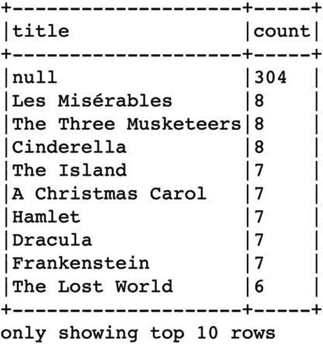

图 2-7

单向频率排序输出

```py
df.groupby(df['title']).count().sort(desc("count")).show(10, False)

```

Note

`groupby`是`groupBy`的别名；这两种方案都可行。

有不少标题是重复的。看起来缺少标题是最常见的问题。真实世界的数据可能会很混乱。这很好，但我们可能希望通过消除任何丢失的值并添加一个额外的过滤器来限制它只出现四次以上的标题，从而对结果进行微调。

### 排序和过滤单向频率

让我们首先过滤不为空的值。我们使用了不等于号(！=和~)来创建一个临时数据集，这样做是为了演示`not`条件的使用。

```py
# Subsetting and creating a temporary DataFrame to eliminate any missing values

df_temp=df.filter((df['title']!='')&(df['title'].isNotNull()) & (~isnan(df['title'])))

# Subsetting the DataFrame to titles that are repeated more than four times

df_temp.groupby(df_temp['title']).count().filter("`count` >4").sort(col("count").desc()).show(10,False)

```

如果不指定`the desc`函数，默认情况下结果会按升序排序(图 [2-8](#Fig8) )。


图 2-8

单向频率的过滤和排序版本的输出

```py
# The following command is to find the number of titles that are repeated four times or more

df_temp.groupby(df_temp['title']).count().filter("`count` >=4").sort(col("count").desc()).count()

```

输出:

```py
43

# The following command is to delete any temporary DataFrames that we created in the process

del df_temp

```

在前面的命令中，您可能已经观察到有多种方法可以达到相同的结果。随着你对这门语言的熟练掌握，你可能会发展出自己的偏好。

### 铸造变量

正如您从元数据中观察到的，所有变量都被表示为字符串。观察数据后，我们知道其中一些字段是整数、浮点数或日期对象。如果没有正确识别数据类型，某些操作可能会导致误导性的结果。我们强烈建议您尽职地为您的任何分析确定正确的数据类型。现在，我们将了解如何将这些变量转换为正确的数据类型。

如果在识别数据类型时不小心，可能会在转换时丢失数据。例如，如果将字符串列转换为数字列，则结果列可能全部为空。用演示数据集中的列*标语*尝试一下，观察结果。在应用任何转换之前浏览数据集是一种很好的做法。手册数据中的一些错别字(例如，12.1 而不是 12.1)也可能导致意外结果。

让我们先在转换前打印数据类型，将预算变量转换为浮点型，并观察变化(图 [2-9](#Fig9) 和 [2-10](#Fig10) )。


图 2-9

转换前的数据类型

```py
#Before Casting
df.dtypes

```

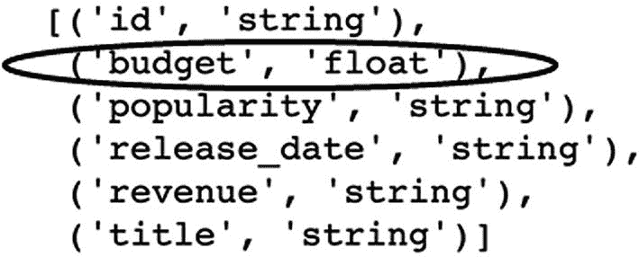

图 2-10

转换后的数据类型

```py
#Casting
df = df.withColumn('budget',df['budget'].cast("float"))

#After Casting
df.dtypes

```

使用`cast`功能。还要注意我们使用了额外的函数`.withColumn`。这是 PySpark 中最常用的函数之一。它用于更新值、重命名和转换数据类型，以及创建新列(图 [2-11](#Fig11) 和 [2-12](#Fig12) )。沿着这条路走下去，你会对它的用途有更好的理解。您可能想知道如何将该函数扩展到多列。如果您已经知道您的数据类型，您可以使用已识别变量的列表并在循环中迭代它们。

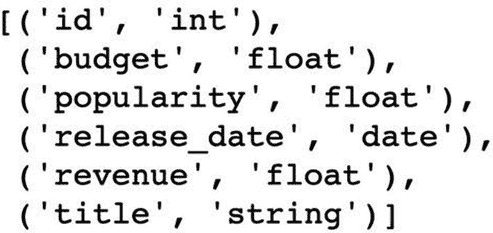

图 2-11

转换后所有变量的数据类型

```py
#Importing necessary libraries
from pyspark.sql.types import *

#Identifying and assigning lists of variables
int_vars=['id']
float_vars=['budget', 'popularity', 'revenue']
date_vars=['release_date']

#Converting integer variables
for column in int_vars:
     df=df.withColumn(column,df[column].cast(IntegerType()))
for column in float_vars:
     df=df.withColumn(column,df[column].cast(FloatType()))
for column in date_vars:
     df=df.withColumn(column,df[column].cast(DateType()))

df.dtypes

```


图 2-12

更改数据类型后的数据一览

```py
df.show(10,False)

```

在前面的输出中，如果您仔细观察的话，就会发现,*预算*和*收入*列的值显示为“. 0”时有明显的不同，这表示数据类型。您可以对比图 [2-4](#Fig4) 和图 [2-12](#Fig12) 来观察铸造前后的这些差异。

### 描述统计学

要分析任何数据，您应该对数据的类型、分布和离散度有敏锐的理解。Spark 有一套很好的内置函数，可以更容易地快速计算这些字段。Spark 中的`describe`函数非常方便，因为它给出了每一列的非缺失值总数、平均值、标准偏差、最小值和最大值(图 [2-13](#Fig13) )。您可以转换此数据帧的输出，并在以后的缺失值插补中使用它。我们将在模型构建部分对此进行更深入的讨论。

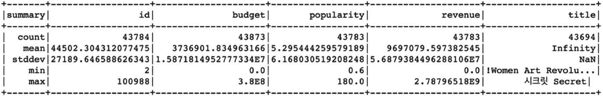

图 2-13

描述功能输出

```py
df.describe()

```

*均值*这里介绍的是算术平均值，是一组离散观察值的中心值。对于许多操作来说，平均值是一个很好的估计值，但是容易受到异常值的影响。异常值会对平均值产生不良影响。*中位数*是一个更好的估计，因为它不受离群值的影响，但计算起来很昂贵。火花也是一样。因为排序的原因，这个操作开销很大。为了使这种计算更快，Spark 实现了一种带有一些速度优化的 Greenwald-Khanna 算法的变体。用于计算中值的函数是`approxQuantile`。

三个参数必须通过`approxQuantile`函数传递，如下所示:

*   col–数字列的名称

*   概率——分位数概率列表。每个数字必须属于[0，1]。例如，0 是最小值，0.5 是中值，1 是最大值。

*   relative error–要达到的相对目标精度(> = 0)。如果设置为 0，则计算精确的分位数，这可能非常昂贵。请注意，接受大于 1 的值，但结果与 1 相同。

让我们尝试计算*预算*列的中间值。

```py
#Since unknown values in budget are marked to be 0, let’s filter out those values before calculating the median

df_temp = df.filter((df['budget']!=0)&(df['budget'].isNotNull()) & (~isnan(df['budget'])))

#Here the second parameter indicates the median value, which is 0.5; you can also try adjusting the value to calculate other percentiles

median=df.approxQuantile('budget',[0.5],0.1)

#Printing the Value
print ('The median of budget is '+str(median))

```

输出:

```py
The median of budget is [7000000.0]

```

如果您想一次计算多个列的中值，您只需要将第一个参数更改为`list`。

### 唯一/独特的值和计数

有时您可能只想知道一个变量中的级数(基数)。您可以使用 Spark 中的`countDistinct`功能来完成此操作(图 [2-14](#Fig14) )。

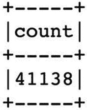

图 2-14

不同标题计数输出

```py
# Counts the distinct occurances of titles
df.agg(countDistinct(col("title")).alias("count")).show()

```

或者，您也可以使用`distinct`功能查看不同的事件(图 [2-15](#Fig15) )。


图 2-15

不同标题输出

```py
# Counts the distinct occurances of titles
df.select('title').distinct().show(10,False)

```

直觉上，您可能还想按年份查看不同的标题。所以，我们先从发布日期中提取年份。

```py
# Extracting year from the release date
df_temp=df.withColumn('release_year',year('release_date'))

```

如果需要，您应该能够使用类似的函数从日期变量中提取月和日。以下两个命令是出于演示目的而显示的，并不是我们想要的输出所必需的。第三个命令获取不同年份的计数(图 [2-16](#Fig16) )。

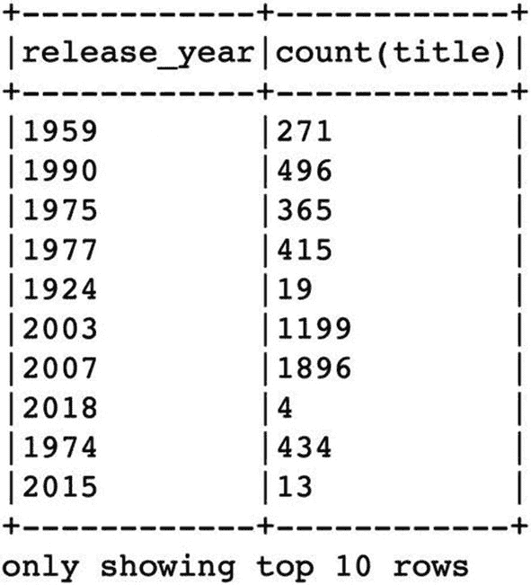

图 2-16

不同的标题按年份计数

```py
# Extracting month
df_temp=df_temp.withColumn('release_month',month('release_date'))

# Extracting day of month
df_temp=df_temp.withColumn('release_day',dayofmonth('release_date'))

# Calculating the distinct counts by the year
df_temp.groupBy("release_year").agg(countDistinct("title")).show(10,False)

```

同样，您应该能够使用我们在排序一节中讨论的函数按照降序或升序对输出进行排序。

### 过滤

Spark 提供了多种过滤数据的方法。事实上，我们甚至在进入本节之前就遇到了`filter`函数。它展示了这个功能在基本操作中的重要性。还可能遇到`where`函数进行过滤。这两种功能的工作方式相同。然而，`filter`是这种函数的标准 Scala 名称，`where`是为喜欢 SQL 的人准备的。

```py
.where() = .filter()

```

之前，我们在`filter`中遇到了包含`or`和`and`条件的条件。在本演示中，让我们尝试其他可用的方法来过滤数据。说我要过滤掉所有以“遇见”开头的标题；我们应该如何对待它？如果您是 SQL 用户，您可以简单地通过使用一个`like`条件来完成，如下所示。PySpark 提供了可以用于此目的的正则表达式函数(图 [2-17](#Fig17) )。


图 2-17

使用“like”表达式过滤匹配项

```py
df.filter(df['title'].like('Meet%')).show(10,False)

```

现在，让我们找出*没有*以“s”结尾的标题(图 [2-18](#Fig18) )。

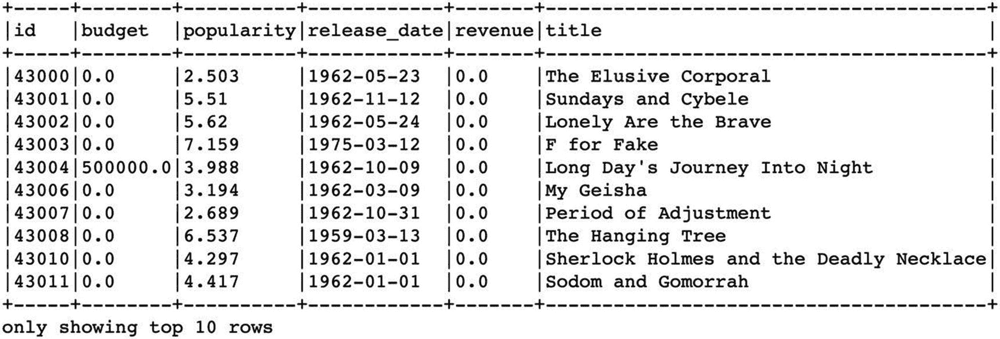

图 2-18

使用“like”表达式过滤不匹配项

```py
df.filter(~df['title'].like('%s')).show(10,False)

```

如果我们想找到任何包含“ove”的标题，我们可以使用`rlike`函数，这是一个正则表达式(regex 图 [2-19](#Fig19) 。

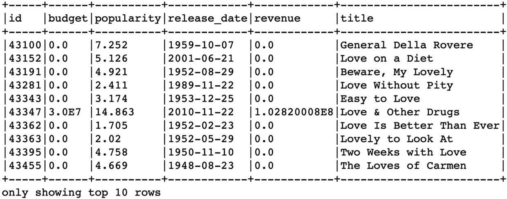

图 2-19

使用正则表达式过滤匹配项

```py
df.filter(df['title'].rlike('\w*ove')).show(10,False)

```

上述表达式也可以改写如下:

```py
df.filter(df.title.contains('ove')).show()

```

有些情况下，我们有成千上万的列，并希望通过特定的前缀或后缀来标识列或对列进行子集化。我们可以使用`colRegex`函数来实现这一点。首先，让我们确定以“re”开头的变量(图 [2-20](#Fig20) )。

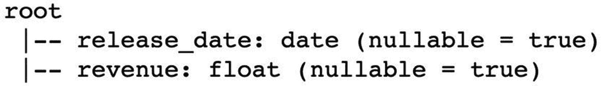

图 2-20

使用正则表达式按前缀筛选列

```py
df.select(df.colRegex("`re\w*`")).printSchema()

```

好的，那么我们如何识别以特定后缀结尾的变量呢？这里我们有三个以“e”结尾的变量；让我们看看是否可以通过调整我们之前的正则表达式来识别它们(图 [2-21](#Fig21) )。

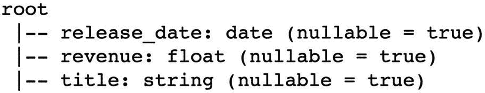

图 2-21

使用正则表达式按后缀筛选列

```py
df.select(df.colRegex("`\w*e`")).printSchema()

```

正则表达式可能会令人困惑，所以让我们简单回顾一下这个主题。一般来说，我们可以通过元字符来识别所有的字符和数字。Regex 使用这些元字符来匹配任何文字或字母数字表达式。下面是最常用的元字符的简短列表:

单个字符:

*   \ d–标识 0 到 9 之间的数字

*   \ w–标识从 0 到 9 的所有大小写字母和数字[A–Z A–Z 0–9]

*   \ s–空白

*   **。**–任何字符

我们还有一组量词来指导搜索多少个字符，如下所示:

量词:

*   *–0 个或更多字符

*   +–1 个或更多字符

*   ？–0 或 1 个字符

*   {最小，最大}-指定范围，范围之间的任何字符，包括最小，最大

*   { n }–正好是 *n* 个字符

如果你回头看看前面的两个表达式，你会发现我们使用了`\w,`来表示我们想要匹配所有的字母数字字符，忽略了大小写。在我们希望用“re”前缀标识变量的表达式中，`\w`后面跟了量词`*`，以表示我们希望包含“re”后面的所有字符

### 创建新列

创建新特征(列)在许多分析应用中起着关键作用。Spark 提供了多种创建新列的方法。最简单的方法是通过`withColumn`函数。假设我们要计算受欢迎程度的方差。方差是衡量数字与平均值相差多远的指标，用以下公式表示:

T2】

x<sub>I</sub>–个人观察

x-平均值

n——观察总数

因此，让我们首先使用下面的命令来计算平均值。这里使用的`agg`函数比使用`describe`更方便，当你寻找一个特定的统计数据时:

```py
mean_pop=df.agg({'popularity': 'mean'}).collect()[0]['avg(popularity)']
count_obs= df.count()

```

让我们将它添加到所有行中，因为我们需要这个值以及使用`withColumn`和`lit`函数的单个观察值。`lit function`是一种与列文字交互的方式。当您想要直接创建带有值的列时，这非常有用。

```py
df=df.withColumn('mean_popularity',lit(mean_pop))

```

对于所有行来说， *mean_popularity* 列具有相同的值。`The pow`函数在下面的命令中帮助你把数提高到一个幂。这里，我们需要对数字求平方，因此 2 作为参数被传递。

```py
df=df.withColumn('varaiance',pow((df['popularity']-df['mean_popularity']),2))

variance_sum=df.agg({'varaiance': 'sum'}).collect()[0]['sum(varaiance)']

```

前面的命令总结了所有行之间的所有差异。最后一步，我们将总和除以观察次数，得到结果。

```py
variance_population= variance_sum/(count_obs-1)

```

输出:

```py
37.85868805766277

```

尽管此差异计算涉及多个步骤，但其目的是让您了解创建新要素时可能涉及的操作。一旦有了方差值，就可以基于它创建自定义变量。

让我们退后一步。你可能会问，“如果我要创建多个变量，我如何一次完成所有的任务，并保持它们的良好结构？”接下来，我们将向您介绍解决方案。比方说，我想创建可以将预算和受欢迎程度变量分为高、中和低的变量。首先，让我们定义高、中、低阈值是基于什么。为了方便起见，使用了以下阈值:您可以根据更严格的分析将它们更改为值。

我们在下面这段代码中所做的就是定义一个简单的 Python 函数。我们将两个变量传递给函数，基于 threshold，我们决定返回新的变量，它们都是字符串。

```py
def new_cols(budget,popularity):
 if budget<10000000: budget_cat="Small"
 elif budget<100000000: budget_cat="Medium"
 else: budget_cat="Big"
 if popularity<3: ratings="Low"
 elif popularity<5: ratings="Mid"
 else: ratings="High"
 return budget_cat,ratings

```

现在，有趣的部分来了:我们现在使用用户定义的函数。那么，什么是用户自定义函数呢？如果你来自 Python 世界，这些与熊猫数据帧和系列的`.map()`和`.apply()methods`非常相似。简而言之，用户定义的函数允许我们使用数据帧中的行值作为输入，并可以将其映射到整个数据帧。这里一个重要的事实是，您必须指定输出数据类型。不幸的是，这是无法回避的。当您必须写出多列时，这可能会很痛苦。在此之后，我们将讨论另一种可以作为替代方案的方法。

在命令中，我们定义了我们的用户定义函数。注意，我们创建了`StructType`来保存新变量。我们还明确定义了将返回的数据类型。我们知道两种返回类型都是字符串，所以我们使用`StringType().` StructType 对象来定义 Spark 数据帧的模式。StructType 对象包含 StructField 对象的列表，这些对象为数据帧中的每一列定义名称、类型和可空标志。

StructType 对象对于消除代码中的任何顺序依赖非常有用。我们这样说是什么意思？嗯，如果在最后一步之前需要运行多个函数，可以将它们都放在`StructType`下，以便返回一个结果数组，而不是创建多个列。这对于阅读和管理涉及多个转换和操作的长代码库非常有用。对于这个例子，我们将把保存多个输出的`StructType`分割成单独的列，以便进一步访问。

```py
# Apply the user-defined function on the DataFrame
udfB=udf(new_cols,StructType([StructField("budget_cat", StringType(), True),StructField("ratings", StringType(), True)]))

```

在下面的命令中，我们传递一个带有两个输入列的用户定义函数:*预算*和*人气*:

```py
temp_df=df.select('id','budget','popularity').withColumn("newcat",udfB("budget","popularity"))

# Unbundle the struct type columns into individual columns and drop the struct type
df_with_newcols = temp_df.select('id','budget','popularity','newcat').withColumn('budget_cat', temp_df.newcat.getItem('budget_cat')).withColumn('ratings', temp_df.newcat.getItem('ratings')).drop('newcat')
df_with_newcols.show(15,False)

```

在下面的命令中，注意我们再次使用了`withColumn`函数来提取`StructType`中的数据。因为我们有保存字符串数据类型的`StructType`，所以我们使用`getItem`函数来访问`StructType`中的元素。请注意，我们将这些函数一个接一个地连接起来，以在一行中实现所需的输出(图 [2-22](#Fig22) )。

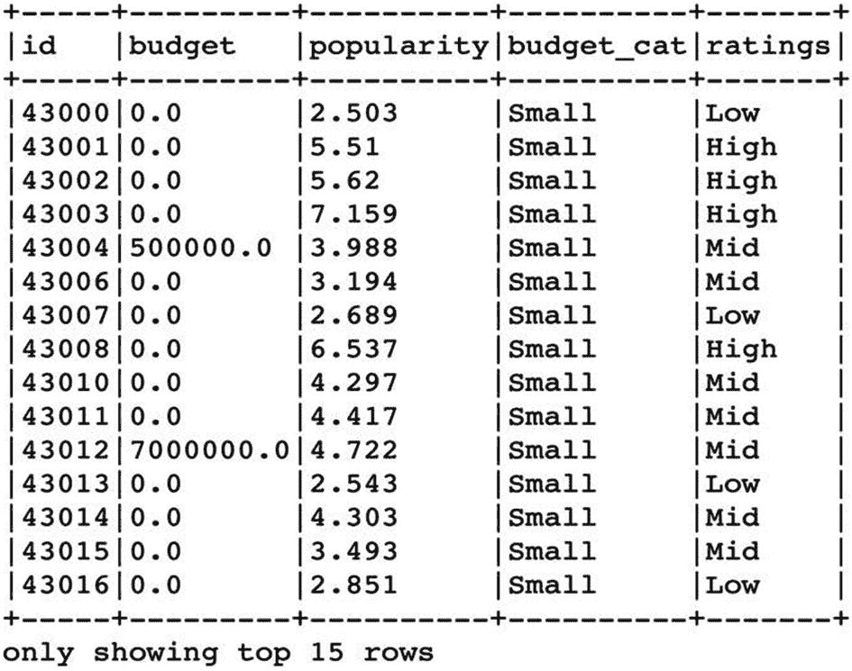

图 2-22

带有自定义列的新创建的数据帧的输出

我们可以实现相同结果的另一种方法是通过`when`函数。使用这个函数的一个好处是您不必定义输出数据类型。这对于快速和肮脏的操作很方便。让我们使用`when`函数重新创建前面的列。

```py
df_with_newcols = df.select('id','budget','popularity').\
withColumn('budget_cat', when(df['budget']<10000000,'Small').when(df['budget']<100000000,'Medium').otherwise('Big')).\
withColumn('ratings', when(df['popularity']<3,'Low').when(df['popularity']<5,'Mid').otherwise('High'))

```

如果您观察前面的命令，您可以看到我们只是连接了一堆`when`条件来定义我们的新变量。这与我们之前讨论的方法产生了相同的输出。另一个有用的提示:如果使用相同的列名，使用`withColumn`和`when`函数的组合可以更新现有列的值。您不必为操作创建一个新的临时数据帧(如上所示)。相反，您可以使用相同的方法来更新或添加列值。

### 删除和重命名列

您可以使用`drop`功能删除任何一列或多列。

```py
columns_to_drop=['budget_cat']
df_with_newcols=df_with_newcols.drop(*columns_to_drop)

```

您可以使用`printSchema`功能来验证输出。

可以使用`withColumnRenamed function`或`alias`功能进行重命名。

```py
df_with_newcols = df_with_newcols.withColumnRenamed('id','film_id') .withColumnRenamed('ratings','film_ratings')

```

如果您想更改多个列名，可以尝试以下命令:

```py
# You can define all the variable changes in the list
new_names = [('budget','film_budget'),('popularity','film_popularity')]

# Applying the alias function
df_with_newcols_renamed = df_with_newcols.select(list(map(lambda old,new:col(old).alias(new),*zip(*new_names))))

```

上述两种方法将具有相同的执行计划。您可以使用`printSchema`功能验证所有这些输出。

使用以下数据集进行练习 2-1: [`https://www.kaggle.com/kakarlaramcharan/tmdb-data-0920`](https://www.kaggle.com/kakarlaramcharan/tmdb-data-0920) 。

Exercise 2-1: Data Manipulations

**问题 1:** 识别 2000 年至 2015 年间重复出现的标题，并统计标题数量(提示:使用过滤器)。

**问题 2:** 识别书名中包含哈利的所有书名。

**问题 3:** 新建一列，作为原语言是否为英语的二进制指示器。

**问题 4:** 按年份列出受欢迎程度的平均值。

## 摘要

*   我们大致了解了 Spark 生态系统以及 PySpark 如何适应这一环境，还了解了使用 Spark 的优势。

*   我们现在知道了 rdd、数据帧和数据集之间的区别。

*   我们尝试了数据操作，并学习了如何使用各种内置函数。

*   我们还定义了自己的用户定义函数，并看到了它的实现和机制。

干得好！你现在已经熟悉了一些关键概念，这些概念在你阅读本书的过程中会很有用。我们将在下一章深入探讨一些中级和高级数据操作技术。