# 七、无监督学习和推荐算法

本章将探讨业内用于处理未标记数据的流行技术。您将发现如何使用 PySpark 实现它们。还将向您介绍细分和推荐算法的基础知识，以及其中涉及的数据准备。本章结束时，你将会对无监督技术及其在日常数据科学活动中的应用有所了解。

我们将在本章中讨论以下主题:

1.  k 均值

2.  潜在狄利克雷分配

3.  使用交替最小二乘法的协同过滤

## 分割

正如单词 *segmentation* 所暗示的，这是一种将你的人群(可能是你的客户或数据中的记录)划分为具有共同需求的逻辑组的技术。这些逻辑组之间的需求可能差异很大，但组内的需求差异很小。让我们后退一步，理解为什么我们需要这个。如果你能找到一群有着共同需求的同类客户，这将有助于你作为一家企业制定策略，更好地满足这些客户的需求，并让他们参与进来。您可以创建这些细分市场，以便更好地了解您的客户或出于特定的动机，如消息传递或为您的应用程序或产品开发设计策略。

假设您是一名应用程序开发人员，并且您有关于您的应用程序如何被使用的数据。理解具有相似行为的用户群将是有趣的。根据您的应用在不同地理位置、使用时间、年龄组或所用功能的使用方式，您可以制定一个策略来改进应用，以及如何为不同的用户群体定制界面以提高参与度。虽然这听起来很容易，但识别正确的集群可能具有挑战性。您不希望最终有太多或很少的集群。在采取任何行动之前，您还希望每个集群中有相当数量的客户。您也希望这些集群是稳定的。如果它们经常变化，可能会对你的预期行动构成挑战。

根据你所从事的垂直业务的类型，将会有大量的变量可供细分。问题变成了，我如何为这个练习选择变量？在进入前面讨论的任何变量选择方法之前，识别基本变量和描述符变量是很重要的。基本变量是那些用于定义聚类的分段中的变量。这些可以是应用程序的使用、使用的时间、使用的功能等。描述符不在分割中使用，而是用于描绘和定义所识别的聚类。这些描述符可以是您想要量化并想要观察集群之间差异的任何内部关键性能指标。例如，如果我们使用应用程序使用数据进行聚类，我们将使用应用程序回报率、应用程序流失率和应用程序收入作为一些描述符。

同样，控制特定目标的描述符变量会产生不同的结果。对于哪些变量可以用作基数和描述符，没有硬性规定。这些都是客观具体的。您还可以根据在线收集的调查数据进行一些细分，以确定客户不断变化的需求。数据可以包括地理、人口统计、社会经济、应用程序使用和忠诚度信息。调查有时有助于收集不可观察的数据，如生活方式、偏好和福利。

业务规则也可以用于分割数据，但是随着数据量的增加，大多数组织更喜欢使用可用的聚类技术。这些技术的挑战之一是我们不知道数据中存在多少个聚类。以下数据是出于演示目的而编造的。我们正在考虑客户在购买汽车时审查的两个因素。假设我们在这个数据中有两个变量，安全和燃油效率。这两个变量都是由 15 个回答者按照 1 到 10 的等级来评定的。该数据如表 [7-1](#Tab1) 所示。

表 7-1

购车调查数据

<colgroup><col class="tcol1 align-left"> <col class="tcol2 align-left"> <col class="tcol3 align-left"></colgroup> 
| 

被告

 | 

安全

 | 

燃料效率

 |
| --- | --- | --- |
| one | Ten | Ten |
| Two | nine | nine |
| three | Nine point five | Nine point five |
| four | Nine point seven five | Nine point seven five |
| five | Eight point seven five | Eight point seven five |
| six | Ten | one |
| seven | nine | One point five |
| eight | Nine point five | Two |
| nine | Eight point seven five | One point seven five |
| Ten | Nine point two five | One point two five |
| Eleven | one | Ten |
| Twelve | One point five | nine |
| Thirteen | Two | Nine point five |
| Fourteen | One point seven five | Eight point seven five |
| Fifteen | One point two five | Nine point two five |

如果我们将数据绘制在散点图上，我们会立即识别出有三个集群，如图 [7-1](#Fig1) 所示。对于第一组中的受访者来说，安全性比燃油效率更重要。对于第二组中的受访者来说，安全性和燃油效率同等重要。对于第 3 组中的受访者，燃油效率在购买车辆时起着重要作用。我们如何处理这些信息？汽车经销商可以利用这些信息向顾客推销合适的汽车。与向群组 3 中的受访者谈论燃油效率相比，他们可以花更多的时间向群组 1 中的受访者解释安全特性。


图 7-1

集群演示

我们能够仅仅通过在二维图上绘制变量来做出这些推论。通常情况下，我们有多个变量，您可能无法直观地做出这些判断。我们将在接下来的章节中探索可以在多维数据上使用的技术。

没有单一的集群解决方案。对于这个例子，我们可以根据大小将汽车大致分为紧凑型、轿车和 SUV。同样，我们可以将车辆分为豪华型/非豪华型和性能型/非性能型。所有这些都是有效段。同样，当您对数据进行聚类时，可能会有多个解决方案。具有挑战性的部分是选择一个适合你的业务。描述符可以帮助您确定正确的指标，从而帮助您选择解决方案。

### 距离测量

根据上图，您可以看到彼此靠近的点具有相似的特征。换句话说，距离小的点比距离大的点更相似。点之间的距离是用于确定相似性的分割中的关键概念之一。那么，我们如何计算点之间的相似性呢？有多种技术可用，其中最流行的是欧几里德距离。欧几里得距离是笛卡尔坐标系中两点之间的几何距离。两点 a (x <sub>1</sub> ，y <sub>1</sub> )和 b (x <sub>2</sub> ，y <sub>2</sub> )之间的欧几里德距离用以下公式计算:

距离<sub>ab</sub>=【x<sub>【1】</sub>-x<sub>【2】</sub>)<sup>【2】</sup>+【y】<sub>【1】</sub>-y<sub>【2】</sub>

让我们计算一下表 [7-1](#Tab1) 中的距离，看看不同受访者之间的距离是如何变化的。表 [7-2](#Tab2) 、 [7-3](#Tab3) 和 [7-4](#Tab4) 代表所有回答者之间的计算欧几里得距离。

表 7-4

表 [7-1](#Tab1) 的欧几里德距离(部分输出-第 3 部分)

<colgroup><col class="tcol1 align-left"> <col class="tcol2 align-left"> <col class="tcol3 align-left"> <col class="tcol4 align-left"> <col class="tcol5 align-left"> <col class="tcol6 align-left"></colgroup> 
|   | 

Eleven

 | 

Twelve

 | 

Thirteen

 | 

Fourteen

 | 

Fifteen

 |
| --- | --- | --- | --- | --- | --- |
| one | Nine | Eight point five six | Eight point zero two | Eight point three four | Eight point seven eight |
| Two | Eight point zero six | Seven point five | Seven point zero two | Seven point two five | Seven point seven five |
| three | Eight point five one | Eight point zero two | Seven point five | Seven point seven nine | Eight point two five |
| four | Eight point seven five | Eight point two eight | Seven point seven five | Eight point zero six | Eight point five one |
| five | Seven point eight five | Seven point two five | Six point seven nine | Seven | Seven point five two |
| six | Twelve point seven three | Eleven point six seven | Eleven point six seven | Eleven point three two | Twelve point zero three |
| seven | Eleven point six seven | Ten point six one | Ten point six three | Ten point two five | Ten point nine six |
| eight | Eleven point six seven | Ten point six three | Ten point six one | Ten point two eight | Ten point nine eight |
| nine | Eleven point three two | Ten point two five | Ten point two eight | Nine point nine | Ten point six one |
| Ten | Twelve point zero three | Ten point nine six | Ten point nine eight | Ten point six one | Eleven point three one |
| Eleven | Zero | One point one two | One point one two | One point four six | Zero point seven nine |
| Twelve | One point one two | Zero | Zero point seven one | Zero point three five | Zero point three five |
| Thirteen | One point one two | Zero point seven one | Zero | Zero point seven nine | Zero point seven nine |
| Fourteen | One point four six | Zero point three five | Zero point seven nine | Zero | Zero point seven one |
| Fifteen | Zero point seven nine | Zero point three five | Zero point seven nine | Zero point seven one | Zero |

表 7-3

表 [7-1](#Tab1) 的欧几里德距离(部分输出-第 2 部分)

<colgroup><col class="tcol1 align-left"> <col class="tcol2 align-left"> <col class="tcol3 align-left"> <col class="tcol4 align-left"> <col class="tcol5 align-left"> <col class="tcol6 align-left"></colgroup> 
|   | 

six

 | 

seven

 | 

eight

 | 

nine

 | 

Ten

 |
| --- | --- | --- | --- | --- | --- |
| one | Nine | Eight point five six | Eight point zero two | Eight point three four | Eight point seven eight |
| Two | Eight point zero six | Seven point five | Seven point zero two | Seven point two five | Seven point seven five |
| three | Eight point five one | Eight point zero two | Seven point five | Seven point seven nine | Eight point two five |
| four | Eight point seven five | Eight point two eight | Seven point seven five | Eight point zero six | Eight point five one |
| five | Seven point eight five | Seven point two five | Six point seven nine | Seven | Seven point five two |
| six | Zero | One point one two | One point one two | One point four six | Zero point seven nine |
| seven | One point one two | Zero | Zero point seven one | Zero point three five | Zero point three five |
| eight | One point one two | Zero point seven one | Zero | Zero point seven nine | Zero point seven nine |
| nine | One point four six | Zero point three five | Zero point seven nine | Zero | Zero point seven one |
| Ten | Zero point seven nine | Zero point three five | Zero point seven nine | Zero point seven one | Zero |
| Eleven | Twelve point seven three | Eleven point six seven | Eleven point six seven | Eleven point three two | Twelve point zero three |
| Twelve | Eleven point six seven | Ten point six one | Ten point six three | Ten point two five | Ten point nine six |
| Thirteen | Eleven point six seven | Ten point six three | Ten point six one | Ten point two eight | Ten point nine eight |
| Fourteen | Eleven point three two | Ten point two five | Ten point two eight | Nine point nine | Ten point six one |
| Fifteen | Twelve point zero three | Ten point nine six | Ten point nine eight | Ten point six one | Eleven point three one |

表 7-2

表 [7-1](#Tab1) 的欧几里德距离(部分输出-第 1 部分)

<colgroup><col class="tcol1 align-left"> <col class="tcol2 align-left"> <col class="tcol3 align-left"> <col class="tcol4 align-left"> <col class="tcol5 align-left"> <col class="tcol6 align-left"></colgroup> 
|   | 

one

 | 

Two

 | 

three

 | 

four

 | 

five

 |
| --- | --- | --- | --- | --- | --- |
| one | Zero | One point four one | Zero point seven one | Zero point three five | One point seven seven |
| Two | One point four one | Zero | Zero point seven one | One point zero six | Zero point three five |
| three | Zero point seven one | Zero point seven one | Zero | Zero point three five | One point zero six |
| four | Zero point three five | One point zero six | Zero point three five | Zero | One point four one |
| five | One point seven seven | Zero point three five | One point zero six | One point four one | Zero |
| six | Nine | Eight point zero six | Eight point five one | Eight point seven five | Seven point eight five |
| seven | Eight point five six | Seven point five | Eight point zero two | Eight point two eight | Seven point two five |
| eight | Eight point zero two | Seven point zero two | Seven point five | Seven point seven five | Six point seven nine |
| nine | Eight point three four | Seven point two five | Seven point seven nine | Eight point zero six | Seven |
| Ten | Eight point seven eight | Seven point seven five | Eight point two five | Eight point five one | Seven point five two |
| Eleven | Nine | Eight point zero six | Eight point five one | Eight point seven five | Seven point eight five |
| Twelve | Eight point five six | Seven point five | Eight point zero two | Eight point two eight | Seven point two five |
| Thirteen | Eight point zero two | Seven point zero two | Seven point five | Seven point seven five | Six point seven nine |
| Fourteen | Eight point three four | Seven point two five | Seven point seven nine | Eight point zero six | Seven |
| Fifteen | Eight point seven eight | Seven point seven five | Eight point two five | Eight point five one | Seven point five two |

观察表 [7-2](#Tab2) 、 [7-3](#Tab3) 和 [7-4](#Tab4) 中的数据，再次证明了相似点之间的距离是最小的。所有短距离都被突出显示，它们绝不是偶然形成图 [7-1](#Fig1) 所示的视觉集群。你可能会问，我们如何把它推广到多个变量。我们可以使用欧几里德距离的扩展来实现，它可以扩展到任何数量的变量。假设我们有任何变量—我们可以使用以下公式计算点 a (x <sub>1</sub> ，y <sub>1</sub> ，z <sub>1</sub> )和 b (x <sub>2</sub> ，y <sub>2</sub> ，z <sub>2</sub> )之间的距离:

距离【x1-x2】<sup><sup>+【y1-y2】<sup>2</sup>+【Z1-z2】<sup>2</sup></sup></sup>

还有其他形式的距离度量，如曼哈顿距离和切比雪夫距离。为了便于解释，让我们考虑图 [7-2](#Fig2) 。

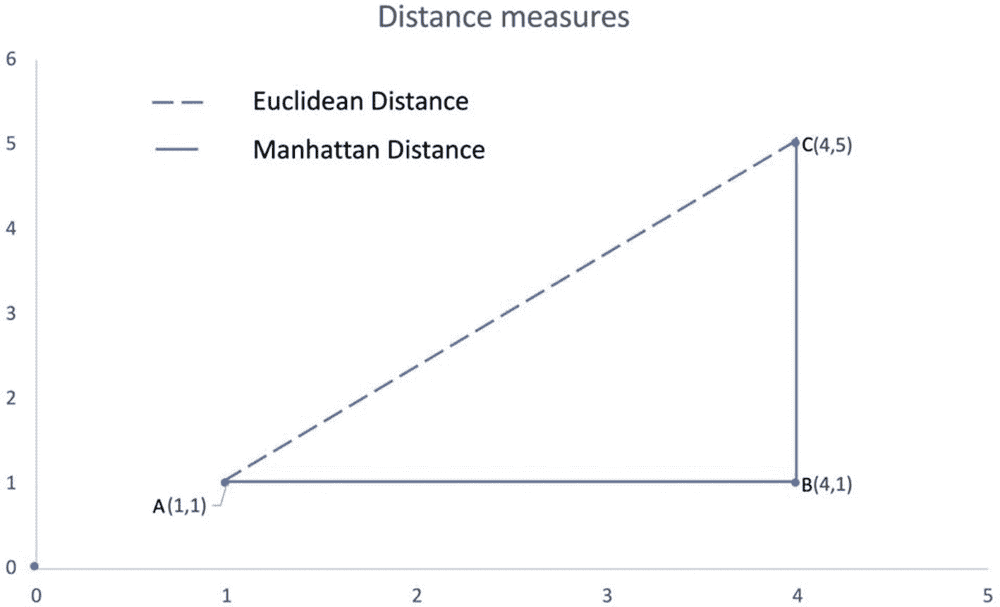

图 7-2

距离测量

两点 *A* 和 *C* 之间的欧氏距离为 5。我们可以通过应用公式进行交叉验证。 *A* 和 *C* 之间的曼哈顿距离计算为( *A，B* )和( *B，C* )之间的城市街区距离之和。由于其布局，它也被称为出租车公制，并根据图 [7-2](#Fig2) 计算为笛卡尔坐标的绝对差值。

曼哈顿距离= |(x2–x1)|+|(y2-y1)|

曼哈顿距离= |(4–1)|+|(5-1)|

曼哈顿距离= 7

向量空间中的切比雪夫距离被定义为两个向量之间的距离，并且是它们沿着任何坐标维度的差的最大距离。对于图 [7-2](#Fig2) 可以使用以下公式计算:

切比雪夫距离= max[(x2–x1)，(y2-y1)]

切比雪夫距离= max[(4–1)，(5-1)]

切比雪夫距离= 4

这种策略对于数值型变量非常有效，但是我们如何将这种技术应用于分类型变量呢？假设我们有一个名为“5 年内的前一次购买”的变量，其值为是/否。我们如何使用该变量？记得我们在前面的章节中介绍了一种热编码。我们将能够使用一个热编码将这个分类变量 yes/no 转换成一个数值变量。我们将得到两个变量:一个代表“是”，另一个代表“否”。实际上，我们可能只需要一个变量，因为第二个变量可能与第一个变量完全共线。

如果我们仔细观察数据，我们会发现早期的变量在 1 到 10 的范围内，而现在新变量“5 年内的前一次购买”的范围为 0 到 1。使用这些变量的组合将导致偏差，因为当我们计算距离时，新变量的影响可以忽略不计。我们如何处理这种情况？是的，你可以使用规范化。归一化是一种缩放技术，可以在[0，1]的范围内重新缩放现有数据。它使用以下公式计算:

X <sub>归一化</sub> = (X-X <sub>最小值</sub> ) / (X <sub>最大值</sub> -X <sub>最小值</sub>

这是分段中广泛使用的技术。但是要小心，因为您可能会丢失关于异常值的信息。

另一种广泛使用的缩放技术是标准化。不要混淆标准化和规范化。在标准化中，我们重新调整数据，使平均值为 0，标准差为 1。它使用以下公式计算:

X <sub>标准化</sub> = X- X <sub>均值</sub> / X <sub>标准差</sub>

可能会出现只有分类数据的情况。有比一次热编码和使用欧几里德距离更好的技术吗？答案是肯定的:Jaccard 的系数和汉明距离。这里我们将重点讨论雅克卡系数。它包括从数据中计算相异矩阵。例如，如果我们正在处理二元属性，我们可以创建一个列联表，其中 *a* 是两个项目 *x* 和 *y* 都等于 1 的特征的数量； *b* 是项目 *x* 等于 1 但对象 *y* 等于 0 的特征数； *c* 是项目 *x* 等于 0 而项目 *y* 等于 1 的特征数；并且 *d* 是对于项目 *x* 和 *y* 都等于 0 的特征的数量。特征总数为 *z* ，其中*z*=*a*+*b*+*c*+*d*(表 [7-5](#Tab5) )。

表 7-5

相依表

<colgroup><col class="tcol1 align-left"> <col class="tcol2 align-left"> <col class="tcol3 align-left"> <col class="tcol4 align-left"> <col class="tcol5 align-left"></colgroup> 
| x | y |
|   | one | Zero | 总额 |
| one | a | b | a+b |
| Zero | c | d | c+d |
| 总额 | a+c | b+d | z =(a+b+c+d) |

在计算差异时，您需要理解几个术语。

对称二进制变量–变量的两个级别具有相同的权重。例如，硬币的正面和反面

不对称二元变量–两个级别的重要性不同。例如，对于医学测试的结果，阳性可能比阴性事件具有更高的权重

根据二进制变量的类型，您对相异度的计算会有所不同。对称二进制相异度可通过以下公式计算

d(x，y)= (b+c) / (a+b+c+d)

不对称二进制相异度可通过以下公式计算

d(x，y)= (b+c) / (a+b+c)

在前面的等式中观察到 *d* 在分母中被丢弃；这是因为消极事件几乎没有重要性。使用这个相异度度量，我们可以使用下面的公式来计算 *x* 和 *y* 之间的相似性距离:

相似性(x，y)= 1–d(x，y)

相似度(x，y)= 1-((b+c)/(a+b+c))

相似度(x，y ) = c/(a+b+c)

这种相似性度量被称为 Jaccard 距离。这可以用来计算二进制变量之间的相似性。但是名义变量会怎么样呢？标称变量的一种变通方法是将它们重新编码为多个二进制变量。另一种技术是使用简单的匹配系数。其计算方法如下:

简单匹配系数=匹配属性数/属性数

在二元变量的情况下，该系数类似于对称二元相异度。前面的系数给出了相异指数。相似性距离是通过从 1:

简单匹配距离= 1 -简单匹配系数

让我们继续用欧几里德距离的例子来证明雅克卡的距离。假设一家汽车经销商成功地与拥有三辆不同品牌和型号汽车的三名受访者达成了交易。现在，汽车经销商希望根据性能对这些受访者的汽车进行分类。他们对这些汽车进行不同的测试，以确定当前性能的相似性。失败的测试用 *Y* 表示，通过的测试用 *N* 表示。为了方便起见，我们将它们分别转换为 1 和 0(表 [7-6](#Tab6) )。

表 7-6

雅克卡德的演示

<colgroup><col class="tcol1 align-left"> <col class="tcol2 align-left"> <col class="tcol3 align-left"> <col class="tcol4 align-left"> <col class="tcol5 align-left"> <col class="tcol6 align-left"> <col class="tcol7 align-left"></colgroup> 
|   | 

气候的

 | 

机械的

 | 

压力脉冲

 | 

排放工作台

 | 

猫老化

 | 

棚

 |
| --- | --- | --- | --- | --- | --- | --- |
| 字符 1 | one | Zero | one | Zero | Zero | Zero |
| 汽车 2 | one | Zero | one | Zero | one | Zero |
| 字符 3 | one | one | Zero | Zero | Zero | Zero |

我们可以使用以下公式计算汽车之间的差异:

d(car1，car2)= 1+0 / (2+1+0)

d(car1，car2)= 0.33

好吧，我们是怎么得出这些数字的？嗯，使用列联表，我们计算了表 [7-6](#Tab6) 中所示的 *b* 和 *c* 的数量。对于汽车 1 和汽车 2，Cat 老化占 *b.* 这里没有 *c* 值。还要注意这是不对称的二进制相似性，所以我们不会考虑分母*中 *d* 的值。*根据气候和压力脉冲测试，我们知道 *a* 的计数为 2。为了计算相似性，我们需要从 1:

相似度(car1，car2) = 1 - 0.33

相似性(car1，car2) = 0.67

同样，您可以计算其他观察值之间的差异，并创建相似性矩阵。

### 聚类的类型

大体上，我们可以将聚类分为层次聚类和非层次聚类。在这一节中，我们将重点了解这些聚类类型之间的差异，以及每种聚类类型可用的算法。顾名思义，层次集群试图在其例程中构建集群的层次结构，以最终确定解决方案。层次聚类又分为凝聚型和分裂型(图 [7-3](#Fig3) )。

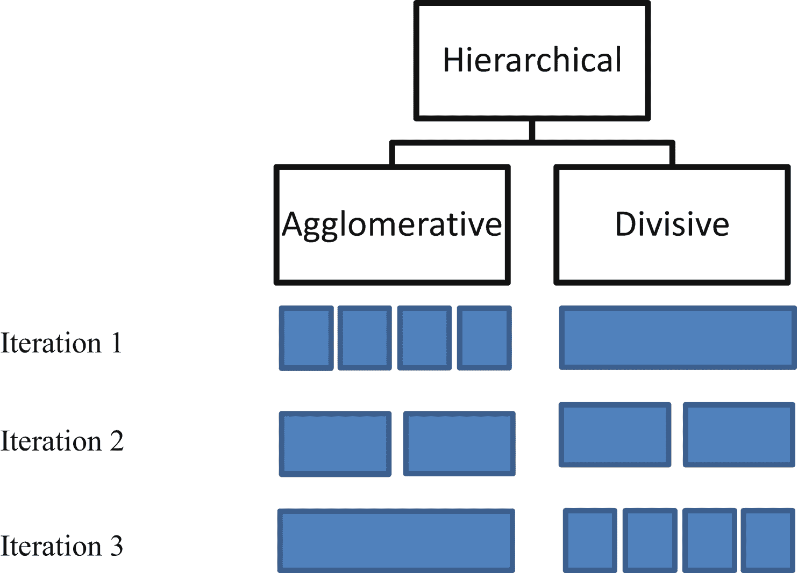

图 7-3

层次聚类的类型

*   **聚集** **聚类** **:** 在这种类型的聚类中，每个观察值都从自己的聚类开始，一直到单个聚类。这种方法也称为自底向上。

*   **分裂式** **聚类** **:** 在这种类型的聚类中，所有的观察值都被假设落在单个聚类中。然后在每次迭代中递归地将它们分开。这种方法也称为自顶向下。

两种方法都在图 [7-3](#Fig3) 中进行了图示。我们将利用从表 [7-1](#Tab1) 中选择的数据来演示凝聚示例。我们还计算了所有这些点的欧几里德距离(表 [7-8](#Tab8) )。表 [7-7](#Tab7) 中显示了所有成对距离。

表 7-12

主题出现

<colgroup><col class="tcol1 align-left"> <col class="tcol2 align-left"> <col class="tcol3 align-left"> <col class="tcol4 align-left"></colgroup> 
| 

主题

 | 

主题词分配

 | 

发生的事

 | 

估计

 |
| --- | --- | --- | --- |
| 主题 1 | 主题 1 在文档 1 中有多少 | three | 2 + a |
| 主题 1 中有多少“行星” | four | 4 + b |
| 话题 2 | 文档 1 中主题 2 有多少 | Zero | 0 + a |
| 话题 2 中有多少“行星” | Two | 2 + b |
| 主题 3 | 文档 1 中主题 3 有多少 | one | 1 + a |
| 话题 3 中有多少“行星” | Zero | 0 + |

表 7-11

主题分配

<colgroup><col class="tcol1 align-left"> <col class="tcol2 align-left"></colgroup> 
| 

单词

 | 

主题

 |
| --- | --- |
| 行星 | 主题 1 |
| 目标 | 话题 2 |
| 联盟 | 话题 2 |
| 学校 | 主题 3 |

表 7-10

信用卡数据集的元数据信息

<colgroup><col class="tcol1 align-left"> <col class="tcol2 align-left"></colgroup> 
| 

圆柱

 | 

定义

 |
| --- | --- |
| 卡士达 | 信用卡持有人的身份(分类) |
| 平衡 | 他们帐户中用于购物的余额 |
| 平衡频率 | 余额更新的频率，得分在 0 到 1 之间(1 =经常更新，0 =不经常更新) |
| 购买 | 从帐户购买的金额 |
| 一次性购买 | 一次完成的最大采购金额 |
| 安装采购 | 分期付款购买的金额 |
| 预付现金 | 用户预付的现金 |
| 购买频率 | 购买的频率，得分在 0 到 1 之间(1 =经常购买，0 =不经常购买) |
| oneoffpurchasesfrequency | 一次性购买的频率(1 =频繁购买，0 =不频繁购买) |
| 采购安装频率 | 分期付款购物的频率(1 =频繁，0 =不频繁) |
| 现金预付频率 | 预付现金的支付频率 |
| cashadadvancetrx | “预付现金”交易笔数 |
| purchasestrx | 进行的采购交易的数量 |
| 信贷限额 | 用户的信用卡限额 |
| 支付 | 用户支付的金额 |
| 最低付款额 | 用户支付的最低金额 |
| prcfullpayment | 用户支付的全额付款的百分比 |
| 任期 | 用户信用卡服务的期限 |

表 7-9

聚类步骤

<colgroup><col class="tcol1 align-left"> <col class="tcol2 align-left"> <col class="tcol3 align-left"></colgroup> 
| 

步骤

 | 

簇

 | 

异质性

 |
| --- | --- | --- |
| Zero | 1 2 6 7 11 12 | Zero |
| one | 1 2 ( **6 7** ) 11 12 | One point one two |
| Two | 1 2 ( **6 7** ) ( **11 12** ) | One point one two |
| three | (**1 2**)(**6 7**)(**11 12**) | One point two one |
| four | ( **1 2 6 7** ) (11 12) | Three point eight four |
| five | ( **1 2 6 7 11 12** ) | Five point zero four |

表 7-8

选定受访者的欧几里德距离

<colgroup><col class="tcol1 align-left"> <col class="tcol2 align-left"> <col class="tcol3 align-left"> <col class="tcol4 align-left"> <col class="tcol5 align-left"> <col class="tcol6 align-left"> <col class="tcol7 align-left"></colgroup> 
|   | 

one

 | 

Two

 | 

six

 | 

seven

 | 

Eleven

 | 

Twelve

 |
| --- | --- | --- | --- | --- | --- | --- |
| one | Zero | One point four one | Nine | Eight point five six | Nine | Eight point five six |
| Two | One point four one | Zero | Eight point zero six | Seven point five | Eight point zero six | Seven point five |
| six | Nine | Eight point zero six | Zero | One point one two | Twelve point seven three | Eleven point six seven |
| seven | Eight point five six | Seven point five | One point one two | Zero | Eleven point six seven | Ten point six seven |
| Eleven | Nine | Eight point zero six | Twelve point seven three | Eleven point six seven | Zero | One point one two |
| Twelve | Eight point five six | Seven point five | Eleven point six seven | Ten point six one | One point one two | Zero |

表 7-7

凝聚的例子

<colgroup><col class="tcol1 align-left"> <col class="tcol2 align-left"> <col class="tcol3 align-left"></colgroup> 
| 

被告

 | 

安全

 | 

燃料效率

 |
| --- | --- | --- |
| one | Ten | Ten |
| Two | nine | nine |
| six | Ten | one |
| seven | nine | One point five |
| Eleven | one | Ten |
| Twelve | One point five | nine |

注意，这是一个对称矩阵；您可以使用任何一半来确定您的集群。当我们开始聚集聚类时，所有的数据点都在它们各自的聚类中。根据前面的数据，这里观察到的两个回答者之间的最小距离是(6，7)和(11，12)的 1.12。有一个平局，那么算法将如何决定哪些对应该融合？好吧，有内置的规则打破这个平局，假设它任意挑选(6，7)。在第一步中，我们将它们聚集在一起，然后计算总体异质性度量，这里等于 1.12。注意，当我们开始聚类时，异质性度量是 0，因为所有的数据点都在它们自己的单独的聚类中。一旦我们将 6 和 7 融合在一起，下一个融合的对就是(11，12)。异质性度量保持不变，因为点之间的成对距离仍然是 1.12。在下一步中，(1，2)将被融合在一起，因为它们具有 1.41 的最小成对距离。现在平均异质性会上升到 1.21。这个是取(1.12+1.12+1.41)/3 计算出来的。重复这些步骤，直到所有的观察结果都归入一个组。

您可能想知道，我如何选择正确的集群数量？识别这一点的一种方法是确定异质性度量中的突变/波动。图 [7-4](#Fig4) 给出了算法如何工作的直观描述。表 [7-9](#Tab9) 显示了这些步骤。


图 7-4

树状图:基于单个连锁的层次聚类。质心和欧几里德距离表示

观察前面的异质性度量，您可以观察到从步骤 3 到步骤 4 以及从步骤 4 到步骤 5 的度量中存在中断。在这里，您可以获得两种可能的解决方案，三集群或四集群解决方案。

我们这里用的方法叫做单链。它在确定聚类度量和异质性时查看最近邻。查看相似性的其他方法包括:

**完全联动** **:** 这是用聚类之间的最大距离来确定聚类距离，而不是用最小距离。参见图 [7-5](#Fig5) 了解集群属性和距离如何变化。


图 7-5

树状图:基于完全连锁的层次聚类。质心和欧几里德距离表示

**平均关联** **:** 使用聚类之间的成对平均距离来确定聚类距离。参见图 [7-6](#Fig6) 了解集群距离如何变化。

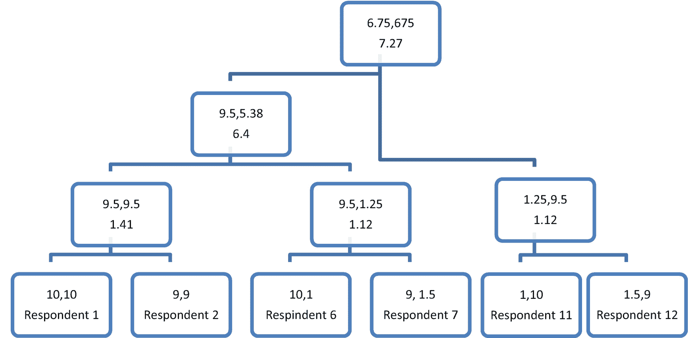

图 7-6

树状图:基于平均连锁的层次聚类。质心和欧几里德距离表示

**质心联动** **:** 该方法利用聚类中心之间的距离来确定迭代步骤中的聚类距离。

**沃德方法** **:** 该方法基于方差。它基于最小化组内观察值之间的组方差和最大化组间组方差的原则。

尽管分层聚类提供了不必选择初始聚类数的优势，但它是一种实现起来很复杂的算法，尤其是对于大数据环境。它具有 O(*n*<sup>2</sup>log(*n*))的时间和空间复杂度顺序，其中 *n* 为观测次数。这可能会降低操作速度。从好的方面来看，它可以让我们了解观察结果是如何分组的。

#### 平分 k-均值

二分 k-means 是一种介于层次划分聚类和非层次聚类之间的混合方法。我们将在下一节介绍 k-means，这是一种流行的非层次聚类技术。平分 k-means 与 k-means 在预定义聚类数方面相似。您可能想知道，在没有任何数据先验知识的情况下，我们如何设置聚类数。有一些我们之前看到的技术，比如异质性度量和其他距离度量，如果我们运行该算法几次迭代，我们可以利用它们来确定聚类。让我们看看这个二分 k-means 算法在理论上是如何工作的。由于这是一种除法算法，它从单个聚类的顶部开始，然后迭代地划分数据。首先，我们需要设置所需的集群数量。

开始时，所有数据都存在于单个集群中(图 [7-7](#Fig7) )。我们将数据分成两组(图 [7-8](#Fig8) )。

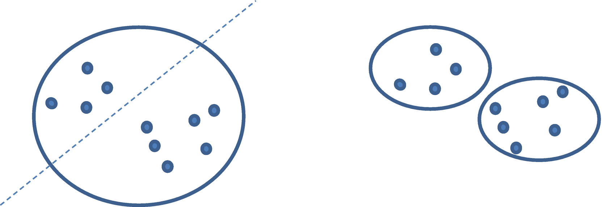

图 7-8

第二步:平分 k-means

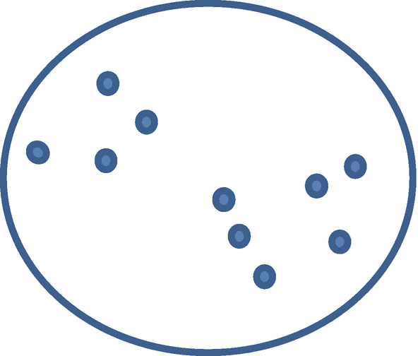

图 7-7

第一步:平分 k 均值

使用 k-means 来划分这前两个聚类。当分割聚类时，计算每个聚类的质心。然后，计算所有点和质心之间的距离度量的平方和。这被称为距离/误差的平方和(SSE)。SSE 越高，集群的异质性越大。下一步，我们在簇中选择 SSE 最高的簇，将其分成两个簇(图 [7-9](#Fig9) )。


图 7-9

第三步:平分 k-means

在下一步中，我们查看三个集群的 SSE，并选择 SSE 最高的一个来对分。我们重复这个过程，直到我们达到期望的集群数量。这个过程的低计算时间是优于其他过程的一个很大的优点。平分 k-means 也产生相似大小的聚类，这与 k-means 不同，k-means 的聚类大小可能有很大的不同。

PySpark 在 3.0 版本中没有凝聚层次集群的实现。有一种使用`BisectingKMeans`函数的分层聚类方法(自上而下)。出于演示目的，我们使用来自 Kaggle ( [`https://www.kaggle.com/arjunbhasin2013/ccdata`](https://www.kaggle.com/arjunbhasin2013/ccdata) )(表 [7-10](#Tab10) )的信用卡数据。

现在，这个数据集不能以原始形式使用。从描述中我们知道，这些数据元素具有不同的标度。在应用聚类技术之前，我们必须将它们归一化并形成一个特征向量。

```py
# Read data
file_location = "cluster_data.csv"
file_type = "csv"
infer_schema = "false"
first_row_is_header = "true"

df = spark.read.format(file_type)\
.option("inferSchema", infer_schema)\
.option("header", first_row_is_header)\
.load(file_location)

# Print metadata
df.printSchema()

# Casting multiple variables
from pyspark.sql.types import *

#Identifying and assigning lists of variables
float_vars=list(set(df.columns) - set(['CUST_ID']))

for column in float_vars:
      df=df.withColumn(column,df[column].cast(FloatType()))

# Imputing data

from pyspark.ml.feature import Imputer

# Shortlisting variables where mean imputation is required
input_cols=list(set(df.columns) - set(['CUST_ID']))

# Defining the imputer function
imputer = Imputer(
    inputCols=input_cols,
    outputCols=["{}_imputed".format(c) for c in input_cols])

# Applying the transformation
df_imputed=imputer.fit(df).transform(df)

# Dropping the original columns as we created the _imputed columns
df_imputed=df_imputed.drop(*input_cols)

# Renaming the input columns to original columns for consistency
new_column_name_list= list(map(lambda x: x.replace("_imputed", ""), df.columns))
df_imputed = df_imputed.toDF(*new_column_name_list)

# Data Preparation

from pyspark.ml.feature import VectorAssembler
from pyspark.ml.feature import Normalizer
from pyspark.ml import Pipeline

# Listing the variables that are not required in the segmentation analysis
ignore = ['CUST_ID']
# creating vector of all features
assembler = VectorAssembler(inputCols=[x for x in df.columns if x not in ignore],
                            outputCol='features')
# creating the normalization for all features for scaling betwen 0 to 1
normalizer = Normalizer(inputCol="features", outputCol="normFeatures", p=1.0)
# Defining the pipeline
pipeline = Pipeline(stages=[assembler, normalizer])
# Fitting the pipeline
transformations=pipeline.fit(df_imputed)
# Applying the transformation
df_updated = transformations.transform(df_imputed)

# Building the model

from pyspark.ml.clustering import BisectingKMeans
from pyspark.ml.evaluation import ClusteringEvaluator
# Trains a bisecting k-means model.
bkm = BisectingKMeans().setK(2).setSeed(1)
model = bkm.fit(df_updated.select('normFeatures').withColumnRenamed('normFeatures','features'))

# Make predictions
predictions = model.transform(df_updated.select('normFeatures').withColumnRenamed('normFeatures','features'))

# Evaluate clustering by computing Silhouette score
evaluator = ClusteringEvaluator()

silhouette = evaluator.evaluate(predictions)
print("Silhouette with squared euclidean distance = " + str(silhouette))

# Shows the result.
print("Cluster Centers: ")
centers = model.clusterCenters()
for center in centers:
    print(center)

```

我们使用轮廓分数来确定聚类的数量。这是确定正确集群数量的最佳可用指标之一。此指标是针对数据集中的每个样本计算的。它使用以下公式计算:

系数剪影= (x-y)/最大(x，y)

*x* 是簇间距离， *y* 是簇内距离。该系数可以在-1 和 1 之间变化。接近 1 的值定义一个清晰的分离，并且更可取。现在让我们计算不同组数的轮廓系数，并绘制出来以确定正确的组数(图 [7-10](#Fig10) )。


图 7-10

随着聚类数量的增加，使用二分 k-means 在多次迭代中改变轮廓得分

```py
# Iterations

import pandas as pd
import seaborn as sns
import matplotlib.pyplot as plt

sil_coeff=[]
num_clusters=[]
for iter in range(2,8):
    bkm = BisectingKMeans().setK(iter).setSeed(1)
    model = bkm.fit(df_updated.select('normFeatures').withColumnRenamed('normFeatures','features'))
    # Make predictions
    predictions = model.transform(df_updated.select('normFeatures').withColumnRenamed('normFeatures','features'))
    # Evaluate clustering by computing Silhouette score

    evaluator = ClusteringEvaluator()
    silhouette = evaluator.evaluate(predictions)
    sil_coeff.append(silhouette)
    num_clusters.append(iter)
    print("Silhouette with squared euclidean distance for "+str(iter) +" cluster solution = " + str(silhouette))

df_viz=pd.DataFrame(zip(num_clusters,sil_coeff), columns=['num_clusters','silhouette_score'])
sns.lineplot(x = "num_clusters", y = "silhouette_score", data=df_viz)
plt.title('Bisecting k-means : Silhouette scores')
plt.xticks(range(2, 8))
plt.show()

```

#### k 均值

到目前为止，k-means 是最流行的聚类技术之一。原因是因为它和数据成比例。在某些数据点之后，大多数其他技术在计算上是昂贵的。k-means 的一个优点(有时也是一个缺点)是您可以指定您想要的聚类数。为了进行演示，我们将使用表 [7-1](#Tab1) 中的相同汽车调查数据。让我们选择集群的数量为三个。现在算法在空间中随机分配三个初始化点，如图 [7-11](#Fig11) 所示。这些点代表初始聚类中心。


图 7-11

k-均值演示

在第二步中，计算所有点到三个初始化点聚类中心的距离。根据到聚类中心的最小距离，将所有点分配给其中一个聚类。计算新的聚类点的质心以找到新的聚类中心。再次计算所有点到新聚类中心的距离。基于到聚类中心的最小距离，点被重新分配。这个过程重复进行，直到一个簇中的点没有变化。

您可能想知道，我们如何在 k-means 中确定正确的聚类数？嗯，我们从层次聚类中知道答案。我们使用聚类方差来确定正确的聚类数。我们从 0 到 *n* 运行聚类，绘制聚类方差的变化。这个图叫做肘图。无论何时观察到图中的拐点或急剧变化，都可以将该点用作最佳聚类数。目标是识别具有最低平方和(SSE)的 *k* 的最小值。

我们将利用相同的信用卡数据集在 PySpark 中实现 k-means。

EXERCISE 7-1: SEGMENTATION

**问题 1:** 通过设置相同数量的聚类，观察层次聚类和非层次聚类的区别。

*   集群配置文件和大小相似吗？

```py
# Import Sparksession
from pyspark.sql import SparkSession
spark=SparkSession.builder.appName("Clustering").getOrCreate()

# Print PySpark and Python versions
import sys
print('Python version: '+sys.version)
print('Spark version: '+spark.version)

# Read data

file_location = "cluster_data.csv"
file_type = "csv"
infer_schema = "false"
first_row_is_header = "true"

df = spark.read.format(file_type)\
.option("inferSchema", infer_schema)\
.option("header", first_row_is_header)\
.load(file_location)

# Print metadata
df.printSchema()

#  Count data
df.count()
print('The total number of records in the credit card dataset are '+str(df.count()))

# Casting multiple variables
from pyspark.sql.types import *

# Identify and assign lists of variables
float_vars=list(set(df.columns) - set(['CUST_ID']))

for column in float_vars:
    df=df.withColumn(column,df[column].cast(FloatType()))

from pyspark.ml.feature import Imputer

# Shortlist variables where mean imputation is required
input_cols=list(set(df.columns) - set(['CUST_ID']))

# Define the imputer function
imputer = Imputer(
    inputCols=input_cols,
    outputCols=["{}_imputed".format(c) for c in input_cols])

# Apply the transformation
df_imputed=imputer.fit(df).transform(df)

# Drop the original columns as we created the _imputed columns

df_imputed=df_imputed.drop(*input_cols)

# Rename the input columns to original columns for consistency
new_column_name_list= list(map(lambda x: x.replace("_imputed", ""), df.columns))
df_imputed = df_imputed.toDF(*new_column_name_list)

from pyspark.ml.feature import VectorAssembler
from pyspark.ml.feature import Normalizer
from pyspark.ml import Pipeline

# List the variables that are not required in the segmentation analysis
ignore = ['CUST_ID']

# create vector of all features
assembler = VectorAssembler(inputCols=[x for x in df.columns if x not in ignore],
                            outputCol='features')

# create the normalization for all features for scaling betwen 0 to 1
normalizer = Normalizer(inputCol="features", outputCol="normFeatures", p=1.0)
# Define the pipeline
pipeline = Pipeline(stages=[assembler, normalizer])
# Fit the pipeline
transformations=pipeline.fit(df_imputed)
# Apply the transformation
df_updated = transformations.transform(df_imputed)

from pyspark.ml.clustering import KMeans
from pyspark.ml.evaluation import ClusteringEvaluator

# Train a k-means model.
kmeans = KMeans().setK(2).setSeed(1003)
model = kmeans.fit(df_updated.select('normFeatures').withColumnRenamed('normFeatures','features'))

# Make predictions

predictions = model.transform(df_updated.select('normFeatures').withColumnRenamed('normFeatures','features'))

# Evaluate clustering by computing Silhouette score
evaluator = ClusteringEvaluator()

silhouette = evaluator.evaluate(predictions)
print("Silhouette with squared euclidean distance = " + str(silhouette))

# Show the result.
centers = model.clusterCenters()
print("Cluster Centers: ")
for center in centers:
    print(center)

import pandas as pd
import seaborn as sns
import matplotlib.pyplot as plt

sil_coeff=[]
num_clusters=[]
for iter in range(2,8):
    kmeans = KMeans().setK(iter).setSeed(1003)
    model = kmeans.fit(df_updated.select('normFeatures').withColumnRenamed('normFeatures','features'))
    # Make predictions
    predictions = model.transform(df_updated.select('normFeatures').withColumnRenamed('normFeatures','features'))
    # Evaluate clustering by computing Silhouette score
    evaluator = ClusteringEvaluator()
    silhouette = evaluator.evaluate(predictions)
    sil_coeff.append(silhouette)
    num_clusters.append(iter)
    print("Silhouette with squared euclidean distance for "+str(iter) +" cluster solution = " + str(silhouette))

df_viz=pd.DataFrame(zip(num_clusters,sil_coeff), columns=['num_clusters','silhouette_score'])
sns.lineplot(x = "num_clusters", y = "silhouette_score", data=df_viz)
plt.title('k-means : Silhouette scores')
plt.xticks(range(2, 8))
plt.show()

```

### 潜在狄利克雷分配

潜在的狄利克雷分配可以帮助我们识别——使用统计模型——出现在文档集合中的抽象主题。LDA 是相当新的进展，于 2003 年首次提出。LDA 还有其他应用，例如情感分析和图像的目标定位等等。为了理解 LDA，我们将从一个简单的图解开始(图 [7-12](#Fig12) )。

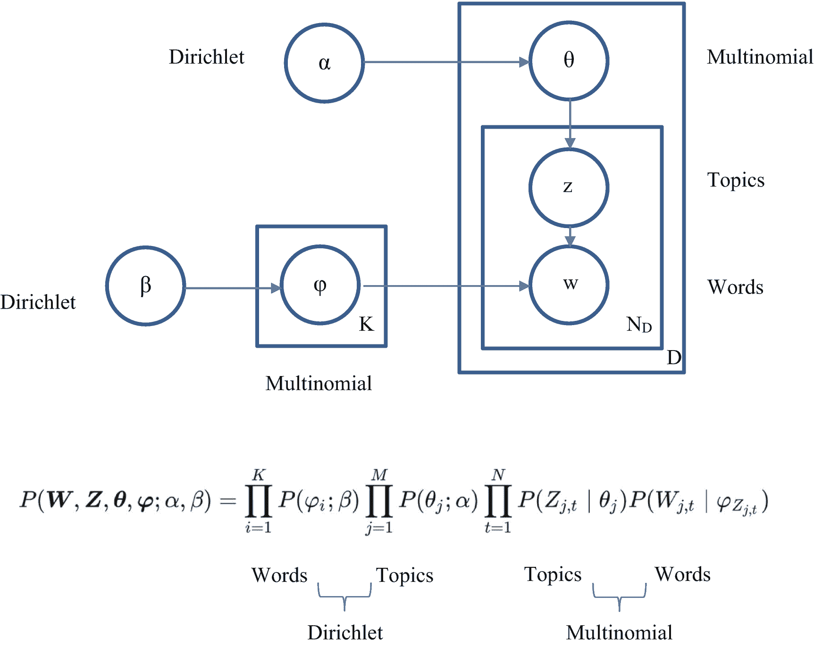

图 7-12

潜在狄利克雷分配演示

乍一看，图表和公式让人不知所措。我们来分解一下，了解一下组件。首先，什么是狄利克雷？狄利克雷分布是一族由正实数向量参数化的连续多元概率分布。它是 beta 的多元推广。图 [7-12](#Fig12) 中的α和β是狄利克雷分布。θ和φ是多项式分布。使用这些发行版，我们可以创建单词和主题，进而可以创建文档。

你可以把 LDA 想象成一个输出文档的引擎。在等式的左边，我们有一个文档出现的概率。当我们调整右边的因素时，我们可以期望生成不同风格的带有主题和单词的文档。等式的前两个部分是狄利克雷分布。取决于关键词的数量，单词(β)可以是顺序为 *n* 的单形。主题(α)可以是阶数小于或等于 *n* 的单形。

让我们直观的了解一下狄利克雷。假设我们有两个话题，即体育和教育。我们可以将它们形象地表示为图 [7-13](#Fig13) 中的狄利克雷。我们再加一个话题，环境；也显示了它的表示。如果有四个主题，记住它将是 3 阶的单形，它是四面体而不是正方形。

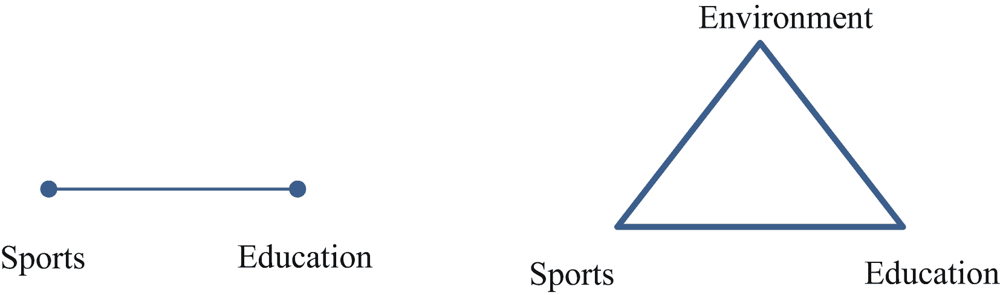

图 7-13

狄利克雷表示

如果有包含体育的文档，它们将被表示为面向体育，而面向教育的文档将被表示为面向教育。这就是不同α值的分布情况(图 [7-14](#Fig14) )。


图 7-14

狄利克雷分布的变化

如果α的值等于 1，则文章中的主题是均匀分布的。如果α值小于 1，则主题分离良好，文档向角落分散。如果α的值大于 1，则所有文档都聚集在中心，没有很好的主题分离。大部分文章的内容倾向于遵循α <1 distribution. The next question is, how about words? We repeat the same notion for the words. In Figure [7-15](#Fig15) ，我们用了四个词:联赛、星球、学校、目标。我们把单词放在角落和点上作为主题。

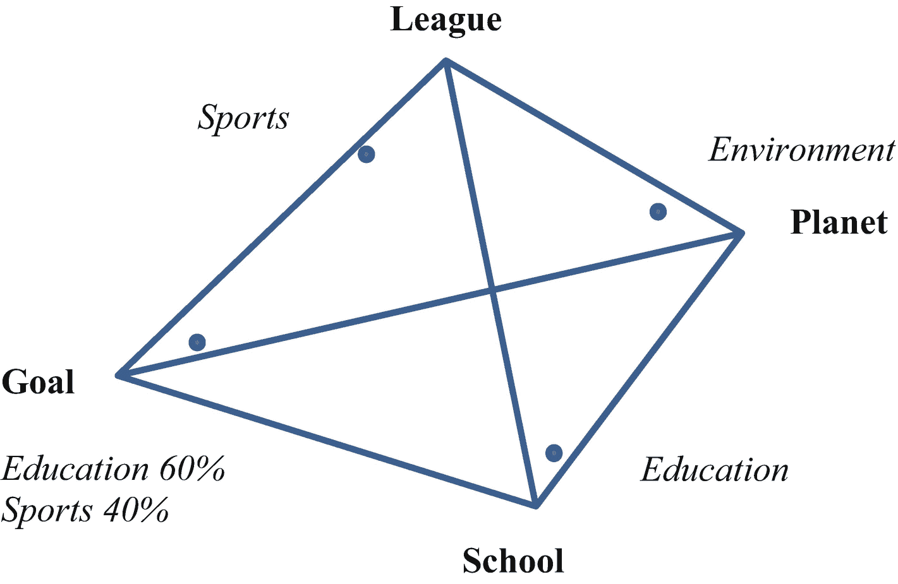

图 7-15

词汇主题

现在让我们将这些放入等式透视图中，并演示如何从这个 LDA 生成单个文档。出于演示的目的，我们将公式分解为四个因素，如图 [7-16](#Fig16) 所示。


图 7-16

公式分解

第一个因素是 2 阶单纯形，其中角包含主题，我们随机选取一个点作为我们要创建的文档之一。请注意，此点朝向体育角。我们可以把这一点表述为一份大约包含 80%体育、10%环境和 10%教育的文件。我们将使用这些百分比来创建因子 3 的多项式分布。从图中可以看出，我们在体育、教育和环境的方框中模拟了相同的百分比分布。如果我们从主题框中选择一个随机主题并多次替换，我们可以预期在因子 3 下的主题分布如图 [7-16](#Fig16) 所示。

现在我们要找到与题目对应的单词。为此，我们选择因子 2，它在角上有单词，在点上有主题。我们基于单词在四面体中的位置来量化与运动相关的单词的百分比。这表现在因子 2 下面的表格中。这个对应的多项式分布在第一个方框中用因子 4 表示。基于教育和环境的因子 2 狄利克雷分布，可以为教育和环境的剩余主题获得类似的多项式分布。

现在，我们回到因素 3，主题分布。我们选择第一个话题，体育。我们从因子 4 中查找对应的词的多项式分布，从第一个框中随机选择一个词，恰好是 *league* 。然后我们转到话题的第二个实例，即教育。然后，我们使用第二个框，代表教育，从因素 4，并选择一个随机的词。姑且说这个随机的词是*学校*。我们对剩余的主题重复这一过程，以识别相应的单词。

从堆叠在一起的主题中识别的所有单词将创建我们的文档。这个机器生成的文档可能没有意义，是不同单词的组合。这是可以接受的，我们多次重复这个过程，改变四个因素的设置来生成多个文档。我们将验证这些机器生成的文档与输入文档的相似性。原始文档在多次迭代中与机器生成的文档相似的概率很低。当我们多次重复这个过程时，我们观察相似性如何随着每次迭代而变化，并选择使机器生成的文档和输入文档之间的相似性最大化的设置。

### LDA 实施

您现在可能想知道，当您面对一个文档集时，如何知道主题的数量。答案是通过超参数设置。在 LDA 中，主题的数量也是一个超参数。根据所选主题的数量，结果会有所不同。当我们把一个文档集呈现给计算机时，它不会像人类那样理解任何解释。但是计算机擅长识别文档中单词出现的频率。我们还可以验证这些单词是如何出现在语料库的不同文档中的。利用这些信息，我们可以给主题加上标签。推动这一过程的有两个主要属性，如下所示:

*   文章尽可能包含单一主题

*   单词尽可能与单个主题相关联

如果我们分解前面的属性，以图 [7-17](#Fig17) 中所示的四个文档为例，我们会发现包含混合单词的文档；通常在文档中存在一个主导主题。我们可以定量地确定单词出现的次数，然后相应地将它们标记为不同的主题。假设我们选择了三个主题；我们将这四个文档分为主题 1、主题 2 和主题 3。


图 7-17

示例语料库

第二个属性在单词“按主题出现”中得到演示。尽管一个单词与多个主题相关联的情况有很多，但是每个单词都强烈地指向一个主题。为简单起见，假设大多数驱动单词分配给主题。然后我们将得到表 [7-11](#Tab11) 中所示的数据。

如果有一些经常出现的词，如 *the、*和 *any、*，则使用*词频-逆文档频*(TF-IDF)的自然语言处理技术将其剔除。这是一种用于识别语料库中最重要的单词的技术。TF–IDF 值与单词在文档中出现的次数成比例增加，并由语料库中包含该单词的文档数抵消，这有助于调整某些单词通常更频繁出现的事实。

我们可以将问题陈述浓缩为将所有单词分类到给定/选定数量的主题中，如果可能的话，为每个文档保留一个主题，如果可能的话，每个单词保留一个主题。这是通过吉布斯采样完成的。我们在这里试图做的是找出描述主题模型中发生的事情的潜在变量。我们假设了一个潜在变量的集合，它完整地描述了我们如何从主题到分配到作业，从而生成完整的文档。

吉布斯抽样允许我们用正确的主题一个接一个地组织所有的单词。这分两步完成。第一步涉及文档内的单词搜索，第二步涉及跨文档的单词搜索。使用图 [7-17](#Fig17) ，让我们从文件 1 中挑选第一个单词，*星球*。我们不会将这个单词分配给任何主题，但我们会统计文档中的其他单词是如何分配给不同主题的。我们有三个星球和一个学校单词。这三个星球单词被分配给话题 1，*学校*根据表 [7-11](#Tab11) 被分配给话题 3。现在我们来看看*行星*这个词是如何在不同的主题中出现的(表 [7-12](#Tab12) )。

使用出现的次数，我们可以计算一个单词属于一个主题的几率。如果我们只是单独使用每个主题的出现次数，我们可能会遇到估计 0 的问题，没有机会为其他主题选择一个词。为了克服这一点，我们增加了小的调整项α和β。如果你回忆一下图 [7-16](#Fig16) 中的方程，α和β是狄利克雷分布。我们对每个文档中的所有单词重复多次，直到我们最大化我们在本节前面讨论的两个属性。吉布斯抽样的一个关键点是，如果可能的话，我们能够以一种单词与单一主题相关联的方式对单词进行重新分类。随着这个过程的迭代进行，计算机将能够帮助你识别每个文档中的主题，并给你一个定义主题的单词列表。作为最后一步，我们将不得不标记这些主题，观察关键字。

我们将通过一个真实的例子来理解如何使用 PySpark 实现 LDA。为此，我们将使用来自 Kaggle ( [`https://www.kaggle.com/PromptCloudHQ/amazon-echo-dot-2-reviews-dataset`](https://www.kaggle.com/PromptCloudHQ/amazon-echo-dot-2-reviews-dataset) )的数据集。该数据集包含智能扬声器 Echo Dot 评论。它包含以下字段:

*   URL 页面

*   标题

*   审查文本

*   设备颜色

*   用户验证

*   审查日期

*   查看有用的计数

*   配置

*   评级

*   声明文本(例如:Vine Voice、Top 100 reviewer 等。)

我们将在建模练习中使用列*评论文本*。

```py
# Import Sparksession
from pyspark.sql import SparkSession
spark=SparkSession.builder.appName("LDA").getOrCreate()

# Print PySpark and Python versions
import sys
print('Python version: '+sys.version)
print('Spark version: '+spark.version)

# Read data

file_location = "lda_data.csv"
file_type = "csv"
infer_schema = "false"
first_row_is_header = "true"

df = spark.read.format(file_type)\
.option("inferSchema", infer_schema)\
.option("header", first_row_is_header)\
.load(file_location)

# Print metadata

df.printSchema()

#  Count data
df.count()
print('The total number of records in the credit card dataset are '+str(df.count()))

%%bash
pip install nltk

# Import appropriate libraries

from pyspark.sql.types import *
from pyspark.mllib.linalg import Vector, Vectors
from pyspark.ml.feature import CountVectorizer , IDF
from pyspark.mllib.clustering import LDA, LDAModel
from pyspark.mllib.linalg import Vectors as MLlibVectors

import re
import nltk
nltk.download('stopwords')
from nltk.corpus import stopwords

```

在前面的步骤中，我们正在读取数据，导入必要的库，并探索与数据相关联的元数据。

```py
reviews = df.rdd.map(lambda x : x['Review Text']).filter(lambda x: x is not None)
StopWords = stopwords.words("english")
tokens = reviews.map(lambda document: document.strip().lower())\
    .map( lambda document: re.split(" ", document)) \
    .map( lambda word: [x for x in word if x.isalpha()]) \
    .map( lambda word: [x for x in word if len(x) > 3] )\
    .map( lambda word: [x for x in word if x not in StopWords]).zipWithIndex()

```

在前面的步骤中，我们将数据框架更改为 RDD，并过滤掉空评论。然后，我们从 *ntlk* 库中加载停用词，并使用多个 lambda 函数去除多余的空格，改为小写，检查字母数字，并删除任何长度小于三个字母的词，包括停用词。最后，我们将为每一行添加一个索引，以便在以后的过程中用作标识符。

```py
# Convert the rdd to DataFrame

df_txts = spark.createDataFrame(tokens, ['list_of_words','index'])

# TF
cv = CountVectorizer(inputCol="list_of_words", outputCol="raw_features", vocabSize=5000, minDF=10)
cvmodel = cv.fit(df_txts)
result_cv = cvmodel.transform(df_txts)

# IDF

idf = IDF(inputCol="raw_features", outputCol="features")
idfModel = idf.fit(result_cv)
result_tfidf = idfModel.transform(result_cv)

```

在前面的步骤中，我们使用内置函数创建术语频率和反向文档频率。`CountVectorizer`帮助将文本文档的集合转换为令牌计数的向量。IDF 对特征重新加权，以降低语料库中频繁出现的值。

我们在 LDA 模型中使用这些数据，这些数据包含每个文档中具有高重要性的单词。然后我们打印出每个主题的前五个单词来理解这个主题。这里我们用了十个话题，但这是最好的吗？不，我们必须尝试不同的组合来确定正确的号码。这里以 10 为例。您可以在不同的组合上重复下面的内容，并观察哪个数字给了您一个有意义的主题集合。

```py
num_topics = 10
max_iterations = 100
lda_model=LDA.train(result_tfidf.select("index", "features").rdd.mapValues(MLlibVectors.fromML).map(list),k = num_topics, maxIterations = max_iterations)

wordNumbers = 5
data_topics=lda_model.describeTopics(maxTermsPerTopic = wordNumbers)
vocabArray = cvmodel.vocabulary
topicIndices = spark.sparkContext.parallelize(data_tp)
def topic_render(topic):
    terms = topic[0]
    result = []
    for i in range(wordNumbers):
        term = vocabArray[terms[i]]
        result.append(term)
    return result

topics_final = topicIndices.map(lambda topic: topic_render(topic)).collect()
for topic in range(len(topics_final)):
    print ("Topic" + str(topic) + ":")
    for term in topics_final[topic]:
        print (term)
    print ('\n')

```

输出:

```py
Topic0:
works
good
speaker
sound
better

Topic1:
know
time
questions
playing
alexa

Topic2:
amazon
another
first
purchased

back

Topic3:
would
device
work
could
give

Topic4:
well
need
thing
pretty
loves

Topic5:
love
great
bought
little
much

Topic6:
home
weather
smart
voice
things

Topic7:
really
getting
without

wish
enjoy

Topic8:
music
echo
play
every
want

Topic9:
product
easy
still
alexa
using

```

### 协同过滤

如果你曾经使用过或者被介绍过任何推荐引擎，那么协作过滤很有可能是在幕后使用的。协同过滤的优势之一是，除了对一组项目的历史偏好之外，它不需要大量的客户数据。一个固有的假设是，未来的偏好与过去的偏好是一致的。有两大类用户偏好，显式和隐式评级。顾名思义，用户根据商定的服务提供商等级给出明确的评级(例如，对于 IMDB，从 1 到 10)。这提供了一个很好的机会，因为我们知道用户有多喜欢或不喜欢某个产品/内容。另一方面，隐式评级是通过参与活动(例如，客户听了多少次特定的曲目、购买、观看等)来衡量的。).

现实世界中的数据通常是双峰的。它是作为两种类型的实体之间的联合交互而创建的。例如，用户对电影的评级受到用户和电影特征的影响。如果您想象一个数据集，其中的行包含不同的用户，列包含他们对电影的评级，那么经典的聚类技术将查看用户在多维空间中的接近程度。我们经常忽略列之间的关系。联合聚类旨在根据对象成对交互的相似性，同时按行和列对对象进行分组。当我们有稀疏数据时，联合聚类是强大的。在大多数现实世界中，数据是稀疏的。观众可以观看有限数量的电影，所以当我们跨用户和电影挑选数据时，数据将是稀疏的，这是联合聚类的最佳示例之一。在协同过滤行话中，我们把它们分别称为基于用户的协同过滤和基于项目的协同过滤。

#### 基于用户的协同过滤

说我们有 *a* x *b* 有用户的收视率矩阵 *u* <sub>*i* ，</sub> *i* =1 到 n；和项 *p* <sub>*j*</sub> ， *j* =1 到*m*；如果我们想要预测等级*r*<sub>*ij*</sub>并且如果用户没有观看项目 *j* ，我们将计算用户 I 和所有其他用户之间的相似性(图 [7-18](#Fig18) )。然后，我们将选择相似性最高的用户，并将这些相似性最高的用户的评级的加权平均值作为权重。

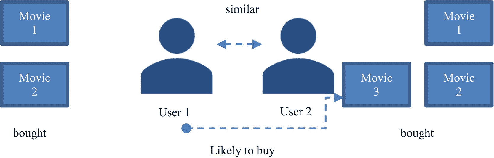

图 7-18

基于用户的协同过滤

*r*T2*ij*=T6】

同样，我们可能有不同类型的评分员，从严格到宽松。为了避免偏见，我们将在计算时使用每个用户对所有项目的平均评分，并将其添加回目标。

*r*<sub>T3】ij=</sub><sub>+</sub>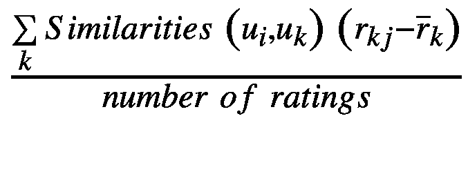

还有其他计算相似度的方法，比如皮尔逊相关和余弦相似度。所有这些指标使我们能够找到与您的目标用户最相似的用户，并且基于这样一个原则，即当用户平等参与或购买类似商品时，他们是相似的。

#### 基于项目的协同过滤

对于基于项目的协同过滤，当两个项目从同一用户接收到相似的评级时，我们认为它们是相似的。然后，我们将通过计算该用户对最相似项目评分的加权平均值，对某个项目的目标进行预测。这种方法为我们提供了稳定性，但计算效率不高。

### 矩阵分解

联合聚类需要使用矩阵分解。这是一种将基于用户和基于项目的交互的初始稀疏矩阵分解成具有较低稀疏性的潜在特征的低维矩阵的方法。潜在特征可以是项目的广泛分类(例如，杂货店中的新鲜产品、电影中的类型)。矩阵分解给了我们一个估计，一部电影有多少适合一个类别，一个用户有多少适合同一个类别。这种方法的最大好处之一是，即使两个用户之间没有对共同项目的显式或隐式评级，我们也能够使用他们共享的潜在特征来找到相似性(图 [7-19](#Fig19) )。


图 7-19

矩阵分解

矩阵分解会将用户和项目矩阵 *R* 拆分成 *U* (基于用户)和 *P* (基于项目)，使得 *R* ~ *U* x *P* ，*U*∈*R*<sup>*m * k*</sup>；*P*∈*R*<sup>*n * k*</sup>。 *k* 这里是因子分解的秩。现在，我们可以将此视为一个优化过程，该过程用最小化成本函数 J:

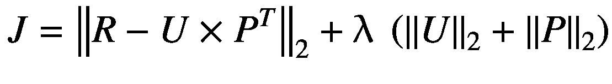

的 *U* 和 *P* 来逼近原始矩阵 *R*

第一项表示 *R* 与其近似值*U*×*P*<sup>*T*</sup>之间的均方误差距离。第二项是正则项，以防止过度拟合。

#### 使用交替最小二乘法优化

ALS 用于通过改变一半的参数来最小化损失函数。通过固定一半的参数，您重新计算另一半并重复，在优化步骤中没有梯度。这是隐式反馈矩阵分解的有效解决方案。梯度计算的成本非常高，因为我们假设未观察到的条目为 0。随着我们更多地讨论成本函数，您将获得更深刻的见解。

基于代价函数，我们尝试学习两类变量，U 和 P，分别表示为 U × P <sup>T</sup> 。该功能的实际成本是以下总和:


加上正则项。由于 U 和 V 是未知变量，这使得这些成本函数是非凸的。如果我们固定 P 并优化 U，我们基本上可以将问题简化为线性回归。这是一个巨大的胜利，而且这个过程可以并行化。ALS 是一个两步迭代过程。在每次迭代中，P 是固定的，U 是求解的。在随后的步骤中，U 被固定，P 被求解。由于普通最小二乘法保证了最小均方误差，所以代价函数永远不可能增加。步骤之间的交替将减少成本函数，直到收敛。

当数据最少时，协同过滤非常适合推荐。但是你必须意识到它的局限性。我们作为矩阵分解的一部分生成的潜在特征是不可解释的。我们还会遇到冷启动的问题。当一个新项目没有相当数量的用户时，该模型将无法推荐该新项目，并可能成为流行偏见的牺牲品。

我们现在将通过使用包含三列的虚构数据集来演示协同过滤的实现:多个用户和电影的*用户 id* 、*电影 id* 和*评级*。所有代码都将在单独的 Jupyter 笔记本中提供，以便于访问。

```py
# Import Sparksession
from pyspark.sql import SparkSession
spark=SparkSession.builder.appName("CF").getOrCreate()

# Print PySpark and Python versions
import sys
print('Python version: '+sys.version)
print('Spark version: '+spark.version)

# Read data

file_location = "cf_data.csv"
file_type = "csv"
infer_schema = "false"
first_row_is_header = "true"

df = spark.read.format(file_type)\
.option("inferSchema", infer_schema)\
.option("header", first_row_is_header)\
.load(file_location)

# Print metadata

df.printSchema()

#  Count data
df.count()
print('The total number of records in the credit card dataset are '+str(df.count()))

# Import appropriate libraries

from pyspark.sql.types import *
import pyspark.sql.functions as sql_fun
from pyspark.ml.recommendation import ALS, ALSModel
from pyspark.mllib.evaluation import RegressionMetrics, RankingMetrics
from pyspark.ml.evaluation import RegressionEvaluator
import re

# Casting variables

int_vars=['userId','movieId']
for column in int_vars:
      df=df.withColumn(column,df[column].cast(IntegerType()))
float_vars=['rating']
for column in float_vars:
      df=df.withColumn(column,df[column].cast(FloatType()))

(training, test) = df.randomSplit([0.8, 0.2])

```

请注意，我们正在使用 ALS 优化来实现矩阵分解。PySpark 中 ALS 模型的参数如下:

*   `NumBlocks`是为了并行计算，用户和项目将被划分成的块数。

*   `rank`是模型中潜在特征的数量。

*   `maxIter`是要运行的最大迭代次数。

*   `regParam`指定 ALS 中的正则化参数。

*   `implicitPrefs`指定是使用显式反馈 ALS 变量还是适用于隐式反馈数据的变量(默认为 false，表示使用显式反馈)。

*   `alpha`是一个适用于 ALS 隐式反馈变量的参数，控制偏好观察的基线置信度(默认为 1.0)。

我们将`coldStartStrategy`设置为`drop`,以消除空的评估指标。

```py
als = ALS(rank=15,maxIter=2, regParam=0.01,
          userCol="userId", itemCol="movieId", ratingCol="rating",
          coldStartStrategy="drop",
          implicitPrefs=False)
model = als.fit(training)

# Evaluate the model by computing the RMSE on the test data
predictions = model.transform(test)
evaluator = RegressionEvaluator(metricName="rmse", labelCol="rating",
                                predictionCol="prediction")

rmse = evaluator.evaluate(predictions)
print("Root-mean-square error = " + str(rmse))

# Generate top 10 movie recommendations for each user
userRecs = model.recommendForAllUsers(10)
userRecs.count()

# Generate top 10 user recommendations for each movie
movieRecs = model.recommendForAllItems(10)
movieRecs.count()

userRecs_df = userRecs.toPandas()
print(userRecs_df.shape)

movieRecs_df = movieRecs.toPandas()
print(movieRecs_df.shape)

userRecs_df.head()

```

**输出:**


EXERCISE : COLLABORATIVE FILTERING

**问题 1:** 改变 ALS 设置中的潜在特征数量，观察均方误差如何变化。

## 摘要

*   我们对无监督学习技术进行了概述。

*   我们现在知道了层次聚类方法和非层次聚类方法之间的差异以及轮廓系数，以确定正确的聚类数。

*   我们探讨了潜在的狄利克雷分配如何工作，并实施它。

*   我们还回顾了使用交替最小二乘法的协同过滤的实现。

干得好！您现在已经熟悉了一些在无监督学习和非结构化数据中有用的关键概念。在下一章，我们将带你经历一次如何构建项目和创建自动化机器学习流程的旅程。