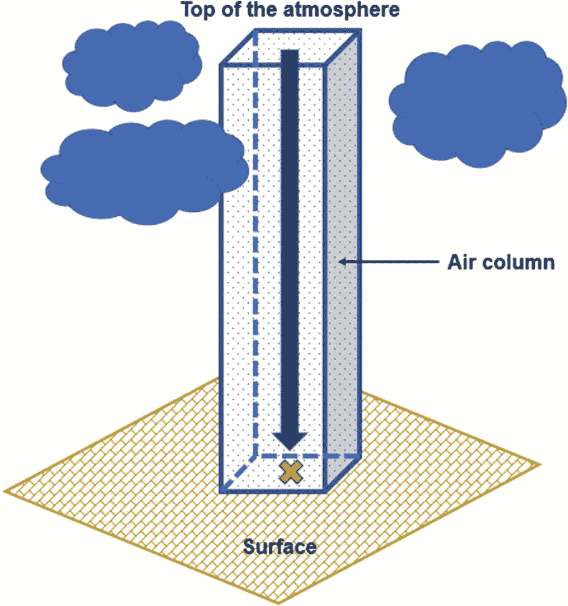
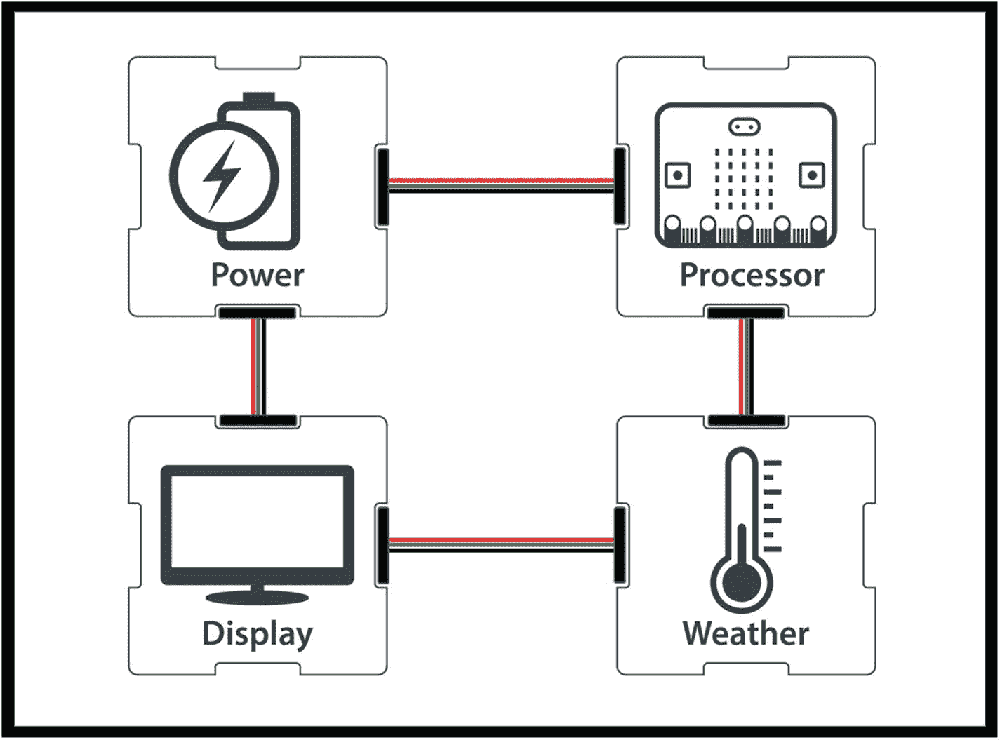
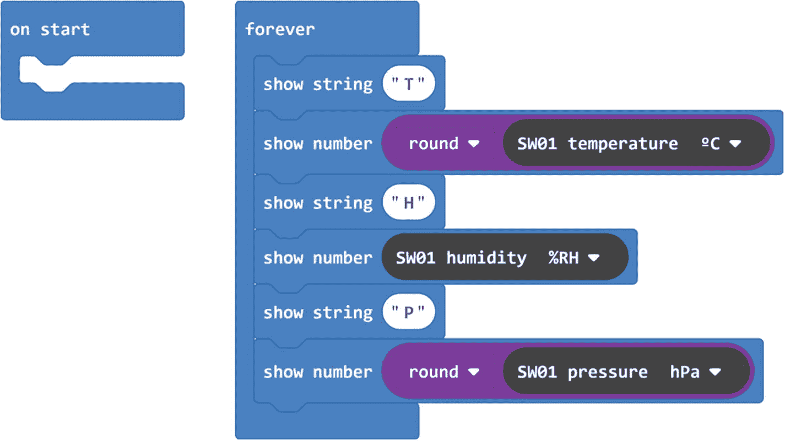
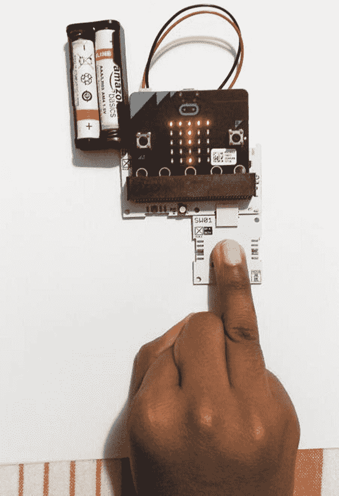
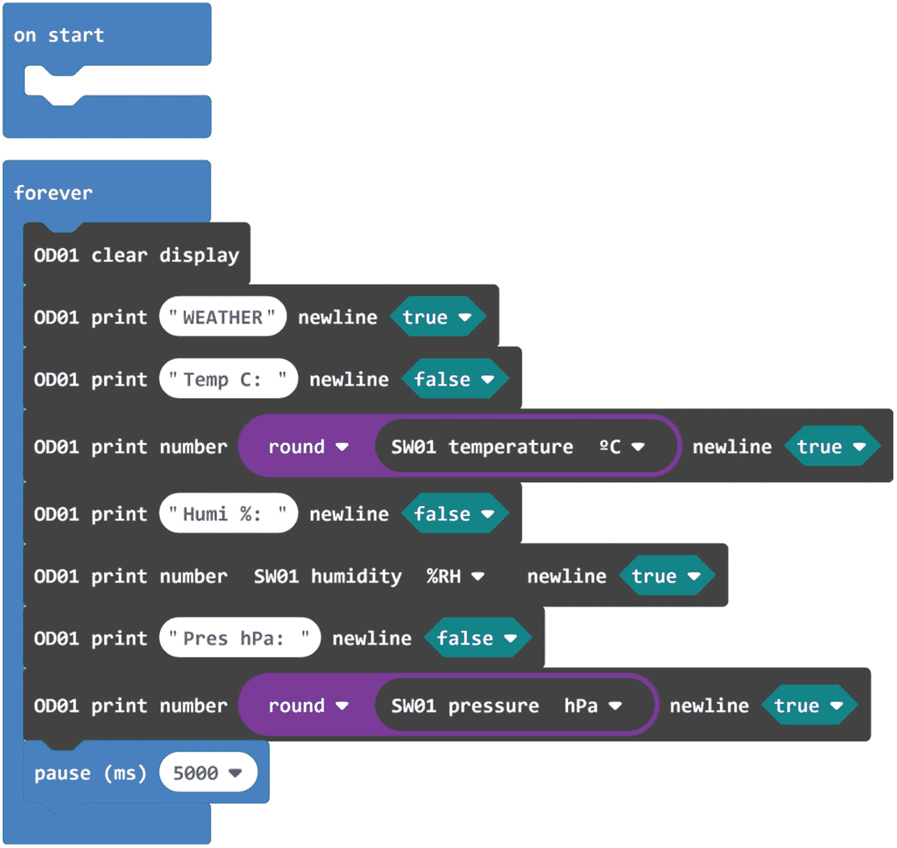
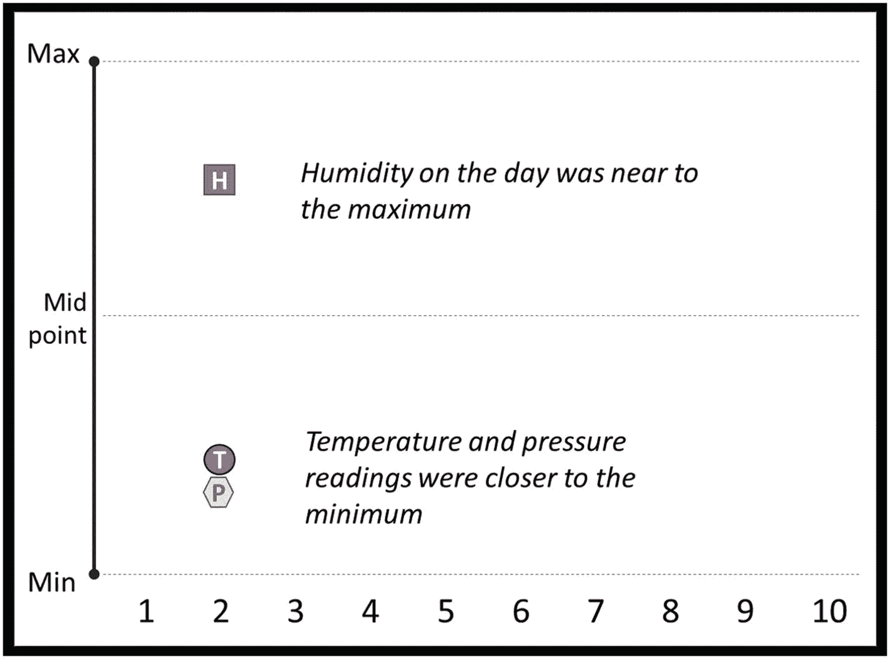
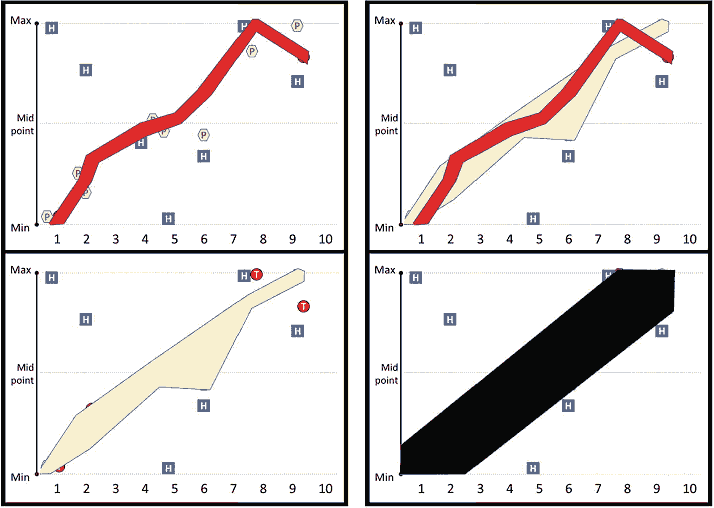

# 三、天气实验

本章我们将设计一个实验，记录温度、湿度和大气压。我们将使用我们的数字工具包来建立一个气象站，然后我们将调查这些措施如何影响我们对天气的日常感知。

## 3.1 导言

如果您必须在数据科学中挑选一个最重要的概念，它可能是**相关性**:

> 当两个不同的数据集相关时，这意味着它们通常会以相互可预测的方式表现:通过观察一个数据集，我们可以对另一个数据集做出预测。我们对相关性有一个直观的理解:我们知道晚上会变冷，所以一天中的时间和温度之间存在相关性；我们还理所当然地认为，在其他条件相同的情况下，高个子往往比矮个子重一点。很多我们所谓的“常识”都是建立在这种现实世界的关联之上的。我们将在 ***章节*** [**5**](05.html) *中更详细地查看相关性。*

发现数据中的相关性是令人兴奋的，可以带来非常有趣的，有时是开创性的见解。我们将收集大量数据，然后从中寻找相关性。

## 3.2 测量天气

人类对天气有感觉——我们对天气的体验是发自内心的——我们能感觉到。它可以成就或摧毁我们的心情，拯救或毁灭整个文明，把梦想变成终生的遗憾。当然，还有那些美丽的彩虹！

天气是人类的基本经验；随着气候变化扰乱世界各地的天气模式并带来极端事件，研究气候变化的需求变得越来越迫切。我们对天气了解得越多，我们就能更好地预测它，甚至控制它。但是这种理解是从数据开始的，我们要收集数据。那么我们如何衡量**【天气】**？

气候/天气科学家使用各种测量方法，如温度、湿度、大气压力、光照水平、土壤湿度、土壤温度、风向和风速、雨量计等等:

> 有一系列令人眼花缭乱的因素影响或有助于描述“天气”***。****用来预测天气的数学简称为* ***混沌理论*** *，非常贴切！一只蝴蝶可能会在亚马逊轻轻扇动翅膀，在保加利亚引起一场季风，但前提是无数的其他因素都完全一致。天气预测赢得了战争，也失去了生命，提高这些预测的质量是整个数据科学家行业永无止境的追求。*****

 ****## 3.3 选择要测量的数据

我们将建立一个气象站，监测三个关键的天气相关参数(因素):

温度:我们已经详细讨论过这个问题了。

**湿度**是空气中水蒸气(湿气)的含量。水蒸气是水的气态:微小的水颗粒，是我们呼吸的空气的一部分。

和温度一样，极端的湿度让人不舒服:低湿度沙漠的干燥、易碎的热量和雨林潮湿、令人作呕的粘性让人感觉非常不同，但同样不舒服。

湿度通常有两种测量方法。

1.  一种方法叫做**比湿度**:这是一千克质量的空气(包括水)中水蒸气质量的量度。如果空气越潮湿，水蒸气就越多。如果空气湿度低，水蒸气就少。

2.  一个更常见的测量方法是**相对湿度**，这是空气中的水蒸气量与空气在该温度下可能包含的最大水蒸气量之比——较热的空气比冷空气能容纳更多的水蒸气。该值显示为百分比。

当你看天气预报时，他们提到了湿度，他们通常指的是相对湿度:我们对湿度的感知更多地与相对湿度相关，而不是比湿度。

我们使用一种叫做**湿度计**的工具来测量空气、土壤或密闭空间中的蒸汽量。有模拟和数字湿度计:我们的工具将是数字化的。

**大气压力**(有时也称为大气压力)是大气施加的压力量；

> 向上看:在你上方几英里的地方有空气，很多很多的空气，而且有质量。这些空气被重力拉向你的头部！大气压力基本上是对给定区域上方有多少空气的度量。

我们通过观察空气施加在固定面积上的压力来测量大气压力。例如，在平常的日子里，海平面上的大气压力大约是每平方英寸 14.7 磅。这相当于

*   大约每平方厘米 1 千克的压力

*   平均体型的成年人身上有几吨重

*   大约 2000 平方英尺的房子重达 2100 吨

**图** [**3-1**](#Fig1) 说明了点 **X** 处的压力是其上方空气重量的一个因素。

图 3-1

向 X 点施加压力的柱体中空气的重量

测量大气压力最常用的单位是帕斯卡或千帕:1 千帕= 1000 帕。其他使用的单位包括 PSI(磅每平方英寸)和毫巴(或仅仅是巴)。在本书中，我们将使用 kPa。

> 为了理解千帕标度，注意海平面上的压力大约为 101 千帕是有帮助的。随着你越走越高，平均千帕下降——在珠穆朗玛峰*顶部大约是 34 千帕。在海平面或海平面以上的空气中，有记录以来自然出现的最高压力略低于 109 千帕。*

当你快速改变高度时，气压会让你的耳朵砰砰作响，当我们给轮胎打气时，气压也会增加轮胎的重量。当我们给气球充气时，我们增加了内部的压力，当压力特别高时，许多人报告了头痛和焦虑等反应。正如温度和湿度一样，大气压力是我们能够感知的。

大气压力也是天气的一个重要方面:高压力往往带来更稳定和舒适的天气，而下降的压力往往先于恶劣的条件。空气从高气压区向低气压区的移动是塑造地球天气的基本力量。

## 3.4 天气实验

实验是一个设计用来学习或展示已经学过的东西的项目。在这个实验中，我们将尝试了解我们收集的测量值如何与我们描述天气的方式相关联:

> 这个天气实验将帮助我们理解温度、湿度和大气压力与我们对天气的感知之间的关系。该实验将显示这些措施的组合为记录数据的人提供了理想的天气条件。

在我们的实验中，我们将在不同的时间段收集温度、湿度和大气压力数据。理想的情况是保持几天的日志。

当我们读取数据时，我们将对当时的天气进行主观评估，我们将给出 1 到 10 分的分数，其中

1.  10 分意味着在一年中的那个时候，你所在的地方可能会有最好的天气

2.  1 分意味着这是一年中这个时候最糟糕的天气

3.  5 分意味着天气完全符合一年中这个时候的预期

这是主观的:根据你在记录数据时对天气的感觉给出一个分数——不要想太多！多样化也很好——试着收集各种不同天气条件下的结果。

我们将根据**表** [**3-1**](#Par111) 将数据记录在一个表中。

***表 3-1。*** *我们气象站实验的空白数据表*

该实验将**客观数据**(时间、温度、湿度和压力)与**主观数据**(满分为 10 分的评分和注释)混合在一起。

> 主观测量通常不太可靠，数据科学家尽可能避免使用它们，或者在不可靠的地方对它们进行严格管理。但我们在分析时会小心，不要推断我们的结果:这个实验将让记录他们评级的人深入了解他们对天气的体验是如何与温度、湿度和大气压联系在一起的。我们不应该指望实验能告诉我们别的什么。但我们将在分析中保持开放的心态。

## 3.5 构建我们的气象站工具

为了进行我们的实验，我们需要建立一个数字仪器来测量温度、湿度和大气压力。

**图** [**3-2**](#Fig2) 为数字气象站仪器的**【电路】**或**【方块】**图。

图 3-2

气象站工具的“电路图”或“框图”,带有电源、气象传感器和连接到微处理器的有机发光二极管显示器

**表** [**3-2**](#Tab2) 列出了我们将用来构建气象站工具的硬件。

表 3-2

气象站工具的硬件要求

    
| 

你需要什么

 | 

我们用什么

 | 

数量

 | 

可供选择的事物

 |
| --- | --- | --- | --- |
| 一个微处理器和闪存代码的方法 | 微型:带 USB 电缆的 bit，用于连接笔记本电脑/台式机 | one | 树莓派赛车场 |
| 力量 | 2 个 AAA 电池盒 | one | 西诺夫公司太阳能电池 |
| 读取天气数据的传感器 | XinaBox SW01–高级天气传感器 | one | SparkFun Weatherbit |
| 查看数据的屏幕 | 微型:5x5 位 LED 矩阵 | one | XinaBox OD01–64x 128 有机发光二极管显示器 |
| 将它们连接在一起的方法 | XinaBox IM01 微型:位桥 | one | 试验板、边缘连接器分线点、鳄鱼/鳄鱼线和连接线 |
| 将 xChips 连接在一起的 xBus 连接器 | three |

我们将向您展示显示传感器数据的两个选项:

1.  本节和**第 3.6 节**显示了如何使用 micro:bit 5x5 LED 矩阵。

2.  在**第 3.7 节**中，我们将为 micro:bit(XinaBox OD01)添加一个 64x128 像素的有机发光二极管显示器，并在那里输出我们的数据。

选择适当的选项，并按照下图所示组装零件。或者使用一组完全不同的组件来构建一个可以执行相同功能的工具。目标是收集数据并进行分析；我们使用的工具不是特别重要。

**图** [**3-3**](#Fig3) 显示的是没有有机发光二极管显示的气象站。

图 3-3

气象站使用微型:位 LED 矩阵进行显示

**图 3-4****显示了带有有机发光二极管显示的气象站。**

 **

图 3-4

带有机发光二极管显示器的气象站

## 3.6 为我们的气象站编码

硬件已经准备好了，但我们需要教会微处理器/微:bit 如何像数字气象站一样运转:我们需要对它进行编码。

**表格** [**3-3**](#Tab3) 显示了**自然语言代码**，我们将把它转换成 MakeCode 块。

表 3-3

数字气象站的自然语言代码

   
| 

步骤

 | 

自然语言代码

 | 

笔记

 |
| --- | --- | --- |
| one | 加载任何需要的库。 | 我们需要核心微位库以及天气传感器库。 |
| Two | 不断重复以下步骤。 | *程序将持续运行，直到 micro:bit 关闭。将重复以下动作…* |
| three | 在屏幕上打印“T ”,然后显示温度。 | 我们只打印温度的“T ”,以避免等待滚动。 |
| four | 在屏幕上打印“H ”,然后显示湿度。 | 出于同样的原因，我们将“H”打印为湿度。 |
| five | 在屏幕上打印“P ”,然后显示大气压力。 | 我们只打印“P”代表大气压。 |

> ***无代码选项*** *:您可以在我们的* ***资源网站*** *上找到本节使用的代码的预编译版本。转到* [`http://xib.one/XB`](http://xib.one/XB) *并搜索* ***第 3.6 节*** *。*

**表** [**3-4**](#Tab4) 展示了如何将前面的**自然语言代码**转换成 **MakeCode** 块，可以编译并加载到您的 micro:bit 上。

表 3-4

使用 make 代码块开发代码

   
| 

步骤

 | 

制造商代码

 | 

笔记

 |
| --- | --- | --- |
| one | 将 XinaBox **SW01** 扩展添加到项目中。 | 点击**高级** / **扩展**。输入“XinaBox”[1](#Fn1)。选择 **SW01** 。 |
| Two | 确保你的编码区域有一个永久循环。 |  |
| three | 将此处显示的两个模块添加到**永久**模块中: | 第一个程序块显示“T”。第二块以整数形式显示温度。 |
| four | 将此处显示的两个模块添加到**温度**模块后的**永久**模块中: | 第一个块导致“H”滚动。第二块显示相对湿度。不需要转换成整数。 |
| five | 在**湿度**区块之后，将此处显示的 2 个区块添加到**永久**区块: | 第一个程序块显示“T”。第二块以整数形式显示压力。 |

**图** [**3-5**](#Fig5) 显示了 micro:bit 气象站的完整 **MakeCode** 程序清单。

图 3-5

为micro:bit气象站制作代码块

现在代码已经写好了，你只需要编译它并下载(“闪存”)到你的 micro:bit 上。

一旦闪烁过程完成，温度、湿度和大气压力数据将在 5x5 LED 矩阵上连续滚动。

传感器读数来自安装在 SW01 上的一个小芯片:Bosch **BME280** 是 SW01 正面的一个小金属立方体。通过操纵读数测试传感器是否工作:

1.  **Temperature**: Touch the sensor for a few seconds with a finger. The heat from your finger should cause the temperature to rise (**Figure** [**3-6**](#Fig6)).

    

    图 3-6

    用手指触摸传感器

2.  **Humidity**: Manipulate the humidity by breathing onto the BME280 sensor. The moisture in your breath should cause the humidity to increase (**Figure** [**3-7**](#Fig7)).

    

    图 3-7

    加湿传感器

3.  **Pressure**: Take a hollow rubber tube and place one side on the SW01 so that it covers the BME280 sensor. Hold the tube and board tightly together. Now blow air (blow hard through pursed lips) into the other end of the tube. This should increase the pressure (**Figure** [**3-8**](#Fig8)).

    

    图 3-8

    向传感器施加气压

## 3.7 升级显示器

micro:bit 5x5 LED 矩阵足以显示三个测量值，但屏幕上一次只能显示一个字符，难以阅读。当一个字符在屏幕上滚动时，很容易漏掉它。

为了解决这一弱点，并为我们提供一个更大的屏幕来输出数据/信息，我们将升级到有机发光二极管显示器。我们将使用来自 XinaBox [2](#Fn2) 的 64x128 像素 OD01 显示器，我们将修改代码，以便同时在有机发光二极管上显示所有三个测量值。

> ***无代码选项*** *:您可以在我们的* ***资源网站****(*[`http://xib.one/XB`](http://xib.one/XB)*)找到本节所需代码的预编译版本。*

我们在这里构建的工具在前面的**图** [**3-4**](#Fig4) 中显示过。它的代码非常相似:我们只需要修改它，将输出定向到 64x128 有机发光二极管屏幕，而不是 micro:bit 的 5x5 LED 矩阵。

**图** [**3-9**](#Fig9) 显示了带有 XinaBox OD01 有机发光二极管显示器的 micro:bit 气象站的 **MakeCode** 块。

图 3-9

用有机发光二极管制作micro:bit气象站代码块

Note

这段代码需要 XinaBox **OD01** 扩展。通过点击**高级/** **扩展**然后输入**“xinabox/pxt-od01”**来导入这个。

## 3.8 实验设计

我们有设计实验所需的所有背景信息，也有收集数据的数字工具。我们将遵循的流程在**表** [**3-5**](#Tab5) 中概述。

表 3-5

练习 3-1 的详细信息

  
| 

练习 3-1

 | 

温度、湿度和大气压力的综合效应如何影响我对天气的感知

 |
| --- | --- |
| 摘要 | 使用**表** [**3-1**](#Par111) 作为模板，保存天气数据日志。数据可以在一天中的任何时间获取:尽可能多的针对不同的天气情况。尝试进行大约 15 次测量。本练习旨在介绍如何处理多个变量，并在数据中寻找模式/相关性。如果实验按计划进行，参与者可能会注意到温度和压力之间有趣的相关性。 |
| 循序渐进的过程 | 1.参与者应绘制一张表格来获取数据。他们需要使用测量温度、湿度和大气压力的工具。2.参与者应该尝试每天记录几次数据，最好是在各种条件下。我们想收集各种各样的数据。使用我们在第 [1](01.html) 和 [2](02.html) 章中学到的小心操作数据收集工具。3.当参与者已经收集了 15 个数据点时，这就足够了。4.收集数据时，按照第 3.9 节分析中的**点进行工作。** |
| 我们将学到什么 | 温度、湿度和压力如何影响我们对天气的评价。相关性介绍。在我们的分析中使用可视化。自然界中的温度和压力 [3](#Fn3) 之间存在相关性，这有可能在您的结果中表现出来。如果是这样，我们使用的可视化技术应该可以帮助我们看到这一点。 |

## 3.9 可视化我们收集的数据

我们已经收集了相当多的数据:完整的表格中数字密集。大多数人发现，通过将数据/数字转换成图像，如信息图或图表，更容易理解它们。这些**可视化**是数据的总结，其中最好的可以将多年的研究和数据收集浓缩成普通人一眼就能看懂的简单表示。在本节中，我们将在纸上创建一个可视化效果，我们将在下一节中对其进行分析，以寻找我们最初问题的答案。

先在一张纸上画一个空的图表，如图**图** [**3-10**](#Fig10) 所示。

图 3-10

准备好添加数据的空白图表

接下来将下表(**表** [**3-6**](#Tab6) )复制到另一张纸上，并填写温度、湿度和压力的最大值和最小值。我们还对中点感兴趣——最小值和最大值之间的中间值。通过执行以下操作来填写:

*   通过从最大值中减去最小值找到范围。

*   将范围除以 2。

*   将该值与最小值相加得到中点。

> 因此，如果你的最小值是 12，最大值是 20，那么中点就是 16。

> *对于最小值 94 和最大值 101，中点为 97.5。*

表 3-6

记录范围(最小最大)气象值

      
| 

措施

 | 

福建话

 | 

最大

 | 

范围

(最大–最小)

 | 

半范围

(范围/2)

 | 

中点

(最小+半范围)

 |
| --- | --- | --- | --- | --- | --- |
| 温度 | Eleven | Twenty-seven | Sixteen | eight | Nineteen |
| 湿度 | Thirty | sixty-eight | Thirty-eight | Nineteen | forty-nine |
| 压 | Ninety-five | One hundred and two | seven | Three point five | Ninety-eight point five |

我们将使用表 [3-6](#Tab6) 作为参考，处理每一行天气数据，在图表中添加温度、湿度和压力的标记。我们为每个变量添加一个视觉上截然不同的标记(如图**图** [**3-11**](#Fig11) )。

图 3-11

添加了第一行数据的图表

我们从第一行数据开始，如**表** [**3-7**](#Tab7) 所示。

表 3-7

我的第一个数据点——英国一个悲惨的雨天

       
| 

一天

 | 

时间

 | 

临时雇员

 | 

湿度

 | 

压

 | 

评级

 | 

笔记

 |
| --- | --- | --- | --- | --- | --- | --- |
| 孟人 | 上午 10 点 | Sixteen | Fifty-five | Ninety-seven | **2** | 羊毛和雨水 |

当我们将这一行数据添加到图表中时，它看起来像是**图** [**3-11**](#Fig11) 。

在**图** [**3-11**](#Fig11) 中可以清楚的看到哪个值是温度、湿度、压力。如果您愿意，您可以使用其他标记，只要确保很容易看到哪个标记适用于每个度量。

要在图表上放置标记，请按照下列步骤操作:

*   所有三个标记都直接添加在数字 2 的上方。这是我给的评价:夏天很冷，下着大雨，所以我给它打了 2 分。

*   我的整体最低温度是 12 度，最高温度是 27 度，所以中点是 19.5 度。那天的温度是 15 度，高于最低温度，但低于中间温度。我在最小值和中点之间添加了“T”标记，稍微靠近最小值。

*   我的最小湿度是 30，最大湿度是 68，中点是 49。我记录的值，58，大约在中点和最大值的中间。我在中点和最大值之间添加了“H”标记。

*   我的最低血压是 95，最高是 101。我的读数，96，低于中点(98)，高于最小值，更接近最小值。我已经在最小值上方添加了“P”标记。

以此类推:继续使用这种方法，遍历表中的所有行，向图表添加标记。有些会有一点重叠，但没关系——这个想法是我们已经清楚地标记了温度、湿度和压力，所以当我们看图表时，我们的眼睛可以很容易地识别每个标记所代表的内容。完成后，您的图表看起来应该类似于图**[**3-12**](#Fig12)所示。**

 **

图 3-12

完整的可视化

你可能已经注意到，我们在绘制数据图表时有点不精确；如果再努力一点，它可能会准确得多。可视化只是数据的总结:它是一个快照，比充满数字的表格更容易理解。我们已经采取了一些捷径来使绘制图表变得更加容易和快捷，但是如果我们的可视化不够充分，我们总是可以尝试以更高的精确度来创建它。让我们看看我们是如何处理它的。

## 3.10 分析我们收集的数据

在第 [1](01.html) 和 [2](02.html) 章中，我们看了一系列关于数据和实验设计的不同问题，当数据分析开始时，这些问题应该一直在你的脑海中。

但是对于这个实验，我们声明的目标非常明确:记录数据的人将了解温度、湿度和大气压力如何影响他们对天气的个人体验。在你的下一个假期里，你最想要这些变量的什么组合水平？

让我们看看我们能从图表中学到什么。鉴于本实验中制作的每张图表都不相同，因此无法预测您看到的是什么。相反，我们将回顾作者在进行这个实验时收集的结果。

我们在**图** [**3-12**](#Fig12) 中看到了完整的结果，但我们在寻找模式。为了有助于我们的搜索，考虑我们在图**图** [**3-13**](#Fig13) 中添加的以下标记:

图 3-13

将我的体温和血压分在一起

*   温度标记周围的红框

*   压力标记周围的黄色方框

*   两者周围都有一个黑盒子

黑匣子非常有效地显示了我给出的等级与温度和压力之间的关系:

*   **图左上方** [**3-13**](#Fig13) :我的评分与温度密切相关:我喜欢温暖的日子，与寒冷的日子相比，我倾向于给温暖的日子打更高的分。这并不奇怪，也不是什么新消息:我早就知道了。但这是一个好消息:我创建的可视化显示了一个我知道是真实的相关性，这验证了我们使用的可视化。也许数据中还隐藏着其他不太明显的相关性。

*   **图左下方** [**3-13**](#Fig13) :压力也和我的评分有关联:我喜欢压力大的日子胜过压力小的日子。这让我有点吃惊:在进行这个实验之前，我并没有太注意这一点。

*   高湿度与我的评分极限相关:如果湿度高，我要么喜欢这一天，要么讨厌这一天。这对我来说也有点意外，我不知道是怎么回事。这是有用的信息，还是仅仅是有趣的？

你找到类似的东西了吗？每个可视化都是独一无二的，得出的任何结论都是个人的:它们只适用于记录评级数据的人。

> 对于一些完成可视化的人来说，温度和大气压力标记可能会显示出相关性的证据。在这里显示的数据中，我们可以看到(相对)低温和低压是如何同时出现的，高温和高压也是如此。这可以在图 [*3-13*](#Fig13) *中观察到:右边的图表显示压力和温度显示非常相似的行为。你的体温和血压分数显示了这种品质吗？*

如果答案是肯定的，那么倾向于认为温度和压力之间的关系已经被证明了。但是我们的实验并不是为了得出这个结论。我们的实验达到了目的:我们了解了一些关于我们如何感知天气状况的事情。此外，它也给了我们一些有趣的线索:两个完全不同的现象之间的真实世界的相关性。但是，为了能够肯定地说温度和压力之间存在关联，我们需要收集更多的数据，并使用更复杂的分析技术。在下结论时，谨慎是明智的:确凿的事实是数据科学中的宝贵财富，通常很难获得。

## 3.11 摘要

在这一章中，我们开始了解温度、湿度和压力如何影响我们对天气的感知，我们已经建立了工具和可视化来帮助我们回答这个问题。我们的目标是介绍相关性的概念，并在我们收集的数据中寻找一些相关性。我们将在第**章** [**第 5 章**](05.html) 中再次查看相关性。

一些读者会在他们的视觉化图像中观察到有意义的相关性:他们告诉你一些感觉有趣和/或真实的事情。也许这是你已经知道的事情(我们大多数人都知道温度如何影响我们对天气的评价)，或者也许有新的信息(很少有人知道大气压力的影响)。关键的外卖不是我们学到(或没学到)的温度、湿度或压力。相反，这个练习表明，您可以收集不同的数据集并应用分析技术来揭示它们之间的相关性:使用数据科学，我们可以分析不同现实世界现象之间的相互影响。我们可以了解这个世界的新事物。

<aside aria-label="Footnotes" class="FootnoteSection" epub:type="footnotes">Footnotes [1](#Fn1_source)

交替输入“xinabox/pxt-sw01”。

  [2](#Fn2_source)

该 xChip 上安装了 SSD1306 显示芯片。这是一种被许多制造商使用的非常普通的芯片。为 XinaBox OD01 编写的代码应该相对容易转换为其他基于 SSD1306 的外设。

  [3](#Fn3_source)

盖伊-吕萨克定律。

 </aside>********