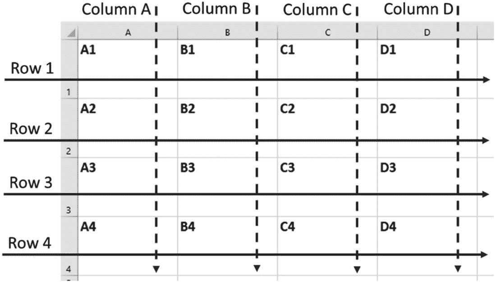
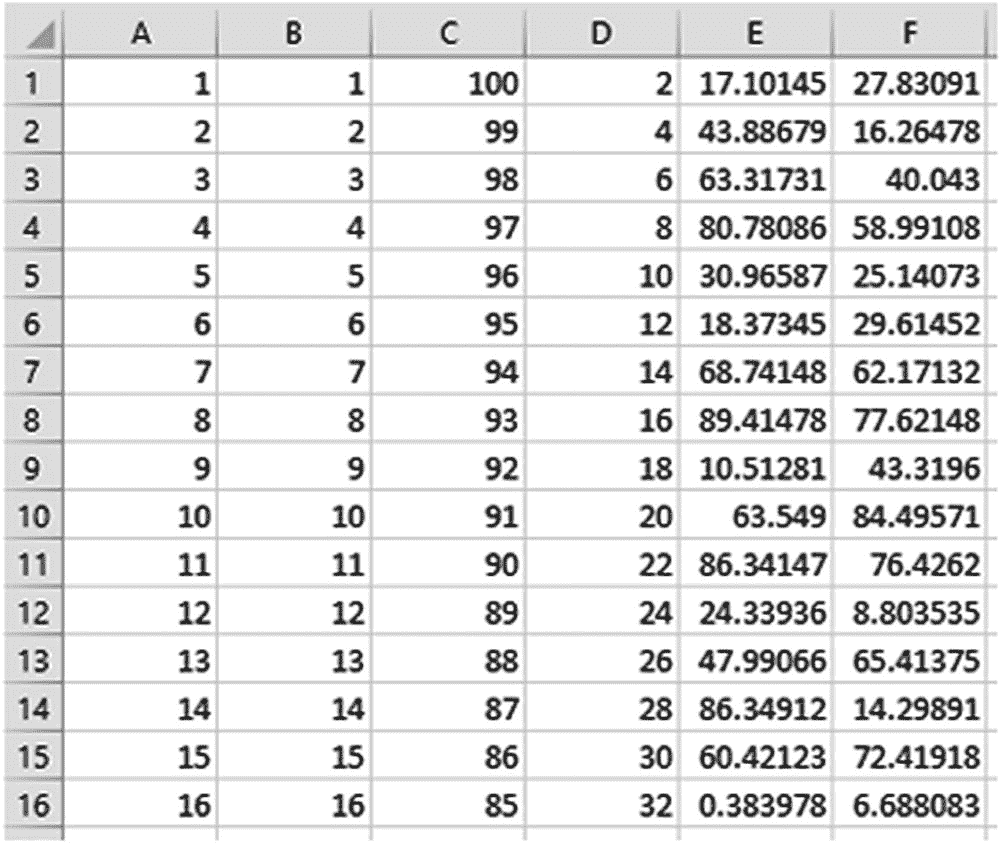
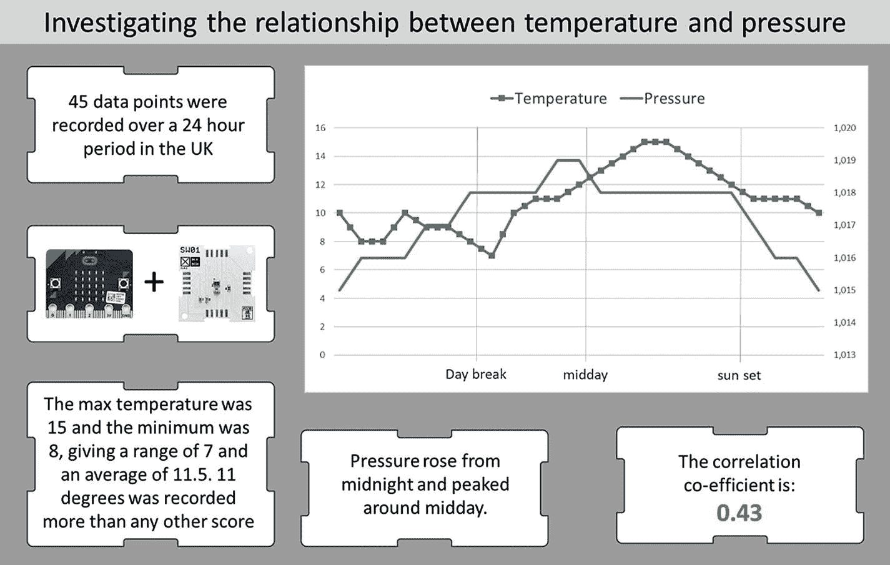

# 5.数据分析介绍

从**章** [**4**](04.html) 我们继承了一张数据表。我们的目标是分析我们收集的温度和压力数据之间的关系，看看这些测量之间是否有相似之处，如果有，它们有意义吗？我们如何衡量相关性？

在这一章中，我们将研究如何使用广泛可用的软件来回答这个问题，在这个过程中解锁一个大多数计算机用户都可以访问的丰富且易于使用的数据分析工具。现代电子表格程序让数据科学触手可及，本章将向您展示如何利用这些技术瑰宝。

## 5.1 扩展我们的分析工具

为了查看第**章** [**第 4 章**](04.html)**中的温度和压力数据，我们可以使用与第**章** [**第 3 章**](03.html) 中使用的方法相似的方法:手工绘制可视化。现在可能需要更长的时间，这取决于你收集了多少数据，但这是可能的。**

 **但是，这并不能很好地扩展——当我们收集整整一个月的天气数据，或者我们找到一种收集(比如说)10，000 个数据点的方法时，会发生什么呢？我们将会到达这样一个阶段，通过一张表来查看范围，或者手绘一张图表，不再是一个人可以实际承担的任务。

正如我们在第**章** [**4**](04.html) 中使用永久记忆来减少人类在数据收集过程中需要扮演的角色一样，我们也将使用数字工具来帮助我们进行分析。

## 5.2 数据分析软件

在采用计算机之前，数据分析是非常缓慢和劳动密集型的。使用了与我们在前面章节中创建的相似的手绘数据表，进行我们一直在关注的基于数据的实验需要广泛的技能、大量的训练和极大的耐心；品质的罕见结合。

随着计算机的出现以及我们在前面章节中探索的各种功能的开发，数据科学的潜力呈指数级增长:

软件取代了人类的努力，但是在数据科学过程中，计算机和代码并没有取代我们。相反，它们把我们从世俗的任务中解放出来，让我们把时间和注意力投入到需要人类智慧和直觉的过程中。尽管人工智能(AI)最近有了一些发展，但没有一个数据科学实验是完全由计算机进行的。人的因素总是存在且不可替代的。

公平地说，数据分析的计算机化使数据科学民主化:强大且可用的软件允许任何人用笔记本电脑和一些数据进行复杂的分析。

没有一套软件是数据科学家的标准。许多人相信 Python、SAS 或某种 SQL。在本章中，我们将使用一个电子表格，它具有我们需要的所有功能，包括:

*   支持数据表。我们创建的 CSV 文件可以在任何电子表格程序中轻松打开。

*   许多电子表格程序都有我们可以用来进行数据分析的内置函数，例如测量两组数据之间相关性的函数。

*   支持可视化。大多数电子表格允许您轻松创建标准图表和其他可视化效果。

*   电子表格相对容易使用。

*   强大的电子表格程序分布很广，很容易得到。

*   一般来说，电子表格非常有用，知道如何使用电子表格程序是一项值得培养的技能。

## 5.3 选择电子表格程序

我们将使用 Excel 作为我们的电子表格程序，但也有其他可行的替代方案，包括 Google Sheets、OpenOffice 和 LibreOffice。

如果你使用一个不同的电子表格程序，并且你不确定它是否适合本章的工作，只要谷歌一下你的电子表格的名字和“相关公式”这几个字如果你正在使用的软件带有一个内置的测量相关性的功能，那么你应该能够使用该软件按照这一章。如果没有，我们建议您寻找一个替代方案，其中许多都可以在网上免费获得。 [1](#Fn1)

虽然我们将涵盖使用电子表格程序进行数据分析的基础知识，但有一些你需要的核心技能我们不会在本书中涉及。您需要知道如何:

*   打开电子表格程序，开始一个新项目。

*   在电子表格程序中打开一个 CSV 文件。

*   在单元格中键入值。

*   在电子表格中导航。

**图** [**5-1**](#Fig1) 概述了一些我们用来描述电子表格不同方面的关键术语。

图 5-1

列、行和单元格的命名约定

*   **行**:行横向排列，从左到右。并从 1、2、3 等开始编号。

*   **列**:列垂直排列，从上到下，标有 A、B、C 等。

*   **单元格**:单元格是列和行相交的地方，根据它们所在的列和行进行标注:比如 A1 或者 B3 或者 C8。

## 5.4 测量相关性

在第**章** [**3**](03.html) 中，我们看到温度和压力以类似的方式表现:它们似乎以某种方式相关，我们使用术语**“相关性”**来描述这种关系。我们无法说出这种相关性有多强——我们没有客观的语言来描述这一点。它们是 100%相关，还是 0.5 相关，这些问题实际上有什么意义吗？

**相关系数**在从-1 到+1 的范围内测量:

*   两个数据集之间最强的相关性得分为 1。当两个数据集的相关性分数为 1 时，通常意味着它们都描述了完全相同的事物(例如，摄氏温度和华氏温度的相关性为 1)。

*   得分为 0 或非常接近 0 意味着两组数字之间没有关系。他们测量的东西完全不相关。

*   两个由几百个随机数组成的集合不太可能有恰好为 0 的相关分数。我们可能期望分数在 0.1 左右，或者-0.1，但是因为它们是随机的，任何事情都可能发生。

*   没有“好”或“坏”的关联分数，它只是描述了两个数据集的行为如何相似。

你如何解释相关分数为-1？

**表** [**5-1**](#Tab1) 提供了一个简单的练习，演示了几组数字之间的相关分数。

表 5-1

调查相关系数

<colgroup><col class="tcol1 align-left"> <col class="tcol2 align-left"> <col class="tcol3 align-left"></colgroup> 
| 

步骤

 | 

做什么

 | 

笔记

 |
| --- | --- | --- |
| one | 打开电子表格程序，开始一个新项目/电子表格/工作簿。 | 从一张白纸开始，我们将输入一些数字。 |
| Two | 在 A 栏中:键入数字 1 到 100。 | 有一些技巧可以帮助你做到这一点:你不需要键入每个数字。 |
| three | 在 B 栏中:复制第一列中的数字。 | A 列和 B 列是相同的，因此它们应该具有最大的相关性分数。 |
| four | 在 C 列中:键入数字 100 到 1，以便它们在每个单元格中递减计数。 | 这与 A 列相反。这与 A 列有什么关系？ |
| five | 在 D 列中:输入数字 2，4，6…到 100，然后倒着输入:98，96，94，等等。 | 在这一栏中，数字与 A 栏非常相似，直到中间开始下降。我们如何期望 D 列与 A 列相关联？ |
| six | 在 E 栏中:在 100 个单元格中分别输入 1 到 100 之间的随机数。 | 使用随机数生成函数。对于 Excel 和 Google 工作表，您可以使用:= 100 *兰特() |
| seven | 在 F 栏中:复制你在第五栏中所做的。 | E 列和 F 列都只有随机数。 |

一旦完成你的电子表格应该看起来像图 [**5-2**](#Fig2) 。

图 5-2

根据表 [5-1](#Tab1) 填写的电子表格的顶部

这里值得停下来思考一下**表** [**5-1**](#Tab1) 中的注释一栏提出的问题。你的期望是什么？一旦设定了期望值，按照**表** [**5-2**](#Tab2) 中的步骤计算相关性分数。

## 5.5 计算相关性分数

在比较我们在**表** [**5-1**](#Tab1) 中创建的不同列时，按照**表** [**5-2**](#Tab2) 中的步骤找出相关分数。

表 5-2

将相关性分数添加到表 [5-1](#Tab1) 数据中

<colgroup><col class="tcol1 align-left"> <col class="tcol2 align-left"> <col class="tcol3 align-left"></colgroup> 
| 

步骤

 | 

做什么

 | 

笔记

 |
| --- | --- | --- |
| one | 使用在表 [5-1](#Tab1) 中创建的相同电子表格。 | 我们将在 G 列输入标签，在 h 列输入公式。 |
| Two | 在线搜索如何在电子表格程序中使用相关函数的详细信息。 | 对于 Excel 和 Google 工作表，两列数据的相关分数公式为`=CORREL(A1:A100,B1:B100)` |
| three | 在单元格 G1 中，键入**A 和 B 的相关性**在 H1 输入`=CORREL(A1:A100,B1:B100)` | 这将比较 A 列中的数据和 b 列中的数据。一旦你输入了公式，你就会看到结果。这是你所期望的吗？ |
| four | 在单元格 G2 中，键入**A 和 C 的相关性**在 H2 输入`=CORREL(A1:A100,C1:C100)` | 这将比较 A 列和 c 列中的数据。一旦你输入了公式，你就会看到结果。这是你所期望的吗？ |
| five | 在单元格 G3 中，键入**A 和 D 的相关性**在 H3 输入:`=CORREL(A1:A100,D1:D100)` | 这将比较 A 列中的数据和 d 列中的数据。一旦你输入了公式，你就会看到结果。这是你所期望的吗？ |
| six | 在单元格 G4 中，键入**A 和 E 的相关性**在 H4 输入:`=CORREL(A1:A100,E1:E100)` | 这将比较 A 列中的数据和 e 列中的数据。刷新随机数，看看当你这样做时，相关性分数如何变化。 |
| seven | 在单元格 G5 中，键入**E 和 F 的相关性**在 H5 输入:`=CORREL(E1:E100,F1:F100)` | E 列和 F 列都包含随机数–E 列与 A 列或 F 列的相关性更强吗？当你刷新随机数时，这种情况会改变吗？ |
| eight | 尝试将其他列放在一起比较，以查看它们的相关分数。 | 使用电子表格中的公式得出具有不同相关分数的数字列是很有趣的。 |
| nine | 保存并关闭。 | 我们将不再使用该电子表格。 |

从这些结果中，我们可以了解一些关于相关系数的事情:

*   A 列和 B 列是相同的。他们的相关分数是 1。

*   A 列和 C 列完全相反:一个向上，另一个向下——它们基本上是彼此的镜像。但是一个的行为是完全可以通过观察另一个来预测的。他们的相关分数是-1。

**图** [**5-3**](#Fig3) 显示了可能测量到-1 相关性的实验。绿球的高度和蓝球的高度有着完美的负相关关系。

图 5-3

随着蓝色球上升，绿色球下降

*   尽管开始时 A 列和 D 列的行为相似，但这并不能持续整个数据集。它们的行为是不相关的，知道一列是升序并不能帮助我们猜测另一列是升序还是降序。有一个非常低的相关分数(-0.03)。 [2](#Fn2)

**图** [**5-4**](#Fig4) 显示折线图上**列 A** 和 **D** 的值。

图 5-4

显示从 A 列到 D 列的值的折线图

## 5.6 了解相关系数/分数

我们已经看到了 1，-1 和接近 0 的相关性意味着什么，但是我们应该如何看待两组相关性为 0.4，或-0.5，或 0.78 的数据呢？没有严格的规则，背景始终是一个因素，但是在严格控制的实验之外，可以使用以下指南来解释相关性分数:

*   如果两个数据集的相关性为 0.7 或更高(或-0.7 或更低)，那么将其描述为**强**相关性是安全的。0.9 以上就很强了。如果我们在数据科学实验中看到如此高的分数，我们将非常有兴趣了解被测量事物之间的潜在关系。

*   介于 0.4 和 0.7(或-0.4 和-0.7)之间的分数意味着数据集是相关的——有一些证据表明这种关系。这可能很有趣，我们可能会对此进行更深入的研究，但只有在我们研究了任何强相关性之后。

*   介于 0.2 和 0.4(或-0.2 和-0.4)之间的分数意味着数据集**适度**相关-有一些可能令人感兴趣的弱关系的证据。

*   低于 0.2(或-0.2)表明数据集之间根本没有真正的关系。

有用的结果不一定要有很强的相关性:忽略数据集之间的相关性可能是实验的目标。例如，你的实验可能表明身高和头发颜色没有联系。接近零的相关性分数将有助于证明这一点。

## 5.7 计算天气数据的相关分数

计算我们的温度和压力数据之间的相关性强度的过程现在相当简单，并在**表** [**5-3**](#Tab3) 中详细说明。

表 5-3

计算温度和压力数据的相关系数

<colgroup><col class="tcol1 align-left"> <col class="tcol2 align-left"> <col class="tcol3 align-left"></colgroup> 
| 

步骤

 | 

做什么

 | 

笔记

 |
| --- | --- | --- |
| one | 在电子表格程序中打开第 [4](04.html) 章的 CSV 文件。 | 它应该作为 2 列导入，带有标题。检查数据是否已正确导入；如果没有，再试一次或谷歌快速修复。 |
| Two | 在 D1 输入:**关联得分=**在 E1 输入:`=CORREL(A1:A42,B1:B42)` | 根据有多少行数据调整公式。注意答案。 |
| three | 保存文件。 | 我们以后会用到它。 |

我们在 **C1** 中输入的公式应该会返回一个介于-1 和 1 之间的数字:这是对你在实验中获得的温度和压力读数相关程度的测量。无论你得到什么分数，都已经回答了我们实验中提出的问题 [3](#Fn3) :温度和压力之间有关联吗？使用**第 5.5 节**中的指南来回答这个问题。

在我们的实验中，我们受限于能收集多少数据，这意味着我们只关注温度和压力。随着更多的数据可供我们使用，相关性分数的分析可以有一些很好的应用:

*   我们在第 [1](01.html) 章中看到，我们可以测量大量与天气相关的数据点——几十个。多年来，气候科学家分析了这些，并测量了它们之间的相关性。这有助于建立一个关于天气的知识体系，除了别的以外，还可以用来做预测。

*   医学是建立在不起眼的相关性上的。如果一种新的治疗方法和病人的预期寿命有很强的相关性，我们可以说已经找到了“治愈”的方法。

*   想象一下，你可以衡量自己的 100 件事，然后找出与你的幸福最相关的 5 件事。

## 5.8 使用其他分析功能

数据分析不仅仅是寻找相关性，而且大多数电子表格程序都提供了广泛的函数供您使用。

完成**表** [**5-4**](#Tab4) 中的练习，回答以下问题:

表 5-4

在电子表格中使用关键统计函数

<colgroup><col class="tcol1 align-left"> <col class="tcol2 align-left"> <col class="tcol3 align-left"></colgroup> 
| 

步骤

 | 

做什么

 | 

笔记

 |
| --- | --- | --- |
| one | 在电子表格程序中打开**表** [**5-3**](#Tab3) 中的文件。 | 我们将找到更多关于温度和压力数据的信息。 |
| Two | 在指示的单元格中键入以下内容:D2:最大压力=D3:最小压力=D4:压力范围=D5:平均压力=D6:模态压力=D7:最高温度=D8:最低温度=D9:温度范围=D10:平均温度=D11:模态温度= | 这些是标签:我们键入它们来帮助我们跟踪事物。我们将在它们旁边输入对应于标签的公式。 |
| three | 键入以下内容:E2: `=MAX(B1:B42)`E7: `=MAX(A1:A42)` | 找出最高温度和压力。 |
| four | 键入以下内容:E3: `=MIN(B1:B42)`E8: `=MIN(A1:A42)` | 求最低温度和压力。 |
| five | 键入以下内容:E4: `=D2-D3`E9: `=D7-D8` | 从最大值中减去最小值，得到范围。 |
| six | 键入以下内容:E3: `=AVERAGE(B1:B42)`E8: `=AVERAGE(A1:A42)` | 求平均温度和压力。 |
| seven | 键入以下内容:E3: `=MODE(B1:B42)`E8: `=MODE(A1:A42)` | 找出模态温度和压力。这是最常见的值，也是重复次数最多的值。 |
| eight | 保存您的工作。 | 在下一节中，我们将使用这个电子表格来帮助创建可视化效果。 |

*   最高和最低的温度和压力分数是多少？

*   在此期间的平均温度和压力是多少？

*   温度和压力最常见的单一读数是什么？

## 5.9 使用可视化工具

大多数电子表格程序为您提供了生成可视化效果的工具，这些工具通常包括一些标准的图表类型(例如，折线图、条形图和饼图)。在不同的程序中，你生成和编辑图表的方式是相似的，在线支持通常是好的。我们将使用以下步骤生成一个非常简单的折线图，显示我们的温度和湿度数据，您应该能够在使用的任何电子表格程序中遵循这些步骤:

1.  突出显示电子表格中的两列数据。

2.  点击**插入**。

3.  找到**图表**选项并点击。

4.  选择列出的第一个**折线图**选项。

这应该会给你一个基本的折线图，可能足以满足你的需求。您可以根据不同的程序以不同的方式编辑图表，但是如果您遵循这些简单的准则，您应该没问题:

*   要选择图表的特定部分，请单击它。通常某种视觉引导(例如，角落周围的标记)会向您显示您选择了什么。

*   如果要编辑图表上的某些内容，请选择它，然后右键单击。查找带有单词 **edit** 的选项。点击它。

*   摆弄一下设置，你不能弄坏任何东西。

*   如果你不喜欢你所拥有的，就重新开始。

我们的图表如图**图** [**5-5**](#Fig5) 所示。我们忽略了一天中的时间；它通常显示在 x 轴的底部。看看能不能通过查看数据猜出天亮的时间。

图 5-5

显示 24 小时内温度和压力的折线图。2019 年 9 月在英国拍摄

## 5.10 报告

我们对温度和压力数据的分析产生了许多输出。我们有一个相关分数，最大，最小，范围，平均和可视化。但是我们的实验还没有完成，直到结果被写出来，一份报告被送到我们的股东手中。我们代表这些人进行数据科学实验，他们可能是我们的雇主、慈善基金会或投资者。即使我们是为了自己，博客或社交媒体更新仍然是一种报告形式。

您整理此报告的方式将取决于您使用的软件，但无论您如何操作，都有一些有用的指导原则可供尝试和遵循:

*   包括你的实验的简要总结。

*   显示样本大小-您收集了多少数据点。

*   尽量把所有内容都放在一页上。

*   不要太专业——用简单的英语展示结果。

*   添加您的可视化。

我们的报告如图**图** [**图 5-6**](#Fig6) **。**

图 5-6

展示实验概况的一页报告

## 5.11 统计意义

考虑我们在**表** [**5-1**](#Tab1) 和**表** [**5-2**](#Tab2) 中看到的例子。我们复制出包含 100 个数字的几列，然后检查不同列之间的相关系数。再看一下 A 列和 D 列，以及**图** [**5-4**](#Fig4) 。

如果我们只使用两列的前 50 个数字，你认为结果会一样吗？

让我们问一个类似的问题，但措辞非常不同。考虑以下场景:

*   您有两个数据集，都包含温度和压力数据。

*   一个数据集有 100 万个数据点，持续时间超过 10 年。另一个有超过两周的 500 个数据点。

*   在较小的数据集中，温度和压力之间的相关性为 0.5。在较大的数据集中，相关性为 0.75。

考虑前面概述的场景，如果有人让你描述相关分数，你会说是**强**还是**中等**？

我们大多数人会本能地相信更大的数据集——1000 万个数据点比 1000 个数据点包含更多的实质内容和潜在信息是有道理的。每个数据点都包含一些值——它就像一个像素，构成了一幅图像。拥有更多的数据点就像拥有更多的像素:随着分辨率的提高，我们看到全局的能力也提高了。

因此，逻辑告诉我们，来自较大数据集的结果比来自较小数据集的结果更有意义。同样，从逻辑上说，来自大型、有效和可靠数据集的结果比来自不太丰富的数据的结果更有意义。“丰富”数据一词非常贴切，它是指具有产生大量信息潜力的数据。

**统计显著性**的概念是衡量一个特定结果有多大意义的最佳标准。计算重要性的数学相当复杂，不在我们讨论的范围之内，但是非常有趣，非常值得研究。对于数据科学家来说，重要的是不知道重要性分数所基于的数学，而是理解统计重要性分数的含义:

*   相关系数与重要性分数完全不同。

*   显著性通常用百分比或指数来表示。

*   它通常被称为**置信度**水平。

*   这是对重复实验时某一特定结果可能重现的程度的度量。

*   如果结果的显著性得分为 50%，这意味着如果重复该实验，则有 50%的机会观察到相同的结果。结果一半时间为真，其余时间为假。

*   如果一个结果有 100%的显著性，那么这意味着它总是正确的——一个不容置疑的事实。100 分的分数非常少。

*   数据科学家设定了一个任意的阈值:一个显著性水平，超过这个水平的结果可以被认为是“事实”——通常是 95%或 99%。几乎所有呈现给我们的科学事实都在实验中得到了证明，显著性分数大于 95%甚至 99%，但几乎总是低于 100%。

根据经验，在少于 50 个读数的数据集中很少发现有意义的结果；较大的数据集更有可能产生重要的结果，数据越有效和可靠，就越有可能发现重要的结果。在大多数数据科学实验中，不重要的结果会被丢弃或谨慎处理。

计算相关性分数的重要性是可能的，鼓励读者对此进行更深入的研究。

## 5.12 摘要

在本章中，我们已经了解了如何使用电子表格来帮助我们对在第**章** [**4**](04.html) 中构建的数据表进行分析。我们解决的关键挑战是从 micro:bit 中提取数据，并将其放入更适合数据分析任务的工具中。电子表格功能强大且随处可得，但当物联网只是一个调制解调器时，为什么要停止将数据从微比特移动到笔记本电脑呢？

<aside aria-label="Footnotes" class="FootnoteSection" epub:type="footnotes">Footnotes [1](#Fn1_source)

关于“云”，我们将在第 [6](06.html) 章中介绍。

  [2](#Fn2_source)

想象一下，如果我们只看前 50 行。在这一点上，这两列是高度相关的，但当我们达到 100 时，模式已经发生了变化。也许如果我们到达 150 行，相关性分数会再次改变？175，或者 200 呢？

  [3](#Fn3_source)

很可能您记录了强或中等强的相关性。盖-吕萨克定律解释了这一点，该定律也被称为压力-温度定律:在所有其他条件相同的情况下，如果一定体积的空气的温度增加，压力就会增加，反之亦然。

 </aside>**