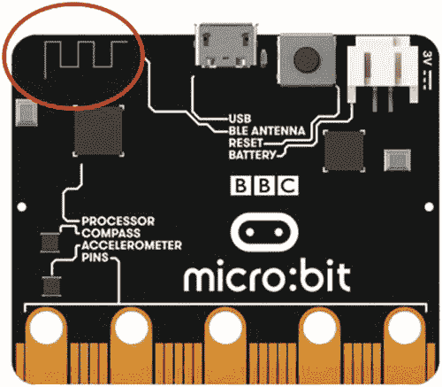
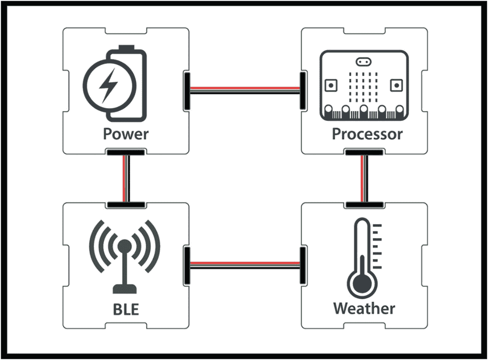
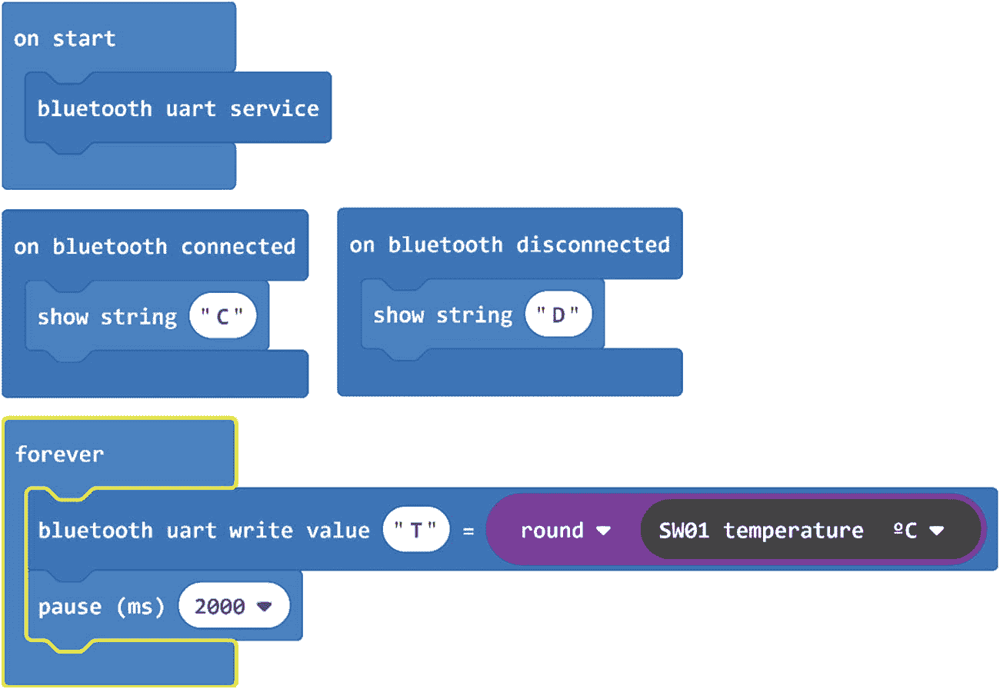

# 七、将蓝牙用于数据科学

在本章之前，我们已经了解了如何使用 BBC micro:bit 构建数据收集工具，使我们能够进行有意义的真实世界数据科学实验。在这个过程中，我们发现了我们能力中的一个缺陷:micro:bit 可以测量几乎无限量的数据，但保存这些数据和/或将其从 micro:bit 中取出(并放入我们可以使用它的环境中)一直具有挑战性。

在第**章** [**6**](06.html) 结束时，我们得出结论，无线技术可以为我们提供提取记录数据的方法。在这一章中，我们将会看到一种可以提供这种功能的技术:我们将会看到蓝牙是如何帮助满足这种需求的。

## 7.1 什么是蓝牙？

本质上，两个微处理器之间的无线通信是一个相对简单的概念。它是这样工作的:

1.  拿两个微处理器，给每个微处理器增加一个短程无线电发射器。

2.  这些微处理器可以通过编程来发送和接收无线电信号。

3.  所以，我们可以给一个微处理器编程，让它以特定的频率发送特定的信号。

4.  我们可以对另一个微处理器进行编程，使其监听相同的特定频率，并在接收到特定信号时做出反应。

5.  我们的两个微处理器现在可以无线通讯了。

蓝牙是一套管理无线通信的规则和程序:它是人们同意遵循的标准。它定义了该过程的五个组成部分是如何实现的:第一个处理器如何将数据转换成特定的信号？使用什么频率？第二个处理器如何知道消息来自第一个处理器，而不是恶意的第三个处理器？

当人类进行无线通信(即交谈)时，我们使用口语。我们说的话传达了意思，其他因素也是如此，例如，我们如何强调我们的话，我们选择哪些词，以及我们说话的声音有多大。我们交流我们的情感和思想，为了让其他人理解我们交流的所有深度和层次，他们需要理解我们使用的口头语言以及控制微妙之处的“规则”。我们的话语产生的声波就像无线电信号，其他的一切就像蓝牙标准。

对蓝牙标准的深入理解与我们的数据科学之旅并不特别相关，因此我们将在需要使用它们时挑选出我们需要的关键特性。现在，知道蓝牙是管理无线通信的标准方式就足够了，而且:

*   这个标准/规则列表是由人们写下来并由人们维护的。

*   有了一个一致同意的标准，不同的制造商就可以制造彼此兼容的“蓝牙”设备。

*   蓝牙特别兴趣小组(SIG)确保蓝牙规范得到维护、推广、保护，并在必要时进行更新。他们使其与不断变化的技术环境保持关联。

*   如果一个设备遵循标准中的所有规则，那么称它为**支持蓝牙的设备**是合理的。

## 7.2 为什么要用蓝牙？

我们调查蓝牙适配性最有说服力的理由是 BBC micro:bit 内置了“蓝牙低能量”( **BLE** )天线，如图**图**[T5】7-1](#Fig1)所示。BLE 是蓝牙的一个版本，它被设计成非常节能。

图 7-1

一个微型:钻头的后部带有盘旋的 BLE 天线

如果板载 BLE 能够满足我们在第**章**[**6**](06.html)**中确定的需求，那么我们的拼图的最后一块已经就位，我们可以将云服务和物联网添加到我们的数据科学工具包中。**

 **## 7.3 在微钻头上使用 BLE

我们使用无线通信的主要目的是收集我们的数据，然后将其传输到一个更合适的位置:也许是像 Excel 这样的程序，或者是 5000 英里以外的服务器，甚至可能是人工智能服务。简单！

听说事情没这么简单，你们中很少有人会感到惊讶；在 micro:bit 上用 BLE 可以做的事情有一些限制；

没有将 BLE 与 MicroPython 一起使用的选项。

使用 MakeCode，最稳定的 ble 实现是使用 UART 电缆，而不是无线电缆。

尽管有这些限制，我们仍然有很多方法可以在追求数据科学的过程中利用 BLE，但我们需要先了解一下 BLE 是如何处理数据的:

*   BLE 规范要求 BLE 设备具有**配置文件**，该配置文件是关于设备及其能够提供的数据的信息(称为**服务**)。

*   一个 micro:bit 有一个配置文件，定义了它将根据请求共享的数据(即它提供的**服务**)，包括来自加速度计、磁力计、板载温度传感器、按钮和其他一些 bit 的数据。

*   当另一个支持 BLE 的设备**将** [1](#Fn1) 与 micro:bit 配对时，两者共享它们的简档，并且每一个都可以访问由另一个提供的数据服务。

*   术语**任意数据**是指不包括在简档中的任何数据。如果我们向 micro:bit 添加一个外设，比如气象站或 CO2 监测器，那么来自该外设的数据是任意的，不能作为服务使用。

我们的范围不仅仅是 micro:bit 固有的数据。我们可能想今天测量天气，明天测量二氧化碳水平，第二天测量土壤酸度。对于仅使用加速度计和/或磁力计数据的实验，micro:bit 和 BLE 是一个很好的工具，但对于其他所有东西，我们需要另一个解决方案。

BLE 有一些巧妙的使用方式，可能对我们有价值，例如，基于 MakeCode 的**蓝牙 UART** 允许我们将**任意**数据传输到联网的智能设备上；我们将在**第 7.4 节**中讨论这一点。还有一些使用 USB 电缆的其他实现也相当稳定。但是，对于任何需要通过 USB 电缆将 micro:bit 连接到计算机的用例，第**章** [**6**](06.html) 中提到的 Excel 数据流工具都是无可匹敌的。

## 7.4 利用蓝牙 UART 建立 BLE 气象站

我们将重建气象站，以便它利用蓝牙 UART:我们将从一个 micro:bit 直接向智能设备馈送数据。

**图** [**7-2**](#Fig2) 显示了支持 BLE 的数字气象站仪器的电路框图。

图 7-2

BLE 数字气象站的电路图

**表** [**7-1**](#Tab1) 列出了我们将用来构建蓝牙气象站工具的硬件。

表 7-1

蓝牙气象站工具的硬件要求

    
| 

你需要什么

 | 

我们用什么

 | 

数量

 | 

可供选择的事物

 |
| --- | --- | --- | --- |
| 一个微处理器和闪存代码的方法 | 微:位 | one | Adafruit Feather 32u4 蓝果 LE阿尔杜伊诺 |
| 力量 | 2 个 AAA 电池盒，带 JST 连接器 | one | 锂离子聚合物电池–3.7v |
| 读取天气数据的传感器 | 中国盒子 SW01 | one | Adafruit BME280 I2C 或 SPI 温度湿度压力传感器 |
| 蓝牙收音机将天气数据发送到应用程序 | micro:bit 内置蓝牙收音机 | one | Adafruit Bluefruit 神盾局 |
| 将它们连接在一起的方法 | XinaBox IM01 微:位桥和xBus 连接器 | oneone | 连接线 |

选择合适的工具，按照**图** [**7-3**](#Fig3) 组装零件。

图 7-3

使用 micro:bit 内置蓝牙无线电的气象站

## 7.5 使用串行蓝牙终端应用程序

我们将使用蓝牙 UART 向智能手机/平板电脑发送数据。为此，我们的智能设备需要支持蓝牙，我们需要在上面安装一个兼容的应用程序。在 **Google Play** 上可以找到大量用于 micro:bit 蓝牙 UART 的应用程序；我们已经测试了其中的许多产品，发现一些产品在基于蓝牙 UART 的数据传输方面取得了一些成功，但我们也遇到了一些问题。我们发现大多数时候提供成功的最佳应用程序是**串行蓝牙终端**应用程序。

蓝牙 UART 的带宽是相当低的，这意味着你不能非常快速地发送大量数据。对于一次发送小块数据来说，这已经足够了。

为运行 Android 操作系统的智能手机/平板电脑安装来自 **Google Play** 的**串行蓝牙终端**应用。目前，这款应用还没有面向 iOS 用户的版本。

## 7.6 气象站编码

我们需要编写的代码与我们之前的气象站代码非常相似(例如，**章** [**3**](03.html) **，第 3-7 节**):主要区别是我们必须打开我们的蓝牙 UART 服务并通过该服务输出数据(而不是将数据输出到屏幕上)。自然语言代码只有很小的不同。

表 7-2

蓝牙低能耗气象站的自然语言代码

   
| 

步骤

 | 

自然语言代码

 | 

笔记

 |
| --- | --- | --- |
| one | 导入任何必要的库。 | 我们需要一个天气传感器和蓝牙库。 |
| Two | 启动蓝牙 UART 服务。 | 蓝牙 UART 服务允许智能手机/平板电脑等其他设备与 micro:bit 交换任何数据。 |
| three | 重复以下步骤。 |   |
| four | 从天气传感器读取温度。 | 如果你喜欢，你可以使用湿度或压力。 |
| five | 通过蓝牙 UART 发送温度数据。 | 我们通过 BLE 将数据发送到智能设备上运行的**串行蓝牙终端**应用程序，从而输出数据。 |

**无代码选项**:你可以在我们的**资源网站**上找到本节使用的代码的预编译版本。进入 [`http://xib.one/XB`](https://nam12.safelinks.protection.outlook.com/?url%253Dhttp%253A%252F%252Fxib.one%252FXB%2526data%253D02%257C01%257C%257C96ee9c32c458423e9b6a08d7c36cd73f%257C84df9e7fe9f640afb435aaaaaaaaaaaa%257C1%257C0%257C637192744542720716%2526sdata%253D0W1OfWTmIx3U20MIwolvjFvh9lCQJVpw9KNNvUwCdU8%253D%2526reserved%253D0) ，搜索**第 7.6 节**。

**图** [**7-4**](#Fig4) 显示了 micro:bit 蓝牙低能耗气象站的完整 **MakeCode** 程序。

图 7-4

MakeCode 块将天气传感器数据发送到智能手机/平板电脑上运行的 ***串行蓝牙终端*** 应用程序

Note

编写的代码只发送温度。通过修改它，您也可以添加湿度和压力数据。但是你一次发送的数据越多，你遇到低带宽困难的机会就越大。如果我们想同时发送几个数据点，这种解决方案的可扩展性不好。

在下载代码闪存到 micro:bit 之前，还有一件事要做:

图 7-5

蓝牙 UART 的配置设置

*   进入**项目设置**(点击页面右上角的**齿轮**)。

*   选择**无需配对:任何人都可以通过蓝牙**选项(**图**[T5】7-5](#Fig5))连接。

*   点击**保存**保存新设置并返回编辑器。

现在编译你的程序，并将其闪存到你的 micro:bit 上。重置您的 micro:bit 并保持通电。

启动安装在智能手机/平板电脑上的**串行蓝牙终端**应用，从菜单(左上角)选择**设备➤蓝牙 LE** 。然后从列表中选择您的 micro:bit 的名称。该应用程序将连接到您的 micro:bit。同时，字母“C”将显示在 micro:bit 5X5 LED 矩阵上。之后，温度数据会显示在 app 的终端(**图** [**7-6**](#Fig6) )。

Note

有时，您的应用程序可能无法在第一次尝试时连接到 micro:bit。多试几次，如果还是解决不了问题，重启 app/micro:bit。如果几次后还是不行，那就试试 Wi-Fi，我们将在第**章** [**9**](09.html) 中讨论。

图 7-6

传感器数据显示在应用程序的终端

我们已经成功地从微型钻头中无线提取数据。您用来查看此数据的应用程序中可用的工具现在可用。

关闭应用程序将断开智能手机/平板电脑和 micro:bit 之间的 BLE 连接。

## 7.7 BLE 在 micro:bit 上的其他选项

对 BLE 的支持在 MicroPython 中不可用，并且在 MakeCode 中受到限制，但是有许多其他方法来编码 micro:bit:有可能在诸如 ArduinoIDE 或 mBed 的平台中开发应用程序，从而开放所能实现的东西。我们的网站包括一个应用程序，我们使用 ArduinoIDE 为 micro:bit 构建了一个支持 BLE 的气象站，可以连接到物联网。

这个例子开始显示 BLE 在 micro:bit 上的真正潜力，但是它复杂而冗长，不适合学习者或初学者，而且比其他潜在的解决方案要复杂得多，我们将在后面的章节中开始讨论。

## 7.8 摘要

micro:bit ( **BLE** )上可用的蓝牙版本提供了一些工具，这些工具有可能对我们的数据科学工作非常有用。如果我们需要的只是micro:bit本身的数据，或者有限的数据是可以接受的，或者有线解决方案是足够的，那么 ble 可以提供很多。但这些限制让人感觉受到了限制，而且 BLE 没有让我们免费轻松地访问物联网或云。

在这一章的开始，我们着手确定一种从 micro:bit 无线提取数据的方法；虽然 BLE 有一些非常有趣和有用的应用，但它也有局限性。

我们将把 BLE 加入我们的工具包，但我们将继续寻找无线解决方案。BLE 可以提供很多东西，是一项非常有前途的技术，但只要我们使用 micro:bit 作为数据收集工具的核心，这些局限性就会限制我们的能力。

<aside aria-label="Footnotes" class="FootnoteSection" epub:type="footnotes">Footnotes [1](#Fn1_source)

BLE 是一个非常安全的协议。在一台 BLE 设备与另一台 BLE 设备共享数据之前，它们会经历一个相互审查的过程，这被称为配对。

 </aside>**