# 11.使用 ML 服务

在第**章** [**9**](09.html) 中，我们看到了如何将我们的微比特气象站连接到物联网平台，以增强我们的数据科学工具包。在第**章** [**10**](10.html) 中，我们考虑了 AI/ML 可以给我们的数据科学实验带来的潜在价值，它如何将我们从过程的元素中解放出来，并允许我们最大限度地利用时间来锻炼我们的好奇心和直觉——这是不可替代的人类特征，是数据科学的真正大脑。

在这一章中，我们将把这两者结合在一起，看看如何将一个在线免费使用的 ML 服务添加到我们不断发展的气象站项目中:我们将建立一个真正的“人工智能驱动的预测气象站”

## 11.1 定义我们的物联网应用

什么是“人工智能驱动的预测气象站”？我们到底要建什么？这些要求很容易描述:

1.  它包括一个边缘设备:一个记录温度和湿度数据并将其发送到物联网平台的微型位。

2.  它将使用人工智能(特别是人工智能)来分析这些数据，并根据这些数据预测下雨的可能性。

3.  预测将显示在 micro:bit 5x5 LED 显示屏上。

我们现在已经熟悉了列表中的第 1 项和第 3 项；在这一章中，我们将关注 2:如何将一个 ML 服务集成到我们的气象站中。这个过程并不简单:我们将不得不构建一个**物联网应用**。

术语**物联网应用**在本章中用于统称我们设置和使用的所有不同物联网服务以及它们共同提供的功能。称之为应用程序是恰当的:我们正在做的是使用一系列模块(“服务”)并配置它们以交付一个结果。这类似于使用几个不同的代码块来制作一个程序，或者将几个电子元件连接在一起来制作一个数字仪器。在许多方面，我们在这里构建的天气预测示例是 Hello World！物理计算的 ML。

本章着重于构建物联网应用程序。我们构建的边缘设备——我们的气象站仪器——包含在第**章** [**12**](12.html) 中。请记住，您可以从任何可行的来源向物联网应用程序发送数据，而不仅仅是我们将在下一章构建的来源。

## 11.2 选择物联网服务提供商

我们正在构建的物联网应用的一个基本组件是 ML 引擎，它将为我们的预测模型提供动力。在开始构建我们的应用程序之前，我们需要找到一个合适的 ML 服务来使用。

我们将使用微软 Azure。我们选择使用 Azure，而不是扩展我们在第**章** [**9**](09.html) 中构建的 IBM 物联网平台，原因如下:

1.  多样化。知道如何使用两家领先的物联网服务提供商比只使用一家要好。也许有一个被屏蔽了或者不适合你。

2.  每个提供商的物联网平台设置略有不同。一旦你建立了 IBM 和 Azure 平台，你应该对建立任何物联网平台更有信心。

3.  通过 Azure，我们可以访问范围广泛且不断增长的服务，以添加到我们的工具包中。

    一旦你完成了这一章，我们鼓励你回到你的 IBM 物联网平台，看看它是如何与 IBM Watson AI 服务集成的。

设置 Azure 的过程相当漫长和繁重，但一旦完成，你可以重用大部分功能，并切换出你发送的数据和你使用的 ML 服务。虽然我们关注的是气象站，但是你应该能够使用相同的过程将不同的边缘设备与 Azure 提供的各种 ML 服务集成在一起。

## 11.3 设置 Microsoft Azure:云计算服务

你需要的第一件事是订阅 Azure 如果你没有，你应该可以创建一个**30 天免费**账户，它将授权你使用这里使用的所有服务。

开始工作有两个步骤:

1.  设置 Microsoft Azure 帐户:在线搜索“设置 Azure 帐户”以了解如何在您所在的位置设置一个帐户。

2.  一旦您设置了 Azure 帐户，请确保您可以访问 Azure Machine Learning Studio([`https://studio.azureml.net/`](https://studio.azureml.net/))。

## 11.4 使用 Azure 门户创建物联网中心

本节描述如何使用 Azure 门户创建一个**物联网中心**。

一个**物联网中心**是一个服务的名称，它将边缘设备(在这种情况下是我们的气象站，但我们可以有多个设备)与物联网应用程序链接起来。它控制设备对物联网应用的访问。

要设置中心，您需要执行以下操作:

<colgroup><col class="tcol1 align-left"> <col class="tcol2 align-left"></colgroup> 
| 

**订阅:**

 | 

选择用于您的 hub 的套餐(例如，*现收现付*)。

 |
| --- | --- |
| **资源组:** | 选择**创建新的**并填写您想要使用的名称(如*物联网中心*，然后选择**确定**。 |
| **地区:** | 从列表中选择您希望中心所在的地区。选择离您最近的位置，但是如果您所在的区域不可用，请使用显示的默认位置。 |
| 物联网枢纽名称: | 输入枢纽的名称(例如， *your-iot-hub* )。该名称必须是全局唯一的。如果您输入的名称可用，则会出现一个绿色勾号。为了保持唯一性，我们使用了本书的 ISBN-13 号，即 978-1484243565。 |

*   登录 Azure 门户( [`https://portal.azure.com/`](https://portal.azure.com/) )。

*   从 Azure 主页中，选择 **+创建资源**按钮。

*   在**搜索市场**字段中输入**物联网中心**。

*   在**市场**页面，从搜索结果中选择**物联网中心**。

*   在**物联网中枢**页面中，选择**创建**。

*   在**基本信息**选项卡上，完成以下字段:

<colgroup><col class="tcol1 align-left"> <col class="tcol2 align-left"></colgroup> 
| **定价和规模层级:** | 选择 F1:自由层*注意:免费物联网中心每次订购仅限一个。* |
| **物联网枢纽单位:** | one |
| **Azure 安全中心:** | 离开 |
| **高级设置>设备到云分区:** | 保持默认值 4 |

*   Once completed, your **Basics** tab should look something like this (**Figure** [**11-1**](#Fig1)) .

    

    图 11-1

    配置基本选项卡

*   选择 **Next: Size and scale** 继续创建您的中枢。在**尺寸和比例**选项卡上，完成如下字段:

一旦完成，你的**尺寸和比例**标签应该看起来像这样(**图** [**11-2**](#Fig2) )。

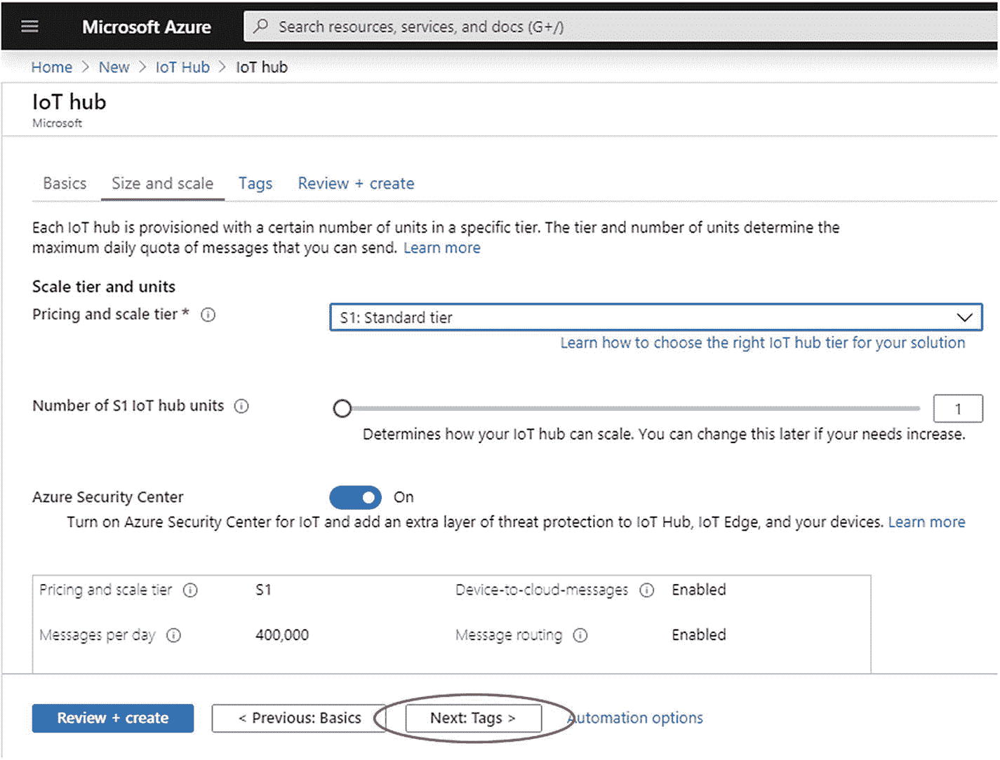

图 11-2

配置大小和比例选项卡

<colgroup><col class="tcol1 align-left"> <col class="tcol2 align-left"></colgroup> 
| **名称:** | 部门 |
| **值:** | 数据科学 |

*   选择 **Next: Tags** 继续创建您的中枢。在**标签**标签上，填写如下字段:

*   Once completed, your **Tags** tab should look something like this (**Figure** [**11-3**](#Fig3)).

    

    图 11-3

    配置标签选项卡

*   Select **Next: Review + create** to continue creating your hub. Your **Review + create** tab should look something like this (**Figure** [**11-4**](#Fig4)).

    

    图 11-4

    审阅+创建选项卡

*   选择**创建**来创建您的新中枢。创建中心可能需要几分钟时间。

创建物联网中心后，我们将深入研究 Azure 机器学习工作室，并将建立一个 Azure Logic 应用程序。在创建逻辑应用程序时，您需要提供**物联网中心**和**资源组**的名称，因此请确保您拥有这些详细信息。

## 11.5 在 Azure Machine Learning Studio 中设置天气预测模型

要使用天气预测模型，我们首先选择一个:有几个选项可用。然后我们必须将选择的“天气预测实验”导入到我们的 Azure 机器学习工作室项目中:

*   打开 ML Studio–检查您是否已登录。

*   In a separate tab in the same browser, go to this URL ([`https://gallery.azure.ai/Experiment/Weather-prediction-model-1`](https://gallery.azure.ai/Experiment/Weather-prediction-model-1)) to locate the weather prediction AI “experiment” that we use. *There are several available that you could also try, as well as loads of other experiments to play with.*

    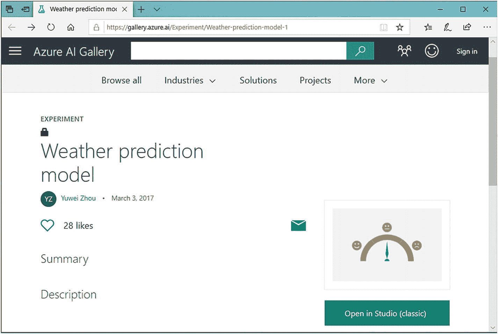

    图 11-5

    Azure AI Gallery 实验:天气预测模型

*   点击**打开工作室**。然后会弹出一个模态窗口，提示您选择一个区域:保留默认选项并单击勾号继续。

*   Once the experiment has imported, the ML Studio interface should look something like this (**Figure** [**11-6**](#Fig6)).

    

    图 11-6

    天气预测模型

*   点击**运行**(在屏幕底部的菜单中)确认步骤。

*   随着流程中的每一步的运行，它也会进行验证，并且您会看到每成功验证一次，就会添加一个绿色勾号。不应该有任何错误。验证完所有步骤后，它应该会停止运行，这可能需要一分钟左右的时间。

*   点击**设置网络服务➤预测网络服务。**这可以在**运行**旁边的底部菜单中找到。

Note

除非系统已经在前面的步骤中运行了所有的验证过程，否则设置 WEB 服务选项将不可选择。完成后，所有步骤都应该显示绿色小勾号。

*   在您点击设置 web 服务之后，您的视图会随着模型的新版本的生成而更新:我们将使用的**预测实验，**。一旦完成，应该有两个标签:训练实验和预测实验。

*   我们将移动 **Web 服务输入块**。这个块告诉实验将来自 web 服务的数据(例如，来自我们气象站的仪器)注入到模型中的位置。

*   点击连接 **Web 服务输入**到**天气数据集**的线(点击它连接 **Web 服务输入**块的地方)——这将断开它们的连接。

*   Now connect the line to the **Score Model** block as shown in **Figure** [**11-7**](#Fig7).

    

    图 11-7

    将“Web 服务输入”连接到“评分模型”

*   一旦你完成了这些，点击**运行**让新模型生效。请记住等待它完成。

*   点击**部署 web 服务**将模型部署为 WEB 服务。

您现在已经构建了一个**实验**，您可以通过点击左侧菜单上的**实验**列表来查看。您还创建了一个 **Web 服务**对象，我们将从 Azure 链接到该对象:我们将向该 Web 服务传递数据。为此，我们需要注意几个细节(URI 和 API 键):

*   点击左侧菜单上的 **Web 服务**链接。您将看到一个列表，显示至少一个 web 服务。

*   Click the name of the web service we just created – by default it will be named **Weather prediction model (Predictive Exp) (****Figure** [**11-8**](#Fig8)**)**.

    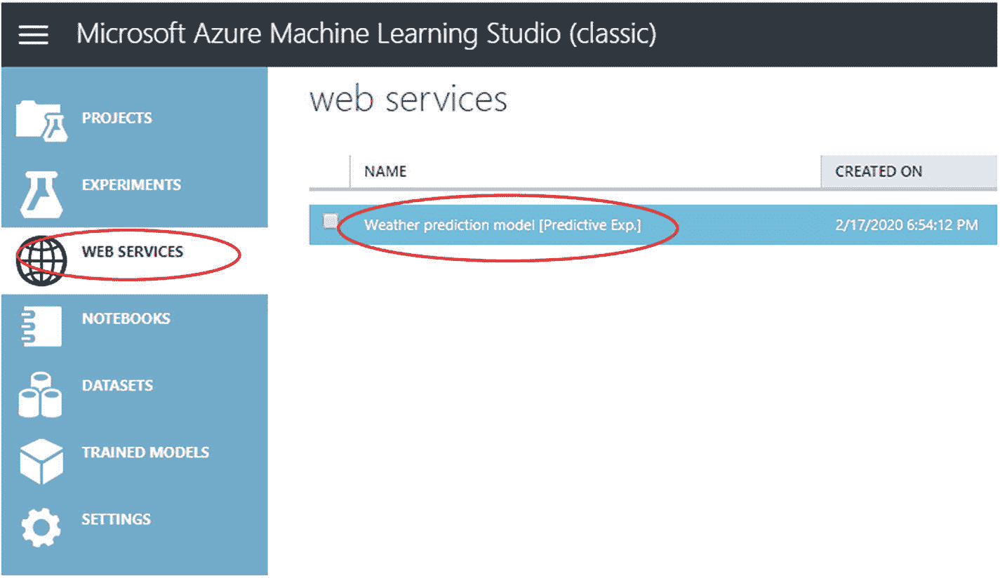

    图 11-8

    用于访问 web 服务详细信息的链接

*   In the **weather prediction model [predictive exp.]** page, make a note of your API Key listed (**Figure** [**11-9**](#Fig9)).

    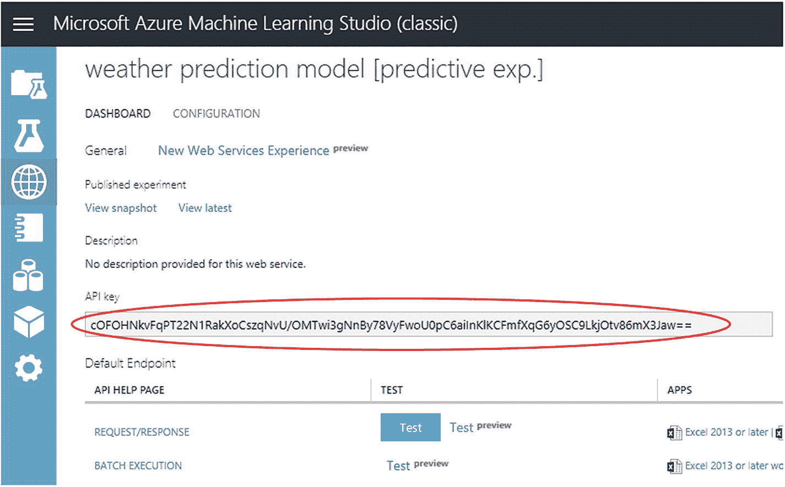

    图 11-9

    Web 服务身份验证的 API 密钥

*   在**天气预测模型【预测表达式。】**页面，点击**请求/响应**链接(见左下方**图** [**11-9**](#Fig9) )。

*   A new tab should open with a page titled **Request Response API Documentation for Weather prediction model [Predictive Exp.]**. This has the final detail we’ll need to use in Azure: make note of the **Request URI** from this page (**Figure** [**11-10**](#Fig10)).

    

    图 11-10

    请求 URI 提供天气预测模型

*   Now switch to the **weather prediction model [predictive exp.]** page (in a separate tab) again. Then test the web service by clicking the **Test** button (**Figure** [**11-11**](#Fig11)).

    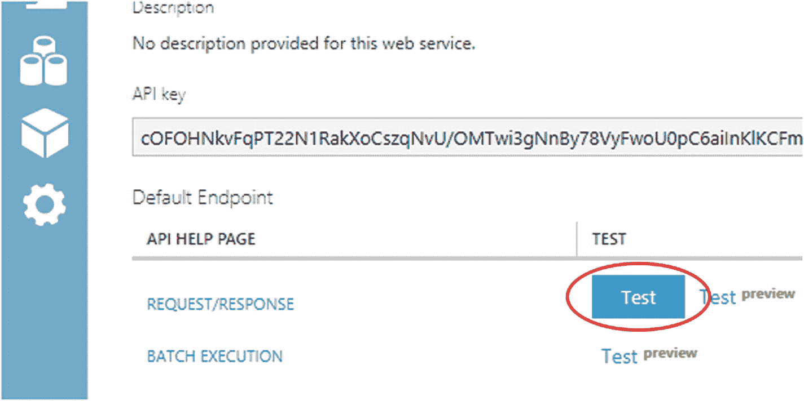

    图 11-11

    web 服务的测试链接

*   You should be prompted to add dummy variables for temperature and humidity: enter some values and then click the **OK** button (tick) (**Figure** [**11-12**](#Fig12)).

    

    图 11-12

    用于手动输入温度和湿度值的输入模式框

*   The predicted result will display just above the bottom menu. Click **DETAILS** to view the full result. It should look similar to **Figure** [**11-13**](#Fig13).

    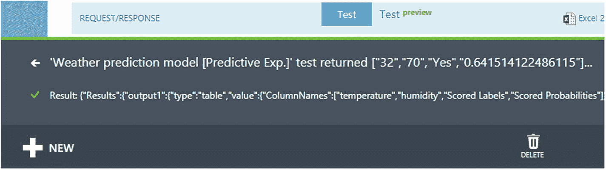

    图 11-13

    响应结果

**响应结果**显示了处理您输入的测试变量时 ML 服务将返回的数据。结果(数组)中有四个关键数据点:

<colgroup><col class="tcol1 align-left"> <col class="tcol2 align-left"></colgroup> 
| Thirty-two | 温度值(提供的测试值) |
| Seventy | 湿度值(提供的测试值) |
| 是 | 下雨的二元概率:如果指数大于 0.5，则为是；如果小于 0.5，则为否 |
| 0.641514122486115 | 下雨概率指数 |

*   **关闭**结果部分。

    测试应该工作正常。如果没有，请尝试删除 web 服务并再次部署，或者再次导入实验。

Azure 机器学习工作室搭建完毕，蓄势待发。在我们的物联网应用程序完成之前，我们需要定义我们正在使用的服务将如何协同工作，以及数据将如何从应用程序的每个组件传递到下一个组件:我们需要设置**工作流**。

## 11.6 使用 Azure Logic 应用程序创建工作流

让我们总结一下我们迄今为止所做的工作:

1.  我们在 Azure 上注册了一个账户，以访问它的云服务。

2.  我们配置了一个**物联网中心**，这样我们就可以在 Azure 和我们的气象站之间交流数据。

3.  我们启动了 **Azure ML Studio** ，选择了一个天气预测模型，然后设置好就可以使用了。

到目前为止，我们需要三个独立的组件/服务来协同工作:我们的气象站仪器、我们的物联网中心和 ML Studio 模型/实验。比这更复杂的实验可能有多个数据源，并且可能使用各种服务/附加组件。工作流工具被用来帮助管理具有许多移动部分的复杂项目:本质上，它们确保步骤以正确的顺序进行。

在本节中，我们使用 **Azure Logic Apps** 构建一个工作流。这个应用程序将定期检查，看看数据是否是从我们的气象站发送。当检测到新数据时，该应用程序通过 web 服务将其发送到天气预测模型(托管在 Azure ML Studio 上)。它还将接收来自 ML 服务的响应，将它们转换(**解析**)为我们指定的格式，然后将结果发送回我们的气象站设备。

按照此处列出的步骤创建新的逻辑应用程序:

*   从 Azure 主页的 **Azure services** 下，点击**创建资源**。

*   On the **New** page, under **Azure Marketplace**, click **Integration** and then click **Logic App** (**Figure** [**11-14**](#Fig14)).

    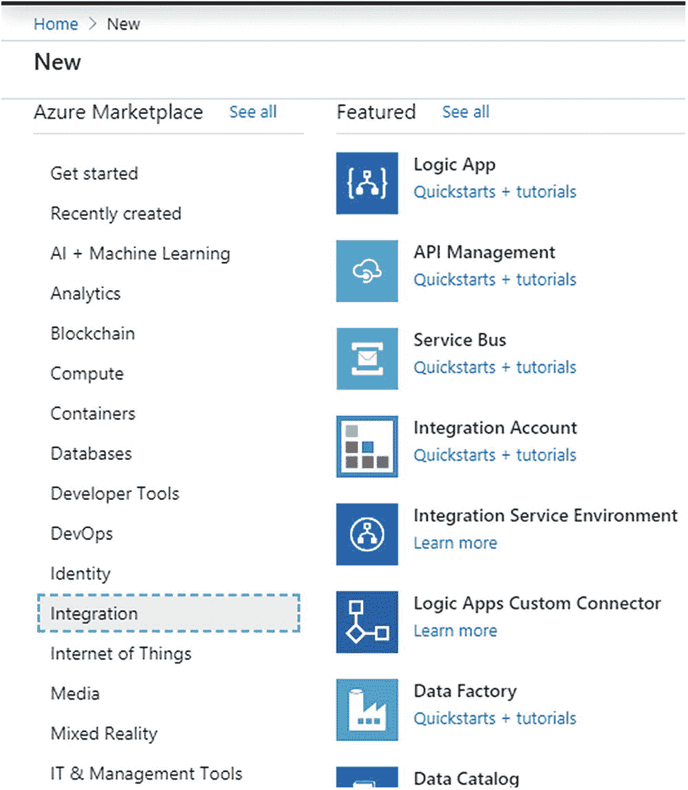

    图 11-14

    选择逻辑应用程序资源

*   On the **Logic App** pane, provide details about your logic app as shown in **Figure** [**11-15**](#Fig15). After you’re done, click **Review + Create** to validate your details.

    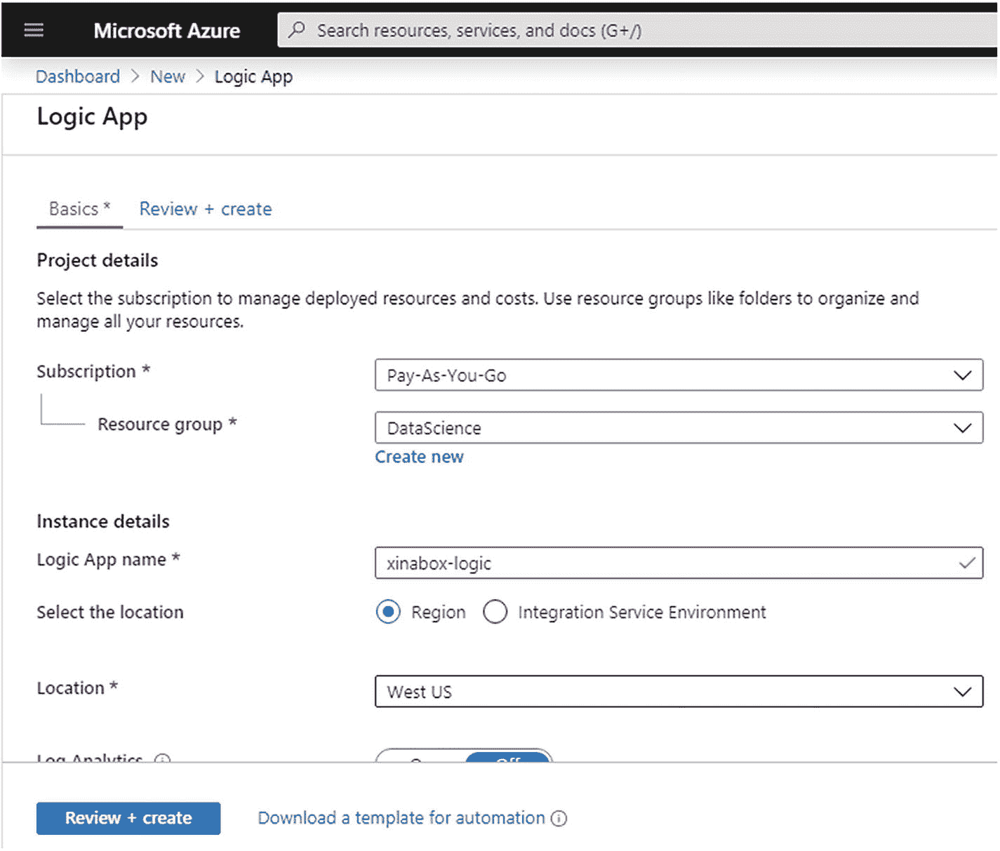

    图 11-15

    基本选项卡的详细信息

*   如果您提供的信息正确，请点击**创建**。这将开始部署您的逻辑应用程序。这可能需要一些时间。

*   Click **Go to resource** for your deployed logic app (**Figure** [**11-16**](#Fig16)).

    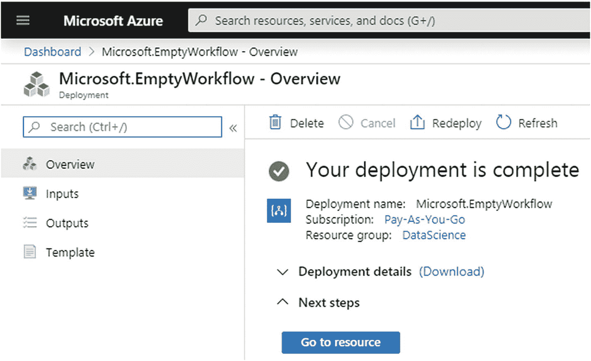

    图 11-16

    部署确认消息

Tip

您也可以通过在搜索框中键入名称来查找和选择您的 logic 应用程序。

*   **逻辑应用设计器**打开并显示一个带有介绍视频和常用触发器的页面。

*   向下滚动页面。在**模板**下，点击**空白逻辑 App** 。

## 11.7 设置工作流程

我们现在将查看我们刚刚创建的工作流，并确保每个步骤都配置正确。

有五个基本动作/步骤/事件由 Azure Logic 应用程序管理，它们是工作流的关键；无论您使用什么服务来实现 ML，这些步骤中的每一个都有对应的步骤:

1.  从气象站仪器发送数据

2.  将数据传递给 ML 服务

3.  解释(“解析”)来自 ML 服务的结果

4.  设置变量以存储来自 ML 服务的数据

5.  管理这些数据并将其发送回气象站仪器

我们将更详细地回顾这些步骤。

### 步骤 1:从气象站仪器发送数据

当气象站仪器发送数据时，工作流开始/触发。当收到 http 请求时，这一步骤被称为 Azure Logic 应用程序中的触发器。

要设置工作流程的这一部分:

*   在**逻辑 App 设计器**中，在**搜索框**下，选择**全部**。

*   在搜索框中，输入 **http** 来查找 http 触发器。

*   From the **Triggers** list, click **When a http request is received** trigger (**Figure** [**11-17**](#Fig17)).

    

    图 11-17

    选择“收到 HTTP 请求时”触发

*   Provide the information for the **When a http request is received** trigger as shown in **Figure** [**11-18**](#Fig18).

    

    图 11-18

    “收到 http 请求时”触发详细信息

*   以下是可以在**请求体 JSON** <sup>[1](#Fn1)</sup> **模式**文本框中直接复制的**模式**的完整列表:

```py
{
  "properties":
  {    "humidity":
       {    "type": "integer"
       },
       "temperature":
       {    "type": "integer"
       }
  },
  "type": "object"
}

```

### 步骤 2:将数据传递给 ML 服务

工作流的下一步是将温度和湿度值传递给我们在**第 11.2 节**中设置的 Azure ML web 服务。

<colgroup><col class="tcol1 align-left"> <col class="tcol2 align-left"> <col class="tcol3 align-left"></colgroup> 
| **方法:** | 邮政 |
| uri: | 请求 URI 复制自“天气预测模型的请求响应 API 文档[预测实验]”。]".–参见第 11.5 节。 |
| **标题:** | 接受 | 应用程序/json |
| 批准 | 从“天气预测模型的请求响应 API 文档”中复制的 API 密钥。]".–参见第 11.5 节。注意确保在**载体**和 **API 键**之间添加一个空格。 |
| 内容类型 | 应用程序/json |
| **查询:** | 保持空白 |
| **正文:** | {"全局参数":{}，“输入”:{"输入 1": {"列名":[“温度”，“湿度”],"值":[[“价值”，“价值”]]}}} |
| **饼干:** | 保持空白 |

*   In the designer view click **+ New step** (**Figure** [**11-19**](#Fig19)).

    

    图 11-19

    添加新步骤

*   In the search box type **HTTP**. From the results select **HTTP** actions group (**Figure** [**11-20**](#Fig20)).

    

    图 11-20

    搜索“HTTP”操作组

*   This will expand to a few actions. From the **Actions** list , select **HTTP** action (**Figure** [**11-21**](#Fig21)).

    

    图 11-21

    选择“HTTP”操作

*   为 HTTP 操作提供以下信息:

现在在**主体**中，将**温度**和**湿度**的值替换为**动态内容**。

*   Highlight the first occurrence of the **“value”** (including the double quotes) and then select **temperature** from the **Dynamic content** pane (**Figure** [**11-22**](#Fig22)).

    

    图 11-22

    插入动态内容(步骤 1)

*   接下来，用动态内容**“湿度”**替换第二次出现的**“值”**。

现在你的 **JSON 体**应该是这样的(**图**[T5】11-23](#Fig23))。

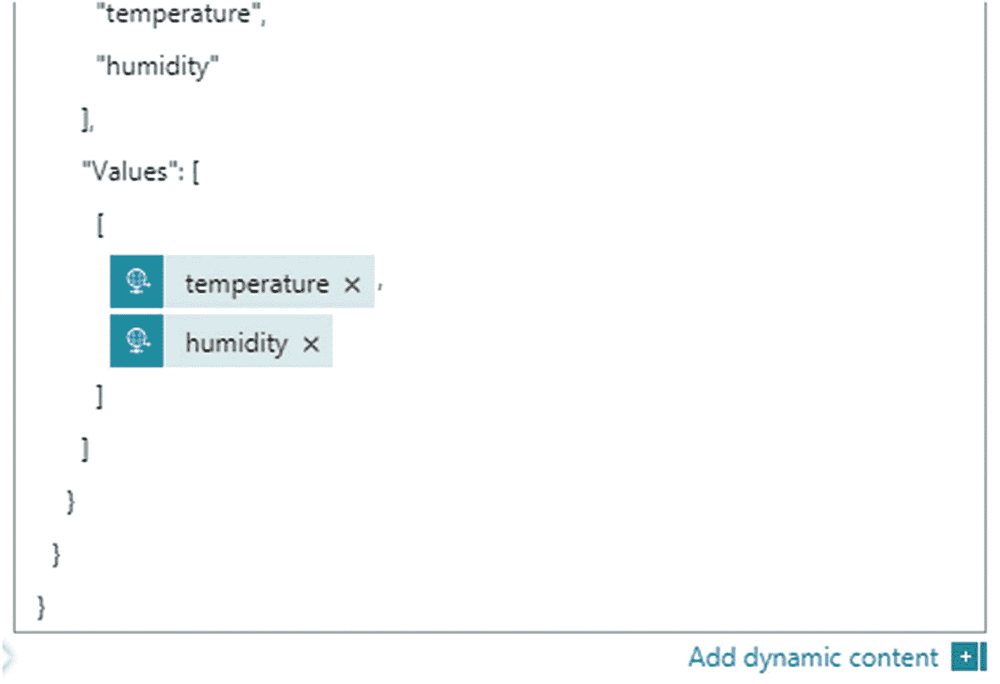

图 11-23

插入动态内容(步骤 2)。在这种情况下，温度和湿度

一旦完成了 **HTTP** 模板应该是这样的(**图**[T5】11-24](#Fig24))。

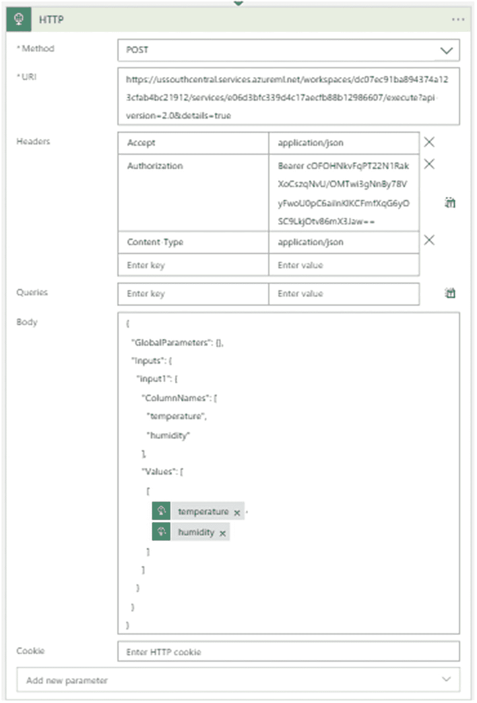

图 11-24

“HTTP”操作详细信息

### 步骤 3:解释来自 ML 服务的结果(“解析 JSON”)

数据通过 web 服务作为**请求**传递到 Azure ML 模型，ML 模型将结果作为**响应**发回。响应是一个 **JSON 对象**(即一个 JSON 格式的“文件”)，我们需要解析它来提取我们需要的值。为此，我们将添加名为 **Parse JSON** 的动作。

<colgroup><col class="tcol1 align-left"> <col class="tcol2 align-left"></colgroup> 
| **内容:** | 单击内容框，然后从动态内容中的 HTTP 下选择正文。 |
| **模式:** | {"属性":{"结果":{"属性":{"输出 1": {"属性":{"类型":{"类型":"字符串"},"值":{"属性":{"列名":{"项目":{"类型":"字符串"},"类型":"数组"},"列类型":{"项目":{"类型":"字符串"},"类型":"数组"},"值":{"项目":{"项目":{}，"类型":"数组"},"类型":"数组"}},"类型":"对象"}},"类型":"对象"}},"类型":"对象"}},"类型":"对象"} |

*   在设计器视图中选择 **+新步骤**。

*   In the search box type **Parse JSON**. From the **Actions** list, select **Parse JSON** (**Figure** [**11-25**](#Fig25)).

    

    图 11-25

    搜索并选择“解析 JSON”操作

*   为**解析 JSON** 操作提供此信息，如下所示:

一旦完成了**解析 JSON** 模板应该是这样的(**图**[T5】11-26](#Fig26))。

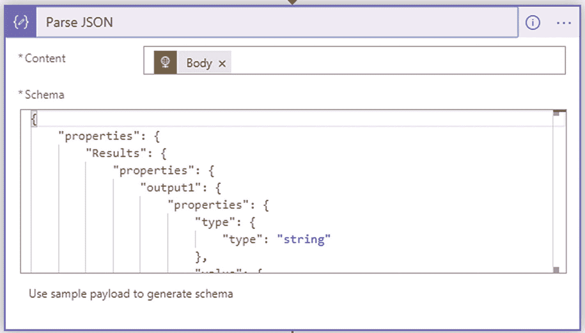

图 11-26

“解析 JSON”操作详细信息

### 步骤 4:设置一个变量来存储来自 ML 服务的数据

现在，我们需要将我们要从 JSON 对象中提取(解析)的降雨预测分数(“是”或“否”)分配给 String 类型的变量。为此，我们将添加名为**的动作，初始化变量**。

<colgroup><col class="tcol1 align-left"> <col class="tcol2 align-left"></colgroup> 
| **名称:** | 得分 |
| **类型:** | 线 |
| **值:** | 我们将使用一个公式来获得二维数组中的“得分标签”:body ('Parse_JSON ')？['结果']？['output1']？['值']？['值']？[0]?[2] |

*   在设计器视图中选择 **+新步骤**。

*   In the search box type **Initialize variable**. From the **Actions** list, select **Initialize variable** (**Figure** [**11-27**](#Fig27)).

    

    图 11-27

    搜索并选择“初始化变量”操作

*   为**初始化变量**动作提供此信息，如下所示:

一旦完成了**初始化变量**模板应该是这样的(**图**[T5】11-28](#Fig28))。


图 11-28

“初始化变量”操作详细信息

### 步骤 5:将数据发送回气象站仪器

最后，我们将变量**得分**发送到 micro:bit，以显示在 5X5 LED 矩阵上。

<colgroup><col class="tcol1 align-left"> <col class="tcol2 align-left"></colgroup> 
| **状态代码:** | Two hundred |
| **标题:** | 保持空白 |
| **正文:** | 在**变量**类别下的**动态内容**窗格中插入动态变量**分数**。 |

*   在设计器视图中选择 **+新步骤**。

*   In the search box type **Response**. Wait for the search results. Then in the **Actions** list, select **Response** (**Figure** [**11-29**](#Fig29)).

    

    图 11-29

    搜索并选择“响应”操作

*   提供此处显示的**响应**动作的信息:

一旦完成了**响应**模板应该是这样的(**图**[T5】11-30](#Fig30))。


图 11-30

“响应”活动详细信息

我们完了！保存你的逻辑 app:在**设计器**工具栏上，点击**保存**。这可能需要一些时间。

## 11.8 测试工作流程

现在，我们将手动启动我们的逻辑应用程序来测试它:

*   Run your logic app – on the **designer** toolbar, select **Run**. It may take a few moments to check your workflow. Once completed you will get a notification at the top-right corner of the page saying it has successfully checked the trigger of our logic app, and it should look something like this (**Figure** [**11-31**](#Fig31)).

    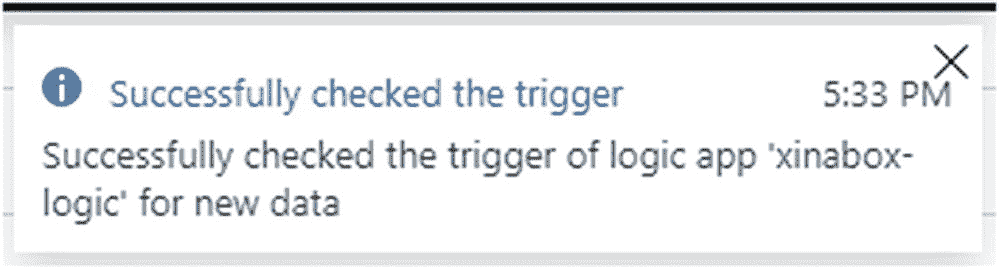

    图 11-31

    触发器检查成功的通知

*   Your workflow will display again in **RUN mode** (**Figure** [**11-32**](#Fig32)). A tick icon (white tick on a green circle) will be added at the top-right corner of the title bars if the tests succeeded.

    

    图 11-32

    手动触发工作流

*   The **Response** action has a cross icon (cross on the gray background) on its title bar to indicate that the test was unsuccessful. To view the Response action’s output details, click inside the Response action’s title bar. You should see the message (**Figure** [**11-33**](#Fig33)): “ActionResponseSkipped”. This is because the workflow did not receive any data from the hardware. That’s OK for now: it will all work fine once we’ve hooked up the weather station.

    

    图 11-33

    响应触发器显示 ActionResponseSkipped 消息

*   在设计器工具栏上，选择**设计器**返回到设计器视图。

我们现在已经完成了物联网应用的设置和测试，我们的 ML 供电预测气象站已经准备就绪。我们只需要开始输入数据。

## 11.9 摘要

使用 ML 服务的过程在概念上非常简单:您传入一些数据，ML 服务执行它的黑盒技巧，然后返回一个值。它不应该采取大量的步骤和无穷无尽的选项来设置和使用；但确实如此。

在本章中，我们已经设置和配置了构建 ML 供电的预测气象站所需的物联网基础设施。我们已经构建了一个包含 ML 服务的物联网应用:来自我们数字仪器的数据将由该服务和生成的预测数据进行处理。这些数据然后被送回我们的仪器，并显示在屏幕上。

在下一章中，我们将构建气象站数字仪器，并将其连接到我们的物联网应用。

<aside aria-label="Footnotes" class="FootnoteSection" epub:type="footnotes">Footnotes [1](#Fn1_source)

这种格式是 JSON (JavaScript Object Notation):一种常用于数据通信的格式。在物联网中，JSON 往往比 csv 文件使用得更广泛，因为它非常灵活，易于扩展/适应。

 </aside>