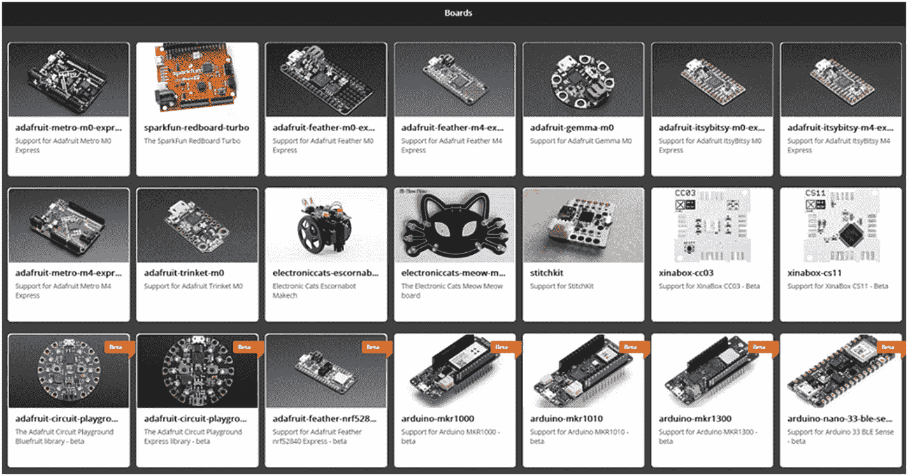
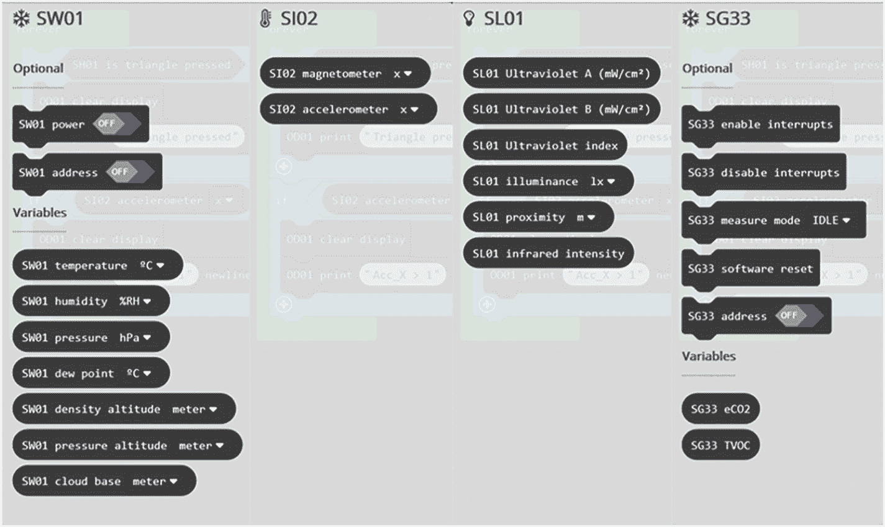

# 13.巩固我们的知识

在这最后一章中，我们将回顾本书所涵盖的内容，并看看我们所学的技能如何在不同的环境中使用。随着旅程即将结束，目的地会是什么样子，我们又将何去何从？我们还可以将数据科学工具包用于其他什么用途？

## 13.1 我是数据科学家吗？

恭喜你走到这一步。如果您已经阅读了这些章节，研究了这些示例，并且一切都有意义，那么您就拥有了坚实的数据科学基础以及在现实世界中应用它的能力。

当然，就像学习生物学基础知识并不能让一个人成为医生一样，拥有坚实的数据科学基础也不能让一个人成为数据科学家。本书中概述的信息和技术是一块垫脚石:它们本身是有用的，并且可能是成为专业数据科学家的第一步。但什么是“专业数据科学家”？

医生、护士、建筑师、水管工:像这样的学科需要认证，然后才能合法地使用这个头衔。这包括学习规定的知识体系，并通过某种资格认证过程。没有普遍接受的数据科学家认证，没有管理机构，也没有期末考试:任何人都可以自称为数据科学家。

至于你是否是数据科学家的问题:在你的工作或日常生活中，你是否与数据打交道，处理和分析数据，解释数据并产生可操作的输出？如果是这样，那么也许你就是。

## 13.2 成为数据科学家

虽然关于什么使一个人成为数据科学家的松散/非正式定义很有趣，但当公司雇用数据科学家时，他们通常对自己想要什么有一个清晰的想法。这往往是一套与公司如何开展数据科学相关的技能/经验，并且经常看到招聘广告要求特定技能，如编码(例如，Python)、SQL、统计和机器学习。

如果你有兴趣进一步探索数据科学，并可能以此谋生，那么有许多学科可以学习，有大量的方向可以选择。了解数据科学领域中哪些技能至关重要的最佳方式之一是查看求职公告板。

所需的大部分技能都是可以学习的，如果你发现你对书中的内容感到满意，那么你可能有这样做的资质。在整个旅程中有一个主题是一致的，那就是好奇号在这个过程中扮演的角色。上面提到的技能很有价值，但造就伟大数据科学家的是他们的好奇心，他们提出问题的动力。直觉也很受重视:对正确的事情充满好奇，能够提出正确的问题，这些都是计算机无法复制的特征。记住，你不需要像计算机一样思考:我们有计算机来帮我们思考。

## 13.3 揭穿一些神话

从数据科学的角度来看，神话是人们已经接受为真实/被证明的假设/事实，但这些假设/事实并不是基于任何可靠或可验证的数据。 [1](#Fn1) 有点讽刺的是，像数据科学这样的领域有自己的一套神话。神话的问题在于，对于另一方的人来说，它们往往看起来像是障碍，所以我们将看看其中的一些，并试图揭穿它们:

**只有数据科学家才做** **真正的数据科学** **。**

*   **数据科学**是我们在本书中一直在做的事情——使用科学方法收集、处理和执行各种数据操作。

*   在建立专业标准之前，**数据科学家**是指受雇于头衔为“数据科学家”的工作的人。该术语在专业上用于指过程的分析方面。构建和编码传感器阵列的团队成员不会被称为数据科学家。但是他们正在参与数据科学:这是一个团队运作，数据科学家是这个团队的一员。

**真实数据科学家不用****Excel/电子表格** **。**

*   新手过度使用 Excel。

*   专家从来不用 Excel。

*   大师会在适当的时候使用 Excel。

要成为一名数据科学家，你必须成为一名 **强有力的程序员** **。**

*   数据科学家会发现自己处于需要编码的情况。这是一项伟大的技能。

*   但是，当需要编写一些代码时，数据科学家可以使用开发人员为他们编写代码。

*   关键是知道向开发人员要求什么:代码需要的结果是什么？任何优秀的开发人员都应该可以将经过深思熟虑的自然语言代码转换成真正的代码。

只有大的 **企业和大学** **买得起。**

*   预算有限的个人有可能进行真正的、负担得起的和新颖的数据科学实验。

*   鉴于每天产生的数据量如此之大，而且其中很多都是免费且易于在线获取的，那么还有多少迷人的、突破性的和有用的相关性等待着我们去发现，或许只需点击几下鼠标就能找到呢？

要成为数据科学家，你必须非常聪明。

*   数据科学是一个智力领域，但任何有适当好奇心和动力的人都可以学习所需的技术。

*   当然，高智商的人往往在一系列智力领域表现出色，包括数据科学。

**市场调查不是真正的数据科学。**

*   尤其是在学术界，市场研究被认为是不合标准的；有些人可能会说它犯了“出卖”——把利润放在质量之前。

*   市场研究有好有坏，就像学术研究有好有坏一样。

*   真正的区别在于，我们经常看到糟糕的市场调查出现在广告牌上，出现在广告中。这并不代表市场研究行业的全部范围和潜力。

*   一个在后种族隔离的南非进行的重要市场研究的例子将有助于说明一个更积极的应用。

早在 20 世纪 90 年代，非洲国民大会的顾问使用了一家位于德班的小型市场研究公司(现已解散的 Research Surveys)，该公司有一种创新产品叫做“转换模型”。这是一种调查技术，在测量不同人群对特定信息的预测行为反应时，效果惊人。简而言之，这个信息会煽动还是团结？

曼德拉先生无疑是他那个时代或任何时代最伟大的政治家之一，虽然非洲人国民大会肯定会在全国选举中获胜，但他的优先事项是确保该国所有不同种族群体都参与将南非转变为彩虹国家的进程，并为此感到兴奋。

多个转换模型调查被委托来评估 ANC 的信息的哪些部分在不同的种族群体中产生了最好的共鸣，哪些是最两极分化的。曼德拉的民族团结政府在确定优先事项方面做得很好，这有助于让广大民众保持热情和乐观。

## 13.4 推断学习

有了合适的硬件，使用本书中概述的技术，您可以构建的数字仪器的范围和复杂程度没有限制。我们介绍的大多数技能都是可以转移的:

**如果你能把一个传感器连接到一个微处理器:**

图 13-1

使用相同原理制造的两种不同复杂程度的数字仪器

*   无论你使用什么外围系统(XinaBox，breadboards，SparkFun 等。)，如果您已经成功地将一个传感器连接到微处理器，那么您通常也可以应用相同的方法来连接其他传感器。如果您选择一个带有各种传感器的外围系统，您应该能够连接其中任何一个。

*   只要微处理器支持(大多数都支持)，就可以同时连接几个传感器，构建能够测量各种传感器读数的仪器。

*   请记住，到 2020 年以后，你不需要工程学位或烙铁就能制造出高质量、坚固耐用的数字仪器。

*   **图** [**13-1**](#Fig1) 显示了用 xChips 构建的两个数字仪器。我们建立了左边显示的 Wi-Fi 网关，而右边显示的设备可以在高空气球中使用，以记录和传输环境数据。

**如果能写块码为微:位** **:**

图 13-2

可以在微软的 Maker 中用块代码编程的一系列板。制造商代码

*   然后你**可以**写代码:你可以编程。

*   有很多微处理器可以处理分组码。而且大部分都比 micro:bit 强大几个数量级。你**也可以**使用同样的技术对这些进行编程。

*   **图** [**图 13-2**](#Fig2) 显示了制造者。Makecode 块编码环境。这是微软的产品——我们使用的 micro:bit MakeCode 是这种块编码环境的“白标”实现。

*   界面、语法、闪烁过程非常相似 MakeCode 的用户会很熟悉。

*   **图** [**13-2**](#Fig2) 显示了可以使用分组码进行编码的电路板的选择。

**如果你能编程一个微处理器从一个传感器读取数据:**

图 13-3

四个为四个不同的传感器进行代码扩展

*   然后你可以编程让它从任何传感器读取数据。您知道如何加载库/扩展，读取传感器数据的块往往以非常相似的方式工作。为特定的传感器找到合适的扩展可能是最棘手的部分:寻找为你正在使用的微处理器提供易于使用(并找到)的 MakeCode 扩展的制造商。

*   从多个传感器读取数据是微不足道的:您应该能够同时从许多传感器的阵列中读取数据。

*   **图** [**13-3**](#Fig3) 显示了不同类型传感器的四种 MakeCode 扩展。变量名会改变，但在每种情况下，来自传感器的值都作为一个简单的变量返回，即一个数字。范例是相同的。

**如果能分析** **温湿度数据** **:**

*   然后，您可以使用相同的技术分析任意两个数据集。

*   您应该能够扩展它:添加其他数据集，尝试不同类型的可视化，寻找相关性，并添加趋势线。

**如果你能连接到一个** **物联网平台** **:**

*   然后，你可以从一个在线平台发送和接收数据，并访问云上的服务。

*   在线平台的力量和可用的服务可以用来增加您的数字仪器的复杂性。

**如果可以处理从** **物联网平台** **接收的数据:**

*   然后，您可以使用/响应来自该物联网平台的命令或数据。这些命令/数据背后有物联网平台的处理能力:处理能力比您正在使用的 SBC 高出几个数量级。

*   如果您可以让物联网平台向远程数字仪器发送数据，那么物联网平台所连接的 AI/ML 服务也可以向其发送数据。

**如果你能把一个气象站连接到一个** **ML 预测模型** **:**

*   然后，您可以将任何边缘设备连接到许多可用的 ML 预测模型中的任何一个。

就在 20 年前，甚至可能是 10 年前，一个聪明、积极的人可能要花很多年才能获得类似的技能。但是有了现代技术，就有可能更快地获得这些技能，并专注于如何应用它们，专注于技术能够实现的事情，而不是摆弄技术本身。数据科学是数字技术之上的一层，能够像我们在这里所做的那样深入研究它是一种奢侈，直到最近才成为可能:在大多数读者的有生之年。

## 13.5 将我们的知识应用于不同的构建

使用上一节中概述的技能，您可以构建各种东西，例如

*   一种带有传感器阵列的仪器，连接到物联网平台

*   并且发送数据，然后将数据传递到 ML 模型中

*   ML 生成预测或关键度量，这些预测或关键度量被发回(可能发送到完全不同的设备)

*   并且其中一系列真实世界的电子开关或马达被打开/关闭

*   所有这些时间信息都在一个或多个屏幕上输出，可能是在不同位置的设备上

*   并且被写入文件并在物联网平台上备份

虽然这听起来可能很复杂，但它非常普遍:是许多现代发明/设备的核心架构。有了这个基本模型，您可以构建大量的东西，包括:

*   一种监控教室、卧室或机场候机室空气质量的工具。数据由房间中的传感器收集，并通过 Wi-Fi 与 ML 服务共享，ML 服务分析数据并酌情远程控制窗户、百叶窗、风扇、除湿器和空调，以最小的能源成本维持健康的环境。

*   失眠吗？构建一个传感器阵列来监控您卧室中的因素。收集几周的传感器数据，并加入关于你睡眠质量的数据。识别与你睡眠质量相关的传感器读数；然后建立一个工具，可以管理相关因素，给你一个最佳的环境。

*   下棋机器人怎么样？或者是能给不同颜色的软糖分类的机器人？还是能摘熟草莓的？

*   建立和维护一个受控的环境，例如一个“外来”宠物的围栏。

*   像伦敦这样的城市有大型防洪闸门，当水位过高时就会关闭。但关闭它们需要时间，而且这样做的成本往往很高。上游的一系列传感器阵列和天气预报数据都被输入到一个预测洪水的 ML 模型中，这可以成为一个非常有效的控制系统。

*   印度的一些乡村会有野生大象出没，众所周知，它们会吃掉庄稼并造成破坏。分布在村庄周围的一系列阵列和致动器可能能够发出巨大的噪音或灯光来引开大象。

## 13.6 道德考量

所以，你现在可以进行各种各样的实验，建造各种各样创新的、有潜在影响力的装置。但是什么样的东西不应该建造呢？

显然，没有什么会导致人身伤害或刑事损害的风险:我们知道存在一条线。所以，如果在什么是好的和什么是不好的之间有一条线，那么这条线在哪里？

为了找到答案，我们需要研究伦理学:

什么是“伦理”？许多人都会同意，大多数伦理争论的核心是这样一个原则，即如果你参与了任何影响他人的活动，那么你就要对该活动对这些人产生的任何影响承担某种责任。道德照亮了这一责任。

正如我们在本书中所看到的，数据科学被用来为以各种不同方式影响我们生活的决策和政策提供信息。但是伦理考虑是必要的吗？

数据科学可能看起来是科学的、不偏不倚的和公正的:方法和工具独立于被分析的数据。用于分析温度和湿度数据的技术同样适用于宗教信仰和智商数据:相关系数没有观点。

对宗教信仰和智商数据的研究无疑会引起激情、愤怒和伤害，并且很容易被操纵(例如，不同的智商测试有文化偏见)。实际收集和研究这些数据是否道德，这不是我们在这里要做的判断。在构思一个想法的时候，应该考虑实现这个想法的影响；你是你自己的道德守护者。

伦理学的领域是迷人而广阔的，但是我们已经几乎用尽了空间。这里要强调的重要一点是，数据科学也不例外:优秀的人也可能产生糟糕的科学。

最重要的是要记住，随着人工智能和人工智能的发展，数据科学中人的因素可能会改变甚至萎缩。但正是人类创造了伦理考量的需要，也是人类需要成为伦理的守护者。就同理心和对伦理价值的热情而言，最好的人工智能/人工智能无法接近人类。当我们将数据科学过程的各个方面移交给 AI/ML 时，我们需要坚持这一关键考虑的所有权。

所以，在我们结束之前，一个伦理困境需要思考:

吓跑刚觅食的大象可以吗，对大象有什么影响？每个回答这个问题的人都会有相同的答案吗？那些生活没有受到大象影响的人们的观点重要吗？如果我们扩展这个比喻，用一群群移民来代替大象，会发生什么？

## 13.7 摘要

这个最终总结的最初计划是列出这本书的所有细节:让你对获得非常有用和实用的技能和技术感觉良好。

相反，作者想彻底打破第四堵墙，以一种不太传统的方式结束:

你好。感谢您在这本书上投入的时间和金钱。

我们在 2019 年 8 月开始写回，在 covid19 之前的世界，我们将在 2020 年 4 月完成。从那时起发生了如此多的变化，我们分担你们的损失和悲伤。

尽管如此，我们还是希望以乐观的基调结束。

这场危机将会过去，剩下的危机将会变得更加强大。当抗击冠状病毒的战争最终取得胜利时，社会必须也将会记住帮助我们度过这场战争的英雄们:护士、医生、护理员、卡车司机、货架堆垛机、教师、警察、农民、店主……不胜枚举。

它包括前端和中心的数据科学家。

在这场危机最严重的时候，人们很难不看着屏幕，看着显示感染率/存活率的图表，或听到专家谈论预测结果的模型，或读到对全球经济的预期影响。数据科学是所有这些努力的核心，为政府被迫每天甚至每小时做出的生死决策提供信息。自我隔离的策略和实施基于数据科学建模，新药的开发和测试将使用数据科学技术。除了医学，数据科学可能是我们武器库中最好的武器。

我们将留给你最后一个想法:与之前描述的工作相比，我们在本书中看到的是微不足道的，但是我们的努力与这些努力有着相同的 DNA。带领我们度过这场危机的伟大科学家们，也曾和你们一样，处在他们数据科学旅程的同一阶段。

谢谢，注意安全。

<aside aria-label="Footnotes" class="FootnoteSection" epub:type="footnotes">Footnotes [1](#Fn1_source)

当然，被发现是真实的神话不再是神话，而成为事实。

 </aside>