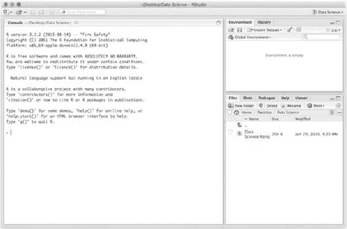
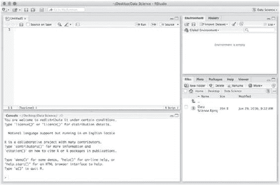

# 一、R 编程简介

我们将使用 R 进行数据分析，因此我们需要了解 R 语言编程的基础。r 是一种完整的编程语言，具有函数式编程和面向对象编程的特性。学习这门语言远远超出了本章的范围，我们将在后面讨论。不过，好消息是，要使用 R 进行数据分析，您很少需要做太多的编程。至少，如果你做了正确的编程，你不需要太多。

对于操作数据——如何操作是下一章的主题——你主要只需要把几个操作串在一起。诸如“按此特征对数据进行分组”，然后“计算每组中这些特征的平均值”，然后“绘制这些平均值”等操作。这在 R 中过去要复杂得多，但是一些关于如何构造这种数据流的新想法——以及在 magrittr 和 dplyr 等软件包中的一些巧妙实现——已经大大简化了它。我们将在本章末尾看到其中的一些，在下一章中会看到更多。不过，首先，你需要尝试一下 r。

## 与 R 的基本交互

如果你还没有下载 RStudio 的话，就从下载开始吧([https://www.rstudio.com/products/RStudio](https://www.rstudio.com/products/RStudio))。如果你打开它，你应该会看到一个类似图 [1-1](#Fig1) 的窗口。除了您将处于一个空项目中，而图中显示(右上角)这个 RStudio 是在一个名为“数据科学”的项目中打开的。你总是想参与一个项目。项目通过记住你写的变量和函数来跟踪你的分析状态，并且跟踪你打开了哪些文件等等。选择文件➤新建项目以创建项目。您可以从现有的目录中创建一个项目，但是如果这是您第一次使用 R，您可能只想在一个新的目录中创建一个空项目，那么就这样做吧。



###### 图 1-1。RStudio(工作室)

打开 RStudio 后，您可以在控制台中键入 R 表达式，控制台是 RStudio 窗口左侧的框架。当你在那里写一个表达式时，R 会读取它，计算它，并打印结果。当您给变量赋值时，您将很快看到如何做，它们将出现在右上角的环境框架中。在右下角，您有项目所在的目录，您创建的文件将放在那里。

要创建新文件，请选择文件➤新建文件。您可以选择几种不同的文件类型。我们对脚本和降价类型感兴趣。前者是纯 R 代码的文件类型，而后者用于创建文档文本与 R 代码混合的报告。对于数据分析项目，我建议使用 Markdown 文件。当你需要几个月后再回到一个项目时，为你正在做的事情写文档是非常有用的。

对于本章的大部分内容，您可以在控制台中编写 R 代码，或者创建一个 R 脚本文件。如果你创建了一个 R 脚本文件，它会出现在左上角，如图 [1-2](#Fig2) 所示。您可以使用此框架右上角的“运行”按钮评估单个表达式，或者使用“源”按钮评估整个文件。对于更长的表达式，现在您可能想把它们写在 R 脚本文件中。在下一章，我们将讨论 R Markdown，它是数据科学项目的更好的解决方案。



###### 图 1-2。带有新的 R 脚本文件的 RStudio

## 用 R 作为计算器

你可以使用 R 控制台作为一个计算器，你只需输入一个你想要计算的表达式，按下回车键，R 就会给你结果。您可以稍微摆弄一下，以熟悉如何用 R 编写表达式——下面有一些关于如何编写表达式的解释——从将 R 用作计算器这种意义上转向编写更复杂的分析程序只是一个程度问题。毕竟，数据分析程序实际上只不过是一系列的计算。

### 简单的表达

与大多数其他编程语言一样，简单的算术表达式是用您熟悉的典型数学符号编写的。

```py
1 + 2
## [1] 3
4 / 2
## [1] 2
(2 + 2) * 3
## [1] 12
```

它的工作方式也和你习惯的差不多。或许，除了你可能习惯于整数在除法中的表现。至少在一些编程语言中，整数之间的除法是整数除法，但是在 R 中，你可以对整数进行除法运算，如果有余数，你将得到一个浮点数作为结果。

```py
4 / 3
## [1] 1.333333
```

当你写像 4 和 3 这样的数字时，它们被解释为浮点数。要显式地得到一个整数，必须写出 4L 和 3L。

```py
**class**(4)
## [1] "numeric"
**class**(4L)
## [1] "integer"
```

如果你将两个整数相除，你仍然会得到一个浮点，尽管没有必要明确地告诉 R 你想要浮点除法。另一方面，如果您想要整数除法，您需要一个不同的运算符%/%:

```py
4 %/% 3
## [1] 1
```

在许多语言中,%用于获得除法的余数，但这在 R 中不太适用，在 R 中,%用于构造中缀运算符。所以在 R 中，这个操作符是%%:

```py
4 %% 3
## [1] 1
```

除了基本的算术运算符——加、减、乘、除和您刚才看到的模运算符——您还有一个求幂运算符。为此，您可以使用^或**作为中缀运算符:

```py
2^2
## [1] 4
2^3
## [1] 8
2**2
## [1] 4
2**3
## [1] 8
```

除了数字之外，还有其他一些数据类型，但我们不会在这里一一列举。不过，有两种类型你需要尽早了解，因为它们经常被使用，而且不了解它们的工作原理会导致各种各样的悲伤。那些是字符串和“因子”。

字符串如您所料地工作。你把它们用引号括起来，要么是双引号，要么是单引号，仅此而已。

```py
"hello,"
## [1] "hello,"
'world!'
## [1] "world!"
```

字符串并不特别复杂，但是我提到它们是因为它们看起来很像因子，但是因子不像字符串，它们看起来足够像它们以至于引起一些混淆。当你看到函数和向量是如何工作的时候，我会在本章稍后解释因子。

### 分配

要给变量赋值，可以使用箭头运算符。因此，您将值 2 赋给变量 x，您将编写以下代码:

```py
x <- 2
```

你可以通过计算 x 来测试 x 现在持有值 2。

```py
x
## [1] 2
```

当然，你现在可以在表达式中使用 x:

```py
2 * x
## [1] 4
```

您可以用两个方向的箭头进行赋值，因此您也可以编写以下内容:

```py
2 -> x
```

如果你把一个赋值写到 R 终端，它不会打印任何东西，但是你可以让 R 打印它，只要把这个赋值放在括号里。

```py
x <- "invisible"
(y <- "visible")
## [1] "visible"
```

### 其实以上都是价值的向量…

如果您想知道为什么上面打印的所有值前面都有一个[1]，我现在就来解释一下。这是因为在 r 中，我们通常不处理单个值，而是处理值的向量(在下一节中你会听到更多关于向量的内容)。我们看到的向量长度为 1，它们由一个值组成，所以把它们看作单个值没有错。但它们确实是矢量。

然而,[1]并没有指出我们看到的是一个长度为 1 的向量。[1]告诉你[1]之后的第一个值是向量中的第一个值。对于更长的向量，每次 R 移动到输出的下一行时，就可以得到索引。这样做只是为了让你更容易进入一个特定的索引。

如果您创建一个更长的向量，您会看到这一点，例如，您可以使用:运算符创建一个长度为 50 的向量:

```py
1:50
##  [1]  1  2  3  4  5  6  7  8  9 10 11 12 13 14 15
## [16] 16 17 18 19 20 21 22 23 24 25 26 27 28 29 30
## [31] 31 32 33 34 35 36 37 38 39 40 41 42 43 44 45
## [46] 46 47 48 49 50
```

因为我们本质上总是在处理向量，所以有一点我想提醒你。如果你想知道一个字符串的长度，你可能——很合理地——认为你可以使用 length 函数得到它。你就错了。这个函数给你一个向量的长度，所以如果你给它一个字符串，它总是返回 1。

```py
**length**("qax")
## [1] 1
**length**("quux")
## [1] 1
**length**(**c**("foo", "barz"))
## [1] 2
```

在上一个表达式中，我们使用了函数 c()来连接两个字符串。这创建了一个两个字符串的向量，因此对其调用 length 的结果是 2。要获得实际字符串的长度，您需要 nchar:

```py
**nchar**("qax")
## [1] 3
**nchar**("quux")
## [1] 4
**nchar**(**c**("foo", "barz"))
## [1] 3 4
```

### 索引向量

如果你有一个向量，并且想要这个向量的第 *i* 个元素，你可以这样索引这个向量:

```py
(v <- 1:5)
## [1] 1 2 3 4 5
v[1]
## [1] 1
v[3]
## [1] 3
```

我们用括号将第一个表达式括起来，以查看操作的输出。赋值在 R 中通常是无声的，但是通过把表达式放在括号中，我们确保 R 打印出结果，结果是从 1 到 5 的整数的向量。请注意，第一个元素位于索引 1 处。很多编程语言从 0 开始索引，但是 R 从 1 开始索引。长度为 *n* 的向量的索引从 1 到 *n* ，不像在零索引语言中，索引从 0 到*n*–1。

如果你想提取一个子向量，你也可以通过索引来实现。你只需要在方括号中使用一个你想要的索引向量。您可以使用:运算符或 concatenate 函数 c():

```py
v[1:3]
## [1] 1 2 3
v[**c**(1,3,5)]
## [1] 1 3 5
```

您甚至可以使用布尔值向量来挑选出那些“真”值:

```py
v[**c**(TRUE, FALSE, TRUE, FALSE, TRUE)]
## [1] 1 3 5
```

当您将它与表达式结合使用时，这尤其有用。例如，你可以得到一个布尔值向量，告诉你向量中的哪些值是偶数，然后用这个向量把它们挑选出来。

```py
v %% 2 == 0
## [1] FALSE  TRUE FALSE  TRUE FALSE
v[v %% 2 == 0]
## [1] 2 4
```

如果你改变它们的符号，你可以得到一个索引向量的补码:

```py
v[-(1:3)]
## [1] 4 5
```

也可以给向量索引命名，如果你这样做了，你可以用它们来索引向量。您可以在构造 vector 时设置它的名称，或者使用 names()函数。

```py
v <- **c**("A" = 1, "B" = 2, "C" = 3)
v
## A B C
## 1 2 3
v["A"]
## A
## 1
**names**(v) <- **c**("x", "y", "z")
v
## x y z
## 1 2 3
v["x"]
## x
## 1
```

这对于制作可以通过键查找值的表非常有用。

### 矢量化表达式

现在，你在上面看到的表达式处理向量值而不是单个值的原因是，在 R 中，算术表达式实际上都是按分量处理向量的。当您编写如下表达式时:

```py
x ** 2 - y
```

你实际上是告诉 R 取向量 x 中的每个元素，平方它，然后用 y 中的元素减去它。

```py
(x <- 1:3)
## [1] 1 2 3
x ** 2
## [1] 1 4 9
y <- 6:8
x ** 2 - y
## [1] -5 -3  1
```

如果向量有不同的长度，这也是可行的，就像在前面的例子中一样。向量 2 是长度为 1 的向量，包含数字 2。当向量不具有相同的长度时，表达式的工作方式是，你只需根据需要多次重复较短的向量。

```py
(x <- 1:4)
## [1] 1 2 3 4
(y <- 1:2)
## [1] 1 2
x - y
## [1] 0 0 2 2
```

如果较长向量的长度不是较短向量长度的倍数，您会得到一个警告。表达式仍然会多次重复较短的向量，只是次数不是整数。

```py
(x <- 1:4)
## [1] 1 2 3 4
(y <- 1:3)
## [1] 1 2 3
x - y
## Warning in x - y: longer object length is not a
## multiple of shorter object length
## [1] 0 0 0 3
```

这里，y 用于 x 的 1:3 部分，然后 y 的第一个元素用于 x 中的 4。

## 评论

当你只是与 R 终端交互时，你可能不想写注释，但是在你的代码中你会写。#评论就是后面的一切#。从 a #到行尾，R 解析器只是跳过文本。

```py
*# This is a comment.* 
```

如果你在 R Markdown 文档中编写你的分析代码，我们将在下一章中介绍，你将不需要太多的注释。在这些类型的文件中，你以不同的方式混合文本和 R 代码。但是如果你开发了 R 代码，你就会有对它的需求。现在你知道如何写评论了。

## 功能

你已经看到了函数的用法，尽管你可能没有想太多，当你看到这样的表达式时:

```py
**length**("qax")
```

你没有考虑它，因为它没有任何令人惊讶的地方。您只需使用函数的常用数学符号: *f* ( *x* )。如果您想调用一个函数，您只需使用这种符号，并在括号中给出函数的参数。

在 R 中，当调用函数时，除了位置之外，还可以使用参数的名称。如果你有一个函数 *f* ( *x，y*)*x*和 *y* ，调用 *f* (5，10)意味着调用 *f* ，参数 *x* 设置为 5，参数 *y* 设置为 10。在 R 中，您可以显式地指定这一点，这两个函数调用是等效的:

```py
**f**(5, 10)
**f**(x = 5, y = 10)
```

如果您指定了参数的名称，顺序就不再重要了，因此另一个等价的函数调用应该是:

```py
**f**(y = 10, x = 5)
```

只要将所有位置参数放在命名参数之前，就可以将这两种向函数传递参数的方式结合起来。

```py
**f**(5, y = 10)
```

除了可能使代码可读性稍微好一点——通常记住参数做什么比记住它们出现的顺序更容易——这本身没有太大的必要。它真正有用的地方是与默认参数结合使用。

R 中的很多函数都有很多参数。比你所能记得的更多的用法和明确的顺序。它们很像有很多选项的程序，但是你通常只使用默认值，除非你真的需要调整一个选项。这些函数有很多参数，但大多数都有有用的默认值，通常不需要指定要设置的值。但是，当您*确实*需要它时，您可以用一个命名参数来指定它。

### 获取函数的文档

因为很难记住函数做什么的细节，尤其是函数的所有参数做什么，所以你经常需要查阅函数的文档。幸运是，这在 R 和 RStudio 中很容易做到。无论何时你想知道一个函数是做什么的，你只需要问 R，它就会告诉你(假设这个函数的作者已经写了文档)。

从前面看到的例子中取出函数长度。想知道函数是做什么的，就写？R 端子中的长度。如果您在 RStudio 中执行此操作，它会在右侧的框架中显示文档，如图 [1-3](#Fig3) 所示。


###### 图 1-3。RStudio 的帮助框架

尝试查找一些函数的文档。比如你之前也看到的 nchar 函数。

所有中缀运算符，像+或%%，也是 R 中的函数，你也可以阅读它们的文档。但是你不会写？+并获取信息。R 解析器不知道如何处理这个问题。如果你想得到关于中缀操作符的帮助，你需要给它加上引号，你可以使用反引号。因此，要阅读+的文档，您需要编写:

```py
?`+`
```

你可能不需要帮助来弄清楚加法是做什么的，但是人们可以写他们自己的中缀操作符，所以当你需要帮助的时候，这是很有用的。

### 编写自己的函数

您可以轻松地编写自己的函数。使用函数表达式定义函数，使用赋值给函数命名。例如，要编写一个计算数字平方的函数，您可以编写:

```py
square <- function(x) x**2
**square**(1:4)
## [1]  1  4  9 16
```

function(x) x**2 表达式定义了函数，任何需要函数的地方都可以这样显式地写函数。将函数指定给一个名称可以让您使用该名称来引用该函数，就像将任何其他值(如数字或字符串)指定给一个名称一样，可以让您使用该名称作为值。

您自己编写的函数就像任何已经是 R 的一部分或 R 包的一部分的函数一样工作。不过有一个例外:除非你自己写，否则你不会有自己函数的文档，这超出了本章的范围(但在第 [11](11.html) 章中有所涉及)。

square 函数只是对其输入进行简单的算术运算。有时你想让函数做不止一件事。如果你想让这个函数对它的输入做一些操作，你需要这个函数的几个语句，在这种情况下你需要给它一个由几个语句组成的“体”,这样的体必须放在花括号里。

```py
square_and_subtract <- function(x, y) {
    squared <- x ** 2
    squared - y
}
**square_and_subtract**(1:5, **rev**(1:5))
## [1] -4  0  6 14 24
```

(查看 rev 的文档，了解这里发生了什么。确保你理解这个例子在做什么。)

在这个简单的例子中，我们并不真的需要几个语句。我们可以把函数写成:

```py
square_and_subtract <- function(x, y) x ** 2 - y
```

只要函数中只有一个表达式，我们就不需要花括号。但是，对于更复杂的函数，您将需要它。

函数的结果——当你调用它时，它返回的值——是最后一个语句或表达式(在 R 中，语句和表达式之间没有任何区别；它们是一回事)。不过，您可以使用 return()表达式使返回值显式。

```py
square_and_subtract <- function(x, y) **return**(x ** 2 - y)
```

这通常只在你想在函数结束前返回值的时候使用——为了看到这样的例子，你真的需要控制结构，所以你必须等一会儿才能看到例子——所以它不像在其他语言中那么常用。

但是，如果您习惯于用其他语言编程，这里有一点很重要:return()表达式需要包含括号。在大多数编程语言中，你可以只写:

```py
square_and_subtract <- function(x, y) return x ** 2 - y
```

这对 r 不起作用，试试看，会得到一个错误。

### 矢量化表达式和函数

许多函数像算术表达式一样处理矢量化表达式。事实上，你写的任何函数，只要用这样的表达式定义，就能对向量起作用，就像平方函数一样。

这并不总是有效的。并非所有函数都接受单个值并返回单个值，在这些情况下，您不能在矢量化表达式中使用它们。以函数 sum 为例，它将一个向量中的所有值相加，并将其作为一个参数(检查？sum now 查看文档)。

```py
**sum**(1:4)
## [1] 10
```

该函数将其输入汇总成一个值。还有许多类似的函数，当然，这些函数不能用于向量的元素。

一个函数是否对向量表达式起作用取决于它是如何定义的。R 中的大多数函数要么作用于向量，要么像 sum 一样对向量求和。当你写自己的函数时，函数是否对向量元素起作用取决于你在函数体中放了什么。如果你写一个只对输入进行算术运算的函数，比如 square，它将在矢量化的表达式中工作。如果你写一个对数据做一些汇总的函数，它不会。例如，如果我们编写一个函数来计算其输入的平均值，如下所示:

```py
average <- function(x) {
    n <- **length**(x)
    **sum**(x) / n
}
**average**(1:5)
## [1] 3
```

这个函数不会给出元素的值。很明显，真的。当您编写的函数包含控制结构时，情况会变得稍微复杂一些，我们将在下一节讨论这一点。无论如何，这将是一个更好的实现，因为它只涉及一个表达式:

```py
average <- function(x) **sum**(x) / **length**(x)
```

哦，还有一点:不要用这个平均函数来计算一个向量的平均值。r 已经有了一个函数，可以更好地处理特殊情况，比如缺失数据和长度为零的向量。退房？卑鄙。

## 快速浏览控制结构

虽然仅仅使用表达式已经取得了很大进展，但对于许多计算，你需要更复杂的编程。这并不特别复杂，但是您确实需要能够根据数据(选择或 if 语句)和数据迭代方式(循环或 for 语句)来选择要做的事情。

如果语句是这样工作的:

```py
if (<boolean expression>) <expression>
```

如果布尔表达式评估为真，则评估表达式；如果没有，就不会。

```py
*# this won't do anything* 
if (2 > 3) "false"
*# this will* 
if (3 > 2) "true"
## [1] "true"
```

对于像这样的表达式，我们不通过计算表达式来改变程序状态，计算 if 表达式没有太大的影响。如果我们，比如，把它赋给一个变量，就会有一个效果。

```py
x <- "foo"
if (2 > 3) x <- "bar"
x
## [1] "foo"
if (3 > 2) x <- "baz"
x
## [1] "baz"
```

如果你想对真和假的表达式都有效果，你有这个:

```py
if (<boolean expression>) <true expression> else <false expression>
if (2 > 3) "bar" else "baz"
## [1] "baz"
```

如果你想在 If 语句中换行，不管你有没有 else 部分，你都需要花括号。这不行:

```py
if (2 > 3)
    x <- "bar"
```

但是这将:

```py
if (2 > 3) {
    x <- "bar"
}
```

if 语句的工作方式类似于表达式。

```py
if (2 > 3) "bar" else "baz"
```

这将计算 if 或 else 部分中表达式的结果。

```py
x <- if (2 > 3) "bar" else "baz"
x
## [1] "baz"
```

但是，您不能将它用于矢量化表达式，因为如果您给布尔表达式一个向量，它将计算向量中的第一个元素:

```py
x <- 1:5
if (x > 3) "bar" else "baz"
## Warning in if (x > 3) "bar" else "baz": the
## condition has length > 1 and only the first
## element will be used
## [1] "baz"
```

如果需要 If 语句的矢量化版本，可以使用 ifelse 函数:

```py
x <- 1:5
**ifelse**(x > 3, "bar", "baz")
## [1] "baz" "baz" "baz" "bar" "bar"
```

(阅读？ifelse 文档来获得这个函数的细节。)

当然，这对编写使用 if 语句的函数也有影响。如果你的函数包含一个没有矢量化的物体，你的函数也不会矢量化。

```py
maybe_square <- function(x) {
    if (x %% 2 == 0) {
        x ** 2
    } else {
        x
    }
}
**maybe_square**(1:5)
## Warning in if (x%%2 == 0) {: the condition has
## length > 1 and only the first element will be used
## [1] 1 2 3 4 5
```

如果您想要一个矢量化的函数，您需要使用 ifelse()，或者您可以使用 Vectorize()函数将一个非矢量化的函数转换为矢量化的函数。

```py
maybe_square <- function(x) {
    **ifelse** (x %% 2 == 0, x ** 2, x)
}
**maybe_square**(1:5)
## [1]  1  4  3 16  5
maybe_square <- function(x) {
    if (x %% 2 == 0) {
        x ** 2
    } else {
        x
    }
}
maybe_square <- **Vectorize**(maybe_square)
**maybe_square**(1:5)
## [1]  1  4  3 16  5
```

矢量化函数就是所谓的“仿函数”，即以函数作为输入并返回函数的函数。如何像处理其他数据一样处理函数已经超出了本章的范围，但是这是 R 的一个非常强大的特性，我们将在关于高级 R 编程的第 [9](09.html) 章中讨论。

要循环遍历 vector 中的元素，可以使用 for 语句。

```py
x <- 1:5
total <- 0
for (element in x) total <- total + element
total
## [1] 15
```

与 if 语句一样，如果您希望主体包含多个表达式，您需要将它放在花括号中。

for 语句遍历 vector 的元素。如果需要索引，可以使用 seq_along()函数，当给定一个向量作为输入时，该函数返回一个索引向量。

```py
x <- 1:5
total <- 0
for (index in **seq_along**(x)) {
    element <- x[index]
    total <- total + element
}
total
## [1] 15
```

还有用于循环的 while 语句。只要表达式为真，这些就会重复。

```py
x <- 1:5
total <- 0
index <- 1
while (index <= **length**(x)) {
    element <- x[index]
    index <- index + 1
    total <- total + element
}
total
## [1] 15
```

如果你习惯于零索引的向量，注意这里的索引< = length(x)。在零索引语言中，通常编写 index < length(x)。这里会遗漏最后一个元素。

还有一个 repeat 语句，它会一直循环，直到使用 break 语句显式退出。

```py
x <- 1:5
total <- 0
index <- 1
repeat {
  element <- x[index]
  total <- total + element
  index <- index + 1
  if (index > **length**(x)) break
}
total
## [1] 15
```

还有一个 next 语句，使循环跳转到下一次迭代。

既然我已经告诉了你关于循环的事情，我觉得我还应该说，它们在 R 中的使用通常不如在其他编程语言中那么多。许多人都极力反对使用循环，他们以导致代码运行缓慢而闻名。后者本身是不合理的，但是使用循环比其他方法更容易编写缓慢的代码。相反，您使用函数来接管循环功能。通常有一个函数可以使用循环来完成您想要完成的任何事情，如果没有，您通常可以通过组合三个函数来获得您想要的结果——映射、过滤和归约。

但这超出了本章的范围；我们将在本书的后面回到这个问题。

## 工厂

现在让我们回到我前面提到的数据类型和因素。因素本质上只是向量，但具有分类值。这只是意味着一个因素的元素应该被认为是类别或类，而不是数字。例如，像“小”、“中”和“大”*这样的类别可以被编码成数字，但是实际上没有任何自然数可以分配给它们。我们可以将软饮料的大小编码为 1、2 和 3，分别代表“小”、“中”和“大”。这样做，我们是在含蓄地说“小”和“中”的区别是“小”和“大”的区别的一半，事实未必如此。大小为“小”、“中”和“大”的数据应该被编码为分类数据，而不是数字，在 R 中这意味着将它们编码为因子。*

 *一个因子通常是通过给它一个字符串列表来构造的。这些被翻译成不同的类别，并且因子成为这些类别的向量。

```py
f <- **factor**(**c**("small", "small", "medium",
              "large", "small", "large"))
f
## [1] small  small  medium large  small  large
## Levels: large medium small
```

这些类别被称为“级别”。

```py
**levels**(f)
## [1] "large"  "medium" "small"
```

默认情况下，这些是按字母顺序排列的，在本例中，我们得到的顺序是“大”、“中”、“小”。您可以在创建因子时通过指定级别来更改此顺序。

```py
ff <- **factor**(**c**("small", "small", "medium",
               "large", "small", "large"),
             levels = **c**("small", "medium", "large"))
ff
## [1] small  small  medium large  small  large
## Levels: small medium large
```

像这样改变级别的顺序会改变处理因子的函数的数量。因子级别的顺序主要影响汇总信息的打印方式和因子的绘制方式。

```py
**summary**(f)
##  large medium  small
##      2      1      3
**summary**(ff)
##  small medium  large
##      3      1      2
```

然而，等级的顺序不应该是类别的“排序”。它只是用于显示结果；除非您明确指定一个顺序语义，否则这些级别没有顺序语义。

一些分类数据有一个自然的顺序。比如“小”“中”“大”。其他类别没有自然排序。没有自然的方式来排列“红”、“绿”和“蓝”。当我们打印数据时，它总是有序的，因为文本总是有序的。当我们绘制数据时，它通常也是有序的。但是在许多数学模型中，我们会将有序分类数据与无序分类数据区别对待，所以这种区别有时很重要。

默认情况下，因子不将级别视为有序，因此它们假设分类数据像“红”、“绿”和“蓝”一样，而不是像“小”、“中”和“大”一样有序。如果要指定级别实际上是有序的，可以使用带有 factor()函数的 ordered 参数。

```py
of <- **factor**(**c**("small", "small", "medium",
               "large", "small", "large"),
             levels = **c**("small", "medium", "large"),
             ordered = TRUE)
of
## [1] small  small  medium large  small  large
## Levels: small < medium < large
```

您也可以使用 ordered()函数:

```py
**ordered**(ff)
## [1] small  small  medium large  small  large
## Levels: small < medium < large
**ordered**(f, levels = **c**("small", "medium", "large"))
## [1] small  small  medium large  small  large
## Levels: small < medium < large
```

一个因子实际上不是以字符串的形式存储的，即使我们是从一个字符串向量中创建的。它存储为整数向量，其中整数是级别的索引。如果你试图用一个因子来索引，这可能会让你吃不了兜着走。

仔细阅读下面的代码。我们有向量 v，可以用字母 A、B、C 和 d 来索引，我们创建一个因子 ff，它由这四个字母按顺序组成。当我们用它做索引时，我们得到了我们所期望的。由于 ff 是字母 A 到 D，我们从 v 中挑选出带有这些标签的值，并按此顺序排列。

```py
v <- 1:4
**names**(v) <- LETTERS[1:4]
v
## A B C D
## 1 2 3 4
(ff <- **factor**(LETTERS[1:4]))
## [1] A B C D
## Levels: A B C D
v[ff]
## A B C D
## 1 2 3 4
```

不过，我们很幸运得到了预期的结果。因为这个表达式是*而不是*使用我们期望它使用的名字进行索引。请更仔细地阅读以下内容！

```py
(ff <- **factor**(LETTERS[1:4], levels = **rev**(LETTERS[1:4])))
## [1] A B C D
## Levels: D C B A
v[ff]
## D C B A
## 4 3 2 1
```

这一次 ff 仍然是一个向量，类别 A 到 D 按照这个顺序排列，但是我们已经指定级别是 D、C、B 和 A，按照这个顺序是*。所以类别存储的数值实际上是这样的:*

```py
**as.numeric**(ff)
## [1] 4 3 2 1
```

当我们用它来索引 v 时，我们得到的是*那些*数字索引，所以我们得到从 v 中取出的值，其顺序与我们不知道时所期望的相反(你现在知道了)。

把一个因子当作它所拥有的实际标签来处理的最简单的方法是把它转换成一个字符串向量。您可以使用该向量来索引:

```py
**as.vector**(ff)
## [1] "A" "B" "C" "D"
v[**as.vector**(ff)]
## A B C D
## 1 2 3 4
```

如果您发现自己在使用一个因子来索引某个东西，或者以任何其他方式将一个因子视为一个字符串向量，那么您真的应该停下来，确保将它显式地转换为一个字符串向量。把一个因子当作一个字符串的向量，而实际上它是一个整数的向量，从长远来看只会导致眼泪和痛苦。

## 数据帧

我们所看到的向量，不管它们是什么类型，都只是数据序列。除了序列顺序之外，它们没有任何结构，这可能与如何解释数据有关，也可能无关。这不是我们想要分析的数据的样子。我们通常有几个变量，它们作为相同观察值的一部分是相关的。对于每个观察到的数据点，这些变量中的每一个都有一个值(或者如果没有观察到某些变量，则有缺失数据指示)。本质上，您拥有的是一个表，每个观察值占一行，每个变量占一列。R 中这种表的数据类型是 data.frame。

数据框是向量的集合，其中所有向量的长度必须相同，您可以将其视为二维表。我们通常认为数据帧的每一行对应于某个观察值，每一列对应于观察值的某个属性。以这种方式处理数据框使得它们对于统计建模和拟合非常有用。

您可以使用 data.frame 函数显式创建数据框，但通常您会从文件中读取数据框。

```py
df <- **data.frame**(a = 1:4, b = letters[1:4])
df
##   a b
## 1 1 a
## 2 2 b
## 3 3 c
## 4 4 d
```

要访问数据框中的各个元素，必须对其进行索引。既然是二维数据结构，你就要给它两个索引。

```py
df[1,1]
## [1] 1
```

但是，您可以将其中一个留空，在这种情况下，您将获得一整列或一整行。

```py
df[1,]
##   a b
## 1 1 a
df[,1]
## [1] 1 2 3 4
```

如果行或列是命名的，您也可以使用名称进行索引。这主要用于列名，因为它是与数据集中观察到的变量相对应的列。有两种方法可以访问列，但是显式索引:

```py
df[,"a"]
## [1] 1 2 3 4
```

或者使用$column_name 表示法，它做同样的事情，但是让您不必使用[]操作和引用列名就可以获得列。

```py
df$b
## [1] a b c d
## Levels: a b c d
```

默认情况下，数据框会将字符向量视为一个因素，如果您想要一个字符向量，您需要明确地告诉它不要这样做。

```py
df <- **data.frame**(a = 1:4, b = letters[1:4], stringsAsFactors = FALSE)
```

从各种文本格式读入数据的函数通常也会将字符串向量转换为因子，您需要明确地防止这种情况。readr 包(见[https://github.com/hadley/readr](https://github.com/hadley/readr))是一个明显的例外，它的默认是把字符向量当作字符向量。

您可以使用 rbind 和 cbind 函数按行或按列组合两个数据框:

```py
df2 <- **data.frame**(a = 5:7, b = letters[5:7])
**rbind**(df, df2)
##   a b
## 1 1 a
## 2 2 b
## 3 3 c
## 4 4 d
## 5 5 e
## 6 6 f
## 7 7 g
df3 <- **data.frame**(c = 5:8, d = letters[5:8])
**cbind**(df, df3)
##   a b c d
## 1 1 a 5 e
## 2 2 b 6 f
## 3 3 c 7 g
## 4 4 d 8 h
```

对于更复杂的数据帧操作，你真的应该使用 dplyr 包(见[https://github.com/hadley/dplyr](https://github.com/hadley/dplyr))或类似的。我们在第三章[回到这个话题。](03.html)

## 处理缺失值

大多数数据集都有缺失值，即没有观察到或记录不正确且必须被屏蔽掉的参数。如何处理分析中的缺失数据取决于数据和分析，但它必须得到解决，即使您所做的只是删除所有带有缺失数据的观测值。

缺失数据在 R 中用特殊值 NA 表示(不可用)。任何类型的值都可以缺失，并表示为 NA，重要的是 R 知道 NA 意味着缺失值，并相应地对待 NAs。您应该总是用 NA 来表示丢失的数据，而不是一些特殊的数字(比如-1 或 999 或其他什么)。r 知道如何使用 NA，但无法知道-1 除了-1 还意味着什么。

涉及 NA 的操作本身就是 NA。您不能对丢失的数据进行操作，而只能得到更多丢失的值。这也意味着，如果你比较两个 NAs，你得到 NA。因为 NA 是缺失信息，甚至不等于自身。

```py
NA + 5
## [1] NA
NA == NA
## [1] NA
NA != NA
## [1] NA
```

如果要检查某个值是否丢失，必须使用函数 is.na:

```py
**is.na**(NA)
## [1] TRUE
**is.na**(4)
## [1] FALSE
```

如果 sum()等函数的输入包含 NA，则默认情况下将返回 NA:

```py
v <- **c**(1,NA,2)
**sum**(v)
## [1] NA
```

如果您只想忽略 NA 值，通常会有一个参数来指定:

```py
**sum**(v, na.rm = TRUE)
## [1] 3
```

## 使用 R 包

开箱即用，R 有很多功能，但真正强大的地方在于它的包机制和可供下载和使用的大量包。

安装 RStudio 时，它还会安装一组默认软件包。点击右下框中的 packages 选项卡可以看到安装了哪些包，如图 [1-4](#Fig4) 所示。


###### 图 1-4。RStudio 包

从这里您可以更新软件包—重要软件包的新版本会定期发布—并且您可以安装新的软件包。尝试安装软件包马格里特(参见[https://github.com/smbache/magrittr](https://github.com/smbache/magrittr))。我们很快就会用到它。

您也可以从 R 控制台安装软件包。就写:

```py
**install.packages**("magrittr")
```

一旦安装了软件包，您就可以访问其中的功能。您可以通过编写 package::f()在包中获取函数 f，或者您可以将包中的所有函数加载到您的全局名称空间中，以便在不使用 package::前缀的情况下访问它们。

从 magrittr 软件包加载功能是这样完成的:

```py
**library**(magrittr)
```

## 数据流水线(或无意义的编程)

大多数数据分析包括读入一些数据，对这些数据执行一些操作，在这个过程中，将数据从原始形式转换成我们可以开始理解的东西。然后你在最后做一些总结或想象。

分析中的这些步骤通常表示为一系列函数调用，每个调用都将数据从一种形式转换为另一种形式。它可能看起来像这样的伪代码:

```py
my_data <- **read_data**("/some/path/some_file.data")
clean_data <- **remove_dodgy_data**(my_data)
data_summaries <- **summarize**(clean_data)
**plot_important_things**(data_summaries)
```

以这种方式编写数据分析并没有什么错。但是通常涉及的步骤远不止这些。当有变量时，你要么必须创造性地命名保存数据的变量，要么必须在修改数据后通过重新分配变量来覆盖变量名。拥有许多变量名和重新分配给变量都是有问题的。

如果你有很多变量，就很容易意外地对错误的变量调用函数。例如，您可以汇总 my_data 变量，而不是 clean_data 变量。如果你用一个不存在的变量名调用一个函数，你会得到一个错误，但是你不一定会得到一个简单的错误。如果你只是用不正确的数据调用一个函数，你可能不会注意到它，但是它可能会给你错误的结果。这不是一个容易调试的错误。

重新赋值给一个变量的问题稍微少一些。当您以交互方式使用 R 时，这通常是一个问题。在那里，如果你想返回并修改你正在编写的程序的一部分，你必须一直回到开始，在那里数据被导入。你不能在函数调用中间的某个地方开始使用一个变量，这个变量引用的数据与你从头开始运行程序时引用的数据不同。如果你总是从头开始运行你的 R 脚本，问题会小一些，但是 R 的典型用法是在交互式控制台或 Markdown 文档中使用它，这可能是一个问题。

因此，解决方案不是一次调用一个函数，并将每个临时结果赋给一个变量。上一个例子中有四条语句，每个函数调用一条，您只需将第一个函数调用的结果传递给下一个函数调用。

```py
**plot_important_things**(
    **summarize**(
        **remove_dodgy_data**(
            **read_data**("/some/path/some_file.data"))))
```

委婉地说，您去掉了所有变量，但是可读性受到了影响。你必须从右到左从里到外阅读代码。

### 编写函数调用的流水线

magrittr 包实现了一个技巧来缓解这个问题。它通过引入一个“流水线操作符”%>%，让您可以编写想要从左到右组合的函数。您得到的效果就像您一个接一个地调用并将结果从一个函数发送到下一个函数的输入一样。

操作员的工作方式是:

```py
x %>% f
```

相当于写:

```py
**f**(x)
```

和写作:

```py
x %>% f %>% g %>% h
```

相当于写:

```py
**h**(**g**(**f**(x)))
```

前面的例子将变成:

```py
**read_data**("/some/path/some_file.data") %>%
    remove_dodgy_data %>%
    summarize %>%
    plot_important_things
```

像这样阅读代码可能还需要一些时间来适应，但这比从里到外组合函数要容易阅读得多。

如果您曾经在 UNIX shells 中使用过流水线，您应该会立即看到相似之处。这是组合功能/程序的相同方法。通过组合几个函数，每个函数做一些相对简单的事情，您可以创建非常强大的流水线。

使用%>%操作符编写流水线是 R 编程中引入的一个相对较新的习惯用法，但是它非常强大，并且在不同的 R 包中使用得越来越多。

顺便提一下，如果您想知道为什么实现 R 中流水线的包被称为 magrittr，它指的是比利时艺术家勒内·马格里特，他画了一个流水线，并在下面写道:“颜后君 n'est pas une pipe”(“这不是流水线”)。关于比利时超现实主义者已经说得够多了。

### 编写使用流水线的函数

%>%操作符实际上做了一些非常简单的事情，这反过来使得编写能够很好地使用它的新函数变得简单。它只是把左边计算的结果作为第一个参数插入到右边给定的函数中，从左到右进行。所以 x %>% f 变成 f(x)，x %>% f %>% g 变成 f(x) %>% g 然后 g(f(x))，x %>% f(y)变成 f(x，y)。如果您已经为流水线中的函数提供了参数，那么%>%的左侧将被插入到流水线中这些参数的前面。

因此，如果您希望编写与流水线配合良好的函数，您应该确保最有可能通过流水线的参数是函数的第一个参数。编写您的函数，使第一个参数是它所操作的数据，您已经完成了大部分工作。

例如，如果您想要一个对数据帧的 n 个随机行进行采样的函数，您可以这样编写它，它将数据帧作为第一个参数，将参数 n 作为第二个参数，然后您可以简单地将它直接放入流水线:

```py
subsample_rows <- function(d, n) {
  rows <- **sample**(**nrow**(d), n)
  d[rows,]
}

d <- **data.frame**(x = **rnorm**(100), y = **rnorm**(100))
d %>% **subsample_rows**(n = 3)
##             x          y
## 46  0.5622234 -0.4184033
## 17 -0.5973131 -1.5549958
## 38 -2.0004727 -1.0736909
```

### 神奇的”争吵

现在，你不能总是这么幸运，所有你想在流水线中调用的函数都把%>%的左边作为它的第一个参数。如果是这种情况，您仍然可以使用这个函数，因为 magrittr 解释了。以一种特殊的方式。如果你使用。在流水线中的函数调用中，这是%>%操作左侧的位置，而不是右侧的默认第一个参数。所以如果你需要数据作为第二个参数，你可以放一个.在那里，因为 x %>% f(y，。)等价于 f(y，x)。由于 x %>% f(y，z =，所以当您需要将左侧作为命名参数提供时，情况也是如此。)等价于 f(y，z = x)，这在左侧应该给模型拟合函数时特别有用。将模型拟合到数据的函数通常将模型规范作为它们的第一个参数，并将它们拟合的数据作为一个名为 data 的命名参数。

```py
d <- **data.frame**(x = **rnorm**(10), y = **rnorm**(10))
d %>% **lm**(y ∼ x, data = .)
##
## Call:
## lm(formula = y ∼ x, data = .)
##
## Coefficients:
## (Intercept)            x
##      0.0899       0.1469
```

我们将在后面的章节中回到模型拟合，以及诸如 y∞x 这样的表达式意味着什么，所以如果它现在看起来有点奇怪，不要担心。如果您感兴趣，可以随时查看 lm()函数的文档。

马格里特包做得更多。不仅仅是改变参数的顺序。你可以用。调用函数时多次使用，并且可以在表达式或函数调用中使用:

```py
**rnorm**(4) %>% **data.frame**(x = ., is_negative = . < 0)
##            x is_negative
## 1 -0.6187822        TRUE
## 2 -1.5446573        TRUE
## 3 -2.4387665        TRUE
## 4 -1.7097824        TRUE
**rnorm**(4) %>% **data.frame**(x = ., y = **abs**(.))
##            x         y
## 1  1.5754641 1.5754641
## 2 -0.2162109 0.2162109
## 3 -0.1151102 0.1151102
## 4 -0.4561123 0.4561123
```

有一个警告:如果。*只有*出现在函数调用中，它仍然会作为第一个表达式给% > %右侧的函数。

```py
**rnorm**(4) %>% **data.frame**(x = **sin**(.), y = **cos**(.))
##           .          x           y
## 1 -1.471748 -0.9950987  0.09888622
## 2 -1.732544 -0.9869474 -0.16104285
## 3  0.642917  0.5995326  0.80035036
## 4  2.081730  0.8722884 -0.48899182
```

原因是，当需要完整数据时，这种带有函数调用的表达式比不需要完整数据时更常见。所以默认情况下，f(g(。)，h(。))被翻译成 f(。，g(。)，h(。)).如果想避免这种行为，可以在函数调用周围放上花括号，因为{f(g(。)，h(。))}相当于 f(g(。)，h(。)).(花括号的含义很快会解释。)你既可以得到行为 f(。，g(。)，h(。))和行为{f(g(。)，h(。))}在流水线中的函数调用中；默认只是最常见的情况。

### 使用定义函数。

而。主要用于为流水线中的函数提供参数，也可用作定义新函数的简写。写作:

```py
. %>% f
```

相当于写:

```py
function(.) **f**(.)
```

并且是将一个功能定义为其他功能的组合的快速方法。例如:

```py
f <- . %>% cos %>% sin
```

相当于

```py
f <- function(.) **sin**(**cos**(.))
```

通过组合其他函数来定义函数被称为“默认”或“无点”编程(有时甚至是无意义的编程，尽管这有点苛刻)，指的是您没有存储计算的中间步骤(点)的方式。你写道:

```py
f <- . %>% cos %>% sin
```

而不是:

```py
f <- function(x) {
    y <- **cos**(x)
    z <- **sin**(y)
    z
}
```

当然，当您有一个打算在多个数据集上调用的子流水线时，通常会使用这种方法。您可以像编写实际流水线一样编写一个指定流水线的函数。你只要给它。作为第一个左侧，而不是数据集，你是在定义一个函数，而不是通过流水线运行数据。

### 匿名函数

当您可以一个接一个地调用现有的函数时，流水线是很棒的，但是如果您需要流水线中的一个步骤，而没有函数执行您想要的操作，会发生什么呢？当然，您总是可以编写这样一个缺失的函数，但是如果您需要一次又一次地编写函数来完成流水线中的小任务，那么您会遇到一个类似的问题，即您需要将分析中的所有中间步骤保存在变量中。您不希望定义很多函数，因为存在在流水线中使用错误函数的风险——尤其是如果您有很多类似的函数，如果您每次都需要一个函数来调整流水线中的数据，就很可能会出现这种情况。

再次，马格里特有解决方案:λ表达式。这是一个计算机科学术语，指的是匿名函数，即你没有给出名字的函数。

当你在 R 中定义一个函数时，你实际上总是创建一个匿名函数。任何形式函数(x)表达式的表达式都是一个函数，但它没有名字，除非你把它赋给一个变量。

例如，考虑一个函数，该函数绘制变量 y 与变量 x 的关系，并拟合和绘制 y 与 x 的线性模型。您可以定义并命名这样一个函数，以获得以下代码:

```py
plot_and_fit <- function(d) {
  **plot**(y ∼ x, data = d)
  **abline**(**lm**(y ∼ x, data = d))
}

x <- **rnorm**(20)
y <- x + **rnorm**(20)
**data.frame**(x, y) %>% plot_and_fit
```

因为给函数命名并不影响函数的工作方式，所以没有必要这样做。您可以将定义函数的代码放在函数名的位置，这样就可以得到:

```py
**data.frame**(x, y) %>% (function(d) {
  **plot**(y ∼ x, data = d)
  **abline**(**lm**(y ∼ x, data = d))
})
```

它做完全相同的事情，但是没有定义函数。它也不是那么可读。使用。和花括号，您可以(稍微)提高可读性，只需编写函数体并引用它的输入——上面称为 d——如下所示。：

```py
**data.frame**(x, y) %>% {
  **plot**(y ∼ x, data = .)
  **abline**(**lm**(y ∼ x, data = .))
}
```

### 其他流水线作业

%>%操作符是一种非常强大的指定数据分析流水线的机制，但是在一些特殊情况下，需要稍微不同的行为。

一种情况是当您需要引用从流水线表达式左侧直接获得的数据框中的参数时。在许多函数中，您可以通过命名来获取数据框的参数，就像您在 lm 和 plot 中看到的那样，但有些情况下这并不那么简单。

你可以通过索引来实现。像这样:

```py
d <- **data.frame**(x = **rnorm**(10), y = 4 + **rnorm**(10))
d %>% {**data.frame**(mean_x = **mean**(.$x), mean_y = **mean**(.$y))}
##      mean_x   mean_y
## 1 0.4167151 3.911174
```

但是如果您使用操作符%$%而不是%>%，您可以通过命名变量来访问它们。

```py
d %$% **data.frame**(mean_x = **mean**(x), mean_y = **mean**(y))
##      mean_x   mean_y
## 1 0.4167151 3.911174
```

另一个常见的情况是当您想要输出或绘制流水线的一些中间结果时。当然，您可以编写流水线的第一部分，通过它运行数据，并将结果存储在参数中，输出或绘制您想要的内容，然后从存储的数据继续。但是也可以使用%T>% (tee)运算符。它的工作方式类似于%>%运算符，但是%>%传递表达式右侧的结果，%T>%传递左侧的结果。右侧是计算出来的，但是没有传递，如果您只需要一个步骤来实现它的副作用，比如打印一些摘要，这是非常完美的。

```py
d <- **data.frame**(x = **rnorm**(10), y = **rnorm**(10))
d %T>% **plot**(y ∼ x, data = .) %>% **lm**(y ∼ x, data = .)
```

最后一个操作符是% <> %,它做了一些我之前警告过的事情——它将流水线的结果赋回左边的一个变量。有时您*确实*想要这种行为——例如，如果您在加载数据后立即进行一些数据清理，并且您不想在原始数据和清理后的数据之间使用任何东西，您可以使用% < > %。

```py
d <- **read_my_data**("/path/to/data")
d %<>% clean_data
```

我很少使用它，更喜欢通过流水线传递这种情况，如下所示:

```py
d <- **read_my_data**("/path/to/data") %>% clean_data
```

## 编码和命名约定

人们开发 R 代码已经有很长一段时间了，但是他们并没有在如何做上保持一致。所以当你使用 R 包时，你会看到许多不同的关于代码如何编写的约定，尤其是变量和函数如何命名。

你选择如何编写你的代码完全取决于你自己，只要你与它保持一致。如果你的代码与你所使用的包相匹配，会有所帮助，只是为了让一切更容易阅读，但这真的取决于你。

不过，关于命名的一些话还是值得一读的。人们通常有三种方式来命名他们的变量、数据或函数，它们是:

```py
**underscore_notation**(x, y)
**camelBackNotation**(x, y)
**dot.notation**(x, y)
```

您可能熟悉前两种符号，但是如果您以前使用过 Python、Java 或 C/C++的话，点符号看起来就像面向对象编程中的方法调用。它不是。名字中的点不是方法调用的意思。r 只允许你在变量名和函数名中使用点。

在本书中，我将主要使用下划线符号，但是你可以做任何你想做的事情。不过，我建议您不要使用点符号。这是有充分理由的。r 实际上解释了函数名中点的含义，所以你可能会遇到一些麻烦。R 中的内置函数经常在函数名中使用点，但是这是一种危险的方法，所以您应该远离它，除非您绝对确定您正在避免它的陷阱。

## 练习

尝试以下练习，以便更好地理解本章中讨论的概念。

### 正值的平均值

您可以使用 rnorm()函数模拟正态分布的值。它的第一个参数是您想要的样本数，如果您没有指定其他值，它将从 *N* (0，1)分布中采样。

编写一个流水线，将此函数中的样本作为输入，删除负值，并计算其余样本的平均值。提示:删除值的一种方法是用缺失值(NA)替换它们；如果 vector 有缺失值，mean()函数可以忽略它们，只要您为它提供选项 na.rm = TRUE。

### 均方根误差

如果你有“真”值， **t** = ( *t* <sub class="calibre10">1</sub> ，…， *t* <sub class="calibre10">*n*</sub> )和“预测”值**y**=(*y*<sub class="calibre10">1</sub>，…， *y* <sub class="calibre10">*n*</sub> )，那么均方根误差定义为【T24

编写一个流水线，从包含 **t** 和 **y** 值的数据帧中对此进行计算。请记住，您可以这样做，首先计算一个表达式中的平方差，然后在下一步中计算其平均值，最后计算其平方根。计算平方根的 R 函数是 sqrt()。*