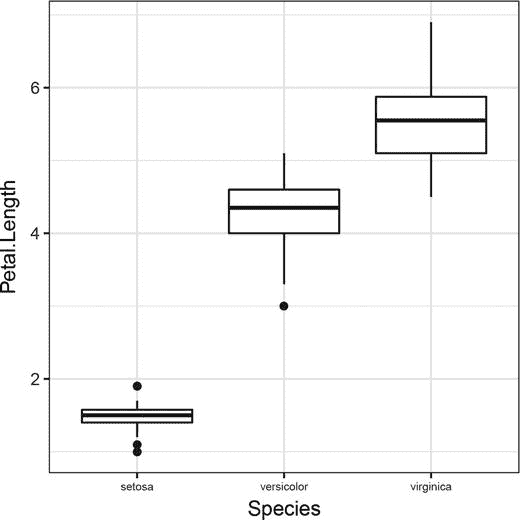

# 三、数据操作

数据科学不仅是让模型适合数据，也是操纵数据。数据很少以我们可以直接输入统计模型或机器学习算法的形式出现，我们希望用这些模型或算法来分析它们。数据分析的第一个阶段几乎总是弄清楚如何将数据加载到 R 中，然后弄清楚如何将数据转换成便于分析的形状。本章中的代码，以及后面的所有代码，都假设已经加载了包 magrittr 和 ggplot2(只是为了避免在每个例子中显式地这样做)。

## 数据已经在 R 中

有些数据集已经内置在 R 中，或者可以在 R 包中获得。这些对学习如何使用新方法很有用。如果你已经知道一个数据集以及它能告诉你什么，那么评估一个新方法的表现就更容易了。它对于您实现的基准测试方法也很有用。在分析新数据时，它们当然没那么有用。

与 R 一起分发的是包数据集。您可以使用 library()函数将包加载到 R 中，并获得其中的数据集列表，以及每个数据集的简短描述，如下所示:

```r
**library**(datasets)
**library**(help = "datasets")
```

要将实际的数据集加载到 R 的内存中，请使用 data()函数。数据集都相对较小，因此它们非常适合快速测试您正在处理的代码。例如，为了试验绘制 x-y 图(见图 [3-1](#Fig1) ，您可以使用只包含两列的 cars 数据集——速度和制动距离:


###### 图 3-1。汽车数据集的绘图

```r
**data**(cars)
**head**(cars)
##   speed dist
## 1     4    2
## 2     4   10
## 3     7    4
## 4     7   22
## 5     8   16
## 6     9   10
cars %>% **qplot**(speed, dist, data = .)
```

现在不要担心绘图功能；我们将在下一章回到绘图。

如果您正在开发新的分析或绘制代码，通常这些数据集中的一个对测试它是有用的。

另一个包含几个有用数据集的包是 mlbench。它包含机器学习基准的数据集，因此这些数据集旨在测试新方法在已知数据集上的表现。这个包不是和 R 一起发布的，但是你可以安装它，加载它，并得到一个数据集列表，如下所示:

```r
**install.packages**("mlbench")
**library**(mlbench)
**library**(help = "mlbench")
```

在本书中，当给出数据分析的例子时，我使用了这两个包之一中的数据。

这些包对于我举例来说很方便，如果你正在为 R 开发新的功能，它们适合于测试，但是如果你对数据分析感兴趣，想必你对你自己的数据感兴趣，当然它们是没有用的。你需要知道如何把你自己的数据放入 r 中，我们很快就会谈到这个，但是首先我想说几句关于你如何检查一个数据集并得到一个快速概览。

## 快速查看数据

我已经使用了函数 head()，它显示了一个数据帧的前 *n* 行，其中 *n* 是一个选项，默认为 6。你可以用另一个 *n* 或多或少得到这个:

```r
cars %>% **head**(3)
##   speed dist
## 1     4    2
## 2     4   10
## 3     7    4
```

类似的函数 tail()给出了最后的 *n* 行:

```r
cars %>% **tail**(3)
##    speed dist
## 48    24   93
## 49    24  120
## 50    25   85
```

要获取数据框中所有列的汇总统计数据，可以使用 summary()函数:

```r
cars %>% summary
##      speed           dist
##  Min.   : 4.0   Min.   :  2.00
##  1st Qu.:12.0   1st Qu.: 26.00
##  Median :15.0   Median : 36.00
##  Mean   :15.4   Mean   : 42.98
##  3rd Qu.:19.0   3rd Qu.: 56.00
##  Max.   :25.0   Max.   :120.00
```

对于 cars 数据集来说，这并不令人兴奋，所以让我们在另一个内置数据集上看看它:

```r
**data**(iris)
iris %>% summary
##   Sepal.Length    Sepal.Width     Petal.Length
##  Min.   :4.300   Min.   :2.000   Min.   :1.000
##  1st Qu.:5.100   1st Qu.:2.800   1st Qu.:1.600
##  Median :5.800   Median :3.000   Median :4.350
##  Mean   :5.843   Mean   :3.057   Mean   :3.758
##  3rd Qu.:6.400   3rd Qu.:3.300   3rd Qu.:5.100
##  Max.   :7.900   Max.   :4.400   Max.   :6.900
##   Petal.Width          Species
##  Min.   :0.100   setosa    :50
##  1st Qu.:0.300   versicolor:50
##  Median :1.300   virginica :50
##  Mean   :1.199
##  3rd Qu.:1.800
##  Max.   :2.500
```

您得到的摘要取决于列的类型。数字数据按其四分位数进行汇总，同时按类别进行汇总，布尔数据按每个类别的计数或真/假值进行汇总。在 iris 数据集中有一列“物种”,它是分类的，其摘要是每个级别的计数。

要查看每一列的类型，可以使用 str()函数。这为您提供了数据类型的结构，比您在这里需要的更加通用，但它确实为您提供了数据框中列类型的概述，对此非常有用。

## 阅读日期

有几个软件包可以读取不同文件格式的数据，从 Excel 到 JSON 到 XML 等等。如果你有特定格式的数据，试着谷歌一下如何把它读入 r。如果是标准的数据格式，很可能有一个软件包可以帮助你。

不过，通常情况下，数据可以在某种文本表格中获得。大多数工具都可以导入和导出它们。r 有很多读取这类数据的内置函数。使用这个获得它们的列表:

```r
?read.table
```

这些函数都是 read.table()函数的变体，只是使用了不同的默认选项。例如，read.table()假设数据以空格分隔的列给出，而 read.csv()函数假设数据以逗号分隔的值表示，因此这两个函数之间的区别在于它们认为分隔数据列的方式不同。

read.table()函数有很多参数。这些用于调整它以适应你正在阅读的文本文件的具体细节。(其他函数采用相同的参数，只是缺省值不同。)我发现我用得最多的选项是:

*   header-这是一个布尔值，它告诉函数是否应该将输入文件中的第一行视为标题行。如果设置为 true，它使用第一行来设置它构建的数据框的列名；如果设置为 false，则第一行被解释为数据框中的第一行。

*   col.names 如果第一行不用于指定标题，则可以使用此选项来命名列。您需要给它一个字符串向量，输入中的每一列都有一个字符串。

*   dec—这是数字中使用的小数点。我得到了两者都用的电子表格。对于小数点来说，这是一个重要的参数。它对你有多重要可能取决于你和多少国家的人合作。

*   comment . char—默认情况下，该函数假定#是注释的开始，并在看到它时忽略一行的其余部分。如果您的数据中实际使用了#号，您需要对此进行更改。如果注释用不同的符号表示，情况也是如此。

*   stringsAsFactors—默认情况下，该函数将假定包含字符串的列应该真正被解释为因子。不用说，这并不总是正确的。有时候一串就是一串。您可以将此参数设置为 FALSE，使函数将字符串解释为字符串。不过，这是一个要么全有要么全无的选择。如果为真，*所有带字符串的*列都将被解释为因子，如果为假，*所有的*列都不会被解释为因子。

*   col classes—允许您指定每列应该具有的类型，因此您可以在这里指定某些列应该是因子，而其他列应该是字符串。但是，您必须指定所有的列，这很麻烦而且有点烦人，因为 R 通常很擅长确定列的正确类型。无论如何，这个选择只能带你走这么远。你可以告诉它一个列应该是一个有序的因子，但不能告诉它级别应该是什么。我主要使用它来指定哪些列应该是因子，哪些应该是字符串，但是使用它也将加速大型数据集的函数，因为 R 不必自己确定列类型。

对于数据表格的读取，read.table()和朋友们通常会为您提供正确的选项。如果您在读取数据时遇到问题，请仔细查看文档，看看是否无法调整函数来加载数据。这并不总是可能的，但通常是可能的。如果不是这样，我通常会放弃，用另一种语言编写一个脚本，将数据格式化成一种我可以加载到 R 中的形式。对于原始文本处理，R 并不是真正合适的工具，我不会将分析中的所有步骤都强加到 R 中，我会务实地选择用于该任务的最佳工具，而 R 并不总是它。但是在采取激烈的措施并使用另一种语言编程之前，您应该仔细检查是否无法首先调整 read.table()函数之一。

## 读取和格式化数据集的示例

与其抽象地讨论数据的导入，不如让我们来看几个如何读入和格式化数据的例子。

### 乳腺癌数据集

作为从文本文件读取数据的第一个例子，我们考虑来自 mlbench 的乳腺癌数据集。这样我们就有了可以比较的结果。该数据集中的前几行是:

```r
**library**(mlbench)
**data**(BreastCancer)
BreastCancer %>% **head**(3)
##        Id Cl.thickness Cell.size Cell.shape
## 1 1000025            5         1          1
## 2 1002945            5         4          4
## 3 1015425            3         1          1
##   Marg.adhesion Epith.c.size Bare.nuclei
## 1             1            2           1
## 2             5            7          10
## 3             1            2           2
##   Bl.cromatin Normal.nucleoli Mitoses  Class
## 1           3               1       1 benign
## 2           3               2       1 benign
## 3           3               1       1 benign
```

数据可以在[https://archive . ics . UCI . edu/ml/datasets/Breast+Cancer+Wisconsin+(原文](https://archive.ics.uci.edu/ml/datasets/Breast+Cancer+Wisconsin+(Original))找到，这里也有数据的描述。我已经对 http://tinyurl.com/kw4xtts[的实际数据文件做了这个修改。虽然 R 可以从 URL 中读取数据，但它无法处理 tinyURL 背后的魔力，并且真实的 URL 太长，不适合本书的页面，所以我将它保存在一个变量 data_url 中，我将使用它。要自己运行代码，只需使用 tinyURL。它会把你带到真正的 URL，然后你可以把它复制到你的代码中。](http://tinyurl.com/kw4xtts)

要下载数据，您可以转到 URL 并保存文件。在 R 代码之外显式下载数据有利也有弊。它非常简单，您可以在开始解析数据之前查看数据，但另一方面，它在分析工作流程中为您提供了一个不可自动重现的步骤。即使 URL 在文档中有所描述，并且使用了一个不会随时间而改变的链接，它*也是*工作流中的一个手动步骤。也是人们可能犯错的一步。

相反，我将直接从 URL 读取数据。当然，这也是工作流中有风险的一步，因为我无法控制数据所在的服务器，并且我不能保证数据会一直在那里并且不会随着时间的推移而改变。不管怎样，这都有点冒险。我通常会将下载数据的代码添加到我的工作流中，但是我也会将数据存储在一个文件中。如果我将下载数据并保存到本地磁盘的代码放在一个缓存的 Markdown 块中，它将只在我需要的时候运行。

我可以读取数据，并使用 readLines()函数将它作为线的向量。我总是可以用它来扫描前一两行，看看文件是什么样子的。

```r
lines <- **readLines**(data_url)
lines[1:5]
## [1] "1000025,5,1,1,1,2,1,3,1,1,2"
## [2] "1002945,5,4,4,5,7,10,3,2,1,2"
## [3] "1015425,3,1,1,1,2,2,3,1,1,2"
## [4] "1016277,6,8,8,1,3,4,3,7,1,2"
## [5] "1017023,4,1,1,3,2,1,3,1,1,2"
```

对于这些数据，它似乎是一个没有标题行的逗号分隔值文件。所以我用。csv 后缀。R 中没有一个写或读数据的函数关心后缀，但是这样我更容易记住文件包含的内容。

```r
**writeLines**(lines, con = "data/raw-breast-cancer.csv")
```

为了使该功能成功，我首先需要创建一个数据/目录。我建议你总是为你的所有项目建立一个数据/目录，因为当你在做一个项目时，你希望你的目录和文件是结构化的。

我刚刚写入磁盘的文件可以使用 read.csv()函数读入。

```r
raw_breast_cancer <- **read.csv**("data/raw-breast-cancer.csv")
raw_breast_cancer %>% **head**(3)
##   X1000025 X5 X1 X1.1 X1.2 X2 X1.3 X3 X1.4 X1.5
## 1  1002945  5  4    4    5  7   10  3    2    1
## 2  1015425  3  1    1    1  2    2  3    1    1
## 3  1016277  6  8    8    1  3    4  3    7    1
##   X2.1
## 1    2
## 2    2
## 3    2
```

当然，我不会把这些步骤完全写在工作流程中。一旦我发现 URL 末尾的数据是一个. csv 文件，我会直接从 URL 中读取它。

```r
raw_breast_cancer <- **read.csv**(data_url)
raw_breast_cancer %>% **head**(3)
##   X1000025 X5 X1 X1.1 X1.2 X2 X1.3 X3 X1.4 X1.5
## 1  1002945  5  4    4    5  7   10  3    2    1
## 2  1015425  3  1    1    1  2    2  3    1    1
## 3  1016277  6  8    8    1  3    4  3    7    1
##   X2.1
## 1    2
## 2    2
## 3    2
```

好消息是这个数据看起来和乳腺癌数据相似。坏消息是，乳腺癌中的第一行似乎已经变成了 raw_breast_cancer 中的列名。read.csv()函数将第一行解释为标题。我们可以使用 header 参数来解决这个问题。

```r
raw_breast_cancer <- **read.csv**(data_url, header = FALSE)
raw_breast_cancer %>% **head**(3)
##        V1 V2 V3 V4 V5 V6 V7 V8 V9 V10 V11
## 1 1000025  5  1  1  1  2  1  3  1   1   2
## 2 1002945  5  4  4  5  7 10  3  2   1   2
## 3 1015425  3  1  1  1  2  2  3  1   1   2
```

现在第一行不再被解释为标题名。这很好，但是您实际得到的名称并不能提供列包含的信息。

如果您阅读网站上的数据描述，您可以看到每一列是什么，并选择适当的名称。我将在这里作弊，只从乳腺癌数据集中取名字。

我可以像这样显式地设置名称:

```r
**names**(raw_breast_cancer) <- **names**(BreastCancer)
raw_breast_cancer %>% **head**(3)
##        Id Cl.thickness Cell.size Cell.shape
## 1 1000025            5         1          1
## 2 1002945            5         4          4
## 3 1015425            3         1          1
##   Marg.adhesion Epith.c.size Bare.nuclei
## 1             1            2           1
## 2             5            7          10
## 3             1            2           2
##   Bl.cromatin Normal.nucleoli Mitoses Class
## 1           3               1       1     2
## 2           3               2       1     2
## 3           3               1       1     2
```

或者我可以在加载数据的地方设置它们:

```r
raw_breast_cancer <- **read.csv**(data_url, header = FALSE,
                              col.names = **names**(BreastCancer))
raw_breast_cancer %>% **head**(3)
##        Id Cl.thickness Cell.size Cell.shape
## 1 1000025            5         1          1
## 2 1002945            5         4          4
## 3 1015425            3         1          1
##   Marg.adhesion Epith.c.size Bare.nuclei
## 1             1            2           1
## 2             5            7          10
## 3             1            2           2
##   Bl.cromatin Normal.nucleoli Mitoses Class
## 1           3               1       1     2
## 2           3               2       1     2
## 3           3               1       1     2
```

好吧，我们有进展了。班级列不对。它将类别编码为数字(web 页面文档指定 2 代表良性，4 代表恶性)，但在 R 中，它更适合包含一个因子。

您可以先将数字转换成字符串，然后将字符串转换成因子，从而将数字转换成因子。我不喜欢修改原始数据——即使我把它保存在一个文件中——所以我打算先复制它，然后再进行修改。

```r
formatted_breast_cancer <- raw_breast_cancer
```

使用 ifelse()很容易将数字映射到字符串:

```r
map_class <- function(x) {
    **ifelse**(x == 2, "bening",
    **ifelse**(x == 4, "malignant",
           NA))
}
mapped <- formatted_breast_cancer$Class %>% map_class
mapped %>% table
## .
##    bening malignant
##       458       241
```

我*可以让*变得更简单吗:

```r
map_class <- function(x) {
    **ifelse**(x == 2, "bening", "malignant")
}
mapped <- formatted_breast_cancer$Class %>% map_class
mapped %>% table
## .
##    bening malignant
##       458       241
```

因为 2 和 4 是数据中仅有的数字:

```r
formatted_breast_cancer$Class %>% unique
## [1] 2 4
```

但是假设没有意外的值总是有点冒险，所以我总是更喜欢将“奇怪的值”设置为 NA，作为我显式处理的东西。

嵌套的 ifelse()很容易编程，但是如果有许多不同的可能值，它也会变得有些麻烦。另一种选择是使用表格来映射值。为了避免混淆您将要实现的表和函数 table()，函数 table()计算一个给定值在向量中出现的次数，我将把这个表称为您创建的字典。一个*字典*是一个你可以查找单词的表格，这就是你正在实现的。

为此，您可以在 vector 中使用命名值。记住，你可以用数字*和名字*来索引一个向量。

您可以创建一个向量，其中使用名称作为索引。使用要映射的关键字作为索引，使用要映射的名称作为结果作为值。我们想从数字映射到字符串，这就产生了一个小问题。如果我们用数字索引一个向量，R 会认为我们想得到向量中的位置。如果我们让向量 v key 2，“良性”？当我们使用一个向量作为表时，我们需要用字符串作为键。这也意味着我们要映射的向量中的数字应该在我们在字典中查找之前被转换成字符串。代码如下所示:

```r
dict <- **c**("2" = "benign", "4" = "malignant")
map_class <- function(x) dict[**as.character**(x)]

mapped <- formatted_breast_cancer$Class %>% map_class
mapped %>% table
## .
##    benign malignant
##       458       241
```

这很好，但是如果我们看实际的向量，而不是总结它，我们会发现它看起来有点奇怪。

```r
mapped[1:5]
##        2        2        2        2        2
## "benign" "benign" "benign" "benign" "benign"
```

这是因为当我们以这种方式通过映射创建向量时，我们保留了值的名称。请记住，我们制作的将键映射到值的字典将键作为名称；这些名称被传递给结果向量。我们可以使用 unname()函数来消除它们。

```r
mapped %<>% unname
mapped[1:5]
## [1] "benign" "benign" "benign" "benign" "benign"
```

现在我们只需要把这个字符串向量转换成一个因子，我们就有了我们的类列。

乳腺癌数据集实际上将 Id 列表示为字符串，将所有其他列表示为分类列(有些是有序的，有些不是)，但我不打算为此费心。如果你想这样转换数据，你知道怎么做。

数据的整个读取和格式化可以这样完成:

```r
**read.csv**(data_url, header = FALSE,
         col.names = **names**(BreastCancer)) ->
  raw_breast_cancer ->
  formatted_breast_cancer

dict <- **c**("2" = "benign", "4" = "malignant")
map_class <- function(x) dict[**as.character**(x)]
formatted_breast_cancer$Class <-
  formatted_breast_cancer$Class %>%
  map_class %>%
  unname %>%
  **factor**(levels = **c**("benign", "malignant"))
```

在 factor()调用中指定级别并不是绝对必要的，但是我更喜欢总是显式地这样做。如果 factor()的输入中有一个意外的字符串，那么它将成为其中一个级别，而我要到很久以后才能知道它。明确指定级别可以缓解这个问题。

如果您不喜欢仅仅为了映射类表示而编写和命名一个函数——为什么您要用一个 map_class()函数来污染您的名称空间呢？几个星期后，您就不记得是什么了。—您可以使用 lambda 表达式:

```r
raw_breast_cancer$Class %>%
  { dict <- **c**("2" = "benign", "4" = "malignant")
    dict[**as.character**(.)]
  } %>%
  unname %>%
  **factor**(levels = **c**("benign", "malignant")) %>%
  table
## .
##    benign malignant
##       458       241
```

现在，您不想一直花时间解析输入数据文件，所以我建议将您编写的所有代码放入数据中，并在 R 标记文档的缓存代码块中将其转换成您想要的形式。这样，您将只在更改代码时评估代码。

还可以使用 save()函数显式保存数据。

```r
formatted_breast_cancer %>%
    **save**(file = "data/formatted-breast-cancer.rda")
```

这里我用后缀。数据的 rda。它代表 R 数据，你的计算机可能会识别它。如果你点击一个带有那个后缀的文件，它将会在 RStudio(或者任何你用来处理 R 的工具)中打开。用于保存和加载数据的实际 R 函数并不关心您使用什么后缀，但是如果您坚持使用固定的后缀，就更容易识别文件是什么。

数据与数据框的名称一起保存，因此当您使用 load()函数再次加载数据时，不必将加载的数据赋给变量。它将加载到您保存数据时使用的名称中。

```r
**load**("data/formatted-breast-cancer.rda")
```

这有好有坏。我可能更喜欢控制数据被赋给哪个名称，这样我就可以显式地控制代码中的变量，但是 save()和 load()被设计为保存多个变量，所以这就是它们的工作方式。

我个人不怎么使用这些功能。我更喜欢在 Markdown 文档中编写我的分析流水线，这样更容易缓存导入代码。

### 波士顿住房数据集

对于加载数据的第二个示例，我们从 mlbench 包中取出另一个数据集。BostonHousing 的数据包含了关于犯罪率的信息和一些我们可以用来预测犯罪率的解释变量。

```r
**library**(mlbench)
**data**(BostonHousing)
**str**(BostonHousing)
## 'data.frame':    506 obs. of  14 variables:
##  $ crim   : num  0.00632 0.02731 0.02729 0.03237..
##  $ zn     : num  18 0 0 0 0 0 12.5 12.5 ...
##  $ indus  : num  2.31 7.07 7.07 2.18 2.18 2.18 7..
##  $ chas   : Factor w/ 2 levels "0","1": 1 1 1 1 ..
##  $ nox    : num  0.538 0.469 0.469 0.458 0.458 0..
##  $ rm     : num  6.58 6.42 7.18 7 ...
##  $ age    : num  65.2 78.9 61.1 45.8 54.2 58.7 6..
##  $ dis    : num  4.09 4.97 4.97 6.06 ...
##  $ rad    : num  1 2 2 3 3 3 5 5 ...
##  $ tax    : num  296 242 242 222 222 222 311 311..
##  $ ptratio: num  15.3 17.8 17.8 18.7 18.7 18.7 1..
##  $ b      : num  397 397 393 395 ...
##  $ lstat  : num  4.98 9.14 4.03 2.94 ...
##  $ medv   : num  24 21.6 34.7 33.4 36.2 28.7 22...
```

和以前一样，到实际数据的链接很长，所以我给你一个简短的描述:[http://tinyurl.com/zq2u8vx](http://tinyurl.com/zq2u8vx)。我还将原始 URL 保存在变量 data_url 中。

我已经查看了 URL 末尾的文件，看到它由空格分隔的数据列组成，所以您需要加载它的函数是 read.table()。

```r
boston_housing <- **read.table**(data_url)
**str**(boston_housing)
## 'data.frame':    506 obs. of  14 variables:
##  $ V1 : num  0.00632 0.02731 0.02729 0.03237 ...
##  $ V2 : num  18 0 0 0 0 0 12.5 12.5 ...
##  $ V3 : num  2.31 7.07 7.07 2.18 2.18 2.18 7.87 ..
##  $ V4 : int  0 0 0 0 0 0 0 0 ...
##  $ V5 : num  0.538 0.469 0.469 0.458 0.458 0.458..
##  $ V6 : num  6.58 6.42 7.18 7 ...
##  $ V7 : num  65.2 78.9 61.1 45.8 54.2 58.7 66.6 ..
##  $ V8 : num  4.09 4.97 4.97 6.06 ...
##  $ V9 : int  1 2 2 3 3 3 5 5 ...
##  $ V10: num  296 242 242 222 222 222 311 311 ...
##  $ V11: num  15.3 17.8 17.8 18.7 18.7 18.7 15.2 ..
##  $ V12: num  397 397 393 395 ...
##  $ V13: num  4.98 9.14 4.03 2.94 ...
##  $ V14: num  24 21.6 34.7 33.4 36.2 28.7 22.9 27..
```

如果我们将已加载的数据与来自 mlbench 的数据进行比较，我们会看到导入的数据中有整数和数字数据，但它应该是 chas 变量的一个因子，而对于所有其他变量则是数字。我们可以使用 read.table()的 colClasses 参数来解决这个问题。我们只需要为类创建一个字符串向量；除了“chas”列应为“factor”之外，所有列都为“numeric”的向量。

```r
col_classes <- **rep**("numeric", **length**(BostonHousing))
col_classes[**which**("chas" == **names**(BostonHousing))] <- "factor"
```

我们还应该命名这些列，但是我们也可以作弊，从 BostonHousing 获取名称:

```r
boston_housing <- **read.table**(data_url,
                             col.names = **names**(BostonHousing),
                             colClasses = col_classes)
**str**(boston_housing)
## 'data.frame':    506 obs. of  14 variables:
##  $ crim   : num  0.00632 0.02731 0.02729 0.03237..
##  $ zn     : num  18 0 0 0 0 0 12.5 12.5 ...
##  $ indus  : num  2.31 7.07 7.07 2.18 2.18 2.18 7..
##  $ chas   : Factor w/ 2 levels "0","1": 1 1 1 1 ..
##  $ nox    : num  0.538 0.469 0.469 0.458 0.458 0..
##  $ rm     : num  6.58 6.42 7.18 7 ...
##  $ age    : num  65.2 78.9 61.1 45.8 54.2 58.7 6..
##  $ dis    : num  4.09 4.97 4.97 6.06 ...
##  $ rad    : num  1 2 2 3 3 3 5 5 ...
##  $ tax    : num  296 242 242 222 222 222 311 311..
##  $ ptratio: num  15.3 17.8 17.8 18.7 18.7 18.7 1..
##  $ b      : num  397 397 393 395 ...
##  $ lstat  : num  4.98 9.14 4.03 2.94 ...
##  $ medv   : num  24 21.6 34.7 33.4 36.2 28.7 22...
```

“chas”因子中的级别为 0 和 1。这不是真正的好水平，因为它们很容易与数字混淆——它们会像数字一样打印出来——但它们不是。因子中的数值实际上是 1 代表“0 ”, 2 代表“1 ”,因此可能会引起混淆。但它与 mlbench 数据框的级别相同，因此我也将保持原样。

### readr 包

read.table()类函数通常会带您到达导入数据的目的地。我在几乎所有的工作中都会用到这些。但是有一个旨在导入数据的包，它试图加快导入速度，并在数据导入方式上更加一致，所以我想我应该提到它。

那个包裹是 readr。

```r
**library**(readr)
```

它实现了与内置函数相同的导入函数类。它只是在函数名中使用下划线而不是点。所以在你使用 read.table()的地方，readr 包给你 read_table()。同样，它给你 read_csv()作为 read.csv()的替代。

对于如何读取数据，readr 包有不同的默认设置。例如，默认情况下，它不会将字符串列视为因子。除此之外，它出名的主要原因是它比内置的 R 函数更快。如果您将数据导入代码放在缓存的代码块中，这应该不会让您太担心。在任何情况下，如果加载数据是一个问题，你需要阅读第 [5](05.html) 章。

无论如何，因为包的存在，因为它是受欢迎的，我想我应该提到它。

让我们看看如何使用包中的函数导入数据。我们回到之前导入的乳腺癌数据。我们下载了乳腺癌数据，并将其放在一个名为 data/raw-breast-cancer.csv 的文件中，因此我们可以尝试从该文件中读取它。显然，由于它是一个 CSV 文件，我们将使用 read_csv()函数。

```r
raw_breast_cancer <- **read_csv**("data/raw-breast-cancer.csv")
## Warning: Duplicated column names deduplicated: '1'
## => '1_1' [4], '1' => '1_2' [5], '1' => '1_3' [7],
## '1' => '1_4' [9], '1' => '1_5' [10], '2' =>
## '2_1' [11]
## Parsed with column specification:
## cols(
##   `1000025` = col_integer(),
##   `5` = col_integer(),
##   `1` = col_integer(),
##   `1_1` = col_integer(),
##   `1_2` = col_integer(),
##   `2` = col_integer(),
##   `1_3` = col_character(),
##   `3` = col_integer(),
##   `1_4` = col_integer(),
##   `1_5` = col_integer(),
##   `2_1` = col_integer()
## )
raw_breast_cancer %>% **head**(3)
## # A tibble: 3 × 11
##   `1000025`   `5`   `1` `1_1` `1_2`   `2` `1_3`
##       <int> <int> <int> <int> <int> <int> <chr>
## 1   1002945     5     4     4     5     7    10
## 2   1015425     3     1     1     1     2     2
## 3   1016277     6     8     8     1     3     4
## # ... with 4 more variables: `3` <int>,
## #   `1_4` <int>, `1_5` <int>, `2_1` <int>
```

该函数的工作方式类似于 read.csv()函数，并将第一个函数解释为列名。我们不希望这样，但是这个函数没有告诉它第一行不是列名的选项。相反，我们可以通知它列名是什么，然后它会将第一行作为实际数据读取。

```r
raw_breast_cancer <- **read_csv**("data/raw-breast-cancer.csv",
                              col_names = **names**(BreastCancer))
## Parsed with column specification:
## cols(
##   Id = col_integer(),
##   Cl.thickness = col_integer(),
##   Cell.size = col_integer(),
##   Cell.shape = col_integer(),
##   Marg.adhesion = col_integer(),
##   Epith.c.size = col_integer(),
##   Bare.nuclei = col_character(),
##   Bl.cromatin = col_integer(),
##   Normal.nucleoli = col_integer(),
##   Mitoses = col_integer(),
##   Class = col_integer()
## )
raw_breast_cancer %>% **head**(3)
## # A tibble: 3 × 11
##        Id Cl.thickness Cell.size Cell.shape
##     <int>        <int>     <int>      <int>
## 1 1000025            5         1          1
## 2 1002945            5         4          4
## 3 1015425            3         1          1
## # ... with 7 more variables: Marg.adhesion <int>,
## #   Epith.c.size <int>, Bare.nuclei <chr>,
## #   Bl.cromatin <int>, Normal.nucleoli <int>,
## #   Mitoses <int>, Class <int>
```

它与我们已经看到的函数类似地导入数据，但是打印结果略有不同。这只是因为它表示的数据帧略有不同。数据框有不同的表示方式，我们很快会读到更多，readr 包以不同的格式加载数据。这就是为什么它打印不同。您与此制图表达的交互方式与任何其他数据框的交互方式相同，因此这种用法并不重要。

使用哪个函数导入数据并不重要。您可以使用内置函数或 readr 函数。由你来决定。

## 使用 dplyr 操作数据

数据框非常适合于表示数据，其中每一行都是您希望在模型中拟合的不同参数的观测值。几乎所有在 R 中实现统计模型或机器学习算法的包都处理数据帧。但是要实际操作一个数据框，往往要写很多代码来过滤数据，重新排列数据，用各种方式汇总。几年前，操作数据框比实际分析数据需要更多的编程。dplyr 包极大地改善了这一点(读作“d 钳子”，其中“钳子”读作工具，“钳子”)。

该包提供了许多方便的函数，允许您以各种方式修改数据框，并使用%>%运算符将它们在流水线中串在一起。据我所知，这个操作符最初是在这个包中使用的，如果你只导入 dplyr 你也会得到这个操作符。然而，magritt 实现了几个扩展，所以我建议你也总是导入 magritt。

如果导入 dplyr，您将获得允许您为数据框操作构建流水线的函数。

### 一些有用的 dplyr 函数

在这一章中，我无法介绍 dplyr 的所有功能。无论如何，它已经更新得足够频繁了，当你读到这篇文章的时候，可能会有比我写这一章的时候更多的功能。因此，请务必查看软件包的文档以获取更新。

这一部分描述了我经常使用的功能。它们都将数据帧或等效数据帧作为第一个参数，因此可以很好地与流水线配合使用。当我说“数据框等价”时，我的意思是他们把任何像数据框一样工作的东西作为一个参数。通常情况下，数据帧的表示比内置数据结构更好。对于大型数据集，使用不同于内置数据框的表示法通常更好；我们将在第五章回到这个话题。一些替代的数据结构更好，因为它们可以处理磁盘上的数据。r 的数据帧必须被加载到内存中，而其他的数据帧只是在内存上做一些操作要快一些。或者他们只是打印得更好。如果您将数据帧的名称写入 R 终端，它将打印全部数据。其他的表示会自动给你数据的头。

dplyr 包有几种表示形式。我经常使用的是 tbl_df 表示法。我使用它只是因为我更喜欢打印此类表格时的输出。

```r
iris %>% tbl_df
## # A tibble: 150 × 5
##    Sepal.Length Sepal.Width Petal.Length
##           <dbl>       <dbl>        <dbl>
## 1           5.1         3.5          1.4
## 2           4.9         3.0          1.4
## 3           4.7         3.2          1.3
## 4           4.6         3.1          1.5
## 5           5.0         3.6          1.4
## 6           5.4         3.9          1.7
## 7           4.6         3.4          1.4
## 8           5.0         3.4          1.5
## 9           4.4         2.9          1.4
## 10          4.9         3.1          1.5
## # ... with 140 more rows, and 2 more variables:
## #   Petal.Width <dbl>, Species <fctr>
```

它只打印前十行，不打印所有列。与获取整个数据框相比，输出更容易阅读。

现在来看看 dplyr 函数。

#### select():选取选定的列并去掉其余的列

select()函数选择数据框的列。它相当于索引数据中的列。

您可以使用它来挑选单个列:

```r
iris %>% tbl_df %>% **select**(Petal.Width) %>% **head**(3)
## # A tibble: 3 × 1
##   Petal.Width
##         <dbl>
## 1         0.2
## 2         0.2
## 3         0.2
```

或者选择几列:

```r
iris %>% tbl_df %>%
  **select**(Sepal.Width, Petal.Length) %>% **head**(3)
## # A tibble: 3 × 2
##   Sepal.Width Petal.Length
##         <dbl>        <dbl>
## 1         3.5          1.4
## 2         3.0          1.4
## 3         3.2          1.3
```

你甚至可以给它列的范围:

```r
iris %>% tbl_df %>%
  **select**(Sepal.Length:Petal.Length) %>% **head**(3)
## # A tibble: 3 × 3
##   Sepal.Length Sepal.Width Petal.Length
##          <dbl>       <dbl>        <dbl>
## 1          5.1         3.5          1.4
## 2          4.9         3.0          1.4
## 3          4.7         3.2          1.3
```

这是如何工作的取决于数据框中列的顺序，我觉得这并不是很有用。

真正有用的是对列名的模式匹配。根据列名选择列有不同的方法:

```r
iris %>% tbl_df %>%
  **select**(**starts_with**("Petal")) %>% **head**(3)
## # A tibble: 3 × 2
##   Petal.Length Petal.Width
##          <dbl>       <dbl>
## 1          1.4         0.2
## 2          1.4         0.2
## 3          1.3         0.2
iris %>% tbl_df %>%
  **select**(**ends_with**("Width")) %>% **head**(3)
## # A tibble: 3 × 2
##   Sepal.Width Petal.Width
##         <dbl>       <dbl>
## 1         3.5         0.2
## 2         3.0         0.2
## 3         3.2         0.2
iris %>% tbl_df %>%
  **select**(**contains**("etal")) %>% **head**(3)
## # A tibble: 3 × 2
##   Petal.Length Petal.Width
##          <dbl>       <dbl>
## 1          1.4         0.2
## 2          1.4         0.2
## 3          1.3         0.2
iris %>% tbl_df %>%
  **select**(**matches**(".t.")) %>% **head**(3)
## # A tibble: 3 × 4
##   Sepal.Length Sepal.Width Petal.Length
##          <dbl>       <dbl>        <dbl>
## 1          5.1         3.5          1.4
## 2          4.9         3.0          1.4
## 3          4.7         3.2          1.3
## # ... with 1 more variables: Petal.Width <dbl>
```

matches 函数搜索正则表达式，在本例中，它将选择任何包含 t 的名称，除非它是第一个或最后一个字母。

查看 dplyr 的文档，看看有哪些选择列的选项。

还可以使用 select()删除列。前面的示例选择了要包含的列，但是如果在选择条件前使用-号，将会排除而不是包含指定的列。

```r
iris %>% tbl_df %>%
  **select**(-**starts_with**("Petal")) %>% **head**(3)
## # A tibble: 3 × 3
##   Sepal.Length Sepal.Width Species
##          <dbl>       <dbl>  <fctr>
## 1          5.1         3.5  setosa
## 2          4.9         3.0  setosa
## 3          4.7         3.2  setosa
```

#### mutate():将计算值添加到数据框中

mutate()函数允许您通过指定如何计算列的表达式来向数据框中添加列:

```r
iris %>% tbl_df %>%
  **mutate**(Petal.Width.plus.Length = Petal.Width + Petal.Length) %>%
  **select**(Species, Petal.Width.plus.Length) %>%
  **head**(3)
## # A tibble: 3 × 2
##   Species Petal.Width.plus.Length
##    <fctr>                   <dbl>
## 1  setosa                     1.6
## 2  setosa                     1.6
## 3  setosa                     1.5
```

通过在 mutate()函数中指定列，可以添加多个列:

```r
iris %>% tbl_df %>%
  **mutate**(Petal.Width.plus.Length = Petal.Width + Petal.Length,
         Sepal.Width.plus.Length = Sepal.Width + Sepal.Length) %>%
  **select**(Petal.Width.plus.Length, Sepal.Width.plus.Length) %>%
  **head**(3)
## # A tibble: 3 × 2
##   Petal.Width.plus.Length Sepal.Width.plus.Length
##                     <dbl>                   <dbl>
## 1                     1.6                     8.6
## 2                     1.6                     7.9
## 3                     1.5                     7.9
```

当然，您也可以在流水线中多次调用 mutate()。

#### Transmute():将计算值添加到数据框中，并删除所有其他列

除了与 select()结合使用之外，transmute()函数的工作方式与 mutate()函数类似，因此结果是一个只包含您创建的新列的数据框。

```r
iris %>% tbl_df %>%
  **transmute**(Petal.Width.plus.Length = Petal.Width + Petal.Length) %>%
  **head**(3)
## # A tibble: 3 × 1
##   Petal.Width.plus.Length
##                     <dbl>
## 1                     1.6
## 2                     1.6
## 3                     1.5
```

#### arrange():通过对列进行排序来重新排列数据框

arrange()函数只是通过根据您指定的内容对列进行排序来对数据框进行重新排序:

```r
iris %>% tbl_df %>%
  **arrange**(Sepal.Length) %>%
  **head**(3)
## # A tibble: 3 × 5
##   Sepal.Length Sepal.Width Petal.Length
##          <dbl>       <dbl>        <dbl>
## 1          4.3         3.0          1.1
## 2          4.4         2.9          1.4
## 3          4.4         3.0          1.3
## # ... with 2 more variables: Petal.Width <dbl>,
## #   Species <fctr>
```

默认情况下，它按升序对数值进行排序，但是您可以使用 desc()函数要求降序:

```r
iris %>% tbl_df %>%
  **arrange**(**desc**(Sepal.Length)) %>%
  **head**(3)
## # A tibble: 3 × 5
##   Sepal.Length Sepal.Width Petal.Length
##          <dbl>       <dbl>        <dbl>
## 1          7.9         3.8          6.4
## 2          7.7         3.8          6.7
## 3          7.7         2.6          6.9
## # ... with 2 more variables: Petal.Width <dbl>,
## #   Species <fctr>
```

#### filter():挑选选中的行，去掉其余的行

filter()函数允许您根据逻辑表达式挑选出行。您给这个函数一个谓词，指定一行应该满足什么条件才能被包含。

```r
iris %>% tbl_df %>%
  **filter**(Sepal.Length > 5) %>%
  **head**(3)
## # A tibble: 3 × 5
##   Sepal.Length Sepal.Width Petal.Length
##          <dbl>       <dbl>        <dbl>
## 1          5.1         3.5          1.4
## 2          5.4         3.9          1.7
## 3          5.4         3.7          1.5
## # ... with 2 more variables: Petal.Width <dbl>,
## #   Species <fctr>
```

在这里，您可以通过逻辑表达式尽情发挥创造力:

```r
iris %>% tbl_df %>%
  **filter**(Sepal.Length > 5 & Species == "virginica") %>%
  **select**(Species, Sepal.Length) %>%
  **head**(3)
## # A tibble: 3 × 2
##     Species Sepal.Length
##      <fctr>        <dbl>
## 1 virginica          6.3
## 2 virginica          5.8
## 3 virginica          7.1
```

#### group_by():根据列值将数据分割成子表

group_by()函数告诉 dplyr 您想要处理分成不同子集的数据。

就其本身而言，它并不那么有用。它只是告诉 dplyr，在未来的计算中，它应该将数据的不同子集视为独立的数据集。它与 summary()函数一起使用，用于计算汇总统计数据。

您可以按一个或多个变量分组；您只需将想要分组的列指定为函数的单独参数。按因子或离散数分组时效果最好；按实数分组没什么意思。

```r
iris %>% tbl_df %>% **group_by**(Species) %>% **head**(3)
## Source: local data frame [3 x 5]
## Groups: Species [1]
##
##   Sepal.Length Sepal.Width Petal.Length
##          <dbl>       <dbl>        <dbl>
## 1          5.1         3.5          1.4
## 2          4.9         3.0          1.4
## 3          4.7         3.2          1.3
## # ... with 2 more variables: Petal.Width <dbl>,
## #   Species <fctr>
```

这里没发生什么事情。您已经重新构建了数据框，这样就有了分组，但是在您对新数据进行处理之前，没有什么可看的。group_by()的强大之处在于它与 summarise()函数的结合。

#### Summary/Summary():计算汇总统计数据

这个函数的拼写取决于你在池塘的哪一边。不管你怎么拼写，它都是一样的功能。

summary()函数用于计算数据框的汇总统计数据。它让您通过表达您想要总结的内容来计算不同的统计数据。例如，您可以询问平均值:

```r
iris %>%
  **summarise**(Mean.Petal.Length = **mean**(Petal.Length),
              Mean.Sepal.Length = **mean**(Sepal.Length))
##   Mean.Petal.Length Mean.Sepal.Length
## 1             3.758          5.843333
```

它真正强大的地方在于与 group_by()的结合。在这里，您可以将数据分成不同的组，并计算每个组的摘要:

```r
iris %>%
  **group_by**(Species) %>%
  **summarise**(Mean.Petal.Length = **mean**(Petal.Length))
## # A tibble: 3 × 2
##      Species Mean.Petal.Length
##       <fctr>             <dbl>
## 1     setosa             1.462
## 2 versicolor             4.260
## 3  virginica             5.552
```

这里值得一提的一个汇总函数是 n()，它只计算数据子集中有多少个观察值:

```r
iris %>%
  **summarise**(Observations = **n**())
##   Observations
## 1          150
```

同样，当与 group_by()结合使用时，这更有趣:

```r
iris %>%
  **group_by**(Species) %>%
  **summarise**(Number.Of.Species = **n**())
## # A tibble: 3 × 2
##      Species Number.Of.Species
##       <fctr>             <int>
## 1     setosa                50
## 2 versicolor                50
## 3  virginica                50
```

您可以通过在 summary()函数中指定多个统计信息来组合汇总统计信息:

```r
iris %>%
  **group_by**(Species) %>%
  **summarise**(Number.Of.Samples = **n**(),
              Mean.Petal.Length = **mean**(Petal.Length))
## # A tibble: 3 × 3
##      Species Number.Of.Samples Mean.Petal.Length
##       <fctr>             <int>             <dbl>
## 1     setosa                50             1.462
## 2 versicolor                50             4.260
## 3  virginica                50             5.552
```

### 乳腺癌数据处理

为了更好地了解 dplyr 包如何帮助您探索数据，让我们来看看它的实际应用。

我们将回到乳腺癌的数据。我们从用于转换从 CVS 文件导入的原始数据(存储在变量 raw_breast_cancer 中)的修改开始。

当我们格式化这个数据集时，我们必须为类变量构造因子。我们通过使用 formatted_breast_cancer$Class 显式地为类变量赋值来实现这一点，但是我们也可以使用 dplyr 中的 mutate()函数作为数据框转换来直接实现这一点。

```r
formatted_breast_cancer <-
  raw_breast_cancer %>%
  **mutate**(Class = Class %>% {
      **c**("2" = "benign", "4" = "malignant")[**as.character**(.)]
    } %>%
    unname %>%
    **factor**(levels = **c**("benign", "malignant")) )
```

这里，我们不能在 mutate()函数中给 dict 变量赋值，所以我必须把字典构造放在下标之前。它并不漂亮，也没有那么好读。这是我可能会使用函数进行映射的情况之一。

```r
format_class <- . %>% {
  dict <- **c**("2" = "benign", "4" = "malignant")
  dict[**as.character**(.)]
} %>% unname %>% **factor**(levels = **c**("benign", "malignant"))

formatted_breast_cancer <-
  raw_breast_cancer %>% **mutate**(Class = **format_class**(Class))
```

现在这是否更具可读性，我不知道。如果您不习惯像这样以流水线的形式编写代码，这可能不太好，但是一旦您习惯了阅读流水线代码，这并不太坏。无论如何，这使得转换非常清晰，毫无疑问，我们正在通过对 raw_breast_cancer 数据框进行转换来创建格式化的 _breast_cancer 数据框。

现在让我们看一下实际数据。这是一个非常粗糙的数据分析，我们可以做探索性的目的。这不是一个恰当的分析，但我们将在第 6 章回到这个问题上。

我们可能对不同的参数如何影响响应变量，类变量感兴趣。例如，良性和恶性肿瘤的细胞厚度是否不同？为了验证这一点，我们可以根据晶胞参数对数据进行分组，并查看平均晶胞厚度。

```r
formatted_breast_cancer %>%
  **group_by**(Class) %>%
  **summarise**(mean.thickness = **mean**(Cl.thickness))
## # A tibble: 2 × 2
##       Class mean.thickness
##      <fctr>          <dbl>
## 1    benign       2.956332
## 2 malignant       7.195021
```

看起来是有区别的。现在，这种差异是否显著需要适当的测试——毕竟，我们只是在比较平均值，方差可能很大。但是仅仅通过探索这些数据，我们就得到一个提示，也许有一些东西可以利用。

我们可以对其他变量问同样的问题，比如细胞大小:

```r
formatted_breast_cancer %>%
  **group_by**(Class) %>%
  **summarise**(mean.size = **mean**(Cell.size))
## # A tibble: 2 × 2
##       Class mean.size
##      <fctr>     <dbl>
## 1    benign  1.325328
## 2 malignant  6.572614
```

另一种看待这个问题的方式是，对于每一个细胞大小，计算我们看到多少良性肿瘤和多少恶性肿瘤。在这里，我们需要按像元大小和类别进行分组，然后进行计数，我们可能希望按像元大小递增或递减的顺序排列数据以获取信息:

```r
formatted_breast_cancer %>%
  **arrange**(Cell.size) %>%
  **group_by**(Cell.size, Class) %>%
  **summarise**(ClassCount = **n**())
## Source: local data frame [18 x 3]
## Groups: Cell.size [?]
##
##    Cell.size     Class ClassCount
##        <int>    <fctr>      <int>
## 1          1    benign        380
## 2          1 malignant          4
## 3          2    benign         37
## 4          2 malignant          8
## 5          3    benign         27
## 6          3 malignant         25
## 7          4    benign          9
## 8          4 malignant         31
## 9          5 malignant         30
## 10         6    benign          2
## 11         6 malignant         25
## 12         7    benign          1
## 13         7 malignant         18
## 14         8    benign          1
## 15         8 malignant         28
## 16         9    benign          1
## 17         9 malignant          5
## 18        10 malignant         67
```

在这里，我们再次得到一些有用的信息。看起来当细胞尺寸小时，良性肿瘤比恶性肿瘤多，当细胞尺寸大时，恶性肿瘤多。同样，当我们以后想要构建统计模型时，我们可以从这一点开始工作。

这种分组之所以有效，是因为像元大小是以离散的数字来度量的。按浮点数分组不会有什么帮助。那里绘图更有用。但是对于这些数据，我们将像元大小设为整数，因此我们可以通过这种方式构建表格来研究这些数据。

我们还可以尝试查看组合参数。我们已经看到，细胞大小和细胞厚度似乎都与肿瘤的良性或恶性程度有关，所以让我们来看看细胞厚度作为类别和细胞大小的函数是如何表现的。

```r
formatted_breast_cancer %>%
  **group_by**(Class, **as.factor**(Cell.size)) %>%
  **summarise**(mean.thickness = **mean**(Cl.thickness))
## Source: local data frame [18 x 3]
## Groups: Class [?]
##
##        Class `as.factor(Cell.size)`
##       <fctr>                 <fctr>
## 1     benign                      1
## 2     benign                      2
## 3     benign                      3
## 4     benign                      4
## 5     benign                      6
## 6     benign                      7
## 7     benign                      8
## 8     benign                      9
## 9  malignant                      1
## 10 malignant                      2
## 11 malignant                      3
## 12 malignant                      4
## 13 malignant                      5
## 14 malignant                      6
## 15 malignant                      7
## 16 malignant                      8
## 17 malignant                      9
## 18 malignant                     10
## # ... with 1 more variables: mean.thickness <dbl>
```

我不确定我能从中学到多少。似乎对于良性肿瘤，厚度随细胞大小而增加，但对于恶性肿瘤，没有这种模式。

也许我们可以通过以不同的方式对数据进行排序来了解更多。如果我们观察每种细胞大小的良性和恶性肿瘤的数量，并观察其厚度，会怎么样？

```r
formatted_breast_cancer %>%
  **group_by**(**as.factor**(Cell.size), Class) %>%
  **summarise**(mean.thickness = **mean**(Cl.thickness))
## Source: local data frame [18 x 3]
## Groups: as.factor(Cell.size) [?]
##
##    `as.factor(Cell.size)`     Class
##                    <fctr>    <fctr>
## 1                       1    benign
## 2                       1 malignant
## 3                       2    benign
## 4                       2 malignant
## 5                       3    benign
## 6                       3 malignant
## 7                       4    benign
## 8                       4 malignant
## 9                       5 malignant
## 10                      6    benign
## 11                      6 malignant
## 12                      7    benign
## 13                      7 malignant
## 14                      8    benign
## 15                      8 malignant
## 16                      9    benign
## 17                      9 malignant
## 18                     10 malignant
## # ... with 1 more variables: mean.thickness <dbl>
```

我也不确定我们从中学到了多少，但至少看起来对于良性和恶性肿瘤的每个细胞大小，恶性肿瘤的厚度比良性肿瘤的厚度大。这至少是件好事。开始分析的地方。当你开始绘制数据和进行适当的统计分析时，你可以学到更多。我们将在后面的章节中回到这个过程。目前，我们就此打住。

## 用 tidyr 整理数据

我不确定“整洁数据”的概念从何而来。你将在 R 数据分析中用到的许多基本软件包的作者 Hadley Wickham 是这样描述 tidy 数据的(摘自[http://vita.had.co.nz/papers/tidy-data.pdf](http://vita.had.co.nz/papers/tidy-data.pdf)):

*   整齐的数据是将数据集的含义映射到其结构的标准方式。数据集是杂乱的还是整齐的，取决于行、列和表如何与观察值、变量和类型相匹配。

根据我的经验，整洁的数据意味着我可以高效地绘制或总结数据。这主要取决于数据框中哪些数据表示为列，哪些数据不表示为列。

实际上，这意味着我的数据框中有一些列，我可以使用这些列进行我想要的分析。例如，如果我想查看虹膜数据集，看看花瓣。长度因物种而异，我可以看花瓣上的物种栏。长度列。

```r
iris %>% **select**(Species, Petal.Length) %>% **head**(3)
##   Species Petal.Length
## 1  setosa          1.4
## 2  setosa          1.4
## 3  setosa          1.3
```

我有一列指定物种，另一列指定花瓣。长度，很容易看出它们的相关性。我可以绘制出两者的对比图(我们将在下一章讨论可视化)。我可以让 x 轴是物种，y 轴是花瓣。长度(见图 [3-2](#Fig2) )。



###### 图 3-2。绘制物种与花瓣长度的关系

```r
iris %>% **select**(Species, Petal.Length) %>%
  **qplot**(Species, Petal.Length, geom = "boxplot", data = .)
```

这是因为我有一个 x 轴列和一个 y 轴列。但是，如果我想绘制不同的虹膜测量值，看看它们是怎样的呢？每个测量值是一个单独的列。它们是花瓣。长度，花瓣。宽度等等。

现在我有一个小问题，因为不同的测量值在我的数据框的不同列中。我不能轻易地将它们映射到 x 轴和 y 轴上。

tidyr 包解决了这个问题。

```r
**library**(tidyr)
```

它有一个函数 gather()，用于修改数据框，使列成为因子中的名称，其他列成为值。

它实际上是转换数据框，以便获得包含原始列名的一列和包含这些列中的值的另一列。

在虹膜数据集中，我们观察到萼片长度和萼片宽度。如果我们想检验物种和萼片。长度或萼片。宽度，我们可以很容易地做到这一点。如果我们想同时对每个物种进行两种测量，我们会遇到更多的问题。数据框没有我们需要的结构。

如果我们想看萼片。长度和萼片。宽度作为两个测量值，我们可以根据它们的值绘制。我们需要在数据框中创建一列，告诉我们测量值是长度还是宽度，另一列显示测量值实际是多少。tidyr 的 gather()函数允许您这样做。

```r
iris %>%
  **gather**(key = Attribute, value = Measurement,
         Sepal.Length, Sepal.Width) %>%
  **select**(Species, Attribute, Measurement) %>%
  **head**(3)
##   Species    Attribute Measurement
## 1  setosa Sepal.Length         5.1
## 2  setosa Sepal.Length         4.9
## 3  setosa Sepal.Length         4.7
```

这段代码告诉 gather()创建一个名为 Attributes 的列，其中包含来自输入数据框的列名，以及另一个名为 Measurement 的列，其中包含键列的值。从生成的数据框中，您可以看到属性列包含萼片。长度和萼片。宽度名(嗯，不通过 head()跑也能看出来；在这里的输出中，您只能看到萼片。长度)，另一列显示测量值。

这将数据转换成一种形式，我们可以根据测量值绘制属性图(结果见图 [3-3](#Fig3) )。


###### 图 3-3。绘制测量值与数值的关系图

```r
iris %>%
  **gather**(key = Attribute, value = Measurement,
         Sepal.Length, Sepal.Width) %>%
  **select**(Species, Attribute, Measurement) %>%
  **qplot**(Attribute, Measurement,
          geom = "boxplot",
          facets = . ∼ Species, data = .)
```

tidyr 包包含将列映射到值以及从值映射回列的函数。gather()函数是我经常使用的函数，所以在这里我只提到它。

## 练习

是时候把你学到的东西付诸实践了。只有几个练习，但我希望你会做。毕竟不做练习是学不到的。

### 导入数据

要了解导入和转换数据的步骤，您需要亲自尝试。因此，尝试找到您想要导入的数据集。您可以从我在简介中列出的一个存储库中完成这项工作:

*   RDataMining.com([http://www.rdatamining.com/resources/data](http://www.rdatamining.com/resources/data))

*   [http://archive.ics.uci.edu/ml/机器学习库](http://archive.ics.uci.edu/ml/)()

*   [KD nuggets](http://www.kdnuggets.com/datasets/index.html)(【http://www.kdnuggets.com/datasets/index.html】T2)

*   [Reddit r/datasets](https://www.reddit.com/r/datasets)(【https://www.reddit.com/r/datasets】T2)

*   [GitHub 令人敬畏的公共数据集](https://github.com/caesar0301/awesome-public-datasets)([https://github.com/caesar0301/awesome-public-datasets](https://github.com/caesar0301/awesome-public-datasets))

或者，您可能已经有了想要分析的数据集。

看看你的数据集，找出你需要的导入函数。您可能需要在函数中设置一些参数来正确地加载数据，但是稍加努力，您应该能够做到。对于列名，您应该从阅读数据描述中选择一些合适的名称，或者如果您正在加载 mlbench 中已经存在的内容，您可以像我在示例中所做的那样作弊。

### 使用 dplyr

现在，使用您刚刚导入的数据，检查各种汇总。你在数据中看到了什么并不重要，重要的是你试图总结数据的不同方面。我们稍后将查看适当的分析。现在，只需使用 dplyr 来探索您的数据。

### 使用 tidyr

请看本章中的 dplyr 示例。我在那里画了萼片。长度和萼片。每个物种的宽度。为花瓣做同样的事情。长度和花瓣宽度

如果您可以对第一个练习中导入的数据集执行类似的操作，也可以尝试对该数据集执行同样的操作。