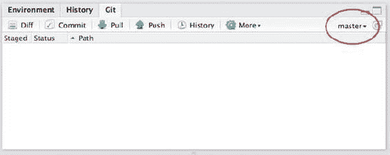
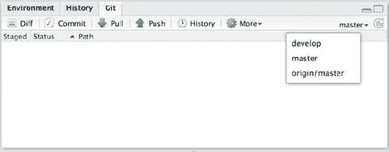
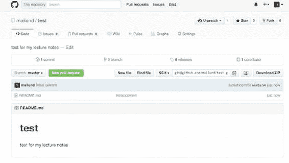

托马斯 mailund 2017 年

Thomas Mailund,《在 R 开始数据科学》, 10.1007/978-1-4842-2671-1_13

# 13.版本控制

Thomas Mailund <sup class="calibre6">1</sup> 的缩写形式

①丹麦奥胡斯

版本控制，最简单的形式，是用来跟踪你的软件的变化。这也是一种有效的软件开发协作方式，因为它允许几个开发人员对软件进行修改，并将它们与其他开发人员的修改合并。RStudio 支持两种版本控制系统，Subversion 和 git。其中，git 是使用最广泛的，虽然这些东西当然非常主观，但我认为它也是更好的系统。这当然是我们在这里使用的系统。

## 版本控制和存储库

开发软件时，使用版本控制系统有两个主要目的。一种方法是简单地跟踪变更，这样您可以在以后检查对您的源代码做了哪些修改，如果您发现它们是错误的，就返回到早期版本尝试不同的方法。它为你的软件开发提供了一个日志，当你发现你到目前为止所做的事情导致了你不想去的某个地方时，它允许你及时返回并再次尝试。

版本控制系统通常做的另一项工作是让你更容易与其他人合作。这里的想法是，您共享所有代码和代码更改的一些全局存储库——版本控制系统保存所有更改的日志——每个开发人员在修改代码时处理一个副本，并在他或她完成代码更改后将代码提交给存储库。在早期的版本控制系统中，当您想要修改文件时，有必要锁定文件，以防止与可能也在编辑相同文件的其他开发人员发生冲突。如今，版本控制系统在对相同文件进行并发编辑时更加宽松，只要重叠行中没有更改，它们通常只会合并更改(在这种情况下，您必须手动解决冲突)。

有了这种类型的版本控制，不同的开发人员可以同时处理代码的不同部分，而不用担心冲突。如果存在冲突，当您尝试将更改推送到全局存储库时，这些冲突会被识别出来，并且会告诉您解决冲突。

版本控制系统 git 允许比这更多的并发和独立开发，甚至没有一个这样的全局存储库。至少理论上是这样。在实践中，为你的软件的官方版本建立一个全球仓库是一个好主意，而且人们也确实这样做了。该系统并不强制实施一个单一的全局存储库，而是围绕拥有许多可以相互交流变更的存储库而构建的。

无论何时使用 git，您都将拥有一个本地存储库和源代码。您可以将这个存储库用作日志系统，或者为不同的特性或版本创建分支，您将在后面看到。您像平常一样对您的源代码进行更改，然后可以将它们提交到您的本地存储库中，而不会与其他人的更改发生任何冲突。但是，您看不到他们的更改，他们也看不到您的更改，因为您在不同的本地存储库上工作。要对另一个存储库进行更改，您必须将您的更改推送到那里，而要从另一个存储库中获取更改，您必须从那里获取更改。

这是您通常使用全局存储库的地方。在开发一个特性时，您对您的本地存储库进行了更改，但是当您完成时，您将这些更改推送到全局存储库。或者，如果您没有权限对全局存储库进行更改——可能是因为您克隆了其他人的代码并对其进行了更改——询问某人*是否有权限将您的更改拉入存储库。这就是所谓的“拉取请求”。*

## 在 RStudio 中使用 git

这都是非常理论化的，如果我很难写，你可能也很难理解。相反，让我们看看实践中的 git。

RStudio 有一些与 git 交互的基本工具:它允许您创建存储库、提交存储库以及将更改推送到其他存储库。它不支持您可以使用 git 做的所有事情——为此，您需要其他工具或使用 git 的命令行版本——但是对于日常的版本控制，它足以完成大多数任务。

### 安装 git

如果你的电脑上还没有安装 git，你可以从 http://git-scm.com 下载。应该有针对 Windows、OS X 和 Linux 的版本，尽管您的平台可能有更好的安装方式。例如，在 Debian/Ubuntu 系统上，您应该能够使用以下内容:

```py
**sudo** apt-get install git-core
```

在 Red Hat/Fedora 系统上，您应该能够使用以下内容:

```py
**sudo** yum install git-core
```

你必须搜索一下如何在其他系统上最好地安装 git。

一旦安装了 git，您希望告诉它您是谁。它需要这个来用你的名字标记代码的变化。如果你是唯一一个工作在代码上的人，这并不可怕，但是如果更多的人在软件开发上合作，那么有必要确定谁做了哪些改变。您通过在终端 [<sup class="calibre6">1</sup>](#Fn1) 中运行以下命令来告诉 git 您是谁:

```py
**git** config --global user.name "YOUR FULL NAME" **git** config --global user.email "YOUR EMAIL ADDRESS"
```

您可能还需要告诉 RStudio 在哪里可以找到您安装的 git 命令。您可以通过选择工具➤全局选项来完成。在弹出的窗口中，你应该会在左边的图标上找到一个带有 Git/SVN 的面板，在那里你可以告诉 RStudio 在哪里可以找到 Git 命令。

您安装的 git 是一个命令行工具。RStudio 有一些 GUI 可以和 git 一起使用，但是您不能从 GUI 做任何事情。有几个 GUI 工具允许您使用 git 做比 RStudio 更多的事情，我推荐您使用其中的一个。我发现使用它们比自己使用命令行更容易，因为我老了，忘记了确切的命令。

一些好的选择是:

*   用于 Windows 和 OS X 的源代码树([https://www.sourcetreeapp.com](https://www.sourcetreeapp.com))

*   GitHub 桌面([https://desktop.github.com](https://desktop.github.com))，用于 Linux、Windows 和 OS X(用于使用 GitHub 库)

*   适用于 Linux 的 gitg(“t0”)https://wiki . gnome . org/apps/gitg/

但是，有时您确实需要使用命令行版本。这里有一个非常好看的命令行 git 程序的交互式 web 教程: [try.github.io](https://try.github.io/levels/1/challenges/1) 。

### 对文件进行更改、暂存文件和提交更改

如果您在创建包时检查了您的项目应该使用 git，那么您应该在 RStudio 的右上角有一个 Git 选项卡，紧挨着 Build 选项卡(参见图 [13-1](#Fig1) )。点击它。


###### 图 13-1。显示已修改文件的 Git 面板

在这个面板的主要部分，有一个文件列表。有三列—暂存、状态和路径—后者包含修改的文件(或目录)的名称。

如果这是您第一次访问此面板，那么对于您在创建对象后修改过的所有文件(包括 RStudio 在包创建期间创建的文件)，状态将包含一个黄色问号。这个状态意味着 git 还不知道这些文件。它可以看到文件在那里，但是你从来没有告诉它如何处理它们。我们现在要做些什么。

“暂存”列包含所有文件的复选框。如果您单击其中一个，该文件的状态将变为绿色“A”。这意味着您已经暂存了要添加到 git 存储库中的文件。对所有文件都这样做。当您对目录执行此操作时，该目录中的所有文件也将被转移以便添加。这也是我们现在想要的。

向 git 提交变更的过程包括在我们实际提交变更之前准备好要提交的变更。我们刚刚做的是告诉 git，下次提交更改时，我们希望添加这些文件。一般来说，提交只会影响我们已经进行的变更。这使您可以只提交对源代码所做的一些更改，这有时会很有帮助。您可能已经对许多文件进行了多次更改，但是在某些时候，您只想提交特定的 bug 修复，而不是对尚未完全完成的新功能进行更改。仅暂存您想要提交的更改就可以做到这一点。

总之，我们已经准备好了一切，现在要提交更改，您必须单击工具栏中的“提交”按钮。这将打开一个新窗口，显示您将要提交的更改，并允许您编写提交消息(在右上角)。此消息将被记录到更改日志中。请在此简短而有意义地描述您的变化。如果以后需要在日志中查找更改，您会需要它。然后单击提交并关闭窗口。Git 面板现在应该是空的。这是因为自上次提交以来没有更多的更改，并且面板仅显示在您的软件的当前版本和提交给 git 的版本之间发生了更改的文件。

要做您刚才在终端中所做的事情，您可以使用 git add 命令暂存文件，如下所示:

```py
**git** add filename
```

然后，您将使用 git commit 命令提交暂存的更改:

```py
**git** commit -m "message"
```

现在尝试修改一个文件。完成之后，您应该会看到文件再次显示在 Git 面板中，但是这次的状态是蓝色 M，如图 [13-2](#Fig2) 所示。毫不奇怪，这代表着*改进型*。


###### 图 13-2。Git 面板中修改的文件

如果您在这里暂存一个提交文件，状态仍然是 M，但是 RStudio 通过将 M 向左移动一点来指示它现在已被暂存(参见图 [13-3](#Fig3) )。这并不是说您真的需要该反馈，因为您也可以从选中的“已分阶段”按钮中看到它是分阶段的。


###### 图 13-3。已修改的文件，其中一个文件暂存以供提交

提交修改的文件与提交添加的文件完全一样。

在终端中，您也可以使用 git add 来暂存修改过的文件。您没有单独的命令来暂存添加的新文件和暂存修改的文件。两者都是 git add。

### 向现有项目添加 git

如果您没有创建与 git 存储库相关联的项目——您现在才刚刚了解 git，所以除非您在创建项目时总是单击 git 按钮，否则您可能有许多没有 git 相关联的项目——您仍然可以为现有目录设置 git。只需选择构建➤配置构建工具，然后单击对话框中的 Git/SVN 选项。如果您选择 git 作为版本控制，RStudio 将为您配置 Git。

您也可以从命令行执行此操作。转到项目所在的目录并运行以下命令:

```py
**git** init
```

这将建立一个空的存储库。然后，您可以添加目录中已经存在的文件，就像您之前看到的那样。

### 裸存储库和克隆存储库

如果您使用像 GitHub 这样的存储服务器，本节中的大部分内容都不是您需要担心的。在那里，创建一个存储库并与之交互是通过一个 web 界面来处理的，除了“克隆”一个存储库之外，您不必担心任何细节。我们将在这里手动创建一个所谓的“空”存储库，并看看我们如何通过它在不同的本地存储库中传递变更。

我们在创建 R 项目或在目录中使用 git init 时创建的存储库用于项目目录中源代码的版本控制。它们并不是真正为开发者之间的协作而建立的。虽然从技术上来说，将一个存储库中的变更合并到另一个存储库中是可行的，但是这有点麻烦，而且不是你每天都想处理的事情。

为了在不同的存储库之间同步变更，我们需要一个*裸存储库*。这是一个不包含本地源代码的存储库；它并不特别，但是它阻止你对它进行局部修改。您只能用其他存储库中的更改来更新它。

要创建一个空存储库，您需要使用 git 的命令行版本。创建一个需要存储库的目录，然后在那里输入:

```py
**git** --bare init
```

存储库现在包含 git 需要处理的各种文件。您的本地存储库也包括这些文件；它们只是隐藏在一个名为。git/当你有本地源代码的时候。

我们不会直接对这个库做任何事情。我们只是需要它来查看我们如何与连接到它的其他存储库一起工作。

转到您想要存储库的工作源代码版本的目录，并通过编写以下内容制作一个裸存储库的副本:

```py
**git** clone /path/to/bare/repository
```

您将收到一条警告，提示您克隆了一个空的存储库。我们已经知道了，所以不用担心。我们将很快添加到它。

但是，要了解如何在存储库之间进行通信，您需要制作另一个工作副本。您可以转到另一个目录并重复克隆命令，或者使用另一个名称克隆存储库，如下所示:

```py
**git** clone /path/to/bare/repository name
```

现在，您拥有了空存储库的两个克隆。您将看到如何将变更从一个克隆推送到克隆的存储库中，以及如何将克隆的存储库中的更新拉入克隆中。

如前所述，遍历一个裸存储库并不是将变更从一个存储库转移到另一个存储库的唯一方法，但是它是使用 git 的最简单的方法，如果您使用 GitHub 这样的服务器，您将会使用这种方法。如果你这样做了，你将看到如何做到这一点，然后 GitHub 会为你做一个空的仓库。你只需要把它克隆到你自己电脑的某个地方就可以使用了。

### 推送本地更改以及获取和拉取远程更改

进入你刚刚制造的一个克隆体。它看起来像一个空目录，因为您还没有对它进行任何更改。事实上，它确实包含一个隐藏目录。git/

尝试创建一些文件，将它们添加到 git 中，并提交更改。

```py
**touch** foo bar
**git** add foo bar
**git** commit -m "added foo and bar"
```

如果您现在按如下方式检查日志:

```py
**git**                  log 
```

你会看到你已经做出了改变。但是，如果您查看空存储库的另一个克隆，您看不到这些变化。

这有两个原因:1)我们只对克隆的存储库进行了更改，但从未将它们推送到两个克隆连接的空存储库，2)即使我们*让*做了这些更改，我们也没有将这些更改推送到另一个克隆。

第一个操作是使用 git push 完成的。这将把您在本地存储库中所做的更改推送到您从中克隆它的存储库中。 [<sup class="calibre6">2</sup>](#Fn2)

```py
**git**                  push 
```

您不需要在每次提交后将更改推送到全局(空)存储库；事实上，你可能不想这么做。这个工作流的想法是，您频繁地提交本地代码，以使版本控制更细粒度，但是当您完成一个功能时，您将这些更改推上来——或者至少使它达到对其他人处理您的代码有意义的阶段。如果您将不能正常工作的代码提交到您的本地存储库中，这并不是一个大问题——尽管通常您会希望避免这种情况——但是如果您将不能正常工作的代码推给其他人，这将不会受欢迎。

在第一个克隆的存储库中推送变更后，它们在第二个存储库中仍然不可见。你需要把它们拉下来。

以下命令对全局存储库进行更改，使您可以在将它们与您自己的代码合并之前将其签出:

```py
**git**                  fetch 
```

这可能是有用的，因为您可以检查更改，并确保在将它们与您的代码合并之前，它们没有破坏任何东西。运行 fetch 命令后，您可以从全局存储库中检出分支，在那里进行更改，并使用下面描述的分支机制将它们合并到您自己的代码中。然而，在大多数情况下，您只是想将对全局存储库所做的更改合并到您当前的代码中，并且您并不真的想在这样做之前修改它。在这种情况下，这个命令就足够了:

```py
**git**                  pull 
```

它将在一个操作中获取最新的变更，并将它们合并到您的本地存储库中。这是迄今为止最常见的操作，用于将他人所做的更改与您自己的更改合并到全局存储库中。

转到没有更改的存储库克隆，并运行命令。检查您现在是否已经有了更改。

在一个项目中与他人合作的一般工作流程是进行更改，并将它们提交到您自己的存储库中。您使用这个存储库进行尚未准备好共享的更改，并且您是唯一可以看到这些更改的人。然后，当您准备好与您的协作者共享时，您可以将更改推送到共享存储库，并且当您需要其他人所做的更改时，您可以提取它们。

如果您尝试推送到全局存储库，而其他人已经推送到您还没有拉取的更改，您将会得到一个错误。不要担心那个。拉改就好；之后，你就可以推动你的改变了。

如果您将变更提取到您的存储库中，并且您已经提交了还没有被推送的变更，那么这就变成了一个合并操作，它需要一个提交消息。您可以使用默认的消息。

您有两个要试验的存储库，所以试着做一些变化，将变更推入和拉出到您已经提交变更的存储库中。在你自己做了一点实验后，这个解释有望变得更有意义。

RStudio 对推拉有一些基本的支持。如果您创建了一个新的 RStudio 项目，并选择将它放在一个现有的目录中，那么您可以尝试在克隆的存储库中创建一个。如果你这样做，你会发现 Git 面板现在有两个新按钮:Push 和 Pull。

### 处理冲突

如果有人将变更推送到与您在本地存储库中编辑的行重叠的全局存储库，那么当您拉取变更时，您将会得到所谓的*冲突*。

git 会通知您这一点，无论您是从 RStudio 拉还是使用命令行。它会告诉您涉及到哪些文件，如果您打开一个有冲突的文件，您会看到 git 用如下所示的文本标记了冲突:

```py
<<<<<<< HEAD
your version of the code
=======
the remote version of the code
>>>>>>> 9a0e21ccd38f7598c05fe1e21e2b32091bb0839b
```

它向您显示了您所做的更改的版本以及全局存储库中的更改的版本。因为两个地方都有变化，git 不知道如何在 pull 命令中将远程存储库合并到您的存储库中。

你必须进入文件并编辑它，使它包含你想要的版本，这可能是两个版本的合并。完成更改后，去掉<<<====/>> > > >标记行。

编辑完有冲突的文件后，您需要暂存该文件(通过在命令行上运行 git add filename 或在 RStudio 的 git 面板中单击“暂存”列中的文件)并提交它。这告诉 git 您已经处理了冲突，并且如果您想这样做的话，将允许您推送您自己的更改。

### 使用分支

分支是大多数版本控制系统的一个特性，它允许你同时处理不同版本的代码。一个典型的例子是，一个分支负责开发新特性，另一个分支负责软件的稳定版本。当您在实现新功能时，代码处于不断变化的状态，新功能的实现可能会有问题，并且接口可能会在不同的设计之间发生变化。你不希望你的用户使用这样一个版本的软件——至少在没有意识到他们正在使用的软件包是不稳定的，界面可能会在一瞬间改变的情况下。所以你希望开发代码与发布的代码分开。

如果你只是在特定的时间发布版本，然后在发布版本之间实现新的特性，这不会是什么大问题。人们应该使用你发布的版本，而不是发布版本之间的提交。但是，如果你发布了一个有 bug 的版本——让我们面对它，这不是不可能的——并且你想在发现 bug 时修复它，世界就没那么简单了。你可能不想等到你完成了你正在开发的所有新特性之后再去修复 bug。所以您希望在发布中对代码进行更改。如果有更多的错误，您将在发布代码中提交更多的错误修复。而所有这些都是在您仍在对您的开发代码进行更改的时候。当然，您对发布的代码所做的错误修复也需要合并到开发代码中。毕竟，您不希望下一个版本重新引入您已经修复的 bug。

这就是分支出现的地方。RStudio 对分支的支持非常有限，它不能帮助您创建分支。 [<sup class="calibre6">3</sup>](#Fn3) 为此，需要使用命令行。

要创建一个分支，可以使用 git branch name 命令。为了创建一个名为 develop 的开发分支，由于缺乏想象力，您可以使用以下命令:

```py
**git** branch develop
```

这只是创建了分支。你不会被魔法转移到树枝或其他什么地方。它只是告诉 git 您有了一个新的分支(并且它从您在提交到存储库的列表中的当前位置分出)。

在 RStudio 中，你可以在 Git 面板中看到你在哪个分支上。在迄今为止你已经试验过的项目中——以及任何你用 git init 创建了一个 git 存储库或者在创建项目时点击了对话框中的 git 选项的项目——你将在主分支上(见图 [13-4](#Fig4) )。这是默认分支，通常用于已发布的版本。



###### 图 13-4。当代码在主分支上时的 Git 面板

如果您点击 Git 面板中的分支下拉菜单，您会得到您的存储库中的分支列表，如图 [13-5](#Fig5) 所示。你会有一个名为 origin/master 的分支。这是中央存储库的主分支，也是您在提取数据时合并的分支。忽略它，这里不重要。如果你运行 git 分支开发命令，你也应该有一个开发分支(见图 [13-6](#Fig6) )。如果您选择它，您将移动到该分支。



###### 图 13-5。选择要切换到的分支


###### 图 13-6。切换到“开发”分支后

您还可以在命令行上使用以下命令获得分支列表:

```py
**git** branch
```

你也可以使用这个命令 [<sup class="calibre6">4</sup>](#Fn4) 切换到一个分支:

```py
**git**                  checkout branchname 
```

如果切换到“开发”分支，您会看到“拉”和“推”按钮是灰色的。当您在一个给定的分支上时，您可以对您的代码进行更改并提交它们，但是您(还)不能推拉。我们很快就会谈到这一点。

如果您在 develop 分支上对代码做了一些更改并提交，然后切换到 master 分支，您将会看到这些更改并没有出现。您可以通过查看文件和查看 git 历史(使用 git 日志或单击 Git 面板中的 history 按钮)来了解这两种情况。同样，您在 master 中所做的更改也不会显示在 develop 中。这正是你想要的。这两个分支是独立的，通过切换分支，您可以在开发分支和软件发布版本之间进行切换。

当您对一个分支进行更改并希望将这些更改添加到另一个分支时，您需要合并分支。实际上，你需要将一个分支合并到另一个分支，这不是一个对称的操作。为此，签出您想要修改的分支，并运行此命令将 otherbranch 中的更改与当前分支合并:

```py
**git**                  merge otherbranch 
```

例如，如果您修复了主分支中的一个 bug，并且想要将它合并到开发分支中，您可以使用这个命令:

```py
**git** checkout develop
**git** merge master
```

如果合并导致冲突，您可以像处理拉操作导致冲突一样处理它们。这并不奇怪，因为 pull 命令实际上只是获取和合并的快捷方式。

### 典型的工作流涉及许多分支

Git 针对处理大量分支进行了优化(不像一些版本控制系统，创建和合并分支可能是相当慢的操作)。这反映在使用 git 时有多少人使用分支:您创建许多分支，并在不同版本的代码图上工作，并在需要时将它们合并在一起。

拥有一个开发分支和一个主分支是存储库结构的典型核心，但是为您实现的每个新特性创建一个分支也是非常常见的。通常，当您开始处理特性时，您会从开发分支中分支出来，并在完成后将它们合并回开发中。每个 bug 修复都有一个单独的分支也是很常见的——通常在开始实现修复时从主服务器分支，然后在完成后分支回主服务器和开发服务器。关于利用不同分支的不同工作流，请参见位于 https://www.atlassian.com/git/tutorials/comparing-workflows[的 Atlassian 的 Git 教程。](https://www.atlassian.com/git/tutorials/comparing-workflows)

如果您为每个特性或 bug 修复创建了许多分支，您不希望在完成之后保留它们——与开发和主分支不同，您可能希望永远保留它们。要删除分支，请使用以下命令:

```py
**git** branch -d branchname
```

### 将分支推送到全局存储库

您可以在本地存储库中任意数量的分支上工作，但是它们不会自动出现在全局存储库中。您之前创建的 develop 分支只存在于本地存储库中，您不能将对它所做的更改推送到全局存储库中——您可以在 RStudio 中看到这一点，因为 push(和 pull)按钮是灰色的。

如果您希望全局存储库中也存在一个分支——这样您就可以推送它，这样协作者就可以检出它——您需要在该存储库中创建一个分支，并在本地存储库和全局存储库之间建立一个链接。

您可以通过签出 develop 分支并运行以下命令来实现这一点:

```py
**git** push --set-upstream origin develop
```

这推动了变更，也记住了分支在起源上链接到开发分支。名称 origin 指的是您在创建这个存储库时克隆的存储库。 [<sup class="calibre6">5</sup>](#Fn5)

你是否希望你正在工作的一个分支，也能在全球知识库中被发现，这是一个个人喜好的问题。如果您正在处理一个特性，并且希望在它完成时共享它，而不是在它完成之前，那么您可能不希望将那个分支推到全局存储库中。但是，对于开发和主分支，您肯定希望它们在全局存储库中。

## 开源代码库

GitHub([https://github.com](https://github.com))是一个托管 git 仓库的服务器。开放项目免费托管，关闭项目收费。你可以把它想象成一个拥有你的裸/全局存储库和一些额外好处的地方。有一些方法可以自动安装 GitHub 上的软件包；web 支持跟踪 bug 和特性请求，并且支持通过 web 界面共享托管项目中的修复和特性。

要使用它，你首先需要去主页注册。这是免费的，你只需要选择一个用户名和密码。

一旦你在 GitHub 上创建了一个账户，你就可以点击主页右上角的大+来创建新的存储库，如图 [13-7](#Fig7) 所示。


###### 图 13-7。在 GitHub 主页上创建新存储库的按钮位于主页的右上角

单击它，您将进入一个页面，在该页面中，您可以选择存储库的名称、创建简短描述、选择许可证，并决定是否要将 README.md 文件添加到存储库中。我建议您总是有一个 README.md 文件——它作为您的包的文档，因为它显示在 GitHub 的库的主页上。不过，你可能想建立一个 README.rmd 文件来生成它，正如你在第 [11](11.html) 章中看到的。不过现在，你也可以说“是”来生成一个。

一旦你生成了存储库，你就进入到一个页面，该页面有存储库中代码的概述，如图 [13-8](#Fig8) 所示。



###### 图 13-8。新的 GitHub 存储库只包含一个 README.md 文件

您可以稍后探索这个 web 页面和在那里实现的特性——了解它支持什么是一个好主意——但是现在您可以将这里的存储库用作远程全局存储库。要克隆它，您需要按钮旁边字段中的地址，即 **SSH** 。在我的测试存储库中，它是 git @ github . com:mailund/test . git。

```py
**git** clone git@github.com:mailund/test.git
```

这是一个您在许多机器上都可以使用的协议，但是它涉及到您必须处理一个公钥/私钥协议。查看在 GitHub 的[https://help.github.com/articles/generating-ssh-keys/](https://help.github.com/articles/generating-ssh-keys/)上关于设置 SSH 密钥的文档，了解更多信息。到目前为止，它基本上是自动化的，你应该能够设置它，只需按下按钮，然后对你得到的问题回答“是”。

不过，如果你的机器安装了 HTTPS，这并不是一个容易使用的协议，该协议是你的网络浏览器用于安全通信的协议。你自己的机器上几乎肯定会有，但是根据防火墙的设置，你可能无法在计算机集群上访问它，然后你需要使用 SSH 协议。要使用 HTTPS 而不是 SSH，只需单击 SSH 下拉菜单并选择 HTTPS。这为您提供了一个略有不同的地址，您可以用它来克隆。在我的存储库中，我得到了 https://github.com/mailund/test.git。

```py
**git** clone https://github.com/mailund/test.git
```

如果没有出错，您应该能够使用克隆的存储库，就像您之前在创建自己的裸/全局存储库时看到的存储库一样。

您还可以通过在 RStudio 中选择“文件”“➤”“新建项目”,并在弹出的对话框中选择“版本控制”(第三个选项),来签出存储库并同时制作 RStudio 项目。在下一个窗口中，选择 Git，然后使用 HTTPS 地址作为存储库 URL。

### 将现有存储库移动到 GitHub

如果您已经在一个项目中本地使用了 git，并且想要将它移动到 GitHub，那么您还需要做一些事情——尤其是如果您想要移动您的存储库，包括存储在其中的所有历史，而不仅仅是其中源代码的当前版本。

首先，您需要创建一个仓库的裸版本。正如您刚才看到的，这只是一个没有相关源代码的存储库版本。

如果您的存储库名为 repo，您可以通过克隆它来制作一个名为 repo.git 的裸版本:

```py
**git** clone --bare repo repo.git
```

要将它移动到 GitHub，在那里创建一个空的存储库并获取它的 HTTPS 地址。然后进入我们刚刚创建的空存储库，运行以下命令:

```py
**cd** repo.git
**git** push --mirror **<**https address at github**>** 
```

现在只需删除用于将代码转移到 GitHub 的空存储库，并从 GitHub 克隆版本*。现在你有了一个版本，你可以继续工作。*

```py
**rm** -rf repo.git
**git** clone **<**https address at github**>** 
```

### 从 GitHub 安装软件包

将 R 包放在 GitHub 上的一个非常好的额外好处是——除了版本控制之外——其他人可以直接从那里安装你的包。在 CRAN 上放包的要求比在 GitHub 上放 R 包要严格得多，而且不允许你经常上传新版本到 CRAN，所以对于你的 R 包的开发版本来说，GitHub 是一个极好的替代品。

要从 GitHub 安装软件包，您需要安装 devtools 软件包，如下所示:

```py
**install.packages**("devtools")
```

之后，您可以使用以下命令安装由 GitHub 用户用户名编写的名为 packagename 的包:

```py
devtools::**install_github**("username/packagename")
```

## 在 GitHub 上合作

默认情况下，你在 GitHub 上创建的库只能由你自己编辑。任何人都可以克隆它们以获得源代码，但是只有您可以将更改推送到存储库。这当然有助于防止随机的人弄乱你的代码，但是会妨碍协作。

与他人协作的一种方式是授予他们对存储库的写权限。在存储库主页上，您必须选择工具栏中的设置条目，然后在左侧菜单中选择协作者。之后，你会进入一个页面，在那里你可以添加通过 GitHub 上的用户帐户识别的合作者。协作者可以像您自己一样将更改推送到存储库。为了避免太多的混乱，当不同的合作者更新代码时，在如何将变更合并到主(和/或开发)分支中有一些规则是有用的。GitHub 推荐并支持的一种方法是在单独的分支中进行更改，然后在合并到主分支之前，使用所谓的 *pull requests* 来讨论更改。

### 拉取请求

发出拉请求的工作流程是实现您的新特性或错误修复，或者您在 develop 或 master 的不同分支上实现的任何东西。然后，不是直接合并它们，而是创建一个所谓的*拉请求*。您可以通过切换到存储库主页上的分支并单击大的绿色 New Pull request 按钮来启动一个 pull request，或者如果您刚刚进行了更改，您还应该看到一个绿色的 Compare & Pull request 按钮，它允许您启动一个 Pull Request。

单击该按钮会将您带到一个页面，您可以在该页面中命名 pull 请求，并编写代码中所做更改的描述。您还可以决定要将拉动合并到哪个分支。在您给出的 pull 请求的标题上面，您可以选择两个分支——一个是您想要合并到的分支(基本分支),另一个是您有新的变更的分支(比较)。你应该选择你做新枝时分出的那根。之后，您可以创建拉取请求。

这只是创建了一个 web 界面来讨论您所做的更改。可以在网页上看到更改，对其进行评论，并对分支机构进行一般性评论。同时，任何人都可以签出分支并进行自己的修改。只要拉请求是开放的，讨论就在进行，人们可以在分支上改进。

完成后，您可以合并拉请求(使用包含关于拉请求的讨论的网页上的绿色合并拉请求按钮)。

### 派生存储库而不是克隆

对单独的分支进行更改，然后发出拉请求以合并更改，仍然需要对存储库进行写访问。这对于与几个朋友合作来说是极好的，但是对于从随机的陌生人那里获得修复或者对其他人编写的包进行修复来说并不理想；那些不一定想让你对他们的软件有完全写权限的人。

不用担心，在 GitHub 上与人合作仍然是可能的，而不需要对彼此的存储库进行写访问。拉请求的工作方式是，实际上没有必要将分支合并为同一个基本存储库的一部分。如果你愿意，你可以从任何地方合并分支。

如果要对您没有写入权限的存储库进行更改，您可以克隆该存储库，并对作为克隆体获得的存储库进行更改，但不能将这些更改推回从中克隆该存储库的存储库。而 GitHub 上的其他用户看不到你所做的本地更改(他们是在你的个人电脑上，而不是在 GitHub 服务器上)。你想要的是 GitHub 上的一个库*，它是你想要修改的库*和*的一个克隆，它是一个空的库，所以你可以把修改推入其中。然后你想把*的那个*库克隆到你自己的电脑上。你对自己电脑所做的更改可以被推送到你在 GitHub 上的空存储库——因为它是一个空存储库，而且你对它有写权限——GitHub 上的其他用户可以看到你在那里的存储库。*

在 GitHub 上制作这样一个库叫做 *forking* the repository。从技术上来说，分叉与克隆没有什么不同——除了您正在创建一个空的存储库——这个术语来自开源软件，其中分叉项目意味着创建您自己的版本并独立于以前的版本进行开发。

无论如何，无论何时你去 GitHub 上的一个库主页，你应该在右上角看到 Fork 按钮——在你正在看的库的名字和分支的右边。单击 Fork 按钮将创建您拥有写入权限的存储库的副本。您不能派生您自己的存储库，尽管我不知道为什么不允许您这样做，而且在大多数情况下，您无论如何也不想这样做。您还可以在其他用户的帐户上派生任何存储库。

制作副本后，您可以将其克隆到您的计算机上，并对其进行更改，就像您对任何其他存储库所做的那样。这个资源库与您自己创建的资源库的唯一不同之处在于，当您发出 pull 请求时，GitHub 知道您是从另一个资源库中分出来的。所以当您发出一个 pull 请求时，您不仅可以选择 Base 和 *Compare* 分支，还可以选择 *base fork* 和*head fork*——前者是您想要将变更合并到其中的存储库，后者是您做出变更的存储库。如果有人分支您的项目，并且您在原始存储库中发出一个拉请求，默认情况下您将看不到*基本分支*和*头分支*选项，但是当您发出拉请求时，单击跨分支比较链接也将在那里启用它们。

如果您对其他人的存储库的变更提出一个拉请求，这个过程与您对自己的项目提出一个拉请求是完全一样的，除了您不能在关于变更的讨论之后合并拉请求。只有有权限写入存储库的人才能这样做。

如果其他人想要对您的代码进行更改，情况也是如此。他们可以用他们对您的代码的更改来启动一个拉请求，但是只有您可以在拉讨论之后决定是否将更改合并到存储库中。

这是一种非常灵活的协作方式——即使是与陌生人——这也是 git 和 GitHub 的一大优势。

## 练习

使用您之前编写的任何包，并在 GitHub 上创建一个存储库来托管它。把你的代码推到那里。

# 脚注

[1](#Fn1_source) 不是 R 端子。您需要在实际的 shell 终端中运行它才能工作。如何打开终端取决于您的平台。在那方面我帮不了你。如果你不知道怎么做，是时候再次启动谷歌了。

如果您没有一个空的存储库，您仍然可以连接克隆来查看对它们所做的更改，但是推送更改会复杂得多。有了一个两者都是克隆而来的裸存储库，向上推送更改就像 git push 一样简单。

其他一些使用 git 的 GUI 对使用分支有很好的支持。你应该去看看。

如果你愿意，你也可以使用 git checkout -b branchname 来创建和检出一个分支。该命令首先创建分支，然后将其签出。但是，如果以后要在分支之间进行切换，可以使用不带-b 选项的 checkout 命令。

[5](#Fn5_source) 比这个稍微复杂一些；您可以有到其他存储库的链接，并从它们中拉出或推送到它们(如果它们是裸存储库的话)，origin 只是到您克隆的那个存储库的默认链接。然而，更详细的讨论超出了这些笔记的范围。如果您总是使用一个单一的全局存储库，那么您不需要知道更多关于远程存储库的链接。