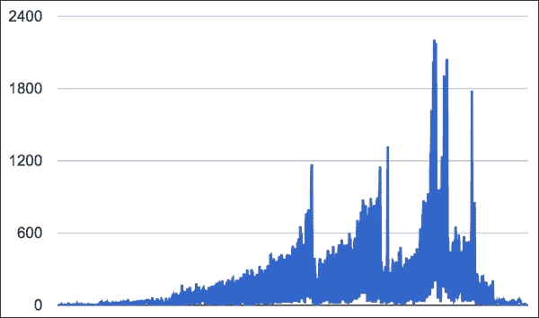

# 一、为什么需要整洁的数据？

大数据、数据挖掘、机器学习和可视化——似乎数据是最近计算领域发生的一切伟大事件的中心。从统计学家到软件开发人员再到图形设计师，所有人都突然对数据科学感兴趣了。廉价的硬件、更好的处理和可视化工具以及大量免费可用的数据的融合意味着我们现在可以比以往任何时候都更准确、更容易地发现趋势并做出预测。

然而，你可能*没有*听说过的是，所有这些数据科学的希望和梦想都是建立在数据杂乱这一事实之上的。通常，数据必须被移动、压缩、清理、切碎、切片、切块，并经受任何数量的其他转换，才能准备好用于算法或可视化，我们认为这是**数据科学**的核心。

在本章中，我们将介绍:

*   一个简单的数据科学六步流程，包括清理
*   传达您如何清理数据的有用指南
*   您可能会发现一些有助于数据清理的工具
*   一个介绍性示例，展示了数据清理如何适应整个数据科学过程

# 全新的视角

我们最近读到《纽约时报》称数据清理**看门人的工作**，并说数据科学家 80%的时间将花在这种清理上。正如我们在下图中看到的，尽管数据清理很重要，但它并没有像大数据、数据挖掘或机器学习那样真正抓住公众的想象力:


谁能责怪我们不想成群结队地聚在一起谈论看门人的工作有多有趣和超级酷呢？嗯，不幸的是——实际的家务也是如此——如果我们只是完成工作，而不是忽视它，抱怨它，给它起各种贬低的名字，我们都会好得多。

还不信服？考虑一个不同的比喻，你不是一个数据看门人；你是数据厨师。想象一下，有人递给你一个市场篮子，里面装满了你所见过的最华丽的传家宝蔬菜，每一种都是在新鲜度最高的时候精心挑选的，并且是在有机农场可持续生产的。西红柿非常多汁，生菜很脆，辣椒明亮而紧实。你兴奋地开始做饭，但你环顾四周，厨房很脏，锅碗瓢盆已经烤熟，谁知道上面结了什么，至于工具，你除了一把生锈的刀和一条湿毛巾什么都没有。水槽坏了，你刚刚看到一只甲虫从以前美丽的莴苣下面爬出来。

即使是新手厨师也知道你不应该在这种地方做饭。至少，你会毁掉别人给你的那篮美味可口的东西。最糟糕的是，你会让人生病。此外，像这样做饭一点也不好玩，用一把生锈的旧刀子切蔬菜要花一整天的时间。

就像在厨房一样，花时间清理和准备数据科学工作区、工具和原材料绝对是值得的。20 世纪 60 年代的计算机编程格言“垃圾进，垃圾出”同样适用于数据科学。


# 数据科学过程

清理如何融入数据科学的其他工作？简而言之，这是一个关键的部分，它直接影响着之前和之后的过程。

更长的答案依赖于用六个步骤描述数据科学过程，如以下列表所示。数据清理就在中间，在第 3 步。但是，我们不会将这些步骤视为一个线性的、从开始到结束的框架，我们会在项目过程中以更多的迭代方式根据需要多次重新审视这些步骤。同样值得指出的是，不是每个项目都会有所有的步骤；例如，有时，我们没有收集步骤或可视化步骤。这实际上取决于项目的特殊需求:

1.  第一步是提出问题陈述。确定你试图解决的问题是什么。
2.  下一步是数据收集和存储。帮助你回答这个问题的数据来自哪里？您将它存储在哪里，以什么格式存储？
3.  然后是数据清理。你改变数据了吗？你删除了什么吗？您是如何为接下来的分析和挖掘步骤做准备的？
4.  下一步是数据分析和机器学习。你对数据做了什么处理？什么转变？你用了什么算法？你应用了什么公式？你用了什么机器学习算法？按什么顺序？
5.  下一步是表示和可视化。你如何展示你的工作成果？这可以是一个或多个表格、绘图、图形、图表、网络图、文字云、地图等等。这是表示数据的最佳可视化方式吗？你考虑过哪些替代方案？
6.  最后一步是解决问题。你在第一步中提出的问题的答案是什么？你对你的结果有什么限制？用这种方法你能回答问题的某些部分吗？你能做些什么不同的事情？下一步是什么？

在尝试分析/挖掘/机器学习或可视化步骤之前，需要进行数据清理，这是有道理的。尽管如此，请记住，由于这是一个迭代的过程，我们可能会在项目过程中多次重复清理。此外，我们将要进行的挖掘或分析的类型通常会决定我们清理数据的方式。我们认为清理包括可能由所选分析方法决定的各种任务，例如，交换文件格式、更改字符编码或解析出要操作的数据片段。

数据清理也将与收集和存储步骤(步骤 2)紧密联系在一起。这个的意思是你可能要收集原始数据，存储，清理，再次存储清理后的数据，再收集一些，清理那个，和之前的数据结合，再次清理，存储，等等。因此，记住你做了什么，如果需要的话能够重复这个过程，或者告诉别人你做了什么，这将是非常重要的。


# 关于数据清理的沟通

由于这六个步骤是围绕一个故事弧线组织的，故事弧线以一个问题开始，以问题的解决结束，所以它作为一个报告框架非常好用。如果你决定使用六步框架作为报告数据科学过程的方式，你会发现你可以在第三步写下你的清理工作。

但是，即使您没有在正式报告中记录您的数据科学过程，您也会发现仔细记录您对数据做了什么以及以什么顺序做了什么非常有帮助。

记住，即使是最小的、风险最低的项目，你也总是在为至少两个人工作:现在的你和 6 个月后的你。相信我，当我告诉你，六个月后的你不会记得今天的你做了什么来清理你的数据，更不会记得你为什么这么做或如何再做一次！

对此最简单的解决方案是只保留一份你所做事情的日志。日志应该包括你运行的特定命令的链接、截图或拷贝和粘贴，以及你为什么这样做的简短解释。以下示例显示了一个非常小的文本挖掘项目的日志，其中嵌入了指向每个阶段的输出文件的链接以及指向清理脚本的链接。如果您不熟悉这篇日志中提到的一些技术，也不用担心。这个示例向您展示了日志可能的样子:

1.  我们编写了一个 SQL 查询来检索每个项目及其描述的列表。
2.  为了在 Python 中进行词频分析，我们需要特定 JSON 格式的数据。我们构建了一个 PHP 脚本，循环遍历我们的查询结果，将其结果放在一个 JSON 文件(版本 1)中。
3.  此文件有一些格式错误，如未转义的引号和嵌入的 HTML 标记。这些错误通过第二个 PHP 脚本得到了纠正，该脚本在运行时打印出这个整洁的 JSON 文件(版本 2)。

请注意，我们的日志试图解释我们做了什么以及为什么这样做。它很短，可能的话可以包含链接。

如果你选择使用数据清理，有许多更复杂的解决方案来交流。例如，如果你熟悉版本控制系统，如 T4 Git 或 Subversion，你可能会想到如何扩展它们来跟踪你的数据清理。无论你选择什么系统，哪怕是简单的日志，最重要的还是要实际使用。所以，选择一些能够鼓励使用它并且不会阻碍你进步的东西。


# 我们的数据清理环境

我们在本书中使用的数据清理方法是一种通用的、广泛适用的方法。它不要求也不假设您有任何高端专业的单一供应商数据库或数据分析产品(事实上，这些供应商和产品可能有自己的清理例程或方法)。我在本书中围绕使用真实数据集时可能遇到的常见日常问题设计了清理教程。我围绕任何人都可以访问的真实世界数据设计了这本书。我将向您展示如何使用开源、通用软件和技术来清理数据，这些软件和技术很容易获得，并且在工作场所中很常用。

以下是您应该准备好使用的一些工具和技术:

*   对于几乎每一章，我们都将使用终端窗口及其命令行界面，比如 Mac OSX 上的终端程序或 Linux 系统上的 bash。在 Windows 中，一些命令将能够使用 Windows 命令提示符运行，但其他命令可能需要使用功能更全面的 Windows 命令行程序，如 CygWin。
*   对于几乎每一章，我们将使用文本编辑器或程序员编辑器，如 Mac 上的 Text Wrangler，Linux 上的 vi 或 emacs，或 Windows 上的 Notepad++或 Sublime Editor。
*   对于大多数章节，我们将需要一个 Python 2.7 客户端，比如 Enthought Canopy，并且我们将需要足够的权限来安装包。许多例子可以在 Python 3 中使用，但有些不能，所以如果您已经有了，您可能希望创建一个替代的 2.7 安装。
*   对于第 3 章、*中的[整洁数据的主要工具——电子表格和文本编辑器](ch03.html "Chapter 3. Workhorses of Clean Data – Spreadsheets and Text Editors")*，我们将需要一个电子表格程序(我们将关注微软 Excel 和谷歌电子表格)。
*   对于[第 7 章](ch07.html "Chapter 7. RDBMS Cleaning Techniques")、 *RDBMS 清理技术*，我们将需要一个可用的 MySQL 安装和客户端软件来访问它。


# 介绍性的例子

首先，让我们用一个小例子来磨刀霍霍，这个小例子集成了六步框架，并说明了如何解决一些简单的清洁问题。这个例子使用了公开的安然电子邮件数据集。这是一个非常著名的数据集，由在现已倒闭的安然公司工作的员工之间收发的电子邮件组成。作为美国政府对安然公司会计欺诈调查的一部分，这些电子邮件成为公共记录的一部分，现在任何人都可以下载。不同领域的研究人员发现，电子邮件有助于研究工作场所的交流、社交网络等。

### 注意

你可以在 http://en.wikipedia.org/wiki/Enron 的维基百科页面[上读到更多关于安然和导致其倒闭的金融丑闻的](http://en.wikipedia.org/wiki/Enron)，你也可以在 http://en.wikipedia.org/wiki/Enron_Corpus[的单独页面](http://en.wikipedia.org/wiki/Enron_Corpus)上读到关于安然电子邮件文集本身的。

在本例中，我们将针对一个简单的数据科学问题实施六步框架。假设我们想揭示安然公司内部电子邮件使用的趋势和模式。让我们从按日期统计发送给安然员工的信息开始。然后，我们将在图表上直观地显示一段时间内的计数。

首先，我们需要使用[http://www.ahschulz.de/enron-email-data/](http://www.ahschulz.de/enron-email-data/)的指令下载 MySQL 安然语料库。这个文件的另一个(备份)来源是 https://www.cs.purdue.edu/homes/jpfeiff/enron.html 的。按照这些说明，我们将需要将数据导入到 MySQL 服务器上一个名为 **Enron** 的新数据库方案中。现在可以使用 MySQL 命令行界面或基于 web 的工具(如 PHPMyAdmin)查询数据了。

我们的第一个计数查询如下所示:

```
SELECT date(date) AS dateSent, count(mid) AS numMsg
FROM message
GROUP BY dateSent
ORDER BY dateSent;
```

马上，我们注意到许多电子邮件的日期不正确，例如，有许多日期似乎早于或晚于公司的存在(例如，1979 年)，或者来自不合逻辑的年份(例如，0001 或 2044 年)。电子邮件是旧的，但还没有旧到那种程度！

下表显示了一些奇怪行的摘录(完整的结果集大约有 1300 行长),所有这些日期的格式都是正确的；然而，有些日期绝对是错误的:

| 

发送日期

 | 

nummus

 |
| --- | --- |
| `0002-03-05` | `1` |
| `0002-03-07` | `3` |
| `0002-03-08` | `2` |
| `0002-03-12` | `1` |
| `1979-12-31` | `6` |
| `1997-01-01` | `1` |
| `1998-01-04` | `1` |
| `1998-01-05` | `1` |
| `1998-10-30` | `3` |

这些糟糕的日期很可能是由于错误配置的电子邮件客户端造成的。此时，我们有三种选择:

*   **什么都不做**:也许我们可以忽略这些糟糕的数据，然后继续构建线图。但是，由于最低错误日期是从 0001 年开始，最高错误日期是从 2044 年开始，我们可以想象我们的线图在时间轴上有 1300 个刻度，每个刻度显示 1 或 2 的计数。这个图表听起来不是很吸引人或者信息丰富，所以什么都不做是不行的。
*   **修复数据**:我们可以试着找出每条错误消息的正确日期，并生成一个正确的数据集，然后我们可以用它来构建我们的图表。
*   **丢弃受影响的电子邮件**:我们可以做出明智的决定，丢弃任何日期超出预定窗口的电子邮件。

为了在选项 2 和 3 之间做出决定，我们需要计算仅使用 1999-2002 年的窗口会影响多少消息。我们可以使用下面的 SQL:

```
SELECT count(*) FROM message
WHERE year(date) < 1998 or year(date) > 2002;
Result: 325
```

325 条日期错误的消息最初可能看起来很多，但话说回来，它们只占整个数据集的 1%左右。根据我们的目标，我们可能会决定手动修复这些日期，但是让我们假设我们不介意丢失 1%的消息。我们可以谨慎地进行第三种选择，丢弃受影响的电子邮件。以下是修改后的查询:

```
SELECT date(date) AS dateSent, count(mid) AS numMsg
FROM message
WHERE year(date) BETWEEN 1998 AND 2002
GROUP BY dateSent
ORDER BY dateSent;
```

清理后的数据现在包含 1，211 行，每一行都有一个计数。以下是新数据集的摘录:

| 

发送日期

 | 

nummus

 |
| --- | --- |
| `1998-01-04` | `1` |
| `1998-01-05` | `1` |
| `1998-10-30` | `3` |
| `1998-11-02` | `1` |
| `1998-11-03` | `1` |
| `1998-11-04` | `4` |
| `1998-11-05` | `1` |
| `1998-11-13` | `2` |

在这个例子中，看起来在 1998 年 1 月有两个有问题的日期，直到 10 月才出现其他消息，此时消息开始更有规律地出现。这看起来很奇怪，这也指出了另一个问题，即使那天没有发送电子邮件，我们在 *x* 轴上的每个日期都重要吗？

如果我们回答是，重要的是显示每个日期，即使是计数为 0 的日期；这可能意味着要进行另一轮清理，以生成用零显示日期的行。

但话说回来，也许我们可以更有策略地对待这件事。我们是否需要在原始数据中有零值实际上取决于我们使用什么工具来创建图表以及它是什么类型的图表，例如，Google Spreadsheets 将构建一个线图或条形图，它可以自动检测到在 *x* 轴上有缺失的日期，并且即使在初始数据集中没有给出零值，它也会填充零值。在我们的数据中，这些零值将是 1998 年大部分时间里神秘失踪的日期。

接下来的三张图展示了这些工具以及它们如何处理日期轴上的零值。请注意此处显示的 Google 电子表格数据的开头和结尾都有长长的零尾:


谷歌电子表格会自动用零填充任何缺失的天数。

D3 JavaScript 可视化库也将做同样的事情，默认情况下为一个范围内的缺失日期填充零值，如下图所示。

### Tip

对于一个简单的 D3 线图的例子，看看这个教程:[http://bl.ocks.org/mbostock/3883245](http://bl.ocks.org/mbostock/3883245)。


D3 自动用零填充任何缺少的天数。

Excel 在其默认折线图中也有相同的日期填充行为，如下所示:


Excel 会自动用零填充任何缺少的天数。

接下来，我们需要考虑，通过允许日期的零值，我们是否也使我们的 *x* 轴变得更长了(我的计数查询产生了 1211 行，但是在指定的范围内总共有 1822 天，即 1998-2002)。也许显示零天数可能不起作用；如果图表如此拥挤，我们无论如何也看不到差距。

为了进行比较，我们可以快速地将相同的数据运行到 Google 电子表格中(您也可以在 Excel 或 D3 中这样做)，但是这一次，我们将只选择我们的计数列来构建图表，从而强制 Google 电子表格*而不是*在 *x* 轴上显示日期。结果是只有来自数据库计数查询的数据的真实形状，没有填充零计数天数。长尾理论消失了，但图表中重要部分(中间部分)的整体形状保持不变:



图形现在只显示带有一条或多条消息的日期。

幸运的是，数据的形状是相似的，只是图中的头部和尾部变短了。基于这种比较，并基于我们计划对数据做什么(请记住，我们想做的只是创建一个简单的线图)，我们可以对我们的决定感到满意，我们没有专门创建一个显示零计数天的数据集。

总而言之，线图显示安然公司的电子邮件流量出现过几次高峰。丑闻爆发的 2001 年 10 月和 11 月出现了最大的高峰和最大的流量。两个较小的高峰发生在 2001 年 6 月 26-27 日和 2000 年 12 月 12-13 日，当时发生了类似的涉及安然的有新闻价值的事件(一个涉及加利福尼亚能源危机，另一个涉及公司领导层的变动)。

如果你对数据分析感到兴奋，你可能对下一步如何处理这些数据有各种各样的好主意。现在您已经清理了数据，希望这将使您的分析任务更容易！


# 总结

做了这么多工作之后，看起来《纽约时报》是对的。正如您从这个简单的练习中所看到的，数据清理实际上包含了回答哪怕是一个很小的面向数据的问题的大约 80%的工作(在这个例子中，讨论数据清理的基本原理和选择占用了 900 个单词的案例研究中的 700 个单词)。数据清理确实是数据科学过程的关键部分，它涉及到理解技术问题，还需要我们做出一些价值判断。作为数据清理的一部分，我们甚至必须考虑分析和可视化步骤的预期结果，即使我们还没有真正完成它们。

在考虑了本章中介绍的数据清理的作用后，我们更加清楚地看到，清理效率的提高可以快速地节省大量的时间。

下一章将描述任何想要进入更大、更好的“厨房”的“数据厨师”所需要的一些基础知识，包括文件格式、数据类型和字符编码。