# 五、大数据

|   | *“多则不同。”* |   |
|   | ——*菲利普·沃伦·安德森* |

在前面的章节中，我们使用了回归技术来拟合模型和数据。在[第 3 章](ch03.html "Chapter 3. Correlation")、*相关性*中，例如，我们建立了一个线性模型，该模型使用普通最小二乘法和法线方程来拟合穿过运动员身高和对数体重的直线。在[第四章](ch04.html "Chapter 4. Classification")、*分类*中，我们使用了 Incanter 的优化命名空间来最小化物流成本函数，并建立了泰坦尼克号乘客的分类器。在这一章中，我们将以一种适用于大量数据的方式应用类似的分析。

我们将使用一个只有 100，000 条记录的相对较小的数据集。这不是大数据(100 MB，可以轻松地放入一台机器的内存中)，但它足够大，可以展示大规模数据处理的常用技术。使用 Hadoop(分布式计算的流行框架)作为案例研究，本章将重点关注如何通过并行性将算法扩展到非常大的数据量。我们将介绍 Clojure 提供的用于 Hadoop 的两个库——**特瑟**和**跑酷**。

不过，在我们开始 Hadoop 和分布式数据处理之前，我们将了解如何利用所有现代计算机中可用的并行能力，将使 Hadoop 在非常大的规模上有效的一些相同原则应用于单台计算机上的数据处理。

# 下载代码和数据

本章利用美国国税局(IRS)提供的邮政编码的个人收入数据。该数据包含按州、邮政编码和收入类别分类的选定收入和税收项目。

它的大小为 100 MB，可以从[http://www.irs.gov/pub/irs-soi/12zpallagi.csv](http://www.irs.gov/pub/irs-soi/12zpallagi.csv)下载到示例代码的数据目录。由于该文件包含 IRS 收入统计数据(SoI ),因此我们将该文件重命名为`soi.csv`,以用于示例。

### 注意

本章的示例代码可从帕克特出版社的网站或 https://github.com/clojuredatascience/ch5-big-data T2 获得。

像往常一样，提供了一个脚本来为您下载和重命名数据。它可以在项目目录中的命令行上运行:

```

script/download-data.sh

```

如果您运行此程序，文件将被自动下载并重命名。

## 检查数据

一旦你下载了数据，看看文件第一行的列标题。访问文件第一行的一种方法是将文件加载到内存中，按换行符进行分割，并获取第一个结果。Clojure 核心库的函数`slurp`将以字符串形式返回整个文件:

```
(defn ex-5-1 []

  (-> (slurp "data/soi.csv")

      (str/split #"\n")

      (first)))
```

该文件在磁盘上的大小约为 100 MB。当加载到内存中并转换为对象表示时，数据将占用更多的内存空间。当我们只对第一排感兴趣时，这尤其浪费。

幸运的是，如果我们利用 Clojure 的懒惰序列，我们不必将整个文件加载到内存中。我们可以返回对文件的引用，然后一次遍历一行，而不是返回整个文件内容的字符串表示形式:

```
(defn ex-5-2 []

  (-> (io/reader "data/soi.csv")

      (line-seq)

      (first)))
```

在前面的代码中，我们使用`clojure.java.io/reader`返回对文件的引用。此外，我们使用`clojure.core`函数`line-seq`从文件中返回一个懒惰的行序列。这样，我们可以读取比可用内存更大的文件。

上一个函数的结果如下:

```
"STATEFIPS,STATE,zipcode,AGI_STUB,N1,MARS1,MARS2,MARS4,PREP,N2,NUMDEP,A00100,N00200,A00200,N00300,A00300,N00600,A00600,N00650,A00650,N00900,A00900,SCHF,N01000,A01000,N01400,A01400,N01700,A01700,N02300,A02300,N02500,A02500,N03300,A03300,N00101,A00101,N04470,A04470,N18425,A18425,N18450,A18450,N18500,A18500,N18300,A18300,N19300,A19300,N19700,A19700,N04800,A04800,N07100,A07100,N07220,A07220,N07180,A07180,N07260,A07260,N59660,A59660,N59720,A59720,N11070,A11070,N09600,A09600,N06500,A06500,N10300,A10300,N11901,A11901,N11902,A11902"
```

文件中有 77 个字段，所以我们不会一一列出。前四个字段是:

*   这是联邦信息处理系统(FIPS)代码。
*   这是国家的两个字母的代码。
*   这是 5 位数的邮政编码。
*   `AGI_STUB`:这是调整后总收入的一面，按以下方式分类:

    1.  【25，000 美元以下 1 美元

    3.  5 万美元以下 2.5 万美元
    4.  7.5 万美元以下 7.5 万美元
    5.  10 万美元以下 10 万美元【20 万美元】

我们感兴趣的其他领域如下:

*   `N1`:提交的申报表数量
*   `MARS2`:提交的联名申报表的数量
*   `NUMDEP`:家属人数
*   `N00200`:带薪返回的次数
*   `N02300`:带失业补偿的返回次数

如果你好奇的话，列定义的完整列表可以在位于[http://www.irs.gov/pub/irs-soi/12zpdoc.doc](http://www.irs.gov/pub/irs-soi/12zpdoc.doc)的 IRS 数据定义文档中找到。

## 清点记录

我们的文件当然很宽，但是很高吗？我们想确定文件中的总行数。创建了一个惰性序列后，这只是一个计算序列长度的问题:

```
(defn ex-5-3 []

  (-> (io/reader "data/soi.csv")

      (line-seq)

      (count)))
```

前面的示例返回 166，905，包括标题行，因此我们知道文件中实际有 166，904 行。

`count`函数是计算序列中元素数量的最简单方法。对于 vectors(以及实现 counted 接口的其他类型)，这也是最有效的方法，因为集合已经知道它包含多少元素，因此不需要重新计算。然而，对于一个惰性序列，确定序列中包含多少元素的唯一方法是从头至尾遍历它。

Clojure 对`count`的实现是用 Java 编写的，但是 Clojure 的等价实现是对序列的简化，如下所示:

```
(defn ex-5-4 []

  (->> (io/reader "data/soi.csv")

       (line-seq)

       (reduce (fn [i x]

                 (inc i)) 0)))
```

我们传递给`reduce`的前一个函数接受一个计数器`i`和序列中的下一个元素`x`。对于每个`x`，我们简单地增加计数器`i`。reduce 函数接受初始值零，这表示什么都没有。如果没有要减少的行，将返回零。

从 1.5 版本开始，Clojure 提供了 reducers 库([http://clojure.org/reducers](http://clojure.org/reducers))，它提供了一种用内存效率换取速度的替代方法。


# 还原剂库

我们之前实现的`count` 操作是一个顺序算法。一次处理一行，直到序列结束。但是这个手术并没有要求必须这样做。

我们可以将行数分成两个序列(理想情况下长度大致相等),并在每个序列中独立减少。完成后，我们只需将每个序列的总行数相加，就可以得到文件中的总行数:

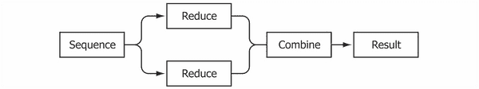

如果每个**归约**在其自己的处理单元上运行，那么两个计数操作将并行运行。在其他条件相同的情况下，该算法的运行速度会提高一倍。这是`clojure.core.reducers`库的目标之一——通过利用多核，将并行性的好处带给在单台机器上实现的算法。

## 带异径管的平行褶皱

reducers 库实现的 reduce 的并行实现被称为 **折叠**。为了利用 fold，我们必须提供一个合并器函数，该函数将获取简化序列的结果(部分行数)并返回最终结果。由于我们的行数是数字，所以组合器函数就是简单的`+`。

### 注意

Reducers 是 Clojure 标准库的一部分，它们不需要作为外部依赖项添加。

使用`clojure.core.reducers`作为`r`的调整后的示例如下所示:

```
(defn ex-5-5 []

  (->> (io/reader "data/soi.csv")

       (line-seq)

       (r/fold + (fn [i x]

                   (inc i)))))
```

组合器函数`+`已经作为第一个参数包含在 fold 中，我们没有改变的 reduce 函数作为第二个参数提供。我们不再需要传递初始值零— `fold`将通过调用不带参数的组合器函数来获取初始值。我们前面的例子是可行的，因为不带参数调用的`+`已经返回了零:

```
(defn ex-5-6 []

  (+))

;; 0
```

为了参与折叠，combiner 函数有两个实现是很重要的:一个没有参数，返回相同的值，另一个有两个参数，*组合*参数。当然，不同的折叠需要不同的组合器函数和相同的值。比如乘法的恒等值是`1`。

我们可以将过程可视化，用一个相同的值作为计算的种子，在`xs`的序列上迭代地减少，并将减少的值组合成一个输出值作为一棵树:


当然，可以有两个以上的缩减来组合。`fold`的默认实现将输入集合分割成 512 个元素的块。因此，我们的 166，000 元素序列将生成 325 个要合并的约简。我们将用一个树形表示图很快用完页面空间，所以让我们更示意性地可视化这个过程——作为一个两步的减少和合并过程。

第一步对集合中的所有块执行并行缩减。第二步是对中间结果执行串行归约，以获得最终结果:


前面的表示显示了将几个`xs`序列(此处表示为圆形)减少为一系列输出(此处表示为正方形)。这些方块被连续组合产生最终结果，用一个星号表示。

## 使用 iota 加载大文件

在一个惰性序列上调用`fold`需要 Clojure 将序列实现到内存中，然后将序列分块成组以便并行执行。对于每行上执行的计算量较小的情况，协调中涉及的开销超过了并行性带来的好处。我们可以通过使用一个名为`iota`(【https://github.com/thebusby/iota】)的库来稍微改善这种情况。

### 注意

`iota`库将文件直接加载到适合使用 reducers 折叠的数据结构中，reducer 可以通过使用内存映射文件来处理大于可用内存的文件。

用`iota`代替我们的`line-seq`函数，我们的行数就变成了:

```
(defn ex-5-7 []

  (->> (iota/seq "data/soi.csv")

       (r/fold + (fn [i x]

                   (inc i)))))
```

到目前为止，我们一直在处理未格式化的行序列，但是如果我们要做的不仅仅是计算行数，我们会希望将它们解析成更有用的数据结构。这是另一个领域，Clojure 的 reducers 可以帮助我们提高代码效率。

## 创建异径管处理管道

我们已经知道这个文件是用逗号分隔的，所以让我们首先创建一个函数，将每一行转换成一个字段向量。除了前两个字段之外，所有字段都包含数字数据，所以让我们将它们解析为双精度数据:

```
(defn parse-double [x]

  (Double/parseDouble x))

(defn parse-line [line]

  (let [[text-fields double-fields] (->> (str/split line #",")

                                         (split-at 2))]

    (concat text-fields

            (map parse-double double-fields))))
```

我们使用 reducers 版本的`map`将我们的`parse-line`函数依次应用于文件中的每一行:

```
(defn ex-5-8 []

   (->> (iota/seq "data/soi.csv")

        (r/drop 1)

        (r/map parse-line)

        (r/take 1)

        (into [])))

;; [("01" "AL" 0.0 1.0 889920.0 490850.0 ...)]
```

最后一个`into`函数调用将 reducers 的内部表示(一个可约集合)转换成一个 Clojure 向量。前面的例子应该返回 77 个字段的序列，代表文件头之后的第一行。

我们现在只是删除列名，但是如果我们能够利用这些来返回每个记录的映射表示，将列名与字段值关联起来，那就太好了。映射的键是列标题，值是经过解析的字段。`clojure.core`函数`zipmap`将创建两个序列的映射——一个用于键，一个用于值:

```
(defn parse-columns [line]

  (->> (str/split line #",")

       (map keyword)))

(defn ex-5-9 []

  (let [data (iota/seq "data/soi.csv")

        column-names (parse-columns (first data))]

    (->> (r/drop 1 data)

         (r/map parse-line)

         (r/map (fn [fields]

                  (zipmap column-names fields)))

         (r/take 1)

         (into []))))
```

该函数返回每行的地图表示，这是一种更加用户友好的数据结构:

```
[{:N2 1505430.0, :A19300 181519.0, :MARS4 256900.0 ...}]
```

Clojure 的 reducers 的一个伟大之处在于，在前面的计算中，对`r/map`、`r/drop`和`r/take`的调用被组合成一个 reduction，这个 reduction 将在对数据的单次传递中执行。随着操作数量的增加，这变得特别有价值。

假设我们想要过滤掉零邮政编码。我们可以像这样扩展异径管管道:

```
(defn ex-5-10 []

  (let [data (iota/seq "data/soi.csv")

        column-names (parse-columns (first data))]

    (->> (r/drop 1 data)

         (r/map parse-line)

         (r/map (fn [fields]

                  (zipmap column-names fields)))

         (r/remove (fn [record]

                     (zero? (:zipcode record))))

         (r/take 1)

         (into []))))
```

`r/remove`步骤现在也与`r/map`、`r/drop`和`r/take`调用一起运行。随着数据大小的增加，避免对数据进行不必要的多次迭代变得越来越重要。使用 Clojure 的 reducers 确保了我们的计算被编译成一次通过。

## 用减速器进行减速

为了使过程更加清晰，我们可以为之前的每个步骤创建一个**简化的**版本。要解析这些行，从字段中创建一条记录，并过滤零邮政编码。该函数的简化版本是一个等待收集的缩减:

```
(def line-formatter

  (r/map parse-line))

(defn record-formatter [column-names]

  (r/map (fn [fields]

           (zipmap column-names fields))))

(def remove-zero-zip

  (r/remove (fn [record]

              (zero? (:zipcode record)))))
```

在每种情况下，我们都调用 reducers 的一个函数，但是不提供集合。响应是函数的一个简化版本，可以在以后应用于集合。可使用`comp`将这些函数组合成一个`parse-file`函数:

```
(defn load-data [file]

  (let [data (iota/seq file)

        col-names  (parse-columns (first data))

        parse-file (comp remove-zero-zip

                         (record-formatter col-names)

                         line-formatter)]

    (parse-file (rest data))))
```

只有当用序列调用`parse-file`函数时，管道才被实际执行。

## 带减速器的统计折叠

解析完数据后，是时候执行一些描述性统计了。让我们假设我们想知道邮政编码提交给 IRS 的平均*数量的申报表*(列`N1`)。一种方法是将这些值相加，然后除以计数，这是我们在整本书中多次使用的方法。我们的第一次尝试可能是这样的:

```
(defn ex-5-11 []

  (let [data (load-data "data/soi.csv")

        xs (into [] (r/map :N1 data))]

    (/ (reduce + xs)

       (count xs))))

;; 853.37
```

虽然这个可以工作，但是相对来说比较慢。我们对数据迭代一次以创建`xs`，第二次计算总和，第三次计算计数。我们的数据集越大，我们付出的时间代价就越大。理想情况下，我们将能够在单次遍历数据时计算平均值，就像前面的`parse-file`函数一样。如果我们也能并行执行，那就更好了。

## 关联性

在我们继续之前，花点时间思考一下为什么下面的代码不能达到我们想要的效果是很有用的:

```
(defn mean

  ([] 0)

  ([x y] (/ (+ x y) 2)))
```

我们的`mean`函数是两个算术的函数。如果没有参数，它返回零，即`mean`计算的标识。对于两个参数，它返回它们的平均值:

```
(defn ex-5-12 []

  (->> (load-data "data/soi.csv")

       (r/map :N1)

       (r/fold mean)))

;; 930.54
```

前面的例子用我们的`mean`函数折叠了`N1`数据，并产生了一个与我们之前获得的结果不同的结果。如果我们可以展开前三个`xs`的计算，我们可能会看到类似下面的代码:

```
(mean (mean (mean 0 a) b) c)
```

这是一个坏主意，因为`mean`函数不是关联的。对于关联函数，以下情况成立:


加法是结合律，但乘法和除法不是。所以`mean`函数也不是关联的。将`mean`函数与下面的简单加法进行对比:

```

(+ 1 (+ 2 3))

```

这产生了与以下相同的结果:

```

(+ (+ 1 2) 3)

```

如何划分`+`的参数并不重要。关联性是用于对一组数据进行约简的函数的一个重要属性，因为根据定义，上一次计算的结果被视为下一次计算的输入。

将`mean`函数转换成关联函数的最简单方法是分别计算总和和计数。由于总和与计数是关联的，因此可以对数据进行并行计算。`mean`函数可以简单地用一除以另一来计算。

## 使用折叠计算平均值

我们将使用两个自定义函数`mean-combiner`和`mean-reducer`创建一个文件夹。这需要定义三个实体:

*   折叠的标识值
*   reduce 函数
*   组合功能

我们在上一节中发现了结合性的优势，因此我们想通过仅使用结合操作并分别计算 sum 和 count 来更新我们的中间值`mean`。表示这两个值的一种方式是两个键的映射，`:count`和`:sum`。对于我们的平均值来说，表示零的值将是零的和以及零的计数，或者是如下所示的映射:`{:count 0 :sum 0}`。

combine 函数`mean-combiner`在不带参数调用时提供种子值。双参数组合器需要将两个参数的`:count`和`:sum`相加。我们可以通过用`+`合并地图来实现这一点:

```
(defn mean-combiner

  ([] {:count 0 :sum 0})

  ([a b] (merge-with + a b)))
```

`mean-reducer`函数需要接受一个累加值(一个相同的值或前一个减少的结果)并加入新的`x`。我们简单地通过增加`:count`并将`x`加到累计的`:sum`来实现这一点:

```
(defn mean-reducer [acc x]

  (-> acc

      (update-in [:count] inc)

      (update-in [:sum] + x)))
```

前面两个函数足以完全指定我们的`mean`折叠:

```
(defn ex-5-13 []

  (->> (load-data "data/soi.csv")

       (r/map :N1)

       (r/fold mean-combiner

               mean-reducer)))

;; {:count 166598, :sum 1.4216975E8}
```

该结果为我们提供了计算`N1`的平均值所需的所有信息，该平均值仅通过对数据的一次运算来计算。计算的最后一步可通过以下`mean-post-combiner`函数执行:

```
(defn mean-post-combiner [{:keys [count sum]}]

  (if (zero? count) 0 (/ sum count)))

(defn ex-5-14 []

  (->> (load-data "data/soi.csv")

       (r/map :N1)

       (r/fold mean-combiner

               mean-reducer)

       (mean-post-combiner)))

;; 853.37
```

令人高兴的是，这些值与我们之前计算的平均值一致。

## 使用 fold 计算方差

接下来，我们希望计算`N1`值的方差。请记住，方差是平均值的均方差:


要将它实现为一个文件夹，我们可以编写如下代码:

```
(defn ex-5-15 []

   (let [data (->> (load-data "data/soi.csv")

                   (r/map :N1))

         mean-x (->> data

                     (r/fold mean-combiner

                             mean-reducer)

                     (mean-post-combine))

         sq-diff (fn [x] (i/pow (- x mean-x) 2))]

     (->> data

          (r/map sq-diff)

          (r/fold mean-combiner

                  mean-reducer)

          (mean-post-combine))))

;; 3144836.86
```

首先，我们使用刚才构建的折叠来计算系列的`mean`值。然后，我们定义一个`x`和`sq-diff`的函数，它从`mean`值计算出`x`的平方差。我们将它映射到平方差上，并第二次调用我们的`mean` fold 来得到最终的方差结果。

因此，我们让对数据进行两次完整的传递，首先计算平均值，其次计算每个`x`与`mean`值的差值。看起来，计算方差必须是一个连续的算法:似乎不可能进一步减少步骤的数量，并且只在数据的一个折叠中计算方差。

事实上，可以将方差计算表示为单个折叠。为此，我们需要跟踪三件事:计数、(当前)平均值和平方差之和:

```
(defn variance-combiner

  ([] {:count 0 :mean 0 :sum-of-squares 0})

  ([a b]

   (let [count (+ (:count a) (:count b))]

     {:count count

      :mean (/ (+ (* (:count a) (:mean a))

                  (* (:count b) (:mean b)))

               count)

      :sum-of-squares (+ (:sum-of-squares a)

                         (:sum-of-squares b)

                         (/ (* (- (:mean b)

                                  (:mean a))

                               (- (:mean b)

                                  (:mean a))

                               (:count a)

                               (:count b))

                            count))})))
```

我们的合并器函数如前面的代码所示。标识值是三个值都设置为零的映射。零进制合并器返回这个值。

二元组合器需要组合两个提供的值的计数、平均值和平方和。组合计数很容易——我们只需将它们相加。平均值只是稍微复杂一点:我们需要计算两个平均值的加权平均值。如果一个平均值基于更少的记录，那么它在组合平均值中的数值应该更小:

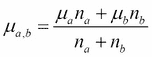

组合平方和是最复杂的计算。在添加平方和时，我们还需要添加一个因子，以说明来自`a`和`b`的平方和可能是通过不同的方法计算的:

```
(defn variance-reducer [{:keys [count mean sum-of-squares]} x]

  (let [count' (inc count)

        mean'  (+ mean (/ (- x mean) count'))]

    {:count count'

     :mean mean'

     :sum-of-squares (+ sum-of-squares

                        (* (- x mean') (- x mean)))}))
```

reducer 要简单得多，它解释了方差折叠是如何通过一次遍历数据来计算方差的。对于每个新记录，从先前的`mean`和当前的`count`重新计算`:mean`值。然后，我们将考虑这个新记录之前和之后的平均值之差的乘积加到平方和上。

最终结果是包含`count`、`mean`和总`sum-of-squares`的地图。因为方差就是`sum-of-squares`除以`count`，我们的`variance-post-combiner`函数是一个相对简单的函数:

```
(defn variance-post-combiner [{:keys [count mean sum-of-squares]}]

   (if (zero? count) 0 (/ sum-of-squares count)))
```

将这三个函数放在一起会产生以下结果:

```
(defn ex-5-16 []

  (->> (load-data "data/soi.csv")

       (r/map :N1)

       (r/fold variance-combiner

               variance-reducer)

       (variance-post-combiner)))

;; 3144836.86
```

由于标准的偏差仅仅是方差的平方根，我们只需要稍微修改一下`variance-post-combiner`函数来计算它。


# 特瑟的数学褶皱

我们现在应该了解如何使用折叠来计算简单算法的并行实现。希望我们还应该对找到高效解决方案所需的独创性有所欣赏，这种解决方案将对数据执行最少次数的迭代。

幸运的是，Clojure 库特瑟(【https://github.com/aphyr/tesser】)包含了常见数学折叠的实现，包括均值、标准差和协方差。为了了解如何使用特瑟，让我们考虑 IRS 数据集中两个字段的协方差:薪水和工资，`A00200`，失业补偿，`A02300`。

## 用特瑟计算协方差

我们在第三章[中遇到了协方差](ch03.html "Chapter 3. Correlation")，*相关性*，它是两个数据序列如何一起变化的度量。公式如下所示:


协方差折叠包含在`tesser.math`中。在下面的代码中，我们将把`tesser.math`作为`m`，把`tesser.core`作为`t`:

```
(defn ex-5-17 []

  (let [data (into [] (load-data "data/soi.csv"))]

    (->> (m/covariance :A02300 :A00200)

         (t/tesser (t/chunk 512 data )))))

;; 3.496E7
```

`m/covariance`函数期望接收两个参数:一个返回`x`值，另一个返回`y`值。因为关键字的作用是从映射中提取相应的值，所以我们只需将关键字作为参数传递。

特瑟的工作方式与 Clojure 的减速器类似，但有一些细微的区别。Clojure 的`fold`负责将我们的数据分成并行执行的子序列。然而，对于特瑟，我们必须明确地将数据分成块。因为这是我们要反复做的事情，所以让我们创建一个名为`chunks`的小助手函数:

```
(defn chunks [coll]

  (->> (into [] coll)

       (t/chunk 1024)))
```

在本章余下的大部分时间里，我们将使用`chunks`函数将输入数据分成多组`1024`记录。

## 交换性

Clojure 的 reducers 和特瑟的 folds 之间的另一个区别是，特瑟不保证输入顺序会被保留。正如我们前面讨论的，除了结合律，特瑟函数还必须是可交换的。交换函数是这样一种函数，如果它的自变量以不同的顺序提供，其结果是相同的:


加法和乘法是可交换的，但减法和除法不是。交换性是用于分布式数据处理的函数的一个有用属性，因为它降低了子任务之间所需的协调量。当特瑟执行一个组合函数时，无论哪个缩减器函数先返回值，它都可以自由地这样做。如果顺序不重要，就不需要等第一个完成。

让我们把我们的`load-data`函数重写为一个`prepare-data`函数，它将返回一个可交换的特瑟折叠。它执行与我们之前的基于 reducers 的函数相同的步骤(解析文本文件的一行，将记录格式化为 map 并删除零邮政编码),但是它不再假设列标题将是文件中的第一行— *first* 是一个明确要求有序数据的概念:

```
(def column-names

  [:STATEFIPS :STATE :zipcode :AGI_STUB :N1 :MARS1 :MARS2 ...])

(defn prepare-data []

  (->> (t/remove #(.startsWith % "STATEFIPS"))

       (t/map parse-line)

       (t/map (partial format-record column-names))

       (t/remove  #(zero? (:zipcode %)))))
```

现在所有的准备工作都在特瑟完成了，我们可以直接传递`iota/seq`的结果作为输入。当我们在本章后面运行分布在 Hadoop 上的代码时，这将特别有用:

```
(defn ex-5-18 []

  (let [data (iota/seq "data/soi.csv")]

    (->> (prepare-data)

         (m/covariance :A02300 :A00200)

         (t/tesser (chunks data)))))

;; 3.496E7
```

在[第 3 章](ch03.html "Chapter 3. Correlation")、*相关性*中，我们看到了在具有一个特征和一个响应变量的简单线性回归的情况下，相关系数是标准差乘积的协方差:

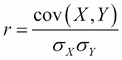

特瑟还包括计算一对属性的相关性的函数:

```
(defn ex-5-19 []

  (let [data (iota/seq "data/soi.csv")]

    (->> (prepare-data)

         (m/correlation :A02300 :A00200)

         (t/tesser (chunks data)))))

;; 0.353
```

这两个变量之间存在适度的正相关关系。让我们建立一个线性模型，使用薪水和工资`A00200`来预测失业补偿的价值`A02300`。

## 与特瑟的简单线性回归

特瑟目前没有提供线性回归折叠，但是它给了我们实现线性回归折叠所需的工具。我们在第 3 章、*相关性*的[中看到，简单线性回归模型的系数(斜率和截距)可以计算为两个输入的方差、协方差和均值的简单函数:](ch03.html "Chapter 3. Correlation")

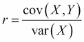

斜率 *b* 是协方差除以 *X* 中的方差。截距是确保回归线穿过两个系列平均值的值。因此，理想情况下，我们能够在数据的单个文件夹中计算这四个变量中的每一个。特瑟提供了两个折叠组合子，`t/fuse`和`t/facet`，用于从更基本的折叠中构建更复杂的折叠。

在我们有一个输入记录和多个要并行运行的计算的情况下，我们应该使用`t/fuse`。例如，在下面的示例中，我们将平均值和标准差合并为一个折叠，该折叠将同时计算两个值:

```
(defn ex-5-20 []

  (let [data (iota/seq "data/soi.csv")]

    (->> (prepare-data)

         (t/map :A00200)

         (t/fuse {:A00200-mean (m/mean)

                  :A00200-sd   (m/standard-deviation)})

         (t/tesser (chunks data)))))

;; {:A00200-sd 89965.99846545042, :A00200-mean 37290.58880658831}
```

这里，我们对地图中的所有字段运行相同的计算；因此，我们应该使用`t/facet`:

```
(defn ex-5-21 []

  (let [data (iota/seq "data/soi.csv")]

    (->> (prepare-data)

         (t/map #(select-keys % [:A00200 :A02300]))

         (t/facet)

         (m/mean)

         (t/tesser (chunks data)))))

;; {:A02300 419.67862159209596, :A00200 37290.58880658831}
```

在前面的代码中，我们只从记录中选择了两个值(`A00200`和`A02300`)，并同时计算了这两个值的`mean`值。回到执行简单线性回归的挑战——我们有四个数字要计算，所以让我们将它们放在一起`fuse`:

```
(defn calculate-coefficients [{:keys [covariance variance-x

                                      mean-x mean-y]}]

  (let [slope     (/ covariance variance-x)

        intercept (- mean-y (* mean-x slope))]

    [intercept slope]))

(defn ex-5-22 []

  (let [data (iota/seq "data/soi.csv")

        fx :A00200

        fy :A02300]

    (->> (prepare-data)

         (t/fuse {:covariance (m/covariance fx fy)

                  :variance-x (m/variance (t/map fx))

                  :mean-x (m/mean (t/map fx))

                  :mean-y (m/mean (t/map fx))})

         (t/post-combine calculate-coefficients)

         (t/tesser (chunks data)))))

;; [37129.529236553506 0.0043190406799462925]
```

非常简洁地将我们想要执行的计算结合在一起。此外，它允许我们指定一个`post-combine`步骤作为融合的一部分。我们可以将结果直接指定为 fold 的一个组成部分，而不是交给另一个函数来完成输出。`post-combine`步骤接收四个结果，并从中计算斜率和截距，将两个系数作为向量返回。

## 计算相关矩阵

我们只比较了两个特征来看它们是如何关联的，但是特瑟使得观察大量目标特征的相互关联变得非常简单。我们将目标特性作为特性名称的映射提供给返回所需特性的输入记录的某个函数。以第三章、[中的为例，我们早就取了身高的对数。这里，我们将简单地按原样提取每个特性，并为每个特性提供人类可读的名称:](ch03.html "Chapter 3. Correlation")

```
(defn ex-5-23 []

  (let [data (iota/seq "data/soi.csv")

        attributes {:unemployment-compensation :A02300

                    :salary-amount             :A00200

                    :gross-income              :AGI_STUB

                    :joint-submissions         :MARS2

                    :dependents                :NUMDEP}]

    (->> (prepare-data)

         (m/correlation-matrix attributes)

         (t/tesser (chunks data)))))
```

特瑟将计算每对要素之间的相关性，并在地图中返回结果。该地图由包含每对特征的名称的元组(两个元素的向量)来键控，并且相关联的值是它们之间的相关性。

如果你现在运行前面的例子，你会发现一些变量之间有很高的相关性。例如，`:dependents`和`:unemployment-compensation`的相关性是`0.821`。让我们建立一个线性回归模型，使用所有这些变量作为输入。


# 梯度下降多元回归

当我们在第 3 章、*相关性*中运行多元线性回归时，我们使用正规方程和矩阵来快速得出多元线性回归模型的系数。正常等式重复如下:

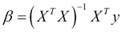

正规方程使用矩阵代数非常快速有效地得出最小二乘估计。在所有数据都适合内存的情况下，这是一个非常方便和简洁的等式。然而，当数据超过单台机器可用的内存时，计算就变得难以处理。其原因是矩阵求逆。的计算不是一次数据折叠就能完成的——输出矩阵中的每个单元都依赖于输入矩阵中的许多其他单元。这些复杂的关系要求以无序的方式处理基准表。

解决线性回归问题和许多其他相关机器学习问题的另一种方法是一种叫做梯度下降的技术。梯度下降将问题重新定义为迭代算法的解决方案，这种算法不是在一个计算非常密集的步骤中计算答案，而是在一系列更小的步骤中向正确答案收敛。

在前一章中，当我们使用 Incanter 的`minimize`函数来计算为我们的逻辑回归分类器产生最低成本的参数时，我们遇到了梯度下降。随着数据量的增加，Incanter 不再是运行梯度下降的可行解决方案。在下一节，我们将看到如何使用特瑟来运行梯度下降。

## 梯度下降更新规则

梯度下降通过一个函数的迭代应用来工作，该函数将参数向其最佳值的方向移动。为了应用这个函数，我们需要知道成本函数在当前参数下的梯度。

计算梯度的公式涉及微积分，超出了本书的范围。幸运的是，由此得出的公式并不难理解:

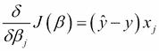

是我们的成本函数 *J(β)* 对于索引 *j* 处的参数的偏导数或梯度。因此，我们可以看到，成本函数相对于索引 *j* 处的参数的梯度等于我们的预测与真实值 *y* 之差乘以索引 *j* 处的值 *x* 。

因为我们试图降低梯度，所以我们想从当前的参数值中减去一定比例的梯度。因此，在梯度下降的每一步，我们执行以下更新:

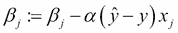

这里，`:=`是分配操作符， *α* 是一个称为**学习率**的因子。学习率控制着我们希望在每次迭代中作为梯度的一部分对参数进行多大的调整。如果我们的预测值 *ŷ* 几乎与实际值 *y* 相匹配，那么就不需要改变参数。相反，较大的误差将导致对参数的较大调整。这个规则被称为 **Widrow-Hoff 学习规则**或 Delta 规则。

## 梯度下降学习率

正如我们所见，梯度下降是一种迭代算法。学习率，通常用 *α* 表示，决定了梯度下降收敛到最终答案的速度。如果学习率太小，收敛将会非常缓慢。如果太大，梯度下降将无法找到接近最佳值的值，甚至可能偏离正确答案:


在上图中，一个小的学习率导致算法多次迭代收敛。虽然该算法确实达到了最小值，但是它要经过比理想情况多得多的步骤，因此可能需要相当长的时间。相比之下，在下图中，我们可以看到学习率过大的影响。参数估计在迭代之间变化如此之大，以至于它们实际上超过了最佳值并偏离了最小值:

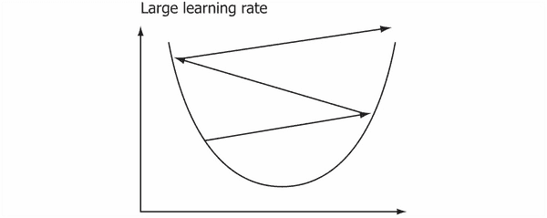

梯度下降算法要求我们在数据集上反复迭代。有了 alpha 的正确版本，每次迭代都应该连续产生理想参数的更好的近似值。当迭代之间的变化非常小时，或者在预定数量的迭代之后，我们可以选择终止算法。

## 特征缩放

随着更多的特征被添加到线性模型中，适当地缩放特征是很重要的。如果要素具有完全不同的比例，梯度下降将不会表现得很好，因为不可能选择一个适合所有要素的学习速率。

我们可以执行的一个简单缩放是从每个值中减去平均值，然后除以标准偏差。这将倾向于产生平均值为零的值，通常在`-3`和`3`之间变化:

```
(defn feature-scales [features]

  (->> (prepare-data)

       (t/map #(select-keys % features))

       (t/facet)

       (t/fuse {:mean (m/mean)

                :sd   (m/standard-deviation)})))
```

上述代码中的特征因子函数使用`t/facet`来计算所有输入特征的`mean`值和标准偏差:

```
(defn ex-5-24 []

  (let [data (iota/seq "data/soi.csv")

        features [:A02300 :A00200 :AGI_STUB :NUMDEP :MARS2]]

    (->> (feature-scales features)

         (t/tesser (chunks data)))))

;; {:MARS2 {:sd 533.4496892658647, :mean 317.0412009748016}...}
```

如果您运行前面的示例，您将看到由`feature-scales`函数返回的不同平均值和标准偏差。由于我们的要素比例和输入记录表示为地图，因此我们可以使用 Clojure 的`merge-with`函数一次性对所有要素进行缩放:

```
(defn scale-features [factors]

  (let [f (fn [x {:keys [mean sd]}]

            (/ (- x mean) sd))]

    (fn [x]

      (merge-with f x factors))))
```

同样，我们可以用`unscale-features`执行最重要的反转:

```
(defn unscale-features [factors]

  (let [f (fn [x {:keys [mean sd]}]

            (+ (* x sd) mean))]

    (fn [x]

      (merge-with f x factors))))
```

让我们扩展一下我们的特性，看看第一个特性。特瑟不允许我们在没有 reduce 的情况下执行 fold，所以我们将暂时使用 Clojure 的 reducer:

```
(defn ex-5-25 []

  (let [data     (iota/seq "data/soi.csv")

        features [:A02300 :A00200 :AGI_STUB :NUMDEP :MARS2]

        factors (->> (feature-scales features)

                     (t/tesser (chunks data)))]

    (->> (load-data "data/soi.csv")

         (r/map #(select-keys % features ))

         (r/map (scale-features factors))

         (into [])

         (first))))

;; {:MARS2 -0.14837567114357617, :NUMDEP 0.30617757526890155,

;;  :AGI_STUB -0.714280814223704, :A00200 -0.5894942801950217,

;;  :A02300 0.031741856083514465}
```

这个简单的步骤将有助于梯度下降对我们的数据执行优化。

## 特征提取

虽然我们在这一章中使用了地图来表示我们的输入数据，但是当运行梯度下降来将我们的特征表示为矩阵时会更方便。让我们编写一个函数，将我们的输入数据转换成一个`xs`和`y`的映射。`y`轴将是标量响应值，而`xs`将是缩放特征值的矩阵。

与前几章一样，我们在返回的特征矩阵中添加了一个偏差项:

```
(defn feature-matrix [record features]

  (let [xs (map #(% record) features)]

    (i/matrix (cons 1 xs))))

(defn extract-features [fy features]

  (fn [record]

    {:y  (fy record)

     :xs (feature-matrix record features)}))
```

我们的`feature-matrix`函数只是接受一个记录的输入和要转换成矩阵的特性。我们从`extract-features`内部调用它，它返回一个函数，我们可以在每个输入记录上调用这个函数:

```
(defn ex-5-26 []

  (let [data     (iota/seq "data/soi.csv")

        features [:A02300 :A00200 :AGI_STUB :NUMDEP :MARS2]

        factors (->> (feature-scales features)

                     (t/tesser (chunks data)))]

    (->> (load-data "data/soi.csv")

         (r/map (scale-features factors))

         (r/map (extract-features :A02300 features))

         (into [])

         (first))))

;; {:y 433.0, :xs  A 5x1 matrix

;;  -------------

;;  1.00e+00

;; -5.89e-01

;; -7.14e-01

;;  3.06e-01

;; -1.48e-01

;; }
```

前面的示例显示了转换为适合执行梯度下降的格式的数据:包含`y`响应变量和一个值矩阵的图，包括偏差项。

## 创建定制的特瑟折叠

梯度下降的每次迭代通过由成本函数确定的量来调整系数。成本函数是通过对数据集中每个参数的误差求和来计算的，因此拥有一个按元素对矩阵值求和的文件夹将会很有用。

Clojure 用一个缩减器、一个合并器和一个从合并器获得的相同值来表示一个折叠，而特瑟折叠被表示为六个协作函数。特瑟`m/mean`折叠的实现如下:

```
{:reducer-identity  (constantly [0 0])

 :reducer           (fn reducer [[s c] x]

                     [(+ s x) (inc c)])

 :post-reducer      identity

 :combiner-identity (constantly [0 0])

 :combiner          (fn combiner [x y] (map + x y))

 :post-combiner     (fn post-combiner [x]

                      (double (/ (first x)

                                 (max 1 (last x)))))}
```

特瑟选择将`reducer`身份与`combiner`功能分开表示，并且还包含了三个其他功能；`combiner-identity`、`post-reducer`和`post-combiner`功能。特瑟的`mean`折叠将一对数字(计数和累加和)表示为两个数字的向量，但在其他方面，它与我们自己的相似。


我们已经在本章前面看到了如何将`post-combiner`函数与`mean-post-combiner`和`variance-post-combiner`函数结合使用。

### 创建矩阵和折叠

为了创建一个定制的`matrix-sum`文件夹，我们需要一个标识值。我们在[第三章](ch03.html "Chapter 3. Correlation")、*关联*中遇到过恒等矩阵，但这是矩阵乘法而不是加法的恒等。如果`+`的单位值是零(因为给一个数加零不会改变它)，那么得出矩阵加法的单位矩阵就是一个零矩阵。

我们必须确保矩阵的大小与我们想要添加的矩阵的大小相同。因此，让我们用矩阵的行数和列数来参数化我们的`matrix-sum`折叠。我们无法预先知道这个函数需要多大，因为 identity 函数是在 fold 中的其他函数之前调用的:

```
(defn matrix-sum [nrows ncols]

  (let [zeros-matrix (i/matrix 0 nrows ncols)]

    {:reducer-identity (constantly zeros-matrix)

     :reducer i/plus

     :combiner-identity (constantly zeros-matrix)

     :combiner i/plus}))
```

前面的例子是完整的`matrix-sum`折叠定义。我们不提供`post-combiner`和`post-reducer`功能；因为，如果省略的话，这些被假定为恒等函数，这就是我们想要的。我们可以使用新的 fold 来计算输入中所有特性的总和，如下所示:

```
(defn ex-5-27 []

   (let [columns [:A02300 :A00200 :AGI_STUB :NUMDEP :MARS2]

         data    (iota/seq "data/soi.csv")]

     (->> (prepare-data)

          (t/map (extract-features :A02300 columns))

          (t/map :xs)

          (t/fold (matrix-sum (inc (count columns)) 1))

          (t/tesser (chunks data)))))

;; A 6x1 matrix

;; -------------

;; 1.67e+05

;; 6.99e+07

;; 6.21e+09

;; ...

;; 5.83e+05

;; 9.69e+07

;; 5.28e+07
```

计算矩阵的和使我们更接近于能够执行梯度下降。给定一些初始系数，让我们使用新的折叠来计算总模型误差。

## 计算总模型误差

让我们再来看一下梯度下降的德尔塔法则:


对于每个参数 *j* ，我们通过总预测误差 *ŷ - y* 乘以特征的某个比例来调整参数。因此，较大的特征比较小的特征获得更大的成本份额，并且被相应地调整更大的量。要在代码中实现这一点，我们需要计算:

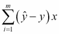

这是所有输入记录的预测误差乘以要素的总和。正如我们之前所做的，我们的预测值 *y* 将使用以下公式为每个输入记录 *x* 进行计算:


系数 *β* 在我们所有的输入记录中都是相同的，所以让我们创建一个`calculate-error`函数。给定转置系数*β*T，我们返回一个将计算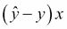的函数。由于 *x* 是一个矩阵，而 *ŷ - y* 是一个标量，结果将是一个矩阵:

```
(defn calculate-error [coefs-t]

  (fn [{:keys [y xs]}]

    (let [y-hat (first (i/mmult coefs-t xs))

          error (- y-hat y)]

      (i/mult xs error))))
```

为了计算整个数据集的误差总和，我们可以简单地在`calculate-error`步骤之后链接我们之前定义的`matrix-sum`函数:

```
(defn ex-5-28 []

  (let [columns [:A02300 :A00200 :AGI_STUB :NUMDEP :MARS2]

        fcount  (inc (count columns))

        coefs   (vec (replicate fcount 0))

        data    (iota/seq "data/soi.csv")]

    (->> (prepare-data)

         (t/map (extract-features :A02300 columns))

         (t/map (calculate-error (i/trans coefs)))

         (t/fold (matrix-sum fcount 1))

         (t/tesser (chunks data)))))

;; A 6x1 matrix

;;  -------------

;; -6.99e+07

;; -2.30e+11

;; -8.43e+12

;;  ...

;; -1.59e+08

;; -2.37e+11

;; -8.10e+10
```

请注意，所有要素的梯度都是负的。这意味着为了降低梯度并产生模型系数的更好估计，必须增加参数。

### 创建矩阵平均折叠

先前代码中定义的更新规则实际上要求将成本的平均值分配给每个特性。这意味着我们需要计算`sum`和`count`。我们不想对数据执行两次单独的传递。所以，正如我们先前所做的，我们`fuse`把两个折叠成一个:

```
(defn ex-5-29 []

  (let [columns [:A02300 :A00200 :AGI_STUB :NUMDEP :MARS2]

        fcount  (inc (count columns))

        coefs   (vec (replicate fcount 0))

        data    (iota/seq "data/soi.csv")]

    (->> (prepare-data)

         (t/map (extract-features :A02300 columns))

         (t/map (calculate-error (i/trans coefs)))

         (t/fuse {:sum   (t/fold (matrix-sum fcount 1))

                  :count (t/count)})

         (t/post-combine (fn [{:keys [sum count]}]

                           (i/div sum count)))

         (t/tesser (chunks data)))))
```

`fuse`函数将返回一张`:sum`和`:count`的地图，所以我们将对结果调用`post-combine`。`post-combine`函数指定了在我们的折叠结束时运行的函数，该函数简单地将总数除以计数。

或者，我们可以创建另一个自定义文件夹来返回平均值，而不是矩阵的序列的和。它与前面定义的`matrix-sum`折叠有很多共同之处，但是，与我们在本章前面计算的`mean`折叠一样，我们也将跟踪处理的记录的计数:

```
(defn matrix-mean [nrows ncols]

  (let [zeros-matrix (i/matrix 0 nrows ncols)]

    {:reducer-identity  (constantly [zeros-matrix 0])

     :reducer           (fn [[sum counter] x]

                          [(i/plus sum x) (inc counter)])

     :combiner-identity (constantly [zeros-matrix 0])

     :combiner          (fn [[sum-a count-a] [sum-b count-b]]

                          [(i/plus sum-a sum-b)

                           (+ count-a count-b)])

     :post-combiner     (fn [[sum count]]

                          (i/div sum count))}))
```

减速器标识是一个包含`[zeros-matrix 0]`的向量。每次减少都会增加矩阵总数，并使计数器加 1。每个合并步骤将两个矩阵和两个计数相加，得到所有分区的总和和计数。最后，在`post-combiner`步骤中，平均值被计算为`sum`和`count`的比值。

尽管自定义折叠的代码比我们融合的`sum`和`count`解决方案更长，但我们现在有了计算矩阵平均值的一般方法。它导致更简洁和可读的例子，我们可以在我们的错误计算代码中使用它，如下所示:

```
(defn ex-5-30 []

  (let [features [:A02300 :A00200 :AGI_STUB :NUMDEP :MARS2]

        fcount   (inc (count features))

        coefs    (vec (replicate fcount 0))

        data     (iota/seq "data/soi.csv")]

    (->> (prepare-data)

         (t/map (extract-features :A02300 features))

         (t/map (calculate-error (i/trans coefs)))

         (t/fold (matrix-mean fcount 1))

         (t/tesser (chunks data)))))

;;  A 5x1 matrix

;;  -------------

;;  4.20e+01

;;  3.89e+01

;;  -3.02e+01

;;  9.02e+01

;;  6.62e+01
```

创建自定义文件夹的额外工作使得调用代码的意图更容易理解。

## 应用梯度下降的单一步骤

计算成本的目的是确定每个系数的调整量。一旦我们计算了平均成本，就像我们之前做的那样，我们需要更新我们的系数 *β* 的估计值。这些步骤一起代表梯度下降的单次迭代:


我们可以在一个`post-combiner`步骤中返回更新的系数，该步骤利用了平均成本、alpha 值和先前的系数。让我们创建一个效用函数`update-coefficients`，它将接收系数和 alpha，并返回一个函数来计算新的系数，给定一个总的模型成本:

```
(defn update-coefficients [coefs alpha]

  (fn [cost]

    (->> (i/mult cost alpha)

         (i/minus coefs))))
```

有了前面的函数，我们就有了打包批量梯度下降更新规则所需的一切:

```
(defn gradient-descent-fold [{:keys [fy features factors

                                     coefs alpha]}]

  (let [zeros-matrix (i/matrix 0 (count features) 1)]

    (->> (prepare-data)

         (t/map (scale-features factors))

         (t/map (extract-features fy features))

         (t/map (calculate-error (i/trans coefs)))

         (t/fold (matrix-mean (inc (count features)) 1))

         (t/post-combine (update-coefficients coefs alpha)))))

(defn ex-5-31 []

  (let [features [:A00200 :AGI_STUB :NUMDEP :MARS2]

        fcount   (inc (count features))

        coefs    (vec (replicate fcount 0))

        data     (chunks (iota/seq "data/soi.csv"))

        factors  (->> (feature-scales features)

                      (t/tesser data))

        options {:fy :A02300 :features features

                 :factors factors :coefs coefs :alpha 0.1}]

    (->> (gradient-descent-fold options)

         (t/tesser data))))

;; A 6x1 matrix

;; -------------

;; -4.20e+02

;; -1.38e+06

;; -5.06e+07

;; -9.53e+02

;; -1.42e+06

;; -4.86e+05
```

得到的矩阵表示梯度下降的第一次迭代后的系数值。

## 运行迭代梯度下降

梯度下降是一种迭代算法，我们通常需要运行多次才能收敛。对于大型数据集，这可能非常耗时。

为了节省时间，我们在名为`soi-sample.csv`的数据目录中包含了`soi.csv`的随机样本。较小的尺寸允许我们在合理的时间尺度内运行迭代梯度下降。下面的代码运行梯度下降 100 次迭代，在一个`xy-plot`上绘制每次迭代之间的参数值:

```
(defn descend [options data]

  (fn [coefs]

    (->> (gradient-descent-fold (assoc options :coefs coefs))

         (t/tesser data))))

(defn ex-5-32 []

  (let [features [:A00200 :AGI_STUB :NUMDEP :MARS2]

        fcount   (inc (count features))

        coefs    (vec (replicate fcount 0))

        data     (chunks (iota/seq "data/soi-sample.csv"))

        factors  (->> (feature-scales features)

                      (t/tesser data))

        options  {:fy :A02300 :features features

                  :factors factors :coefs coefs :alpha 0.1}

        iterations 100

        xs (range iterations)

        ys (->> (iterate (descend options data) coefs)

                (take iterations))]

    (-> (c/xy-plot xs (map first ys)

                   :x-label "Iterations"

                   :y-label "Coefficient")

        (c/add-lines xs (map second ys))

        (c/add-lines xs (map #(nth % 2) ys))

        (c/add-lines xs (map #(nth % 3) ys))

        (c/add-lines xs (map #(nth % 4) ys))

        (i/view))))
```

如果您运行示例，您应该会看到类似如下的图表:


在上图中，您可以看到参数如何在 100 次迭代的过程中收敛到相对稳定的值。


# 使用 Hadoop 扩展梯度下降

批处理梯度下降每次迭代运行的时间长度由数据的大小和计算机的处理器数量决定。虽然并行处理几个数据块，但是数据集很大，处理器是有限的。我们通过并行执行计算实现了速度提升，但是如果我们将数据集的大小加倍，运行时间也会加倍。

Hadoop 是过去十年中出现的几个系统之一，旨在并行处理超出单台机器能力的工作。Hadoop 负责在许多服务器上运行计算，而不是在多个处理器上运行代码。事实上，Hadoop 集群可以由成千上万的服务器组成。

Hadoop 由两个主要的子系统组成——Hadoop 分布式文件系统 ( **HDFS** )和作业处理系统 **MapReduce** 。HDFS 将文件分块存储。给定的文件可能由许多块组成，并且块通常在许多服务器上复制。通过这种方式，Hadoop 可以存储对于任何单个服务器来说都太大的数据量，并且通过复制，确保在发生硬件故障时也能可靠地存储数据。顾名思义，MapReduce 编程模型是围绕 map 和 Reduce 步骤的概念构建的。每个作业至少由一个地图步骤组成，并且可以选择指定一个缩减步骤。一个完整作业可能由几个链接在一起的 map 和 reduce 步骤组成。


在 reduce 步骤是可选的方面，Hadoop 比特瑟有一个稍微灵活的分布式计算方法。在本章的后面以及未来的章节中，我们将探索 Hadoop 必须提供的更多功能。特瑟确实使我们能够将我们的折叠转换成 Hadoop 作业，所以让我们接下来这样做。

## 在 Hadoop 上使用特瑟和跑酷进行梯度下降

特瑟的 Hadoop 功能在`tesser.hadoop`命名空间中可用，我们将其包含为`h`。Hadoop 名称空间中的主要公共 API 函数是`h/fold`。

`fold`函数期望接收至少四个参数，代表 Hadoop 作业的配置、我们想要处理的输入文件、Hadoop 存储其中间文件的工作目录以及我们想要运行的文件夹，引用为 Clojure var。执行 fold 时，提供的任何附加参数都将作为参数传递给 fold。

使用 var 来表示我们的 fold 的原因是，启动 fold 的函数调用可能发生在与实际执行它的计算机完全不同的计算机上。在分布式设置中，var 和参数必须完全指定函数的行为。一般来说，我们不能依靠其他可变的局部状态(例如，原子的值，或者函数上的变量值)来提供任何额外的上下文。

### 跑酷分布式源汇

我们希望 Hadoop 作业处理的数据也可能存在于多台机器上，分散存储在 HDFS 的数据块中。特瑟利用一个名为**跑酷**([https://github.com/damballa/parkour/](https://github.com/damballa/parkour/))的库来处理对潜在分布式数据源的访问。我们将在本章后面和下一章更详细地研究跑酷，但是现在，我们将只使用`parkour.io.text`名称空间来引用输入和输出文本文件。

虽然 Hadoop 被设计为跨许多服务器运行和分布，但它也可以在本地模式下运行。本地模式适合于测试，并使我们能够与本地文件系统进行交互，就像它是 HDFS 一样。我们将在跑酷中使用的另一个名称空间是`parkour.conf`名称空间。这将允许我们创建默认的 Hadoop 配置，并在本地模式下运行它:

```
(defn ex-5-33 []

  (->> (text/dseq "data/soi.csv")

       (r/take 2)

       (into [])))
```

在前面的例子中，我们使用 Parkour 的`text/dseq`函数来创建 IRS 输入数据的表示。返回值实现了 Clojure 的 reducers 协议，所以我们可以对结果使用`r/take`。

### 使用 Hadoop 运行特征比例折叠

Hadoop 在处理任务时需要一个位置来写它的临时文件，如果我们试图覆盖一个现有的目录，它会抱怨。由于我们将在接下来的几个示例中执行几个作业，所以让我们创建一个小的实用函数，用随机生成的名称返回一个新文件。

```
(defn rand-file [path]

  (io/file path (str (long (rand 0x100000000)))))

(defn ex-5-34 []

  (let [conf     (conf/ig)

        input    (text/dseq "data/soi.csv")

        workdir  (rand-file "tmp")

        features [:A00200 :AGI_STUB :NUMDEP :MARS2]]

    (h/fold conf input workdir #'feature-scales features)))
```

Parkour 提供了一个默认的 Hadoop 配置对象，简写为(`conf/ig`)。这将返回一个空配置。默认值就足够了，我们不需要提供任何定制配置。

### 注意

我们所有的 Hadoop 作业都会将它们的临时文件写到项目的`tmp`目录中的一个随机目录中。如果您关心保留磁盘空间，请记住稍后删除此文件夹。

如果您现在运行前面的示例，您应该会得到类似如下的输出:

```
;; {:MARS2 317.0412009748016, :NUMDEP 581.8504423822615,

;; :AGI_STUB 3.499939975269811, :A00200 37290.58880658831}
```

尽管返回值与我们之前获得的值相同，但我们现在在幕后利用 Hadoop 来处理我们的数据。尽管如此，请注意，特瑟将从我们的文件夹中返回响应，作为一个单独的 Clojure 数据结构。

### 使用 Hadoop 运行梯度下降

由于`tesser.hadoop`折叠像`tesser.core`折叠一样返回 Clojure 数据结构，定义一个利用我们的缩放特征的梯度下降函数非常简单:

```
(defn hadoop-gradient-descent [conf input-file workdir]

  (let [features [:A00200 :AGI_STUB :NUMDEP :MARS2]

        fcount  (inc (count features))

        coefs   (vec (replicate fcount 0))

        input   (text/dseq input-file)

        options {:column-names column-names

                 :features features

                 :coefs coefs

                 :fy :A02300

                 :alpha 1e-3}

        factors (h/fold conf input (rand-file workdir)

                        #'feature-scales

                        features)

        descend (fn [coefs]

                  (h/fold conf input (rand-file workdir)

                          #'gradient-descent-fold

                          (merge options {:coefs coefs

                                          :factors factors})))]

    (take 5 (iterate descend coefs))))
```

前面的代码定义了一个`hadoop-gradient-descent`函数，它迭代`descend`函数`5`次。descend 的每次迭代基于`gradient-descent-fold`函数计算改进的系数。最终返回值是一个梯度下降的`5`迭代后的系数向量。

在以下示例中，我们对完整的 IRS 数据运行作业:

```
(defn ex-5-35 []

  (let [workdir  "tmp"

        out-file (rand-file workdir)]

    (hadoop-gradient-descent (conf/ig) "data/soi.csv" workdir)))
```

经过几次迭代后，您应该会看到类似如下的输出:

```
;; ([0 0 0 0 0]

;; (20.9839310796048 46.87214911003046 -7.363493937722712

;;  101.46736841329326 55.67860863427868)

;; (40.918665605227744 56.55169901254631 -13.771345753228694

;;  162.1908841131747 81.23969785586247)

;; (59.85666340457121 50.559130068258995 -19.463888245285332

;;  202.32407094149158 92.77424653758085)

;; (77.8477613139478 38.67088624825574 -24.585818946408523

;;  231.42399118694212 97.75201693843269))
```

我们已经看到了我们如何能够在本地使用分布式技术计算梯度下降。现在，让我们看看如何在我们自己的集群上运行它。

### 为 Hadoop 集群准备代码

Hadoop 的 Java API 定义了`Tool`和相关的`ToolRunner`类，旨在帮助在 Hadoop 集群上执行作业。一个`Tool`类是 Hadoop 的一个通用命令行应用程序的名字，它与 Hadoop 框架交互。通过创建我们自己的工具，我们创建了一个可以提交到 Hadoop 集群的命令行应用程序。

因为它是一个 Java 框架，Hadoop 期望与我们代码的类表示进行交互。因此，定义我们工具的名称空间需要包含`:gen-class`声明，它指示 Clojure 编译器从我们的名称空间创建一个类:

```
(ns cljds.ch5.hadoop

  (:gen-class)

  ...)
```

默认情况下，`:gen-class`希望名称空间定义一个名为`-main`的主函数。这将是 Hadoop 将使用我们的参数调用的函数，因此我们可以简单地将调用委托给实际执行我们的工作的函数:

```
(defn -main [& args]

  (tool/run hadoop-gradient-descent args))
```

Parkour 为 Hadoop 的许多类提供了 Clojure 接口。在这种情况下，`parkour.tool/run`包含了我们在 Hadoop 上运行分布式梯度下降函数所需的所有内容。有了前面的例子，我们需要指示 Clojure 编译器提前(AOT)编译我们的名称空间，并指定我们希望项目的主类是什么类。我们可以通过向`project.clj`函数添加`:aot`和`:main`声明来实现它，如下所示:

```
{:main cljds.ch5.hadoop

 :aot [cljds.ch5.hadoop]}
```

在示例代码中，我们将这些指定为`:uberjar`概要文件的一部分，因为在将作业发送到集群之前，我们的最后一步是将其打包为一个 uberjar 文件。

### 建造 uberjar

一个 JAR 包含可执行的 java 代码。uberjar 包含可执行的 java 代码，以及运行它所需的所有依赖项。uberjar 提供了一种方便的方式来打包要在分布式环境中运行的代码，因为作业可以从一台机器发送到另一台机器，而可以携带它的依赖项。尽管它带来了大量的作业负载，但它避免了确保特定于作业的依赖项预安装在集群中所有机器上的需要。要使用 **Leiningen** 创建 uberjar 文件，请在项目目录中执行以下命令行:

```

lein uberjar

```

一旦你这样做，两个文件将被创建在目标目录中。一个文件`ch5-0.1.0.jar`包含项目的编译代码。这与用`lein jar`生成的文件是同一个文件。此外，uberjar 生成了`ch5-0.1.0-standalone.jar`文件。除了项目的依赖项之外，它还包含 AOT 编译的项目代码。生成的文件很大，但它包含了 Hadoop 作业运行所需的一切。

### 将 uberjar 提交给 Hadoop

一旦我们创建了一个 uberjar 文件，我们就准备把它提交给 Hadoop。拥有一个工作的本地 Hadoop 安装并不是遵循本章示例的先决条件，我们也不会在这里描述安装它所需的步骤。

### 注意

在本书的维基上提供了 Hadoop 安装指南的链接，地址是[http://wiki.clojuredatascience.com](http://wiki.clojuredatascience.com)。

但是，如果您已经安装了 Hadoop 并在本地模式下进行了配置，那么您现在可以在命令行上运行示例作业。由于 main 类指定的工具也接受两个参数——工作目录和输入文件——所以也需要提供这两个参数:

```

hadoop jar target/ch5-0.1.0-standalone.jar data/soi.csv tmp

```

如果该命令成功运行，您可能会看到日志消息作为 Hadoop 进程的输出。一段时间后，您应该会看到作业输出的最终系数。

虽然这会花费更多的时间来执行，但我们的 Hadoop 作业具有优势，它可以分布在一个集群上，该集群可以根据我们拥有的数据大小无限扩展。


# 随机梯度下降

我们刚刚看到的计算梯度下降的方法通常被称为**批量梯度下降**，因为对系数的每次更新都发生在对*单个批量*中所有数据的迭代中。对于非常大量的数据，每次迭代都非常耗时，等待收敛可能需要很长时间。

梯度下降的另一种方法叫做**随机梯度下降**或 **SGD** 。在这种方法中，系数的估计随着输入数据的处理而不断更新。随机梯度下降的更新方法如下所示:


实际上，这等同于批量梯度下降。应用上的区别仅仅在于表达式是在*小批量*上计算的——总体数据的随机较小子集。小批量应该足够大，以代表输入记录的公平样本——对于我们的数据，合理的小批量可能是 250 左右。

随机梯度下降通过将整个数据集分成小批并依次处理每个小批来获得最佳估计值。由于每个小批量的输出是我们希望用于下一个小批量的系数(以便逐步提高估计值)，因此该算法本质上是顺序的。

与批量梯度下降相比，随机梯度下降的优势在于，它只需在数据集上进行一次迭代，就可以获得较好的估计值。对于非常大的数据集，在达到良好的收敛之前，甚至没有必要处理所有的小批量。


我们可以通过利用组合器被串行应用的事实来实现具有特瑟的 SGD，并且将每个块视为可以从中计算系数的小批量。这意味着我们的归约步骤是 identity 函数——我们没有要执行的归约。

相反，让我们以此为契机，了解更多关于如何在跑酷中构建 Hadoop 作业的信息。在深入研究跑酷之前，让我们看看如何利用我们已经知道的东西实现随机梯度下降:

```
(defn stochastic-gradient-descent [options data]

  (let [batches (->> (into [] data)

                     (shuffle)

                     (partition 250))

        descend (fn [coefs batch]

                  (->> (gradient-descent-fold

                        (assoc options :coefs coefs))

                       (t/tesser (chunks batch))))]

    (reductions descend (:coefs options) batches)))
```

前面的代码将输入集合分组为 250 个元素的小组。对这些小批量中的每一个运行梯度下降，并且更新系数。梯度下降的下一次迭代将在下一批上使用新的系数，并且对于适当的α值，产生改进的推荐。

以下代码将绘制数百个批次的输出:

```
(defn ex-5-36 []

  (let [features [:A00200 :AGI_STUB :NUMDEP :MARS2]

        fcount   (inc (count features))

        coefs    (vec (replicate fcount 0))

        data     (chunks (iota/seq "data/soi.csv"))

        factors  (->> (feature-scales features)

                      (t/tesser data))

        options  {:fy :A02300 :features features

                  :factors factors :coefs coefs :alpha 1e-3}

        ys       (stochastic-gradient-descent options data)

        xs       (range (count ys))]

    (-> (c/xy-plot xs (map first ys)

                   :x-label "Iterations"

                   :y-label "Coefficient")

        (c/add-lines xs (map #(nth % 1) ys))

        (c/add-lines xs (map #(nth % 2) ys))

        (c/add-lines xs (map #(nth % 3) ys))

        (c/add-lines xs (map #(nth % 4) ys))

        (i/view))))
```

我们提供的学习速率比批量梯度下降的值小 100 倍以上。这将有助于确保包含异常值的小批量不会将参数拉离其最佳值太远。由于每个小批量中固有的方差，随机梯度下降的输出将不会精确地收敛到最最优参数，而是在最小值附近振荡。

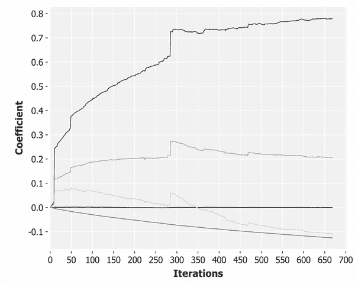

前面的图像显示了随机梯度下降的更随机的效果；特别是小批量之间的方差对参数估计的影响。尽管学习率低得多，但我们可以看到与包含异常值的数据批次相对应的峰值。

## 带跑酷的随机梯度下降

在本章的剩余部分，我们将直接用跑酷来构建一个 Hadoop 任务。跑酷比特瑟暴露了更多 Hadoop 的底层能力，这是一件喜忧参半的事情。虽然特瑟使得在 Hadoop 中编写折叠并将其应用于大型数据集变得非常容易，但 Parkour 将要求我们更多地了解 Hadoop 的计算模型。

尽管 Hadoop 的 MapReduce 方法体现了我们本章迄今为止遇到的许多原则，但它在几个关键方面不同于特瑟的抽象:

*   Hadoop 假设要处理的数据是键/值对
*   Hadoop 不需要遵循映射的 reduce 阶段
*   特瑟对整个输入序列进行折叠，Hadoop 对组进行简化
*   Hadoop 的值组由一个分割器定义
*   特瑟的合并阶段发生在 reduce 之后的*，Hadoop 的合并阶段发生在*reduce 之前的

*最后一种情况尤其不幸。我们所学的 Clojure reducers 和特瑟的术语对于 Hadoop 来说是相反的:对于 Hadoop 来说，在数据被发送到 reducer 之前，合并器聚集来自映射器的输出。*

*我们可以看到下图中表示的主要流程，其中映射器的输出被组合成中间表示，并在发送到 reducers 之前进行排序。每个缩减器缩减整个数据的子集。合并步骤是可选的，事实上，我们在随机梯度下降作业中不需要合并步骤:*

**

*无论有没有合并步骤，数据在被发送到归约器之前都被分类成组，并且分组策略由分割器定义。默认的分区方案是按键/值对的键进行分区(在上图中，不同的键用不同的灰色阴影表示)。事实上，可以使用任何定制的分区方案。*

*可以看到，跑酷和 Hadoop 并没有假设输出是单一结果。由于 Hadoop 缩减的组默认由分组键定义，所以缩减的结果可以是一个包含许多记录的数据集。在上图中，我们展示了三种不同结果的情况，数据中的每个键都有一个结果。*

### *定义映射器*

*我们将定义的 Hadoop 任务的第一个组件是**映射器**。映射器的角色通常是获取大量输入记录，并以某种方式转换它们。可以指定一个没有 reducers 的 Hadoop 作业；在这种情况下，映射器的输出也是整个作业的输出。*

*跑酷允许我们将映射器的动作定义为 Clojure 函数。该函数的惟一要求是它接受输入数据(来自源文件或前一 MapReduce 步骤的输出)作为最终参数。如果需要，可以提供附加参数，只要输入是最后一个参数:*

```
*(defn parse-m

  {::mr/source-as :vals

   ::mr/sink-as   :vals}

  [fy features factors lines]

  (->> (skip-header lines)

       (r/map parse-line)

       (r/map (partial format-record column-names))

       (r/map (scale-features factors))

       (r/map (extract-features fy features))

       (into [])

       (shuffle)

       (partition 250)))*
```

*前面示例中的`map`函数`parse-m`(按照惯例，跑酷地图绘制者带有后缀`-m`)负责获取输入的单行并将其转换为要素表示。我们重用了很多我们在本章前面定义的函数:`parse-line`、`format-record`、`scale-features`和`extract-features`。跑酷将作为一个可简化的集合向映射器函数提供输入，所以我们将把这些函数与`r/map`链接在一起。*

*随机梯度下降期望以小批量处理数据，因此我们的映射器负责将数据划分为 250 行的组。我们在调用`partition`之前先调用`shuffle`，以确保数据的排序是随机的。*

### *跑酷塑形功能*

*我们还以`{::mr/source-as :vals ::mr/sink-as :vals}`地图的形式向`parse-m`函数提供元数据。这是引用`parkour.mapreduce/source-as`和`parkour.mapreduce/sink-as`的两个命名空间的关键字，并且是关于在将数据提供给函数之前应该如何对数据进行整形以及它可以期望返回什么样的数据的跑酷指令。*

*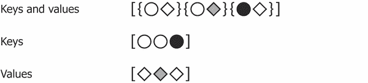*

*跑酷贴图器的有效选项有`:keyvals`、`:keys`和`:vals`。上图显示了三个键/值对的短序列的效果。通过请求我们的数据来源为`:vals`，我们得到一个只包含键/值对的值部分的序列。*

### *定义一个减速器*

*在跑酷中定义一个减速器和定义一个贴图器是一样的。同样，最后一个参数必须是输入(现在，是来自前面 map 步骤的输入)，但是可以提供其他参数。我们用于随机坡度下降的跑酷减速器看起来像这样:*

```
*(defn sum-r

  {::mr/source-as :vals

   ::mr/sink-as   :vals}

  [fcount alpha batches]

  (let [initial-coefs (vec (replicate fcount 0))

        descend-batch (fn [coefs batch]

                        (->> (t/map (calculate-error

                                     (i/trans coefs)))

                             (t/fold (matrix-mean fcount 1))

                             (t/post-combine

                              (update-coefficients coefs alpha))

                             (t/tesser (chunks batch))))]

    (r/reduce descend-batch initial-coefs batches)))*
```

*我们的输入像以前一样作为一个可简化的集合提供，所以我们使用 Clojure 的 reducers 库来迭代它。我们使用的是`r/reduce`而不是`r/fold`，因为我们不想对数据并行执行缩减。事实上，使用 Hadoop 的原因是我们可以独立地控制每个 map 和 reduce phases 的并行性。现在我们已经定义了 map 和 reduce 步骤，我们可以通过使用`parkour.graph`名称空间中的函数将它们合并到一个作业中。*

### *使用跑酷图指定 Hadoop 作业*

*`graph`命名空间是 Parkour 定义 Hadoop 作业的主要 API。每个作业必须至少有一个输入、一个映射器和一个输出，我们可以用 Clojure 的`->`宏链接这些规范。让我们首先定义一个非常简单的作业，它从我们的映射器获取输出，并立即将它们写入磁盘:*

```
*(defn hadoop-extract-features [conf workdir input output]

  (let [fy       :A02300

        features [:A00200 :AGI_STUB :NUMDEP :MARS2]

        fcount   (inc (count features))

        input   (text/dseq input)

        factors (h/fold conf input (rand-file workdir)

                        #'feature-scales

                        features)

        conf (conf/ig)]

    (-> (pg/input input)

        (pg/map #'parse-m fy features factors)

        (pg/output (text/dsink output))

        (pg/execute conf "extract-features-job"))))

(defn ex-5-37 []

  (let [workdir  "tmp"

        out-file (rand-file workdir)]

    (hadoop-extract-features (conf/ig) "tmp"

                             "data/soi.csv" out-file)

    (str out-file)))

;; "tmp/1935333306"*
```

*前面示例的响应应该是项目的`tmp`目录中的一个目录，Hadoop 将在这里编写文件。如果您导航到该目录，您应该会看到几个文件。在我的电脑上，我看到四个文件——`_SUCCESS`、`part-m-00000`、`part-m-00001`和`part-m-00002`。文件`_SUCCESS`的出现表明我们的任务成功完成。`part-m-xxxxx`文件是我们输入文件的一部分。*

*有三个文件的事实表明 Hadoop 创建了三个映射器来处理我们的输入数据。如果我们在分布式模式下运行，这些可能是并行创建的。如果你打开其中一个文件，你应该会看到一长串的`clojure.lang.LazySeq@657d118e`。因为我们写入了一个文本文件，所以它是映射器数据输出的文本表示。*

### *用跑酷图链接映射器和减速器*

*我们 T2 真正想做的是链接我们的地图，减少一个接一个发生的步骤。为此，我们必须插入一个中间步骤，即**划分器**，并告诉划分器如何序列化我们的`clojure.lang.LazySeqs`。*

*后者可以通过借鉴特瑟来实现，它使用 **Fressian** 实现任意 Clojure 数据结构的序列化和反序列化。在下一章中，我们将更深入地了解 Parkour 为我们的分区数据创建定义良好的模式所提供的支持，但是现在，对于分区器来说，传递编码数据就足够了。*

### *注意*

*Fressian 是一种可扩展的二进制数据格式。你可以从 https://github.com/clojure/data.fressian 的文档中了解更多。*

*我们的键将被编码为`FressianWritable`，而我们的键根本没有被指定(我们像`vals`一样接收我们的地图数据)。Hadoop 对 nil 的表示是一种`NullWritable`类型。我们在我们的名称空间中导入两者，使用:*

```
*(:import [org.apache.hadoop.io NullWritable]

         [tesser.hadoop_support FressianWritable])*
```

*将导入到位置后，我们可以完整地指定我们的作业:*

```
*(defn hadoop-sgd [conf workdir input-file output]

  (let [kv-classes [NullWritable FressianWritable]

        fy       :A02300

        features [:A00200 :AGI_STUB :NUMDEP :MARS2]

        fcount   (inc (count features))

        input   (text/dseq input-file)

        factors (h/fold conf input (rand-file workdir)

                        #'feature-scales

                        features)

        conf (conf/assoc! conf "mapred.reduce.tasks" 1)]

    (-> (pg/input input)

        (pg/map #'parse-m fy features factors)

        (pg/partition kv-classes)

        (pg/reduce #'sum-r fcount 1e-8)

        (pg/output (text/dsink output))

        (pg/execute conf "sgd-job"))))*
```

*我们需要确保只有一个缩减器处理我们的小批量(尽管 SGD 有变化，允许我们对几次随机梯度下降运行的结果进行平均，但我们希望得到一组接近最优的系数)。我们将使用跑酷的`conf`命名空间来`assoc! mapred.reduce.tasks`到`1`。*

*在 map 和 reduce 步骤之间，我们指定了分割器并传递了在函数顶部定义的`kv-classes`函数。最后一个示例只是运行这个作业:*

```
*(defn ex-5-38 []

  (let [workdir  "tmp"

        out-file (rand-file workdir)]

    (hadoop-sgd (conf/ig) "tmp" "data/soi.csv" out-file)

    (str out-file)))

;; "tmp/4046267961"*
```

*如果您导航到作业返回的目录，您现在应该看到一个只包含两个文件的目录— `_SUCCESS`和`part-r-00000`。一个文件是每个缩减器的输出，所以用一个缩减器，我们最终得到一个`part-r-xxxxx`文件。在这个文件中是用随机梯度下降法计算的线性模型的系数。*

*

# 总结

在这一章中，我们学习了一些分布式数据处理的基本技术，并了解了本地用于数据处理的函数 map 和 reduce 是如何处理大量数据的强大方法。我们了解了 Hadoop 如何通过在较小的数据子集上运行函数来不受任何单个服务器的能力限制地扩展，这些数据的输出本身组合起来最终产生一个结果。一旦您理解了权衡，这种处理数据的“分而治之”的方法就是一种简单且非常通用的大规模数据分析方法。

我们看到了使用 Clojure 的 reducers 和特瑟处理数据的简单折叠的能力和局限性。我们还开始探索跑酷如何暴露更多 Hadoop 的底层功能。

在下一章中，我们将看到如何使用 Hadoop 和 Parkour 来解决一个特定的机器学习挑战——对大量文本文档进行聚类。*