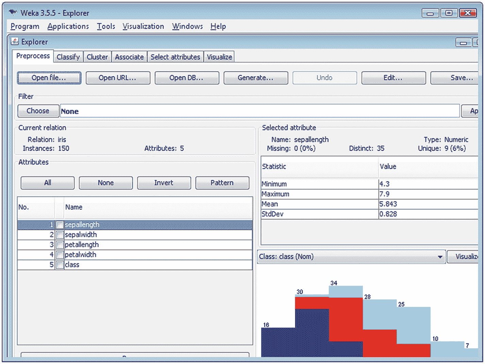

# 10.雇佣和管理数据科学家

我们已经讨论了为什么您应该雇用数据科学家，以及它将为您的业务带来的众多好处。我们还研究了为什么让他们做自己的工作而不需要你去指导他们是很重要的。但要做到这一点，你需要雇佣一个你可以信任的人。

在这一章中，我们将确切地了解如何雇佣和管理数据科学家，以获得最佳结果。首先，让我们试着更好地理解数据科学家。

## 一个数据科学家的想法

一个称职的数据科学家需要拥有大量的知识和广泛的技能，但某些技能比其他技能更重要。

如图 [10-1](#Fig1) 所示，一名数据科学家需要黑客技能、数学和统计知识以及实质性的专业知识。虽然每项技能单独来说都非常有价值，但如果他们只具备三项中的两项，他们就不是数据科学家，而且在特定情况下，这实际上会导致问题。

图 10-1

The data science Venn diagram

### 代码破解技巧

好吧，所以当我说代码黑客技能时，我不是在说闯入 NASA，但事实是，一名数据科学家需要具备出色的计算机知识和体面的编程技能。这并不意味着他们需要计算机科学学位，因为有很多优秀的“黑客”在他们的生活中从未上过一门计算机课程。

然而，数据科学家需要能够进行算法思考，理解矢量化操作，并在命令行处理文本文件。没有这些技能，就不可能成为数据科学家。在大多数情况下，数据科学家生产的代码的实际质量不一定是生产级别的。这就是为什么我们使用术语代码黑客，而不是软件工程，因为后者意味着代码应该是非常高的标准。数据科学家使用代码作为工具，以便找到问题的解决方案。然而，如果你找到一个可能也有非常好的编码技能的数据科学家，这不会有什么坏处。

### 数学和统计知识

一旦这些黑客技术被用来使数据成形，就该对其进行分析并提取见解了。为此，数据科学家需要具备数学和统计知识，以便能够应用正确的方法和模型。

同样，数据科学家不需要统计学博士学位就能有效地工作，但他们必须知道如何开发和使用数学和统计模型，包括如何解释结果。

### 领域知识

领域知识对数据科学家来说很重要:需要理解主题，而不仅仅是它的技术方面。虽然这不是一个硬性要求，但是缺乏领域知识会导致各种各样的问题(我们已经看到了一些例子，后面还会有更多)。领域专业知识允许数据科学家将其他技能应用于数据，从而达到预期目标。数据科学家必须自学某个领域的特性，每次他们着手解决以前从未遇到过的领域的问题。

### 两个不够

只有其中两种技能/知识是不够的。一个有数学和统计学知识但没有实质性专业知识的有能力的黑客非常适合机器学习。然而，他们的技能不会使他们成为数据科学家。

同样，如果有人有实质性的专业知识，懂得数学和统计学，那么他们可能会关注传统研究。这种交叉基本上是学术界的组成部分——尽管应该注意的是，年轻的研究人员正在选择发展和学习更多的技术。然而，没有那些黑客技术，他们永远也成不了数据科学家。

当你有一个熟练的黑客并且有实质性的专业知识时，真正的问题就出现了。它创造了一个危险的人，因为他们知道的足够创建一个看起来合理的分析，但是他们不知道他们是如何得出他们的结论或者他们实际上创建了什么。

从本质上讲，这些人有能力对问题进行分析，但缺乏理论基础来确保他们做的是正确的事情。因此，他们可能会进行统计测试，但可能会做出错误的假设。然而，由于他们认为他们的决策是基于数据，他们有一种错误的自信感，这可能导致严重的问题。

所以，请记住，一个有能力的数据科学家将是一个熟练的黑客，拥有数学和统计知识，并且在你选择的领域也有实质性的专业知识。

## 数据科学家的动机是什么？

与某人有效合作意味着了解他们是谁，他们的动机是什么。不幸的是，人们可能很难理解数据科学家，正是因为他们拥有如此广泛的技能，以至于无法将其整齐地放入一个盒子中。

数据科学家不仅仅是懂数学和统计学，能像专家一样操作计算机的人。这些人也有很好的沟通和可视化技能，使他们能够很好地与高级管理层沟通，并有效地讲述一个故事。他们还对业务充满热情，对数据充满好奇。他们不断地想要学习更多，他们想要解决问题和影响事情，而没有通常伴随这个角色的权威。他们是具有战略眼光、积极主动、富有创造力和创新精神的人，喜欢与他人合作。

他们绝对喜欢精神刺激，解决问题是他们的饭碗。他们有天生的好奇心和成长的动力，这意味着他们喜欢学习新的东西和获得新的技能。

事实是，学习新技能是当今市场不可或缺的组成部分。这是红皇后的种族或假说在起作用，本质上是说一个有机体必须不断适应、进化和繁殖才能生存。

## 什么会让数据科学家离职？

如果你给你的数据科学家很多重复性的工作，你最终会得到一个非常懒散的人。因此，如果他们不得不花费大量的时间清理数据或做其他类似于数沙子的事情，你将会遇到一个真的不想待在那里的人。结果会受到影响。

同样，如果他们因为你要求他们解决的问题太简单而感到厌烦，你也不会赢得任何分数。当然，有时需要解决简单的问题，但如果你打算进行一次飞跃，雇佣一名数据科学家，请确保充分利用他们的能力。否则就像雇了一个米其林星级厨师给你做了一个烤奶酪三明治。

危险在于，出于无聊，厨师会突然转向，给你一个烤奶酪三明治，这个三明治被解构和重构，直到它与你想要的简单三明治几乎没有共同之处。

还有，另一个问题源于沟通问题。当上层管理人员不理解数据科学家在做什么时，沟通中经常会出现摩擦。

一个简单的例子是，由于在数据应该如何存储的问题上与开发人员沟通不畅，数据科学家最终进行了大量的数据争论，这非常无聊。

回到我们的米其林星级厨师比喻，赫斯顿·布鲁门塔尔是一个世界知名的厨师，他的主要“东西”是分子美食学。他使用了一系列在厨房里并不常见的工具和原料。假设你雇用他为一个活动提供餐饮服务，他告诉你他需要什么，但因为你不了解他的流程，你只是在厨房里放了所有常用的工具和原料。

当他来做饭时，他最终不得不做一顿对他来说完全无聊的传统饭菜，这样做出来的食物可能还不错，但质量远远达不到他本可以做的水平。

## 当一名数据科学家在找工作时

现在对于初级以上的优秀数据科学家来说，这是一个卖方市场，数据科学家是卖方——你知道，因为他们出售他们的技能和专业知识。事实是，对技术人才的需求很大，但供给远远不足以满足需求。

例如，伦敦的一名数据科学家平均每周会收到一到十条招聘信息或电话。这意味着他们在选择做什么项目时处于有利地位。

因此，为了提高你雇用合适人选的机会，你需要了解数据科学家想要什么。

### 数据科学家想要什么？

第一件事当然是赔偿。毕竟，数据科学家也是人——即使他们的技能和可用性有时会让他们看起来像是神话中的野兽——他们不仅需要钱来生活，而且他们希望自己的价值得到适当的补偿。

然而，仅仅提供令人兴奋的薪水是不够的，因为其他事情也很重要，例如他们将与哪个团队合作，他们将处理的问题，他们将使用的技术栈，以及与学术界的关系。

#### 接缝

一些数据科学家更喜欢在团队中工作，他们喜欢与他们一起工作的人。这通常意味着极客，不太正式的文化，甚至在家工作。

当然，这并不一定适用于每家公司，因为你不可能在一夜之间为你正在招聘的数据科学家改变你的整个文化，但你可以尝试在可能的情况下做出让步，以改善工作关系。

#### 问题是

虽然我们已经讨论了将过于简单的问题交给数据科学家的危险，但您也会发现许多数据科学家对特定类型的问题有偏见。例如，一些人可能更喜欢解决具有社会影响的问题，而另一些人可能坚持他们喜欢的领域的问题，如医学。

其他时候，他们可能有与问题本身相关的偏好。例如，有些人更喜欢处理文本数据。

不过，通常情况下，你会发现它与做和学习新事物密切相关，这是定义数据科学家的一个特征。

#### 技术堆栈

正在使用的技术也将发挥重要作用。一些数据科学家更喜欢使用他们已经熟悉的堆栈，而其他人则希望学习新的东西。然而，你会发现大多数数据科学家会像躲避瘟疫一样避开旧技术和遗留代码。

有时候，学习新技术对数据科学家来说非常重要。这可能是因为一些新兴的技术正在主导这个领域，比如 Python，例如，他们可能想从 MATLAB 过渡到 Python 和 R。

或者，数据科学家可能希望扩展他们的技能组合，因为一些技术提供了更好的报酬，也更有趣，例如与深度学习相关的技术。

#### 与学术界的关系

许多数据科学家来自学术界，习惯于阅读/写论文和参加会议。这对每个人来说都是一个优势，因为会议可能是掌控全局的重要部分。因此，激励数据科学家的一种方式是为会议提供津贴。

而且，正如我已经说过的，它也将帮助您，因为您的数据科学家将了解数据科学中的新兴发展，他们将了解他们以前不知道的领域或应用程序，并且他们将赶上他们领域中的其他人。

博士级别的数据科学家可能会参加的一些数据科学会议包括

*   ICML[1](#Fn1)—机器学习国际会议
*   neur IPS[2](#Fn2)—神经信息处理系统
*   SIGKDD[3](#Fn3)——ACM 知识发现与数据挖掘国际会议
*   ECML PKDD——数据库中的机器学习和知识发现欧洲会议
*   AI 统计 [4](#Fn4)

### 避免传统限制

雇用数据科学家的一个常见问题是，雇主通常会采取与雇用企业中任何其他角色相同的方法。这通常包括询问这个人是否在某个特定领域有经验。

然而，许多数据科学家，包括我自己，专门寻找他们以前没有工作过的领域。这都是关于学习新事物和避免无聊的动力，因为你以前没有做过的事情肯定会比你正在经历的事情更有趣。

作为一名潜在雇主，你需要明白的重要一点是，数据科学家使用的技术具有普遍适用性，领域本身是次要的。换句话说，不要因为他们在你的特定领域没有经验而错过雇佣一个伟大的数据科学家。

### 数据科学是一个通用工具箱

数据科学中的技术可以应用于各种问题。一件事的经验可以转化为另一件事的经验。因此，举例来说，一个数据科学家可能能够使用相同的算法来预测疾病的爆发，以及有多少人会点击一个广告。

把它想象成糕点师。他们学习各种各样的技术，包括制作不同种类的面团，制作酱料，制作奶油等等。而且他们有很多做蛋糕的经验。然而，因为他们对这些技术非常有经验，他们可以很容易地从做蛋糕转到做馅饼。

例如，我看到人力资源部门犯的一个常见错误是

*   “我们正在寻找一个在 TensorFlow 有 5 年经验的人，”人力资源部说。
*   “好吧，但是 TensorFlow 才出现了两年，”候选人甚至招聘公司回答道。

对于数据科学家来说，他们的知识广度通常是他们技能的更好指标，而不仅仅是经验。

问题是许多雇主不了解数据科学家的技能，当然不是你，因为你正在读这本书，现在对数据科学和数据科学家的工作有了更多的了解。结果是，由于缺乏了解，许多数据科学家陷入了特定的领域。

让我们以一位从事金融工作的数据科学家为例。在金融领域，数据科学将采用时间序列和预测建模等工具。然而，这些工具不仅限于金融领域。它们在许多其他领域也同样有效，例如在运动改善甚至零售领域。例如，在零售业中，您可以使用时间序列来预测需求。

然而，许多雇主会看到数据科学家有金融方面的经验，并会自动假定他或她的技能组合只适用于金融。这意味着他们可能会错过一位了不起的数据科学家。

所以，不要犯同样的错误，给这些人一个机会，即使他们不符合你心目中完美雇佣的严格模式。

### 发现年轻人才

数据科学有点像体育，因为人才发挥着巨大的作用，特别是因为它需要技术技能和软技能的结合，正如我们之前讨论的那样。这个人需要能够读懂其他人，建立其他人看不到的联系，并且能够很好地沟通，超越他们技能的技术层面。他们还必须能够顺利地整合他们的软技能和技术技能，这并不总是像听起来那么容易。

所以，当你找到一个很有能力做这项工作的人时，用双手抓住他们，即使他们才刚刚开始职业生涯。请记住，如果你给他们机会并培养他们，今天是初级数据科学家的人可以成为你未来的高级数据科学家。

如何才能找到有天赋的年轻数据科学家？首先，你想了解教授这门课程的顶尖大学。然后，一旦你确定了潜在的候选人，不要局限于他们的大学工作。你可以在 GitHub [5](#Fn5) 这样的网站上寻找他们做过的任何外部工作。

你也应该考虑创建一个导师项目。这将使你能够发现有数据科学天赋的人，其中一些人你可能没有意识到他们有这方面的才能，直到你与他们近距离地工作。

### 几个典型的数据科学家困境

对于数据科学家来说，他们面临着为谁工作的两难境地。选择是一家初创公司还是一家更大的公司。每一种都有自己的优缺点。

首先，是创业公司。谈到创业公司，对于数据科学家来说，事情肯定会更有趣。他们将处理新技术和新问题，他们将有更多的灵活性。然而，不利的一面是，他们可能会得到更少的报酬，稳定性可能是一个问题，因为毕竟，许多创业公司不会成功。

然后是大公司。主要的优势是薪水会更高，福利待遇也会更好。还有稳定性的问题。一家大公司不太可能一夜之间破产，而让一名数据科学家陷入困境。

然而，在光谱的另一端，事实是数据科学家可能最终会沮丧地拔掉自己的头发，因为工作会很无聊，而且远没有你能得到的刺激，因为他们将处理旧技术和遗留代码，他们必须清理它们。所以，不，这一点都不好玩。一点也不。

### 立即冻结您的数据科学家招聘计划

如果你的公司还没有为数据科学做好准备，你需要停止雇佣数据科学家。为数据科学做好准备意味着什么？

首先，你需要确保你的公司有数据驱动的文化。组织中的每个人都需要了解数据的价值，并且愿意有效地使用数据。

如果每个人都认为数据是浪费时间，或者只是你正在做的事情，因为它是最新的“时尚”，那么你将浪费金钱和时间来雇佣数据科学家。

不过不要担心，因为稍后我们将讨论如何建立数据科学文化，您将确切知道您需要做什么。

接下来要考虑的是你是否有可用的数据。如果你还没有收集数据，那么你不妨等到你有了数据。否则，你就要付钱给一个数据科学家，让他坐在那里看起来很漂亮。这也会引起数据科学家的反感，因为正如我已经提到的，无聊是他们最讨厌的事情之一。一个无事可做的数据科学家是一个无聊的数据科学家，他最终可能会比你眨眼的速度更快地离开你的公司。

最后，您需要确保数据科学家的工作会产生影响。只是雇人让数据看起来很漂亮，这样你就可以炫耀，但仅此而已，这是对资源的浪费。你需要确保心中有一个明确的目标，这是一个需要回答的重要问题，否则你将浪费自己和数据科学家的时间。

当你雇佣数据科学家时，不要把他们仅仅作为一个高度复杂的报告工具。他们远不止这些，你需要倾听他们的想法，相信他们的建议。不要错误地认为你什么都知道。

毕竟，你会告诉你的电工如何为你的房子重新布线吗？或者你会告诉你的外科医生如何给你做手术吗？当然不是。你会让他们做他们的工作，接受他们的建议，因为他们是专家。那么，您为什么要与您的数据科学家做任何不同的事情呢？

你也需要让他们展开翅膀。如果他们想用全新的方法解决问题，不要惊慌。仅仅因为它不符合你的想法并不意味着它没有效果。事实上，尝试新事物是找到最有效解决方案的最佳方式。

记住，一遍又一遍的做同样的事情，却期待不同的结果，这就是精神错乱的定义。因此，您需要给数据科学家尝试新事物的自由。

只是让你对事情有一个更全面的认识，如果你还没有准备好，为什么不应该雇佣一个数据科学家；我记得前阵子有个情况，一个公司招了一个数据科学家。然而，这位数据科学家在仅仅两个月后就辞职了，他们这样做的时候并不开心。

事情是这样的，公司没有任何数据可供科学家研究。他们仍在收集信息，但他们操之过急了，不知何故认为他们需要一位数据科学家在他们仍在收集信息时显得漂亮。

然而，更糟糕的是，他们没有一个明确的目标。他们只是想要洞察力，这对于任何人来说都是一个太模糊的目标。当然，没有明确的目标，你可以想象数据收集过程也没有达到标准。

老实说，我很确定这位数据科学家不是因为无聊才辞职的——尽管这是一个问题。他可能知道他将不得不与不理解他所做的人打交道。他必须教育他们，然后强迫他们设定一个目标，然后试着把一堆随机数据转化成他能处理的东西。这会引起更多的麻烦，不值得。

## 数据科学部落

现在我们来看看不同类型的数据科学家。我称他们为部落，因为我觉得这是描述数据科学中不同人群的一个非常好的词。你不只有一种类型的人，因为你不只有一种方式成为数据科学家。

这不像成为一名医生，你唯一的道路是去医学院，然后做住院医师，并获得认证。对于数据科学家来说，有几种方法可以达到相同的最终结果。

这就是为什么我相信我们基本上可以把数据科学家分成三个主要的部落和三个更小的部落。

就主要群体而言，我们有计算机科学家、统计学家和来自其他领域的定量专家。

较小的群体包括自学的数据科学家、软件平台用户和领域专家。

这里还需要注意的是，数据科学家和数据工程师现在被认为是完全不同的两个角色，即使在早期这两个角色经常被混淆，即使数据科学家通常有计算机科学背景，但也有一些数据工程技能。

### 主要部落

所以，让我们快速看一下三个主要部落，即计算机科学家、统计学家和其他定量专家。

#### 计算机科学家

计算机科学家是拥有计算机科学学位，然后在机器学习领域获得硕士或博士学位的人。优势是他们通常在编码、数据库和软件方面有非常好的技能，但问题是他们通常在理论上忽略传统的统计技术，而这些技术在一些特定的领域和问题中是有用的。

计算机科学家非常擅长机器学习任务中的问题，如预测建模。他们经常会有卡格尔比赛的经验，这是这类问题的典型例子。

请注意，Kaggle 是一个运行预测建模和分析竞赛的平台。公司和用户上传数据集，然后统计学家、数据科学家和/或其他专家竞相创建最佳模型来预测和描述这些数据集。这是一种众包形式，依赖于这样一种想法，即在预测建模任务中可以采用无数种策略，人们无法提前知道哪个分析师或方法将是最好的。Kaggle 现在是谷歌云的一部分。 [7](#Fn7)

给你一个数据集，你只想找到一个好的算法来预测一些事情。事实上，大多数计算机科学家都有扎实的编码技能，这意味着他们的工作更容易与平台的其余部分集成，尤其是如果你是一家小公司或初创公司。大多数人将使用 Python，编写自己的 API 不会有任何问题。所以，本质上，你可以利用他们的技能同时做很多事情，因为他们可以写代码，也可以集成代码。

此外，他们有扎实的数据库技能，所以他们可以做大量的数据工程工作。如果你有自己的数据工程师，这仍然是值得的，因为这些人很容易检索数据，把它变成有用的东西，等等。这将节省开发人员的时间。他们也许还能提出关于数据库结构的建议，让您的生活更加轻松。

然而，他们缺乏适当的统计学知识，所以对于一些需要统计学的特殊问题，比如研究设计，这些人真的帮不了你。

#### 统计学家

统计学家通常拥有统计学学位。他们甚至可能拥有统计学或机器学习方面的硕士或博士学位。他们通常在该领域有很好的理论基础，但他们没有编码或数据库技能。

统计学家有非常扎实的统计和理论知识。如果你对研究设计或统计建模感兴趣，他们是最好的人选，因为你想知道事情背后的驱动因素。

如果您想对高级复杂问题建模，同时确保建模过程是透明的，并且您了解正在发生的事情，那么它们也是最佳选择。

由于在数学和理论方面的严格训练，他们也非常擅长以批判的眼光看待其他数据科学家的工作。

然而，问题是，大多数时候他们并不真正具备很好的编码和数据库技能。他们最有可能使用的语言是 R，他们将把它作为一种工具。他们可能在其他语言或数据库方面没有任何经验，这将使他们在系统内整合工作更加困难和耗时。

此外，一些统计学家在预测建模方面没有受过多少培训。就其本身而言，预测建模很少被认为在统计学的背景下是重要的，并且更符合机器学习。

所以，查查他们有没有卡格尔的经历。如果你有兴趣使用他们的技能进行预测建模，确保他们熟悉某种机器学习概念也是值得的，比如交叉验证。

#### 其他定量专家

最后，我们有我所说的其他定量专家。这些人来自重数学的学科，如物理学、数学、精算学、计量经济学等等。这些人可能拥有硕士或博士学位，但这不会是在机器学习或统计领域。

这些人基本上是发现数据科学比他们的研究领域有更多(和更好的工作)的人，他们正试图改变职业生涯。他们试图利用他们在数学和/或编码方面的知识来实现这一目标。你会看到这个部落在技能和知识方面的巨大差异。

这些定量专家有点特殊，因为他们通常拥有一些扎实的技能，并带来了在数据科学中非常重要的多元化思维。此外，如果你正在处理的问题属于他们的特定领域，他们绝对是值得雇佣的优秀人才。

然而，问题是他们往往缺乏机器学习或统计方面的严格培训，这在某些情况下可能会造成严重的问题。

因此，当涉及到其他定量专家时，它往往是主观的，因为它取决于个人。然而，主要的缺点是这些人往往缺乏该领域的正规教育。

他们倾向于自学，你需要了解这一事实，并检查他们的有效性。例如，你可以在 GitHub 或 Kaggle 上找到他们工作的例子。你真的想事先检查一下。请注意，自学并不是一件坏事——远非如此。然而，你需要检查以确保他们的技能符合你的需求。

这些人通常只研究了一个领域，却发现收入并不丰厚，或者根本不可能找到工作。然后，他们发现成为一名数据科学家会带来丰厚的收入，因此化学家可能会决定，例如，创建一些迷你项目，将它们上传到 GitHub，或者参加 Kaggle 上的一些比赛，以试图找到一份数据科学家的工作。

根据我的经验，在这些人拥有的所有专业中，我发现最有效的人是物理学家。物理学充满了应用数学，这使得他们很容易阅读机器学习论文，特别是因为它在本质上是相同类型的数学。此外，物理学家需要能够自己编写一点代码，因此这种技能类似于机器学习所需的技能。

需要注意的重要一点是，领域专家在各自的领域都有专长，这可能会对你有用。例如，你可能想雇用一个在计量经济学方面有一些经验和一点机器学习知识的人，因为你的问题在某种程度上与计量经济学有关。或者，你可能想雇用一名物理学家，因为你正在处理传感器数据或雷达数据。

然而，你必须小心这些定量专家，因为他们中的一些人会试图伪装。他们将在两周内完成一些教程和在线课程，突然间，他们相信自己是数据科学家。那只是因为他们想得到这份工作。你必须非常小心这些人，因为他们会破坏你的整个项目，引发很多问题。

这并不意味着你不应该考虑那些没有什么经验，但诚实面对并证明自己聪明且愿意学习的人。他们希望获得更多的经验，并且是有潜力成为杰出数据科学家的聪明人。

然而，在我看来，最好是让这些人担任初级职位，并让更有经验的人来监督他们。当然，监督他们的人应该是高级数据科学家。如果你没有高级数据科学家，先雇一个。然后，你可以跟着他们大三的进度，看看他们是怎么成长的。根据他们的发展，你可以选择提升或不提升他们。

#### 辐合点

值得注意的是，在经历了大约 5 到 6 年之后，所有的部落通常会有一个汇合点。换句话说，当一个人获得了多年的经验，参与了相当多的项目——比如说 10 到 30 个——并且在不同领域的不同公司工作过，他们通常会学到广泛的技能。如果他们有博士学位，那只是额外的奖励。

所以，他们会用 R 和 Python 两种语言编写一些代码，他们会学一点这个，一点那个，几乎所有的东西都学一点。他们也非常清楚外面有什么。这意味着他们知道所有可用的方法和技术，即使他们自己不知道如何实现它们。

这很重要，因为他们知道问题应该如何解决。即使他们自己不知道怎么做，他们也会知道该和谁说话，该雇佣谁来完成工作。有时候，拥有技能本身并不重要，重要的是要意识到自己的局限性，并了解有哪些解决方案可用，以及如何联系能够实施这些解决方案的人。

因此，如果你看到某人开始是一名物理学家，但已经在数据科学领域工作了 10 年，并在广泛的领域为许多公司工作，那么这就是可能属于这一类别的人。

因此，当你找到一个有丰富经验的人时，你不应该太担心他们的背景。更重要的是他们这些年来学到了什么，以及他们是否真的有技能和意识到所有可用的技术和方法。

你需要小心的是，有人有很多经验，但他们已经在同一个或两个项目上工作了很多年。我指的不是这种人。我说的是这些年来积极尝试学习新事物的人，比如获得 R、Python 方面的经验，可能还会有一点研究设计，等等等等。

### 较小的部落

那么，现在让我们来看看较小的部落。当我说较小的部落时，我指的是这样一个事实，即这些部落的人口没有较大部落的人口多。此外，这些人往往不是真正的数据科学家，而主要是具有一些分析技能的人。

因此，我们有自学成才的人。这些人通常学习一些随机的东西，或者甚至是软件开发。他们可能参加过一些卡格尔比赛，这大概是他们经验的极限。

虽然来自较大部落的定量专家在某些方面也可能是自学的，但他们的学科已经教会了他们一些技能，这些技能会延续到数据科学中。

在这种特殊的情况下，我指的是学习人文学科的人。一个艺术史学家突然发现他们的领域没有提供很多职业机会，或者一个考古学家发现挖掘泥土并不像他们希望的那样有趣或有经济回报，然后他们突然决定成为一名数据科学家。

然后是软件平台用户，他们只知道如何使用特定的工具，比如仪表板，或者像 Weka [8](#Fn8) (如图 [10-2](#Fig2) )或 RapidMiner 这样的软件。如果你只有一个简单的问题，这些人可以提供真正物有所值的服务。例如，如果你需要的只是一些报道，那么这些人是最好的选择，因为他们肯定会更便宜。

图 10-2

The Weka Explorer graphical user interface

例如，与拥有深度学习博士学位的人相比，他们也会对你给他们的工作更加满意。否则，这就像雇一个厨师长来煎两个鸡蛋，而一线厨师可以做得一样好，而不会被工作激怒。

然而，像这样的人无法帮助你解决更复杂的问题，因为他们实际上可能会落入我们之前讨论过的危险区域，这在本章开头的维恩图中有所显示。换句话说，他们缺乏适当的数学和统计学背景，因此他们能够在某些情况下应用工具，但他们不是你想信任的建立模型或预测工具的人。

最后但同样重要的是，我们有领域专家。这是一个拥有非常先进的机器学习知识，但局限于非常小的领域的人。一个最常见的例子是专门从事深度学习和计算机视觉的人。这些人已经完成了计算机视觉的本科工作，或者拥有计算机视觉的硕士或博士学位。

现在，如果你的问题是与计算机视觉相关的，那么他们肯定是要雇佣的人，因为他们会很棒。但是如果你有不同的问题，这些人并不总是最好的求助对象。显然，如果他们在高级水平上进行机器学习或统计，他们学习新技能并不困难。然而，他们可能需要几个月才能掌握解决不同类型问题所需的知识。

所以，你必须小心，因为如果他们落入危险区域，这些领域专家可能会引起比你意识到的更多的问题。这真的是一个很好的时机来记住这句谚语:如果你只有一把锤子，那么一切看起来都像钉子。例如，一些人是深度学习的专家，并且一生都在做这件事，他们可能认为他们可以使用深度学习解决每个问题，这是不准确的。这就是你需要小心的原因。毕竟，有时候你只是需要一个苍蝇拍来赶走那讨厌的嗡嗡声。

然而，正如我之前提到的，你应该考虑对那些意识到自己的局限性，并且因为想尝试新事物而把目光放在平常领域之外的人更加开放。这些人知道他们需要几个月的时间来学习新领域的细节，但他们非常愿意投入这项工作。有时候，走这条路会在多个方面获得回报，因为在这个过程中你也会赢得他们的忠诚，因为没有多少雇主像你一样开明，愿意给他们一个机会。

Example: How To Evaluate A Data Scientist?

你希望谁成为你的数据科学家？

1.  在排名前 10 的大学完成学业并获得机器学习硕士学位的人？
2.  一个自学做数据科学的开发者？
3.  有统计学学位和 10 多年经验的人？

事实是没有正确的答案。工作表现取决于多种因素。在谷歌学术上快速搜索会返回大量结果。例如，搜索词“智商和工作表现”返回超过 200，000 项研究，其中大部分引用了智商和工作表现之间 0.5 左右的相关性，这是非常重要的。“多年的经验和工作表现”一词返回了超过 400 万个结果，“工作表现预测者”一词返回了超过 100 万个结果，论文引用了从情商到性格的因素。

事实是，它在每种情况下都是不同的。在数据科学和技术领域，很容易发现拥有良好资质的员工未能履行其职责的案例。文化契合度、个性因素和个人环境都会对员工的表现产生影响。

然而，为了确保员工发挥最佳水平，你可以做的是创造合适的环境。这就是为什么在附录中，您将找到一些工具，可以帮助您构建数据科学项目，以便您可以定义明确的结果，并了解某人应该具备哪些技能来帮助您完成该项目。

根据经验，当你为非时间关键的项目招聘时，认知能力、智商和动力可能是最重要的因素。 [10](#Fn10) 举例来说，如果你有一个数据科学团队，可以帮助培养有正确动力的人，那么你也许可以用不是很高的薪水找到一个人，这个人将与你的数据科学团队的其他人一起成长。

另一方面，当你有时间限制时，最好的方法是雇佣有丰富经验和资历的人。如果你面临的挑战非常明确，那么雇佣一个在过去解决过这个挑战的人是一个好主意。

Footnotes [1](#Fn1_source)

[T2`https://icml.cc/`](https://icml.cc/)

  [2](#Fn2_source)

[T2`https://nips.cc/`](https://nips.cc/)

  [3](#Fn3_source)

[T2`www.kdd.org/conferences`](http://www.kdd.org/conferences)

  [4](#Fn4_source)

[T2`www.aistats.org/`](http://www.aistats.org/)

  [5](#Fn5_source)

[T2`https://github.com/`](https://github.com/)

  [6](#Fn6_source)

《Kaggle 入门指南》，《精英数据科学， [`https://elitedatascience.com/beginner-kaggle`](https://elitedatascience.com/beginner-kaggle)

  [7](#Fn7_source)

安东尼·戈德布卢姆，《Kaggle 加入谷歌云》，无自由预感，2017 年 3 月 8 日， [`http://blog.kaggle.com/2017/03/08/kaggle-joins-google-cloud/`](http://blog.kaggle.com/2017/03/08/kaggle-joins-google-cloud/)

  [8](#Fn8_source)

[T2`www.cs.waikato.ac.nz/ml/weka/`](http://www.cs.waikato.ac.nz/ml/weka/)

  [9](#Fn9_source)

[T2`www.rapidminer.com`](http://www.rapidminer.com)

  [10](#Fn10_source)

Richardson 和 s . h . Norgate(2015 年)。智商真的能预测工作表现吗？应用发展科学，19(3)，153-169。