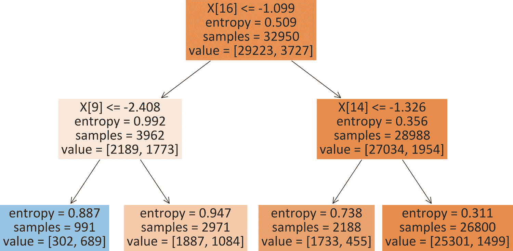
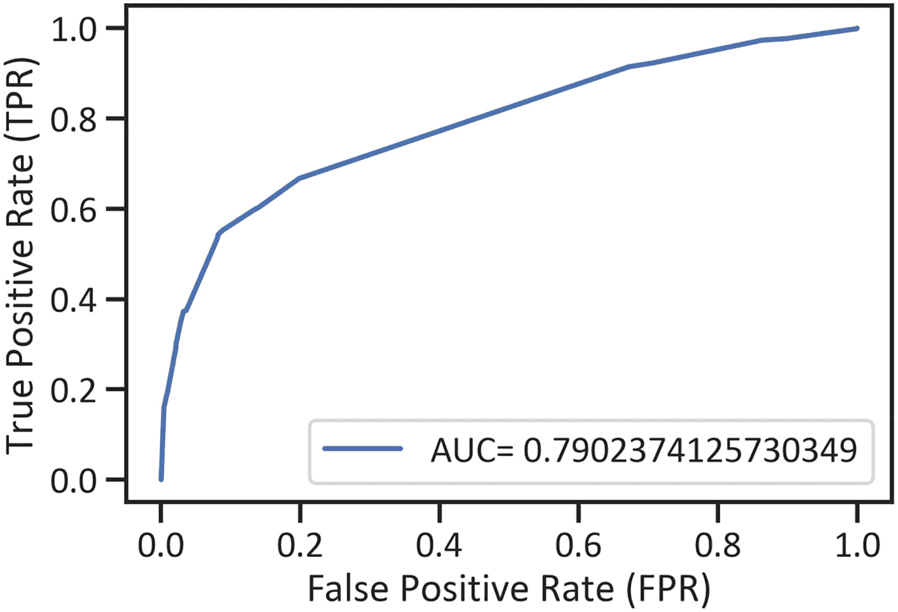
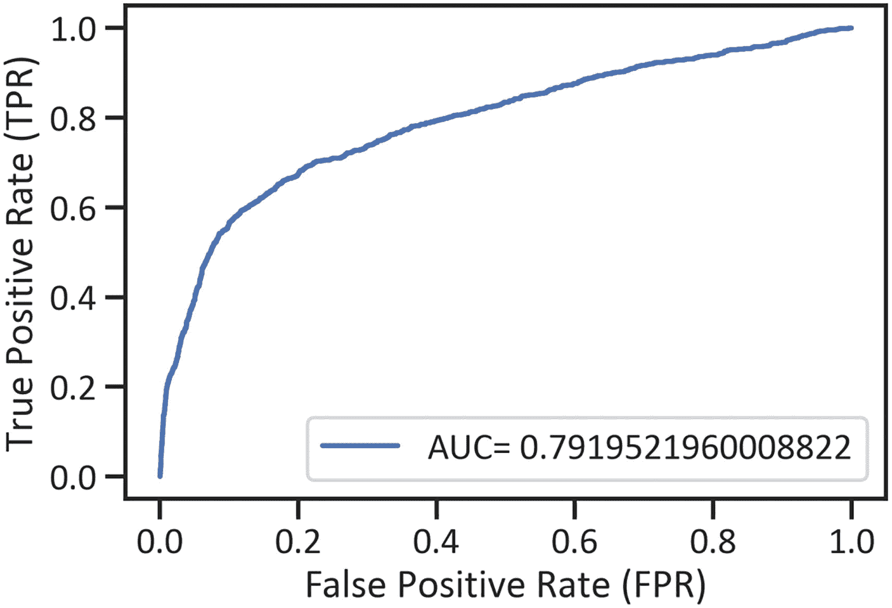
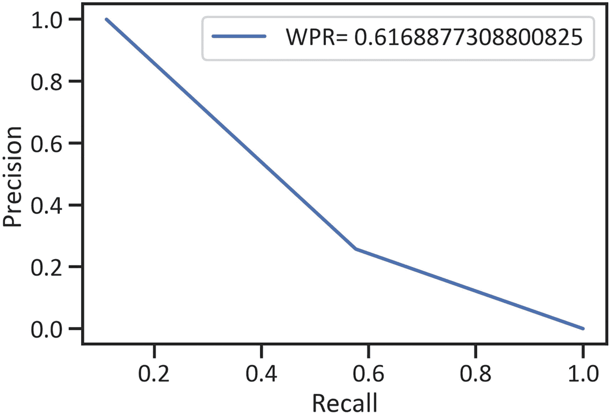

# 六、Scikit-Learn、XGBoost、PySpark 和 H2O 树建模和梯度提升

本章使用一组不同的综合 Python 框架(即 Scikit-Learn、XGBoost、PySpark 和 H2O)来执行和评估基于树的方法(决策树方法)和集成方法(梯度推进树方法)。首先，本章阐明了决策树如何计算类的概率。

## 决策树

*决策树*是一种基本的非参数方法，适用于线性和非线性建模。它执行决策规则并开发一个树状结构，该结构以最小的深度将值分成不同的组(见图 [6-1](#Fig1) )。



图 6-1

决策图表

## 预处理特征

本章处理第[章到第](05.html)章的数据，因此它没有依次涵盖预处理任务。清单 [6-1](#PC1) 执行所有的预处理任务。

```py
from sklearn.tree import DecisionTreeClassifier
import numpy as np
import pandas as pd
from sklearn.preprocessing import StandardScaler
from sklearn.model_selection import train_test_split
df = pd.read_csv(r"filepath\banking.csv")
drop_column_names = df.columns[[8, 9, 10]]
initial_data = df.drop(drop_column_names, axis="columns")
initial_data.iloc[::, 1] = pd.get_dummies(initial_data.iloc[::, 1])
initial_data.iloc[::, 2] = pd.get_dummies(initial_data.iloc[::, 2])
initial_data.iloc[::, 3] = pd.get_dummies(initial_data.iloc[::, 3])
initial_data.iloc[::, 4] = pd.get_dummies(initial_data.iloc[::, 4])
initial_data.iloc[::, 5] = pd.get_dummies(initial_data.iloc[::, 5])
initial_data.iloc[::, 6] = pd.get_dummies(initial_data.iloc[::, 6])
initial_data.iloc[::, 7] = pd.get_dummies(initial_data.iloc[::, 7])
initial_data.iloc[::, 11] = pd.get_dummies(initial_data.iloc[::, 11])
initial_data = initial_data.dropna()
x = np.array(initial_data.iloc[::, 0:17])
y = np.array(initial_data.iloc[::, -1])
x_train, x_test, y_train, y_test = train_test_split(x, y, test_size=0.2, random_state=0)
sk_standard_scaler = StandardScaler()
sk_standard_scaled_x_train = sk_standard_scaler.fit_transform(x_train)
sk_standard_scaled_x_test = sk_standard_scaler.transform(x_test)

Listing 6-1Preprocess Features

```

### sci kit-在行动中学习

本节使用 Scikit-Learn 框架执行和评估决策树方法。清单 [6-2](#PC2) 用 Scikit-Learn 框架执行决策树方法。

```py
from sklearn.tree import DecisionTreeClassifier
sk_decision_tree_method = DecisionTreeClassifier()
sk_decision_tree_method.fit(sk_standard_scaled_x_train, y_train)

Listing 6-2Execute the Scikit-Learn Decision Tree Method

```

清单 [6-3](#PC3) 确定了 Scikit-Learn 决策树方法的最佳超参数。

```py
from sklearn.model_selection import GridSearchCV
sk_decision_tree_method_parameters = {"criterion":("gini","entropy"), "max_depth":[1, 2, 3, 4, 5, 6]}
sk_decision_tree_method_g_search = GridSearchCV(estimator = sk_decision_tree_method, param_grid = sk_decision_tree_method_parameters)
sk_decision_tree_method_g_search.fit(sk_standard_scaled_x_train, y_train)
print("Best decision tree regression score: ", sk_decision_tree_method_g_search.best_score_)
print("Best decision tree parameter: ", sk_decision_tree_method_g_search.best_params_)

Best decision tree regression score:  0.900030349013657
Best decision tree parameter:  {'criterion': 'entropy', 'max_depth': 5}

Listing 6-3Determine the Best Hyperparameters for the Scikit-Learn Decision Tree Method

```

清单 [6-4](#PC4) 使用 Scikit-Learn 框架执行决策树方法。

```py
sk_decision_tree_method = DecisionTreeClassifier(criterion = "entropy", max_depth = 5)
sk_decision_tree_method.fit(sk_standard_scaled_x_train, y_train)

Listing 6-4Execute the Scikit-Learn Decision Tree Method

```

清单 [6-5](#PC5) 排列 Scikit-Learn 决策树方法的分类报告(见表 [6-1](#Tab1) )。

表 6-1

Scikit-Learn 决策树方法的分类报告

     
|   | 

精确

 | 

回忆

 | 

f1-分数

 | 

支持

 |
| --- | --- | --- | --- | --- |
| Zero | 0.914696 | 0.982253 | 0.947271 | 7325.000000 |
| one | 0.650538 | 0.265060 | 0.376654 | 913.000000 |
| 准确 | 0.902768 | 0.902768 | 0.902768 | 0.902768 |
| Avg 宏 | 0.782617 | 0.623656 | 0.661963 | 8238.000000 |
| 加权平均值 | 0.885420 | 0.902768 | 0.884031 | 8238.000000 |

```py
from sklearn import metrics
sk_yhat = sk_decision_tree_method.predict(sk_standard_scaled_x_test)
sk_decision_tree_method_assessment_2 = pd.DataFrame(metrics.classification_report(y_test, sk_yhat, output_dict=True)).transpose()
sk_decision_tree_method_assessment_2

Listing 6-5Arrange the Scikit-Learn Decision Tree Method’s Classification Report

```

列表 [6-6](#PC6) 排列决策树方法的接收机工作特性曲线，浓缩真阳性率和假阳性率的排列(见图 [6-2](#Fig2) )。



图 6-2

Scikit-Learn 决策的接收器工作特性曲线

```py
import matplotlib.pyplot as plt
%matplotlib inline
sk_yhat_proba = sk_decision_tree_method.predict_proba(sk_standard_scaled_x_test)[::,1]
fpr_sk_decision_tree_method, tprr_sk_decision_tree_method, _ = metrics.roc_curve(y_test, sk_yhat_proba)
area_under_curve_sk_decision_tree_method = metrics.roc_auc_score(y_test, sk_yhat_proba)
plt.plot(fpr_sk_decision_tree_method, tprr_sk_decision_tree_method, label="AUC= "+ str(area_under_curve_sk_decision_tree_method))
plt.xlabel("False Positive Rate (FPR)")
plt.ylabel("True Positive Rate (TPR)")
plt.legend(loc="best")
plt.show()

Listing 6-6Receiver Operating Characteristics Curve for the Decision Tree Method (Executed by the Scikit-Learn Framework)

```

列表 [6-7](#PC7) 排列 Scikit-Learn 决策树方法的接收器操作特性曲线，以浓缩精度和召回率的排列(见图 [6-3](#Fig3) )。


图 6-3

Scikit-Learn 框架决策树方法的精确召回曲线

```py
p_sk_decision_tree_method, r__sk_decision_tree_method, _ = metrics.precision_recall_curve(y_test, sk_yhat)
weighted_ps_sk_decision_tree_method = metrics.roc_auc_score(y_test, sk_yhat)
plt.plot(p_sk_decision_tree_method, r__sk_decision_tree_method,
         label="WPR= " +str(weighted_ps_sk_decision_tree_method))
plt.xlabel("Recall")
plt.ylabel("Precision")
plt.legend(loc="best")
plt.show()

Listing 6-7Precision-Recall Curve for the Scikit-Learn Decision Tree Method

```

清单 [6-8](#PC8) 排列了 Scikit-Learn 决策树方法的学习曲线(见图 [6-4](#Fig4) )。


图 6-4

Scikit-Learn 执行的决策树方法的学习曲线

```py
from sklearn.model_selection import learning_curve
train_port_sk_decision_tree_method, trainscore_sk_decision_tree_method, testscore_sk_decision_tree_method = learning_curve(sk_decision_tree_method, x, y,
 cv=3, n_jobs=-5, train_sizes=np.linspace(0.1,1.0,50))
trainscoresk_decision_tree_method_mean = np.mean(trainscore_sk_decision_tree_method, axis=1)
testscoresk_decision_tree_method_mean = np.mean(testscore_sk_decision_tree_method, axis=1)
plt.plot(train_port_sk_decision_tree_method, trainscoresk_decision_tree_method_mean, label="Weighted training accuracy")
plt.plot(train_port_sk_decision_tree_method, testscoresk_decision_tree_method_mean, label="Weighted cv accuracy Score")
plt.xlabel("Training values")
plt.ylabel("Weighted accuracy score")
plt.legend(loc="best")
plt.show()

Listing 6-8Learning Curve for the Decision Tree Method Executed by the Scikit-Learn Framework

```

## 梯度推进

梯度提升方法继承输入要素的值，然后执行无数的树模型来停止损失函数(即，线性建模的平均绝对误差)。它通过吸收弱模型来做到这一点，然后增量和迭代地对加权数据建模，努力地选择具有最佳性能的弱模型。

### XGBoost 正在运行

本节使用 XGBoost 框架执行和评估决策树方法。清单 [6-9](#PC9) 执行 XGBoost 梯度提升方法。

```py
from xgboost import XGBClassifier
xgb_gradient_boosting_method = XGBClassifier()
xgb_gradient_boosting_method.fit(sk_standard_scaled_x_train, y_train)

Listing 6-9Execute the XGBoost Gradient Boosting Method

```

清单 [6-10](#PC10) 整理 XGBoost 梯度提升方法的分类报告(见表 [6-2](#Tab2) )。

表 6-2

XGBoost 梯度推进法的分类报告

     
|   | 

精确

 | 

回忆

 | 

f1-分数

 | 

支持

 |
| --- | --- | --- | --- | --- |
| Zero | 0.913410 | 0.976382 | 0.943847 | 7325.00000 |
| one | 0.575980 | 0.257393 | 0.355791 | 913.000000 |
| 准确 | 0.896698 | 0.896698 | 0.896698 | 0.896698 |
| Avg 宏 | 0.744695 | 0.616888 | 0.649819 | 8238.000000 |
| 加权平均值 | 0.876013 | 0.896698 | 0.878674 | 8238.000000 |

```py
sk_yhat_xgb_gradient_boosting_method = sk_yhat_xgb_gradient_boosting_method = xgb_gradient_boosting_method.predict(sk_standard_scaled_x_test)
xgb_gradient_boosting_method_assessment_2 = pd.DataFrame(metrics.classification_report(y_test, sk_yhat_xgb_gradient_boosting_method, output_dict=True)).transpose()
print(xgb_gradient_boosting_method_assessment_2)

Listing 6-10Arrange the XGBoost Gradient Boosting Method’s Classification Report

```

清单 [6-11](#PC11) 整理了 XGBoost 梯度提升法的接收机工作特性曲线，浓缩了精度和召回率的安排(见图 [6-5](#Fig5) )。



图 6-5

XGBoost 梯度提升方法的接收器工作特性曲线

```py
yhat_proba_xgb_gradient_boosting_method = xgb_gradient_boosting_method.predict_proba(sk_standard_scaled_x_test)[::,1]
fpr_xgb_gradient_boosting_method, tprr_xgb_gradient_boosting_method, _ = metrics.roc_curve(y_test, yhat_proba_xgb_gradient_boosting_method)
area_under_curve_xgb_gradient_boosting_method = metrics.roc_auc_score(y_test, yhat_proba_xgb_gradient_boosting_method)
plt.plot(fpr_xgb_gradient_boosting_method, tprr_xgb_gradient_boosting_method, label="AUC= "+ str(area_under_curve_xgb_gradient_boosting_method))
plt.xlabel("False Positive Rate (FPR)")
plt.ylabel("True Positive Rate (TPR)")
plt.legend(loc="best")
plt.show()

Listing 6-11Receiver Operating Characteristics Curve for the XGBoost Gradient Boosting Method

```

清单 [6-12](#PC12) 排列了 XGBoost 梯度提升方法的精度-召回曲线，浓缩了精度和召回的排列(见图 [6-6](#Fig6) )。



图 6-6

Scikit-Learn 决策树方法的精确召回曲线

```py
sk_yhat_xgb_gradient_boosting_method)
weighted_ps_xgb_gradient_boosting_method = metrics.roc_auc_score(y_test, sk_yhat_xgb_gradient_boosting_method)
plt.plot(p_xgb_gradient_boosting_method, r__xgb_gradient_boosting_method,
         label="WPR= " +str(weighted_ps_xgb_gradient_boosting_method))
plt.xlabel("Recall")
plt.ylabel("Precision")
plt.legend(loc="best")
plt.show()

Listing 6-12Precision-Recall Curve for the Scikit-Learn Decision Tree Method

```

### PySpark 在行动

本节使用 PySpark 框架执行和评估梯度提升方法。清单 [6-13](#PC13) 使用`findspark`框架准备 PySpark 框架。

```py
import findspark as initiate_pyspark
initiate_pyspark.init("filepath\spark-3.0.0-bin-hadoop2.7")

Listing 6-13Prepare the PySpark Framework

```

清单 [6-14](#PC14) 使用`SparkConf()`方法规定了 PySpark 应用程序。

```py
from pyspark import SparkConf
pyspark_configuration = SparkConf().setAppName("gradient_boosting_method").setMaster("local")

Listing 6-14Stipulate the PySpark App

```

清单 [6-15](#PC15) 使用`SparkSession()`方法准备 PySpark 会话。

```py
from pyspark.sql import SparkSession
pyspark_session = SparkSession(pyspark_context)

Listing 6-15Prepare the Spark Session

```

清单 [6-16](#PC16) 使用`createDataFrame()`方法将本章前面创建的`pandas`数据帧更改为 PySpark 数据帧。

```py
pyspark_initial_data = pyspark_session.createDataFrame(initial_data)

Listing 6-16Change the Pandas Dataframe to a PySpark Dataframe

```

清单 [6-17](#PC17) 为独立特性创建一个列表，为从属特性创建一个字符串。然后，它使用`VectorAssembler()`方法转换数据，以便用 PySpark 框架建模。

```py
x_list = list(initial_data.iloc[::, 0:17].columns)
y_list = str(initial_data.columns[-1])
from pyspark.ml.feature import VectorAssembler
pyspark_data_columns = x_list
pyspark_vector_assembler = VectorAssembler(inputCols=pyspark_data_columns, outputCol="features")
pyspark_data = pyspark_vector_assembler.transform(pyspark_initial_data)

Listing 6-17Transform the Data

```

清单 [6-18](#PC18) 用`randomSplit()`方法划分数据。

```py
(pyspark_training_data, pyspark_test_data) = pyspark_data.randomSplit([.8,.2])

Listing 6-18Divide the Dataframe

```

清单 [6-19](#PC19) 执行 PySpark 梯度推进回归方法。

```py
from pyspark.ml.classification import GBTClassifier
pyspark_gradient_boosting_method = GBTClassifier(labelCol = y_list, featuresCol = "features")
pyspark_gradient_boosting_method_fitted = pyspark_gradient_boosting_method.fit(pyspark_training_data)

Listing 6-19Execute the PySpark Gradient Boosting Method

```

清单 [6-20](#PC20) 使用 PySpark 框架计算梯度推进回归方法的预测。

```py
pyspark_yhat = pyspark_gradient_boosting_method_fitted.transform(pyspark_test_data)

Listing 6-20Gradient Boosting Method Predictions (Method Executed with PySpark Framework)

```

### H2O 在行动

这部分用 H2O 框架执行和评估主成分方法。清单 [6-21](#PC21) 准备 H2O 框架。

```py
import h2o as initialize_h2o
initialize_h2o.init()

Listing 6-21Prepare the H2O Framework

```

清单 [6-22](#PC22) 将`pandas`数据帧更改为 H2O 数据帧。

```py
h2o_data = initialize_h2o.H2OFrame(initial_data)

Listing 6-22Change the Pandas Dataframe to an H2O Dataframe

```

清单 [6-23](#PC23) 概述了这些特性。

```py
x_list = list(initial_data.iloc[::, 0:17].columns)
y_list = str(initial_data.columns[-1])
y = y_list
x = h2o_data.col_names
x.remove(y_list)

Listing 6-23Outline the Features

```

清单 [6-24](#PC24) 随机划分数据帧。

```py
h2o_training_data, h2o_validation_data, h2o_test_data = h2o_data.split_frame(ratios=[.8,.1])

Listing 6-24Randomly Divide the Dataframe

```

清单 [6-25](#PC25) 执行 H2O 梯度推进方法。

```py
from h2o.estimators import H2OGradientBoostingEstimator
h2o_gradient_boosting_method = H2OGradientBoostingEstimator(nfolds=3)
h2o_gradient_boosting_method.train(x = x, y = y, training_frame = h2o_training_data, validation_frame = h2o_validation_data)

Listing 6-25Execute the H2O Gradient Boosting Method

```

清单 [6-26](#PC26) 评估 H2O 梯度推进方法(见表 [6-3](#Tab3) )。

表 6-3

H2O 梯度推进法评估

           
| 

时间戳

 | 

持续时间

 | 

树的数量

 | 

培训 _rmse

 | 

培训 _mae

 | 

培训 _ 偏差

 | 

验证 _rmse

 | 

验证 _mae

 | 

验证 _ 偏差

 |   |   |
| --- | --- | --- | --- | --- | --- | --- | --- | --- | --- | --- |
| Zero |   | 2021-08-24 04:04:30 | 10.384 秒 | Zero | 0.317003 | 0.200981 | 0.100491 | 0.311883 | 0.197762 | 0.097271 |
| one |   | 2021-08-24 04:04:30 | 10.496 秒 | One | 0.309924 | 0.196310 | 0.096053 | 0.305219 | 0.193472 | 0.093159 |
| Two |   | 2021-08-24 04:04:30 | 10.586 秒 | Two | 0.304085 | 0.192122 | 0.092468 | 0.299762 | 0.189611 | 0.089857 |
| three |   | 2021-08-24 04:04:30 | 10.659 秒 | Three | 0.299238 | 0.188351 | 0.089543 | 0.295379 | 0.186199 | 0.087249 |
| four |   | 2021-08-24 04:04:30 | 10.745 秒 | Four | 0.295198 | 0.184939 | 0.087142 | 0.291736 | 0.183116 | 0.085110 |

```py
h2o_gradient_boosting_method_history = h2o_gradient_boosting_method.scoring_history()
print(h2o_gradient_boosting_method_history.head(5))

Listing 6-26Assess the H2O Gradient Boosting Method

```

## 结论

本章执行了四个关键的机器学习框架(Scikit-Learn、XGBoost、PySpark 和 H2O)来对数据进行建模，并使用决策树和梯度推进方法生成具有两个类的分类输出特征。