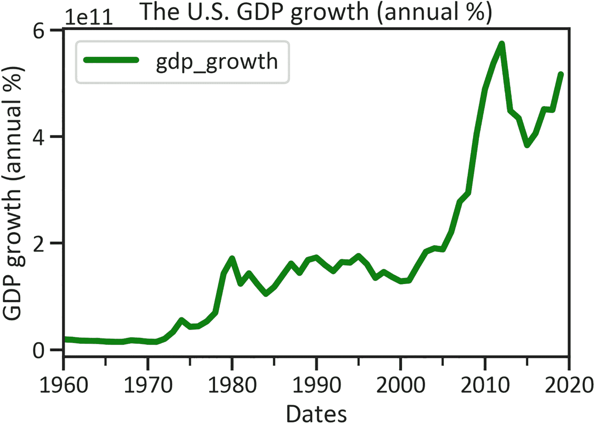
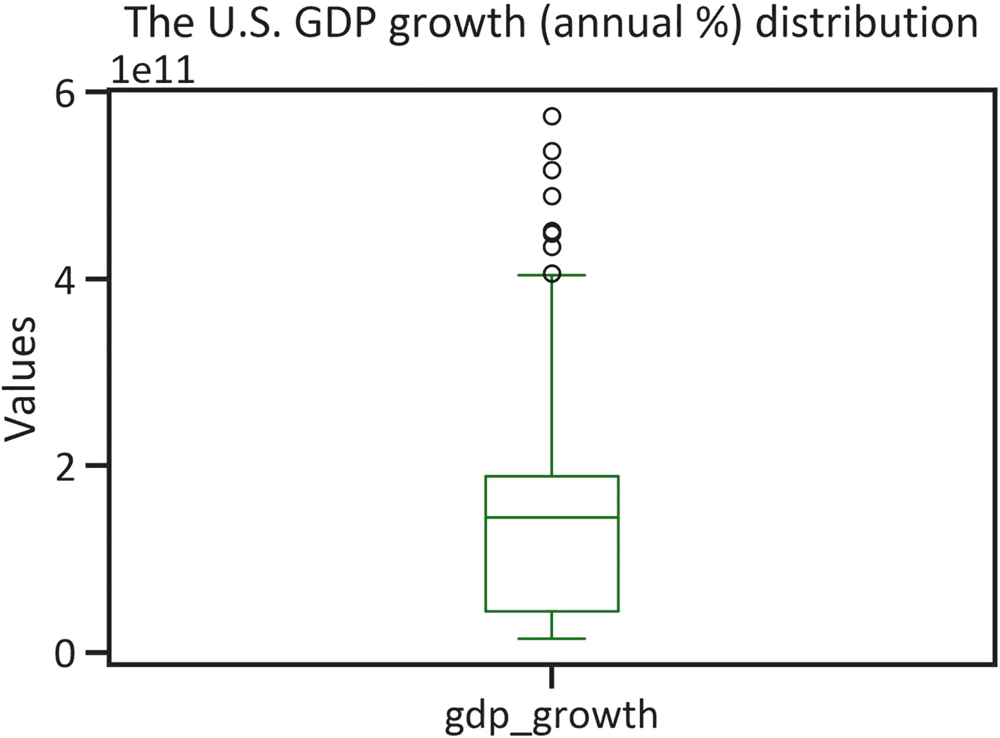
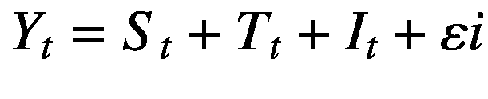
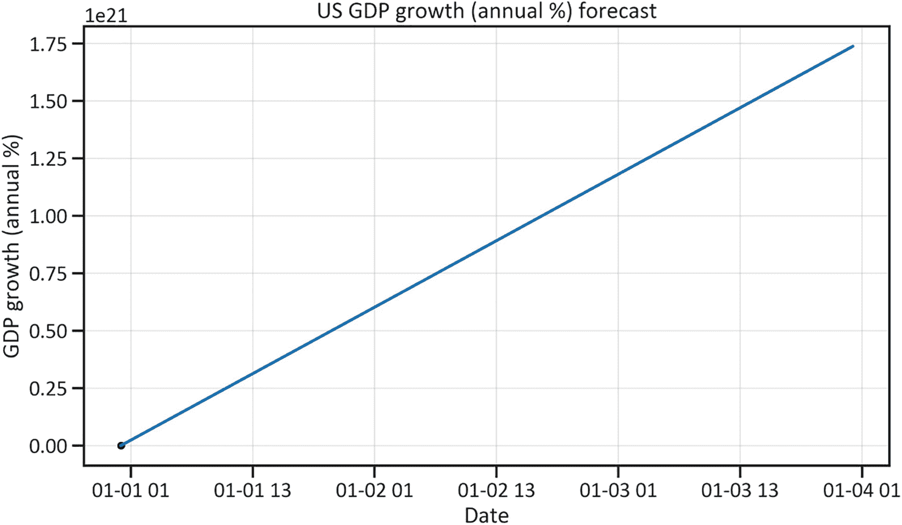

# 四、预测增长

时间序列分析包括检查序列数据中的模式和趋势，以预测序列的值。有无数的时间序列模型，包括自回归移动平均(ARIMA) (p，d，q)，它在先前和当前值之间应用线性变换(自回归)，综合(随机行走)和移动平均。一个 ARIMA 模型包括季节性，称为季节性 ARIMA (P，D，Q) x (p，D，Q)。本章考虑加法模型，它通过平滑参数识别非线性。出于本书的目的，您可以将时间序列分析视为线性回归的扩展，因为它研究的是序列数据。主要的区别在于，在时间序列分析中，您是按时间顺序排列数据的，这使得假设比线性回归模型中的假设严格得多。在训练模型之前，您必须使用增强的 Dickey-Fuller 测试来测试*的平稳性*，测试白噪声的存在，并测试自相关性。

本章调查了美国每年生产的成品和服务的市场价值趋势(见等式 4-1):

*   引导运动——持续向上的运动是向上的趋势，持续向下的运动是向下的趋势

*   季节性——持续的逐年变化(上坡或下坡)

*   不规则成分——也称为残余成分

最后，模型预测未来的经济活动。注意，它没有描述数据的中心趋势，因为前一章已经描述了。

本章使用了由脸书开发的 Python 库 Prophet。它建立在加法模型的基础上。

在继续之前，请确保您的环境中安装了`fbprophet`库。要在 Python 环境中安装`fbprophet`库，请使用`pip install fbprophet`。同样，要在 Conda 环境中安装库，使用`conda install -c conda-forge fbprophet`。你还需要安装`pystan`库。要在 Python 环境中这样做，请使用`pip install pystan`，在 Conda 环境中，请使用`conda install -c conda-forge pystan`。

清单 [4-1](#PC1) 提取美国 GDP 增长数据(以年百分比表示)并绘制数列(见图 [4-1](#Fig1) )。



图 4-1

美国 GDP 增长线图

```py
import wbdata
import matplotlib.pyplot as plt
%matplotlib inline
country = ["USA"]
indicator = {"FI.RES.TOTL.CD":"gdp_growth"}
df = wbdata.get_dataframe(indicator, country=country, convert_date=True)
df.plot(kind="line",color="green",lw=4)
plt.title("The U.S. GDP growth (annual %)")
plt.xlabel("Dates")
plt.ylabel("GDP growth (annual %)")
plt.legend(loc="best")
plt.show()

Listing 4-1The U.S. GDP Growth (Annual Percentage) Line Plot

```

图 [4-1](#Fig1) 展示了自 20 世纪 60 年代初以来美国 GDP 增长的上升趋势。2012 年初，美国国内生产总值增长下降，然后在 2015 年恢复增长势头。列表 [4-2](#PC2) 用平均值替换任何缺失值。

```py
df["gdp_growth"] = df["gdp_growth"].fillna(df["gdp_growth"].mean())

Listing 4-2Replacing Missing Values with the Mean Value

```

## 描述统计学

清单 [4-3](#PC3) 检索表 [4-1](#Tab1) ，该表概述了描述性统计数据。

表 4-1

描述统计学

  
|   | 

gdp _ 增长

 |
| --- | --- |
| 数数 | 6.100000e+01 |
| 平均 | 1.822831e+11 |
| 标准 | 1.646309e+11 |
| 福建话 | 1.483107e+10 |
| 25% | 4.416213e+10 |
| 50% | 1.441768e+11 |
| 75% | 1.904648e+11 |
| 最大 | 6.283697e+11 |

```py
df.describe()

Listing 4-3Descriptive Statistics

```

表 [4-1](#Tab1) 显示:

*   美国 GDP 增长均值为 6.000000e+01。

*   美国 GDP 增长独立数据点偏离均值 1.748483e+11。参见清单 [4-4](#PC4) 。

```py
df.plot(kind="box",color="green")
plt.title("The U.S. GDP growth (annual %) distribution")
plt.ylabel("Values")
plt.show()

Listing 4-4The U.S. GDP Growth Distribution

```



图 4-2

美国 GDP 增长分布

图 [4-2](#Fig2) 显示美国 GDP 增长数据中存在离群值。清单 [4-5](#PC5) 用缺失值替换异常值，并检查新的分布。

```py
df['gdp_growth'] = np.where((df["gdp_growth"] > 2.999999e+11),df["gdp_growth"].mean(),df["gdp_growth"])
df.plot(kind="box",color="green")
plt.title("The U.S. GDP growth (annual %) distribution")
plt.ylabel("Values")
plt.show()

Listing 4-5Replacing the Outliers

```


图 4-3

美国 GDP 增长盒图

图 [4-3](#Fig3) 显示不再有离群值。

### 平稳性检测

如果数据中存在随机性(单位根)，则序列数据是平稳的，表明变量的均值几乎不变或接近均值。大多数时间序列分析模型都假设一个序列有一个单位根。最常见的平稳性测试是扩展的 Dickey-Fuller 测试(见清单[4-6](#PC6))—它扩展了 Dickey-Fuller 测试。当应用扩展的 Dickey-Fuller 检验时，确保 p 值是显著的。表 [4-2](#Tab2) 定义了滞后的数量、F 统计百分比和 p 值。

表 4-2

扩充的 Dickey-Fuller 结果

  
| 

可变的

 | 

价值

 |
| --- | --- |
| ADF F%统计 | -0.962163 |
| p 值 | 0.766813 |
| 使用的滞后数量 | 0.000000 |
| 观察数量 | 60.000000 |

```py
from statsmodels.tsa.stattools import adfuller
adfullerreport = adfuller(df["gdp_growth"])
adfullerreportdata = pd.DataFrame(adfullerreport[0:4],
                                  columns = ["Values"],
                                  index=["ADF F% statistics",
                                         "P-value",
                                         "No. of lags used",
                                         "No. of observations"])
adfullerreportdata

Listing 4-6Augmented Dickey-Fuller Results

```

表 [4-2](#Tab2) 显示，在 p 值大于 0.5 的情况下，序列不存在平稳性。通常，您会在建模之前区分系列。请注意，测试持有一个零假设，这表明该序列不是平稳的；它还持有另一个假设，即假设序列是平稳的。

### 随机白噪声检测

清单 [4-7](#PC7) 生成一组随机变量，并检查数据的平均值是否接近 0(见图 [4-4](#Fig4) )。


图 4-4

随机白噪声

```py
from pandas.plotting import autocorrelation_plot
randval = np.random.randn(1000)
autocorrelation_plot(randval)
plt.title("Random white noise")
plt.show()

Listing 4-7Random White Noise

```

图 [4-4](#Fig4) 显示平均值在 0 左右。这表明不同滞后期的序列模式是相似的。

## 自相关检测

在简单线性回归中，相关性分析在模型开发中起着至关重要的作用。然而，时间序列分析感兴趣的是独立观测值(y)和随时间变化的独立观测值(y <sub>t</sub> )之间的序列统计相关性。清单 [4-8](#PC8) 是一个自相关函数，它解释了不同滞后之间的自相关(见图 [4-5](#Fig5) )。当自相关系数在图 [4-5](#Fig5) 的蓝色区域内时，它们是显著的。


图 4-5

美国国内生产总值增长率(年百分比)ACF

```py
from statsmodels.graphics.tsaplots import plot_acf
plot_acf(df["gdp_growth"])
plt.title("")
plt.xlabel("Lag")
plt.ylabel("ACF")
plt.title("The U.S. GDP growth (annual %) autocorrelation")
plt.show()

Listing 4-8The U.S. GDP Growth (Annual %) ACF

```

清单 [4-9](#PC9) 展示了`lag1`中的独立观察结果(见图 [4-6](#Fig6) )。滞后图有助于解释相对于相关性的任何滞后(y <sub>t</sub> 之间的空间)。


图 4-6

美国 GDP 增长滞后图

```py
from pandas.plotting import lag_plot
lag_plot(df["gdp_growth"])
plt.title("The U.S. GDP growth (annual %) lag 1")
plt.show()

Listing 4-9The U.S. GDP Growth (Annual %) Lag Plot

```

图 [4-6](#Fig6) 显示`lag1`中 y <sub>t</sub> 与 y <sub>(t+1)</sub> 之间存在关联关系。

## 不同的单变量时间序列模型

本章将时间序列分析应用于连续变量。以下部分包含不同时间序列分析模型的概述。

### 自回归综合移动平均线

自回归综合移动平均是一种 ARIMA 模型，这意味着它在先前值和当前值(自回归)、综合(随机游走)和移动平均(先前值和当前值的权重)之间应用线性变换。这是最常见的时间序列模型。该模型假设前面的值之间存在线性关系，并且序列是平稳的。不仅如此，它还考虑了当前权重和后续权重值之间的差异。

### 季节性自回归综合移动平均模型

季节性自回归综合移动平均线(SARIMA)扩展了 ARIMA 模型，该模型考虑了季节性(持续的逐年移动——上升或下降)。方程式 [4-1](#Equ1) 就是萨里玛公式。



(方程式 4-1)

其中 *S* <sub>*t*</sub> 代表季节性， *T* <sub>*t*</sub> 代表趋势， *I* <sub>*t*</sub> 代表不规则性， *ε* <sub>*i*</sub> 是误差项。萨里玛考虑季节性，不考虑公共假期等事件的影响。为了解决这个问题，开发人员经常使用加法模型。

## 加法模型

加法模型考虑了公共假日等事件的影响。它调整函数中的非线性属性，并通过包含平滑参数和添加非线性将预测缩小到某个置信区间。开发加法模型最可靠的库是 FB Prophet。清单 [4-10](#PC10) 重新利用数据(见表 [4-3](#Tab3) )。

表 4-3

美国国内生产总值增长(年%)再利用数据

    
| 

日期

 | 

gdp _ 增长

 | 

从记号处开始重复一遍

 | 

y

 |
| --- | --- | --- | --- |
| 2020-01-01 | 1.822831e+11 | 1.822831e+11 | 2020-01-01 |
| 2019-01-01 | 1.822831e+11 | 1.822831e+11 | 2019-01-01 |
| 2018-01-01 | 1.822831e+11 | 1.822831e+11 | 2018-01-01 |
| 2017-01-01 | 1.822831e+11 | 1.822831e+11 | 2017-01-01 |
| 2016-01-01 | 1.822831e+11 | 1.822831e+11 | 2016-01-01 |
| ... | ... | ... | ... |
| 1964-01-01 | 1.672549e+10 | 1.672549e+10 | 1964-01-01 |
| 1963-01-01 | 1.687865e+10 | 1.687865e+10 | 1963-01-01 |
| 1962-01-01 | 1.725246e+10 | 1.725246e+10 | 1962-01-01 |
| 1961-01-01 | 1.882553e+10 | 1.882553e+10 | 1961-01-01 |
| 1960-01-01 | 1.966416e+10 | 1.966416e+10 | 1960-01-01 |

```py
df = df.reset_index()
df["ds"] = df["gdp_growth"]
df["y"] = df["date"]
df.set_index("date")

Listing 4-10Repurposing the U.S. GDP Growth (Annual %) Data

```

## 附加模型开发

使用 FB Prophet 库开发附加模型相当简单。列表 [4-11](#PC11) 调用`Prophet()`并训练模型。

```py
from fbprophet import Prophet
m = Prophet()
m.fit(df)

Listing 4-11Train Additive Model

```

### 加法模型预测

清单 [4-12](#PC12) 构建了未来三年的未来数据框架，并绘制了加法模型预测的数据点。

```py
future = m.make_future_dataframe(periods=3)
forecast = m.predict(future)
m.plot(forecast)
plt.title("The U.S. GDP growth (annual %) forecast")
plt.xlabel("Date")
plt.ylabel("GDP growth (annual %)")
plt.show()

Listing 4-12Plot U.S. GDP Growth Forecast

```



图 4-7

美国国内生产总值增长预测

图 [4-7](#Fig7) 显示了美国 GDP 增长的激增。下一节讨论季节分解——时间序列分析的一个重要方面。但是，考虑到这些数据的结构，我们不提供示例。很明显，该图没有正确显示日期。

## 季节性分解

季节性分解包括将序列数据分割成几个部分，这样开发人员可以更好地理解序列。这些组件包括:

*   季节性，代表一种长期的固定模式。

*   趋势，是一个时间序列中暂时的持续模式。

*   不规则性，代表美国 GDP 增长数据的可变性。

考虑到数据收集的频率和美国 GDP 增长只有几个数据点的事实，本章不包括季节分解。他们每年收集数据，我们无法将季节性分解为每日和每周的季节性。然而，理解季节分解是如何工作的是很重要的。

## 结论

本章介绍了一个时间序列分析模型，称为加法模型。在拟合模型之前，您学习了如何通过测试平稳性、白噪声、自相关和正态性来确认时间序列分析假设。此后，本章介绍了趋势、季节性和残差。该模型预测了美国年度 GDP 增长的主要上升趋势。下一章介绍一种叫做*逻辑回归*的分类方法。当您想要操作预测变量以生成二进制输出值时，可以使用此模型。