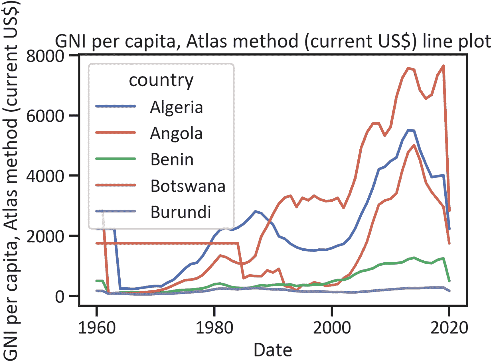
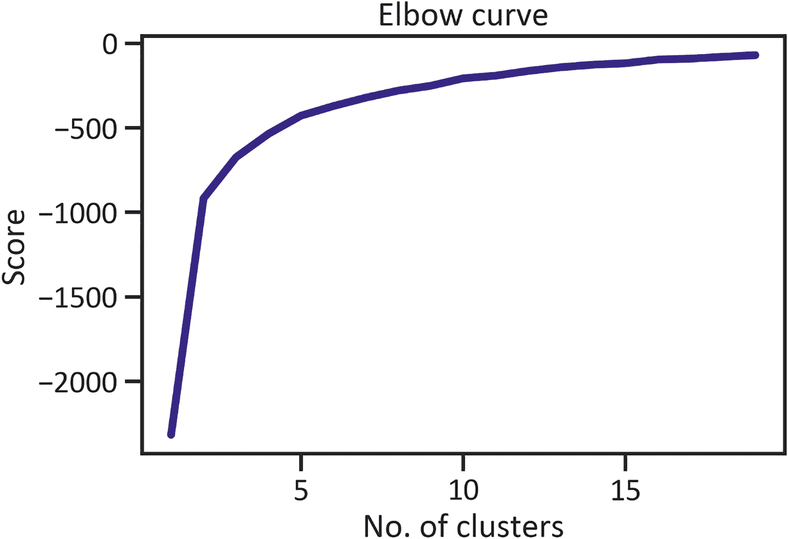

# 七、在大陆一级分组人均国民总收入

本章涵盖了无监督的机器学习。在无监督的机器学习中，你不分割数据，而是用整个数据集呈现模型，并允许模型在没有任何监督的情况下自己发现数据中的模式。鉴于本章涵盖了聚类分析，所以介绍了最简单的无监督机器学习模型，称为 *k-means* *。*k-means 方法很容易理解。当您进行聚类分析时，没有真正的响应变量—您对所有变量都一视同仁。也没有预测变量，所以不存在预测/预报的情况。你只分析数据中的模式。

k-means 模型根据相似性对值进行分组。首先，该模型查找彼此接近的值，并估计它们之间的距离。此后，它确定该组值的中心，并拉伸这些值，使这些值位于一个聚类内。它通过执行距离估计来发现组中的相似性。最常见的距离估计方法是欧几里德距离估计。方程 7-1 展示了欧几里得方程。


(方程式 7-1)

其中 *J* 表示目标函数， *$k$* 表示聚类数， *n* 表示事例数，表示*事例* <sub>* j *</sub> ， *C* <sub>* j *</sub> 表示 *j* 的质心。

该模型不同于其他模型，因为它假定您是根据数据分析来确定聚类数的。要确定簇的数量，请应用肘形曲线或碎石图。

## 本章的背景

本章假设数据中有三个聚类来处理这个问题。它通过应用以下三个标签对非洲国家进行分组:

*   低人均国民总收入

*   中等人均国民总收入

*   高人均国民总收入

它应用肘形曲线来确定关于数据的假设是否正确。然后对非洲国家的全部人均国民总收入数据使用 k-means 模型。鉴于有许多变量，它不能描述所有的数据。

要进行聚类分析，首先需要执行描述性分析，然后执行降维，将高维数据降维为几个维度。前几章介绍了称为主成分分析(PCA)的降维技术。这种技术减少了数据，因此您可以通过应用散点图以二维形式表示它。清单 [7-1](#PC1) 检索本章的人均国民总收入数据(见表 [7-1](#Tab1) )。

表 7-1

非洲人均国民总收入数据

   
| 

国家

 | 

日期

 | 

人均国民总收入

 |
| --- | --- | --- |
| 安哥拉 | Two thousand and twenty | Two thousand two hundred and thirty |
| Two thousand and nineteen | Two thousand nine hundred and seventy |
| Two thousand and eighteen | Three thousand two hundred and ten |
| Two thousand and seventeen | Three thousand four hundred and fifty |
| Two thousand and sixteen | Three thousand seven hundred and seventy |

```py
import wbdata
countries = ["AGO", "BDI", "BEN", "BWA", "CAF", "CIV",
             "COD", "DZA", "EGY", "ETH", "GAB", "GHA",
              "GIN", "GMB", "GNQ", "KEN", "LBR", "LBY",
             "LSO", "MAR", "MLI", "MOZ", "MWI", "NAM",
             "NER", "NGA", "RWA", "SDN", "SEN","SOM",
             "SWZ", "TCD", "TUN", "TZA", "UGA", "ZAF",
             "ZMB", "ZWE"]
indicators = {"NY.GNP.PCAP.CD":"gni_per_capita"}
df = wbdata.get_dataframe(indicators, country=countries, convert_date=False)
df.head()

Listing 7-1Load Africa’s GNI Per Capita Data

```

清单 [7-2](#PC2) 拆分数据——它将索引从多重索引更改为单一索引。

```py
df = df["gni_per_capita"]
df = df.unstack(level=0)

Listing 7-2Unstack Data

```

列表 [7-3](#PC3) 用平均值替换缺失值。注意，这个例子不处理异常值。考虑到有如此多的变量，在这个简单的例子中这样做将是令人疲惫的。在现实世界中，处理异常值至关重要，因为它们会对结论产生负面影响。

```py
df["Algeria"] = df["Algeria"].fillna(df["Algeria"].mean())
df["Angola"] = df["Angola"].fillna(df["Angola"].mean())
df["Benin"] = df["Benin"].fillna(df["Benin"].mean())
df["Botswana"] = df["Botswana"] .fillna(df["Botswana"] .mean())
df["Burundi"] = df["Burundi"].fillna(df["Burundi"] .mean())
df["Central African Republic"] = df["Central African Republic"].fillna(df["Central African Republic"].mean())
df["Chad"] = df["Chad"].fillna(df["Chad"].mean())
df["Congo, Dem. Rep."] = df["Congo, Dem. Rep."].fillna(df["Congo, Dem. Rep."].mean())
df["Cote d'Ivoire"] = df["Cote d'Ivoire"].fillna(df["Cote d'Ivoire"].mean())
df["Egypt, Arab Rep."] = df["Egypt, Arab Rep."].fillna(df["Egypt, Arab Rep."].mean())
df["Equatorial Guinea"] = df["Equatorial Guinea"].fillna(df["Equatorial Guinea"].mean())
df["Eswatini"] = df["Eswatini"].fillna(df["Eswatini"].mean())
df["Ethiopia"] = df["Ethiopia"].fillna(df["Ethiopia"].mean())
df["Gabon"] = df["Gabon"].fillna(df["Gabon"].mean())
df["Gambia, The"] = df["Gambia, The"].fillna(df["Gambia, The"].mean())
df["Ghana"] = df["Ghana"].fillna(df["Ghana"].mean())
df["Guinea"] = df["Guinea"].fillna(df["Guinea"].mean())
df["Kenya"] = df["Kenya"].fillna(df["Kenya"].mean())
df["Lesotho"] = df["Lesotho"].fillna(df["Lesotho"].mean())
df["Liberia"] = df["Liberia"].fillna(df["Liberia"].mean())
df["Libya"] = df["Libya"].fillna(df["Libya"].mean())
df["Malawi"] = df["Malawi"].fillna(df["Malawi"].mean())
df["Mali"] = df["Mali"].fillna(df["Mali"].mean())
df["Morocco"] = df["Morocco"].fillna(df["Morocco"].mean())
df["Mozambique"] = df["Mozambique"] .fillna(df["Mozambique"].mean())
df["Namibia"] = df["Namibia"].fillna(df["Namibia"].mean())
df["Niger"] = df["Niger"].fillna(df["Niger"].mean())
df["Nigeria"] = df["Nigeria"].fillna(df["Nigeria"].mean())
df["Rwanda"] = df["Rwanda"].fillna(df["Rwanda"].mean())
df["Senegal"] = df["Senegal"].fillna(df["Senegal"].mean())
df["Somalia"] = df["Somalia"].fillna(df["Somalia"].mean())
df["South Africa"] = df["South Africa"].fillna(df["South Africa"].mean())
df["Sudan"] = df["Sudan"].fillna(df["Sudan"].mean())
df["Tanzania"] = df["Tanzania"].fillna(df["Tanzania"].mean())
df["Tunisia"] = df["Tunisia"].fillna(df["Tunisia"].mean())
df["Uganda"] = df["Uganda"].fillna(df["Uganda"].mean())
df["Zambia"] = df["Zambia"].fillna(df["Zambia"].mean())
df["Zimbabwe"] = df["Zimbabwe"].fillna(df["Zimbabwe"].mean())

Listing 7-3Replace Outliers with Mean Values

```

## 描述统计学

清单 [7-4](#PC4) 中的命令检索表 [7-2](#Tab2) ，该表展示了数据的集中趋势和分散性。

表 7-2

描述统计学

         
| 

国家

 | 

数数

 | 

平均

 | 

标准

 | 

福建话

 | 

25%

 | 

50%

 | 

75%

 | 

最大

 |
| --- | --- | --- | --- | --- | --- | --- | --- | --- |
| 阿尔及利亚 | Sixty-one | 2180.169492 | 1482.758119 | One hundred and ninety | 1100.000000 | 1980.000000 | 2810.000000 | Five thousand five hundred and ten |
| 安哥拉 | Sixty-one | 1848.857143 | 1141.479700 | Three hundred and twenty | 860.000000 | 1848.857143 | 1848.857143 | Five thousand and ten |
| 贝宁 | Sixty-one | 512.542373 | 383.386633 | Ninety | 230.000000 | 370.000000 | 820.000000 | One thousand two hundred and eighty |
| 博茨瓦纳 | Sixty-one | 2896.271186 | 2466.075086 | Eighty | 580.000000 | 2896.271186 | 4930.000000 | Seven thousand six hundred and sixty |
| 布隆迪 | Sixty-one | 170.338983 | 71.483474 | Fifty | 120.000000 | 170.000000 | 230.000000 | Two hundred and eighty |
| 中非共和国 | Sixty-one | 312.542373 | 138.631324 | Eighty | 240.000000 | 312.542373 | 420.000000 | Five hundred and seventy |
| 孔屑 | Sixty-one | 352.203390 | 263.527783 | One hundred and ten | 190.000000 | 220.000000 | 470.000000 | Nine hundred and eighty |
| 刚果民主共和国。有代表性的 | Sixty-one | 287.037037 | 96.191039 | One hundred and ten | 287.037037 | 287.037037 | 287.037037 | Five hundred and fifty |
| 科特迪瓦文号 | Sixty-one | 856.779661 | 504.435132 | One hundred and sixty | 600.000000 | 760.000000 | 1070.000000 | Two thousand two hundred and ninety |
| 埃及，阿拉伯共和国 | Sixty-one | 1236.666667 | 919.878615 | One hundred and seventy | 550.000000 | 1130.000000 | 1420.000000 | Three thousand four hundred and forty |
| 赤道几内亚 | Sixty-one | 4340.256410 | 4072.093027 | One hundred and thirty | 700.000000 | 4340.256410 | 4340.256410 | Fourteen thousand two hundred and fifty |
| eswatini 先生 | Sixty-one | 2491.470588 | 884.784592 | Three hundred | 1930.000000 | 2491.470588 | 3080.000000 | Four thousand four hundred and twenty |
| 埃塞俄比亚 | Sixty-one | 315.526316 | 174.754088 | One hundred and ten | 210.000000 | 315.526316 | 315.526316 | Eight hundred and ninety |
| 加蓬 | Sixty-one | 4226.610169 | 2482.096298 | Three hundred and thirty | 3100.000000 | 4226.610169 | 5520.000000 | Nine thousand three hundred and thirty |
| 冈比亚 | Sixty-one | 477.924528 | 215.919418 | One hundred and ten | 300.000000 | 477.924528 | 660.000000 | Eight hundred and ninety |
| 加纳 | Sixty-one | 652.203390 | 599.905736 | One hundred and ninety | 300.000000 | 390.000000 | 652.203390 | Two thousand two hundred and thirty |
| 几内亚 | Sixty-one | 562.121212 | 137.837556 | Three hundred and forty | 490.000000 | 562.121212 | 562.121212 | One thousand and twenty |
| 肯尼亚 | Sixty-one | 518.983051 | 427.316022 | One hundred | 260.000000 | 390.000000 | 518.983051 | One thousand seven hundred and sixty |
| 莱索托 | Sixty-one | 678.909091 | 406.061049 | Eighty | 410.000000 | 640.000000 | 1020.000000 | One thousand five hundred |
| 利比里亚 | Sixty-one | 458.947368 | 88.879970 | One hundred and eighty | 458.947368 | 458.947368 | 458.947368 | Six hundred and thirty |
| 利比亚 | Sixty-one | 7765.263158 | 1585.829298 | Four thousand five hundred and fifty | 7765.263158 | 7765.263158 | 7765.263158 | Twelve thousand three hundred and eighty |
| 马拉维 | Sixty-one | 214.067797 | 133.542985 | Fifty | 130.000000 | 170.000000 | 300.000000 | Five hundred and eighty |
| 园丁 | Sixty-one | 373.653846 | 229.876988 | Sixty | 220.000000 | 300.000000 | 460.000000 | Eight hundred and seventy |
| 摩洛哥 | Sixty-one | 1517.169811 | 900.271028 | Two hundred and twenty | 790.000000 | 1400.000000 | 2070.000000 | Three thousand two hundred |
| 莫桑比克 | Sixty-one | 416.785714 | 98.675454 | One hundred and ninety | 416.785714 | 416.785714 | 416.785714 | Six hundred and ninety |
| 纳米比亚 | Sixty-one | 3194.358974 | 1155.231283 | One thousand three hundred and twenty | 2270.000000 | 3194.358974 | 3530.000000 | Five thousand nine hundred and fifty |
| 尼日尔 | Sixty-one | 318.135593 | 136.802468 | One hundred and fifty | 220.000000 | 280.000000 | 390.000000 | Six hundred |
| 尼日利亚 | Sixty-one | 934.237288 | 801.430395 | One hundred | 360.000000 | 630.000000 | 1350.000000 | Two thousand nine hundred and forty |
| 卢旺达 | Sixty-one | 314.576271 | 228.752574 | Forty | 150.000000 | 270.000000 | 350.000000 | Eight hundred and thirty |
| 塞内加尔 | Sixty-one | 851.509434 | 312.396096 | Three hundred and ten | 640.000000 | 851.509434 | 990.000000 | One thousand four hundred and thirty |
| 索马里 | Sixty-one | 147.428571 | 58.090242 | Seventy | 110.000000 | 147.428571 | 147.428571 | Three hundred and twenty |
| 南非 | Sixty-one | 3200.508475 | 1997.563869 | Four hundred and sixty | 1610.000000 | 2880.000000 | 4990.000000 | Seven thousand five hundred and seventy |
| 苏丹 | Sixty-one | 578.305085 | 407.770984 | One hundred and forty | 330.000000 | 450.000000 | 720.000000 | One thousand five hundred and forty |
| 坦桑尼亚 | Sixty-one | 559.354839 | 226.501917 | One hundred and sixty | 500.000000 | 559.354839 | 559.354839 | One thousand one hundred |
| 突尼斯 | Sixty-one | 2032.962963 | 1196.525010 | Two hundred and twenty | 1160.000000 | 2032.962963 | 3100.000000 | Four thousand one hundred and sixty |
| 乌干达 | Sixty-one | 439.459459 | 187.988882 | One hundred and eighty | 290.000000 | 439.459459 | 439.459459 | Eight hundred and fifty |
| 赞比亚 | Sixty-one | 650.000000 | 445.985799 | One hundred and ninety | 360.000000 | 450.000000 | 690.000000 | One thousand eight hundred |
| 津巴布韦 | Sixty-one | 694.406780 | 306.688067 | Two hundred and sixty | 450.000000 | 670.000000 | 850.000000 | One thousand four hundred and ten |

```py
df.describe().transpose()

Listing 7-4Descriptive Summary

```

列表 [7-5](#PC5) 决定了一段时间内前五个国家的人均国民总收入(见图 [7-1](#Fig1) )。



图 7-1

非洲人均国民总收入线图

```py
df.iloc[::,0:5].plot()
plt.title("GNI per capita, Atlas method (current US$) line plot")
plt.xlabel("Date")
plt.ylabel("GNI per capita, Atlas method (current US$)")
plt.show()

Listing 7-5Africa’s GNI Per Capita Line Plot

```

图 [7-1](#Fig1) 显示，从 1960 年到 2020 年，布隆迪的人均国民总收入在五个国家中最低。它还显示，阿尔及利亚、安哥拉、贝宁和博茨瓦纳的人均国民总收入在 2000 年代初大幅上升。

## 降维

清单 [7-6](#PC6) 应用主成分分析将数据简化为二维，然后清单 [7-7](#PC7) 使用二维散点图以图形方式表示简化后的数据(见图 [7-2](#Fig2) )。在执行维度分析之前，您必须*标准化*数据(将数据居中，因此平均值为`0`，标准偏差为`1`)。


图 7-2

二维数据

```py
from sklearn.decomposition import PCA
pca2 = PCA(n_components=3)
pca2.fit(std_df)
x_3d = pca2.transform(std_df)
plt.scatter(x_3d[:,0], x_3d[:,2], c=df['South Africa'],cmap="viridis",s=200)
plt.title("Africa Inequality 2-D Data")
plt.xlabel("y")
plt.show()

Listing 7-7Reduce the Data

```

```py
from sklearn.preprocessing import StandardScaler
scaler = StandardScaler()
std_df = scaler.fit_transform(df)

Listing 7-6Standardize the Data

```

图 [7-2](#Fig2) 以二维散点图显示了非洲国家的人均国民总收入。

## 聚类数检测

清单 [7-8](#PC8) 在训练 k-means 模型之前，使用肘形曲线确定要包含的聚类数。肘在 y 轴上画出了*特征值*(线性变换后的标量向量)，在 x 轴上画出了 *k* 的数量。

```py
pca = PCA(n_components=3).fit(std_df)
pca_df = pca.transform(std_df)
pca_df = pca.transform(std_df)
from sklearn.cluster import KMeans
Nc = range(1,20)
kmeans = [KMeans(n_clusters=i) for i in Nc]
scores = [kmeans[i].fit(pca_df).score(pca_df) for i in range(len(kmeans))]
fig, ax = plt.subplots()
plt.plot(Nc, scores,color="navy",lw=4)
plt.xlabel("No. of clusters")
plt.title("Elbow curve")
plt.ylabel("Score")
plt.show()

Listing 7-8Elbow Curve

```



图 7-3

肘形曲线

图 [7-3](#Fig3) 为肘部曲线。x 轴是 k 的数量(代表聚类的数量)，y 轴是失真(代表特征值——线性变换后检索到的标量)。y 轴揭示了大量关于该数据中变量之间相关性的严重程度，也称为 WSS(在平方和的聚类内)。为了确定您必须包括多少个集群，您需要确定*截止点*。要选择截止点，您需要确定肘部曲线开始剧烈弯曲的点。在这种情况下，集群的数量是三个。

## k-均值模型开发

清单 [7-9](#PC9) 通过应用所有数据和聚类数(三)来训练 k-means 模型。

```py
kmeans = KMeans(n_clusters=3,
                copy_x=False,
                max_iter= 1,
                n_init= 10,
                tol= 1.0)
kmeans_output = kmeans.fit(pca_df)
kmeans_output

Listing 7-9K-Means Model Development

```

### 预言

列表 [7-10](#PC10) 预测标签(见表 [7-3](#Tab3)

表 7-3

预测标签

  
|   | 

簇

 |
| --- | --- |
| **0** | Zero |
| **1** | Zero |
| **2** | Two |
| **3** | Two |
| **4** | Two |
| **...** | ... |
| **56** | one |
| **57** | one |
| **58** | one |
| **59** | one |
| **60** | one |

```py
y_predkmeans = pd.DataFrame(kmeans_output.labels_, columns = ["Clusters"])
y_predkmeans

Listing 7-10Predictions

```

清单 [7-10](#PC10) 并没有透露太多关于 k-means 模型如何估计标签的信息。

### 聚类中心检测

清单 [7-11](#PC11) 检索表 [7-4](#Tab4) ，它显示了每个集群的平均值。

表 7-4

聚类中心

    
|   | 

群组 1

 | 

群组 2

 | 

第 3 组

 |
| --- | --- | --- | --- |
| **0** | -1.600930 | 9.258221 | -4.160474 |
| **1** | -1.429737 | 0.508989 | 2.217940 |
| **2** | -0.587821 | 0.273357 | 0.862871 |

```py
centers = kmeans_output.cluster_centers_
centroids = pd.DataFrame(centers).transpose()
centroids.columns = ["Cluster 1","Cluster 2", "Cluster 3"]
centroids

Listing 7-11Find Cluster Centers

```

清单 [7-12](#PC12) 绘制了图 [7-4](#Fig4) ，其显示了估计的标签。


图 7-4

非洲人均国民总收入 k 均值模型

```py
fig, ax = plt.subplots()
plt.scatter(pca_df[:,0],pca_df[:,1],c=kmeans_output.labels_,cmap="viridis",s=200)
plt.scatter(centers[:,0], centers[:,1], color="red")
plt.title("Africa GNI per capita, Atlas method (current US$) clusters")
plt.xlabel("y")
plt.show()

Listing 7-12Africa’s GNI Per Capita Scatter

```

图 [7-4](#Fig4) 显示了各自聚类(红点)中的数据点(以黄色、紫色和绿色突出显示)。

## 聚类结果分析

为了更好地理解清单 [7-13](#PC13) 中的预测标签，请参见表 [7-5](#Tab5) 。

表 7-5

非洲人均国民总收入群组表

   
|   | 

国家

 | 

簇

 |
| --- | --- | --- |
| **0** | 阿尔及利亚 | 低人均国民总收入 |
| **1** | 安哥拉 | 低人均国民总收入 |
| **2** | 贝宁 | 高人均国民总收入 |
| **3** | 博茨瓦纳 | 高人均国民总收入 |
| **4** | 布隆迪 | 高人均国民总收入 |
| **5** | 中非共和国 | 高人均国民总收入 |
| **6** | 孔屑 | 高人均国民总收入 |
| **7** | 刚果民主共和国。有代表性的 | 高人均国民总收入 |
| **8** | 科特迪瓦文号 | 高人均国民总收入 |
| **9** | 埃及，阿拉伯共和国 | 高人均国民总收入 |
| **10** | 赤道几内亚 | 高人均国民总收入 |
| **11** | eswatini 先生 | 高人均国民总收入 |
| **12** | 埃塞俄比亚 | 高人均国民总收入 |
| **13** | 加蓬 | 高人均国民总收入 |
| **14** | 冈比亚 | 高人均国民总收入 |
| **15** | 加纳 | 高人均国民总收入 |
| **16** | 几内亚 | 高人均国民总收入 |
| **17** | 肯尼亚 | 高人均国民总收入 |
| **18** | 莱索托 | 高人均国民总收入 |
| **19** | 利比里亚 | 低人均国民总收入 |

```py
stocks = pd.DataFrame(df.columns)
cluster_labels = pd.DataFrame(kmeans.labels_)
stockClusters = pd.concat([stocks, cluster_labels],axis = 1)
stockClusters.columns = ["Country","Clusters"]
stockClusters = stockClusters.replace({0: "Low GNI per capita",1: "Moderate GNI per capita",2: "High GNI per capita"})
stockClusters.head(20)

Listing 7-13Africa GNI Per Capita Cluster Table

```

列表 [7-14](#PC14) 简化了表 [7-5](#Tab5) 中的数据(见图 [7-5](#Fig5) )。


图 7-5

非洲人均国民总收入分组数

```py
class_series = stockClusters.groupby("Clusters").size()
class_series.name = "Count"
class_series.plot.pie(autopct="%2.f",cmap="Blues_r")
plt.title("Clusters pie chart")
plt.show()

Listing 7-14Africa’s GNI Per Capita Cluster Count

```

图 [7-5](#Fig5) 显示，28%的国家人均国民总收入高，51%的国家人均国民总收入低，21%的国家人均国民总收入中等。

## k 均值模型评估

k-means 模型不会对数据做出极端假设。你可以在没有预设假设的情况下应用它——它建立了数据的真实性，而不是测试声明。它也没有稳健的模型评估矩阵。

### 剪影法

你可以依靠剪影方法来确定模型做出智能猜测的程度(参见清单 [7-15](#PC15) )。它估计平均最近聚类距离和聚类内距离之间的差，以及最大平均最近聚类距离和聚类内距离之间的差。它返回范围从-1 到 1 的值，其中-1 表示较差的模型，0 表示一般的模型，1 表示在进行猜测时具有示范性的模型。

```py
from sklearn import metrics
metrics.silhouette_score(df, y_predkmeans)
0.43409785393807543

Listing 7-15Find Silhouette Score

```

剪影评分 0.43401。这意味着分类器在估计非洲国家人均国民总收入方面表现平平。

## 结论

本章介绍了一种用于聚类的无监督机器学习模型，称为 *k 均值模型*。它开发了一个带有默认超参数的模型。它估计了非洲国家人均国民总收入值之间的差距。之后，它根据人均国民总收入将这些国家分组。本章以无监督机器学习的讨论结束。