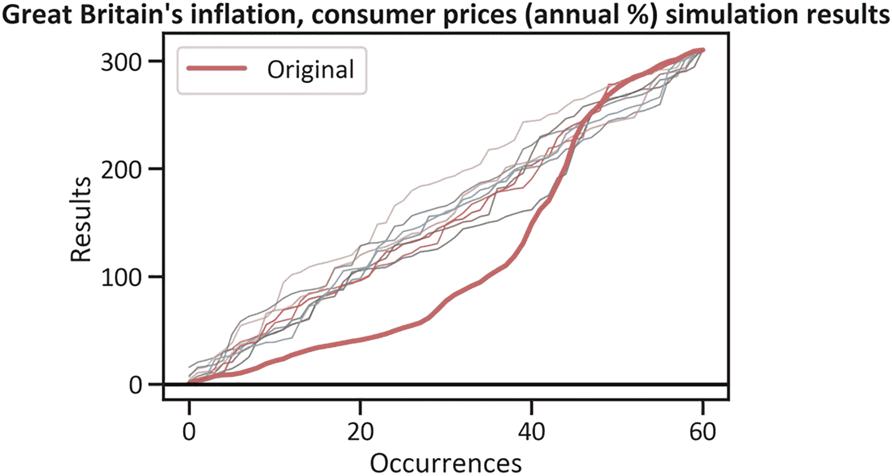
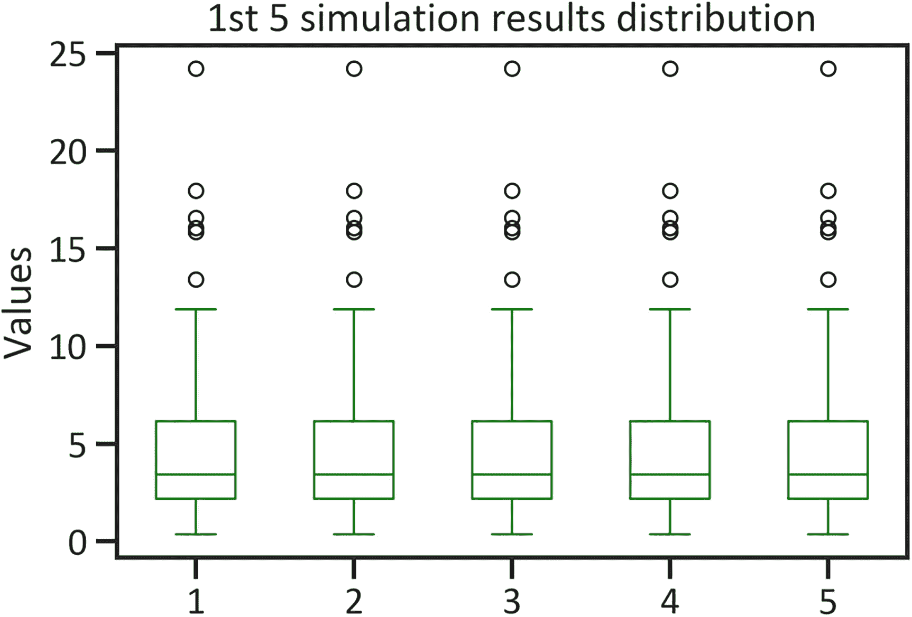
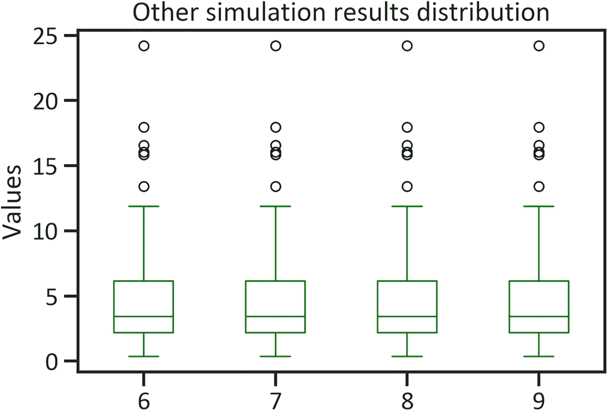

# 九、通货膨胀模拟

本章使用蒙特卡洛模拟模型调查了不同情景对英国通货膨胀和消费价格(以年度百分比表示)的影响。特别是，它采用这个模型来确定一个国家的中央政府债务在多次试验中发生变化的概率。这种方法在处理顺序数据时很有用。

## 了解模拟

本章考虑蒙特卡洛模拟模型。这是一个无监督的模型，因为它不分割数据——该模型探索整个数据集。它通过多次试验学习全部数据，以解释事件发生的可能性。此外，它通过应用蒙特卡罗模型(Monte Carlo model)调查了英国中央政府债务不同情景的影响，该模型确定了中央政府债务在十种情景(模拟的数量)下发生变化的概率。该模型用于金融场景，以确定与投资某一资产类别相关的风险和不确定性。

这种方法在不同的迭代中重现变量的值。通过这样做，它使您能够多次检查数据的变化。有许多模拟方法(即，基于主体的模拟、离散事件模拟、系统动力学模拟和蒙特卡罗模拟)。本章只让你了解最常用的模拟方法——蒙特卡洛模拟法。它模拟变化并识别过去发生的模式和序列的预测值，从而使开发人员能够复制真实世界中的事件。

与前面章节中介绍的模型(除了 k-means)不同，这个模型不需要您拆分数据。除此之外，它还支持重复检查数据，从而提供清晰的变化情况。此外，它不包含复杂的评估指标；你能做的最好的是最大压降(极端负峰值)，包括模拟结果的平均值和标准偏差。为了在不暴露自己的情况下理解风险，在金融领域广泛使用模拟方法(点击此处了解更多信息 <sup>[1](#Fn1)</sup> )。

这个模型适合决策者，因为它可以帮助他们在考虑经济事件的不确定性时有清晰的思路。它可以帮助他们决定何时制定和修改影响借贷活动的政策。它非常直观，您可以通过多次试验将它应用于一个变量以生成输出(模拟)。

在继续之前，请确保您的环境中安装了`pandas_montecarlo`库。要在 Python 环境中安装`pandas_montecarlo`库，请使用`pip install pandas-montecarlo`。同样，要在 Conda 环境中安装库，使用`conda install pandas_montecarlo`。

## 本章的背景

这一章展示了如何通过应用蒙特卡洛模型来预测英国的通货膨胀和消费价格(以年度百分比表示)。表 [9-1](#Tab1) 概述了本章研究的宏观经济指标。

表 9-1

这一章的英国指标

<colgroup><col class="tcol1 align-left"> <col class="tcol2 align-left"></colgroup> 
| 

ID <sup>**1**</sup>

 | 

指示器

 |
| --- | --- |
| `FP.CPI.TOTL.ZG` | 通货膨胀和消费价格(以年度百分比表示) |

清单 [9-1](#PC1) 提取英国的通货膨胀和消费者价格数据(见表 [9-2](#Tab2) )。

表 9-2

英国的通货膨胀和消费价格

<colgroup><col class="tcol1 align-left"> <col class="tcol2 align-left"></colgroup> 
| 

日期

 | 

通货膨胀 _cpi

 |
| --- | --- |
| 2020-01-01 | 0.989487 |
| 2019-01-01 | 1.738105 |
| 2018-01-01 | 2.292840 |
| 2017-01-01 | 2.557756 |
| 2016-01-01 | 1.008417 |

```py
import wbdata
country  = ["GBR"]
indicator = {"FP.CPI.TOTL.ZG":"inflation_cpi"}
df = wbdata.get_dataframe(indicator, country=country,convert_date=True)
df.head()

Listing 9-1Great Britain’s Inflation and Consumer Prices

```

列表 [9-2](#PC2) 用平均值替换缺失值。

```py
df["inflation_cpi"] = df["inflation_cpi"].fillna(df["inflation_cpi"].mean())

Listing 9-2Substitute Missing Values with Mean Value

```

## 描述统计学

清单 9-3 计算了英国从 1960 年到 2020 年的通货膨胀和消费者价格。图 [9-1](#Fig1) 显示了该数据的曲线图。


图 9-1

英国的通货膨胀和消费价格线图

```py
df["inflation_cpi"].plot(kind="line",color="green",lw=4)
plt.title("Great Britain's inflation, consumer prices (annual %)")
plt.ylabel("Inflation, consumer prices (annual %)")
plt.xlabel("Date")
plt.legend(loc="best")
plt.show()

Listing 9-3Great Britain’s Inflation and Consumer Prices Line Plot

```

图 [9-1](#Fig1) 显示了 1970 年初的急剧增长(当时英国的通货膨胀率达到 24.207288)。然而，在 1970 年代中期，出现了明显的下降。2015 年，英国的通货膨胀率低至 0.368047。清单 [9-4](#PC4) 计算英国通货膨胀和消费者价格的分布(见图 [9-2](#Fig2) )。


图 9-2

英国通货膨胀与消费价格分布

```py
df["inflation_cpi"].plot(kind="hist",color="green")
plt.title("Great Britain's inflation, consumer prices (annual %)")
plt.ylabel("Inflation, consumer prices (annual %)")
plt.xlabel("Date")
plt.legend(loc="best")
plt.show()

Listing 9-4Great Britain’s Inflation and Consumer Prices Distribution

```

图 [9-2](#Fig2) 显示该数据正偏。请注意，该模型不需要任何关于数据结构的假设(该模型假设变量是不可识别的)。清单 [9-5](#PC5) 中的命令生成一个表格，该表格提供了更多关于英国通货膨胀和消费者价格相关数据的集中趋势和分散程度的细节(参见表格 [9-3](#Tab3) )。

表 9-3

描述性总结

<colgroup><col class="tcol1 align-left"> <col class="tcol2 align-left"></colgroup> 
| 

可变的

 | 

通货膨胀 _cpi

 |
| --- | --- |
| 数数 | 61.000000 |
| 平均 | 5.090183 |
| 标准 | 4.858125 |
| 福建话 | 0.368047 |
| 25% | 2.089136 |
| 50% | 3.427609 |
| 75% | 6.071394 |
| 最大 | 24.207288 |

```py
df.describe()

Listing 9-5Great Britain’s Inflation and Consumer Prices Descriptive Summary

```

表 [9-3](#Tab3) 显示英国通货膨胀和消费者价格的平均值为 5.090183%。它还显示独立数据点偏离平均值 4.858125。最小值为 0.368047，最大值为 24.207288。

## 蒙特卡罗模拟模型开发

应用模拟器的好处是计算成本低——它们可以更快地训练大样本。清单 [9-6](#PC6) 使用`pandas_montecarlo`库开发蒙特卡洛模拟模型。

```py
import pandas_montecarlo
mc = df['inflation_cpi'].montecarlo(sims=10, bust=-0.1, goal=1)

Listing 9-6The Monte Carlo Model on Great Britain’s Inflation and Consumer Prices

```

清单 [9-6](#PC6) 指定了*破产*，即破产概率为 0.1，以及*目标*，即实现 100%目标的概率。

### 模拟结果

图 [9-3](#Fig3) 显示了根据清单 [9-7](#PC7) 中的代码，英国通货膨胀和消费者价格在几个事件中的预测输出值。



图 9-3

英国通货膨胀和消费价格的蒙特卡罗模拟结果

```py
mc.plot(title="Great Britain's inflation, consumer prices (annual %) simulation results")

Listing 9-7Great Britain’s Inflation and Consumer Prices: Monte Carlo Simulation Results

```

图 [9-3](#Fig3) 显示了英国的通货膨胀和消费者价格在多次试验中飙升。

### 模拟分布

表 [9-4](#Tab4) 概述了基于清单 [9-8](#PC8) 中代码的英国通货膨胀和消费者价格模拟结果的集中趋势和分散情况。

表 9-4

英国的通货膨胀和消费价格:蒙特卡罗模拟描述性摘要

<colgroup><col class="tcol1 align-left"> <col class="tcol2 align-left"> <col class="tcol3 align-left"> <col class="tcol4 align-left"> <col class="tcol5 align-left"> <col class="tcol6 align-left"> <col class="tcol7 align-left"> <col class="tcol8 align-left"> <col class="tcol9 align-left"> <col class="tcol10 align-left"> <col class="tcol11 align-left"></colgroup> 
|   | 

原创

 | 

one

 | 

Two

 | 

three

 | 

four

 | 

five

 | 

six

 | 

seven

 | 

eight

 | 

nine

 |
| --- | --- | --- | --- | --- | --- | --- | --- | --- | --- | --- |
| 数数 | 61.000000 | 61.000000 | 61.000000 | 61.000000 | 61.000000 | 61.000000 | 61.000000 | 61.000000 | 61.000000 | 61.000000 |
| 平均 | 5.090183 | 5.090183 | 5.090183 | 5.090183 | 5.090183 | 5.090183 | 5.090183 | 5.090183 | 5.090183 | 5.090183 |
| 标准 | 4.858125 | 4.858125 | 4.858125 | 4.858125 | 4.858125 | 4.858125 | 4.858125 | 4.858125 | 4.858125 | 4.858125 |
| 福建话 | 0.368047 | 0.368047 | 0.368047 | 0.368047 | 0.368047 | 0.368047 | 0.368047 | 0.368047 | 0.368047 | 0.368047 |
| 25% | 2.089136 | 2.089136 | 2.089136 | 2.089136 | 2.089136 | 2.089136 | 2.089136 | 2.089136 | 2.089136 | 2.089136 |
| 50% | 3.427609 | 3.427609 | 3.427609 | 3.427609 | 3.427609 | 3.427609 | 3.427609 | 3.427609 | 3.427609 | 3.427609 |
| 75% | 6.071394 | 6.071394 | 6.071394 | 6.071394 | 6.071394 | 6.071394 | 6.071394 | 6.071394 | 6.071394 | 6.071394 |
| 最大 | 24.207288 | 24.207288 | 24.207288 | 24.207288 | 24.207288 | 24.207288 | 24.207288 | 24.207288 | 24.207288 | 24.207288 |

```py
simulation_results = pd.DataFrame(mc.data)
simulation_results.describe()

Listing 9-8Great Britain’s Inflation and Consumer Prices: Monte Carlo Simulation Descriptive Summary

```

为了更好地理解英国通货膨胀和消费者价格模拟结果的分布，参见图 [9-4](#Fig4) 和 [9-5](#Fig5) 。清单 [9-9](#PC9) 决定了前五个模拟结果。



图 9-4

前五个模拟结果分布

```py
simulation_results.iloc[::,1:6].plot(kind="box",color="green")
plt.title("1st 5 simulation results distribution")
plt.ylabel("Values")
plt.show()

Listing 9-9The First Five Simulation Results Distribution

```

图 [9-4](#Fig4) 和 [9-5](#Fig5) 显示模拟结果的所有分布都接近正态，每个分布中有六个异常值。参见清单 [9-10](#PC10) 。

```py
simulation_results.iloc[::,6:10].plot(kind="box",color="green")
plt.title("Other simulation results distribution")
plt.ylabel("Values")
plt.show()

Listing 9-10Other Great Britain’s Inflation and Consumer Prices: Simulation Results Distribution

```



图 9-5

其他模拟结果分布

图 [9-4](#Fig4) 和 [9-5](#Fig5) 显示，模拟结果饱和了较低的梯队，可见存在六个异常值。在开发蒙特卡罗模拟模型之前，一定要替换异常值。清单 [9-11](#PC11) 返回表 [9-5](#Tab5) ，它显示了一种检索蒙特卡洛模拟结果统计的简单方法。其中包括*最大下降*，这是英国通胀和消费者价格指数在复苏前从峰值下降的程度，*破产*，这是破产的概率，以及目标，这是实现 100%目标的概率。

表 9-5

试验结果

<colgroup><col class="tcol1 align-left"> <col class="tcol2 align-left"></colgroup> 
|   | 

Zero

 |
| --- | --- |
| 福建话 | 3.105012e+02 |
| 最大 | 3.105012e+02 |
| 平均 | 3.105012e+02 |
| 中位数 | 3.105012e+02 |
| 标准 | 9.087049 电子邮件 |
| Maxdd | 圆盘烤饼 |
| 胸部 | 0.000000e+00 |
| 目标 | 1.000000e+00 |

```py
pd.DataFrame(pd.Series(mc.stats))

Listing 9-11Test Results

```

<aside aria-label="Footnotes" class="FootnoteSection" epub:type="footnotes">Footnotes [1](#Fn1_source)

[T2`https://link.springer.com/chapter/10.1007/978-1-4842-7110-0_4`](https://link.springer.com/chapter/10.1007/978-1-4842-7110-0_4)

 </aside>