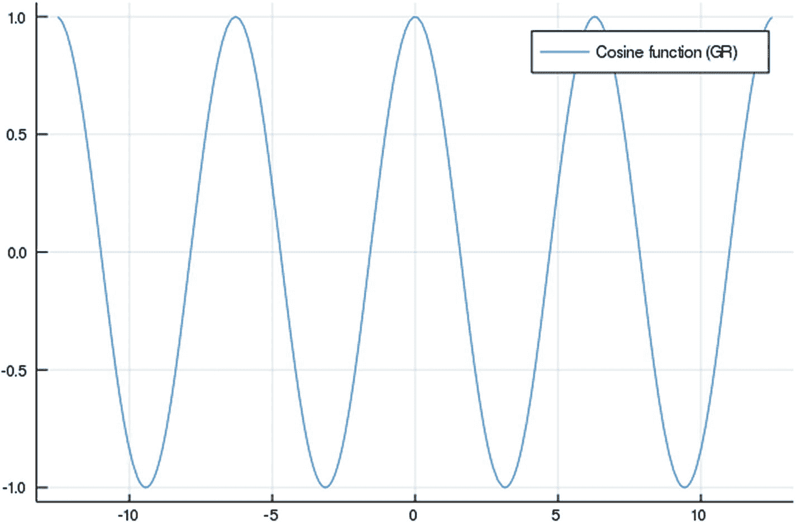
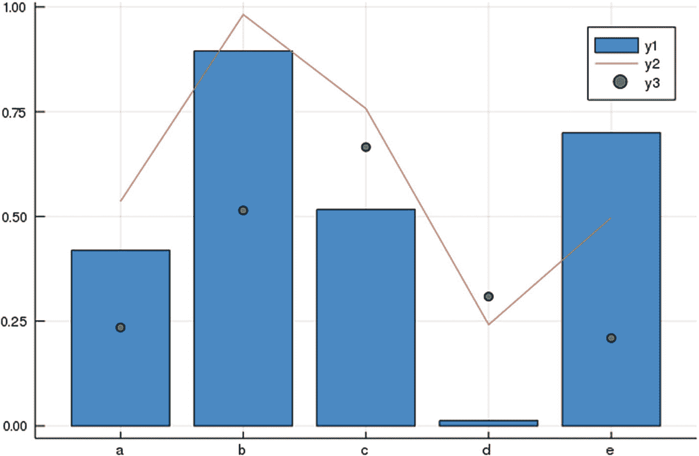
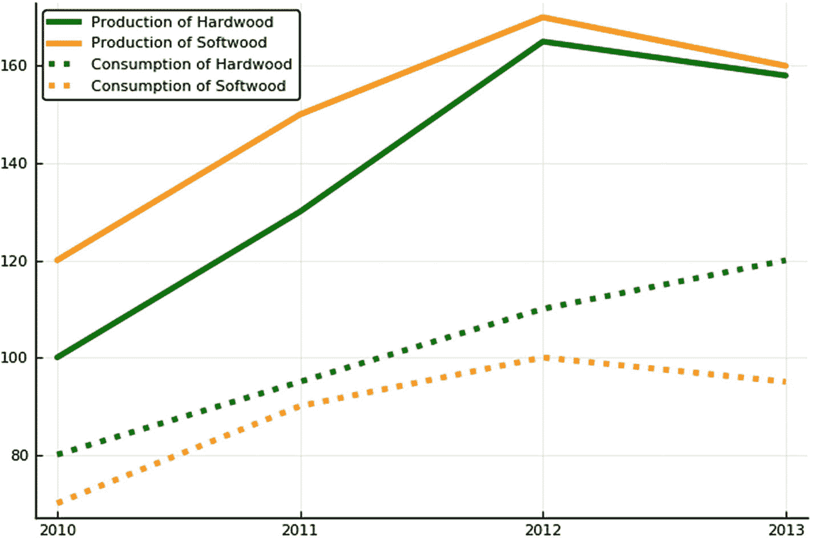

# 9.使用数据

本章包括对以下第三方软件包的讨论:

<colgroup><col class="tcol1 align-left"> <col class="tcol2 align-left"> <col class="tcol3 align-left"></colgroup> 
| `DataFrames.jl` | [T2`https://github.com/JuliaData/DataFrames.jl`](https://github.com/JuliaData/DataFrames.jl) | v0.19.2 |
| `DataFramesMeta.jl` | [T2`https://github.com/JuliaStats/DataFramesMeta.jl`](https://github.com/JuliaStats/DataFramesMeta.jl) | v0.5.0 |
| `Query.jl` | [T2`https://github.com/JuliaDebug/JuliaInterpreter.jl`](https://github.com/JuliaDebug/JuliaInterpreter.jl) | v0.12.1 |
| `IndexedTables.jl` | [T2`https://github.com/JuliaComputing/IndexedTables.jl`](https://github.com/JuliaComputing/IndexedTables.jl) | v0.12.2 |
| `LAJuliaUtils.jl` | [T2`https://github.com/sylvaticus/LAJuliaUtils.jl`](https://github.com/sylvaticus/LAJuliaUtils.jl) | v0.2.0 |
| `Pipe.jl` | [T2`https://github.com/oxinabox/Pipe.jl`](https://github.com/oxinabox/Pipe.jl) | 1.1.0 版 |
| `Plots.jl` | [T2`https://github.com/JuliaPlots/Plots.jl`](https://github.com/JuliaPlots/Plots.jl) | v0.26.1 |
| `StatsPlots.jl` | [`https://github.com/JuliaPlots/StatsPlots.jl`T2](https://github.com/JuliaPlots/StatsPlots.jl) | v0.10.2 |

尽管 Julia 本身已经提供了一个处理表格(和多维)数据的快速结构，即`Array{T,n}`参数化类型，但是已经创建了一个非常大的第三方包集合来专门处理数字数据。

总的来说，这是由于两种需要。

第一个是更方便。DataFrames 或 IndexedTables 之类的包增加了列名之类的元数据，允许开发人员按名称而不是按位置检索数据，用`Query.jl`或`DataFramesMeta.ij`查询，然后用`Pipe.jl`进行连接、分组、链式操作等。

第二个需求是高效的异构数据。为了提高效率，在 Julia base 中，矩阵的所有数据必须是同一类型。另一种选择是与`Array{Any,2}`一起工作，接受较低的性能。

使用前面提到的包，不同的列可以有不同的类型，这种情况在处理数据集时很常见，并且涉及这些数据结构的计算仍然有效。

本章介绍了用于数据操作的主要 Julia 第三方包，包括数据结构、各种查询和操作工具以及绘图和可视化工具。

## 9.1 使用 DataFrames 包

数据帧是你看到的第一个数据结构，也许是最常用的一个。它们非常类似于 R 的 dataframes 和 Python 的 Pandas。方法和函数名也非常相似，尽管访问 API 的方式可能有点不同。与 Pandas 不同，DataFrames 包只处理二维(表格)数据。

在内部，DataFrame 是一个标准数组的集合，每个数组都有自己的类型`T`，或者如果缺少数据，最终是类型`Union{T,Missing}`。

### 安装和导入库

您可以按照通常的方式安装该库:

*   安装库:`] add DataFrames`

*   加载库:`using DataFrames`

本节介绍的一些函数使用`LAJuliaUtils`(见 [`https://github.com/sylvaticus/LAJuliaUtils.jl`](https://github.com/sylvaticus/LAJuliaUtils.jl) )，我个人的实用函数库。

由于这不是一个注册的 Julia 包，请安装它:

```py
] add https://github.com/sylvaticus/LAJuliaUtils.jl.git

```

### 9.1.2 创建数据帧或加载数据

这些是创建或加载数据帧的各种方法(简称“df”)。从逗号分隔或 Excel 文件加载 df 的方法在第 [5](05.html) 章“解析 CSV 文件”一节中讨论，因为 DataFrame 是默认的输出格式。

要从头开始创建 df:

注意下面(虚构的)木材市场数据库:我将在整个章节中引用它。

```py
df = DataFrame(region      = ["US","US","US","US","EU",                             “EU”,"EU","EU"],      JULIA
               product     = ["Hardwood","Hardwood","Softwood","Softwood","Hardwood","Hardwood","Softwood","Softwood"],
               year        = [2010,2011,2010,2011,2010,2011,2010,2011],
               production  = [3.3,3.2,2.3,2.1,2.7,2.8,1.5,1.3],
               consumption = [4.3,7.4,2.5,9.8,3.2,4.3,6.5,3.0])

```

要创建空 df:

```py
df = DataFrame(A = Int64[], B = Float64[])

```

要从数据矩阵和列名的(单独)向量转换 df:

```py
mat = [1 2 3; 4 5 6]
headerstrs = ["c1", "c2", "c3"]
df = DataFrame([[mat[:,i]...] for i in 1:size(mat,2)], Symbol.(headerstrs))

```

要从矩阵转换 df，其中标题在矩阵的第一行中定义:

```py
mat = ["c1" "c2" "c3"; 1 2 3; 4 5 6]
df = DataFrame([[mat[2:end,i]...] for i in 1:size(mat,2)], Symbol.(mat[1,:]))

```

从代码中定义的表创建 df:

```py
using CSV      JULIA
df = CSV.read(IOBuffer("""
region product  year production consumption
US     Hardwood 2010 3.3        4.3
US     Hardwood 2011 3.2        7.4
US     Softwood 2010 2.3        2.5
US     Softwood 2011 2.1        9.8
EU     Hardwood 2010 2.7        3.2
EU     Hardwood 2011 2.8        4.3
EU     Softwood 2010 1.5        6.5
EU     Softwood 2011 1.3        3.0
"""),delim=" ", ignorerepeated=true, copycols=true)

```

如果没有`copycols=true`参数，产生的数据帧将以只读模式提供。

要从 OpenDocument 电子表格文件(OpenOffice、LibreOffice、MS Excel 等使用的格式)导入 df，请使用`OdsIO`包中的`ods_read()`函数( [`https://github.com/sylvaticus/OdsIO.jl`](https://github.com/sylvaticus/OdsIO.jl) )，以及`retType="DataFrame"`参数和左上/右下`range`:

```py
df = ods_read("spreadsheet.ods";sheetName="Sheet2",retType="DataFrame",range=((tl_row,tl_col),(br_row,br_col)))      JULIA

```

### 9.1.3 了解数据

一旦有了数据帧，您可能想要分析其数据或结构:

*   `show(df)`:显示 df 摘录(取决于可用空间)。使用`allrows=true`和`allcols=true`来检索整个 df，不管它有多大。

*   `first(df,n)`:显示测向的前 *n* 行。

*   `last(df, 6)`:显示测向的最后 *n* 行。

*   `describe(df)`:检索 df 每一列的类型和基本描述性统计。

*   `names(df)`:返回列名数组(作为符号，而不是字符串)。

*   `for r in eachrow(df)`:迭代每一行。

*   `for c in eachcol(df)`:迭代每一列。

*   `unique(df.fieldName)`或`[unique(c) for c in eachcol(df)]`:返回列的唯一元素。

*   `[eltype(c) for c in eachcol(df)]`:返回列类型的数组。

*   `size(df)` (rows，cols)，`size(df)[1]` (rows)，`size(df)[2]` (cols):返回 df 的大小。

注意，列名是 Julia 符号，而不是字符串。要以编程方式编写列名，您需要使用`Symbol(aString)`构造函数。比如`Symbol("value_",0)`。

### 9.1.4 过滤数据(选择或查询数据)

要选择(过滤)数据，可以使用 DataFrame 包提供的方法或者其他包提供的专门方法，比如`DataFrameMeta.jl`或者`Query.jl`。

特别是，`Query.jl`包旨在提供一个通用的 API，不管数据后端如何，它都是有效的。

*   要选择整列:
    *   `df[:,:cNames]`:通过复制数据选择多列(如`df[:,[:product,:year] ]`)。

    *   `df[!,:cNames]`:参照数据选择多列(如`df[!,[:product,:year] ]`)。

    *   `df.cName`:选择一个单独的列(如`df.product`)(被引用，即等于`df[!,:cName]`)。

    *   `df[cPos]:`通过复制数据选择一列或多列(如`df[2]`)。

*   选择整行:
    *   `df[rPos,:]`:选择一行或多行(如`df[2,:]`)。与列不同，行没有标题名。

*   选择单元格:
    *   `df.cName[rPos]`:选择`cName`列中的特定单元格(如`df.product.[1:2:6]`)。

    *   `df[rPos, :cName(s)]`或`df[rPos,cPos]`:根据行位置和列名或位置选择具体的单元格(如`df[2,:product]`)。

其中:

*   `cName`是单独的列名(符号)。

*   `cNames`是列名(符号)的数组。

*   `rPos`是行位置(标量、数组或范围)。

*   `cPos`是列的位置(标量、数组或范围)。

返回的选择是:

*   如果是单列，则为一个`Array{T,1}`

*   一个`DataFrameRow`(类似于数据帧)如果它是一个单行

*   如果是单个细胞

*   否则另一个数据帧

过滤:

*   `df[arrayOfBooleans,:]`:选择`arrayOfBooleans`(必须全等大小)为`true`的行。这被称为“布尔选择”。

    This also works with column positions to select rows and columns at the same time (but not for a matrix of Boolean values to use as a mask). Some examples:
    *   `df[ [true,true,false,false,false,false,false,false],[true,true,true,false,true]]`选择除第四列之外的所有列的前两行。

    *   `df[ [i in [“US”,”China”] for i in df.region], :]`通过列表理解，基于使用布尔选择的列表中的值，按值过滤。list comprehension 部分根据条件返回一个布尔值数组，然后对它使用布尔选择。

    *   `df[([i in [“US”,”China”] for i in df.region] .> 0) .& (df.year .== 2010), :]`通过布尔选择中的多个条件进行过滤。点是矢量化操作所必需的。注意按位和单个&符号的使用。

    *   `df[startswith.(df.region,”E”),:]`根据期望值的初始模式进行过滤。

*   `@where(df, condition(s))`:使用`@where`进行过滤(来自 DataFrameMeta 包)。如果有多个条件，必须全部验证。如果列名存储在变量中，您需要使用`cols()`函数包装它。比如`colToFilter = :region; @where(df, :production .> 3, cols(colToFilter) .== "US")`。

查询数据帧的另一种方式(也许更优雅，虽然更长)是使用`Query`包(参见 [`https://github.com/queryverse/Query.jl`](https://github.com/queryverse/Query.jl) )。第一个示例选择行和列的子集；第二个例子强调了如何混合多个选择标准:

```py
dfOut = @from i in df begin      JULIA
           @where i.region == "US"
           # Select a group of columns, eventually changing their name:
           @select {i.product, i.year, USProduction=i.production}
           @collect DataFrame
        end
dfOut = @from i in df begin
            @where i.production >= 3 && i.region in ["US","China"]
            @select i # Select the whole rows
            @collect DataFrame
        end

```

### 编辑数据

您可以通过多种方式编辑数据:

*   `df[rowIdx,:col1] .= aValue`:通过指定行和列来编辑值(如`df[[1,2],:production] .= 4.2`)。

*   `df[(df.col1 .== "foo"), :col2] .= aValue`:通过布尔选择(如`df[(df.region .== "US") .& (df.product .== "Hardwood"), :production] .= 5.2`)过滤改变数值。

*   `df.col1 = map(akey->myDict[akey], df.col1`):基于字典替换值(或添加列)(原始数据—`df.col1`—可能在不同的列或不同的数据框架中，例如`rFullName = Dict("US" => "United States", "EU" => "European Union"); df.regFullName = map(rShortName->rFullName[rShortName], df.region)`)。

*   `df.newCol = df.col1 .* " " .* df.col2`:连接几列的值(字符串)以在新列中创建值(如`df.regAndProduct = df.region .* " " .* df.product`)。

*   `df.a = df.b .* df.c`:根据其他列的值计算现有列或新列的值。注意，您需要进行基于元素的操作。有时(例如，加法和减法)不需要，但是通常列之间的操作应该使用点运算符(除了实际的等号赋值)。

    或者，你可以使用`map`。例如，`df.netExport = map((p,c) -> p - c, df.production, df.consumption).`

*   `push!(df, [aRowVector])`:向 df 追加一行，如`push!(df,["EU" "Softwood" 2012 5.2 6.2])`。

*   `deleterows!(df,rowIdx)`:删除给定的行。`rowIds`可以是标量、向量或范围。或者，您可以只复制 df，而不复制不需要的行，例如`i=3; df2 = df[[1:(i-1);(i+1):end],:]`。

*   `df = similar(df,0)`:清空一个 df。`df2= similar(df,n)`通过将 *n* 行(带有垃圾数据)添加到新的数据帧中来复制 df 的结构( *n* 默认为`size(df)[1]`)。你可以使用`n=0`来清空给定的 df。

### 编辑结构

还有许多方法可以编辑数据的结构:

*   `select!(df,Not([:col1,:col2]))`:按名称删除列。

*   `names!(df, [:newCName1,:newCName2,:newCName3])`:重命名所有列。使用`rename!(df, Dict(:oldCName1=> :newCName1))`只重命名几列。

*   `df = df[:,[:b, :a] ]`:改变列顺序。

*   `df.id = 1:size(df, 1)`:增加一个“id”栏(用于拆分一个操作；我们将在本章后面看到更多的内容)。

*   `addCols!(df, [:colNames], [colTypes])`:将`colTypes`类型的空列`colNames`添加到数据帧中(来自`LAJuliaUtils`包)。例如，`addCols!(df, [:import, :export], [Float64, Float64])`。

*   `df.a = Array{Union{Missing,Float64},1}(missing,size(df,1))`:增加一个`Float64`列(缺省值填充)。

*   `insert!(df, i, [colContent], :colName)`:在`i`位置插入一列。

*   `df.a = convert(Array{T,1},df.a)`:将列类型转换为`T`。

*   `df.a = map(string, df.a)`:从 Int64(或 Float64)转换成 String(如`df.namedYear = map(string,df.year)`)。

*   `stringToFloat(str) = try parse(Float64, str) catch; return(missing) end; df.a = map(stringToFloat, df.a`):从 String 转换成 Float(转换成整数类似)。

*   `categorical!(df, [:a, :b])`:“汇集”特定的列，以便有效地存储重复的分类变量。请注意，当内存减少时，使用分类值进行过滤不一定会更快(实际上可能会慢一点)。

*   `collect(df.a])`:将分类数组转换成普通数组。

#### 合并/连接/复制数据集

您可以使用以下方法连接数据集:

*   `df = vcat(df1,df2,df3)`:垂直串接结构相同的不同数据帧(或`df = vcat([df1,df2,df3]...)`)(注意末尾的三个点，即 splat 运算符)。

*   `df = hcat(df1,df2, makeunique=true)`:水平连接具有相同行数的数据帧。如果要合并的数据帧具有相同名称的列，则需要`makeunique=true`。

*   `fullDf = join(df1, df2, on = :commonCol)`:水平连接数据框。`on`参数也可以是公共列的数组。`join`有很多种可能的类型。最常见的有`:inner`(默认；只返回两边都有键的行)，`:left`(也返回左边 df 上没有键的行)，`:right`(与`:left`相反)，和`:outer`(也返回两个 df 中任何一个缺少元素的行)。

*   `df2 = similar(df1, 0)`:复制一个数据帧的结构(到一个空的)。

### 管理缺失值

回想一下，丢失的值(即`missing`，singleton `Missing`类型的唯一实例)如果没有得到处理，将会在操作间无声地传播。DataFrames 包提供了一系列方法，允许程序员根据对缺失的解释来决定如何处理这些数据:

*   `dropmissing(df)`和`dropmissing!(df)`:返回一个只有完整行的 df，即任何字段都没有`missing`(`dropmissing(df[[:col1,:col2]])`也可以)。在一个运算中(如求和)，您可以使用`dropmissing()`在运算发生前跳过`missing`值。

*   `completecases(df)`或`completecases(df[ [:col1,:col2]])`:返回一个关于整行或指定字段缺勤的布尔数组。

*   `[df[ismissing.(df[!,i]), i] .= 0 for i in names(df) if Base.nonmissingtype(eltype(df[!,i])) <: Number]`:将所有数值列中的`missing`替换为`0`值，如`Float64`和`Int64`。

*   `[df[ismissing.(df[!,i]), i] .= "" for i in names(df) if Base.nonmissingtype(eltype(df[!,i])) <: String]`:将所有字符串列中的`missing`替换为`""`值。

*   `isequal.(a,b)`:不丢失传播的比较(如`isequal("US",missing)`返回 false，而`"US" == missing`既不是`true`也不是`false`，而是`missing`)。

*   `nMissings = length(findall(x -> ismissing(x), df.col))`:统计一列中的`missing`值。

### 9.1.8 分割-应用-组合策略

DataFrames 包通过`by`函数支持常见的*分割-应用-组合*策略，该函数接受三个参数:(1)数据帧，(2)分割数据帧的一列(或多列)，以及(3)应用于数据帧每个子集的函数或表达式。

使用`by`函数," inner "函数将应用于每个子组，无论它返回什么(标量、数组、命名元组或数据帧),都将首先与定义子组的值进行水平合并，然后进行垂直合并("组合")，以组成由`by`函数返回的最终数据帧。返回命名元组或数据帧允许标记新列，出于性能原因，首选第一列。

`by`函数的一个方法取该函数作为第一个参数，因此通常使用`do`块来应用。

在内部，`by`函数使用`groupby()`函数，因为在代码中，它被定义为:

```py
by(d::AbstractDataFrame, cols, f::Function) = combine(map(f, groupby(d, cols)))                         JULIA
by(f::Function, d::AbstractDataFrame, cols) = by(d, cols, f)

```

让我们看看如何将`by`函数应用于一些常见的数据转换模式。

#### 聚集

在聚合的情况下，您希望减少定义一个或多个运算的每个子组的维数，每个运算返回一个标量来代替子组的许多可能值(例如，总和或平均值)。

内部函数必须返回一个*行*——比如一个命名元组或者一个`DataFrameRow`，一个只有一行的数据帧。

以下示例显示了按地区和按产品进行聚合的不同方式。这些例子使用了木材市场数据的前一个例子(函数`mean`需要标准库包`Statistics`):

```py
# Inner function returning an horizontal array (a row) (new columns are given automatic names)                  JULIA
by(df, [:region, :product]) do subgroup
  [mean(subgroup.production) sum(subgroup.consumption)]
end

# Inner function returning a named tuple (returned columns are named)
by(df, [:region, :product]) do subgroup
  (avgProduction=mean(subgroup.production), totalConsumption=sum(subgroup.consumption))
end

# Inner function returning a DataFrame with a single row per subgroup
by(df, [:region, :product]) do subgroup
  DataFrame(avgProduction=mean(subgroup.production), totalConsumption=sum(subgroup.consumption))
end

```

由于聚合是一个非常常见的操作，DataFrames 包提供了一个专门的`aggregate(df, aggregationColumn(s), operation(s))`函数，该函数通过所需的字段直接聚合 df，并将指定的操作应用于每个组，以便为每个组检索单个值。例如，`aggregate(df, [:region, :product], [sum, mean])`(使用前面的示例)将返回对应于每个类别的值集(生产和消费)的总和和平均值。

注意，`aggregate`函数的便利性是以丧失通用性为代价的。您不能指定对要聚合的不同值执行哪种操作(例如，在前面的示例中，mean 仅用于生产，sum 仅用于消费)。

此外，所有分类列必须包含在参数`aggregationColumns`中；否则，Julia 会尝试对它们应用运算，在大多数情况下，会引发错误(因为运算需要数值，而分类列通常是字符串)，而不是忽略它们。

解决方法是在执行聚合之前删除不需要的字段(在本例中是 year: `select! (df,Not(:year)); aggregate(df, [:region, :product], [sum, mean])`)。

#### 按类别计算累积和

让我们再次考虑木材市场的原始(虚构)数据库，并寻求获得每年的累积产量。

这项任务的难点在于给定行上的值依赖于同一子组中前面行的值，这意味着顺序很重要。

您可以通过`by`功能再次使用分割-应用-合并策略:

```py
dfCum = by(df,[:region,:product]) do subdf      JULIA
   return (year = subdf[:year], cumProd = cumsum(subdf[:production]))
end

```

与聚合情况不同，对于这里的每个子组，您需要几行，每个原始记录一行。向定义子组的列(`region`和`product`)添加回使用同源函数获得的`year`和`cumsum`列。注意 DataFrames 包足够“智能”将`year`标量扩展为一个长度为`cumProd`的数组。

或者，您可以使用带有`@linq`宏(来自`DataFramesMeta`)的分割-应用-组合策略:

DataFramesMeta 包提供了`@linq`宏，它在链式数据转换操作上支持*语言集成查询*风格，方式类似于 R 的`dplyr`包( [`https://cran.r-project.org/web/packages/dplyr/`](https://cran.r-project.org/web/packages/dplyr/) ):

```py
dfCum = @linq df |>      JULIA
              groupby([:region,:product]) |>
              transform(cumValue = cumsum(:production))

```

这里，`|>`表示*流水线*操作符(我们将在后面的章节中更详细地看到它)，它将左边操作返回的对象作为第一个参数传递给右边的操作。数据(`df`)最初传递给`groupby`函数进行分割，分割后的子组最终传递给`transform(df, operation)`函数进行修改。

### 旋转数据

表格数据可以等效地用两种布局来表示，*长*和*宽*。

一个*长的*布局是当你在一个单独的列上指定每个维度，然后你有一个单独的列用于你认为的“值”。如果数据库中有多个变量，那么“变量”也会变成一个维度列。

例如，以木材市场为例，表 [9-1](#Tab1) 显示了一个长格式的表。

表 9-1

长格式的表格

<colgroup><col class="tcol1 align-left"> <col class="tcol2 align-left"> <col class="tcol3 align-left"> <col class="tcol4 align-left"> <col class="tcol5 align-left"></colgroup> 
| 

地区

 | 

产品

 | 

年

 | 

可变的

 | 

价值

 |
| --- | --- | --- | --- | --- |
| 美国 | 硬木 | Two thousand and ten | 生产 | Three point three |
| 美国 | 硬木 | Two thousand and ten | 生产 | Three point three |
| 美国 | 硬木 | Two thousand and eleven | 生产 | Three point two |
| 美国 | 软木材 | Two thousand and ten | 生产 | Two point three |
| ..等等.. |   |   |   |   |

长格式可读性较差，但是非常容易处理和执行数据分析。

另一方面，在*宽*格式中，值在多个列上表示，其中一个或多个维度沿着水平轴表示。见表 [9-2](#Tab2) 。

表 9-2

一张格式广泛的桌子

<colgroup><col class="tcol1 align-left"> <col class="tcol2 align-left"> <col class="tcol3 align-left"> <col class="tcol4 align-left"> <col class="tcol5 align-left"></colgroup> 
| 

地区

 | 

产品

 | 

年

 | 

生产

 | 

消费

 |
| --- | --- | --- | --- | --- |
| 美国 | 硬木 | Two thousand and ten | Three point three | Four point three |
| 美国 | 硬木 | Two thousand and eleven | Three point two | Seven point four |
| 美国 | 软木材 | Two thousand and ten | Two point three | Two point five |
| 美国 | 软木材 | Two thousand and eleven | Two point one | Nine point eight |
| ..等等.. |   |   |   |   |

原始格式的 timber 示例是一个宽表，但是您可以使用多个水平轴创建更宽样式的表(DataFrames 包不支持)。参见表 [9-3](#Tab3) 。

表 9-3

格式更宽的表格(有多个水平轴)

<colgroup><col class="tcol1 align-left"> <col class="tcol2 align-left"> <col class="tcol3 align-left"> <col class="tcol4 align-left"> <col class="tcol5 align-left"> <col class="tcol6 align-left"></colgroup> 
|   | 

**生产**

 |   | 

**消耗**

 |   |
| --- | --- | --- | --- | --- |
| 

**硬木**

 | 

**软木**

 | 

**硬木**

 | 

**软木**

 |
| --- | --- | --- | --- |
| 美国 | Two thousand and ten | Three point three | Two point three | Four point three | Two point five |
| 美国 | Two thousand and eleven | Three point two | Two point one | Seven point four | Nine point eight |
| 欧盟 | Two thousand and ten | Two point seven | One point five | Three point two | Six point five |
| 欧盟 | Two thousand and eleven | Two point eight | One point three | Four point three | three |

在水平和垂直维度之间移动轴的操作称为*枢转*。特别是，*堆叠*移动列并将其扩展为新行，从而从宽格式移动到长格式。*拆栈*做相反的事情，取行并将它们的值作为新列，从而创建一个“更宽”的表。

#### 堆叠列

DataFrames 包提供了`stack(df,[cols])`函数和`melt(df,[cols])`函数，前者用于指定要堆叠的列，后者用于指定其他列，即已经以堆叠形式存在的分类列。

最后，`stack(df)`—没有列名—自动堆叠所有浮点列。

注意，堆叠列的标题作为数据插入到`variable`列中(变量的名称是符号，而不是字符串),相应的值插入到`value`列中。

```py
longDf = stack(df,[:production,:consumption])      JULIA
longDf1 = melt(df,[:region,:product,:year])
longDf2 = stack(df)
longDf == longDf1 == longDf2 # true
│ Row │ variable    │ value   │ region │ product  │ year  │
│     │ Symbol      │ Float64 │ String │ String   │ Int64 │
├───┼─────────┼──────┼──────┼───────┼─────┤
│ 1   │ production  │ 3.3     │ US     │ Hardwood │ 2010  │
│ 2   │ production  │ 3.2     │ US     │ Hardwood │ 2011  │
│ 3   │ production  │ 2.3     │ US     │ Softwood │ 2010  │
│ 4   │ production  │ 2.1     │ US     │ Softwood │ 2011  │
...etc...

```

#### 拆垛

DataFrames 包还提供了`unstack(longDf, [:rowField(s)], :variableCol, :valueCol)`，您可以在这里给出即使在宽格式中也应该保持为分类变量的列的列表、存储必须在水平轴上展开的类别的列的名称，以及包含相应值的列的名称。

您可以用`unstack(longDf, :variableCol, :valueCol)`省略分类变量列表，然后除了定义列名和定义列值的列之外，所有现有的列都将被保留为分类列:

```py
wideDf = unstack(longDf,[:region, :product, :year],:variable,:value)                                      JULIA
wideDf1 = unstack(longDf,:variable,:value)
wideDf == wideDf1 # true

```

 *多轴工作台*

`unstack`的`:variable`参数是标量而不是矢量的事实是 Julia 数据帧仅支持一个水平轴的结果。

虽然多个水平轴数据帧很难分析和处理，但在某些情况下，它们可以作为数据的最终表示形式。您可以模拟在不同列上拆分多个水平轴数据帧，然后水平合并子数据帧。要获得表 [9-3](#Tab3) ，您可以使用:

```py
wideDf_p = unstack(wideDf,[:region,:year],:product,:production) JULIA
wideDf_c = unstack(wideDf,[:region,:year],:product,:consumption)
rename!(wideDf_p, Dict(:Hardwood => :prod_Hardwood, :Softwood =>
:prod_Softwood))
rename!(wideDf_c, Dict(:Hardwood => :cons_Hardwood, :Softwood =>
:cons_Softwood))
wideWideDf = join(wideDf_p,wideDf_c, on=[:region,:year])

```

#### 枢纽功能

可以使用`LAJuliaUtils.jl`包( [`https://github.com/sylvaticus/LAJuliaUtils.jl`](https://github.com/sylvaticus/LAJuliaUtils.jl) )中的`pivot(df, [:rowField(s)], :variableCol, :valueCol; <keyword arguments>)`函数，使用类似电子表格的透视方式，将堆叠的(长)数据帧透视并可选地过滤和排序到单个函数中。

与`unstack`一样，`pivot`接受即使在宽格式中也应该作为分类变量的列的列表、存储必须在水平轴上展开的类别的列的名称，以及包含相应值的列的名称。

可选关键字如下:

*   `ops=sum`:对数据进行的操作，默认为求和。`ops`可以是单个数组上任何支持的 Julia 操作，例如:`sum`、`mean`、`length`、`countnz`、`maximum`、`minimum`、`var`、`std`、`prod`。可以使用一个数组指定多个操作，在这种情况下，会创建一个额外的`op`列来索引它们。

*   `filter`:可选过滤器，以 column _ to _ filter 允许值列表]字典的形式(仅支持`in`过滤器)。

*   `sort`:可选的要排序的行字段。使用一个元组而不仅仅是`:colname`，你可以指定反向排序(例如`(:colname, true)`)或者甚至自定义排序顺序(例如`(:colname, [val1,val2,val3])`)。在这种情况下，没有指定的元素被放在末尾。

    您可以在一个数组中传递多个要排序的列，例如`[(:col1,true),:col2,(:col3,[val1,val2,val3])]`。

例如，`pivot`功能可通过以下方式用于木材长数据框:

<colgroup><col class="tcol1 align-left"> <col class="tcol2 align-left"> <col class="tcol3 align-left"> <col class="tcol4 align-left"></colgroup> 
| 

**地区**

 | 

**产品**

 | 

**Op**

 | 

**消耗**

 |
| --- | --- | --- | --- |
| 美国 | 硬木 | 意思是 | Five point eight five |
| 美国 | 硬木 | 定义变量 | Four point eight zero five |
| 欧盟 | 硬木 | 意思是 | Three point seven five |
| 欧盟 | 硬木 | 定义变量 | Zero point six zero five |
| 美国 | 软木材 | 意思是 | Six point one five |
| 美国 | 软木材 | 定义变量 | Twenty-six point six four five |
| 欧盟 | 软木材 | 意思是 | Four point seven five |
| 欧盟 | 软木材 | 定义变量 | Six point one two five |

```py
pivDf  = pivot(longDf, [:region, :product],:variable,:value, JULIA
  ops = [mean, var],
  filter = Dict(:variable => [:consumption]),
  sort   = [:product, (:region, true)]
)

```

除了关键字参数之外，`unstack`的主要区别在于，如果您手动列出分类列并省略一列或多列(例如，您在`wideDf = unstack(longDf,[:region, :product],:variable,:value)`中省略了`:year`，您将在未堆叠的数据帧中结束重复的条目(行)，最后的条目覆盖了同一类别下最早的条目。另一方面，使用`pivot`，使用指定的聚合操作(如果没有指定，则使用 sum)计算所有条目。

#### 整理

可以使用带有`sort!(df, (:columnsToSort), rev = (reverseSortingFlags))`的多列对数据帧进行排序(例如，`sort!(df,(:year, :region, :product), rev = (false, true, false))`)。(可选)逆序参数(`rev`)必须是一个与`cols`参数大小相同的布尔值元组。

如果您需要对行进行自定义排序，您可以再次依赖`LAJuliaUtils`，它提供了`customSort!(df, sortops)`，其中`sortops`与您在`pivot`函数中看到的`sort`选项相同。

### 数据帧导出

#### 导出到 CSV

我们在第 [5 章](05.html)中看到的`CSV.jl`包直接支持将数据帧导出为 CSV 格式:

```py
CSV.write("file.csv", df)

```

有关导出选项，请参考第 [5](05.html) 章中的“导出为 CSV”一节。

#### 导出到 OpenDocument 电子表格文件

同样，可以通过`OdsIO_`包( [`https://github.com/sylvaticus/OdsIO.jl`](https://github.com/sylvaticus/OdsIO.jl) )导出到 OpenDocument 电子表格格式(OpenOffice、LibreOffice、MS Excel 等支持):

```py
ods_write("spreadsheet.ods",Dict( ("MyDestSheet",3,2) => df) )

```

其中字典的键是一个三元素元组，它指定了表名，左上角单元格的数字坐标决定了数据帧的导出位置。

#### 导出到矩阵

您可以使用`convert`将数据库——或者它的一部分——转换成矩阵。

*   `convert(Matrix, df)`:转换为`Array{Any,2}`

*   `convert(Matrix{Union{String,Int64,Float64}},df)`:更好，转换为`Array{Union{Float64, Int64, String},2}`

*   `convert(Matrix, df[:,[:production,:consumption]])`:拾取同质类型的列，产生一个`Array{Float64,2}`

#### 导出到字典

要将 DataFrame 转换成字典，您可以使用由`LAJuliaUtils`包提供的`toDict(df, [:dimCols], :valueCol)`，它通过指定用作键的列(按照给定的顺序)和用于存储字典值的列，将 DataFrame 转换成字典。

例如，`toDict(df,[:region,:product,:year],:production)`将导致如下结果:

```py
Dict{Any,Any} with 8 entries:      JULIA
  ("EU", "Softwood", 2011) => 1.3
  ("US", "Softwood", 2010) => 2.3
  ("US", "Hardwood", 2010) => 3.3
  ("US", "Hardwood", 2011) => 3.2
  ("EU", "Softwood", 2010) => 1.5
  ("US", "Softwood", 2011) => 2.1
  ("EU", "Hardwood", 2010) => 2.7
  ("EU", "Hardwood", 2011) => 2.8

```

#### 导出为 hdf5 格式

为了将 hdf5 与`HDF5`包( [`https://github.com/JuliaIO/HDF5.jl`](img/https://github.com/JuliaIO/HDF5.jl) )一起使用，某些系统可能要求您安装系统范围的 hdf5 二进制文件。例如，在基于 Deb 的 Linux 发行版中，您应该运行`sudo apt-get install hdf5-tools`。

HDF5 软件包不直接支持数据帧，因此您需要首先将其导出为矩阵。另一个限制是它不接受`Any`或`Union{}`类型的矩阵，所以您可能必须将数据帧分为两部分导出——分别是字符串和数字列。

```py
h5write("out.h5", "mygroup/myDf", convert(Array, df[:,[:cols]]))

```

您可以使用`data = h5read("out.h5", "mygroup/myDf")`回读数据。

## 9.2 使用索引表

`IndexedTables` ( [`https://github.com/JuliaComputing/IndexedTables.jl`](https://github.com/JuliaComputing/IndexedTables.jl) )是可供选择的表状数据结构。与 DataFrame 相比，它们的 API 不太方便，但它们特别有趣:( a)对于高性能的行选择，因为它们在内部使用索引命名元组(而不是 data frame 中的数组),( b)作为数据管理包的大型 JuliaDB 生态系统( [`https://juliadb.org/`](https://juliadb.org/) )的一部分，能够处理不在单台机器的内存中的非常大的数据集。

它们有两种变体——普通索引表(`IndexedTable`)和稀疏索引表(`NDSparse`)。

在这两个选项中，我只讨论第二个，因为第一个选项可以通过行的位置来选择，而且它可能没有`NDSparse`有趣，在这里您可以使用键来代替。

### 9.2.1 创建索引表(NDSparse)

```py
myTable = ndsparse((      JULIA

             region      = ["US","US","US","US","EU","EU","EU","EU"],
             product     = ["Hardwood","Hardwood","Softwood","Softwood","Hardwood","Hardwood","Softwood","Softwood"],
             year        = [2011,2010,2011,2010,2011,2010,2011,2010]
          ),(
            production = [3.3,3.2,2.3,2.1,2.7,2.8,1.5,1.3],
            consumption = [4.3,7.4,2.5,9.8,3.2,4.3,6.5,3.0]
         ))

```

稀疏索引表是用`ndsparse`函数创建的，它接受一个命名元组(使用两个括号的原因)或一对命名元组。原因是`IndexedTables`在*键*列和*值*列之间显式划分(具有单个命名元组的方法假定最后一列为值)。

可视化索引表时，键列和值列之间的区别非常明显:

```py
julia> myTable      JULIA
3-d NDSparse with 8 values (2 field named tuples):
region  product     year │ production  consumption
──────────────────┼──────────────────
"EU"    "Hardwood"  2010 │ 2.8         4.3
"EU"    "Hardwood"  2011 │ 2.7         3.2
"EU"    "Softwood"  2010 │ 1.3         3.0
"EU"    "Softwood"  2011 │ 1.5         6.5
"US"    "Hardwood"  2010 │ 3.2         7.4
"US"    "Hardwood"  2011 │ 3.3         4.3
"US"    "Softwood"  2010 │ 2.1         9.8
"US"    "Softwood"  2011 │ 2.3         2.5

```

此外，您可能会注意到该表已经自动排序，就像在字典中一样。

还可以使用相同的函数从现有的数据帧(例如`myTable = ndsparse(df)`)中获得索引表。

(稀疏)索引表在一些自解释函数中被接受为自变量，例如`show`、`first`、`colnames`、`pkeynames`和`keytype.`

索引表不适用于“组合”键(跨所有维度的键)重复的数据。构造函数仍然允许您创建索引表，但是许多方法会产生错误。

### 行过滤

如上所述，索引表的主要优点是它们提供了非常快速的行选择。

```py
t[keyForDim1,keyforDim2,:,keyForDim3,...]

```

这将选择与给定的键集匹配的行，用冒号(`:`)表示该特定维度的所有值。如果结果是单个值，则返回命名元组；如果不是，则返回另一个稀疏索引表。

正如所声称的，选择非常快:

```py
n = 1000      JULIA
keys = shuffle!(reshape([[a b] for a in 1:n, b in 1:n], n^2)) # generate random keys for two dimensions.
`Shuffle` is defined in the `Random` standard library package
x = rand(n^2)
# generate random values
myTable = ndsparse((a=[keys[i][1] for i in 1:n^2],b=[keys[i][1] for i in 1:n^2]),(x=x,))
myDf = DataFrame(a = [keys[i][1] for i in 1:n^2], b=[keys[i][1] for i in 1:n^2], x=x)
@benchmark(myTable[100,:])         # median: 20.796 μs
@benchmark(myDf[myDf.a .==100,:])  # median:  1.297 ms

```

### 编辑/添加值

要更改或添加值，请使用以下命令:

*   改变数值:`myTable["EU","Hardwood",2011] = (2.8, 3.3)`

*   添加值:`myTable["EU","Hardwood",2012] = (2.8, 3.3)`

您不需要记住值列的顺序，因为您可以通过名称来指定它们:

```py
myTable["EU","Hardwood",2011] = (consumption=3.4,production=2.9)

```

然而，您*必须记住键列的顺序，因为下面的方法不起作用(在撰写本文时):*

```py
myTable[product="Hardwood", region="EU", year=2011] = (production=3.0, consumption=3.5) # Error !

```

## 9.3 使用流水线操作器

`Pipe`操作符( [`https://github.com/oxinabox/Pipe.jl`](https://github.com/oxinabox/Pipe.jl) )改进了 Julia Base 中的流水线操作符`|>`。

链接(或“流水线”)允许您以一种紧凑且可读的方式将多个函数调用串在一起。它避免了保存中间结果，而不必将函数调用相互嵌入。

使用链操作符`|>`，`|>`右边的代码操作左边代码的结果。实际上，左边的运算结果变成了右边的函数调用的参数。

链接对于数据操作非常有用。让我们假设您想要使用以下(愚蠢的)函数，一个接一个地对一些数据进行操作，并打印最终结果:

```py
add6(a) = a+6; div4(a) = a/4;      JULIA

```

您可以引入临时变量或嵌入函数调用:

```py
# Method #1, temporary variables:      JULIA
a = 2;
b = add6(a);
c = div4(b);
println(c) # Output: 2
# Method 2, chained function calls:
println(div4(add6(a)))

```

对于流水线，您可以改为写:

```py
a |> add6 |> div4 |> println      JULIA

```

基本流水线非常有限，因为它只支持带有一个参数的函数，并且一次只能“流水线化”一个函数。

相反，`Pipe`包提供了`@pipe`宏，它覆盖了`|>`操作符。它允许您使用带有多个参数的函数(您可以使用下划线字符`_`作为左侧值的占位符)。您也可以在单个流水线步骤中流水线化多个函数，如下所示:

```py
addX(a,x) = a+x; divY(a,y) = a/y      JULIA
a = 2
# With temporary variables:
b = addX(a,6)
c = divY(a,4)
d = b + c
println(c)
# With @pipe:
@pipe a |> addX(_,6) + divY(4,_) |> println # Output: 10.0`

```

您甚至可以通过将多个值嵌入元组来管理它们:

```py
data = (2,6,4)      JULIA
# With temporary variables:
b = addX(data[1],data[2]) # 8
c = divY(data[1],data[3]) # 0.5
d = b + c     # 8.5
println(c)
# With @pipe:
@pipe data |> addX(_[1],_[2]) + divY(_[1],_[3]) |> println

```

注意，与基本流水线一样，需要流水线数据提供的单个参数的函数不需要括号。

## 9.4 标绘

### 安装和后端

Julia 中的绘图可以使用特定的绘图包(例如，牛虻在 [`https://github.com/dcjones/Gadfly.jl`](https://github.com/dcjones/Gadfly.jl) 、Winston 在 [`https://github.com/nolta/Winston.jl`](https://github.com/nolta/Winston.jl) )来获得，或者，正如许多人喜欢的那样，使用 Plots 包( [`https://github.com/JuliaPlots/Plots.jl`](https://github.com/JuliaPlots/Plots.jl) )，它为几个支持的后端提供了具有统一 API 的包装器。

在调用`plot`函数之前，通过运行`chosenbackend()`来选择后端——也就是相应后端包的名称，但是全部用小写字母书写。`Plots`包自带`GR`作为默认后端(见图[9-1](#Fig1)),`GR.jl`安装在`Plot.jl.`旁边如果你需要其他后端，你可以简单地安装相关的包。

两个相当完整的后端是:

*   `Plotly.JS` ( [`https://github.com/sglyon/PlotlyJS.jl`](https://github.com/sglyon/PlotlyJS.jl) ):一个对`plotly.js` ( [`https://plot.ly`](https://plot.ly) )可视化库的 Julia 包装器

*   `PyPlot``:`([`https://github.com/JuliaPy/PyPlot.jl`](https://github.com/JuliaPy/PyPlot.jl)):Python 的一个包装器`matplotlib` ( [`http://matplotlib.org/api/pyplot_api.html`](http://matplotlib.org/api/pyplot_api.html) )

例如:



图 9-1

余弦函数与默认后端 GR

```py
using Pkg      JULIA
Pkg.add("Plots")
using Plots
plot(cos,-4pi,4pi, label="Cosine function (GR)") # Plot using the default GR backend
Pkg.add("PyPlot")
Pkg.add("PlotlyJS")
Pkg.add("ORCA") # Required by PlotlyJS
pyplot()
plot(cos,-4pi,4pi, label="Cosine function (PyPlot)")
plotlyjs()
plot(cos,-4pi,4pi, label="Cosine function (PlotlyJS)")

```

虽然`GR`是默认的后端，即除非调用其他后端，否则将在每个新会话中使用的后端，但是您可以在`~/.julia/config/startup.jl`文件中设置自己的默认设置`ENV["PLOTS_DEFAULT_BACKEND"] = "myPreferredBackend"`。

确保不要混合不同的绘图包(例如`Plots`和它的一个后端被直接使用)。这可能会制造麻烦。如果你已经导入了一个 plot 包，并且想要使用一个不同的，你应该总是重启 Julia 内核(这不是必须的，这是优点之一，当在`Plots`包的不同后端之间切换时。).

你可以用`backend()`查看`Plots`当前正在使用哪个后端。

有很多不同的后端。虽然基本情节几乎可以从任何后端获得，但每一个都有自己的一些特点——例如，无论是速度，美学还是交互性。一些高级属性可能仅受后端的子集支持。

为您的具体情况选择正确的后端非常重要。在这方面，以下页面可能会有帮助:

*   你应该选择哪个后端？( [`http://docs.juliaplots.org/latest/backends/`](http://docs.juliaplots.org/latest/backends/)

*   各种后端支持的图表和属性( [`http://docs.juliaplots.org/latest/supported/`](http://docs.juliaplots.org/latest/supported/) )

### 9.4.2 绘图功能

如果您使用 Juno，绘图将在绘图面板中呈现，如果您使用`REPL`，则在单独的窗口中呈现(除非您使用`UnicodePlots`后端，它采用字符在文本终端中呈现绘图)。

不幸的是，相对较长的首次绘图时间是正常的。

您已经看到了一个`plot`函数方法的例子，特别是`plot(func,lBound,uBound;keywArgs)`。另一种方法是使用`plot(xData,yData;keywArgs)`绘制一些数据，其中`xData`是横轴上坐标的数字或字符串的`Array{T,1}`，而`yData`是另一个`Array{T,1}`(即列向量)或`Array{T,2}`(即矩阵)。在前一种情况下，将绘制单个系列；在后一种情况下，每个矩阵列将被视为一个单独的数据序列(见图 [9-2](#Fig2) ):


图 9-2

绘制多个系列

```py
x = ["a","b","c","d","e",]      JULIA
y = rand(5,3)
plot(x,y)

```

虽然绘图对象可以保存为任何其他对象，但使用`myPlot = plot(...)`，其特点是对`plot`的最后一次调用定义了“当前”绘图，这是默认的可视化或保存。相反，使用`plot!`函数，将元素添加到一个现有的绘图中，如果没有另外指定，则准确地说是“当前的”绘图(即，通过指示您作为第一个参数操作的绘图对象)。

因此，绘制多个系列的另一种方法是首先绘制一个系列，然后用`plot!.`一次添加一个系列。该代码片段提供了一个与前一个完全相同的图:

```py
plot(x,y[:,1])  # create a new "current plot"      JULIA
plot!(x,y[:,2]) # add a serie to the current plot
plot!(x,y[:,3]) # add a serie to the current plot

```

默认绘制的图表类型是`:line`图表。使用`plot`函数的`seriestype`关键字参数可以指定不同类型的图表，如下所示:

```py
plot(x,y[:,1]; seriestype=:scatter)      JULIA

```

常见的图表类型有`:scatter`、`:line`、`:histogram`等。您可以通过`plotattr("seriestype")`获得当前版本支持的类型的完整列表。

对于许多类型的系列，`plot`定义了与`plot(args, seriestype=:scatter)`对应的`scatter(args)`等别名函数。

首先使用`plot`，然后使用`plot!`，您可以将几种类型的图表混合在一起(参见图 [9-3](#Fig3) ):



图 9-3

绘制多种图表

```py
plot(x,y[:,1], seriestype=:bar)      JULIA
plot!(x,y[:,2], seriestype=:line)
plot!(x,y[:,3], seriestype=:scatter)

```

`seriestype`和`label`只是`plot.`支持的众多关键字参数中的两个，它们太多了，无法在本书中详细描述。如果您想了解更多信息，请参考`Plots.jl`文档或使用内嵌帮助指南`?plot`和`plotattr()`。

### 9.4.3 从数据帧绘图

您可以使用`StatsPlots`包( [`https://github.com/JuliaPlots/StatsPlots.jl`](https://github.com/JuliaPlots/StatsPlots.jl) )提供的`@df`宏，直接从数据帧中绘制数据，而不是从数组中绘制数据:

```py
@df df plot(:year, [:production :consumption],colour = [:red :blue])      JULIA

```

使用`@df`宏有三个好处:

*   您不需要在每个系列上重复 df 名称

*   系列会自动标上它们的列标题

*   您可以在`plot`调用本身中分组数据

以下是一个更详细的分组序列示例(见图 [9-4](#Fig4) ):



图 9-4

从数据帧绘制多个系列

```py
using DataFrames, StatsPlots      JULIA
# Let's use a modified version of our example data with more years and just one region:
df = DataFrame(
  product       = ["Softwood","Softwood","Softwood","Softwood","Hardwood","Hardwood","Hardwood","Hardwood"],
  year        = [2010,2011,2012,2013,2010,2011,2012,2013],
  production  = [120,150,170,160,100,130,165,158],
  consumption = [70,90,100,95, 80,95,110,120]
)
pyplot()
mycolours = [:green :orange] # note it's a row vector and the colors of the series will be alphabetically
ordered whatever order we give it here
@df df plot(:year, :production, group=:product, linestyle = :solid, linewidth=3, label=reshape(("Production of "
.* sort(unique(:product))) ,(1,:)), color=mycolours)
@df df plot!(:year, :consumption, group=:product, linestyle = :dot, linewidth=3, label =reshape(("Consumption of
" .* sort(unique(:product))) ,(1,:)), color=mycolours)

```

前面代码片段的要点是使用`group=:product`来拆分原始系列。然后使用`color`属性以图形方式分离这些新系列的可视化。为了区分`production`和`consumption`，可以使用`linestyle`属性。

编写图例有点麻烦，因为您必须同时考虑两个维度。在本例中，您硬编码了第一维度(您正在考虑的市场变量，或者是`production`或者是`consumption`)，同时您将图例项与另一维度的来自`unique(:product)`的排序结果连接起来。最后，将它整形为一个行向量，因为这是`label`属性所期望的格式。

### 储蓄

为了保存当前显示的图形，您调用`savefig(fileName)`，其中赋予`fileName`的扩展名决定了保存图形的格式。一些支持的格式有`.png`(标准光栅图像)、`.pdf`和`.svg`(两种矢量格式):

```py
savefig("timber_markets.svg")      JULIA
savefig("timber_market.pdf")
savefig("timber_market.png")

```