# 2.线性代数

线性代数算法是数值计算中最重要的算法。它们是所有数值算法的基础。许多数值算法，无论多么复杂，都涉及一些线性代数计算。例如，一个非线性问题通常很难(或不可能)直接解决。一种流行的技术是通过多个更小的线性(子)问题来近似非线性问题(如在微积分中)。由于存在多个变量，线性问题通常会涉及一些向量和矩阵。向量和矩阵运算在数值计算中无处不在。对于不同的库，理论算法可能是相同的，但是实现可能非常不同，从而导致非常不同的性能和准确性。因此，线性代数算法(如矩阵分解)的实现对于许多数值算法或一般数值计算的准确性和性能至关重要。

生产高质量和专业的线性代数计算库(至少)有两个挑战:准确性和高性能(快速计算)。一台计算机只能表示有限数量的数(一台 64 位计算机大概只能表示 1.8e19 左右的数)；换句话说，有无限多的数字是计算机无法表示的。计算的(浮点)值通常只是真实理论结果的近似值。当计算涉及一个非常大的数字和一个非常小的数字时，情况会变得更糟。结果往往偏向大数值，而忽略小数值的精度。在迭代计算中，例如优化计算，每一轮的微小误差都会累积。理论上容易解决的问题有时会变得实际上不可行。

因此，仅仅正确地实现理论算法是不够的。一个专业的数值库也需要处理实际的数值问题，例如，当处理一个元素数量级很大的矩阵时。涉及一系列连续行和/或列运算的基本矩阵运算，混合非常小和非常大的元素，将导致相当大的舍入误差。处理这个问题的一种实现方式是尽可能地预先置换矩阵，使得条目以单调的顺序重新排列。我们可以应用置换矩阵将较小的元素推到左上角。然后我们从右下角开始操作。有时候，选择一个更好的算法也会有帮助。例如，在计算特征值时，QL 算法通常比 QR 算法具有更小的舍入。

在 NM Dev 中，我们认真处理数值稳定性的问题。我们在大量基准问题实例上测试我们的库，并收集病态和退化的案例。然后，我们应用各种数值技术逐一处理这些情况。我们仔细地将我们的结果与其他开源和商业软件进行比较，以确保我们的结果是好的。这个过程使我们的库更加健壮，能够处理各种各样的问题结构。

加速向量和矩阵计算将必然加速任何数值计算。使用现代计算技术有许多方法(因此也有许多考虑因素)可以做到这一点:并行计算(多线程、多核、多机、CUDA)、更快的算法、更高效的数据结构、就地操作与复制对象、内联操作与虚拟函数调用等。这些技术中的一些加速了代码执行，例如，内嵌操作，但是它们可能使代码对另一个人(或者有时甚至是原始作者)来说是不可理解的，因此是不可维护的。NM Dev 试图在可读性(对于人类)和速度之间取得平衡。我们将 NM Dev 的性能与所有其他公开可用的主要 Java 数学库进行了比较。比较是在运行 64 位 Windows 7 旗舰版的双核英特尔至强 X5650 2.66GHz 处理器(总共 12 个内核)上进行的。使用的 JVM 是 Oracle Java HotSpot 64 位服务器 1.8.0_25。根据我们的基准测试，NM Dev(可能)是迄今为止最快的(Java)数学库。下面是几个基准比较。完整测试套件的源代码和结果可以从这里下载:

```py
http://www.numericalmethod.com/benchmark/benchmark_chart.html?category=linearalgebra&recordId=latest

```

NM Dev 或 SuanShu 矩阵乘法比 Apache Commons Math 快 180 倍，比 r 快 14 倍，见图 [2-1](#Fig1) 。

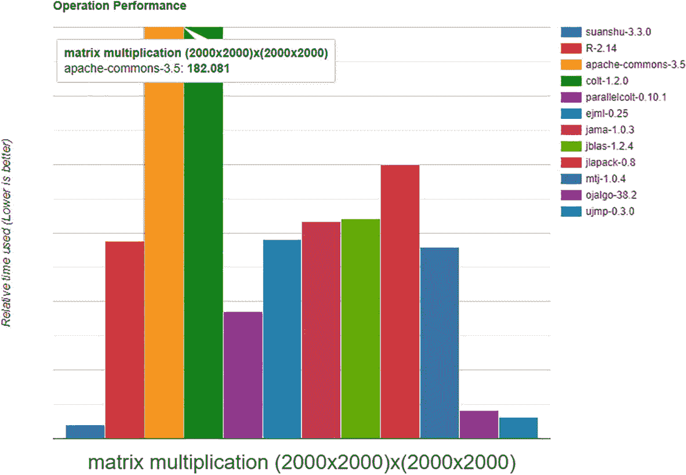

图 2-1

NM Dev 在矩阵乘法上比 Apache 快 182 倍

这是因为 NM Dev 矩阵实现使用自适应 Strassen 算法的并行版本进行快速矩阵乘法，其复杂度为*O*(*n*<sup>2.8074</sup>)。Apache Commons Math 和我所知道的大多数其他 Java 库都实现了标准的 *O* ( *n* <sup>3</sup> )算法。NM Dev 的性能优势对于较大的矩阵非常重要，尤其是在处理大数据时。

NM Dev 矩阵行列式计算比 Apache Commons Math 快 31 倍。参见图 [2-2](#Fig2) 。


图 2-2

NM Dev 在计算矩阵行列式时比 Apache 快 31 倍

NM Dev LU 分解比 Apache Commons Math 快 32 倍。参见图 [2-3](#Fig3) 。


图 2-3

NM Dev 在 LU 分解上比 Apache 快 32 倍

NM Dev QR 分解比 r 快两倍，见图 [2-4](#Fig4) 。

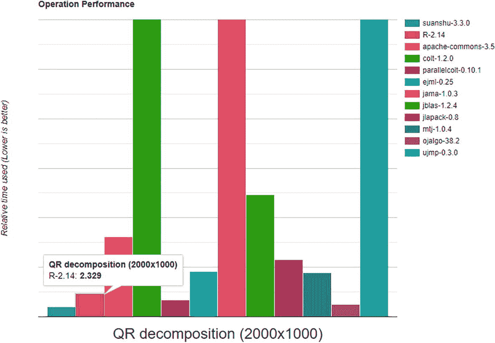

图 2-4

在 QR 分解中，NM Dev 比 R 快两倍

NM Dev SVD 分解比 r 中快两倍，见图 [2-5](#Fig5) 。


图 2-5

在 SVD 中，NM Dev 比 R 快两倍

在解线性方程组时，NM Dev 比 R 快六倍。参见图 [2-6](#Fig6) 。


图 2-6

在求解线性方程组时，NM Dev 比 R 快六倍

## 2.1 矢量

在数学中，欧几里得向量是一个具有大小(或长度)和方向的几何对象。一个 *n* 维向量可以表示为一个由 *n* 个标量元素组成的数组，其中每个元素都是向量在相应维上的投影长度。例如，在二维欧几里得空间中(用`ℝ` <sup>2</sup> 表示)，从点 *A* = (0，0)指向点 *B* = (1，2)的向量 *a* 可以表示为:

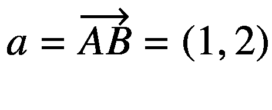

在 NM Dev 中，向量由接口`Vector`表示。有多种方法可以构造这样的对象。最常见的是用一个双数组初始化一个`DenseVector`，指定所有的元素。见图 [2-7](#Fig7) 。

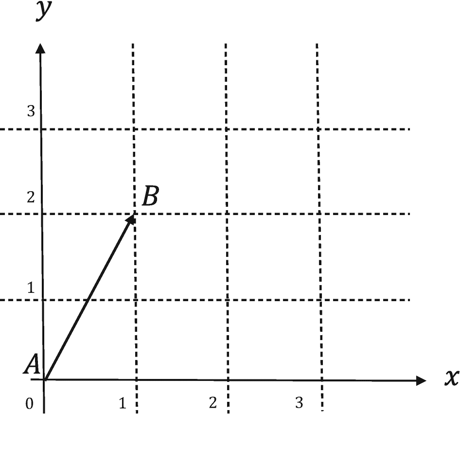

图 2-7

一个矢量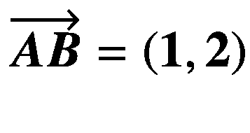

```py
Vector v1 = new DenseVector(new double[]{1.0, 2.0}); // define a vector
System.out.println(v1); // print out v1

```

输出如下所示:

```py
v1 = [1.000000, 2.000000]

```

### 基于元素的操作

这些函数访问并修改一个`Vector`:

```py
/**
 * Gets the length of this vector.
 *
 * @return the vector length
 */
public int size();

/**
 * Gets the value at position <i>i</i>.
 *
 * @param i the position of a vector entry
 * @return <i>v[i]</i>
 */
public double get(int i);

/**
 * Changes the value of an entry in this vector.
 * This is the only method that may change the entries of a vector.
 *
 * @param i     the index of the entry to change. The indices are counting
 *              from 1, NOT 0.
 * @param value the value to change to
 */
public void set(int i, double value);

```

计算机科学家从 0 开始计数，数学家从 1 开始计数。NM Dev 按照数学家惯例，从 1 而不是从 0 开始计算(向量和矩阵)索引。

继续前面的示例，以下代码片段将向量更改为(1，2):

```py
double v1_1 = v1.get(1); // 1.0
System.out.println(v1_1);
v1.set(2, -2.0); // v1 becomes (1.0, -2.0)
System.out.println(v1);
int size = v1.size(); // 2
System.out.println(size);

```

输出如下所示:

```py
v1 size = 2
v1_1 = 1.000000
v1 = [1.000000, -2.000000]

```

在 NM Dev 中，对向量的算术运算——加、减、乘、除、缩放以及取幂——是基于元素的运算。

```py
/**
 * \(this + that\)
 *
 * @param that a vector
 * @return \(this + that\)
 */
@Override
public Vector add(Vector that);

/**
 * \(this - that\)
 *
 * @param that a vector
 * @return \(this - that\)
 */
@Override
public Vector minus(Vector that);

/**
 * Multiplies {@code this} by {@code that}, entry-by-entry.
 *
 * @param that a vector
 * @return \(this \cdot that\)
 */
public Vector multiply(Vector that);

/**
 * Divides {@code this} by {@code that}, entry-by-entry.
 *
 * @param that a vector
 * @return \(this / that\)
 */
public Vector divide(Vector that);

/**
 * Adds a constant to all entries in this vector.
 *
 * @param c a constant
 * @return \(v + c\)
 */
public Vector add(double c);

/**
 * Subtracts a constant from all entries in this vector.
 *
 * @param c a constant
 * @return \(v - c\)
 */
public Vector minus(double c);
/**
 * Takes the exponentiation of all entries in this vector, entry-by-entry.
 *
 * @param c a constant
 * @return \(v ^ c\)
 */
public Vector pow(double c);
/**
 * Scales this vector by a constant, entry-by-entry. Here is a way to get a
 * unit version of the vector:
 * <blockquote><code>
 * vector.scaled(1\. / vector.norm())
 * </code></blockquote>
 *
 * @param c a constant
 * @return \(c \times this\)
 */
public Vector scaled(double c);

```

以下代码片段演示了向量算术运算:

```py
Vector v2 = new DenseVector(new double[]{-2.0, 1.0}); // define another vector

// addition
Vector a1 = v1.add(0.1); // add 0.1 to all entries
System.out.println(String.format("a1 = %s", a1)); // print out a1
Vector a2 = v1.add(v2); // a2 = v1 + v2, entry by entry
System.out.println(String.format("a2 = %s", a2)); // print out a2

// subtraction
Vector m1 = v1.minus(0.1); // subtract 0.1 from all entries
System.out.println(String.format("m1 = %s", m1)); // print out m1
Vector m2 = v1.minus(v2); // v1 – v2, entry by entry
System.out.println(String.format("m2 = %s", m2)); // print out m2

// scaling, multiplication, division
Vector s1 = v1.scaled(0.5); // multiply all entries by 0.5
System.out.println(String.format("s1 = %s", s1)); // print out s1

// multiplication
Vector t1 = v1.multiply(v2); // multiply v1 by v2, entry by entry
System.out.println(String.format("t1 = %s", t1)); // print out t1

// division
Vector d1 = v1.divide(v2); // divide v1 by v2, entry by entry
System.out.println(String.format("d1 = %s", d1)); // print out d1

// power
Vector p1 = v1.pow(2.0); // take to the square, entry-wise
System.out.println(String.format("p1 = %s", p1)); // print out p1

```

输出如下所示:

```py
v1 = [1.000000, -2.000000]
a1 = [1.100000, -1.900000]
a2 = [-1.000000, -1.000000]
m1 = [0.900000, -2.100000]
m2 = [3.000000, -3.000000]
s1 = [0.500000, -1.000000]
t1 = [-2.000000, -2.000000]
d1 = [-0.500000, -2.000000]
p1 = [1.000000, 4.000000]

```

### 2.1.2 规范

*<sub>*p*</sub>-向量的范数***x***=(*x*<sub>1</sub>， *x* <sub>1</sub> ，…， *x* <sub>*n*</sub> )定义如下:*

**

 *范数是一个函数，它将一个向量映射到一个非负的实数上，该实数以某种方式表现，比如离原点的距离。它随比例变换，服从三角形不等式的形式，并且仅在原点为零。在 NM Dev 中，向量范数是通过`norm(double p)`成员方法计算的。特别地，当没有给定参数时，`norm()`计算*ℓ*T4】2-范数。 *ℓ* 它也是一个向量与其自身的内积的平方根。以下代码片段计算边长为 3 和 4 的直角三角形的*ℓ*<sub>1</sub>-范数和*ℓ*<sub>2</sub>-范数。见图 [2-8](#Fig8) 。

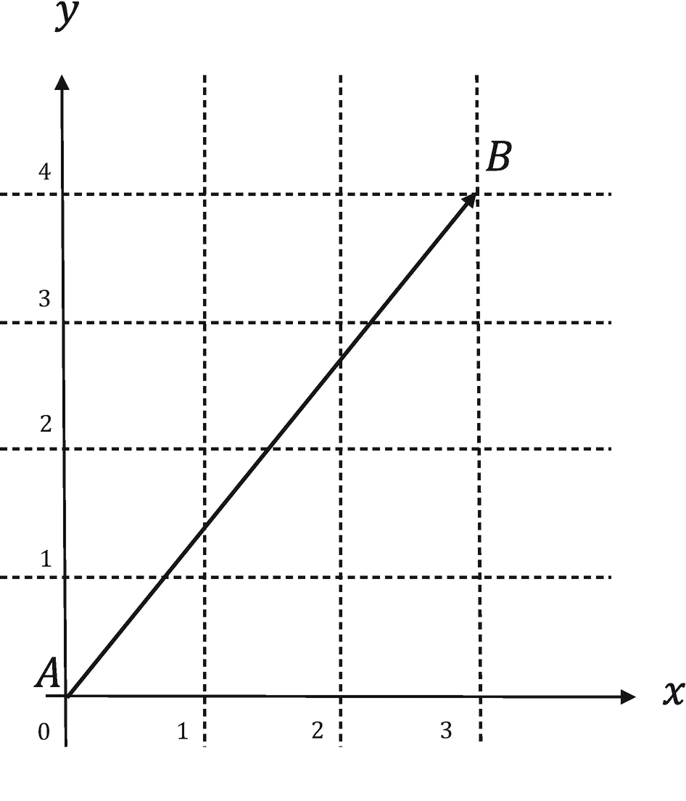

图 2-8

一个 345 的三角形

```py
// norm
Vector v3 = new DenseVector(new double[]{3., 4.});
double norm1 = v3.norm(1); // l1 norm = (3\. + 4.) = 7.
System.out.println(String.format("L1 norm = %f", norm1));
double norm2 = v3.norm(); // l2 norm = sqrt(3^2 + 4^2) = 5, Pythagorean theorem
System.out.println(String.format("L2 norm = %f", norm2));

```

输出如下所示:

```py
L1 norm = 7.000000
L2 norm = 5.000000

```

### 2.1.3 内积和角度

在一个真实的*n*-空间`ℝ` <sup>*n*</sup> ，***x***=(*x*<sub>1</sub>， *x* <sub>2</sub> ，…，*x*<sub>T22【n</sub>)和***y***=(

***x*** 与 ***y*** 之间的角度 *θ* 如下:


参见图 [2-9](#Fig9) 。

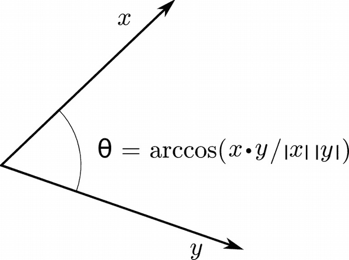

图 2-9

点积和角度

具体来说，如果向量 *x* 和 *y* 正交或垂直(它们的角度为 90°)，那么*t5】x*⋅***y***= 0。在另一个极端，如果他们指向同一个方向(他们的角度为 0°)，那么***x***⋅***y***=***x******y***。这暗示了一个向量 ***x*** 与自身的点积是***x***⋅***y***=***x***<sup>2</sup>。在 NM Dev 中，内积和角度的特征如下:

```py
/**
 * Inner product in the Euclidean space is the dot product.
 *
 * @param that a vector
 * @return \(this \cdot that\)
 * @see <a href="http://en.wikipedia.org/wiki/Dot_product"> Wikipedia: Dot
 * product</a>
 */
@Override
public double innerProduct(Vector that);

/**
 * Measures the angle, \(\theta\), between {@code this} and {@code that}.
 * That is,
 * \[
 * this \cdot that = \|this\| \times \|that\| \times \cos \theta
 * \]
 *
 * @param that a vector
 * @return the angle, \(\theta\), between {@code this} and {@code that}
 */
@Override
public double angle(Vector that);

```

这里有一个例子:

```py
// inner product and angle
Vector v4 = new DenseVector(new double[]{1., 2.});
Vector v5 = new DenseVector(new double[]{3., 4.});
double dot = v4.innerProduct(v5); // (1.*3\. + 2.*4.) = 11.
System.out.println(String.format("<%s,%s> = %f", v4, v5, dot));
double angle = v4.angle(v5);
System.out.println(String.format("angle between %s and %s = %f", v4, v5, angle));

```

输出如下所示:

```py
<[1.000000, 2.000000] ,[3.000000, 4.000000] > = 11.000000
angle between [1.000000, 2.000000]  and [3.000000, 4.000000]  = 0.179853

```

## 2.2 矩阵

矩阵(复数矩阵)是以行和列排列成矩形阵列或表格的一组元素或条目。一个 *m* × *n* 矩阵是一个由 *m* 行和 *n* 列组成的矩形阵列。矩阵的元素可以是数字、符号或数学表达式。下面是一个三行三列的矩阵，由九个元素组成:

![$$ \left[\begin{array}{ccc}1&amp; 2&amp; 3\\ {}4&amp; 5&amp; 6\\ {}7&amp; 8&amp; 9\end{array}\right] $$](img/500382_1_En_2_Chapter_TeX_Eque.png)

一个 *m* × *n* 矩阵 ***A*** 中的各个条目通常用 *a* <sub>*ij*</sub> 来表示，其中 *i* (行索引)和 *j* (列索引)通常分别从 1 到 *m* 和 *n* 不等。为了方便地表示矩阵运算结果的元素，通常将元素的索引附加到带括号或方括号的矩阵表达式中(例如，(***AB***)<sub>*ij*</sub>表示矩阵乘积的元素)。一个矩阵如果 *m* > *n* 就是高的，如果*m*<T36】n 就是胖的，如果 *m* = *n* 就是方的。见图 [2-10](#Fig10) 。

在 NM Dev 中，矩阵由接口`Matrix`表示。有多种方法可以构造一个`Matrix`对象。最常见的方法是使用`DenseMatrix`实现，并在一个双数组中指定所有条目(非零和零)。以下代码片段构建了如上所示的 3×3 矩阵:

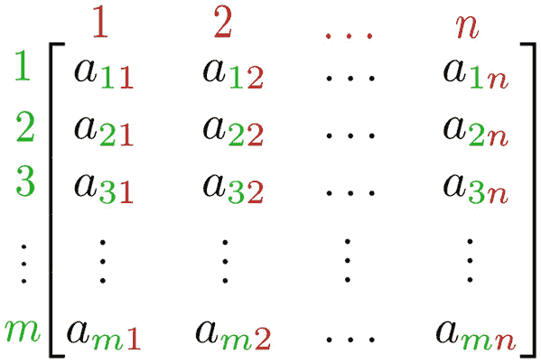

图 2-10

***a***<sub>***ij***</sub>指第 I 行第 j 列的条目

```py
// matrix construction
Matrix m1 = new DenseMatrix( // define a matrix
        new double[][]{
            {1, 2, 3},
            {4, 5, 6},
            {7, 8, 9}
        });
Matrix m2 = new DenseMatrix(m1); // copy the matrix m1
System.out.println(String.format("m1 = %s", m1)); // print out the matrix m1
System.out.println(String.format("m2 = %s", m2)); // print out the matrix m2

```

输出如下所示:

```py
m1 = 3x3
         [,1] [,2] [,3]
[1,] 1.000000, 2.000000, 3.000000,
[2,] 4.000000, 5.000000, 6.000000,
[3,] 7.000000, 8.000000, 9.000000,
m2 = 3x3
         [,1] [,2] [,3]
[1,] 1.000000, 2.000000, 3.000000,
[2,] 4.000000, 5.000000, 6.000000,
[3,] 7.000000, 8.000000, 9.000000,

```

有许多方法可以构造一个`DenseMatrix` `.`签名如下:

```py
/**
 * Constructs a 0 matrix of dimension <i>nRows * nCols</i>.
 *
 * @param nRows the number of rows
 * @param nCols the number of columns
 */
public DenseMatrix(int nRows, int nCols)

/**
 * Constructs a matrix from a 2D {@code double[][]} array.
 *
 * @param data a 2D array input
 * @throws IllegalArgumentException when {@code data} is a jagged array
 */
public DenseMatrix(double[][] data)

/**
 * Constructs a matrix from a 1D {@code double[]}. The array is a
 * concatenation of the matrix rows. A sample usage is to convert a vector
 * to a matrix. For example, to construct a column vector, we do
 * <pre>{@code
 * DenseMatrix V = new DenseMatrix(v.toArray(), v.length, 1);
 * }</pre> To construct a row vector, we do
 * <pre>{@code
 * DenseMatrix V = new DenseMatrix(v.toArray(), 1, v.length);
 * }</pre>
 *
 * @param data  the 1D array input
 * @param nRows the number or rows
 * @param nCols the number of columns
 * @throws IllegalArgumentException when the length of {@code data} does not
 *                                  equal to <i>nRows * nCols</i>
 */
public DenseMatrix(double[] data, int nRows, int nCols)

/**
 * Constructs a column matrix from a vector.
 *
 * @param v a vector
 */
public DenseMatrix(Vector v)

/**
 * Converts any matrix to the standard matrix representation. This method is
 * the same as {@link #toDense} if {@code A} is {@link Densifiable}.
 *
 * @param A a matrix
 */
public DenseMatrix(Matrix A)

/**
 * Copy constructor performing a deep copy.
 *
 * @param A a {@code DenseMatrix}
 */
public DenseMatrix(DenseMatrix A)

```

例如，这个代码片段从一个向量创建一个列矩阵:

```py
// create a vector
Vector v = new DenseVector(new double[]{1, 2, 3});
// create a column matrix from a vector
Matrix m3 = new DenseMatrix(v);
System.out.println(String.format("m3 = %s", m3)); // print out the matrix m3

```

输出如下所示:

```py
m3 = 3x1
      [,1]
[1,] 1.000000,
[2,] 2.000000,
[3,] 3.000000,

```

### 矩阵运算

在设计 NM Dev 库的时候，我们已经决定让类库尽可能的简洁，以避免方法污染。这是受 jMatrices 白皮书的启发。挑战是通过最小和正确的包来组织方法。`Matrix`类只有 26 个方法，其中 9 个是构造函数和相关的，3 个是对`AbstractMatrix`接口的覆盖，8 个是对`MatrixSpace`接口的覆盖。其中只有六个是特定于类的，这使得用户可以方便地调用这些方法。其他几十种矩阵运算，如许多因式分解、秩之类的性质和逆之类的变换，被分组到多个类和包中。在大多数情况下，这些操作中的每一个都是一个独立的类。例如，逆运算本身就是一个从`Matrix`继承的类。构造函数将一个`Matrix`作为输入进行反转。例如，求逆为此:

![$$ \boldsymbol{A}=\left[\begin{array}{ccc}1&amp; 2&amp; 3\\ {}6&amp; 5&amp; 4\\ {}8&amp; 7&amp; 9\end{array}\right] $$](img/500382_1_En_2_Chapter_TeX_Equf.png)

我们编码如下:

```py
Matrix A = new DenseMatrix(
        new double[][]{
            {1, 2, 3},
            {6, 5, 4},
            {8, 7, 9}
        });
Matrix Ainv = new Inverse(A);
Matrix I = A.multiply(Ainv);
System.out.println(String.format("%s * \n%s = \n%s", A, Ainv, I));

```

输出如下所示:

```py
3x3
        [,1] [,2] [,3]
[1,] 1.000000, 2.000000, 3.000000,
[2,] 6.000000, 5.000000, 4.000000,
[3,] 8.000000, 7.000000, 9.000000,  *
3x3
        [,1] [,2] [,3]
[1,] -0.809524, -0.142857, 0.333333,
[2,] 1.047619, 0.714286, -0.666667,
[3,] -0.095238, -0.428571, 0.333333,  =
3x3
        [,1] [,2] [,3]
[1,] 1.000000, 0.000000, 0.000000,
[2,] -0.000000, 1.000000, 0.000000,
[3,] -0.000000, -0.000000, 1.000000,

```

NM Dev 计算 A 的倒数如下:

![$$ A=\left[\begin{array}{ccc}-0.809524&amp; -0.142857&amp; 0.333333\\ {}1.047619&amp; 0.714286&amp; -0.666667\\ {}-0.095238&amp; -0.428571&amp; 0.333333\end{array}\right] $$](img/500382_1_En_2_Chapter_TeX_Equg.png)

值得注意的是，`Ainv`的逆也是一个`Matrix`，由关键字`new`创建，而不是由方法调用创建。总之，我们选择有许多类，而不是有许多方法的类。每堂课都故意保持得很短。这个类简约原则是指导整个库开发的关键设计决策。

### 基于元素的操作

这些函数访问并修改一个`Matrix`:

```py
    /**
     * Set the matrix entry at <i>[i,j]</i> to a value.
     * This is the only method that may change a matrix.
     *
     * @param i     the row index
     * @param j     the column index
     * @param value the value to set <i>A[i,j]</i> to
     * @throws MatrixAccessException if <i>i</i> or <i>j</i> is out of range
     */
    public void set(int i, int j, double value) throws MatrixAccessException;

    /**
     * Get the matrix entry at <i>[i,j]</i>.
     *
     * @param i the row index
     * @param j the column index
     * @return <i>A[i,j]</i>
     * @throws MatrixAccessException if <i>i</i> or <i>j</i> is out of range
     */
    public double get(int i, int j) throws MatrixAccessException;

```

NM Dev 从 1 而不是 0 开始计算(向量和矩阵)索引。左上角的条目是第(1，1)个条目。

以下代码片段将对角线条目更改为 0:

```py
Matrix m1 = new DenseMatrix( // define a matrix
        new double[][]{
            {1, 2, 3},
            {4, 5, 6},
            {7, 8, 9}
        });

// getters and setters
double m1_11 = m1.get(1, 1);
double m1_22 = m1.get(2, 2);
double m1_33 = m1.get(3, 3);
System.out.println(String.format("the diagonal entries are: %f, %f, %f", m1_11, m1_22, m1_33));

// changeing the diagonal to 0
m1.set(1, 1, 0.);
m1.set(2, 2, 0.);
m1.set(3, 3, 0.);
System.out.println(String.format("m1 = %s", m1)); // print out the matrix m1

```

输出如下所示:

```py
the diagonal entries are: 1.000000, 5.000000, 9.000000
changing the diagonal to 0
m1 = 3x3
      [,1] [,2] [,3]
[1,] 0.000000, 2.000000, 3.000000,
[2,] 4.000000, 0.000000, 6.000000,
[3,] 7.000000, 8.000000, 0.000000,

```

在 NM Dev 中，矩阵上的算术运算——加法、减法和缩放——是基于元素的运算。签名如下:

```py
/**
 * <i>this + that</i>
 *
 * @param that a matrix
 * @return the sum of {@code this} and {@code that}
 */
@Override
public Matrix add(Matrix that);

/**
 * <i>this - that</i>
 *
 * @param that a matrix
 * @return the difference between {@code this} and {@code that}
 */
@Override
public Matrix minus(Matrix that);

/**
 * Scale this matrix, <i>A</i>, by a constant.
 *
 * @param c a double
 * @return <i>cA</i>
 */
public Matrix scaled(double c);

```

这里有一个例子:

```py
Matrix m1 = new DenseMatrix(
        new double[][]{
            {1, 2, 3},
            {4, 5, 6},
            {7, 8, 9}
        });

// m2 = -m1
Matrix m2 = m1.scaled(-1);

// m3 = m1 + m2 = m1 - m1 = 0
Matrix m3 = m1.add(m2);

// not a recommended usage
boolean isEqual1 = m3.equals(m3.ZERO());
System.out.println(isEqual1);

// recommended usage
boolean isEqual2 = MatrixPropertyUtils.areEqual(m3, m3.ZERO(), 1e-16);
System.out.println(isEqual2);

```

输出如下所示:

```py
true
true

```

方法`ZERO()`生成一个与调用实例维数相同的零矩阵。函数`equals()`比较两个矩阵并检查它们的值是否相等。但是，不推荐使用这个函数，因为两个理论上相同的矩阵在计算机中可能有不同的表示。条目的值可能略有不同。函数`equals()`会错误地将它们视为不同。检查两个矩阵的值是否相等的正确方法是逐项检查它们在阈值内的值是否相同。效用函数`MatrixPropertyUtils.areEqual`用于此目的。这个效用函数相对于`equals()`方法的优势在于，我们可以输入一个容差阈值来进行浮点比较。签名如下:

```py
/**
 * Checks the equality of two matrices up to a precision.
 * Two matrices are equal if
 * <ol>
 * <li>the dimensions are the same;</li>
 * <li>all entries are equal</li>
 * </ol>
 *
 * @param A1      a matrix
 * @param A2      a matrix
 * @param epsilon a precision parameter: when a number |x| &le; &epsilon;, it is considered 0
 * @return {@code true} if all entries are equal, entry by entry
 */
public static boolean areEqual(Matrix A1, Matrix A2, double epsilon)

```

### 转置

转置矩阵***A***<sup>*T*</sup>=***A***<sup>’</sup>A**定义如下:**

****

 **也就是说，它交换行和列。列变成了行；行变成列。例如，对于以下:

![$$ \boldsymbol{A}=\left[\begin{array}{ccc}1&amp; 2&amp; 3\\ {}4&amp; 5&amp; 6\\ {}7&amp; 8&amp; 9\end{array}\right] $$](img/500382_1_En_2_Chapter_TeX_Equi.png)

转置如下:

![$$ {\boldsymbol{A}}^T=\left[\begin{array}{ccc}1&amp; 4&amp; 7\\ {}2&amp; 5&amp; 8\\ {}3&amp; 6&amp; 9\end{array}\right] $$](img/500382_1_En_2_Chapter_TeX_Equj.png)

下面的代码实现了这个示例:

```py
Matrix m1 = new DenseMatrix(
        new double[][]{
            {1, 2, 3},
            {4, 5, 6},
            {7, 8, 9}
        });
System.out.println(String.format("m1 = %s", m1)); // print out the matrix m1
Matrix m1t = m1.t(); // doing a transpose
System.out.println(String.format("m1t = %s", m1t)); // print out the transpose matrix

```

输出如下所示:

```py
m1 = 3x3
        [,1] [,2] [,3]
[1,] 1.000000, 2.000000, 3.000000,
[2,] 4.000000, 5.000000, 6.000000,
[3,] 7.000000, 8.000000, 9.000000,
m1t = 3x3
        [,1] [,2] [,3]
[1,] 1.000000, 4.000000, 7.000000,
[2,] 2.000000, 5.000000, 8.000000,
[3,] 3.000000, 6.000000, 9.000000,

```

### 矩阵乘法

矩阵乘法是从两个矩阵中得到第三个矩阵的二元运算。第三个矩阵是前两个的乘积，称为*矩阵乘积*。如果 ***A*** 是一个 *m* × *n* 矩阵而 ***B*** 是一个 *n* × *p* 矩阵，那么它们的矩阵乘积***C***=***AB***是一个 *m* × *p* 矩阵**中每一行的 *m* 元素乘以矩阵 ***B*** 中相应列的 *m* 元素，这些乘积之和就是矩阵**=***AB***的一个元素。参见图 [2-11](#Fig11) 。数学上是这样的:****

********

 ****

图 2-11

矩阵乘法

例如，对于这样的矩阵:

![$$ \boldsymbol{A}=\left[\begin{array}{ccc}1&amp; 2&amp; 3\\ {}4&amp; 5&amp; 6\\ {}7&amp; 8&amp; 9\end{array}\right] $$](img/500382_1_En_2_Chapter_TeX_Equl.png)

我们有这个:

![$$ {\boldsymbol{A}}^T\boldsymbol{A}=\left[\begin{array}{ccc}1&amp; 4&amp; 7\\ {}2&amp; 5&amp; 8\\ {}3&amp; 6&amp; 9\end{array}\right]\left[\begin{array}{ccc}1&amp; 2&amp; 3\\ {}4&amp; 5&amp; 6\\ {}7&amp; 8&amp; 9\end{array}\right]=\left[\begin{array}{ccc}66&amp; 78&amp; 90\\ {}78&amp; 93&amp; 108\\ {}90&amp; 108&amp; 126\end{array}\right] $$](img/500382_1_En_2_Chapter_TeX_Equm.png)

注意矩阵乘法是不可交换的，意思是 ***AB*** 和 ***BA*** 不一定相同。

下面的代码实现了这个示例:

```py
Matrix m1 = new DenseMatrix(
        new double[][]{
            {1, 2, 3},
            {4, 5, 6},
            {7, 8, 9}
        });
Matrix m1t = m1.t();
Matrix m1tm1 = m1t.multiply(m1);
System.out.println(String.format("%s * \n%s = \n%s", m1t, m1, m1tm1));

```

输出如下所示:

```py
3x3
       [,1] [,2] [,3]
[1,] 1.000000, 4.000000, 7.000000,
[2,] 2.000000, 5.000000, 8.000000,
[3,] 3.000000, 6.000000, 9.000000,  *
3x3
      [,1] [,2] [,3]
[1,] 1.000000, 2.000000, 3.000000,
[2,] 4.000000, 5.000000, 6.000000,
[3,] 7.000000, 8.000000, 9.000000,  =
3x3
       [,1] [,2] [,3]
[1,] 66.000000, 78.000000, 90.000000,
[2,] 78.000000, 93.000000, 108.000000,
[3,] 90.000000, 108.000000, 126.000000,

```

矩阵乘法在科学计算中占有核心地位，具有极其广泛的应用。线性代数中的许多数值过程(例如，解线性系统、矩阵求逆、因式分解、行列式)本质上可以简化为矩阵乘法。因此，人们对研究快速矩阵乘法算法以加速矩阵乘法(以及随之而来的其他数值过程)有着极大的兴趣。NM Dev 已经是矩阵乘法和线性代数中最快的了。参见图 [2-12](#Fig12) 。


图 2-12

快速矩阵乘法

NM Dev 实现了快速矩阵乘法的高级算法。我们将简要描述我们的矩阵乘法算法的实现，与经典的 IJK 算法相比，它显著地加速了密集矩阵-矩阵乘法。

我们首先描述与我们的快速算法比较的基准方法，IJK 算法。经典的 IJK 算法使用三个循环进行矩阵乘法，因此时间复杂度为 *O* ( *n* <sup>3</sup> )。假设 **A** 为 *m* × *n* ，***B****n*×*p*，*C**m*×*p*，则 IJK 算法如下:

```py
for (i = 1; i < = m; i ++){
    for (j = 1; j <= p; j ++){
        for (k = 1; k <= n; k ++){
            C[i,k] += A[i,j] * B[j,k];
        }
    }
}

```

在 NM Dev 中，这是并行实现的；最外层循环被传递给一个`ParallelExecutor`。由于可用的行数往往多于线程数，这种并行化 IJK 的复杂度仍然与经典版本的 *O* ( *mnp* )或立方时间*O*(*n*T9】3)for*m*=*n*=*p*大致相同。这是大多数其他 Java 库中的实现，我们希望做得比这更好。

我们快速乘法算法的核心，Strassen 算法，将时间复杂度降低到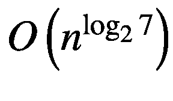。Strassen 算法(Strassen，1969)是基于下面的分块矩阵乘法:

![$$ \left(\begin{array}{cc}{\boldsymbol{A}}_{\mathbf{11}}&amp; {\boldsymbol{A}}_{\mathbf{12}}\\ {}{\boldsymbol{A}}_{\mathbf{21}}&amp; {\boldsymbol{A}}_{\mathbf{22}}\end{array}\right)\left(\begin{array}{cc}{\boldsymbol{B}}_{\mathbf{11}}&amp; {\boldsymbol{B}}_{\mathbf{12}}\\ {}{\boldsymbol{B}}_{\mathbf{21}}&amp; {\boldsymbol{B}}_{\mathbf{22}}\end{array}\right)=\left(\begin{array}{cc}{\boldsymbol{A}}_{\mathbf{11}}{\boldsymbol{B}}_{\mathbf{11}}+{\boldsymbol{A}}_{\mathbf{12}}{\boldsymbol{B}}_{\mathbf{21}}&amp; {\boldsymbol{A}}_{\mathbf{11}}{\boldsymbol{B}}_{\mathbf{12}}+{\boldsymbol{A}}_{\mathbf{12}}{\boldsymbol{B}}_{\mathbf{22}}\\ {}{\boldsymbol{A}}_{\mathbf{21}}{\boldsymbol{B}}_{\mathbf{11}}+{\boldsymbol{A}}_{\mathbf{22}}{\boldsymbol{B}}_{\mathbf{21}}&amp; {\boldsymbol{A}}_{\mathbf{21}}{\boldsymbol{B}}_{\mathbf{12}}+{\boldsymbol{A}}_{\mathbf{22}}{\boldsymbol{B}}_{\mathbf{22}}\end{array}\right) $$](img/500382_1_En_2_Chapter_TeX_Equn.png)

计算这一点的简单方法包括八个子矩阵乘法和四次加法。我们使用的 Strassen 算法的 Winograd 变体放弃了一个子矩阵乘法，以换取 11 个额外的加法/减法，当子矩阵足够大时，这种算法更快(Winograd，1971)。

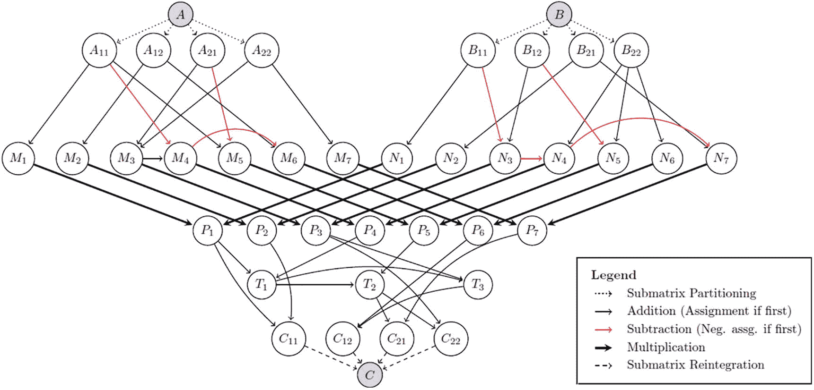

图 2-13

Strassen 算法的可视化(Winograd 变体)

算法运行如下(参见图 [2-13](#Fig13) ):

<colgroup><col class="tcol1 align-left"> <col class="tcol2 align-left"></colgroup> 
| ***M***<sub>**1**</sub>=***A***<sub>**11**</sub>***M***<sub>**2**</sub>=***A***<sub>**12**</sub>***M***<sub>**3**</sub>=***A***<sub>**21**</sub>+***A***<sub>**22**</sub>***M***<sub>**4**</sub>=***M***<sub>**3**</sub>——T17<sub>**11**</sub>***M***<sub>**5**</sub>=***A***<sub>**11**</sub>—**A**<sub>**21**</sub>***M***<sub>**6**</sub>=***A***<sub>**12**</sub>—***M***<sub>**4**</sub>***M***<sub>**7**</sub>=***A***<sub>**22**</sub> | ***N***<sub>T5】1</sub>=***B***<sub>**11**</sub>***N***<sub>**2**</sub>=***B***<sub>**21**</sub>***N***<sub>**3**</sub>=***B***<sub>**12**</sub>—**B**<sub>**11**</sub>***N***<sub>**4**</sub>=***B***<sub>**22**</sub>—**N**<sub>**3**</sub>***N***<sub>**5**</sub>=***B***<sub>**22**</sub>—**B**<sub>**12**</sub>***N***<sub>T5】6</sub>=***B***<sub>**22**</sub>***N***<sub>**7**</sub>=***B***<sub>**21**</sub>—T17】N<sub>**4**</sub> |

1.  将 ***A*** 拆分成四个大小相等的象限***A***<sub>**11**</sub>***A***<sub>**12**</sub>***A***<sub>**21**</sub>***A***<sub>**对 ***B*** 做同样的操作。(现在假设所有维度都是偶数。)**</sub>

2.  获取以下因子矩阵:

<colgroup><col class="tcol1 align-left"> <col class="tcol2 align-left"></colgroup> 
| ***C***<sub>**11**</sub>=***P***<sub>**1**</sub>+***P***<sub>**2**</sub>***T***<sub>**1**</sub>=***P***<sub>**1**</sub>+***P***<sub>**4**</sub>***T***<sub>**2**</sub>=***T***<sub>**1**</sub>+***P***<sub>**5**</sub>***C***<sub>**21**</sub>=***T***<sub>**2**</sub>+***P***<sub>**7**</sub> | ***C***<sub>**22**</sub>=***T***<sub>**2**</sub>+***P***<sub>**3**</sub>***T***<sub>**3**</sub>=***T***<sub>**1**</sub>+***P***<sub>**3**</sub>***C***<sub>**12**</sub>=***T***<sub>**3**</sub>+***P***<sub>**6**</sub> |

1.  获得***p***<sub>***I***</sub>=***m***<sub>***I***</sub>×***n***<sub>***I***</sub>为 *i* ∈ {1，2，，7}。根据维度，我们要么使用并行 IJK，要么递归调用 Strassen 的算法。

2.  最终的乘积***C***=***A***×***B***则可以得到如下。***T***<sub>***I***</sub>都是临时矩阵。

到目前为止，我们忽略了当 ***A*** 和/或 ***B*** 具有奇数行/列的情况。有几种方法可以解决这个问题。例如，可以静态填充矩阵，使得维数总是偶数，直到递归传递到 IJK(静态填充)；或者我们可以只在其中一个维度是奇数时填充(动态填充)。或者，可以忽略额外的行/列，直到算法完成，然后再处理它们。(换句话说，如果 ***A*** 有一个额外的行或者 ***B*** 有一个额外的列，使用适当的矩阵向量运算来计算 ***C*** 的剩余行/列。如果 ***A*** 多了一列 ***B*** 多了一行，他们的乘积可以加到 ***C*** 上。)NM Dev 在我们的实现中使用了这种方法，称为*动态剥离*。

就其本身而言，只要两个矩阵大致都是正方形，Strassen 算法的这个基本版本就能很好地工作。在实践中，我们可能会遇到其中任何一个都是高度矩形的情况(例如，太高或太长)。我们通过将矩阵分割成近似正方形的块，然后对子矩阵使用 Strassen 算法来解决这个问题。阻挡方案被设计成避免长或高的条带。参见图 [2-14](#Fig14) 。

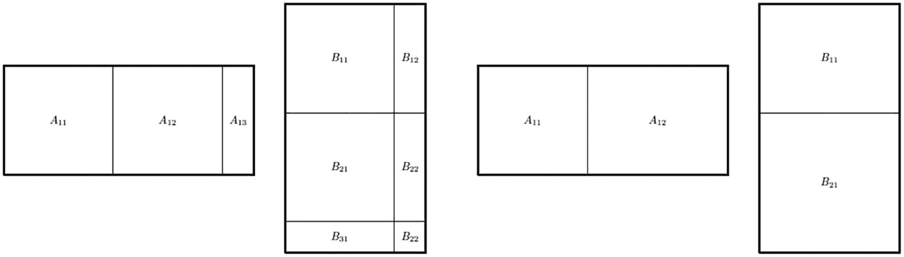

图 2-14

分块和平铺。左:严格的封堵方案(条！).右图:一个有效的阻塞方案(我们的实现)

图 [2-15](#Fig15) 至图 [2-18](#Fig18) 中的图表显示了我们的混合 Block-Strassen 算法与并行 IJK 在英特尔酷睿 i5-3337U CPU @ 1.80 GHz、6GB RAM、运行 Java 1.8.0 update 40 上的性能。

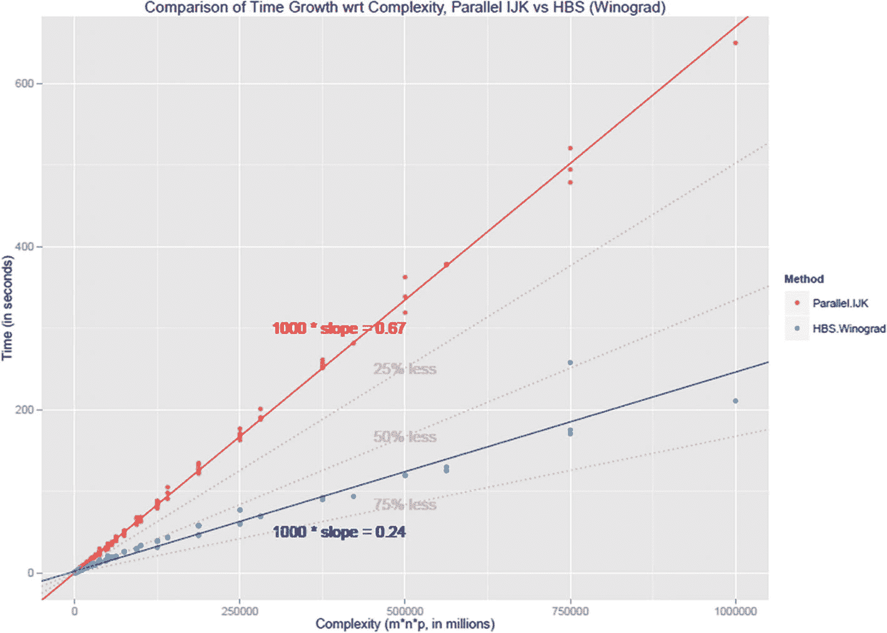

图 2-15

乘法时间(按方法)对复杂度***m***×***n***×***p***

这些测试是仿照 D'Alberto & Nicolau (2007 年)设计的。我们跑了***C***=***A***×***B***对于随机矩阵***A***(*m*×*n*)和***B***(*n*×*p*)。对于*S*T36】3 中的每一个三元组( *m* ， *n* ， *p* )，其中 *S* = {100，500，1000，2500，5000，7500，10000}。该乘法使用并行 IJK 进行三次，然后使用混合 Block-Strassen (HBS)进行三次。使用每种方法的平均时间进行比较并制成表格。见图 [2-15](#Fig15) 。

图 [2-15](#Fig15) 显示了乘时间与尺寸的乘积 *m* × *n* × *p* 的关系。IJK 的乘法时间是 *O* ( *mnp* )，我们的实证结果表明，并行 IJK 和 HBS 的乘法时间都与复杂度有很强的线性关系。然而，HBS 的坡度要小得多。

最佳拟合线的梯度表明，随着复杂性接近无穷大(忽略内存限制)，HBS 将比 IJK 少花 63.5%的时间。然而，几个数据点(例如， *m* ， *n* ， *p* ≥ 5000)显示了更大的加速。参见图 [2-16](#Fig16) 和图 [2-17](#Fig17) 。


图 2-17

使用 HBS 比平行 IJK 节省的时间(占 IJK 时间的百分比)

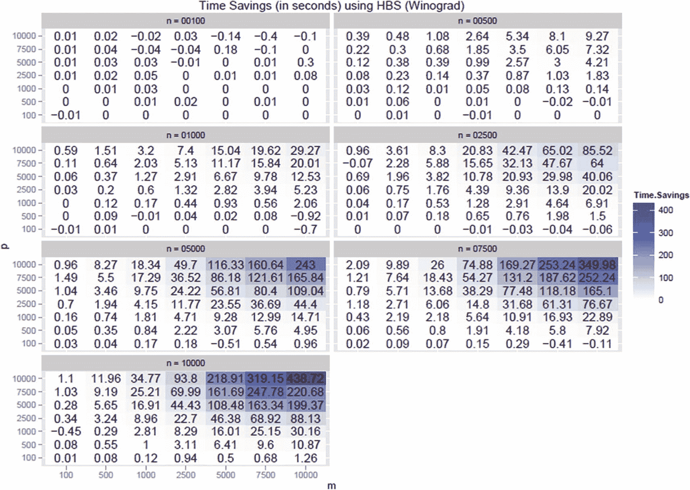

图 2-16

使用 HBS 与并行 IJK 相比节省的时间(秒)

图 [2-16](#Fig16) 以秒为单位显示 HBS 比平行 IJK 节省的时间，图 [2-17](#Fig17) 以平行 IJK 时间的百分比显示(图 [2-17](#Fig17) )。每个表格都是针对特定的值*n*(***A***的列数)和超过值*m*(**的行数)和*p*(***B***的列数)。见图 [2-18](#Fig18) 。**

 **

图 2-18

HBS 与 PIJK 的最大相对误差(单位为 1e-15)

最后，还进行了准确性测试，以解决 Strassen 算法的数值稳定性问题。图 [2-18](#Fig18) 显示了所得乘积矩阵的最大入口相对误差。我们看到没有一个误差超过 2×10<sup>-14</sup>。请注意，我们没有将 Strassen 的算法完全运行到标量级别；当矩阵***M***<sub>***I***</sub>和***N***<sub>***I***</sub>过小时，使用 IJK。这减少了误差。这表明 HBS 非常准确，因此是速度优先的通用环境中的强有力候选。HBS 是矩阵乘法的默认 NM Dev 实现。

### 2.2.5 等级

矩阵**的列秩是 ***A*** 中线性无关列的最大数目。同样，行秩是**中线性无关行的最大数量。矩阵的列秩和行秩总是相等的，所以可以简单地称为矩阵秩的秩( ***A*** )。如果秩与列(或行)的数量相同，则方阵称为*满秩矩阵*。****

 ****下面举个例子:

![$$ \boldsymbol{A}=\left[\begin{array}{ccc}1&amp; 0&amp; 1\\ {}-2&amp; -3&amp; 1\\ {}3&amp; 3&amp; 0\end{array}\right] $$](img/500382_1_En_2_Chapter_TeX_Equo.png)

***A*** 的秩为 2，因为前两列线性无关。然而，第三列是前两列的线性组合。具体来说，第三列等于第一列减去第二列。这不是满秩矩阵。

这里再举一个例子:

![$$ \boldsymbol{A}=\left[\begin{array}{cccc}1&amp; 1&amp; 0&amp; 2\\ {}-1&amp; -1&amp; 0&amp; -2\end{array}\right] $$](img/500382_1_En_2_Chapter_TeX_Equp.png)

**的秩为 1，因为每一列都是乘以第一列的标量。**

 **在 NM Dev 中，效用函数`MatrixMeasure.rank`计算矩阵的秩。以下代码计算前面两个矩阵的秩:

```py
final double PRECISION = 1e-15;
Matrix M1 = new DenseMatrix(new double[][]{
    {1, 0, 1},
    {-2, -3, 1},
    {3, 3, 0}
});
// calculate the rank of M1, treating numbers smaller than PRECISION as 0
int rank1 = MatrixMeasure.rank(M1, PRECISION);
System.out.println(rank1);
Matrix M2 = new DenseMatrix(new double[][]{
    {1, 1, 0, 2},
    {-1, -1, 0, -2}
});
// calculate the rank of M2, treating numbers smaller than PRECISION as 0
int rank2 = MatrixMeasure.rank(M2, PRECISION);
System.out.println(rank2);

```

输出如下所示:

```py
2
1

```

### 决定因素

行列式是将一个 *n* × *n* 方阵 ***A*** 映射到一个标量的函数。它常被表示为| ***A*** |。将矩阵**的元素表示为*A*<sub>*ij*</sub>和*N*<sub>*ij*</sub>作为通过从矩阵中移除第 *i* 行和第 *j* 列而创建的 ***A*** 的子矩阵的行列式那么矩阵的行列式的一个递归定义**如下:****

****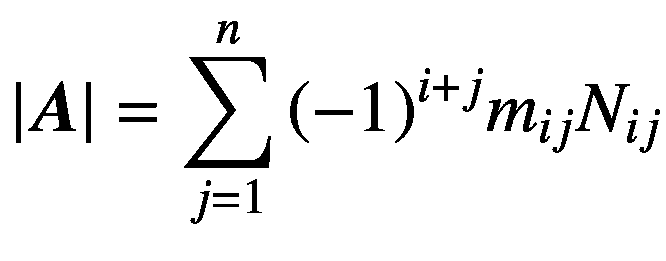****

 ****例如，当 *n* = 2 时，我们有这样的:

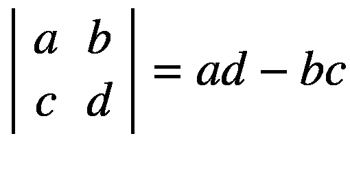

同样，当 *n* = 3 时，我们有了这个:


下面举个例子:

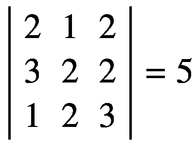

在 NM Dev 中，效用函数`MatrixMeasure.det`计算矩阵的行列式。以下代码计算前面矩阵的行列式:

```py
Matrix M1 = new DenseMatrix(new double[][]{
    {2, 1, 2},
    {3, 2, 2},
    {1, 2, 3}
});

// calculate the determinant of matrix M1
double det = MatrixMeasure.det(M1);
System.out.println(det);

```

输出如下所示:

```py
5.0

```

### 2.2.7 逆和伪逆

对于一个 *n* 阶的方阵 ***A*** ，如果存在一个 *n* 阶的方阵 ***B*** 使得


其中***I***<sub>*n*</sub>是阶为 *n* 的恒等矩阵，那么矩阵 ***A*** 被称为*可逆*，矩阵 ***B*** 被称为矩阵 ***A*** 的逆。我们经常把 ***A*** 的逆矩阵表示为***A***<sup>—1</sup>。即***AA***<sup>—1</sup>=***A***<sup>—1</sup>***A***=***I***<sub>*n*</sub>。只有方阵可以有逆矩阵。一个矩阵是可逆的当且仅当它具有满秩。不是所有的方阵都是可逆的。不可逆矩阵称为奇异矩阵或退化矩阵。一个矩阵是奇异的当且仅当它的行列式为 0。

例如，考虑这个矩阵:

![$$ \boldsymbol{A}=\left[\begin{array}{cc}-1&amp; \frac{3}{2}\\ {}1&amp; -1\end{array}\right] $$](img/500382_1_En_2_Chapter_TeX_Equw.png)

***一个*** 是可逆的。我们可以通过计算行列式|***A***| = 0.5 来检查。具体来说，我们有这个:

![$$ \left[\begin{array}{cc}-1&amp; \frac{3}{2}\\ {}1&amp; -1\end{array}\right]\left[\begin{array}{cc}2&amp; 3\\ {}2&amp; 2\end{array}\right]=\left[\begin{array}{cc}1&amp; 0\\ {}0&amp; 1\end{array}\right] $$](img/500382_1_En_2_Chapter_TeX_Equx.png)

在 NM Dev 中，类`Inverse`构造了一个新矩阵，它是可逆矩阵的逆矩阵。以下代码计算前面矩阵的逆矩阵:

```py
Matrix A1 = new DenseMatrix(
        new double[][]{
            {-1, 3\. / 2},
            {1, -1}
        });
double det1 = MatrixMeasure.det(A1);
System.out.println("det of A1 = " + det1);
Matrix Ainv1 = new Inverse(A1);
Matrix I1 = A1.multiply(Ainv1);
System.out.println(String.format("%s * \n%s = \n%s", A1, Ainv1, I1));

```

输出如下所示:

```py
det of A1 = -0.5
2x2
       [,1] [,2]
[1,] -1.000000, 1.500000,
[2,] 1.000000, -1.000000,  *
2x2
        [,1] [,2]
[1,] 2.000000, 3.000000,
[2,] 2.000000, 2.000000,  =
2x2
        [,1] [,2]
[1,] 1.000000, 0.000000,
[2,] 0.000000, 1.000000,

```

考虑另一个矩阵，这里显示:

![$$ \boldsymbol{A}=\left[\begin{array}{cc}2&amp; 4\\ {}5&amp; 10\end{array}\right] $$](img/500382_1_En_2_Chapter_TeX_Equy.png)

很容易检查出这个矩阵是奇异的，如| ***A*** | = 0。所以，它的逆不存在。Moore 和 Penrose 定义了逆的广义概念，称为 Moore-Penrose 逆或简称为伪逆，记为**<sup>+</sup>。伪逆具有定义它的以下四个属性:**

 **1.  ***AA***<sup>+</sup>***A***=***A***

2.  ***A***<sup>+</sup>***AA***<sup>+</sup>=***A***<sup>+</sup>

3.  (***AA***<sup>+</sup>)<sup>*H*</sup>=***AA***<sup>+</sup>

4.  (***A***<sup>+</sup>***A***)<sup>*H*</sup>=***A***<sup>+</sup>***A***

***A***<sup>*H*</sup>运算符表示矩阵的埃尔米特转置(也称为*共轭转置*)。我们首先取矩阵的转置，然后用它们的复共轭替换矩阵元素，用*a*-*bi*替换 *a* + *bi* 。具体来说，一个 *m* × *n* 矩阵 ***A*** 的埃尔米特转置定义如下:


上面的杠表示标量复共轭。如果**中的所有元素都是实数，那么埃尔米特转置与转置相同。第三和第四个属性将简单地意味着***【AA】***<sup>+</sup>和**<sup>+</sup>***A***是对称的。矩阵的伪逆是唯一定义的。它总是存在的，即使是非方阵。如果一个矩阵是可逆的，那么伪逆与逆相同。****

 ****在 NM Dev 中，类`PseudoInverse`构造了一个新矩阵，它是一个矩阵的伪逆(奇异且可逆)。下面的代码计算前面矩阵的伪逆矩阵:

```py
Matrix A2 = new DenseMatrix(new double[][]{
    {2, 4},
    {5, 10}
});
double det2 = MatrixMeasure.det(A2);
System.out.println("det of A2 = " + det2);
PseudoInverse A2p = new PseudoInverse(A2);
System.out.println("the pseudo inverse is");
System.out.println(A2p);
// the first property of pseudo-inverse
System.out.println("should be the same as the matrix");
Matrix A2_copy = A2.multiply(A2p).multiply(A2);
System.out.println(A2_copy);
// the second property of pseudo-inverse
System.out.println("should be the same as the pseudo inverse");
Matrix A2p_copy = A2p.multiply(A2).multiply(A2p);
System.out.println(A2p_copy);

```

输出如下所示:

```py
det of A2 = 0.0
the pseudo inverse is
2x2
      [,1] [,2]
[1,] 0.013793, 0.034483,
[2,] 0.027586, 0.068966,
should be the same as the matrix
2x2
      [,1] [,2]
[1,] 2.000000, 4.000000,
[2,] 5.000000, 10.000000,
should be the same as the pseudo inverse
2x2
      [,1] [,2]
[1,] 0.013793, 0.034483,
[2,] 0.027586, 0.068966,

```

考虑另一个非方阵的例子，这里显示:

![$$ \boldsymbol{A}=\left[\begin{array}{cc}1&amp; 0\\ {}0&amp; 1\\ {}0&amp; 1\end{array}\right] $$](img/500382_1_En_2_Chapter_TeX_Equaa.png)

伪逆如下:

![$$ {\boldsymbol{A}}^{+}=\left[\begin{array}{ccc}1&amp; 0&amp; 0\\ {}0&amp; 0.5&amp; 0.5\end{array}\right] $$](img/500382_1_En_2_Chapter_TeX_Equab.png)

下面的代码计算前面矩阵的伪逆矩阵:

```py
Matrix A3 = new DenseMatrix(new double[][]{
    {1, 0},
    {0, 1},
    {0, 1}
});
PseudoInverse A3p = new PseudoInverse(A3);
System.out.println("the pseudo inverse is");
System.out.println(A3p);
// the first property of pseudo-inverse
System.out.println("should be the same as the matrix");
Matrix A3_copy = A3.multiply(A3p).multiply(A3);
System.out.println(A3_copy);
// the second property of pseudo-inverse
System.out.println("should be the same as the pseudo inverse");
Matrix A3p_copy = A3p.multiply(A3).multiply(A3p);
System.out.println(A3p_copy);

```

输出如下所示:

```py
the pseudo inverse is
2x3
       [,1] [,2] [,3]
[1,] 1.000000, 0.000000, 0.000000,
[2,] 0.000000, 0.500000, 0.500000,
should be the same as the matrix
3x2
       [,1] [,2]
[1,] 1.000000, 0.000000,
[2,] 0.000000, 1.000000,
[3,] 0.000000, 1.000000,
should be the same as the pseudo inverse
2x3
       [,1] [,2] [,3]
[1,] 1.000000, 0.000000, 0.000000,
[2,] 0.000000, 0.500000, 0.500000,

```

### 2.2.8 克罗内克产品

由⨂表示的克罗内克积或外积或矩阵直积是对两个任意大小的矩阵的运算，产生一个分块矩阵。具体来说，如果 ***A*** 是一个 *m* × *n* 矩阵和***b***a*p*×*q*矩阵，那么克罗内克积***a***⨂***b***就是 *pm* × *qn*

或者更明确一点，如下图:

![$$ \boldsymbol{A}\bigotimes \boldsymbol{B}=\left[\begin{array}{ccc}{a}_{11}\boldsymbol{B}&amp; \cdots &amp; {a}_{1n}\boldsymbol{B}\\ {}\vdots &amp; \ddots &amp; \vdots \\ {}{a}_{m1}\boldsymbol{B}&amp; \cdots &amp; {a}_{mn}\boldsymbol{B}\end{array}\right] $$](img/500382_1_En_2_Chapter_TeX_Equad.png)

下面举个例子:

![$$ \left[\begin{array}{cc}1&amp; 2\\ {}3&amp; 4\end{array}\right]\bigotimes \left[\begin{array}{cc}0&amp; 5\\ {}6&amp; 7\end{array}\right]=\left[\begin{array}{cc}1\left[\begin{array}{cc}0&amp; 5\\ {}6&amp; 7\end{array}\right]&amp; 2\left[\begin{array}{cc}0&amp; 5\\ {}6&amp; 7\end{array}\right]\\ {}3\left[\begin{array}{cc}0&amp; 5\\ {}6&amp; 7\end{array}\right]&amp; 4\left[\begin{array}{cc}0&amp; 5\\ {}6&amp; 7\end{array}\right]\end{array}\right]=\left[\begin{array}{cccc}1\times 0&amp; 1\times 5&amp; 2\times 0&amp; 2\times 5\\ {}1\times 6&amp; 1\times 7&amp; 2\times 6&amp; 2\times 7\\ {}3\times 0&amp; 3\times 5&amp; 4\times 0&amp; 4\times 5\\ {}3\times 6&amp; 3\times 7&amp; 4\times 6&amp; 4\times 7\end{array}\right]=\left[\begin{array}{cccc}0&amp; 5&amp; 0&amp; 10\\ {}6&amp; 7&amp; 12&amp; 14\\ {}0&amp; 15&amp; 0&amp; 20\\ {}18&amp; 21&amp; 24&amp; 28\end{array}\right] $$](img/500382_1_En_2_Chapter_TeX_Equae.png)

这里再举一个例子:

![$$ \left[\begin{array}{cc}1&amp; 2\\ {}3&amp; 4\end{array}\right]\bigotimes \left[\begin{array}{cc}0&amp; 5\\ {}6&amp; 7\end{array}\right]=\left[\begin{array}{cc}1\left[\begin{array}{cc}0&amp; 5\\ {}6&amp; 7\end{array}\right]&amp; 2\left[\begin{array}{cc}0&amp; 5\\ {}6&amp; 7\end{array}\right]\\ {}3\left[\begin{array}{cc}0&amp; 5\\ {}6&amp; 7\end{array}\right]&amp; 4\left[\begin{array}{cc}0&amp; 5\\ {}6&amp; 7\end{array}\right]\end{array}\right]=\left[\begin{array}{cccc}1\times 0&amp; 1\times 5&amp; 2\times 0&amp; 2\times 5\\ {}1\times 6&amp; 1\times 7&amp; 2\times 6&amp; 2\times 7\\ {}3\times 0&amp; 3\times 5&amp; 4\times 0&amp; 4\times 5\\ {}3\times 6&amp; 3\times 7&amp; 4\times 6&amp; 4\times 7\end{array}\right]=\left[\begin{array}{cccc}0&amp; 5&amp; 0&amp; 10\\ {}6&amp; 7&amp; 12&amp; 14\\ {}0&amp; 15&amp; 0&amp; 20\\ {}18&amp; 21&amp; 24&amp; 28\end{array}\right] $$](img/500382_1_En_2_Chapter_TeX_Equaf.png)

在 NM Dev 中，类`KroneckerProduct`构造了一个新的矩阵，它是两个矩阵的 Kronecker 积。以下代码计算前面示例的 Kronecker 积:

```py
Matrix A1 = new DenseMatrix(new double[][]{
    {1, 2},
    {3, 4}
});
Matrix B1 = new DenseMatrix(new double[][]{
    {0, 5},
    {6, 7}
});
Matrix C1 = new KroneckerProduct(A1, B1);
System.out.println(String.format("%s ⨂ \n%s = \n%s", A1, B1, C1));

Matrix A2 = new DenseMatrix(new double[][]{
    {1, -4, 7},
    {-2, 3, 3}
});
Matrix B2 = new DenseMatrix(new double[][]{
    {8, -9, -6, 5},
    {1, -3, -4, 7},
    {2, 8, -8, -3},
    {1, 2, -5, -1}
});
Matrix C2 = new KroneckerProduct(A2, B2);
System.out.println(String.format("%s ⨂ \n%s = \n%s", A2, B2, C2));

```

输出如下所示:

```py
2x2
      [,1] [,2]
[1,] 1.000000, 2.000000,
[2,] 3.000000, 4.000000,  ⊗
2x2
       [,1] [,2]
[1,] 0.000000, 5.000000,
[2,] 6.000000, 7.000000,  =
4x4
       [,1] [,2] [,3] [,4]
[1,] 0.000000, 5.000000, 0.000000, 10.000000,
[2,] 6.000000, 7.000000, 12.000000, 14.000000,
[3,] 0.000000, 15.000000, 0.000000, 20.000000,
[4,] 18.000000, 21.000000, 24.000000, 28.000000,
2x3
        [,1] [,2] [,3]
[1,] 1.000000, -4.000000, 7.000000,
[2,] -2.000000, 3.000000, 3.000000,  ⊗
4x4
       [,1] [,2] [,3] [,4]
[1,] 8.000000, -9.000000, -6.000000, 5.000000,
[2,] 1.000000, -3.000000, -4.000000, 7.000000,
[3,] 2.000000, 8.000000, -8.000000, -3.000000,
[4,] 1.000000, 2.000000, -5.000000, -1.000000,  =
8x12
      [,1] [,2] [,3] [,4] [,5] [,6] [,7] [,8] [,9] [,10] [,11] [,12]
[1,] 8.000000, -9.000000, -6.000000, 5.000000, -32.000000, 36.000000, 24.000000, -20.000000, 56.000000, -63.000000, -42.000000, 35.000000,
[2,] 1.000000, -3.000000, -4.000000, 7.000000, -4.000000, 12.000000, 16.000000, -28.000000, 7.000000, -21.000000, -28.000000, 49.000000,
[3,] 2.000000, 8.000000, -8.000000, -3.000000, -8.000000, -32.000000, 32.000000, 12.000000, 14.000000, 56.000000, -56.000000, -21.000000,
[4,] 1.000000, 2.000000, -5.000000, -1.000000, -4.000000, -8.000000, 20.000000, 4.000000, 7.000000, 14.000000, -35.000000, -7.000000,
[5,] -16.000000, 18.000000, 12.000000, -10.000000, 24.000000, -27.000000, -18.000000, 15.000000, 24.000000, -27.000000, -18.000000, 15.000000,
[6,] -2.000000, 6.000000, 8.000000, -14.000000, 3.000000, -9.000000, -12.000000, 21.000000, 3.000000, -9.000000, -12.000000, 21.000000,
[7,] -4.000000, -16.000000, 16.000000, 6.000000, 6.000000, 24.000000, -24.000000, -9.000000, 6.000000, 24.000000, -24.000000, -9.000000,
[8,] -2.000000, -4.000000, 10.000000, 2.000000, 3.000000, 6.000000, -15.000000, -3.000000, 3.000000, 6.000000, -15.000000, -3.000000,

```

## 2.3 矩阵分解

矩阵分解或矩阵分解是将矩阵分解成(更简单的)矩阵的乘积。对于不同的应用，如求解线性方程组和寻找特征值，有许多不同的矩阵分解。它们具有不同的数值属性，例如精度和稳定性。

### 2.3.1 卢分解

上下(LU)分解或 LU 因式分解将矩阵分解为下三角矩阵和上三角矩阵的乘积。计算机通常使用 LU 分解来求解线性方程组的平方系统(变量的数量与方程的数量相同)。在求矩阵的逆矩阵或计算矩阵的行列式时也是关键的一步。具体来说，对于一个方阵**，LU 分解找到一个下三角矩阵**【L】**(对角线以上的元素都为零)和一个上三角矩阵**(对角线以下的元素都为零)使得:****

****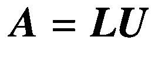****

 ****例如，对于一个 3 × 3 的矩阵 ***一个*** ，它的 LU 分解如下:![$$ \left[\begin{array}{ccc}{a}_{11}&amp; {a}_{12}&amp; {a}_{13}\\ {}{a}_{21}&amp; {a}_{22}&amp; {a}_{23}\\ {}{a}_{31}&amp; {a}_{32}&amp; {a}_{33}\end{array}\right]=\left[\begin{array}{ccc}{l}_{11}&amp; 0&amp; 0\\ {}{l}_{21}&amp; {l}_{22}&amp; 0\\ {}{l}_{31}&amp; {l}_{32}&amp; {l}_{33}\end{array}\right]\left[\begin{array}{ccc}{u}_{11}&amp; {u}_{12}&amp; {u}_{13}\\ {}0&amp; {u}_{22}&amp; {u}_{23}\\ {}0&amp; 0&amp; {u}_{33}\end{array}\right] $$](img/500382_1_En_2_Chapter_TeX_Equah.png)

这个版本有时可能无法实现。例如，如果 *a* <sub>11</sub> = 0，那么要么 *l* <sub>11</sub> = 0，要么 *u* <sub>11</sub> = 0。这个问题可以通过简单地重新排列**的行来解决，这样置换矩阵的第一个元素是非零的。后续因式分解步骤中的同样问题可以用同样的方法解决。因此，产品有时会包含一个置换矩阵 ***P*** 。具体来说，**

**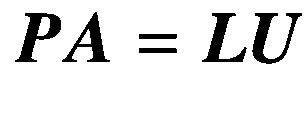**

 *****【P】***是一个行置换矩阵，当左乘到**时，对**的行进行重新排序。事实证明，所有的方阵都可以以这种形式进行因式分解，并且因式分解在实际应用中是数值稳定的。这使得 LUP 分解在实践中成为一种有用的技术。****

 ****例如，我们有如下:

![$$ \left[\begin{array}{ccc}0&amp; 0&amp; 1\\ {}1&amp; 0&amp; 0\\ {}0&amp; 0&amp; 0\end{array}\right]\left[\begin{array}{ccc}1&amp; 2&amp; 3\\ {}4&amp; 5&amp; 6\\ {}7&amp; 8&amp; 9\end{array}\right]=\left[\begin{array}{ccc}1&amp; 0&amp; 0\\ {}0.142857&amp; 1&amp; 0\\ {}0.571429&amp; 0.5&amp; 1\end{array}\right]\left[\begin{array}{ccc}7&amp; 8&amp; 9\\ {}0&amp; 0.857143&amp; 1.714286\\ {}0&amp; 0&amp; 0\end{array}\right] $$](img/500382_1_En_2_Chapter_TeX_Equaj.png)

在 NM Dev 中，类`LU`为一个正方形矩阵执行 LU 分解。它计算矩阵 ***L*** 、 ***U*** 和 ***P*** 。下面的代码实现了前面的示例:

```py
Matrix A = new DenseMatrix(new double[][]{
    {1, 2, 3},
    {4, 5, 6},
    {7, 8, 9}
});
// perform LU decomposition
LU lu = new LU(A);
LowerTriangularMatrix L = lu.L();
UpperTriangularMatrix U = lu.U();
PermutationMatrix P = lu.P();

System.out.println(String.format("P = %s", P));
System.out.println(String.format("L = %s", L));
System.out.println(String.format("U = %s", U));

Matrix PA = P.multiply(A);
Matrix LU = L.multiply(U);
// verify that PA = LU
System.out.println(String.format("%s = \n%s is %b",
        PA,
        LU,
        MatrixPropertyUtils.areEqual(PA, LU, 1e-14)));

```

输出如下所示:

```py
P = 3x3
        [,1] [,2] [,3]
[1,] 0.000000, 0.000000, 1.000000,
[2,] 1.000000, 0.000000, 0.000000,
[3,] 0.000000, 1.000000, 0.000000,
L = 3x3
        [,1] [,2] [,3]
[1,] 1.000000, 0.000000, 0.000000,
[2,] 0.142857, 1.000000, 0.000000,
[3,] 0.571429, 0.500000, 1.000000,
U = 3x3
       [,1] [,2] [,3]
[1,] 7.000000, 8.000000, 9.000000,
[2,] 0.000000, 0.857143, 1.714286,
[3,] 0.000000, 0.000000, 0.000000,
3x3
        [,1] [,2] [,3]
[1,] 7.000000, 8.000000, 9.000000,
[2,] 1.000000, 2.000000, 3.000000,
[3,] 4.000000, 5.000000, 6.000000,  =
3x3
       [,1] [,2] [,3]
[1,] 7.000000, 8.000000, 9.000000,
[2,] 1.000000, 2.000000, 3.000000,
[3,] 4.000000, 5.000000, 6.000000,  is true

```

### 乔莱斯基分解

如果 ***A*** 是一个对称的(或者埃尔米特的如果 ***A*** 是复数)正定矩阵，我们可以这样做，使得 ***U*** 是 ***L*** 的共轭转置。也就是说，我们可以把 ***写成*** 如下:


这种分解被称为乔莱斯基分解。乔莱斯基分解或乔莱斯基因式分解是将一个埃尔米特正定矩阵， ***一个*** ，分解成一个下三角矩阵， ***L*** ，并对其共轭转置***L***<sup>*H*</sup>或简单转置***L***<sup>*T*</sup>如果矩阵是实数。***L***<sup>*H*</sup>是上三角矩阵。对于正定矩阵，乔莱斯基分解总是存在且唯一的。此外，计算乔莱斯基分解比计算 LU 分解更有效并且在数值上更稳定。在适用的情况下，对于求解线性方程组，乔莱斯基分解的效率大约是 LU 分解的两倍。

经典乔莱斯基分解的一个变体是低密度脂蛋白分解。也就是


***L*** 是下单位三角矩阵(对角线上有 1)，而 ***D*** 是对角矩阵(非零只在对角线上，其他地方都是零)。即 ***L*** 的对角元素要求为 1(单位三角形)，代价是在分解中引入一个额外的对角矩阵 ***D*** 。主要优点是 LDL 分解可以用本质上相同的算法来计算和使用，但是避免了提取平方根。LDL 分解与经典乔莱斯基分解的关系如下:


例如，我们有如下:

![$$ \left[\begin{array}{ccc}4&amp; 12&amp; -16\\ {}12&amp; 37&amp; -43\\ {}-16&amp; -43&amp; 98\end{array}\right]=\left[\begin{array}{ccc}2&amp; 0&amp; 0\\ {}6&amp; 1&amp; 0\\ {}-8&amp; 5&amp; 3\end{array}\right]\left[\begin{array}{ccc}2&amp; 6&amp; -8\\ {}0&amp; 1&amp; 5\\ {}0&amp; 0&amp; 3\end{array}\right] $$](img/500382_1_En_2_Chapter_TeX_Equan.png)

有许多方法可以做乔莱斯基分解。在 NM Dev 中，接口`Cholesky`代表了库中的许多算法。类`Chol`根据输入矩阵包装了许多要使用的实现。默认选择是`Cholesky-Banachiewicz`类。Cholesky-Banachiewicz 算法从矩阵 *L* 的左上角开始，逐行计算矩阵。NM Dev `Chol`实现针对性能进行了高度优化，因为乔莱斯基分解是一个非常基本的操作，并且出现在许多线性代数计算中。对于一个大矩阵，`Chol`并行运行 Cholesky-Banachiewicz 算法。对于稀疏矩阵(稀疏矩阵是大部分为零的矩阵)，它运行稀疏版本。`Cholesky`计算矩阵 ***L*** 。下面的代码实现了前面的示例:

```py
Matrix A = new DenseMatrix(new double[][]{
    {4, 12, -6},
    {12, 37, -43},
    {-16, -43, 98}
});
Cholesky chol = new Chol(A);
LowerTriangularMatrix L = chol.L();
UpperTriangularMatrix Lt = chol.L().t();
System.out.println(String.format("L = %s", L));
System.out.println(String.format("Lt = %s", Lt));

Matrix LLt = L.multiply(Lt);
// verify that A = LLt
System.out.println(String.format("%s = \n%s is %b",
        A,
        LLt,
        MatrixPropertyUtils.areEqual(A, LLt, 1e-15)));

```

输出如下所示:

```py
L = 3x3
          [,1] [,2] [,3]
[1,] 2.000000, 0.000000, 0.000000,
[2,] 6.000000, 1.000000, 0.000000,
[3,] -8.000000, 5.000000, 3.000000,
Lt = 3x3
         [,1] [,2] [,3]
[1,] 2.000000, 6.000000, -8.000000,
[2,] 0.000000, 1.000000, 5.000000,
[3,] 0.000000, 0.000000, 3.000000,
3x3
           [,1] [,2] [,3]
[1,] 4.000000, 12.000000, -16.000000,
[2,] 12.000000, 37.000000, -43.000000,
[3,] -16.000000, -43.000000, 98.000000,  =
3x3
        [,1] [,2] [,3]
[1,] 4.000000, 12.000000, -16.000000,
[2,] 12.000000, 37.000000, -43.000000,
[3,] -16.000000, -43.000000, 98.000000,  is true

```

### 2.3.3 海森伯格分解和三对角化

在二维空间`ℝ` <sup>2</sup> 中，我们一般用 x 轴和 y 轴作为坐标或基。不过这两个轴并没有什么特别之处，除了互相垂直或者互相正交。如果更方便的话，我们同样可以选择另一组两个正交的轴来标记坐标。参见图 [2-19](#Fig19) 。


图 2-19

坐标变化或基础变化

对于图 [2-19](#Fig19) 中的例子，假设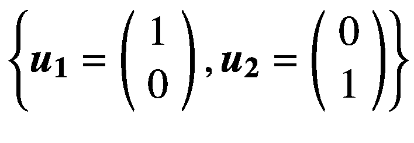是我们典型的 x-y 轴。{***v***<sub>**1**</sub>，***v***<sub>**2**</sub>}是新的坐标系或基，它是{**<sub>**1**</sub>，***u***<sub>**2**的旋转我们可以把{***v***<sub>**1**</sub>，***v***<sub>**2**</sub>}用{**<sub>**1**</sub>， *** u *****</sub>** 

************

 ****或者，等价地以矩阵形式，

![$$ \left[\begin{array}{c}{\boldsymbol{v}}_{\mathbf{1}}\\ {}{\boldsymbol{v}}_{\mathbf{2}}\end{array}\right]=\left[\begin{array}{cc}\cos \theta &amp; \sin \theta \\ {}-\sin \theta &amp; \cos \theta \end{array}\right]\left[\begin{array}{c}{\boldsymbol{u}}_{\mathbf{1}}\\ {}{\boldsymbol{u}}_{\mathbf{2}}\end{array}\right] $$](img/500382_1_En_2_Chapter_TeX_Equap.png)

通过左乘基底变化矩阵![$$ \boldsymbol{P}=\left[\begin{array}{cc}\cos \theta &amp; \sin \theta \\ {}-\sin \theta &amp; \cos \theta \end{array}\right] $$](img/500382_1_En_2_Chapter_TeX_IEq5.png)，我们可以根据原始坐标写出新的坐标。同样的基数变化概念也适用于更高的维度。

我们说两个 *n* × *n* 方阵 ***A*** 和 ***B*** 相似，如果存在一个可逆矩阵**使得**

**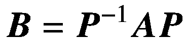**

 *****A*** 和 ***B*** 代表相同的线性变换但在两个不同基的坐标系中。矩阵 ***P*** 是基变化矩阵。 ***x*** 在改变基准后的新坐标系中的坐标如下:

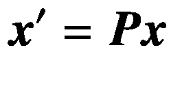

在新的坐标系中，变换可以写成:


在有原基的坐标系中，变换如下:

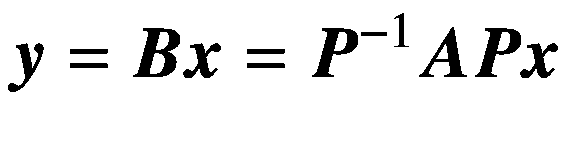

几何上，相似性变换分三步操作:换到新基(***【Px】***)、执行简单变换( ***APx*** )、变回旧基(*P*<sup>—1</sup>***APx***)。基的改变，例如将旋转轴与正 z 轴对准，可以导致相同变换或矩阵的更简单形式，例如在 ***和*** 中有更多的零。相似的矩阵有相同的特征值、重数和相同的行列式。

(上)Hessenberg 矩阵是在第一个次对角线以下有零个元素的矩阵。第一个次对角线是对角线正下方的条目。换句话说，一个 Hessenberg 矩阵只在矩阵的第一个次对角线、对角线和上部有非零元素。即 *a* <sub>*ij*</sub> = 0 当 *i* > *j* + 1。例如，下面的矩阵是一个海森伯格矩阵:

![$$ \left[\begin{array}{cccc}1&amp; 4&amp; 2&amp; 3\\ {}3&amp; 4&amp; 1&amp; 7\\ {}0&amp; 2&amp; 3&amp; 4\\ {}0&amp; 0&amp; 1&amp; 3\end{array}\right] $$](img/500382_1_En_2_Chapter_TeX_Equau.png)

赫森伯格分解发现，对于一个方阵**，一个方阵**这样****

********

 *******H*** 是一个海森伯格矩阵。 **Q** 是正交矩阵，意味着任意两行(或列)是正交的或者它们的点积是 0。相当于，***Q***<sup>—1</sup>=***Q***<sup>’</sup>。所以，**和 ***H*** 都差不多。**

 **在 NM Dev 中，类`HessenbergDecomposition`为一个正方形矩阵执行 Hessenberg 分解。它计算矩阵 ***Q*** 和 ***H*** 。下面的代码实现了这个例子:

![$$ \left\lceil \begin{array}{cccc}1&amp; 0&amp; 0&amp; 0\\ {}0&amp; -0.348743&amp; 0.089751&amp; -0.932911\\ {}0&amp; -0.464991&amp; -0.880822&amp; 0.089084\\ {}0&amp; -0.813733&amp; 0.464862&amp; 0.348914\end{array}\right\rceil \times \left\lceil \begin{array}{cccc}1&amp; 5&amp; 7&amp; 9\\ {}3&amp; 0&amp; 6&amp; 3\\ {}4&amp; 3&amp; 1&amp; 0\\ {}7&amp; 13&amp; 2&amp; 10\end{array}\right\rceil \times \left\lceil \begin{array}{cccc}1&amp; 0&amp; 0&amp; 0\\ {}0&amp; -0.348743&amp; -0.464991&amp; -0.813733\\ {}0&amp; 0.089751&amp; -0.880822&amp; 0.464862\\ {}0&amp; -0.932911&amp; 0.089084&amp; 0.348914\end{array}\right\rceil =\left\lceil \begin{array}{cccc}1&amp; -12.322250&amp; -1.533240&amp; -0.900742\\ {}-8.602325&amp; 13.594595&amp; -1.657558&amp; 7.593136\\ {}0&amp; -5.460964&amp; 2.073954&amp; -1.404349\\ {}0&amp; 0&amp; 4.989271&amp; -4.668549\end{array}\right\rceil $$](img/500382_1_En_2_Chapter_TeX_Equaw.png)

```py
Matrix A = new DenseMatrix(new double[][]{
    {1, 5, 7, 9},
    {3, 0, 6, 3},
    {4, 3, 1, 0},
    {7, 13, 2, 10}
});
HessenbergDecomposition hessenberg
        = new HessenbergDecomposition(A);

Matrix H = hessenberg.H();
System.out.println(String.format(
        "H = \n%s is Hessenberg, %b",
        H,
        Hessenberg.isHessenberg(H, 0)));

Matrix Q = hessenberg.Q();
System.out.println(String.format(
        "Q = \n%s is orthogonal, %b",
        Q,
        MatrixPropertyUtils.isOrthogonal(Q, 1e-14)));

// verify that Qt * A * Q = H
Matrix QtAQ = Q.t().multiply(A).multiply(Q);
System.out.println(String.format("%s = \n%s is %b",
        H,
        QtAQ,
        MatrixPropertyUtils.isOrthogonal(Q, 1e-14)));

```

输出如下所示:

```py
H =
4x4
         [,1] [,2] [,3] [,4]
[1,] 1.000000, -12.322250, -1.533240, -0.900742,
[2,] -8.602325, 13.594595, -1.657558, 7.593136,
[3,] 0.000000, -5.460964, 2.073954, -1.404349,
[4,] 0.000000, 0.000000, 4.989271, -4.668549,  is Hessenberg, true
Q =
4x4
         [,1] [,2] [,3] [,4]
[1,] 1.000000, 0.000000, 0.000000, 0.000000,
[2,] 0.000000, -0.348743, 0.089751, -0.932911,
[3,] 0.000000, -0.464991, -0.880822, 0.089084,
[4,] 0.000000, -0.813733, 0.464862, 0.348914,  is orthogonal, true
4x4
         [,1] [,2] [,3] [,4]
[1,] 1.000000, -12.322250, -1.533240, -0.900742,
[2,] -8.602325, 13.594595, -1.657558, 7.593136,
[3,] 0.000000, -5.460964, 2.073954, -1.404349,
[4,] 0.000000, 0.000000, 4.989271, -4.668549,  =
4x4
        [,1] [,2] [,3] [,4]
[1,] 1.000000, -12.322250, -1.533240, -0.900742,
[2,] -8.602325, 13.594595, -1.657558, 7.593136,
[3,] 0.000000, -5.460964, 2.073954, -1.404349,
[4,] -0.000000, 0.000000, 4.989271, -4.668549,  is true

```

如果 ***A*** 是厄米的，那么这个变换将其简化为三对角形式。也就是

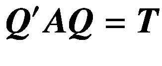

***一个*** 和 ***T*** 都差不多。 ***T*** 是三对角矩阵。三对角矩阵在主对角线上有非零元素，第一个次对角线在主对角线之下，第一个超对角线仅在主对角线之上。即*a*<sub>*ij*</sub>= 0 当 *i* > *j* + 1 和*I*<*j*—1。看起来是这样的:

![$$ T=\left[\begin{array}{ccccc}{a}_1&amp; {b}_1&amp; &amp; &amp; \\ {}{c}_1&amp; {a}_2&amp; {b}_2&amp; &amp; \\ {}&amp; {c}_2&amp; \ddots &amp; \ddots &amp; \\ {}&amp; &amp; \ddots &amp; \ddots &amp; {b}_{n-1}\\ {}&amp; &amp; &amp; {c}_{n-1}&amp; {a}_n\end{array}\right] $$](img/500382_1_En_2_Chapter_TeX_Equay.png)

在 NM Dev 中，类`TriDiagonalization`执行对称方阵的三对角化。它计算矩阵 ***Q*** 和 ***T*** 。下面的代码实现了这个例子:

![$$ \left\lceil \begin{array}{cccc}1&amp; 0&amp; 0&amp; 0\\ {}0&amp; -0.40161&amp; 0.601902&amp; -0.690235\\ {}0&amp; -0.562254&amp; -0.756975&amp; -0.332956\\ {}0&amp; -0.722897&amp; 0.254368&amp; 0.64243\end{array}\right\rceil \times \left\lceil \begin{array}{cccc}1&amp; 5&amp; 7&amp; 9\\ {}5&amp; 0&amp; 3&amp; 13\\ {}7&amp; 3&amp; 1&amp; 2\\ {}9&amp; 13&amp; 2&amp; 10\end{array}\right\rceil \times \left\lceil \begin{array}{cccc}1&amp; 0&amp; 0&amp; 0\\ {}0&amp; -0.40161&amp; -0.562254&amp; -0.722897\\ {}0&amp; 0.601902&amp; -0.756975&amp; 0.254368\\ {}0&amp; -0.690235&amp; -0.332956&amp; 0.64243\end{array}\right\rceil =\left\lceil \begin{array}{cccc}1&amp; -12.4499&amp; 0&amp; 0\\ {}-12.4499&amp; 16.070968&amp; -7.692568&amp; 0\\ {}0&amp; -7.692568&amp; 1.696818&amp; 4.45481\\ {}0&amp; 0&amp; 4.45481&amp; -6.767786\end{array}\right\rceil $$](img/500382_1_En_2_Chapter_TeX_Equaz.png)

```py
// define a symmetric matrix
Matrix S = new SymmetricMatrix(new double[][]{
    {1},
    {5, 0},
    {7, 3, 1},
    {9, 13, 2, 10}});
//        Matrix S = new DenseMatrix(new double[][]{
//            {1, 5, 7, 9},
//            {5, 0, 3, 13},
//            {7, 3, 1, 2},
//            {9, 13, 2, 10}
//        });

TriDiagonalization triDiagonalization
        = new TriDiagonalization(S);

Matrix T = triDiagonalization.T();
System.out.println(String.format(
        "T = \n%s is tri-diagonal, %b",
        T,
        MatrixPropertyUtils.isTridiagonal(T, 1e-14)));

Matrix Q = triDiagonalization.Q();
System.out.println(String.format(
        "Q = \n%s is tri-diagonal, %b",
        Q,
        MatrixPropertyUtils.isOrthogonal(Q, 1e-14)));

// verify that Qt * A * Q = T
Matrix QtSQ = Q.t().multiply(S).multiply(Q);
System.out.println(String.format("%s = \n%s is %b",
        T,
        QtSQ,
        MatrixPropertyUtils.areEqual(QtSQ, T, 1e-13)));

```

输出如下所示:

```py
T = 4x4
       [,1] [,2] [,3] [,4]
[1,] 1.000000, -12.449900, 0.000000, 0.000000,
[2,] -12.449900, 16.070968, -7.692568, 0.000000,
[3,] 0.000000, -7.692568, 1.696818, 4.454810,
[4,] 0.000000, 0.000000, 4.454810, -6.767786,  is tri-diagonal, true
Q = 4x4
       [,1] [,2] [,3] [,4]
[1,] 1.000000, 0.000000, 0.000000, 0.000000,
[2,] 0.000000, -0.401610, 0.601902, -0.690235,
[3,] 0.000000, -0.562254, -0.756975, -0.332956,
[4,] 0.000000, -0.722897, 0.254368, 0.642430,  is tri-diagonal, true
4x4
       [,1] [,2] [,3] [,4]
[1,] 1.000000, -12.449900, 0.000000, 0.000000,
[2,] -12.449900, 16.070968, -7.692568, 0.000000,
[3,] 0.000000, -7.692568, 1.696818, 4.454810,
[4,] 0.000000, 0.000000, 4.454810, -6.767786,  =
4x4
        [,1] [,2] [,3] [,4]
[1,] 1.000000, -12.449900, -0.000000, 0.000000,
[2,] -12.449900, 16.070968, -7.692568, 0.000000,
[3,] -0.000000, -7.692568, 1.696818, 4.454810,
[4,] 0.000000, 0.000000, 4.454810, -6.767786,  is true

```

类`SymmetricMatrix`从矩阵的下三角部分的数据构造一个对称矩阵。签名如下:

```py
/**
 * Construct a symmetric matrix from a 2D {@code double[][]} array.
 * The array specifies only the lower triangular part (main diagonal inclusive) of the whole
 * matrix.
 * For example,
 * <blockquote><code><pre>
 *         new double[][]{
 *                  {1},
 *                  {2, 3},
 *                  {4, 5, 6},
 *                  {7, 8, 9, 10},
 *                  {11, 12, 13, 14, 15}});
 * </pre></code></blockquote>
 * gives
 * \[
 * \begin{bmatrix}
 * 1 & 2 & 4 & 7 & 11\\
 * 2 & 3 & 5 & 8 & 12\\
 * 4 & 5 & 6 & 9 & 13\\
 * 7 & 8 & 9 & 10 & 14\\
 * 11 & 12 & 13 & 14 & 15
 * \end{bmatrix}
 * \]
 * This constructor uses lower instead of upper triangular representation for visual reason.
 *
 * @param data the lower triangular specification
 */
public SymmetricMatrix(double[][] data)

```

如果线性代数问题的约束条件不允许将一般矩阵方便地化为三角矩阵，化为 Hessenberg 形式通常是下一个最好的选择。事实上，将任何矩阵化简为 Hessenberg 形式都可以通过有限的步骤来实现。Hessenberg 矩阵到三角矩阵的后续降阶可以通过迭代过程实现，例如移位 QR 分解。在特征值算法中，通过移位 QR 分解结合收缩步骤，可以将 Hessenberg 矩阵进一步简化为三角矩阵。将一般矩阵化简为 Hessenberg 矩阵，然后进一步化简为三角矩阵，而不是直接将一般矩阵化简为三角矩阵，这通常节省了特征值问题的 QR 算法中所涉及的算法。

### QR 分解

QR 分解或 QR 分解是将一个矩阵**分解成这个乘积:**

**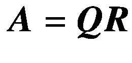**

 **使得 ***Q*** 为正交矩阵(其列为单位向量，***Q***<sup>—1</sup>=***Q***<sup>′</sup>)***R***为上三角矩阵)。如果 **A** 是可逆的，那么如果我们要求**R 有一个正对角线(在 ***R*** 中的对角线元素是正的)，那么因式分解是唯一的。如果 ***A*** 有 *n* 线性无关列，那么 ***Q*** 的前 *n* 列构成了 ***A*** 列空间的一个正交基。更一般地说， ***Q*** 的前 *k* 列构成了任意 1≤*k≤*≤*n*的**的前 *k* 列跨度的正交基。事实上，任何一列*的*k*A 的*只取决于第一列 *k* 的*Q 的*负责三角形形式的*R 的*。****

 ****进行 QR 分解有几种方法，例如通过 Gram-Schmidt 过程(`GramSchmidt`类)、Householder 变换(`Householder`类)或 Givens 旋转(`GivensMatrix`类)。在 NM Dev 中，接口`QRDecomposition`表示不同 QR 算法的实现。签名如下:

```py
public interface QRDecomposition {

    /**
     * Get <i>P</i>, the pivoting matrix in the QR decomposition.
     *
     * @return <i>P</i>
     */
    public PermutationMatrix P();

    /**
     * Get the orthogonal <i>Q</i> matrix in the QR decomposition, <i>A =
     * QR</i>. The dimension of <i>Q</i> is <i>m x n</i>, the same as <i>A</i>,
     * the matrix to be orthogonalized.
     *
     * @return <i>Q</i>
     */
    public Matrix Q();

    /**
     * Get the upper triangular matrix <i>R</i> in the QR decomposition, <i>A =
     * QR</i>. The dimension of <i>R</i> is <i>n x n</i>, a square matrix.
     *
     * @return <i>R</i>
     */
    public UpperTriangularMatrix R();

    /**
     * Get the numerical rank of <i>A</i> as computed by the QR decomposition.
     * Numerical determination of rank requires a criterion to decide when a
     * value should be treated as zero, hence a precision parameter. This is a
     * practical choice which depends on both the matrix and the application.
     * For instance, for a matrix with a big first eigenvector, we should
     * accordingly decrease the precision to compute the rank.
     *
     * @return the rank of <i>A</i>
     */
    public int rank();

    /**
     * Get the square <i>Q</i> matrix. This is an arbitrary orthogonal
     * completion of the <i>Q</i> matrix in the QR decomposition. The dimension
     * is <i>m x m</i> (square). We have <i>A = sqQ * tallR</i>.
     *
     * @return the square <i>Q</i> matrix
     */
    public Matrix squareQ();

    /**
     * Get the tall <i>R</i> matrix. This is completed by binding zero rows
     * beneath the square upper triangular matrix <i>R</i> in the QR
     * decomposition. The dimension is <i>m x n</i>. It may not be square. We
     * have <i>A = sqQ * tallR</i>.
     *
     * @return the tall <i>R</i> matrix
     */
    public Matrix tallR();
}

```

到目前为止，我们讨论的分解只适用于方阵。QR 分解适用于方形矩阵以及扭曲的高矩阵。具体来说，对于一个 *m* × *n* 矩阵 ***A*** 其中 *m* ≥ *n* ，我们可以这样做:

![$$ \boldsymbol{A}=\boldsymbol{Q}\boldsymbol{R}=\boldsymbol{Q}\left[\begin{array}{c}{\boldsymbol{R}}_{\mathbf{1}}\\ {}\mathbf{0}\end{array}\right]=\left[{\boldsymbol{Q}}_{\mathbf{1}}\kern0.5em {\boldsymbol{Q}}_{\mathbf{2}}\right]\left[\begin{array}{c}{\boldsymbol{R}}_{\mathbf{1}}\\ {}\mathbf{0}\end{array}\right]={\boldsymbol{Q}}_{\mathbf{1}}{\boldsymbol{R}}_{\mathbf{1}} $$](img/500382_1_En_2_Chapter_TeX_Equbb.png)

*T5】QT7】是一个 *m* × *m* 矩阵。 ***R*** 是一个 *m* × *n* 上三角矩阵。**的底部(*m*—*n*)行为零。***Q***<sub>**1**</sub>是一个 *m* × *n* 矩阵，***Q***<sub>**2**</sub>是一个*m*×(*m*-*n*)。***Q***<sub>**1**</sub>和***Q***<sub>**2**</sub>都有正交列。***R***<sub>**1**</sub>是一个 *n* × *n* 矩阵。函数`Q()`计算出*m*×*n****Q***<sub>**1**</sub>矩阵。函数`R()`计算出*n*×*n****R***<sub>**1**</sub>矩阵。函数`squareQ()`计算矩阵*m*×*m****Q***。函数`tallR()`计算高*m*×*n****R***矩阵。***

 **NM Dev 类`QR`是一个执行 QR 分解的包装类。默认情况下，它使用 Householder QR 算法。Householder 反射比 Gram-Schmidt 过程具有更好的数值稳定性。下面的代码实现了这个例子:

![$$ \left[\begin{array}{cc}3&amp; 2\\ {}1&amp; 2\end{array}\right]=\left[\begin{array}{cc}0.948683&amp; -0.316228\\ {}0.316228&amp; 0.948683\end{array}\right]\left[\begin{array}{cc}3.162278&amp; 2.529822\\ {}0&amp; 1.264911\end{array}\right] $$](img/500382_1_En_2_Chapter_TeX_Equbc.png)

```py
Matrix A = new DenseMatrix(new double[][]{
    {3, 2},
    {1, 2}
});

// use the Householder QR algorithm
QRDecomposition qr1 = new HouseholderQR(A, 0);
System.out.println("rank = " + qr1.rank());

Matrix Q1 = qr1.Q();
System.out.println(String.format(
        "Q = \n%s is orthogonal, %b",
        Q1,
        MatrixPropertyUtils.isOrthogonal(Q1, 1e-15)));

UpperTriangularMatrix R1 = qr1.R();
System.out.println("R = \n" + R1);

// verify that Q1R1 = A
Matrix Q1R1 = Q1.multiply(R1);
System.out.println(String.format("%s = \n%s is %b",
        A,
        Q1R1,
        MatrixPropertyUtils.areEqual(Q1R1, A, 1e-13)));

// use the Gram-Schmidt QR algorithm
QRDecomposition qr2 = new GramSchmidt(A);
System.out.println("rank = " + qr2.rank());

Matrix Q2 = qr2.Q();
System.out.println(String.format(
        "Q = \n%s is orthogonal, %b",
        Q2,
        MatrixPropertyUtils.isOrthogonal(Q2, 1e-15)));

UpperTriangularMatrix R2 = qr2.R();
System.out.println("R = \n" + R2);

// verify that Q2R2 = A
Matrix Q2R2 = Q2.multiply(R2);
System.out.println(String.format("%s = \n%s is %b",
        A,
        Q2R2,
        MatrixPropertyUtils.areEqual(Q2R2, A, 1e-13)));

```

输出如下所示:

```py
rank = 2
Q =
2x2
        [,1] [,2]
[1,] -0.948683, -0.316228,
[2,] -0.316228, 0.948683,  is orthogonal, true
R =
2x2
         [,1] [,2]
[1,] -3.162278, -2.529822,
[2,] 0.000000, 1.264911,
2x2
         [,1] [,2]
[1,] 3.000000, 2.000000,
[2,] 1.000000, 2.000000,  =
2x2
         [,1] [,2]
[1,] 3.000000, 2.000000,
[2,] 1.000000, 2.000000,  is true
rank = 2
Q =
2x2
         [,1] [,2]
[1,] 0.948683, -0.316228,
[2,] 0.316228, 0.948683,  is orthogonal, true
R =
2x2
         [,1] [,2]
[1,] 3.162278, 2.529822,
[2,] 0.000000, 1.264911,
2x2
         [,1] [,2]
[1,] 3.000000, 2.000000,
[2,] 1.000000, 2.000000,  =
2x2
         [,1] [,2]
[1,] 3.000000, 2.000000,
[2,] 1.000000, 2.000000,  is true

```

这里有一个高大矩阵的例子:

![$$ \left[\begin{array}{ccc}1&amp; 2&amp; 3\\ {}6&amp; 7&amp; 8\\ {}11&amp; 12&amp; 13\\ {}16&amp; 17&amp; 18\\ {}21&amp; 22&amp; 23\end{array}\right]=\left[\begin{array}{ccc}-0.034199&amp; -0.773841&amp; -0.359539\\ {}-0.205196&amp; -0.507833&amp; -0.031675\\ {}-0.376192&amp; -0.241825&amp; 0.868055\\ {}-0.547188&amp; 0.024183&amp; -0.202929\\ {}-0.718185&amp; 0.290191&amp; -0.273913\end{array}\right]\left[\begin{array}{ccc}-29.240383&amp; -31.121343&amp; -33.002304\\ {}0&amp; -1.209127&amp; -2.418254\\ {}0&amp; 0&amp; 0\end{array}\right] $$](img/500382_1_En_2_Chapter_TeX_Equbd.png)

![$$ =\left[\begin{array}{ccccc}-0.034199&amp; -0.773841&amp; -0.359539&amp; -0.365120&amp; -0.370701\\ {}-0.205196&amp; -0.507833&amp; -0.031675&amp; 0.361174&amp; 0.754023\\ {}-0.376192&amp; -0.241825&amp; 0.868055&amp; -0.145512&amp; -0.159079\\ {}-0.547188&amp; 0.024183&amp; -0.202929&amp; 0.667982&amp; -0.461107\\ {}-0.718185&amp; 0.290191&amp; -0.273913&amp; -0.518524&amp; 0.236864\end{array}\right]\times \left[\begin{array}{ccc}-29.240383&amp; -31.121343&amp; -33.002304\\ {}0&amp; -1.209127&amp; -2.418254\\ {}0&amp; 0&amp; 0\\ {}0&amp; 0&amp; 0\\ {}0&amp; 0&amp; 0\end{array}\right] $$](img/500382_1_En_2_Chapter_TeX_Eqube.png)

解决这个问题的 NM Dev 代码如下:

```py
Matrix A = new DenseMatrix(new double[][]{
    {1, 2, 3},
    {6, 7, 8},
    {11, 12, 13},
    {16, 17, 18},
    {21, 22, 23}
});

QRDecomposition qr = new QR(A, 1e-14);
System.out.println("rank = " + qr.rank());

Matrix Q1 = qr.Q();
System.out.println("Q1 = \n" + Q1);
UpperTriangularMatrix R1 = qr.R();
System.out.println("R1 = \n" + R1);
// verify that Q1R1 = A
Matrix Q1R1 = Q1.multiply(R1);
System.out.println(String.format("%s = \n%s is %b",
        A,
        Q1R1,
        MatrixPropertyUtils.areEqual(Q1R1, A, 1e-13)));

Matrix Q = qr.squareQ();
System.out.println("Q = \n" + Q);
Matrix R = qr.tallR();
System.out.println("R = \n" + R);
// verify that QR = A
Matrix QR = Q.multiply(R);
System.out.println(String.format("%s = \n%s is %b",
        A,
        QR,
        MatrixPropertyUtils.areEqual(QR, A, 1e-13)));

```

输出如下所示:

```py
rank = 2
Q1 =
5x3
         [,1] [,2] [,3]
[1,] -0.034199, -0.773841, -0.359539,
[2,] -0.205196, -0.507833, -0.031675,
[3,] -0.376192, -0.241825, 0.868055,
[4,] -0.547188, 0.024183, -0.202929,
[5,] -0.718185, 0.290191, -0.273913,
R1 =
3x3
         [,1] [,2] [,3]
[1,] -29.240383, -31.121343, -33.002304,
[2,] 0.000000, -1.209127, -2.418254,
[3,] 0.000000, 0.000000, 0.000000,
5x3
         [,1] [,2] [,3]
[1,] 1.000000, 2.000000, 3.000000,
[2,] 6.000000, 7.000000, 8.000000,
[3,] 11.000000, 12.000000, 13.000000,
[4,] 16.000000, 17.000000, 18.000000,
[5,] 21.000000, 22.000000, 23.000000,  =
5x3
         [,1] [,2] [,3]
[1,] 1.000000, 2.000000, 3.000000,
[2,] 6.000000, 7.000000, 8.000000,
[3,] 11.000000, 12.000000, 13.000000,
[4,] 16.000000, 17.000000, 18.000000,
[5,] 21.000000, 22.000000, 23.000000,  is true
Q =
5x5
         [,1] [,2] [,3] [,4] [,5]
[1,] -0.034199, -0.773841, -0.359539, -0.365120, -0.370701,
[2,] -0.205196, -0.507833, -0.031675, 0.361174, 0.754023,
[3,] -0.376192, -0.241825, 0.868055, -0.145512, -0.159079,
[4,] -0.547188, 0.024183, -0.202929, 0.667982, -0.461107,
[5,] -0.718185, 0.290191, -0.273913, -0.518524, 0.236864,
R =
5x3
         [,1] [,2] [,3]
[1,] -29.240383, -31.121343, -33.002304,
[2,] 0.000000, -1.209127, -2.418254,
[3,] 0.000000, 0.000000, 0.000000,
[4,] 0.000000, 0.000000, 0.000000,
[5,] 0.000000, 0.000000, 0.000000,
5x3
         [,1] [,2] [,3]
[1,] 1.000000, 2.000000, 3.000000,
[2,] 6.000000, 7.000000, 8.000000,
[3,] 11.000000, 12.000000, 13.000000,
[4,] 16.000000, 17.000000, 18.000000,
[5,] 21.000000, 22.000000, 23.000000,  =
5x3
         [,1] [,2] [,3]
[1,] 1.000000, 2.000000, 3.000000,
[2,] 6.000000, 7.000000, 8.000000,
[3,] 11.000000, 12.000000, 13.000000,
[4,] 16.000000, 17.000000, 18.000000,
[5,] 21.000000, 22.000000, 23.000000,  is true

```

### 特征分解

给定一个线性变换或其矩阵， ***一个*** ，一个特征向量***v*****一个*** 就是这样一个向量，即*

**

*λ* 称为*T3A*的一个特征值，对应特征向量*vT9】。*

从几何学上来说，就是对向量**应用线性变换***A**T3】时，变换只是拉伸( *λ* > 1)或收缩( *λ* < 1)向量，而不改变其方向( *λ* > 0)，而不是翻转到相反的方向( *λ* < 0)。 ***Av*** 与 ***v*** 平行。见图 [2-20](#Fig20) 。***

 **

图 2-20

特征向量和特征值

为了理解这一点的重要性，我们来看一个激励人心的例子。考虑一下 *ℝ* <sup>2</sup> :

![$$ \boldsymbol{A}=\left[\begin{array}{cc}{a}_{11}&amp; 0\\ {}0&amp; {a}_{22}\end{array}\right] $$](img/500382_1_En_2_Chapter_TeX_Equbg.png)

中的这个对角矩阵

如果我们把 ***A*** 乘以 x 轴![$$ {\boldsymbol{u}}_{\mathbf{1}}=\left[\begin{array}{c}1\\ {}0\end{array}\right] $$](img/500382_1_En_2_Chapter_TeX_IEq6.png)，我们得到这个:

![$$ \boldsymbol{A}{\boldsymbol{u}}_{\mathbf{1}}=\left[\begin{array}{cc}{a}_{11}&amp; 0\\ {}0&amp; {a}_{22}\end{array}\right]\left[\begin{array}{c}1\\ {}0\end{array}\right]=\left[\begin{array}{c}{a}_{11}\\ {}0\end{array}\right]={a}_{11}\left[\begin{array}{c}1\\ {}0\end{array}\right] $$](img/500382_1_En_2_Chapter_TeX_Equbh.png)

***Au***<sub>**1**</sub>和***u***<sub>**1**</sub>是平行的，所以 x 轴是一个特征向量。对应的特征值是*a*T18】11。

同样，如果我们将**乘以 y 轴![$$ {\boldsymbol{u}}_{\mathbf{2}}=\left[\begin{array}{c}0\\ {}1\end{array}\right] $$](img/500382_1_En_2_Chapter_TeX_IEq7.png)，我们得到:**

**![$$ \boldsymbol{A}{\boldsymbol{u}}_{\mathbf{2}}=\left[\begin{array}{cc}{a}_{11}&amp; 0\\ {}0&amp; {a}_{22}\end{array}\right]\left[\begin{array}{c}0\\ {}1\end{array}\right]=\left[\begin{array}{c}0\\ {}{a}_{22}\end{array}\right]={a}_{22}\left[\begin{array}{c}0\\ {}1\end{array}\right] $$](img/500382_1_En_2_Chapter_TeX_Equbi.png)**

 *****Au***<sub>**2**</sub>和***u***<sub>**2**</sub>是平行的，所以 y 轴是一个特征向量。对应的特征值是*a*T18】22。事实上，它们是所有(无限多)其他可能的向量中唯一有效的两个向量。也就是说，对于对角矩阵，特征向量就是它的基。反之亦然。对于任何可对角化的矩阵，如果我们把矩阵写在其特征向量组成的新基中，那么在新坐标系中的矩阵就是对角矩阵。

数学上，一个 *n* × *n* 方阵*T5】A*可对角化，如果存在一个 *n* × *n* 方阵 ***Q*** 使得


或者，等价地，


***Q*** 是正交的，因而是一个基。它的列是*T5【A】T6*的特征向量，并且都是线性无关的。 ***D*** 是对角矩阵，其对角元素是对应的特征值。这被称为矩阵**的*特征分解*。这种分解可以从特征向量的基本性质中导出。**

****

**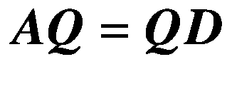**

**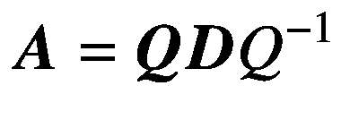**

 **寻找特征值和特征向量是重要的，因为它们有广泛的应用，例如，在稳定性分析，振动分析，原子轨道和面部识别。

通常，机器学习或数据分析中的一个重要应用是降维或主成分分析(PCA)。PCA 是计算主成分并使用它们对数据进行基变换的过程，有时只使用前几个主成分而忽略其余的。直观上，PCA 可以被认为是通过旋转轴来拟合一个 *p* 维椭球体或数据，使得数据的大部分方差只落在几个轴上。如果椭球的(旋转)轴很小，那么沿该轴的方差也很小。我们可以去掉那个维度，有效地把数据从高维空间投影到低维空间。

为了找到椭球的新轴，我们计算数据的协方差矩阵，并计算该协方差矩阵的特征值和相应的特征向量。然后，我们必须归一化每个正交特征向量，将它们转换为单位向量。一旦做到这一点，每个相互正交的单位特征向量可以被解释为适合数据的椭球轴。这种基的选择将把我们的协方差矩阵转换成对角化的形式，对角元素代表每个轴的方差。每个特征向量所代表的方差的比例可以通过将对应于该特征向量的特征值除以所有特征值的总和来计算。见图 [2-21](#Fig21) 。


图 2-21

主成分分析和降维

进行特征分解有几种方法，例如通过特征多项式(对于小矩阵)、DQDS 算法(对于三对角矩阵)、MR3 算法(对于对称矩阵)和 QR 算法(对于一般矩阵)。所有这些算法和转换的实现都非常复杂。NM Dev 类`EigenDecomposition`包装了所有这些算法，并根据输入矩阵应用合适的算法。签名如下:

```py
/**
 * Runs the eigen decomposition on a <em>square</em> matrix.
 *
 * @param A       a square, <em>diagonalizable</em> matrix
 * @param epsilon a precision parameter: when a number |x| &le; &epsilon;,
 *                it is considered 0
 */
public EigenDecomposition(Matrix A, double epsilon)

/**
 * Runs the eigen decomposition on a <em>square</em> matrix.
 *
 * @param A a square, <em>diagonalizable</em> matrix
 */
public EigenDecomposition(Matrix A)

/**
 * Get the diagonal matrix <i>D</i> as in <i>Q * D * Q' = A</i>.
 *
 * Note that for the moment we support only real eigenvalues.
 *
 * @return <i>D</i>
 */
public DiagonalMatrix D()

/**
 * Get <i>Q</i> as in <i>Q * D * Q' = A</i>.
 *
 * Note that for the moment we support only real eigenvalues.
 *
 * @return <i>Q</i>
 */
public Matrix Q()

/**
 * Get <i>Q'</i> as in <i>Q * D * Q' = A</i>.
 *
 * Note that for the moment we support only real eigenvalues.
 *
 * @return {@code Q.t()}
 */
public Matrix Qt()

```

下面的代码实现了这个例子:

![$$ \left[\begin{array}{cc}5&amp; 2\\ {}2&amp; 5\end{array}\right]=\left[\begin{array}{cc}0.707107&amp; -0.707107\\ {}0.707107&amp; 0.707107\end{array}\right]\left[\begin{array}{cc}7&amp; 0\\ {}0&amp; 3\end{array}\right]\left[\begin{array}{cc}0.707107&amp; 0.707107\\ {}-0.707107&amp; 0.707107\end{array}\right] $$](img/500382_1_En_2_Chapter_TeX_Equbo.png)

```py
Matrix A = new DenseMatrix(new double[][]{
    {5, 2},
    {2, 5}
});

// doing eigen decomposition
EigenDecomposition eigen = new EigenDecomposition(A);

Matrix D = eigen.D();
System.out.println("D = \n" + D);
Matrix Q = eigen.Q();
System.out.println("Q = \n" + Q);
Matrix Qt = eigen.Qt();
System.out.println("Qt = \n" + Qt);

// verify that QDQt = A
Matrix QDQt = Q.multiply(D).multiply(Qt);
System.out.println(String.format("%s = \n%s is %b",
        A,
        QDQt,
        MatrixPropertyUtils.areEqual(A, QDQt, 1e-14)));

```

输出如下所示:

```py
D =
2x2
         [,1] [,2]
[1,] 7.000000, 0.000000,
[2,] 0.000000, 3.000000,
Q =
2x2
         [,1] [,2]
[1,] 0.707107, -0.707107,
[2,] 0.707107, 0.707107,
Qt =
2x2
         [,1] [,2]
[1,] 0.707107, 0.707107,
[2,] -0.707107, 0.707107,
2x2
         [,1] [,2]
[1,] 5.000000, 2.000000,
[2,] 2.000000, 5.000000,  =
2x2
         [,1] [,2]
[1,] 5.000000, 2.000000,
[2,] 2.000000, 5.000000,  is true

```

而类`EigenDecomposition`给出了分解，不方便提取特征向量和对应的特征值。为了操作特征向量和特征值，我们使用了类`Eigen`和`EigenProperty`。

`Eigen`的签名如下:

```py
/**
 * Compute the eigenvalues and eigenvectors for a <em>square</em> matrix.
 * For each eigenvalue, there are infinitely many associated eigenvectors,
 * which forms a vector space. This implementation computes a set of
 * linearly independent basis, any linear combination of them qualifies as
 * an eigenvector.
 *
 * <em>
 * TODO: For the moment, we compute both real and complex eigenvalues,
 * but we do not compute the eigenvectors for complex eigenvalues.
 * </em>
 *
 * @param A       a <em>square</em> matrix
 * @param method  the eigen decomposition algorithm, c.f., {@link Method}
 * @param epsilon a precision parameter: when a number |x| &le; &epsilon;,
 *                it is considered 0
 * @throws IllegalArgumentException if <i>A</i> is not square
 */
public Eigen(Matrix A, Method method, final double epsilon)

/**
 * Use {@link Method#QR} method by default.
 *
 * @param A       a <em>square</em> matrix
 * @param epsilon a precision parameter: when a number |x| &le; &epsilon;,
 *                it is considered 0
 * @see #Eigen(dev.nm.algebra.linear.matrix.doubles.Matrix, double)
 */
public Eigen(Matrix A, double epsilon)

/**
 * Compute the eigenvalues and eigenvectors for a <em>square</em> matrix.
 *
 * @param A      a <em>square</em> matrix
 * @param method the eigen decomposition algorithm, c.f., {@link Method}
 */
public Eigen(Matrix A, Method method)

/**
 * Compute the eigenvalues and eigenvectors for a <em>square</em> matrix.
 *
 * @param A a <em>square</em> matrix
 * @see <a href="http://en.wikipedia.org/wiki/QR_algorithm">Wikipedia: QR
 * algorithm</a>
 */
public Eigen(Matrix A)

/**
 * Get all the eigenvalues, real and complex.
 *
 * @return the eigenvalues
 */
List<? extends Number> getEigenvalues();

/**
 * Get all real eigenvalues.
 * The eigenvalues are sorted in descending order.
 *
 * @return all real eigenvalues
 */
public double[] getRealEigenvalues()

/**
 * Get the {@link EigenProperty} by eigenvalue. Note that the number passed
 * in must be exactly the same as the eigenvalue in binary representation.
 * Passing in an approximate number (up to precision) will likely result in
 * an unmatched error, i.e., {@code null} returned.
 *
 * @param eigenvalue an eigenvalue
 * @return the {@code EigenProperty} of the eigenvalue
 */
public EigenProperty getProperty(Number eigenvalue)

```

`EigenProperty`的签名如下:

```py
/**
 * {@code EigenProperty} is a read-only structure that contains the information
 * about a particular eigenvalue, such as its multiplicity and eigenvectors.
 *
 * @author Haksun Li
 */
public class EigenProperty {

    /**
     * Get the eigenvalue.
     *
     * @return the eigenvalue
     */
    public Number eigenvalue()

    /**
     * Get the multiplicity of the eigenvalue (a root) of the characteristic
     * polynomial.
     *
     * @return the algebraic multiplicity
     */
    public int algebraicMultiplicity()

    /**
     * Get the dimension of the vector space spanned by the eigenvectors.
     *
     * @return the geometric multiplicity
     */
    public int geometricMultiplicity()

    /**
     * Get the eigenvectors.
     *
     * @return the eigenvectors
     */
    public List<Vector> eigenbasis()

    /**
     * Get an eigenvector.
     * Note that eigenvector is not unique.
     * This implementation always returns the first vector in the basis.
     * To get a complete set of the basis of the eigenvector space, use
     * {@link #eigenbasis()}.
     *
     * @return an eigenvector
     */
    public Vector eigenVector()

```

注意，一个矩阵可能有重复的特征值。一个特征值的重复数称为特征值的*代数重数。特征值的几何重数是与其相关的线性独立特征向量的数量。也就是说，它是由与该特征值相关的特征向量组成的基所跨越的零空间的维数。几何重数总是小于或等于特征值的代数重数。*

下面的 NM Dev 代码计算矩阵的特征值、它们相关的特征向量以及每组特征向量所跨越的线性空间。如果一个向量可以写成基向量的线性组合，那么它就属于线性空间。

如下矩阵:

![$$ \boldsymbol{A}=\left[\begin{array}{ccc}1&amp; -3&amp; 3\\ {}3&amp; -5&amp; 3\\ {}6&amp; -6&amp; 4\end{array}\right] $$](img/500382_1_En_2_Chapter_TeX_Equbp.png)

有两个特征值:4 和-2。

对于特征值 4，有一个特征向量![$$ \left[\begin{array}{c}0.5\\ {}0.5\\ {}1\end{array}\right] $$](img/500382_1_En_2_Chapter_TeX_IEq8.png)。它所跨越的零空间是一维线性空间(一条线)。

对于特征值-2，有两个特征向量，![$$ \left[\begin{array}{c}1\\ {}1\\ {}0\end{array}\right] $$](img/500382_1_En_2_Chapter_TeX_IEq9.png)和![$$ \left[\begin{array}{c}-1\\ {}0\\ {}1\end{array}\right] $$](img/500382_1_En_2_Chapter_TeX_IEq10.png)。它们所跨越的零空间是一个二维线性空间(一个平面)。

```py
Matrix A = new DenseMatrix(new double[][]{
    {1, -3, 3},
    {3, -5, 3},
    {6, -6, 4}
});

// perform an eigen decomposition
Eigen eigen = new Eigen(A);
eigen.getEigenvalues().forEach(eigenvalue -> {
    System.out.println("eigen value = " + eigenvalue);
});

// the first eigenvalue
Number eigenvalue0 = eigen.getEigenvalue(0); // count from 0
System.out.println("eigenvalue0 = " + eigenvalue0);
// get the properties associated with this eigenvalue
EigenProperty prop0 = eigen.getProperty(eigenvalue0);
System.out.println("algebraic multiplicity = " + prop0.algebraicMultiplicity());
System.out.println("geometric multiplicity = " + prop0.geometricMultiplicity());
List<Vector> basis0 = prop0.eigenbasis();
basis0.forEach(v -> {
    System.out.println("basis vector = " + v);
});
RealVectorSpace vs0 = new RealVectorSpace(basis0, 1e-15);
// check if this vector belongs to the vector space, i.e., a linear combination of the basis

boolean in0 = vs0.isSpanned(
        new DenseVector(new double[]{-0.4, -0.4, -0.8}));
System.out.println("is in the vector space = " + in0);

// the second eigenvalue
Number eigenvalue1 = eigen.getEigenvalue(1);
System.out.println("eigenvalue1 = " + eigenvalue1.doubleValue());
EigenProperty prop1 = eigen.getProperty(eigenvalue1);
System.out.println("algebraic multiplicity = " + prop1.algebraicMultiplicity());
System.out.println("geometric multiplicity = " + prop1.geometricMultiplicity());
List<Vector> basis1 = prop1.eigenbasis();
basis1.forEach(v -> {
    System.out.println("basis vector = " + v);
});
RealVectorSpace vs1 = new RealVectorSpace(basis1, 1e-15);
boolean in1 = vs1.isSpanned(
        new DenseVector(new double[]{-0.4, 0.4, 0.8}));
System.out.println("is in the vector space = " + in1);
boolean in2 = vs1.isSpanned(
        new DenseVector(new double[]{-0.5, 0.5, 1.0}));
System.out.println("is in the vector space = " + in2);

```

输出如下所示:

```py
eigen value = 4.0
eigen value = -2.0
eigenvalue0 = 4.0
algebraic multiplicity = 1
geometric multiplicity = 1
basis vector = [0.500000, 0.500000, 1.000000]
is in the vector space = true
eigenvalue1 = -2.0
algebraic multiplicity = 2
geometric multiplicity = 2
basis vector = [1.000000, 1.000000, 0.000000]
basis vector = [-1.000000, 0.000000, 1.000000]
is in the vector space = true
is in the vector space = true

```

### 2.3.6 奇异值分解

到目前为止，我们讨论的所有分解都适用于方阵。奇异值分解(SVD)可以被认为是对特征分解的扩展，但是 SVD 适用于任何矩阵，无论是正方形、高的还是胖的。也就是说，SVD 适用于任何线性变换。具体来说，一个 *m* × *n* 矩阵*T5A*的 SVD 是三个矩阵的乘积。

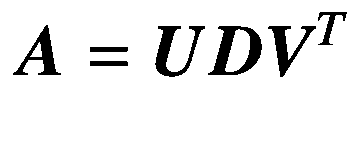

***U*** 是一个 *m* × *m* 正交矩阵。 ***D*** 是一个 *m* × *n* 对角矩阵。 ***V*** 是一个 *n* × *n* 正交矩阵。对角线上的条目*σ*<sub>*I*</sub>=***D***<sub>T35】ii</sub>称为 ***A*** 的*奇异值。非零奇异值的个数等于 ***A*** 的秩。**的列和**的列分别称为**的左奇异向量和右奇异向量。我们通常选择分解，使得奇异值**<sub>*ii*</sub>以降序排列。在这种情况下， ***D*** (但不总是 ***U*** 和 ***V*** )由 ***A*** 唯一确定。奇异值分解的数学应用包括计算伪逆、矩阵近似，以及确定矩阵的秩、值域和零空间。奇异值分解在科学、工程和统计学的所有领域都非常有用，例如信号处理、数据的最小二乘拟合和过程控制。*********

 ****从几何上讲，SVD 说任何线性变换都可以分解为三步，即先旋转(***V***<sup>*T*</sup>)、拉伸/缩放( ***D*** )(不一定在各个方向上等量旋转；您可以拉伸 x 轴两倍于 y 轴)，并再次旋转( ***U*** )。

例如，要将一个正方形转换成平行四边形，您可以顺时针旋转 *θ* (这个值并不太重要，只要您选择一个合理的数字，因为旋转矩阵不是唯一的)，用不同的因子缩放轴，然后再逆时针旋转 *θ* 。降维方面，我们先通过旋转来“选对轴”。然后我们通过忽略(或用 0 代替)最小的奇异值来投射较小的维度。见图 [2-22](#Fig22) 。

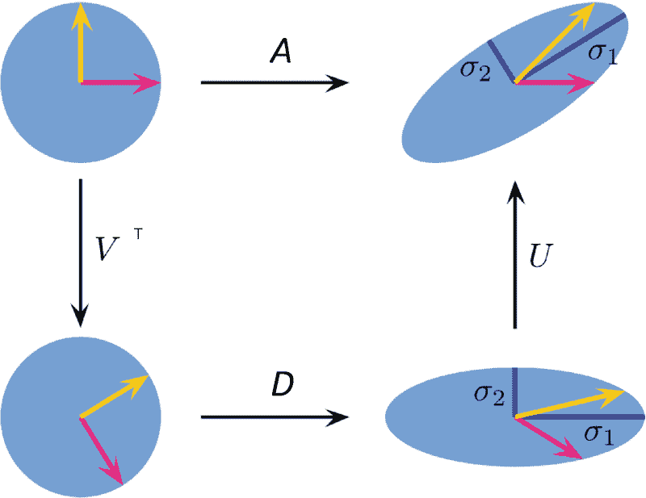

图 2-22

奇异值分解几何解释

有几种实现 SVD 的方法，例如通过用于高矩阵的 Golub-Kahan 算法、用于对称矩阵的 QR 算法以及用于双对角矩阵的多个相对鲁棒的表示(MRRR)。所有这些算法和转换的实现都非常复杂。NM Dev 接口`SVDDecomposition`代表不同的实现。签名如下:

```py
public interface SVDDecomposition {

    /**
     * Get the normalized, hence positive, singular values. They may differ from
     * the values in <i>D</i> if this computation turns off normalization.
     *
     * @return the singular values
     */
    public double[] getSingularValues();

    /**
     * Get the <i>D</i> matrix as in SVD decomposition.
     *
     * @return <i>D</i>
     */
    public DiagonalMatrix D();

    /**
     * Get the <i>U</i> matrix as in SVD decomposition.
     *
     * @return <i>U</i>
     */
    public Matrix U();

    /**
     * Get the transpose of <i>U</i>, i.e., {@code U().t()}.
     *
     * @return {@code U().t()}
     */
    public Matrix Ut();

    /**
     * Get the <i>V</i> matrix as in SVD decomposition.
     *
     * @return <i>V</i>
     */
    public Matrix V();
}

```

类`SVD`包装了所有这些算法，并根据输入矩阵应用合适的算法。它和`SVDDecomposition`有相同的签名，因为`SVD`继承了它。下面的 NM Dev 代码计算这个例子:

![$$ \left[\begin{array}{ccccc}1&amp; 0&amp; 0&amp; 0&amp; 2\\ {}0&amp; 0&amp; 3&amp; 0&amp; 0\\ {}0&amp; 0&amp; 0&amp; 0&amp; 0\\ {}0&amp; 2&amp; 0&amp; 0&amp; 0\end{array}\right]=\left[\begin{array}{cccc}0&amp; -1&amp; 0&amp; 0\\ {}-1&amp; 0&amp; 0&amp; 0\\ {}0&amp; 0&amp; 0&amp; -1\\ {}0&amp; 0&amp; -1&amp; 0\end{array}\right]\left[\begin{array}{ccccc}3&amp; 0&amp; 0&amp; 0&amp; 0\\ {}0&amp; \sqrt{5}&amp; 0&amp; 0&amp; 0\\ {}0&amp; 0&amp; 2&amp; 0&amp; 0\\ {}0&amp; 0&amp; 0&amp; 0&amp; 0\end{array}\right]\left[\begin{array}{ccccc}0&amp; 0&amp; 1&amp; 0&amp; 0\\ {}\sqrt{0.2}&amp; 0&amp; 0&amp; 0&amp; \sqrt{0.8}\\ {}0&amp; 1&amp; 0&amp; 0&amp; 0\\ {}0&amp; 0&amp; 0&amp; 1&amp; 0\end{array}\right] $$](img/500382_1_En_2_Chapter_TeX_Equbr.png)

```py
Matrix A = new DenseMatrix(new double[][]{
    {1, 0, 0, 0, 2},
    {0, 0, 3, 0, 0,},
    {0, 0, 0, 0, 0,},
    {0, 2, 0, 0, 0,}
});

// perform SVD
SVD svd = new SVD(A, true, 1e-15);

Matrix U = svd.U();
System.out.println("U = \n" + U);
DiagonalMatrix D = svd.D();
System.out.println("D = \n" + D);
Matrix V = svd.V();
System.out.println("Vt = \n" + V.t());
Matrix Ut = svd.Ut();
System.out.println("Ut = \n" + Ut);

// verify that UDVt = A
Matrix UDVt = U.multiply(D).multiply(V.t());
System.out.println(String.format("%s = \n%s is %b",
        A,
        UDVt,
        MatrixPropertyUtils.areEqual(UDVt, A, 1e-14)));

// verify that UtAV = D
Matrix UtAV = Ut.multiply(A).multiply(V);
System.out.println(String.format("%s = \n%s is %b",
        A,
        UtAV,
        MatrixPropertyUtils.areEqual(UtAV, D, 1e-14)));

```

输出如下所示:

```py
U =
4x4
         [,1] [,2] [,3] [,4]
[1,] 0.000000, 1.000000, 0.000000, 0.000000,
[2,] 1.000000, 0.000000, 0.000000, 0.000000,
[3,] 0.000000, 0.000000, 0.000000, 1.000000,
[4,] 0.000000, 0.000000, 1.000000, 0.000000,
D =
4x4
         [,1] [,2] [,3] [,4]
[1,] 3.000000, 0.000000, 0.000000, 0.000000,
[2,] 0.000000, 2.236068, 0.000000, 0.000000,
[3,] 0.000000, 0.000000, 2.000000, 0.000000,
[4,] 0.000000, 0.000000, 0.000000, 0.000000,
Vt =
4x5
         [,1] [,2] [,3] [,4] [,5]
[1,] 0.000000, 0.000000, 1.000000, 0.000000, 0.000000,
[2,] 0.447214, 0.000000, 0.000000, 0.000000, 0.894427,
[3,] 0.000000, 1.000000, 0.000000, 0.000000, 0.000000,
[4,] 0.000000, 0.000000, 0.000000, 1.000000, 0.000000,
Ut =
4x4
         [,1] [,2] [,3] [,4]
[1,] 0.000000, 1.000000, 0.000000, 0.000000,
[2,] 1.000000, 0.000000, 0.000000, 0.000000,
[3,] 0.000000, 0.000000, 0.000000, 1.000000,
[4,] 0.000000, 0.000000, 1.000000, 0.000000,
4x5
         [,1] [,2] [,3] [,4] [,5]
[1,] 1.000000, 0.000000, 0.000000, 0.000000, 2.000000,
[2,] 0.000000, 0.000000, 3.000000, 0.000000, 0.000000,
[3,] 0.000000, 0.000000, 0.000000, 0.000000, 0.000000,
[4,] 0.000000, 2.000000, 0.000000, 0.000000, 0.000000,  =
4x5
         [,1] [,2] [,3] [,4] [,5]
[1,] 1.000000, 0.000000, 0.000000, 0.000000, 2.000000,
[2,] 0.000000, 0.000000, 3.000000, 0.000000, 0.000000,
[3,] 0.000000, 0.000000, 0.000000, 0.000000, 0.000000,
[4,] 0.000000, 2.000000, 0.000000, 0.000000, 0.000000,  is true
4x5
         [,1] [,2] [,3] [,4] [,5]
[1,] 1.000000, 0.000000, 0.000000, 0.000000, 2.000000,
[2,] 0.000000, 0.000000, 3.000000, 0.000000, 0.000000,
[3,] 0.000000, 0.000000, 0.000000, 0.000000, 0.000000,
[4,] 0.000000, 2.000000, 0.000000, 0.000000, 0.000000,  =
4x4
         [,1] [,2] [,3] [,4]
[1,] 3.000000, 0.000000, 0.000000, 0.000000,
[2,] 0.000000, 2.236068, 0.000000, 0.000000,
[3,] 0.000000, 0.000000, 2.000000, 0.000000,
[4,] 0.000000, 0.000000, 0.000000, 0.000000,  is true

```

## 2.4 线性方程组

线性方程组(或线性系统)是一个或多个包含同一组变量的线性方程组的集合。下面举个例子:


这是一个由三个变量的三个方程组成的系统， *x* ， *y* ，和 *z* 。线性系统的解是给变量赋值，使得所有方程同时满足。对先前系统的解决方案由下面给出:

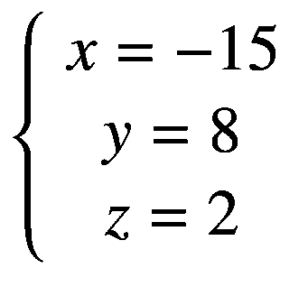

因为它使三个方程都有效。单词 *system* 表示这些方程将被集体考虑，而不是单独考虑。

线性系统理论是线性代数的基础和基本部分，线性代数是现代数学的大部分内容。一个非线性方程组通常可以用一个线性系统来近似，当建立一个相对复杂系统的数学模型或计算机模拟时，这是一个有用的技术。寻找解的计算算法是数值线性代数的重要组成部分，它们在工程、物理、化学、计算机科学和经济学中起着重要的作用。

含有 *n* 个未知数的 *m* 线性方程组一般可以写成:

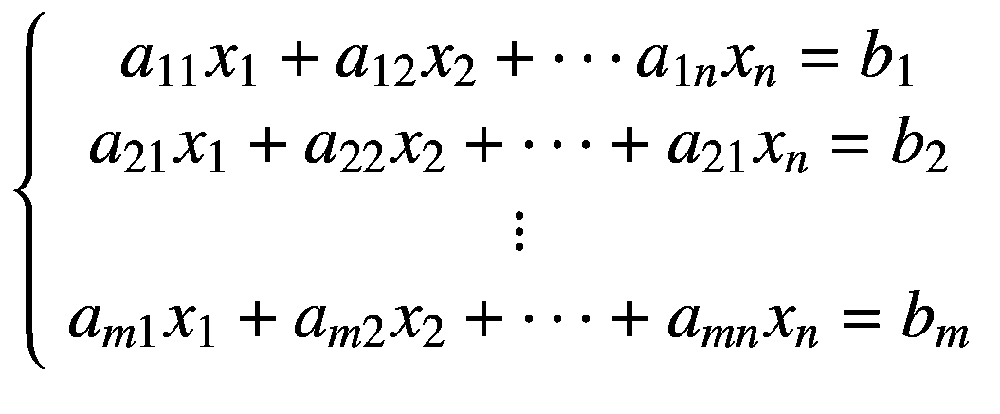

*x* <sub>1</sub> ， *x* <sub>2</sub> ，…， *x* <sub>*n*</sub> 为 *n* 未知数； *a* <sub>11</sub> ， *a* <sub>12</sub> ，…，*a*<sub>*Mn*</sub>是系统的 *m* × *n* 系数； *b* <sub>1</sub> ， *b* <sub>2</sub> ， *b* <sub>*m*</sub> 是 *m* 的常数项。

将每个未知数写成线性组合中的列向量的权重是有帮助的。这使得我们可以从向量空间或线性空间的角度来考虑问题。例如，左侧向量所有可能的线性组合的集合称为它们的*跨度*，当右侧向量在该跨度内或存在于所跨越的向量空间中时，方程就有解。如果该区间内的每个向量都有一个表达式是给定左向量的线性组合，那么任何解都是唯一的。

等价地，我们可以把向量方程写成矩阵形式。

T2】

在哪里

![$$ \boldsymbol{A}=\left[\begin{array}{cccc}{a}_{11}&amp; {a}_{12}&amp; \dots &amp; {a}_{1n}\\ {}{a}_{21}&amp; {a}_{22}&amp; \dots &amp; {a}_{2n}\\ {}\vdots &amp; \vdots &amp; \ddots &amp; \vdots \\ {}{a}_{m1}&amp; {a}_{m2}&amp; \dots &amp; {a}_{mn}\end{array}\right] $$](img/500382_1_En_2_Chapter_TeX_IEq11.png)、![$$ \boldsymbol{x}=\left[\begin{array}{c}{x}_1\\ {}{x}_2\\ {}\vdots \\ {}{x}_n\end{array}\right] $$](img/500382_1_En_2_Chapter_TeX_IEq12.png)、![$$ \boldsymbol{b}=\left[\begin{array}{c}{b}_1\\ {}{b}_2\\ {}\vdots \\ {}{b}_m\end{array}\right] $$](img/500382_1_En_2_Chapter_TeX_IEq13.png)

跨度的基中的向量的数量现在被表示为矩阵的秩，其小于 *m* 和 *n* 。

线性系统的解是给变量 *x* <sub>1</sub> ， *x* <sub>2</sub> ，…， *x* <sub>*n*</sub> 赋值，使得每个方程都满足。所有可能解决方案的集合被称为*解决方案集合*。线性系统可能表现为三种可能方式中的任何一种。

*   这个系统有无穷多个解。

*   该系统有一个唯一的解决方案。

*   系统无解。

几何上，对于包含两个变量( *x* 和 *y* )的系统，每个线性方程确定了 *xy* 平面上的一条线。因为一个线性系统的解必须满足所有的方程，解集是这些线的交点，因此要么是一条线，单点，或空集。见图 [2-23](#Fig23) 。

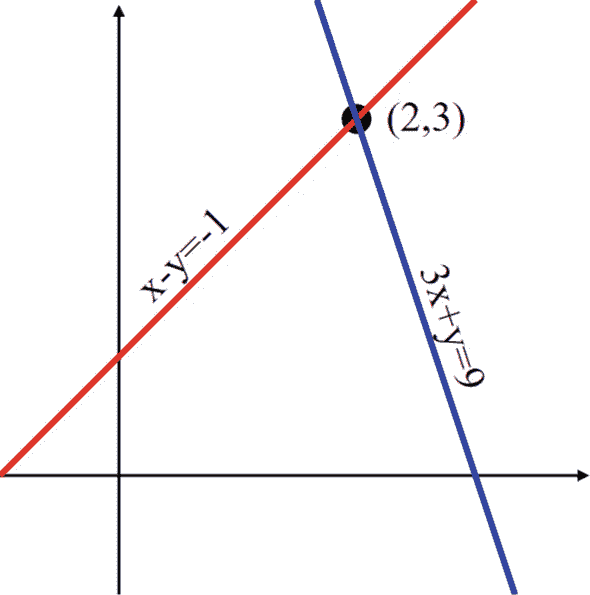

图 2-23

两个线性方程组的解

对于三个变量，每个线性方程确定三维空间中的一个平面，解集就是这些平面的交集。因此，解集可以是平面、直线、单点或空集。例如，由于三个平行平面没有公共点，它们的方程的解集是空的。如果三个平面相交于一点，则解集是一个单点。若三个平面过两点，其方程至少有两个公共解；实际上，解集是无限的，由通过这些点的直线上的所有点组成。对于 *n* 个变量，每个线性方程确定一个 *n* 维空间中的超平面。解集是这些超平面的交集，是比 *n* 低任意维的平面(或者欧几里得子空间)。

一般来说，线性系统的行为由方程数量 *m* 和未知数数量 *n* 之间的关系决定。具体来说，

1.  如果 *m* = *n* ，系统有唯一的解。

2.  如果 *m* > *n* ，系统无解。这种系统也被称为*超定*系统。

3.  如果 *m* < *n* ，系统有无穷多个解，但也可能无解。这样的系统被称为*欠定*系统。解集的维数等于*n**m*。

图 [2-24](#Fig24) 说明了两个变量情况下的三分法。第一个系统有无穷多个解，即蓝线上的所有点。第二个系统有一个唯一的解，即两条线的交点。第三个系统无解，因为三条线没有共同点。见图 [2-24](#Fig24) 。

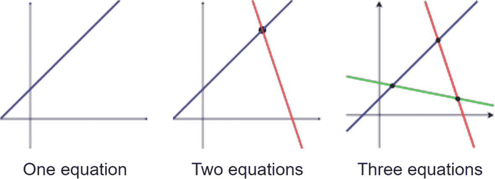

图 2-24

两个线性方程组的可能解

需要注意的是，图 [2-24](#Fig24) 中的图片仅显示了最常见的情况(一般情况)。如果线性方程组是线性相关的(平行线/平面)或者是不一致的(无解)，则线性方程组的表现不同于一般情况。例如，两个方程和两个未知数的系统可能无解(如果两条线平行)，或者三个方程和两个未知数的系统可解(如果三条线相交于一点)。见图 [2-25](#Fig25) 。

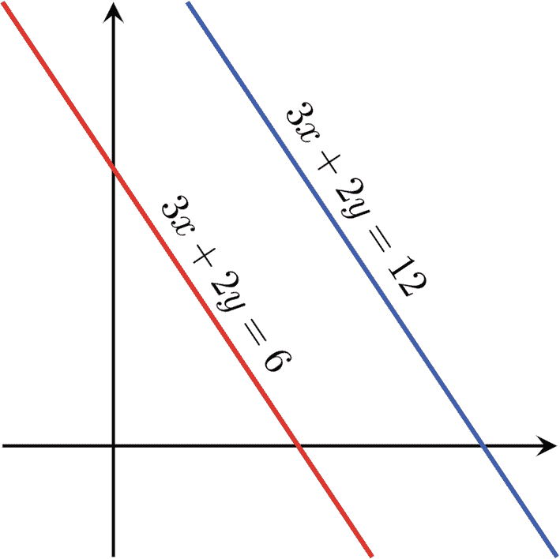

图 2-25

两条平行线系统是不一致的，因此无解

NM Dev 有一套工具来解决各种类型的线性方程组。我们可以求解平方系统、欠定系统和超定系统。每种类型的系统都有多种算法(以及一种算法的多种实现)要解决。

### 2.4.1 排梯队形式和减排梯队形式

让我们考虑一个求解前面方程组的激励性例子。

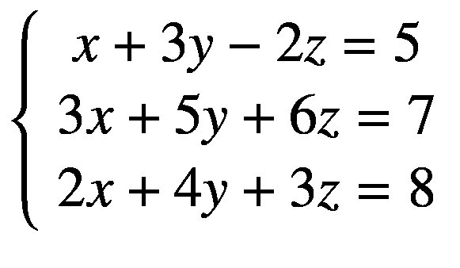T2】

我们可以根据其他两个变量写出 *x* ，并将其代入第二个和第三个方程。也就是

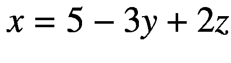

然后，

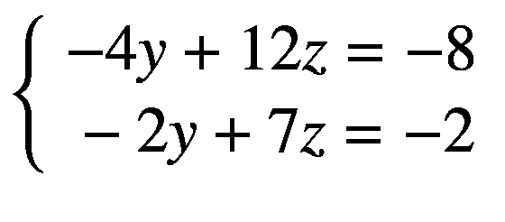

我们重复这个过程，求解 *y* 。然后代入第二个方程。也就是

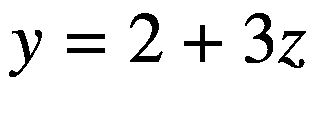

然后，

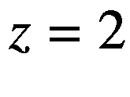

知道了 *z* ，我们就可以回代到 *y* 方程中，得到 *y* 。知道了 *y* ，我们就可以回代到 *x* 方程中，得到 *x* 。然后，我们得到一个解。


我们可以推广这种方法，用一种算法来求解一般的方程组。首先，我们需要几个概念。

如果以下两个条件都成立，则矩阵为行梯队形式:

*   所有只包含零的行都在底部。

*   非零行的前导系数(也称为*枢轴*)总是严格位于其上一行的前导系数的右侧。

这两个条件意味着在前导系数下面的列中的所有条目都是零。下面是一个行梯队形式的 3 × 5 矩阵的例子(但不是简化的行梯队形式):

![$$ \left[\begin{array}{ccccc}1&amp; {a}_0&amp; {a}_1&amp; {a}_2&amp; {a}_3\\ {}0&amp; 0&amp; 2&amp; {a}_4&amp; {a}_5\\ {}0&amp; 0&amp; 0&amp; 1&amp; {a}_6\end{array}\right] $$](img/500382_1_En_2_Chapter_TeX_Equcc.png)

如果矩阵满足以下条件，则该矩阵为缩减行梯队形式(也称为*行标准形式*):

*   呈排梯队形式。

*   每个非零行中的前导条目是 1(称为前导 1)。

*   包含前导 1 的每一列在其所有其他条目中都有零。

这是一个缩减行梯队形式的矩阵示例:

![$$ \left[\begin{array}{cccc}1&amp; 0&amp; {a}_1&amp; {b}_1\\ {}0&amp; 1&amp; {a}_2&amp; {b}_2\\ {}0&amp; 0&amp; 1&amp; {b}_3\end{array}\right] $$](img/500382_1_En_2_Chapter_TeX_Equcd.png)

一旦我们能把方程组做成简化的行梯队形式，就很容易计算或读出解。前面的矩阵简单说就是方程如下:


我们可以从第三个方程中读出*x*T2 3 的解。一旦我们知道了*x*T6】3，我们就可以简单地将它回代到另外两个等式中，得到*x*T10】1 和*x*T14】2。

### 2.4.2 回代

反向代换通过对上三角矩阵**的迭代过程来求解形式为***Ux***=***b***的矩阵方程。这个过程之所以这么叫，是因为对于一个上三角矩阵，首先计算 *x* <sub>*n*</sub> ，然后将其反向代入下一个方程求解*x*<sub>*n*-1</sub>，最后重复直到 *x* <sub>1</sub> 。注意， ***U*** 中的某些对角线项可以是 0，前提是方程组一致。下面举个例子:**

**![$$ \left[\begin{array}{ccc}1&amp; 2&amp; 3\\ {}0&amp; 0&amp; 5\\ {}0&amp; 0&amp; 0\end{array}\right]\times \left[\begin{array}{c}10\\ {}0\\ {}0\end{array}\right]=\left[\begin{array}{c}10\\ {}0\\ {}0\end{array}\right] $$](img/500382_1_En_2_Chapter_TeX_Equcf.png)**

 **NM Dev 类`BackwardSubstitution`实现了向后替换算法。下面的代码解决了这个示例:

```py
UpperTriangularMatrix U = new UpperTriangularMatrix(new double[][]{
    {1, 2, 3},
    {0, 5},
    {0}
});
Vector b = new DenseVector(new double[]{10, 0, 0});

BackwardSubstitution solver = new BackwardSubstitution();
Vector x = solver.solve(U, b);
System.out.println("x = " + x);

// verify that Ux = b
Vector Ux = U.multiply(x);
System.out.println(String.format("%s = \n%s is %b",
        Ux,
        b,
        MatrixPropertyUtils.areEqual(Ux, b, 1e-14))); // MatrixPropertyUtils.areEqual works for vectors too

```

输出如下所示:

```py
x = [10.000000, 0.000000, 0.000000]
[10.000000, 0.000000, 0.000000]  =
[10.000000, 0.000000, 0.000000]  is true

```

### 向前替换

同样，我们可以进行前向替换，通过下三角矩阵 ***L*** 的迭代过程来求解形式为***Lx***=***b***的矩阵方程。这个过程之所以这么叫是因为对于一个下三角矩阵，首先计算*x*T14】1，然后将其向前代入下一个方程求解*x*T18】2，最后重复直到*x*T22】T23】nT25】。注意， ***L*** 中的某些对角线项可以是 0，前提是方程组一致。下面举个例子:

![$$ \left[\begin{array}{ccc}0&amp; 0&amp; 0\\ {}2&amp; 0&amp; 0\\ {}4&amp; 5&amp; 6\end{array}\right]\times \left[\begin{array}{c}0\\ {}0\\ {}30\end{array}\right]=\left[\begin{array}{c}0\\ {}0\\ {}30\end{array}\right] $$](img/500382_1_En_2_Chapter_TeX_Equcg.png)

NM Dev 类`ForwardSubstitution`实现了一个正向替换算法。下面的代码解决了这个示例:

```py
LowerTriangularMatrix L = new LowerTriangularMatrix(new double[][]{
    {1},
    {2, 3},
    {4, 5, 6}
});
Vector b = new DenseVector(new double[]{10, 20, 30});

ForwardSubstitution solver = new ForwardSubstitution();
Vector x = solver.solve(L, b);
System.out.println("x = " + x);

// verify that Ux = b
Vector Lx = L.multiply(x);
System.out.println(String.format("%s = \n%s is %b",
        Lx,
        b,
        MatrixPropertyUtils.areEqual(Lx, b, 1e-14))); // MatrixPropertyUtils.areEqual works for vectors too

```

输出如下所示:

```py
x = [10.000000, 0.000000, -1.666667]
[10.000000, 20.000000, 30.000000]  =
[10.000000, 20.000000, 30.000000]  is true

```

一般来说，NM Dev 类`LUSolver`可以处理上下三角矩阵。以下代码重现了前两个问题:

```py
// an LSProblem
LowerTriangularMatrix L = new LowerTriangularMatrix(new double[][]{
    {1},
    {2, 3},
    {4, 5, 6}
});
Vector b1 = new DenseVector(new double[]{10, 20, 30});

LUSolver solver1 = new LUSolver();
Vector x1 = solver1.solve(
        // construct a Linear System Problem: Lx = b1
        new LSProblem(L, b1)
);

System.out.println("x1 = " + x1);

// verify that Ux = b
Vector Lx = L.multiply(x1);
System.out.println(String.format("%s = \n%s is %b",
        Lx,
        b1,
        MatrixPropertyUtils.areEqual(Lx, b1, 1e-14))); // MatrixPropertyUtils.areEqual works for vectors too

// an other LSProblem

UpperTriangularMatrix U = new UpperTriangularMatrix(new double[][]{
    {1, 2, 3},
    {0, 5},
    {0}
});
Vector b2 = new DenseVector(new double[]{10, 0, 0});

LUSolver solver2 = new LUSolver();
Vector x2 = solver2.solve(
        // construct a Linear System Problem: Ux = b2
        new LSProblem(U, b2)
);
System.out.println("x2 = " + x2);

// verify that Ux = b
Vector Ux = U.multiply(x2);
System.out.println(String.format("%s = \n%s is %b",
        Ux,
        b2,
        MatrixPropertyUtils.areEqual(Ux, b2, 1e-14))); // MatrixPropertyUtils.areEqual works for vectors too

```

输出如下所示:

```py
x1 = [10.000000, 0.000000, -1.666667]
[10.000000, 20.000000, 30.000000]  =
[10.000000, 20.000000, 30.000000]  is true
x2 = [10.000000, 0.000000, -0.000000]
[10.000000, 0.000000, 0.000000]  =
[10.000000, 0.000000, 0.000000]  is true

```

### 基本操作

我们可以通过一系列初等运算将任何矩阵转化为(降阶)行梯队形式。有三种基本运算。

*   行切换:将第 *i* 行与第 *j* 行进行切换。

*   行乘法或缩放:将第 *i* 行乘以一个非零常数。

*   行相加:用第 *i* 行和第 *j* 行的倍数之和替换第 *i* 行。

#### 2.4.4.1 行开关变换

我们可以通过对单位矩阵执行运算来创建对应于变换的初等矩阵。初等矩阵是一种矩阵，它与单位矩阵的区别在于一个初等行运算。

比如交换一个 3 × 3 矩阵的第二行和第三行，对应的初等矩阵就是交换 3 × 3 单位矩阵的第二行和第三行。也就是

![$$ \boldsymbol{P}=\left[\begin{array}{ccc}1&amp; 0&amp; 0\\ {}0&amp; 0&amp; 1\\ {}0&amp; 1&amp; 0\end{array}\right] $$](img/500382_1_En_2_Chapter_TeX_Equch.png)

如果我们将任意一个 3 × 3 的矩阵左(右)乘上 ***P*** ，它的第二行和第三行(列)就会被交换。下面举个例子:

![$$ \left[\begin{array}{ccc}1&amp; 0&amp; 0\\ {}0&amp; 0&amp; 1\\ {}0&amp; 1&amp; 0\end{array}\right]\times \left[\begin{array}{ccc}{a}_{11}&amp; {a}_{12}&amp; {a}_{13}\\ {}{a}_{21}&amp; {a}_{22}&amp; {a}_{23}\\ {}{a}_{31}&amp; {a}_{32}&amp; {a}_{33}\end{array}\right]=\left[\begin{array}{ccc}{a}_{11}&amp; {a}_{12}&amp; {a}_{13}\\ {}{a}_{31}&amp; {a}_{32}&amp; {a}_{33}\\ {}{a}_{21}&amp; {a}_{22}&amp; {a}_{23}\end{array}\right] $$](img/500382_1_En_2_Chapter_TeX_Equci.png)

#### 2.4.4.2 行乘变换

类似地，为了用非零常数 *m* 缩放第 *i* 行，对应的初等矩阵是对角矩阵，除了在第 *i* 位置，对角元素 1 在任何地方都是 1，在那里它是 *m* 。例如，将 3 × 3 矩阵的第二行缩放 2，对应的初等矩阵是将 3 × 3 单位矩阵的第二行缩放 2。也就是

![$$ \boldsymbol{D}=\left[\begin{array}{ccc}1&amp; 0&amp; 0\\ {}0&amp; 2&amp; 0\\ {}0&amp; 0&amp; 1\end{array}\right] $$](img/500382_1_En_2_Chapter_TeX_Equcj.png)

下面举个例子:

![$$ \left[\begin{array}{ccc}1&amp; 0&amp; 0\\ {}0&amp; 2&amp; 0\\ {}0&amp; 0&amp; 1\end{array}\right]\times \left[\begin{array}{ccc}{a}_{11}&amp; {a}_{12}&amp; {a}_{13}\\ {}{a}_{21}&amp; {a}_{22}&amp; {a}_{23}\\ {}{a}_{31}&amp; {a}_{32}&amp; {a}_{33}\end{array}\right]=\left[\begin{array}{ccc}{a}_{11}&amp; {a}_{12}&amp; {a}_{13}\\ {}2{a}_{21}&amp; 2{a}_{22}&amp; 2{a}_{23}\\ {}{a}_{31}&amp; {a}_{32}&amp; {a}_{33}\end{array}\right] $$](img/500382_1_En_2_Chapter_TeX_Equck.png)

#### 2.4.4.3 行加法变换

要将第*行 j* 乘以一个标量 *m* 加到第 *i* 行，对应的初等矩阵是单位矩阵但带有*a*<sub>*ij*</sub>=*m*。例如，将一个 3 × 3 矩阵的第二行加 2 到第一行，对应的初等矩阵如下:

![$$ \boldsymbol{L}=\left[\begin{array}{ccc}1&amp; 2&amp; 0\\ {}0&amp; 1&amp; 0\\ {}0&amp; 0&amp; 1\end{array}\right] $$](img/500382_1_En_2_Chapter_TeX_Equcl.png)

下面举个例子:

![$$ \left[\begin{array}{ccc}1&amp; 2&amp; 0\\ {}0&amp; 1&amp; 0\\ {}0&amp; 0&amp; 1\end{array}\right]\times \left[\begin{array}{ccc}{a}_{11}&amp; {a}_{12}&amp; {a}_{13}\\ {}{a}_{21}&amp; {a}_{22}&amp; {a}_{23}\\ {}{a}_{31}&amp; {a}_{32}&amp; {a}_{33}\end{array}\right]=\left[\begin{array}{ccc}{a}_{11}+2{a}_{21}&amp; {a}_{12}+2{a}_{22}&amp; {a}_{13}+2{a}_{23}\\ {}{a}_{21}&amp; {a}_{22}&amp; {a}_{23}\\ {}{a}_{31}&amp; {a}_{32}&amp; {a}_{33}\end{array}\right] $$](img/500382_1_En_2_Chapter_TeX_Equcm.png)

### 2.4.5 高斯消去法和高斯-乔丹消去法

高斯-乔丹消去法是一种求解线性方程组的算法。它还可以用来计算矩阵的秩、方阵的行列式以及可逆矩阵的逆矩阵。为了在矩阵上执行行缩减，我们使用一系列基本的行操作来修改矩阵，直到矩阵的左下角尽可能地被零填充。

使用这些操作，一个矩阵总是可以转换成一个上三角矩阵，事实上是一个行梯队的形式。一旦所有的前导系数(每一行中最左边的非零条目)都是 1，并且包含前导系数的每一列在其他地方都是 0，则称该矩阵为简化的行梯队形式。这种最终形式是独特的；换句话说，它独立于所使用的行操作序列。

术语*高斯消去*指的是过程的第一步，直到它达到一个上三角或(未缩减的)行梯队形式。在这种形式下，我们可以判断一个线性方程组是无解、唯一解还是无穷多解。高斯-乔丹消去法，第二步，继续使用行操作，直到找到解。换句话说，它将矩阵置于缩减的行梯队形式。

等价地，我们可以看到行缩减产生了原始矩阵的矩阵分解。初等行运算可以被看作是原始矩阵的左边乘以初等矩阵。或者，减少单行的一系列基本运算可被视为与 Frobenius 矩阵相乘。然后，算法的第一部分计算 LU 分解，而第二部分将原始矩阵写成唯一确定的可逆矩阵和唯一确定的缩减行梯队矩阵的乘积。

NM Dev 类`GaussianElimination`执行基本的行操作，将矩阵简化为行梯队形式。这相当于将原始矩阵与左边的可逆矩阵相乘。对于一个方阵，这个算法本质上是计算一个 LU 分解。我们有这个:


其中 ***T*** 是变换矩阵，它是一系列初等矩阵/运算的乘积。 ***U*** 呈排梯队形式。

或者，我们有这样的:


其中 ***P*** 为排列矩阵， ***L*** 为下三角，**为行梯队形式。**

 **签名如下:

```py
/**
 * Run the Gaussian elimination algorithm.
 *
 * @param A           a matrix
 * @param usePivoting {@code true} if to use partial pivoting, e.g., for
 *                    numerical stability. In general, no pivoting means no row interchanges.
 *                    It can be done only if Gaussian elimination never runs into zeros on the
 *                    diagonal. Since division by zero is a fatal error we usually avoid no
 *                    pivoting.
 * @param epsilon     a precision parameter: when a number |x| &le;
 *                    &epsilon;, it is considered 0
 */
public GaussianElimination(Matrix A, boolean usePivoting, double epsilon)

/**
 * Run the Gaussian elimination algorithm with partial pivoting.
 *
 * @param A a matrix
 */
public GaussianElimination(Matrix A)

/**
 * Get the transformation matrix, <i>T</i>, such that <i>T * A = U</i>.
 *
 * @return <i>T</i>
 */
public Matrix T()

/**
 * Get the upper triangular matrix, <i>U</i>, such that
 * <i>T * A = U</i> and <i>P * A = L * U</i>.
 *
 * @return <i>U</i>
 */
public Matrix U()

/**
 * Get the lower triangular matrix <i>L</i>, such that <i>P * A = L * U</i>.
 *
 * @return <i>L</i>
 */
public Matrix L()

/**
 * Get the permutation matrix, <i>P</i>, such that <i>P * A = L * U</i>.
 *
 * @return <i>P</i>
 */
public PermutationMatrix P()

```

例如，这个 NM Dev 代码计算这个例子:

![$$ \left[\begin{array}{ccc}0&amp; 0&amp; 1\\ {}0&amp; 1&amp; -0.5\\ {}1&amp; -0.6&amp; -0.2\end{array}\right]\times \left[\begin{array}{ccc}2&amp; 1&amp; 1\\ {}2&amp; 2&amp; -1\\ {}4&amp; -1&amp; 6\end{array}\right]=\left[\begin{array}{ccc}4&amp; -1&amp; 6\\ {}0&amp; 2.5&amp; -4\\ {}0&amp; 0&amp; 0.4\end{array}\right] $$](img/500382_1_En_2_Chapter_TeX_Equcp.png)

![$$ \left[\begin{array}{ccc}0&amp; 0&amp; 1\\ {}0&amp; 1&amp; 0\\ {}1&amp; 0&amp; 0\end{array}\right]\times \left[\begin{array}{ccc}2&amp; 1&amp; 1\\ {}2&amp; 2&amp; -1\\ {}4&amp; -1&amp; 6\end{array}\right]=\left[\begin{array}{ccc}1&amp; 0&amp; 0\\ {}0.5&amp; 1&amp; 0\\ {}0.5&amp; 0.6&amp; 1\end{array}\right]\left[\begin{array}{ccc}4&amp; -1&amp; 6\\ {}0&amp; 2.5&amp; -4\\ {}0&amp; 0&amp; 0.4\end{array}\right] $$](img/500382_1_En_2_Chapter_TeX_Equcq.png)

```py
Matrix A = new DenseMatrix(new double[][]{
    {2, 1, 1},
    {2, 2, -1},
    {4, -1, 6}
});
GaussianElimination ops = new GaussianElimination(A, true, 0);

Matrix T = ops.T();
System.out.println("T = \n" + T);
PermutationMatrix P = ops.P();
System.out.println("P = \n" + P);

Matrix U = ops.U();
System.out.println(
        String.format("U = %s is upper triangular, %b",
                U,
                MatrixPropertyUtils.isUpperTriangular(U, 0)));

Matrix L = ops.L();
System.out.println(
        String.format("L = %s is lower triangular, %b",
                L,
                MatrixPropertyUtils.isLowerTriangular(L, 0)));

// verify that TA = U
Matrix TA = T.multiply(A);
System.out.println(String.format("%s = \n%s is %b",
        TA,
        U,
        MatrixPropertyUtils.areEqual(TA, U, 1e-15)));

// verify that PA = LU
Matrix PA = P.multiply(A);
Matrix LU = L.multiply(U);
System.out.println(String.format("%s = \n%s is %b",
        PA,
        LU,
        MatrixPropertyUtils.areEqual(PA, LU, 0)));

```

输出如下所示:

```py
T =
3x3
         [,1] [,2] [,3]
[1,] 0.000000, 0.000000, 1.000000,
[2,] 0.000000, 1.000000, -0.500000,
[3,] 1.000000, -0.600000, -0.200000,
P =
3x3
         [,1] [,2] [,3]
[1,] 0.000000, 0.000000, 1.000000,
[2,] 0.000000, 1.000000, 0.000000,
[3,] 1.000000, 0.000000, 0.000000,
U = 3x3
         [,1] [,2] [,3]
[1,] 4.000000, -1.000000, 6.000000,
[2,] 0.000000, 2.500000, -4.000000,
[3,] 0.000000, 0.000000, 0.400000,  is upper triangular, true
L = 3x3
         [,1] [,2] [,3]
[1,] 1.000000, 0.000000, 0.000000,
[2,] 0.500000, 1.000000, 0.000000,
[3,] 0.500000, 0.600000, 1.000000,  is lower triangular, true
3x3
         [,1] [,2] [,3]
[1,] 4.000000, -1.000000, 6.000000,
[2,] 0.000000, 2.500000, -4.000000,
[3,] 0.000000, 0.000000, 0.400000,  =
3x3
         [,1] [,2] [,3]
[1,] 4.000000, -1.000000, 6.000000,
[2,] 0.000000, 2.500000, -4.000000,
[3,] 0.000000, 0.000000, 0.400000,  is true
3x3
         [,1] [,2] [,3]
[1,] 4.000000, -1.000000, 6.000000,
[2,] 2.000000, 2.000000, -1.000000,
[3,] 2.000000, 1.000000, 1.000000,  =
3x3
         [,1] [,2] [,3]
[1,] 4.000000, -1.000000, 6.000000,
[2,] 2.000000, 2.000000, -1.000000,
[3,] 2.000000, 1.000000, 1.000000,  is true

```

NM Dev 类`GaussianElimination`执行基本的行操作，将矩阵简化为简化的行梯队形式。也就是


其中 ***T*** 是变换矩阵，它是一系列初等矩阵/运算的乘积。 ***U*** 呈排梯队形式。这种实现确保了前导 1 在数字上是 1，以便进行比较。假设有一个前导*u*<sub>*ij*</sub>= 1，那么`U.get(i, j) == 1`总是返回`true`。

例如，这个 NM Dev 代码计算这个例子:

![$$ \left[\begin{array}{ccc}-2.75&amp; 1.75&amp; 0.75\\ {}4&amp; -2&amp; -1\\ {}2.5&amp; -1.5&amp; -0.5\end{array}\right]\times \left[\begin{array}{ccc}2&amp; 1&amp; 1\\ {}2&amp; 2&amp; -1\\ {}4&amp; -1&amp; 6\end{array}\right]=\left[\begin{array}{ccc}1&amp; 0&amp; 0\\ {}0&amp; 1&amp; 0\\ {}0&amp; 0&amp; 1\end{array}\right] $$](img/500382_1_En_2_Chapter_TeX_Equcs.png)

```py
Matrix A = new DenseMatrix(new double[][]{
    {2, 1, 1},
    {2, 2, -1},
    {4, -1, 6}
});
GaussJordanElimination ops = new GaussJordanElimination(A, true, 0);

Matrix U = ops.U();
System.out.println(
        String.format("U = %s is in reduced row echelon form, %b",
                U,
                MatrixPropertyUtils.isReducedRowEchelonForm(U, 0)));

Matrix T = ops.T();
System.out.println("T = \n" + T);

// verify that TA = U
Matrix TA = T.multiply(A);
System.out.println(String.format("%s = \n%s is %b",
        TA,
        U,
        MatrixPropertyUtils.areEqual(TA, U, 1e-15)));

```

输出如下所示:

```py
U = 3x3
         [,1] [,2] [,3]
[1,] 1.000000, 0.000000, 0.000000,
[2,] 0.000000, 1.000000, 0.000000,
[3,] 0.000000, 0.000000, 1.000000,  is in reduced row echelon form, true
T =
3x3
         [,1] [,2] [,3]
[1,] -2.750000, 1.750000, 0.750000,
[2,] 4.000000, -2.000000, -1.000000,
[3,] 2.500000, -1.500000, -0.500000,
3x3
         [,1] [,2] [,3]
[1,] 1.000000, 0.000000, 0.000000,
[2,] 0.000000, 1.000000, 0.000000,
[3,] 0.000000, -0.000000, 1.000000,  =
3x3
         [,1] [,2] [,3]
[1,] 1.000000, 0.000000, 0.000000,
[2,] 0.000000, 1.000000, 0.000000,
[3,] 0.000000, 0.000000, 1.000000,  is true

```

### 2.4.6 同质和非同质系统

一般来说，一个相容的线性方程组的方程个数( *m* )小于或等于变量个数( *n* )，即 *m* ≤ *n* 。否则，这是一个通常不承认解决方案的过度确定的系统。了解线性方程组，如下图:


我们可以将**视为一个线性变换或一个从一个线性空间 ***V*** 映射到另一个线性空间 ***W*** 的函数。线性映射 ker(**)的核，或称为*零空间*，是域的线性子空间，使得函数将其所有元素映射到 0。****

****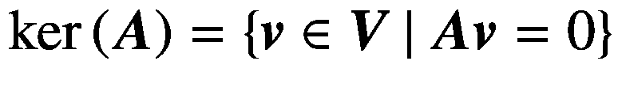****

 ****秩-零性定理表明核的维数和图像的维数等于域的维数。见图 [2-26](#Fig26)

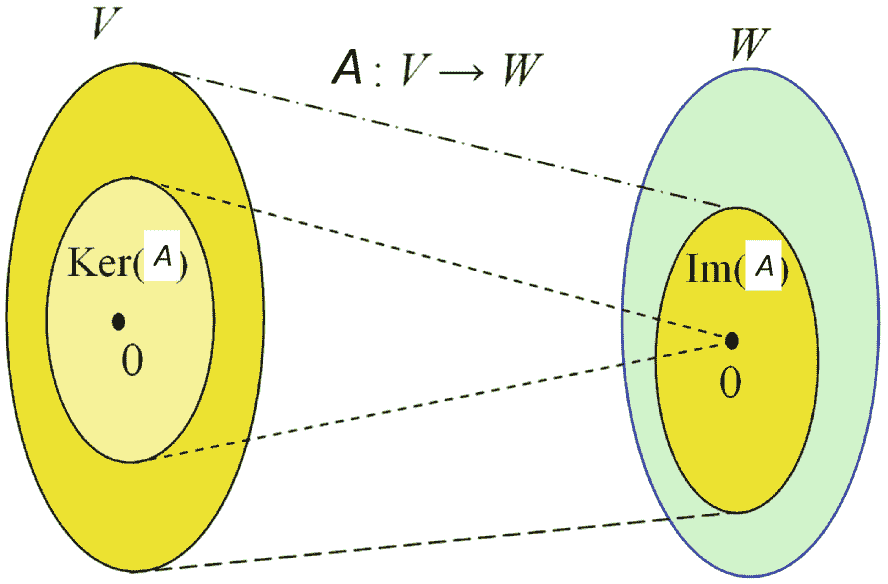

图 2-26

线性地图的核和像

对于任何齐次线性方程组，如下图:


至少有一个解，称为零(或平凡)解，它是通过给每个变量赋值为零而得到的。即***A*****0**=**0**。如果系统有一个非奇异矩阵(det( ***A*** ) ≠ 0)，那么它也是唯一解。如果系统有一个奇异矩阵( ***A*** 不是满秩)，那么 ***A*** 的维数或秩不为 0，ker( ***A*** ) >为 0。有一个解集有无穷多个解。核中的每个向量都是一个非平凡解。此解决方案集具有以下附加属性:

*   如果 ***u*** 和 ***v*** 是表示一个齐次系统的解的两个向量，那么向量和***u***+***v***也是该系统的解。

*   如果 ***u*** 是表示齐次系统的解的向量， *c* 是任意标量，那么 *c* ***u*** 也是该系统的解。

对于一个非齐次线性方程组，我们有这个:


假设 ***p*** 是线性系统的特解，即***Ap***=***b***；那么整个解集可以描述如下:

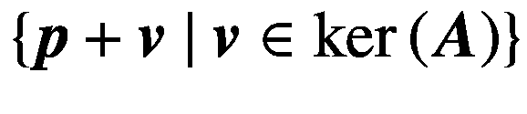

从几何上讲，这表示非齐次系统***Ax***=***b***的解集是 ***Ax*** = **0** 的解集的翻译。具体地说，第一个系统的平坦或欧几里得子空间可以通过用向量 ***p*** 平移齐次系统的线性子空间来获得。只有当系统至少有一个解时，这种推理才适用。当且仅当向量**位于线性变换**的图像中时，才会发生这种情况。****

 ****NM Dev 类`LinearSystemSolver`以**=***b***的形式求解线性方程组。我们假设，在行缩减之后， ***A*** 的行数不比列数多。也就是说，系统不能过于确定。**

 **注意，下面的系统不是过定的。其中一行是线性相关的。

![$$ \left[\begin{array}{ccc}1&amp; -1&amp; 0\\ {}0&amp; -2&amp; 0\\ {}0&amp; 0&amp; -1\\ {}0&amp; 0&amp; -2\end{array}\right]\boldsymbol{x}=\left[\begin{array}{c}-0.8\\ {}-1.6\\ {}0.8\\ {}1.6\end{array}\right] $$](img/500382_1_En_2_Chapter_TeX_Equcy.png)T2】

线性方程组分两步求解。

1.  首先求解 ***Ax*** = **0** ，齐次系统，求非平凡解。

2.  然后，求解***Ax***=***b***求特定解。

如果 **A** 具有满秩，则该实现通过 LU 分解来求解系统。否则，通过***p***=***Tb***找到特定解，其中 ***T*** 是 ***A*** 到降排梯队形式的变换矩阵。最终的解决方案如下:

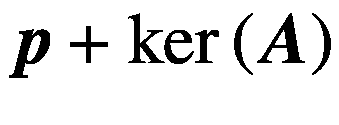

因此，这个解可以被看作是向量**对**的零空间的平移。****

 ****例如，对于下面的线性系统，

![$$ \left[\begin{array}{cccc}0&amp; 1&amp; 2&amp; -1\\ {}1&amp; 0&amp; 1&amp; 1\\ {}-1&amp; 1&amp; 0&amp; -1\\ {}0&amp; 2&amp; 3&amp; -1\end{array}\right]\boldsymbol{x}=\left[\begin{array}{c}1\\ {}4\\ {}2\\ {}7\end{array}\right] $$](img/500382_1_En_2_Chapter_TeX_Equda.png)

内核的基础是这样的

![$$ \left[\begin{array}{cccc}0&amp; 1&amp; 2&amp; -1\\ {}1&amp; 0&amp; 1&amp; 1\\ {}-1&amp; 1&amp; 0&amp; -1\\ {}0&amp; 2&amp; 3&amp; -1\end{array}\right]\left[\begin{array}{c}-2\\ {}-1\\ {}1\\ {}1\end{array}\right]=\left[\begin{array}{c}0\\ {}0\\ {}0\\ {}0\end{array}\right] $$](img/500382_1_En_2_Chapter_TeX_Equdb.png)

一个特定的解决方案是这样的

![$$ \left[\begin{array}{cccc}0&amp; 1&amp; 2&amp; -1\\ {}1&amp; 0&amp; 1&amp; 1\\ {}-1&amp; 1&amp; 0&amp; -1\\ {}0&amp; 2&amp; 3&amp; -1\end{array}\right]\left[\begin{array}{c}9\\ {}11\\ {}-5\\ {}0\end{array}\right]=\left[\begin{array}{c}1\\ {}4\\ {}2\\ {}7\end{array}\right] $$](img/500382_1_En_2_Chapter_TeX_Equdc.png)

以下 NM Dev 代码解决了这个示例:

```py
Matrix A = new DenseMatrix(new double[][]{
    {0, 1, 2, -1},
    {1, 0, 1, 1},
    {-1, 1, 0, -1},
    {0, 2, 3, -1}
});
Vector b = new DenseVector(new double[]{1, 4, 2, 7});

// construct a linear system solver
LinearSystemSolver solver = new LinearSystemSolver(1e-15); // precision
// solve the homogenous linear system
LinearSystemSolver.Solution soln = solver.solve(A);
// get a particular solution
Vector p = soln.getParticularSolution(b);
System.out.println("p = \n" + p);

// verify that Ap = b
Vector Ap = A.multiply(p);
System.out.println(String.format("%s = \n%s is %b",
        Ap,
        b,
        MatrixPropertyUtils.areEqual(Ap, b, 1e-15)));

// get the basis for the null-space
List<Vector> kernel = soln.getHomogeneousSoln();
System.out.println("kernel size = " + kernel.size());

// verify that A * kernel = 0
Vector k = kernel.get(0);
System.out.println("kernel basis = " + k);
Vector Ak = A.multiply(k);
System.out.println("Ak = 0, " + Ak);

```

输出如下所示:

```py
p =
[9.000000, 11.000000, -5.000000, 0.000000]
[1.000000, 4.000000, 2.000000, 7.000000]  =
[1.000000, 4.000000, 2.000000, 7.000000]  is true
kernel size = 1
kernel basis = [-2.000000, -1.000000, 1.000000, 1.000000]
Ak = 0, [0.000000, 0.000000, 0.000000, 0.000000]

```

`LinearSystemSolver`的签名如下:

```py
/**
 * Construct a solver for a linear system of equations.
 *
 * @param epsilon a precision parameter: when a number |x| &le; &epsilon;,
 *                it is considered 0
 */
public LinearSystemSolver(double epsilon)

/**
 * Get a solution for the linear system, <i>Ax = b</i>.
 *
 * @param A0 a matrix representing a linear system of equations (the
 *           homogeneous part)
 * @return a solution for the linear system
 */
public Solution solve(final Matrix A0)

```

注意，`solve`函数返回一个类`LinearSystemSolver:: Solution`的对象。该对象包含由输入矩阵定义的线性系统的齐次和非齐次解。签名如下:

```py
/**
 * This is the solution to a linear system of equations.
 */
public static interface Solution {

    /**
     * Get a particular solution for the linear system.
     *
     * @param b a vector
     * @return a particular solution
     */
    Vector getParticularSolution(Vector b);

    /**
     * Get the basis of the homogeneous solution for the linear system,
     * <i>Ax = b</i>.
     * That is, the solutions for <i>Ax = 0</i>.
     *
     * @return the homogeneous solution
     */
    List<Vector> getHomogeneousSoln();
}

```

### 2.4.7 超定线性系统

一个方程组如果方程比未知数多就是超定的，即*m*>*n**m*方程的个数和 *n* 未知数的个数。 *m* × *n* 矩阵 ***A*** 是一个高矩阵。


过定的系统通常是不一致的(无解)。唯一的例外是在某些情况下，一些方程在系统中出现多次，或者等价地，一些方程是其他方程的线性组合。一般来说，每个未知数都有一个自由度。引入系统的每个方程限制一个自由度。因此，当方程的数量和自由变量的数量相等时，临界情况发生。对于每个给定自由度的变量，都存在相应的约束。如果一致的话，这个平方方程组可以有一个唯一的解。当系统被过度约束时，即当方程数量超过未知数时，就会出现超定情况。

例如，图 [2-27](#Fig27) 显示了三个线性独立的方程，使得系统不一致，因此无解。


图 2-27

过于武断的制度

在图 [2-28](#Fig28) 中，一个方程与另一个方程线性相关(事实上是一样的)。该系统有两个变量和两个(线性无关的)约束，所以该系统是一致的，并且有一个解。

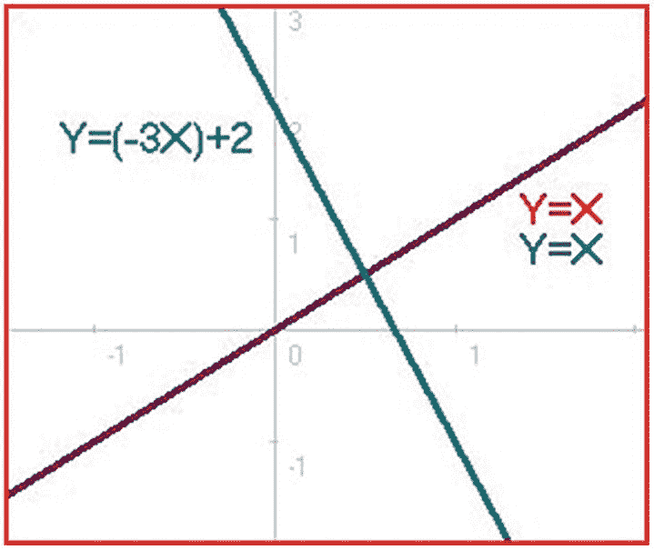

图 2-28

一个方程线性依赖于另一个方程；一个解决方案

对于不存在解的超定系统，我们试图找到“最佳近似”有许多方法来定义“最佳近似”普通最小二乘法(OLS)找到最小化最小平方的解 ***x*** 。也就是


几何上，OLS 画了一条穿过数据点{( ***x*** ， ***b*** )}的(高维)线(或超平面)，使得距离的平方和最小。参见图 [2-29](#Fig29) 。

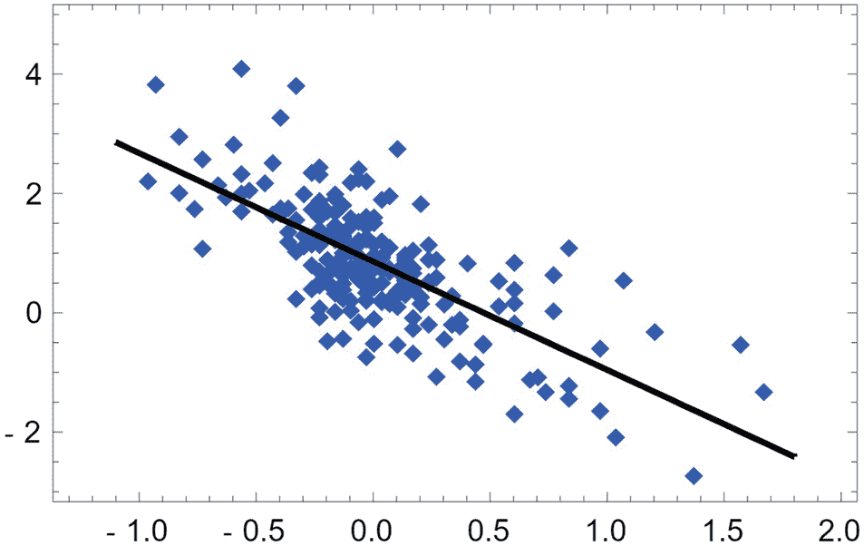

图 2-29

超定系统的 OLS 解

解由这个公式给出:


利用这个公式，当不存在精确解时找到近似解，当存在精确解时给出精确解，前提是(***A***<sup>*T*</sup>***A***)<sup>—1</sup>存在(或者等价地 ***A*** 具有满列秩)。但在实际操作中，我们在计算(**<sup>*T*</sup>***A***)<sup>—1</sup>时，由于数值稳定性问题，并不使用这个公式。相反，我们使用正交分解方法。**

 **NM Dev 有两个正交分解方法的实现，一个基于 QR 分解，另一个基于 SVD 分解。

利用 QR 分解，我们可以把 ***写成一个*** 如下:

![$$ \boldsymbol{A}=\boldsymbol{Q}\boldsymbol{R}=\boldsymbol{Q}\left[\begin{array}{c}{\boldsymbol{R}}_{\mathbf{1}}\\ {}\mathbf{0}\end{array}\right]=\left[{\boldsymbol{Q}}_{\mathbf{1}}\kern0.5em {\boldsymbol{Q}}_{\mathbf{2}}\right]\left[\begin{array}{c}{\boldsymbol{R}}_{\mathbf{1}}\\ {}\mathbf{0}\end{array}\right]={\boldsymbol{Q}}_{\mathbf{1}}{\boldsymbol{R}}_{\mathbf{1}} $$](img/500382_1_En_2_Chapter_TeX_Equdg.png)

超定线性系统 ***Ax = b*** 可以改写为***Q***<sub>**1**</sub>***R***<sub>**1**</sub>***x = b***。因为***Q***<sub>**1**</sub>是正交的，所以我们有了这个:


由于***R***<sub>**1**</sub>是一个上三角矩阵，我们可以用向后代换来求解系统。

下面的 NM Dev 代码使用 QR 方法解决了这个超定系统:

![$$ \left[\begin{array}{cc}1&amp; 1\\ {}1&amp; 2\\ {}1&amp; 3\\ {}1&amp; 4\end{array}\right]\boldsymbol{x}=\left[\begin{array}{c}6\\ {}5\\ {}7\\ {}10\end{array}\right] $$](img/500382_1_En_2_Chapter_TeX_Equdi.png)

```py
// define an overdetermined system of linear equations
Matrix A = new DenseMatrix(new double[][]{
    {1, 1},
    {1, 2},
    {1, 3},
    {1, 4}
});
Vector b = new DenseVector(new double[]{6, 5, 7, 10});
LSProblem problem = new LSProblem(A, b);

// solve the system using QR method
OLSSolverByQR solver1 = new OLSSolverByQR(0); // precision
// compute the OLS solution
Vector x1 = solver1.solve(problem);
System.out.println("the OLS solution = " + x1);

```

输出如下所示:

```py
the OLS solution = [3.500000, 1.400000]

```

利用 SVD 分解，我们可以把 ***写成*** 如下:


伪逆是***A***<sup>+</sup>=***VD***<sup>+</sup>***U***<sup>*T*</sup>，其中 ***D*** <sup>+</sup> 是通过取对角线上每个非零元素的倒数，并将零留在原位。在数值计算中，只有大于某个小公差的元素被认为是非零的，其他的被替换为零。超定线性系统 ***Ax = b*** 可解如下:

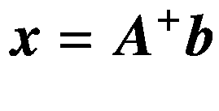

以下 NM Dev 代码解决了与前面相同的示例:

```py
// define an overdetermined system of linear equations
Matrix A = new DenseMatrix(new double[][]{
    {1, 1},
    {1, 2},
    {1, 3},
    {1, 4}
});
Vector b = new DenseVector(new double[]{6, 5, 7, 10});
LSProblem problem = new LSProblem(A, b);

// solve the system using SVD method
OLSSolverBySVD solver2 = new OLSSolverBySVD(0); // precision
// compute the OLS solution
Vector x2 = solver2.solve(problem);
System.out.println("the OLS solution = " + x2);

```

输出如下所示:

```py
the OLS solution = [3.500000, 1.400000]

```

输出与使用 QR 方法的输出完全相同。

NM Dev 类`LSProblem`构造了一个线性系统问题，它可以被许多求解器解决。这个类使用构建器设计模式来构造一个`LSProblem`,它被定制来规定求解器的行为，比如迭代次数、精度、初始猜测以及左右预处理。预处理是将问题转化为更适合数值求解方法的形式的变换的应用。这个过程叫做*预处理*。预处理通常用于减少数值问题的条件数。预处理后的问题通常用迭代法求解。`LSProblem`的签名如下:

```py
/**
 * Constructs a system of linear equations <i>Ax = b</i>.
 *
 * @param A the the homogeneous part, the coefficient matrix, of the linear system
 * @param b the non-homogeneous part, the right-hand side vector, of the linear system
 */
public LSProblem(Matrix A, Vector b)

/**
 * Gets the homogeneous part, the coefficient matrix, of the linear system.
 *
 * @return the coefficient matrix
 */
public ImmutableMatrix A()

/**
 * Gets the non-homogeneous part, the right-hand side vector, of the linear system.
 *
 * @return the vector
 */
public ImmutableVector b()

/**
 * Gets the number of variables in the linear system.
 *
 * @return the number of variables
 */
public int size()

/**
 * Overrides the maximum count of iterations.
 *
 * @param maxIteration the maximum count of iterations
 * @return the new problem with the overriden maximum count of iterations
 */
public LSProblem withMaxIteration(int maxIteration)

/**
 * Gets the specified maximum number of iterations.
 *
 * @return the maximum number of iterations
 */
public int getMaxIteration()

/**
 * Overrides the tolerance instance.
 *
 * @param tolerance the criteria which determines when the solution converges and the iteration
 *                  stops
 * @return the new problem with the overriden tolerance
 */
public LSProblem withTolerance(Tolerance tolerance)

/**
 * Gets the specified {@link Tolerance} instance.
 *
 * @return the {@link Tolerance} instance
 */
public Tolerance getTolerance()

/**
 * Overrides the initial guess of the solution.
 *
 * @param initialGuess the initial guess of the solution
 * @return the new problem with the overriden initial guess
 */
public LSProblem withInitialGuess(Vector initialGuess)

/**
 * Gets the initial guess of the solution for the problem.
 *
 * @return the initial guess
 */
public Vector getInitialGuess()

/**
 * Overrides the left preconditioner. If right-preconditioning is used,
 * leave this as its default value - {@link IdentityPreconditioner}.
 *
 * @param preconditioner the preconditioner
 * @return the new problem with the overriden left preconditioner
 */
public LSProblem withLeftPreconditioner(Preconditioner preconditioner)

/**
 * Gets the left preconditioner.
 *
 * @return the left preconditioner
 */
public Preconditioner getLeftPreconditioner()

/**
 * Overrides the right preconditioner. If left-preconditioning is used,
 * leave this as its default value - {@link IdentityPreconditioner}.
 *
 * @param preconditioner the preconditioner
 * @return the new problem with the overriden right preconditioner
 */
public LSProblem withRightPreconditioner(Preconditioner preconditioner)

/**
 * Gets the right preconditioner.
 *
 * @return the right preconditioner
 */
public Preconditioner getRightPreconditioner()

```

## 2.5 稀疏矩阵

在数值计算中，稀疏矩阵(向量)是指大部分元素为零的矩阵(向量)。没有严格的定义，多少个元素需要为零才能被认为是稀疏的，但一个常见的标准是非零元素的数量大约是行或列的数量。相反，如果大部分元素都是非零的，那么矩阵被认为是稠密的。零值元素的数量除以元素的总数有时被称为矩阵的稀疏度。例如，下面的稀疏矩阵只包含 9 个非零元素，有 26 个零元素。它的稀疏度是 74%，密度是 26%。

![$$ \left[\begin{array}{ccccccc}11&amp; 22&amp; &amp; &amp; &amp; &amp; \\ {}&amp; 33&amp; 44&amp; &amp; &amp; &amp; \\ {}&amp; &amp; 55&amp; 66&amp; 77&amp; &amp; \\ {}&amp; &amp; &amp; &amp; &amp; 88&amp; \\ {}&amp; &amp; &amp; &amp; &amp; &amp; 99\end{array}\right] $$](img/500382_1_En_2_Chapter_TeX_Equdl.png)T2】

从概念上讲，稀疏性对应于具有很少成对相互作用的系统。例如，考虑由弹簧从一个到下一个连接的一排球:这是一个稀疏系统，因为只有相邻的球被耦合。相比之下，如果同一排球有弹簧将每个球与所有其他球连接起来，这个系统就相当于一个密集的矩阵。稀疏性的概念在组合学和应用领域中是有用的，例如网络理论和数值分析，这些领域通常具有低密度的重要数据或连接。在科学或工程应用中，求解偏微分方程和最优化问题时，经常会出现大型稀疏矩阵。

当在计算机上存储和操作稀疏矩阵时，使用利用矩阵的稀疏结构的专门算法和数据结构是有益的，并且通常是必要的。当应用于大型稀疏矩阵时，使用标准密集矩阵结构和算法的运算是缓慢且低效的，因为处理和存储被浪费在零点上。稀疏数据本质上更容易压缩，因此需要的存储空间也少得多。一些非常大的稀疏矩阵使用标准的密集矩阵算法实际上是不可行的。

一般来说，对于一个 *m* × *n* 的矩阵，以密集格式存储矩阵所需的内存量与 *m* × *n* 成正比(不考虑矩阵的维数也需要存储)。在稀疏矩阵的情况下，通过仅存储非零项，可以实现显著的存储器需求减少。根据非零项的数量和分布，可以使用不同的数据结构，与基本方法相比，可以节省大量内存。代价是访问单个元素变得更加复杂，并且需要额外的结构来能够明确地恢复原始矩阵。

NM Dev 库支持两组格式。

*   那些支持高效修改的，比如键的字典和列表的列表。这些通常用于构建矩阵。

*   那些支持高效访问和矩阵操作的，比如压缩稀疏行。这些通常用于支持矩阵运算。

### 钥匙字典

键字典(DOK)由一个将(行，列)对映射到元素值的字典组成。也就是说，非零值被散列，使得添加、移除和检索值可以在恒定时间内完成。字典中缺少的元素被视为零。这种格式适用于以随机顺序递增地构造稀疏矩阵，但不适用于以字典顺序迭代非零值。人们通常以这种格式构造矩阵，然后转换成另一种更有效的格式进行处理。

下面的 NM Dev 代码以两种不同的方式使用 DOK 为这个矩阵构造稀疏矩阵。我们可以使用数组或列表来指定非零项。

![$$ \boldsymbol{A}=\left[\begin{array}{cccc}1&amp; 2&amp; 0&amp; 0\\ {}0&amp; 3&amp; 9&amp; 0\\ {}0&amp; 1&amp; 4&amp; 0\end{array}\right] $$](img/500382_1_En_2_Chapter_TeX_Equdm.png)T2】

```py
// the target matrix in dense representation
Matrix A = new DenseMatrix(new double[][]{
    {1, 2, 0, 0},
    {0, 3, 9, 0},
    {0, 1, 4, 0}
});

// DOK
SparseMatrix B1 = new DOKSparseMatrix(3, 4, // 3x4 dimension
        new int[]{3, 2, 1, 3, 2, 1}, // row indices
        new int[]{3, 2, 1, 2, 3, 2}, // column indices
        new double[]{4, 3, 1, 1, 9, 2} // matrix entries/values
);
//verify that B1 = A
System.out.println(String.format(
        "B1 = A, %b",
        MatrixPropertyUtils.areEqual(B1, A, 1e-15)));
        SparseMatrix B2 = new DOKSparseMatrix(3, 4, // 3x4 dimension
        Arrays.<SparseMatrix.Entry>asList( // specify only the non-zero entries
                new SparseMatrix.Entry(new MatrixCoordinate(3, 3), 4),
                new SparseMatrix.Entry(new MatrixCoordinate(2, 2), 3),
                new SparseMatrix.Entry(new MatrixCoordinate(1, 1), 1),
                new SparseMatrix.Entry(new MatrixCoordinate(3, 2), 1),
                new SparseMatrix.Entry(new MatrixCoordinate(2, 3), 9),
                new SparseMatrix.Entry(new MatrixCoordinate(1, 2), 2)));
//verify that B2 = A
System.out.println(String.format(
        "B2 = A, %b",
        MatrixPropertyUtils.areEqual(B2, A, 1e-15)));

```

输出如下所示:

```py
B1 = A, true
B2 = A, true

```

### 清单列表

列表列表(LIL)每行存储一个列表，每个条目包含列索引和值。通常，这些条目按列索引排序，以便更快地查找。这是另一种适合增量矩阵构造的格式。

下面的 NM Dev 代码以两种不同的方式使用 LIL 为前面显示的**构造稀疏矩阵。我们可以使用数组或列表来指定非零项。**

```py
// the target matrix in dense representation
Matrix A = new DenseMatrix(new double[][]{
    {1, 2, 0, 0},
    {0, 3, 9, 0},
    {0, 1, 4, 0}
});

// LIL
SparseMatrix C1 = new LILSparseMatrix(3, 4, // 3x4 dimension
        new int[]{3, 2, 1, 3, 2, 1}, // row indices
        new int[]{3, 2, 1, 2, 3, 2}, // column indices
        new double[]{4, 3, 1, 1, 9, 2} // matrix entries/values
);
//verify that C1 = A
System.out.println(String.format(
        "C1 = A, %b",
        MatrixPropertyUtils.areEqual(C1, A, 1e-15)));
SparseMatrix C2 = new LILSparseMatrix(3, 4, // 3x4 dimension
        Arrays.<SparseMatrix.Entry>asList( // specify only the non-zero entries
                new SparseMatrix.Entry(new MatrixCoordinate(3, 3), 4),
                new SparseMatrix.Entry(new MatrixCoordinate(2, 2), 3),
                new SparseMatrix.Entry(new MatrixCoordinate(1, 1), 1),
                new SparseMatrix.Entry(new MatrixCoordinate(3, 2), 1),
                new SparseMatrix.Entry(new MatrixCoordinate(2, 3), 9),
                new SparseMatrix.Entry(new MatrixCoordinate(1, 2), 2)));
//verify that C2 = A
System.out.println(String.format(
        "C2 = A, %b",
        MatrixPropertyUtils.areEqual(C2, A, 1e-15)));

```

输出如下所示:

```py
C1 = A, true
C2 = A, true

```

### 2.5.3 压缩稀疏行

压缩稀疏行(CSR)或压缩行存储(CRS)或 Yale 格式用三个(一维)数组表示一个矩阵，这三个数组分别包含非零值、行的范围和列索引。这种格式允许快速行访问和矩阵向量乘法 ***Av*** 。CSR 格式使用三个(一维)数组(V，COL_INDEX，ROW_INDEX)以行的形式存储稀疏的 *m* × *n* 矩阵**。让 NNZ 表示**中非零条目的数量。数组 V 和 COL_INDEX 的长度为 NNZ，分别包含非零值和这些值的列索引。****

 ****下面的 NM Dev 代码以两种不同的方式为之前使用 CSR 的**构建稀疏矩阵。我们可以使用数组或列表来指定非零项。**

```py
// the target matrix in dense representation
Matrix A = new DenseMatrix(new double[][]{
    {1, 2, 0, 0},
    {0, 3, 9, 0},
    {0, 1, 4, 0}
});

// CSR
SparseMatrix D1 = new CSRSparseMatrix(3, 4, // 3x4 dimension
        new int[]{3, 2, 1, 3, 2, 1}, // row indices
        new int[]{3, 2, 1, 2, 3, 2}, // column indices
        new double[]{4, 3, 1, 1, 9, 2} // matrix entries/values
);
//verify that D1 = A
System.out.println(String.format(
        "D1 = A, %b",
        MatrixPropertyUtils.areEqual(D1, A, 1e-15)));
SparseMatrix D2 = new CSRSparseMatrix(3, 4, // 3x4 dimension
        Arrays.<SparseMatrix.Entry>asList( // specify only the non-zero entries
             new SparseMatrix.Entry(new MatrixCoordinate(3, 3), 4),
             new SparseMatrix.Entry(new MatrixCoordinate(2, 2), 3),
             new SparseMatrix.Entry(new MatrixCoordinate(1, 1), 1),
             new SparseMatrix.Entry(new MatrixCoordinate(3, 2), 1),
             new SparseMatrix.Entry(new MatrixCoordinate(2, 3), 9),
             new SparseMatrix.Entry(new MatrixCoordinate(1, 2), 2)));
//verify that D2 = A
System.out.println(String.format(
        "D2 = A, %b",
        MatrixPropertyUtils.areEqual(D2, A, 1e-15)));

```

输出如下所示:

```py
D1 = A, true
D2 = A, true

```

### 2.5.4 稀疏矩阵/向量运算

在 NM Dev 中，我们可以使用类`SparseVector`创建一个稀疏向量。这里有一个例子:

```py
// sparse vector construction
SparseVector v1 = new SparseVector(
        99, // vector size
        new int[]{1, 3, 53, 79, 99}, // indices
        new double[]{11, 22, 33, 44, 55} // values
);
System.out.println("v1 = " + v1);

```

输出如下所示:

```py
v1 = size: 99
[1] 11.0000
[3] 22.0000
[53] 33.0000
[79] 44.0000
[99] 55.0000

```

所有这些稀疏矩阵和向量数据结构完全可以与所有其他矩阵和向量数据结构互操作。稀疏数据结构完全支持所有矩阵和向量运算，如加法和乘法。这里有一个例子:

```py
// the target matrix in dense representation
Matrix A = new DenseMatrix(new double[][]{
    {1, 2, 0, 0},
    {0, 3, 9, 0},
    {0, 1, 4, 0}
});

// DOK
SparseMatrix B1 = new DOKSparseMatrix(3, 4, // 3x4 dimension
        new int[]{3, 2, 1, 3, 2, 1}, // row indices
        new int[]{3, 2, 1, 2, 3, 2}, // column indices
        new double[]{4, 3, 1, 1, 9, 2} // matrix entries/values
);
//verify that B1 = A
System.out.println(String.format(
        "B1 = A, %b",
        MatrixPropertyUtils.areEqual(B1, A, 1e-15)));
SparseMatrix B2 = new DOKSparseMatrix(3, 4, // 3x4 dimension
        Arrays.<SparseMatrix.Entry>asList( // specify only the non-zero entries
                new SparseMatrix.Entry(new MatrixCoordinate(3, 3), 4),
                new SparseMatrix.Entry(new MatrixCoordinate(2, 2), 3),
                new SparseMatrix.Entry(new MatrixCoordinate(1, 1), 1),
                new SparseMatrix.Entry(new MatrixCoordinate(3, 2), 1),
                new SparseMatrix.Entry(new MatrixCoordinate(2, 3), 9),
                new SparseMatrix.Entry(new MatrixCoordinate(1, 2), 2)));
//verify that B2 = A
System.out.println(String.format(
        "B2 = A, %b",
        MatrixPropertyUtils.areEqual(B2, A, 1e-15)));

// LIL
SparseMatrix C1 = new LILSparseMatrix(3, 4, // 3x4 dimension
        new int[]{3, 2, 1, 3, 2, 1}, // row indices
        new int[]{3, 2, 1, 2, 3, 2}, // column indices
        new double[]{4, 3, 1, 1, 9, 2} // matrix entries/values
);
//verify that C1 = A
System.out.println(String.format(
        "C1 = A, %b",
        MatrixPropertyUtils.areEqual(C1, A, 1e-15)));
SparseMatrix C2 = new LILSparseMatrix(3, 4, // 3x4 dimension
        Arrays.<SparseMatrix.Entry>asList( // specify only the non-zero entries
                new SparseMatrix.Entry(new MatrixCoordinate(3, 3), 4),
                new SparseMatrix.Entry(new MatrixCoordinate(2, 2), 3),
                new SparseMatrix.Entry(new MatrixCoordinate(1, 1), 1),
                new SparseMatrix.Entry(new MatrixCoordinate(3, 2), 1),
                new SparseMatrix.Entry(new MatrixCoordinate(2, 3), 9),
                new SparseMatrix.Entry(new MatrixCoordinate(1, 2), 2)));
//verify that C2 = A
System.out.println(String.format(
        "C2 = A, %b",
        MatrixPropertyUtils.areEqual(C2, A, 1e-15)));

// CSR
SparseMatrix D1 = new CSRSparseMatrix(3, 4, // 3x4 dimension
        new int[]{3, 2, 1, 3, 2, 1}, // row indices
        new int[]{3, 2, 1, 2, 3, 2}, // column indices
        new double[]{4, 3, 1, 1, 9, 2} // matrix entries/values
);
//verify that D1 = A
System.out.println(String.format(
        "D1 = A, %b",
        MatrixPropertyUtils.areEqual(D1, A, 1e-15)));
SparseMatrix D2 = new CSRSparseMatrix(3, 4, // 3x4 dimension
        Arrays.<SparseMatrix.Entry>asList( // specify only the non-zero entries
                new SparseMatrix.Entry(new MatrixCoordinate(3, 3), 4),
                new SparseMatrix.Entry(new MatrixCoordinate(2, 2), 3),
                new SparseMatrix.Entry(new MatrixCoordinate(1, 1), 1),
                new SparseMatrix.Entry(new MatrixCoordinate(3, 2), 1),
                new SparseMatrix.Entry(new MatrixCoordinate(2, 3), 9),
                new SparseMatrix.Entry(new MatrixCoordinate(1, 2), 2)));
//verify that D2 = A
System.out.println(String.format(
        "D2 = A, %b",
        MatrixPropertyUtils.areEqual(D2, A, 1e-15)));

// sparse vector construction
SparseVector v1 = new SparseVector(
        99, // vector size
        new int[]{1, 3, 53, 79, 99}, // indices
        new double[]{11, 22, 33, 44, 55} // values
);
System.out.println("v = " + v1);

// addition
Matrix M1 = B1.add(A);
System.out.println("M1 = " + M1);

DOKSparseMatrix M2 = (DOKSparseMatrix) B1.add(B2);
System.out.println("M2 = " + M2);

LILSparseMatrix M3 = (LILSparseMatrix) C1.minus(C2);
System.out.println("M3 = " + M3);

CSRSparseMatrix M4 = (CSRSparseMatrix) D1.multiply(D2.t());
System.out.println("M4 = " + M4);

SparseVector v2 = new SparseVector(
        4, // vector size
        new int[]{1}, // indices
        new double[]{11} // values
);
System.out.println("v2 = " + v2);
Vector v3 = B1.multiply(v2);
System.out.println("ve = " + v3);

```

输出如下所示:

```py
B1 = A, true
B2 = A, true
C1 = A, true
C2 = A, true
D1 = A, true
D2 = A, true
v = size: 99
[1] 11.0000
[3] 22.0000
[53] 33.0000
[79] 44.0000
[99] 55.0000

M1 = 3x4
         [,1] [,2] [,3] [,4]
[1,] 2.000000, 4.000000, 0.000000, 0.000000,
[2,] 0.000000, 6.000000, 18.000000, 0.000000,
[3,] 0.000000, 2.000000, 8.000000, 0.000000,
M2 = 3x4 nnz = 6
(1, 1): 2.0
(1, 2): 4.0
(2, 2): 6.0
(2, 3): 18.0
(3, 2): 2.0
(3, 3): 8.0

M3 = 3x4 nnz = 0

M4 = 3x3 nnz = 9
(1, 1): 5.0
(1, 2): 6.0
(1, 3): 2.0
(2, 1): 6.0
(2, 2): 90.0
(2, 3): 39.0
(3, 1): 2.0
(3, 2): 39.0
(3, 3): 17.0

v2 = size: 4
[1] 11.0000

ve = size: 3
[1] 11.0000

```

NM Dev 还支持用于特殊结构的各种其他矩阵，如下所示:

*   `DiagonalMatrix`

*   `BidiagonalMatrix`

*   `TridiagonalMatrix`

*   `LowerTriangularMatrix`

*   `UpperTriangularMatrix`

*   `SymmetricMatrix`

*   `PermutationMatrix`

这些数据结构有专门的操作，但是它们也可以与所有其他矩阵和向量数据结构完全互操作。它们还完全支持所有矩阵和向量运算，如加法和乘法。

### 2.5.5 求解稀疏矩阵方程

解线性方程组是数值计算的基础。我们可以利用问题的稀疏性来处理我们无法处理的更大的问题。例如，我们在前面章节中讨论的解算器，如 LU、QR 和 SVD 因式分解，可以处理密集矩阵。他们用零填充整个矩阵(想象它们是数百万乘数百万)，并且需要一次又一次地填充许多矩阵。这些密集的矩阵可能不适合计算机内存。这些全矩阵的运算效率低，浪费在零点上。求解线性方程组的算法(通常是迭代方法)利用稀疏矩阵，并且不改变稀疏模式，因为它们仅涉及矩阵-向量乘积，并且不进行填充。

求解一个 *n* × *n* (或非方)线性系统***Ax***=***b***的迭代方法涉及一系列矩阵向量乘法。从对解的最初猜测开始，每次迭代都返回对解的新估计。希望在 *k* 次迭代后，估计收敛到满意的解(在容差内)。对于密集矩阵 ***A*** ，每次迭代需要*O*(*n*<sup>2</sup>)次运算。一种迭代方法是用*O*(*kn*<sup>2</sup>)次运算来收敛。对于稀疏系统，矩阵向量乘法只需要 *O* (#nonZeros)，其中#nonZeros 是稀疏矩阵中非零的数量。因此，迭代方法可以比求解线性系统的传统直接方法(例如求逆)快得多。使用稀疏矩阵的迭代方法比使用密集矩阵的迭代方法快得多。

NM Dev 支持大范围的稀疏矩阵线性系统解算器。它们如下:

*   双共轭梯度求解器(BiCG)

*   双共轭梯度稳定求解器(BiCGSTAB)

*   共轭梯度求解器(CG)

*   共轭梯度正态误差求解器(CGNE)

*   共轭梯度法向残差求解器(CGNR)

*   共轭梯度平方求解器(CGS)

*   高斯-塞德尔解算器

*   广义共轭残差求解器(GRES)

*   广义最小残差求解器(GMRES)

*   雅可比求解器

*   最小残差求解器(MINRES)

*   准最小残差求解器(QMR)

*   最速下降解算器

*   逐次超松弛求解器(SOR)

*   对称逐次超松弛求解器(SSOR)

以下是选择稀疏系统迭代求解器的一些准则。对于埃尔米特问题，如果系统是正定的，用 CG 或 MINRES 否则，使用 MINRES。为了避免在 CG 或 MINRES 中做内积，我们可以选择平稳方法，如雅可比、高斯-塞德尔、SOR 或 SSOR。这些方法在每次迭代中节省了计算成本，但迭代次数可能会增加，除非有一个好的预条件。对于非埃尔米特问题，选择就没那么容易了。如果矩阵向量乘法非常昂贵，GMRES 可能是最佳选择，因为它执行的乘法最少。第二好的选择是 QMR 或 BiCG。QMR 在数字上比 BiCG 更稳定。当矩阵的转置不可用时，有免转置方法，如 CGS 或 BiCGSTAB。对于非方系统，有 CG 方法解决超定系统，如 CGNR，和欠定系统，如 CGNE。

预处理子的使用可以显著提高迭代方法的收敛速度。预处理器将线性系统转换成一个等价的系统，因为它有相同的解。变换后的系统具有更有利的影响收敛速度的谱特性。特别是一个预处理子 ***M*** 逼近系数矩阵 ***A*** ，变换后的系统更容易求解。下面举个例子:


这与原始系统具有相同的解决方案。其系数矩阵***M***<sup>—1</sup>***A***的谱性质可能更有利。系统预处理的另一种方式如下:

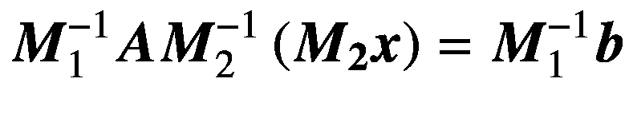

矩阵***M***<sub>**1**</sub>和***M***<sub>**2**</sub>分别称为左右预处理子。有三种预处理:左预处理、右预处理或拆分预处理。左-预处理留下***M***<sub>**2**</sub>作为`IdentityPreconditioner`。(当不应用预处理时，使用该标识预处理程序。)同理，右预处理留下***M***<sub>**1**</sub>作为`IdentityPreconditioner`。

在 NM Dev 中，所有稀疏矩阵线性系统解算器都继承自接口`IterativeLinearSystemSolver`。签名如下:

```py
public interface IterativeLinearSystemSolver {

    /**
     * This is the solution to a system of linear equations using an iterative
     * solver.
     */
    public static interface Solution extends IterativeMethod<Vector> {

        @Override
        public IterationMonitor<Vector> step() throws ConvergenceFailure;//override the return and exception types

        @Override
        public Vector search(Vector... initials) throws ConvergenceFailure;//override the exception type
    }

    /**
     * Solves iteratively
     * <blockquote>
     * <i>Ax = b</i>
     * </blockquote>
     * until the solution converges, i.e., the norm of residual
     * (<i>b - Ax</i>) is less than or equal to the threshold.
     *
     * @param problem a system of linear equations
     * @param monitor an iteration monitor
     * @return an (approximate) solution to the linear problem
     * @throws ConvergenceFailure if the algorithm fails to converge
     */
    public Solution solve(LSProblem problem, IterationMonitor<Vector> monitor) throws ConvergenceFailure;
}

```

下面的 NM Dev 代码使用许多非静态稀疏线性系统解算器来解一个稀疏线性系统。一般程序是先用`LSProblem`定义一个线性系统问题。然后我们为这个问题构造一个求解器。这里有很多选择。解题给出一个对象`IterativeLinearSystemSolver.Solution`。使用 solution 对象，我们可以从最初的猜测(在我们的例子中是 0)开始迭代搜索。搜索算法返回一个向量 *x* 作为解。我们通过使用 *ℓ* <sub>2</sub> -norm 比较 *Ax* 和 *x* 之间的差异来检查结果的有效性。这里有一个例子。

```py
/* Symmetric matrix:
 * 8x8
 * [,1] [,2] [,3] [,4] [,5] [,6] [,7] [,8]
 * [1,] 7.000000, 0.000000, 1.000000, 0.000000, 0.000000, 2.000000, 7.000000, 0.000000,
 * [2,] 0.000000, -4.000000, 8.000000, 0.000000, 2.000000, 0.000000, 0.000000, 0.000000,
 * [3,] 1.000000, 8.000000, 1.000000, 0.000000, 0.000000, 0.000000, 0.000000, 5.000000,
 * [4,] 0.000000, 0.000000, 0.000000, 7.000000, 0.000000, 0.000000, 9.000000, 0.000000,
 * [5,] 0.000000, 2.000000, 0.000000, 0.000000, 5.000000, 1.000000, 5.000000, 0.000000,
 * [6,] 2.000000, 0.000000, 0.000000, 0.000000, 1.000000, -1.000000, 0.000000, 5.000000,
 * [7,] 7.000000, 0.000000, 0.000000, 9.000000, 5.000000, 0.000000, 11.000000, 0.000000,
 * [8,] 0.000000, 0.000000, 5.000000, 0.000000, 0.000000, 5.000000, 0.000000, 5.000000,
 */
Matrix A = new CSRSparseMatrix(8, 8, // matrix dimension
        new int[]{1, 1, 1, 1, 2, 2, 2, 3, 3, 3, 3, 4, 4, 5, 5, 5, 5, 6, 6, 6, 6, 7, 7, 7, 7, 8, 8, 8}, // row indices
        new int[]{1, 3, 6, 7, 2, 3, 5, 1, 2, 3, 8, 4, 7, 2, 5, 6, 7, 1, 5, 6, 8, 1, 4, 5, 7, 3, 6, 8}, // column indices
        new double[]{7, 1, 2, 7, -4, 8, 2, 1, 8, 1, 5, 7, 9, 2, 5, 1, 5, 2, 1, -1, 5, 7, 9, 5, 11, 5, 5, 5} // entries/values
);
Vector b = new DenseVector( // note that we can still use dense data structure
        new double[]{
            1, 1, 1, 1, 1, 1, 1, 1
        });
// construct a linear system problem to be solved
LSProblem problem = new LSProblem(A, b);

// construct a sparse matrix linear system solver
BiconjugateGradientSolver BiCG
        = new BiconjugateGradientSolver(
                10, // maximum number of iterations
                new AbsoluteTolerance(1e-8) // precision
        );
IterativeLinearSystemSolver.Solution soln1 = BiCG.solve(problem);
Vector x1 = soln1.search(new SparseVector(A.nCols())); // use 0 as the initial guess
System.out.println("x = " + x1);
Vector Ax1_b = A.multiply(x1).minus(b); // verify that Ax = b
System.out.println("||Ax - b|| = " + Ax1_b.norm()); // should be (close to) 0

// construct a sparse matrix linear system solver
BiconjugateGradientStabilizedSolver BiCGSTAB
        = new BiconjugateGradientStabilizedSolver(
                10, // maximum number of iterations
                new AbsoluteTolerance(1e-7) // less precision
        );
IterativeLinearSystemSolver.Solution soln2 = BiCGSTAB.solve(problem);
Vector x2 = soln2.search(new SparseVector(A.nCols())); // use 0 as the initial guess
System.out.println("x = " + x2);
Vector Ax2_b = A.multiply(x2).minus(b); // verify that Ax = b
System.out.println("||Ax - b|| = " + Ax2_b.norm()); // should be (close to) 0

ConjugateGradientNormalErrorSolver CGNE
        = new ConjugateGradientNormalErrorSolver(
                10, // maximum number of iterations
                new AbsoluteTolerance(1e-8) // precision
        );
IterativeLinearSystemSolver.Solution soln3 = CGNE.solve(problem);
Vector x3 = soln3.search(new SparseVector(A.nCols())); // use 0 as the initial guess
System.out.println("x = " + x3);
Vector Ax3_b = A.multiply(x3).minus(b); // verify that Ax = b
System.out.println("||Ax - b|| = " + Ax3_b.norm()); // should be (close to) 0

ConjugateGradientNormalResidualSolver CGNR
        = new ConjugateGradientNormalResidualSolver(
                10, // maximum number of iterations
                new AbsoluteTolerance(1e-8) // precision
        );
IterativeLinearSystemSolver.Solution soln4 = CGNR.solve(problem);
Vector x4 = soln4.search(new SparseVector(A.nCols())); // use 0 as the initial guess
System.out.println("x = " + x4);
Vector Ax4_b = A.multiply(x4).minus(b); // verify that Ax = b
System.out.println("||Ax - b|| = " + Ax4_b.norm()); // should be (close to) 0

ConjugateGradientSolver CG
        = new ConjugateGradientSolver(
                10, // maximum number of iterations
                new AbsoluteTolerance(1e-8) // precision
        );
IterativeLinearSystemSolver.Solution soln5 = CG.solve(problem);
Vector x5 = soln5.search(new SparseVector(A.nCols())); // use 0 as the initial guess
System.out.println("x = " + x5);
Vector Ax5_b = A.multiply(x5).minus(b); // verify that Ax = b
System.out.println("||Ax - b|| = " + Ax5_b.norm()); // should be (close to) 0

ConjugateGradientNormalResidualSolver CGS
        = new ConjugateGradientNormalResidualSolver(
                10, // maximum number of iterations
                new AbsoluteTolerance(1e-8) // precision
        );
IterativeLinearSystemSolver.Solution soln6 = CGS.solve(problem);
Vector x6 = soln6.search(new SparseVector(A.nCols())); // use 0 as the initial guess
System.out.println("x = " + x6);
Vector Ax6_b = A.multiply(x6).minus(b); // verify that Ax = b
System.out.println("||Ax - b|| = " + Ax6_b.norm()); // should be (close to) 0

GeneralizedConjugateResidualSolver GRES
        = new GeneralizedConjugateResidualSolver(
                10, // maximum number of iterations
                new AbsoluteTolerance(1e-8) // precision
        );
IterativeLinearSystemSolver.Solution soln7 = GRES.solve(problem);
Vector x7 = soln7.search(new SparseVector(A.nCols())); // use 0 as the initial guess
System.out.println("x = " + x7);
Vector Ax7_b = A.multiply(x7).minus(b); // verify that Ax = b
System.out.println("||Ax - b|| = " + Ax7_b.norm()); // should be (close to) 0

GeneralizedMinimalResidualSolver GMRES
        = new GeneralizedMinimalResidualSolver(
                10, // maximum number of iterations
                new AbsoluteTolerance(1e-8) // precision
        );
IterativeLinearSystemSolver.Solution soln8 = GMRES.solve(problem);
Vector x8 = soln8.search(new SparseVector(A.nCols())); // use 0 as the initial guess
System.out.println("x = " + x8);
Vector Ax8_b = A.multiply(x8).minus(b); // verify that Ax = b
System.out.println("||Ax - b|| = " + Ax8_b.norm()); // should be (close to) 0

MinimalResidualSolver MINRES = new MinimalResidualSolver(
        10, // maximum number of iterations
        new AbsoluteTolerance(1e-8) // precision
);
CountMonitor<Vector> monitor = new CountMonitor<Vector>();
IterativeLinearSystemSolver.Solution soln9 = MINRES.solve(problem, monitor);
Vector x9 = soln9.search(new SparseVector(A.nCols())); // use 0 as the initial guess
System.out.println("x = " + x9);
Vector Ax9_b = A.multiply(x9).minus(b); // verify that Ax = b
System.out.println("||Ax - b|| = " + Ax9_b.norm()); // should be (close to) 0

QuasiMinimalResidualSolver QMR
        = new QuasiMinimalResidualSolver(
                10, // maximum number of iterations
                new AbsoluteTolerance(1e-8) // precision
        );
IterativeLinearSystemSolver.Solution soln10 = QMR.solve(problem);
Vector x10 = soln10.search(new SparseVector(A.nCols())); // use 0 as the initial guess
System.out.println("x = " + x10);
Vector Ax10_b = A.multiply(x10).minus(b); // verify that Ax = b
System.out.println("||Ax - b|| = " + Ax10_b.norm()); // should be (close to) 0

```

输出如下所示:

```py
x = [-0.041860, -0.003413, 0.117250, -0.112640, 0.024172, -0.107633, 0.198720, 0.190383]
||Ax - b|| = 3.4321107842718707E-13
x = [-0.041860, -0.003413, 0.117250, -0.112640, 0.024172, -0.107633, 0.198720, 0.190383]
||Ax - b|| = 6.001732649867594E-8
x = [-0.041860, -0.003413, 0.117250, -0.112640, 0.024172, -0.107633, 0.198720, 0.190383]
||Ax - b|| = 1.6870268466872934E-9
x = [-0.041860, -0.003413, 0.117250, -0.112640, 0.024172, -0.107633, 0.198720, 0.190383]
||Ax - b|| = 6.817480703009663E-10
x = [-0.041860, -0.003413, 0.117250, -0.112640, 0.024172, -0.107633, 0.198720, 0.190383]
||Ax - b|| = 3.4321107842718707E-13
x = [-0.041860, -0.003413, 0.117250, -0.112640, 0.024172, -0.107633, 0.198720, 0.190383]
||Ax - b|| = 6.817480703009663E-10
x = [-0.041860, -0.003413, 0.117250, -0.112640, 0.024172, -0.107633, 0.198720, 0.190383]
||Ax - b|| = 1.0175362097255202E-15
x = [-0.041860, -0.003413, 0.117250, -0.112640, 0.024172, -0.107633, 0.198720, 0.190383]
||Ax - b|| = 1.0053497077208614E-15
x = [-0.041860, -0.003413, 0.117250, -0.112640, 0.024172, -0.107633, 0.198720, 0.190383]
||Ax - b|| = 2.392209894095706E-13
x = [-0.041860, -0.003413, 0.117250, -0.112640, 0.024172, -0.107633, 0.198720, 0.190383]
||Ax - b|| = 5.933770145831627E-13

```

以下 NM Dev 代码使用多个静态稀疏线性系统解算器来解算稀疏线性系统:

```py
Matrix A = new SymmetricMatrix(
        new double[][]{
            {4},
            {1, 3}
        });
Vector b = new DenseVector(
        new double[]{
            1, 2
        });
// construct a linear system problem to be solved
LSProblem problem = new LSProblem(A, b);

// construct a sparse matrix linear system solver
GaussSeidelSolver gauss_seidel
        = new GaussSeidelSolver(
                10,
                new AbsoluteTolerance(1e-4));
IterativeLinearSystemSolver.Solution soln1 = gauss_seidel.solve(problem);
Vector x1 = soln1.search(new SparseVector(A.nCols())); // use 0 as the initial guess
System.out.println("x = " + x1);
Vector Ax1_b = A.multiply(x1).minus(b); // verify that Ax = b
System.out.println("||Ax - b|| = " + Ax1_b.norm()); // should be (close to) 0

// construct a sparse matrix linear system solver
JacobiSolver jacobi
        = new JacobiSolver(
                10,
                new AbsoluteTolerance(1e-4));
IterativeLinearSystemSolver.Solution soln2 = jacobi.solve(problem);
Vector x2 = soln2.search(new SparseVector(A.nCols()));
System.out.println("x = " + x2);
Vector Ax2_b = A.multiply(x1).minus(b); // verify that Ax = b
System.out.println("||Ax - b|| = " + Ax2_b.norm()); // should be (close to) 0

SuccessiveOverrelaxationSolver SOR
        = new SuccessiveOverrelaxationSolver(
                1.5,
                20, // need more iterations
                new AbsoluteTolerance(1e-4));
IterativeLinearSystemSolver.Solution soln3 = SOR.solve(problem);
Vector x3 = soln3.search(new SparseVector(A.nCols())); // use 0 as the initial guess
System.out.println("x = " + x3);
Vector Ax3_b = A.multiply(x3).minus(b); // verify that Ax = b
System.out.println("||Ax - b|| = " + Ax3_b.norm()); // should be (close to) 0

SymmetricSuccessiveOverrelaxationSolver SSOR
        = new SymmetricSuccessiveOverrelaxationSolver(
                1.5,
                20, // need more iterations
                new AbsoluteTolerance(1e-4));
IterativeLinearSystemSolver.Solution soln4 = SSOR.solve(problem);
Vector x4 = soln4.search(new SparseVector(A.nCols())); // use 0 as the initial guess
System.out.println("x = " + x4);
Vector Ax4_b = A.multiply(x4).minus(b); // verify that Ax = b
System.out.println("||Ax - b|| = " + Ax4_b.norm()); // should be (close to) 0

```

输出如下所示:

```py
x = [0.090917, 0.636361]
||Ax - b|| = 2.8131430040989613E-5
x = [0.090917, 0.636365]
||Ax - b|| = 2.8131430040989613E-5
x = [0.090909, 0.636344]
||Ax - b|| = 6.462981890138403E-5
x = [0.090904, 0.636348]
||Ax - b|| = 6.213495416129946E-5

```*********************************************************************************************