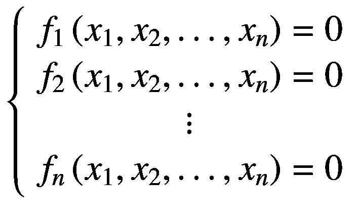
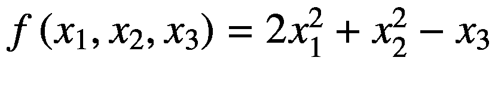
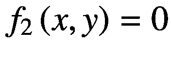
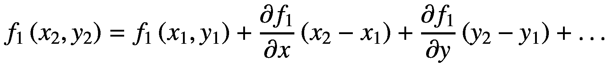
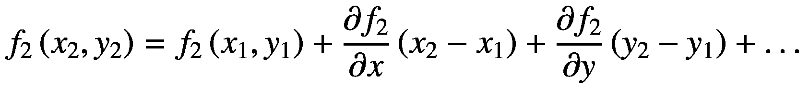
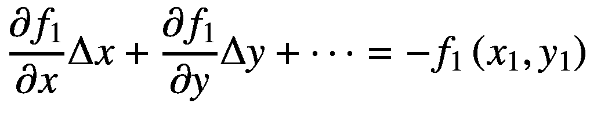
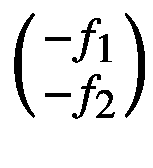
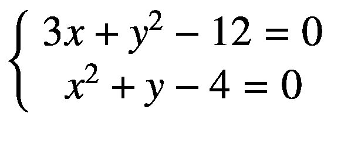

# 4.求方程组的根

多变量方程组的求根算法可以求出( *x* <sub>1</sub> ， *x* <sub>2</sub> ，…， *x* <sub>*n*</sub> )的值，使得系统中的 *n* 方程组的值等于 0。



系统不可能有解决方案、一个唯一的解决方案或多个解决方案。非线性方程组可以通过使用一阶导数的牛顿法或雅可比矩阵来数值求解，雅可比矩阵是单变量方程的牛顿-拉夫逊法的扩展。这个想法也是，在每次迭代中，增加一个增量，这个增量与一阶导数的倒数的负值成比例，但是在多元项中。

## 4.1 方程组

多变量方程是一个包含一个以上变量的方程。例如，是一个有变量的多变量方程( *x* <sub>1</sub> ， *x* <sub>2</sub> ， *x* <sub>3</sub> )。在 NM Dev 中，通过实现接口`RealScalarFunction`来构造多元函数。我们需要在`RealScalarFunction`中指定域`dimensionOfDomain`。为了简化实现，我们可以使用`AbstractRealScalarFunction`、`AbstractBiRealFunction`和`AbstractTrivariateRealFunction`。对于后两者，维度已经为您配置好了。

例如，以下实现都表示同一个函数，一个 3 次多项式:

```py
RealScalarFunction f1 = new AbstractRealScalarFunction(3) {
    @Override
    public Double evaluate(Vector x) {
        double x1 = x.get(1);
        double x2 = x.get(2);
        double x3 = x.get(3);
        return 2 * x1 * x1 + x2 * x2 - x3;
    }
};

TrivariateRealFunction f2 = new AbstractTrivariateRealFunction() {
    @Override
    public double evaluate(double x1, double x2, double x3) {
        return 2 * x1 * x1 + x2 * x2 - x3;
    }
};

```

输出如下所示:

```py
f1(1,2,3) = 3.0
f2(1,2,3) = 3.0

```

*n* 未知数*x*T6】1， *x* <sub>2</sub> ，…， *x* <sub>*n*</sub> 的方程组如下:


其中 *f* ( *x* <sub>1</sub> ， *x* <sub>2</sub> ，…， *x* <sub>*n*</sub> )是 *x* <sub>1</sub> ，*x*2，…， *x* <sub>*的函数方程组可以简单地表示为一个数组`RealScalarFunction[]`。或者，我们可以将其实现为 R <sup>n</sup> 到 R <sup>m</sup> 的向量函数，实现接口`RealVectorFunction`。下面两个实现`F`和`G`是等价的。对于`G`，我们需要指定域`dimensionOfDomain`和范围`dimensionOfRange`，在本例中它们都是 3。*</sub>

```py
TrivariateRealFunction f1 = new AbstractTrivariateRealFunction() {
    @Override
    public double evaluate(double x, double y, double z) {
        return Math.pow(x, 2) + Math.pow(y, 3) - z - 6;
    }
};
TrivariateRealFunction f2 = new AbstractTrivariateRealFunction() {
    @Override
    public double evaluate(double x, double y, double z) {
        return 2 * x + 9 * y - z - 17;
    }
};
TrivariateRealFunction f3 = new AbstractTrivariateRealFunction() {
    @Override
    public double evaluate(double x, double y, double z) {
        return Math.pow(x, 4) + 5 * y + 6 * z - 29;
    }
};
RealScalarFunction[] F = new TrivariateRealFunction[]{f1, f2, f3};

Vector x = new DenseVector(1.5, 2.5, 3.5);
double f1_x = F[0].evaluate(x);
double f2_x = F[1].evaluate(x);
double f3_x = F[2].evaluate(x);
double[] F_x = new double[]{f1_x, f2_x, f3_x};
System.out.println("F(x) = " + Arrays.toString(F_x));

RealVectorFunction G = new AbstractRealVectorFunction(3, 3) {
    @Override
    public Vector evaluate(Vector v) {
        double x = v.get(1);
        double y = v.get(2);
        double z = v.get(3);

        double g1 = Math.pow(x, 2) + Math.pow(y, 3) - z - 6;
        double g2 = 2 * x + 9 * y - z - 17;
        double g3 = Math.pow(x, 4) + 5 * y + 6 * z - 29;

        Vector g = new DenseVector(g1, g2, g3);
        return g;
    }
};

Vector Gx = G.evaluate(x);
System.out.println("G(x) = " + Gx);

```

输出如下所示:

```py
F(x) = [8.375, 5.0, 9.5625]
G(x) = [8.375000, 5.000000, 9.562500]

```

## 4.2 两个非线性方程组的求根

两个未知数的两个方程组一般可以表示为:




我们首先在 *f* <sub>1</sub> 和 *f* <sub>2</sub> 的交点附近选择一个初始猜测( *x* <sub>1</sub> ， *y* <sub>1</sub> )。假设*x*T18】2 和*y*T22】2 是实际解，使得*f*T26】1 和*f*T30】2 等于零。如果*x*T34】1 足够接近*x*T38】2 和 *y* <sub>1</sub> 到*y*T46】2，那么*x*T50】2x*1 和*y*T58】2<sub>通过泰勒级数展开，我们有了这个:</sub>*

**

 *

其中涉及少量高次幂的术语*x*<sub>2</sub>—*x*<sub>1</sub>和*y*<sub>2</sub>—*y*<sub>1</sub>被忽略。让∈*x*=*x*<sub>2</sub>—*x*<sub>1</sub>和∈*y*=*y*T30】2—*y*<sub>1</sub>并召回*f*<sub>1</sub>(*x *y* <sub>2</sub> ) = 0，我们把前面的等式改写如下:*

**

 ** 

这可以表述如下:

![$$ {\left[\begin{array}{cc}\frac{\partial {f}_1}{\partial x}&amp; \frac{\partial {f}_1}{\partial y}\\ {}\frac{\partial {f}_2}{\partial x}&amp; \frac{\partial {f}_2}{\partial y}\end{array}\right]}_{\Big({x}_1,{y}_{1\Big)}}\left(\genfrac{}{}{0pt}{}{\Delta  x}{\Delta  y}\right)={\left(\genfrac{}{}{0pt}{}{-{f}_1}{-{f}_2}\right)}_{\left({x}_1,{y}_1\right)} $$](img/500382_1_En_4_Chapter_TeX_Equi.png)

本矩阵:

![$$ J\left({f}_1,{f}_2\right)=\left[\begin{array}{cc}\frac{\partial {f}_1}{\partial x}&amp; \frac{\partial {f}_1}{\partial y}\\ {}\frac{\partial {f}_2}{\partial x}&amp; \frac{\partial {f}_2}{\partial y}\end{array}\right] $$](img/500382_1_En_4_Chapter_TeX_Equj.png)

被称为*f*T2【1】和*f*T6】2 的雅可比矩阵。

这是一个线性系统，只要系数矩阵是非奇异的，就可以求解∈*x*和∈*y*。因此，我们必须具备以下:

![$$ \det \left\{{\left[J\left({f}_1,{f}_2\right)\right]}_{\left({x}_1,{y}_1\right)}\right\}\ne 0 $$](img/500382_1_En_4_Chapter_TeX_Equk.png)

既然雅可比矩阵和已知，我们就可以求解为∈*x*和∈*y*和*x*T7】2=*x*T11】1+∈*x*和*y*T17】2=*y*<sub>1</sub>+∈(*x*T27】2，*y*T31】2)会比(*x*T35】1，*y*T39】1 更接近实际解。我们用( *x* <sub>2</sub> ， *y* <sub>2</sub> )作为对解的新估计。我们重复该过程，直到满足精度阈值或达到最大迭代次数。注意，在每个迭代步骤中，雅可比矩阵必须是非奇异的。

合理的终止条件如下:


其中 *ε* 为公差， *ε* ( *x* )为 *x* ， *ε* ( *y* )，为 *y* 。

在 NM Dev 中，类`NewtonSystemRoot`实现了牛顿法来求解方程组。如果没有找到解决方案，它抛出一个`NoRootFoundException`异常。签名如下:

```py
/**
 * Constructs an instance of Newton's root finding algorithm for a system of
 * non-linear equations.
 *
 * @param accuracy the convergence tolerance
 * @param maxIter  the maximum number of iterations
 */
public NewtonSystemRoot(double accuracy, int maxIter) {
    this.tol = accuracy;
    this.maxIterations = maxIter;
}

/**
 * Searches for a root, <i>x</i> such that <i>f(x) = 0</i>.
 *
 * @param f     a multivariate function
 * @param guess an initial guess of the root
 * @return an approximate root
 * @throws NoRootFoundException when the search fails to find a root
 */
public Vector solve(
        RealVectorFunction f,
        Vector guess
) throws NoRootFoundException

/**
 * Searches for a root, <i>x</i> such that <i>f(x) = 0</i>.
 *
 * @param f     a system of equations
 * @param guess an initial guess of the root
 * @return an approximate root
 * @throws NoRootFoundException when the search fails to find a root
 */
public Vector solve(
        final RealScalarFunction[] f,
        Vector guess
) throws NoRootFoundException

```

见图 [4-1](#Fig1) 。


图 4-1

由两个方程和未知数组成的系统

这个例子求解了下面的根( *x* ，*y*):


或者等价地，对于这个:



通过查看图 [4-1](#Fig1) 中的情节，我们将初始猜测( *x* <sub>1</sub> ， *y* <sub>1</sub> )设为(0，0)。我们还将精度设置为 1×10<sup>8</sup>，并将最大迭代次数设置为 10(即循环运行 10 次后停止)。

```py
BivariateRealFunction f1 = new AbstractBivariateRealFunction() {
    @Override
    public double evaluate(double x, double y) {
        return 3 * x + y * y - 12;
    }
};
BivariateRealFunction f2 = new AbstractBivariateRealFunction() {
    @Override
    public double evaluate(double x, double y) {
        return x * x + y - 4;
    }
};
BivariateRealFunction[] F = new BivariateRealFunction[]{f1, f2};

NewtonSystemRoot solver = new NewtonSystemRoot(1e-8, 10);
Vector initial = new DenseVector(new double[]{0, 0}); // (0, 0)
Vector root = solver.solve(F, initial);

System.out.println(String.format("f(%s) = (%f, %f)", root.toString(), f1.evaluate(root), f2.evaluate(root)));

```

我们使用方法`solve`来寻找系统的根。

词根如下:

输出如下所示:

```py
f([1.000000, 3.000000] ) = (0.000000, 0.000000)

```

## 4.3 求三个或三个以上方程组的根

我们可以将两个方程组的相同数学方法扩展到求解 *n* 方程组。 *n* 个未知数中的 *n* 个方程组一般可以写成:


让初步猜测为( *x* <sub>11</sub> 、 *x* <sub>21</sub> 、…、 *x* <sub>*n* 1</sub> )。

![$$ {\left[\begin{array}{ccc}\frac{\partial {f}_1}{\partial {x}_1}&amp; \cdots &amp; \frac{\partial {f}_1}{\partial {x}_n}\\ {}\vdots &amp; \ddots &amp; \vdots \\ {}\frac{\partial {f}_n}{\partial {x}_1}&amp; \cdots &amp; \frac{\partial {f}_n}{\partial {x}_n}\end{array}\right]}_{\left({x}_{11},{x}_{21},\dots, {x}_{n1}\right)}\left(\genfrac{}{}{0pt}{}{\Delta  {x}_1}{\begin{array}{c}\vdots \\ {}\Delta  {x}_n\end{array}}\right)={\left(\genfrac{}{}{0pt}{}{-{f}_1}{\begin{array}{c}\vdots \\ {}-{f}_n\end{array}}\right)}_{\left({x}_{11},{x}_{21},\dots, {x}_{n1}\right)} $$](img/500382_1_En_4_Chapter_TeX_Equv.png)

矩阵是雅可比矩阵 *J* ( *f* <sub>1</sub> ， *f* <sub>2</sub> ，…， *f* <sub>*n*</sub> )，如下图:

![$$ J\left({f}_1,{f}_2,\dots, {f}_n\right)=\left[\begin{array}{ccc}\frac{\partial {f}_1}{\partial {x}_1}&amp; \cdots &amp; \frac{\partial {f}_1}{\partial {x}_n}\\ {}\vdots &amp; \ddots &amp; \vdots \\ {}\frac{\partial {f}_n}{\partial {x}_1}&amp; \cdots &amp; \frac{\partial {f}_n}{\partial {x}_n}\end{array}\right] $$](img/500382_1_En_4_Chapter_TeX_Equw.png)

对求解，加上增量就可以得到下一个估计，如下图:


牛顿法的程序总结如下:

1.  为由 *n* 个方程和 *n* 个未知数组成的系统的根选择一个初始猜测。

2.  评估当前最佳解的雅可比矩阵*X*T2 1 其中*X*T6】1 是一个 *n* 维向量和。

3.  求解线性系统*J*(*X*<sub>1</sub>)∈*X*=—*f*(*X*T12】1，其中∈*X*=*X*T18】2—*X*T22】1。

4.  将增量*X*<sub>2</sub>=*X*<sub>1</sub>+∈*X*相加得到 *X* <sub>2</sub> 。

5.  重复进行，直到满足精度阈值或达到最大迭代次数。

6.  返回最佳解决方案。

下面的代码求解了这个三个非线性方程组(见图 [4-2](#Fig2) ):


图 4-2

由三个方程和未知数组成的系统

```py
RealVectorFunction G = new AbstractRealVectorFunction(3, 3) {
    @Override
    public Vector evaluate(Vector v) {
        double x = v.get(1);
        double y = v.get(2);
        double z = v.get(3);

        double g1 = Math.pow(x, 2) + Math.pow(y, 3) - z - 6;
        double g2 = 2 * x + 9 * y - z - 17;
        double g3 = Math.pow(x, 4) + 5 * y + 6 * z - 29;

        Vector g = new DenseVector(g1, g2, g3);
        return g;
    }
};

NewtonSystemRoot solver = new NewtonSystemRoot(1e-8, 15);
Vector initial = new DenseVector(new double[]{0, 0, 0}); // (0, 0, 0)
Vector root = solver.solve(G, initial);

System.out.println(String.format("f(%s) = %s", root.toString(), G.evaluate(root).toString()));

```

输出如下所示:

```py
f([-4.580190, -4.307120, -64.924460] ) = [0.000000, -0.000000, 0.000000]

```*