# 六、数值微分和积分

数值微分和积分是一种技术，当我们事先不知道函数时，当我们将函数视为黑盒时，或当函数的解析(或符号或封闭形式)微分和积分不可能时，进行微分和积分。这种技术用许多线性函数逼近一个函数，每个函数在函数域的一个微小区间上。事实上，函数的分段线性逼近是微积分的基础。当区间足够小时，或者当我们放大函数足够大时，函数在每一个区间看起来都像一条直线(我们有微分)。当我们将这些“线”放在一起，并对下面的块区域(通常是矩形或梯形)求和时，我们就有了积分。当我们使区间长度变得无穷小时，这个概念就达到了极限。然而，在计算机上，我们不能使长度任意小。我们满足于足够好的近似值或足够小的区间，因此满足于数值微分和积分。

在图 [6-1](#Fig1) 中，箭头是函数在每个区间的线性近似。它们看起来足够接近来表示区间中函数的斜率或导数。箭头下面的每个方块面积也可以很容易地计算出来(基本上是一个梯形)。我们可以将它们相加，得到函数的(定积分)。子区间越多，数值导数和数值积分就越精确。


图 6-1

数值微分和积分示例

## 6.1 数值微分

数值微分是一种对函数在某一点的导数进行数值估计的方法。通常，差商被用来逼近导数。有许多方法可以构造这样的差商。泰勒展开可以用来量化这些近似中每一个的误差项。此外，可以使用外推法来提高精度，以便将商外推到分母极小的地方。我们还将涵盖一些重要的导数，这些导数经常用于数学的其他分支，如最优化理论。它们是梯度向量、雅可比矩阵和海森矩阵。NM Dev 实现了一些特殊函数的一阶导数。由于不精确，它们的导数不能用一般方法数值计算。它们通常被写成无穷级数或连分数的和。因为这些特殊函数的重要性和基本性质，我们需要它们的特殊实现。

## 6.2 有限差分

有限差分(可能)是计算数值导数最流行的方法。它是数值求解许多常微分方程和偏微分方程的基础。该方法将连续函数域离散成有限个节点以形成网格。对于一维问题，即计算一元函数的导数，它沿着 x 轴选取一组点。对于二维问题，即计算二元函数的偏导数，它在平面上构建节点的网格或网。见图 [6-2](#Fig2) 。

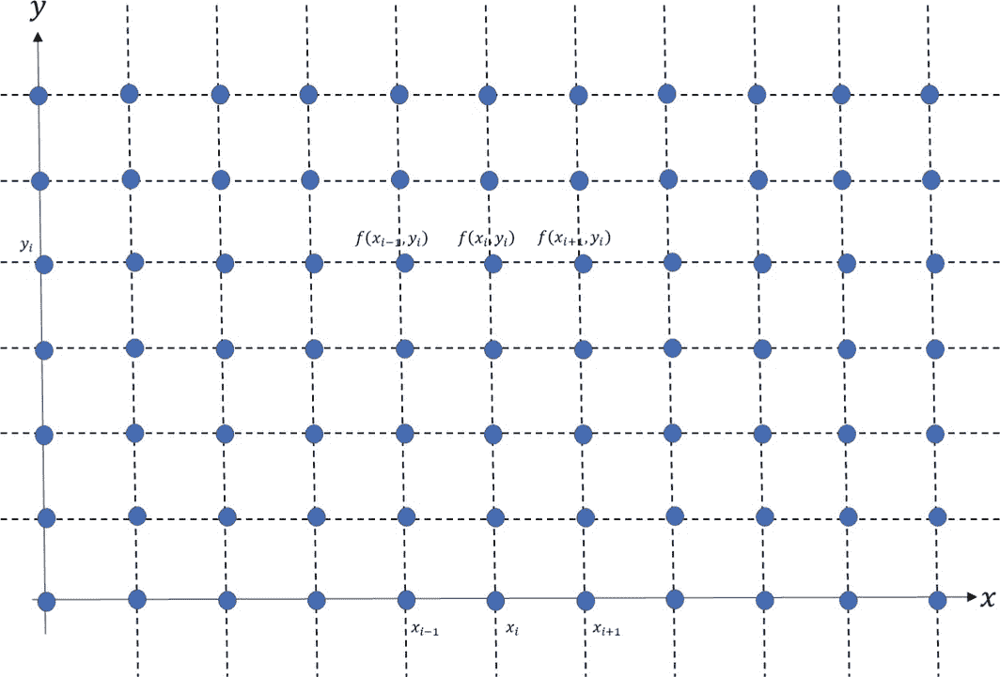

图 6-2

为 2D 函数域选择的等距节点网格

已知网格点上的所有函数值，泰勒展开给出了我们想要以代数方程(例如在显式方法中)或代数方程组(例如在像克兰克-梁君诺方法的隐式方法中)和误差项的形式计算的导数的表达式。有限差分是将微分问题转化为代数问题的近似数值解。数学概念直观，表达简单。

使用泰勒展开有许多方法来构造有限差分。基本有一阶前向差分、一阶后向差分、一阶中心差分、二阶中心差分等。也有显式方法，我们只需插入数字就可以得到结果，而隐式方法需要求解一个代数方程组才能得到结果。不同有限差分的误差可以是网格尺寸的一阶、二阶或高阶。

一元函数的一阶导数最简单，也最容易解释。它是函数在某一点的斜率。两点之间的斜率是两点之间的函数值变化δ*f*除以两点之差δ*x*的商。连接这两点的线称为两点间函数的*割线*(图 [6-3](img/#Fig3) 中的红线)。当一个点向另一个点移动时，割线移动。当一点完全移入与另一点重叠时(即两点成为同一点)，割线成为该点函数的切线(图 [6-3](#Fig3) 中的黑线)。切线的斜率定义为函数在接触点的斜率，因此是函数在该点的一阶导数。换句话说，一阶导数是当步长δ*x*取无穷小时的差的商。当δ*x*足够小时，商就是一阶导数的良好近似值。取决于我们如何选择这两个点，我们有不同的有限差分。


图 6-3

正向差异

### 远期差额

假设我们要计算 *f* 在 *x* <sub>0</sub> 的导数。考虑一个( *x* <sub>0</sub> ，*f*(*x*<sub>0</sub>)和(*x*<sub>0</sub>+*h*，*f*(*x*<sub>0</sub>+*h*)之间的线性插值。这两点之间割线的斜率近似于向前(两点)差的导数。

T31

我们可以用泰勒展开来说明这一点，如下所示:


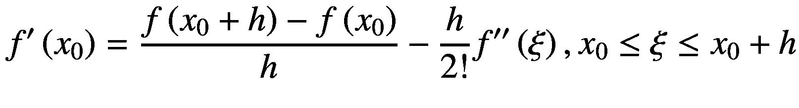


错误术语如下:


这里的大 O 符号意味着误差项总是小于(有界)一个常数乘以 *h* ，称为“T2 h 的大 O”换句话说，误差比常数乘以 *h* 更快地变为 0。 *h* 越小，误差越小。它们都以线性速率趋向于 0。误差项是一阶的。使用单步预测-校正方法求解常微分方程时，前向差分很有用。

### 向后差异

考虑(*x*<sub>0</sub>—*h*，*f*(*x*<sub>0</sub>—*h*)和( *x* <sub>0</sub> ，*f*(*x*<sub>0</sub>)之间不同的线性插值。这两点之间割线的斜率近似于导数，由后向(两点)差给出。见图 [6-4](#Fig4)

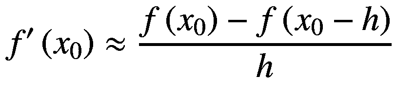

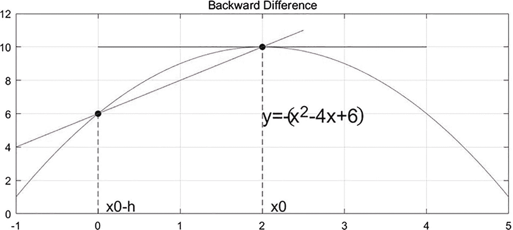

图 6-4

后向差分

从泰勒展开，我们有了这个:


误差项与正向差的误差项相同。

T2】

当未来的数据尚不可用时，向后差异很有用。在某些控制问题中，未来的数据可能依赖于根据过去的数据估计的导数。

### 6.2.3 中心差异

考虑(*x*<sub>0</sub>-*h*，*f*(*x*<sub>0</sub>-*h*)与(*x*<sub>0</sub>+*h*，*f*(*x*<sub>0</sub>+*这两点之间割线的斜率近似于中心(三点)差的导数。*

*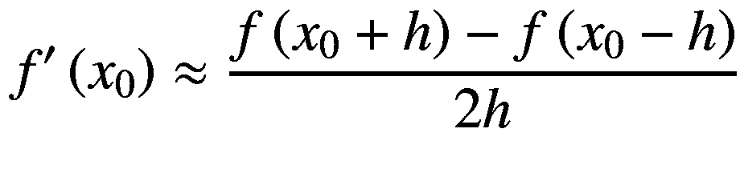*

见图 [6-5](#Fig5) 。


图 6-5

中心差异

从泰勒展开，我们有了这个:

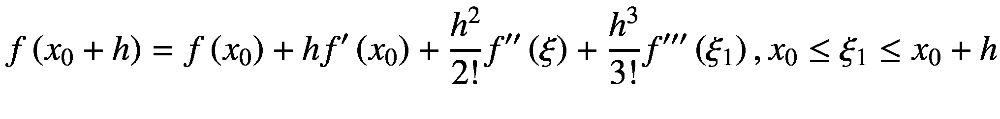


减去这两个方程，我们就有了这个:

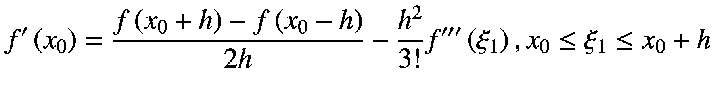

错误术语如下:

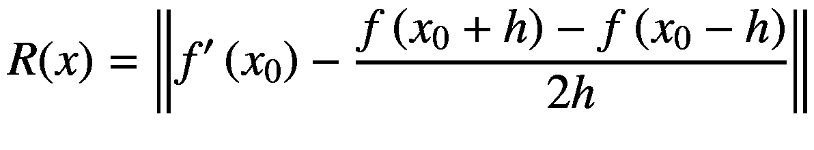

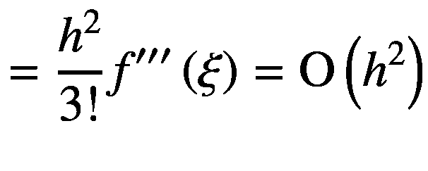

中心差有*h*T2】2 的 big-O 误差。这意味着误差二次趋近于 0，比线性更快。该误差项小于前向和后向差。中心差异比向前和向后差异更准确，因此，如果数据值在过去和将来都可用，则中心差异更可取。

对于前面的例子，我们想计算下面函数在 *x* = 2:

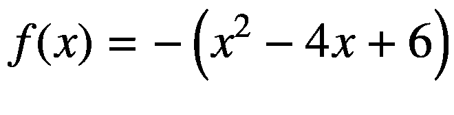

的一阶导数

向前差分给出负结果是因为割线向下倾斜，向后差分给出正结果是因为割线向上倾斜，中心差分说，这是正确答案。

如果数据值是等间距的，中心差是向前和向后差的平均值。中心差分常用于求解偏微分方程。

### 高阶导数

如果函数 *f* ( *x* )的一阶导数函数*f*'(*x*)也可微，则*f*<sup>'</sup>(*x*)的导数称为函数 *f* ( *x* )的二阶导数。即:

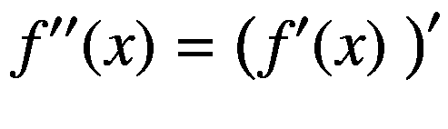

通过归纳，如果 *f* ( *x* )的(*n*—1)阶导数存在且可微，那么 *n* 阶导数定义如下:

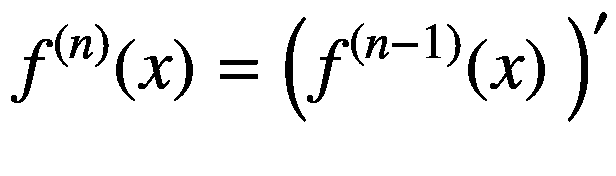

如果一个函数 *f* 是连续的，我们说 *f* ∈ *C* <sup>0</sup> 。如果*f*<sup>′</sup>存在且连续，我们说 *f* 是光滑函数*f*∈*C*<sup>1</sup>。如果 *f* 可以无限可微(因而一定是连续的)，我们说*f*∈*C*<sup>∞</sup>。*f*(*x*)=*e*<sup>*x*</sup>在 *C* <sup>∞</sup> 中。

接下来我们列出一些高阶导数的有限差分公式。

二阶导数向前差分:


二阶导数向后差分:


二阶导数中心差分:


三阶导数向前差分:


三阶导数向后差分:


三阶导数中心差分:

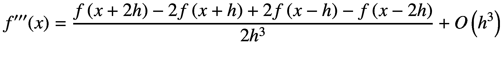

一般来说，我们有以下内容。

*n*-阶导数向前差分:

=\sum \limits_{i=0}^n{\left(-1\right)}^{n-i}\left(\begin{array}{c}n\\ {}i\end{array}\right)f\left(x+ ih\right) $$](img/500382_1_En_6_Chapter_TeX_Equy.png)

*n*-阶导数向后差分:

=\sum \limits_{i=0}^n{\left(-1\right)}^{n-i}\left(\begin{array}{c}n\\ {}i\end{array}\right)f\left(x- ih\right) $$](img/500382_1_En_6_Chapter_TeX_Equz.png)

*n*-阶导数中心差分:

=\sum \limits_{i=0}^n{\left(-1\right)}^{n-i}\left(\begin{array}{c}n\\ {}i\end{array}\right)f\left(x+\left(\frac{n}{2}-i\right)h\right) $$](img/500382_1_En_6_Chapter_TeX_Equaa.png)

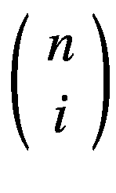是二项式系数。帕斯卡三角形的每一行都为 *i* 的每个值提供了系数。

到目前为止，我们提供的公式对二阶导数使用了两个点，对三阶导数使用了三个点。有些公式对二阶导数使用三个点，对三阶导数使用四个点。一般来说，使用线性代数，对于任何阶导数，可以构造有限差分近似，该有限差分近似利用评估点左侧的任意数量的点和右侧的(可能不同)数量的点。这包括求解线性系统，使得评估点周围的那些点的和的泰勒展开最好地逼近期望导数的泰勒展开。这有助于在网格上对函数进行微分，当接近网格边缘时，必须在一边采样越来越少的点。

在 NM Dev 中，类`FiniteDifference`计算给定阶的给定函数的导数函数。以下代码片段使用 NM Dev 计算前面示例的一阶导数:

```py
final UnivariateRealFunction f = new AbstractUnivariateRealFunction() {

    @Override
    public double evaluate(double x) {
        return -(x * x - 4 * x + 6); // -(x^2 - 4x + 6)
    }
};
double x = 2.;

System.out.println("differentiate univariate functions");

UnivariateRealFunction df1_forward
        = new FiniteDifference(f, 1, FiniteDifference.Type.FORWARD);
double dfdx = df1_forward.evaluate(x); // evaluate at x
System.out.println(String.format("df/dx(x=%f) = %.16f using forward difference", x, dfdx));

UnivariateRealFunction df1_backward
        = new FiniteDifference(f, 1, FiniteDifference.Type.BACKWARD);
dfdx = df1_backward.evaluate(x); // evaluate at x
System.out.println(String.format("df/dx(x=%f) = %.16f using backward difference", x, dfdx));

UnivariateRealFunction df1_central
        = new FiniteDifference(f, 1, FiniteDifference.Type.CENTRAL);
dfdx = df1_central.evaluate(x); // evaluate at x
System.out.println(String.format("df/dx(x=%f) = %.16f using central difference", x, dfdx));

```

解析地，一阶导数函数如下:


输出如下所示:

```py
df/dx(x=2.000000) = -0.0000000298023224 using forward difference
df/dx(x=2.000000) = 0.0000000298023224 using backward difference
df/dx(x=2.000000) = 0.0000000000000000 using central difference

```

请注意，正向差分结果略微为负，因为割线向下倾斜；因为割线是向下倾斜的，所以向后差分结果稍微为正。中心差给出正确答案，是 0。

解析地，二阶导数函数如下:


以下代码片段计算二阶导数:

```py
final UnivariateRealFunction f = new AbstractUnivariateRealFunction() {

    @Override
    public double evaluate(double x) {
        return -(x * x - 4 * x + 6); // -(x^2 - 4x + 6)
    }
};
double x = 2.;

System.out.println("differentiate univariate functions");

UnivariateRealFunction df1_forward
        = new FiniteDifference(f, 2, FiniteDifference.Type.FORWARD);
double dfdx = df1_forward.evaluate(x); // evaluate at x
System.out.println(String.format("d2f/dx2(x=%f) = %.16f using forward difference", x, dfdx));

UnivariateRealFunction df1_backward
        = new FiniteDifference(f, 2, FiniteDifference.Type.BACKWARD);
dfdx = df1_backward.evaluate(x); // evaluate at x
System.out.println(String.format("d2f/dx2(x=%f) = %.16f using backward difference", x, dfdx));

UnivariateRealFunction df1_central
        = new FiniteDifference(f, 2, FiniteDifference.Type.CENTRAL);
dfdx = df1_central.evaluate(x); // evaluate at x
System.out.println(String.format("d2f/d2x(x=%f) = %.16f using central difference", x, dfdx));

```

输出如下所示:

```py
d2f/dx2(x=2.000000) = -2.0000015520433827 using forward difference
d2f/dx2(x=2.000000) = -1.9999985243161564 using backward difference
d2f/d2x(x=2.000000) = -1.9999985243161564 using central difference

```

`FiniteDifference`对给定阶的给定函数的导函数进行数值计算。它本身就是一个函数。它可以用来计算任意给定点的导数。`FiniteDifference`的签名如下:

```py
/**
 * Constructs an approximate derivative function for <i>f</i> using finite
 * difference.
 *
 * @param f     a univariate function
 * @param order the order of the derivative
 * @param type  the type of finite difference to use, c.f., {@link Type}
 */
public FiniteDifference(UnivariateRealFunction f, int order, Type type)

@Override
public double evaluate(double x)

/**
 * Evaluates numerically the derivative of <i>f</i> at point <i>x</i>,
 * <i>f'(x)</i>, with step size <i>h</i>.
 * It could be challenging to automatically determine the step size
 * <i>h</i>, esp. when <i>|x|</i> is near 0.
 * It may, for example, require an analysis that involves <i>f'</i> and
 * <i>f''</i>.
 * The user may want to experiment with different <i>h</i>s by calling this
 * function.
 *
 * @param x the point to evaluate the derivative of <i>f</i> at
 * @param h step size
 * @return <i>f'(x)</i>, the numerical derivative of <i>f</i> at point
 * <i>x</i> with step size <i>h</i>
 */
public double evaluate(double x, double h)

```

支持的类型如下:

*   `FiniteDifference.FORWARD`

*   `FiniteDifference.BACKWARD`

*   `FiniteDifference.CENTRAL`

在实践中，当在计算机上使用浮点运算计算导函数时，一个重要的考虑是步长 *h* 的选择。如果 *h* 太小，减法将产生较大的舍入误差。在计算机上，只能表示有限数量的实数。这两个非常接近但不同的实数将由与有限二进制相同的浮点表示来表示。因此，所有有限差分公式都是病态的，并且如果 *h* 足够小，由于抵消将产生零值。另一方面，如果 *h* 太大，割线和切线不匹配，因此近似将关闭。对于基本的中心差分，最优步长是机器ε的立方根， *ε* 。对于在 *x* 和 *x* + *h* 处求值的数值导数公式，选择 *h* 小而不产生大的舍入误差为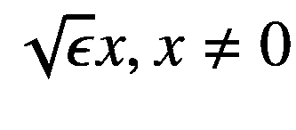。机器ε*ε*通常为 1e-16 数量级，用于双精度。如果你调用第一个`evaluate`函数，NM Dev 会为你选择一个 *h* 。或者，如果您调用第二个`evaluate`函数，您可以有自己的选择 *h* 的实现。

一般来说，对于有限差分，我们在计算导数时使用的点越多，它就越精确。此外，导数的阶数越高，它就越不精确。例如，近似二阶导数不如近似一阶导数精确，我们可以从前面的代码示例中看到这一点。

## 6.3 多元有限差分

多元函数的偏导数是在其他变量保持不变的情况下，其中一个变量的导数。比如一个二元函数关于 *x* 的偏导数写如下:

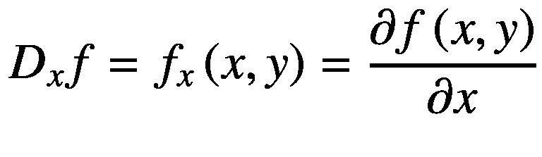

它们可以使用有限差分进行数值计算，就像第 [6.2](#Sec6) 节中的任何一元函数一样，除了我们在平面或更高维域上而不是在轴上施加网格。

关于 *x* 两次的二阶偏导数可以写成:


二阶混合偏导数是指我们先对一个变量求导，然后再对另一个变量求导。例如，先相对于 *x* 再相对于 *y* 的二阶混合偏导数可以写成:


高阶偏导数和混合导数是这样的:

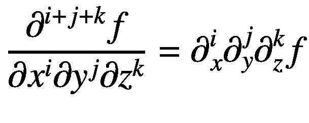

NM Dev 通过对函数递归应用一阶中心有限差分来计算这些导数。该类为`MultivariateFiniteDifference`，其签名如下:

```py
/**
 * Constructs the partial derivative of a multi-variable function.
 * For example,
 * <code>varidx = new int[]{1, 2}</code> means
 * \[
 * f_{x_1,x_2} = {\partial^2 \over \partial x_2 \partial x_1} = {\partial
 * \over \partial x_2}({\partial \over \partial x_1})
 * \]
 *
 * @param f      the real multivariate function to take derivative of
 * @param varidx the variable indices of the derivative, counting from 1 up
 *               to the domain dimension of <i>f</i>
 */
public MultivariateFiniteDifference(RealScalarFunction f, int[] varidx)

```

参数`varidx`获取变量的索引，类按照变量的顺序来区分函数。

下面举个例子:


这个函数的图形定义了欧几里得空间中的一个曲面。对于这个表面上的每一点，都有无限多条切线。偏导数是选择这些线中的一条并找出其斜率的行为。通常，最感兴趣的线是那些平行于 *xz* 平面的线(保持 *y* 不变)和那些平行于 *yz* 平面的线(保持 *x* 不变)。参见图 [6-6](#Fig6) 。


图 6-6

z = x <sup>2</sup> + xy + y <sup>2</sup> 的图形。对于(1，1)处的偏导数，保持 y 不变，相应的切线平行于 xz 平面

为了找到与(1，1)处的函数相切且平行于*xz*-平面的直线的斜率，我们将 *y* 视为常数。假设 *y* 为常数，通过求方程的导数，我们发现 *f* 在点( *x* ， *y* )的斜率如下:


见图 [6-7](#Fig7) 。


图 6-7

上图的一部分显示了 y = 1 时 xz 平面中的函数。请注意，这里显示的两个轴的比例不同。切线的斜率为 3

它在点(1，1)处的计算结果为 3。下面的代码片段解决了这个问题:

```py
// f = x^2 + xy + y^2
RealScalarFunction f = new AbstractBivariateRealFunction() {

    @Override
    public double evaluate(double x, double y) {
        return x * x + x * y + y * y;
    }
};

// df/dx = 2x + y
MultivariateFiniteDifference dx
        = new MultivariateFiniteDifference(f, new int[]{1});
System.out.println(String.format("Dxy(1.,1.) %f", dx.evaluate(new DenseVector(1., 1.))));

```

输出如下所示:

```py
Dxy(1.,1.) 3.000000

```

另一个多元函数微分的例子，考虑如下:


以下代码片段计算这两个混合偏导数:

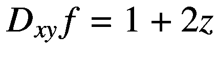


```py
// f = xy + 2xyz
RealScalarFunction f = new RealScalarFunction() {

    @Override
    public Double evaluate(Vector v) {
        return v.get(1) * v.get(2) + 2 * v.get(1) * v.get(2) * v.get(3);
    }

    @Override
    public int dimensionOfDomain() {
        return 3;
    }

    @Override
    public int dimensionOfRange() {
        return 1;
    }
};

MultivariateFiniteDifference dxy // 1 + 2z
        // differentiate the first variable and then the second one
        = new MultivariateFiniteDifference(f, new int[]{1, 2});
System.out.println(String.format("Dxy(1.,1.,1.) %f", dxy.evaluate(new DenseVector(1., 1., 1.))));
System.out.println(String.format("Dxy(-100.,0.,-1.5) %f", dxy.evaluate(new DenseVector(-100., 0., -1.5))));

//continuous function allows switching the order of differentiation by Clairaut's theorem
MultivariateFiniteDifference dyx // 1 + 2z
        // differentiate the second variable and then the first one
        = new MultivariateFiniteDifference(f, new int[]{2, 1});
System.out.println(String.format("Dyx(1.,1.,1.) %f", dyx.evaluate(new DenseVector(1., 1., 1.))));
System.out.println(String.format("Dyx(-100.,0.,-1.5) %f", dyx.evaluate(new DenseVector(-100., 0., -1.5))));

```

输出如下所示:

```py
Dxy(1.,1.,1.) 3.000001
Dxy(-100.,0.,-1.5) -2.000000
Dyx(1.,1.,1.) 3.000001
Dyx(-100.,0.,-1.5) -2.000000

```

### 梯度

有许多重要的和广泛使用的混合偏导数的向量和矩阵。它们是梯度向量、雅可比矩阵和海森矩阵。

多元实值函数 *f* 的梯度函数∇ *f* 是从 *ℝ* <sup>*n*</sup> 到 *ℝ* <sup>*n*</sup> 的向量值函数(或向量场)。取一个点***x***=(*x*<sub>1</sub>，⋯， *x* <sub>*n*</sub> )在*<sup>*n*</sup>中输出一个向量*<sup>*n*</sup>。在任一点的梯度，∇*f*(***x***)，都是一个矢量。它的组成部分是 *f* 在 ***x*** 处的偏导数。也就是**

**![$$ \nabla f\left(\boldsymbol{x}\right)=\left[\begin{array}{c}\frac{\partial f}{\partial {x}_1}\left(\boldsymbol{x}\right)\\ {}\vdots \\ {}\frac{\partial f}{\partial {x}_n}\left(\boldsymbol{x}\right)\end{array}\right] $$](img/500382_1_En_6_Chapter_TeX_Equam.png)**

 **每个分量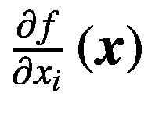是函数沿轴的偏导数，是该方向的变化率。梯度向量就像一元函数的一阶导数，斜率或正切。可以解释为上升最快的方向和速度。如果函数在 *** x *** 点的梯度不为零，那么梯度的方向就是函数从 *** x *** 增加最快的方向，梯度的大小就是那个方向的增加率，最大的绝对方向导数。此外，梯度是一个点的零向量当且仅当它是一个静止点(导数为零)。因此，梯度在最优化理论中起着基本的作用。我们将在第 [9](img/09.html) 章中看到，许多优化算法，如梯度下降，都使用了梯度。

作为一个例子，考虑一个房间，其中的温度由一个标量场 *T* 给出。即多元函数或字段取一个点( *x* 、 *y* 、 *z* )，给出一个温度值 *T* ( *x* 、 *y* 、 *z* )。在房间内的每一点，该点的 *T* 的梯度表示温度上升最快的方向，远离( *x* 、 *y* 、 *z* )。梯度的大小决定了温度在那个方向上升的速度。更一般地说，如果一个多元函数 *f* 是可微的，那么∇ *f* 与一个单位向量*vt31】之间的点积就是该函数在*vt35】方向上的斜率或变化率，称为 *f* 在*vt41】处的方向导数。泰勒展开的多元版本表明，函数的最佳线性近似可以用梯度来表示。***

***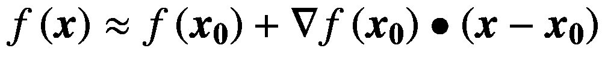***

***x*** 和***x***<sub>**0**</sub>都是在*<sup>*n*</sup>空间中的点。 *f* 贴图*ℝ*<sup>*n*</sup>→*ℝ*，以及∇*f*:*ℝ*<sup>*n*</sup>→*ℝ*<sup>*n*</sup>。最后一项的点积给出了一个实数。*

 *NM Dev 支持计算多元函数的梯度和梯度函数。等级为`Gradient`和`GradientFunction`。他们的签名如下:

```py
/**
 * Constructs the gradient vector for a multivariate function <i>f</i> at
 * point <i>x</i>.
 *
 * @param f a multivariate function
 * @param x the point to evaluate the gradient of <i>f</i> at
 */
public Gradient(RealScalarFunction f, Vector x)

/**
 * Constructs the gradient function of a real scalar function <i>f</i>.
 *
 * @param f a real scalar function
 */
public GradientFunction(RealScalarFunction f)

```

考虑这个函数，例如:


参见图 [6-8](#Fig8) 。


图 6-8

2D 函数 f(x，y)= xe<sup>(x2+y2)</sup>的梯度在该函数的伪彩色图上绘制为蓝色箭头

以下代码计算函数的渐变和渐变函数:

```py
// f = x * exp(-(x^2 + y^2))
RealScalarFunction f = new AbstractBivariateRealFunction() {

    @Override
    public double evaluate(double x, double y) {
        return x * exp(-(x * x + y * y));
    }
};

Vector x1 = new DenseVector(0., 0.);
Vector g1_0 = new Gradient(f, x1);
System.out.println(String.format("gradient at %s = %s", x1, g1_0));

GradientFunction df = new GradientFunction(f);
Vector g1_1 = df.evaluate(x1);
System.out.println(String.format("gradient at %s = %s", x1, g1_1));

Vector x2 = new DenseVector(-1., 0.);
Vector g2 = df.evaluate(x2);
System.out.println(String.format("gradient at %s = %s", x2, g2));

Vector x3 = new DenseVector(1., 0.);
Vector g3 = df.evaluate(x3);
System.out.println(String.format("gradient at %s = %s", x3, g3));

```

输出如下所示:

```py
gradient at [0.000000, 0.000000]  = [1.000000, 0.000000]
gradient at [0.000000, 0.000000]  = [1.000000, 0.000000]
gradient at [-1.000000, 0.000000]  = [-0.367879, 0.000000]
gradient at [1.000000, 0.000000]  = [-0.367879, 0.000000]

```

考虑另一个函数，这里显示:

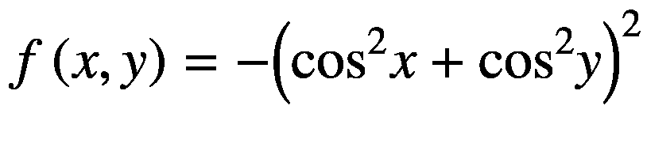

参见图 [6-9](#Fig9) 。


图 6-9

函数 f(x，y)=(cos<sup>2</sup>x+cos<sup>2</sup>y)<sup>2</sup>的梯度被描绘为底部平面上的投影矢量场

以下代码计算函数的渐变和渐变函数:

```py
// f = -((cos(x))^2 + (cos(y))^2)^2
RealScalarFunction f = new AbstractBivariateRealFunction() {

    @Override
    public double evaluate(double x, double y) {
        double z = cos(x) * cos(x);
        z += cos(y) * cos(y);
        z = -z * z;
        return z;
    }
};

Vector x1 = new DenseVector(0., 0.);
Vector g1_0 = new Gradient(f, x1);
System.out.println(String.format("gradient at %s = %s", x1, g1_0));

GradientFunction df = new GradientFunction(f);
Vector g1_1 = df.evaluate(x1);
System.out.println(String.format("gradient at %s = %s", x1, g1_1));

Vector x2 = new DenseVector(-1., 0.);
Vector g2 = df.evaluate(x2);
System.out.println(String.format("gradient at %s = %s", x2, g2));

Vector x3 = new DenseVector(1., 0.);
Vector g3 = df.evaluate(x3);
System.out.println(String.format("gradient at %s = %s", x3, g3));

```

输出如下所示:

```py
gradient at [0.000000, 0.000000]  = [0.000000, 0.000000]
gradient at [0.000000, 0.000000]  = [0.000000, 0.000000]
gradient at [-1.000000, 0.000000]  = [-2.349491, 0.000000]
gradient at [1.000000, 0.000000]  = [2.349491, 0.000000]

```

### 雅可比矩阵

当我们将单个变量的标量值函数的导数推广到多个变量的标量值函数的梯度时，我们可以进一步将概念推广到多个变量的向量值函数。假设我们有一个向量值函数***f***:ℝ<sup>*n*</sup>→ℝ<sup>→m</sup>，它取ℝ<sup>*n*</sup>***x***=(*x*t21， *x* <sub>*n* ***f*** 的雅可比矩阵定义为一个 *m* × *n* 矩阵，记为 ***J*** ，其( *i* ，*J*)-第项如下:</sub>


或者明确地，

![$$ \boldsymbol{J}=\left[\frac{\partial \boldsymbol{f}}{\partial {x}_1}\cdots \frac{\partial \boldsymbol{f}}{\partial {x}_n}\right] $$](img/500382_1_En_6_Chapter_TeX_Equar.png)

![$$ =\left[\begin{array}{c}{\nabla}^T{f}_1\\ {}\vdots \\ {}{\nabla}^T{f}_m\end{array}\right] $$](img/500382_1_En_6_Chapter_TeX_Equas.png)

![$$ =\left[\begin{array}{ccc}\frac{\partial {f}_1}{\partial {x}_1}&amp; \cdots &amp; \frac{\partial {f}_1}{\partial {x}_n}\\ {}\vdots &amp; \ddots &amp; \vdots \\ {}\frac{\partial {f}_m}{\partial {x}_1}&amp; \cdots &amp; \frac{\partial {f}_m}{\partial {x}_n}\end{array}\right] $$](img/500382_1_En_6_Chapter_TeX_Equat.png)

∇<sup>*t*</sup>*f*<sub>*I*</sub>是第 *i* 个分量的渐变的转置(行向量)。

雅可比矩阵是其所有一阶偏导数的矩阵。它代表*fT3 在*T5】fT7】可微的每一点的微分。它是 ***f*** 在 ***x*** 的一个邻域内变化的最佳线性近似。即***f***(***y***)对所有点**y***x***的最佳线性逼近。我们有这个版本的泰勒展开:****

****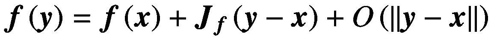****

 **误差项比 ***y*** 和 ***x*** 之间的距离更快地趋近于零，正如 ***y*** 趋近于 ***x*** 一样。在这个意义上，雅可比矩阵可以被看作是一种多元向量值函数的“一阶导数”。

如果 *m* = *n* ，那么*f*是ℝ <sup>*n*</sup> 到自身的函数，雅可比矩阵是方阵。然后我们可以计算它的行列式，称为雅可比行列式。雅可比行列式有时也简称为“雅可比行列式”给定点的雅可比行列式给出了关于该点附近 ***f*** 的局部行为的重要信息。比如反函数定理说连续可微函数 ***f*** 在点***x∈***ℝ<sup>***n***</sup>附近可逆，如果在 ***x*** 的雅可比行列式不为零。再者，如果 ***x*** 处的雅可比行列式为正，则 ***f*** 保留 ***x*** 附近的方位；如果为负， ***f*** 反转方向。雅可比行列式在 ***x*** 处的绝对值给出了函数 ***f*** 在 ***x*** 附近扩大或缩小体积的因子。

NM Dev 支持计算多元向量值函数的雅可比和雅可比函数。等级为`Jacobian`和`JacobianFunction`。他们的签名如下:

```py
/**
 * Constructs the Jacobian matrix for a multivariate function <i>f</i> at
 * point <i>x</i>.
 *
 * @param f a multivariate function
 * @param x the point to evaluate the Jacobian matrix at
 */
public Jacobian(RealVectorFunction f, Vector x)

/**
 * Constructs the Jacobian matrix for a multivariate function <i>f</i> at
 * point <i>x</i>.
 *
 * @param f a multivariate function in the form of an array of univariate
 *          functions
 * @param x the point to evaluate the Jacobian matrix at
 */
public Jacobian(final RealScalarFunction[] f, Vector x)

/**
 * Constructs the Jacobian matrix for a multivariate function <i>f</i> at
 * point <i>x</i>.
 *
 * @param f a multivariate function in the form of a list of univariate
 *          functions
 * @param x the point to evaluate the Jacobian matrix at
 */
public Jacobian(final List<RealScalarFunction> f, Vector x)

/**
 * Constructs the Jacobian function of a real scalar function <i>f</i>.
 *
 * @param f a real scalar function
 */
public JacobianFunction(RealVectorFunction f

```

在 NM Dev 中，多元向量值函数可以用一个`RealVectorFunction`、一个`RealScalarFunction`数组或者一个`RealScalarFunction`列表来表示。

考虑这个函数***f***:ℝ<sup>2</sup>→ℝ<sup>2</sup>。

![$$ \boldsymbol{F}\left(\left[\begin{array}{c}x\\ {}y\end{array}\right]\right)=\left[\begin{array}{c}{f}_1\left(x,y\right)\\ {}{f}_2\left(x,y\right)\end{array}\right]=\left[\begin{array}{c}{x}^2y\\ {}5x+\sin y\end{array}\right] $$](img/500382_1_En_6_Chapter_TeX_Equav.png)

雅可比如下:

![$$ {\boldsymbol{J}}_{\boldsymbol{F}}\left(x,y\right)=\left[\begin{array}{cc}\frac{\partial {f}_1}{\partial x}&amp; \frac{\partial {f}_1}{\partial y}\\ {}\frac{\partial {f}_2}{\partial x}&amp; \frac{\partial {f}_2}{\partial y}\end{array}\right]=\left[\begin{array}{cc}2 xy&amp; {x}^2\\ {}5&amp; \cos y\end{array}\right] $$](img/500382_1_En_6_Chapter_TeX_Equaw.png)

雅可比行列式如下:


下面的代码解决了这个示例:

```py
RealVectorFunction F = new RealVectorFunction() {
    @Override
    public Vector evaluate(Vector v) {
        double x = v.get(1);
        double y = v.get(2);

        double f1 = x * x * y;
        double f2 = 5\. * x + sin(y);

        return new DenseVector(f1, f2);
    }

    @Override
    public int dimensionOfDomain() {
        return 2;
    }

    @Override
    public int dimensionOfRange() {
        return 2;
    }
};

Vector x0 = new DenseVector(0., 0.);
Matrix J00 = new Jacobian(F, x0);
System.out.println(String.format(
        "the Jacobian at %s = %s, the det = %f",
        x0,
        J00,
        MatrixMeasure.det(J00)));

RntoMatrix J = new JacobianFunction(F); // [2xy, x^2], [5, cosy]
Matrix J01 = J.evaluate(x0);
System.out.println(String.format(
        "the Jacobian at %s = %s, the det = %f",
        x0,
        J01,
        MatrixMeasure.det(J01)));

Vector x1 = new DenseVector(1., PI);
Matrix J1 = J.evaluate(x1);
System.out.println(String.format(
        "the Jacobian at %s = %s, the det = %f",
        x1,
        J1,
        MatrixMeasure.det(J1)));

```

输出如下所示:

```py
the Jacobian at [0.000000, 0.000000]  = 2x2
       [,1] [,2]
[1,] 0.000000, 0.000000,
[2,] 5.000000, 1.000000, , the det = 0.000000
the Jacobian at [0.000000, 0.000000]  = 2x2
        [,1] [,2]
[1,] 0.000000, 0.000000,
[2,] 5.000000, 1.000000, , the det = 0.000000
the Jacobian at [1.000000, 3.141593]  = 2x2
        [,1] [,2]
[1,] 6.283185, 1.000000,
[2,] 5.000000, -1.000000, , the det = -11.283185

```

考虑这个函数***f***:ℝ<sup>3</sup>→ℝ<sup>3</sup>:

![$$ \boldsymbol{F}\left(\left[\begin{array}{c}{x}_1\\ {}{x}_2\\ {}{x}_3\end{array}\right]\right)=\left[\begin{array}{c}5{x}_2\\ {}4{x_1}^2-2\sin \left({x}_2{x}_3\right)\\ {}{x}_2{x}_3\end{array}\right] $$](img/500382_1_En_6_Chapter_TeX_Equay.png)

雅可比如下:

![$$ {\boldsymbol{J}}_{\boldsymbol{F}}\left(x,y\right)=\left[\begin{array}{ccc}0&amp; 5&amp; 0\\ {}8{x}_1&amp; -2{x}_3\cos \left({x}_2{x}_3\right)&amp; -2{x}_2\cos \left({x}_2{x}_3\right)\\ {}0&amp; {x}_3&amp; {x}_2\end{array}\right] $$](img/500382_1_En_6_Chapter_TeX_Equaz.png)

雅可比行列式如下:

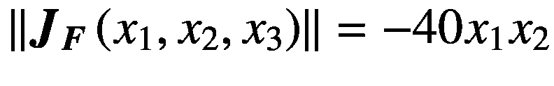

下面的代码解决了这个示例:

```py
RealVectorFunction F = new RealVectorFunction() {
    @Override
    public Vector evaluate(Vector v) {
        double x1 = v.get(1);
        double x2 = v.get(2);
        double x3 = v.get(3);

        double f1 = 5\. * x2;
        double f2 = 4\. * x1 * x1 - 2\. * sin(x2 * x3);
        double f3 = x2 * x3;

        return new DenseVector(f1, f2, f3);
    }

    @Override
    public int dimensionOfDomain() {
        return 3;
    }

    @Override
    public int dimensionOfRange() {
        return 3;
    }
};

Vector x0 = new DenseVector(0., 0., 1.);
RntoMatrix J = new JacobianFunction(F);
Matrix J0 = J.evaluate(x0);
System.out.println(String.format(
        "the Jacobian at %s = %s, the det = %f",
        x0,
        J0,
        MatrixMeasure.det(J0)));

Vector x1 = new DenseVector(1., 2., 3.);
Matrix J1 = J.evaluate(x1);
System.out.println(String.format(
        "the Jacobian at %s = %s, the det = %f",
        x1,
        J1,
        MatrixMeasure.det(J1)));

```

输出如下所示:

```py
the Jacobian at [0.000000, 0.000000, 1.000000]  = 3x3
        [,1] [,2] [,3]
[1,] 0.000000, 5.000000, 0.000000,
[2,] 0.000000, -2.000000, 0.000000,
[3,] 0.000000, 1.000000, 0.000000, , the det = 0.000000
the Jacobian at [1.000000, 2.000000, 3.000000]  = 3x3
        [,1] [,2] [,3]
[1,] 0.000000, 5.000000, 0.000000,
[2,] 8.000000, -5.761022, -3.840681,
[3,] 0.000000, 3.000000, 2.000000, , the det = -80.000000

```

由此我们看到 ***F*** 在 *x* <sub>1</sub> 和 *x* <sub>2</sub> 具有相同符号的那些点附近反转方向。除了在 *x* <sub>1</sub> = 0 或 *x* <sub>2</sub> = 0 的点附近，该函数在任何地方都是局部可逆的。直观地说，如果从点(1，2，3)周围的一个小对象开始，并将 ***F*** 应用于该对象，将得到一个体积大约为原始对象的 40 × 1 × 2 = 80 倍的结果对象，并且方向相反。

### 黑森

我们可以把一元函数的二阶导数的概念推广到多元实值函数。首先我们计算标量函数的梯度(在某种意义上取一阶导数)。然后我们计算梯度函数的雅可比(在某种意义上取二阶导数)。我们称之为海森矩阵的雅可比矩阵。Hessian 是标量值函数或标量场的二阶偏导数的方阵。它描述了多元函数的局部曲率。也就是


具体来说，假设*f*:ℝ<sup>T3】nt5)→ℝ.如果 *f* 的所有二阶偏导数都存在并且在函数的定义域上连续，那么 *f* 的 Hessian 矩阵 ***H*** 就是一个正方形 *n* × *n* 矩阵，通常定义和排列如下:</sup>

![$$ {\boldsymbol{H}}_f=\left[\begin{array}{cccc}\frac{\partial^2f}{\partial {x}_1^2}&amp; \frac{\partial^2f}{\partial {x}_1\partial {x}_2}&amp; \cdots &amp; \frac{\partial^2f}{\partial {x}_1\partial {x}_n}\\ {}\frac{\partial^2f}{\partial {x}_2\partial {x}_1}&amp; \frac{\partial^2f}{\partial {x}_2^2}&amp; \cdots &amp; \frac{\partial^2f}{\partial {x}_2\partial {x}_n}\\ {}\vdots &amp; \vdots &amp; \ddots &amp; \vdots \\ {}\frac{\partial^2f}{\partial {x}_n\partial {x}_1}&amp; \frac{\partial^2f}{\partial {x}_n\partial {x}_2}&amp; \cdots &amp; \frac{\partial^2f}{\partial {x}_n^2}\end{array}\right] $$](img/500382_1_En_6_Chapter_TeX_Equbc.png)

简而言之，我们有以下:


Hessian 矩阵是对称矩阵。二阶导数连续的假设意味着微分的顺序无关紧要(根据 Clairaut 定理)。海森矩阵的行列式称为海森行列式。Hessian 矩阵用于在牛顿型方法中解决优化问题，因为它们是函数的局部泰勒展开的二次项的系数。也就是


我们将在第 [11](11.html) 章中讨论更多关于在优化中使用 Hessian 矩阵的内容。

NM Dev 支持计算多元实值函数的 Hessian 和 Hessian 函数。等级为`Hessian`和`HessianFunction`。他们的签名如下:

```py
/**
 * Constructs the Hessian matrix for a multivariate function <i>f</i> at
 * point <i>x</i>.
 *
 * @param f a multivariate function
 * @param x the point to evaluate the Hessian of <i>f</i> at
 */
public Hessian(RealScalarFunction f, Vector x)

/**
 * Constructs the Hessian function of a real scalar function <i>f</i>.
 *
 * @param f a real scalar function
 */
public HessianFunction(RealScalarFunction f)

```

以下示例代码计算了 *f* ( *x* ， *y* ) = *xy* 的 Hessian 矩阵和 Hessian 函数:

```py
RealScalarFunction f = new AbstractBivariateRealFunction() {
    @Override
    public double evaluate(double x, double y) {
        return x * y; // f = xy
    }
};

Vector x1 = new DenseVector(1., 1.);
Hessian H1 = new Hessian(f, x1);
System.out.println(String.format(
        "the Hessian at %s = %s, the det = %f",
        x1,
        H1,
        MatrixMeasure.det(H1)));

Vector x2 = new DenseVector(0., 0.);
Hessian H2 = new Hessian(f, x2);
System.out.println(String.format(
        "the Hessian at %s = %s, the det = %f",
        x2,
        H2,
        MatrixMeasure.det(H2)));

RntoMatrix H = new HessianFunction(f);
Matrix Hx1 = H.evaluate(x1);
System.out.println(String.format(
        "the Hessian at %s = %s, the det = %f",
        x1,
        Hx1,
        MatrixMeasure.det(Hx1)));
Matrix Hx2 = H.evaluate(x2);
System.out.println(String.format(
        "the Hessian at %s = %s, the det = %f",
        x2,
        Hx2,
        MatrixMeasure.det(Hx2)));

```

输出如下所示:

```py
the Hessian at [1.000000, 1.000000]  = 2x2
        [,1] [,2]
[1,] 0.000000, 1.000000,
[2,] 1.000000, 0.000000, , the det = -0.999999
the Hessian at [0.000000, 0.000000]  = 2x2
        [,1] [,2]
[1,] 0.000000, 1.000000,
[2,] 1.000000, 0.000000, , the det = -1.000000
the Hessian at [1.000000, 1.000000]  = 2x2
        [,1] [,2]
[1,] 0.000000, 1.000000,
[2,] 1.000000, 0.000000, , the det = -0.999999
the Hessian at [0.000000, 0.000000]  = 2x2
        [,1] [,2]
[1,] 0.000000, 1.000000,
[2,] 1.000000, 0.000000, , the det = -1.000000

```

## 6.4 Ridders 方法

Ridders 的方法通过外推一系列近似来改进有限差分的估计。为了计算数值导数，我们首先使用一系列递减的步长来计算一系列的近似值。Ridders 的方法然后使用 Neville 的算法将步长外推至零。一般来说，它比简单的(一次)有限差分法具有更高的精度。

初始步长的选择 *h* <sub>0</sub> 非常关键。如果*h*T6】0 太大，计算出的值可能不准确。如果 *h* <sub>0</sub> 太小，由于舍入误差，我们可能会针对不同的步长反复计算“相同”的值。

以下代码片段比较了通过 Ridder 方法和简单有限差分计算的对数函数在 *x* = 0.5 时的前九阶导数。

```py
UnivariateRealFunction f = new AbstractUnivariateRealFunction() {
    @Override
    public double evaluate(double x) {
        return log(x);
    }
};

double x = 0.5;
for (int order = 1; order < 10; ++order) {
    FiniteDifference fd = new FiniteDifference(f, order, FiniteDifference.Type.CENTRAL);
    Ridders ridder = new Ridders(f, order);
    System.out.println(String.format(
            "%d-nd order derivative by Rideer @ %f = %.16f", order, x, ridder.evaluate(x)));
    System.out.println(String.format(
            "%d-nd order derivative by FD @ %f = %.16f", order, x, fd.evaluate(x)));
}

```

输出如下所示:

```py
1-nd order derivative by Rideer @ 0.500000 = 2.0000000000000000
1-nd order derivative by FD @ 0.500000 = 2.0000000000000000
2-nd order derivative by Rideer @ 0.500000 = -4.0000004374066640
2-nd order derivative by FD @ 0.500000 = -4.0000031040867650
3-nd order derivative by Rideer @ 0.500000 = 16.0000016378464240
3-nd order derivative by FD @ 0.500000 = 16.0002441406250000
4-nd order derivative by Rideer @ 0.500000 = -95.9999555891298100
4-nd order derivative by FD @ 0.500000 = -95.9874881885177200
5-nd order derivative by Rideer @ 0.500000 = 767.9383982440593000
5-nd order derivative by FD @ 0.500000 = 767.5675271157362000
6-nd order derivative by Rideer @ 0.500000 = -7681.9174458835320000
6-nd order derivative by FD @ 0.500000 = -7686.1197112745450000
7-nd order derivative by Rideer @ 0.500000 = 92116.9184885280300000
7-nd order derivative by FD @ 0.500000 = 92428.4022426225400000
8-nd order derivative by Rideer @ 0.500000 = -1290356.2663459945000000
8-nd order derivative by FD @ 0.500000 = -1300812.8634378603000000
9-nd order derivative by Rideer @ 0.500000 = 20941653.5495638000000000
9-nd order derivative by FD @ 0.500000 = 21347177.7802486680000000

```

前四阶的分析结果正好是 2、-4、16 和-96。我们可以看到，Ridder 的方法给出了更好的精度，特别是对于高阶导数，这对于有限差分来说是典型的挑战。

Ridder 的方法也适用于多元函数。以下示例将 Ridder 的方法与第 [6.3](#Sec7) 节中示例的有限差分进行了比较。

```py
// f = xy + 2xyz
RealScalarFunction f = new RealScalarFunction() {

    @Override
    public Double evaluate(Vector v) {
        return v.get(1) * v.get(2) + 2 * v.get(1) * v.get(2) * v.get(3);
    }

    @Override
    public int dimensionOfDomain() {
        return 3;
    }

    @Override
    public int dimensionOfRange() {
        return 1;
    }
};

Ridders dxy_ridder = new Ridders(f, new int[]{1, 2});
MultivariateFiniteDifference dxy // 1 + 2z
        // differentiate the first variable and then the second one
        = new MultivariateFiniteDifference(f, new int[]{1, 2});
Vector x0 = new DenseVector(1., 1., 1.);
System.out.println(String.format("Dxy(%s) by Ridder = %.16f", x0, dxy_ridder.evaluate(x0)));
System.out.println(String.format("Dxy(%s) by FD =  %.16f", x0, dxy.evaluate(x0)));
Vector x1 = new DenseVector(-100., 0., -1.5);
System.out.println(String.format("Dxy(%s) by FD = %.16f", x1, dxy_ridder.evaluate(x1)));
System.out.println(String.format("Dxy(%s) by FD = %.16f", x1, dxy.evaluate(x1)));

//continuous function allows switching the order of differentiation by Clairaut's theorem
Ridders dyx_ridder = new Ridders(f, new int[]{2, 1});
MultivariateFiniteDifference dyx // 1 + 2z
        // differentiate the second variable and then the first one
        = new MultivariateFiniteDifference(f, new int[]{2, 1});
System.out.println(String.format("Dyx(%s) by Ridder = %.16f", x0, dyx_ridder.evaluate(x0)));
System.out.println(String.format("Dyx(%s) by FD = %.16f", x0, dyx.evaluate(x0)));
System.out.println(String.format("Dyx(%s) by Ridder = %.16f", x1, dyx_ridder.evaluate(x1)));
System.out.println(String.format("Dyx(%s) by FD = %.16f", x1, dyx.evaluate(x1)));

```

输出如下:

```py
Dxy([1.000000, 1.000000, 1.000000] ) by Ridder = 2.9999999941935465
Dxy([1.000000, 1.000000, 1.000000] ) by FD =  3.0000013187575885
Dxy([-100.000000, 0.000000, -1.500000] ) by FD = -2.0000000000032907
Dxy([-100.000000, 0.000000, -1.500000] ) by FD = -1.9999999999865270
Dyx([1.000000, 1.000000, 1.000000] ) by Ridder = 2.9999999941935465
Dyx([1.000000, 1.000000, 1.000000] ) by FD = 3.0000013187575885
Dyx([-100.000000, 0.000000, -1.500000] ) by Ridder = -2.0000000000044610
Dyx([-100.000000, 0.000000, -1.500000] ) by FD = -1.9999999999748960

```

分析结果分别为 3 和-2。我们看到 Ridder 方法给出了比有限差分更好的精度。

## 6.5 特殊函数的导数函数

NM Dev 支持许多特殊函数及其一阶导数函数。特殊函数是通常不能使用有限数量的初等函数来计算的函数，例如有限数量的多项式、有理函数、三角函数和指数函数及其反函数的和、积和/或合成。它们的导函数也是如此。由于它们在许多应用中的重要性，例如统计中的高斯函数，我们必须精确计算这些函数。我们不能承受使用有限差分的不精确性。有特殊的技巧来计算特殊的函数，如连分数。NM Dev 支持的特殊函数及其一阶导数函数有高斯、误差、贝塔、正则化不完全贝塔、伽玛。

### 高斯导数函数

高斯函数定义如下:

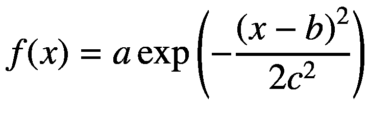

计算高斯函数的类是`Gaussian`，它的签名如下:

```py
/**
 * Constructs an instance of the Gaussian function.
 *
 * @param a <i>a</i>
 * @param b <i>b</i>
 * @param c <i>c</i>
 */
public Gaussian(double a, double b, double c)

```

计算高斯函数的导函数的类是`DGaussian`，其签名如下:

```py
/**
 * Construct the derivative function of a Gaussian function.
 *
 * @param phi a {@link Gaussian} function
 */
public DGaussian(Gaussian phi)

```

这里有一个例子:

```py
Gaussian G = new Gaussian(1., 0., 1.); // standard Gaussian
DGaussian dG = new DGaussian(G);
double x = -0.5;
System.out.println(String.format("dG/dx(%f) = %f", x, dG.evaluate(x)));
x = 0;
System.out.println(String.format("dG/dx(%f) = %f", x, dG.evaluate(x)));
x = 0.5;
System.out.println(String.format("dG/dx(%f) = %f", x, dG.evaluate(x)));

```

输出如下所示:

```py
dG/dx(-0.500000) = 0.176033
dG/dx(0.000000) = -0.000000
dG/dx(0.500000) = -0.176033

```

### 误差导数函数

误差函数定义如下:

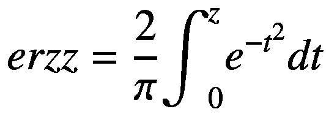

计算误差函数的类是`Erf`。计算误差函数的导函数的类是`DErf`。这两个类都从`AbstractUnivariateRealFunction`继承了`evaluate(double x)`。它们的构造函数不接受任何参数。

这里有一个例子:

```py
double z = 0.5;
Erf E = new Erf();
DErf dE = new DErf();
System.out.println(String.format("erf(%f) = %f", z, E.evaluate(z)));
System.out.println(String.format("dErf/dz(%f) = %f", z, dE.evaluate(z)));

```

输出如下所示:

```py
erf(0.500000) = 0.520500
dErf/dz(0.500000) = 0.878783

```

### 6 . 5 . 3β导数函数

贝塔函数也被称为第一类欧拉积分。它被定义为，对于任何实数， *x* ， *y* > 0。

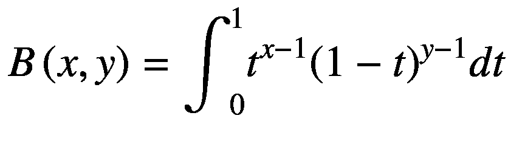

计算贝塔函数的类是`Beta`。计算 Beta 函数的导函数的类是`DBeta`。这两个类都从`AbstractBivariateRealFunction`继承了`evaluate(double x, double y)`。它们的构造函数不接受任何参数。

这里有一个例子:

```py
double x = 1.5;
double y = 2.5;
Beta B = new Beta();
DBeta dB = new DBeta();
System.out.println(String.format("Beta(%f) = %f", x, B.evaluate(x, y)));
System.out.println(String.format("dBeta/dz(%f) = %f", x, dB.evaluate(x, y)));

```

输出如下所示:

```py
Beta(1.500000) = 0.196350
dBeta/dz(1.500000) = -0.239473

```

### 6.5.4 正则化的不完全β导数函数

不完全贝塔函数，贝塔函数的推广，定义如下:


当 *x* = 1 时，不完全贝塔函数与完全贝塔函数重合。

正则不完全 beta 函数(或简称正则 beta 函数)是由不完全 beta 函数和完全 beta 函数定义的。

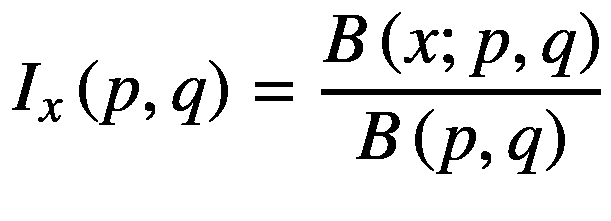T2】

正则化的不完全贝塔函数是贝塔分布的累积分布函数。

计算正则化不完全 beta 函数的类是`BetaRegularized`，其签名如下:

```py
/**
 * Constructs an instance of <i>I<sub>x</sub>(p,q)</i> with the parameters
 * <i>p</i> and <i>q</i>.
 *
 * @param p <i>p > 0</i>, the shape parameter
 * @param q <i>q > 0</i>, the shape parameter
 */
public BetaRegularized(final double p, final double q)

```

计算正则化不完全 beta 函数的导函数的类是`DBetaRegularized`，其签名如下:

```py
/**
 * Constructs the derivative function of the Regularized Incomplete Beta
 * function, {@link BetaRegularized}.
 *
 * @param p the shape parameter
 * @param q the shape parameter
 */
public DBetaRegularized(double p, double q)

```

这里有一个例子:

```py
double p = 0.5;
double q = 2.5;
BetaRegularized I = new BetaRegularized(p, q);
DBetaRegularized dI = new DBetaRegularized(p, q);

double x = 1.;
System.out.println(String.format("BetaRegularized(%f) = %f", x, I.evaluate(x)));
System.out.println(String.format("dBetaRegularized/dz(%f) = %f", x, dI.evaluate(x)));

```

输出如下所示:

```py
BetaRegularized(1.000000) = 1.000000
dBetaRegularized/dz(1.000000) = 0.000000

```

### 伽马导数函数

Gamma 函数是 factorial 函数对实数和复数的扩展，其参数下移 1。对于实数，定义如下:

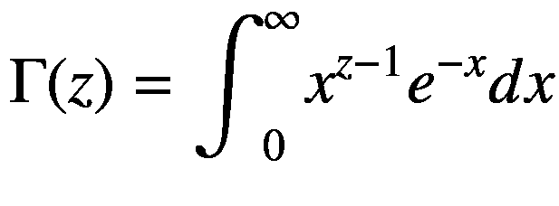

计算伽马函数的类是`Gamma`。计算伽马函数的导函数的类是`DGamma`。这两个类都从`AbstractUnivariateRealFunction`继承了`evaluate(double x)`。它们的构造函数不接受任何参数。NM Dev 有很多 Gamma 函数的实现。它们在准确性和性能方面具有不同的属性。默认选择是 Lanczos 算法，这样所有的计算都使用`double`来完成。

这里有一个例子:

```py
double z = 0.5;
// <a href="http://en.wikipedia.org/wiki/Lanczos_approximation">Wikipedia: Lanczos approximation</a>
Gamma G = new GammaLanczosQuick();
DGamma dG = new DGamma();
System.out.println(String.format("Gamma(%f) = %f", z, G.evaluate(z)));
System.out.println(String.format("dGamma/dz(%f) = %f", z, dG.evaluate(z)));

```

输出如下所示:

```py
Gamma(0.500000) = 1.772454
dGamma/dz(0.500000) = -3.480231

```

### 多项式导数函数

多项式不完全是一个特殊的函数。我们在这里包括它是因为 NM Dev 不使用有限差分来计算多项式的导函数。多项式微分有一个封闭解。


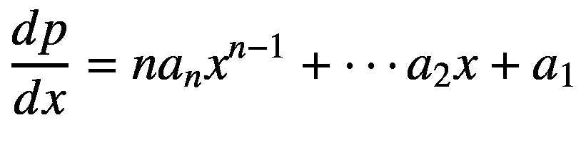

计算多项式的类是`Polynomial`，其签名如下:

```py
/**
 * Constructs a polynomial from an array of coefficients.
 * The first/0-th entry corresponds to the <i>x<sup>n</sup></i> term.
 * The last/n-th entry corresponds to the constant term.
 * The degree of the polynomial is <i>n</i>, the array length minus 1.
 * <p/>
 * For example,
 * <blockquote><code>
 * new Polynomial(1, -2, 3, 2)
 * </code></blockquote>
 * creates an instance of {@code Polynomial} representing <i>x<sup>3</sup> - 2x<sup>2</sup> + 3x + 2</i>.
 *
 * @param coefficients the polynomial coefficients
 */
public Polynomial(double... coefficients)

```

计算多项式的导函数的类是`DPolynomial`，它的签名如下。多项式的导函数也是多项式。

```py
/**
 * Constructs the derivative function of a {@link Polynomial}, which, again,
 * is a polynomial.
 *
 * @param polynomial a polynomial
 */
public DPolynomial(Polynomial polynomial)

```

这里有一个例子:

```py
Polynomial p = new Polynomial(1, 2, 1); // x^2 + 2x + 1
Polynomial dp = new DPolynomial(p); // 2x + 2
double x = 1.;
System.out.println(String.format("dp/dx(%f) = %f", x, dp.evaluate(x)));

```

输出如下所示:

```py
dp/dx(1.000000) = 4.000000

```

## 6.6 数值积分

定积分是曲线或函数 *f* ( *x* )，称为被积函数，在实直线上两点[ *a* ， *b* 之间的(带符号)面积。其定义如下:

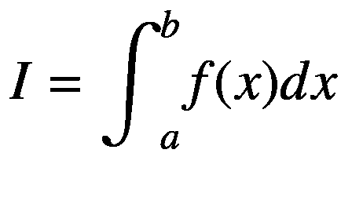

符号 *dx* ，称为变量 *x* 的微分，表示积分的变量为 *x* 。这意味着微分中的 *x* 的微小变化。积分是计算定积分值的过程。微积分第一基本定理说，积分的导数就是被积函数。所以，我们有时称积分为函数的反导数。参见图 [6-10](#Fig10) 。

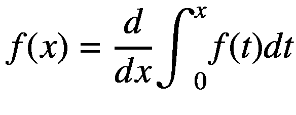


图 6-10

作为曲线下带符号面积的积分

黎曼给出了积分的第一个严格定义。黎曼积分的基本思想是将面积分割成许多矩形来近似面积，然后对它们求和(因此积分)。通过采用越来越好的近似，比如无限多个无穷小的矩形，我们可以说“在极限中”我们得到的正是曲线下的面积。图 [6-11](#Fig11) 显示了一个区间正则剖分上的黎曼和序列。上面的数字是矩形的总面积，它收敛于函数的积分。


图 6-11

黎曼和序列

数学上，区间[ *a* ， *b* 的划分是一个有限的点序列。


在每个子区间中有一个区分点*t*<sub>T3】IT5】∈[*x*<sub>T9】I</sub>，*x*<sub>*I*+1</sub>确定矩形的高度*f*(*t*<sub>*I*</sub>)。矩形区域大小因此为*f*(*t*<sub>*I*</sub>)(*x*<sub>*I*+1</sub>—*x*<sub>*I*</sub>)。 *f* 关于分区的黎曼和定义为所有矩形的和。</sub>

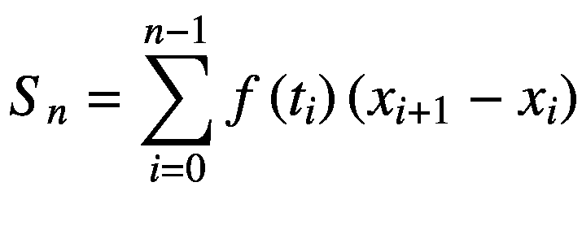

当我们取 *n* 趋于无穷的极限时，黎曼和就变成了整数值。【T2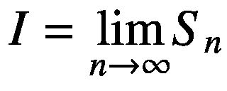

数值积分是一种使用类似划分概念来近似定积分的技术:使用被积函数的有限样本值的加权平均近似值来代替函数值。数值积分很重要，因为(通常)不可能用解析方法找到(封闭形式的)反导数。即使反导数存在，它们也可能不容易计算，因为它们不能由初等函数组成。就特殊函数或无穷级数而言，计算数值近似值比计算反导数容易得多。此外，被积函数可能仅在某些点是已知的，例如通过采样获得的点。由于这个原因，一些嵌入式系统和其他计算机应用可能需要数值积分。

传统上，计算面积大小的数学方法称为求积法。它现在是集成的同义词，但不太常用。数值积分公式仍被称为数值求积公式。做数值积分有很多种方法。它们的区别在于它们将区间分成多少个分区，分区是否等距，我们如何选择区分点，它是开放的(不使用端点)还是封闭的(使用端点)，以及我们如何进行外推(或不进行外推)。本章只能粗略地介绍一些最基本的变体。

## 6.7 牛顿-科特斯家族

牛顿-柯特斯公式，也称为牛顿-柯特斯求积规则或简称为牛顿-柯特斯规则，是一组基于在等距点处计算被积函数的数值积分(也称为求积)公式。它们以艾萨克·牛顿和罗杰·科茨的名字命名。如果被积函数在等距点上的值是可用的，牛顿-柯特斯公式是有用的。如果可以使用一组不同的(可能不是等间距的)点，那么高斯求积等其他方法可能更准确。牛顿-科特斯公式有许多推导方法。最著名的两个公式是梯形求积公式和辛普森求积公式。

### 梯形求积公式

梯形公式的工作原理是用直线代替函数，本质上是将函数下的区域近似为梯形并计算其面积。见图 [6-12](#Fig12) 。

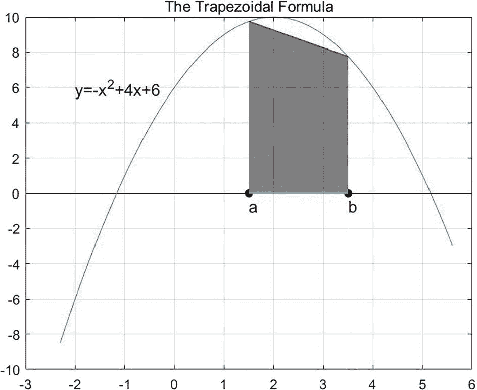

图 6-12

梯形公式

通过两点 *a* 和 *b* 的直线方程如下:

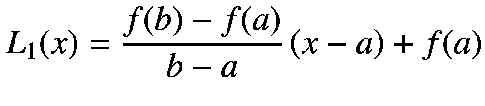

线下的面积是梯形的面积，即底边(平行边)之和乘以高度(底边之间的垂直距离)，然后除以 2。我们也可以做适当的积分来得到相同的结果。

把 *f* ( *x* )换成 *L* <sub>1</sub> ( *x* )，我们就有了这个:


![$$ ={\int}_a^b\left[\frac{f(b)-f(a)}{b-a}\left(x-a\right)+f(a)\right] dx $$](img/500382_1_En_6_Chapter_TeX_Equbu.png)


对于一个函数 *f* ( *x* )和一个区间[ *a* ， *b* ]，我们可以把区间分成 *N* 个子区间。然后我们将这个梯形法则应用于每个子区间，并将它们相加。

让

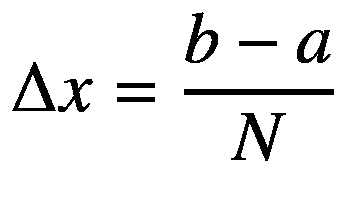


可以证明，假设*f*<sup>’</sup>(*x*)存在并且在 *a* ， *b* ]上连续，对于某些*ξ*∈*a*，*b*:

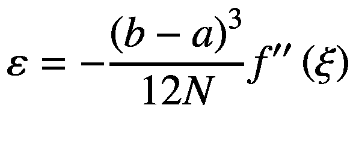

使用梯形法则的误差如下

在 NM Dev 中，做梯形积分的类是`Trapezoidal`。以下示例解决了图 [6-12](#Fig12) 中的问题:

```py
final UnivariateRealFunction f = new AbstractUnivariateRealFunction() {

    @Override
    public double evaluate(double x) {
        return -(x * x - 4 * x + 6); // -(x^2 - 4x + 6)
    }
};

// the limit
double a = 0., b = 4.;
// an integrator using the trapezoidal rule
Integrator integrator = new Trapezoidal(1e-8, 20); // precision, max number of iterations
// the integration
double I = integrator.integrate(f, a, b);
System.out.println(String.format("S_[%.0f,%.0f] f(x) dx = %f", a, b, I));

```

输出如下所示:

```py
S_[0,4] f(x) dx = -13.333333

```

`Trapezoidal`的类签名如下:

```py
/**
 * Constructs an integrator that implements the Trapezoidal rule.
 *
 * @param precision     the convergence threshold
 * @param maxIterations the maximum number of iterations
 */
public Trapezoidal(double precision, int maxIterations)

```

在 NM Dev 中，集成器(算法)的所有实现都继承自这个类`Integrator`。他们都叫`integrate`来做这项工作。

```py
/**
 * Integrate function <i>f</i> from <i>a</i> to <i>b</i>,
 * \[
 * \int_a^b\! f(x)\, dx
 * \]
 *
 * @param f a univariate function
 * @param a the lower limit
 * @param b the upper limit
 * @return \(\int_a^b\! f(x)\, dx\)
 */
public double integrate(UnivariateRealFunction f, double a, double b);

```

### 辛普森求积公式

辛普森公式不是用直线代替函数，而是用二次函数或抛物线代替 *f* ( *x* )。该区间被分成两部分，给出三个点: *a* 、 *b* 和中点。二次函数如下:


从几何的角度来看，辛普森公式计算抛物线围成的弯曲梯形的面积来近似为 *f* ( *x* )围成的面积。见图 [6-13](#Fig13) 。


图 6-13

辛普森公式

把 *f* ( *x* )换成 *L* <sub>2</sub> ( *x* )，我们就有了这个:

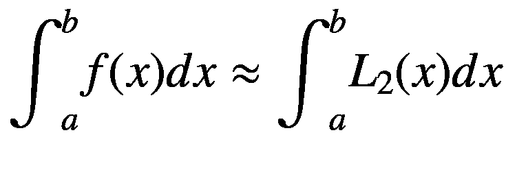

![$$ =\frac{b-a}{6}\left[f(a)+4f\left(\frac{a+b}{2}\right)+f(b)\right] $$](img/500382_1_En_6_Chapter_TeX_Equcc.png)

![$$ =\frac{h}{3}\left[f(a)+4f\left(\frac{a+b}{2}\right)+f(b)\right] $$](img/500382_1_En_6_Chapter_TeX_Equcd.png)

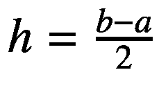是每个分区中的步长。因为公式中的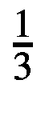，这个辛普森法则常被称为辛普森 1/3 法则。

对于一个函数 *f* ( *x* )和一个区间[ *a* ， *b* ]，我们可以把区间分成 *N* 个子区间。然后，我们将这个辛普森规则应用于每个子区间，并将它们相加。我们有以下:

![$$ {\int}_a^bf(x) dx\approx \frac{h}{3}\sum \limits_{j=1}^{N/2}\left[f\left({x}_{2j-2}\right)+4f\left({x}_{2j-1}\right)+f\left({x}_{2j}\right)\right] $$](img/500382_1_En_6_Chapter_TeX_Equce.png)

对于两次连续可微的函数，辛普森法则有望改进梯形法则。然而，对于更粗糙的函数，梯形法则可能更可取。可以证明，假设四阶导数 *f* <sup>(4)</sup> ( *x* )存在并且在 *a* ， *b* ]上连续，对于某些*ξ*∈】*a*，*b*:

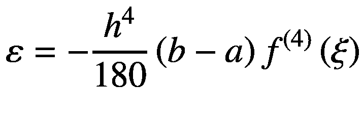

使用辛普森 1/3 法则的误差如下

在 NM Dev 中，做辛普森 1/3 积分的类是`Trapezoidal`。以下示例解决了图 [6-12](#Fig12) 中的问题:

```py
final UnivariateRealFunction f = new AbstractUnivariateRealFunction() {

    @Override
    public double evaluate(double x) {
        return -(x * x - 4 * x + 6); // -(x^2 - 4x + 6)
    }
};

// the limit
double a = 0., b = 4.;
// an integrator using the Simpson rule
Integrator integrator = new Simpson(1e-8, 20); // precision, max number of iterations
// the integration
double I = integrator.integrate(f, a, b);
System.out.println(String.format("S_[%.0f,%.0f] f(x) dx = %f", a, b, I));

```

输出如下所示:

```py
S_[0,4] f(x) dx = -13.333333

```

`Simpson`的类签名如下:

```py
/**
 * Constructs an integrator that implements Simpson's rule.
 *
 * @param precision     the convergence threshold
 * @param maxIterations the maximum number of iterations
 */
public Simpson(double precision, int maxIterations)

```

### 6.7.3 牛顿-科特斯求积公式

可以想象，可以将区间[ *a* ， *b* ]分成不止一个区间(如梯形法则的情况)或不止两个区间(如辛普森法则的情况)。人们可以把它分成 n 个*间隔。也可以使用使用端点 *a* 和 *b* 的封闭公式，或者不使用端点的开放公式，因为 *f* ( *a* )和 *f* ( *b* )可能不存在。牛顿-科特斯公式就是这样一个概括。它将区间[ *a* ， *b* 划分为 *n* 等份。对于封闭公式，等距点如下所示:*

*x*<sub>T3】IT5】=*a*+*ih*，</sub>

对于开放式公式，等距点如下所示:

*x*<sub>T3】IT5】=*a*+(*I*+1)*h*，</sub>

对于封闭的公式，可以构造一个 *n* 次差分多项式，如下图:

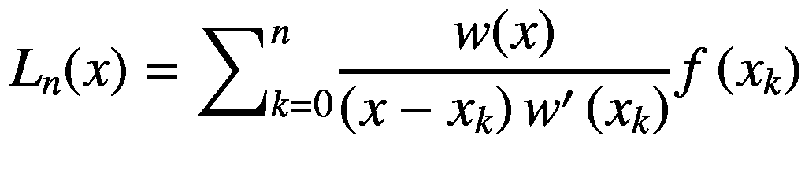

其中*w*(*x*)=(*x*xx<sub>0</sub>)(*x*x*x*t14】1)⋯(*x*x*x*t20】t21【nt23)。

将 *f* ( *x* )替换为*L*<sub>*n*</sub>(*x*)，我们有了以下:


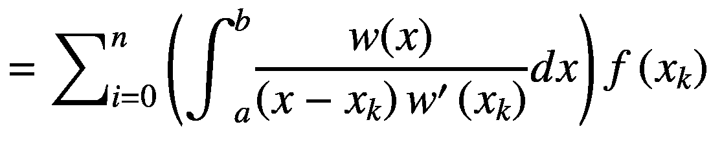

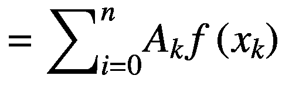

其中系数

这个公式被称为牛顿-科特斯公式。这些系数被称为牛顿-柯特斯系数。要使用该公式，我们需要计算系数*A*<sub>T3】kT5。替换 *x* = *a* + *th* 。我们有以下:</sub>


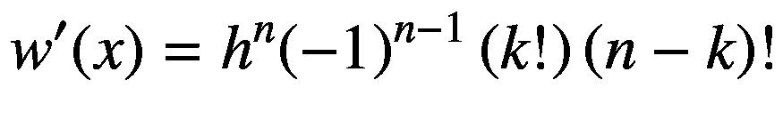

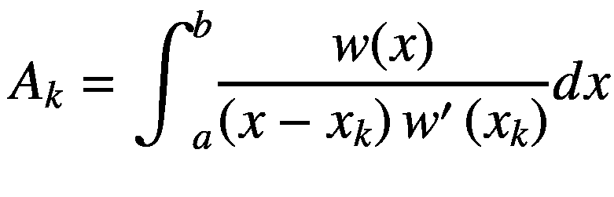


让

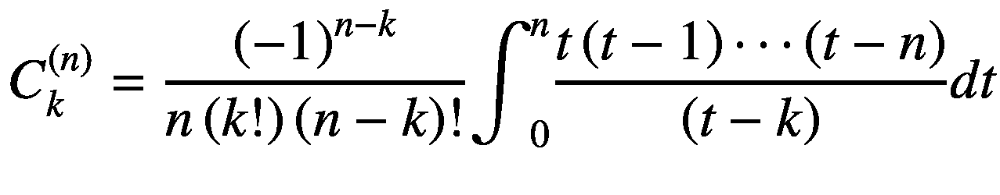

所以


我们看到 *A* <sub>*k*</sub> 是一个常数，它只依赖于区间[ *a* ， *b* 和分区数 *n* 而不依赖于函数。因此，可以预先计算牛顿-柯特斯系数。

梯形公式和辛普森公式是牛顿-科特斯公式的特例。当 *n* = 1 时，牛顿-科特斯公式如下:

![$$ {L}_1(x)=\frac{b-a}{2}\left[f(a)+f(b)\right] $$](img/500382_1_En_6_Chapter_TeX_Equcq.png)

这就是梯形公式。

当 *n* = 2 时，牛顿-科特斯公式如下:

![$$ {L}_2(x)=\frac{b-a}{6}\left[f(a)+4f\left(\frac{a+b}{2}\right)+f(b)\right] $$](img/500382_1_En_6_Chapter_TeX_Equcr.png)

这是辛普森公式。

当 *n* = 4 时，牛顿-科特斯公式如下:

![$$ C=\frac{b-a}{90}\left[7f\left({x}_0\right)+32f\left({x}_1\right)+12f\left({x}_2\right)+32f\left({x}_3\right)+7f\left({x}_4\right)\right] $$](img/500382_1_En_6_Chapter_TeX_Equcs.png)

以及*x*<sub>T3】IT5】=*a*+*KH*(*k*= 0，1，2，3，4)和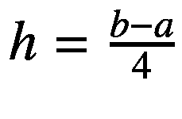。见图 [6-14](img/#Fig14)</sub>

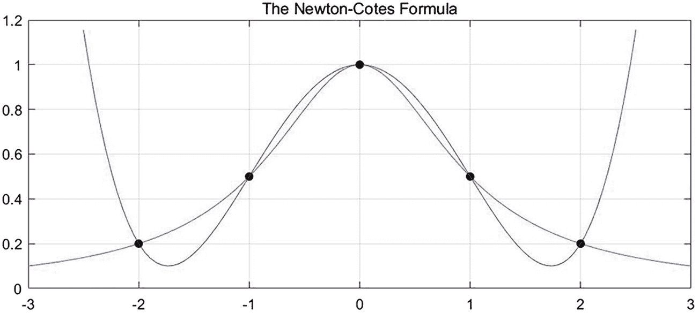

图 6-14

n=2 和 n = 4 的牛顿-柯特斯公式

代数精度是衡量数值积分公式近似程度的一种方法。注意牛顿-柯特斯系数*A*<sub>T3】kT5】取决于 *n* 而不取决于被积函数本身。对于 *n* = 1，梯形公式是 1 次多项式。如果牛顿-科特斯公式中的 *f* ( *x* )是一个次数不高于 *n* 的多项式，那么等号成立。</sub>


如果 *f* ( *x* )是一个次数为 *n* + 1 的多项式，那么右手边只是一个近似值。据说求积公式有一个 *n* 级的代数精度。

对于 *n* = 1，梯形求积法则有这个误差，据说有初等代数精度。

、*【a】***【b】**

 *对于 *n* = 2，辛普森求积法则有这个误差，据说有三次代数精度。

、*【a】***【b】**

 *对于一般的 *n* ，误差项如下:

、*【a】***【b】**

 *如果 *f* ( *x* )是一个次数为 *n* 的多项式，那么*f*<sup>(*n*+1)</sup>(*x*)= 0。所以，误差 *ε* = 0。牛顿-柯特斯求积公式的代数精度至少是 *n* 。有一个定理说当 *n* 为奇数时，代数精度为 *n* 。当 *n* 为偶数时，代数精度为 *n* + 1。例如，对于 *n* = 2，辛普森公式的代数精度为 3。对于 *n* = 4，代数精度为 5。

假设*f*(*x*<sub>T5】I</sub>)(*x*<sub>*I*</sub>为网格点)的舍入误差为，牛顿-科特斯公式的误差如下:


最后一项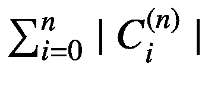，随着 *n* 的增加而增加。这会导致近似的误差增大，所以牛顿-科特斯公式对于大 *n* 是不稳定的。因此，在实践中牛顿-柯特斯公式很少用于 *n* ≥ 8。

考虑这个集成以下函数的例子:


见图 [6-15](#Fig15)


图 6-15

π的一个定积分

利用梯形公式，我们有如下:

![$$ {\int}_0^1 ydx\approx \frac{1-0}{2}\left[\frac{4}{1+1}+\frac{4}{1+0}\right]=3 $$](img/500382_1_En_6_Chapter_TeX_Equcw.png)

见图 [6-16](#Fig16)


图 6-16

π的梯形公式

利用辛普森公式，我们有如下:

![$$ {\int}_0^1 ydx\approx \frac{1-0}{6}\left[\frac{4}{1+1}+4\frac{4}{1+\frac{1}{4}}+\frac{4}{1+0}\right]\approx 3.1333 $$](img/500382_1_En_6_Chapter_TeX_Equcx.png)

参见图 [6-17](#Fig17) 和图 [6-18](#Fig18) 。


图 6-18

π的辛普森公式


图 6-17

π的辛普森公式

使用牛顿-科特斯公式，其中 *n* = 4，我们得到如下:


![$$ {\int}_0^1 ydx\approx \frac{b-a}{90}\left[7f\left({x}_0\right)+32f\left({x}_1\right)+12f\left({x}_2\right)+32f\left({x}_3\right)+7f\left({x}_4\right)\right]\approx 3.1421 $$](img/500382_1_En_6_Chapter_TeX_Equcz.png)

参见图 [6-19](#Fig19) 和图 [6-20](#Fig20) 。


图 6-20

n=4 时π的牛顿-柯特斯公式


图 6-19

n=4 时π的牛顿-柯特斯公式

以下 NM Dev 代码解决了这个示例:

```py
System.out.println("integrate using the Newton-Cotes formulas");

final UnivariateRealFunction f = new AbstractUnivariateRealFunction() {

    @Override
    public double evaluate(double x) {
        return 4\. / (1\. + x * x); // 4/(1+x^2)
    }
};

// the limit
double a = 0., b = 1.;
Integrator integrator1 = new Trapezoidal(1e-8, 20); // using the trapezoidal rule
Integrator integrator2 = new Simpson(1e-8, 20); // using the Simpson rule
Integrator integrator3 = new NewtonCotes(3, Type.CLOSED, 1e-8, 20); // using the Newton-Cotes rule
Integrator integrator4 = new NewtonCotes(3, Type.OPEN, 1e-8, 20); // using the Newton-Cotes rule

// the integrations
double I1 = integrator1.integrate(f, a, b);
System.out.println(String.format("S_[%.0f,%.0f] f(x) dx = %.16f", a, b, I1));
double I2 = integrator2.integrate(f, a, b);
System.out.println(String.format("S_[%.0f,%.0f] f(x) dx = %.16f", a, b, I2));
double I3 = integrator3.integrate(f, a, b);
System.out.println(String.format("S_[%.0f,%.0f] f(x) dx = %.16f", a, b, I3));
double I4 = integrator4.integrate(f, a, b);
System.out.println(String.format("S_[%.0f,%.0f] f(x) dx = %.16f", a, b, I4));

```

输出如下所示:

```py
S_[0,1] f(x) dx = 3.1415926436556850, using the trapezoidal rule
S_[0,1] f(x) dx = 3.1415926535528365, using the Simpson rule
S_[0,1] f(x) dx = 3.1415926497180000, using the Newton-Cotes closed rule
S_[0,1] f(x) dx = 3.1415926674370604, using using the Newton-Cotes open rule

```

类别`NewtonCotes`的签名如下:

```py
/**
 * Constructs an instance of the Newton-Cotes quadrature.
 *
 * @param rate          the rate of further sub-dividing an integral
 *                      interval. For example, when {@code rate = 2}, we
 *                      divide <i>[x<sub>i</sub>, x<sub>i+1</sub>]</i> into
 *                      two equal length intervals. This is equivalent to
 *                      the Trapezoidal rule.
 * @param type          specifying whether to use CLOSED or OPEN formula
 * @param precision     the precision required, e.g., {@code 1e-8}
 * @param maxIterations the maximum number of iterations
 */
public NewtonCotes(int rate, Type type, double precision, int maxIterations)

```

积分的精度和性能不仅取决于使用哪个求积公式，还取决于被积函数本身。一般来说，梯形公式不如辛普森公式精确。低阶牛顿-柯特斯公式计算简单，使用方便，精度高。另一方面，高阶牛顿-柯特斯公式不仅计算复杂，而且稳定性差。所以，它们很少被使用。实际上，我们通常更喜欢像辛普森法则这样的低阶公式。

## 6.8 龙贝格集成

龙贝格求积公式也被称为逐次半加速法。它基于梯形公式、辛普森公式和高阶牛顿-柯特斯公式之间的关系，构造一种加速积分计算的方法。Romberg 算法是一种外推方法，在连续将积分区间分成两半的过程中，将先前的近似组合起来以产生更精确的近似。它在不增加计算量的情况下提高了积分的精度。

根据梯形法则的误差估计，可以看出积分(近似)值*T*<sub>T3】nT5】的截断误差大致与 *h* <sup>2</sup> 成正比。因此，当步长除以两倍数量的子间隔时，截断误差*I*T*T*T14】T*n*T17】将减少到原始误差的。</sub>

即

我们可以重新排列这些术语得到如下:


可以看出，只要进一步区间划分前后的两个连续积分值 *T* <sub>*n*</sub> 和 *T* <sub>2 *n*</sub> 足够接近，*T*<sub>2*n*</sub>计算结果的误差就会很小。*T*T20】2*n*T23】的误差大致等于。我们可以使用这个误差来补偿*T*T27】2*n*T30】以获得更好的估计。即更准确的近似如下:


也就是说，我们线性组合使用梯形法则计算的两个整数值 *T* <sub>*n*</sub> 和 *T* <sub>2 *n*</sub> 以获得更精确的近似值。我们可以走得更远。

我们可以通过线性组合梯形序列的值来生成辛普森序列。辛普森序列比梯形序列具有更快的收敛速度。

T3

T5T7】

利用类似的计算，可以表明


我们可以进一步线性组合 Simpson 序列的值，以产生收敛速度更快的 Cotes 序列。可以看出


利用类似的计算，可以表明


我们还可以通过线性组合 Cotes 序列的值来产生一个收敛速度更快的 Romberg 序列。

T2

T4T6】

通过在变步长过程中使用加速度公式，我们逐渐将粗略的梯形值*T*<sub>T3】nT5】处理成精细的辛普森值 *S* <sub>*n*</sub> ，然后处理成更精细的科特值 *C* <sub>*n*</sub> ，再处理成龙贝格值 *R* <sub>*n*</sub> 图 [6-21](#Fig21) 显示了进展顺序。</sub>


图 6-21

龙伯格公式

我们再重复一下 6.7.3 节用积分计算 *π* 的例子。以下是产生的梯形值、辛普森值、科特斯值和龙贝格值的顺序。见图 [6-22](#Fig22) 。


![$$ {T}_1=\frac{1}{2}\left[f(0)+f(1)\right]=3 $$](img/500382_1_En_6_Chapter_TeX_Equdm.png)


![$$ {T}_4=\frac{1}{2}{T}_2+\frac{1}{4}\left[f\left(\frac{1}{4}\right)+f\left(\frac{3}{4}\right)\right]=3.131177 $$](img/500382_1_En_6_Chapter_TeX_Equdp.png)


![$$ {T}_8=\frac{1}{2}{T}_4+\frac{1}{8}\left[f\left(\frac{1}{8}\right)+f\left(\frac{3}{8}\right)+f\left(\frac{5}{8}\right)+f\left(\frac{7}{8}\right)\right]=3.138989 $$](img/500382_1_En_6_Chapter_TeX_Equdr.png)


图 6-22

龙贝格积分


图 6-23

龙贝格积分

在 NM Dev 中，做 Romberg 集成的类是`Romberg`。下面的代码使用 Romberg 积分计算这个整数值。

```py
final UnivariateRealFunction f = new AbstractUnivariateRealFunction() {
    @Override
    public double evaluate(double x) {
        return exp(2\. * x) - 4\. * x - 7.;
    }
};
IterativeIntegrator integrator1 = new Trapezoidal(1e-8, 20); // using the trapezoidal rule
Integrator integrator2 = new Simpson(1e-8, 20); // using the Simpson rule
Integrator integrator3 = new Romberg(integrator1);
// the limit
double a = 0., b = 1.;
// the integrations
double I1 = integrator1.integrate(f, a, b);
System.out.println(String.format("S_[%.0f,%.0f] f(x) dx = %.16f, using the trapezoidal rule", a, b, I1));
double I2 = integrator2.integrate(f, a, b);
System.out.println(String.format("S_[%.0f,%.0f] f(x) dx = %.16f, using the Simpson rule", a, b, I2));
double I3 = integrator3.integrate(f, a, b);
System.out.println(String.format("S_[%.0f,%.0f] f(x) dx = %.16f, using the Romberg formula", a, b, I3));

```

输出是:

```py
S_[0,1] f(x) dx = -5.8054719346672840, using the trapezoidal rule
S_[0,1] f(x) dx = -5.8054719494768790, using the Simpson rule
S_[0,1] f(x) dx = -5.8054719505327520, using the Romberg formula

```

签名是:

```py
/**
 * Extends an integrator using Romberg’s method.
 *
 * @param integrator an iterative integrator that must do at least 2
 *                   iterations
 */
public Romberg(IterativeIntegrator integrator)

```

## 6.9 高斯正交

上一节介绍的牛顿-柯特斯族求积公式的特点是， *n* + 1 个节点(*x*T4】0， *x* <sub>1</sub> ， *x* <sub>*n*</sub> )等距或等距。因此，它们的求积公式很容易构造。另一方面，它限制了那些公式的准确性。当 *n* 为奇数时，代数精度为 *n* 。当 *n* 为偶数时，代数精度为 *n* + 1。如果那些 *n* + 1 节点选择得当，即不一定等间距，代数精度能更大吗？可以证明，如果选择合适的节点，代数精度可以达到 2 *n* + 1。

从图 [6-24](#Fig24) 中，我们看到用梯形法则积分的误差比较大。如果我们能像图 [6-25](#Fig25) 中那样明智地定位我们的节点，我们可以使用另一种直线近似法来平衡正负误差。


图 6-25

高斯正交对梯形规则


图 6-24

高斯正交对梯形规则

考虑一个例子来积分这个多项式:


积分值如下:


见图 [6-26](#Fig26)


图 6-26

高斯正交对梯形规则

使用梯形法则，橙色线逼近多项式并给出如下:


两点高斯求积规则使用黑色虚线来逼近多项式。它给出了精确的结果。绿色区域的面积大小与红色区域的总和相同。

T2】

一般来说，高斯求积公式(注意，我们将符号从 *A* <sub>*k*</sub> 改为 *w* <sub>*k*</sub> 因为现在系数或权重的计算方式不同)是关于这种形式的积分


可以达到至少 *n* 和最多 2 *n* + 1 的代数精度，如果我们能选择正确的节点集的话。节点{ *x* <sub>*k*</sub> }称为高斯点，系数{*w*<sub>*k*</sub>}称为高斯系数。节点和系数都不依赖于被积函数。节点{*x*<sub>*k*</sub>}，根据被积函数或 *ρ* ( *x* )的形式，从多项式的根计算得出。

### 6.9.1 高斯-勒让德求积公式

高斯-勒让德求积公式对于 *ρ* ( *x* ) = 1 求解出以下形式的积分。


高斯节点是勒让德多项式的根*P*<sub>*n*</sub>(*x*)。

*P*<sub>*n*</sub>(*x*)是次数为 *n* 的多项式，使得它们正交。两个正交的多项式或函数当且仅当它们满足:

，如果*n*≦*m*

图 [6-27](#Fig27) 显示了前 11 个勒让德多项式(对于 *n* = 0，⋯，10)。


图 6-27

前 11 个勒让德多项式

我们在图 [6-28](#Fig28) 中绘制了其中的前六个。


图 6-28

前六个勒让德多项式

权重{*w*<sub>T3】kT5】如下:</sub>

![$$ {w}_k=\frac{2}{\left(1-{x}_k^2\right){\left[{P}_n^{\prime}\left({x}_k\right)\right]}^2} $$](img/500382_1_En_6_Chapter_TeX_Equec.png)

区间[1，1]内的一些低阶求积规则如图 [6-29](#Fig29) 所示。


图 6-29

低阶高斯-勒让德求积规则

对于高斯节点和高斯权重，高斯-勒让德求积公式如下:


事实上，对于次数高达 2 *n* + 1 的多项式的函数，方程是精确的。

在 NM Dev 中，做高斯-勒让德求积的类是`GaussLegendreQuadrature`。下面的代码计算这个积分:


```py
UnivariateRealFunction f = new AbstractUnivariateRealFunction() {
    @Override
    public double evaluate(double x) {
        return 4 * x * x * x + 2 * x + 1; // x^4 + x^2 + x
    }
};

// the integrators
Integrator integrator1 = new Trapezoidal(1e-8, 20); // using the trapezoidal rule
Integrator integrator2 = new Simpson(1e-8, 20); // using the Simpson rule
Integrator integrator3 = new GaussLegendreQuadrature(2);

// the limits
double a = -1., b = 1.;

// the integrations
double I1 = integrator1.integrate(f, a, b);
System.out.println(String.format("S_[%.0f,%.0f] f(x) dx = %.16f, using the trapezoidal rule", a, b, I1));
double I2 = integrator2.integrate(f, a, b);
System.out.println(String.format("S_[%.0f,%.0f] f(x) dx = %.16f, using the Simpson rule", a, b, I2));
double I3 = integrator3.integrate(f, a, b);
System.out.println(String.format("S_[%.0f,%.0f] f(x) dx = %.16f, using the Gauss Legendre quadrature", a, b, I3));

```

输出如下所示:

```py
S_[-1,1] f(x) dx = 2.0000000000000000, using the trapezoidal rule
S_[-1,1] f(x) dx = 2.0000000000000000, using the Simpson rule
S_[-1,1] f(x) dx = 2.0000000000000000, using the Gauss Legendre quadrature

```

`GaussLegendreQuadrature`的类签名如下:

```py
/**
 * Constructs an integrator of order n.
 *
 * @param n the number of points in the quadrature rule
 */
public GaussLegendreQuadrature(final int n)

```

### 6.9.2 高斯-拉盖尔求积公式

高斯-拉盖尔求积公式数值计算这种形式的积分。

T2】

高斯节点{ *x* <sub>*k*</sub> }，是拉盖尔多项式*L*<sub>*n*</sub>(*x*)的根。

图 [6-30](#Fig30) 显示了前几个拉盖尔多项式。


图 6-30

拉盖尔多项式

高斯系数{*w*<sub>T3】k</sub>}，如下:

![$$ {w}_k=\frac{x_k}{{\left(n+1\right)}^2{\left[{L}_{n+1}\left({x}_k\right)\right]}^2} $$](img/500382_1_En_6_Chapter_TeX_Equeg.png)

在 NM Dev 中，做高斯-拉盖尔求积的类是`GaussLaguerreQuadrature`。下面的代码计算这个积分:


```py
final Polynomial poly = new Polynomial(1, 2, 1); // x^2 + 2x + 1
UnivariateRealFunction f = new AbstractUnivariateRealFunction() {
    @Override
    public double evaluate(double x) {
        return exp(-x) * poly.evaluate(x); // e^-x * (x^2 + 2x + 1)
    }
};

// the integrators
Integrator integrator1 = new Trapezoidal(1e-8, 20); // using the trapezoidal rule
Integrator integrator2 = new Simpson(1e-8, 20); // using the Simpson rule
Integrator integrator3 = new GaussLaguerreQuadrature(2, 1e-8);

// the limits
double a = 0., b = Double.POSITIVE_INFINITY;

// the integrations
double I1 = integrator1.integrate(f, a, b);
System.out.println(String.format("S_[%.0f,%.0f] f(x) dx = %.16f, using the trapezoidal rule", a, b, I1));
double I2 = integrator2.integrate(f, a, b);
System.out.println(String.format("S_[%.0f,%.0f] f(x) dx = %.16f, using the Simpson rule", a, b, I2));
double I3 = integrator3.integrate(f, a, b);
System.out.println(String.format("S_[%.0f,%.0f] f(x) dx = %.16f, using the Gauss Laguerre quadrature", a, b, I3));

```

输出如下所示:

```py
S_[0,Infinity] f(x) dx = NaN, using the trapezoidal rule
S_[0,Infinity] f(x) dx = NaN, using the Simpson rule
S_[0,Infinity] f(x) dx = 5.0000000000000000, using the Gauss Laguerre quadrature

```

有趣的是，无论是梯形法则还是辛普森法则都不能计算这种极限之一为正无穷大的(不恰当的)积分。我们不能把半个现实生活[0，∞]分成分区。

`GaussLaguerreQuadrature`的类签名如下:

```py
/**
 * Constructs an integrator of order n.
 *
 * @param n         the number of points in the quadrature rule
 * @param precision the precision of the estimates of the coefficients
 */
public GaussLaguerreQuadrature(final int n, final double precision)

```

### 6.9.3 高斯-埃尔米特求积公式

高斯-埃尔米特求积公式数值计算这种形式的积分:


高斯节点{ *x* <sub>*k*</sub> }，是物理学家版本的埃尔米特多项式*H*<sub>*n*</sub>(*x*)的根。

图 [6-31](#Fig31) 和图 [6-32](#Fig32) 显示了前几个埃尔米特多项式。


图 6-32

前六个埃尔米特多项式


图 6-31

前 10 个埃尔米特多项式

高斯系数{*w*<sub>T3】k</sub>}，如下:

![$$ {w}_k=\frac{2^{n-1}n!\sqrt{\pi }}{n^2{\left[{H}_{n-1}\left({x}_k\right)\right]}^2} $$](img/500382_1_En_6_Chapter_TeX_Equej.png)

在 NM Dev 中，做高斯-埃尔米特求积的类是`GaussHermiteQuadrature`。下面的代码计算这个积分:


```py
final Polynomial poly = new Polynomial(1, 2, 1); // x^2 + 2x + 1
UnivariateRealFunction f = new AbstractUnivariateRealFunction() {
    @Override
    public double evaluate(double x) {
        return exp(-(x * x)) * poly.evaluate(x); // e^(-x^2) * (x^2 + 2x + 1)
    }
};

// the integrators
Integrator integrator1 = new Trapezoidal(1e-8, 20); // using the trapezoidal rule
Integrator integrator2 = new Simpson(1e-8, 20); // using the Simpson rule
Integrator integrator3 = new GaussHermiteQuadrature(2);

// the limits
double a = Double.NEGATIVE_INFINITY, b = Double.POSITIVE_INFINITY;

// the integrations
double I1 = integrator1.integrate(f, a, b);
System.out.println(String.format("S_[%.0f,%.0f] f(x) dx = %.16f, using the trapezoidal rule", a, b, I1));
double I2 = integrator2.integrate(f, a, b);
System.out.println(String.format("S_[%.0f,%.0f] f(x) dx = %.16f, using the Simpson rule", a, b, I2));
double I3 = integrator3.integrate(f, a, b);
System.out.println(String.format("S_[%.0f,%.0f] f(x) dx = %.16f, using the Gauss Hermite quadrature", a, b, I3));

```

输出如下所示:

```py
S_[-Infinity,Infinity] f(x) dx = NaN, using the trapezoidal rule
S_[-Infinity,Infinity] f(x) dx = NaN, using the Simpson rule
S_[-Infinity,Infinity] f(x) dx = 2.6586807763582730, using the Gauss Hermite quadrature

```

注意，梯形法则和辛普森法则都不能计算这种(不恰当的)积分，因为这种积分的两个极限都是无穷大。我们不能把实线[∞，∞]分成分区。

`GaussHermiteQuadrature`的类签名如下:

```py
/**
 * Constructs an integrator of order n.
 *
 * @param n the number of points in the quadrature rule
 */
public GaussHermiteQuadrature(final int n)

```

### 6.9.4 高斯-切比雪夫求积公式

高斯-切比雪夫求积公式数值计算这种形式的积分:


高斯节点{ *x* <sub>*k*</sub> }，如下:


高斯系数{*w*<sub>T3】k</sub>}，如下:


在 NM Dev 中，做高斯-切比雪夫求积的类是`GaussChebyshevQuadrature`。下面的代码计算这个积分:


```py
final Polynomial poly = new Polynomial(1, 2, 1); // x^2 + 2x + 1
UnivariateRealFunction f = new AbstractUnivariateRealFunction() {
    @Override
    public double evaluate(double x) {
        // second order polynomial divided by weighting can be reproduced exactly
        return poly.evaluate(x) / sqrt(1 - x * x);
    }
};

// the integrators
Integrator integrator1 = new Trapezoidal(1e-8, 20); // using the trapezoidal rule
Integrator integrator2 = new Simpson(1e-8, 20); // using the Simpson rule
Integrator integrator3 = new GaussChebyshevQuadrature(2);

// the limits
double a = -1., b = 1.;

// the integrations
double I1 = integrator1.integrate(f, a, b);
System.out.println(String.format("S_[%.0f,%.0f] f(x) dx = %.16f, using the trapezoidal rule", a, b, I1));
double I2 = integrator2.integrate(f, a, b);
System.out.println(String.format("S_[%.0f,%.0f] f(x) dx = %.16f, using the Simpson rule", a, b, I2));
double I3 = integrator3.integrate(f, a, b);
System.out.println(String.format("S_[%.0f,%.0f] f(x) dx = %.16f, using the Gauss Hermite quadrature", a, b, I3));

```

输出如下所示:

```py
S_[-1,1] f(x) dx = NaN, using the trapezoidal rule
S_[-1,1] f(x) dx = NaN, using the Simpson rule
S_[-1,1] f(x) dx = 4.7123889803846900, using the Gauss Hermite quadrature

```

注意，梯形法则和辛普森法则都不能计算这个积分。

## 6.10 替代整合

第 [6.9](#Sec25) 节中的功能形式是限制性的。例如，应用高斯-勒让德公式的区间为[1，1]。通常，我们希望区间更灵活。其他形式的积分从和/或直到无穷大，这使得应用更简单的求积规则如梯形或辛普森的不可行。很多被积函数很难计算，因为它们很复杂。还有一些函数由于奇异性，在某些点上不能求值。代换积分以更简单的形式写出积分，因此更容易计算，例如通过避免奇异性。它可以将间隔转换为所需的范围，并避免无穷大。此外，它通过减少收敛所需的迭代次数来加速计算。代换规则说我们找一个变量的变化，如下图:


如


然后我们可以用在 *x* 中的积分代替 *t* 中的积分。


举个例子会更容易理解。假设我们要计算如下:


我们注意到，如果我们设置这个:


于是我们有了以下:


或者以下:


把这些代入原积分，去掉 *t* ，我们就有了:


在 *x* 中的新积分就没那么吓人了。【T2

为了在 NM Dev 中通过替换进行集成，我们需要通过继承接口`SubstitutionRule`来指定变量的变化。

```py
public interface SubstitutionRule {

    /**
     * the transformation: <i>x(t)</i>
     *
     * @return <i>x(t)</i>
     */
    public UnivariateRealFunction x();

    /**
     * the first order derivative of the transformation: <i>x'(t) = dx(t)/dt</i>
     *
     * @return <i>x'(t) = dx(t)/dt</i>
     */
    public UnivariateRealFunction dx();

    /**
     * the lower limit of the integral.
     *
     * @return the lower limit
     */
    public double ta();

    /**
     * the upper limit of the integral.
     *
     * @return the upper limit
     */
    public double tb();
}

```

变量的变化在`x()`中指定。我们还需要指定`dx()`中变量变化的微分，以及极限`ta()`和`tb()`。

NM Dev 已经预构建了一套替换规则，可以开箱即用。

### 标准间隔

这种变换将积分区间从[*a*，*b*映射到[1，1]。替换规则如下:


这里有一个例子:

```py
double a = 0., b = 10.; // the limits
Integrator integrator1
        = new NewtonCotes(3, NewtonCotes.Type.OPEN, 1e-8, 10);
Integrator integrator2
        = new ChangeOfVariable(new StandardInterval(a, b), integrator1);

double I = integrator2.integrate(
        new AbstractUnivariateRealFunction() {
    @Override
    public double evaluate(double t) {
        return t; // the original integrand
    }
},
        a, b // the original limits
);

System.out.println(String.format("S_[%.0f,%.0f] f(x) dx = %f", a, b, I));

```

输出如下所示:

```py
S_[0,10] f(x) dx = 50.000000

```

### 反转变量

当发生以下情况时，这种转换很有用:

1.  *b*→*a*>0

2.  *a*→*【B2】*<0

3.  比更快地向无穷大递减的任何函数

用于这种替换的积分器应该使用开放公式，以避免计算端点 *t* = 0。替换如下:


这里有一个例子:

```py
double a = 1., b = Double.POSITIVE_INFINITY; // the limits
NewtonCotes integrator1
        = new NewtonCotes(3, NewtonCotes.Type.OPEN, 1e-15, 10);
ChangeOfVariable integrator2
        = new ChangeOfVariable(new InvertingVariable(a, b), integrator1);

double I = integrator2.integrate( // I = 1
        new AbstractUnivariateRealFunction() {
    @Override
    public double evaluate(double x) {
        return 1 / x / x; // the original integrand
    }
},
        a, b // the original limits
);

System.out.println(String.format("S_[%.0f,%.0f] f(x) dx = %f", a, b, I));

```

输出如下所示:

```py
S_[1,Infinity] f(x) dx = 1.000000

```

### 指数型

当下限是有限的，上限是无限的，被积函数是指数下降时，这种变换是很好的。用于这种替换的积分器应该使用开放公式，以避免计算端点 *t* = 0。替换如下:


这里有一个例子:

```py
double a = 0., b = Double.POSITIVE_INFINITY; // the limits
NewtonCotes integrator1
        = new NewtonCotes(3, NewtonCotes.Type.OPEN, 1e-15, 15);
ChangeOfVariable integrator2
        = new ChangeOfVariable(new Exponential(a), integrator1);

double I = integrator2.integrate( // I = sqrt(PI)/2
        new AbstractUnivariateRealFunction() {
    @Override
    public double evaluate(double x) {
        return sqrt(x) * exp(-x); // the original integrand
    }
},
        a, b // the original limits
);

System.out.println(String.format("S_[%.0f,%.0f] f(x) dx = %f", a, b, I));

```

输出如下所示:

```py
S_[0,Infinity] f(x) dx = 0.886227

```

### 混合规则

混合规则适用于在无穷远处快速下降的函数，例如，*e*<sup>T5】x</sup>或。积分区间为[0，∞)。使用这种转换的棘手部分是为 *t* 找出一个好的范围。如果有关于被积函数的可用信息，`SubstitutionRule.ta()`和`SubstitutionRule.tb()`应被覆盖。替换如下:


这里有一个例子:

```py
UnivariateRealFunction f = new AbstractUnivariateRealFunction() {
    @Override
    public double evaluate(double x) {
        return exp(-x) * pow(x, -1.5) * sin(x / 2);
    }
};

double a = 0., b = Double.POSITIVE_INFINITY; // the limits
NewtonCotes integrator1
        = new NewtonCotes(2, NewtonCotes.Type.CLOSED, 1e-15, 7); // only 7 iteration!
ChangeOfVariable integrator2
        = new ChangeOfVariable(new MixedRule(f, a, b, 1), integrator1);
double I = integrator2.integrate(f, a, b); // I = sqrt(PI * (sqrt(5) - 2))

System.out.println(String.format("S_[%.0f,%.0f] f(x) dx = %f", a, b, I));

```

输出如下所示:

```py
S_[0,Infinity] f(x) dx = 0.861179

```

### 双指数

这种变换成倍地加快了梯形法则的收敛速度。适用于有限积分区间[ *a* ， *b* ]。使用这种转换的棘手部分是为 *t* 找出一个好的范围。如果有关于被积函数的可用信息，`SubstitutionRule.ta()`和`SubstitutionRule.tb()`应被覆盖。替换如下:


这里有一个例子:

```py
UnivariateRealFunction f = new AbstractUnivariateRealFunction() {
    @Override
    public double evaluate(double x) {
        return log(x) * log(1 - x);
    }
};

double a = 0., b = 1.; // the limits
NewtonCotes integrator1
        = new NewtonCotes(2, NewtonCotes.Type.CLOSED, 1e-15, 6); // only 6 iterations!
ChangeOfVariable integrator2
        = new ChangeOfVariable(new DoubleExponential(f, a, b, 1), integrator1);
double I = integrator2.integrate(f, a, b); // I = 2 - PI * PI / 6

System.out.println(String.format("S_[%.0f,%.0f] f(x) dx = %f", a, b, I));

```

输出如下所示:

```py
S_[0,1] f(x) dx = 0.355066

```

### 6.10.6 双指数实线

这种变换对区间()有利。使用这种变换的棘手部分是为 *t* 算出一个好的范围。如果有关于被积函数的可用信息，`SubstitutionRule.ta()`和`SubstitutionRule.tb()`应被覆盖。替换如下:


这里有一个例子:

```py
UnivariateRealFunction f = new AbstractUnivariateRealFunction() {
    @Override
    public double evaluate(double x) {
        return exp(-x * x);
    }
};

double a = Double.NEGATIVE_INFINITY, b = Double.POSITIVE_INFINITY; // the limits
NewtonCotes integrator1
        = new NewtonCotes(3, NewtonCotes.Type.CLOSED, 1e-15, 6); // only 6 iterations!
ChangeOfVariable integrator2
        = new ChangeOfVariable(new DoubleExponential4RealLine(f, a, b, 1), integrator1);
double I = integrator2.integrate(f, a, b); // sqrt(PI)

System.out.println(String.format("S_[%.0f,%.0f] f(x) dx = %f", a, b, I));

```

输出如下所示:

```py
S_[-Infinity,Infinity] f(x) dx = 1.772454

```

### 6.10.7 半实数直线的双指数

这种变换对于区间(0，∞)是有好处的。使用这种变换的棘手部分是为 *t* 算出一个好的范围。如果有关于被积函数的可用信息，`SubstitutionRule.ta()`和`SubstitutionRule.tb()`应被覆盖。替换如下:


这里有一个例子:

```py
UnivariateRealFunction f = new AbstractUnivariateRealFunction() {
    @Override
    public double evaluate(double x) {
        return x / (exp(x) - 1);
    }
};

double a = Double.NEGATIVE_INFINITY, b = Double.POSITIVE_INFINITY; // the limits
NewtonCotes integrator
        = new NewtonCotes(3, NewtonCotes.Type.OPEN, 1e-15, 15);
ChangeOfVariable instance
        = new ChangeOfVariable(new DoubleExponential4HalfRealLine(f, a, b, 1), integrator);
double I = instance.integrate(f, a, b); // PI * PI / 6

System.out.println(String.format("S_[%.0f,%.0f] f(x) dx = %f", a, b, I));

```

输出如下所示:

```py
S_[-Infinity,Infinity] f(x) dx = 1.772454

```

### 幂律奇点

这种变换对于在一个端点发散的积分是很好的。

对于下限处的奇点，我们有(*x*—*a*)<sup>—*γ*</sup>在 *x* = *a* 附近发散。0 ≤ *γ* ≤ 1。替换规则如下:


对于上限处的奇点，我们有(*x*—*b*)<sup>—*γ*</sup>在 *x* = *b* 附近发散。0 ≤ *γ* ≤ 1。替换规则如下:


常见的情况是当 *γ* = 0.5 时。

这里有一个例子:

```py
double a = 1, b = 2; // the limits
NewtonCotes integrator1
        = new NewtonCotes(3, NewtonCotes.Type.OPEN, 1e-15, 15);
ChangeOfVariable integrator2
        = new ChangeOfVariable(
                new PowerLawSingularity(
                        PowerLawSingularity.PowerLawSingularityType.LOWER,
                        0.5, // gamma = 0.5
                        a, b),
                integrator1);

double I = integrator2.integrate( // I = 2
        new AbstractUnivariateRealFunction() {
    @Override
    public double evaluate(double x) {
        return 1 / sqrt(x - 1);
    }
},
        a, b
);

System.out.println(String.format("S_[%.0f,%.0f] f(x) dx = %f", a, b, I));

```

输出如下所示:

```py
S_[1,2] f(x) dx = 2.000000

```********