# 14.线性回归

在统计学中，线性回归是对一个标量响应(因变量)、 *y* 和一个或多个解释变量(自变量)、 ***x*** 之间的关系进行建模的线性方法，一个向量。当只有一个解释变量时，称为简单线性回归。当有一个以上的解释变量时，称为多元线性回归。这种线性模型的参数 ***β*** 是解释变量的系数。这些参数是从数据中估计出来的。当这种线性模型用于预测给定解释变量的响应结果时，假设响应的条件均值或其变换 *g* 是解释变量的线性函数，即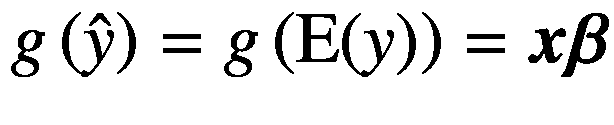。当转换为识别功能时，简化为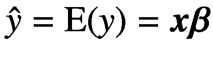。

线性回归在许多应用和科学中被广泛使用，因为它易于可视化。对于图 [14-1](#Fig1) 所示的简单线性回归，模型只是 *xy* 平面中的一条线。对于多元线性回归，它是一个超平面。这些参数很容易确定。此外，有大量的工作广泛而严格地研究线性回归。这个模型和它的特性很好理解。

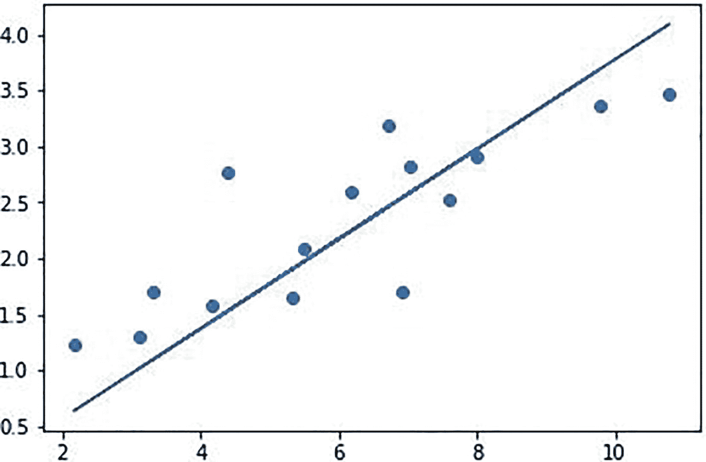

图 14-1

简单线性回归

例如，在金融学中，著名的资本资产定价模型(CAPM)是股票的公平/预期超额收益 E(*R*<sub>*I*</sub>)*R*<sub>*f*</sub>与市场的预期超额收益 E(*R*<sub>*M*</sub>)*R*<sub>*f 之间的简单线性回归因为股票或市场的回报是未知的或随机的，所以我们在它周围放置一个期望算子 E()。资产的超额回报是指高于无风险利率的回报，如政府担保国债的利率。简单的线性回归模型如下:E(*R*<sub>*I*</sub>)=*R*<sub>*f*</sub>+*β*<sub>*I*</sub>(E(*R*<sub>M</sub>*</sub>)—*R*<sub>*f 系数 *β* <sub>*i*</sub> ，称为股票 *i* 的β，衡量预期超额资产收益对预期超额市场收益的敏感度。这是金融中描述股票最重要的特征之一。*</sub>

在经济学中，线性回归是主要的经验工具。它用于预测消费支出、固定投资支出、库存投资、一国出口商品的购买、进口支出、持有流动资产的需求以及劳动力需求和供给。线性回归可用于构建代表时间序列数据长期变化的趋势线。它告诉我们一个特定的数据集(比如 GDP、油价或股价)在一段时间内是上升了还是下降了。趋势线可以简单地用肉眼通过一组数据点画出，但是更合适的是，它们的位置和斜率是使用统计技术计算的，例如线性回归。线性回归也广泛应用于生物学、行为科学、社会科学等。，来描述实验和调查中变量之间可能的关系。它是这些学科中使用的最重要的工具之一。见图 [14-2](#Fig2) 。

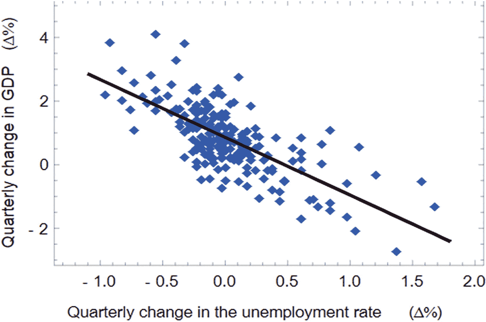

图 14-2

在经济学中，奥肯定律指出，在一个经济体中，GDP 的增长线性地依赖于失业率的变化

假设一个数据由 *n* 个观测值、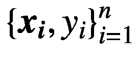组成。每个观察包括一个响应 *y* <sub>* i *</sub> 和 *p* 解释变量***x***<sub>***I***</sub>***=***(*x*<sub>I1</sub>， *x* <sub> * i 数据可以制成表格，如下所示:*</sub>

<colgroup><col class="tcol1 align-left"> <col class="tcol2 align-left"> <col class="tcol3 align-left"> <col class="tcol4 align-left"> <col class="tcol5 align-left"> <col class="tcol6 align-left"></colgroup> 
| 

obs。

 | 

y

 | 

***x***<sub>T5】1</sub>

 | 

***x***<sub>T5】2</sub>

 | 

***⋯***

 | 

***x***<sub>***p***</sub>

 |
| --- | --- | --- | --- | --- | --- |
| one | *y*T2 1 | *x*T2 11 | *x*T2】12 | ***⋯*** | *x*T2】1*p*T5】 |
| Two | *y*T2】2 | *x*T2】21 | *x*T2】22 | ***⋯*** | *x*T2】2*p*T5】 |
| three | *y*T2】3 | *x*T2】31 | *x*T2】32 | ***⋯*** | *x*T2】3*p*T5】 |
|  |  |  |  | ***⋯*** |  |
| n | *y*<sub>T3】nT5】</sub> | *x*<sub>T3】n1</sub> | *x*<sub>T3】n2</sub> | ***⋯*** | *x*<sub>T3】NPT5】</sub> |

在线性模型中，响应*y*<sub>T3】IT5】是解释变量***x***<sub>***I***</sub>的线性函数。即</sub>


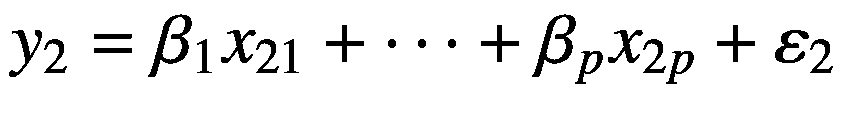


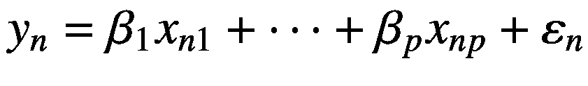

或者，用向量的形式，看起来是这样的:


***x***<sub>***I***</sub>是第*I*-次观测中解释变量的列向量， ***β*** 是我们需要从数据中估计的模型参数的 *p* × 1 向量， 而 *ε* <sub>*i*</sub> 则被称为*残差*说明了 *y* <sub>*i*</sub> 可能由于测量误差或受**<sub>***I***</sub>影响无法解释的随机性。 *ε* <sub>*i*</sub> 是随机变量，因此 *y* <sub>*i*</sub> 也是随机变量。响应值是随机变量 *y* <sub>*i*</sub> 的特定实现。**

 **在矩阵形式中，我们写出如下:


其中![$$ \boldsymbol{y}=\left[\begin{array}{c}{y}_1\\ {}{y}_2\\ {}\vdots \\ {}{y}_n\end{array}\right] $$](img/500382_1_En_14_Chapter_TeX_IEq6.png)、![$$ \boldsymbol{X}=\left[\begin{array}{cccc}{x}_{11}&amp; {x}_{12}&amp; \boldsymbol{\cdots}&amp; {x}_{1p}\\ {}{x}_{21}&amp; {x}_{22}&amp; \boldsymbol{\cdots}&amp; {x}_{2p}\\ {}&amp; &amp; \boldsymbol{\ddots}&amp; \\ {}{x}_{n1}&amp; {x}_{n2}&amp; \boldsymbol{\cdots}&amp; {x}_{np}\end{array}\right] $$](img/500382_1_En_14_Chapter_TeX_IEq7.png)、![$$ \boldsymbol{\beta} =\left[\begin{array}{c}{\beta}_1\\ {}{\beta}_2\\ {}\boldsymbol{\vdots}\\ {}{\beta}_p\end{array}\right] $$](img/500382_1_En_14_Chapter_TeX_IEq8.png)和![$$ \boldsymbol{\varepsilon} =\left[\begin{array}{c}{\varepsilon}_1\\ {}{\varepsilon}_2\\ {}\boldsymbol{\vdots}\\ {}{\varepsilon}_p\end{array}\right] $$](img/500382_1_En_14_Chapter_TeX_IEq9.png)。

解释变量不必是独立的。它们之间可以有任何关系(只要不是线性关系)。例如，将一个小球抛向空中，其高度与时间的关系如下:

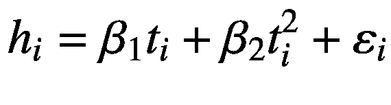

*β* <sub>1</sub> 与球的初速度有关， *β* <sub>2</sub> 与地球引力(de/加速度)成正比。 *ε* <sub>*i*</sub> 是测量误差。这个模型在时间变量 *t* <sub>*i*</sub> 中是非线性(二次)的，但在参数 *β* <sub>1</sub> 和 *β* <sub>2</sub> 中是线性的。它仍然是标准形式的线性模型。

## 14.1 普通最小二乘法

选择模型参数的方法有很多种，***β*****，取决于目标函数和假设条件。一种最常用的方法是普通最小二乘法(OLS)。OLS 最小化给定数据集 *y* <sub>*i*</sub> 中观察到的响应(被观察变量的值)与由解释变量的线性函数预测的拟合值之间的差的平方和。即目标函数给定如下:**

**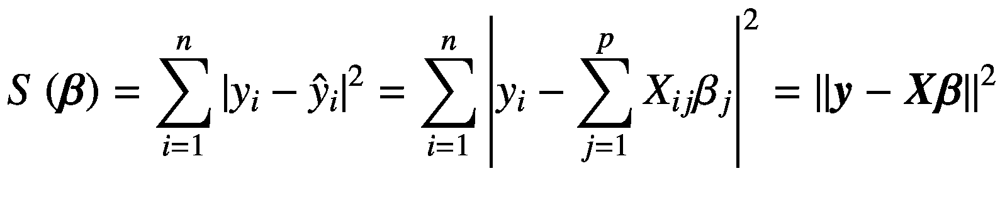**

 **OLSβ是这样选择的，我们有这个(见图 [14-3](#Fig3) ):

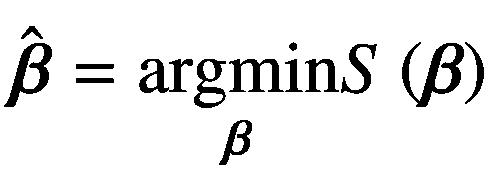

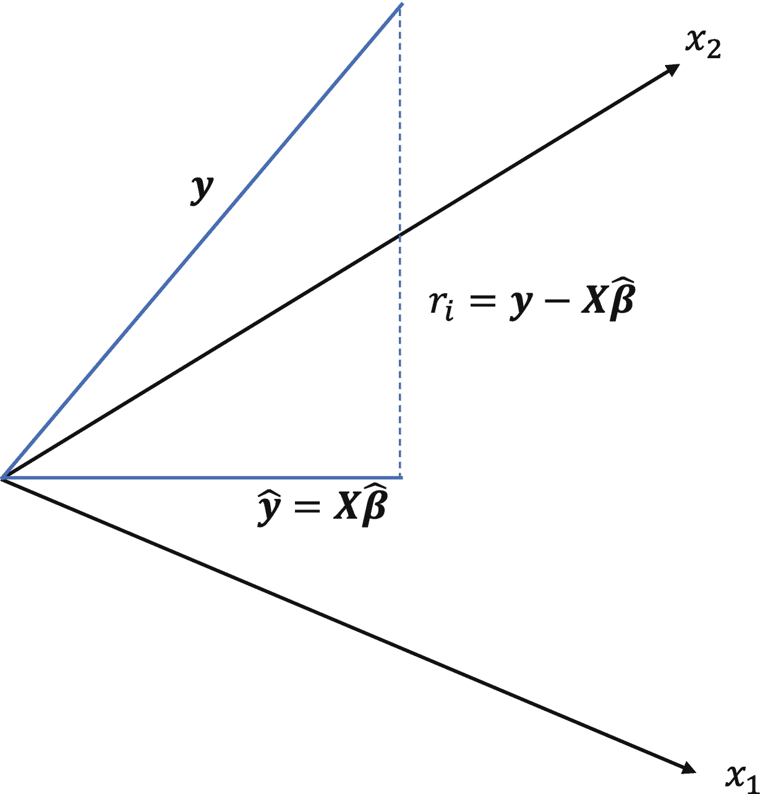

图 14-3

正规方程

可以证明法方程的解如下(见图 [14-4](#Fig4) )。(它被称为正规方程，因为残差***y Xβ***是垂直的，即垂直于 ***X*** 所跨越的空间)。)

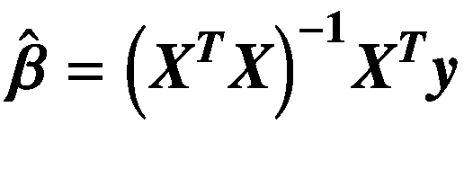

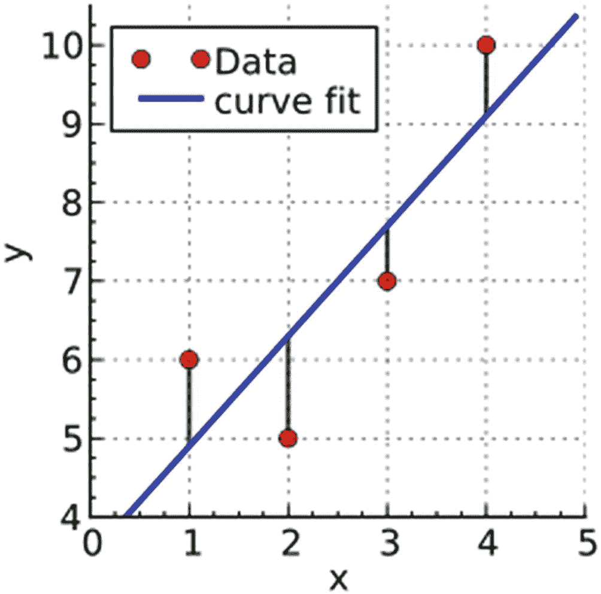

图 14-4

使误差平方和最小的最小二乘估计

因此，我们有了这个:

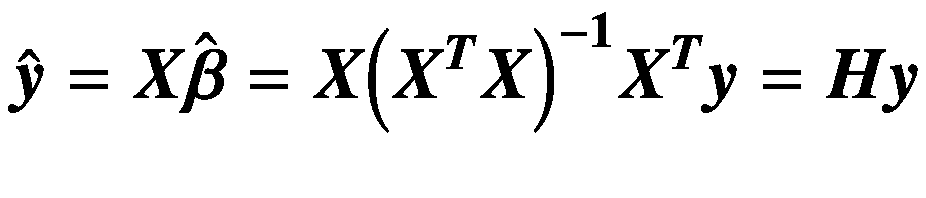

***h = x***(***x***<sup>***t***</sup>***x*****—*****1*****x***<sup>***t***</sup>称为*

### 假设

OLS 理论做出了许多假设。

**正确规格**

线性函数形式必须与实际数据生成过程的形式一致。

**外来性**

外生性是指解释变量与误差不相关，即 e(***x***<sup>***t***</sup>***【ϵ】***)= 0。否则就叫内生性。此外，回归模型中的误差应具有条件均值零。

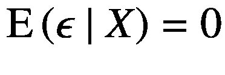

外生性假设的直接后果是误差的均值为零:E( *ϵ* ) = 0。

**没有线性相关性**

解释变量或设计矩阵 ***X*** 必须都是线性无关的。从数学上来说，这意味着矩阵 ***X*** 几乎肯定具有全列秩。


通常还假设 ***X*** 至少到第二个矩为止有有限个矩。那么矩阵***Q***<sub>***XX***</sub>= E(***X***<sup>***T***</sup>***X***/*n*)是有限且半正定的。当这个假设被违反时，设计矩阵被称为线性相关或完全多重共线。

**同方差**

表示误差项在每次观测中具有相同的方差*σ*T3】2。通常情况并非如此，因为均值大的变量通常比均值小的变量具有更大的方差。例如，预测收入为 100，000 美元的人可能很容易获得 80，000 美元或 120，000 美元的实际收入，即大约 20，000 美元的标准偏差。相比之下，另一个预测收入为 10，000 美元的人不太可能有同样的 20，000 美元的标准差，因为这意味着他们的实际收入可能在-10，000 美元和 30，000 美元之间变化。当这个要求被违反时，这被称为异方差。在这种情况下，更有效的估计量(方差较小的估计量)是加权最小二乘法(见 14.2 节)，我们可以对数据中的每个观察值赋予不同的权重。

**无自相关**

误差在观测值之间是不相关的，即 e(***ϵ***<sub>***I***</sub>***ϵ***<sub>*j*</sub>|***x***)= 0 for*I**j*。在时间序列数据、面板数据、聚类样本、分层数据、重复测量数据、纵向数据和其他具有相关性的数据的情况下，这种假设可能会被违反。在这种情况下，广义最小二乘法提供了比 OLS 更好的选择(见 14.3 节)。

**常态**

有时还假设误差具有以解释变量为条件的正态分布。

T2】

这个假设对于 OLS 方法的有效性来说是不需要的，尽管某些额外的有限样本属性(数据集 *n* 的大小是有限的)可以在需要的情况下建立(特别是在假设检验领域)。此外，当误差为正态时，OLS 估计量等价于最大似然估计量(MLE)，因此它在所有正则估计量类中是渐近有效的(当 *n* → ∞时具有最小方差)。重要的是，正态假设仅适用于误差项；与流行的误解相反，响应 *y* 不需要正态分布。

### 模型属性

OLS 估计量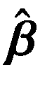和*s*T3】2 在外生假设下是无偏的，这意味着它们的期望值与真实值一致。

和 E(*s*<sup>2</sup>|***X***)=*σ*<sup>2</sup>

*s* <sup>2</sup> 称为回归的标准误差，定义为误差平方和除以问题的自由度。


在误差不相关且均方的假设下，估计量在线性无偏估计量类中是有效的。这被称为最佳线性无偏估计量(蓝色)。这意味着的方差小于任何其他观测值线性组合的估计值的方差。从这个意义上说，OLS 估计量是参数的最佳估计量。特别要注意的是，这个性质与误差的统计分布无关。换句话说，误差的分布函数不必是正态分布。

但是，如果我们假设误差确实是正态分布的， *ε* ~ *N* (0，σ<sup>2</sup>***I***<sub>***N***</sub>)，那么也是正态分布的。


此外，该估计量达到了模型的克拉美-罗界，因此在所有无偏估计量类中是最优的。

解释变量的β系数的绝对值越高，该变量的影响越强。例如，对于同一变量，β值为-0.9 比β值为+0.8 的影响更大。然而，贝塔系数的大小并不能让我们比较变量之间的显著性。例如， *x* <sub>1</sub> 的单位可以是美元，而*x*T6】2 的单位可以是美分。 *x* <sub>1</sub> 的β值为 0.1，而 *x* <sub>2</sub> 的β值为 1.0，这并不意味着 *x* <sub>1</sub> 的β值比 *x* <sub>2</sub> 的β值更重要，因为当用分表示 *x* <sub>1</sub> 时，其β值将变为 10。

标准化贝塔系数以标准差为单位。这意味着变量可以很容易地相互比较。换句话说，标准化 beta 系数是在运行分析之前，如果回归中的变量都转换为 z 得分，您将获得的系数。除以标准误差的系数也称为 t 统计量，遵循学生 t 分布。我们可以使用学生 t 分布来计算标准化β系数的 p 值，以确定其显著性。根据经验，如果β/变量/t 统计量的 t 统计量大于 2.0 或等价的 p 值小于 0.05，则β/变量/t 统计量是显著的。这相当于 5%的显著性水平。假设您的模型指定正确，那么变量有 95%的概率是正确的。

### 残留分析

残差被定义为观察值和解释变量给定值的拟合值之间的差异。注意，在统计学中，残差和误差是两个不同的概念。残差是观测值和模型值的差值；误差是观察值和真实(不可观察)值之间的差异。残差是对误差的估计。

因为回归假设并不总是得到满足，残差分析对于评估线性回归模型(不仅仅是 OLS)的适当性是很重要的。对于简单的线性回归，残差图绘制残差与一个解释变量的关系。理想情况下，残差图应该像零附近的随机噪声一样，没有模式。如果数据显示趋势，回归模型可能是不正确的；例如，真函数可以是二次或更高阶的多项式。如果它们是随机的，或者没有趋势，而是“扇出”，它们表现出异方差性。见图 [14-5](#Fig5) 。

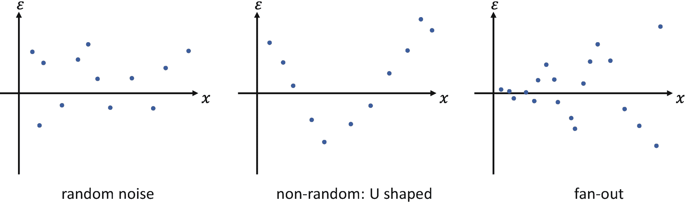

图 14-5

残差图

RSS

有许多统计数据与残差相关联，我们可以使用这些统计数据来评估生成的线性回归模型的拟合程度。由于 OLS 的目标是最小化误差平方和，残差平方和(RSS)测量的是回归无法解释的数据方差。也就是说，RSS 是数据与模型预期的偏差量。

T2】

RMSE

平均误差或偏差称为均方根误差(RMSE)。

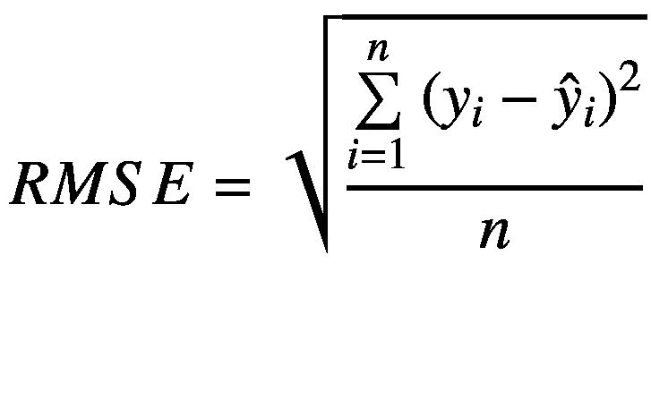T2】

**RSE**

我们还可以将总和除以自由度，即数据的样本大小减去参数的数量，从而得到误差项 *σ* 的标准差的无偏估计值。在这种情况下，我们有剩余标准误差(RSE)。【T2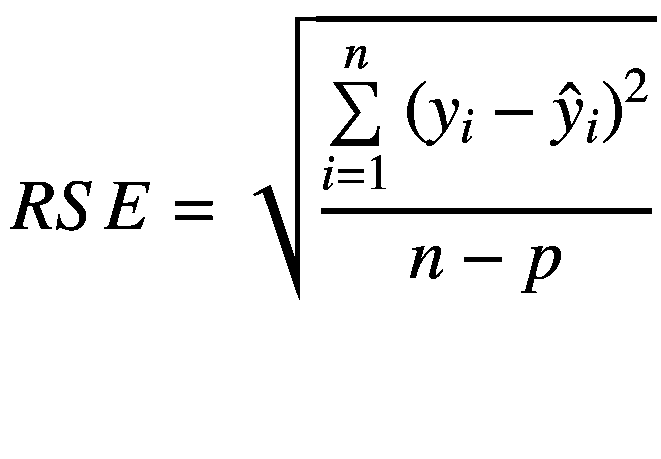

在假设误差 *ε* 呈正态分布的情况下，模型期望和 RSE 给出模型预测的正态分布为 *y* <sub>* i *</sub> 。该分布可用于找到置信区间。 *y* <sub>* i *</sub> 的真值在区间有 68%的几率落地。见图 [14-6](img/#Fig6) 。


图 14-6

模型预测的置信区间

**ESS**

设为响应的样本均值。然后，解释平方和(ESS)测量建模值中有多少变化。

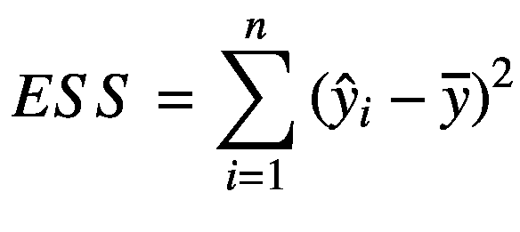

**TSS**

总平方和(TSS)是 ESS 和 RRS 之和。它测量观察到的数据中有多少变化。

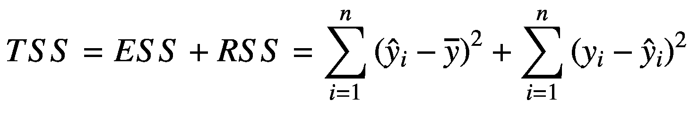T2】

**R 平方**

拟合优度的一个重要度量是决定系数或*R*T2】2。*R*T6】2 定义为模型所解释的数据中变化的比例。该值始终介于 0(0%)和 1(100%)之间。一个模型能够提供的变异解释量越多，其*R*T10】2 的值就越高。

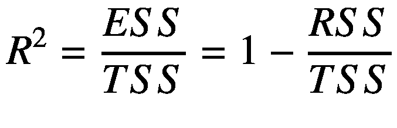

**调整后的 R 平方**

RT2 2 本身并不能说明一个模型是好是坏。好的车型可以有低*R*T6】2。例如，预测人类行为的模型，如心理学，通常具有小于 50%的*R*T10】2 值。预测人类比预测物理过程要困难得多。另一方面，你可以有一个高的*R*T14】2 用于一个坏的模型。例如，如果模型可以解释 100%的方差， *R* <sup>2</sup> = 1，则拟合值将始终等于观察值。所有的数据点将落在拟合的回归线/平面上。事实上，您可以通过不断添加解释变量来任意增加*R*T22】2。 *R* <sup>2</sup> 总是增加，从不减少，即使新变量偶然与响应相关。这是一个典型的过度拟合的例子。你的高 R*R*T30】2 模型可能找不到任何有意义的模式，而仅仅是连接数据中的点。

调整后的*R*<sup>2</sup>，是对模型中解释变量个数进行了调整的 *R* <sup>2</sup> 的修改版。调整后的只有在您添加了将实际改进模型的有用变量时才会增加。如果你在模型中加入无用的变量，它就会减少。调整后的可以是负数，但通常不是。它总是低于*R*T13】2。

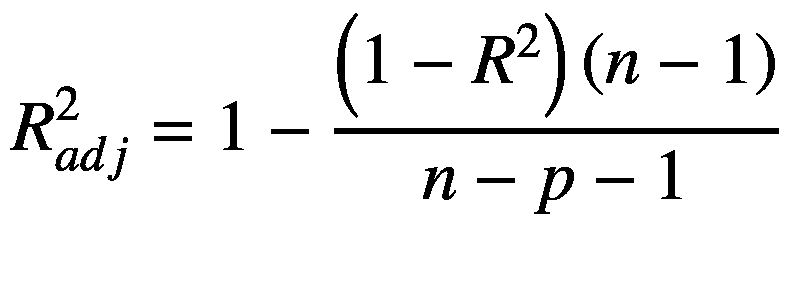

**F-统计量**

β系数的 t 统计量或 p 值表明该系数/变量在 5%的显著性水平上是否显著(见第 14.1.2 节)。这意味着有 5%的可能性是假阳性结果(β实际上不显著)。由于所有这些 t 统计都是独立的，我们模型中的变量越多，它就越有可能(至少)有一个 p 值< 0.05 just by chance. With four explanatory variables, there is a 1 − (1 − 0.05) <sup>4</sup> =至少有一个 p 值<为 0.05 的显著β的概率为 18.5%。或者，有 18.5%的可能性，我们会错误地认为这个模型是有用的。有超过 100 个变量，很可能(99.4%)有一个 p 值为 0.05 的重要 beta，因此我们很可能得出结论，无论实际情况是否如此，该模型都是有用的。因此，我们需要另一种方法来确定线性回归模型是否有用，即，它是否真的至少有一个重要的解释变量不是偶然的。

线性回归模型总体显著性的 F 统计检验。零假设表示任何解释变量和响应之间没有关系。另一种假设认为至少有一个重要变量。在 5%的显著性水平上，如果 F 统计的 p 值小于 0.05，我们可以拒绝零假设，并得出模型有用的结论。可能 F-统计量是不重要的，但是一些β-t-统计量是重要的；在这种情况下，我们会接受零假设，拒绝模型。另一方面，有可能 F 统计量是显著的，但是βt 统计量没有一个是显著的(全部是不显著的，或者小于 2)；在这种情况下，我们拒绝零假设，接受模型。底线是，当涉及到线性回归模型的总体显著性时，我们总是相信与 F 统计量相关的 p 值的统计显著性，而不是每个解释变量的统计显著性。

```py
// F-statistics is insignificant but some of the beta t-statistics are significant
beta hat
beta^ = [3.055264, -0.347572, 0.019219, -4.357924]
beta^ standard error = [0.491998, 0.194540, 0.299207, 3.958854]
beta^ t = [6.209908, -1.786633, 0.064232, -1.100804]
residual F-stat = 0.528805679720477

// F-statistics is significant but none of the beta t-statistics are significant
beta^ = [0.055264, -0.347572, 0.019219, -4.357924]
beta^ standard error = [0.491998, 0.194540, 0.299207, 3.958854]
beta^ t = [0.112326, -1.786633, 0.064232, -1.100804]
residual F-stat = 13.528805679720477

```

### 14.1.4 影响点

回想一下，对于帽子矩阵***H = X***(***X***<sup>***T***</sup>***X***)<sup>***-*****1**</sup>***X***<sup>***T***一个观察可能对回归有不适当的影响，并且根据这个特定的观察是否存在，可能给出不同的结果。参见图 [14-7](#Fig7) 。</sup>

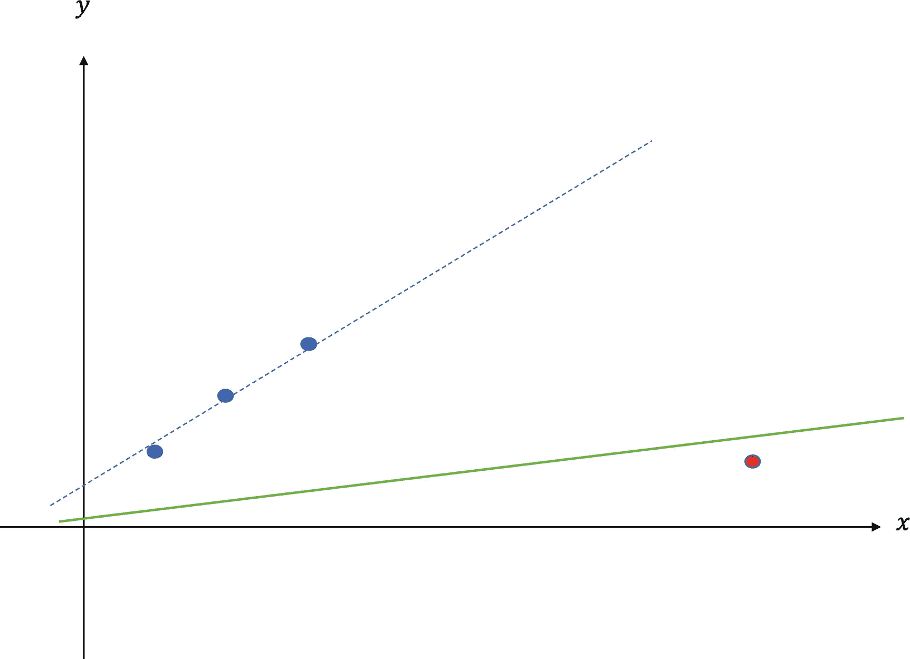

图 14-7

红点对回归的重大影响

例如，在图 [14-7](#Fig7) 中，如果没有红点(最右边的点)，线性回归模型将通过三个蓝点(虚线)。红点的存在将回归线向 x 轴“拉”了很多。据说红点对回归结果有很大影响。OLS 的一个缺点是，它很容易受到数据集中几个有影响的点的影响。

有两种类型的影响点。第一种被称为离群值。异常值是一个数据点，其响应 *y* 不符合其余数据的一般趋势。例如，图 [14-8](#Fig8) 中的红点是一个异常值，因为它有一个极端的 *y* 值。它没有遵循由其他三个蓝点构成的总体趋势。

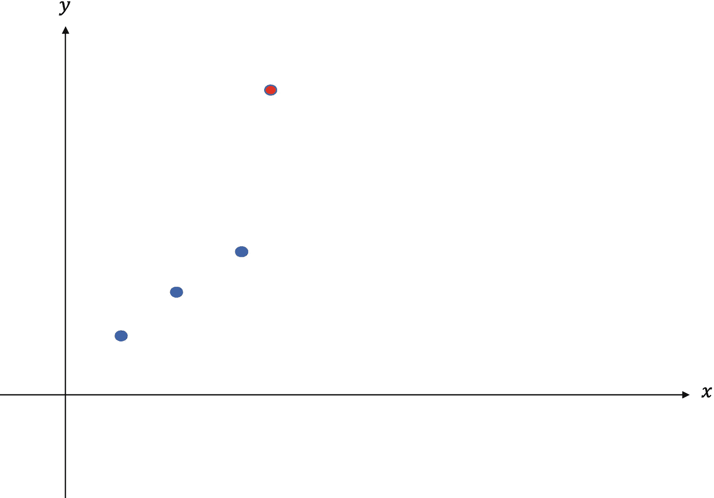

图 14-8

离群者

第二种类型的影响点被称为高杠杆点。如果一个数据点在解释变量或解释变量的线性组合中具有极值，则称该数据点具有高杠杆作用。例如，与其他三个蓝点相比，图 [14-9](#Fig9) 中的红点具有更大的 *x* 值。

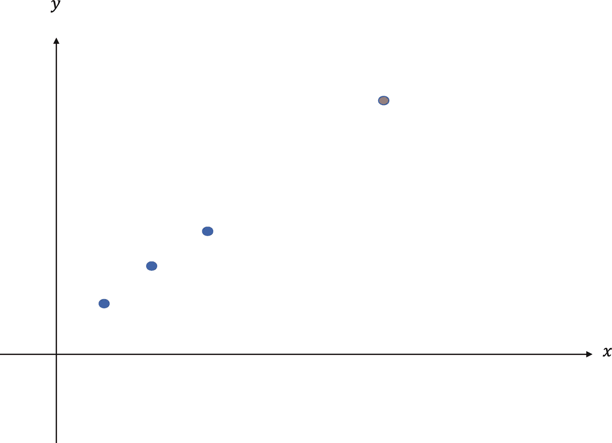

图 14-9

高杠杆点

一个数据点既可以是离群值，也可以有很高的杠杆作用。例如，图 [14-9](#Fig9) 中的红点既有极值 *y* 值，也有极值 *x* 值。评估影响点是否对回归有任何影响(以及有多大影响)的方法是运行两次回归:一次包含该点，另一次不包含该点。然后，我们可以比较两个回归的结果，如拟合的响应、假设检验结果、置信度和预测区间。

**杠杆**

展开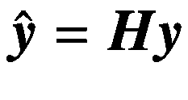给出如下:

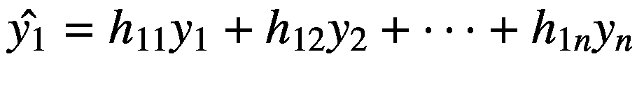

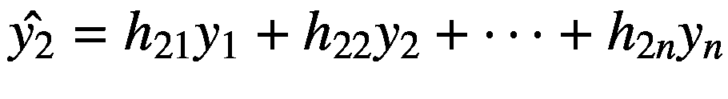


杠杆 *h* <sub>*ii*</sub> ，量化了观察到的响应 *y* <sub>*i*</sub> 对其拟合值的影响。也就是说，如果*h*<sub>*ii*</sub>很小，那么观测响应 *y* <sub>* i *</sub> 在拟合响应的值中只起很小的作用。另一方面，如果*h*<sub>*ii*</sub>大，那么观察响应 *y* <sub>* i *</sub> 在拟合响应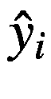的值中起很大作用。这就是为什么它被命名为*杠杆*。

高杠杆数据点可能会对回归结果产生不适当的影响。根据经验，如果一个数据点 *i* 的杠杆率是平均杠杆率的三倍，则称该数据点具有高杠杆率。【T2

由于 *h* <sub>*ii*</sub> 是解释变量 ***X*** 的线性组合，一个极值*h*<sub>*ii*</sub>在*X*-值中隐含一个大的线性组合。数据点实际上是否有影响也取决于观察到的反应*y*T20】T21 IT23】。

**学生化残差**

极端的 *y* 值表示异常值，但是普通残差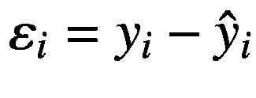不是量化异常值的好方法，因为它的大小取决于测量单位，例如美元对美分。消除单位的一种方法是将残差除以其标准偏差的估计值，从而获得所谓的标准化残差。

标准化残差(也称为内部学生化残差)被定义为每个观察值， *i* = 1，…， *n* ，作为普通残差除以其标准偏差的估计值:

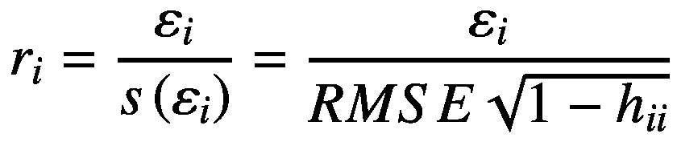

给定数据点的标准化残差不仅取决于普通残差*ε*<sub>T3】IT5】还取决于均方根误差(RMSE)及其杠杆 *h* <sub>*ii*</sub> 。</sub>

标准化残差的一个问题是，潜在异常值的存在可能会将回归“拉”向它，以至于该特定数据点不会被“标记”为异常值。为了解决这个问题，我们可以一次删除一个观察值，每次我们在剩余的*n*1 个观察值上拟合一个新的回归。我们将观察到的响应*y*<sub>T5】IT7】与基于删除了第 *i* 次观察的回归模型的拟合响应进行比较。第 *i* 条删除残差定义如下:</sub>


具有大量删除残差的数据点表明该数据点是有影响的，因为它的存在“移动”了回归线。

外部学生化残差或简单学生化残差是删除残差除以其估计标准差。可以证明它等于普通残差除以基于删除了第 *i* 个观测值、*RMSE*T4(*I*)、杠杆 *h* <sub>*ii*</sub> 的回归模型的均方根误差。也就是


根据经验，如果|*t*<sub>*I*</sub>|>3，我们认为数据点是异常值。

dffits

为了评估一个有影响的点的影响，比如说第 *i* 个数据点，想法是运行两个回归，一个包括第 *i* 个数据点，一个删除第 *i* 个数据点；然后我们比较两个模型的拟合响应。这就是配合差异(DFFITS)背后的思想。

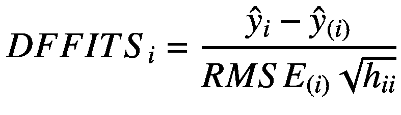

分子是在有和没有第 *i* 个数据点的情况下运行回归时拟合响应之间的差异。分母是分子/差的估计标准偏差。换句话说， *DFFITS* <sub>*i*</sub> 测量当第 *i* 个数据点被移除时标准偏差数量的变化。

根据经验，数据点 *i* 被认为是有影响的，如果:

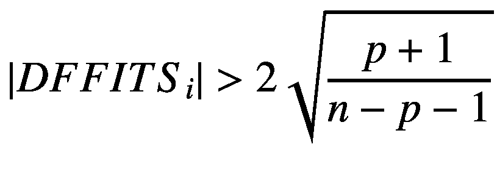

**库克的距离**

库克的距离定义如下:


定义取决于残差(对于极端的 *y* 值)和杠杆(对于极端的 *x* 值)。它测量删除第 *i* 个观察值时所有拟合值的变化程度。凭经验，如果*D*<sub>*I*</sub>>0.5，数据点可能有影响；如果*D*<sub>*I*</sub>>1，该数据点很可能是有影响的；如果 *D* <sub>*i*</sub> 比其他厨子的距离大很多，那么数据点几乎肯定是有影响的。在图 [14-10](#Fig10) 中，有一个数据点的库克距离(红色虚线)刚刚超过 0.5。值得考虑是否将其包括在回归中，因为它具有一些杠杆作用。

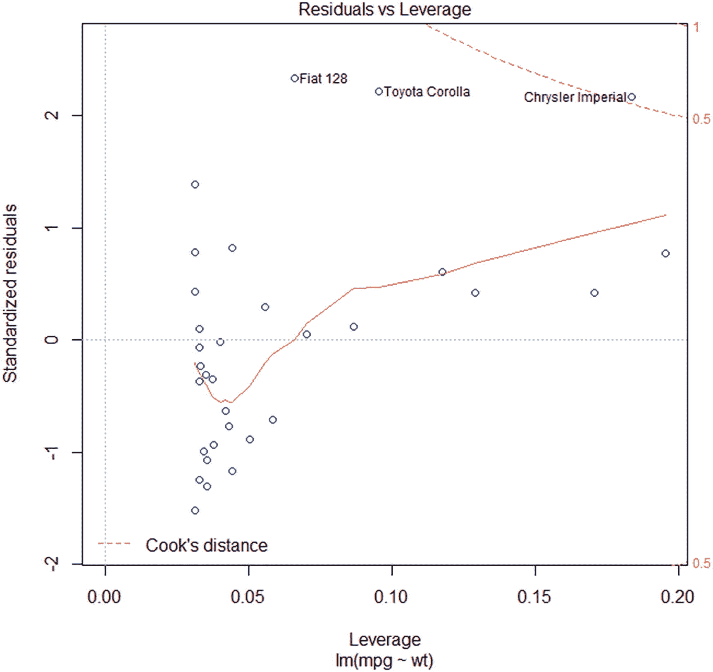

图 14-10

mtcars 数据集中每个数据点的影响

### 信息标准

给定一组数据的多个竞争模型，信息标准(IC)估计每个模型相对于每个其他模型的质量，并根据 IC 值对它们进行排序。这提供了一种选择模型的方法。例如，具有最低 IC 的那个可以被选为最佳模型。使用 IC 值，我们可以推断前三个模型在一个等级中，其余的要差得多。然而，指定一个值是相当武断的，超过这个值，给定的模型将被“拒绝”请注意，IC 值不能说明模型的绝对质量，只能说明相对于其他模型的质量。如果所有候选模型都不适合，IC 不会给出任何警告。因此，使用 IC 选择模型后，验证模型的绝对质量通常是一个好的做法。这种验证通常包括检查模型的残差(以确定残差是否像白噪声)和测试模型的预测。

AIC

一般来说，当使用统计模型来表示产生数据的真实过程时，模型几乎从来不是精确的表示。使用模型表示会丢失信息。阿凯克信息标准(AIC)估计给定模型丢失的相对信息量:模型丢失的信息越少，模型的质量越高。在估算一个模型丢失的信息量时，AIC 处理了模型的拟合优度和模型的简单性之间的权衡。换句话说，AIC 既要应对过度适应的风险，也要应对适应不足的风险。AIC 奖励拟合优度(由似然函数评估，或者在线性回归模型的情况下由 *RSS* 评估)，它还包括惩罚，该惩罚是估计参数数量的增函数，以阻止过度拟合。具体来说，数学定义如下:


BIC

贝叶斯信息准则(BIC)的公式类似于 AIC 的公式，但对参数数量有不同的惩罚。AIC 惩罚系数是 2，而 BIC 惩罚系数是 ln *n* 。总的来说，BIC 对自由参数的惩罚比 AIC 更严厉。【T2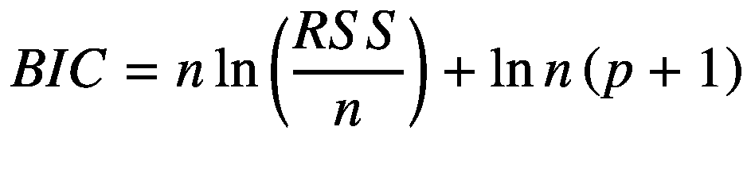

有人指出，AIC 和 BIC 适合不同的任务。特别是，BIC 被认为是从一组候选模型中选择“真实模型”(即生成数据的过程)的合适人选，如果“真实模型”在该组中，而 AIC 则不合适。具体来说，如果“真实模型”在候选集合中，那么 BIC 将选择概率为 1 的“真实模型”为 *n* → ∞。相反，当通过 AIC 进行选择时，概率可能小于 1。然而，有人认为这个问题是不相关的，因为“真实模型”实际上从来不在候选集中。的确，“所有的模型都是错的”，这是统计学中常见的格言；因此，“真实模型”(即现实)不能在候选集中。

另一项研究提出了一个模拟研究，允许“真实模型”在候选集中。特别地，模拟表明，即使“真实模型”在候选集合中，AIC 有时也会选择比 BIC 好得多的模型。原因是，对于有限的 *n* ，BIC 可能有从候选集合中选择坏模型的巨大风险。即使当 *n* 远大于 *p* <sup>2</sup> 时，这个原因也会出现。有了 AIC，选择一个非常糟糕的模型的风险被降到了最低。如果“真实模型”不在候选集中，那么我们最希望做的就是选择最接近“真实模型”的模型在某些假设下，AIC 适合于寻找最佳近似模型。在回归中，在假设“真实模型”不在候选集中的情况下，AIC 对于选择具有最小均方误差的模型是渐近最优的。在这个假设下，BIC 不是渐近最优的。

### 14.1.6 纳米开发线性回归包

NM Dev 有一个广泛的软件包，可以使用各种回归方法解决许多类型的线性模型问题:普通最小二乘法(未加权，第 14.1 节；和加权、14.2 节)、广义线性模型(14.4 节)、logistic 回归(14.3 节)、逐步回归(14.5 节)LASSO(14.6 节)。为了构建和分析线性模型，我们首先构建一个`LMProblem`。该类签名如下:

```py
/**
 * Construct a linear regression problem.
 *
 * @param y         the dependent variables
 * @param X         the factors
 * @param intercept {@code true} if to additionally add an intercept term to
 *                  the linear regression
 * @param weights   the weights assigned to each observation
 */
public LMProblem(Vector y, Matrix X, boolean intercept, Vector weights)

```

应用 NM Dev 包中的任何回归方法都会生成一个`LinearModel`对象。接口签名如下:

```py
public interface LinearModel {

    /**
     * Gets \(\hat{\beta}\) and statistics.
     *
     * @return \(\hat{\beta}\) and statistics
     */
    public LMBeta beta();

    /**
     * Gets the residual analysis of an OLS regression.
     *
     * @return the residual analysis
     */
    public LMResiduals residuals();

    /**
     * Computes the expectation \(E(y(x))\) given an input.
     *
     * @param x an input
     * @return \(E(y(x))\)
     */
    public double Ey(Vector x); // TODO: confidence intervals, prediction intervals
}

```

这个`LinearModel`对象包含估计贝塔帽`LMBeta`、预测方法`Ey`和残差`LMResiduals.`的结果，函数`Ey`可用于计算模型拟合值。`LMBeta`包含 beta 帽子的期望值、估计 beta 的协方差矩阵、它们的标准误差和 t 统计。该类签名如下:

```py
public abstract class LMBeta {

    /**
     * Gets the coefficient estimates, <i>&beta;^</i>.
     *
     * @return the coefficient estimates, <i>&beta;^</i>
     */
    public ImmutableVector betaHat();

    /**
     * Gets the covariance matrix of the coefficient estimates, <i>&beta;^</i>.
     *
     * @return the covariance matrix of the coefficient estimates,
     *         <i>&beta;^</i>
     */
    public abstract ImmutableMatrix covariance();

    /**
     * Gets the standard errors of the coefficients <i>&beta;^</i>.
     *
     * @return the standard errors of the coefficients <i>&beta;^</i>
     */
    public ImmutableVector stderr();

    /**
     * Gets the t- or z- value of the regression coefficients <i>&beta;^</i>.
     *
     * @return the t- or z- value of the regression coefficients <i>&beta;^</i>
     */
    public ImmutableVector t();
}

```

类`LMResiduals`包含许多关于残差及其分析的信息。该类签名如下:

```py
public class LMResiduals {

    /**
     * Gets the fitted values, <i>y^</i>.
     *
     * @return the fitted values, <i>y^</i>
     */
    public ImmutableVector fitted();

    /**
     * Gets the residuals, <i>&epsilon;</i>, the differences between sample and
     * fitted values.
     *
     * @return the residuals, <i>&epsilon;</i>
     */
    public ImmutableVector residuals();

    /**
     * Gets the weighted, fitted values.
     *
     * @return the weighted, fitted values
     */
    public ImmutableVector weightedFittedValues();

    /**
     * Gets the weighted residuals.
     *
     * @return the weighted residuals
     */
    public ImmutableVector weightedResiduals();

    /**
     * Gets the diagnostic measure: sum of squared residuals, \(\sum
     * \epsilon^2\).
     *
     * @return sum of squared residuals, \(\sum \epsilon^2\)
     */
    public double RSS();

    /**
     * Gets the diagnostic measure: total sum of squares, \(\sum (y-y_mean)^2
     * \).
     *
     * @return total sum of squares, \(\sum (y-y_mean)^2 \)
     */
    public double TSS();

    /**
     * Gets the diagnostic measure: R-squared.
     *
     * @return R-squared
     */
    public double R2();

    /**
     * Gets the diagnostic measure: adjusted R-squared
     *
     * @return adjusted R-squared
     */
    public double AR2();

    /**
     * Gets the standard error of the residuals.
     *
     * @return the standard error of the residuals
     */
    public double stderr();

    /**
     * Gets the diagnostic measure: F statistics
     * <blockquote><pre><i>
     * mean of regression / mean squared error =
     * sum((y_i_hat-y_mean)^2) / mean squared error =
     * [(TSS-RSS)/n] / [RSS/(m-n)]
     * </i></pre></blockquote>
     * <i>y_i_hat</i> are the fitted values of the regression.
     *
     * @return F statistics
     * @see "Kutner, Nachtsheim and Neter, "p.69, equation (2.60)," Applied
     * linear regression
     * models. 4th edition."
     */
    public double Fstat();

    /**
     * Gets the projection matrix, H-hat.
     *
     * @return the projection matrix
     * @see "Sanford Weisberg, "p.168, Section 8.1, Chapter 8," Applied Linear
     * Regression, 3rd
     * edition, 2005\. Wiley-Interscience."
     */
    public ImmutableMatrix hHat();

    /**
     * Gets the leverage.
     * The bigger the leverage for an observation, the bigger influence on the
     * prediction.
     *
     * @return the leverage
     */
    public ImmutableVector leverage();

    /**
     * <i>standard residual = residual / v1 / sqrt(RSS / (n-m))</i>
     *
     * @return standardized residuals
     */
    public ImmutableVector standardized();

    /**
     * <i>studentized residual = standardized * sqrt((n-m-1) /
     * (n-m-standardized^2))</i>
     *
     * @return studentized residuals
     * @see
     * <ul>
     * <li>"Chatterjee, Hadi and Price, "p.90 (4.15), Section 4.3," Regression
     * Analysis by Example,
     * 3rd edition, 2000\. Wiley Series in Probability and Statistics."</li>
     * <li>@see
     * <a href="http://en.wikipedia.org/wiki/Studentized_residual">Wikipedia:
     * Studentized
     * residual</a></li>
     * </ul>
     */
    public ImmutableVector studentized();

    /**
     * Gets the degree of freedom.
     * <p/>
     * TODO: User should be able to modify this method for a different
     * regression.
     *
     * @return the degree of freedom
     */
    public int df();

```

类`LMDiagnostics`计算影响点。该类签名如下:

```py
public class LMDiagnostics {

    /**
     * DFFITS, Welsch and Kuh Measure.
     *
     * @return DFFITS
     * @see
     * <ul>
     * <li>"Chatterjee, Hadi and Price, "p.105 (4.23), Section 4.9.2, Regression
     * Analysis by Example," 3rd edition, 2000\. Wiley Series in Probability and
     * Statistics."</li>
     * <li>"David A. Belsley, Edwin Kuh, Roy E. Welsch, Regression diagnostics:
     * identifying influential data and sources of collinearity. Wiley series in
     * probability and mathematical statistics. New York: John Wiley & Sons.
     * ISBN 0471058564\. 1980."</li>
     * </ul>
     */
    public ImmutableVector DFFITS;

    /**
     * Cook distances.
     *
     * @return Cook distances
     * @see "Sanford Weisberg, "p.200," Applied Linear Regression, 3rd edition,
     * 2005.
     * Wiley-Interscience."
     */
    public ImmutableVector cookDistances();

    /**
     * Hadi's influence measure.
     *
     * @return Hadi's influence measure
     * @see "Chatterjee, Hadi and Price, "p.105 (4.24), Section 4.9.2,"
     * Regression Analysis by Example, 3rd edition, 2000\. Wiley Series in
     * Probability and Statistics."
     */
    public ImmutableVector Hadi();

```

类`LMInformationCriteria`计算模型的 AIC 和 BIC。

类`OLSRegression`，以一个`LMProblem`作为输入，运行 OLS 回归并产生一个`LinearModel`。该类签名如下:

```py
public class OLSRegression implements LinearModel {

    /**
     * Constructs an <tt>OLSRegression</tt> instance.
     *
     * @param problem the linear regression problem to be solved
     * @param epsilon a precision parameter: when a number |x| &le; &epsilon;,
     *                it is considered 0
     */
    public OLSRegression(LMProblem problem, double epsilon;
}

```

下面是一个解决 OLS 问题的例子。

响应向量如下:

![$$ \boldsymbol{y}=\left[\begin{array}{c}2.32\\ {}0.452\\ {}4.53\\ {}12.34\\ {}32.2\end{array}\right] $$](img/500382_1_En_14_Chapter_TeX_Equak.png)

解释变量的设计矩阵如下:

![$$ X=\left[\begin{array}{ccc}1.52&amp; 2.23&amp; 4.31\\ {}3.22&amp; 6.34&amp; 3.46\\ {}4.32&amp; 12.2&amp; 23.1\\ {}10.1034&amp; 43.2&amp; 22.3\\ {}12.1&amp; 2.12&amp; 3.27\end{array}\right] $$](img/500382_1_En_14_Chapter_TeX_Equal.png)

```py
// construct a linear model problem
LMProblem problem = new LMProblem(
        // the independent variable, y
        new DenseVector(new double[]{2.32, 0.452, 4.53, 12.34, 32.2}),
        // the design matrix of dependent variable, X
        new DenseMatrix(
                new double[][]{
                    {1.52, 2.23, 4.31},
                    {3.22, 6.34, 3.46},
                    {4.32, 12.2, 23.1},
                    {10.1034, 43.2, 22.3},
                    {12.1, 2.12, 3.27}
                }),
        true // with intercept
);

// solve an OLS problem
OLSRegression ols = new OLSRegression(problem);

System.out.println("beta hat");
// the means of betas
System.out.println("beta^ = " + ols.beta().betaHat());
// the standard errors of betas
System.out.println("beta^ standard error = " + ols.beta().stderr());
// a beta/variable is significant if its t-stat is bigger than 2
System.out.println("beta^ t = " + ols.beta().t());

System.out.println("\nresiduals");
System.out.println("residual F-stat = " + ols.residuals().Fstat());
System.out.println("fitted values: " + ols.residuals().fitted());
System.out.println("residuals: " + ols.residuals().residuals());
System.out.println("residual standard error = " + ols.residuals().stderr());
System.out.println("RSS = " + ols.residuals().RSS());
System.out.println("TSS = " + ols.residuals().TSS());
System.out.println("R2 = " + ols.residuals().R2());
System.out.println("AR2 = " + ols.residuals().AR2());

System.out.println("\ninfluential points");
System.out.println("standarized residuals: " + ols.residuals().standardized());
System.out.println("studentized residuals: " + ols.residuals().studentized());
System.out.println("leverage/hat values: " + ols.residuals().leverage());
System.out.println("DFFITS: " + ols.diagnostics().DFFITS());
System.out.println("cook distances: " + ols.diagnostics().cookDistances());
System.out.println("Hadi: " + ols.diagnostics().Hadi());

System.out.println("\ninformation criteria");
System.out.println("AIC = " + ols.informationCriteria().AIC());
System.out.println("BIC = " + ols.informationCriteria().BIC());

```

输出包含了我们在前面几节中提到的所有结果和统计数据。

```py
beta hat
beta^ = [3.055264, -0.347572, 0.019219, -4.357924]
beta^ standard error = [0.491998, 0.194540, 0.299207, 3.958854]
beta^ t = [6.209908, -1.786633, 0.064232, -1.100804]

residuals
residual F-stat = 13.528805679720477
fitted values: [-0.406176, 3.342917, 5.044391, 11.924108, 31.936759]
residuals: [2.726176, -2.890917, -0.514391, 0.415892, 0.263241]
residual standard error = 4.036867249675668
RSS = 16.29629719150399
TSS = 677.7046112
R2 = 0.9759536870161641
AR2 = 0.9038147480646566

influential points
standarized residuals: [1.000000, -1.000000, -1.000000, 1.000000, 1.000000]
studentized residuals: [0.000000, 0.000000, 0.000000, 0.000000, 0.000000]
leverage/hat values: [0.543943, 0.487159, 0.983763, 0.989386, 0.995748]
DFFITS: [0.000000, 0.000000, 0.000000, 0.000000, 0.000000]
cook distances: [0.298178, 0.237481, 15.147200, 23.304136, 58.542696]
Hadi: [8.546417, 9.160788, 64.654821, 97.259457, 238.187865]

information criteria
AIC = 30.096885349082104
BIC = 28.144074911252606

```

## 14.2 加权最小二乘法

OLS 的一个重要假设是同方差，这意味着所有的误差或残差具有相同的常方差。这种假设在很多实际应用中往往是无效的。如收入的例子所示，高收入者往往比低收入者有更大的差异。方差的大小通常取决于值的大小。加权最小二乘(WLS)是 OLS 的扩展，用于解决异方差问题，即所有误差或残差都有不同的方差。数学上，对于这里所示的回归模型:

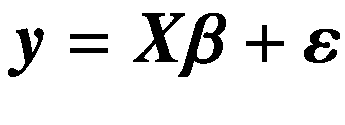

假设我们可以用误差的标准偏差来衡量每个观察值。

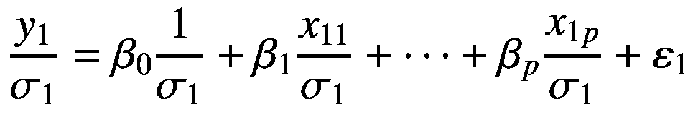


T11】

那么这个比例模型具有恒定的误差方差。误差平方和如下:

![$$ S\left({\beta}_0,\dots, {\beta}_p\right)=\sum \limits_{i=1}^n{\left[\frac{y_i}{\sigma_i}-\left({\beta}_0\frac{1}{\sigma_i}+{\beta}_1\frac{x_{i1}}{\sigma_i}+\cdots +{\beta}_p\frac{x_{ip}}{\sigma_i}\right)\right]}^2=\sum \limits_{i=1}^n{\sigma_i}^{-2}{\left[{y}_i-\left({\beta}_0+{\beta}_1{x}_{i1}+\cdots +{\beta}_p{x}_{ip}\right)\right]}^2 $$](img/500382_1_En_14_Chapter_TeX_Equar.png)

系数*w*<sub>*I*</sub>=*σ*<sub>*I*</sub><sup>—2</sup>本质上是分配给观测值的权重。

正常方程如下:

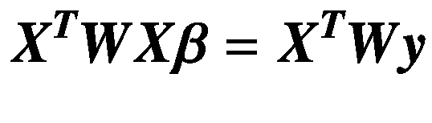

其中 ***W*** 是一个 *n* × *n* 对角权重矩阵。


权重可以扩展到更一般的情况，在这种情况下，我们希望对观察值赋予不同的重要性。例如，我们可能希望将回归模型集中在数据(或实验)的某些部分，这些部分很难、很昂贵或很费时地重现。我们可能更倾向于更精确和可靠的数据，而不太倾向于估计和不可靠的数据。值得注意的是，每个观察值的权重是相对于其他观察值的权重给出的，因此不同的绝对权重集可以产生相同的效果。权重的总和不一定是 1。

为了求解正规方程，我们找到最小化该目标函数的。


贝塔帽子的 WLS 估计量如下:

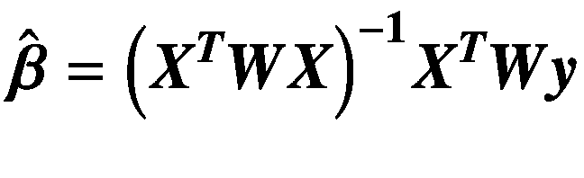

实际上，我们可能不知道确切的权重和方差。使用估计的权重可能会产生不好的结果，尤其是当权重是根据小样本估计的时候。WLS 也有离群值的问题。当我们无意中通过给一个异常值一个大的权重来增加它的影响时，这个问题就更加明显了。

在 NM Dev 中，类`OLSRegression`可以将权重作为输入来执行 WLS。这里有一个例子:

```py
// construct a linear model problem
LMProblem problem = new LMProblem(
        // the independent variable, y
        new DenseVector(new double[]{2.32, 0.452, 4.53, 12.34, 32.2}),
        // the design matrix of dependent variable, X
        new DenseMatrix(
                new double[][]{
                    {1.52, 2.23, 4.31},
                    {3.22, 6.34, 3.46},
                    {4.32, 12.2, 23.1},
                    {10.1034, 43.2, 22.3},
                    {12.1, 2.12, 3.27}
                }),
        // with intercept
        true,
        // the weights assigned to each observation
        new DenseVector(new double[]{0.2, 0.4, 0.1, 0.3, 0.1})); // do not sum to 1

// solve a weighted OLS problem
OLSRegression ols = new OLSRegression(problem);

System.out.println("beta hat");
// the means of betas
System.out.println("beta^ = " + ols.beta().betaHat());
// the standard errors of betas
System.out.println("beta^ standard error = " + ols.beta().stderr());
// a beta/variable is significant if its t-stat is bigger than 2
System.out.println("beta^ t = " + ols.beta().t());

System.out.println("\nresiduals");
System.out.println("residual F-stat = " + ols.residuals().Fstat());
System.out.println("fitted values: " + ols.residuals().fitted());
System.out.println("weighted residuals: " + ols.residuals().weightedResiduals());
System.out.println("residuals: " + ols.residuals().residuals());
System.out.println("residual standard error = " + ols.residuals().stderr());
System.out.println("RSS = " + ols.residuals().RSS());
System.out.println("TSS = " + ols.residuals().TSS());
System.out.println("R2 = " + ols.residuals().R2());
System.out.println("AR2 = " + ols.residuals().AR2());

System.out.println("\ninfluential points");
System.out.println("standarized residuals: " + ols.residuals().standardized());
System.out.println("studentized residuals: " + ols.residuals().studentized());
System.out.println("leverage/hat values: " + ols.residuals().leverage());
System.out.println("DFFITS: " + ols.diagnostics().DFFITS());
System.out.println("cook distances: " + ols.diagnostics().cookDistances());
System.out.println("Hadi: " + ols.diagnostics().Hadi());

System.out.println("\ninformation criteria");
System.out.println("AIC = " + ols.informationCriteria().AIC());
System.out.println("BIC = " + ols.informationCriteria().BIC());

```

输出如下所示:

```py
beta hat
beta^ = [3.105333, -0.379722, 0.119115, -5.651285]
beta^ standard error = [0.707175, 0.257982, 0.428017, 3.876511]
beta^ t = [4.391181, -1.471895, 0.278296, -1.457828]

residuals
residual F-stat = 6.986438687095603
fitted values: [-1.264570, 2.352592, 5.882717, 11.975437, 31.507745]
weighted residuals: [1.603069, -1.202040, -0.427767, 0.199680, 0.218910]
residuals: [3.584570, -1.900592, -1.352717, 0.364563, 0.692255]
residual standard error = 2.070146550717054
RSS = 4.285506741445716
TSS = 94.10679701818182
R2 = 0.9544612410874239
AR2 = 0.8178449643496957

influential points
standarized residuals: [1.000000, -1.000000, -1.000000, 1.000000, 1.000000]
studentized residuals: [-0.000000, -0.000000, -0.000000, -0.000000, 0.000000]
leverage/hat values: [0.400344, 0.662840, 0.957302, 0.990696, 0.988818]
DFFITS: [-0.000000, -0.000000, -0.000000, -0.000000, 0.000000]
cook distances: [0.166906, 0.491488, 5.605022, 26.620466, 22.106825]
Hadi: [10.659025, 8.000590, 26.598499, 110.519428, 92.472535]

information criteria
AIC = 31.753261426689598
BIC = 29.8004509888601

```

## 14.3 逻辑回归

考虑一下这个问题:一组 20 名学生花 0 到 6 个小时准备考试。学习时间的长短如何影响学生通过考试的概率？下表给出了数据。它显示了每个学生花在学习上的小时数，以及他们是通过(1)还是失败(0)。请注意，1 和 0 是名义上的响应，这意味着 1 和 0 只是标签或类别。说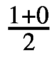或者 1 > 0 都没有意义。

<colgroup><col class="tcol1 align-left"> <col class="tcol2 align-left"> <col class="tcol3 align-left"> <col class="tcol4 align-left"> <col class="tcol5 align-left"> <col class="tcol6 align-left"> <col class="tcol7 align-left"> <col class="tcol8 align-left"> <col class="tcol9 align-left"> <col class="tcol10 align-left"> <col class="tcol11 align-left"> <col class="tcol12 align-left"> <col class="tcol13 align-left"> <col class="tcol14 align-left"> <col class="tcol15 align-left"> <col class="tcol16 align-left"> <col class="tcol17 align-left"> <col class="tcol18 align-left"> <col class="tcol19 align-left"> <col class="tcol20 align-left"> <col class="tcol21 align-left"></colgroup> 
| 小时 | Zero point five | Zero point seven five | One | One point two five | One point five | One point seven five | One point seven five | Two | Two point two five | Two point five | Two point seven five | Three | Three point two five | Three point five | Four | Four point two five | Four point five | Four point seven five | Five | Five point five |
| 及格 | Zero | Zero | Zero | Zero | Zero | Zero | one | Zero | one | Zero | one | Zero | one | Zero | one | one | one | one | one | one |

我们不能使用 OLS，因为最主要的反应， *y* ，不是数字，而是标签。假设我们使用通过概率， *p* = Pr ( *y* = 1)，作为因变量。我们仍然不能使用 OLS，因为 *p* 的范围是[0，1]而不是(∞，∞)。我们可以使用 logit 函数来转换范围。它也被称为对数优势，因为它是优势比的对数。参见图 [14-11](img/#Fig11) 。


图 14-11

logit 或对数奇数函数

我们的转换建立了一个线性回归问题，使得响应( *p* )的函数(logit)是独立变量(小时)的线性模型。也就是


我们可以通过对 log-odds 取幂来恢复通过的概率，如下图:

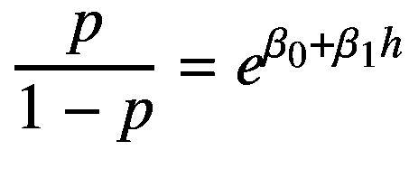

或者等价地，


其中 *S* 是 sigmoid 函数。见图 [14-12](#Fig12) 。

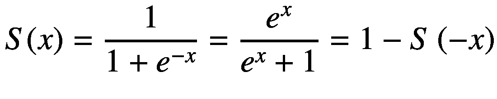


图 14-12

sigmoid 函数

对转换后的问题运行 OLS 回归，或运行逻辑回归，会得到以下结果:

<colgroup><col class="tcol1 align-left"> <col class="tcol2 align-left"> <col class="tcol3 align-left"> <col class="tcol4 align-left"> <col class="tcol5 align-left"></colgroup> 
|   | 

β有

 | 

标准误差

 | 

T 状态

 | 

p 值

 |
| --- | --- | --- | --- | --- |
| 拦截 | -4.0777 | 1.7610 | -2.316 | 0.0206 |
| 小时 | 1.5046 | 0.6287 | Two point three nine three | 0.0167 |

输出表明，学习小时数与通过考试的概率显著相关，p 值为 0.0167 < 5 percent. We can compute the probability of a passing exam ( *y* = 1)，是学习小时数的函数( *h* )。


图 [14-13](#Fig13) 显示了通过考试的概率函数，作为学习小时数的函数。


图 14-13

逻辑回归结果显示通过考试的概率与学习小时数之间的关系

NM Dev 类`LogisticRegression`对一个`LMProblem`执行逻辑回归。下面的代码片段解决了我们之前讨论的问题:

```py
// construct a linear model problem
LMProblem problem = new LMProblem(
        // the independent variable, y, {pass, fail}
        new DenseVector(new double[]{0, 0, 0, 0, 0, 0, 1, 0, 1, 0, 1, 0, 1, 0, 1, 1, 1, 1, 1, 1}),
        // the design matrix of dependent variable, X, number of hours of study
        new DenseMatrix(
                new double[][]{
                    {0.5},
                    {0.75},
                    {1.},
                    {1.25},
                    {1.5},
                    {1.75},
                    {1.75},
                    {2.},
                    {2.25},
                    {2.5},
                    {2.75},
                    {3.},
                    {3.25},
                    {3.5},
                    {4.},
                    {4.25},
                    {4.5},
                    {4.75},
                    {5.},
                    {5.5}
                }),
        // with intercept
        true);

// solve a logistic regression problem
LogisticRegression logistic = new LogisticRegression(problem);

System.out.println("beta hat");
// the means of betas
System.out.println("beta^ = " + logistic.beta().betaHat());
// the standard errors of betas
System.out.println("beta^ standard error = " + logistic.beta().stderr());
// a beta/variable is significant if its t-stat is bigger than 2
System.out.println("beta^ t = " + logistic.beta().t());

System.out.println("\nresiduals");
System.out.println("fitted values: " + logistic.residuals().fitted());
System.out.println("deviance residuals: " + logistic.residuals().devianceResiduals());
System.out.println("deviance: " + logistic.residuals().deviance());
System.out.println("null deviance: " + logistic.residuals().nullDeviance());

System.out.println("\ninformation criteria");
System.out.println("AIC = " + logistic.AIC());

```

输出如下所示:

```py
beta hat
beta^ = [1.504645, -4.077713]
beta^ standard error = [0.628721, 1.760994]
beta^ t = [2.393185, -2.315574]

residuals
fitted values: [0.034710, 0.049773, 0.070892, 0.100029, 0.139344, 0.190837, 0.190837, 0.255703, 0.333530, 0.421627, 0.515011, 0.607359, 0.692617, 0.766481, 0.874448, 0.910278, 0.936624, 0.955611, 0.969097, 0.985194]
deviance residuals: [-0.265808, -0.319544, -0.383485, -0.459113, -0.547834, -0.650775, 1.820076, -0.768525, 1.481905, -1.046456, 1.152013, -1.367376, 0.857062, -1.705574, 0.518002, 0.433603, 0.361867, 0.301346, 0.250561, 0.172721]
deviance: 16.059756928689346
null deviance: 27.725887222397812

information criteria
AIC = 20.059756928689346

```

## 14.4 广义线性模型

有许多情况是 OLS 不适用的(我们已经看到两个)，比如异方差；离散、二元或分类响应；受限范围内的响应，例如[0，1]，而不是整个实数线(∞，∞)；和非正态的概率分布。(注意，对解释变量没有限制。)广义线性模型(GLM)放松了 OLS 的许多限制性假设，为更广泛的问题提供了(仍然)线性回归的框架。

考虑简单线性回归的情况。它最适用于如图 [14-14](#Fig14) 所示的数据:聚集在趋势线上的连续数据，响应和误差正态分布，误差恒定方差。

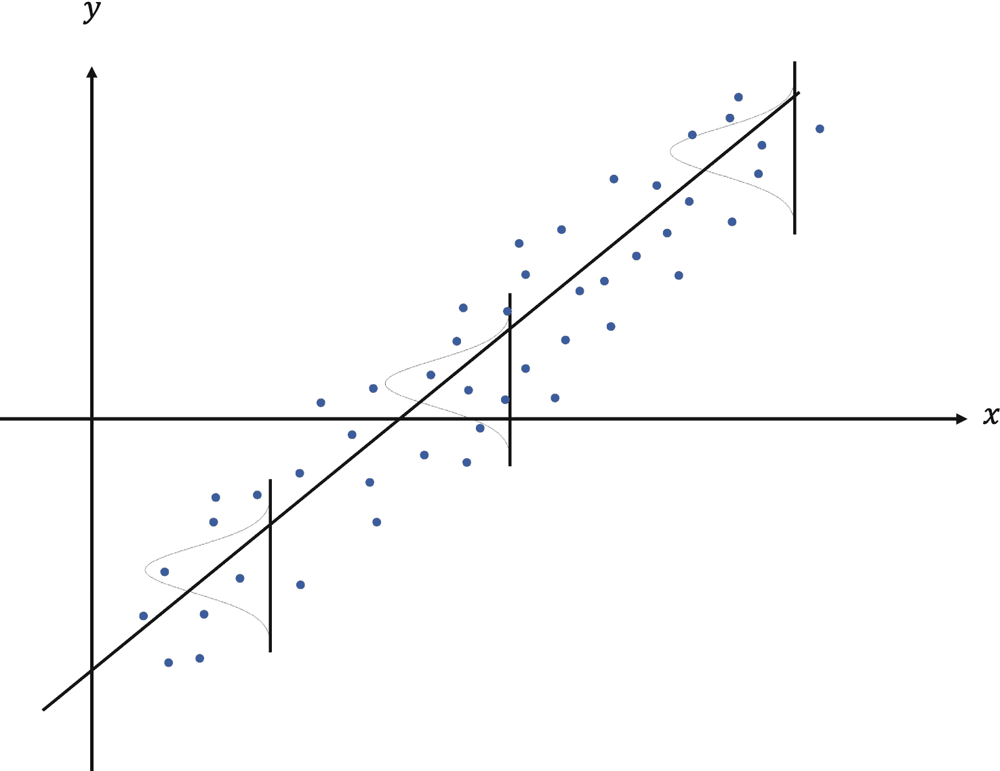

图 14-14

OLS 回归

数学上，线性预测器，*b*<sub>0</sub>+*b*<sub>1</sub>*x*，预测响应的均值 *y* <sub>*i*</sub> 。那么 *y* <sub>*i*</sub> 是由一个先验分布决定的，在这种情况下是方差恒定的正态分布 *ε* 在这种情况下。


考虑另一组数据，比如生活在后院的兔子数量与时间的关系，如图 [14-15](#Fig15) 所示。人口是随机的，因为他们的出生和死亡(例如，被我吃了)是不确定的。如果我们在这些点上画一条线，曲线看起来更像指数曲线而不是直线(非线性)。随着 *t* 变大(异方差)，点扩展得更多。兔子数量是一个正整数(离散的，有限的范围)。显然，OLS 不适用于这个数据集，因为它违反了几乎所有的假设。

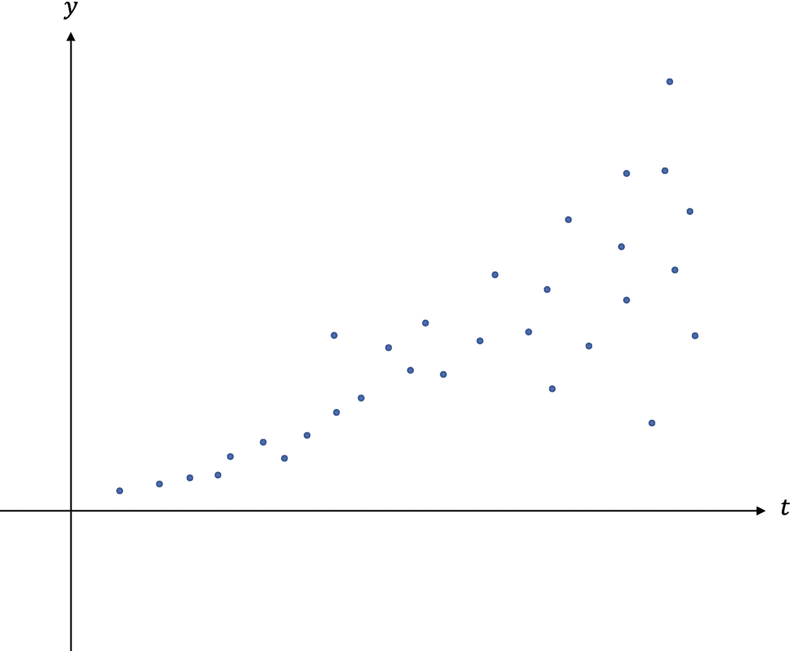

图 14-15

兔子数量与时间的关系

为了确定响应的概率分布和范围，我们不使用正态分布，而是使用泊松分布。泊松分布是给出计数概率的离散概率分布。它只有一个参数， *λ* ，恰好是分布的均值，也是方差。参见第 12.3.5 节。一旦我们通过预测函数确定了平均值，方差和泊松分布就完全确定了。我们可以用更大的 *λ* 来代表更大的 *t* 来模拟随时间增加的方差。

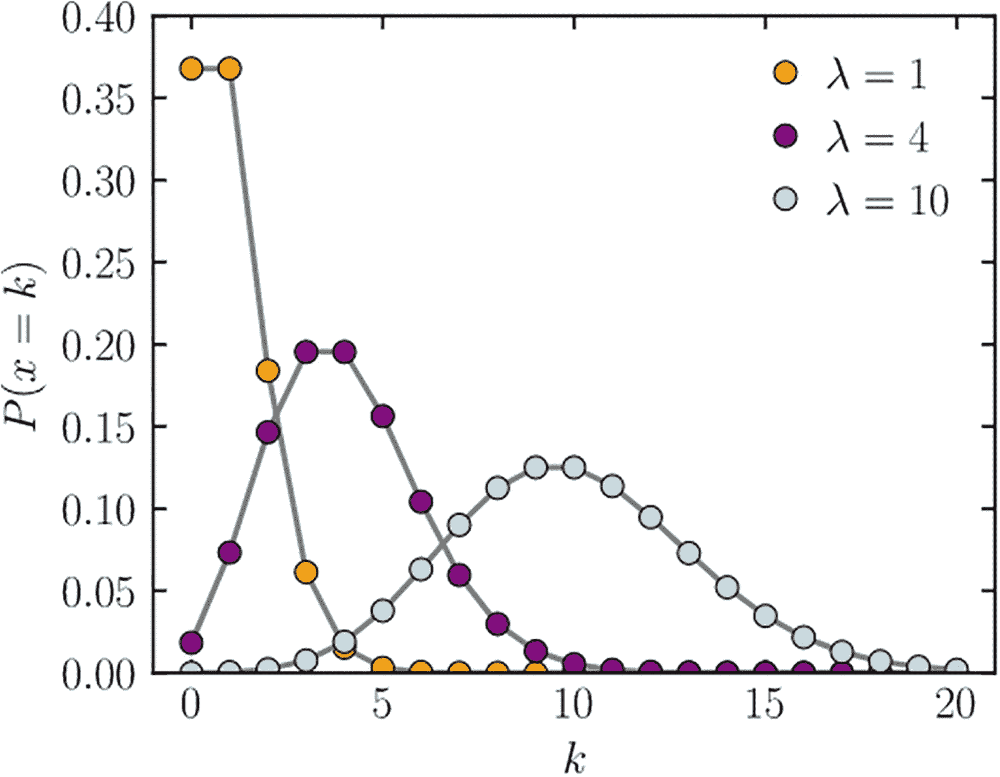

图 14-16

泊松分布的概率质量函数

为了固定点之间的回归线，我们可以对预测值进行变换，以匹配分布的期望值。在 OLS，预测值是期望值。直线回归线是使用恒等函数“链接”预测值和期望值的结果。为了模拟指数曲线，我们可以用指数函数来代替。也就是


或者等价地，


这种回归(泊松分布、线性预测、指数函数)称为泊松回归。结果如图 [14-17](#Fig17) 所示。不同方差的泊松分布叠加在指数回归线上。

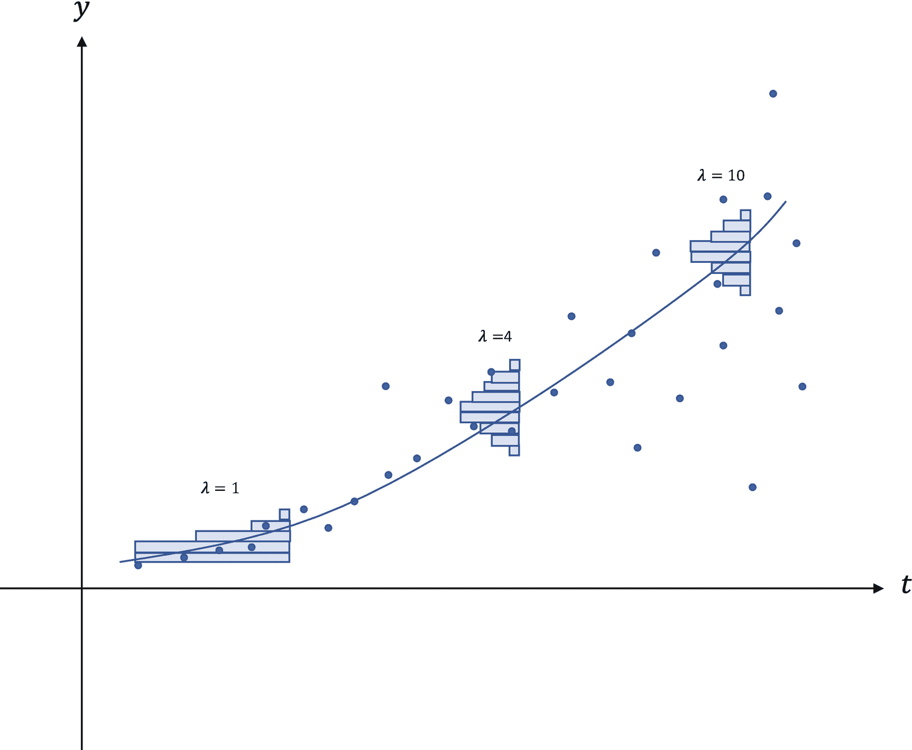

图 14-17

泊松回归

广义线性模型(GLM)通过适应变化的方差以及残差和响应的替代分布，扩展了线性建模的应用范围。GLM 统一了许多其他的统计模型。WLS、逻辑回归和泊松回归都是 GLM 框架中的特例。所有的 GLM 回归都有三个共同的要素。第一，系统的、确定性的成分是预测函数，它是解释变量 ***Xβ*** 的线性组合。第二，随机分量是残差/响应的概率分布的规格。这些分布都来自指数分布族，其特征在于一些均值函数(规范或位置参数)和方差函数(离差参数)。来自指数族的概率分布的概率密度函数的一般形式如下:

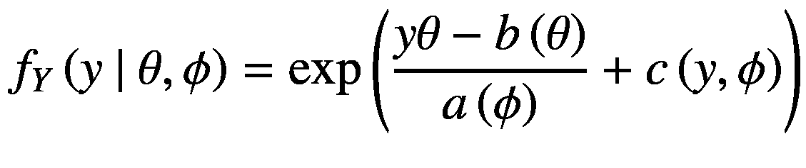

其中参数 *θ* 为正则参数， *b* ( *θ* )为累积量函数， *ϕ* 为色散参数。NM Dev 接口`GLMExponentialDistribution`代表这一系列指数概率分布。

第三，通常表示为 *g* 的链接函数将系统分量和随机分量链接在一起。它的逆变换将预测值转换为概率分布的平均值。数学上，我们有


下表总结了各种 GLM 回归的这三个组成部分及其在 NM Dev 中的支持:

<colgroup><col class="tcol1 align-left"> <col class="tcol2 align-left"> <col class="tcol3 align-left"> <col class="tcol4 align-left"> <col class="tcol5 align-left"></colgroup> 
| 

回归模型

 | 

响应变量

 | 

概率分布

 | 

典范链接函数

 | 

NM 开发类

 |
| --- | --- | --- | --- | --- |
| 线性回归 | 连续测量 | 标准 | 身份 | `GLMGaussian` |
| 逻辑回归 | 二进制的 | 二项式 | 分对数 | `GLMBinomial` |
| 泊松回归 | 计数 | 泊松 | 原木 | `GLMPoisson` |
|   | 幸存 | 微克 | 原木 | `GLMGamma` |
|   |   |   |   | `GLMInverseGaussian` |

在 NM Dev 中，要运行 GLM 回归，我们需要首先使用类`GLMProblem`构建一个问题实例。该类签名如下:

```py
/**
 * Construct a GLM problem.
 *
 * @param y         the dependent variables
 * @param X         the factors
 * @param intercept {@code true} if to add an additional intercept term to
 *                  the linear regression
 * @param family    the exponential family distribution of the mean
 */
public GLMProblem(
        Vector y,
        Matrix X,
        boolean intercept,
        GLMFamily family
)

```

类`GeneralizedLinearModel`运行 GLM 回归。该类签名如下:

```py
/**
 * Construct a {@code GeneralizedLinearModel} instance.
 *
 * @param problem the generalized linear regression problem to be solved
 * @param fitting the fitting method, c.f., {@link GLMFitting}
 */
public GeneralizedLinearModel(GLMProblem problem, GLMFitting fitting)

```

参数`fitting`指定用于估计回归参数的方法。默认的估计方法是迭代加权最小二乘算法(IWLS)。这是一种最大似然算法。

以下示例使用二项式分布和 logit link 函数运行 GLM 回归:

```py
// construct a linear model problem
GLMProblem problem = new GLMProblem(
        // the independent variable, y
        new DenseVector(new double[]{1, 1, 0, 1, 1}),
        // the design matrix of dependent variable, X
        new DenseMatrix(
                new double[][]{
                    {1.52},
                    {3.22},
                    {4.32},
                    {10.1034},
                    {12.1}
                }),
        // with intercept
        true,
        // use the binomial distribution
        new GLMFamily(new GLMBinomial()));

// solve a GLM regression problem
GeneralizedLinearModel glm = new GeneralizedLinearModel(problem);

System.out.println("beta hat");
// the means of betas
System.out.println("beta^ = " + glm.beta().betaHat());
// the standard errors of betas
System.out.println("beta^ standard error = " + glm.beta().stderr());
// a beta/variable is significant if its t-stat is bigger than 2
System.out.println("beta^ t = " + glm.beta().t());

System.out.println("\nresiduals");
System.out.println("fitted values: " + glm.residuals().fitted());
System.out.println("deviance residuals: " + glm.residuals().devianceResiduals());
System.out.println("deviance: " + glm.residuals().deviance());
System.out.println("over dispersion: " + glm.residuals().overdispersion());

System.out.println("\ninformation criteria");
System.out.println("AIC = " + glm.AIC());

```

输出如下所示:

```py
beta hat
beta^ = [0.165250, 0.487592]
beta^ standard error = [0.328662, 1.917517]
beta^ t = [0.502798, 0.254283]

residuals
fitted values: [0.676727, 0.734914, 0.768787, 0.896338, 0.923234]
deviance residuals: [0.883727, 0.784859, -1.711383, 0.467841, 0.399681]
deviance: 4.704428247887891
over dispersion: 1.0

information criteria
AIC = 8.70442824788789

```

以下示例使用泊松分布和对数链接函数运行 GLM 回归:

```py
// construct a linear model problem
GLMProblem problem = new GLMProblem(
        // the independent variable, y
        new DenseVector(new double[]{4, 1, 4, 5, 7}),
        new DenseMatrix(
                // the design matrix of dependent variable, X
                new double[][]{
                    {1.52, 2.11},
                    {3.22, 4.32},
                    {4.32, 1.23},
                    {10.1034, 8.43},
                    {12.1, 7.31}
                }),
        // with intercept
        true,
        // use the binomial distribution
        new GLMFamily(new GLMPoisson()));

// solve a GLM regression problem
GeneralizedLinearModel glm = new GeneralizedLinearModel(problem);

System.out.println("beta hat");
// the means of betas
System.out.println("beta^ = " + glm.beta().betaHat());
// the standard errors of betas
System.out.println("beta^ standard error = " + glm.beta().stderr());
// a beta/variable is significant if its t-stat is bigger than 2
System.out.println("beta^ t = " + glm.beta().t());

System.out.println("\nresiduals");
System.out.println("fitted values: " + glm.residuals().fitted());
System.out.println("deviance residuals: " + glm.residuals().devianceResiduals());
System.out.println("deviance: " + glm.residuals().deviance());
System.out.println("over dispersion: " + glm.residuals().overdispersion());

System.out.println("\ninformation criteria");
System.out.println("AIC = " + glm.AIC());

```

输出如下所示:

```py
beta hat
beta^ = [0.159667, -0.126816, 0.952348]
beta^ standard error = [0.107230, 0.154416, 0.470909]
beta^ t = [1.489023, -0.821261, 2.022359]

residuals
fitted values: [2.528082, 2.505862, 4.419947, 4.465919, 7.080190]
deviance residuals: [0.852544, -1.083724, -0.203045, 0.247925, -0.030194]
deviance: 2.0048958300580386
over dispersion: 1.0

information criteria
AIC = 23.8245863701111

```

### 14.4.1 准家庭

过度分散是指在给定的统计模型下，数据集中存在比预期更大的可变性或差异。由于指数分布规定了均值和方差之间的特定关系，因此使用 GLM 对离散数据建模尤为常见。比如泊松分布，均值等于方差，都是 *λ* 。离散数据集可能具有平均值 *λ* ，但是表现出比 *λ* 更大的可变性。

解决这一问题的一种方法是在泊松模型中引入一个离差参数*【σ*<sup>2</sup>，使得响应的修正条件方差如下:

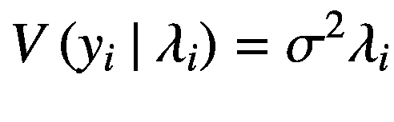

如果 *σ* <sup>2</sup> > 1，那么响应的条件方差比其均值增加得更快。没有符合此规格的指数族分布可用于 GLM。相反，我们将直接指定条件均值和条件方差，就像前面的缩放方差方程一样。虽然没有似然函数(由于没有概率密度函数)，但 GLM 的最大似然估计的通常过程产生回归系数的所谓拟似然估计，它具有最大似然估计的许多性质。事实上，这种过度分散的方法给出了同样的估计。然而，估计的标准误差必须乘以系数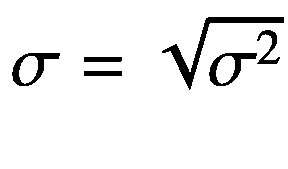。

NM Dev 库支持许多准发行版。界面是`QuasiDistribution`。该类签名如下:

```py
public interface QuasiDistribution extends GLMExponentialDistribution {

    /**
     * the quasi-likelihood function corresponding to a single observation
     * <i>Q(&mu;; y)</i>
     *
     * @param mu <i>&mu;</i>
     * @param y  <i>y</i>
     * @return <i>Q(&mu;; y)</i>
     *
     * @see "P. J. MacCullagh and J. A. Nelder, <i>Generalized Linear
     * Models,</i> 2nd ed. Chapter 9\. Table 9.1\. p.326."
     */
    public double quasiLikelihood(double mu, double y);

    /**
     * the quasi-deviance function corresponding to a single observation
     *
     * @param y  <i>y</i>
     * @param mu <i>&mu;</i>
     * @return <i>D(y; &mu;;)</i>
     *
     * @see "P. J. MacCullagh and J. A. Nelder, <i>Generalized Linear
     * Models,</i> 2nd ed. Chapter 9\. Eq. 9.4., the integral form, p.327."
     */
    public double quasiDeviance(double y, double mu);
}

```

NM Dev 支持的准分布如下:

*   `QuasiBinomial`

*   `QuasiGamma`

*   `QuasiGaussian`

*   `QuasiInverseGaussian`

*   `QuasiPoisson`

以下示例使用准二项分布和 logit 链接函数运行 OLS 回归:

```py
// construct a linear model problem
QuasiGLMProblem problem = new QuasiGLMProblem(
        // the independent variable, y
        new DenseVector(new double[]{1, 1, 0, 1, 1}),
        // the design matrix of dependent variable, X
        new DenseMatrix(
                // the design matrix of dependent variable, X
                new double[][]{
                    {1.52},
                    {3.22},
                    {4.32},
                    {10.1034},
                    {12.1}
                }),
        // with intercept
        true,
        new QuasiFamily(
                new QuasiBinomial(), // the quasi-binomial distribution
                new LinkLogit() // logit link function
        ));

// solve a GLM regression problem
GeneralizedLinearModelQuasiFamily glm
        = new GeneralizedLinearModelQuasiFamily(problem);

System.out.println("beta hat");
// the means of betas
System.out.println("beta^ = " + glm.beta().betaHat());
// the standard errors of betas
System.out.println("beta^ standard error = " + glm.beta().stderr());
// a beta/variable is significant if its t-stat is bigger than 2
System.out.println("beta^ t = " + glm.beta().t());

System.out.println("\nresiduals");
System.out.println("fitted values: " + glm.residuals().fitted());
System.out.println("deviance residuals: " + glm.residuals().devianceResiduals());
System.out.println("deviance: " + glm.residuals().deviance());
System.out.println("over dispersion: " + glm.residuals().overdispersion());

```

输出如下所示:

```py
beta hat
beta^ = [0.165250, 0.487592]
beta^ standard error = [0.396316, 2.312236]
beta^ t = [0.416966, 0.210875]

residuals
fitted values: [0.676727, 0.734914, 0.768787, 0.896338, 0.923234]
deviance residuals: [0.883727, 0.784859, -1.711383, 0.467841, 0.399681]
deviance: 4.704428247887892
over dispersion: 1.4540719510495013

```

请注意，过度离差为 1.454 > 1。否则，使用常规泊松分布将很难拟合该数据集。

以下示例使用准正态分布和反向链接函数运行 OLS 回归:

```py
// construct a linear model problem
QuasiGLMProblem problem = new QuasiGLMProblem(
        // the independent variable, y
        new DenseVector(new double[]{1, 1, 0, 1, 1}),
        // the design matrix of dependent variable, X
        new DenseMatrix(
                new double[][]{
                    {1.52},
                    {3.22},
                    {4.32},
                    {10.1034},
                    {12.1}
                }),
        // with intercept
        true,
        new QuasiFamily(
            new QuasiGaussian(), // the quasi-normal distribution
               new LinkInverse() // inverse link function
        ));

// solve a GLM regression problem
GeneralizedLinearModelQuasiFamily glm
        = new GeneralizedLinearModelQuasiFamily(problem);

System.out.println("beta hat");
// the means of betas
System.out.println("beta^ = " + glm.beta().betaHat());
// the standard errors of betas
System.out.println("beta^ standard error = " + glm.beta().stderr());
// a beta/variable is significant if its t-stat is bigger than 2
System.out.println("beta^ t = " + glm.beta().t());

System.out.println("\nresiduals");
System.out.println("fitted values: " + glm.residuals().fitted());
System.out.println("deviance residuals: " + glm.residuals().devianceResiduals());
System.out.println("deviance: " + glm.residuals().deviance());
System.out.println("over dispersion: " + glm.residuals().overdispersion());

```

输出如下所示:

```py
beta hat
beta^ = [-0.045443, 1.566066]
beta^ standard error = [0.083658, 0.800455]
beta^ t = [-0.543192, 1.956470]

residuals
fitted values: [0.668008, 0.704356, 0.730060, 0.903390, 0.984046]
deviance residuals: [0.331992, 0.295644, -0.730060, 0.096610, 0.015954]
deviance: 0.7401995829806532
over dispersion: 0.24673319432688443

```

请注意，过度分散为 0.2467 < 1，表明数据集呈现出分散不足。

## 14.5 逐步回归

对于具有许多可能的解释变量的高维数据集，我们可能不知道哪个子集应该包含在回归模型中。选择解释变量的系统方法是逐步回归。在每一步中，基于一些预先指定的标准，考虑将一个变量添加到解释变量集或从解释变量集中减去。通常，这采用一系列 f 检验或 t 检验的形式，但其他技术也是可能的，如调整后的 *R* <sup>2</sup> 、AIC、BIC 等。

有三种主要方法。正向选择包括从模型中没有变量开始，使用选择的模型拟合标准测试每个变量的添加，添加其包含给出拟合的最具统计显著性改进的变量(如果有的话)，并重复该过程，直到没有变量将模型改进到具有统计显著性的程度。NM Dev 类`ForwardSelection`实现了这样一个过程。以下示例使用 AIC 作为选择标准，对 GLM 模型运行逐步向前选择:

```py
// read the birth weight data from a csv file
double[][] birthwt
        = DoubleUtils.readCSV2d(
this.getClass().getClassLoader().getResourceAsStream("birthwt.csv"),
                true,
                true
        );

// convert the csv file into a matrix for manipulation
Matrix A = new DenseMatrix(birthwt);
// the independent variable, y
Vector y = A.getColumn(1);
// the design matrix of dependent variable, X
Matrix X = MatrixFactory.columns(A, 2, A.nCols() - 1); // ignore last column

// construct a linear model problem
GLMProblem problem = new GLMProblem(
        y, // responses
        X, // explanatory variables
        true, // with intercept
        new GLMFamily(new GLMBinomial()) // GLM with binomial distribution
);

// run a step-wise forward selection on covariates
ForwardSelection forwardSelection
        = new ForwardSelection(problem, new SelectionByAIC());

System.out.println("selection sequence:");
System.out.println(Arrays.toString(forwardSelection.getFlags()));

```

输出是一次添加一个协变量的选择序列。

```py
selection sequence:
[0, 2, 3, 4, 5, 6, 7, 0]

```

反向消除包括从所有候选变量开始，使用选择的模型拟合标准测试每个变量的删除，删除其损失导致模型拟合的统计上最不显著的恶化的变量(如果有的话)，并重复该过程，直到在没有统计上不显著的拟合损失的情况下不能删除更多的变量。NM Dev 类`BackwardElimination`实现了这样一个过程。以下示例使用 AIC 作为消除标准，对 GLM 模型运行逐步向后消除:

```py
// read the birth weight data from a csv file
double[][] birthwt
        = DoubleUtils.readCSV2d(
this.getClass().getClassLoader().getResourceAsStream("birthwt.csv"),
                true,
                true
        );

// convert the csv file into a matrix for manipulation
Matrix A = new DenseMatrix(birthwt);
// the independent variable, y
Vector y = A.getColumn(1);
// the design matrix of dependent variable, X
Matrix X = MatrixFactory.columns(A, 2, A.nCols() - 1); // ignore last column

// construct a linear model problem
GLMProblem problem = new GLMProblem(
        y, // responses
        X, // explanatory variables
        true, // with intercept
        new GLMFamily(new GLMBinomial()) // GLM with binomial distribution
);

BackwardElimination backwardElimination
        = new BackwardElimination(problem, new EliminationByAIC());

System.out.println("elimination sequence:");
System.out.println(Arrays.toString(backwardElimination.getFlags()));

```

输出是一次消除一个协变量的消除序列。

```py
elimination sequence:
[0, 2, 3, 4, 5, 6, 7, 0]

```

双向消去法是两者的结合，在每一步测试要包含或排除的变量。逐步回归的主要缺点包括参数估计中的偏差、模型选择算法中的不一致、多重假设检验的固有(但经常被忽视)问题以及不适当的关注或依赖单一最佳模型。这些方法只是在某些情况下提高了预测的准确性，例如当只有少数协变量与结果有很大关系时。然而，在其他情况下，它们会增加预测误差。

## 14.6 套索

最小绝对收缩和选择算子(LASSO)是另一种自动/系统的变量选择方法。它使用正则化或惩罚的大小，贝塔系数的总和，迫使他们中的一些为零，有效地从模型中排除他们。与逐步回归(一次考虑一个变量的贪婪算法)相反，LASSO 同时全局选择所有重要变量。数学上，LASSO 以*ℓ*T2】1 正则化为约束，解决了残差平方和(RSS)问题。

、s.t .，***【β】***

 *NM Dev 类`ConstrainedLASSOProblem`构造了这样一个问题。该类签名如下:

```py
/**
 * Constructs a LASSO problem in the constrained form.
 *
 * @param y the vector of response variable <i>(n * 1)</i>, properly
 *          demeaned and scaled
 * @param X the design matrix of factors <i>(n * m)</i>, properly demeaned
 *          and scaled
 * @param t the penalization parameter
 */
public ConstrainedLASSOProblem(Vector y, Matrix X, double t)

```

等价地，我们可以将拉格朗日形式的约束问题写成无约束最小化问题。

T2】

其中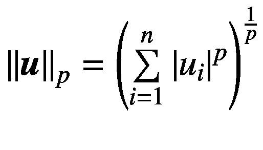是标准*ℓ*<sub>*p*</sub>——规范。

NM Dev 类`UnconstrainedLASSOProblem`构造了这样一个问题。该类签名如下:

```py
/**
 * Constructs a LASSO problem.
 *
 * @param y      the vector of response variable <i>(n * 1)</i>, properly
 *               demeaned and scaled
 * @param X      the design matrix of factors <i>(n * m)</i>, properly
 *               demeaned and scaled
 * @param lambda the penalization parameter
 */
public UnconstrainedLASSOProblem(Vector y, Matrix X, double lambda)

```

解决套索问题有两种方法:二次规划(QP)或最小角度回归(LARS)。

QP 方法将问题转化为具有 2 个 *p* 约束的单个二次规划问题，其中 *p* 是设计矩阵中的列数或解释变量的数量。

下面的代码示例通过使用 QP 方法`ConstrainedLASSObyQP`求解套索问题来选择糖尿病数据集中的解释变量子集，从而构建线性模型。

```py
// the regularization penalty
double t = 0.;

// construct a constrained LASSO problem
ConstrainedLASSOProblem problem
        = new ConstrainedLASSOProblem(diabetes_y, diabetes_X, t);
// run LASSO regression
Vector betaHat = new ConstrainedLASSObyQP(problem).beta().betaHat();
System.out.println("beta^ = " + betaHat);

t = 1500.;
problem = new ConstrainedLASSOProblem(diabetes_y, diabetes_X, t);
betaHat = new ConstrainedLASSObyQP(problem).beta().betaHat();
System.out.println("beta^ = " + betaHat);

// relaxing the constraint; essentially the same as the OLS solution
t = 10000.;
problem = new ConstrainedLASSOProblem(diabetes_y, diabetes_X, t);
betaHat = new ConstrainedLASSObyQP(problem).beta().betaHat();
System.out.println("beta^ = " + betaHat);

```

输出如下所示:

```py
beta^ = [0.000000, 0.000000, 0.000000, 0.000000, 0.000000, 0.000000, 0.000000, 0.000000, 0.000000, 0.000000]
beta^ = [0.000000, -97.708619, 511.776121, 245.453117, 0.000000, 0.000000, -185.906071, 0.000000, 451.728462, 7.427610]
beta^ = [-10.012159, -239.819200, 519.839803, 324.390488, -792.185282, 476.746446, 101.045359, 177.064955, 751.279595, 67.625253]

```

最后一个结果是针对非常大的 *t* 的，因此β系数不受约束。结果将等同于运行 OLS。

最小角度回归(LARS)是一种通过选择协变量子集将线性回归模型拟合到高维数据的算法。LARS 解决方案不是仅仅给出一个向量结果，而是由一条曲线组成，该曲线表示参数向量的*ℓ*T2】1 范数的每个值的解决方案。该算法类似于前向逐步回归，但不是在每一步都包括变量，而是在与每个变量与残差的相关性成等角的方向上增加估计的参数。

以下代码使用 LARS 方法解决了相同的套索问题，`ConstrainedLASSObyLARS`:

```py
// the regularization penalty
double t = 0.;

// construct a constrained LASSO problem
ConstrainedLASSOProblem problem
        = new ConstrainedLASSOProblem(diabetes_y, diabetes_X, t);
// run LASSO regression
Vector betaHat = new ConstrainedLASSObyLARS(problem).beta().betaHat();
System.out.println("beta^ = " + betaHat);

t = 1500.;
problem = new ConstrainedLASSOProblem(diabetes_y, diabetes_X, t);
betaHat = new ConstrainedLASSObyLARS(problem).beta().betaHat();
System.out.println("beta^ = " + betaHat);

// relaxing the constraint; essentially the same as the OLS solution
t = 10000.;
problem = new ConstrainedLASSOProblem(diabetes_y, diabetes_X, t);
betaHat = new ConstrainedLASSObyLARS(problem).beta().betaHat();
System.out.println("beta^ = " + betaHat);

```

输出类似于前面的结果:

```py
beta^ = [0.000000, 0.000000, 0.000000, 0.000000, 0.000000, 0.000000, 0.000000, 0.000000, 0.000000, 0.000000]
beta^ = [0.000000, -97.708579, 511.776094, 245.453106, 0.000000, 0.000000, -185.906061, 0.000000, 451.728473, 7.427686]
beta^ = [-10.012180, -239.819080, 519.839776, 324.390434, -792.184539, 476.746095, 101.044789, 177.064323, 751.279476, 67.625345]

```

`ConstrainedLASSObyLARS`实际上调用另一个 NM Dev 类`LARSFitting`来计算所有的选择步骤。以下代码重复了前面显示的 LARS 计算，并显示了选择步骤:

```py
// construct a LARS problem
LARSProblem problem = new LARSProblem(
        diabetes_y,
        diabetes_X,
        true); // use LASSO variation

// run the LARS fitting algorithm
LARSFitting fit = new LARSFitting(problem, 1e-8, 100);

LARSFitting.Estimators estimators = fit.getEstimators();
// The the sequence of actions taken: they are the variables added or dropped in each iteration.
System.out.println("action sequence: " + estimators.actions());
// The entire sequence of estimated LARS regression coefficients, scaled by the L2 norm of each row.
System.out.println("sequence of estimated LARS regression coefficients:");
System.out.println(estimators.scaledBetas());

```

输出如下所示:

```py
action sequence: [3, 9, 4, 7, 2, 10, 5, 8, 6, 1, -7, 7]
sequence of estimated LARS regression coefficients:
13x10
    [,1] [,2] [,3] [,4] [,5] [,6] [,7] [,8] [,9] [,10]
[1,] 0.000000, 0.000000, 0.000000, 0.000000, 0.000000, 0.000000, 0.000000, 0.000000, 0.000000, 0.000000,
[2,] 0.000000, 0.000000, 60.119242, 0.000000, 0.000000, 0.000000, 0.000000, 0.000000, 0.000000, 0.000000,
[3,] 0.000000, 0.000000, 361.894607, 0.000000, 0.000000, 0.000000, 0.000000, 0.000000, 301.775368, 0.000000,
[4,] 0.000000, 0.000000, 434.757952, 79.236444, 0.000000, 0.000000, 0.000000, 0.000000, 374.915860, 0.000000,
[5,] 0.000000, 0.000000, 505.659547, 191.269880, 0.000000, 0.000000, -114.100976, 0.000000, 439.664962, 0.000000,
[6,] 0.000000, -74.916586, 511.348065, 234.154655, 0.000000, 0.000000, -169.711445, 0.000000, 450.667480, 0.000000,
[7,] 0.000000, -111.978545, 512.044082, 252.527016, 0.000000, 0.000000, -196.045438, 0.000000, 452.392756, 12.078126,
[8,] 0.000000, -197.756472, 522.264838, 297.159728, -103.946230, 0.000000, -223.926021, 0.000000, 514.749501, 54.767648,
[9,] 0.000000, -226.133645, 526.885462, 314.389272, -195.105865, 0.000000, -152.477201, 106.342877, 529.916060, 64.487389,
[10,] 0.000000, -227.175802, 526.390580, 314.950478, -237.341820, 33.628919, -134.598949, 111.384299, 545.482926, 64.606642,
[11,] -5.718925, -234.397602, 522.648781, 320.342551, -554.266205, 286.736032, 0.000000, 148.900519, 663.033257, 66.330916,
[12,] -7.011225, -237.100771, 521.075122, 321.549026, -580.438529, 313.862048, 0.000000, 139.857924, 674.936610, 67.179361,
[13,] -10.012180, -239.819080, 519.839776, 324.390434, -792.184539, 476.746095, 101.044789, 177.064323, 751.279476, 67.625345,

```*****