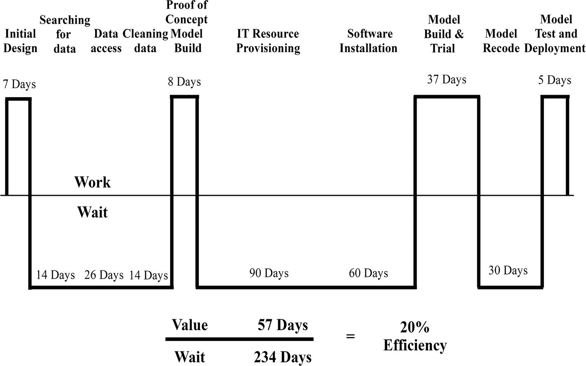

# 3.精益思维

传递数据科学的许多问题都是浪费的结果。有时，识别浪费是显而易见的，包括等待数据和系统配置的时间浪费或清理数据的工作浪费。然而，有时浪费并不明显。这样的例子浪费了昂贵的、难以招募的人才，或者为错误的利益相关者做了错误的事情。

浪费也存在于生产运作、供应链和产品开发中。这些领域已经成功地采用了一种哲学，精益思想，以消除尽可能多的浪费，提高质量，并加快上市速度。精益思想允许我们分析数据分析和数据科学活动，以了解现有组织流程无意中产生的浪费。

## 精益思想介绍

在 20 世纪早期，货物崇拜在美拉尼西亚、新几内亚和西太平洋的其他地方发展起来。土著部落社会第一次接触到西方商品，如收音机、衣服、罐头食品和枪支。不了解制成品，邪教成员认为，如果他们模仿外国人带来“货物”的仪式，他们也可以获得它。邪教成员不遗余力地模仿局外人的行为，创造模拟机场和控制塔；照明模拟跑道和灯塔；用木头制作耳机、收音机，甚至飞机；用棍子做枪进行阅兵训练。

不足为奇的是，大多数货物崇拜在无法交付货物时失败了。邪教是一个警告，盲目复制仪式和做法，而不了解基本原则，会导致平庸的结果。精益思维是一种有价值观和原则的哲学(或心态)。正确运用精益思想需要理解日本哲学的起源。

### 起源于丰田

今天，丰田是世界上最大的汽车制造商，超过了通用汽车，通用汽车在 2009 年已经连续 77 年占据榜首。丰田汽车公司从丰田自动织布机厂的一个部门发展到今天占据主导地位的道路并不平坦。丰田在早期挣扎，1950 年濒临破产。一个银行财团拯救了这家公司，条件是它必须解雇多余的工人。丰田汽车公司的创始人丰田喜一郎为了避免裁员，在劳资纠纷面前辞去了总裁一职。

虽然当 Kiichiro 离开时，丰田的处境很糟糕，但他为未来的成功奠定了基础。纪一郎希望丰田“赶上美国”，当时美国是世界上占主导地位的汽车行业。然而，日本的生产率水平只是美国的一小部分，通过大规模生产模式复制底特律的规模经济不是一个选择。Kiichiro 需要找到不同的方法来缩小生产率和成本的差距。通过研究亨利·福特的生产和管理系统，尤其是传送带系统，他发现了一种能让丰田在未来几十年中占据优势的方法，即“准时制”。

准时制(JIT)包括在需要时生产所需的产品，消除库存需求，同时更有能力处理生产各种产品所需的复杂性。JIT 与当代关于高效制造过程应该如何运作的信念背道而驰。例如，亨利·福特利用传送带系统大量生产尽可能多的汽车，以降低单位成本和销售价格，而没有适当考虑市场需求。他因说“…顾客可以拥有…任何颜色的车，只要是黑色的”而出名。这句格言绝对不是 JIT。

大野泰一是一位杰出的工程师，他于 1943 年从丰田的姐妹公司跳槽到丰田汽车公司。他延续了 Kiichiro“赶上美国”的挑战，通过实验过程逐步发展丰田生产系统(TPS)。Taiichi 利用对其他公司的观察和他在机械车间工作的经验，进一步将完全不同的生产组织方式添加到准时制流程中。

丰田章男的自动织布机被设计成如果检测到断线就会自动关机。这一概念被延伸到丰田的“停止线”，任何工人如果发现缺陷都可以停止生产线。在美国，停止一条生产线会让一名操作员被解雇，但在丰田，这是一种让问题高度可见的调查和预防机制。Taiichi 研究了美国小猪扭扭杂货店处理库存的方式，通过根据视觉补货信号重新订购，只储存他们需要的东西。这项研究导致了丰田的拉动式系统，在这个系统中，每个流程只从前面的流程中提取它需要的东西，然后只生产它需要替换的东西。拉式系统与传统的推式系统形成对比，推式系统根据未来的预测需求而不是实际消费来生产产品。

作为一名前车间经理，Taiichi 会让没有经验的经理去 gemba(日语中工作发生的地方)进行根本原因分析，使用 5 个为什么技术解决问题。丰田章男，丰田章男的创始人，最初发明了这种技术。这个方法包括问“为什么？”反复五次，找到问题的根源和解决办法，杜绝再次发生。纪一郎认为库存是死钱，而太一则更进一步。他积极减少库存，以揭示隐藏的浪费，如客户不会购买的库存，失去库存跟踪的分销系统，以及弥补流程引入的缺陷的备用生产。

Taiichi 认为丰田生产系统不仅仅是一个无库存生产系统。在他的书《丰田生产系统:超越大规模生产 [1](#Sec13) 中，太一将 TPS 称为一种绝对消除浪费的系统。他指出了七种浪费，在顾客下订单和丰田收到现金之间没有增加任何价值，这七种浪费被称为大木。这七种浪费如下:

*   生产过剩。最大的浪费是生产太多或太早。这是由于生产批量大、交付周期长造成的，并导致不规则的物料流动。这也是其他形式的浪费的主要原因。
*   等待中。等待处理的材料或组件是浪费时间。
*   运输。将材料从一个地方转移到另一个地方进行加工不会增加产品的价值。
*   过度加工。做超出客户要求的事情，或者使用比需要更昂贵或更复杂的工具，会导致更高的成本和不必要的资产利用。
*   过度运动。让人员和设备移动超出必要范围会浪费时间和精力。
*   库存。等待和生产过剩会导致在制品(WIP)和库存成品。过多的库存会占用资金，必须被跟踪或丢失，隐藏有缺陷的流程，需要存储，被取代，并且可能需要卸载。
*   缺陷。检查生产、返工或报废都会消耗资源、导致延迟并影响底线。

TPS 还确定了要消除的另外两种形式的浪费行为。Mura 是一种不规则性或不均匀性，它会导致工作流程不均匀，导致工人匆忙等待。Muri 是不合理的，它要求工人和机器以不可持续的速度工作，以满足最后期限或目标。

虽然丰田生产方式涵盖了运营，但丰田也开发了一种独特的产品开发方法。丰田产品开发系统不同于丰田生产方式，它专注于比竞争对手更快地开发新车型所需的流程、人员和工具。丰田通常只需 15 个月就能设计出一款新车，这比行业平均 24 个月的时间要好得多。詹姆斯·摩根和杰弗里·李克在《丰田产品开发系统:整合人员、流程和技术》一书中确定了丰田产品开发系统的 13 项管理原则 [2](#Sec13) 一些基本原理如下:

*   基于集合的并行工程。丰田没有选择一个单一的设计进行早期改进，而是提前进行开发过程，同时探索多种选择。它们通过逐渐缩小设计空间来收敛于最优解。这一过程意味着各种选择被尽可能长时间地保留，而决定是在最后一刻做出的。
*   由总工程师进行系统设计。在产品开发过程中，总工程师既是项目负责人，也是高级工程师。她负责产品的商业成功，并确保功能开发团队成功地将他们的工作整合到项目中。总工程师应该完全了解客户需求以及将产品从概念转化为产品所需的系统级设计。
*   培养专家工程师。丰田培养工程师来掌握他们领域的专业知识。在加入开发团队担任特定角色之前，他们应该对自己的领域有深入的了解。
*   学习和持续改进。丰田在每个项目后安排三次 2 小时的反思会议(日语称为 hansei ),以了解如何改进流程和促进个人成长。
*   通过简单的视觉沟通协调一致。组织内部的沟通应该尽可能简单。丰田使用多种可视化工具来沟通和解决问题，如模板化 A3 报告(根据他们使用的纸张大小命名)和团队板。

TPS 的实施最初在丰田内部遇到了阻力，但到了 20 世纪 60 年代中期，它使该公司大幅领先于日产(其主要国内竞争对手)。然而，丰田生产方式在丰田之外仍然被忽视，直到 20 世纪 70 年代经济衰退鼓励其他日本制造公司成功地模仿它的特点。

到 20 世纪 80 年代初，美国和欧洲的汽车制造商、消费电子产品公司和计算机制造商面临着来自更便宜、更可靠、设计更好的日本产品的激烈竞争压力，迫使许多公司濒临倒闭。作为回应，西方公司在整个 20 世纪 80 年代争先恐后地实施他们的计划来提高质量和效率，如六适马、全面质量管理(TQM)或 TPS 的变体。丰田产品开发系统，在丰田内部被视为其竞争优势的来源，却花了很长时间才被其他公司复制。直到 20 世纪 90 年代，它才开始影响其他公司开发产品的方式。

### 精益软件开发

正是 1990 年出版的《改变世界的机器》 [3](#Sec13) 这本书给丰田的丰田生产方式命名为精益生产(通常被称为 JIT 生产)。精益思想变得越来越受欢迎，并开始超越制造业，包括精益供应链、精益订单处理、精益医疗保健、精益航空公司(低成本航空公司)，以及与数据分析高度相关的精益软件开发。

上世纪 80 年代初，玛丽·波彭迪克(Mary Poppendieck)是美国一家录像带制造厂的过程控制程序员，当时该公司开始被日本对手大幅削弱。这家工厂决定模仿新的日本准时生产方式来维持经营。没有国内顾问提供支持，所以实施是通过“边做边学”的程序完成的，直到成功。

Mary 在管理工厂的 IT 部门时继续采用精益方法，然后进入产品开发部门。离开工厂后，她发现自己领导着一个政府 IT 项目，并第一次震惊地发现了瀑布方法。对比瀑布方法平庸的成功率和她以前的成功，Mary Poppendieck 在 2003 年决定和她的丈夫 Tom 一起写一本书来反对关于如何管理软件项目的流行正统观念。《精益软件开发:敏捷工具包》这本书，通过解决软件开发成功率低的问题，立刻获得了成功。

Mary 和 Tom Poppendieck 意识到，尽管有些不同，软件开发过程可以被认为类似于制造产品开发和丰田产品开发系统。最显著的区别是，软件不像交通工具，不仅仅是开发一次，而是在其生命周期中被多次修改。因此，让改变变得容易是重中之重。

从丰田产品开发系统学到的知识适用于频繁变化的产品，因为它对新产品开发采取了经验进化的方法。最初的普锐斯产品概念没有确定性地指定车辆尺寸或混合动力发动机，而只是燃油经济性目标和宽敞的客舱要求。直到周期的后期，开发团队才从研究实验室选择了新的混合动力发动机，如果他们遵循传统的车辆开发方法，这是不可能做到的。Poppendiecks 相信软件开发也应该追求一个进化的经验过程，作为处理不断变化的最好方法。根据丰田产品开发系统和 TPS，Poppendiecks 开发了精益软件开发的七个原则。

原则一是消除浪费。对丰田来说，任何在客户下订单和公司收到现金之间没有增加价值的步骤都被认为是浪费。在软件开发中，当您收到满足客户需求的请求(例如，一个新的产品特性)时，时钟开始滴答作响，当更新的软件被部署来解决需求时，时钟停止。软件开发浪费有多种形式，包括部分完成的工作、构建客户没有要求的功能、项目之间的多任务处理、等待其他人的审查和批准、需要修复的缺陷、需要遵循的多余流程，或者由于开发团队成员和经理不在同一地点而导致的过度移动。

原则二是建立质量。根据丰田的说法，有两种类型的检查。首先，在缺陷出现后检查缺陷。第二，在一个过程中检查(控制变量)，也就是说，在产品制造过程中控制缺陷。为了达到高质量，首先要创建使错误难以发生的过程，使缺陷检查变得多余。如果早期消除错误是不可能的，产品应该在小的工艺步骤之后立即进行检验，以防止它们经历进一步的处理(导致在工艺的后期出现更多的缺陷)。这个想法是为了避免传递低质量。当发现缺陷时停止生产线，这样就可以立即找到原因并解决问题。精益软件开发人员采用测试驱动开发(TDD)方法。使用这种方法，他们在编写开发代码之前编写单元和验收测试，并尽可能频繁地集成代码和测试。如果代码没有通过测试，他们不会添加任何新的代码，而是回滚更改并修复问题。

原则三是创造知识。丰田产品开发系统旨在生成和整合尽可能多的知识。工程师需要为学习和 kaizen(日语中的流程持续改进)安排时间。工程师应该尽可能简单地交流，并与 obeya(日语中的作战室)中的同事一起工作，以加快沟通和决策。软件开发是一个知识创造过程。知识创造发生在开发过程和客户反馈中。精益软件开发人员整理从其他开发人员那里获得的知识，以获取未来产品所需的信息。一个精益组织也开发知识来改进开发过程本身。开发团队为实验和过程改进留出时间。

原则四是推迟承诺。丰田使用基于集合的并行工程来试验多种选择，直到他们必须做出决定。先验的详细计划被认为是不健康的。大野泰一认为，不根据情况改变计划的企业不可能长久存在。因此，精益软件开发人员不应该提前几个月花费大量时间收集详细的需求来创建细致的设计。他们的目标应该是根据不断变化的业务需求和客户反馈做出可逆转的决策，如果这不可能，那么利用他们到那时为止获得的所有信息，为最后可能的时刻安排不可逆转的决策。

原则五是快速交付。从 1996 年 9 月董事会正式批准粘土模型设计到 1997 年 12 月开始大规模生产普锐斯，丰田只用了 15 个月的时间。这个速度是在美国开发新车型的标准是 5-6 年的时候。像丰田一样，精益组织不认为速度和质量是相互排斥的。精益软件开发人员不是放慢速度小心翼翼，而是不断地改进他们的过程，以提高质量和能力，从而可靠地添加他们的客户所重视的特性。不消除大量的浪费，就不可能提高质量和可靠性。精益开发人员的敏捷性和浪费的减少为组织提供了成本和上市速度优势。

原则六是尊重他人。在丰田产品开发系统中，从事工作的人被授权为自己做决定。团队需要自我组织以实现目标，致力于开发特定领域的深厚技术专长，并由一位企业家首席工程师领导，他创建愿景、制定时间表并做出权衡。精益组织认为改善流程的最佳想法来自 gemba(在日语中是创造价值的地方)。在软件开发中，从事日常工作的人是专家，而他们的经理却不是。一线员工对改进工作方法有着最好的看法，而经理则更有能力培训团队，确保人们拥有成功的资源，并建立保持工作流动的系统。精益软件开发团队是小型的跨职能团队，拥有深入的领域知识，负责将产品从假设到发布，然后自主地实施持续改进。

原则七是优化整体。丰田小心翼翼地确保整个系统的工作流程得到优化，即使系统的某些部分没有得到优化。Mary Poppendieck 在一家磁带厂实施 JIT 时发现了这个违反直觉的教训。以前，全负荷运转工厂最昂贵的机器(以最大化投资回报率)会导致库存增加。实施 JIT 后，库存消失了，整个工厂的总效率提高了，尽管对最昂贵的机器引入了闲置产能。软件开发也充满了负反馈循环。添加新特性的压力导致测试人员超负荷工作，这延迟了缺陷的检测。延迟只允许开发人员添加更多的缺陷，这意味着测试人员要做更多的工作。因此，问题越滚越大。精益组织优化整个系统。如果在其他地方有更严重的瓶颈，那么浪费时间优化流程的一部分是没有意义的。整体优化似乎是常识，但是团队在各自的筒仓中进行独立的过程改进可能会给下游团队增加额外的工作压力，而不会增加总的吞吐量。

由于专注于流量经济而非规模经济，丰田生产方式与自亨利·福特时代以来产生制造效率的传统智慧背道而驰。同样，Poppendiecks 交付新软件产品的想法是如何发布软件的根本出发点(可以追溯到计算的第一天)。精益软件开发运动对塑造现代敏捷软件开发有着巨大的影响，我们将在下一章讨论。

### 精益产品开发

另一场精益运动基于 Eric Ries 在 2011 年出版的《精益创业》(The Lean Startup)一书中提出的理念，对过去十年的产品开发产生了同样重大的影响。 [5](#Sec13) 不要让书名欺骗了你。这些概念适用于几乎所有新的内部或外部产品或服务开发以及各种规模和行业的组织。虽然 Ries 的书发起的运动被称为精益创业或精益产品开发，但它们结合了其他领域的想法。Ries 将软件开发和产品开发的精益思维与企业家 Steve Blank 和设计思维的概念相结合，创建了一种适合在不确定条件下开发产品的方法。

直到最近，初创公司和软件开发都遵循相同的模式，将想法或需求转化为成品。初创公司从一个想法开始，花了几个月和几年来构建和完善一个“完美”的产品，而开发人员花了几个月和几年来收集需求，构建详细的设计，编码和测试一个“完美”的版本。当准备就绪时，初创公司会向期待的公众发布其产品，但公众往往不会感到兴奋，因为产品没有满足他们的需求。

同样，软件开发人员部署他们的软件只是为了让用户拒绝它，因为几个月前收集的需求不再适合当前的目的。在这两种情况下，失败都是基于一种传统的信念，即软件产品在发布给客户之前必须是完美和完整的。这种传统观念基于昂贵的计算和昂贵的开发时间，以及与频繁的软件变更相关的困难(和成本)。这些成本和限制中的许多都不复存在了。精益思想认为，如果可以交付更好的产品，那么创建更好的开发过程的努力是值得的。

创业失败的原因是因为他们把想法建立在可能不正确的假设上。在未经测试的假设基础上花费几个月来构建一个产品或功能是浪费时间。里斯认为，创业公司最大化成功机会的方法是使用科学方法。面对新服务或产品不确定的成功概率时，不要放弃所有的过程并采取“照做就是了”的方法，而是使用一种方法来持续测试愿景。

Ries 提倡精益启动方法，这是一套快速发现提议的商业模式或产品是否可行的方法，如果可行，在短开发周期内迭代改进它。出发点是相信每一个新产品都是一个实验，来回答“这个产品应该被制造吗？”，而不是“能建吗？”Ries 将该方法建立在一组核心概念和原则、经验证的学习、构建-测量-学习周期、最小可行产品(MVP)、分割测试、可操作指标和支点的基础上。

如果每一个创业都是一次实验，那么通过经验证的学习，尽早检验其基本假设是很重要的。经验证的学习是通过评估客户的假设来验证想法而产生的一个进步单位。验证学习的第一阶段是创建一个 MVP，尽快从客户那里收集关于初始假设的最大数量的反馈。反馈会告诉您客户是否重视您的想法，并为在一系列构建-测量-学习循环中测试和完善进一步的假设提供基础。每一组学习都应该产生改进产品的额外想法。

验证假设的最佳方式是从概念中构建一个特性，运行分割测试实验来测量添加特性的因果关系，并从度量中学习。指标必须是可操作的，也就是说，与您的目标一致，并有助于决策。可操作的指标包括每客户收入、重复购买率和交易量。可操作指标的对立面是虚荣指标。虽然它们让你感觉良好，但它们既不能帮助你实现目标，也不能辅助决策。开展一场昂贵的营销活动，衡量网站访问量或社交媒体等的增长，并不能告诉你在类似活动上花费更多是会带来更高的盈利能力还是会让你破产。

在实验的某一点上，由构建-测量-学习周期交付的优化达到了收益递减的点，此时客户反馈度量不能验证最初的假设。在这一点上，创业公司需要决定它是否接受这种情况，或者它是否相信它可以重新想象产品。测试一个新的方向和假设被称为支点。支点并不意味着承认失败。坚持客户不重视的想法是失败的。许多著名的公司在其历史上都成功地进行了转型。在决定涉足电子游戏和游戏机之前，任天堂有过许多前世，比如扑克牌制造商、吸尘器制造商、速食米饭生产商、出租车公司，甚至是“爱情旅馆”连锁店。

## 精益思维和数据分析

数据分析和数据科学兼具生产系统和产品开发系统的特征。从最初捕获到消费者使用的数据流类似于原材料通过制造过程形成成品的流程。与产品开发类似的不仅仅是最终用户输出的开发，如仪表板或机器学习模型。中间加工阶段也应被视为产品的一部分，而不是项目的一部分。项目是有终点的。产品(希望)在替换或冗余之前有很长的保质期。像 ETL 流水线、数据清理和数据丰富例程这样的处理任务通常会运行很长时间，即使它们必须随时间而变化。

源自制造业、软件开发和初创公司的精益原则与数据科学和分析高度相关。出发点是，在创建数据分析解决方案时，不要再考虑独立的技术和功能层，而是要考虑数据流。图 [3-1](#Fig1) 显示了满足用例的生产数据流，与第 [1](01.html) 章中展示的水平硬件和软件层图的传统视图相反。

图 3-1

Data analytics as production and product development systems

### 看到浪费

大多数团队都忙于交付产出或维护系统，而没有时间停下来思考他们是如何以及为什么以这种方式工作的。组织乐于将科学方法应用于数据使用或产品开发，但很少使用它来改善他们的活动。他们被动地接受有一种“在这里做事的方式”在数据科学和分析中，当你仔细观察时，会发现有很多浪费。Poppendiecks 确定的七种浪费可用于发现和消除此类浪费。

部分完成的工作是第一个浪费。它相当于制造过程中的库存。部分完成的工作不会帮助组织做出决策或改善客户体验。所以，这是一种浪费。数据分析很复杂，但不考虑可解释性或向利益相关者清楚地解释解决方案会不必要地延迟实施。部分完成工作的其他示例包括数据工程师或数据科学家尚未开始工作的已记录请求、未测试的代码和数据流水线、未监控的流水线或模型、需要从一种语言重新编码为另一种语言(例如，R 到 Python)以用于生产的工作，以及未能跟踪数据产品的益处。

然而，最大的浪费是没有投入生产的工作。例如，数据科学家的笔记本电脑上的工作停滞不前，因为它不适合整体应用程序(或代码库)，或者业务部门从未考虑让它使用直觉来做出决定。从未被使用的技术上优秀的作品没有部分功劳。这项工作要么被利用，要么被浪费。

额外的功能与制造业中的生产过剩相对应，如果它们不能帮助数据消费者做出决策，则被认为是最糟糕的浪费。数据产品中的附加特征不应与数据特征混淆，后者是数据观察的个别属性。多余功能的例子包括仪表板上不可操作的图表和指标、未使用的数据推导或无法帮助解决审查中的问题的数据项提取。有时，额外的功能是利益相关者对除了厨房水槽之外的所有东西的要求的结果，因为他们不知道他们需要什么。其他时候，它们是兴奋的数据团队成员的结果，他们想要尝试很酷的新功能，而不仅仅是解决问题。除非有明确和迫切的需要，否则应该有一种强烈的反对添加新功能的倾向。开发应该从一个 MVP 开始，这个 MVP 可以根据需要进行迭代以添加新的特性。

额外的过程导致不必要的努力，而不创造价值。这类废物种类繁多。额外的流程包括在整个组织的多个数据存储中进行数据复制和转换，在简单算法也能工作的情况下使用复杂算法，或者因为知识未被捕获和重用而重新学习任务。由于缺乏配置管理(在数据产品开发期间对源代码、软件、数据和其他资产的管理)而导致的不可重复的工作是缺乏经验的数据科学团队浪费时间的另一个主要原因。编写定制的代码来创建系统连接器和管理 ETL 流水线，而不是使用现成的工具，对于数据工程团队来说是多余的工作。正如我的一位前经理曾经说过的，“文档就像性，有总比没有好。”然而，过多的官僚主义也可能是一件坏事。创建不被关注的文档，产生不可能遵守的详细的项目计划和估计，以及提供决策者不使用的状态更新是额外的过程浪费。

数据分析和数据工程是复杂的学科，需要高度的关注和专注来解决问题。当我们从一项任务转移到另一项任务时，多任务处理会带来很高的转换成本，并浪费时间。美国心理协会的研究表明，即使是由环境转换引起的短暂的精神障碍也会耗费一个人高达 40%的工作时间。 [6](#Sec13)

一心多用也浪费了工作的潜在早期贡献。詹姆斯·沃马克和丹尼尔·琼斯通过模拟邮寄十份时事通讯来说明这种影响。邮寄每份新闻稿需要四个步骤，折叠纸张，将纸张插入信封，密封信封，在信封上贴邮票。并行处理每份新闻稿包括在进行下一项操作之前，依次执行十次操作(折叠、插入、密封或盖章)。如果每个操作花费 10 秒，那么第一个简讯在 310 秒后完成。然而，如果按顺序处理时事通讯，第一个时事通讯在 40 秒后完成，然后每 40 秒一个。不仅第一份新闻稿的制作速度更快，而且纸张折叠、信封大小、信封封口和邮票的任何问题都可以更早地检测出来。因此，我们需要在任何时候关注尽可能少的任务，以发现问题并尽早交付工作。 [7](#Sec13)

等待人员、数据和系统是数据分析流程中大量浪费的原因。浪费的例子包括花费时间查找和理解数据、等待批准、等待人员分配、等待软件和系统供应、等待数据可用以及等待作业在缓慢的机器上运行。

来自单独和分散的团队的过多动作会导致移交和旅行的浪费。每次移交(任务从一个团队或团队成员移交给另一个团队或成员)都会留下数据的隐性知识，这很难在文档中捕获。如果我们在每次移交后只保留一半的知识，那么在仅仅四次移交后，只有 6.25%的原始理解被保留。通过面对面的讨论和互动可以最有效地传递知识。为此而旅行会成为对话的障碍，并在一年中增加几天的浪费。

第七个浪费是缺陷。在数据分析中，正确的问题定义异常困难。解决错误的问题，通常是由于沟通不畅和不一致的期望，被认为是有缺陷的工作。数据和代码一样，可能会有错误。此外，低质量的数据是数据科学家列举的头号挑战。数据和代码中的缺陷导致寻找和修复问题的努力白费。在糟糕的数据上写好的代码只是一种垃圾进，垃圾出的情况。目标应该是尽快发现数据中的所有缺陷。问题发现得越晚，修复成本就越高，尤其是当您的客户发现问题时。数据工程师应该包括一套防错测试，这样低质量的数据就不会进入数据流水线。每当我们发现一个新的缺陷，停止生产线，修复问题，并添加一个新的测试，这样错误就不会再次引起问题。

通常在最初的七种浪费之外，还有第八种浪费，叫做未被利用的才能。随着数据收集、数据存储、计算和软件成本的直线下降，人是数据分析过程中最昂贵和最有价值的资源。因此，最大限度地发挥他们的才能应该是当务之急。好的数据分析师、数据科学家和数据工程师很难找到，雇佣起来也很昂贵，但他们的技能往往被浪费了。人们往往缺乏培训和指导，被赋予低于其能力和资格水平的报告或数据清理等任务，不参与决策过程，或者不被信任能够自助访问系统和数据。

### 价值流图

精益思维工具概括了精益思维价值观和原则。许多工具始于制造业，但同样适用于数据分析。价值流图是可视化流程中浪费的精益工具。该过程首先将类似类型的工作分组在一起，例如构建仪表板或创建机器学习模型，并为每个组选择一个典型的项目。

从客户的角度绘制一条水平时间线，从认识到需求(或提交请求)开始，到数据产品投入生产结束。在时间线上，画出端到端流程中涉及的重要步骤，不要有过多的细节。在水平时间线上画出增加价值的活动，在下面画出浪费的活动。图 [3-2](#Fig2) 显示了为第 [1](01.html) 章介绍的预测性流失模型绘制的价值流图示例。

图 3-2

The value stream map for a predictive churn model

完成的价值流图回答了两个问题。第一，创建一个数据产品需要多长时间？第二，增加价值花费了多少时间？这种附加值被称为流程循环效率。如图 [3-2](#Fig2) 所示，从我们的数据科学家收到初始请求开始，共花了 291 天将模型部署到生产中，流程周期效率为 20%。看到全局有助于识别必要的延迟和浪费的延迟。不是所有的等待都是浪费。流失模型作为一个分裂测试实验与客户一起运行了一个月，以衡量收益。

具有讽刺意味的是，商业利益相关者昨天就想要结果，并且通常不会等待统计上可靠的实验结果。然而，在接下来的过程中，他们对可避免的等待没有表现出同样的不容忍。除了要求使用客户流失模型来提高客户保持率的利益相关者之外，没有一个团队意识到等待浪费了多少时间。团队将忙于并行处理其他多项任务，在富有成效和高效的错误印象下工作。通常，没有一个单独的价值流所有者，因此可视化 it 中的浪费可以更容易地说服每个相关人员，有些事情需要改变。

价值流图还应该用于衡量生产数据流从捕获到使用的流程周期效率。该图确定了每个数据单元在数据生命周期中等待数据调配和处理所造成的浪费。通常，当不同团队拥有的系统之间进行切换时，会出现延迟。

### 快速交付

第一次绘制价值流图时，你几乎肯定会意识到你可以走得更快。走的越快，能学到的东西越多，能取得的成绩也越好。在传统的组织中，快速交付意味着偷工减料，要求团队在深夜和周末加班加点。这积累了问题，并导致长期的“交付缓慢”,因为所有的倦怠、攻击和捷径都表现为过程中的时间延迟。代码和数据缺陷增加了延迟，技术债务使得管理变更变得缓慢，并且流程中太多的任务产生了队列，进一步减慢了流程。

美国统计学家 w·爱德华兹·戴明(W. Edwards Deming)在战后时期改变人们对日本产品的看法方面发挥了巨大的影响，从劣质产品转变为市场领先的高质量产品。正是戴明将日本人引入了统计过程控制(SPC ),以监控过程并尽早发现重大变化，从而防止更大的问题。戴明还让日本经理们认为，从供应商到客户，生产是一个需要持续改进的系统。

戴明指出，一个系统有固定的最大容量和质量潜力。所以，你不能在没有负面后果的情况下在系统中推行更多。一厢情愿的想法、恐惧和财务激励都不能改变一个系统的最大能力。只有改进系统本身才能产生积极的影响。精益有思维工具和衡量标准、周期时间和排队论，可以帮助改进系统并使团队更快地交付。

由于浪费表现为时间延迟，量化性能的最佳方法是测量平均端到端周期时间。对于数据产品开发，这一措施从认识到需求或向生产中的所有开发活动提交部署请求的时刻开始。对于生产数据流，测量是从捕获点到数据生命周期中所有数据单元的第一次使用。组织从数据中做出正确决策的速度越快，就能更好地满足客户需求。

排队或等待线的数学研究是排队论，它是运筹学的一个重要分支，使用高级分析方法进行商业决策。由于数据产品开发和生产数据流涉及端到端流程中的队列，排队论可以帮助我们减少退出流程所需的平均周期时间。

排队论告诉我们，在一个能力固定的系统中，固定的到达率、较小的稳定处理时间、将利用率限制在能力之下、减少队列中的物品数量以及多个服务器会导致较低的平均周期时间。对新数据产品开发和新获取的数据的请求往往是突发的。我们可以将请求放在 backlog 中，然后将它们稳定地发布给团队。并行处理可以利用水平扩展的计算资源或算法均匀地处理新捕获的数据，这相当于增加多个人工服务器来辅助一条生产线。

工作规模的变化会对周期时间产生负面影响，因为大批量的工作会导致很大的变化。6 个月的项目比 6 小时的工作出错的风险更大。例如，任何处理过数据加载失败后果的人都知道，6TB 文件传输与 6MB 文件传输是非常不同的项目。

虽然数据分析不是软件开发，但是发布和迭代的概念是有用的。发布导致将可消耗的产品运送给客户。迭代是发布之间的更小的工作单元，有时，但不总是，发布给客户。高度可变的工作规模的解决方案是使完整开发的发布周期尽可能短，确定在周期中可以完成多少工作，并且永远不要承担超过周期可以处理的工作。不要推迟发布，将工作留给未来的迭代，接受不太准确的机器学习模型，在流水线中使用更少的数据项，使用更简单的仪表板，或者只产生标题数据洞察力。

小块完整的工作创建了可靠的、可重复的速度，并帮助确定团队的能力。不要做大量部分完成的工作，而是创建大量更小的完整工作单元。对于数据流水线，不要处理大批量数据，而是使用事件驱动的体系结构，在数据到达时立即响应，从而转移到小型或微型批量数据，甚至是流数据。

经理们经常要求团队在不要求放弃任何其他任务的情况下多完成一项任务，认为完成更多任务的方法是增加更多工作。排队论表明，平均周期时间与利用率惊人地相互影响。当道路利用率从容量的 99.9%上升到 100%时，道路交通不会从正常速度立即停止。随着越来越多的车辆加入高速公路，它在这一点之前很久就开始减速。

超过 80%的利用率，平均周期时间开始呈指数增长。这种减速效应就是为什么大多数计算机服务器包含松弛或被设置为远低于 100%容量的原因。虽然这种想法对于运营来说是健康的，但是这种数学方法还没有推广到组织的其他部门。许多经理没有意识到创建大型项目并 100%利用每个人是缓慢交付任何东西的必然方式。

为了快速交付，我们需要在我们的服务器、数据库、数据流水线和人员中有一些备用容量。在人际交往中实现这一点的一个方法是，留出时间给时间不紧迫的副业和自学。另一个方法是清理永远不会完成的工作系统。系统中的工作项目吸收的能量可以更好地用于产生有用的输出。即使没有进展，工作也要重新排序，重新评估，并更新状态。相反，我们可以删掉所有你永远不会抽出时间去做的事情，以及所有那些有好处但不重要的事情。如果剩余的资源仍然超过系统的容量，那么就有理由增加资源。

### 拉动式系统

拉动式系统是精益思想的解决方案，将工作限制在系统的能力范围内，并按需交付。它们源自丰田管理供应链零件的系统。很难准确预测零件的需求，但即使是一个螺钉的短缺也会导致整条生产线停止，并在团队等待交付缺失零件时导致巨大的延迟成本。诱惑是过度生产零件，以最小化延迟成本，并将其推入生产流程，无论是否需要。

丰田没有试图预测所需部件的数量或携带多余的库存，而是创建了一个系统，当装配线工位需要新部件时，它们可以直观地发送信号。视觉提示是一个看板卡，包含要从供应商处拉取的组件的详细信息。卡片传递给供应商，供应商在卡片到达时按照顺序订购准确的补货数量，并将其与卡片一起发送回去。通过逐步减少系统中的卡片数量，丰田可以减少在制品，并减少所有三种形式的浪费，即大木(无用)、mura(不均衡)和 muri(不合理)。

精益团队不是让经理将工作推给团队，而是将大型工作分成更小的可消耗的工作批次，并将它们添加到队列中。团队从队列中拉出开始工作。队列的长度应该足以平衡工作节奏。任何更大的事情都会产生浪费，因为会产生部分完成的工作，增加平均周期时间，并且给涉众一种印象，当团队没有对工作进行优先级排序时，你正在处理他们的请求。在几个月的沉默之后，接受客户的要求但不开始工作可能会对关系产生重大的负面影响，或者比事先现实的对话发出积极的氛围。

拉式调度比推式调度有许多优点。工作流是均匀的，团队从来不会拉超过他们能够交付的工作，拉式系统给了我们更多的选择。期权是没有义务的珍贵权利，因为它们的价值随着不确定性而增加。金融期权的交易总是高于其内在价值，因为未来有可能基础资产价格会发生足够的变化，使期权变得更有价值。标的资产价格波动越大，期权就越有价值，因为潜在利润越高。

在现实世界中，我们愿意为灵活的机票支付更多的费用，因为我们知道计划是不可预测的，最后一分钟的机票成本很高，与不可退票或不可改签的机票相比，灵活的机票是更改航班的一种选择。选项思维也适用于产品开发，正如丰田发现的基于集合的开发和 Eric Ries 发现的 MVP 和新功能的分割测试。如果初始版本成功，MVP 是开发更好产品的选项，如果客户重视新功能，分割测试提供了推出新功能的低成本选项。

在拉动式计划中，一旦团队有能力，他们就可以根据最新的优先级和价值信息决定下一步做什么，而不会中断现有的工作。在推送系统中，任务有固定的路径，团队超负荷，如果计划改变，会有更多的中断，就像用不灵活的机票错过航班一样。

数据流水线也可以是基于推或拉的。流行的分布式流媒体平台 Apache Kafka 是一个很好的基于拉的设计优势的例子。Kafka 使用发布-订阅模式在应用程序之间读写数据流。数据的生产者不直接将数据发送给数据的消费者(称为订户)。相反，产生数据的应用程序向 Kafka broker(发布服务器)中托管的 Kafka 主题(一种数据)发送记录流。一个主题可以有一个、多个或没有订阅使用其记录的应用程序。

Kafka 的开发者考虑了一种基于推送的系统，由经纪人将数据推送给消费者，但这也有缺点。代理决定向所有订阅者推送数据的速率，如果订阅者不能足够快地消费数据，代理可以轻而易举地压倒一个或所有订阅者。基于推送的代理还必须决定是立即推送新数据还是批量推送。一次推送一条记录可能会导致这些记录在订阅服务器上排队，从而浪费了减少延迟的努力。相反，开发者选择了拉式系统。在拉系统中，订阅者可以决定最佳的记录批量大小和获取频率，以减少延迟，并且可以在任何时候通过从主题获取未处理的数据来赶上数据生产的速度。

精益思想使得识别浪费、管理工作流和数据流以尽快交付成为可能。然而，要在一个完整的可发布批次中快速地从想法到部署产生一个新的机器学习模型或数据流水线，仍然需要创建一个使其成为可能的系统。第一阶段是确定现有流程中的重大障碍，并开始拆除它们。

### 看到整体

精益思想鼓励我们后退一步，看到全局以提高绩效，而不是进行孤立的改进。Eliya M. Goldratt 在其 1984 年的著作《目标 [8](#Sec13) 中提出的约束理论(TOC)认为系统的性能受到其最重要约束的限制。正如链条的强度取决于其最薄弱的环节一样，最大的瓶颈限制了任何系统的产出。消除最大的瓶颈会导致下一个最大的限制成为整个系统的约束。

该理论对优先级排序有影响。不要试图解决每一个问题，而是集中资源系统地找到并消除整个过程中最大的瓶颈。其他任何改进都只是一种错觉。如果数据科学家需要几个月才能访问数据，那么为他们购买最快、最贵的笔记本电脑是毫无意义的。如果 ETL 流程支持每周更新的报告流程，那么将 ETL 流程迁移到 Apache Spark 来大幅提高其速度是没有意义的。

约束分为四类:物质、政策、其他非物质和人。物理约束通常与设备相关。策略约束是阻止系统实现其目标的规则和度量。其他非物质限制包括缺乏清晰的数据。人员约束包括缺乏资源和技能，但也包括限制数据分析消费的强烈信念和惰性。政策和人员约束是最常见也是最难克服的，因为它们根深蒂固。制约因素是雇用一大批数据科学家而不清除他们的障碍是浪费他们才华的原因。

约束理论有一套发现和消除约束的方法，称为五个步骤。第一步是确定主要的制约因素。价值链图可以在这方面有所帮助。其他方法包括询问团队成员，寻找经常必须通过升级(或追踪)来加快工作的领域，以及寻找部分完成的工作的积累。第二步是利用现有资源最大化吞吐量，包括检查和修复进入瓶颈的工作或数据的质量，提高员工技能或卸载工作，以及处理其他不受限制的团队和系统。

第三步是使系统的其余部分服从约束。因为根据定义，流程的其余部分有备用容量，所以它应该以与瓶颈相同的速度连续工作，永远不要过载或无法处理其输出。从属关系可能要求不属于瓶颈的人和过程慢下来，这似乎是违反直觉的。如果这未能“打破约束”，也就是说，将它移动到其他地方，那么第四步是提升约束。通过在瓶颈中投入额外的资源、雇佣更多的人、提供额外的培训、转向新技术、捕获更多的数据或绕过人工决策来提升。最后一步是重复这个过程，作为持续改进周期的一部分。要么约束被打破，需要消除新的约束，要么需要做更多的工作来消除现有的瓶颈。

人们想从第一步(识别约束)跳到第四步(投入更多资源解决问题)是很自然的，尤其是政策约束是最常见的限制形式。然而，在一个问题上投入更多的资源最初会减慢速度，因为新人和新系统需要时间来投入运行。相反，我们应该正面解决政策约束。

政策和规则变成了公认的咒语，组织在忘记实施它们的原因后很久还坚持它们。通常，这些政策是对已不存在的历史限制进行调整的结果。例如，我们不再需要承受访问非敏感数据、有限的处理器能力、昂贵的存储、缓慢的网络、缺乏内存或难以更改的代码的风险。政策限制经常使部门之间产生冲突，因此很少能从内部解决。通常需要一个外部团体来指出问题，但有时，那些负责政策的人并不知道它对工作流程的影响，可以被说服来改变它。

为了有效地消除约束，我们必须确保我们解决的是根本问题，而不是症状。约束理论结合了一套解决问题的工具，称为思考过程，以回答三个问题。要改什么？换什么？怎么改？这些工具用于遵循多步买入流程，就问题达成一致，就解决方案达成共识，并克服实施障碍。

### 根本原因分析

有两种不同的技术可以用来找到根本原因，以回答“要改变什么？”正确回答问题，当前现实树(CRT)来自约束理论，5 个为什么来自精益思想。“5 个为什么”适合于寻找症状的相对简单的根本原因，与其他根本原因的交互很少。CRT 更加结构化，旨在揭示问题之间的关系。

5 个为什么通过重复问题“为什么？”来确定问题的根本原因并且迭代地使用该答案来形成下一个问题的基础。该流程从召集一个熟悉该流程的跨职能团队开始，以调查和定义一个清晰的问题陈述。主持人问团队“为什么？”根据需要多次确定问题的根本原因。丰田相信问“为什么？”需要五次才能弄清楚根本原因，但这并不是一个硬性规定。主持人应尽可能多地询问问题，以超越症状。主持人在保持团队专注和避免责备游戏方面也起着重要的作用。

在流程的最后，主持人帮助团队确定解决根本原因问题的对策，并分配责任。例如，团队可以使用“5 个为什么”来找出数据科学产品开发周期长的根本原因，方法是问这样的问题:

*   为什么平均周期时间这么长？在使用数据之前，可能需要几周的时间来清理。
*   为什么清理数据需要这么长时间？因为源数据中有许多缺陷，包括缺失数据、数据类型不匹配、重复记录、转换逻辑错误和数据截断。
*   为什么数据有这么多缺陷？没有进行足够的测试来确保有缺陷的数据不会进入流水线或数据库。
*   为什么没有足够的测试？IT 团队不认为数据质量是重中之重。
*   为什么 IT 团队没有将数据质量视为重中之重？IT 团队不了解消费者如何使用数据以及数据质量差所导致的问题。

最终的“为什么”会导致团队可以采取行动的根本原因。即使是同样的问题陈述，如果相关人员的知识不同，根本原因也可能不同。问题也可能有多个根本原因，识别它们的唯一方法是每次问一系列不同的问题。如果涉及系统，另一种方法是使用当前现实树。

CRT 是一种通过可视化图表识别因果关系的工具。假设我们可以追踪一个组织中每一个看起来像症状的问题，追溯到更少的核心根本原因。解决这些核心根本原因会导致多个相互关联和相互依赖的问题消失。

为了构建一个 CRT，一个拥有组织及其系统的知识和经验的小组同意一个不超过 5 到 10 个问题(不良影响(UDEs))的列表来进行分析。UDEs 必须有可衡量的负面影响，被清楚地描述，并且不应该是缺失解决方案的列表。一个例子可能是缺乏数据科学方法的培训。UDEs 的其他例子可能包括数据工程师的高流动率，经理根据直觉做出决策，数据科学家花费过多时间清理数据，或者数据科学产品需要很长时间才能投入生产。团队也可以选择为 CRT 所代表的系统设置一个边界。一个例子可能是权力或影响的范围。

该团队使用 if/then 逻辑(如果出现这种情况，则产生这种效果),通过 UDE 的因果推理链，以图形方式构建 CRT，其中省略号代表 and 条件。推理链连接着 UDEs，在这个过程中，需要添加额外的中间不良影响，把所有东西连接在一起。这一过程一直持续到方法集中在几个核心的根本原因上。图 [3-3](#Fig3) 显示了具有两个核心根本原因的三个 ude 的简化 CRT。

图 3-3

A simplified current reality tree

CRT 本身并没有告诉您如何处理核心的根本原因。还有其他的思考过程。但是，它确实确定了将精力集中在哪里，并避免了浪费资源试图解决多个 ude 的次优化陷阱。

## 摘要

精益思想彻底改变了整个全球制造业，整个行业，如航空运输和软件开发方法，以及创业公司的成功之路。精益思维也可以改变数据分析，大多数组织还没有认识到它本身是一个生产系统或产品开发系统。思考数据产品而不是数据项目，思考数据流而不是技术层或组织功能，这需要思想上的转变。一旦我们的视角发生变化，就有可能应用精益思维和科学方法来显著提高流程效率。

对于一个有用的生产系统和产品开发系统来说，需要了解我们的客户看重什么，这样就不会浪费时间和精力去构建他们不想要的东西。不幸的是，当谈到数据分析和数据科学时，我们的客户往往不知道他们需要什么，或者在数据工程的情况下，什么解决方案最有效。精益启动方法通过首先构建 MVP，然后通过经验证的学习和反馈迭代地改进产品来处理不确定性。我们学得越快，我们就会越成功。因此，交付速度的可持续增长应该是一个高度优先事项，如果不是彻底的困扰。

为了尽可能有效地交付客户所需，必须消除任何无助于我们实现目标的浪费步骤。无论是生产数据流还是数据产品开发，价值流图都是识别流程中浪费的一种令人大开眼界的方式。所有可避免的浪费最终都表现为流程中额外的时间延迟。数据流和数据产品开发的平均端到端周期时间可以通过消除八类浪费来减少，这八类浪费是部分完成的工作、额外的功能、额外的过程、多任务处理、等待、过度运动、缺陷和未利用的才能。

一旦可识别的浪费形式被消除，工作流程就会增加。传统的快速交付管理方法，如堆积更多的工作、一厢情愿的想法、制造恐惧或悬挂激励的胡萝卜，只能在短期内奏效，因为它们为未来堆积了问题。在不影响质量的情况下持续快速交付的唯一方法是提高系统的交付能力。

排队论告诉我们，减少平均周期时间的最有效方法是将工作分成统一大小的小批量，不要承担超出我们处理能力的任务。目标是尽可能快地将一项工作从开始转移到部署，这样我们就不会以部分完成的工作结束。约束理论告诉我们，最大的瓶颈限制了整个系统的产量。该理论还告诉我们，试图孤立地解决多个问题是没有意义的。我们需要优化整体。资源应该使用根本原因分析工具集中消除最重要的限制，以确保我们修复核心问题，而不是症状。根本原因分析可能需要具有知识和权力的人员进行跨职能的工作，这可能是需要克服的最突出的实施挑战。

有了改进的流程，我们可以转向拉动式计划，这可以平衡工作流，防止过度承诺，并为接下来的工作提供选项。项目的开始是制定计划和承诺最糟糕的时候，因为这是我们对整个过程了解最少的时候。通过将承诺推迟到最后一刻，我们可以根据我们必须做出决策的最新信息将工作从队列中拉出。

精益思维是一种心态，所以它永远不会“完成”它需要持续的过程改进、kaizen 和持续的绩效测量的持续努力，以达到完美(创造有价值的数据产品和零浪费的数据流水线)。在下一章中，我们仔细看看敏捷开发，它是一套与精益原则密切相关的快速软件交付的方法。

## 尾注

1.  大野泰一，丰田生产系统:超越大规模生产，1988 年 3 月。
2.  詹姆斯·摩根和杰弗里·李克，《丰田产品开发系统:整合人员、流程和技术》，2006 年 3 月。
3.  詹姆斯·沃马克、丹尼尔·琼斯和丹尼尔·鲁斯，《改变世界的机器》，1990 年 10 月。
4.  Mary 和 Tom Poppendieck，精益软件开发:敏捷工具包，2003 年 5 月。
5.  Eric Ries,《精益创业:持续创新如何创造彻底成功的企业》, 2011 年 10 月。
6.  多任务:转换成本，美国心理协会，2006 年 3 月， [`www.apa.org/research/action/multitask.aspx`](https://www.apa.org/research/action/multitask.aspx)
7.  詹姆斯·沃马克和丹尼尔·琼斯,《精益思想:在你的公司中消除浪费，创造财富》, 2003 年 7 月
8.  艾利·M·高德拉特和杰夫·考克斯，《目标:卓越制造》，1984 年。