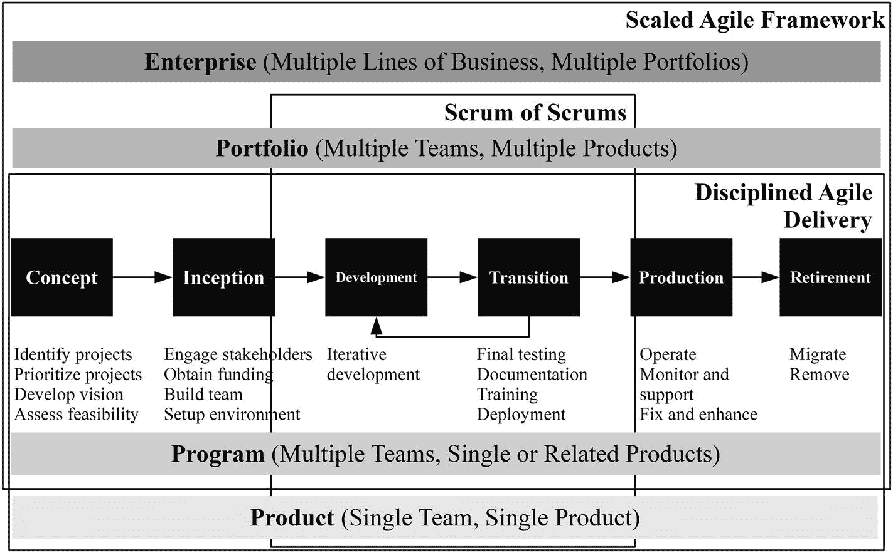
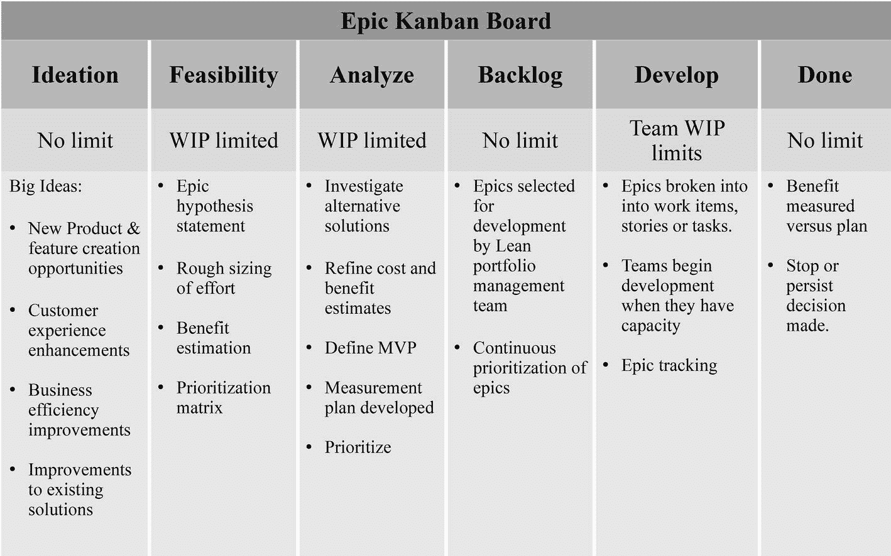
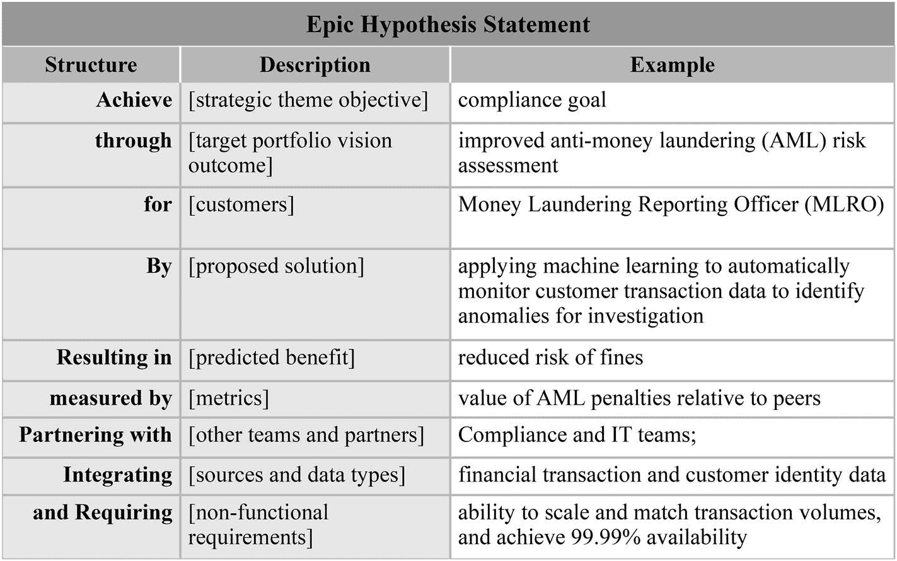
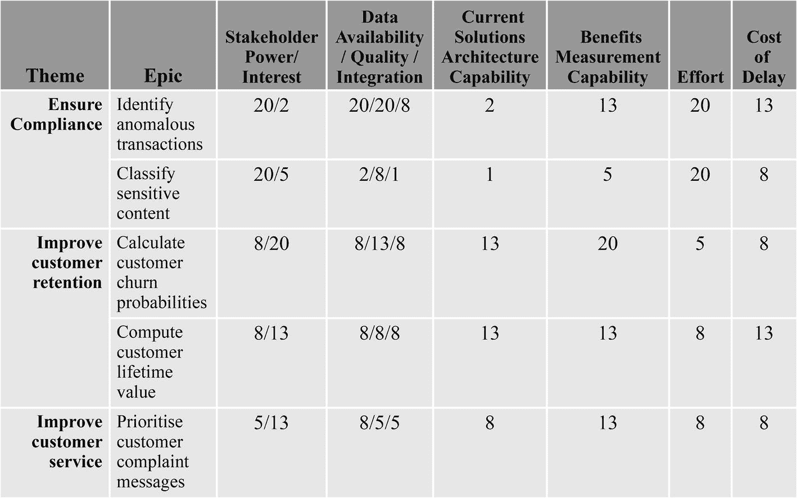

# 4.敏捷协作

敏捷软件开发运动兴起于 2001 年，是对传统软件开发方法的一种回应，传统软件开发方法难以应对不确定性。该运动的创始人选择术语敏捷来举例说明他们的观点，即软件开发必须适应和响应变化。除了适应性之外，人们如何一起工作使得敏捷不同于其他软件开发方法。敏捷团队应该是跨职能的、自组织的，并且紧密合作以提出解决方案。

像软件开发一样，数据科学和分析必须处理巨大的不确定性。不确定性超出了软件开发所需的工程努力。数据科学是一门应用研究，涉及不断变化的数据，需要一种迭代方法，以难以估计的努力来交付结果。敏捷方法似乎非常适合交付数据科学和分析。已经有人尝试设计敏捷数据科学方法，包括 Russell Jurney 出版的《敏捷数据科学 2.0》及其《敏捷数据科学宣言》。 [1](#Sec23) 然而，在将敏捷方法应用于数据科学和分析之前，有必要了解敏捷思维、框架和实践。

## 为什么是敏捷？

敏捷软件开发实践现在是交付软件的主要方法。在 Stackoverflow 对全球超过 100，000 名开发人员的 2018 年开发人员调查中，85.9%的专业开发人员表示他们在工作中使用了敏捷软件开发方法。敏捷软件开发实践的快速采用是先前项目管理方法的问题的直接结果。

### 瀑布项目管理

传统上，组织使用瀑布项目管理方法来交付计划。瀑布模型起源于建筑和制造行业，在这些行业中，后期变更的成本过高，或者一旦工作开始，设计变更甚至是不可能的。该模型需要尽早冻结需求。毕竟，在建筑物的地基完成后，增加其层数并不容易。

瀑布项目管理采用一种顺序的方法，预先定义需求。整个项目都经过规划，然后是设计、构建、测试和实施阶段。在瀑布项目管理中，从一个阶段到下一个阶段，进度只有一个方向，这类似于水只有一个方向(向下)流动。瀑布模型是预测项目管理的一种形式。需求是固定的，但是交付它们所需的资源和时间是估计的变量。

瀑布模型是最早用于软件开发的 SDLC 方法。随着软件变得越来越复杂，瀑布模型的局限性开始变得明显。收集准确的需求是困难的，因为客户在早期阶段并不确切地知道他们想要什么。很难轻易适应变化，因为一旦一个步骤完成，就没有回头路了。因此，客户远离开发人员，以避免返工和错过最后期限。

瀑布项目的最后阶段交付工作软件。然而，在这一点上，世界已经发生了变化，最初的需求通常已经过时了。估计复杂软件的资源和时间需求是很棘手的。因此，项目经理创建详细的项目计划来评估它们，并以命令和控制的方式分配任务。不仅估计很可能是错误的，而且精确地告诉软件开发人员做什么和什么时候做可能会降低积极性，并可能导致捷径。由于瀑布方法固有的缺点，软件很容易延迟交付，出现错误，或者错误估计客户需求。

### 敏捷价值观

作为对过度计划和微观管理的瀑布软件开发的反应，轻量级框架在 20 世纪 80 年代和 90 年代出现，包括快速应用开发(RAD)、动态系统开发方法(DSDM)、Scrum 和极限编程(XP)。这些软件开发框架是适应性的，而不是预测性的项目交付方法。时间和资源是固定的变量，功能会根据客户的需求而变化。

然而，直到 2001 年 2 月，17 个领先的开发人员在犹他州的雪鸟滑雪场会面，讨论它们之间的共性，这些轻量级的适应性项目管理方法才获得了更多的关注。除了创造了敏捷这个总括术语，他们还提出了敏捷软件开发宣言。许多人现在称之为敏捷宣言，它包括基于他们成功团队和项目经验的四个核心价值观。

“我们通过自己动手和帮助他人来发现开发软件的更好方法。通过这项工作，我们认识到:

*   过程和工具之上的个人和交互
*   综合文档之上的工作软件
*   合同谈判中的客户协作
*   响应变化而不是遵循计划

也就是说，虽然右边的项目有价值，但我们更看重左边的项目。” [3](#Sec23)

敏捷团队更关注团队内部的交流，而不太担心他们使用的工具和实践。交付满足客户需求的软件比提供详细的规格文档来描述它更有用。将客户视为团队的一部分，可以认识到客户无法在项目开始时准确地定义需求，拥抱持续的协作可以确保他们参与整个过程。计划很少是完美的。因此，改变方向并交付客户想要的东西，而不是努力交付过时的计划，这一点至关重要。

除了敏捷宣言中的四个价值观之外，17 个原始签名者还提出了 12 条原则来指导实践者敏捷地实施和执行 [4](#Sec23) :

*   我们最优先考虑的是通过早期和持续交付有价值的软件来满足客户。
*   欢迎不断变化的需求，即使是在开发的后期。敏捷流程利用变化为客户带来竞争优势。
*   频繁地交付工作软件，从几个星期到几个月，优先选择较短的时间尺度。
*   业务人员和开发人员必须在整个项目中每天一起工作。
*   围绕有积极性的个人建立项目。给他们需要的环境和支持，相信他们能完成工作。
*   向开发团队传达信息的最有效的方法是面对面的交谈。
*   工作软件是进步的主要衡量标准。
*   敏捷过程促进可持续发展。发起人、开发人员和用户应该能够无限期地保持恒定的步调。
*   对技术优势和良好设计的持续关注增强了敏捷性。
*   简单——最大化未完成工作量的艺术——至关重要。
*   最好的架构、需求和设计来自自组织团队。
*   团队定期反思如何变得更有效，然后相应地调整自己的行为。

敏捷软件开发不是一种方法论。它不仅仅是一个像 Scrum 和 XP 这样的框架，以及它们的实践，比如 sprints 和结对编程。敏捷软件开发是遵循敏捷宣言价值观的独立框架和实践集合的总称。许多这些框架和实践早于敏捷宣言或借鉴其他哲学，如精益思想。像精益思维一样，敏捷也是一种思维模式。要改善项目交付，仅仅采用一些象征性的敏捷实践是不够的。

## 敏捷框架

敏捷包括各种实现敏捷宣言价值观的方法。第 12 届敏捷年度报告将 Scrum、Scrum/XP 混合、看板和 Scrum ban(Scrum 和看板混合)列为交付团队最广泛使用的敏捷框架。然而，扩展敏捷框架(SAFe)是目前最流行的在组织的多个团队中扩展敏捷实践的方法。 [5](#Sec23)

### 混乱

Scrum 是最流行和最著名的敏捷框架。Scrum 适合迭代产品开发，也适用于非软件开发项目。Scrum 在理论上很简单，但在实践中很难掌握。

Scrum 团队中有三个关键角色。产品负责人负责结果和优先级。Scrum Master 负责团队的关注、指导、障碍的消除以及 Scrum 原则和实践的应用。一个三到九人的跨职能开发团队负责决定如何完成工作。

开发团队是平等的和自组织的。甚至没有 Scrum 大师告诉他们如何交付。产品所有者和团队一起创建一个被称为产品待办事项的优先任务列表。工作在称为 sprintss 的时间框迭代中进行，sprint 是 1、2 或 4 周的固定长度，但不会超过一个月，因为短迭代降低了风险。一个 sprint 从一个 sprint 规划会议开始，在这个会议上，产品所有者和团队同意将一个 sprint 的工作从产品 backlog 中提取出来，放入一个详细的任务列表中，称为 sprint backlog，以实现一个 sprint 目标。一旦对 sprint backlog 和目标达成一致，开发团队确定下来，除了产品负责人提出的特殊情况，就不能再做进一步的修改了。

每天，团队、Scrum Master、产品负责人和团队在一个被称为每日 Scrum 的短会上会面，每个团队成员在会上向团队更新前一天的成就、当天的计划和进展的障碍。在 sprint 结束时，团队需要交付一个完整的经过测试的新特性，称为可发布的增量，在一个简短的 sprint 评审会议上向产品所有者和其他利益相关者演示。会议是一个对照最初的 sprint 目标回顾最终成果的机会。最后的 sprint 事件是 sprint 回顾会，团队回顾 sprint，并确定改进未来 sprint 运行方式的行动。图 4-1 显示了敏捷 Scrum 的生命周期。

图 4-1

The Scrum agile lifecycle

除了产品 backlog、sprint backlog 和可发布特性之外，Scrum 还使用更多的工件来管理交付。工作是通过任务板来控制的，任务板可以是画在墙上或白板上的物理板，也可以在 JIRA 这样的软件工具中实现。尽管 Scrum 任务板一开始有五列，但最常见的格式现在只有三列(“待办事项”、“进行中”和“完成”)。每个代表一项任务的索引卡或便笺被添加或移动到任务板的相应列，以反映它们的状态。任务板的目的是有效地视觉传播信息，并创建一个协作的焦点，尤其是在日常的 scrum 期间。

Scrum 项目的进展在一个燃尽图上被跟踪，该图描绘了任务中剩余的工作、工作时间、团队天数，或者另一个衡量冲刺燃尽(或者发布的冲刺)天数的方法。任务板和燃尽图是敏捷术语中信息辐射器的例子，是高度可见的图表，所有团队成员一眼就能看到最新的信息。信息辐射器的概念源于丰田生产系统中使用的视觉控制系统。

### XP 和 Scrum/XP 混合

Scrum 是一个管理产品开发的框架。它不是构建产品的过程、技术或方法，这使得 Scrum 非常适合与 XP 和看板等其他框架结合。许多实施 Scrum 的团队正在结合来自 XP 的实践。

正是对技术实践的关注将 XP 与大多数其他敏捷框架区分开来。XP 有一套 13 个主要的实践，分为团队、计划、编程和集成实践。团队如何一起工作是 XP 的一个重要部分，因此四个实践与不超过 12 人的团队相关。第一个实践是坐在一起，团队在一个足够大的开放空间交流，以容纳整个团队，并在适当的地方设置障碍或分区。下一个实践是整个团队，跨职能团队作为一个单位工作，拥有项目成功的所有必要技能。第三个实践是一个信息工作区，信息辐射器允许观察者在走进团队空间的 15 秒内了解项目进展情况。最后的团队实践是充满活力的工作，团队必须以可持续的速度工作，以避免精疲力竭。

结对编程是 XP 特有的，是第一次编程实践。两个人并排坐在一台机器前，每个人轮流编写代码，而另一个人在一旁观看和评论。通过不断地讨论方法，代码通常会有更少的错误，并且更有效率。测试优先编程(与 TDD 同义)是下一个实践。它包括在编写代码之前编写一个失败的自动化测试，以获得关于问题的早期反馈并减少 bug。然后编写代码通过测试，这通常是一个单元测试，检查软件的最小可测试单元，就像一个函数。XP 团队不是在实现之前在设计上花费大量的精力，而是创造条件来最小化变更的成本。做到这一点的一个方法是每天投资于设计，在最后负责任的时刻做出与变更需求成比例的变更，这种实践被称为增量设计。重构现有代码而不改变其行为，也就是所谓的重构，在 XP 中不断发生，并通过保持代码简单来支持增量设计。

XP 中的规划实践从用户故事开始，用户故事是由用户或为用户编写的简短描述，用来描述产品有意义的使用。用户故事的概念起源于 XP，它用足够的细节来代替大的需求文档，以便早期估计收益、成本和约束。尽管英国 Connextra 发明的“角色-特征-原因”模板是最常见的结构，但是 XP 并没有为用户故事指定特定的格式。

每周循环实践是 Scrum 中每周时间盒的迭代等价物。团队在每周开始时召开计划会议，以回顾进展，让客户挑选要在迭代中工作的故事，并将故事分成个人可以承担责任的任务。目标是在周末拥有可部署的软件。长期规划通过季度周期实践进行。在季度规划会议上，团队开会规划季度主题。主题是一个重要的焦点领域，可以使用通常与更大的组织目标一致的故事来解决。然后，团队决定将哪些故事添加到季度周期中，以解决这些主题。如果团队发现很难评估一些故事，因为他们没有完全理解技术或功能方面，他们会在一个称为尖峰的时间框迭代中进行集中研究或原型开发。规划会议也是一个反思进展、确定内部修复和外部瓶颈、了解团队满足客户需求的程度以及关注全局的机会。最终的计划实践是 slack，类似于精益思想中的备用产能概念。Slack 包括将低优先级的故事添加到每周和每季度的周期中；如果团队落后了，他们就会被淘汰以防止过度承诺。

最后两个主要的 XP 实践属于集成范畴。十分钟构建实践旨在为整个代码库运行一个自动化构建，并在 10 分钟内运行测试。选择时间限制是为了鼓励团队尽可能经常地运行测试并获得反馈。另一个实践是持续集成，将代码转换集成到更大的代码库中，并且至少每 2 小时进行一次集成测试。在做出更大的改变之前发现问题会使问题更容易解决。图 4-2 显示了迄今为止在 XP 生命周期中描述的 XP 实践。

图 4-2

The XP agile lifecycle

### 看板方法

看板方法(通常简称为看板)是丰田的可视化库存管理系统、约束理论、爱德华·戴明的思想以及其他人的思想在知识工作中的应用。虽然 Scrum 专注于管理产品开发，XP 专注于交付代码的实践，但看板是过程改进的框架。使用看板的团队应用精益思维来消除过程中的浪费，而不是适应变化的敏捷思维。

促进变革管理的四个原则支撑着看板，即，从你现在做的事情开始，同意追求渐进的、进化的变革，鼓励各级领导的行为。与敏捷框架不同，看板不要求你采用新的流程。没有看板项目管理方法或看板软件开发过程。看板依赖于持续稳定的改进，不指定特定的角色或跨职能团队。看板有一套六个核心实践，即可视化、限制 WIP、管理流程、明确政策、实施反馈循环、协作改进、实验进化。

看板是团队可视化工作和流程的最常见方式。从表面上看，看板和 Scrum 任务板非常相似。然而，还是有根本的区别。看板基于连续的流程，而不是像 Scrum 那样的离散迭代(冲刺)。Scrum 团队在 sprint 之前优先处理产品积压，并在空白的任务板上填充任务。一旦一个团队提交了 sprint backlog，一个任务板集体地属于这个团队，产品所有者不能编辑它或者添加新的任务，并且 sprint 以“完成”的所有任务结束(希望如此),然后重新开始一个干净的板。

看板工作项目不是任务。它们是独立的工作单元，需要个人执行任务来全面推动它们。因此，看板的列名通常代表一个工作流程，例如，分析、开发、测试和发布，看板有时包括一个紧急工作的快速通道。与 Scrum 不同，团队不拥有看板，因为工作流可以跨越多个团队。相反，当准备好进行时，项目被分配给个人，经理可以编辑董事会。看板是持久的，因此当项目完成时，团队和个人可以选择跨列拉动哪些新项目。

Scrum 和看板都限制在制品(WIP ),以防止负担过重和不均衡，我们从精益思想中知道这会减慢工作流程。Scrum 通过时间盒来限制 WIP，而看板通过在任何给定时间限制一列中的工作项目数量来限制 WIP。在列上设置 WIP 限制可以防止物料移至其容量已满的列，从而限制选项。精益思想中这种矛盾的原因是，它使团队仔细考虑下一步要进行哪些项目，而不是尽可能快地做每件事。如果开发测试负担过重，那么做更多的开发是没有意义的。相反，团队可以在棋盘上的其他地方寻找其他要移动的项目，并保持流程的进展。列上的 WIP 限制应通过最小化项目等待个人处理的时间或个人等待工作项目的时间，使队列不大于平滑工作流所需的长度。

团队使用管理流程实践来最大化所有项目的流程并最小化交付时间，交付时间是指项目启动和完成之间的时间，或者项目在系统中停留的时间。团队通过测量工作流中的项目总数和交付时间来确定和消除工作必须通过列传递回来的瓶颈和循环，从而遵循管理流实践。通过理解整个工作流程，作为一个团队进行实验性的改变，并测量影响，看板团队使用科学的方法来改进项目的流程，并使其更可预测。

看板策略尽可能透明地解释过程，因此每个人都在同一页上，协作是有效的。策略的示例包括反映工作流和 WIP 限制的列名。其他示例包括项目退出列的规则或 done 的定义。

看板方法中有多个不同节奏的反馈回路。看板团队向他们的客户交付服务，并且每季度进行一次策略审查，以评估要提供的服务，而运营和风险审查每月进行一次，以决定跨服务部署的人员和资源，并管理交付风险。两周一次的服务交付回顾类似于关注看板方法改进的回顾。在工作项目级别，每周补充会议是一个计划会议，以确定下一步的工作项目。

看板和 Scrum 各有利弊。Scrum 本质上是规定性的，有定义的角色、工件和时限冲刺。严格的指导方针提供了纪律，并确保在 sprint 结束时交付产品质量代码的承诺。短距离冲刺降低了风险，并通过定期回顾和回顾提供了学习和提高的机会。另一方面，Scrum 实践确实涉及相当大的开销。即使是很短的时间，也需要对 sprint backlog 进行瀑布式的预测估计，sprint 期间的意外问题会给团队带来压力。Scrum 也只能与有经验的跨职能团队合作，这些团队能够独立自主地工作。

看板比 Scrum 更适合计划外的和难以估计的工作，因为它没有交付特定任务的承诺，只是最大化流程。缺乏在任意时间框结束时交付的承诺也意味着，如果可交付的增量没有价值，它可能会被更早地发布，或者被更高优先级的项目完全丢弃。然而，看板也有缺点。工作项在工作流程中只需要流动一次，就像在生产装配线上一样。在实践中，复杂的项目可能必须返回到以前的阶段。看板可以被设计成适应复杂的工作流程，但是这使得简单的可视化管理更加困难。

### Scrumban

Corey Ladas 最初引入 Scrum ban(Scrum 和看板的结合)作为帮助团队在 Scrum 和看板之间过渡的一种方式，但它本身已经成为一种方法。Scrumban 是一种将看板的持续改进和工作可视化实践运用到 Scrum 中的方法，但是它的组成并没有严格的规则。由于看板不是规定性的，而是从你现在做的事情开始，Scrumban 通常涉及到将看板原则和实践应用到 Scrum 中。

Scrumban 通常包括 Scrum 的一些角色、会议和工件。工作是围绕开发团队单元组织的，但是像看板一样，其他角色只在需要时指定，团队不需要跨职能。Scrumban 不推动每日会议，时间框迭代是可选的，以促进连续的优先级排序。但是，在需要的时候会召开计划、评审和回顾会议。Scrumban 使用任务板来可视化工作，但不使用 sprint backlogs 或 burndown 图表，因为它们不符合连续流的看板方法。

Scrumban 板与 Scrum 任务板的不同之处在于，它包含缓冲栏以改善流程，还包含带 WIP 限制的 backlog 和 ready 栏。Scrumban 团队将工作从 backlog 列转移到 ready 列，最后根据优先级转移到 in-progress 列。紧急任务和少量的积压工作触发了即时计划和按需分析，而不是以固定的时间间隔进行计划。Scrumban 团队不会等待回顾来改进过程。他们遵循持续改进的看板精神，并不断寻找缩短交付周期的方法。

## 灵活扩展

到目前为止描述的敏捷框架涵盖了单一产品的开发阶段和技术实践。然而，作为产品生命周期的一部分，工作在开发阶段之前就开始了。在概念阶段，需要对潜在产品进行识别、优先排序和可行性评估。接下来，在初始阶段，需要利益相关者的积极参与来建立资金、构建团队和创建需求。工作并没有随着产品的发布而结束。在产品最终退出运行和关闭之前，产品支持对于修复缺陷和改进产品设计等运营活动是必要的。

除了横向扩展以监督产品生命周期，组织还必须管理多个产品或团队。将敏捷扩展到单个团队或单个产品开发阶段之外的三个最流行的框架是 SAFe、Scrum of Scrums 和有纪律的敏捷交付(DAD)。 [7](#Sec23) 图 [4-3](#Fig3) 比较了三个敏捷框架在产品生命周期中的覆盖率。

图 4-3

Coverage of Scrums of Scrums, DAD, and SAFe across the product lifecycle and enterprise

### 协作小组的协作小组

Scrum of Scrums 是一个简单的机制，通过将所有事情都提升一个级别来扩展 Scrum。团队保持 5 到 10 人的理想规模，而不是创建庞大的 Scrum 团队来处理大型或多个产品。每个团队指定一名大使，与其他团队的同行一起参加日常的或者频率稍低的 Scrum 会议。scrum 中的 Scrum 遵循与团队每日 Scrum 会议相似的模式，大使们分享团队进展、团队后续步骤和团队障碍，并披露可能阻碍其他团队进展的发展。Scrum of Scrums 的目的不是向外部利益相关者或管理层报告，而是帮助团队实现他们的承诺。Scrum 中的 Scrum 允许团队在没有外部干扰的情况下快速同步、调整和解决问题。

### 有纪律的敏捷交付

纪律敏捷交付(DAD)是看板、精益软件开发和几个敏捷框架的非处方混合工具包，包括 Scrum、XP、SAFe、Spotify 的敏捷模型、敏捷建模(AM)和统一过程(UP)。 [8](#Sec23) DAD 涵盖了从概念到报废的整个交付生命周期，是更广泛的规范敏捷(DA)框架的一部分，该框架还包括规范开发运维、规范敏捷 IT (DAIT)和规范敏捷企业(DAE)。

DAD 从期望的组织结果开始，并以生命周期、过程目标和实现目标的实践的上下文建议的形式提供三个层次的脚手架。DAD 的核心是 21 个过程目标(过程结果),从组建团队到处理风险，所有团队都需要处理这些目标。对于每个过程目标，都有一个可视化的决策树图表，描述了要考虑的决策点。爸爸认识到解决方案的交付本质上是复杂的，选择比一刀切的处方更好，因此每个决策点都有选项，这些选项是潜在策略及其权衡的简要总结。

DAD 支持六个生命周期，让团队可以灵活地选择最合适的方法。六个生命周期是敏捷(基于 Scrum 的解决方案交付项目)、持续交付:敏捷(基于 Scrum 的长期团队)、探索(基于精益启动的运行实验)、精益(基于看板的解决方案交付项目)、持续交付精益(基于看板的长期团队)和项目(团队团队)。团队根据流程图确定适当的生命周期，流程图考虑了一些约束，例如团队技能水平、团队和组织文化、发布的规模和频率，以及涉众的可用性和灵活性。

### 扩展敏捷框架(安全)

外管局将精益和敏捷原则应用于解决方案交付、产品、项目、投资组合和企业的所有层面。它还涵盖了从概念到退役的整个产品生命周期。保险箱是可配置的。它可以利用基本安全配置提供雇用 50-125 名从业人员的小规模解决方案。外管局还可以为复杂系统提供大型解决方案，这些复杂系统需要数千人使用全外管局和投资组合外管局或中型解决方案和大型解决方案外管局。 [9](#Sec23)

SAFe 的核心是应用 Scrum/XP 或看板实践的长期跨职能敏捷团队。分配工作的是团队，而不是团队成员，一个团队成员只能属于一个团队。敏捷团队本身附属于一个称为敏捷发布系列(ART)的长期虚拟团队。艺术围绕组织的重要价值流形成，例如，银行的房屋贷款销售。ARTs 致力于共同的愿景、路线图和计划积压，并拥有独立交付解决方案的所有技能和技术基础设施能力。

四个重要的活动同步每一个艺术:程序增量(PI)规划，系统演示，创新和规划迭代(IP)，和检查和适应(I&A)事件。PI 规划活动将所有艺术成员聚集在一起，实际或虚拟地持续 2 天，为下一个 PI 时间框(通常为 8-12 周)建立一致性和集体目标。在每两周的迭代结束时，所有团队的集成工作在系统演示中展示给涉众，他们提供反馈来调整列车的方向。持续关注交付会挤出创新，因此 PI 中的最后一次迭代是 IP 迭代，它允许团队致力于创新、工具和学习。I&A 事件发生在计划增量结束时，展示在 PI 期间由 ART 开发的所有特性，审查团队同意在 PI 开始时收集的量化指标，并召开回顾性研讨会，使用根本原因分析确定最大的障碍。

SAFe 还包括它的技术实践(除了 XP 使用的那些之外)来执行程序增量。每种艺术都构建并维护按需发布，这是一种持续的交付流水线方法，可以在任何时候定期发布小的价值增量。架构跑道通过提供组件和技术基础设施来实现 PI 期间的高优先级功能，而无需过多的重新设计或延迟，从而实现连续交付。随着新功能的加入，艺术开始跑出跑道。他们使用紧急设计，通过添加支持新功能或解决容量限制等现有问题的使能器来扩展跑道。紧急设计是一种渐进和进化的方法，与意向架构一起工作，意向架构是指导团队间设计和同步的有计划的架构计划。图 [4-4](#Fig4) 显示了基本的安全生命周期。

图 4-4

The simplified essential SAFe lifecycle

投资组合安全配置为本质安全增加了管理多个价值流的解决方案组合的实践。大型解决方案安全配置交付大型复杂解决方案，如医疗、银行和航空航天系统，有时也称为系统的系统。最终的完全安全配置是投资组合和大型解决方案安全的组合。

## 面向数据运营的敏捷

像软件开发一样，数据科学是一个创造性和不可预测的行业，需要对变化做出响应。敏捷软件开发的许多价值和原则适用于数据科学以及敏捷框架的实践、角色、工件和事件。但是，有些人没有。例如，频繁地交付工作软件是敏捷软件开发的一个重要原则，但是并不是只有软件才能做出更好的决策。好的决策也是基于高质量的数据和算法。一个功能齐全、数据完整性差的仪表盘，或者一个只能给出随机预测的低延迟推荐引擎 API，对消费者来说毫无用处。此外，数据科学开发生命周期并不总是适合敏捷实践，例如两周冲刺。与软件开发生命周期中的交付步骤相比，业务理解、数据获取、数据争论、数据探索、数据清理、数据探索特征工程、模型训练、模型评估和部署的可预测性要差得多，并且更加反复。

### 数据行动宣言

为了解决软件开发和数据分析之间的差异，Christopher Bergh、Gil Bengiat 和 Eran Strod 发表了 DataOps 宣言。 [10](#Sec23) 他们在许多组织中处理数据的经验以及为各种数据分析提供快速周期和可靠质量的具体挑战塑造了这份宣言。该宣言由五个价值观组成:

“无论是数据科学、数据工程、数据管理、大数据、商业智能还是类似领域，通过我们的工作，我们已经认识到分析的价值:

*   过程和工具之上的个人和交互
*   对全面的文档进行工作分析
*   合同谈判中的客户协作
*   大量前期设计的试验、迭代和反馈
*   对各自为政的职责的跨职能运营所有权" 10

工作分析取代了工作软件的敏捷软件价值，迭代和反馈取代了对变化的响应，跨职能所有权是反映开发和维护数据流水线的多种技能需求的新价值。

### 数据操作原则

DataOps 宣言还列出了 18 项原则:

*   不断满足你的客户。我们最优先考虑的是通过从几分钟到几周的早期和持续交付有价值的分析见解来满足客户。
*   价值工作分析。我们认为，数据分析性能的主要衡量标准是在稳健的框架和系统上交付有洞察力的分析、整合准确数据的程度。
*   拥抱变化。我们欢迎不断变化的客户需求，事实上，我们接受这些需求来创造竞争优势。我们认为与客户沟通的最高效、最有效、最灵活的方法是面对面的交谈。
*   这是一项团队运动。分析团队总是有各种各样的角色、技能、喜爱的工具和头衔。
*   日常互动。在整个项目过程中，客户、分析团队和运营部门必须每天一起工作。
*   自我组织。我们相信最好的分析洞察力、算法、架构、需求和设计来自自组织团队。
*   减少英雄主义。随着对分析洞察力需求的速度和广度不断增加，我们认为分析团队应该努力减少英雄主义，创建可持续和可扩展的数据分析团队和流程。
*   反思。分析团队应该通过定期反思客户、他们自己和运营统计数据提供的反馈来微调他们的运营绩效。
*   分析是代码。分析团队使用各种独立的工具来访问、集成、建模和可视化数据。从根本上说，这些工具中的每一个都会生成代码和配置，这些代码和配置描述了对数据采取的操作以提供洞察力。
*   精心安排。数据、工具、代码、环境和分析团队工作的全程协调是分析成功的关键驱动因素。
*   使其可复制。需要可重复的结果，因此，我们对一切进行版本化:数据、底层硬件和软件配置，以及工具链中每个工具的特定代码和配置。
*   一次性环境。我们认为，最大限度地降低分析团队成员的实验成本非常重要，方法是为他们提供易于创建的、隔离的、安全的和一次性的技术环境，以反映他们的生产环境。
*   简单。我们相信，对技术卓越和良好设计的持续关注增强了敏捷性；同样，简单——最大化未完成工作量的艺术——至关重要。
*   分析就是制造。分析流水线类似于精益生产线。我们认为 DataOps 的一个基本概念是关注流程思维，旨在实现分析洞察力制造过程中的持续高效。
*   质量至上。分析流水线应建立在能够自动检测代码、配置和数据中的异常(jidoka)和安全问题的基础上，并应为操作员提供持续的反馈以避免错误(防差错)。
*   监控质量和性能。我们的目标是对性能、安全性和质量进行持续监控，以检测意外变化并生成运营统计数据。
*   重用。我们认为，分析洞察制造效率的一个基本方面是避免个人或团队重复以前的工作。
*   缩短周期时间。我们应该努力减少将客户需求转化为分析想法的时间和精力，在开发中创建它，将其作为可重复的生产过程发布，并最终重构和重用该产品。

与价值观一样，许多数据操作原则与敏捷软件开发的原则重叠。尽管如此，仍然有一些补充来支持作为精益制造的分析，如流程思维和作为代码思维的分析，通过代码和自动化交付，而不是交互式工具。然而，我想说的是，其他一些附加的东西，比如一次性环境和监控，是数据操作实践(你做的事情)，而不是原则(指导你做什么的事情)。

### 数据科学生命周期

DataOps 价值观和原则以及数据科学生命周期有助于定义哪些敏捷实践、事件、工件和角色是有用的。图 [4-5](#Fig5) 展示了典型的数据科学生命周期。

图 4-5

The data science lifecycle

构思阶段的存在是为了识别潜在的产品并对其进行优先排序，而初始阶段是为了在产品开发开始之前获取初始成果。研发阶段是大部分工作发生的地方。与软件开发生命周期相比，数据科学生命周期更加关注数据和实验。必须确定、获取和探索数据需求，以了解其有用性，并确定可能提高数据质量和及时性的额外处理要求。模型训练是迭代的。为了达到可接受的准确性水平，数据科学家试验了多种数据源、数据特征、算法和超参数算法调整。实验活动给产品开发过程带来了一层不确定性。

研发分析在产品化/生产阶段实施。可扩展的代码和数据流水线部署在生产环境和监控设置中。监测不仅要衡量模型的性能，还要衡量流经流水线的数据的分布，因为数据质量差或数据分布变化会削弱原本良好的模型的性能。在构思或初始阶段确定的关键性能指标(KPI)的测量验证了模型的优势。在某个时候，产品将有必要进入退役阶段，以退役模型和流水线。也许最初的试验失败了，或者它没有产生证明维护工作的合理性所需的益处。

## 敏捷数据运营实践

数据科学和分析非常复杂，没有成功的灵丹妙药。只有价值观和原则指导你做什么来最大化你成功的机会。DataOps 没有规定特定的敏捷框架、实践集、工件或角色。尽管如此，与其发明新的工作方式，不如采用现有的行之有效的实践，并根据需要将它们结合起来。以下是符合 DataOps 原则的有用的敏捷实践。然而，没有一个是强制的，如果你发现它们没有增加价值，就不要使用它们。敏捷框架不是相互排斥的，实践是依赖于情况和环境的。只要你坚持 DataOps 的价值观和原则，你就可以探索替代方案。

### 思维能力

Henrik Kniberg 提出了敏捷和精益开发的著名比喻，就像汽车的滑板，而不是大爆炸交付的部分汽车。 [11](#Sec23) 然而，敏捷远不止迭代式的产品开发。团队之间的协作是基础。防止数据科学家和组织其他人之间不一致的起点是构思，这是项目生命周期的第一阶段。

安全实践确保产品组合符合组织目标，并且组织利益相关者收到持续的反馈。虽然敏捷软件开发中的协作涉及业务利益相关者和敏捷开发团队，但数据分析需要三个群体协作，包括数据生产者、数据消费者和业务利益相关者。

组织高管、数据分析管理、企业架构师和负责数据供应的团队领导(如数据工程或 IT 运营)合作创建了一个虚拟精益组合管理(LPM)团队。LPM 就战略主题达成一致，通过简单的陈述将组织战略与分析组合相结合，如“吸引年轻群体”或“确保合规性”

战略主题激发了项目组合远景，它详细描述了基于组织目标的期望的未来状态和当前状态之间的差距。弥合差距的计划被称为 epics，它以简短声明的形式捕获实现未来状态所需的更重要的业务和(技术)使能思想。epic 代表足够大的计划，以满足 MVP 的定义，需要分析，或者需要财务批准。

史诗的新想法可以来自任何来源，并进入史诗看板的构思栏，该看板旨在可视化开发或拒绝过程中的状态，如图 [4-6](#Fig6) 所示。

图 4-6

The epic Kanban states

Epics 根据其交付项目组合愿景的潜力，从构思转移到 WIP 限制的可行性栏。可行性阶段要尽可能的短。其目的是阐明史诗，并确定相对的经济效益和风险，以确定是否值得进行分析阶段。epic 假设陈述阐明了 epic 将解决的问题，如何度量它，需要参与的其他团队，以及它的数据和非功能需求(nfr)。nfr 指定了系统的质量属性，如性能、安全性和可靠性。图 [4-7](#Fig7) 显示了假设的模板结构示例。

图 4-7

An example epic hypothesis statement

史诗般的努力和收益可以用许多不同的方式来估算。然而，在缺乏定性或定量证据的情况下，复杂的基于公式的方法(如财务分析)会导致错误的精确度和可信度。更直接的估算方法是使用相对点数，而不是实际的金钱或时间单位。故事点的敏捷概念用于确定斐波纳契数列格式的故事的相对工作量，也可以应用于史诗般的工作量和收益。

然而，即使是相对估计也是困难的，应该使用尽可能多的来自利益相关者的专家意见来达成共识和接受。Epic 努力和收益有助于计算加权最短作业优先(WSJF)，这是一种通过将延迟成本除以作业努力来排序作业以获得最大经济收益的模型。 [12](#Sec23) 延迟成本的计算方法不仅包括延迟对收入的影响，还包括延迟的时间关键性以及 epic 的风险降低或机会实现价值。

与软件开发不同，工作量和经济效益只是数据科学优先化所需的两个主要因素。许多数据科学产品未能投入生产、交付更好的决策或创造可衡量的结果，因为缺乏利益相关者的兴趣或权力、数据质量差、解决方案架构有缺陷以及缺乏效益衡量。如图 [4-8](#Fig8) 所示，这些额外因素也可以作为 epic 优先级矩阵上的相对点来获取。

图 4-8

An example epic prioritization matrix

epic 优先级矩阵提供了对风险、可能实现 epic 的缺失功能以及利益相关方管理优先级的额外洞察。与 WSJF 一起，额外的元素帮助 LPM 在有空闲容量时决定哪些史诗进入分析栏。

### 开始

进入分析栏的史诗会被分配一个史诗所有者。epic 所有者是数据分析领导者，负责通过 epic 看板管理 epic 的进度。如果它是一个推动者，而不是一部商业史诗，所有者可以是一个技术专家，如解决方案架构师。epic 所有者与利益相关者合作，对延迟和风险的工作和成本进行更彻底的分析，使用基于精益集合的设计原则探索替代解决方案和架构，确定数据源，定义 MVP，并为 KPI 创建监控和测量计划。愿景文档可以是一个精益商业案例、项目、章程、商业画布或概要愿景声明，它捕获了关键信息。LPM 审查愿景文档，如果获得批准，epic 将转移到 epic backlog，等待团队在容量可用时实施。

一旦 epic 被拉到相关的团队 backlog 中，epic 的所有者就帮助团队将 epic 分成数据产品的特性，这些特性可能包括 ML 模型的可视化或精确预测，以及潜在的可重用组件，如基础设施、软件库和数据流水线。特性和组件被分割成进一步的工作、项目、故事或任务，这取决于团队打算使用哪个敏捷框架来交付 epic。一旦完成，团队就准备好继续研发。

### 研究与开发

“不断满足您的客户”的 DataOps 原则意味着我们应该首先交付最小可行产品(MVP ),以尽快验证 epic 假设。MVP 应该包括一个“足够好”的端到端框架工作数据流水线和分析，以便在潜在最终用户面前展示一些东西，并衡量他们的反应。MVP 的目的不仅仅是向客户学习，而是尽可能早地验证架构和数据流水线，以降低未来的风险，并减少数据科学家浪费时间完善没有客户价值的模型的诱惑。

DataOps 团队可以选择将敏捷框架应用到研发阶段，以交付 MVP 和未来的迭代。例如，团队可以使用 Scrum、Scrum/XP、看板或 Scrumban。看板是数据分析的首选框架。看板比 Scrum 和 Scrum/XP 更有优势，因为它更有能力处理数据科学和数据分析开发的不确定性，以及处理不同规模问题和不同程度的利益相关者可用性的灵活性。

关于数据科学项目管理的有限学术研究也表明看板比 Scrum 产生更好的结果。调查结果显示，Scrum 鼓励团队深入分析，而不是花足够的时间去理解客户需求或数据。使用 Scrum 的团队也发现，以足够的准确度评估任务，给他们在冲刺阶段完成任务所需要的信心，是一项挑战。

Scrumban 也是一个框架选项，但像 Scrum 一样是基于团队的，而不是像看板一样基于工作流的。Scrumban 和 Scrum 需要跨职能团队，这些团队混合了数据工程、数据科学、数据分析师或其他自我组织所需的技能。非常希望跨职能团队能够自给自足，跨越整个数据科学生命周期，但这可能从一开始就不适用于所有组织。

尽管 Scrum 和 Scrum/XP 作为交付数据分析的框架存在挑战，但它们包含了支持数据操作原则的实践。质量至上的 DataOps 原则意味着我们应该采用 XP 的测试优先编程实践背后的思想，并添加测试以在数据流入流水线之前捕捉数据中的错误。日常交互的数据操作原则通过每日 Scrum 或每日看板会议来实现，以帮助团队协调当天的活动。定期回顾确保团队成员花时间反思他们的工作，并找到通过可持续地解决瓶颈来改进周期时间的方法。通过让利益相关者参与每日或每周的会议和回顾，数据分析团队增加了透明度，共享了中间输出，提高了同步性，改进了业务领域知识，并获得了关于业务目标的反馈。

### 过渡/生产

由于数据流水线是在研发阶段开发的，因此在构建时应该考虑到产品化。监控、基于策略的治理、安全性、数据沿袭跟踪、弹性可伸缩性和自动化部署需要尽早构建到流水线中。构建分析环境时还必须考虑生产。例如，应该避免为研究和生产使用不同的语言和库，以防止重新编码。

满足客户持续交付的数据运营需求要求能够在尽可能短的时间内生产数据流水线和分析。从历史上看，这是一个涉及许多手动步骤和团队的挑战，但现代工具和体系结构已经发展到可以通过自助自动化交付端到端流程的地步。

一旦研发数据流水线和分析满足 MVP 的要求并成功通过测试，它们就可以作为数据产品部署到生产环境中。通常，数据产品是由不同产品团队开发的另一个产品或应用程序的特性。这种并行开发在团队之间产生了依赖性。因此，为了避免不连贯的积压工作，数据分析团队必须在产品团队会议期间提供更新，从而在时间上进行协作和协调。

最初的部署通常只是对用户子集的部分部署。部分部署降低了首次展示的运营风险，并能够计算收益衡量 KPI，比较暴露于 MVP 的用户和未暴露于 MVP 的用户。当获得足够的数据时，测量计划用于决定是否启动另一个研发迭代来优化流水线和分析，或者放弃它并转向另一个 epic。然而，即使数据产品得到优化，生产也不是一劳永逸的过程。持续的监控和效益测量可能会触发进一步的维护迭代，从对数据质量的小调查到从零开始的全面模型开发。

关注敏捷实践中的持续流动应该会改善近期的结果。但是，重要的是不要忽视对维护、新技术和科技的投资所带来的中长期机会。有几个敏捷实践可以用来确保良好的时间管理。XP 提供了松弛和峰值的实践。外管局有它的 IP 迭代，也有护栏的概念。第一个护栏保护评估、涌现、投资/提取和退出投资范围的资源预算分配。规划范围确保不是所有的努力都投入到近期投资/提取时间范围，这将因忽视创新而产生长期风险。第二个护栏保证资源的容量分配在新开发、技术使能、维护和技术债务减少之间按固定百分比分布。

## 摘要

由于在找到可接受的解决方案之前需要探索许多数据源、数据功能、模型算法和体系结构，数据科学可能非常反复和不可预测。这种不确定性使得预测性项目管理变得困难，但这并不是许多数据科学团队采用的临时交付方法的借口。数据科学项目管理的非正式方法导致缺乏与组织利益相关者和其他团队的一致或协作，并且关注算法和对快速生产产品的洞察力，这些产品每天都可以为组织增加价值。

敏捷实践可以通过支持数据操作的价值和原则，为数据科学带来纪律。然而，正如软件开发没有完美的敏捷框架或实践集一样，数据科学也没有单一的最佳敏捷实践集。要使用的正确实践是特定于环境和组织的，有助于数据分析团队变得更具适应性和协作性，并收紧反馈循环以产生更快(更好)的结果。敏捷和精益思想在数据分析中的成功应用需要观察、不断的实验和调整。下一章介绍了促进绩效调整和改进的措施和反馈。

## 尾注

1.  Russell Jurney，敏捷数据科学，2.0，2017 年 6 月。
2.  堆栈溢出，开发者调查结果 2018，2018 年 1 月。[T2`https://insights.stackoverflow.com/survey/2018#development-practices`](https://insights.stackoverflow.com/survey/2018%23development-practices)
3.  敏捷宣言，敏捷联盟，2001 年 2 月。[T2`www.agilealliance.org/agile101/the-agile-manifesto/`](https://www.agilealliance.org/agile101/the-agile-manifesto/)
4.  敏捷宣言背后的 12 条原则，敏捷联盟，2001 [`www.agilealliance.org/agile101/12-principles-behind-the-agile-manifesto/`](https://www.agilealliance.org/agile101/12-principles-behind-the-agile-manifesto/)
5.  VersionOne 第 12 届年度敏捷状态报告，2018 年 4 月。[T2`https://explore.versionone.com/state-of-agile/versionone-12th-annual-state-of-agile-report`](https://explore.versionone.com/state-of-agile/versionone-12th-annual-state-of-agile-report)
6.  Corey Ladas，scrum ban——精益软件开发看板系统论文，2009 年 1 月。
7.  VersionOne 第 12 届年度敏捷状态报告，2018 年 4 月。[T2`https://explore.versionone.com/state-of-agile/versionone-12th-annual-state-of-agile-report`](https://explore.versionone.com/state-of-agile/versionone-12th-annual-state-of-agile-report)
8.  一个混合的工具包，训练有素的敏捷， [`www.disciplinedagiledelivery.com/hybridframework/`](https://www.disciplinedagiledelivery.com/hybridframework/)
9.  [`www.scaledagileframework.com/#`](https://www.scaledagileframework.com/) 扩展敏捷框架
10.  [`http://dataopsmanifesto.org/`](http://dataopsmanifesto.org/) 《数据行动宣言》
11.  Henrik Kniberg，理解 MVP(最小可行产品)——以及为什么我更喜欢最早的可测试/可用/可爱，2015 年 1 月。[T2`https://blog.crisp.se/2016/01/25/henrikkniberg/making-sense-of-mvp`](https://blog.crisp.se/2016/01/25/henrikkniberg/making-sense-of-mvp)
12.  Don Reinertsen，产品开发流程的原则:第二代精益产品开发，2009 年 5 月。
13.  Jeffrey Saltz，Ivan Shamshurin，Kevin Crowston，通过受控实验比较数据科学项目管理方法，2017 年第 50 届夏威夷系统科学国际会议论文集。