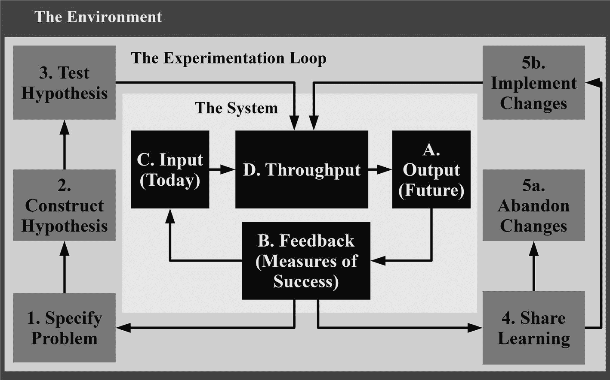
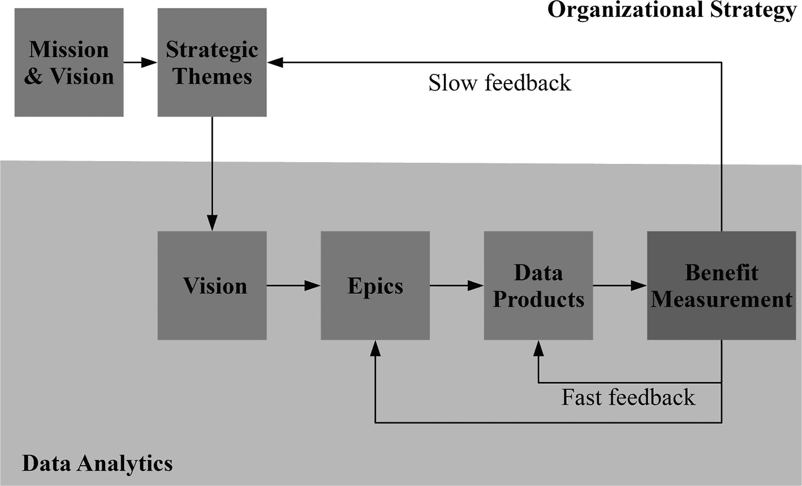

# 5.建立反馈和测量

没有一个数据分析专家每天早上走进办公室时会想，我愿意花很长时间不生产任何有价值的东西，却浪费我的雇主的钱。尽管初衷是好的，但许多数据分析项目还是失败了，或者需要比预期长得多的时间才能产生积极的结果。指责数据工程师、数据科学家和数据分析师是没有意义的。根据 W. Edwards Deming 的说法，“每一个系统都是为了得到它所得到的结果而完美设计的”，“人们在其中工作的系统以及与人们的互动可能占绩效的 90%或 95%。” [1](#Sec23)

不幸的是，虽然在大多数组织中总是有压力要走得更快、做得更多，但几乎没有压力要停下来、反思和提高效率。每年武断地设定增加的目标(好像人们去年不够努力)是一厢情愿的想法。生产力和客户利益的持续增长只能来自于对员工工作系统的监控和改进。

## 系统思维

很多时候，人们都是用线性因果来思考的。例如，你按下开关，灯泡就亮了。线性思维在解决简单问题时非常有效。然而，这个世界主要由人和物之间复杂的相互关系组成，由于无法预料的副作用和反馈循环，很难预测变化的影响。

世界是一个系统的例子，它是一组连接起来形成更复杂的东西的组件。组织是一个系统，包括团队、层级结构、技术、流程、政策、客户、数据、激励、供应商和惯例等组件。数据分析也是一个与组织中的其他系统进行交互和支持的系统。

系统思维侧重于理解系统的组成部分如何相互关联、长期工作、与其他系统交互以识别模式、解决问题和提高性能。敏捷和精益思维是系统思维的子集。敏捷的目标是让系统更能适应不确定性，而精益思想则努力将浪费从系统中剔除。

### 持续改进

数据分析团队可以通过许多方式来改进他们的系统，以正确的方式交付正确的东西。系统思维需要一种训练有素的方法来彻底检查问题，并在得出结论并采取行动之前提出正确的问题。最常见的改进方法之一是通过迭代的持续改进。W. Edward Deming 的计划-执行-研究-行动(PDSA)循环是团队实施持续改进的常用方法。第一阶段是确定具有明确目标的潜在改进，并制定实现改进的计划。do 阶段包括对改进变化进行实验并收集数据。接下来，研究结果并与预期结果进行比较。最后，如果实验成功，采取行动实施改进，并创建更高的绩效基线。随着 PDSA 循环的每一次迭代，都有机会持续改进过程或获得知识。

精益变革管理周期是基于 Eric Ries 的精益创业理念的另一种改进周期。精益计划周期从洞察力开始，洞察力是观察当前情况以发现问题所花费的时间。接下来是选项，这些选项是对相关成本和收益进行改进的假设，这些假设以最小可行变更(MVC)的形式转化为实验，以测试调整是否有效。实验有一个子循环。准备是第一步，这是用于验证受变更影响的人的假设的计划阶段。第二步是引入，此时 MVC 被合并到流程中，并允许运行足够长的时间，以生成足够的数据来决定变更是否成功。最后一步是回顾，团队可以通过有效的学习过程选择坚持有效的变更，放弃无效的变更。

使用 Scrum 的团队遵循一条不同的持续改进之路。Scrum 应用经验过程控制理论，该理论认为，对未定义和不可预测的系统的控制来自对输入和输出的观察、不断的实验和调整。该理论在 scrum 中的应用依赖于三个支柱——透明性、检查和适应性。透明性包括让所有信息，好的或坏的，对每个人都可见，在 scrum 中来自优先的积压和信息辐射。检查要求团队中的每个人评估过程、产品和实践，以识别改进的机会，而适应包括做出导致改进的改变。检查和适应通常发生在冲刺计划、每日 scrum、冲刺评审会议和冲刺回顾中。

团队可以实现其他几个数据驱动的改进周期。在产生 PDSA 技术之前，戴明根据统计学家沃尔特·休哈特的想法创造了计划-执行-检查-行动(PDCA)循环。丰田在 PDCA 的基础上发展了 op DCA(Observe-Plan-Do-Check-Act ),在计划阶段之前增加了观察当前状况的初始步骤。美国空军上校约翰·伯伊德设计了“观察-定位-决策-行动”( OODA)回路来帮助学习和适应模糊的环境。另一个常见的数据驱动的改进周期是定义-测量-分析-改进-控制(DMAIC)，这在使用六适马的组织中很受欢迎。六适马是一套过程改进的技术。

尽管有所不同，所有的持续改进技术都有一个共同的基本思想，那就是建立在科学方法的基础上。这个想法是，来自系统的反馈有助于识别潜在改进的假设，并且可能的改进的有效性通过实验来确定，并且根据明确的结果来测量。成功的想法被实施，无效的被抛弃。图 [5-1](#Fig1) 展示了实验循环和科学方法如何围绕一个系统进行持续改进。

图 5-1

A scientific approach to continuous system improvement

一些 DataOps 原则，如持续满足您的客户、反思、质量至上、监控质量和性能以及改进周期时间，通过采用系统思维观点、收集反馈并将其与科学方法相结合以实现持续改进，可以更容易地实现。

### 反馈回路

精益和敏捷的思维提供了适应变化和快速交付的能力。但是，适合目标也是需要的。目标适应性是朝着正确方向改变并与客户保持关联的能力。为了确保数据分析系统以正确的方式提供正确的东西，并朝着正确的方向前进，需要对性能进行反馈。反馈是系统思考的基本要素。例如，在线性思维中，为一个落后于计划的项目增加更多的工人可能是一个好主意，但是系统思维可能会证明相反的情况。增加更多工人的历史反馈可能会降低项目速度，因为他们需要达到速度，应该考虑不浪费资源的替代解决方案。

反射是第八个数据操作原则。这是分析团队通过定期反思客户、他们自己和运营统计数据提供的反馈来微调他们的运营绩效。收集多种类型的反馈和指标是可能的。但是，有必要涵盖改进数据分析系统所需的各种反馈。

组织教练 Matt Philips 提出知识工作由两个维度组成，一个维度是内部和外部观点，另一个维度是产品和服务交付。 [2](#Sec23) 飞利浦用餐厅的比喻来描述元素。外出就餐时，顾客关心的是食品和饮料的配送方式(服务配送)和产品本身(食品和饮料)。员工也关心服务和产品。但是，从内部的角度来看，他们希望食物始终是好的，原料储存正确，每个人作为一个团队一起工作。图 [5-2](#Fig2) 显示了两个维度以及每个象限的反馈需求。

图 5-2

The two dimensions of knowledge work

反馈和衡量通过回答每个象限中的问题来帮助我们做出正确的事情，包括我们的产品是否健康、我们的团队是否健康、产品是否符合其目标以及我们的服务交付是否符合目的。

数据产品的反馈循环很容易理解。我们可以衡量诸如处理记录所用的时间、数据质量错误、模型预测准确性或收入增长等指标，然后通过做出更改和观察结果进行实验。服务的反馈循环更难理解和实现。然而，所有的知识工作都是一种服务，组织是服务的网络。信息技术服务台为计算机用户提供服务。图形设计人员和内容团队为市场营销、公共关系和网站开发团队提供服务。人力资源为经理和员工提供服务。服务交付包含两个观点。首先，内部观点描述了服务团队认为他们交付的有多好。第二，客户有一个外部的观点来描述交付的适用性。

数据分析不仅仅是终端数据产品。也是为客户服务。数据工程师为数据分析师和数据科学家创建数据流水线，以开发仪表板和机器学习模型等数据产品。内部客户进一步使用数据产品来制定决策，或者其他团队将数据产品嵌入到他们面向消费者的产品中。收集关于服务的反馈鼓励数据科学和分析团队考虑目的，而不仅仅是 ETL 流水线和模型算法的技术实现。

## 团队健康

组织有许多方式投资他们的数据分析团队，包括激励措施，如为他们购买最新的 MacBook Pros，为他们提供免费的食物和啤酒，让他们参加会议，支付比竞争对手更高的薪酬，或将他们安置在时髦的办公室。这些额外津贴可能有助于留住员工，但不会让团队的生产率显著提高。雇主们乐于走捷径，为表面的津贴提供资金，但更不愿意投资于痛苦的变革，而这些变革是让团队更具生产力、让他们产生影响、获得工作满意度所必需的。询问需要改变什么的最佳人选是数据科学家、数据工程师和数据分析师，因为他们是天生的复杂问题解决者。然而，管理者需要培养在正确的时间以正确的方式向他们提问的能力。

### 回顾展

使用大型程序的传统组织改进会花费太长的时间，并且通常是低效和无效的。回顾的敏捷实践允许 DataOps 团队反思他们的工作方式，并不断改进他们的工作。敏捷回顾是从最近发生的事情中吸取教训并确定改进行动的会议。团队拥有敏捷回顾。团队在回顾中既同意行动，又执行行动。因此，没有责任移交。回顾中的行动被传达并添加到团队的 backlog 中，与其他工作一起执行。

人们在工作中通常不会停下来反思，尤其是在他们忙碌的时候。沉思不是一种自然的活动，这就是为什么将一种行为形式化并使之成为一种仪式是如此重要。在组织的不同层次进行定期回顾有助于交付持续的改进，而不会产生局部优化和组织目标的脱离。两周一次的回顾关注团队的工作项目交付、以客户为中心的度量、交付时间和质量。月度回顾和双周回顾有相同的焦点，但是覆盖了一个团队，目的是优化整体。季度回顾侧重于战略主题和组合愿景，以审查和调整史诗的交付，并确保我们仍然在做正确的事情。

一些规则使回顾更有效。团队必须寻找可以自己定义和完成的行动。回顾必须集中在学习和理解上，避免责备和指责固有的低效。问题和行动项目的数量应限于最关键的约束和根本原因分析，用于查找问题的原因而不是症状。团队应该跟踪和评估行动的进展，以帮助他们理解为什么有些活动有效，而有些活动无效，这是一个被称为双循环学习的过程。

### 健康检查

没有一个单一的回顾性练习总是能给出最好的结果。因此，我们应该根据手头的问题和团队的心态使用不同的活动。确定需要关注的改进领域和回顾性练习的有用选择的方法是进行健康检查评估。这样的评估因 Spotify 的 Squad 健康检查模型而流行开来。 [3](#Sec23) 团队健康检查评估是每月或每季度的研讨会，使团队能够基于许多属性讨论和评估他们的当前状况。

健康检查研讨会是一个长达一小时的促进式面对面对话，围绕健康团队的不超过 10 个属性进行。对于每个属性，团队试图从三个层面就其状态达成共识或多数决定。RAG(红色/琥珀色/绿色)状态、拇指向上/向旁边/向下、或微笑/中性/悲伤的表情是可视化级别的方式。红色、拇指朝下或愁眉苦脸状态表示该属性需要改进，团队不健康。琥珀色、横着的拇指或中性脸表示属性需要处理，但这不是灾难。绿色、竖起大拇指或笑脸状态表示团队对该属性感到满意。保持讨论简短，但理解为什么每个人都选择评级是很重要的，因为到目前为止实际上还没有解决任何问题。图 [5-3](#Fig3) 显示了健康检查评估的示例。

图 5-3

A health check assessment grid

健康检查不是对个人和团队进行评级或评判的方法。相反，它是集中改进、向管理层反馈以及记录团队如何随时间发展的基础。团队可以自由添加、删除或更改问题，以涵盖他们认为最重要的内容。

一旦每个属性被分配了一个状态，团队就选择一两个需要改进的属性作为回顾练习的焦点。快速的互联网搜索应该会发现许多为解决特定类型的问题而定制的回顾性练习。首先，下面是三个简单活动的例子，它们几乎不需要准备，适合任何团队，并且适用于广泛的问题。

### 海星回顾展

如图 [5-4](#Fig4) 所示，海星练习首先在活动挂图或白板上画一个圈，圈里有五个单词。

图 5-4

A starfish retrospective diagram

画完图后，团队开始头脑风暴停止想法，并记录在便签上。停止想法是在流程中引入浪费的活动，对团队或客户没有价值。一旦每个人都把他们的想法放在图表的相应部分，团队花 10 分钟讨论和巩固要点。重复这个过程，减少那些带来很少好处，但是需要大量努力的活动。接下来，团队转移到 keep，这是团队成员想要继续探索的当前活动。keep 之后，团队继续 more(团队应该更经常执行的活动)，最后以 start(团队想要开始的行动或想法)结束。

通过遵循这个过程，团队可以很好地了解什么是有效的，什么是无效的，以及什么需要改变。最后一步，团队在开始部分投票选出最重要的一个计划。该计划然后被转化为工作项，这些工作项被添加到团队的待办事项列表中，并与其他工作一起交付。

### 帆船回顾展

帆船回顾展改编自卢克·霍曼设计的快艇创新游戏。 [4](#Sec23) 帆船练习首先在活页挂图或白板上画出一艘帆船、岩石、云彩和一个岛屿，如图 [5-5](#Fig5) 所示。

图 5-5

The sailboat retrospective drawing

帆船是一个团队朝着一个目标前进的隐喻(以一个岛屿为代表)。风象征着有助于推动团队的事物，锚象征着阻碍团队前进的障碍，石头象征着可能阻止团队实现目标的风险。

培训师在图片上写下团队的目标，并要求他们思考什么可能会减缓团队前进的速度，以及与他们可能面临的目标相关的未来风险。团队把他们的想法记录在便利贴上，这些便利贴放在船的上方或下方，以表明它们是风、锚还是岩石。一旦每个人都有机会分享他们的想法，团队成员将笔记分成相关的类别并分配标签。团队讨论分组，并根据需要进行调整。当团队达成共识时，他们考虑如何在风区继续练习。最后，团队对 anchor 和 rocks 中最需要解决的标记组进行投票，以便他们可以继续分析问题的根本原因，并确定解决问题的步骤。

### 你先走

我们经常回顾那些严重出错的项目，并问自己，发生了什么？我们进行回顾和反思，试图解释我们是如何失败的。但是，在项目失败后，不是讨论解决方案的时候。预分析是 Gary Klein 开发的一种先发制人的回顾性练习，在一项工作开始时进行，以确定失败的原因，并在失败发生前减轻失败。预死亡是项目成功的一项有价值的投资，但是却被犯罪性地滥用了。

我建议留出至少 90 分钟不受干扰的时间进行面对面的会谈。如果这看起来时间很长，请记住上次灾难袭击项目时，清理混乱的局面花了多长时间。邀请每一个重要的角色参加预死亡。如果你没有包括正确的人，盲点将不可避免地出现。

在死前，想象你的项目失败了。想象你的项目悲惨地失败了。遗憾地想想你本可以做得更好，并对发生的事情感到难过。这可能看起来很戏剧化，但是真的很有帮助。在最初的 45 分钟里，在白板或墙上贴一张便条，包括每一个问题，哪怕是发生的可能性很小的问题。让每个人都专注于便利贴问题。在这个阶段，没有问题是禁区(即使是不方便的事实)。唯一禁止的话题是提议的解决方案。解决方案是严格禁止的，因为它们会把团队从公开解决每个问题上引开。

在每个人都列出失败的原因后，将原因分成相似的主题。然后，团队投票确定项目的三大风险。投票应该集中在可能发生的最关键的问题和团队可以控制的问题上。花最后 30 分钟为这三个问题创建主动解决方案或备份计划。最后，将行动和责任分配给团队成员。否则，风险将无法降低，导致问题无法解决。

## 服务提供

团队健康检查和回顾有助于帮助分析团队走得更快，但对于分析团队来说，了解内部客户是否认为他们的服务交付符合目的同样重要。通常，对于利益相关者来说，对分析团队的响应能力、交付能力和同理心的信任与产品本身的健壮性和优势一样重要。

### 服务交付审查会议

分析团队应定期召开服务交付审查会议，与内部客户讨论他们满足服务交付预期的情况。尽管它起源于看板节奏(由 David Anderson 提出的一系列双向沟通会议建议)的一部分，但它并不局限于看板团队或大型组织。 [6](#Sec23) 讨论能够就速度和折衷达成一致，同时最大限度地减少对需求和期望的误解。

会议的频率可以是每周一次、每两周一次或每月一次，但是会议之间的任何更多时间都会增加由于缺乏反馈而无法满足客户期望的风险。议程应由数据驱动，并包含指标以避免主观化，并允许跟踪一段时间内的改进。然而，会议也是分享相关定性反馈的机会，否则会被错过，例如，来自呼叫中心或其他一线员工的用户研究。

定量指标应从客户的角度关注分析团队的交付。通常，客户感兴趣的是团队交付的速度、是否按时完成、他们了解的情况、交付的风险如何降低、团队承担的工作组合以及解决与新工作相关的问题所花费的时间。衡量客户关注的相应指标包括交付时间、周期时间、不同工作类型的百分比分配、到期日绩效、受阻或延迟项目的数量，以及由于错误或沟通不当导致的返工率。

这些措施形成了讨论与客户期望相比的不足之处(如果有的话)的基础。根据测量结果，通过根本原因分析分析差距，并改变分析团队的工作方式，以提高他们在客户眼中的能力。重要的是要记住讨论是双向的。因此，并非所有的客户期望都是合理的。会议也是请求客户支持的机会，例如，要求客户更快地回答问题或提供支持以上报和解决组织中其他地方的阻止者。最终，服务交付审查应该建立信任并改善分析团队与其客户之间的关系。

回顾和服务交付会议似乎给每个人都很忙的环境增加了时间。然而，这些不是传统的低效商务会议。他们有明确的议程，要求积极参与，并以增值行动结束。虽然这些会议需要时间，但是服务交付审查会议和根据反馈采取行动应该可以节省不可避免地浪费在糟糕的流程和误解上的时间。为了减少开销和阻力，我建议在日历中增加新的时间段之前，将这些做法合并到已经举行的会议中。与所有持续改进的方法一样，频率、持续时间和出席率应随着时间的推移进行调整，以使事情发挥作用，目标是成为每个相关人员的习惯。

### 改善服务提供

成功的服务交付审查需要数据为讨论提供信息并跟踪改进。我建议从跟踪简单的指标开始，比如总在制品(WIP)、阻碍项目进展的障碍、吞吐量、交付时间和到期日绩效。

总 WIP 是已经开始(由任何人)但尚未完成的所有任务的计数。作为一种直觉检查，将总 WIP 除以团队成员的数量，得到每个人的平均值，并评估这种感觉是否正确。当人们意识到他们要做的工作比他们想象的要多得多时，这一措施通常会让他们大开眼界。随着你更好地管理 WIP，你将开始看到这个顶线数字下降。被阻止的项目无法前进。也许发生这种情况是因为你在等待来自外部的信息，没有它就无法继续。记录项目被阻止的频率、它们被阻止的时间以及它们在过程中的什么地方被卡住是一个好主意。将阻止程序分为外部原因和内部原因，然后进一步分为类似的子组，如等待系统访问、等待审查、等待测试等。为根本原因分析和解决方案实施划分子组的优先级。

交付周期是指从提出请求或添加到团队的待办事项列表中开始，完成工作所需的时间。因此，记录任何新工作项目的开始日期，并计算在那一周完成的每个项目的平均提前期。减少系统中的队列长度，以缩短平均交付时间。对于有截止日期的项目，记录这些日期的完成情况以及任何失误的成本，并与可接受的成功率进行比较。吞吐量是每个周期完成的项目数。每周结束时，记录成品的数量。每周追踪这个数字，看看你所做的改变如何影响完成的工作量。

服务交付评审度量跟踪团队通常不讨论的度量，并增加透明度。您可能会发现，客户并不知道分析团队面临的阻碍因素的数量。或者，也许分析团队正在尝试做太多事情，而客户宁愿他们优先完成高优先级项目的截止日期。这些只是服务交付指标可能揭示的一些重要内容。

## 产品健康

在生产中部署包括数据流水线在内的数据产品不是旅程的结束，而是过程的开始。数据产品是数据和代码的结合。输入产品的数据可能会停止，或者随着时间的推移突然或缓慢地改变。此外，代码中的变化，比如对机器学习模型或 ETL 流水线的更新，也会无意中降低性能。随着时间的推移，数据中潜在关系的变化(称为概念漂移)可能会降低预测模型的性能，或者使仪表板变得越来越没用。因此，监控检查数据产品是否适用，以便更新和回滚可以纠正问题。

### 数据产品监控的 KPI

数据产品的生产系统可以分解为多个组件。数据首先被捕获并摄取到存储或流处理中。接下来，数据流水线转换数据并将其提供给数据产品，数据产品在用户或其他系统消费之前对其进行进一步处理。这些组件的健康状况会影响数据产品消费者的决策能力，因此 KPI 需要对它们进行监控。

最重要的 KPI 是数据接收和数据流水线的正确性。数据产品的逻辑可能是正确的，但数据中的错误可能会破坏其输出，并导致其返回错误的答案。数据摄取的正确性是摄取的正确记录的数量占摄取的所有记录的比例。数据流水线的正确性是从流水线中输出的具有正确值的记录数占进入流水线的记录数的比例。

数据的及时性和数据流水线的端到端延迟是重要的 KPI。组织从数据中获取价值的速度非常重要，因此需要识别意外的瓶颈。数据的及时性是指消费者访问的数据中比指定时间阈值更新得更近的数据所占的比例。例如，在 ML 模型预测或仪表板指标中，及时性很重要。数据流水线的端到端延迟是以超过规定时间阈值的速度进入和退出流水线的记录的比例。一个相关的 KPI 是覆盖率。对于批处理，覆盖率是在所有应该处理的记录中成功处理的记录的比例。对于流处理，覆盖率是在规定的时间窗口内成功处理的进入流的记录的比例。

数据产品消费者也对可用性和延迟的 KPI 感兴趣。延迟是对数据产品请求的响应快于特定阈值的比例。还有数据产品本身的可用性，KPI 是获得成功响应的请求的比例。例如，可以预期机器学习模型 API 在 100 毫秒内返回预测响应，并且每天返回 99.99%的预测请求的响应。正确摄取的数据的可用性对于数据消费者来说也很重要。无法在数据流水线中进行进一步处理的数据，例如，今天等待通宵批处理的操作记录或冷藏中不容易检索的记录，也可能不存在。数据接收的可用性 KPI 是数据流水线可以处理的正确捕获的记录的比例。

可以考虑许多其他 KPI，但最好从几个最重要的 KPI 开始，只有在这样做有好处时才增加更多。例如，正确性总是很重要，但是在一个正常运行的流水线中，所有的处理最终都会完成。因此，如果它真的坏了，但可以修复，而不会给用户带来太多痛苦，那么及时性可能就没那么重要了。

数据产品监控的 KPI 和目标需要得到所有利益相关方的批准，包括负责实现这些目标的分析团队。避免使用均值或中值平均指标，因为如果表现高度扭曲，它们可能会隐藏问题。例如，延迟 KPI 的平均响应时间在一周中可能看起来很好，但在高峰使用时间隐藏了中断。与平均水平相同且没有宕机的情况相比，这是一个更糟糕的结果，即使一些用户的响应稍慢。相反，将 KPI 目标建立在良好事件(满足可接受的性能阈值的事件)除以适当时期内的总事件的比率上。

对于 KPI 来说，百分之百不是一个可行的目标。尽管尽了最大努力，系统还是会失败，数据也会损坏。将 KPI 的阈值设置在对数据使用者重要的级别，或者设置在他们开始注意到的时间点，例如预测 API 返回响应的时间为 100 毫秒。将性能提高到阈值水平以上的努力可能会被忽视，或者不会带来很多好处。

随着 KPI 绩效目标的增加，实现这些目标的成本也开始成倍增加。团队的规模必须扩大，以便他们有能力主动应对迫在眉睫的问题，冗余组件必须处于备用状态，以便在系统出现故障时接管工作。在某种程度上，成本大于收益。过高的 KPI 目标还会阻碍新的开发，因为任何变更都会引入危及性能的潜在风险。通过避免任何变化，降低了低于非常高可靠性 KPI 的风险，但这是以增加新收益的机会成本为代价的。

### 监视

第十五条数据运营原则是质量至上，该原则规定，分析流水线应建立在能够自动检测代码、配置和数据中的异常(jidoka)和安全问题的基础上，并应向操作员提供持续反馈以避免错误(poka yoke)。数据产品的生产系统可以包含许多组件，每个组件都有许多处理步骤和不同的监控代码。

监测从摄入阶段开始。数据摄取的正确性并不容易衡量。拒绝不正确数据的原因有很多，例如缺少值、截断值、数据类型不匹配、重复或值不符合字段类型。一种方法是编写尽可能多的测试，并对发现的每个潜在缺陷不断添加检查，以防止坏数据进入流水线。这些测试有助于诊断问题发生的原因，并有助于为与上游数据供应商的讨论提供信息，以避免问题再次发生。摄取的正确记录与总记录的比率给出了数据摄取的正确性 KPI。

数据流水线的正确性也不容易衡量。除了添加测试之外，另一种方法是存储测试输入数据的代表性样本和已知的经验证的输出，并在每次更改后将其放入数据流水线。从流水线出来的具有正确值的记录与进入流水线的记录的比率提供了数据流水线的正确性 KPI。

通过向数据添加带有主要处理步骤时间戳的水印，计算数据的及时性和数据流水线的端到端延迟。对于及时性 KPI，每次数据产品消费者与产品交互时，请求的时间可以与数据上次更新的时间进行比较。例如，一名工程师从他平板电脑上的一个应用程序中请求一个 API 提供的机器维护时间预测。API 不仅可以记录请求的时间，还可以记录机器预测最后更新的时间。消费者访问的数据比指定的时间阈值更新的次数的比例是及时性 KPI。通过获取开始和结束处理时间戳之间的差异，并计算在商定的阈值下经过的时间的比例，可以容易地计算数据流水线的端到端延迟 KPI。

数据覆盖 KPI 的计算非常简单。数据流水线导出进入流水线的记录数和成功处理的记录数。数据产品的可用性和延迟 KPI 的计算在很大程度上取决于应用。理想情况下，数据可能已经存在于服务器日志或现有的应用程序监控仪表板中。否则，我们必须从零开始。

手动监控 KPI 不是一个选项。检测异常的过程必须自动化，以便将人们从更重要的关注领域中解放出来。向生产系统的操作员提供反馈的最佳方式是通过仪表板和来自监控代码的警报。监控代码、仪表板和警报的目的是在问题影响 KPI 目标以及数据产品的消费者之前，尽可能早地识别问题及其原因。

在外部消费者 KPI 目标和团队内部警报目标之间保持一个缓冲区，可以创建一个警告区域，让您在问题变得严重之前做出响应。在某些情况下，变化可能是突然的，如果未达到 KPI 目标，则有必要停止生产线，因为下游数据损坏和未来再处理的成本比立即修复问题的成本更高。监控还有一个好处是可以生成关于瓶颈的反馈，因此最重要的约束，无论是基础架构和容量、手动过程还是缓慢的代码，都可以被移除或重构。

### 概念漂移

机器学习和深度学习模型从历史输入和输出数据中学习规则，以根据新的输入数据进行预测。假设新的输入和输出数据之间的关系与历史输入和输出数据保持相同，因此机器学习模型有望对新的未知数据做出有用的预测。这种关系在某些情况下可能成立，例如，那些由自然法则固定的情况，如猫的图像识别算法。然而，其他关系，如客户购买行为、垃圾邮件检测或产品质量与机械磨损的关系，最终将在一个称为概念漂移的过程中演变。

解决概念漂移问题的被动策略是使用最近数据的窗口周期性地重新训练模型。然而，由于负反馈循环，在某些情况下这不是一个选项。想象一个推荐系统，其中特定的客户基于以前的购买关系看到对产品 X 的推荐。这些客户的数据现在有偏差，因为他们现在更有可能购买产品 X。基于此数据训练的模型将进一步提升对产品 X 的推荐，即使在外部世界中，原始关系已经改变，客户更喜欢产品 Y 而不是产品 X

负反馈问题的一个解决方案是从模型预测中随机取出一些实例，以创建基线来测量模型性能，并生成用于模型训练的无偏数据集。另一种策略是使用触发器来启动模型更新。概念漂移很难发现，有多种检测算法。一些常用的算法是漂移检测法(DDM)、早期漂移检测法(EDDM)、几何移动平均检测法(GMADM)和指数加权移动平均图检测法。这些算法可以内置到性能的连续诊断监控中，并在模型需要重新训练时发出警报。然后，可以对一些或所有实例关闭预测，以生成用于重新训练的无偏数据，从而避免负反馈循环。只有当模型表现不好时才进行再训练，因此训练成本和预测收益的机会成本低于其他两种方法。

## 产品效益

健康的数据产品本身并不足以取得成功。最终，数据科学和数据分析的目标是做出更好的决策，改善产品创造、客户体验和组织效率。数据分析和数据科学绩效的主要衡量标准是这些改进的决策给组织带来的好处。如果数据产品符合其效益目标，则进行持续的真实反馈测量。

### 利益衡量

效益衡量的第一步应在数据产品仍处于初始阶段时进行，即创建 KPI 的监控和效益衡量计划，如成本节约、收入增加或客户体验指标的改善。第二步应该发生在数据科学生命周期的研发(R&D)阶段，同时创建 MVP。数据科学家和数据分析师应该从技术和主题专家那里收集反馈，以评估他们的数据产品早期迭代的性能。最初的反馈为数据产品是否适合目的提供了指导，并有助于正在使用的监测的设计。

初始和 R&D 阶段的离线反馈虽然非常有用，但也有局限性。离线开发和使用实时数据的在线生产有几个显著的区别。例如，在现实世界的生产中，硬件和数据可能不像开发设置那样可靠。例如，传感器可能无法提供数据。消费者行为可能会因为数据产品创建了一个强化反馈回路而发生变化，该回路会产生受数据产品输出影响的新数据。在某些用例中，欺诈者、垃圾邮件发送者、黑客和竞争对手等对手会改变他们的行为来规避预测模型。解决方案是创建一个报告框架，能够通过测量收益来提供关于 MVP 和产品中正在进行的迭代的反馈。

最干净的解决方案是创建将数据产品部分部署到消费者的随机子集的能力，并使用 A/B 测试实验，也称为随机分配。在 A/B 测试中，通过将随机接触数据产品的消费者与没有接触数据产品的消费者(称为抵制控制组)或当前最佳方法(称为冠军/挑战者实验)进行比较，来计算收益衡量 KPI。统计假设检验验证了组间效益测量 KPI 的差异是由于我们对不同组的治疗还是由于偶然因素。A/B 测试可以扩展到包括两个以上的组或变体。然而，同时测量的变量越多，统计假设检验花费的时间就越多，因为它们的输入之一是测量的观察值的数量。大多数 web 测试和营销自动化平台，如 Google Optimize、Optimizely、Adobe Target、Mixpanel 和 Salesforce Marketing Cloud，都可以促进 A/B 测试。开源替代 A/B 测试工具包括用于前端应用的 Alephbet 和用于服务器端实施的 Wasabi 和 Proctor。

MVP 的 A/B 测试完成后，应使用数据产品的效益衡量计划来决定成本效益结果是否保证另一次研发迭代，以优化流水线和分析，或者放弃它并转向另一个 epic。然而，除非数据产品退役，否则效益计量将持续存在。测量基线仍然是一个停滞不前或以前的冠军对照组。然而，与最初的 A/B 测试相比，这些群体中的消费者比例可能会降低，因为快速学习现在不如利益最大化重要。

有时，无法使用现成的工具来监控收益。这通常是因为工具中没有 KPI 数据，或者选择治疗组的逻辑很复杂，需要在工具之外处理。与数据产品监控 KPI 一样，效益 KPI 的手动监控很快变得难以管理，需要实现自动化，并且最好在具有简单用户界面(UI)的仪表板中呈现。

除了度量 KPI 之外，仪表板还需要计算统计数据，如 p 值、置信区间和显著性。为仪表板提供数据的数据存储和数据流水线需要跟踪哪些消费者在实验或治疗组的哪个桶中，他们何时进入和退出组，以及要跟踪每个数据产品的哪些指标。如果数据分析团队负责测量由组织的其他部分运行的实验，收益测量框架可以扩展到数据产品之外。

效益衡量报告框架本身可以成为复杂的数据产品，但对它们的投资对于长期成功至关重要。图 [5-6](#Fig6) 显示了效益测量的反馈回路。

图 5-6

Slow and fast feedback loops from benefit measurement

受益衡量的快速反馈有助于优化当前数据产品、学习和优先考虑未来数据产品，因为它可以更好地估计延迟成本，并向高级利益相关方证明数据分析投资的合理性。较长时间的缓慢反馈有助于组织了解其策略的效果。

### 效益衡量挑战

正确衡量产品效益存在技术、实践和文化方面的挑战。A/B 测试和测量有许多陷阱。确保不同组间治疗的完全随机化比听起来要困难得多，因为偏见可能从许多来源渗入。我曾经发现一个电子邮件服务提供商在挑战者组之前发送冠军组的电子邮件。虽然两组都是彼此的代表，但电子邮件的时间选择意味着两组之间的差异不仅仅是由于治疗效果。

一旦效益衡量框架的集成完成，建议通过运行 A/A 测试来验证它，以确认衡量标准是正确的。A/A 测试对随机对照组和测试组一视同仁。如果测试和测量框架功能正常，各组之间的测量结果应该没有显著差异。但是，如果存在显著差异，则需要对流程进行调查。

除了简单的相关性之外，许多组织并不衡量他们的计划的好处，例如我们执行了一项行动，而收入却同时增加了，所以这一定是由于我们的行动。收入增加的原因可能有很多，但都与行动无关。任何看过泰勒·维根虚假相关性网站图表的人都知道，相关性并不意味着因果关系。 [7](#Sec23) 如果没有反事实(一种如果行为没有发生会发生什么的衡量)，很难确定因果关系。

反事实是 A/B 测试成为测量黄金标准的原因。但是，在某些情况下，出于法规、道德或信任的原因，不可能通过将客户分配到随机治疗组来区别对待他们。有时，也没有足够的消费者或对数据产品使用的观察来计算统计假设检验的稳健输出。在这种情况下，来自消费者的直接反馈可以帮助估计收益。

一些组织不愿意衡量效益，因为他们在一种奖励产出而不是结果的文化中运作。从 JFDI(只是该死的做(礼貌的形式))执行和移动到模式运行实验和等待结果之前迭代的实质性过程变化是利益衡量的一个重大障碍。许多经理也缺乏统计知识或害怕统计，不希望他们的决策被他们不理解的东西所引导。市场营销等创收部门普遍存在一种被误导的担忧，即由于抵制群体的机会成本，衡量会减少收入。这种行为就像在赌场轮盘赌桌上把你所有的筹码都押在红色上，因为你担心保留筹码会减少你的赢款。

很难打破一种不定期衡量效益的组织文化。一种选择是找到楔形物的薄端(组织的低风险区域)进行实验，并在慢慢扩展到其他区域之前展示可实现的好处。另一种选择是通过尽可能多地自动化流程或使用替代测量方法来降低实验成本和效益测量。除了随机的 A/B 测试和测量，还有其他的选择，但是在统计学中没有神奇的免费午餐，只有伴随着交换而来的捷径。

### A/B 测试和测量的替代方法

社会科学，尤其是计量经济学(将统计技术应用于数据的经济学分支)已经开发了一套技术来确定 A/B 测试不可行时的因果关系。最简单的方法是回归分析，这是一种衡量多个变量与结果之间关系的方法。例如，一家出租车公司引入了一个 ML 模型来预测对其服务的需求，因此它可以灵活调整运力并增加总预订量。通过使用模型实施前后的数据，控制所有其他影响因素(即，星期几、一天中的时间、天气和事件)的 ML 模型使用的总预订量的回归隔离了 ML 模型的贡献。回归分析的缺陷在于，我们可能没有模型中要控制的所有因素的数据，这夸大了治疗的贡献。

差异中的差异(DID)是另一种常用的计量经济学技术。DID 依赖于治疗组和对照组之间的前后结果的比较，这两个组并不相同，但显示出平行的趋势。想象一下，我们的出租车公司在华盛顿使用 ML 模型，但还没有在巴尔的摩使用，在那里它也运行并显示非常相似的模式。如果没有这个模型，预计华盛顿和巴尔的摩之间的总预订量也会出现同样的趋势。因此，对实施该模型前后城市间总预订量变化的比较，提供了对该模型有效性的估计。DID 的缺点是，如果治疗以外的东西在后期改变了一组的趋势，而另一组没有，这违反了平行趋势假设。

多臂 bandit 算法是一些人声称优于 A/B 测试的方法的一个例子。在标准的 A/B 测试中，您通常在数据产品的两个版本之间将用户分成 50:50。其中一个版本的性能会比另一个更差，因此存在将用户暴露于该变体的机会成本。使用多臂 bandit 算法，在探索阶段(通常占实验预计持续时间的 10%)也可以从平均分割开始。但是，在接下来的开发阶段，用户会根据变体的相对性能进行划分，更多的用户会接触到性能更好的变体。这种分割降低了测试的机会成本，但是因为性能较低的变体暴露给较少的用户，所以很难区分它是更差还是差异是由于偶然。与用户在变体之间平均分配相比，需要更长的时间来达到统计上的显著结果。如果变体之间的性能差异很小，那么与 A/B 测试相比，甚至机会成本收益也可以忽略不计。

### 度量挑战

效益衡量计划包含衡量数据产品成功与否的 KPI，最终目标是实现组织的战略目标。但是，有些指标可能无法在系统中随时获得，或者只能在长期内获得，如市场份额、客户保持率或净现值(NPV)。理想情况下，测量应该等到长期指标可用时进行。但实际上，从短期措施来看，有逼近的压力。

有两个挑战。首先，长期指标，尤其是会计指标，可能会鼓励失败，因为它们会激励管理者提出夸张的情景，以证明在融资竞争中的投资是合理的。如果他们获得了资金，经理们不得不追求一个“要么做大，要么回家”的计划来实现他们的幻想预测。第二个挑战是，容易获得的短期成功指标可能与长期甚至中期指标并不正相关。

解决方案是通过分析历史相关性找到成功的领先指标，而不是依赖假设。您不太可能看到完全相关的短期和长期指标，但统计或机器学习模型可能会找到与每个指标直接相关的指标。例如，客户反馈、每客户收入、重复购买和保留率往往会一起变动。

避免涵盖所有基础和衡量一切的诱惑。当措施过多时，优化和取舍就变得困难。解决方案是将度量提高一个级别，并减少度量的数量。找到一件重要的事情，它将为较低级别的指标带来正确的结果，并促进折衷。例如，在衡量一个网站的指标时，不要试图在降低跳出率的同时增加平均会话持续时间、页面浏览量、回头客转化率、新访客转化率和每次会话的互动量，而应该以提高每次访问的收入为目标。

## 摘要

“精神错乱就是重复同样的错误并期待不同的结果”这句话被误认为是阿尔伯特·爱因斯坦说的，但它最初出现在 1981 年的一份匿名麻醉品出版物上。 [8](#Sec23) 尽管如此，一种保持交付工作的瘾，同样的道理，每次都无法带来改善。

逃离平庸的监狱是可能的。21 世纪的知识工作者有两项工作。首先，执行他们的日常工作，并不断寻求改进他们的工作。DataOps 领导者不断寻找新的方法来培养一种不断提高生产力和客户利益的文化。持续不断的改进需要不断投入时间和精力来发展系统思维，收集团队和客户的反馈，并应用科学方法来更快、更好、更便宜地交付产品。第二，基于测量的改进要想成功，数据必须可靠。下一章描述如何增加对数据的信任和对数据用户的信任。

## 尾注

1.  W.爱德华兹·戴明，爱德华兹·戴明引用，爱德华兹·戴明研究所。[T2`https://quotes.deming.org/`](https://quotes.deming.org/)
2.  Matt Philips,《服务交付回顾:缺失的敏捷反馈环》?2017 年 5 月。[T2`https://mattphilip.wordpress.com/2017/05/24/service-delivery-review-the-missing-agile-feedback-loop/`](https://mattphilip.wordpress.com/2017/05/24/service-delivery-review-the-missing-agile-feedback-loop/)
3.  Henrik Kniberg,“小队健康检查模型——可视化改进”, 2014 年 9 月。[T2`https://labs.spotify.com/2014/09/16/squad-health-check-model/`](https://labs.spotify.com/2014/09/16/squad-health-check-model/)
4.  Luke Hohmann,《创新游戏:通过合作创造突破性产品:创造突破性产品和服务》, 2006 年 8 月。
5.  Gary Klein,《执行项目预死亡》,《哈佛商业评论》, 2007 年 9 月。[T2`https://hbr.org/2007/09/performing-a-project-premortem`](https://hbr.org/2007/09/performing-a-project-premortem)
6.  大卫·安德森，看板节奏，2015 年 4 月。[T2`www.djaa.com/kanban-cadences`](http://www.djaa.com/kanban-cadences)
7.  泰勒·维根,《虚假相关性》。[T2`www.tylervigen.com/spurious-correlations`](http://www.tylervigen.com/spurious-correlations)
8.  麻醉品匿名小册子，(基本文本批准形式，未出版的文学作品)，第四章:它是如何工作的，第二步，第 11 页，1981 年 11 月印刷。[T2`https://web.archive.org/web/20121202030403/http://www.amonymifoundation.org/uploads/NA_Approval_Form_Scan.pdf`](https://web.archive.org/web/20121202030403/http://www.amonymifoundation.org/uploads/NA_Approval_Form_Scan.pdf)