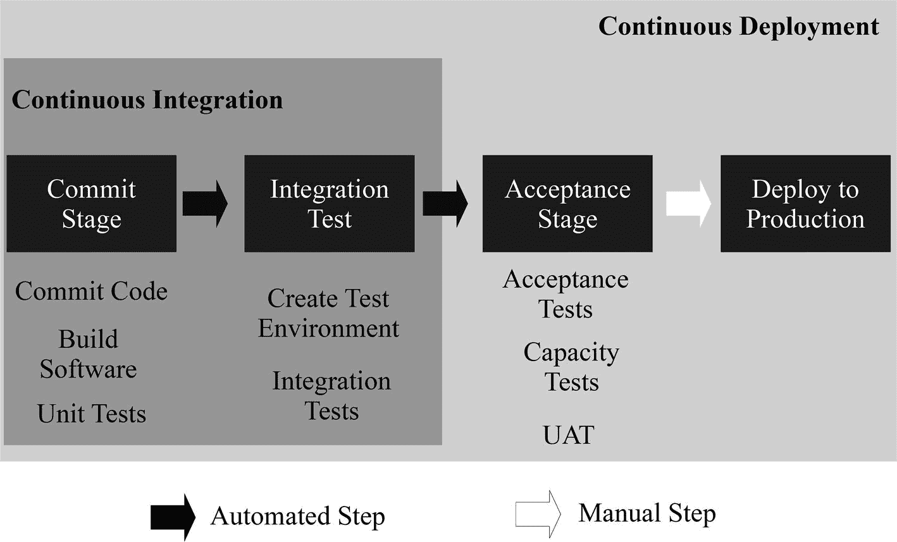
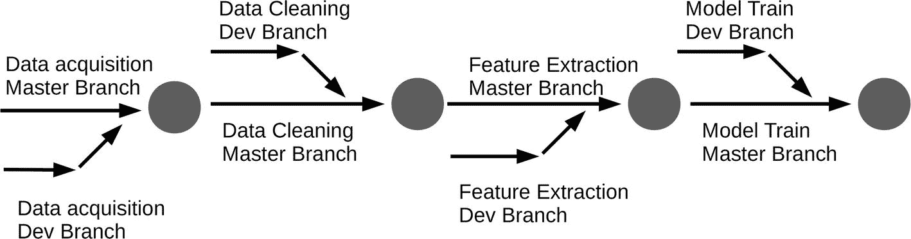

# 7.面向数据运营的开发运维

建立对数据的信任和对数据用户的信任可以最大限度地降低风险。信任保护法规遵从性，降低商业风险，并保护组织的声誉。对数据的信任还可以确保数据的完整性，并使用户更容易识别和安全地使用数据。Leandro DalleMule 和 Thomas Davenport 在其著名的《哈佛商业评论》文章中将数据策略的这一方面描述为数据防御。 [1](#Sec24) 数据防御至关重要，但对于平衡的数据策略来说，数据进攻也同样重要。数据犯罪以数据使用为中心，做出提高组织效率、增强客户体验和改进产品创造的决策。

像任何运动队一样，所有组织都需要防守和进攻的平衡才能茁壮成长。DalleMulle 和 Davenport 认为，最佳权衡各不相同，取决于组织的战略、监管环境、竞争格局、数据成熟度和预算。例如，受到严格监管的行业将更加重视数据防御，而不是数据攻击。然而，所有组织都需要至少一些进攻性的举措来避免浪费机会。数据攻击计划需要不同于数据防御的方法。数据犯罪使用的方法超出了数据治理、数据管理和降低风险的范围。

要让数据攻击取得成功，组织需要速度、尽快开发和发布新数据产品的适当流程，以及规模。规模是指快速增长数据产品以满足不断增长的需求的能力。软件开发和 IT 运营已经开发了一套文化哲学、实践和自动化技术来提高应用程序交付和迭代的速度，称为 DevOps。DevOps 引入的流程创新可以提高数据分析交付的速度和规模。

## 开发和运营

DevOps 正在彻底改变软件部署的速度和规模。在 20 世纪 80 年代、90 年代甚至 21 世纪初可以接受的新开发和功能发布的速度在今天是不可接受的。历史上，软件的最新功能和版本需要数百万美元和数年时间来开发和发布。

微软视窗是旧软件发布方式的典型例子。每一个新版本都是一个重大的全球性事件，需要几年的时间来开发。Windows XP 和 Windows Vista 之间有将近 6 年的差距。在 Windows 频繁更新的今天，很少有人知道或者关心自己用的是哪个版本的 Windows 10(我写这本书是 1903 版本)。更少有人知道他们用的是哪个版本的流行应用程序，如谷歌 Chrome 或脸书，因为更新的速度实在是惊人。DevOps 让脸书每隔几个小时发布几十到几百条更新成为可能。 [2](#Sec24)

### 冲突

大多数组织仍然难以每周或每月在生产中部署软件变更，更不用说一天数百次了。通常，这些生产部署是高压力事务，涉及停机、消防、回滚，有时甚至更糟。2012 年 8 月，金融服务公司 Knight Capital 的一个交易算法部署错误导致该公司在修复该问题的 45 分钟内损失了 4.4 亿美元。 [3](#Sec24)

软件开发和 IT 运营团队之间的目标冲突是导致产品和功能发布缓慢的一个重要原因。软件开发团队希望部署新的特性，并通过尽快修改生产代码来响应市场变化。IT 运营团队希望客户拥有稳定、可靠和安全的服务。他们还希望任何人都不可能做出危及这一目标的改变。因此，开发和 IT 运营团队有相反的目标和动机。这种冲突导致恶性循环，导致新产品上市时间越来越长，质量越来越差，技术债务增加，以及日常消防工作。

作者和 IT 专家吉恩·金、杰兹·亨布尔、帕特里克·德博伊斯和约翰·威利斯用三个步骤描述了这种螺旋式下降。 [4](#Sec24) 在第一幕中，IT 运营部门的任务是运行复杂的应用程序和基础架构，这些应用程序和基础架构缺乏文档记录，并且背负着技术债务。找不到时间来清理技术债务，需要不断的变通方法来维护容易出现故障的系统。当生产变更失败时，它们会影响客户的可用性、收入或安全性。

在第二个步骤中，开发团队被分配了另一个紧急项目，以弥补以前的失败所造成的问题。因此，开发团队会偷工减料，增加技术债务，以满足最后期限。在最后阶段，由于复杂性增加、工作依赖性增强、协调和批准速度变慢以及排队时间变长，所有事情都需要更长时间才能完成。

随着死亡螺旋的深入，产品代码部署需要越来越长的时间来完成。向旧开发中添加新功能而不是松散地分离组件所导致的紧密耦合(软件组件高度相互依赖)会导致即使是很小的更改也会出现重大故障。每个新的部署都增加了复杂性，并导致 IT 运营部门进一步灭火，以将所有内容整合在一起，这减少了偿还技术债务、分离组件以及向开发人员提供反馈的时间。冲突的代价不仅仅是经济上的。对于相关的员工来说，通过在晚上和周末工作来保持船只漂浮，这造成了压力并降低了生活质量。

### 打破螺旋

DevOps 打破了开发和 IT 运营之间的冲突导致的死亡螺旋。DevOps 实践寻求实现多个 IT 功能、开发、QA、安全和 IT 运营的目标，同时提高组织的绩效。

在 DevOps 模型中，开发和 IT 运营团队不是独立的孤岛。小型的、长期的项目或产品开发团队在从开发到运营的整个应用程序生命周期中独立工作。团队开发他们的特性，同行评审，并在与最终运行的最终生产环境相匹配的操作系统、库、包、数据库或工具的环境中测试他们的代码。

微小的更新和快速的反馈可以及早发现问题并降低风险。一旦新代码被提交到版本控制(用于管理文件变更的软件)中，就会触发自动化测试，以确定代码是否会在生产中按计划运行。快速反馈使开发人员能够在几分钟内找到并修复错误，而不是在集成测试期间的几周之后。立即解决问题减少了技术债务的积累，并增加了对发现的每个错误的学习，以防止类似的重复发生。

DevOps 的一个核心组件是配置管理过程，这是处理系统中的变化的实践，以便它随着时间的推移保持其完整性。在软件工程中，配置管理包括项目成功必须配置的每一项，包括操作系统、源代码、服务器、二进制文件、工具和属性文件。这些项目统称为配置项目。

一旦被识别，配置项在版本控制、工件存储库、用于存储二进制文件的数据库和配置管理数据库(CMDB)中被控制和管理。CMDB 是存储基础设施、应用程序、数据库和服务之间的清单和关系的存储库。通常，版本控制软件管理人类可读的代码，例如配置文件、源代码、测试、构建和部署脚本。工件存储库处理机器可读的文件，例如编译的二进制文件、测试数据和库。CMDB 存储了应用程序、数据库或基础设施之间的依赖关系，有助于在应用程序、数据库或基础设施的变更管理期间进行影响分析。CMDB 还可以作为其他配置管理工具供应环境的事实来源。

DevOps 团队使用的标准化架构和自助服务工具允许他们通过高度自动化独立于其他团队工作。一旦团队产生了小批量的开发，他们就可以快速地部署它，很少依赖于其他团队，从而更快地为客户带来好处。通过自动化测试的代码被快速安全地部署到生产环境中，使部署成为一个常规过程，而不是一件大事。一旦投入生产，代码和环境中的自动化遥测技术就会监控部署，以确保一切按预期运行。通过 A/B 测试或暗启动发布新功能，逐步向用户推出或随着配置更改快速回滚，进一步降低了风险和负面后果。

系统思维和科学方法是 DevOps 的基础。假设检验、实验和测量对过程改进至关重要。透明的沟通和无可指责的文化让团队茁壮成长并提高客户满意度。DevOps 团队使用事后分析和回顾来确定失败的原因，以防止重复。最终，DevOps 文化和实践让团队有信心以高速度开发产品，并快速交付其组织的目标，而没有与传统开发和运营流程相关的压力和疲劳。

## 连续交付带来的快速流动

在将理念和方法应用于数据分析之前，了解更多关于软件开发的 DevOps 细节是非常有用的。为了在从开发到运营的整个应用生命周期中保持新功能的快速流动，DevOps 拥有专业的架构和实践。需要技术实践来降低生产中部署和发布的风险，并允许软件专业人员更快地工作。DevOps 最重要的技术实践是持续交付。持续交付包括基础部署流水线、新开发的持续集成和自动化测试，使代码处于随时可以发布到生产环境的状态。连续交付与传统的大爆炸发布过程相反，后者将大批量工作的集成和测试推迟到项目结束。

### 可再生环境

为了安全地将开发部署到操作中，用于开发和测试代码的生产前环境必须尽可能接近生产环境。否则，存在应用程序不能按预期运行并导致来自客户的可避免的负面反馈的真实风险。过去，IT 运营部门一直手动调配测试环境。较长的交付周期和潜在的错误配置意味着缺少测试时间或环境差异，这会导致生产中出现问题。

借助 DevOps，开发人员可以使用脚本和配置信息实现稳定安全的生产环境和标准构建流程，以确保开发和测试环境完全相同。流程的自助自动化消除了 IT 运营所需的容易出错的手动工作。有多种自动构建环境的方法和工具，它们经常相互结合使用。以下是一些例子:

*   配置流程编排。Terraform 或 AWS CloudFormation 等工具允许使用配置文件创建、修改或销毁基础架构。
*   操作系统配置。Debian Preseed 和 Red Hat Kickstarter 等自动安装程序允许多台个人计算机从一个文件安装同一版本的操作系统，该文件包含该过程中所提问题的所有答案。
*   虚拟机(VM)环境。包含软件和整个操作系统的虚拟化环境可以通过各种方式构建，包括 shell 脚本或使用诸如 vagger 之类的产品。现有的虚拟机映像可以复制到虚拟机管理程序，这是一种在主机上作为来宾运行虚拟机的软件。
*   应用容器平台。Docker 和 CoreOS rkt 等容器平台允许将代码及其所有依赖项打包为独立的轻量级容器，这些容器在不同的环境中以相同的方式运行。
*   配置管理。Puppet、Chef 和 Ansible 等工具可在已配置的基础设施上安装和管理软件。然而，配置编排和配置管理工具之间的功能重叠越来越多。
*   包管理。Anaconda 发行版等软件管理 Python/R 数据科学和机器学习库、依赖项和环境。

自 20 世纪 70 年代以来，软件工程师就开始使用版本控制(与源代码控制和版本控制同义)来跟踪应用程序代码的变更。由 Linux 发明者 Linus Torvalds 创建的 Git 是目前最流行的软件开发版本控制系统。版本控制允许开发人员在处理文件的同时比较、恢复和合并对文件的更改。修改连同进行修改的用户的元数据以及相关的时间戳一起提交给存储库。在 Git 的情况下，文件的整个快照被提交给存储库。

版本控制存储库是事实的单一存储库，允许开发人员跟踪彼此的变更，并在任何时间点再现代码的状态。可再现性是版本控制的另一个重要好处。再现性提供了一种简单的方法，在出现错误的情况下，将文件更改恢复到已知的良好状态，而不是在出错时浪费时间修复代码。

为了可靠地再现代码以及运行代码的相同环境，构建环境的脚本和配置信息也必须存在于版本控制中。所有基础架构配置脚本(包括网络)、操作系统配置文件、用于创建虚拟机和容器的文件、应用程序代码和依赖项、应用程序参考数据、用于创建数据库模式的代码、自动化测试脚本、项目文档等都必须提交给版本控制。

再现性所需的配置项目列表可能会变得很长，但它必须包括所有内容。对生产环境的更改必须应用于生产前环境，以保持一致性。将修改放入版本控制中允许用于构建环境和管理配置的工具自动地在任何地方复制更新，而不是通过容易出错的手动选择。

### 部署流水线

一旦类似生产的环境可以按需实例化，开发人员不仅可以检查特定的功能在他们的开发环境中是否工作，还可以检查他们的应用程序在首次生产部署或项目结束之前是否会按照预期集成到生产环境中运行。开发人员甚至可以通过使用生产中使用的相同监控和日志记录工具来验证应用程序是否能够处理生产工作负载。

然而，如果一个单独的 QA 团队负责后期阶段的测试，那么修复错误和向开发人员提供反馈将需要更长的时间。要求开发人员自己编写和测试小代码迭代有助于尽早发现问题，并大大降低开发风险。手动测试无法适应所需的测试频率。只有自动化测试解决了这个问题。

为了促进代码的高频率自动化测试，DevOps 引入了部署流水线的概念。部署流水线通过向团队提供快速反馈而不运行过多的任务，消除了软件开发过程中的浪费。软件部署分为几个阶段，每个阶段中的任务按顺序或并行运行。只有当一个阶段中的所有任务都成功通过时，下一个阶段才开始。有许多工具可用于自动化部署流水线，包括 Jenkins、Travis CI、TeamCity、Bamboo 和 Gitlab CI。图 [7-1](#Fig1) 显示了一个示例部署流水线。

图 7-1

A simplified deployment pipeline

当开发人员在启动自动构建过程的提交阶段将代码提交给版本控制时，部署流水线开始，该过程包括从代码创建独立软件应用程序所需的步骤。构建过程编译代码(包括测试源代码)，运行自动化单元测试，执行代码分析，并为 Java 代码创建软件包，如 JAR 文件。

单元测试验证软件最小的可测试部分，例如类或函数是否按设计运行，而代码分析在不执行程序的情况下检测问题。通过这些测试触发了将软件包自动部署到类似生产的测试环境中以运行集成测试，这暴露了作为组合组的新集成的代码单元及其接口代码之间的交互中的缺陷。开发人员合并他们的代码提交并尽可能小批量地构建，这就是为什么这些阶段被称为持续集成(CI)。

集成测试的通过触发了验收阶段，以验证应用程序满足高级用户需求，而不会引入回归错误(即，不会破坏之前的功能)。验收测试在验收阶段运行，如果通过，应用程序将由实际的软件用户进行人工 QA 测试和用户验收测试(UAT)。这些进一步的阶段，当与持续集成结合时，被称为持续交付(CD)。在 CD 过程结束时，应用程序可以随时部署到生产环境中。

### 连续累计

版本控制允许开发人员创建个人开发分支，并行处理系统的不同部分。开发分支是版本控制下主对象的副本。否则，每个人都将在主版本上工作，潜在地引入许多错误。然而，开发人员独立工作的时间越长，他们所做的变更的批量越大，当将变更合并回主分支时，他们添加的潜在问题就越多。涉及多个开发人员的零星合并的集成错误地狱和测试失败可能需要很长时间来修复，这就是为什么我们最终会有 DevOps 试图解决的向下螺旋。

CI 通过优化团队生产力相对于单个开发人员生产力的分支策略来解决集成问题。CI 避免了由多个独立开发人员后期合并代码而导致的问题，并为彼此带来集成问题。每个人都在主分支之外工作，并最小化单个开发分支的规模。开发人员每天至少提交和合并一次他们的代码。这种实践使我们更接近小批量工作的精益思想，并交付更快的部署交付周期。然而，由于任何提交都可能破坏部署流水线，CI 严重依赖自动化测试来提供刹车和反馈以修复问题。

### 自动化测试

部署流水线需要提供快速反馈，以立即修复故障。否则，问题会越积越多，或者开发人员认为这种做法会妨碍按时完成任务。快速运行的单元测试首先执行，以尽可能早地发现错误，然后是较慢运行的集成和验收测试，最后是手动 QA 或 UAT。创建单元测试是为了在下一次发现错误时更早地发现类似的错误。通过这种方式，大部分测试工作在早期进行。Google 建议 70%的测试应该是单元测试，20%是集成测试，只有 10%是端到端测试。 [5](#Sec24)

紧密耦合的架构使单元测试变得困难，因为功能在代码中没有很好地分离。相反，DevOps 鼓励松散耦合的系统，组件之间的依赖性最小，这样函数、类和模块都是独立可测试的。测试还需要在部署流水线中快速运行。实现这一点的一种方法是并行运行测试，要么在不同的服务器上运行相同类型的测试，要么同时运行不同类别的测试。

DevOps 团队经常使用测试驱动开发(TDD)和验收测试驱动开发(ATDD)。通过在编写通过测试的代码之前先编写失败的测试，测试成为日常工作的一部分。除了到目前为止所涵盖的功能测试(验证代码是否满足需求和规范)之外，还需要进行非功能测试。非功能需求(NFRs)涵盖了系统的操作或质量属性，包括性能、可靠性、可用性和安全性。

自动化测试都致力于版本控制，以创建一个全面的测试套件。有了自动化测试，当部署到生产环境中时，对代码将按设计运行有很高的信心。每当构建或自动化测试无法将应用程序代码始终保持在可部署状态时，就不允许新的提交进入流水线。这种做法类似于拉动丰田生产系统中的 Andon 线或 stop 线。高度可见的指示器充当信息辐射器，提醒团队成员要么回滚提交，要么立即修复问题。

## 部署和发布流程

到目前为止描述的连续交付部署流水线确保应用程序代码处于可部署状态，以便手动提升到生产环境。更高级别的开发运维能力需要更多的自动化和自助服务。像脸书这样发布几十到几百个更新需要一个高度自动化的过程来将代码部署到产品中。延伸部署流水线以覆盖最后一英里，减少了与生产部署相关的摩擦。

### 自助部署

由于职责分离的概念，运营团队在生产中而不是在开发团队中部署代码是一种常见的做法。职责分离是组织中一种流行的控制机制，通过将任务分配给至少两个人来降低出错和欺诈的风险。然而，职责分离引入了延迟，并且使部署成为其他人的问题阻碍了开发人员投资于使部署更易管理的变更。DevOps 通过使用不同的控制机制来最小化风险，如自动化测试、自动化部署和同行评审，从而消除了这个问题。

当开发或运营团队中的任何人都可以通过自动化流程在几秒钟或几分钟内按下按钮部署到生产环境中时，就会出现快速流程。要让按钮方法发挥作用，必须具备三个条件。第一个是共享的构建机制，它同步开发、测试和生产环境。第二个是部署流水线从版本控制中创建可在任何环境中部署的测试包。最后一个要求是，从测试到生产的自动化部署机制对于开发到测试环境是相同的，以便很好地排练部署。

在环境之间移动代码时，自动化脚本部署流程可以取代许多传统步骤。脚本将代码和文件构建并打包到一个可重用的工件中，运行测试，配置虚拟机或容器，将文件复制到生产服务器，迁移数据库，进行冒烟测试，要求最低限度的功能测试，等等。任何有权访问生产环境的人都可以通过在版本控制中执行部署脚本来将包部署到其中。

自动化脚本有其局限性，因为没有持续的维护来跟上环境的变化，它们将会崩溃。脚本方法的一个扩展是使用许多 CI/CD 工具中的一个，这些工具可以扩展部署流水线，因此在验收测试通过之后，它们触发脚本来部署应用程序。更高级的工具采用模型驱动的部署方法。用户不需要编写脚本，而是指定所需的最终状态，该工具协调跨系统的部署过程，使部署与模型保持一致。最后，部署的极端形式是持续部署，即在成功测试后，开发中的所有变更立即部署到生产中。

### 发布流程

术语部署和发布通常被认为是相同的。然而，它们是不同的活动。部署是在特定环境中安装或更新软件的过程。相比之下，当软件的特性对部分或所有用户可用时，就发生了发布。部署可以触发立即发布，但是如果事情没有按计划进行，客户开始抱怨，这是一个可怕的过程。为了降低风险，将发布与部署分离。部署流水线确保新的开发快速、频繁、低风险地部署到生产中。单独的发布流程可以防范新部署无法实现预期目标的风险。

几种不同的释放过程大大降低了风险。一个通用且简单的模式是蓝绿色部署。该模式由两个相同的生产环境组成，分别标记为蓝色和绿色。在任何时候，只有一个活动环境在为客户服务，而新的开发在另一个环境中进行部署和测试。在发布过程中，环境发生了切换，开发环境变成了活动环境，而以前的活动环境变成了新开发的准备环境。如果出现任何问题，很容易将流量恢复到原始环境。

蓝绿色版本在某些方面仍然与传统流程相似，在传统流程中，新版本的软件完全取代了以前的版本。一个更复杂的替代方案涉及到逐步部署，即将新的开发部署到生产环境中的服务器子集。负载平衡器是分配网络流量的设备。他们引导一小部分初始用户使用新的部署服务器。如果一切顺利，覆盖率会上升到让 100%的用户接触到新版本。这种方法被称为金丝雀释放。

一种金丝雀释放物以矿工使用的小鸟命名，作为矿井有毒气体的预警机制。当有毒气体淹没了鸟儿，它们停止歌唱时，矿工们就该撤离了。新的开发是金丝雀，如果它恶化了业务 KPI 或者未能满足非功能性需求，那么在用新版本修复问题的同时回滚到旧版本是相对容易的。向客户随机公开新功能允许对旧应用程序和新应用程序进行 A/B 测试。

蓝绿色和淡黄色发布是基于环境的发布模式的例子。将发布与部署分离的另一种方法是保持环境和服务器不变，但通过应用程序代码管理新特性的发布。特性切换是一种修改应用程序行为的强大方法，无需维护应用程序的单独版本。特性切换选择性地启用和禁用新功能，而无需更改产品代码。

有不同的方法来管理和切换功能切换。一种常见的方法是将新特性包装在条件语句中，根据引用应用程序配置文件或数据库的条件语句来打开或关闭该特性。切换可以为内部用户或部分外部用户打开功能，以测试类似于 canary 版本的功能。如果该功能按预期执行，它将推广到所有用户。否则，切换将被关闭。特性切换也支持黑暗启动，在更大范围的推广之前，悄悄地向一小部分用户发布特性以获得反馈。Google、Amazon 和脸书将黑暗启动整合到他们的特性反馈工具 Gatekeeper 中，通常使用这种发布方法。 [6](#Sec24)

### DevOps 测量

测量和反馈对于了解应用程序和系统是否按预期运行、目标是否达到、解决问题和快速创新是必要的。在部署流水线级别，示例度量包括部署频率、变更提前期、新功能或缺陷修复从开始到生产所用的时间、生产部署的失败率以及平均恢复时间(MTTR)。MTTR 是从生产故障中恢复的平均时间。

在应用程序和基础架构级别，测量 KPI(如事务和响应时间、服务可用性、CPU 和磁盘负载以及应用程序错误)非常有用。最后，业务级别的度量必须到位，以了解应用程序是否满足其业务目标，如收入、成本节约或运营效率。有了全面且高度可见的遥测技术，就可以更容易地识别瓶颈、更早地发现问题、在生产问题小的时候解决问题，并改善发布流程。

### 审核流程

在部署和发布之前降低生产变更风险的开发运维方法依赖于同行评审和检查。具有讽刺意味的是，传统的变更控制会增加变更的风险。需要高级管理层或多个利益相关方的批准，评估的准备时间长，以及过多的文档会产生开销。高摩擦要么阻碍变更和持续改进，要么导致开发人员将变更聚合到更少的大型部署中。变化越大，风险就越大。发布越不频繁，开发人员收到的反馈就越少。批准者离工作越远，他们理解的可能性就越小，越有可能批准突破性的变更。

DevOps 文化鼓励对变更进行同行评审，并适用于环境和应用程序代码的修改，而不是外部批准。那些离工作最近的人更容易发现错误。尽管对于高风险的变更，应该邀请组织中的其他主题专家进行评审。这一过程还鼓励通过同行学习提高质量，因为很少有人愿意浪费同事的时间来评估不合格的工作。审查的最佳时间是在代码提交到主开发分支之前。在 CI 的过程中，提交到主分支的变更是小批量的，使得审查相对容易，因为审查难度随着变更的规模呈指数增长。 [7](#Sec24)

传统的同行评审过程依赖于开发人员通过肩扛、走查会议或通过电子邮件系统来检查变更。然而，更好的方法是使用专门的工具或功能。例如，流行的版本控制 GitHub 的 web 托管服务内置了轻量级代码审查工具。开发人员将代码提交到他们的本地分支，并定期将更改推送到 GitHub 上的同一个分支。当变更准备好合并到主分支中时，开发人员打开一个 pull 请求来告诉其他人关于变更的情况，添加一个摘要，并@mentions 用户来通知他们一个 pull review 请求。审阅者可以提交反馈并批准合并提议的更改，通过提供反馈来请求进一步的更改，或者在不批准的情况下对拉请求进行注释。

## 面向数据分析的开发运维

与领先组织正在实现的软件部署和发布的快速步伐相比，新数据产品开发和发布的速度通常非常缓慢。在采用 DevOps 文化和实践方面，数据分析比软件开发落后几年，但可以从中受益，以创建快速的数据产品发布流。

在某种程度上，数据分析的采用缓慢是因为它是一个比软件开发更具探索性的过程。然而，与应用程序开发相比，很容易夸大探索性分析的额外循环所导致的瓶颈。如前几章所强调的，数据科学家认为数据获取和清理是他们最大的瓶颈。过度的探索性分析是由不能或不愿意发布最小可行的数据产品引起的。实现数据分析的持续交付反而变得复杂，原因有二。首先，除了代码之外，数据导致了额外的复杂性。第二，数据流水线环境比软件应用程序环境更复杂。

### 数据冲突

传统的应用程序体系结构是整体式的，由单个代码库或层体系结构组成，这些层将表示层、持久层和数据库层等关注点分隔开来。整体分层应用程序架构很简单，但是随着应用程序或开发团队的增长，改变和扩展变得很困难。整个应用程序或层必须在每次更改时构建和部署，这增加了构建和测试执行时间，并限制了并行开发。代码的紧密耦合意味着如果出现任何问题，都会破坏整个产品。

DevOps 鼓励使用微服务架构，这是一种面向服务的架构(SOA ),其中应用程序是一组通过网络相互通信的模块化小服务。电子商务网站的示例微服务可以包括搜索功能、用户注册和产品评论。每个服务组件都是简单的、可重用的和独立的，因此很容易独立部署而不影响其他服务。微服务是松散耦合的，这意味着它们不相互依赖。因此，服务之间的通信要么通过中央大脑进行编排，要么通过每个服务订阅其他相关服务发出的事件来编排。

数据分析的开发和架构范例不同于软件应用程序，并以提供数据产品的数据流水线为中心。数据流水线类似于工厂车间的操作。来自源系统的原始数据经过一系列步骤的处理，如清理、转换和丰富，然后交付给数据产品，该产品可以是 BI 软件、ML 模型或其他分析应用程序。传统的数据流水线针对缓慢变化的数据仓库和报告进行了优化。图 [7-2](#Fig2) 显示了一个典型的数据流水线。

图 7-2

A traditional ETL data pipeline

在数据分析的传统数据流水线开发中，处理步骤高度集中在 ETL 上，并按顺序执行。数据从源系统中提取、转换和丰富，然后加载到目标系统中。目标系统可以包括数据仓库、在线分析处理(OLAP)产品，这些产品按重要维度(如时间段、地理位置或客户群)汇总数据，或者其他专门的分析数据集市。目标系统为用户提供数据，用于商业智能或高级分析目的。

传统的 ETL 数据流水线有许多单片和分层应用程序架构的缺点。这些缺点使得快速流程开发、处理从开发到生产的过渡以及生产操作的管理极具挑战性。紧密耦合的相互依赖和脆弱的连接可能会引发不可预测的后果，即使是很小的变化。例如，从 segment 到 segment_membership 的字段名的简单更改，或者从文件中添加或删除字段的模式更改，都可能导致严重的下游问题。一个步骤的失败可能需要重新运行整个 ETL 过程，而不仅仅是受影响的部分。

数据流水线中涉及到更多的挑战、大量的数据源、语言、工具和技术，使得端到端的编排和测试极其困难。许多 ETL 工具只针对结构化数据进行了优化，这使得使用半结构化和非结构化数据成为问题。在下一步开始之前，有许多从磁盘读取数据、处理数据和写入磁盘的连续批处理步骤。处理速度慢会造成高数据量的性能瓶颈，并且无法处理流和集成实时数据。

毫不奇怪，即使是对 ETL 流水线的简单更新或新数据源的集成也可能需要几个月才能完成。这种缓慢的变化造成了真正的冲突。组织中的数据科学家、数据分析师和其他数据消费者希望快速满足客户需求。然而，负责 ETL 的 IT 团队不喜欢任何可能破坏流程并需要维护数据治理的事情。DevOps 文化和实践为数据分析解决了这一冲突，但挑战比软件开发更大。

### 数据流水线环境

每个组织都需要创建新的或改进现有的数据产品，这些都依赖于数据流水线。当代的数据流水线现在已经超越了数据仓库、数据集市和 OLAP 的 ETL，包括了机器学习模型、数据可视化等等。可能需要数百甚至数千条新的数据流水线，但创建和修改流水线的传统方法速度不够快，无法满足需求。从源到数据产品的数据流水线的端到端创建以及对生产数据流水线的更新需要尽可能地快速和自动化。

与软件开发类似，新的数据操作开发在生产数据流水线的克隆中进行和测试。在部署之前使用相同的工具和语言有助于自动化和快速开发。然而，它不像软件应用程序环境那样容易再现和构建按需生产数据流水线、数据流水线编排和源数据集。例如，可能有多个异构数据源、许多数据提取、转换、加载作业和工具、几个流处理阶段、包括虚拟机、容器和分布式计算在内的各种计算集群、各种 ETL、数据准备、数据科学和 BI 工具，以及所涉及的分布式文件系统中数 Pb 的数据。

DataOps 平台还处于起步阶段，但试图解决在复杂的大数据环境中创建和快速部署数据流水线的问题。Infoworks、Nexla 和 StreamSets 等平台旨在大幅减少构建批处理和流式流水线所需的时间。这些解决方案能够在一个平台内集成各种数据源、版本控制更改、监控性能、实施数据安全、跟踪数据沿袭、管理元数据、在生产中高效部署和协调流水线等。这些平台提供了自助式图形用户界面(GUI)，可以消除由于缺乏数据工程资源而导致的瓶颈。

基于 GUI 的平台方法的替代方法是将流水线任务视为与软件应用程序相当的代码，并与 DevOps 的配置即代码和基础设施即代码原则相结合，以管理它们运行环境的变化。这种方法允许 DevOps 工具和实践开发、构建、测试、部署和发布数据流水线，并且是 DataOps 平台和工具(如 DataKitchen 和 dbt)青睐的方法。

最终，即使在使用基于 GUI 的 DataOps 平台时，也会有不符合平台限制的基于代码的开发需求。为数据运营交付自动化和自助式开发运维有几项要求:

*   存在对流水线中数据的监控和测试。
*   基础设施、数据流水线工具和流水线编排配置位于配置管理工具中，并受版本控制。
*   数据流水线和流水线编排代码受版本控制。
*   数据流水线和流水线编排的可重用部署模式已经到位。
*   团队使用 CI。
*   技术堆栈得到了简化。

数据流水线开发人员通常是数据工程师、数据科学家和数据分析师，他们需要独立的生产前环境来开发和更新数据流水线。手动创建单个环境容易出错且难以审计，并且不能保证与最终生产环境的一致性。共享环境也带来了挑战。一个用户所做的更改可能会破坏其他用户的环境，并且不容易知道测试是否因为代码、数据或环境的更改而失败。

配置编排和配置管理工具可以取代用于创建生产流水线及其环境的多个定制 Shell、Perl 或 Python 脚本和图形界面。这些工具通常使用人类可读的 YAML (YAML 不是标记语言)或特定领域语言(DSL)来部署基础设施和应用程序、安装包以及配置操作系统。

在开发中配置对系统和数据的访问以反映生产环境也很重要。否则，就有一个风险，即不同的安全级别意味着开发数据流水线依赖于它们在生产中无法访问的系统。基础设施即代码和配置即代码与版本控制相结合，确保生产和开发环境保持同步，因为它们是由相同的代码构建的。

通过使用虚拟机和容器，可以进一步抽象出复制数据流水线的一些复杂性。vagger 是一款工具，通过其包格式框简化了虚拟机的构建和共享。当与配置管理工具结合来安装软件和改变配置时，打开一个盒子为任何机器上的任何用户创建一个相同的环境。

容器越来越多地取代虚拟机，因为它们配置更简单，启动更快，更容易组合来创建端到端流水线。Docker 是最流行的应用程序容器平台，docker 映像是自包含容器的快照，包含运行应用程序所需的一切，包括环境、代码和依赖关系。与虚拟机不同，容器共享主机操作系统，这使它们成为创建应用程序的非常轻量级的解决方案，这些应用程序可以在许多环境中轻松移植。

容器将以相同的方式运行在相应的容器运行时(如 Docker Engine)上。与 SOA 和微服务一样，将数据流水线分解成松散耦合的、简单的、可重用的、在独立容器中运行的独立任务，可以更容易地测试数据流水线的变化。数据流水线开发人员只需要知道如何与其他容器接口，而不必担心它们的内部工作。

### 数据流水线编排

除了基础设施、软件和应用程序代码的自动化部署之外，还有一个额外的编排要求。从原始数据到数据产品的数据流水线通常但不总是遵循有向无环图(DAG)数据结构，其中节点表示存储或处理数据的任务，边表示数据流。节点之间的连接是定向的。数据不能反向流动。中间任务的输出是另一个任务的输入。DAG 是非循环的(非圆形的),因为从一个节点移动到另一个节点永远无法返回到前一个节点。

DAG 通常需要编排，因为步骤序列以特定的顺序发生，不同组件之间存在依赖关系。然而，随着实时流架构的兴起，精心设计的 Dag 变得越来越常见。这种架构通常基于 Apache Kafka 或其他发布-订阅系统，在这些系统中，任务是通过订阅其他任务和服务发出的事件数据来触发的。

Apache Airflow 是创建、调度和监控非流式数据流水线的 DAG 工作流的最常见的开源平台。气流工作流协调操作人员及其在 DAG 或传感器中的依赖性。操作符是单一任务定义，而传感器检查数据结构或过程的状态。

Airflow 为日常数据工程任务提供了许多操作员和传感器，例如执行 shell 命令、处理 SQL 查询、在 Docker 容器中运行命令，以及暂停执行相关任务，直到满足文件可用性等标准。工作流是可配置的 Python 代码，这使得它们易于通过用户定义的参数、宏和模板进行扩展、测试、重现和动态化。由于 Airflow 工作流是按代码配置的，因此很容易将生产数据流水线的编排视为版本控制中的另一个配置项，以便在预生产环境中进行复制、开发和测试。

### 数据流水线持续集成

数据流水线有许多协调的任务，这些任务可能使用多种工具和语言(如 SQL、Python 和 Java)来提取、清理、丰富、集成和转换数据。然而，所有的任务最终都涉及将代码中的逻辑应用于数据，并且代码应该与伴随的用于编排的配置代码一起处于版本控制中。图 [7-3](#Fig3) 显示了一个机器学习训练流水线的例子，该流水线被分成任务，相应的代码被置于版本控制中。

图 7-3

Version control branches for a machine learning training pipeline

数据流水线任务的版本控制有多种好处。它促进了可再现性，允许许多团队成员在数据流水线上并行工作，鼓励共享最佳实践，提供变更的可见性，更容易发现 bug，并支持 CI。使用版本控制中的数据流水线任务代码，流水线开发人员可以对开发分支进行较小的更改，提交拉请求，审查代码，并在部署到生产环境之前测试更改。

在 DataOps 中，数据流水线开发人员负责向他们的代码中添加测试和监控。监控和测试的范围可以是整个数据流水线、多个任务、DAG 中的单个任务，甚至是任务中的单元。数据流水线任务是功能性的，因为输出仅取决于输入数据和代码，这使得从黑盒测试开始是理想的。在黑盒测试中，不需要知道任务的内部工作，只需要知道输入和输出。第 [6](06.html) 章中描述的数据完整性、数据正确性、数据一致性、数据准确性和数据一致性检查可应用于组件测试单个任务、集成测试顺序任务或整个流水线的端到端测试。例如，黑盒测试可以验证输出元数据，如记录数、值范围之外的数据点、平均值和标准偏差值、平均字符串长度以及被拒绝的记录数。

内部任务结构的白盒测试也很有价值，需要检查任务代码的内部工作。例如，可以将单元测试添加到任务中，以检查字段名是否正确、坏数据是否被删除或者字段的缺失率是否高于阈值，从而检查流水线代码更改的正确实现。做出更改后，应该运行回归测试，以确保任何新的更改没有在其他地方引入新的错误。

测试被添加到版本控制中，因此它们可以在每次对数据流水线代码进行更改时作为自动化 CI 过程的一部分运行。许多非功能性测试，如延迟 KPI、针对密码创建和身份验证的安全测试、访问控制策略、开放端口扫描、云存储或敏感数据暴露、漏洞代码分析等，都可以实现自动化。

数据流水线中有两个移动部分——数据和代码——这一事实使测试变得复杂。随着新数据的捕获、更新、转换和删除，生产数据库、数据湖、分析数据库和数据仓库中的数据会不断变化。没有固定的测试数据集，很难知道开发和生产流水线输出之间的差异是由于代码更改还是数据差异。也不能保证今天针对流经生产流水线代码的数据问题发出警报的监控和检查代码足够全面，能够检测到明天的数据问题。在开发和测试过程中添加的用于查找代码缺陷的新测试也应该附加到生产数据流水线的现有监控和检查中。随着时间的推移，测试的数量和粒度会增加，以便更早地发现开发代码和生产数据中的错误。

过去，IT 部门用测试数据填充环境，以支持应用程序开发。该过程通常是手动的、缓慢的并且容易出错，导致更新不频繁，并且提供的数据样本很少。当不合适的陈旧测试数据无法防止产品中的缺陷时，开发人员会在等待数据供应或返工的过程中浪费时间。测试数据管理(TDM)是管理应用测试数据的过程。对于数据分析来说，TDM 比软件开发更重要。数据通常比分析代码更复杂。在 ML 和 AI 的情况下，模型代码本身是数据的函数。因此，不同的数据集将导致不同的模型代码。

开发数据流水线的自动化测试需要快速和安全地提供符合目的的测试数据。测试数据必须反映数据将根据时间戳处理时的状态，而不是现在的状态。数据可能会延迟到达，或者在处理后被进一步更新和清理，因此其当前状态可能无法反映将来要处理的数据的状况。

理想情况下，测试数据应该是生产数据的完整拷贝，符合数据分类策略。如果不可能将大型拷贝加载到生产前环境中，那么大型样本是下一个最佳选择。必须注意确保样本是生产数据的代表性分布，并且开发的代码将与生产数据集的大小成比例。数据样本的替代方法是生成假测试数据的脚本，目的是模拟生产数据。然而，除非敏感数据混淆和屏蔽，或者不需要再现真实数据的复杂性和缺陷，否则虚假数据并不理想。

商业测试数据管理工具，比如 Informatica、Delphyix 和 CA Test Data Manager，也可以快速提供测试数据集。该软件可以在特定时间点提供数据集快照，以将开发与已知的生产输出进行比较，并强制实施安全策略，因此敏感数据在交付前会被屏蔽，同时保持引用完整性。自助式自动化 TDM 可以在几分钟内从反映生产的异构源中调配数据。

### 简化和重复使用

DevOps for DataOps 的最后一个阶段是自动构建流水线环境，并为数据流水线开发人员提供创建、测试和部署变更的自助能力。然而，数据流水线中不同服务的混合，如 Hadoop、亚马逊 S3、SQL Server 和亚马逊 DynamoDB，可能会成为复制和自动化的障碍。如果整个生产数据流水线不可能重现，下一个最好的解决方案是将生产数据流水线分成可重现的子 Dag 和任务，用于单元和集成测试。尽管如此，除非子 Dag 的编排是自动化的，否则端到端和回归测试执行起来会很痛苦。简化必须先于自动化。

当技术堆栈中的异构性减少时，开发运维的效率会提高。复杂性增加了出错的可能性，并减缓了部署流程，因为团队发现很难扩展他们的专业知识并在数据流水线中应用一致的模式。采用版本控制后，数据分析团队的重点应该是标准化和简化他们使用的一系列技术，从语言、库和数据库到数据工程工具。图 [7-4](#Fig4) 展示了如何使用 Apache Spark 来减少和简化构建数据流水线所需的技术数量。

图 7-4

A model training pipeline in Apache Spark

Spark 可以处理批处理和流数据处理，从众多数据源接收多种文件格式，在笔记本电脑或机器集群上独立运行，并生成从简单的汇总表到机器学习模型的多种类型的输出。

许多其他架构可以简化和标准化技术堆栈，包括容器、托管云基础架构和新生的数据操作平台，这些平台在多种大数据技术的基础上提供标准的自动化工作流。然而，简化过程并不是数据分析师、数据科学家和数据工程师孤立地选择他们喜欢的工具的借口。应咨询运营团队，以确定什么在生产中最有效。

有了标准化的技术，创建灵活且可重用的数据流水线变得更加容易。现代数据流水线不仅仅是与数据仓库或报表紧密耦合的 ETL 筒仓。数据流水线可能只是将数据从一个系统移动到另一个系统，或者它们可以执行 ELT，将源数据提取出来并加载到目标系统中，以便以后进行转换。数据流水线可以处理流数据和批处理数据，目的地不一定是数据库或存储。可能是事件消费者触发了另一个进程。当代数据流水线的灵活性允许它们松散地耦合在一起，以形成更复杂的数据流水线。松散耦合的流水线更容易开发、测试、部署和重用。

标准化、简化和重用不应该局限于技术和数据流水线，而是应该包括数据流水线和编排代码本身，遵循“不要重复自己(DRY)”的编程原则。数据流水线中的大部分代码一旦成为在运行时读取外部配置文件的参数化模板，就可以重用。例如，可以从模板化脚本动态生成气流 Dag，该脚本读取外部 YAML 配置文件以生成具有所需操作员的工作流。参数化和模板允许 DataOps 团队降低工作的复杂性，以改变配置值，并专注于快速交付数据流水线的新的增量改进。

## MLOps 和 AIOps

尽管有时会与数据操作混淆，但 m 操作和 ai 操作是两种相邻且互补的方法。MLOps 是数据科学家和运营团队之间的协作实践，用于在 ML 生命周期中管理 ML 模型。Gartner 创造了术语 AIOps，它代表人工智能操作。 [8](#Sec24) AIOps 通过提供持续的洞察力，使用数据和机器学习来增强 IT 运营功能。

具有讽刺意味的是，许多 IT 组织为其利益相关者构建了复杂的大数据和数据科学系统，但未能使用数据和高级分析来监控和改善自己的 IT 运营。IT 环境和系统的复杂性和多样性呈爆炸式增长，这使得为性能监控创建可靠的手动监控变得非常困难。AIOps 将机器学习应用于现有的 IT 数据源，如日志事件、应用警报和网络性能监控数据。ML 模型识别性能数据中的实时异常，并执行自动化根本原因分析。预测分析可提前发现问题，异常检测可减少与手动阈值相关的错误警报。AIOps 使 IT 运营团队能够专注于最关键的问题，并最大限度地减少运营事故导致的停机时间或 MTTR。AIOps 是 DataOps 的补充，很容易扩展到监控数据流水线操作。

### ML 模型开发

MLOps 将 DataOps 和 DevOps 的元素结合到自动化和生产机器学习算法的过程中。机器学习以模型的形式为配置管理和可再现性的代码、环境和数据增加了额外的维度。机器学习由两部分组成，即训练和推理。

模型训练流水线是一种特殊类型的数据流水线，包括数据采集、数据争论、数据探索、数据清理、通过数据转换的特征工程、模型训练和模型评估。在培训过程中生成的模型和相关代码在生产中发布，并在推理阶段用于对新观察结果进行预测，如实时欺诈检测或产品推荐。

模型和大多数其他数据产品之间有两个关键区别。首先是模型训练的开发流水线没有投入生产。只有推理所需的代码和工件才能投入生产。另一个区别是，最终概念漂移将需要重新优化模型，以通过再训练来创建新的代码和工件，即使所使用的目标、标签和特性保持不变。因此，轻松更新生产模型的能力非常重要。

开发中的机器学习训练和生产中的推理过程听起来很简单，但付诸实践却很有挑战性。直到最近，许多组织可能需要几个月的时间来部署模型，并且一旦部署，模型通常不会被重新培训。在生产中部署模型进行推理的困难与开发人员和操作团队之间的冲突没有什么不同。

### ML 模型生产

与数据分析和软件发布一样，模型发布和重新培训的速度越快，组织收到反馈的速度就越快，就能更好地实现其目标。然而，在机器学习中，从开发到生产的快速流程存在一些重大障碍。

机器学习模型通常由数据科学家离线训练，他们使用 R 或 Python 等语言自带的库和包在本地机器上运行实验。数据科学家将迭代模型训练流水线，试验新的数据源、数据预处理技术、功能和算法。一旦他们对经过训练的模型的准确性感到满意，就可以在生产环境中进行推理了。

模型训练流水线的输出是模型代码(基于 ML 算法训练数据将输入转换为输出的逻辑)以及预处理输入和工程特征所需的任何代码。创建许多训练数据集和模型的模型训练流水线的探索性和迭代性，加上数据科学家缺乏软件开发技能，可能会使向生产的过渡比实际需要的困难得多。

在生产中重新生成模型和相关代码依赖于配置项的版本控制，因为模型代码通常依赖于创建它的框架来运行。模型代码本身也是一个配置项，因为它不一定是产生最准确模型的最终训练实验，所以先前的迭代必须是可重复的。数据科学家可能会忽略版本控制和配置管理，或者使用不容易进行版本控制的开发工具，如笔记本电脑。

部署到生产环境需要工程师重构专门的探索性代码，使其在生产环境中高效运行，或者有时用更适合快速可靠的生产操作的语言(如 Java)完全重写模型代码。生产推理模型的输出必须根据训练模型的输出进行测试，以确保它使用相同的测试数据集进行预测。如果没有数据集的版本控制，就无法知道测试数据集是否与用于模型定型的版本相同。

当评估 ML 模型时，离线测试是不够的，因为实时数据总是不同于训练数据。为了验证预期的结果，模型应该像软件开发中的新特性一样，通过蓝绿色部署或金丝雀发布来发布。必须根据基线处理来监控生产模型的性能，基线处理可以是以前的生产模型或根本没有模型。当性能下降时，模型需要重新训练。

模型的再训练需要使用新数据迭代模型训练流水线，有时纯粹导致模型参数(从数据学习的变量)和超参数(调整模型的值)的改变。对生产推理模型的参数和超参数的更新相对简单。然而，更重要的变化，如新的数据预处理步骤、新的输入数据，甚至新的算法，如用随机森林代替逻辑回归，都需要对产生式推理模型及其集成应用进行相当大的修改。如果过分依赖手动步骤来部署、发布和重新训练模型，就会降低交付速度，减少机器学习可以为组织增加的价值。

允许数据科学家培训、部署和操作他们的机器学习模型所获得的价值，已经导致一些公司，如优步，开发内部自助服务基础设施。幸运的是，MLOps 是一个活跃的发展领域，许多供应商正在开发服务和工具来简化 ML 生命周期管理。

对于加速训练和推理之间循环的挑战，最简单的解决方案是使用一个或多个 MLOps 服务或软件解决方案，使数据科学家能够自助服务于模型开发、测试、部署、发布和重新训练工作流。解决方案的例子包括亚马逊 Sagemaker、谷歌云 AI 平台和微软 Azure 机器学习服务 MLflow、Seldon、MLeap 和 Kubeflow，以管理从培训到部署的 ML 生命周期。Domino Data Lab 和 Dataiku 等数据科学平台也包含模型管理功能。模型和数据的版本控制是一个不太成熟的领域，但是 DVC、ModelDB、Pachyderm 和被子数据是很有前途的开源库。

## 摘要

DevOps 的文化和实践是脸书、谷歌、LinkedIn、亚马逊和其他公司取得今天成就的主要促成因素。如果没有 DevOps，敏捷实践的采用将会导致越来越多的工作积压，等待部署和发布给客户，而运营团队每天都在救火。取而代之的是，领先的组织可以在一天之内发布多次改进，客户暴露的软件缺陷比以往任何时候都要少。

许多组织在将软件开发快速转化为生产中的可靠应用程序时，遇到了与数据团队相同的问题。竞争优势依赖于快速上市和持续的实验。不能高速开发和部署数据流水线和数据产品的组织最终将会输给能够这样做的竞争对手，因为他们做出有效决策的速度会更慢。DevOps 心态和实践对于提高数据分析的创新和成功率至关重要，尽管挑战比软件开发更为严峻。

DevOps 不仅仅是持续集成或基础设施代码，它由概念 CALMS(文化、自动化、精益、测量和共享)模型捕获，用于评估采用 DevOps 的准备情况。在评估成熟度时，该模型考虑了组织的协作文化、自动化水平、持续改进和快速工作流的能力、绩效衡量以及共同责任和沟通。同样，DataOps 不仅仅是数据分析的 DevOps，因为数据流水线的部署本身不是一个用例。DataOps 通过更高效的数据分析帮助组织做出更好的决策。DataOps 受益于 DevOps，但也需要精益思维、对变化的敏捷适应性、对数据的信任以及正确的人员文化和组织才能取得成功。如果没有这些支持基础，面向数据科学和分析的开发运维将无法带来很多好处。下一章探讨数据运营的人员方面。

## 尾注

1.  Leandro DalleMule 和 Thomas H.Davenport，你们的数据策略是什么？，哈佛商业评论，2017 年 6 月。[T2`https://hbr.org/2017/05/whats-your-data-strategy`](https://hbr.org/2017/05/whats-your-data-strategy)
2.  查克·罗西，《大规模快速释放》，脸书电码，2017 年 8 月。[T2`https://code.fb.com/web/rapid-release-at-massive-scale/`](https://code.fb.com/web/rapid-release-at-massive-scale/)
3.  Knight Capital 的 Nathanial Popper 表示，交易故障使其损失了 4.4 亿美元，《纽约时报》，2012 年 8 月。[T2`https://dealbook.nytimes.com/2012/08/02/knight-capital-says-trading-mishap-cost-it-440-million/`](https://dealbook.nytimes.com/2012/08/02/knight-capital-says-trading-mishap-cost-it-440-million/)
4.  Gene Kim、Jez Humble、Patrick Debois 和 John Willis,《devo PS 手册:如何在技术组织中创造世界级的敏捷性、可靠性和安全性》, 2016 年 10 月。
5.  Mike Wacker，拒绝更多的端到端测试，谷歌测试博客，2015 年 4 月。[T2`https://testing.googleblog.com/2015/04/just-say-no-to-more-end-to-end-tests.html`](https://testing.googleblog.com/2015/04/just-say-no-to-more-end-to-end-tests.html)
6.  查克·罗西，《大规模快速释放》，脸书电码，2017 年 8 月。[T2`https://code.fb.com/web/rapid-release-at-massive-scale/`](https://code.fb.com/web/rapid-release-at-massive-scale/)
7.  Jason Cohen，11 个更有效的同行代码评审实践，IBM Developer，2011 年 1 月。[T2`www.ibm.com/developerworks/rational/library/11-proven-practices-for-peer-review/index.html`](https://www.ibm.com/developerworks/rational/library/11-proven-practices-for-peer-review/index.html)
8.  安德鲁·勒纳，AIOps 平台，2017 年 8 月。[T2`https://blogs.gartner.com/andrew-lerner/2017/08/09/aiops-platforms/`](https://blogs.gartner.com/andrew-lerner/2017/08/09/aiops-platforms/)
9.  Jeremy Hermann 和 Mike Del Balso，与米开朗基罗一起在优步扩展机器学习，2018 年 11 月。[T2`https://eng.uber.com/scaling-michelangelo/`](https://eng.uber.com/scaling-michelangelo/)