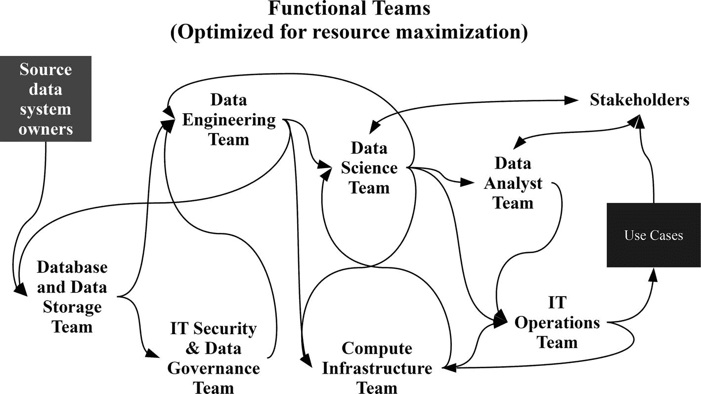
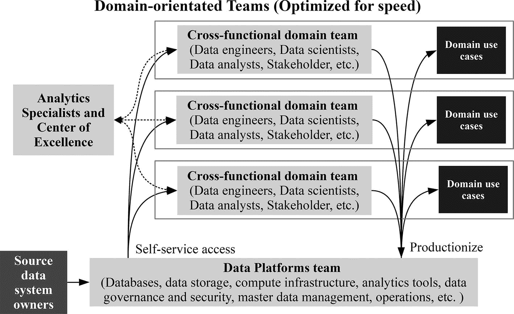
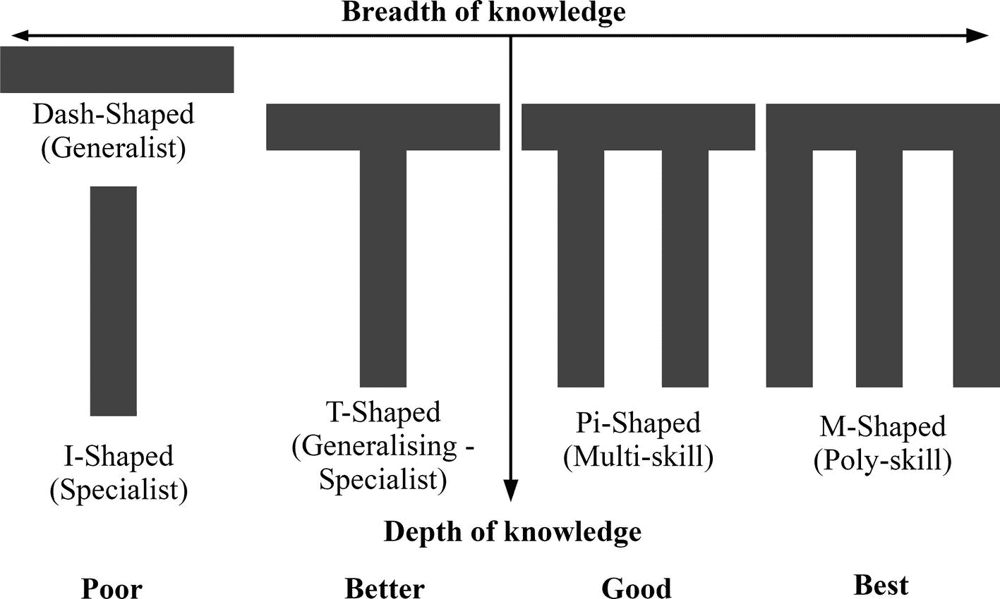

# 8.组织数据操作

组织结构不仅对产出速度有巨大的影响，而且对团队的产出和质量也有巨大的影响。任何在严格的层级结构中工作过的人都知道，组织结构图通常比任何技术决策对生产什么或不生产什么有更大的影响。

例如，在传统的分层体系结构中，简单地向报表添加新的数据源需要负责一层的每个独立的功能团队的协调。跨层垂直切割需要源系统所有者、ETL 开发人员、数据库架构师、数据库建模人员、数据库管理员、BI 开发人员和前端开发人员沟通、同意和协调变更。这个过程是缓慢而痛苦的，因为对结果的责任在团队之间按照他们各自的优先级和时间表来划分。

海军有句话，护航队以最慢的船的速度前进。然而，数据分析必须以组织实现目标所需的速度前进，而不是以最慢的部门的速度前进。当组织结构和文化不经意间把一切都拖慢成涓涓细流时，就很难做到敏捷。DataOps 要求团队围绕共享的以数据为中心的目标和共同的难题来组织，以消除障碍并尽快工作。

## 团队结构

梅尔文·康威博士是最早研究团队组织对知识工作产出影响的人之一。在他 1968 年的论文“委员会如何发明”中，康威观察到，任何设计系统的组织都会产生一种设计结构，这种设计结构是该组织沟通结构的复制。 [1](#Sec16) 康威的结论被编纂成康威定律，并以各种形式引用。其中最著名的是 Eric S. Raymond 的总结“如果你有四个团队在一个编译器上工作，你将得到一个 4 遍编译器。”自从康威的论文发表以来，许多研究人员，包括来自哈佛商学院和微软的研究人员都发现了组织结构与系统设计、架构和结果密切相关的证据。

### 面向功能的团队

团队成员协调有两种主要模式——功能性和领域性。面向功能的团队围绕技术专长组织，面向领域的团队围绕市场、价值流、客户、服务或产品组织。

功能导向是组织中分工的传统方法，尤其是高技能职业。专业知识集中在基于工具或技能集的团队中。例如，数据科学家、BI 分析师、数据工程师和数据库管理员都将在不同的团队中。团队之间没有资源重复，一旦有可用的专业人才，就将他们分配到项目中，或者新项目优先于当前正在进行的其他项目。这种类型的结构被优化以最大化稀缺人才的资源利用，从而最小化成本。

功能导向的优势在于相似的个体聚集在一起，这有助于深化而不一定扩大特定单元内的技能。许多组织开始为他们的数据科学和数据工程团队创建一个集中的团队，但很快就遇到了问题，无法交付组织雇佣他们进行的更改。

当分析团队很小时，集中团队或咨询模型可以工作，数据分析的价值来自报告和决策科学，通过一次性分析帮助利益相关者回答特定问题。然而，价值来自于为组织的许多部分以一定的速度和规模创建自动化数据产品(如 ML 模型)的能力。开发数据产品所需的数据源、基础设施和技能的复杂性和多样性要求重新思考孤立的功能团队模型。

对精益思想和瀑布式项目管理的理解应该使资源最大化功能取向的负面影响变得清晰。个人对他们如何为整体组织目标做出贡献知之甚少，这导致利益相关者对积极主动的工作不感兴趣，误解导致大量返工，无法优化整体，以及缺乏动力。图 [8-1](#Fig1) 显示了工作如何在集中的面向功能的团队中流动。

图 8-1

Workflows through centralized functional teams involve complex coordination and many handoffs

每个职能团队都很忙，但最终产生的价值非常少，因为所有权是分散的。工作必须被协调，并不断地移交给其他团队，这导致了长时间的排队和延迟，特别是如果需要意料之外的迭代。来自组织多个领域的对专业团队的持续反应性需求需要在层级结构中向上和向下升级优先化请求，从而减缓决策制定并扰乱规划。本地资源利用最大化带来的任何节约，通常都超过了整个数据产品生产线上的延迟成本。

对于面向功能的团队来说，快速交付是可能的，但是这需要相当大的努力和投资。数据产品生产线中涉及的每个职能团队必须共享相同的组织目标和目的。资源利用效率不应成为目标。需要有足够的空闲时间，这样团队之间不会形成过多的队列，他们可以加速优先工作。职能团队必须向其他团队交付自动化的自助服务解决方案，以便他们能够按需访问数据、平台、环境、监控等，从而避免成为瓶颈。

### 面向领域的团队

领域导向包括许多由跨职能团队成员组成的无层级的扁平团队。一个面向领域的团队拥有开发和管理从原始数据到最终数据产品的生产线所需的全部或大部分技能。例如，由数据科学家、数据分析师和数据工程师组成的自给自足的团队极大地减少了对外部的依赖。跨职能领域团队不再需要在几个职能团队之间传递工作来完成工作，因为团队可以独立地交付工作。

面向领域的团队最初看起来效率很低，因为他们不能保证一直利用每个人的技能。然而，一些松弛是一件好事，因为它允许时间进行创新和加快优先级的能力。这种类型的组织结构优化了响应能力和速度。更快工作的好处超过了任何资源利用的低效率，特别是一旦考虑到职能组织中所有等待和阻塞工作的成本。

当团队以领域为导向追求速度时，数据操作结果更容易实现。每个团队成员利用他们独特而多样的技能来拥有和实现共同的目标。团队比职能团队对结果拥有更大的所有权，并且可以看到他们的努力如何有助于最终目标。

在极端情况下，面向领域的团队负责开发、测试、安全、产品部署、监控、缺陷修复、迭代改进以及数据产品整个生命周期中的实验。这些团队能够在不依赖其他团队的情况下交付产品。

大多数敏捷软件开发团队是小型的、跨职能的、面向领域的，以将自包含的输出与自包含的团队结合起来。亚马逊是首批从整体架构转向微服务架构的公司之一，但他们认识到组织变革必须排在第一位。正如微服务是松散耦合的一样，Amazon 创建了一些团队，这些团队可以构建和拥有彼此几乎不依赖的服务。他们颠覆了传统，根据他们想要的架构设计他们的组织结构，而不是让组织结构驱动架构。

大多数技术独角兽也被认为是数据分析领域的领导者，这并非巧合。大多数成功的技术公司都有面向领域的数据科学和工程团队，将数据科学家和数据工程师整合到跨职能的业务团队中，或者为面向领域的产品工程团队提供数据平台。

例如，网飞的数据科学和工程团队与其垂直团队、内容、财务、营销、产品和业务开发保持一致，并负责分析、报告、建模和工程。 [5](#Sec16) 在脸书的基础设施团队中，数据科学家和基础设施工程师在网络工程、存储基础设施、发布管理等统一团队中工作。[66T7】](#Sec16)

跨功能的面向领域的团队也有他们的缺点。领域导向为职业发展、知识共享和持续招聘带来了挑战。即使对于自给自足的跨职能团队，重用数据流水线的代码和开发模式也是有价值的。当每个团队重新发明轮子时，它通过重复引入了浪费。

有两种主要的方法可以降低领域定向的成本，而不会重新引入过多的通信开销和协调问题。第一种选择是通过非正式的协调角色松散地连接团队。第二种选择是通过正式的中心辐射模型将团队和团队成员联系起来。

Spotify 模式是一种通过将团队成员分配到分会和协会来松散连接团队的方法。 [7](#Sec16) 章节都是技能相近的人。例如，在类似领域工作的数据工程师定期会面，讨论他们的专业领域和挑战。行会是兴趣社区或实践社区，它们希望共享知识、工具、代码和实践。另一种方法是在团队之外创建特定的协调角色，例如，提供最佳实践建议并防止解决方案分散的数据解决方案架构师。

中枢辐射模型通过一个中心团队(如卓越中心)维护面向领域的团队之间的连接，卓越中心是一个负责协调其他团队之间的最佳实践和一致性的团队。与独立的敏捷软件开发团队不同，数据运营团队需要的不仅仅是访问随需应变的环境、工具、服务和监控来实现自给自足。数据运营团队还需要自助访问数据。否则，他们无法开发数据流水线或数据产品。由于所有数据运营团队都有这一需求，因此将数据平台功能放在一个集中但不孤立的团队中是有意义的。

中央数据平台和领域团队之间的交互是一个双向的过程。数据平台团队提供对数据和基础架构的自助式访问。反过来，领域团队帮助数据平台团队理解他们应该构建什么功能，以及他们应该提供什么数据以供重用。

图 [8-2](#Fig2) 显示了面向领域的团队如何与特定的组织领域而不是工作职能保持一致。

图 8-2

A hub and spoke model for domain-orientated teams

## 新技能矩阵

构建数据分析能力并不像雇佣一打博士数据科学家并等待奇迹发生那么简单。数据分析是一项团队运动，其中数据运营角色分为两类——通常对数据运营团队的成功至关重要的核心角色，以及根据需要出现的支持角色。

人物角色是角色简介，因为这是描述工作角色和技能的最简单的方式。组织中有许多人使用不同的职务头衔来承担相似的职责或从事同一职位的专业工作，这些人聚集成角色。例如，数据分析师、商业智能分析师、市场分析师和产品分析师可能会使用类似的工具和技术，但针对不同的领域和利益相关者，进行类似的活动。

### 核心人物

主要角色是数据平台管理员、数据分析师、数据科学家、数据工程师、数据运营工程师、团队领导、解决方案专家和组织利益相关者。

数据平台管理员拥有为数据工程师的数据流水线提供数据源的数据基础设施，以及至少一些实现生产输出的基础设施。这些数据平台专家负责数据湖、数据仓库、应用数据库、数据集市、流处理等等。数据平台管理员还负责组成数据分析生态系统的其他组件。

管理员通过管理容量和工作负载来确保基础架构和组件发挥其潜力。他们还负责数据管理，包括来自源系统的数据集成、主数据管理、数据治理、数据安全、平台上的数据共享和访问控制。

数据分析师理解并分析数据以影响业务决策。有许多不同类型的数据分析师，包括市场分析师、金融分析师、产品分析师、销售分析师和运营分析师。数据分析师查询、清理、探索、解释和可视化结构化数据，以报告见解和建议。他们应该会计算，能够使用数据库和其他数据源系统，如商业智能工具、Excel 和 r。但是，他们通常不会使用大数据技术或机器学习，因为他们专注于描述性和诊断性分析。

数据科学家涵盖了广泛的多学科领域，这使得角色比其他人更难定义。与数据分析师不同，数据科学家使用数据帮助组织做出决策，但使用更高级的分析技术和应用研究进行预测和说明性分析。数据科学家可能会使用推理统计分析，例如，通过测试假设来通知人类决策者，或者使用机器学习来构建帮助自动系统做出决策的算法。

通才型数据科学家通常对统计学和机器学习编码语言(如 Python 和 R(及其库))有着扎实的理解，并精通数据可视化。他们通常还非常了解如何从分布式存储、关系数据库和 NoSQL 数据库中提取数据，并在 Apache Spark 等大数据框架中处理结构化、半结构化和非结构化数据。几乎不可能成为数据科学中每个领域和能力的专家，因此在描述这类人时会提到独角兽。大多数数据科学家专注于数据科学的一个子领域，如自然语言处理或计算机视觉。

数据工程师利用他们的软件工程知识在数据基础设施平台上构建数据流水线和管理数据集。他们负责将数据放入平台，并确保数据以正确的格式和系统出现，供数据科学家、数据分析师及其工具使用。历史上，数据工程师一直以数据库为中心，关注用于填充数据仓库的 ETL。然而，数据工程师现在更有可能通过从分布式存储或流数据源构建特定于用例的数据流水线来以流水线为中心。

数据工程师应该熟悉大数据技术和编程语言，如 SQL、Java、Python 和 Scala。一些数据工程师也能够设计数据存储和分布式系统。

如果一个集中的或面向功能的团队处理操作，当数据工程师想要部署新的数据流水线或数据科学家想要部署新的数据产品时，它可能会成为摩擦的来源。最好通过数据运营工程师角色消除障碍，将运营能力整合到数据运营团队中。

DataOps 工程师与团队的其他成员合作，使数据流水线和数据产品的频繁和快速发布成为可能。数据运营工程师知道如何管理和自动化数据平台上的环境和数据供应、部署、测试、发布、安全和监控流程。他们拥有必要的软技能和硬技能，可以与多个团队和角色合作，主动提出架构、流程和工具方面的改进建议。

团队领导是数据分析师、数据工程师、数据运营工程师和数据科学家组成的自组织团队的仆人式领导。团队领导负责保持团队专注于其目标，通过与更广泛的组织互动来消除障碍，管理报告，组织会议和回顾，保持团队内部的开放沟通，并就数据运营实践对团队进行指导。

解决方案专家拥有扎实的技术背景，除了日常工作之外，还在算法、设计和架构决策方面为团队的其他成员提供指导。他们亲力亲为的角色使他们有别于传统的解决方案或技术架构师。他们通常是高级数据工程师或高级数据科学家，花部分时间指导、辅导和训练团队成员的最佳实践。他们为组织架构、框架和模式的开发做出贡献，同时确保他们的团队在适当的地方使用它们。他们确保团队遵守标准、开发生命周期和 QA 流程。

组织的涉众是受团队工作影响的人。根据团队或组织的不同，角色可以代表许多不同类型的人。涉众可以是各种各样的个人，例如团队产出的最终用户、高级领导、项目经理、产品经理、团队的预算负责人或客户代表。有时候，利益相关者会希望直接访问数据平台，这样他们就可以自己承担一些数据分析师和数据科学家的任务。

核心人物角色不是人或职位。并非所有的数据操作团队都包含相同的角色组合，因为这取决于满足团队目标的需求。在一些团队中，一个人可能涵盖多个角色，如数据工程师和数据操作工程师。在另一个团队中，可能有许多数据工程师和数据运营工程师。

### 支持角色

核心人物角色不太可能足以让所有类型的数据运营团队完全独立地发挥作用。团队需要补充技能来永久或临时加入团队是很常见的。典型的支持角色包括数据产品所有者、领域专家、分析专家(如研究人员或专门的数据科学家)和技术专家(如数据架构师、软件工程师、ML 工程师、安全专家、测试人员、设计人员)。

数据产品所有者是负责团队数据产品成功的个人。在没有数据产品所有者的团队中，团队领导也可能作为涉众的中间人承担一些责任。数据产品所有者代表团队中的利益相关者，拥有 backlog，确定工作的优先级，教育团队关于组织领域的知识，教育利益相关者关于团队的能力，展示团队的成果，并且是团队的公众形象。

数据产品负责人还负责数据之旅的最后一英里，并确保团队产出通过数据故事和可视化引导行动。如果团队领导保证团队快速构建数据产品，而解决方案专家确保他们构建正确的数据产品，则数据产品所有者确保团队构建正确的数据产品。

领域专家是主题专家，当他们的知识有缺口时，他们会帮助团队。分析专家在 Hadoop 或推荐系统等不同领域拥有深厚的技术专长，而这些正是核心人物角色可能缺乏的。

软件工程师帮助将模型和其他数据产品集成到应用程序中。ML 工程师是软件工程师，他们将软件开发最佳实践应用于生产中模型的创建和监控。

安全专家确保流程到位，以保护系统和敏感数据免受未经授权的访问、修改和破坏。核心 DataOps 角色应该承担大部分测试，但有时，出于法规或关注点分离原则的考虑，可能有必要聘请专业测试人员。

数据架构师负责管理数据库或大数据解决方案的整个生命周期，以捕获、存储、集成和处理数据。数据架构师负责收集需求、解决方案设计、数据建模、测试和解决方案系统的部署。该角色需要了解现有的和新的技术，以及组织的数据架构的整体情况。

每个专家角色都有可能产生功能瓶颈，从而减缓工作流程。在最大或最复杂的组织中，专家的好处只会超过成本。否则，应该通过投资交叉技能和自动化技术，尽一切努力减少那些不值得永久加入团队的专家角色。

### 团队中没有我

如果团队定位对团队间的工作流程有重大影响，那么团队内个人的定位对团队内的工作流程也有重大影响。将专家从职能团队转移到跨职能团队可以减少快速工作流的负担。与职能团队相比，个人更容易理解他们对最终目标的贡献，优先化更快，意外的工作请求更少。虽然跨职能团队的税收较低，但这并不是简单地通过将具有不同技能的人转移到一个新团队就能消除的。

比尔·巴克斯顿创造了“I 型人”这个词来描述在一个领域拥有狭窄而深刻的领域技能的专家。 [8](#Sec16) 专家在团队内部制造筒仓。虽然他们所做的工作可能只需要几个小时或几天就能完成，但在他们有时间从事新的工作之前，可能要等待更长的时间。即使他们有能力，专家也不太有能力帮助其他团队成员。相反，他们通常通过过度优化他们的工作(如进一步调整机器学习模型)而进入收益递减区，而不是寻找不同的方法来帮助组织实现其目标。

“I”形的比喻是对一个更早的比喻的回应，这个比喻被称为“T”形人。这个比喻是由 IDEO 设计咨询公司的首席执行官蒂姆·布朗提出的。

t 型技能人员(在敏捷术语中也称为广义专家)在某个领域(如数据工程)有深厚的专业知识。但是，他们也倾向于在许多领域拥有广泛的技能，如机器学习和数据可视化。

综合专家没有许多专家的固定思维模式，愿意从他人那里获取知识和技能。他们更容易看到自己的工作对他人的影响。他们也更容易产生共鸣，寻找帮助团队的方法。例如，数据工程师可能集成有用的新数据源，而数据科学家没有被要求就不知道这些数据源。t 型的人可以跨越职能边界，消除团队面临的瓶颈，保持工作顺利进行。

很少有人天生是 T 型的，他们往往很难找到，因为数据分析通常会奖励拥有专业技能的人。更常见的做法是从一个充满好奇心和成长心态的专家团队开始，然后让他们与其他专家一起工作，对他们进行交叉培训。经过几个月的时间，他们获得了足够的知识，在他们的专业领域之外也能有所作为。

团队成员也有其他技能形式。π型的人拥有许多学科的广泛知识和两个领域的深度技能。m 型人多才多艺；他们将 T 型个体的知识广度与三个或更多专业的深度知识结合起来。

π型和 M 型的人通过增加工作流和交叉培训以及培养他人的能力来大幅提高团队生产力。e 型的人有四个 e 的组合——经验、专业、探索和执行。

许多分析团队忽略了包括 E 形成员。这些团队有很多有经验和专业知识的人，他们可以探索想法，但不能执行。尽管有很好的想法和技术专长，这些团队可能会陷入困境，无法可靠地生产出组织需要的东西，这只会让每个人感到沮丧。

破折号形状的人是最后的技能形状。他们也被称为多面手，因为他们有技能的广度，但没有技术专长的深度。图 [8-3](#Fig3) 显示了团队成员的不同技能形态。

图 8-3

Breadth and depth of knowledge for different people skill shapes

从历史上看，专家团队通常由通才领导，这些通才具有战略眼光、出色的沟通、利益相关者管理、领导力和人员管理技能。然而，培训和指导专家来发展通才技能或培训通才来增加专业化成为 T 型，比雇用不能改善团队工作流程的通才更好。一旦团队成员变成 T 型，野心就是增加进一步的技能，变成π型，M 型或者 E 型。

创建一个由综合专家和多技能人员组成的团队需要改变招聘政策，并在指导、辅导和培训方面进行大量投资。招聘不应该寻找属性完美结合的神话中的独角兽，而应该关注那些有能力并渴望学习专业之外的技能的人。数据工程师通常比数据科学家更渴望学习机器学习，而不是学习建立流水线或理解运营和维护其输出的需要。

## 优化团队

人和他们的组织方式是团队成功背后的主要因素。然而，还有其他因素需要考虑，包括团队规模、位置和稳定性。

### 通信线路和团队规模

许多组织发现大型团队运作不良。已故的哈佛大学心理学家 J·理查德·哈克曼认为，大型团队的问题不在于他们的规模，而在于每个人加入后，人与人之间的联系数量几乎呈指数增长。 [9](#Sec16) 增加联系人数的公式是

链接数量= n(n-1)/2

其中 n 是团队人数。图 [8-4](#Fig4) 显示了沟通链接的数量如何随着团队成员的增加而增加。

图 8-4

The number of connections for two, five, and ten team members

例如，一个 5 人的团队需要维护成员之间的 10 个连接，但是一个 50 人的团队需要维护 1225 个连接。因此，一个 50 人的团队比一个 5 人的团队有 100 多倍的联系，尽管只有 10 倍大。

链接的增加导致协调问题，因为有更高的机会产生误解、误解和脱离。链路的增加也导致更高的通信开销成本。在一个团队中加入太多的人会导致收益递减，并且会降低所有事情的效率。

世界上最受欢迎的团队运动的团队规模从篮球的 5 人到橄榄球联盟的 15 人不等，平均 9 人，这并非巧合。较小的团队运作得更好，因为它更容易建立牢固的关系，获得主题专家的支持，并感受到贡献的社会压力。

众所周知，亚马逊将两块披萨的规则应用于团队规模。这个想法是，一个团队应该不超过两个比萨饼可以养活的人数。亚马逊人不会说他们吃多大的披萨，但是传统观念认为两个大披萨可以满足六到七个人的需求。动机是杰夫·贝索斯想要分散的自治团队，违反直觉地需要更少的交流，而不是更多。[10T3】](#Sec16)

### 产品而非项目

长期稳定的团队比临时的或基于项目的团队更有效率。稳定的团队避免了与临时团队相关的痛苦和耗时的形成、冲击和规范阶段。团队成员更有可能相互信任，并有动力投资于让他们的工作更轻松的流程或工作方式。例如，长期团队更有可能减少他们积累的技术债务，而不是把它留给别人去解决。

稳定的面向领域的团队比临时项目团队更受欢迎还有其他原因。敬业的团队成员可以专注于实现承诺，利益相关者知道每个人在做什么，因为没有隐藏的工作。

稳定的团队获得深入的领域知识，这对构建更好的数据产品和决策支持分析非常有用，与利益相关者建立牢固的关系，并从长期反馈中获益。数据产品，尤其是模型，不是一劳永逸的项目。概念漂移意味着模型必须被监控和更新，而制作模型的团队最适合这样做。长期团队也可以关注长期的组织目标和目的，而项目团队通常是根据他们达到的预算和期限目标来评判的。

### 位置

当谷歌前董事长兼首席执行官埃里克·施密特(Eric Schmidt)发表他的最大限度利用知识工作者的十条黄金法则时，第三条是“把他们打包”谷歌认为，让沟通变得容易的最好方法是让团队成员之间的距离在几英尺之内。 [11](#Sec16) 谷歌并不孤单。大多数领先的技术公司，包括苹果、脸书、微软和腾讯，都将他们的大部分技术员工集中在大型办公室和校园里。具有讽刺意味的是，尽管拥有世界上一些先进的远程通信技术，这些公司还是建造了庞大、昂贵的办公室。

人类天生喜欢面对面的社交互动，如果没有面对面的互动，他们的表现会更差。心理学家苏珊·帕克(Susan Parker)在她的著作《村庄效应》(The Village Effect)中引用了一项对 25000 名呼叫中心代理人的实验研究。一半人被要求独自休息，而其他人和同事一起休息。那些与同事交往的人表现出 20%的进步。 [12](#Sec16)

协同定位，即团队在共享的物理区域工作，是知识工作者协作和成功的最有效方式。任务越复杂，员工从面对面交谈的效率和聚集在信息辐射器或白板周围的能力中受益就越多。

现实情况是，大多数团队都是在面对面互动和远程协作的基础上运作的。甚至谷歌也有分散的团队。多项研究表明，团队成员之间的虚拟距离带来了挑战。

一项对 115 个项目团队的研究发现，由地理、时区、文化、社会接触和面对面互动等因素衡量的虚拟距离越大，信任、目标明确性和创新的水平就越低。发表在《哈佛商业评论》上的另一项对 1100 名远程员工的研究发现，远程员工更可能担心同事在背后说他们坏话，不告诉他们就做出改变，不争取他们的优先事项，并游说反对他们。 [14](#Sec16)

分布式团队和个人远程工作并非没有好处。分布式团队和远程工作允许从比单一办公室大得多的人才库中进行招聘，使就业方案对重视灵活性的人才更具吸引力，并增加了多样性。

有一些策略可以让远程工作变得有效。康威定律表明，团队不应该跨站点分裂。相反，多地点团队应该是完整的团队，每个团队在每个地点都是独立的。为了避免“他们和我们”的态度，至少每个团队的一些成员需要花时间在彼此的网站上建立个人关系和社会纽带。

谷歌的研究推荐了改进分布式工作的进一步策略。例如，团队成员应该使用视频通话而不是音频通话，这样他们就可以看到彼此。团队成员应该为在工作时间之外回复信息或跨时区组织会议制定规范。此外，群聊有助于社交互动以及与工作相关的问题。

## 汇报关系

对于核心和支持数据运营角色在组织中的位置，有不同的选项。数据平台管理和专家角色向集中的团队报告、实施治理、维护标准以及促进工具、模式和数据重用是有意义的。其余的跨职能数据操作角色，通常是数据工程师、数据科学家和数据分析师，可以是集中式的、分散式的或两者的混合。

在集中式结构中，跨职能角色向服务于整个组织的专业数据部门报告。在分散结构中，跨职能角色完全整合，并向组织中的直线职能部门报告，如产品工程、供应链或营销。在混合结构中，跨职能数据运营角色向中央数据团队或卓越中心报告，但嵌入了直线职能或领域团队。

### 数据平台管理

在大多数传统组织中，数据产品生产线分为 IT 数据团队、数据分析团队和职能团队雇佣的数据分析专业人员。数据平台管理和数据工程是孤岛，通常向集中式 IT 数据团队报告。数据消费者、数据科学家和数据分析师向组织中的数据分析团队或职能团队报告。

IT 数据团队位于消费者和组织中的数据之间。他们控制数据捕获、访问和处理数据所需的基础设施。不幸的是，IT 数据团队并不总是认识到数据是属于整个组织的资产，而是专注于数据防御。这个问题意义重大。在 Kaggle 对 16000 名受访者进行的 2017 年数据和机器学习状况调查中，30.2%的受访者提到了“数据不可用或难以访问”。 [16](#Sec16)

IT 障碍是职能组织和对如何安全实施数据战略的数据攻击方面的误解的结果。IT 数据团队很少是数据产品的消费者，因此没有以数据为中心的生产线视图。相反，团队通常是由技能或技术在功能上组织起来的，因此没有动力去优化整体。然而，他们确实担心安全性和合规性问题。允许自助访问数据、工具和基础架构是大多数 IT 团队的噩梦，也是他们通过精心管理的数据仓库来控制数据访问的原因。

尽管如此，如第 [6](06.html) 章所述，即使对于大数据，也可以安全地配置数据、实施安全和隐私策略、监控或审计数据使用和资源利用。还可以解决 It 数据团队经常提出的另一个问题，即数据分析团队没有遵循开发最佳实践。然而，数据分析团队可以遵循第 [7](07.html) 章中的 DevOps 实践，避免在生产中开发脆弱、难以更改的数据产品等问题。

然而，传统的集中式 IT 数据团队不愿意将数据和基础架构的控制权交给组织中的数据消费者。问题不在于技术和标准，而在于根深蒂固的文化和心理。虽然数据产品生产线的角色和职责主要由 IT 数据团队承担，但总是存在不必要的障碍风险。

如果数据分析对组织至关重要，那么数据平台管理角色属于这样一种文化是有意义的，这种文化了解数据分析流程并与其结果有利害关系。理想的报告结构是将数据平台管理和专家角色归入一个部门，由向 CEO 报告的 CDO 或首席分析官(CAO)领导。CDO 或 CAO 是技术专家和有远见的人，他们可以通过以数据为中心的观点来实现数据对组织的全部潜力。

### 跨职能角色

跨职能的数据操作角色，如团队领导、数据科学家、数据分析师和数据工程师，可以分组为集中式、分散式或混合式团队。集中式团队在较小的组织中是有意义的，因为它们不具备创建多个面向领域的团队的规模。集中式团队可以向工程、CDO、Cao 等技术职能部门报告，甚至直接向 CEO 报告。团队在项目价值最高的地方进行咨询或工作。集中的团队促进职业发展和最佳实践的发展。

集中式团队的缺点是，他们可能需要很长时间来建立组织的领域知识，并与职能团队发展关系。作为一个被动的支持功能，集中式团队面临着被边缘化的风险，无法充分发挥其潜力。

由于组织目标是数据产品的驱动力，分散的跨职能数据运营角色整合并向直线职能或领域团队(如产品或营销)报告，以实现完全一致。职能团队的负责人可以了解集成数据运营团队成员的活动，并可以根据整个团队的目标确定他们工作的优先级。

集成的数据运营角色可确保与职能团队的密切协作，但也可能导致团队成员与同事之间的隔离，从而给职业发展、持续招聘和知识共享带来问题。职能团队的领导者可能不知道如何最好地利用数据运营人才，这会产生机会成本和士气低落的风险。

集成的跨职能数据运营角色的另一个挑战是，数据平台管理将继续向组织的不同部分报告。这种分离带来了挑战，因为职能团队领导不太可能对数据平台和架构感兴趣，这使得改进更加困难。通常，只有像网飞这样拥有庞大数据分析团队的组织才拥有高度分散的角色。网飞称其文化高度一致，松散耦合，团队目标和战略一致，同时尽量减少跨职能会议。

混合集中/分散团队结构结合了集中和分散团队的元素。数据运营角色向中央部门或卓越中心报告，但嵌入到与组织领域或职能团队密切相关的跨职能团队中。与分散的整合团队不同，混合团队成员发现通过集中的报告结构更容易相互学习和管理职业生涯。同时，嵌入式团队可以与他们一起工作的团队建立伙伴关系和融洽关系。

如果混合团队向担任数据平台管理和专家角色的同一位领导(例如或 CAO)报告，他们将创建一个与营销、产品、工程和其他职能相当的专门数据职能。从原始数据到数据产品的理想数据之旅以及支持工具、基础设施和治理都在一条报告线上，最终由一个人负责。专门化函数是最难实现的解决方案，但也是最有可能消除数据团队面临的大部分摩擦的模型。这是我的组织采用的模式，并取得了非常积极的成果。

## 摘要

每种组织模式都有其优点和缺点。对于 DataOps，优先考虑的是优化新数据产品开发的速度，并通过频繁的迭代更改而不是大规模和不频繁的更改来降低风险。传统的团队功能导向导致进展缓慢和失去机会。康威定律和组织研究的知识有助于设计组织结构，以优化我们想要的结果，而不是妥协的结果，以适应我们的组织。

DataOps 不需要雇用更多或不同的人，而是围绕以数据为中心的目标组织员工，而不是工具、技能或垂直报告关系。DataOps 团队围绕最有效的沟通途径进行组织，消除组织瓶颈，并改善整个数据产品制造生产线的协作。

DataOps 鼓励小型的、自组织的、多技能的、跨职能的面向领域的团队，这些团队位于同一地点并且长期存在。集中式功能通过数据平台提供对数据、基础架构和服务的自助式访问。卓越中心、行会或协调角色确保面向领域的团队不会变成孤岛，而是受益于最佳实践和职业发展机会的相互交流。

务实很重要。每个组织都是不同的，有多种方式来组织速度。但是，无论采用哪种方式来创建数据运营组织，目标都应该是促进速度目标，而不是资源利用。

适当的技术，如果实施得好，可以增强正确的组织结构的好处。下一章概述了支持数据操作协作的技术。

## 尾注

1.  梅尔文 e .康威，委员会如何发明？，数据化，1968 年 4 月。[T2`www.melconway.com/Home/pdf/committees.pdf`](http://www.melconway.com/Home/pdf/committees.pdf)
2.  Eric S Raymond,《新黑客词典》——第三版，1996 年 10 月。
3.  Alan MacCormack、John Rusnak 和 Carliss Baldwin,《探索产品和组织架构之间的二元性:检验“镜像”假设》,哈佛商学院，2011 年。[T2`www.hbs.edu/faculty/Publication%20Files/08-039_1861e507-1dc1-4602-85b8-90d71559d85b.pdf`](https://www.hbs.edu/faculty/Publication%20Files/08-039_1861e507-1dc1-4602-85b8-90d71559d85b.pdf)
4.  Nachiappan Nagappan，Brendan Murphy 和 Victor R. Basili,《组织结构对软件质量的影响:实证案例研究》,微软研究院，2008 年 1 月。[T2`www.microsoft.com/en-us/research/wp-content/uploads/2016/02/tr-2008-11.pdf`](https://www.microsoft.com/en-us/research/wp-content/uploads/2016/02/tr-2008-11.pdf)
5.  布莱克·欧文，网飞——打造分析文化，2015 年 5 月 [`www.slideshare.net/BlakeIrvine/netflix-enabling-a-culture-of-analytics/8-Team_Structure_SpecializationAnalyticsReportingModelingEngineeringAnalystEngineerVizEngineer`](https://www.slideshare.net/BlakeIrvine/netflix-enabling-a-culture-of-analytics/8-Team_Structure_SpecializationAnalyticsReportingModelingEngineeringAnalystEngineerVizEngineer)
6.  Rajiv Krishnamurthy 和 Ashish Kelkar，建立数据科学团队以产生大规模影响，facebook Code，2018 年 6 月。[T2`https://code.fb.com/core-data/building-data-science-teams-to-have-an-impact-at-scale/`](https://code.fb.com/core-data/building-data-science-teams-to-have-an-impact-at-scale/)
7.  Henrik Kniberg & Anders Ivarsson,《与部落、团队、分会和行会一起提升敏捷@ Spotify 》, 2012 年 10 月。[T2`https://blog.crisp.se/wp-content/uploads/2012/11/SpotifyScaling.pdf`](https://blog.crisp.se/wp-content/uploads/2012/11/SpotifyScaling.pdf)
8.  Bill Buxton,“创新呼唤 I 型人才”,彭博，2009 年 7 月。[T2`www.bloomberg.com/news/articles/2009-07-13/innovation-calls-for-i-shaped-people`](https://www.bloomberg.com/news/articles/2009-07-13/innovation-calls-for-i-shaped-people)
9.  Diane Coutu，为什么团队不起作用，哈佛商业评论，2009 年 5 月。[T2`https://hbr.org/2009/05/why-teams-dont-work`](https://hbr.org/2009/05/why-teams-dont-work)
10.  布拉德·斯通,《万物商店:杰夫·贝索斯和亚马逊时代》, 2014 年 7 月
11.  埃里克·施密特和哈尔·瓦里亚，《谷歌:十条黄金法则》，新闻周刊，2005 年 12 月。
12.  苏珊·平克，《村庄效应:面对面接触如何让我们更健康、更快乐、更聪明》，2014 年 8 月。
13.  Karen Lojeski、Richard Reilly 和 Peter Dominick,《虚拟距离在创新和成功中的作用》,第 39 届夏威夷系统科学国际会议论文集，2006 年 2 月。[T2`www.researchgate.net/publication/4216008_The_Role_of_Virtual_Distance_in_Innovation_and_Success`](https://www.researchgate.net/publication/4216008_The_Role_of_Virtual_Distance_in_Innovation_and_Success)
14.  Joseph Grenny 和 David Maxfield，一项针对 1，100 名员工的研究发现，远程员工感觉受到冷落和冷落，《哈佛商业评论》，2017 年 11 月。[T2`https://hbr.org/2017/11/a-study-of-1100-employees-found-that-remote-workers-feel-shunned-and-left-out`](https://hbr.org/2017/11/a-study-of-1100-employees-found-that-remote-workers-feel-shunned-and-left-out)
15.  分布式工作剧本，谷歌。[T2`http://services.google.com/fh/files/blogs/distributedworkplaybooks.pdf`](http://services.google.com/fh/files/blogs/distributedworkplaybooks.pdf)
16.  数据科学与机器学习的状态，Kaggle，2017 [`www.kaggle.com/surveys/2017`](https://www.kaggle.com/surveys/2017)