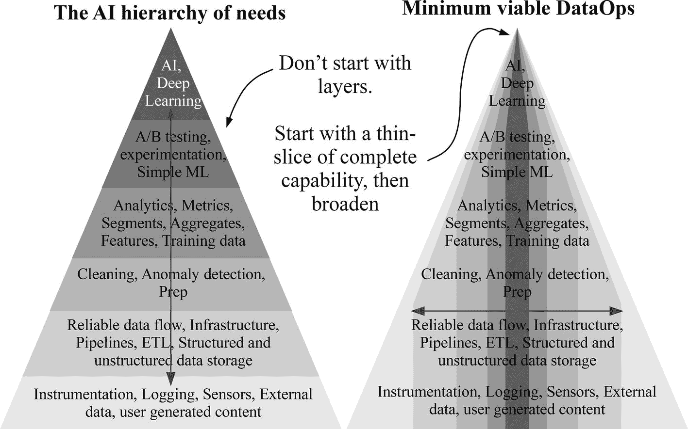
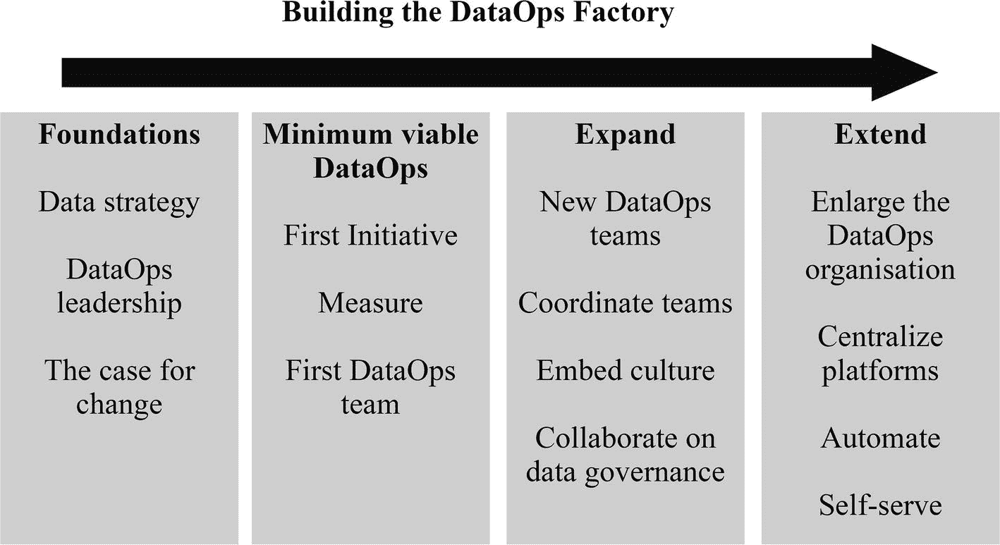

# 十、数据运维工厂

数据科学和分析处于崩溃状态。2016 年毕马威对 2000 名全球数据分析决策者的研究显示，只有 10%的人认为他们在数据质量、工具和方法方面表现出色，60%的人表示他们对自己的分析见解不太自信。 [1](#Sec19) 对于每一个从数据科学和分析中获得显著成功的组织，其他几个组织都在为数据质量、将工作投入生产的能力以及对人员或技术的投资产生有意义的 ROI 而奋斗。DataOps 是当今数据科学和分析面临的许多问题的解决方案。通过采用 DataOps，组织可以像工厂一样以一致、可靠、快速、可扩展和可重复的流程交付数据产品。

除非处理全新的情况，否则不可能按照 DataOps 方法直接跳到所有分析工作的最终状态。尊重敏捷和 DevOps 的原则，向最终目标的移动必须是迭代的、小的和频繁的步骤。

数据运维转型没有现成的解决方案，只有在应用实践、遵循原则和实践价值观方面的持续训练。每个组织都有不同的起点和能力。以下部分说明了建议采取的可行步骤。旅程并不总是连续的；根据您的上下文修改或跳过步骤。

## 第一步

旅程开始时必须牢记结果，因为成就来自于对共同目标的协作贡献。DataOps 不是产品。这是成功的促成因素。数据科学和分析必须服务于组织的战略使命、愿景和目标。如果不与组织的其他部门保持一致，数据科学和分析计划就不太可能成功。

### 从数据策略开始

采用 DataOps 的旅程始于宏观视野和数据战略的制定。麦肯锡公司(McKinsey & Company)2017 年的一项调查发现，拥有最成功分析程序的公司比同行更有可能报告拥有清晰的数据战略。 [2](#Sec19)

数据战略是对组织的内部和外部环境的分析，最终形成一个路线图，用于缩小数据分析适用性的当前状态与实现组织目标所需的状态之间的差距。数据战略有助于组织根据其目标做出决策和选择，而数据运维是实现该战略的重要组成部分。DataOps 阐明了人员、流程和技术如何协同工作，以消除数据生产和数据消费之间的不匹配，从而满足组织的战略愿望。

除非你知道你在哪里，否则你不知道往哪个方向走。数据策略的情景分析元素捕获组织的使命、愿景、目标、优势、劣势和外部环境。该分析提供了对决策者如何使用数据、人才和技能的深度、当前和计划的技术能力、流程成熟度和数据管理状态的重要认识。

确定赞同采用新工作方式的利益相关者和决策者至关重要，因为这可以避免浪费时间试图改变保守的管理者。数据策略还会生成一组潜在的分析计划，这些计划会成为战略主题、项目组合愿景以及通过敏捷团队和实践交付的史诗。这种洞察力对于启动向数据运维的过渡非常有价值。

### 领导力

数据分析领导者或领导者团队应该领导向数据运维的转型。强有力的领导使变革更容易实现。DataOps 领导者应该有能力提出变革的理由、设定愿景、有权消除障碍或改变流程，并对组织的其他部门(尤其是 IT 和业务利益相关方)具有公信力。通常，领导层来自首席数据官或组织中负责数据科学、数据分析或数据工程的最高级人员。

DataOps 领导者的第一项任务是确定可以支持转型的高级管理人员以及组织中会受到 DataOps 引入影响的人员，因为他们对于数据生产流程至关重要，或者是数据消费者。一旦确定，组织中的相关人员必须确信有必要进行变更。

变革的理由有两种:外部威胁和内部缺陷。大多数组织在竞争环境中运营，或者面临被更灵活的组织破坏的风险。展示竞争对手如何更好地利用他们的数据资产或更快地创新的例子会产生一种紧迫感。强调内部问题为更好的未来状态创造了条件。考虑到这两种类型的威胁，一个令人信服的论点是，现状是不可持续的。

价值流图等精益思维工具是突出现有问题的好方法，因为它们可视化并量化了当前流程中的浪费和瓶颈。让尽可能多的团队参与到过程中来，从 IT 运营和数据管理到数据科学，将度量实践的结果社会化，这是很有启发性的。团队参与可以突出数据生产和数据消费之间的差距最大的地方，无论是等待几个月的软件包批准，补救糟糕的数据质量，让机器通宵运行，因为没有访问正确的计算资源，配置软件，还是等待使用数据的许可。

在大多数组织中，对产品开发而不是过程创新的关注意味着大多数人没有意识到变革的需要，除非它变得很明显。对于许多相关人员来说，接触价值流图和支持数据可能是他们第一次看到将原始数据转化为数据产品的端到端流程，以及扼杀价值创造的抑制性流程和政策。

大多数组织出于不再有效的原因实施过时的僵死流程和策略，但仍然将它们作为自己的目的，因为这是他们一直以来毫无疑问的做法。为了解决这个问题，领导者应该收集并分担数据质量差的成本、延迟成本的影响以及数据投资的低投资回报率。

领导人必须提出令人信服的变革理由，并开始文化转型的进程。没有人想成为不健康过程的一部分。他们应该希望参与确定需要改进的地方。

除了变革，DataOps 领导还必须传达变革愿景。变革的愿景阐明了你努力的方向，并激励人们朝着那个方向前进。

愿景可以包括更多数据驱动的决策、更高的生产率、更快的上市时间、对数据更大的信心、更低的成本、更好的客户参与度以及更快的创新。最后，应引入 DataOps 作为方法来实现愿景并解决当前发现的许多问题。

## 最小可行数据运维

当改变的情况被接受时，数据策略就完成了，即使是一个基本的数据策略也比没有强。困难的工作开始了。即使在团队和组织认识到改变的需要后，他们也很难过渡到一个更好的位置，因为习惯和文化根深蒂固，导致组织惰性。组织也可能失败，因为他们在学会走路之前就试图奔跑。

答案是不要想得太多，而是从最简单可行的数据运维解决方案开始，以最大限度地提高成功几率。最小可行数据运维旨在快速试验、学习并向组织展示价值。

### 第一项倡议

最小可行数据运维是一种避免组织在数据科学和分析中犯的两个常见错误的方法。Monica Rogati 著名的人工智能需求层次图说明了成功交付人工智能和深度学习所需的深层。 [3](#Sec19) 图 [10-1](#Fig1) 说明了人工智能需求层次和最小可行数据运维方法。

图 10-1

The AI hierarchy of needs and minimum viable DataOps

大多数希望更好地利用数据分析的组织都认为，他们必须从人工智能的顶层开始。因此，他们采取雇佣博士并寄希望于失败的策略，因为他们缺乏成功的基础。其他组织通过瀑布式项目管理和职能团队在缓慢的过程中一次构建一个层，这导致了层的错位。

最小可行数据运维通过专注于单个分析计划并在未来迭代中扩展功能之前以最敏捷和最精简的方式交付端到端解决方案来避免这两种错误。即使有高级别的赞助和慷慨的资源预算，这种方法也是正确的，因为它避免了过度设计项目计划和解决方案的风险。

数据策略通过确定初始分析计划的选项，告知最低可行数据运维的起点。启动计划规定了将参与其中的利益相关者和团队、数据需求、执行难度以及成功后的收益。

目标应该是选择能够证明可衡量的早期成功的东西，提供可以在组织的其他地方复制的学习和信心，并得到接受组织利益相关者的支持，即从结果中受益的利益相关者。输出应该是可以迭代和改进的数据产品，如客户流失预测模型、社交媒体情绪分析仪表板、欺诈检测模型、预测维护模型或供应链需求预测模型。

组织的利益相关者应该是那些积极希望数据分析的支持以实现其目标的人，在组织内受到尊重，并能够影响组织的其他部分以消除阻碍并传播福音。这项倡议不一定是什么新东西。它可以是一个有很大改进空间的现有流程。

### 措施

在选择了一个具体的计划后，下一步是衡量，而不是急于做出改变。具有讽刺意味的是，数据科学家用数据来衡量一切，除了他们自己和他们的过程。需要内省来理解在转换发生之前要改变什么。价值流图等精益思维工具可能有助于可视化和量化当前计划端到端流程中的浪费和瓶颈。

在 DataOps 转型的早期阶段，重点应该放在提供正确的数据产品的最后一英里，以最有效的方式解决正确的问题。不可能在一夜之间改变一个组织的文化、修改数据管理实践、转变运营或重新搭建技术基础架构的平台。但是，从价值流映射练习来看，仍然有可能通过采用数据运维实践和加强协作来确定要解决的严重问题。

### 第一个数据运维团队

下一步是创建一个专门的领域团队，形成未来团队的原型。DataOps 领导者应选择最热衷于采用新工作方式的人，因为他们将成为变革推动者，帮助未来的团队成功过渡到 DataOps。作为回报，DataOps 负责人指导 DataOps 团队完成转型，并帮助清除转型道路上的障碍。对于大多数团队成员来说，数据运维将是一个新概念，因此数据运维负责人的第一个贡献是教育团队成员并激发他们的参与。

有效的团队贡献不仅仅是专业技能。团队成员必须密切关注领域和他们的成果，并看到更大的图景，这样他们才能在舒适区之外做出贡献。理想情况下，DataOps 团队应致力于该计划，并拥有尽可能多的跨职能技能来独立开发、测试、生产和监控数据产品。团队必须从孤立的工作转变为跨学科的相互协作，并与从成果中受益的组织利益相关者进行协作。

团队的形成提供了创建自组织团队和采用敏捷工作方式的机会。团队必须具备专业知识，并有信心自主快速做出决策。

团队可以选择敏捷框架，包括 Scrum、Scrumban 和看板。这些框架非常有价值，因为它们通过定期的会议和回顾的持续改进创建了交付的节奏。理想情况下，团队应该在一个专用空间内共同办公。

应该为分析计划指派一名产品负责人，负责通过与利益相关方和跨职能部门的数据运维团队合作来管理进度。项目组合看板对于数据运维领导者跟踪进度非常有用。产品负责人通过阐明史诗将解决的问题、它们将如何被测量以及它们的数据和非功能需求，为计划创建史诗假设陈述。如果第一个 epic 有多个竞争选项，epic 优先级矩阵可以帮助做出决定。

数据科学和分析包括两个过程——数据产品开发和持续生产。因此，团队的目标是打破两者之间的任何障碍，以实现更快的迭代。

DataOps 团队的目标是开始实施一些实践，如测试、扩展、可再现性、重用、部署和监控，这些实践可以在以后由其他计划和团队共享和重用。在这种情况下，完全自动化不是优先考虑的事情，因为首先获得基本的实践和协作是至关重要的。

DataOps 团队应该首先通过对数据添加水印来建立对数据的信任，增加对文件验证、完整性测试、数据质量、数据完整性、数据正确性、数据一致性、数据准确性和数据一致性的检查。团队应该积极地监控数据质量，以处理意外的变化和失败。有了数据检查和数据产品监控，团队就可以在造成代价高昂的下游问题之前处理丢失的数据、模式更改、失败的流程和许多其他小故障。

检查和监控就绪后，将采用代码、配置文件和数据集的版本控制。版本控制有很多好处。它允许多人在同一个代码库上协作，使工件的重用更容易，并提供了一种通过版本描述了解随时间变化的方法。版本控制也是支持持续集成和持续交付的第一步。

DataOps 团队使用的一些工具和技术对他们来说可能是新的。因此，领导者应该为持续培训分配资源。标准化组织中其他地方使用的软件，特别是在 IT 操作中，也是有帮助的。采用 Git、吉拉、Confluence、Jenkins、Vault 或 Puppet 等技术团队使用的软件的一个副产品是，它为数据科学和分析团队带来了更大的可信度。

最终，有益的结果是数据分析的衡量标准。如果数据科学或分析团队消失了，组织中的人应该会注意到。数据科学和分析应该是具有可衡量的积极影响的核心组织能力。

开发效益衡量和产品健康监控是团队的重中之重。与组织利益目标的一致也避免了从数据而不是问题开始的陷阱，这可能会提供有趣的见解，但对团队以外的其他人没有真正的价值。有了度量，团队可以为自己设定改进目标。

创建反馈循环对改善结果至关重要。来自内部客户的反馈，以从结果中受益的组织利益相关者的形式，对于防止团队偏离轨道也是至关重要的。定期的服务交付审查会议是 DataOps 团队与组织利益相关者讨论他们满足期望的程度的机会。

通过遵循批量反馈原则来减少工作的批量，可以实现快速反馈。团队可以通过首先构建一个简单的 ML 模型或仪表板，然后进行小的频繁迭代来快速显示价值并避免过度优化。快速反馈还将提醒团队他们需要做出的更改，这可能包括如果最初的假设被证明是一个糟糕的试验台，则为最小可行数据运维选择不同的计划。

尽可能频繁地宣传采用 DataOps 实践的早期好处，以引起其他团队的好奇和兴奋，这一点至关重要。持续的度量和小规模的频繁迭代应该创建一个规则的度量流，以共享 KPI、时间节约、资源效率和数据质量改进的好处。

从小处着手可以减少风险和恐惧，同时还能创造学习和展示收获的机会。通过最少的可行端到端数据运维流水线来证明价值，更容易获得组织其他部门的认可。

## 跨团队扩展

DataOps 不是一个项目。DataOps 的第一次迭代不是最后一次。随着最低可行数据运维的到位和优势的公布，下一步是将实践扩展到更多的领域和领域。第二个目标是达到一个临界点，在这个临界点上，继续实施 DataOps 实践、原则和价值观比抵制它们更有说服力。结果胜于雄辩。避免与难以改变的部门进行耗时的政治斗争或浪费时间制定大规模的变革管理计划仍然至关重要。

### 达到临界质量

从数据战略中，可以确定下一组 epic 计划和领域团队，并从中扩展数据运维。仍然会有怀疑者和诋毁者不承认变革的必要性。因此，只接受邀请的策略可能是合适的。

如果第一个 DataOps 团队成功宣传了其成功，应该不难找到团队成员的志愿者和希望从新的工作方式中受益的其他组织利益相关者。组织利益相关者不需要成为组织中有影响力的利益相关者和决策者。在这一阶段，更重要的是在整个组织中取得成功，并使 DataOps 成为在组织中提供数据科学和分析的最常用方法。部署 DataOps 实践的团队越多，数据分析的投资回报就越高，组织就变得越有效。

成功扩展数据运维需要的不仅仅是正确的实践。这对文化、组织、工作方式和流程都有影响。数据运维领导者必须像对待第一个数据运维团队一样对待后续团队。

定期回顾和团队健康检查是确保团队保持在转型轨道上的极好方法。然而，对于不止一个数据运维团队，需要明确的协调来保持势头，并防止团队重新陷入坏习惯。

### 协调团队

第 [8](08.html) 章描述了通过卓越中心、行会或协调角色的协调如何确保面向领域的团队不会成为孤岛，而是从最佳实践和职业发展机会的相互交流中受益。跨团队的协调和协作是传播最佳实践和持续改进的积极力量。

团队可以利用协作来与他人进行协商，并对最佳技术和实践进行标准化。随着时间的推移，这个过程能够扩展专业知识，降低复杂性，并实现更高的标准化。

主动协调使热情的领导者能够分享知识并引导转型。例如，DataOps 卓越中心是一种构建学习、交流和持续改进的永久温床的方式。

职能团队的高级成员在卓越中心工作，作为一个敏捷团队运营，DataOps 领导担任产品经理和高级利益相关者。卓越中心积极指导个人和团队，帮助他们获得新技能，建立数据运维实践，制定路线图，并培养敏捷的 DevOps 精益思维文化。

### 文化

创建协调的面向领域的数据运维团队是围绕组织中的理想数据之旅而不是他们传统上围绕组织的功能技能或技术来构建团队的第一步。同样重要的是建立正确的文化和数据治理。

DataOps 领导者必须在完成转型所需的数月时间里加强文化变革。必须鼓励数据运维团队停止将数据工程、数据科学和分析视为由独立的垂直职能团队执行的离散任务。相反，他们必须学会通过工厂的比喻将自己的工作视为一个横向的端到端流程，这是每个人的责任。

DataOps 领导者及其变革推动者必须积极营造持续改进和创新的文化。团队必须通过为其数据产品的消费者设置服务水平协议(SLA)来承担更多责任，这些协议定义了团队对质量、可用性和解决时间的责任。团队必须对数据流周期时间和数据质量 KPI 进行基准测试，以确定瓶颈，这样他们就可以通过改变流程来优化价值。

数据运维领导者应该采用多种数据运维实践，将敏捷和精益思想融入到他们的工作方式中，这样他们就可以成为变革的榜样。最资深的 DataOps 领导者担任领导团队的产品经理，拥有 DataOps 转型的愿景、路线图和计划积压，并根据以结果为导向的目标确定工作的优先级，以最大限度地提高成功的机会。DataOps 领导应该认可创新、流程改进和协作团队及其成果。

### 数据治理

在进一步扩展 DataOps 之前，必须具备强大的数据治理和安全性，以降低可能给组织带来问题的数据质量差和敏感数据泄露的风险。如果数据治理框架过于严格，将会降低数据可用性，扼杀创建更快数据周期的能力。在组织的利益相关者、数据生产者、数据消费者、数据所有者和数据管理者之间创建一种协作文化达到了最佳平衡。

需要对敏感数据进行识别、加密或屏蔽以及监控。应该创建数据分类策略，以便数据所有者可以使用它来为不同类型的数据制定访问、存储、传输和处理策略。组织利益相关者应该参与数据治理讨论，因为他们可以帮助确定收益、成本和风险之间的权衡。

许多数据清理、数据发现和数据供应分析依赖于或需要元数据解决方案。现在也是开始考虑数据目录、数据沿袭跟踪、数据字典和业务术语表的绝佳时机，如果它们还没有准备好的话。

在扩展数据运维之前，对数据的信任是另一项基本要求。一旦从批处理或实时来源获取数据，就应该建立对数据的信任。数据消费者应该与数据管家合作，定义 KPI 以获得足够好的数据质量，这成为认证数据和监控数据流水线的要求，并触发修复问题。

通过展示优势、值得信赖的流程以及组织利益相关方的广泛支持，在实施的最后阶段获得高管层的认可变得更加容易。最后几个步骤风险最大，考验着组织对真正实现数据驱动的承诺，这也是不推荐大爆炸式实施的原因。

## 扩展

随着基础要素的到位和对组织的益处不断增加，数据运维领导者可以开始解决其他棘手问题。到目前为止所做的更改将导致面向领域的数据运维团队的输出超过提供数据和基础设施访问的数据平台团队和数据管理流程的能力。因此，我们接下来应该解决这些瓶颈。

### 为成功而组织

DataOps 旨在建立高速低风险的组织，能够利用他们捕获的大量异构数据。如第 8 章所述，组织结构对团队创造的东西、产出的质量和交付的速度有巨大的影响。跨功能的面向领域的团队打破了一些孤岛以提高效率，但是需要整合所有负责从原始数据到最终数据产品的团队。

IT 数据团队通常负责数据捕获、数据访问、数据基础架构和运营。而且，在大多数组织中，它们位于数据和数据消费者之间。不幸的是，这些团队是由技能或遗留技术组成的。因此，他们不了解组织如何使用或可以使用数据。

团队被激励去最小化成本和变更，因为他们担心对预算、运营、安全和法规遵从性的影响。因此，它们成为数据消费者的拦路虎。然而，通过正确的数据管理流程和技术，克服这些风险是可能的。

将管理数据和平台的人与使用数据的人聚集在一起，打破了最后的孤岛。第一步应该是建立纽带，将来自这些团队的人整合到数据运维团队的仪式中，例如计划会议、回顾和服务交付审查，以及共享看板/scrum 板、监控和效益衡量输出。目的是帮助团队了解 DataOps 团队的文化和日常工作，以便他们能够主动做出改进，减少棘手问题，并通过删除任何没有附加值的工作来最大限度地完成未完成的工作。

最终，如果数据工厂中涉及的所有团队都向同一位高层领导(如或曹)报告，文化变革将变得更容易实现。通过通用的报告结构，可以更容易地创建以数据为中心、以结果为导向的文化，共享承诺、目标和奖励。管理平台和数据的团队开始将数据和基础设施的消费者视为满足需求的客户，而不是带来风险的用户。

### 集中平台

让面向领域的团队更加高效的一个方法是让数据平台和运营团队创建一个集中的、高度可伸缩的平台，可以访问他们需要的所有数据和标准化工具。这样做可以让团队花更多的时间以最有效的方式创建数据产品，而不是花时间配置基础设施、构建自己的服务以及等待数据访问。

将数据分析迁移到云和云原生架构是为数据运维团队构建集中式平台的最佳解决方案(如果尚未实现)。有了云，为增长和异构数据及用例设计架构和流程变得更加容易。

然而，同时维护现有的遗留应用程序可能是一个挑战。集中化分析仍然是最佳解决方案，因为现有的数据库和流程可以将数据和工作负载卸载到云中，以合理化数据源、打破孤岛，并创建一个可以轻松共享所有数据集和工件的单一环境。

旧的集中式单片应用程序(如数据库)、分析应用程序(如 SAS 或 SPSS)和 BI 工具之间的区别在于，现代集中式云平台可以支持从虚拟机到 Python 包的数百种技术的生态系统。借助云平台，部署支持从元数据管理到 BI 工具的数据运维实践的同类最佳模块化技术变得更加简单。

不同的人可能有不同的需求和工具要求。因此，应该有一段时间的实验来发现值得采用的工具。然而，技术不能成为单点解决方案。它必须适合架构的其余部分，并具有互操作性。

为了避免由不兼容的技术造成的孤岛，这些技术为团队之间的数据和人员移动制造了障碍，集中式平台团队应该鼓励具有最高采用率和互操作性的工具的标准化。标准化支持成功模式的重用，并支持团队互相改进。

### 自动化所有的事情

借助现代云技术，存储和处理数据的能力呈指数级增长。然而，除非我们有自动化和监控，否则消费它的能力不会。一旦团队、实践和技术就位，下一步就是自动化。

快速创建数据产品需要基础架构、环境、安全性、数据访问、部署、数据流水线编排等的自动化。因此，组织必须建立流程，并且(如果必要的话)获得工具来尽可能多地自动化活动。

数据识别、分类、安全性、供应、质量评估和清理的自动化将数据管理团队从看门人转变为店主。敏感数据可以自动分类和加密。IAM 和基于角色的访问控制还可以管理对数据和资源的访问，以帮助自动化安全策略。与软件自动化相结合的分散式元数据管理可以标记数据以帮助构建数据目录，从而节省数据科学家和分析师调查数据集的时间。

然后，自动化可以扩展到数据流水线的开发和监控。目标是自动地持续集成、测试、部署和监控生产流水线。

数据流水线开发的自动化要求基础设施、数据流水线工具和流水线编排配置在配置管理工具中，并且与数据流水线和流水线编排代码一起处于版本控制之下。

黑盒、白盒和回归测试也必须在版本控制中，以便它们可以在每次对数据流水线代码进行更改时作为自动化 CI 过程的一部分运行。需要自动化测试数据管理解决方案来为反映生产数据的 CI 流程提供数据。否则，就不可能确定 bug 是否是由于代码或数据的变化引起的。

自动化还可以超越数据流水线，通过 MLOps 生产机器学习算法。MLOps 结合了 DataOps 和 DevOps 的元素，实现了模型开发、部署、发布和再培训的自动化。使用 MLOps，组织可以部署和更新比手动方法更多的模型。

一旦生产数据流水线开始运行，用于 CI 的自动化黑盒和白盒就可以持续监控它。在数据中发现新的缺陷时，新的测试可以附加到现有的测试中，以便在开发周期的早期发现问题。

流水线的自动化监控消除了手动测试的瓶颈所带来的限制，并在数据错误影响数据消费者之前捕捉到更多的数据错误。因此，组织可以维护更多的数据流水线。

组织还可以创建更多的数据流水线，因为流水线开发和监控的可重用组件可供数据科学家和分析师使用，而不仅仅是数据工程师。正如杰夫·马格努松在他的文章“工程师不应该写 ETL”中所说的，数据科学家应该对他们的工作拥有端到端的所有权，这使得数据工程师可以专注于平台、服务、抽象和框架，从而使其他人能够更加自主地工作。 [4](#Sec19)

整个组织的知识透明度至关重要。自动化监控不仅仅适用于数据运维团队。组织的利益相关者还必须能够进行功能监控，这样他们就可以对可能影响决策的错误发出警报，例如模型中的数据丢失和概念漂移。

通常，利益相关者没有意识到数据装配线或数据产品中的问题。在战术层面，缺乏可见性会导致糟糕的决策、指责和责备。在战略层面上，高级利益相关者不太可能支持和优先考虑改进计划，直到他们能够自己看到问题。

还需要其他形式的自动监控来防止平台陷入混乱。自动化监控对于治理、安全性、预算和性能至关重要。监控工具可以针对数据中心或云中的资源利用异常发出警报。预算提醒可以防止团队增加不可控的成本。与审计工具相关的云合规性框架允许组织遵守法规。敏感数据监控、数据加密、数据和平台访问、防火墙、存储和其他服务确保数据安全。

有了全面的监控，就能及早发现问题。监控数据也促进了持续改进，因为团队可以设定绩效目标。

### 提供自助服务

到了这个阶段，多个团队已经从响应请求(如服务台)转变为协作，并随后利用数据主动识别新的机会来实现组织的目标。以前通过监控建立信任和实现自动化的步骤现在可以实现自助服务功能。只有他们自己设定的速度限制了团队，因为他们没有官僚作风和人工开销。

集中式治理和平台支持分散式数据和基础架构访问。与许多孤岛式平台不同，单个或数量有限的中央平台允许数据分析专业人员访问管理、控制、监控、审计和安全要求较低的自助式基础架构。由于对数据、工具和基础架构的访问与组织的安全和运营策略保持同步，自助服务加快了数据运维的开发速度，同时降低了风险。

自助服务是消除数据生产者和数据消费者之间差距的最后阶段。获得一个想法、将它开发成数据产品、安全地将它部署到生产中、测量收益、迭代改进和重用它所花费的时间和精力被减少到绝对的最小值。自助服务 DataOps 带来的变革催生了一种高速的数据优先文化，这种文化有助于更好的决策和更多的创新，同时降低风险并提高可持续性。

图 [10-2](#Fig2) 总结了构建 DataOps 工厂的建议步骤。

图 10-2

The steps to building the DataOps factory

构建 DataOps 工厂的道路并不容易，因为组织的惯性、习惯和文化很难改变。请记住，使用 DataOps 价值观、原则和实践来指导您始终向前迈进，无论步伐有多小。

## 摘要

获得正确的数据科学和分析可能看起来令人生畏。有许多因素要考虑。雇佣(博士)和希望不是一种策略。招聘、人员发展、文化、组织、优先化、协作、数据获取和摄取、数据质量、流程、算法、技术、再现性、部署、运营、监控、效益衡量、治理、数据安全和隐私都必须掌握。

做好每一件事都极具挑战性，尤其是当组织文化很少以数据为中心，并且许多现有的数据管理实践不再适用时。在当今竞争激烈的大数据、数据科学和人工智能环境中，为数据仓库和 BI 设计的旧工作方式是一种负担。它们不仅是一种约束，还会通过鼓励弱治理来掩盖 IT，从而带来风险。

DataOps 方法是消除障碍、协作和最大化成功机会的最佳方式。DataOps 将数据科学和分析从今天大多数组织中的手工行业转变为一种灵活的制造业务。DataOps 实现了快速数据产品开发，并创建了一条装配线，将来自多个来源的原始数据转换为生产数据产品，同时最大限度地减少了浪费。

即使一个组织对数据科学为更好的决策提供的机会不感到兴奋，它也应该担心竞争对手和消费者会感到兴奋。数据生产和消费需求的指数级增长是不可避免的。只有那些认识到需要新的数据运维方式的组织才能成功利用未来。

像 1999 年那样继续下去是不可取的。我希望这本书已经为你迈出第一步做好了准备。如果您已经实施了一些步骤，那么恭喜您，您已经走在了大多数组织的前面。祝你的数据行动之旅好运。

## 尾注

1.  建立对分析的信任，毕马威国际数据与分析，2016 年 [`https://assets.kpmg/content/dam/kpmg/xx/pdf/2016/10/building-trust-in-analytics.pdf`](https://assets.kpmg/content/dam/kpmg/xx/pdf/2016/10/building-trust-in-analytics.pdf)
2.  Peter Bisson、Bryce Hall、Brian McCarthy 和 Khaled Rifai，《脱离:扩展分析的秘密》，麦肯锡分析公司，2018 年 5 月。[T2`www.mckinsey.com/business-functions/mckinsey-analytics/our-insights/breaking-away-the-secrets-to-scaling-analytics`](https://www.mckinsey.com/business-functions/mckinsey-analytics/our-insights/breaking-away-the-secrets-to-scaling-analytics)
3.  Monica Rogati，《人工智能的需求层次》，Hackernoon，2017 年 6 月。[T2`https://hackernoon.com/the-ai-hierarchy-of-needs-18f111fcc007`](https://hackernoon.com/the-ai-hierarchy-of-needs-18f111fcc007)
4.  杰夫·马格努松,《工程师不该写 ETL:构建高功能数据科学部门指南》, 2016 年 3 月。[T2`https://multithreaded.stitchfix.com/blog/2016/03/16/engineers-shouldnt-write-etl/`](https://multithreaded.stitchfix.com/blog/2016/03/16/engineers-shouldnt-write-etl/)